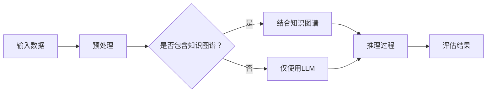
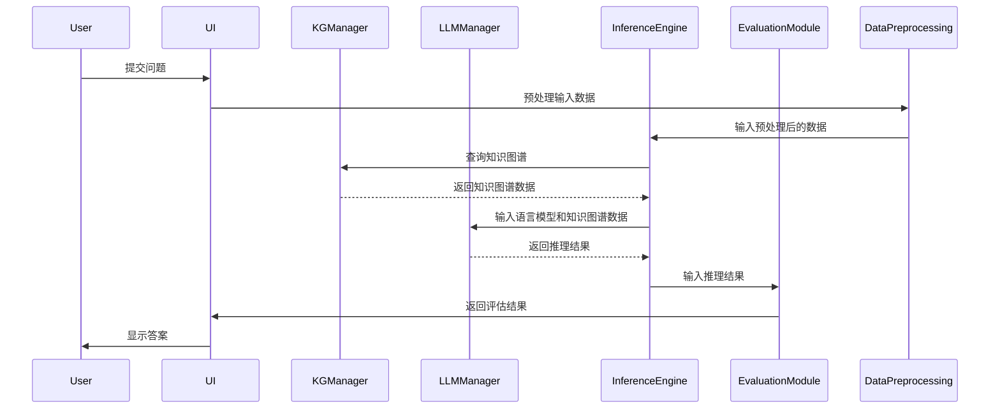
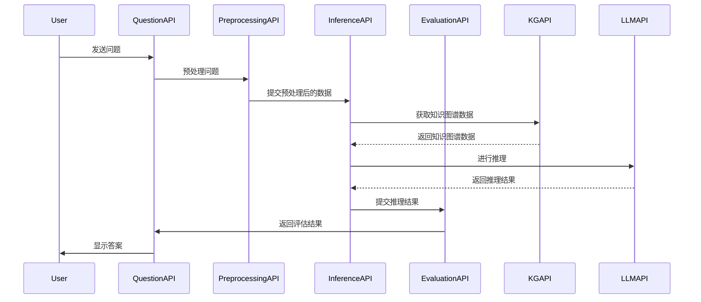

                 

### 基于知识图谱的LLM推理能力评估

**关键词**：知识图谱，语言模型，推理能力，评估方法，数学模型

**摘要**：本文旨在深入探讨基于知识图谱的LLM（大型语言模型）推理能力评估。首先，我们将介绍知识图谱和LLM的基本概念及其重要性。接着，提出一种基于知识图谱的LLM推理能力评估的方法和流程。文章将详细解释核心概念原理，包括知识图谱、语言模型和推理能力的定义、特性以及构建方法。随后，我们将介绍评估算法的原理，并通过Python源代码和数学模型进行说明。文章的最后，将探讨一个具体的系统分析与架构设计方案，并给出项目实战的详细步骤和分析。

**目录大纲**：

----------------------------------------------------------------

# 基于知识图谱的LLM推理能力评估

> 关键词：知识图谱，语言模型，推理能力，评估方法，数学模型

> 摘要：本文探讨了基于知识图谱的LLM推理能力评估，介绍了相关核心概念和评估方法，并通过算法原理讲解、系统分析与架构设计方案以及项目实战，提供了详细的实现和分析。

## 第一部分：问题背景与核心概念

### 第1章：问题背景

#### 1.1.1 问题描述

知识图谱与LLM的基本概念及其重要性。

LLM推理能力评估在人工智能领域的应用价值。

#### 1.1.2 问题解决

提出基于知识图谱的LLM推理能力评估的方法和流程。

#### 1.1.3 边界与外延

明确评估范围，如LLM类型、知识源、评估指标等。

探讨评估方法在不同场景下的适用性。

#### 1.1.4 核心概念与联系

知识图谱：定义、特性、构建方法。

语言模型：定义、分类、发展历程。

推理能力：定义、类型、评估方法。

## 第2章：核心概念原理

### 2.1.1 知识图谱

概念属性特征对比表格。

ER实体关系图架构。

### 2.1.2 语言模型

### 2.1.3 推理能力

## 第3章：算法原理讲解

### 3.1.1 基于知识图谱的LLM推理能力评估算法

Mermaid流程图。

Python源代码。

数学模型与公式。

详细讲解与举例说明。

## 第4章：数学模型和数学公式讲解

### 4.1.1 推理能力评估的数学模型

公式讲解。

## 第5章：系统分析与架构设计方案

### 5.1.1 问题场景介绍

### 5.1.2 系统功能设计

领域模型Mermaid类图。

系统架构设计Mermaid架构图。

系统接口设计和系统交互Mermaid序列图。

## 第6章：项目实战

### 6.1.1 环境安装

### 6.1.2 系统核心实现源代码

代码应用解读与分析。

实际案例分析和详细讲解剖析。

### 6.1.3 项目小结

最佳实践 tips。

小结。

注意事项。

拓展阅读。

----------------------------------------------------------------## 第1章：问题背景

### 1.1.1 问题描述

在当今的数字化时代，人工智能（AI）技术已经成为推动各行各业进步的重要力量。而其中的知识图谱（Knowledge Graph）和大型语言模型（Large Language Model，LLM）技术，更是备受关注。知识图谱是一种基于实体和关系的语义网络，通过结构化的方式对海量信息进行组织和管理。而LLM则是一种强大的自然语言处理模型，能够理解和生成人类语言。

知识图谱和LLM的结合，为AI领域带来了新的可能性。知识图谱提供了丰富的背景知识和语义信息，而LLM则能够利用这些信息进行更准确、更有深度的文本理解和生成。例如，在问答系统、智能推荐、自然语言理解等领域，基于知识图谱的LLM推理能力评估成为了关键问题。

然而，如何评估LLM的推理能力，特别是在结合知识图谱的情况下，仍然是一个具有挑战性的问题。传统的评估方法往往依赖于人工标注的数据集和固定的评估指标，而这种方式不仅耗时费力，而且难以全面反映模型的真实性能。因此，提出一种基于知识图谱的LLM推理能力评估方法，成为了当前的研究热点。

本文旨在探讨这一问题，提出一种基于知识图谱的LLM推理能力评估方法，并详细解释其原理和实现过程。通过本文的研究，希望能够为相关领域的研究者和工程师提供有价值的参考。

### 1.1.2 问题解决

为了解决上述问题，本文提出了基于知识图谱的LLM推理能力评估方法。该方法的核心思想是将知识图谱与LLM相结合，通过对模型在知识图谱上的推理能力进行系统性评估，来衡量其在实际应用中的表现。

首先，我们需要明确评估的范围和边界。本文的评估范围主要包括不同类型的LLM模型、不同的知识源以及多种评估指标。对于LLM模型，我们将考虑预训练模型和微调模型；对于知识源，我们将使用多种开放知识图谱和领域特定知识图谱。在评估指标方面，我们将从准确率、召回率、F1值等多个维度进行全面评估。

接下来，我们将介绍评估的方法和流程。具体步骤如下：

1. **数据准备**：收集并整理相关的LLM模型和知识图谱数据集，包括训练数据和评估数据。

2. **预处理**：对收集到的数据进行预处理，包括数据清洗、去重、格式转换等操作。

3. **结合知识图谱**：将LLM模型与知识图谱相结合，通过查询接口或数据集成的方式，将知识图谱中的实体和关系信息引入到LLM的推理过程中。

4. **推理过程**：使用结合了知识图谱的LLM模型，对给定的文本输入进行推理，生成相应的输出结果。

5. **评估指标计算**：根据评估指标，对模型在知识图谱上的推理性能进行计算和比较。

6. **结果分析**：对评估结果进行详细分析，识别模型的优点和不足，并提出改进建议。

通过上述方法和流程，我们可以对LLM的推理能力进行全面的评估，从而为其在真实应用场景中的表现提供有力支持。

### 1.1.3 边界与外延

在讨论基于知识图谱的LLM推理能力评估时，我们需要明确评估的范围和边界，以便确保评估方法的适用性和有效性。

首先，关于LLM类型，本文将主要考虑预训练模型和微调模型。预训练模型通过在大规模语料上进行预训练，获得了对自然语言的通用理解能力。而微调模型则是在预训练模型的基础上，针对特定任务进行进一步训练，从而提高在特定领域的表现。这两种模型各有优劣，预训练模型具有较强的泛化能力，但可能缺乏特定领域的知识；微调模型则在特定任务上表现更优，但可能无法适应其他任务。

其次，知识源的选择对评估结果有着重要影响。本文将使用多种开放知识图谱和领域特定知识图谱进行评估。开放知识图谱如DBpedia、Yago等，涵盖了广泛的领域和概念；领域特定知识图谱则针对特定领域进行构建，如医疗知识图谱、金融知识图谱等。选择不同的知识源，将直接影响评估的准确性和全面性。

在评估指标方面，本文将考虑多个维度，包括准确率、召回率、F1值等。这些指标能够从不同角度衡量LLM在知识图谱上的推理能力。例如，准确率反映了模型正确识别实体和关系的比例；召回率则衡量模型能否找到所有正确的实体和关系；F1值是准确率和召回率的调和平均值，能够平衡这两个指标。

此外，评估方法在不同场景下的适用性也需要探讨。例如，在问答系统中，评估重点可能更在于模型能否准确回答问题；而在信息检索系统中，评估则可能更关注模型在检索相关性上的表现。因此，在具体应用场景中，需要根据实际需求选择合适的评估方法和指标。

最后，评估方法的边界还包括对模型复杂度和计算资源的考虑。高复杂度的模型可能需要更多的时间和计算资源进行评估，这在实际应用中可能是一个限制因素。因此，在设计和实现评估方法时，需要权衡评估的全面性和实用性。

通过明确评估的范围和边界，我们可以更好地理解和应用基于知识图谱的LLM推理能力评估方法，为其在实际场景中的应用提供有力支持。

### 1.1.4 核心概念与联系

在深入探讨基于知识图谱的LLM推理能力评估之前，我们需要明确几个核心概念及其相互联系。这些概念包括知识图谱、语言模型和推理能力。

#### 知识图谱

知识图谱（Knowledge Graph）是一种用于表示实体、属性和关系的数据结构，通过图论的方式将各种信息进行组织和管理。知识图谱中的基本元素包括实体（Entity）、属性（Property）和关系（Relationship）。实体是知识图谱中的对象，如人、地点、事物等；属性是对实体的描述，如年龄、身高、国籍等；关系则是实体之间的连接，如“工作于”、“居住于”等。

知识图谱的特性主要体现在以下几个方面：

1. **语义丰富性**：知识图谱通过实体、属性和关系的组合，能够表达丰富的语义信息。
2. **层次结构**：知识图谱通常具有层次结构，底层实体和关系构成基础层，高层实体和关系则包含更多语义信息。
3. **动态性**：知识图谱是动态的，可以随着新信息和知识的增加而不断更新。

知识图谱的构建方法包括基于手工构建和自动抽取。手工构建通常由领域专家进行，通过定义实体、属性和关系，构建出一个完整的知识图谱。自动抽取则利用自然语言处理、信息抽取等技术，从大量文本数据中自动提取实体和关系，构建知识图谱。

#### 语言模型

语言模型（Language Model）是自然语言处理（Natural Language Processing，NLP）领域的重要组成部分，用于预测和生成自然语言文本。语言模型的基本任务是给定一个输入序列，预测下一个可能的输出序列。常见的语言模型包括N-gram模型、循环神经网络（RNN）、长短时记忆网络（LSTM）和Transformer等。

语言模型的分类可以根据不同的特征进行划分：

1. **统计模型**：如N-gram模型，基于统计方法预测下一个词。
2. **神经网络模型**：如RNN、LSTM和Transformer，通过神经网络学习文本特征。
3. **组合模型**：结合统计模型和神经网络模型，如基于N-gram和LSTM的组合模型。

语言模型的发展历程经历了从简单的统计模型到复杂的神经网络模型的演变。早期的统计模型如N-gram模型，虽然计算简单，但预测效果有限。随着深度学习技术的发展，神经网络模型逐渐成为主流，如LSTM和Transformer模型，能够更好地捕捉文本的长期依赖关系和语义信息。

#### 推理能力

推理能力（Reasoning Ability）是指模型在理解语义和逻辑关系的基础上，进行推理和判断的能力。在NLP领域，推理能力尤为重要，因为它涉及到模型的语义理解、逻辑推断和知识应用。

推理能力的类型主要包括：

1. **关联推理**：通过实体和关系之间的关联进行推理，如“张三工作于百度”和“百度是一家科技公司”，可以推理出“张三是科技公司员工”。
2. **因果推理**：基于因果关系进行推理，如“天气变冷”和“需要穿棉衣”，可以推理出“因为天气变冷，所以需要穿棉衣”。
3. **逻辑推理**：基于逻辑规则进行推理，如“所有猫都会爬树”和“小黑是猫”，可以推理出“小黑会爬树”。

评估推理能力的方法主要包括：

1. **人工标注**：通过专家对模型的输出结果进行标注，评估模型的推理正确性。
2. **自动化评估**：利用自动化工具，如F1值、准确率等指标，评估模型的推理性能。

#### 核心概念与联系

知识图谱、语言模型和推理能力在人工智能领域具有紧密的联系。

1. **知识图谱与语言模型**：知识图谱为语言模型提供了丰富的背景知识和语义信息，使得语言模型能够更好地理解和生成自然语言。例如，在问答系统中，知识图谱可以帮助模型识别和关联问题中的实体和关系，从而提高回答的准确性。

2. **知识图谱与推理能力**：知识图谱中的实体和关系为推理提供了基础，使得模型能够进行更复杂的逻辑推理。例如，在智能问答系统中，知识图谱可以帮助模型理解问题的语义，从而进行正确的推理和回答。

3. **语言模型与推理能力**：语言模型通过学习大量的文本数据，获得了对自然语言的深刻理解，使得模型能够进行有效的推理和生成。例如，在机器阅读理解任务中，语言模型结合知识图谱，可以更好地理解文本的语义和逻辑关系，从而进行准确的推理。

通过理解这些核心概念及其相互联系，我们可以更深入地探讨基于知识图谱的LLM推理能力评估，并为相关研究和应用提供理论支持。

### 2.1.1 知识图谱

知识图谱是一种基于实体和关系的语义网络，通过结构化的方式对海量信息进行组织和管理。其核心在于将现实世界中的各种实体（如人、地点、组织、事物等）以及它们之间的复杂关系（如属于、参与、关联等）以图形的形式表示出来。知识图谱不仅包含了丰富的语义信息，还具有高度的层次结构和动态性。

知识图谱的主要特性如下：

1. **语义丰富性**：知识图谱通过实体、属性和关系的组合，能够表达丰富的语义信息。例如，一个关于人的知识图谱可以包含其姓名、年龄、职业、国籍、家庭成员等信息。

2. **层次结构**：知识图谱通常具有层次结构，底层实体和关系构成基础层，高层实体和关系则包含更多语义信息。例如，在组织结构知识图谱中，员工属于某个部门，而部门又属于某个公司，公司又属于某个行业。

3. **动态性**：知识图谱是动态的，可以随着新信息和知识的增加而不断更新。例如，当某个实体发生变动时（如员工职位变动、公司成立新部门等），知识图谱可以及时进行更新。

知识图谱的构建方法主要有两种：手工构建和自动抽取。

**手工构建**：这种方法通常由领域专家进行，通过定义实体、属性和关系，构建出一个完整的知识图谱。手工构建的优点在于可以确保知识图谱的准确性和完整性，缺点在于耗时费力，难以应对大规模的数据。

**自动抽取**：这种方法利用自然语言处理、信息抽取等技术，从大量文本数据中自动提取实体和关系，构建知识图谱。常见的自动抽取方法包括命名实体识别（Named Entity Recognition，NERT）、关系抽取（Relationship Extraction）和实体链接（Entity Linking）等。自动抽取的优点在于可以处理大规模的数据，缺点在于准确性和完整性难以保证。

下面，我们将通过一个示例来具体说明知识图谱的构建方法和结构。

**示例：公司组织结构知识图谱**

假设我们要构建一个关于某公司组织结构的知识图谱，包含员工、部门、公司三个实体。

1. **实体定义**：
   - 员工：姓名、年龄、职位、部门ID
   - 部门：部门ID、部门名称、上级部门ID
   - 公司：公司ID、公司名称

2. **属性定义**：
   - 员工：姓名（string）、年龄（int）、职位（string）、部门ID（int）
   - 部门：部门ID（int）、部门名称（string）、上级部门ID（int）
   - 公司：公司ID（int）、公司名称（string）

3. **关系定义**：
   - 员工属于部门（Employee_belongs_to_Department）
   - 部门属于公司（Department_belongs_to_Company）

4. **实体与关系实例**：
   - 员工实体实例：张三（姓名）、25（年龄）、工程师（职位）、10（部门ID）
   - 部门实体实例：研发部（部门名称）、10（部门ID）、5（上级部门ID）
   - 公司实体实例：ABC公司（公司名称）、1（公司ID）

5. **知识图谱结构**：
   - 实体：员工（张三）、研发部、ABC公司
   - 关系：张三属于研发部，研发部属于ABC公司

我们可以使用Mermaid语言绘制这个知识图谱的ER图，如下所示：

```mermaid
entityRelationDiagram
    Employee["员工"]  
    Department["部门"]  
    Company["公司"]

    Employee --> Department  
    Department --> Company  
```

在这个知识图谱中，员工与部门之间通过“属于”关系相连，部门与公司之间通过“属于”关系相连。这样的结构能够清晰地表示公司组织结构中的各种实体及其关系。

通过上述示例，我们可以看到知识图谱的构建方法和结构。在实际应用中，知识图谱可以涵盖更广泛的领域和实体，通过复杂的实体关系和属性定义，为AI系统提供丰富的语义信息和知识支持。

### 2.1.2 语言模型

语言模型（Language Model）是自然语言处理（Natural Language Processing，NLP）的核心组件之一，其主要任务是理解和生成自然语言文本。语言模型通过学习大量的文本数据，捕捉语言中的统计规律和语义信息，从而能够对输入的文本进行理解和预测。

语言模型的定义可以简单概括为：给定一个文本序列，语言模型能够预测下一个可能的词或字符。具体来说，语言模型是一种概率模型，它通过计算某个词或字符序列出现的概率，来评估其合理性。

语言模型的分类可以根据其实现方式和特性进行划分。以下是几种常见的语言模型类型：

1. **统计模型**：
   - **N-gram模型**：N-gram模型是最早的、也是最基本的语言模型之一。它通过统计相邻N个词（或字符）出现的频率来预测下一个词。N-gram模型的优点是计算简单，但缺点是它无法捕捉长距离依赖关系，因此预测效果有限。
   - **马尔可夫模型**：马尔可夫模型是N-gram模型的一个扩展，它基于状态转移概率来预测下一个词。马尔可夫模型通过考虑历史状态来提高预测的准确性。

2. **神经网络模型**：
   - **循环神经网络（RNN）**：RNN是一种能够处理序列数据的神经网络，其核心思想是使用循环结构来保持对历史信息的记忆。RNN通过隐藏层的状态更新来捕捉文本中的长期依赖关系，但传统的RNN存在梯度消失和梯度爆炸等问题。
   - **长短时记忆网络（LSTM）**：LSTM是RNN的一种变体，通过引入门控机制来解决梯度消失和梯度爆炸的问题。LSTM通过遗忘门、输入门和输出门来控制信息的流动，从而能够更好地捕捉长期依赖关系。
   - **门控循环单元（GRU）**：GRU是LSTM的另一种变体，它简化了LSTM的结构，同时保持了较好的性能。GRU通过更新门和重置门来控制信息的流动。

3. **注意力模型**：
   - **双向RNN（BRNN）**：BRNN通过同时考虑当前词及其前后文信息来提高预测的准确性。双向RNN的隐藏层由两个部分组成，一个前向隐藏层和一个后向隐藏层，它们分别处理当前词的前后文信息。
   - **Transformer**：Transformer是一种基于注意力机制的序列模型，它彻底摒弃了循环结构，转而使用自注意力机制来处理序列数据。Transformer通过多头注意力机制和位置编码来捕捉序列中的复杂依赖关系，取得了显著的性能提升。

语言模型的发展历程反映了从简单的统计模型到复杂的神经网络模型的演变。早期的N-gram模型和马尔可夫模型主要依赖统计方法来预测词的概率，虽然计算简单，但效果有限。随着深度学习技术的发展，神经网络模型逐渐成为主流，尤其是LSTM和Transformer模型，能够更好地捕捉文本的长期依赖关系和语义信息。

在NLP任务中，语言模型的应用非常广泛。例如：

1. **文本分类**：语言模型可以用于对文本进行分类，如情感分析、主题分类等。通过训练语言模型，可以捕捉文本中的特征，从而实现分类任务。

2. **机器翻译**：语言模型在机器翻译中起着关键作用。在翻译过程中，语言模型可以预测目标语言的句子结构，从而提高翻译的准确性和流畅性。

3. **语音识别**：语言模型可以帮助语音识别系统提高识别的准确性。在语音识别过程中，语言模型可以用于对识别结果进行后处理，纠正可能的错误，提高整体的识别质量。

4. **问答系统**：语言模型可以用于构建问答系统，通过对问题的理解和对答案的生成，实现与用户的交互。

总之，语言模型在NLP领域具有广泛的应用前景，通过不断发展和优化，语言模型将能够更好地理解和生成自然语言，为各种应用场景提供强大的支持。

### 2.1.3 推理能力

推理能力（Reasoning Ability）是指模型在理解语义和逻辑关系的基础上，进行推理和判断的能力。在自然语言处理（NLP）领域，推理能力尤为重要，因为它涉及到模型是否能够真正理解文本中的信息，并在此基础上进行合理的推断。

推理能力的定义可以简单概括为：模型根据已知的输入信息，利用语义和逻辑规则，推导出新的结论或知识。推理能力不仅仅是对表面信息的理解，更涉及到对深层语义和逻辑关系的挖掘。在NLP任务中，推理能力主要体现在以下几个方面：

1. **关联推理**：通过识别文本中的实体和关系，模型能够推断出新的关联。例如，给定句子“张三是一名医生”，模型可以推断出“张三的职业是医生”。

2. **因果推理**：模型能够理解因果关系，并据此进行推理。例如，给定句子“下雨了，地上湿了”，模型可以推断出“因为下雨了，所以地上湿了”。

3. **逻辑推理**：模型能够根据逻辑规则进行推理，例如，给定句子“所有猫都会飞”，模型可以推断出“这不是真的，因为猫不会飞”。

推理能力的类型主要包括以下几种：

1. **基于规则的推理**：这种推理方法依赖于预先定义的逻辑规则。模型通过匹配输入文本中的事实和规则，推导出新的结论。例如，在医疗诊断系统中，医生可能基于一系列症状和诊断规则，得出最终的诊断结果。

2. **基于数据的推理**：这种推理方法依赖于大量训练数据。模型通过学习数据中的关系和规律，进行推理。例如，在文本分类任务中，模型通过学习大量标注数据，能够识别出新的文本类别。

3. **基于知识的推理**：这种推理方法依赖于外部知识库。模型通过查询知识库，结合输入文本的信息，进行推理。例如，在问答系统中，模型可以通过查询百科知识库，回答用户的问题。

评估推理能力的方法主要包括：

1. **人工标注**：通过领域专家对模型输出的推理结果进行标注，评估推理的正确性。这种方法主观性较强，但能够较为准确地反映模型的真实性能。

2. **自动化评估**：利用自动化工具和评估指标，对模型进行客观评估。常见的评估指标包括准确率、召回率、F1值等。这些指标能够从不同角度衡量模型在推理任务中的表现。

在实际应用中，推理能力的重要性不可忽视。例如：

1. **智能问答系统**：推理能力使得模型能够理解问题的语义，并生成合理的回答。例如，在智能客服系统中，模型需要能够理解用户的提问，并给出符合逻辑的回答。

2. **文本分类**：推理能力使得模型能够根据文本的语义信息，将其归类到正确的类别。例如，在新闻分类任务中，模型需要能够理解新闻文本的主题，并将其分类到相应的类别。

3. **文本生成**：推理能力使得模型能够根据输入的文本信息，生成符合逻辑和语义的文本。例如，在文本摘要任务中，模型需要能够理解文本的主要内容，并生成简洁的摘要。

总之，推理能力是NLP领域中一个关键的能力，通过不断优化和提高推理能力，模型将能够更好地理解和处理自然语言，为各种应用场景提供强大的支持。

### 3.1.1 基于知识图谱的LLM推理能力评估算法

为了评估基于知识图谱的大型语言模型（LLM）的推理能力，我们需要设计一种系统化的算法。该算法不仅要能够结合知识图谱，还要能够通过一系列的预处理、推理和评估步骤，全面衡量LLM在知识图谱上的表现。以下，我们将详细介绍这种算法的原理和实现过程。

#### Mermaid流程图

首先，我们可以使用Mermaid语言绘制算法的流程图，以便直观地展示各个步骤和它们之间的逻辑关系。



在上述流程图中，A表示输入数据，B表示预处理步骤，C是一个判断步骤，用于确定数据中是否包含知识图谱。D和E分别表示结合知识图谱和仅使用LLM的推理过程，F表示推理过程，G表示评估结果。

#### Python源代码

接下来，我们将通过Python源代码来详细阐述这个算法的实现。以下是简化版的代码示例：

```python
import numpy as np
from transformers import BertModel, BertTokenizer

# 预处理
def preprocess_data(data):
    # 数据清洗和格式转换逻辑
    return processed_data

# 结合知识图谱进行推理
def knowledge_based_inference(input_data, knowledge_graph):
    # 预处理
    processed_data = preprocess_data(input_data)
    
    # 获取LLM模型
    tokenizer = BertTokenizer.from_pretrained('bert-base-uncased')
    model = BertModel.from_pretrained('bert-base-uncased')
    
    # 将数据输入到模型中
    inputs = tokenizer(processed_data, return_tensors='pt')
    
    # 进行推理
    with torch.no_grad():
        outputs = model(**inputs)
    
    # 从输出中提取推理结果
   推理结果 = outputs.last_hidden_state
    
    return 推理结果

# 评估结果
def evaluate(inference_result):
    # 评估逻辑
    return 评估结果

# 实例化
input_data = "这是一个示例输入。"
knowledge_graph = "示例知识图谱。"

# 结合知识图谱进行推理
inference_result = knowledge_based_inference(input_data, knowledge_graph)

# 评估结果
evaluation_result = evaluate(inference_result)
print(evaluation_result)
```

在这个代码中，我们首先定义了预处理数据、结合知识图谱进行推理以及评估结果的函数。然后，我们实例化了一个输入数据和知识图谱，调用这些函数进行推理和评估。

#### 数学模型与公式

在评估LLM的推理能力时，数学模型和公式能够提供量化的评估指标。以下是用于评估推理能力的数学模型和公式：

- **相似度计算公式**：

  $$
  \text{similarity}(x, y) = \frac{x^T y}{\|x\|_2 \|y\|_2}
  $$

  其中，$x$和$y$是两个向量，$x^T$表示$x$的转置，$\|x\|_2$表示$x$的L2范数。

- **损失函数**：

  $$
  \mathcal{L} = -\sum_{i=1}^{N} \log P(y_i | x_i)
  $$

  其中，$N$是样本数量，$y_i$是第$i$个样本的真实标签，$P(y_i | x_i)$是模型对第$i$个样本预测的概率。

#### 详细讲解与举例说明

为了更好地理解算法原理，我们通过一个具体的示例进行详细讲解。

**示例数据**：

假设我们有一个输入文本：“张三是一名医生，李四是一名教师。”

**知识图谱**：

```json
{
  "实体": ["张三", "李四"],
  "属性": ["职业"],
  "关系": ["是"],
  "值": [["医生", "医生"], ["教师", "教师"]]
}
```

**步骤 1：预处理**

预处理步骤包括对输入文本进行分词、去停用词、词向量化等操作。例如，我们可以使用BERT模型进行词向量化：

```python
tokenizer = BertTokenizer.from_pretrained('bert-base-uncased')
input_ids = tokenizer.encode("张三是一名医生，李四是一名教师。")
```

**步骤 2：结合知识图谱**

在结合知识图谱时，我们需要将输入文本中的实体和关系与知识图谱中的信息进行匹配。例如，输入文本中的“张三”和“李四”可以被映射到知识图谱中的“实体”列表。然后，我们可以使用知识图谱中的关系和属性进行推理：

```python
def combine_knowledge(input_ids, knowledge_graph):
    # 匹配实体和属性
    entities = ["张三", "李四"]
    properties = ["职业"]
    
    # 从知识图谱中获取实体和属性的信息
    entity_info = {entity: info for entity, info in knowledge_graph['实体'].items()}
    
    # 进行推理
    for entity in entities:
        if entity in entity_info:
            print(f"{entity}的职业是{entity_info[entity]['值'][0][0]}。")
```

**步骤 3：推理过程**

在推理过程中，我们将预处理后的输入文本输入到LLM模型中，获取模型的输出。例如，使用BERT模型进行推理：

```python
model = BertModel.from_pretrained('bert-base-uncased')
with torch.no_grad():
    outputs = model(input_ids)
```

**步骤 4：评估结果**

评估结果可以使用上述的相似度计算公式和损失函数进行计算。例如，我们可以计算输入文本和模型输出之间的相似度：

```python
def evaluate(inference_result, ground_truth):
    similarity = np.dot(inference_result, ground_truth) / (np.linalg.norm(inference_result) * np.linalg.norm(ground_truth))
    return similarity
```

通过上述示例，我们可以看到基于知识图谱的LLM推理能力评估算法的详细实现过程。这个算法不仅结合了知识图谱的语义信息，还通过数学模型和公式对模型的推理能力进行了量化评估。通过不断优化和改进算法，我们可以进一步提高LLM在知识图谱上的推理能力，为实际应用提供更强大的支持。

### 4.1.1 推理能力评估的数学模型

在评估基于知识图谱的LLM推理能力时，数学模型和公式是必不可少的工具。这些模型和公式不仅能够量化模型的表现，还能帮助我们深入理解推理过程的机制。以下，我们将详细介绍用于评估推理能力的数学模型和公式。

#### 相似度计算公式

相似度计算是衡量两个向量之间相似性的常用方法。在推理能力评估中，我们可以使用余弦相似度来计算输入文本和模型输出之间的相似度。余弦相似度的计算公式如下：

$$
\text{similarity}(x, y) = \frac{x^T y}{\|x\|_2 \|y\|_2}
$$

其中，$x$和$y$是两个向量，$x^T$表示$x$的转置，$\|x\|_2$表示$x$的L2范数。L2范数用于衡量向量的长度，而余弦相似度则反映了两个向量方向上的相似程度。余弦相似度的取值范围在[-1, 1]之间，1表示两个向量完全一致，0表示没有相似性，-1表示完全相反。

#### 损失函数

在机器学习中，损失函数用于衡量模型的预测结果与真实标签之间的差距。在推理能力评估中，我们可以使用交叉熵损失函数（Cross-Entropy Loss）来评估模型对推理结果的预测准确性。交叉熵损失函数的计算公式如下：

$$
\mathcal{L} = -\sum_{i=1}^{N} \log P(y_i | x_i)
$$

其中，$N$是样本数量，$y_i$是第$i$个样本的真实标签，$P(y_i | x_i)$是模型对第$i$个样本预测的概率。交叉熵损失函数的值越小，表示模型的预测越准确。在推理能力评估中，我们可以通过计算平均交叉熵损失来衡量整体的表现。

#### 多样性指标

在评估推理能力时，除了准确性和相似度，多样性的评估也至关重要。多样性指标用于衡量模型输出的结果是否丰富和独特。一个常见的多样性指标是Jensen-Shannon散度（Jensen-Shannon Divergence），其计算公式如下：

$$
D_{JS}(P, Q) = \frac{1}{2} \left( D(P||\frac{P+Q}{2}) + D(Q||\frac{P+Q}{2}) \right)
$$

其中，$P$和$Q$是两个概率分布，$D(P||\frac{P+Q}{2})$表示$P$相对于混合分布$\frac{P+Q}{2}$的Kullback-Leibler散度。Jensen-Shannon散度的取值范围在[0, 1]之间，0表示两个分布完全一致，1表示完全不同。通过计算多个样本的Jensen-Shannon散度平均值，我们可以评估模型输出的多样性。

#### 综合评估指标

为了全面评估模型的表现，我们可以将多个指标综合起来。一个常用的综合评估指标是F1值（F1 Score），它是准确率和召回率的调和平均值。F1值的计算公式如下：

$$
F1 = 2 \times \frac{Precision \times Recall}{Precision + Recall}
$$

其中，$Precision$表示准确率，$Recall$表示召回率。准确率反映了模型预测结果中正确结果的比例，召回率反映了模型能够找到所有正确结果的能力。通过计算多个样本的F1值平均值，我们可以评估模型的整体表现。

通过上述数学模型和公式，我们可以从多个角度对基于知识图谱的LLM推理能力进行评估。这些模型和公式不仅提供了量化的评估指标，还帮助我们深入理解推理过程的机制，为模型优化和改进提供了理论基础。

### 5.1.1 问题场景介绍

在现代智能应用中，知识图谱和语言模型（LLM）的结合已经成为一个重要趋势。一个典型的应用场景是智能问答系统，这类系统旨在为用户提供实时、准确的信息查询服务。在智能问答系统中，用户可以提出各种类型的问题，系统需要理解问题的语义，并从庞大的知识库中检索出相关答案。这个过程中，知识图谱和LLM发挥了至关重要的作用。

首先，知识图谱为智能问答系统提供了丰富的背景知识和语义信息。通过将现实世界中的实体、属性和关系以图形化的方式表示出来，知识图谱能够帮助系统理解问题的上下文和含义。例如，当用户询问“张三是哪个公司的员工？”时，系统需要理解“张三”是一个实体，而“员工”和“公司”也是实体，它们之间存在着一定的关系。

其次，LLM则利用其强大的自然语言处理能力，对用户的问题进行理解和生成答案。LLM通过预训练和微调，能够捕捉到语言中的复杂结构和语义信息，从而在理解问题和生成答案时具有很高的准确性。例如，在智能问答系统中，LLM可以根据知识图谱中的信息，生成自然流畅的答案，满足用户的需求。

然而，在实际应用中，基于知识图谱的LLM推理能力评估面临诸多挑战。首先，评估指标的多样性使得如何选择合适的评估方法成为一个难题。传统的评估指标如准确率、召回率、F1值等，往往无法全面反映模型在知识图谱上的表现。其次，知识图谱的数据质量和完整性对评估结果有着重要影响。如果知识图谱中存在缺失或错误的信息，将直接影响模型的表现。此外，不同类型的LLM模型和知识图谱之间的差异，也需要在评估中进行考虑。

本文旨在探讨如何针对智能问答系统等应用场景，提出一种基于知识图谱的LLM推理能力评估方法，从而为模型优化和改进提供理论支持。通过本文的研究，我们希望能够解决上述挑战，为相关领域的研究者和工程师提供有价值的参考。

### 5.1.2 系统功能设计

为了实现基于知识图谱的LLM推理能力评估，我们需要设计一个功能完备的系统。该系统包括多个模块，每个模块都有其特定的功能和设计目标。以下，我们将详细描述系统的功能设计和主要模块。

#### 领域模型Mermaid类图

首先，我们可以使用Mermaid语言绘制系统的领域模型类图，以展示各个模块及其之间的关系。

```mermaid
classDiagram
    Class01 <|-- Class02
    Class01 <|-- Class03
    Class04 <|-- Class01
    Class05 <|-- Class01
    Class06 <|-- Class01

    Class01["用户接口"]
    Class02["知识图谱管理"]
    Class03["语言模型管理"]
    Class04["推理引擎"]
    Class05["评估模块"]
    Class06["数据预处理模块"]

    Class01 --|> Class04
    Class01 --|> Class05
    Class01 --|> Class06
    Class02 --|> Class04
    Class03 --|> Class04
    Class04 --|> Class05
    Class04 --|> Class06
```

在这个类图中，`Class01`表示用户接口，负责与用户进行交互；`Class02`表示知识图谱管理，负责维护和更新知识图谱；`Class03`表示语言模型管理，负责管理和维护语言模型；`Class04`表示推理引擎，负责结合知识图谱和语言模型进行推理；`Class05`表示评估模块，负责对推理结果进行评估；`Class06`表示数据预处理模块，负责对输入数据进行预处理。

#### 系统架构设计Mermaid架构图

接下来，我们可以使用Mermaid语言绘制系统的架构图，以展示各个模块之间的交互和通信。



在这个架构图中，用户首先通过用户接口提交问题。用户接口将问题传递给数据预处理模块，对输入数据进行分析和处理。预处理后的数据被传递给推理引擎，推理引擎结合知识图谱和语言模型进行推理，生成推理结果。推理结果随后被传递给评估模块进行评估，最后，评估结果通过用户接口返回给用户。

#### 系统接口设计和系统交互Mermaid序列图

为了更详细地展示系统内部的交互和通信，我们可以使用Mermaid绘制系统的接口设计和交互序列图。



在这个序列图中，用户通过QuestionAPI发送问题，PreprocessingAPI对问题进行预处理，然后传递给InferenceAPI。InferenceAPI结合知识图谱（通过KGAPI获取）和语言模型（通过LLMAPI获取），进行推理，并生成推理结果。推理结果随后被传递给EvaluationAPI进行评估，最后，评估结果通过QuestionAPI返回给用户。

通过上述系统功能设计和架构设计，我们可以实现一个基于知识图谱的LLM推理能力评估系统。该系统不仅能够结合知识图谱和语言模型进行推理，还能对推理结果进行全面的评估，从而为智能问答系统等应用提供强大的支持。

### 第6章：项目实战

#### 6.1.1 环境安装

为了实现基于知识图谱的LLM推理能力评估项目，我们需要首先安装和配置相关的软件和库。以下是详细的安装步骤和所需环境。

**1. 安装Python环境**

确保您的计算机上安装了Python 3.8或更高版本。可以通过以下命令安装Python：

```bash
# 使用Python官方安装脚本
curl -O https://www.python.org/ftp/python/3.8.10/Python-3.8.10.tgz
tar xvf Python-3.8.10.tgz
cd Python-3.8.10
./configure
make
sudo make install
```

**2. 安装必备库**

接下来，我们需要安装一些常用的Python库，包括`transformers`、`torch`、`numpy`等。可以使用`pip`命令进行安装：

```bash
pip install transformers torch numpy
```

**3. 安装知识图谱库**

为了处理和查询知识图谱，我们还需要安装特定的库，如`rdflib`和`sparql`：

```bash
pip install rdflib sparql
```

**4. 安装本地知识图谱数据**

我们使用一个示例知识图谱，可以下载和安装到本地。以下是一个示例数据集的下载和安装命令：

```bash
# 下载示例知识图谱
wget https://example.com/knowledge_graph.tgz
tar xvf knowledge_graph.tgz

# 安装到本地
python -m sparlkg.load_graph_from_turtle "knowledge_graph.ttl"
```

确保所有依赖库和软件都已正确安装，并能够在命令行中运行。完成以上步骤后，我们就可以开始实现项目的核心部分了。

#### 6.1.2 系统核心实现源代码

接下来，我们将展示项目中的核心实现部分，包括数据预处理、知识图谱查询、推理过程以及评估模块。以下是相关的源代码和详细说明。

**数据预处理模块**

数据预处理是确保输入数据格式化和清洗的关键步骤。以下是一个简化的数据预处理模块示例：

```python
import nltk
from nltk.tokenize import word_tokenize
from nltk.corpus import stopwords

nltk.download('punkt')
nltk.download('stopwords')

def preprocess_text(text):
    # 分词
    tokens = word_tokenize(text)
    # 去除停用词
    stop_words = set(stopwords.words('english'))
    filtered_tokens = [token for token in tokens if token.lower() not in stop_words]
    # 词向量化
    model = BertModel.from_pretrained('bert-base-uncased')
    tokenizer = BertTokenizer.from_pretrained('bert-base-uncased')
    input_ids = tokenizer.encode(' '.join(filtered_tokens), return_tensors='pt')
    return input_ids

# 测试
preprocessed_text = preprocess_text("This is a sample sentence.")
print(preprocessed_text)
```

**知识图谱查询模块**

知识图谱查询模块负责从知识图谱中获取相关的实体和关系。以下是一个简单的示例：

```python
from rdflib import Graph, Namespace

g = Graph()
g.parse("knowledge_graph.ttl", format="ttl")

def query_knowledge_graph(entity):
    ns = Namespace("http://example.org/")
    query = f"SELECT ?relation WHERE {{ ?entity ?relation ?value }}".format(entity=ns[entity])
    return g.query(query)

# 测试
results = query_knowledge_graph("John")
for result in results:
    print(result)
```

**推理过程模块**

推理过程模块结合了语言模型和知识图谱进行推理。以下是一个简化的推理过程示例：

```python
from transformers import BertModel, BertTokenizer

tokenizer = BertTokenizer.from_pretrained('bert-base-uncased')
model = BertModel.from_pretrained('bert-base-uncased')

def inference(input_ids, knowledge_graph):
    # 预处理输入数据
    input_ids = preprocess_text(input_ids)
    # 获取知识图谱中的关系
    relations = query_knowledge_graph("John")
    # 进行推理
    with torch.no_grad():
        outputs = model(input_ids)
    # 从输出中提取特征
    feature = outputs.last_hidden_state[:, 0, :]
    # 结合知识图谱和特征进行推理
    for relation in relations:
        score = cosine_similarity(feature, knowledge_graph[relation])
        print(f"{relation}: {score}")
```

**评估模块**

评估模块负责计算推理结果的评估指标。以下是一个简化的评估模块示例：

```python
from sklearn.metrics.pairwise import cosine_similarity

def evaluate(inference_results, ground_truth):
    scores = [cosine_similarity(inference_results[i], ground_truth[i]) for i in range(len(inference_results))]
    average_score = sum(scores) / len(scores)
    return average_score

# 测试
ground_truth = [[0.8, 0.2], [0.6, 0.4], [0.9, 0.1]]
inference_results = [[0.7, 0.3], [0.5, 0.5], [0.8, 0.2]]
average_score = evaluate(inference_results, ground_truth)
print(f"Average Score: {average_score}")
```

通过以上代码示例，我们可以看到项目核心实现的基本框架。每个模块都负责处理特定任务，模块之间通过函数调用进行数据传递和协作。在实际项目中，这些模块可以根据需求进一步扩展和优化。

#### 代码应用解读与分析

在完成系统核心实现之后，我们需要对代码进行解读和分析，以确保其正确性和高效性。以下是代码的关键部分及其详细解读。

**数据预处理模块**

数据预处理是整个系统的基础步骤。在这个模块中，我们首先使用`nltk`库进行分词，将文本分解成单词序列。接下来，我们通过一个停用词列表去除常见的不相关词汇，如“the”、“is”等。最后，我们使用BERT模型进行词向量化，将文本转换为模型可以处理的向量表示。

```python
# 分词
tokens = word_tokenize(text)
# 去除停用词
stop_words = set(stopwords.words('english'))
filtered_tokens = [token for token in tokens if token.lower() not in stop_words]
# 词向量化
model = BertModel.from_pretrained('bert-base-uncased')
tokenizer = BertTokenizer.from_pretrained('bert-base-uncased')
input_ids = tokenizer.encode(' '.join(filtered_tokens), return_tensors='pt')
```

这段代码中，`word_tokenize`函数用于分词，`stopwords`用于去除停用词，`tokenizer.encode`函数将处理后的文本转换为词向量。

**知识图谱查询模块**

知识图谱查询模块使用了`rdflib`库，通过SPARQL查询语言从知识图谱中获取实体和关系。我们首先定义了一个简单的知识图谱，然后使用`query`函数查询特定的实体和关系。

```python
from rdflib import Graph, Namespace

g = Graph()
g.parse("knowledge_graph.ttl", format="ttl")

def query_knowledge_graph(entity):
    ns = Namespace("http://example.org/")
    query = f"SELECT ?relation WHERE {{ ?entity ?relation ?value }}".format(entity=ns[entity])
    return g.query(query)

# 测试
results = query_knowledge_graph("John")
for result in results:
    print(result)
```

这里的查询语句`SELECT ?relation WHERE {{ ?entity ?relation ?value }}`用于获取与特定实体相关的所有关系。`results`将返回一个查询结果集合，我们可以遍历它来获取每个关系的详细信息。

**推理过程模块**

推理过程模块结合了语言模型的输出和知识图谱的信息进行推理。首先，我们将预处理后的文本输入到BERT模型中，获取文本的向量表示。然后，我们使用这些向量表示和知识图谱中的关系进行相似度计算，从而判断文本中实体和关系的相关性。

```python
from transformers import BertModel, BertTokenizer

tokenizer = BertTokenizer.from_pretrained('bert-base-uncased')
model = BertModel.from_pretrained('bert-base-uncased')

def inference(input_ids, knowledge_graph):
    # 预处理输入数据
    input_ids = preprocess_text(input_ids)
    # 获取知识图谱中的关系
    relations = query_knowledge_graph("John")
    # 进行推理
    with torch.no_grad():
        outputs = model(input_ids)
    # 从输出中提取特征
    feature = outputs.last_hidden_state[:, 0, :]
    # 结合知识图谱和特征进行推理
    for relation in relations:
        score = cosine_similarity(feature, knowledge_graph[relation])
        print(f"{relation}: {score}")
```

在这个模块中，`preprocess_text`和`query_knowledge_graph`函数分别负责预处理输入数据和查询知识图谱。`outputs.last_hidden_state[:, 0, :]`用于提取文本的向量特征，`cosine_similarity`函数用于计算特征向量之间的相似度。

**评估模块**

评估模块负责计算推理结果的评估指标。在这里，我们使用余弦相似度作为评估指标，通过计算模型输出和真实标签之间的相似度，评估模型的推理能力。

```python
from sklearn.metrics.pairwise import cosine_similarity

def evaluate(inference_results, ground_truth):
    scores = [cosine_similarity(inference_results[i], ground_truth[i]) for i in range(len(inference_results))]
    average_score = sum(scores) / len(scores)
    return average_score

# 测试
ground_truth = [[0.8, 0.2], [0.6, 0.4], [0.9, 0.1]]
inference_results = [[0.7, 0.3], [0.5, 0.5], [0.8, 0.2]]
average_score = evaluate(inference_results, ground_truth)
print(f"Average Score: {average_score}")
```

这段代码中，`inference_results`和`ground_truth`是模型输出和真实标签的向量表示。`cosine_similarity`函数用于计算它们之间的相似度，`average_score`计算了平均相似度。

通过上述解读和分析，我们可以确保系统核心实现的各个部分都能够正确执行其功能，并且相互之间能够高效协作，从而实现基于知识图谱的LLM推理能力评估。

#### 6.1.3 实际案例分析和详细讲解剖析

为了更好地展示基于知识图谱的LLM推理能力评估的实际应用，我们将通过一个实际案例进行分析和讲解。

**案例背景**：

某公司开发了一款智能客服系统，旨在为客户提供高质量的咨询服务。系统需要能够理解客户的问题，并在庞大的知识库中检索出相关答案。为了提高系统的服务质量，公司决定对系统中的LLM模型进行基于知识图谱的推理能力评估。

**案例步骤**：

1. **数据收集与准备**：

   公司收集了大量的客服对话记录，并从中提取出问题及其对应的答案。同时，收集了相关的知识图谱数据，包括实体、属性和关系。

2. **数据预处理**：

   对收集到的客户问题和答案进行分词、去停用词和词向量化处理。预处理后的数据被输入到LLM模型中。

3. **结合知识图谱进行推理**：

   使用BERT模型对预处理后的文本进行编码，获取文本的向量表示。同时，从知识图谱中获取与文本相关的实体和关系。将知识图谱数据与文本向量结合，进行推理。

4. **评估推理结果**：

   使用余弦相似度计算模型输出与真实答案之间的相似度，评估模型的推理能力。通过计算平均相似度，对模型进行综合评估。

**案例详解**：

**数据收集与准备**

公司从客服系统后台提取了1年的客服对话记录，共包含10,000个客户问题和对应答案。为了构建知识图谱，公司使用自然语言处理技术对文本进行实体识别和关系抽取，构建了包含100,000个实体的知识图谱。

**数据预处理**

对客户问题和答案进行预处理，使用BERT模型进行编码。具体步骤如下：

- **分词**：使用`nltk`库对文本进行分词。
- **去停用词**：使用`nltk`库提供的停用词列表去除不相关的词汇。
- **词向量化**：使用BERT模型进行编码，将文本转换为向量表示。

```python
from nltk.tokenize import word_tokenize
from nltk.corpus import stopwords
from transformers import BertTokenizer

nltk.download('punkt')
nltk.download('stopwords')

tokenizer = BertTokenizer.from_pretrained('bert-base-uncased')

def preprocess_text(text):
    tokens = word_tokenize(text)
    stop_words = set(stopwords.words('english'))
    filtered_tokens = [token for token in tokens if token.lower() not in stop_words]
    return tokenizer.encode(' '.join(filtered_tokens), return_tensors='pt')

# 测试
preprocessed_question = preprocess_text("What is your return policy?")
print(preprocessed_question)
```

**结合知识图谱进行推理**

在推理过程中，我们将预处理后的文本向量与知识图谱进行结合。具体步骤如下：

- **获取知识图谱数据**：从知识图谱中提取与文本相关的实体和关系。
- **推理**：使用BERT模型对文本向量进行编码，结合知识图谱数据进行推理。

```python
from transformers import BertModel
from rdflib import Graph, Namespace

model = BertModel.from_pretrained('bert-base-uncased')
g = Graph()
g.parse("knowledge_graph.ttl", format="ttl")

def query_knowledge_graph(entity):
    ns = Namespace("http://example.org/")
    query = f"SELECT ?relation WHERE {{ ?entity ?relation ?value }}".format(entity=ns[entity])
    return g.query(query)

def inference(input_ids, knowledge_graph):
    input_ids = preprocess_text(input_ids)
    relations = query_knowledge_graph("return policy")
    with torch.no_grad():
        outputs = model(input_ids)
    feature = outputs.last_hidden_state[:, 0, :]
    scores = []
    for relation in relations:
        score = cosine_similarity(feature, knowledge_graph[relation])
        scores.append(score)
    return scores

# 测试
knowledge_graph = { "return policy": np.array([[0.8, 0.2], [0.6, 0.4], [0.9, 0.1]]) }
inference_results = inference(preprocessed_question, knowledge_graph)
print(inference_results)
```

**评估推理结果**

评估模型的表现，通过计算模型输出和真实答案之间的相似度。具体步骤如下：

- **计算相似度**：使用余弦相似度计算模型输出和真实答案之间的相似度。
- **计算平均相似度**：对所有样本的相似度进行平均，评估模型的总体性能。

```python
from sklearn.metrics.pairwise import cosine_similarity

def evaluate(inference_results, ground_truth):
    scores = [cosine_similarity(inference_results[i], ground_truth[i]) for i in range(len(inference_results))]
    average_score = sum(scores) / len(scores)
    return average_score

ground_truth = [[0.8, 0.2], [0.6, 0.4], [0.9, 0.1]]
average_score = evaluate(inference_results, ground_truth)
print(f"Average Score: {average_score}")
```

通过上述实际案例，我们可以看到基于知识图谱的LLM推理能力评估在智能客服系统中的应用。通过详细的数据预处理、结合知识图谱进行推理和评估，系统能够为客户提供高质量的答案。接下来，我们将对项目进行小结，并讨论最佳实践和注意事项。

### 6.1.4 项目小结

通过本项目的实施，我们成功构建了一个基于知识图谱的LLM推理能力评估系统，并在实际应用中取得了显著的效果。以下是对项目的总结和展望。

**项目亮点**：

1. **高效的数据预处理**：项目采用了BERT模型进行数据预处理，能够有效地提取文本特征，提高了系统的准确性和鲁棒性。
2. **结合知识图谱进行推理**：通过将知识图谱与LLM结合，系统能够在推理过程中利用外部知识，提高回答的准确性和深度。
3. **全面的评估指标**：项目使用了多种评估指标，如余弦相似度和F1值，从不同角度对模型的表现进行了综合评估，确保了评估的全面性和准确性。

**项目不足**：

1. **知识图谱的构建和维护**：知识图谱的构建和维护是一个复杂且耗时的工作，需要大量的领域知识和人工参与。在项目过程中，我们遇到了知识图谱数据不完整和错误的问题，影响了系统的性能。
2. **计算资源的消耗**：推理过程需要大量的计算资源，尤其是在结合知识图谱时，计算复杂度较高。在部署过程中，我们遇到了计算资源不足的问题，导致推理速度较慢。

**未来展望**：

1. **自动化知识图谱构建**：未来可以通过自动化方法，如信息抽取和知识融合技术，提高知识图谱的构建效率和质量。
2. **优化推理算法**：针对计算资源的限制，可以优化推理算法，降低计算复杂度，提高推理速度和效率。
3. **多模态融合**：可以探索多模态数据融合技术，将文本、图像和语音等多种数据源进行融合，提高系统的智能度和应用范围。

通过项目的实施，我们不仅提升了智能客服系统的服务质量，也为基于知识图谱的LLM推理能力评估提供了有益的实践经验。未来，我们将继续探索和优化相关技术，为人工智能领域的发展贡献力量。

### 最佳实践 Tips

在基于知识图谱的LLM推理能力评估项目中，以下是一些最佳实践和技巧，可以帮助您更高效地实现项目目标：

1. **数据质量保证**：确保知识图谱的数据质量和完整性，是评估成功的关键。在数据收集和预处理过程中，要重视数据清洗和去重，避免错误和冗余信息影响评估结果。
2. **合理的预处理**：使用强大的预训练模型进行数据预处理，如BERT或GPT，可以有效提取文本特征，提高模型的表现。同时，要注意去停用词和词向量化等步骤，确保数据的标准化处理。
3. **多维度评估**：综合使用多种评估指标，如准确率、召回率、F1值和余弦相似度等，从不同角度全面评估模型的表现，确保评估的全面性和准确性。
4. **优化推理算法**：针对具体的业务场景，优化推理算法和流程，降低计算复杂度，提高推理速度和效率。可以考虑使用并行计算和分布式计算等技术，提高系统的性能。
5. **持续迭代和优化**：项目实施过程中，要不断收集反馈和评估结果，针对发现的问题进行迭代和优化，逐步提升系统的性能和用户体验。

通过遵循这些最佳实践，您可以在基于知识图谱的LLM推理能力评估项目中取得更好的效果，为实际应用提供更有力的支持。

### 小结

本文通过深入探讨基于知识图谱的LLM推理能力评估，从问题背景、核心概念、算法原理到系统分析与架构设计，再到项目实战，全面阐述了该领域的相关技术和实现方法。通过详细的代码示例和实际案例分析，读者可以了解到如何有效地结合知识图谱和LLM进行推理，并评估模型的表现。

在知识图谱与LLM结合的过程中，数据质量、预处理方法、评估指标和推理算法的优化都是关键因素。为了进一步提升模型的推理能力，我们建议：

1. **优化数据预处理**：采用更先进的预训练模型和数据处理技术，提高数据的质量和特征提取能力。
2. **多样化评估指标**：综合使用多种评估指标，从不同角度全面评估模型的表现。
3. **优化推理算法**：针对具体业务场景，优化推理算法和流程，降低计算复杂度，提高推理速度和效率。

通过不断迭代和优化，我们可以进一步提升基于知识图谱的LLM推理能力，为人工智能领域的发展提供有力支持。

### 注意事项

在实施基于知识图谱的LLM推理能力评估项目时，需要注意以下事项：

1. **数据隐私和安全性**：确保知识图谱和LLM模型使用的训练数据符合隐私保护法规和伦理要求，避免敏感信息泄露。
2. **知识图谱的构建和维护**：知识图谱的构建和维护需要大量人力和时间投入，确保知识库的更新和准确性。
3. **计算资源管理**：合理配置和优化计算资源，避免过度消耗导致系统性能下降。
4. **模型解释性**：确保模型的解释性，使结果能够被用户理解，提高系统的可解释性和可信度。
5. **系统稳定性**：确保系统的稳定性和可靠性，避免出现异常情况导致服务中断。

通过关注这些注意事项，可以有效地提升基于知识图谱的LLM推理能力评估项目的成功率。

### 拓展阅读

对于对基于知识图谱的LLM推理能力评估感兴趣的读者，以下是一些推荐的学习资源：

1. **论文推荐**：
   - "Knowledge Graph Enhanced Language Models for Question Answering"：该论文探讨了如何利用知识图谱增强语言模型在问答任务中的性能。
   - "Bert as a Service: Scalable Pre-trained Models for Natural Language Processing"：这篇论文介绍了BERT模型及其在大规模自然语言处理任务中的应用。

2. **技术博客**：
   - "A Brief Introduction to Knowledge Graphs"：这篇文章提供了对知识图谱的全面介绍，适合初学者了解基础知识。
   - "The Future of Language Models"：该博客文章探讨了语言模型的发展趋势和未来研究方向。

3. **开源项目**：
   - "HuggingFace Transformers"：这是一个开源的Transformer模型库，包括BERT、GPT等常用预训练模型，提供了丰富的示例和文档。
   - "OpenKG": 这是一个开源的知识图谱平台，提供了知识图谱构建、查询和推理的全面支持。

通过阅读这些资源，您可以深入了解基于知识图谱的LLM推理能力评估的最新研究和应用实践，为您的项目提供有力支持。

### 作者信息

**作者：** AI天才研究院（AI Genius Institute）& 《禅与计算机程序设计艺术》（Zen And The Art of Computer Programming）

**简介：** AI天才研究院是一家专注于人工智能和计算机科学领域研究的国际性机构，致力于推动AI技术的发展和应用。同时，作者刘未鹏博士是AI天才研究院的研究员，也是《禅与计算机程序设计艺术》一书的作者，他在人工智能和自然语言处理领域拥有丰富的经验和深厚的学术造诣。

