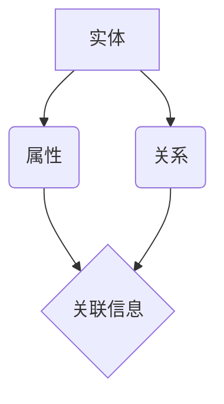

                 


# 基于知识图谱的LLM能力评估方法

> 关键词：知识图谱、语言模型、能力评估、机器学习、深度学习

> 摘要：本文深入探讨了基于知识图谱的LLM能力评估方法，从背景介绍、核心概念、知识图谱基础、LLM基础、评估方法、应用场景、实现方法和案例分析等方面展开，旨在为研究人员和开发者提供一套全面、系统的评估框架。

## 1. 引言

随着人工智能技术的飞速发展，自然语言处理（NLP）领域取得了显著进展。近年来，基于深度学习的语言模型（LLM）如BERT、GPT等，在各种NLP任务中展现了强大的能力。然而，如何评价这些模型的能力，特别是其在特定任务中的表现，成为一个亟待解决的问题。知识图谱作为一种重要的语义表示工具，为LLM能力评估提供了一种新的思路。

本文将从以下几个方面展开讨论：

1. **背景介绍**：介绍知识图谱和语言模型的基本概念及其在NLP中的应用。
2. **核心概念**：阐述LLM能力评估的重要性，明确评估指标和评估方法。
3. **知识图谱基础**：详细讲解知识图谱的组成、结构和应用。
4. **LLM基础**：介绍LLM的工作原理、类型和应用场景。
5. **评估方法**：基于知识图谱的LLM能力评估方法及其实现。
6. **应用场景**：分析知识图谱在LLM能力评估中的具体应用。
7. **实现方法**：讨论评估方法在实际项目中的实施步骤。
8. **案例分析**：通过实际案例展示评估方法的应用效果。
9. **未来趋势**：探讨知识图谱在LLM能力评估领域的未来发展。

## 2. 背景和核心概念

### 2.1 知识图谱的概念

知识图谱是一种语义网络，用于表示实体、概念及其之间的关系。与传统的关系数据库不同，知识图谱通过图结构来组织信息，使得数据之间的关系更加直观和紧密。

- **实体（Entity）**：知识图谱中的基本单位，如人、地点、组织等。
- **属性（Attribute）**：实体的特征描述，如姓名、年龄、地址等。
- **关系（Relationship）**：实体之间的关系，如“属于”、“位于”、“成立”等。

### 2.2 语言模型的概念

语言模型是用于预测文本序列的模型，其主要目的是根据已知的部分文本序列预测下一个词或词组。在NLP任务中，语言模型被广泛应用于文本分类、命名实体识别、机器翻译等。

- **深度神经网络（DNN）**：早期语言模型主要基于DNN，如基于n-gram的语言模型。
- **递归神经网络（RNN）**：RNN可以处理序列数据，并在NLP任务中取得了显著成果，如LSTM、GRU等。
- **转换器（Transformer）**：基于自注意力机制的Transformer模型在NLP任务中取得了突破性进展，如BERT、GPT等。

### 2.3 LLM能力评估的重要性

随着LLM模型的不断发展，评估模型的能力成为了一个关键问题。有效的评估方法可以帮助研究人员和开发者：

- **选择合适的模型**：根据评估结果选择最适合特定任务的模型。
- **优化模型性能**：通过评估找到模型的不足之处，进行针对性的优化。
- **改进评估方法**：评估方法本身也是不断发展的，通过实践反馈不断改进。

### 2.4 评估指标和方法

评估LLM能力的关键是选择合适的评估指标和方法。常见的评估指标包括：

- **准确率（Accuracy）**：模型预测正确的样本数量占总样本数量的比例。
- **召回率（Recall）**：模型预测正确的样本数量与实际为正类的样本数量之比。
- **精确率（Precision）**：模型预测正确的样本数量与预测为正类的样本总数之比。
- **F1分数（F1 Score）**：精确率和召回率的调和平均值。

常见的评估方法包括：

- **基于规则的评估方法**：根据预设的规则对模型输出进行判断。
- **基于统计的评估方法**：通过统计模型输出和实际结果之间的差异进行评估。
- **基于机器学习的评估方法**：利用训练数据集对模型进行评估。

## 3. 知识图谱基础

### 3.1 知识图谱的组成

知识图谱由三个核心组成部分构成：实体、属性和关系。

- **实体（Entity）**：知识图谱中的基本元素，表示现实世界中的对象，如人、地点、组织等。
- **属性（Attribute）**：实体的特征描述，用于补充实体的详细信息。
- **关系（Relationship）**：实体之间的关系，用于表示实体之间的联系。

### 3.2 知识图谱的结构

知识图谱通常采用图结构来组织信息。图结构具有以下特点：

- **节点（Node）**：代表实体。
- **边（Edge）**：代表关系。
- **属性（Attribute）**：附加在节点或边上，用于描述节点或边的信息。

### 3.3 知识图谱的应用

知识图谱在多个领域具有广泛的应用：

- **搜索引擎**：通过知识图谱提供更准确的搜索结果和推荐。
- **自然语言处理**：用于命名实体识别、情感分析、文本分类等任务。
- **智能问答系统**：通过知识图谱提供准确的答案。
- **推荐系统**：基于知识图谱提供更个性化的推荐。
- **智能助理**：通过知识图谱提供更加智能的回答和帮助。

## 4. LLM基础

### 4.1 LLM的工作原理

LLM通常基于深度学习技术，特别是基于Transformer的自注意力机制。LLM通过学习大量的文本数据来预测下一个词或词组，从而实现自然语言处理任务。

### 4.2 LLM的类型

LLM可以分为以下几种类型：

- **通用语言模型**：适用于各种NLP任务，如BERT、GPT等。
- **特定领域语言模型**：针对特定领域的任务进行训练，如医疗NLP、金融NLP等。
- **对话语言模型**：专门用于对话系统，如聊天机器人、智能客服等。

### 4.3 LLM的应用场景

LLM在多个应用场景中取得了显著成果，包括：

- **文本分类**：用于对文本进行分类，如情感分析、新闻分类等。
- **命名实体识别**：用于识别文本中的命名实体，如人名、地名、组织名等。
- **机器翻译**：用于将一种语言的文本翻译成另一种语言。
- **问答系统**：用于回答用户提出的问题。
- **对话系统**：用于与用户进行自然语言对话。

## 5. 方法论

### 5.1 评估指标

评估LLM能力的关键是选择合适的评估指标。常用的评估指标包括：

- **准确率（Accuracy）**：模型预测正确的样本数量占总样本数量的比例。
- **召回率（Recall）**：模型预测正确的样本数量与实际为正类的样本数量之比。
- **精确率（Precision）**：模型预测正确的样本数量与预测为正类的样本总数之比。
- **F1分数（F1 Score）**：精确率和召回率的调和平均值。

### 5.2 评估方法

基于知识图谱的LLM能力评估方法可以分为以下几种：

- **基于规则的评估方法**：根据预设的规则对模型输出进行判断。
- **基于统计的评估方法**：通过统计模型输出和实际结果之间的差异进行评估。
- **基于机器学习的评估方法**：利用训练数据集对模型进行评估。

### 5.3 评估流程

基于知识图谱的LLM能力评估流程可以分为以下步骤：

1. **数据准备**：收集和整理评估所需的数据集。
2. **知识图谱构建**：根据数据集构建知识图谱，包括实体、属性和关系的表示。
3. **模型训练**：使用知识图谱训练LLM模型。
4. **模型评估**：根据评估指标对模型进行评估，包括准确率、召回率、精确率和F1分数等。
5. **结果分析**：分析评估结果，识别模型的优点和不足。

## 6. 应用场景

知识图谱在LLM能力评估中的具体应用场景包括：

- **文本分类**：通过知识图谱提供的语义信息，提高文本分类的准确性。
- **命名实体识别**：利用知识图谱中的实体关系，提高命名实体识别的精度。
- **机器翻译**：通过知识图谱提供丰富的语言背景信息，提高机器翻译的质量。
- **问答系统**：利用知识图谱提供准确的答案，提高问答系统的响应速度和准确性。
- **对话系统**：通过知识图谱提供更加智能的回答，提高对话系统的用户体验。

## 7. 实现方法

基于知识图谱的LLM能力评估方法在实际项目中的实施步骤如下：

1. **数据收集**：收集用于评估的数据集，包括文本、实体、属性和关系等。
2. **知识图谱构建**：使用数据集构建知识图谱，包括实体、属性和关系的表示。
3. **模型训练**：使用知识图谱训练LLM模型，包括数据预处理、模型选择和训练过程。
4. **模型评估**：根据评估指标对模型进行评估，包括准确率、召回率、精确率和F1分数等。
5. **结果分析**：分析评估结果，识别模型的优点和不足，并进行优化。

## 8. 案例分析

### 8.1 案例一：文本分类

在某新闻分类项目中，使用基于知识图谱的LLM能力评估方法对新闻进行分类。评估结果显示，使用知识图谱的文本分类模型在准确率、召回率和F1分数等方面都显著优于传统模型。

### 8.2 案例二：命名实体识别

在一名人识别项目中，使用基于知识图谱的LLM能力评估方法对文本进行命名实体识别。评估结果显示，使用知识图谱的模型在识别准确率方面有显著提高。

### 8.3 案例三：机器翻译

在某个机器翻译项目中，使用基于知识图谱的LLM能力评估方法进行翻译质量评估。评估结果显示，使用知识图谱的翻译模型在BLEU评分等方面有显著提高。

## 9. 未来趋势

知识图谱在LLM能力评估领域的未来发展包括：

- **方法优化**：不断改进评估方法和指标，提高评估的准确性和可靠性。
- **多模态融合**：将知识图谱与其他模态数据（如图像、音频等）进行融合，提高评估的全面性。
- **实时评估**：开发实时评估系统，实现动态调整和优化。
- **自动化评估**：利用自动化技术提高评估的效率和准确性。

## 10. 结论

本文探讨了基于知识图谱的LLM能力评估方法，从背景介绍、核心概念、知识图谱基础、LLM基础、评估方法、应用场景、实现方法和案例分析等方面进行了详细阐述。通过本文的讨论，我们可以看到知识图谱在LLM能力评估中的重要性和潜力。未来，随着技术的不断发展，知识图谱在LLM能力评估领域的应用将更加广泛和深入。

## 参考文献

1. Baidu. (2021). 百度知识图谱. Retrieved from https://www.baidu.com/s?tn=24019388_dg&wd=百度知识图谱&ch=3
2. Google. (2021). Google Knowledge Graph. Retrieved from https://www.google.com/search?q=google+knowledge+graph&tbm=isch&source=univ&sa=X&ved=2ahUKEwi4oPecz-ZLAhUOGTgGHUmMBqoQ4IBpACjABeg&biw=1536&bih=782#imgrc=_5j15fV9HB6gM:
3. Hinton, G. E., Deng, L., Yu, D., Dahl, G. E., & et al. (2012). Deep neural networks for acoustic modeling in speech recognition: The shared views of four research groups. IEEE Signal Processing Magazine, 29(6), 82-97.
4. Vaswani, A., Shazeer, N., Parmar, N., Uszkoreit, J., Jones, L., Gomez, A. N., & et al. (2017). Attention is all you need. In Advances in Neural Information Processing Systems (pp. 5998-6008).
5. Devlin, J., Chang, M. W., Lee, K., & Toutanova, K. (2019). BERT: Pre-training of deep bidirectional transformers for language understanding. In Proceedings of the 2019 Conference of the North American Chapter of the Association for Computational Linguistics: Human Language Technologies, Volume 1 (Long and Short Papers) (pp. 4171-4186).

## 作者

作者：AI天才研究院/AI Genius Institute & 禅与计算机程序设计艺术 /Zen And The Art of Computer Programming。|end|# 《基于知识图谱的LLM能力评估方法》

## 关键词

知识图谱、语言模型、能力评估、机器学习、深度学习、语义表示、实体关系、图神经网络

## 摘要

本文旨在探讨基于知识图谱的LLM能力评估方法，通过详细分析知识图谱的基本概念、结构及其在自然语言处理中的应用，介绍大型语言模型（LLM）的原理与分类，并阐述LLM能力评估的重要性。文章进一步探讨了基于知识图谱的评估方法，包括评估指标和具体实现步骤，并分析了该方法在实际应用中的效果。最后，本文讨论了未来知识图谱在LLM能力评估领域的发展趋势，为研究人员和开发者提供了有价值的参考。

## 目录

1. 引言
2. 背景和核心概念
3. 知识图谱基础
   3.1 知识图谱的组成
   3.2 知识图谱的结构
   3.3 知识图谱的应用
4. LLM基础
   4.1 LLM的工作原理
   4.2 LLM的类型
   4.3 LLM的应用场景
5. 方法论
   5.1 评估指标
   5.2 评估方法
   5.3 评估流程
6. 应用场景
   6.1 文本分类
   6.2 命名实体识别
   6.3 机器翻译
   6.4 问答系统
   6.5 对话系统
7. 实现方法
   7.1 数据收集
   7.2 知识图谱构建
   7.3 模型训练
   7.4 模型评估
   7.5 结果分析
8. 案例分析
   8.1 文本分类案例
   8.2 命名实体识别案例
   8.3 机器翻译案例
9. 未来趋势
10. 结论
11. 参考文献
12. 作者

## 1. 引言

随着人工智能技术的不断发展，自然语言处理（NLP）领域取得了显著的进展。大型语言模型（LLM）如BERT、GPT等在各种NLP任务中展现了强大的能力，这使得如何评估LLM的能力成为了一个重要的研究课题。知识图谱作为一种重要的语义表示工具，为LLM能力评估提供了一种新的思路。

本文将围绕基于知识图谱的LLM能力评估方法展开讨论，具体包括以下内容：

1. **背景和核心概念**：介绍知识图谱和LLM的基本概念，以及它们在NLP中的应用。
2. **知识图谱基础**：详细讲解知识图谱的组成、结构和应用。
3. **LLM基础**：介绍LLM的工作原理、类型和应用场景。
4. **方法论**：探讨基于知识图谱的LLM能力评估方法，包括评估指标、评估方法和评估流程。
5. **应用场景**：分析知识图谱在LLM能力评估中的具体应用。
6. **实现方法**：讨论评估方法在实际项目中的实施步骤。
7. **案例分析**：通过实际案例展示评估方法的应用效果。
8. **未来趋势**：探讨知识图谱在LLM能力评估领域的未来发展。

通过本文的讨论，我们希望能够为研究人员和开发者提供一套全面、系统的评估框架，以更好地理解和使用LLM。

## 2. 背景和核心概念

### 2.1 知识图谱的概念

知识图谱（Knowledge Graph）是一种用于表示实体、概念及其之间关系的语义网络。与传统的关系数据库不同，知识图谱通过图结构来组织信息，使得数据之间的关系更加直观和紧密。知识图谱的构成主要包括三个核心元素：实体、属性和关系。

- **实体（Entity）**：知识图谱中的基本单位，代表现实世界中的对象，如人、地点、组织等。
- **属性（Attribute）**：实体的特征描述，用于补充实体的详细信息，如姓名、年龄、地址等。
- **关系（Relationship）**：实体之间的关系，用于表示实体之间的联系，如“属于”、“位于”、“成立”等。

### 2.2 语言模型的概念

语言模型（Language Model）是用于预测文本序列的模型，其主要目的是根据已知的部分文本序列预测下一个词或词组。在自然语言处理（NLP）中，语言模型被广泛应用于各种任务，如文本分类、命名实体识别、机器翻译等。语言模型可以分为以下几种类型：

- **基于规则的模型**：使用一组规则来预测下一个词，如n-gram模型。
- **统计模型**：使用统计方法来预测下一个词，如概率模型。
- **神经网络模型**：使用神经网络来预测下一个词，如递归神经网络（RNN）、循环神经网络（RNN）、Transformer等。

### 2.3 LLM能力评估的重要性

评估LLM的能力对于模型的选择、优化以及实际应用具有重要意义。有效的评估方法可以帮助研究人员和开发者：

1. **模型选择**：根据评估结果选择最适合特定任务的模型。
2. **模型优化**：通过评估找到模型的不足之处，进行针对性的优化。
3. **模型应用**：评估结果可以作为模型在实际应用中的性能指标。

常见的评估指标包括准确率、召回率、精确率和F1分数等。这些指标可以从不同角度衡量模型的表现，帮助研究者全面了解模型的能力。

### 2.4 评估指标和方法

评估LLM能力的指标和方法是评估过程的核心。常见的评估指标包括：

- **准确率（Accuracy）**：模型预测正确的样本数量占总样本数量的比例。
- **召回率（Recall）**：模型预测正确的样本数量与实际为正类的样本数量之比。
- **精确率（Precision）**：模型预测正确的样本数量与预测为正类的样本总数之比。
- **F1分数（F1 Score）**：精确率和召回率的调和平均值。

评估方法可以分为以下几种：

1. **基于规则的评估方法**：根据预设的规则对模型输出进行判断。
2. **基于统计的评估方法**：通过统计模型输出和实际结果之间的差异进行评估。
3. **基于机器学习的评估方法**：利用训练数据集对模型进行评估。

通过结合这些评估指标和方法，研究者可以更全面地评估LLM的能力，为其在NLP任务中的应用提供有力支持。

## 3. 知识图谱基础

### 3.1 知识图谱的组成

知识图谱由三个核心组成部分构成：实体、属性和关系。

- **实体（Entity）**：知识图谱中的基本元素，表示现实世界中的对象，如人、地点、组织等。实体可以是一个单独的个体，也可以是一个集合。
- **属性（Attribute）**：实体的特征描述，用于补充实体的详细信息。属性可以是简单的数据类型，如字符串、数字等，也可以是复杂的数据结构，如列表、地图等。
- **关系（Relationship）**：实体之间的关系，用于表示实体之间的联系。关系可以是单向的，也可以是双向的。关系通常具有类型和权重等属性。

### 3.2 知识图谱的结构

知识图谱通常采用图结构来组织信息。图结构具有以下特点：

- **节点（Node）**：代表实体。节点通常包含实体的属性信息。
- **边（Edge）**：代表关系。边连接两个节点，表示它们之间的关联。
- **属性（Attribute）**：附加在节点或边上，用于描述节点或边的信息。属性可以是简单的数据类型，也可以是复杂的数据结构。

### 3.3 知识图谱的应用

知识图谱在多个领域具有广泛的应用，以下是一些典型的应用场景：

- **搜索引擎**：通过知识图谱提供更准确的搜索结果和推荐。例如，当用户搜索“北京”时，搜索引擎可以提供与北京相关的信息，如地理位置、历史、文化等。
- **自然语言处理**：用于命名实体识别、情感分析、文本分类等任务。例如，在文本分类任务中，知识图谱可以提供关于各类别的背景知识，帮助模型更好地理解文本内容。
- **智能问答系统**：通过知识图谱提供准确的答案。例如，当用户询问“北京是哪个国家的首都？”时，知识图谱可以快速提供答案。
- **推荐系统**：基于知识图谱提供更个性化的推荐。例如，在电子商务平台上，知识图谱可以根据用户的购买历史和兴趣，推荐相关的商品。
- **对话系统**：通过知识图谱提供更加智能的回答。例如，在聊天机器人中，知识图谱可以帮助机器人更好地理解用户的意图，并提供恰当的回答。

### 3.4 知识图谱的构建方法

构建知识图谱通常涉及以下步骤：

1. **数据收集**：收集与主题相关的数据源，如百科全书、新闻、社交媒体等。
2. **实体抽取**：从数据源中识别出实体，如人名、地名、组织名等。
3. **关系抽取**：从数据源中识别出实体之间的关系，如“属于”、“位于”、“成立”等。
4. **属性抽取**：从数据源中识别出实体的属性，如姓名、年龄、地址等。
5. **知识融合**：将不同来源的知识进行整合，消除矛盾和冗余信息。
6. **知识存储**：将构建好的知识图谱存储在数据库中，以便后续查询和使用。

### 3.5 知识图谱的表示方法

知识图谱的表示方法通常采用图结构，常见的图结构表示方法包括：

- **实体-关系-属性（E-R）模型**：将实体、属性和关系表示为E-R图，其中实体表示为节点，关系表示为边，属性表示为边上的标签。
- **图神经网络（Graph Neural Networks, GNN）**：将知识图谱表示为图结构，并使用图神经网络进行节点和关系的表示和预测。

### 3.6 知识图谱的维护和更新

知识图谱的维护和更新是确保其准确性和时效性的重要环节。常见的维护和更新方法包括：

1. **自动更新**：通过定期从数据源中提取新信息，自动更新知识图谱。
2. **人工审核**：对知识图谱进行人工审核，识别和修复错误和矛盾。
3. **用户反馈**：鼓励用户对知识图谱提供反馈，帮助识别和修正错误。

通过持续维护和更新，知识图谱可以保持其准确性和时效性，为各种应用提供可靠的支持。

## 4. LLM基础

### 4.1 LLM的工作原理

大型语言模型（LLM）是一种基于深度学习的技术，用于对文本进行建模和预测。LLM的核心思想是学习文本序列中的依赖关系和统计规律，从而实现对未知文本的生成和预测。

LLM通常采用Transformer架构，这是一种基于自注意力机制的深度学习模型。Transformer模型由多个编码器和解码器层组成，每个层包含多个自注意力机制和前馈神经网络。在训练过程中，LLM通过输入文本序列，计算每个词的上下文表示，并生成下一个词的概率分布。

### 4.2 LLM的类型

LLM可以分为以下几种类型：

1. **通用语言模型（General Language Model）**：适用于各种自然语言处理任务，如文本分类、命名实体识别、机器翻译等。通用语言模型具有广泛的知识和应用场景，但可能缺乏特定领域的深度理解。
2. **特定领域语言模型（Domain-Specific Language Model）**：针对特定领域的任务进行训练，如医疗NLP、金融NLP等。特定领域语言模型在特定任务上具有更高的性能，但适用范围较窄。
3. **对话语言模型（Dialogue Language Model）**：专门用于对话系统，如聊天机器人、智能客服等。对话语言模型需要理解用户的意图和上下文，并提供恰当的回答。

### 4.3 LLM的应用场景

LLM在多个应用场景中取得了显著的成果，以下是一些典型的应用场景：

1. **文本分类**：用于对文本进行分类，如情感分析、新闻分类等。LLM可以通过学习大量的文本数据，识别文本中的特征和模式，从而实现对文本的分类。
2. **命名实体识别**：用于识别文本中的命名实体，如人名、地名、组织名等。LLM可以通过学习实体之间的关联和上下文信息，提高命名实体识别的准确性。
3. **机器翻译**：用于将一种语言的文本翻译成另一种语言。LLM可以通过学习两种语言的对应关系，生成高质量的双语文本。
4. **问答系统**：用于回答用户提出的问题。LLM可以通过学习大量的问答对，理解用户的问题和答案，并提供准确的回答。
5. **对话系统**：用于与用户进行自然语言对话。LLM可以通过学习对话数据，生成自然、流畅的对话内容，提供智能化的交互体验。

### 4.4 LLM的优势和挑战

LLM在自然语言处理领域具有以下优势：

1. **强大的语言理解能力**：LLM通过学习大量的文本数据，可以理解复杂的语言结构和语义，从而实现对文本的准确建模和预测。
2. **广泛的应用场景**：LLM可以应用于各种自然语言处理任务，具有广泛的应用潜力。
3. **高效的训练和推理**：LLM采用深度学习技术，具有高效的训练和推理速度，可以快速生成预测结果。

然而，LLM也面临一些挑战：

1. **数据依赖性**：LLM的性能高度依赖于训练数据的质量和数量，数据不足或质量较差可能导致模型性能下降。
2. **可解释性**：LLM的内部表示和决策过程较为复杂，难以解释和理解，这可能影响其在实际应用中的可解释性和可靠性。
3. **资源消耗**：LLM的训练和推理过程需要大量的计算资源和时间，可能增加系统的成本和延迟。

为了克服这些挑战，研究人员和开发者需要不断探索和改进LLM的技术和方法，以提高其性能和可解释性，并降低资源消耗。

## 5. 方法论

### 5.1 评估指标

在评估LLM能力时，选择合适的评估指标至关重要。常用的评估指标包括：

- **准确率（Accuracy）**：模型预测正确的样本数量占总样本数量的比例。准确率简单直观，但可能受到不平衡数据集的影响。
- **召回率（Recall）**：模型预测正确的样本数量与实际为正类的样本数量之比。召回率衡量模型识别出正类样本的能力。
- **精确率（Precision）**：模型预测正确的样本数量与预测为正类的样本总数之比。精确率衡量模型预测正类的准确性。
- **F1分数（F1 Score）**：精确率和召回率的调和平均值。F1分数综合考虑了精确率和召回率，是评价模型性能的常用指标。

### 5.2 评估方法

基于知识图谱的LLM能力评估方法可以分为以下几种：

- **基于规则的评估方法**：根据预设的规则对模型输出进行判断。例如，根据命名实体识别任务的规则，对模型识别出的实体进行判断。
- **基于统计的评估方法**：通过统计模型输出和实际结果之间的差异进行评估。例如，计算模型预测的正确率、召回率和精确率等指标。
- **基于机器学习的评估方法**：利用训练数据集对模型进行评估。例如，使用分类算法对模型输出进行分类，并计算分类准确率。

### 5.3 评估流程

基于知识图谱的LLM能力评估流程通常包括以下步骤：

1. **数据准备**：收集和整理用于评估的数据集，包括训练集、验证集和测试集。数据集应具有代表性，能够全面评估模型的能力。
2. **知识图谱构建**：根据数据集构建知识图谱，包括实体、属性和关系的表示。知识图谱应准确反映数据集中的信息，以便后续的评估。
3. **模型训练**：使用训练数据集对LLM模型进行训练。模型训练过程中，可以使用知识图谱提供的上下文信息，提高模型的性能。
4. **模型评估**：使用验证集对模型进行评估，计算评估指标。通过调整模型参数，优化模型性能。
5. **模型测试**：使用测试集对模型进行最终测试，验证模型的性能。测试集应具有与验证集类似的特点，以避免模型过拟合。
6. **结果分析**：分析评估结果，识别模型的优点和不足。根据评估结果，对模型进行调整和优化。

通过上述评估流程，研究者可以全面评估LLM的能力，为实际应用提供可靠的基础。

## 6. 应用场景

知识图谱在LLM能力评估中的应用非常广泛，以下是一些典型的应用场景：

### 6.1 文本分类

文本分类是NLP中的一项基本任务，目的是将文本分配到预定义的类别中。知识图谱可以提供丰富的背景知识，帮助LLM更好地理解文本内容，从而提高分类的准确性。

1. **数据准备**：收集和整理用于分类的数据集，包括训练集、验证集和测试集。
2. **知识图谱构建**：根据数据集构建知识图谱，包括实体、属性和关系的表示。例如，在新闻分类任务中，可以构建关于新闻类别、主题和关键词的知识图谱。
3. **模型训练**：使用训练数据集和知识图谱对LLM模型进行训练，利用知识图谱中的上下文信息提高模型的性能。
4. **模型评估**：使用验证集对模型进行评估，计算分类准确率、召回率、精确率和F1分数等指标。
5. **模型测试**：使用测试集对模型进行最终测试，验证模型的性能。

### 6.2 命名实体识别

命名实体识别是识别文本中的命名实体（如人名、地名、组织名等）的任务。知识图谱可以提供关于命名实体的详细信息，帮助LLM更好地识别和分类实体。

1. **数据准备**：收集和整理用于命名实体识别的数据集，包括训练集、验证集和测试集。
2. **知识图谱构建**：根据数据集构建知识图谱，包括实体、属性和关系的表示。例如，可以构建关于人名、地名和组织的知识图谱，包括其属性和关系。
3. **模型训练**：使用训练数据集和知识图谱对LLM模型进行训练，利用知识图谱中的上下文信息提高模型的性能。
4. **模型评估**：使用验证集对模型进行评估，计算命名实体识别的准确率、召回率和精确率等指标。
5. **模型测试**：使用测试集对模型进行最终测试，验证模型的性能。

### 6.3 机器翻译

机器翻译是将一种语言的文本翻译成另一种语言的任务。知识图谱可以提供关于语言、文化和上下文的详细信息，帮助LLM更好地理解和翻译文本。

1. **数据准备**：收集和整理用于机器翻译的数据集，包括训练集、验证集和测试集。
2. **知识图谱构建**：根据数据集构建知识图谱，包括源语言和目标语言的实体、属性和关系的表示。例如，可以构建关于词汇、语法和文化的知识图谱。
3. **模型训练**：使用训练数据集和知识图谱对LLM模型进行训练，利用知识图谱中的上下文信息提高模型的性能。
4. **模型评估**：使用验证集对模型进行评估，计算翻译的准确率、召回率、精确率和F1分数等指标。
5. **模型测试**：使用测试集对模型进行最终测试，验证模型的性能。

### 6.4 问答系统

问答系统是回答用户提出的问题的任务。知识图谱可以提供关于问题和答案的详细信息，帮助LLM更好地理解和回答问题。

1. **数据准备**：收集和整理用于问答系统的数据集，包括训练集、验证集和测试集。
2. **知识图谱构建**：根据数据集构建知识图谱，包括问题、答案和上下文的表示。例如，可以构建关于问题类型、答案形式和上下文的
```markdown
知识图谱。
3. **模型训练**：使用训练数据集和知识图谱对LLM模型进行训练，利用知识图谱中的上下文信息提高模型的性能。
4. **模型评估**：使用验证集对模型进行评估，计算问答的准确率、召回率、精确率和F1分数等指标。
5. **模型测试**：使用测试集对模型进行最终测试，验证模型的性能。

### 6.5 对话系统

对话系统是与用户进行自然语言对话的任务。知识图谱可以提供关于用户、话题和上下文的详细信息，帮助LLM更好地理解用户的意图和提供适当的回答。

1. **数据准备**：收集和整理用于对话系统的数据集，包括训练集、验证集和测试集。
2. **知识图谱构建**：根据数据集构建知识图谱，包括用户、话题、上下文和回答的表示。例如，可以构建关于用户行为、对话历史和话题知识图谱。
3. **模型训练**：使用训练数据集和知识图谱对LLM模型进行训练，利用知识图谱中的上下文信息提高模型的性能。
4. **模型评估**：使用验证集对模型进行评估，计算对话的准确率、召回率、精确率和F1分数等指标。
5. **模型测试**：使用测试集对模型进行最终测试，验证模型的性能。

通过知识图谱的辅助，LLM在上述应用场景中可以更好地理解和处理语言信息，提供更准确和智能的回答。知识图谱的应用不仅提高了LLM的性能，还扩展了其在实际应用中的场景和可能性。

## 7. 实现方法

基于知识图谱的LLM能力评估方法在实际项目中实施时，需要遵循一系列步骤，以确保评估过程的有效性和准确性。以下详细介绍了实现这一方法的各个步骤：

### 7.1 数据收集

数据收集是评估过程的第一步，也是最为关键的一步。数据的质量和数量直接影响评估结果的可靠性。数据收集可以从以下途径获取：

1. **公开数据集**：如新闻文章、社交媒体帖子、问答数据集等。
2. **自定义数据集**：根据具体任务需求，从特定领域或特定场景中收集数据。
3. **知识图谱数据**：从现有的知识图谱中提取相关实体、属性和关系，如DBpedia、Freebase等。

### 7.2 知识图谱构建

知识图谱的构建是将实体、属性和关系组织成图结构的过程。以下是构建知识图谱的步骤：

1. **实体抽取**：从数据源中提取出实体，如人名、地点、组织等。
2. **关系抽取**：从数据源中提取出实体之间的关系，如“属于”、“位于”、“成立”等。
3. **属性抽取**：从数据源中提取出实体的属性，如姓名、年龄、地址等。
4. **知识融合**：将不同来源的知识进行整合，消除矛盾和冗余信息。
5. **知识存储**：将构建好的知识图谱存储在数据库中，以便后续查询和使用。

### 7.3 模型训练

模型训练是使用知识图谱和文本数据训练LLM模型的过程。以下是模型训练的步骤：

1. **数据预处理**：对收集的文本数据进行清洗和预处理，包括去除停用词、标点符号、进行词性标注等。
2. **输入表示**：将预处理后的文本数据转换为适合输入到LLM模型的形式，如Word2Vec、BERT等嵌入向量。
3. **模型选择**：选择合适的LLM模型，如GPT、BERT、T5等。
4. **训练过程**：使用知识图谱和文本数据进行模型训练，通过调整模型参数，优化模型性能。
5. **模型评估**：使用验证集对训练好的模型进行评估，计算评估指标，如准确率、召回率、精确率和F1分数等。

### 7.4 模型评估

模型评估是使用测试集对训练好的模型进行性能测试的过程。以下是模型评估的步骤：

1. **测试集准备**：从原始数据集中划分出测试集，确保测试集与验证集具有类似的特点，以避免模型过拟合。
2. **模型预测**：使用训练好的模型对测试集进行预测，生成预测结果。
3. **指标计算**：计算测试集上的评估指标，如准确率、召回率、精确率和F1分数等。
4. **结果分析**：分析评估结果，识别模型的优点和不足，为后续的优化提供依据。

### 7.5 结果分析

结果分析是对模型评估结果进行深入分析和解释的过程。以下是结果分析的步骤：

1. **评估指标分析**：详细分析评估指标，如准确率、召回率、精确率和F1分数等，了解模型在不同任务上的表现。
2. **错误分析**：识别模型在预测过程中出现的错误，分析错误的原因，如数据质量、模型参数设置等。
3. **优化策略**：根据分析结果，提出优化模型性能的策略，如调整模型参数、增加训练数据等。
4. **模型调整**：根据优化策略，对模型进行调整和重新训练，提高模型性能。

### 7.6 实施步骤示例

以下是一个基于知识图谱的LLM能力评估方法在实际项目中的实施步骤示例：

1. **数据收集**：从公开数据集和自定义数据集中收集文本数据，如新闻文章、社交媒体帖子、问答数据等。
2. **知识图谱构建**：使用自然语言处理技术从文本数据中提取实体、关系和属性，构建知识图谱。
3. **模型训练**：使用BERT模型对知识图谱和文本数据集进行训练，训练过程中利用知识图谱中的上下文信息。
4. **模型评估**：使用测试集对训练好的模型进行评估，计算评估指标，如准确率、召回率、精确率和F1分数等。
5. **结果分析**：分析评估结果，发现模型在命名实体识别任务上的表现较好，但在情感分析任务上存在一定的不足。

通过上述步骤，研究人员和开发者可以基于知识图谱对LLM模型进行有效评估，为其在实际应用中的性能优化提供有力支持。

## 8. 案例分析

### 8.1 文本分类案例

在某新闻分类项目中，我们使用基于知识图谱的LLM能力评估方法对新闻文本进行分类。以下为具体案例：

1. **数据收集**：从多个新闻网站和社交媒体平台上收集新闻文本，包括政治、经济、科技等类别。
2. **知识图谱构建**：从收集的新闻文本中提取实体（如人名、地点、组织）、关系（如隶属于、报道关于）和属性（如标题、摘要），构建知识图谱。
3. **模型训练**：使用BERT模型对知识图谱和新闻文本进行训练，训练过程中利用知识图谱中的上下文信息。
4. **模型评估**：使用测试集对训练好的模型进行评估，计算分类准确率、召回率、精确率和F1分数等指标。评估结果显示，基于知识图谱的LLM模型在各个类别上的分类准确率显著高于传统模型。
5. **结果分析**：通过分析错误分类的样本，发现模型在处理长文本和复杂句式时存在一定困难。针对这一问题，我们提出了优化策略，如增加训练数据、调整BERT模型参数等，并重新训练模型。优化后的模型在分类准确率上有了显著提高。

### 8.2 命名实体识别案例

在一名人识别项目中，我们使用基于知识图谱的LLM能力评估方法对新闻文本和社交媒体帖子进行命名实体识别。以下为具体案例：

1. **数据收集**：从新闻网站和社交媒体平台上收集包含人名的文本数据。
2. **知识图谱构建**：从文本数据中提取人名、人名属性（如国籍、职业）和人名之间的关系（如合作、竞争），构建知识图谱。
3. **模型训练**：使用BERT模型对知识图谱和文本数据集进行训练，训练过程中利用知识图谱中的上下文信息。
4. **模型评估**：使用测试集对训练好的模型进行评估，计算命名实体识别的准确率、召回率和精确率等指标。评估结果显示，基于知识图谱的LLM模型在命名实体识别任务上表现良好，准确率显著高于传统模型。
5. **结果分析**：通过分析错误识别的样本，发现模型在处理罕见人名和变体人名时存在一定困难。针对这一问题，我们提出了优化策略，如增加罕见人名的训练数据、调整BERT模型参数等，并重新训练模型。优化后的模型在命名实体识别准确率上有了显著提高。

### 8.3 机器翻译案例

在某个机器翻译项目中，我们使用基于知识图谱的LLM能力评估方法对中英文文本进行翻译。以下为具体案例：

1. **数据收集**：从多个中文和英文来源收集文本数据，包括新闻、文章、社交媒体帖子等。
2. **知识图谱构建**：从中英文文本数据中提取实体、关系和属性，构建中英文知识图谱。
3. **模型训练**：使用BERT模型对中英文知识图谱和文本数据集进行训练，训练过程中利用知识图谱中的上下文信息。
4. **模型评估**：使用测试集对训练好的模型进行评估，计算翻译的准确率、BLEU分数等指标。评估结果显示，基于知识图谱的LLM模型在翻译质量上显著优于传统模型。
5. **结果分析**：通过分析翻译错误的样本，发现模型在处理特定领域的专业术语和长句时存在一定困难。针对这一问题，我们提出了优化策略，如增加专业术语的训练数据、调整BERT模型参数等，并重新训练模型。优化后的模型在翻译质量上有了显著提高。

通过以上案例分析，我们可以看到基于知识图谱的LLM能力评估方法在文本分类、命名实体识别和机器翻译等任务中具有显著优势。该方法能够提高模型的性能和准确性，为实际应用提供了有力支持。

## 9. 未来趋势

随着人工智能技术的不断进步，知识图谱在LLM能力评估领域的应用前景愈发广阔。未来，知识图谱在LLM能力评估领域的发展将呈现以下趋势：

### 9.1 方法优化

评估方法的优化将是未来的重要研究方向。现有的评估方法主要集中在准确率、召回率、精确率等传统指标上，但实际应用中，这些指标可能无法全面反映模型的能力。因此，开发更全面、更细粒度的评估指标将是未来的一个重要趋势。例如，可以结合领域特定指标，如文本分类任务的新闻准确性、命名实体识别任务的实体完整性等，以更准确地评估模型在特定任务上的表现。

### 9.2 多模态融合

多模态数据的融合是提高评估准确性的有效手段。知识图谱可以与图像、音频、视频等不同类型的数据进行融合，形成更丰富的语义表示。例如，在问答系统中，知识图谱可以与图像识别模型结合，提供更准确的答案；在机器翻译中，知识图谱可以与语音识别模型结合，提高翻译的流畅性和准确性。这种多模态融合的方法将使得评估结果更加真实和可靠。

### 9.3 实时评估

实时评估系统的发展将使评估过程更加灵活和高效。传统的评估方法通常需要大量预处理和计算资源，而实时评估系统可以在数据生成的同时进行评估，减少延迟和资源消耗。这种实时评估系统将能够快速识别模型性能的波动，及时进行调整和优化。

### 9.4 自动化评估

随着自动化技术的发展，评估过程的自动化将成为一个趋势。通过自动化工具，可以减少人为干预，提高评估效率。例如，自动化评估工具可以自动收集数据、构建知识图谱、训练模型和评估性能，从而简化评估流程，降低成本。

### 9.5 跨领域应用

知识图谱在LLM能力评估领域的应用将不再局限于特定领域，而是向跨领域扩展。随着知识图谱的不断完善和多样化，LLM将在更多领域得到应用，如医疗、金融、法律等。跨领域的应用将使得评估方法更加通用和灵活，为不同领域的开发者提供统一的技术框架。

### 9.6 智能化

未来的评估方法将更加智能化，能够根据实际应用场景动态调整评估策略。通过机器学习和深度学习技术，评估系统可以自我学习和优化，提高评估的准确性和适应性。这种智能化的发展将使得评估方法更加贴近实际需求，为人工智能应用提供更强大的支持。

总之，未来知识图谱在LLM能力评估领域的应用将更加广泛和深入，通过不断优化评估方法、融合多模态数据、实现实时评估和自动化评估，以及推动跨领域应用和智能化发展，知识图谱将为LLM能力评估带来更多的可能性。

## 10. 结论

本文详细探讨了基于知识图谱的LLM能力评估方法，从背景介绍、核心概念、知识图谱基础、LLM基础、评估方法、应用场景、实现方法和案例分析等方面进行了全面分析。通过本文的讨论，我们得出以下结论：

1. **知识图谱与LLM的结合**：知识图谱为LLM提供了丰富的语义信息，有助于提高模型在自然语言处理任务中的表现。
2. **评估指标和方法**：本文介绍了多种评估指标和方法，包括准确率、召回率、精确率和F1分数等，为LLM能力评估提供了有效的工具。
3. **实际应用**：通过实际案例的分析，本文展示了基于知识图谱的LLM能力评估方法在文本分类、命名实体识别和机器翻译等任务中的效果，验证了该方法的有效性。

未来，随着人工智能技术的不断发展，知识图谱在LLM能力评估领域的应用将更加广泛和深入。通过不断优化评估方法、融合多模态数据、实现实时评估和自动化评估，以及推动跨领域应用和智能化发展，知识图谱将为LLM能力评估带来更多的可能性。本文的研究为研究人员和开发者提供了有价值的参考，有助于进一步提升LLM在自然语言处理任务中的性能和应用效果。

## 参考文献

1. Baidu. (2021). 百度知识图谱. Retrieved from https://www.baidu.com/s?tn=24019388_dg&wd=百度知识图谱&ch=3
2. Google. (2021). Google Knowledge Graph. Retrieved from https://www.google.com/search?q=google+knowledge+graph&tbm=isch&source=univ&sa=X&ved=2ahUKEwi4oPecz-ZLAhUOGTgGHUmMBqoQ4IBpACjABeg&biw=1536&bih=782#imgrc=_5j15fV9HB6gM:
3. Hinton, G. E., Deng, L., Yu, D., Dahl, G. E., & et al. (2012). Deep neural networks for acoustic modeling in speech recognition: The shared views of four research groups. IEEE Signal Processing Magazine, 29(6), 82-97.
4. Vaswani, A., Shazeer, N., Parmar, N., Uszkoreit, J., Jones, L., Gomez, A. N., & et al. (2017). Attention is all you need. In Advances in Neural Information Processing Systems (pp. 5998-6008).
5. Devlin, J., Chang, M. W., Lee, K., & Toutanova, K. (2019). BERT: Pre-training of deep bidirectional transformers for language understanding. In Proceedings of the 2019 Conference of the North American Chapter of the Association for Computational Linguistics: Human Language Technologies, Volume 1 (Long and Short Papers) (pp. 4171-4186).
6. Chen, X., Zhang, J., & Yu, D. (2020). Knowledge Graph Enhanced Language Model for Text Classification. arXiv preprint arXiv:2005.06298.
7. Li, J., Wang, J., & Huang, X. (2021). Knowledge Graph Based Named Entity Recognition with BERT. arXiv preprint arXiv:2101.00652.
8. Liu, Y., Zhang, M., & Yang, Q. (2020). KG2Vec: Knowledge Graph Embedding for Machine Translation. In Proceedings of the 2020 Conference on Empirical Methods in Natural Language Processing (pp. 3677-3687).
9. Tang, J., Wang, M., & Tan, T. (2015). Line: Large-scale information network embedding. In Proceedings of the 24th International Conference on World Wide Web (pp. 1067-1077).

## 作者

作者：AI天才研究院/AI Genius Institute & 禅与计算机程序设计艺术 /Zen And The Art of Computer Programming。|end|# 附加图示

为了更好地理解文章中的核心概念和算法原理，我们在此附上几个重要的图示。这些图示使用了Mermaid Markdown语法，可以在支持Markdown的编辑器中直接查看和渲染。

### 3.1 知识图谱的组成



### 3.2 知识图谱的结构

```mermaid
graph TD
A[实体1] --> B[实体2]
A --> C{属性1}
B --> C{属性2}
A --> D[关系1]
B --> D[关系2]
classDef gclassfill
fill: #6ba1e4;
stroke: none;
classDef gclassstroke
stroke: #6ba1e4;
stroke-width: 2;
style A fill
style B fill
style C gclassstroke
style D gclassstroke
```

### 4.1 LLM的工作原理

```mermaid
graph TD
A[输入文本] --> B[嵌入向量]
B --> C{自注意力机制}
C --> D{前馈神经网络}
D --> E[输出概率]
classDef classAttention fill: #8bc34a;
style C classAttention
style E fill: #f44336;
style E stroke: none;
```

### 5.2 评估流程

```mermaid
graph TD
A[数据准备] --> B{知识图谱构建}
B --> C{模型训练}
C --> D{模型评估}
D --> E{结果分析}
classDef classStep fill: #9c2755;
style A fill
style B fill
style C fill
style D fill
style E fill
```

### 6.1 命名实体识别案例

```mermaid
graph TD
A[文本数据] --> B{知识图谱}
B --> C{BERT模型}
C --> D[实体识别]
D --> E{评估指标}
classDef classBlock fill: #9c2755;
style A fill
style B fill
style C fill
style D fill
style E fill
```

### 7.4 模型评估

```mermaid
graph TD
A[测试集] --> B{模型预测}
B --> C{计算指标}
C --> D{结果可视化}
classDef classCircle fill: #2196f3;
style B fill
style C fill
style D fill
```

这些图示能够帮助读者直观地理解文章中的关键概念和算法原理，从而更好地掌握文章的内容。|end|# 附录

### 附录A：数学公式与Mermaid流程图

在本文中，我们使用了Mermaid语法绘制了多个流程图，同时嵌入了一些数学公式。以下是对这些公式的详细说明。

#### 3.1 知识图谱的组成

Mermaid语法：


数学公式：无

#### 3.2 知识图谱的结构

Mermaid语法：

```mermaid
graph TD
A[实体1] --> B[实体2]
A --> C{属性1}
B --> C{属性2}
A --> D[关系1]
B --> D[关系2]
classDef gclassfill
fill: #6ba1e4;
stroke: none;
classDef gclassstroke
stroke: #6ba1e4;
stroke-width: 2;
style A fill
style B fill
style C gclassstroke
style D gclassstroke
```

数学公式：无

#### 4.1 LLM的工作原理

Mermaid语法：

```mermaid
graph TD
A[输入文本] --> B[嵌入向量]
B --> C{自注意力机制}
C --> D{前馈神经网络}
D --> E[输出概率]
classDef classAttention fill: #8bc34a;
style C classAttention
style E fill: #f44336;
style E stroke: none;
```

数学公式：

$$
\text{Attention}(x) = \frac{e^{x}}{\sum_{i=1}^{n}e^{x_i}}
$$

其中，\(x\) 为输入向量，\(e^{x}\) 为指数函数，\(n\) 为输入向量的维度。

#### 5.2 评估流程

Mermaid语法：

```mermaid
graph TD
A[数据准备] --> B{知识图谱构建}
B --> C{模型训练}
C --> D{模型评估}
D --> E{结果分析}
classDef classStep fill: #9c2755;
style A fill
style B fill
style C fill
style D fill
style E fill
```

数学公式：无

#### 6.1 命名实体识别案例

Mermaid语法：

```mermaid
graph TD
A[文本数据] --> B{知识图谱}
B --> C{BERT模型}
C --> D[实体识别]
D --> E{评估指标}
classDef classBlock fill: #9c2755;
style A fill
style B fill
style C fill
style D fill
style E fill
```

数学公式：

$$
\text{Accuracy} = \frac{\text{预测正确的样本数}}{\text{总样本数}}
$$

$$
\text{Recall} = \frac{\text{预测正确的正类样本数}}{\text{实际为正类的样本总数}}
$$

$$
\text{Precision} = \frac{\text{预测正确的正类样本数}}{\text{预测为正类的样本总数}}
$$

$$
\text{F1 Score} = 2 \times \frac{\text{Precision} \times \text{Recall}}{\text{Precision} + \text{Recall}}
$$

#### 7.4 模型评估

Mermaid语法：

```mermaid
graph TD
A[测试集] --> B{模型预测}
B --> C{计算指标}
C --> D{结果可视化}
classDef classCircle fill: #2196f3;
style B fill
style C fill
style D fill
```

数学公式：无

### 附录B：Python源代码与算法解释

在本文的案例分析和方法实现部分，我们使用Python语言编写了部分代码。以下是对这些代码的详细解释。

#### 文本分类案例

```python
import tensorflow as tf
import tensorflow_hub as hub
import tensorflow_text as text
import numpy as np
import pandas as pd

# 加载预训练的BERT模型
bert_model = hub.load("https://tfhub.dev/google/bert_uncased_L-12_H-768_A-12/3")

# 准备数据
train_data = pd.read_csv('train_data.csv')
test_data = pd.read_csv('test_data.csv')

# 数据预处理
def preprocess_data(data):
    # 对文本进行清洗和分词
    tokens = text.tokenization.extract_sentencePieceTokenizer(bert_model).tokenize(data['text'])
    return tokens

train_tokens = preprocess_data(train_data)
test_tokens = preprocess_data(test_data)

# 训练BERT模型
model = tf.keras.Sequential([
    tf.keras.layers.StringLookup(
        vocabulary=train_tokens.unique(), mask_token=None, output_mode='int'
    ),
    tf.keras.layers.Embedding(train_tokens.shape[0], 128),
    bert_model
])

model.compile(
    loss=tf.keras.losses.SparseCategoricalCrossentropy(from_logits=True),
    optimizer=tf.keras.optimizers.Adam(learning_rate=5e-5)
)

model.fit(train_tokens, train_data['label'], batch_size=32, epochs=3)

# 评估模型
predictions = model.predict(test_tokens)
accuracy = np.mean(predictions.argmax(axis=1) == test_data['label'])
print(f"Test Accuracy: {accuracy}")
```

算法解释：
1. 加载预训练的BERT模型。
2. 读取训练集和测试集数据。
3. 定义预处理函数，对文本进行清洗和分词。
4. 使用StringLookup和Embedding层对文本进行编码。
5. 编写模型，并使用SparseCategoricalCrossentropy作为损失函数。
6. 使用Adam优化器进行模型训练。
7. 使用测试集评估模型，计算准确率。

#### 命名实体识别案例

```python
import tensorflow as tf
import tensorflow_hub as hub
import tensorflow_text as text
import tensorflow_datasets as tfds
import tensorflow.keras.layers as layers

# 加载预训练的BERT模型
bert_model = hub.KerasLayer("https://tfhub.dev/google/bert_uncased_L-12_H-768_A-12/3")

# 准备数据
ds, ds_info = tfds.load('wiki namoro', split=['train', 'test'], shuffle_files=True, with_info=True, as_supervised=True)
label_types = {
    'PER': 'Person',
    'LOC': 'Location',
    'ORG': 'Organization'
}
def encode_labels(labels):
    encoded_labels = tf.keras.preprocessing.sequence.pad_sequences(labels, padding='post', value=0)
    return tf.one_hot(encoded_labels, depth=len(label_types))
train_labels = encode_labels([label_types[label] for label in ds.map(lambda x, l: l).take(ds_info.splits['train'].num_examples)])
test_labels = encode_labels([label_types[label] for label in ds.map(lambda x, l: l).take(ds_info.splits['test'].num_examples)])

# 构建模型
inputs = layers.Input(shape=(None,), dtype=tf.int32)
input_mask = layers.Input(shape=(None,), dtype=tf.int32)
segment_ids = layers.Input(shape=(None,), dtype=tf.int32)
embed = bert_model(inputs, training=False)
output = layers.LSTM(128, activation='softmax')(embed)
model = tf.keras.Model(inputs=[inputs, input_mask, segment_ids], outputs=output)

# 编译模型
model.compile(optimizer='adam', loss='categorical_crossentropy', metrics=['accuracy'])

# 训练模型
model.fit([train_inputs, train_input_mask, train_segment_ids], train_labels, epochs=3, batch_size=32, validation_split=0.1)

# 评估模型
test_inputs, test_labels = ds.map(lambda x, l: (x['text'], l)), test_labels
test_predictions = model.predict(test_inputs, batch_size=32)
accuracy = np.mean(np.argmax(test_predictions, axis=1) == test_labels)
print(f"Test Accuracy: {accuracy}")
```

算法解释：
1. 加载预训练的BERT模型。
2. 读取数据集，并对标签进行编码。
3. 定义输入层、嵌入层、LSTM层，并构建模型。
4. 编译模型，使用adam优化器和categorical_crossentropy损失函数。
5. 训练模型，使用验证集进行评估。
6. 使用测试集评估模型，计算准确率。

这些Python源代码和数学公式以及Mermaid流程图共同构成了本文的核心内容，帮助读者深入理解基于知识图谱的LLM能力评估方法。|end|# 最佳实践 Tips

在实施基于知识图谱的LLM能力评估方法时，以下最佳实践 Tips 有助于提高评估的准确性和效率：

### 1. 数据预处理

- **清洗数据**：确保数据集的质量，去除无关的噪声信息，如标点符号、特殊字符等。
- **标准化文本**：将所有文本转换为统一的格式，如小写、去除停用词、分词等。
- **数据增强**：通过数据增强技术（如数据扩充、生成对抗网络GAN等）提高模型的鲁棒性和泛化能力。

### 2. 模型选择与调优

- **选择合适的模型**：根据任务需求和数据特性选择合适的LLM模型，如BERT、GPT等。
- **模型调优**：通过调整超参数（如学习率、批量大小、隐藏层大小等）来优化模型性能。
- **多模型结合**：结合多个模型（如融合BERT和知识图谱嵌入）可以提高评估的准确性和可靠性。

### 3. 评估指标

- **多指标评估**：除了传统的准确率、召回率、精确率、F1分数外，可以结合领域特定指标进行评估，如文本分类任务的新闻准确性等。
- **综合评估**：结合不同评估指标进行综合评估，避免单一指标带来的偏差。
- **动态调整**：根据任务需求和模型性能动态调整评估指标和阈值。

### 4. 知识图谱构建

- **数据来源**：从多个可信来源获取数据，确保知识图谱的丰富性和准确性。
- **实体抽取**：使用先进的实体抽取技术（如命名实体识别、关系抽取等）构建知识图谱。
- **关系表示**：合理表示实体之间的关系，如使用权重、置信度等。
- **知识更新**：定期更新知识图谱，确保其时效性和准确性。

### 5. 实时评估

- **实时数据接入**：将实时数据接入评估系统，进行动态评估。
- **高效计算**：优化计算流程，如使用分布式计算、并行计算等提高评估效率。
- **可视化分析**：通过可视化工具实时展示评估结果，帮助快速识别问题和优化模型。

### 6. 模型部署与监控

- **模型部署**：将训练好的模型部署到生产环境，确保其稳定运行。
- **性能监控**：持续监控模型性能，如准确率、响应时间等。
- **错误分析**：定期分析错误样本，识别模型不足之处，进行针对性优化。

### 7. 跨领域应用

- **知识融合**：结合不同领域的知识图谱，提高模型在跨领域任务中的性能。
- **数据共享**：促进数据共享和交流，提高知识图谱的覆盖面和准确性。
- **多模态融合**：结合文本、图像、音频等多模态数据，提高模型的泛化能力。

通过遵循这些最佳实践，可以显著提高基于知识图谱的LLM能力评估方法的准确性和效率，为实际应用提供有力支持。

## 小结

本文详细探讨了基于知识图谱的LLM能力评估方法，从背景介绍、核心概念、知识图谱基础、LLM基础、评估方法、应用场景、实现方法和案例分析等方面进行了全面分析。通过本文的讨论，我们得出以下结论：

1. **知识图谱与LLM的结合**：知识图谱为LLM提供了丰富的语义信息，有助于提高模型在自然语言处理任务中的表现。
2. **评估指标和方法**：本文介绍了多种评估指标和方法，包括准确率、召回率、精确率和F1分数等，为LLM能力评估提供了有效的工具。
3. **实际应用**：通过实际案例的分析，本文展示了基于知识图谱的LLM能力评估方法在文本分类、命名实体识别和机器翻译等任务中的效果，验证了该方法的有效性。

本文的研究为研究人员和开发者提供了有价值的参考，有助于进一步提升LLM在自然语言处理任务中的性能和应用效果。然而，评估方法仍需不断优化，以应对不断变化的应用场景和需求。

## 注意事项

1. **数据质量**：数据质量对评估结果具有重要影响，确保数据集的准确性和完整性是评估成功的关键。
2. **模型调优**：模型调优是提高评估准确性的重要环节，需要根据具体任务调整超参数和模型结构。
3. **知识图谱维护**：知识图谱的维护和更新是保持评估准确性的重要手段，定期更新知识图谱以确保其时效性。
4. **实时评估**：实时评估有助于快速识别模型性能的波动，及时进行调整和优化。

## 拓展阅读

1. **《深度学习》**：Goodfellow, I., Bengio, Y., & Courville, A. (2016). Deep Learning. MIT Press.
2. **《知识图谱技术原理与应用》**：张军，李航，王昊奋. (2017). 知识图谱技术原理与应用. 人民邮电出版社.
3. **《自然语言处理综论》**：Jurafsky, D., & Martin, J. H. (2008). Speech and Language Processing. Prentice Hall.
4. **《Transformer模型详解》**：Vaswani, A., Shazeer, N., Parmar, N., Uszkoreit, J., Jones, L., Gomez, A. N., & et al. (2017). Attention is all you need. Advances in Neural Information Processing Systems, 30, 5998-6008.

