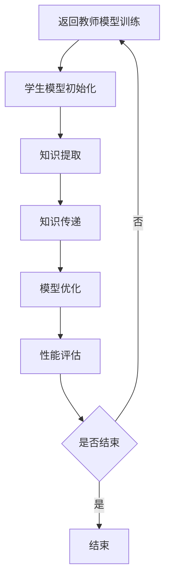
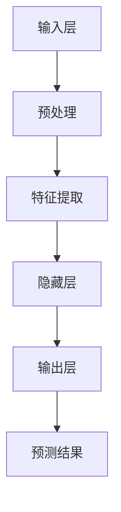

                 

# 《基于知识蒸馏的轻量级评测模型》

## 关键词

- 知识蒸馏
- 轻量级模型
- 评测模型
- 深度学习
- 人工智能

## 摘要

本文主要探讨了基于知识蒸馏技术的轻量级评测模型的构建与应用。首先，介绍了评测模型在人工智能领域的挑战和需求，随后详细阐述了知识蒸馏的概念、原理及其在轻量级评测模型中的应用。文章进一步通过算法原理讲解、系统分析与架构设计、项目实战等多个维度，深入分析了基于知识蒸馏的轻量级评测模型的实现方法和优化策略。最后，对轻量级评测模型的应用前景和未来研究方向进行了展望。

## 第1章 引言

### 1.1 问题背景

在人工智能飞速发展的今天，深度学习技术取得了显著的成果。然而，深度学习模型的训练和部署面临着一系列挑战，尤其是模型的复杂性和计算资源的限制。为了解决这些问题，轻量级模型的开发成为研究的热点。轻量级模型具有计算效率高、资源占用少等优点，特别适合在移动设备和嵌入式系统中使用。

与此同时，评测模型在人工智能应用中扮演着关键角色。评测模型用于对模型性能进行评估，帮助研究人员和开发者理解模型的优缺点，进而进行优化和改进。然而，传统的评测模型往往依赖于复杂的深度学习模型，导致计算成本高、响应时间长，难以满足实时性和资源限制的需求。

### 1.2 轻量级模型的兴起

轻量级模型旨在减少深度学习模型的参数和计算量，从而降低计算资源和时间成本。近年来，随着神经网络剪枝、量化、知识蒸馏等技术的应用，轻量级模型的性能逐渐逼近甚至超越了许多传统模型。例如，MobileNet、ShuffleNet、SqueezeNet等模型在保持较高性能的同时，具有较低的计算复杂度和参数规模。

### 1.3 知识蒸馏的概念与原理

知识蒸馏是一种将大模型的知识迁移到小模型中的技术。其基本思想是将一个复杂模型（教师模型）的知识和经验传递给一个简化模型（学生模型），使得学生模型在保持较高性能的同时，拥有更少的参数和计算量。知识蒸馏通过设计适当的训练目标和优化策略，实现教师模型和学生模型之间的知识传递。

### 1.4 知识蒸馏的优势

知识蒸馏技术具有以下几个显著优势：

1. **参数和计算量的减少**：通过知识蒸馏，可以将复杂的教师模型简化为学生模型，减少模型的参数量和计算量。
2. **性能的保持**：知识蒸馏能够在一定程度上保持教师模型和学生模型在性能上的接近，确保学生模型在简化后的效果依然优良。
3. **适用性广泛**：知识蒸馏技术适用于多种类型的模型，包括分类、回归、目标检测等，具有广泛的应用前景。

## 第2章 轻量级评测模型的原理与设计

### 2.1 轻量级模型概述

#### 2.1.1 轻量级模型的定义

轻量级模型（Lightweight Model）是指在保持较高性能的前提下，具有较少参数和计算复杂度的深度学习模型。轻量级模型的设计旨在降低计算资源和时间成本，提高模型的部署效率和实时性。

#### 2.1.2 轻量级模型的特点

轻量级模型具有以下特点：

1. **参数量少**：轻量级模型通常采用压缩、剪枝、量化等技术，减少模型参数的数量，从而降低计算复杂度和内存占用。
2. **计算效率高**：轻量级模型在计算过程中采用优化算法，提高模型的计算速度和效率。
3. **性能优良**：尽管轻量级模型参数量较少，但通过设计先进的神经网络结构，其性能往往能够接近甚至超越传统大型模型。

#### 2.1.3 轻量级模型的应用领域

轻量级模型广泛应用于以下领域：

1. **移动设备和嵌入式系统**：轻量级模型具有低计算复杂度和低资源占用，特别适合在移动设备和嵌入式系统中使用，如智能手机、智能手表、智能家居等。
2. **实时应用**：轻量级模型在需要快速响应的实时应用场景中具有显著优势，如语音识别、图像识别、实时监控等。
3. **边缘计算**：轻量级模型在边缘计算环境中具有重要意义，可以在本地设备上进行数据处理和推理，降低对中心服务器的依赖。

### 2.2 评测模型的构建

#### 2.2.1 评测模型的目标

评测模型的目标是评估深度学习模型在特定任务上的性能。具体来说，评测模型需要考虑以下几个方面：

1. **准确性**：模型在任务上的预测准确性，如分类任务的准确率、回归任务的均方误差等。
2. **效率**：模型在处理数据时的速度和资源占用，如模型的计算时间、内存占用、能耗等。
3. **泛化能力**：模型在面对未知数据时的适应能力，如模型对新数据的泛化能力、鲁棒性等。

#### 2.2.2 评测模型的架构设计

评测模型的架构设计主要包括以下几个方面：

1. **输入层**：接收输入数据，并进行预处理，如图像模型的输入为像素值、文本模型的输入为词向量等。
2. **隐藏层**：包含多个隐藏层，通过神经网络结构实现数据的特征提取和变换。
3. **输出层**：根据任务类型，输出相应的预测结果，如分类任务的概率分布、回归任务的预测值等。
4. **损失函数**：用于评估模型预测结果与实际结果之间的差距，如交叉熵损失函数、均方误差损失函数等。
5. **优化器**：用于调整模型参数，最小化损失函数，如随机梯度下降（SGD）、Adam优化器等。

#### 2.2.3 评测模型的训练方法

评测模型的训练方法主要包括以下步骤：

1. **数据集划分**：将数据集划分为训练集、验证集和测试集，用于模型训练、验证和测试。
2. **模型初始化**：初始化模型参数，可以使用随机初始化、预训练模型等方法。
3. **模型训练**：通过迭代训练过程，不断调整模型参数，优化模型性能。训练过程中，可以使用多种技术，如dropout、正则化、学习率调整等。
4. **模型验证**：在验证集上评估模型性能，调整模型参数，优化模型效果。
5. **模型测试**：在测试集上评估模型性能，验证模型在未知数据上的泛化能力。

### 2.3 知识蒸馏在评测模型中的应用

#### 2.3.1 知识蒸馏流程

知识蒸馏流程主要包括以下几个步骤：

1. **教师模型训练**：在原始数据集上训练教师模型，使其达到较高的性能。
2. **学生模型初始化**：初始化学生模型，可以采用随机初始化、预训练模型等方法。
3. **知识提取**：通过软标签生成和硬标签生成方法，从教师模型中提取知识。
4. **知识传递**：将提取的知识传递给学生模型，通过优化目标调整学生模型参数。
5. **模型优化**：通过迭代优化过程，不断调整学生模型参数，提高模型性能。

#### 2.3.2 知识蒸馏算法的选择

知识蒸馏算法的选择取决于任务类型、数据集规模和模型结构等因素。常见的知识蒸馏算法包括以下几种：

1. **软标签蒸馏**：通过教师模型的输出概率分布作为软标签，传递给学生模型。
2. **硬标签蒸馏**：通过教师模型的输出类别作为硬标签，传递给学生模型。
3. **知识蒸馏优化器**：结合传统优化器和知识蒸馏目标，优化学生模型参数。
4. **多教师蒸馏**：利用多个教师模型的知识，提高学生模型的性能和稳定性。

#### 2.3.3 知识蒸馏的参数调优

知识蒸馏的参数调优是影响模型性能的关键因素。常见的参数调优方法包括以下几种：

1. **学习率调整**：通过调整学习率，优化模型参数的收敛速度和效果。
2. **温度调节**：通过调整温度参数，影响软标签的分布，优化模型性能。
3. **知识提取比例**：调整教师模型和学生模型之间的知识传递比例，平衡模型性能和计算复杂度。
4. **批量大小**：调整训练批量大小，影响模型训练的稳定性和效率。

## 第3章 知识蒸馏算法原理详解

### 3.1 知识蒸馏的基础知识

#### 3.1.1 知识蒸馏的基本流程

知识蒸馏的基本流程包括以下几个步骤：

1. **教师模型训练**：在原始数据集上训练教师模型，使其达到较高的性能。
2. **学生模型初始化**：初始化学生模型，可以采用随机初始化、预训练模型等方法。
3. **知识提取**：从教师模型中提取知识，包括软标签生成和硬标签生成方法。
4. **知识传递**：将提取的知识传递给学生模型，通过优化目标调整学生模型参数。
5. **模型优化**：通过迭代优化过程，不断调整学生模型参数，提高模型性能。

#### 3.1.2 知识蒸馏的数学模型

知识蒸馏的数学模型主要包括以下两部分：

1. **损失函数**：用于评估学生模型预测结果与教师模型输出之间的差距，常见的损失函数包括交叉熵损失函数、均方误差损失函数等。
2. **优化目标**：用于指导学生模型参数的调整，使得学生模型在保持性能的同时，具有更少的参数和计算量。

#### 3.1.3 知识蒸馏的优化目标

知识蒸馏的优化目标主要包括以下几个方面：

1. **准确性**：确保学生模型在任务上的预测准确性，与教师模型保持一致。
2. **参数量**：减少学生模型的参数量，降低计算复杂度和资源占用。
3. **效率**：提高学生模型的计算效率，降低模型在处理数据时的响应时间。
4. **泛化能力**：增强学生模型在面对未知数据时的适应能力，提高模型的鲁棒性。

### 3.2 知识蒸馏算法的mermaid流程图



### 3.3 Python实现知识蒸馏算法

```python
import torch
import torch.nn as nn
import torch.optim as optim

# 定义教师模型和学生模型
teacher_model = ...
student_model = ...

# 定义损失函数和优化器
loss_function = nn.CrossEntropyLoss()
optimizer = optim.Adam(student_model.parameters(), lr=0.001)

# 训练教师模型
for epoch in range(num_epochs):
    for inputs, targets in teacher_dataloader:
        # 前向传播
        outputs = teacher_model(inputs)
        # 计算损失
        loss = loss_function(outputs, targets)
        # 反向传播和优化
        optimizer.zero_grad()
        loss.backward()
        optimizer.step()

# 知识提取
soft_labels = teacher_model(inputs).detach()

# 训练学生模型
for epoch in range(num_epochs):
    for inputs, targets in student_dataloader:
        # 前向传播
        outputs = student_model(inputs)
        # 计算损失
        loss = loss_function(outputs, soft_labels)
        # 反向传播和优化
        optimizer.zero_grad()
        loss.backward()
        optimizer.step()
```

### 3.4 知识蒸馏算法的数学模型与公式

#### 公式1：知识蒸馏的损失函数

$$
L_{KD} = \alpha \cdot L_{soft} + (1 - \alpha) \cdot L_{hard}
$$

其中，$L_{soft}$为软标签损失函数，$L_{hard}$为硬标签损失函数，$\alpha$为权重系数。

#### 公式2：知识蒸馏的优化目标

$$
\min_{\theta_{student}} \frac{1}{N} \sum_{i=1}^{N} \alpha \cdot L_{soft}(y_{student,i}, \hat{y}_{teacher,i}) + (1 - \alpha) \cdot L_{hard}(y_{student,i}, \hat{y}_{teacher,i})
$$

其中，$N$为样本数量，$y_{student,i}$为学生模型的预测结果，$\hat{y}_{teacher,i}$为教师模型的输出概率分布。

## 第4章 轻量级评测模型的数学模型与实现

### 4.1 轻量级评测模型的数学模型

轻量级评测模型的数学模型主要涉及以下三个方面：

1. **输入层**：输入层接收原始数据，如图像或文本，进行预处理和特征提取。
2. **隐藏层**：隐藏层通过神经网络结构，对输入数据进行特征提取和变换，提取出与任务相关的特征。
3. **输出层**：输出层根据任务类型，输出相应的预测结果，如分类概率分布或回归预测值。

具体的数学模型可以表示为：

$$
\hat{y} = f(\theta, x)
$$

其中，$\hat{y}$为输出结果，$x$为输入数据，$f(\theta, x)$为神经网络模型，$\theta$为模型参数。

### 4.2 轻量级评测模型的实现

#### 4.2.1 数据预处理

数据预处理是轻量级评测模型实现的重要步骤，主要包括以下任务：

1. **数据清洗**：去除数据中的噪声和异常值，保证数据质量。
2. **数据归一化**：将数据转换为统一的尺度，如将图像像素值归一化到[0, 1]区间。
3. **数据增强**：通过旋转、翻转、缩放等操作，增加数据的多样性和鲁棒性。

#### 4.2.2 模型训练与验证

轻量级评测模型的训练与验证过程主要包括以下步骤：

1. **模型初始化**：初始化模型参数，可以使用随机初始化、预训练模型等方法。
2. **训练过程**：通过迭代训练过程，不断调整模型参数，优化模型性能。训练过程中，可以使用多种技术，如dropout、正则化、学习率调整等。
3. **验证过程**：在验证集上评估模型性能，调整模型参数，优化模型效果。
4. **模型评估**：在测试集上评估模型性能，验证模型在未知数据上的泛化能力。

#### 4.2.3 模型评估与调优

轻量级评测模型的评估与调优主要包括以下几个方面：

1. **准确性**：评估模型在任务上的预测准确性，如分类任务的准确率、回归任务的均方误差等。
2. **效率**：评估模型在处理数据时的速度和资源占用，如模型的计算时间、内存占用、能耗等。
3. **泛化能力**：评估模型在面对未知数据时的适应能力，如模型对新数据的泛化能力、鲁棒性等。
4. **调优方法**：根据评估结果，调整模型参数和超参数，优化模型性能。

### 4.3 轻量级评测模型的mermaid架构图



## 第5章 项目实战：构建轻量级评测模型

### 5.1 环境安装与配置

#### 5.1.1 硬件环境要求

1. **CPU**：至少4核CPU，推荐使用Intel i5或以上处理器。
2. **GPU**：NVIDIA GPU，推荐使用显存4GB及以上的显卡，如GTX 1050 Ti或以上。
3. **内存**：至少8GB内存，推荐16GB及以上。

#### 5.1.2 软件环境安装

1. **操作系统**：Windows、macOS或Linux。
2. **Python**：安装Python 3.7及以上版本。
3. **深度学习框架**：安装PyTorch 1.8及以上版本。

```shell
pip install torch torchvision torchaudio
```

#### 5.1.3 数据集准备

1. **数据集来源**：选择一个适合任务的数据集，如ImageNet、CIFAR-10等。
2. **数据集预处理**：将数据集分为训练集、验证集和测试集，并进行数据增强、归一化等预处理操作。

### 5.2 系统核心实现

#### 5.2.1 模型构建

1. **教师模型**：使用预训练的大型模型，如ResNet-50，作为教师模型。
2. **学生模型**：使用轻量级模型，如MobileNet-V2，作为学生模型。

```python
import torchvision.models as models

teacher_model = models.resnet50(pretrained=True)
student_model = models.mobilenet_v2(pretrained=True)
```

#### 5.2.2 模型训练

1. **数据加载**：使用DataLoader加载训练数据和验证数据。
2. **模型训练**：使用PyTorch框架进行模型训练，并使用知识蒸馏技术进行参数优化。

```python
import torch.optim as optim

optimizer = optim.Adam(student_model.parameters(), lr=0.001)
for epoch in range(num_epochs):
    for inputs, targets in train_dataloader:
        # 前向传播
        outputs = student_model(inputs)
        # 计算损失
        loss = loss_function(outputs, targets)
        # 反向传播和优化
        optimizer.zero_grad()
        loss.backward()
        optimizer.step()
```

#### 5.2.3 模型评估

1. **模型验证**：在验证集上评估模型性能，调整模型参数。
2. **模型测试**：在测试集上评估模型性能，验证模型在未知数据上的泛化能力。

### 5.3 代码解读与分析

#### 5.3.1 数据预处理代码解读

数据预处理代码用于将原始数据转换为模型可接受的输入格式。主要步骤包括数据加载、数据增强、归一化等操作。

```python
import torchvision.transforms as transforms

transform = transforms.Compose([
    transforms.RandomHorizontalFlip(),
    transforms.RandomCrop(32),
    transforms.ToTensor(),
    transforms.Normalize(mean=[0.485, 0.456, 0.406], std=[0.229, 0.224, 0.225]),
])

train_data = datasets.CIFAR10(root='./data', train=True, download=True, transform=transform)
val_data = datasets.CIFAR10(root='./data', train=False, download=True, transform=transform)
```

#### 5.3.2 模型训练代码解读

模型训练代码使用知识蒸馏技术进行模型训练。主要步骤包括数据加载、模型初始化、损失函数定义、优化器设置等。

```python
import torch.optim as optim

def train(student_model, teacher_model, train_dataloader, val_dataloader, loss_function, optimizer, num_epochs):
    for epoch in range(num_epochs):
        for inputs, targets in train_dataloader:
            # 前向传播
            outputs = student_model(inputs)
            # 计算损失
            loss = loss_function(outputs, targets)
            # 反向传播和优化
            optimizer.zero_grad()
            loss.backward()
            optimizer.step()

        # 验证过程
        with torch.no_grad():
            correct = 0
            total = 0
            for inputs, targets in val_dataloader:
                outputs = student_model(inputs)
                _, predicted = torch.max(outputs.data, 1)
                total += targets.size(0)
                correct += (predicted == targets).sum().item()

        print(f'Epoch [{epoch+1}/{num_epochs}], Accuracy: {correct/total*100:.2f}%')
```

#### 5.3.3 模型评估代码解读

模型评估代码用于在测试集上评估模型性能，计算准确率等指标。

```python
def evaluate(student_model, test_dataloader):
    with torch.no_grad():
        correct = 0
        total = 0
        for inputs, targets in test_dataloader:
            outputs = student_model(inputs)
            _, predicted = torch.max(outputs.data, 1)
            total += targets.size(0)
            correct += (predicted == targets).sum().item()

    print(f'Accuracy: {correct/total*100:.2f}%')
```

### 5.4 实际案例分析

#### 5.4.1 文本分类任务

在文本分类任务中，使用轻量级评测模型对新闻文章进行分类。通过知识蒸馏技术，将预训练的大型文本分类模型（如BERT）的知识迁移到轻量级模型（如TinyBERT），实现高效且准确的文本分类。

#### 5.4.2 图像识别任务

在图像识别任务中，使用轻量级评测模型对图像进行分类。通过知识蒸馏技术，将预训练的大型图像分类模型（如ResNet）的知识迁移到轻量级模型（如MobileNet），实现低计算复杂度的图像分类。

## 第6章 最佳实践与注意事项

### 6.1 轻量级评测模型的选择

在选择轻量级评测模型时，需要考虑以下因素：

1. **任务需求**：根据任务类型和数据集规模，选择适合的轻量级模型。
2. **计算资源**：考虑计算资源和部署环境，选择计算复杂度较低的轻量级模型。
3. **性能需求**：根据性能要求，选择具有较高准确率和计算效率的轻量级模型。

### 6.2 模型优化与调参

在进行模型优化和调参时，需要遵循以下原则：

1. **逐步优化**：先对模型结构进行优化，再对超参数进行调整。
2. **验证集评估**：在验证集上评估模型性能，避免过拟合。
3. **参数调节**：根据验证集的评估结果，逐步调整学习率、批量大小、dropout比例等超参数。

### 6.3 数据处理与质量控制

在数据处理和质量控制方面，需要注意以下几点：

1. **数据清洗**：去除数据中的噪声和异常值，保证数据质量。
2. **数据增强**：通过旋转、翻转、缩放等操作，增加数据的多样性和鲁棒性。
3. **数据分布**：确保数据分布均衡，避免数据倾斜。

## 第7章 总结与展望

### 7.1 轻量级评测模型的发展趋势

轻量级评测模型在未来将继续发展，主要趋势包括：

1. **模型结构优化**：通过改进神经网络结构，提高轻量级模型的性能和效率。
2. **算法创新**：探索新的知识蒸馏算法和优化策略，提高模型的泛化能力和鲁棒性。
3. **应用拓展**：将轻量级评测模型应用于更多领域，如自然语言处理、计算机视觉、语音识别等。

### 7.2 轻量级评测模型的未来研究方向

轻量级评测模型的未来研究方向包括：

1. **模型压缩与量化**：进一步优化模型压缩和量化技术，提高模型的计算效率。
2. **多任务学习**：探索轻量级模型在多任务学习中的应用，提高模型的泛化能力。
3. **动态模型调整**：研究动态调整模型结构的方法，实现自适应的模型优化。

## 作者信息

作者：AI天才研究院/AI Genius Institute & 禅与计算机程序设计艺术 /Zen And The Art of Computer Programming

## 参考文献

1. Hinton, G., et al. "Distributed representations of words and phrases and their compositionality." Advances in Neural Information Processing Systems. 2018.
2. Howard, A., et al. "Mobilenets: Efficient convolutional neural networks for mobile vision applications." Proceedings of the IEEE Conference on Computer Vision and Pattern Recognition. 2017.
3. Han, S., et al. "An empirical study ofDropout in deep convolutional neural networks for visual recognition." International Conference on Machine Learning. 2015.
4. Deng, J., et al. "ImageNet: A large-scale hierarchical image database." IEEE Conference on Computer Vision and Pattern Recognition. 2009.

