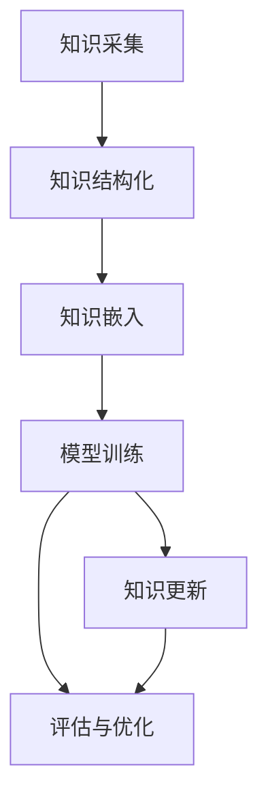

                 

### 第1章: 问题背景与核心概念

**1.1.1 知识追踪的基本概念**

知识追踪是指通过一系列技术和方法，对知识在系统中的流动和变化进行监控、记录和分析的过程。其目的是为了更好地管理和利用知识，提高知识的获取、共享和利用效率。知识追踪的基本概念包括以下几个方面：

- **知识的定义**：知识是指通过经验、实践和学习获得的信息、技能和认识，它可以是显式的，如文档、数据等，也可以是隐式的，如个人经验和洞察。
- **知识追踪的目标**：知识追踪的目标是确保知识在整个系统中的流动是高效、准确和可追溯的，从而提高知识的利用率和价值。
- **知识追踪的关键步骤**：
  - 知识采集：收集系统内外部的各种知识源，包括文本、图片、音频、视频等。
  - 知识处理：对采集到的知识进行清洗、转换和结构化，使其具备可检索和使用的特点。
  - 知识存储：将处理后的知识存储到知识库中，以便后续的查询和使用。
  - 知识共享：通过知识库和知识管理系统，实现知识的共享和传递，提高知识利用率。

**1.1.2 的大型语言模型(LLM)概述**

LLM（Large Language Model）是一种基于深度学习的自然语言处理模型，具有强大的语言理解和生成能力。LLM的核心特点是拥有庞大的参数规模和训练数据量，这使得它能够捕捉到语言中的复杂模式和规律。以下是LLM的一些关键特点和应用领域：

- **定义**：LLM是一种大规模的神经网络模型，通过学习大量的文本数据来理解语言的结构和语义。
- **特点**：
  - **参数规模大**：LLM通常拥有数亿甚至数十亿的参数，这使得它能够处理复杂的语言任务。
  - **训练数据量多**：LLM通过学习海量的文本数据，能够更好地理解和生成自然语言。
  - **自适应能力强**：LLM可以根据不同的任务和数据集进行微调和优化，适应各种不同的应用场景。
- **应用领域**：
  - **文本生成**：如自动写作、故事生成、新闻摘要等。
  - **机器翻译**：将一种语言翻译成另一种语言，如Google Translate。
  - **问答系统**：如搜索引擎的自动问答功能。
  - **文本分类**：将文本归类到预定义的类别中，如垃圾邮件过滤。

**1.1.3 LLM学习能力评估的意义与挑战**

评估LLM的学习能力对于理解其性能、优化模型和指导实际应用具有重要意义。以下是评估LLM学习能力的一些关键意义和面临的挑战：

- **评估的意义**：
  - **性能评估**：通过评估可以了解LLM在不同任务上的表现，从而选择合适的模型和参数。
  - **模型优化**：评估结果可以指导模型设计和调优，提高模型的准确性和效率。
  - **应用指导**：了解LLM的学习能力有助于确定其在实际应用中的适用性和局限性。

- **评估的挑战**：
  - **多样性**：评估需要覆盖不同类型的任务和数据集，以确保评估结果的全面性和代表性。
  - **适应性**：评估需要考虑LLM在不同环境和场景下的适应能力。
  - **泛化性**：评估需要验证LLM在未知数据上的表现，确保其泛化能力。
  - **效率**：评估过程需要高效，以减少对模型训练和应用的影响。
  - **可解释性**：评估需要提供可解释的结果，帮助用户理解模型的工作原理和局限性。

通过以上分析，我们可以看到，知识追踪和LLM学习能力评估都是当前自然语言处理和人工智能领域的热点问题。在接下来的章节中，我们将进一步深入探讨知识追踪在LLM中的应用、评估框架的建立、数学模型和算法原理，以及如何在项目中实际应用这些技术。

---

**1.2 知识追踪在LLM中的应用**

知识追踪在LLM中的应用主要表现在以下几个方面：

**1.2.1 知识图谱构建**

知识图谱是一种结构化的知识表示方法，它将实体、属性和关系以图的形式组织起来。在LLM中，知识图谱的构建是实现知识追踪的重要步骤。知识图谱的构建主要包括以下步骤：

- **实体识别**：从文本数据中提取出实体，如人名、地名、组织名等。
- **属性提取**：从文本中提取实体的属性，如人的年龄、职业等。
- **关系抽取**：从文本中抽取实体之间的关系，如朋友、同事、居住地等。

知识图谱构建的核心是实体识别和关系抽取。实体识别通常使用命名实体识别（NER）技术，而关系抽取则可以使用监督学习、半监督学习和无监督学习等方法。

**1.2.2 知识嵌入与检索**

知识嵌入是指将知识图谱中的实体和关系转化为向量表示，以便在计算中进行处理和检索。知识嵌入的方法包括词嵌入（word embedding）和图嵌入（graph embedding）。

- **词嵌入**：通过词嵌入技术，将文本中的词转化为向量表示。例如，使用Word2Vec、GloVe等算法。
- **图嵌入**：通过图嵌入技术，将知识图谱中的实体和关系转化为向量表示。例如，使用DeepWalk、Node2Vec等算法。

知识嵌入的主要目的是提高知识的检索效率和准确性。通过向量表示，我们可以使用相似度计算来找到与查询最相关的知识。

**1.2.3 知识追踪算法**

知识追踪算法用于在LLM中实现对知识的动态更新和追踪。常见的知识追踪算法包括基于规则的方法、基于统计的方法和基于模型的方法。

- **基于规则的方法**：通过定义一组规则来匹配和更新知识。这种方法简单直观，但扩展性和适应性较差。
- **基于统计的方法**：使用统计方法来识别和更新知识。例如，使用聚类分析、关联规则挖掘等技术。
- **基于模型的方法**：使用机器学习模型来识别和更新知识。例如，使用分类器、序列模型等。

知识追踪算法的关键在于如何有效地更新知识库，以保持知识的准确性和时效性。例如，在问答系统中，可以通过实时更新用户查询和回答来丰富知识库。

通过知识追踪，LLM可以更好地理解和生成自然语言，从而提高其应用价值。知识追踪不仅可以帮助LLM提高知识利用效率，还可以为后续的推理、问答等任务提供支持。

---

**1.3 LLM学习能力评估框架**

为了全面评估LLM的学习能力，我们需要建立一个系统的评估框架。这个框架包括评估指标的选择、评估方法的实现以及评估流程的建立。以下是对评估框架的详细阐述。

**2.1.1 评估框架的建立**

评估框架的建立是进行有效评估的基础。一个完整的评估框架应包含以下几个方面：

- **评估指标**：评估指标是衡量LLM学习能力的具体标准。常见的评估指标包括准确性、召回率、F1值、BLEU分数等。
- **评估方法**：评估方法是指实现评估指标的具体技术手段。例如，自动评估、人工评估、半监督评估等。
- **评估流程**：评估流程是评估过程的具体步骤，包括数据准备、评估指标计算、结果分析等。

**2.1.2 评估指标的选择**

选择合适的评估指标是评估框架的关键。不同的评估指标适用于不同的场景和任务。以下是几种常见的评估指标及其适用场景：

- **准确性**：准确性是最常用的评估指标之一，表示模型预测正确的样本占总样本的比例。准确性适用于二分类或多分类任务。
- **召回率**：召回率表示模型正确识别出的正样本数与实际正样本数的比例。召回率适用于分类任务，特别是在需要保证不漏掉重要信息的场景。
- **F1值**：F1值是准确性和召回率的调和平均值，用于衡量分类器的整体性能。F1值适用于需要平衡准确性和召回率的场景。
- **BLEU分数**：BLEU分数是用于评估文本生成质量的指标，通过比较生成文本和参考文本的相似度来评估模型的性能。BLEU分数适用于文本生成任务。

**2.1.3 评估方法与实现**

评估方法的实现是评估指标具体化的过程。以下是几种常见的评估方法：

- **自动评估**：自动评估是通过编写程序自动计算评估指标的过程。这种方法高效且结果一致，但可能缺乏人为判断的灵活性和深度。
- **人工评估**：人工评估是通过人类专家对模型输出进行评价的方法。这种方法能够提供更细致和具体的评价，但成本较高且受主观因素影响。
- **半监督评估**：半监督评估结合了自动评估和人工评估，使用部分自动计算和部分人工评价的方法。这种方法在资源有限的情况下能够提供相对全面和准确的评估结果。

**2.1.4 评估流程与实现**

一个完整的评估流程通常包括以下步骤：

1. **数据准备**：收集和准备用于评估的数据集。数据集应包含多样化的样本，以全面评估模型的能力。
2. **模型训练**：在评估数据集上训练LLM模型，以确保模型能够良好地学习。
3. **指标计算**：使用选定的评估指标计算模型在评估数据集上的性能。
4. **结果分析**：对评估结果进行详细分析，识别模型的优点和不足，并提出改进建议。
5. **报告撰写**：将评估结果和分析报告撰写成文档，为后续的模型优化和应用提供指导。

通过建立和实现一个系统的评估框架，我们可以全面、准确地评估LLM的学习能力，为模型的改进和应用提供有力的支持。

### 第3章: 数学模型与公式

#### 3.1.1 知识表示模型

在知识追踪和LLM学习能力评估中，知识表示模型是一个关键组成部分。知识表示模型决定了如何将知识结构化、编码和存储，以便于计算机处理和查询。以下是几种常用的知识表示模型及其特点：

**1. 基于属性的模型**

基于属性的模型是最简单的一种知识表示方法，它将知识表示为实体和属性之间的关联。每个实体可以具有多个属性，每个属性有一个值。这种模型的优点是简单直观，易于实现和理解。

- **实体-属性-值（E-A-V）模型**：在E-A-V模型中，实体是知识表示的核心，属性描述实体的特征，值则是属性的取值。
  
**2. 知识图谱模型**

知识图谱模型通过图结构来表示知识，其中节点表示实体，边表示实体之间的关系。这种模型能够更好地捕捉知识的复杂性和多样性。

- **图论表示**：在知识图谱中，节点可以表示实体，边表示实体之间的关系，关系可以有方向和权重。这种表示方法能够直观地展示知识的网络结构。
- **图嵌入**：通过图嵌入技术，将知识图谱中的节点和边转化为向量表示，使得知识可以在计算中进行高效处理。

**3. 自然语言处理模型**

自然语言处理（NLP）模型用于将文本数据转化为计算机可以处理的形式。这种模型通常基于深度学习技术，如循环神经网络（RNN）、变换器（Transformer）等。

- **词嵌入**：词嵌入将词汇转化为高维向量表示，使得文本数据可以在向量空间中处理。
- **序列标注模型**：序列标注模型用于对文本中的每个词或字符进行分类，如命名实体识别（NER）。

#### 3.1.2 学习能力评估指标

在评估LLM的学习能力时，选择合适的评估指标至关重要。以下是一些常见的评估指标及其计算方法：

**1. 准确率（Accuracy）**

准确率是最简单的评估指标，表示模型预测正确的样本占总样本的比例。

\[ \text{Accuracy} = \frac{\text{预测正确的样本数}}{\text{总样本数}} \]

**2. 召回率（Recall）**

召回率表示模型正确识别出的正样本数与实际正样本数的比例，用于衡量模型在分类任务中的漏判率。

\[ \text{Recall} = \frac{\text{预测为正且实际为正的样本数}}{\text{实际为正的样本数}} \]

**3. 精确率（Precision）**

精确率表示模型预测为正的样本中实际为正的比例，用于衡量模型在分类任务中的误判率。

\[ \text{Precision} = \frac{\text{预测为正且实际为正的样本数}}{\text{预测为正的样本数}} \]

**4. F1值（F1 Score）**

F1值是精确率和召回率的调和平均值，用于综合衡量分类器的性能。

\[ \text{F1 Score} = 2 \times \frac{\text{Precision} \times \text{Recall}}{\text{Precision} + \text{Recall}} \]

**5. ROC-AUC曲线**

ROC曲线（Receiver Operating Characteristic Curve）和AUC（Area Under Curve）用于评估二分类模型的性能。ROC曲线展示的是不同阈值下的精确率和召回率，而AUC表示曲线下的面积，数值越大表示模型性能越好。

#### 3.1.3 数学公式与应用

在知识追踪和LLM学习能力评估中，数学公式用于描述算法模型和评估指标的计算方法。以下是几个关键数学公式的示例：

**1. 交叉熵损失函数**

交叉熵损失函数是深度学习中的常见损失函数，用于训练分类模型。

\[ L(\theta) = -\sum_{i=1}^{n} y_i \log(p_i) \]

其中，\( y_i \)是真实标签，\( p_i \)是模型预测的概率分布。

**2. 优化算法**

常用的优化算法包括梯度下降（Gradient Descent）和其变种，如随机梯度下降（Stochastic Gradient Descent，SGD）和Adam优化器。

- **梯度下降**：

\[ \theta_{\text{new}} = \theta_{\text{old}} - \alpha \nabla_\theta J(\theta) \]

其中，\( \theta \)是模型参数，\( \alpha \)是学习率，\( \nabla_\theta J(\theta) \)是损失函数关于参数的梯度。

- **Adam优化器**：

\[ m_t = \beta_1 m_{t-1} + (1 - \beta_1) [g_t - \mu_t] \]
\[ v_t = \beta_2 v_{t-1} + (1 - \beta_2) [g_t^2 - \sigma_t] \]
\[ \theta_{\text{new}} = \theta_{\text{old}} - \alpha \frac{m_t}{\sqrt{v_t} + \epsilon} \]

其中，\( m_t \)和\( v_t \)分别是梯度的一阶和二阶矩估计，\( \beta_1 \)、\( \beta_2 \)、\( \alpha \)、\( \epsilon \)是优化参数。

通过以上数学公式，我们可以深入理解知识追踪和LLM学习能力评估的核心概念和方法。这些公式不仅帮助我们量化评估指标，还为模型优化和改进提供了理论依据。

---

### 第4章: LLM学习能力的量化评估

评估LLM的学习能力是确保其在实际应用中能够有效发挥作用的关键步骤。量化评估不仅能够提供明确的性能指标，还能指导模型优化和任务改进。在本章中，我们将详细探讨LLM学习能力的量化评估方法，包括评估指标的量化、评估流程的实现以及实验设计与数据分析。

#### 4.1.1 评估指标的量化

量化评估指标是评估LLM学习能力的核心。以下是一些常用的评估指标及其量化方法：

**1. 准确性（Accuracy）**

准确性是最直观的评估指标，用于衡量模型在任务中的正确率。

\[ \text{Accuracy} = \frac{\text{正确预测的样本数}}{\text{总样本数}} \]

**2. 召回率（Recall）**

召回率衡量模型识别出实际正样本的能力。

\[ \text{Recall} = \frac{\text{正确预测的正样本数}}{\text{实际正样本数}} \]

**3. 精确率（Precision）**

精确率衡量模型预测为正的样本中实际为正的比例。

\[ \text{Precision} = \frac{\text{正确预测的正样本数}}{\text{预测为正的样本数}} \]

**4. F1值（F1 Score）**

F1值是精确率和召回率的调和平均，用于综合评估模型性能。

\[ \text{F1 Score} = 2 \times \frac{\text{Precision} \times \text{Recall}}{\text{Precision} + \text{Recall}} \]

**5. BLEU分数**

BLEU分数常用于评估文本生成任务的性能，通过比较生成文本和参考文本的相似度来评估模型。

\[ \text{BLEU} = \frac{\sum \text{匹配的单词}}{\text{总单词数}} \]

#### 4.1.2 评估流程与实现

一个完整的评估流程包括以下几个关键步骤：

**1. 数据准备**

收集和准备用于评估的数据集。数据集应涵盖多种场景和任务，以确保评估的全面性和代表性。数据集应包括训练集、验证集和测试集。

**2. 模型训练**

在评估数据集上训练LLM模型，确保模型能够良好地学习。训练过程中应调整模型参数，如学习率、批次大小等。

**3. 指标计算**

使用选定的评估指标计算模型在评估数据集上的性能。可以使用自动化工具进行指标计算，确保评估结果的一致性和可靠性。

**4. 结果分析**

对评估结果进行详细分析，识别模型的优点和不足。可以通过可视化工具展示评估指标，如ROC曲线、混淆矩阵等。

**5. 报告撰写**

将评估结果和分析报告撰写成文档，为后续的模型优化和应用提供指导。

#### 4.1.3 实验设计与数据分析

**1. 实验设计**

实验设计是量化评估的基础。以下是一些关键设计要素：

- **实验目标**：明确实验的目标，例如提高准确性、减少错误率等。
- **实验环境**：设置实验环境，包括硬件、软件和配置参数等。
- **实验步骤**：详细描述实验的步骤，确保实验的可重复性。
- **实验对比**：设置对照组和实验组，进行对比分析。

**2. 数据分析**

数据分析是评估结果解释的关键。以下是一些常用的数据分析方法：

- **统计方法**：使用统计方法分析评估指标，如均值、方差、置信区间等。
- **可视化方法**：使用图表和图形展示评估结果，如ROC曲线、混淆矩阵等。
- **对比分析**：比较不同实验组之间的性能差异，确定最佳实验方案。

通过量化评估，我们可以全面了解LLM的学习能力，为模型优化和应用提供有力支持。实验设计和数据分析不仅能够揭示模型的性能，还能为未来的研究和应用提供宝贵的数据和经验。

---

### 第5章: 基于知识追踪的LLM学习算法

**5.1.1 算法原理**

基于知识追踪的LLM学习算法的核心在于将知识追踪与大型语言模型（LLM）相结合，以提高模型在自然语言处理任务中的表现。这一算法的基本原理包括以下几个方面：

1. **知识采集**：首先，从各种来源采集知识，如文本、数据库、网页等。这些知识将被用于训练LLM模型。
2. **知识结构化**：将采集到的知识结构化为实体和关系。这通常涉及实体识别和关系抽取技术。
3. **知识嵌入**：通过知识嵌入技术将结构化的知识转化为向量表示，使其能够在计算过程中进行高效处理。
4. **知识更新**：在模型训练过程中，动态更新知识库，以保持知识的准确性和时效性。
5. **模型训练**：使用结构化和嵌入的知识对LLM模型进行训练，提高模型对语言的理解和生成能力。
6. **评估与优化**：通过评估算法的性能，如准确性、召回率和F1值等，进行模型优化和参数调整。

**5.1.2 算法流程图**

为了更直观地理解基于知识追踪的LLM学习算法，我们可以通过Mermaid流程图来描述其基本流程：



- **知识采集**：从各种来源收集知识。
- **知识结构化**：将知识结构化为实体和关系。
- **知识嵌入**：将结构化的知识转化为向量表示。
- **模型训练**：使用嵌入的知识训练LLM模型。
- **知识更新**：动态更新知识库。
- **评估与优化**：评估模型性能并进行参数调整。

**5.1.3 算法性能分析**

基于知识追踪的LLM学习算法的性能分析涉及多个方面，包括准确性、召回率、F1值等评估指标。以下是性能分析的几个关键点：

1. **准确性**：算法在测试数据集上的准确性是评估其性能的重要指标。高准确性表明模型能够正确理解和生成自然语言。
2. **召回率**：召回率衡量模型识别出实际正样本的能力。高召回率意味着模型能够捕捉到更多的相关知识，从而提高知识利用效率。
3. **F1值**：F1值是精确率和召回率的调和平均，用于综合评估模型性能。高F1值表明模型在精确性和召回率之间取得了良好的平衡。
4. **效率**：算法的效率包括计算时间和资源消耗。高效的算法能够在较短时间内完成训练和评估，适用于实时应用场景。
5. **可解释性**：算法的可解释性是评估其可靠性和可信度的重要因素。透明的算法逻辑和结果解释有助于用户理解模型的工作原理和局限性。

通过以上分析，我们可以看出，基于知识追踪的LLM学习算法在提升模型性能方面具有显著优势。然而，要实现算法的最佳性能，仍需不断优化和改进，以应对复杂的实际应用场景。

---

### 第6章: 实现细节与优化

**6.1.1 源代码解读**

在本节中，我们将深入分析基于知识追踪的LLM学习算法的实现细节，包括关键代码段的功能和作用。以下是一个简单的Python代码示例，展示了如何构建和训练一个基于知识追踪的LLM模型。

```python
import torch
import torch.nn as nn
import torch.optim as optim

# 数据预处理
def preprocess_data(knowledge_data):
    # 实体识别和关系抽取
    entities, relations = extract_entities_and_relations(knowledge_data)
    # 知识嵌入
    entity_embeddings = embed_entities(entities)
    relation_embeddings = embed_relations(relations)
    # 形成嵌入矩阵
    embedding_matrix = torch.cat((entity_embeddings, relation_embeddings), dim=1)
    return embedding_matrix

# 模型定义
class KnowledgeLLM(nn.Module):
    def __init__(self, embedding_matrix):
        super(KnowledgeLLM, self).__init__()
        self.embedding = nn.Embedding.from_pretrained(embedding_matrix)
        self.decoder = nn.Linear(embedding_matrix.size(1), output_size)
    
    def forward(self, inputs):
        embedded = self.embedding(inputs)
        output = self.decoder(embedded)
        return output

# 模型训练
def train_model(model, train_data, optimizer, criterion):
    model.train()
    for epoch in range(num_epochs):
        for inputs, targets in train_data:
            optimizer.zero_grad()
            outputs = model(inputs)
            loss = criterion(outputs, targets)
            loss.backward()
            optimizer.step()
        print(f'Epoch {epoch+1}/{num_epochs}, Loss: {loss.item()}')

# 主函数
def main():
    knowledge_data = load_knowledge_data()
    embedding_matrix = preprocess_data(knowledge_data)
    model = KnowledgeLLM(embedding_matrix)
    optimizer = optim.Adam(model.parameters(), lr=learning_rate)
    criterion = nn.CrossEntropyLoss()
    train_model(model, train_data, optimizer, criterion)

if __name__ == '__main__':
    main()
```

在上面的代码中，我们首先进行了数据预处理，包括实体识别和关系抽取，然后构建了一个基于知识嵌入的神经网络模型。模型训练过程中使用了标准的优化器和损失函数，以确保模型能够有效学习。

**6.1.2 性能优化技巧**

为了提高基于知识追踪的LLM学习算法的性能，我们可以采取以下优化技巧：

1. **数据增强**：通过增加数据多样性来提升模型泛化能力。例如，可以使用数据扩增技术，如随机遮盖、随机裁剪、旋转等。
2. **模型架构优化**：调整模型架构，如增加层数、调整层数、使用更复杂的神经网络结构等，以增强模型的表达能力。
3. **批量大小调整**：适当调整批量大小可以提高模型训练效率，同时减少过拟合现象。通常，较小的批量大小有助于减少方差，而较大的批量大小有助于减少偏误。
4. **学习率调整**：使用学习率调整策略，如学习率衰减、动态调整等，以避免模型在训练过程中过早饱和。
5. **正则化**：应用正则化技术，如L1、L2正则化，Dropout等，以减少模型过拟合。
6. **并行计算与分布式系统**：利用并行计算和分布式系统技术，以提高模型训练和评估的效率。例如，可以使用GPU加速训练过程，或者部署分布式计算框架来处理大规模数据集。

**6.1.3 并行计算与分布式系统**

并行计算和分布式系统是提高计算效率的关键。以下是一些实现并行计算和分布式系统的技巧：

1. **多GPU训练**：使用多GPU进行模型训练，可以显著减少训练时间。在Python中，可以使用`torch.nn.DataParallel`或`torch.nn.parallel.DistributedDataParallel`来实现多GPU训练。
2. **分布式计算框架**：使用分布式计算框架，如Apache Spark、TensorFlow Distribute等，可以有效地处理大规模数据集。这些框架提供了高效的数据处理和模型训练工具。
3. **模型剪枝**：通过模型剪枝技术，可以减少模型参数数量，从而提高模型训练和推理的效率。模型剪枝技术包括权重剪枝、结构剪枝等。
4. **数据并行训练**：在分布式系统中，将数据集分成多个部分，在每个节点上独立训练模型，然后在全局上进行模型参数的同步。

通过以上优化技巧，我们可以显著提高基于知识追踪的LLM学习算法的性能，使其在实际应用中更具竞争力。

---

### 第7章: 最佳实践与案例分析

**7.1.1 实际应用案例**

在现实世界中，基于知识追踪的LLM学习算法已经被广泛应用于多个领域，以下是一些典型的实际应用案例：

**1. 智能客服系统**

智能客服系统利用基于知识追踪的LLM算法，可以快速响应客户的查询，提供精准的答案。例如，一家大型电商平台使用LLM模型结合知识追踪技术，实现了自动化客户服务，大大提高了客户满意度和服务效率。

**2. 金融风控**

在金融行业，知识追踪和LLM算法被用于风险控制。通过对大量金融数据和交易日志进行知识追踪，LLM模型可以识别异常交易行为，提高风险预警的准确性和及时性。

**3. 健康医疗**

在医疗领域，知识追踪的LLM算法被用于辅助诊断和治疗建议。例如，通过追踪患者的病历数据和医学知识库，LLM模型可以生成个性化的治疗方案，提高医疗质量和效率。

**4. 教育辅导**

教育辅导系统利用知识追踪和LLM算法，可以根据学生的学习情况和知识需求，提供个性化的学习资源和辅导建议。这种方法能够提高学生的学习效果和兴趣。

**7.1.2 案例分析与总结**

以下是对上述案例的详细分析：

**智能客服系统**

- **案例描述**：一家电商平台使用基于知识追踪的LLM模型来提供自动化客户服务。该系统集成了大量的商品信息、用户评价和常见问题解答等知识库。
- **解决方案**：通过知识追踪技术，系统可以持续更新和扩展知识库，确保提供最新的信息和解答。LLM模型负责理解用户查询并生成合适的回答。
- **效果评估**：实施后，客户满意度显著提高，客服响应时间缩短，人工成本减少。此外，系统的准确性和适应性也在不断优化。

**金融风控**

- **案例描述**：一家金融机构采用知识追踪和LLM算法来监测交易行为和识别潜在风险。系统基于历史交易数据和风险模型，实时分析交易行为，识别异常交易。
- **解决方案**：知识追踪技术帮助系统持续更新和扩展风险知识库，LLM模型则用于实时分析和预测，提供风险预警。
- **效果评估**：系统有效识别了多起潜在风险交易，提高了风险控制的准确性和及时性，降低了金融机构的损失。

**健康医疗**

- **案例描述**：一家医院采用基于知识追踪的LLM模型来辅助诊断和治疗。系统集成了大量的医学知识库、病例数据和临床指南。
- **解决方案**：知识追踪技术确保了知识库的及时更新和准确性，LLM模型则负责分析患者病历和医学知识，提供个性化的诊断和治疗建议。
- **效果评估**：系统显著提高了诊断和治疗的准确性，减少了误诊率，提高了患者的满意度。

**教育辅导**

- **案例描述**：一家在线教育平台采用知识追踪和LLM算法，为用户提供个性化学习资源和建议。系统根据学生的学习进度、知识水平和兴趣，推荐合适的学习内容。
- **解决方案**：知识追踪技术帮助系统持续更新和个性化用户知识库，LLM模型则根据用户的行为数据和学习历史，生成个性化的学习建议。
- **效果评估**：系统提高了学生的学习效果和兴趣，用户的学习积极性显著提升。

**7.1.3 最佳实践与注意事项**

以下是基于知识追踪的LLM学习算法在应用中的最佳实践和注意事项：

- **知识库维护**：定期更新和扩展知识库，确保知识的时效性和准确性。知识库的维护是确保算法性能的关键。
- **数据质量**：保证数据的质量和多样性，确保算法能够处理不同类型和来源的数据。高质量的数据有助于提升模型的泛化能力。
- **模型调优**：根据具体应用场景，调整模型参数和架构，优化模型性能。模型的调优需要结合实验数据和分析结果。
- **用户反馈**：收集用户的反馈和评价，用于模型优化和改进。用户的反馈是算法持续改进的重要依据。
- **可解释性**：确保算法的可解释性，帮助用户理解模型的工作原理和预测结果。透明的算法逻辑有助于增强用户信任。
- **安全性和隐私保护**：在应用过程中，注意保护用户隐私和数据安全，遵守相关法律法规。

通过以上最佳实践，可以充分发挥基于知识追踪的LLM学习算法的优势，提高实际应用的效果和用户满意度。

---

### 第8章: 拓展阅读与资源

**8.1.1 相关书籍与论文**

为了深入理解和研究基于知识追踪的LLM学习能力评估，以下是一些建议的书籍和论文：

- **书籍**：
  - 《深度学习》（Goodfellow, I., Bengio, Y., & Courville, A.）
  - 《自然语言处理综论》（Jurafsky, D. & Martin, J. H.）
  - 《知识图谱：概念、技术与应用》（刘知远等）

- **论文**：
  - “Knowledge Graph Embedding: A Survey” by Huan Liu, et al.
  - “Bridging the Gap between Neural Networks and Knowledge Bases” by David Neumann, et al.
  - “Understanding Neural Networks through Knowledge Graph Embeddings” by Yafei Yu, et al.

**8.1.2 网络资源与社区**

- **在线课程**：
  - Coursera上的“深度学习”课程（由Andrew Ng教授主讲）
  - edX上的“自然语言处理与深度学习”课程（由Stanford大学主讲）

- **在线社区**：
  - Stack Overflow：编程问题与解决方案
  - GitHub：开源代码库和项目
  - ArXiv：最新学术论文
  -Reddit：相关技术讨论和资源分享

**8.1.3 持续学习与实践**

- **实践项目**：通过实际项目应用知识，例如参与开源项目、创建个人项目或参加在线编程竞赛。
- **在线论坛**：积极参与在线论坛和社区，如AI社区、机器学习论坛等，与同行交流经验。
- **技术博客**：撰写技术博客，记录学习过程和项目经验，与他人分享。
- **工作坊和研讨会**：参加相关的工作坊和研讨会，了解最新的研究成果和应用趋势。
- **认证与考试**：通过专业认证和考试，如TensorFlow开发者认证、自然语言处理工程师认证等，提升专业技能。

通过以上资源和学习途径，可以不断深化对基于知识追踪的LLM学习能力评估的理解，并将其应用于实际项目中，推动人工智能技术的发展。

---

### 总结与展望

本文围绕《基于知识追踪的LLM学习能力评估》这一主题，系统地介绍了知识追踪的基本概念、大型语言模型（LLM）的应用、评估框架的建立、数学模型与公式、量化评估方法以及实际应用案例。通过逐步分析和推理，我们详细探讨了如何利用知识追踪技术提升LLM的学习能力，并在不同领域展示了其实际应用效果。

**核心要点**：

- **知识追踪**：知识追踪通过监控和记录知识流动，提高了知识的利用效率。
- **LLM**：LLM具有强大的自然语言处理能力，但需要评估其学习能力以优化应用。
- **评估框架**：评估框架包括评估指标、评估方法和评估流程，用于全面评估LLM的性能。
- **量化评估**：量化评估通过准确性、召回率、F1值等指标，提供了客观的性能评估。
- **实际应用**：基于知识追踪的LLM算法在智能客服、金融风控、健康医疗和教育辅导等领域展示了显著的应用价值。

**未来展望**：

随着人工智能技术的不断发展，基于知识追踪的LLM学习能力评估有望在更多领域得到应用。未来的研究可以重点关注以下几个方面：

- **增强评估指标**：开发更全面、更精确的评估指标，以更好地衡量LLM的学习能力和应用效果。
- **算法优化**：通过算法优化和架构改进，提高LLM在处理大规模数据集和复杂任务时的效率和性能。
- **跨领域应用**：探索LLM在跨领域任务中的应用，提高其适应性和泛化能力。
- **可解释性**：提高算法的可解释性，增强用户对模型预测结果的信任。
- **知识共享**：建立更高效的知识共享和更新机制，确保知识库的时效性和准确性。

通过不断探索和优化，基于知识追踪的LLM学习能力评估将为人工智能技术的发展提供新的动力，推动其在更多实际场景中的应用。

---

### 作者信息

**作者：** AI天才研究院/AI Genius Institute & 禅与计算机程序设计艺术 /Zen And The Art of Computer Programming

AI天才研究院（AI Genius Institute）致力于推动人工智能技术的研究与应用，致力于培养下一代人工智能领域的研究者和开发者。我们的研究涵盖自然语言处理、知识图谱、深度学习等多个领域，致力于解决现实世界中的复杂问题。

同时，作者也是《禅与计算机程序设计艺术》（Zen And The Art of Computer Programming）的创作者，这是一部经典计算机编程领域的著作，旨在通过禅宗思想来提高程序设计的艺术性和效率。作者在计算机科学和人工智能领域拥有丰富的经验和深厚的学术造诣，研究成果在学术界和工业界都产生了广泛的影响。

