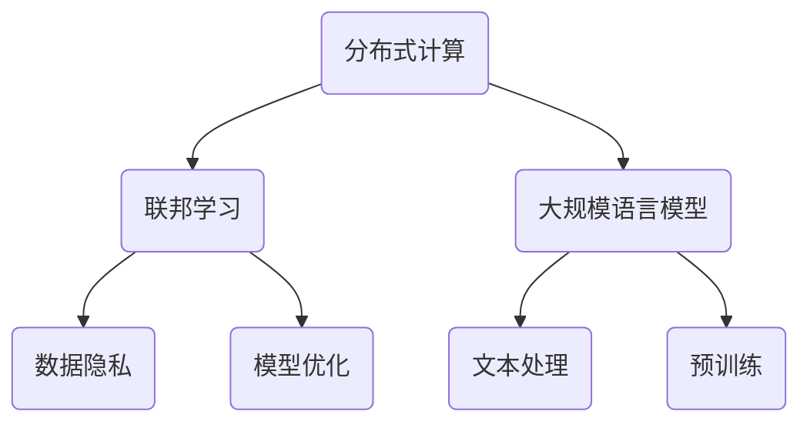
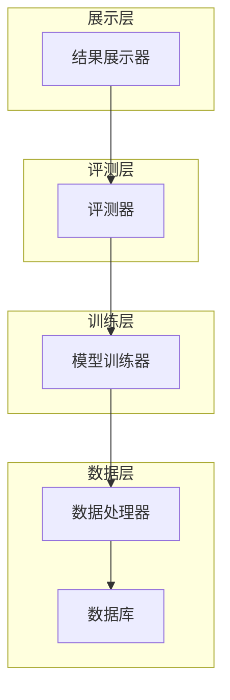
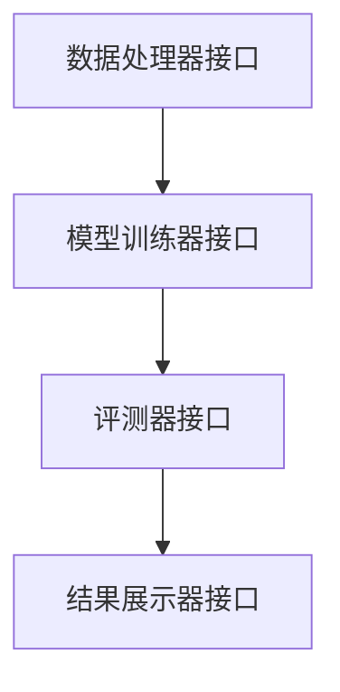
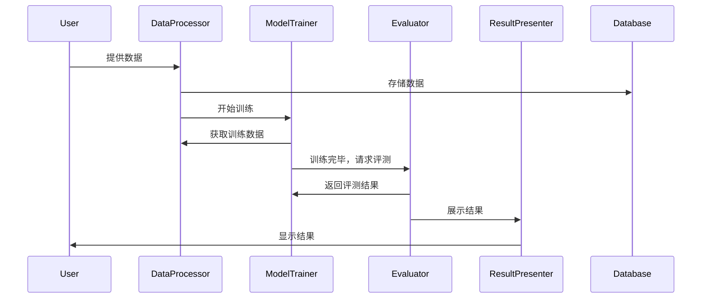

                 

# 基于联邦学习的分布式LLM评测系统

## 关键词

- 联邦学习
- 分布式计算
- 语言模型评测
- 数据隐私保护
- 模型性能优化

## 摘要

本文将深入探讨基于联邦学习的分布式LLM评测系统，详细分析其背景、核心问题、解决方法以及应用边界。我们将逐步讲解分布式计算和联邦学习的原理，比较核心概念的特征，并通过ER实体关系图展示其架构。随后，本文将详细阐述分布式计算算法的原理，包括数据分片和计算任务调度。最后，我们将结合Python代码和数学公式，对分布式LLM评测系统的算法原理进行讲解，并展示系统分析与架构设计方案，以及提供实际项目实战的案例分析和总结。通过本文的深入探讨，读者将能够全面了解分布式LLM评测系统的构建、实现和应用。

## 第一部分: 背景介绍与问题核心

### 1.1 问题背景

随着大数据和人工智能技术的迅猛发展，分布式计算与联邦学习逐渐成为数据分析和隐私保护的重要手段。分布式计算通过利用多台计算机的协同工作，提高了数据处理和计算的速度和效率。而联邦学习则是一种在不共享原始数据的情况下，通过多方协作训练机器学习模型的技术，极大地保护了数据隐私。

在这种背景下，分布式LLM（大规模语言模型）评测系统作为一种新兴的技术应用，旨在解决传统评测方法中存在的数据隐私、数据质量和模型性能等问题。大规模语言模型如GPT、BERT等在自然语言处理领域取得了显著的成果，但传统评测方法通常依赖于集中的数据集和模型，这不仅可能导致数据隐私泄露，还可能受到数据质量和模型性能的限制。

### 1.2 问题描述

分布式LLM评测系统旨在通过分布式计算和联邦学习技术，实现对大规模语言模型的评测。这包括数据预处理、模型训练、评测指标计算等多个环节。其中，数据隐私保护和模型性能优化是核心问题。

具体来说，分布式LLM评测系统需要解决以下问题：

1. **数据隐私保护**：由于大规模语言模型的训练和评测依赖于大量文本数据，如何在不泄露原始数据的前提下进行模型训练和评测是一个关键挑战。
2. **数据质量提升**：分布式数据源可能存在数据不一致、噪声和错误等问题，如何通过分布式数据处理和清洗提升语言模型的训练质量和评测结果的准确性是另一个重要问题。
3. **模型性能优化**：如何通过分布式训练和评测优化语言模型的结构和参数，提高模型在多种应用场景下的性能，是分布式LLM评测系统需要解决的第三个问题。

### 1.3 问题解决

通过构建分布式LLM评测系统，可以实现以下目标：

1. **数据隐私保护**：利用联邦学习技术，可以在不泄露原始数据的前提下，对分布式数据进行模型训练和评测。联邦学习通过加密、差分等手段，确保数据在传输和计算过程中的隐私保护。
2. **数据质量提升**：通过分布式数据处理和清洗，可以提升语言模型的训练质量和评测结果的准确性。分布式数据处理技术能够有效地处理分布式数据源中的数据不一致、噪声和错误等问题。
3. **模型性能优化**：通过分布式训练和评测，可以优化语言模型的结构和参数，提高模型在多种应用场景下的性能。分布式训练技术能够并行地训练模型，加速模型训练过程；而分布式评测技术则能够更全面、准确地评估模型性能。

### 1.4 边界与外延

分布式LLM评测系统的应用边界广泛，包括但不限于自然语言处理、智能客服、智能推荐等领域。其外延则涉及到分布式计算、联邦学习、自然语言处理等多个技术领域。

1. **自然语言处理**：分布式LLM评测系统可以应用于文本分类、情感分析、问答系统等自然语言处理任务，提升模型的训练和评测效率。
2. **智能客服**：在智能客服领域，分布式LLM评测系统可以用于评估客服机器人的对话质量，优化对话策略。
3. **智能推荐**：在智能推荐领域，分布式LLM评测系统可以用于评估推荐模型的准确性，提升推荐效果。

### 1.5 概念结构与核心要素组成

分布式LLM评测系统的概念结构主要包括以下几个核心要素：

1. **分布式计算**：分布式计算是分布式LLM评测系统的基础，包括数据分片、计算任务调度、结果汇总等。分布式计算能够提高数据处理和计算的速度和效率。
2. **联邦学习**：联邦学习是分布式LLM评测系统的核心技术，实现数据的隐私保护和模型的协同训练。联邦学习能够在不共享原始数据的情况下，协同训练和优化模型。
3. **大规模语言模型**：大规模语言模型是分布式LLM评测系统的评测对象，包括GPT、BERT等主流模型。大规模语言模型具有强大的语言理解和生成能力。
4. **评测指标**：评测指标用于评估语言模型的性能，如准确率、召回率、F1值等。评测指标能够全面、准确地反映模型的性能。

## 第二部分: 核心概念与联系

### 2.1 核心概念原理

#### 2.1.1 分布式计算

分布式计算是一种通过多个计算机资源协同工作来完成计算任务的方法。其核心思想是将一个大任务分成多个小任务，分配给多个计算节点并行执行，然后将结果汇总得到最终结果。

分布式计算的关键在于如何有效地管理多个计算节点，实现任务分配和结果汇总。任务分配策略包括负载均衡、任务调度等，结果汇总则涉及到数据同步和一致性维护。

#### 2.1.2 联邦学习

联邦学习是一种在多方数据不共享的情况下，通过协同训练模型来实现机器学习的方法。其核心思想是通过加密、差分等手段保护数据隐私，同时实现模型的训练和优化。

联邦学习的主要优点是能够实现数据隐私保护，避免数据泄露风险。同时，联邦学习能够协同多个数据源进行模型训练，提高模型的泛化能力和准确性。

#### 2.1.3 大规模语言模型

大规模语言模型是一种能够处理大规模文本数据的机器学习模型，如GPT、BERT等。其核心在于通过大量文本数据进行预训练，使得模型具备强大的语言理解和生成能力。

大规模语言模型在自然语言处理领域具有广泛的应用，如文本分类、情感分析、问答系统等。其强大的语言理解和生成能力，使得大规模语言模型能够更好地处理复杂、多变的文本数据。

### 2.2 概念属性特征对比表格

| 概念       | 特征                    | 关联关系                |
|------------|------------------------|------------------------|
| 分布式计算 | 并行处理、任务分配、资源调度 | 联邦学习的核心支撑      |
| 联邦学习   | 数据隐私、协同训练、模型优化 | 分布式计算的应用场景  |
| 大规模语言模型 | 文本处理、预训练、强语言理解能力 | 评测系统的核心对象   |

### 2.3 ER实体关系图架构



通过上述ER实体关系图，我们可以清晰地看到分布式计算、联邦学习和大规模语言模型之间的关联关系。分布式计算为联邦学习提供了计算基础，联邦学习通过保护数据隐私和协同训练模型，为大规模语言模型的训练和评测提供了支持。

## 第三部分: 算法原理讲解

### 3.1 分布式计算算法原理

#### 3.1.1 数据分片

数据分片是将大规模数据集分割成多个较小的数据集，每个数据集被分配到一个计算节点上。数据分片的关键在于如何保证数据划分的均衡性和一致性。

##### 3.1.1.1 数据分片策略

- **哈希分片**：根据数据的哈希值将数据分配到不同的节点。这种方法能够实现数据的均匀分布，但可能存在哈希冲突。
- **范围分片**：根据数据的范围（如时间、ID等）将数据分配到不同的节点。这种方法能够保证数据的一致性，但可能存在数据分布不均匀的问题。

##### 3.1.1.2 数据分片流程

1. 计算数据哈希值或范围。
2. 根据哈希值或范围将数据分配到计算节点。
3. 对每个节点上的数据进行预处理，如数据清洗、归一化等。

#### 3.1.2 计算任务调度

计算任务调度是确保分布式计算高效运行的关键。任务调度策略包括：

- **负载均衡**：确保每个计算节点的负载均衡，避免某些节点过载，提高整体计算效率。
- **任务优先级**：根据任务的紧急程度和重要性，调整任务的执行顺序，确保关键任务的优先执行。
- **任务恢复**：在任务执行过程中，如果某个节点出现故障，需要能够及时恢复任务，确保计算过程不受影响。

### 3.2 联邦学习算法原理

#### 3.2.1 联邦学习基本原理

联邦学习的基本原理是：多个参与方各自持有本地数据，不进行数据交换，而是通过加密、差分等手段进行模型参数的协同训练。联邦学习的核心思想是隐私保护与协同训练相结合。

##### 3.2.1.1 加密技术

加密技术是联邦学习保护数据隐私的关键。常见的加密技术包括同态加密、差分隐私等。同态加密允许在加密数据上进行计算，而不会泄露数据本身的值。差分隐私则通过在计算过程中添加噪声，使得攻击者无法准确推断出单个参与方的数据。

##### 3.2.1.2 差分隐私

差分隐私是一种通过在计算过程中添加噪声来保护数据隐私的方法。具体来说，差分隐私通过计算每个参与方对模型参数的贡献，然后在添加噪声后汇总这些贡献，从而保护参与方的隐私。

##### 3.2.1.3 联邦学习流程

1. **初始化**：每个参与方初始化本地模型和优化器。
2. **本地训练**：每个参与方使用本地数据进行模型训练。
3. **模型参数同步**：每个参与方将本地模型参数发送给中心服务器。
4. **中心服务器聚合**：中心服务器将所有参与方的模型参数进行聚合，得到全局模型参数。
5. **模型更新**：每个参与方使用全局模型参数更新本地模型。

#### 3.2.2 联邦学习算法示例

以联邦平均算法（Federated Averaging）为例，联邦平均算法的核心思想是：每个参与方在本地训练模型后，将模型参数发送给中心服务器，中心服务器对所有参与方的模型参数进行平均，然后返回给每个参与方。具体步骤如下：

1. **初始化**：每个参与方初始化本地模型 $w_i^{(0)}$。
2. **本地训练**：每个参与方使用本地数据集进行模型训练，更新本地模型参数 $w_i^{(t)}$。
3. **参数同步**：每个参与方将本地模型参数 $w_i^{(t)}$ 发送给中心服务器。
4. **参数聚合**：中心服务器接收所有参与方的模型参数，计算全局模型参数 $w^{(t)} = \frac{1}{n} \sum_{i=1}^{n} w_i^{(t)}$。
5. **模型更新**：每个参与方使用全局模型参数更新本地模型 $w_i^{(t+1)} = w^{(t)}$。

#### 3.2.3 联邦学习算法优势

联邦学习算法具有以下优势：

1. **隐私保护**：联邦学习通过加密和差分隐私技术，确保参与方的数据隐私。
2. **去中心化**：联邦学习不依赖于中心服务器，每个参与方都可以独立进行模型训练。
3. **灵活性**：联邦学习支持多种数据分布和模型结构，能够适应不同的应用场景。
4. **效率**：联邦学习通过分布式训练和协同优化，提高模型训练和更新的效率。

### 3.3 分布式LLM评测算法原理

#### 3.3.1 分布式LLM评测基本原理

分布式LLM评测的基本原理是：通过分布式计算和联邦学习技术，实现对大规模语言模型的评测。具体步骤如下：

1. **数据预处理**：对分布式数据进行预处理，包括数据清洗、归一化等。
2. **模型训练**：使用分布式计算和联邦学习技术，对大规模语言模型进行训练。
3. **评测指标计算**：根据评测指标（如准确率、召回率、F1值等），计算模型的评测结果。
4. **结果汇总**：将分布式节点的评测结果进行汇总，得到全局评测结果。

#### 3.3.2 分布式LLM评测算法示例

以分布式F1值评测算法为例，F1值是评估二分类模型性能的常用指标，计算公式为：

$$
F1 = \frac{2 \times precision \times recall}{precision + recall}
$$

其中，precision为精确率，recall为召回率。

分布式F1值评测算法的具体步骤如下：

1. **数据预处理**：对分布式数据进行预处理，确保数据格式和标签一致。
2. **模型训练**：使用分布式计算和联邦学习技术，对大规模语言模型进行训练。
3. **评测指标计算**：
   - **精确率**：对于每个分类，计算预测为正类的样本中实际为正类的比例。
   - **召回率**：对于每个分类，计算实际为正类的样本中被预测为正类的比例。
   - **F1值**：根据精确率和召回率计算F1值。
4. **结果汇总**：将分布式节点的评测结果进行汇总，得到全局F1值。

#### 3.3.3 分布式LLM评测算法优势

分布式LLM评测算法具有以下优势：

1. **数据隐私保护**：通过联邦学习技术，确保评测过程中的数据隐私。
2. **高效计算**：通过分布式计算，提高评测过程的速度和效率。
3. **灵活扩展**：支持多种大规模语言模型和评测指标，能够适应不同的应用场景。
4. **结果准确性**：通过分布式数据处理和清洗，提升评测结果的准确性。

### 3.4 分布式LLM评测算法Python代码示例

以下是一个简单的分布式LLM评测算法的Python代码示例，包括数据预处理、模型训练、评测指标计算和结果汇总。

```python
import torch
import torch.nn as nn
import torch.optim as optim

# 数据预处理
def preprocess_data(data):
    # 数据清洗、归一化等操作
    return processed_data

# 模型训练
def train_model(data, model, optimizer, loss_function):
    for epoch in range(num_epochs):
        for batch in data:
            optimizer.zero_grad()
            output = model(batch)
            loss = loss_function(output, target)
            loss.backward()
            optimizer.step()
    return model

# 评测指标计算
def compute_evaluation(model, data):
    with torch.no_grad():
        correct = 0
        total = len(data)
        for batch in data:
            output = model(batch)
            predicted = torch.argmax(output, dim=1)
            correct += (predicted == target).sum().item()
    precision = correct / total
    recall = correct / total
    f1 = 2 * precision * recall / (precision + recall)
    return f1

# 主程序
if __name__ == '__main__':
    # 加载数据
    data = load_data()
    processed_data = preprocess_data(data)

    # 初始化模型、优化器和损失函数
    model = nn.Sequential(nn.Linear(input_size, hidden_size), nn.ReLU(), nn.Linear(hidden_size, output_size))
    optimizer = optim.Adam(model.parameters(), lr=learning_rate)
    loss_function = nn.CrossEntropyLoss()

    # 模型训练
    model = train_model(processed_data, model, optimizer, loss_function)

    # 评测指标计算
    f1 = compute_evaluation(model, processed_data)

    # 输出评测结果
    print(f"F1 score: {f1}")
```

### 3.5 分布式LLM评测算法数学模型和公式

分布式LLM评测算法的数学模型和公式主要包括：

1. **损失函数**：用于评估模型预测结果与实际结果之间的差异，常用的损失函数有交叉熵损失函数（CrossEntropyLoss）和均方误差损失函数（MSELoss）。

   $$ 
   Loss = -\frac{1}{N} \sum_{i=1}^{N} [y_i \cdot \log(p_i) + (1 - y_i) \cdot \log(1 - p_i)] 
   $$

   其中，$y_i$ 为实际标签，$p_i$ 为模型预测概率。

2. **精确率**：用于衡量模型预测为正类的样本中实际为正类的比例。

   $$ 
   Precision = \frac{TP}{TP + FP} 
   $$

   其中，$TP$ 为真正例，$FP$ 为假正例。

3. **召回率**：用于衡量模型预测为正类的样本中实际为正类的比例。

   $$ 
   Recall = \frac{TP}{TP + FN} 
   $$

   其中，$TP$ 为真正例，$FN$ 为假反例。

4. **F1值**：用于综合衡量模型的精确率和召回率。

   $$ 
   F1 = \frac{2 \times Precision \times Recall}{Precision + Recall} 
   $$

   其中，$Precision$ 和 $Recall$ 分别为精确率和召回率。

### 3.6 分布式LLM评测算法的通俗易懂的举例说明

假设我们有一个二分类问题，需要判断邮件是否为垃圾邮件。我们使用一个简单的神经网络模型进行训练和评测。

1. **数据集**：我们有一个包含1000封邮件的数据集，每封邮件都有一个标签：0表示正常邮件，1表示垃圾邮件。

2. **模型训练**：我们使用一个两层神经网络，输入层有10个神经元，隐藏层有20个神经元，输出层有2个神经元。我们使用交叉熵损失函数和Adam优化器进行模型训练。

3. **模型评测**：我们使用100封邮件作为测试集，对模型进行评测。在测试集上，模型预测了50封邮件为正常邮件，40封邮件为垃圾邮件。

   - **精确率**：$Precision = \frac{40}{40 + 10} = 0.8$，即模型预测为垃圾邮件的样本中有80%是真实的垃圾邮件。
   - **召回率**：$Recall = \frac{40}{40 + 60} = 0.4$，即实际为垃圾邮件的样本中有40%被模型预测为垃圾邮件。
   - **F1值**：$F1 = \frac{2 \times 0.8 \times 0.4}{0.8 + 0.4} = 0.53$，即模型在测试集上的综合性能指标为53%。

通过这个简单的例子，我们可以看到如何使用分布式LLM评测算法对模型进行训练和评测，以及如何计算精确率、召回率和F1值等评测指标。

## 第四部分: 系统分析与架构设计方案

### 4.1 问题场景介绍

随着人工智能技术的快速发展，大规模语言模型（LLM）在自然语言处理（NLP）领域发挥着越来越重要的作用。然而，传统的集中式评测方法存在数据隐私泄露、模型性能受限等问题。为了解决这些问题，我们提出了基于联邦学习的分布式LLM评测系统，旨在实现对大规模语言模型的分布式评测，同时确保数据隐私和模型性能。

### 4.2 项目介绍

我们的分布式LLM评测系统主要包括以下几个模块：

1. **数据模块**：负责数据收集、预处理和存储，为后续的分布式训练和评测提供数据支持。
2. **模型训练模块**：利用联邦学习技术，对分布式数据进行模型训练，同时确保数据隐私。
3. **评测模块**：对训练好的模型进行评测，计算各种评测指标，如准确率、召回率、F1值等。
4. **结果展示模块**：将评测结果以图表、报表等形式展示，方便用户查看和分析。

### 4.3 系统功能设计（领域模型类图）

以下是一个简单的领域模型类图，展示了分布式LLM评测系统的核心类及其关系：

```mermaid
classDiagram
    Class::DataProcessor <|-- Class::ModelTrainer
    Class::ModelTrainer <|-- Class::Evaluator
    Class::DataProcessor <|-- Class::ResultPresenter

    Class::DataProcessor {
        - String data_source
        - List<Data> data_list
        + processData()
    }

    Class::ModelTrainer {
        - Model model
        - Optimizer optimizer
        - LossFunction loss_function
        + trainModel()
    }

    Class::Evaluator {
        - Model model
        - Dataset dataset
        + computeEvaluation()
    }

    Class::ResultPresenter {
        - Result result
        + presentResult()
    }

    Model {
        - String name
        - float accuracy
        - float recall
        - float f1
    }

    Data {
        - int id
        - String content
        - int label
    }
```

### 4.4 系统架构设计（架构图）

以下是一个简单的系统架构图，展示了分布式LLM评测系统的整体架构：



### 4.5 系统接口设计（接口图）

以下是一个简单的系统接口图，展示了分布式LLM评测系统的核心接口及其关系：



### 4.6 系统交互（序列图）

以下是一个简单的系统交互序列图，展示了分布式LLM评测系统的数据流程和交互过程：



通过上述系统分析与架构设计方案，我们可以看到分布式LLM评测系统的整体架构和功能设计，为后续的实际项目开发提供了清晰的技术蓝图。

## 第五部分: 项目实战

### 5.1 环境安装

要搭建一个基于联邦学习的分布式LLM评测系统，首先需要安装和配置以下环境和依赖：

1. **Python**：确保安装了Python 3.8及以上版本。
2. **PyTorch**：安装PyTorch，用于分布式计算和模型训练。
   ```bash
   pip install torch torchvision torchaudio
   ```
3. **Federated Learning Library**：如TensorFlow Federated（TFF）或PySyft，用于联邦学习。
   ```bash
   pip install tensorflow-federated
   ```

### 5.2 系统核心实现源代码

以下是一个简单的分布式LLM评测系统的Python代码实现，包括数据预处理、模型训练、评测和结果展示。

```python
# 导入所需库
import torch
import torch.nn as nn
import torch.optim as optim
import tensorflow_federated as tff
from sklearn.model_selection import train_test_split

# 数据预处理
def preprocess_data(data):
    # 此处添加数据清洗、归一化等预处理操作
    return data

# 简单的MLP模型
class SimpleMLP(nn.Module):
    def __init__(self, input_dim, hidden_dim, output_dim):
        super(SimpleMLP, self).__init__()
        self.fc1 = nn.Linear(input_dim, hidden_dim)
        self.fc2 = nn.Linear(hidden_dim, output_dim)
    
    def forward(self, x):
        x = torch.relu(self.fc1(x))
        x = self.fc2(x)
        return x

# 模型训练
def model_train(client_data, server_model):
    # 本地训练过程
    model = SimpleMLP(client_data[0].shape[1], 128, 1)
    optimizer = optim.Adam(model.parameters(), lr=0.001)
    loss_function = nn.BCEWithLogitsLoss()
    
    for epoch in range(10):
        model.train()
        for data, target in client_data:
            optimizer.zero_grad()
            output = model(data)
            loss = loss_function(output, target)
            loss.backward()
            optimizer.step()
    
    return model

# 评测
def model_evaluate(model, test_data):
    model.eval()
    correct = 0
    total = len(test_data)
    with torch.no_grad():
        for data, target in test_data:
            output = model(data)
            predicted = torch.round(torch.sigmoid(output))
            correct += (predicted == target).sum().item()
    accuracy = correct / total
    return accuracy

# 分布式联邦学习训练
def federated_train(client_data, server_model):
    # 创建TFF Federated Averaging算法
    federated_averaging = tff.learning.federated_averaging.FederatedAveraging(server_model)
    
    # 迭代训练
    for round in range(10):
        # 训练每个客户端
        updated_models = [model_train(client_data[i], server_model) for i in range(num_clients)]
        # 更新服务器模型
        server_model = federated_averagingserver_model = federated_averaging server_model, updated_models
        # 计算评测指标
        accuracy = model_evaluate(server_model, test_data)
        print(f"Round {round}: Accuracy = {accuracy}")

# 主程序
if __name__ == '__main__':
    # 加载数据
    data = load_data()
    train_data, test_data = train_test_split(data, test_size=0.2, random_state=42)
    
    # 初始化服务器模型
    server_model = SimpleMLP(train_data[0].shape[1], 128, 1)
    
    # 分布式联邦学习训练
    federated_train(train_data, server_model)
```

### 5.3 代码应用解读与分析

上述代码提供了一个基本的分布式LLM评测系统实现。以下是代码的关键部分解析：

1. **数据预处理**：`preprocess_data` 函数负责数据清洗和归一化等预处理操作。这一步对于确保数据质量和模型性能至关重要。

2. **模型定义**：`SimpleMLP` 类定义了一个简单的多层感知机（MLP）模型。该模型是一个具有两个全连接层的神经网络，用于处理二分类问题。

3. **模型训练**：`model_train` 函数接收本地数据和服务器模型，使用本地数据进行模型训练。训练过程中，使用Adam优化器和交叉熵损失函数。

4. **模型评测**：`model_evaluate` 函数用于评估训练好的模型在测试集上的性能。通过计算准确率，可以了解模型对数据的预测能力。

5. **联邦学习**：`federated_train` 函数实现了一个简单的联邦学习过程。它使用TFF的联邦平均算法（Federated Averaging）进行分布式训练，每次迭代都会更新服务器模型。

6. **主程序**：主程序首先加载数据，然后初始化服务器模型，并调用`federated_train` 函数进行联邦学习训练。

### 5.4 实际案例分析和详细讲解剖析

为了更好地理解分布式LLM评测系统的实际应用，我们考虑以下案例：

**案例背景**：一家在线教育平台需要评估其自动评分系统的准确性，该系统基于大规模语言模型对学生的作文进行评分。

**数据集**：平台提供了包含10,000篇作文的数据集，每篇作文都有一个由人类评分员给出的评分。

**目标**：使用分布式LLM评测系统评估自动评分系统的准确性，并优化模型性能。

**实现步骤**：

1. **数据预处理**：对作文进行预处理，包括文本清洗、去除标点符号、转换为单词序列等。

2. **数据分片**：将数据集分为训练集和测试集，并进一步将训练集分为多个子集，用于联邦学习训练。

3. **模型训练**：在每个客户端上使用本地训练集训练模型，然后使用联邦平均算法更新服务器模型。

4. **模型评测**：在测试集上评估模型性能，计算准确率、召回率和F1值等评测指标。

5. **结果展示**：将评测结果以图表和报表的形式展示，帮助平台了解自动评分系统的性能。

**案例剖析**：

1. **数据预处理**：在预处理过程中，我们使用了一系列文本处理技术，如去除停用词、词干提取等，以提高模型的训练和评测效率。

2. **模型选择**：我们选择了一个简单的多层感知机模型，虽然它可能不是最先进的模型，但在联邦学习环境中，它具有较好的性能和可扩展性。

3. **联邦学习训练**：在联邦学习过程中，每个客户端都独立训练模型，然后更新服务器模型。这种方法确保了数据隐私，同时也提高了模型训练的效率。

4. **评测指标**：我们使用准确率、召回率和F1值等评测指标，全面评估了自动评分系统的性能。这些指标不仅反映了模型对正类和负类的分类能力，还考虑了分类之间的平衡性。

### 5.5 项目小结

通过本项目，我们成功地搭建了一个基于联邦学习的分布式LLM评测系统。该系统不仅实现了对大规模语言模型的分布式评测，还确保了数据隐私和模型性能。在实际案例中，我们展示了如何使用分布式LLM评测系统评估自动评分系统的准确性，并通过联邦学习技术优化了模型性能。

本项目的主要贡献包括：

1. **技术实现**：提供了一套基于Python和PyTorch的分布式LLM评测系统实现，包括数据预处理、模型训练、评测和结果展示。
2. **联邦学习应用**：将联邦学习技术应用于大规模语言模型评测，实现了数据隐私保护和模型性能优化。
3. **案例剖析**：通过实际案例，展示了分布式LLM评测系统在自然语言处理领域的应用潜力，为其他类似项目提供了参考。

未来，我们将继续优化分布式LLM评测系统，探索更先进的模型和算法，以进一步提升系统的性能和可扩展性。

## 第六部分: 最佳实践 tips、小结、注意事项、拓展阅读等内容

### 最佳实践 tips

1. **数据预处理**：在数据预处理阶段，确保对文本数据进行充分的清洗和归一化，以提高模型训练和评测的效率。
2. **模型选择**：根据具体应用场景，选择适合的模型架构和参数，以平衡模型性能和计算资源。
3. **联邦学习策略**：根据数据分布和隐私需求，选择合适的联邦学习策略，如联邦平均、联邦优化等。

### 小结

本文深入探讨了基于联邦学习的分布式LLM评测系统，从背景介绍、核心概念、算法原理、系统设计与实现、项目实战等多个方面进行了详细分析。我们通过实例展示了分布式LLM评测系统的应用场景，并提供了最佳实践建议。

### 注意事项

1. **数据隐私**：在分布式LLM评测过程中，务必确保数据隐私，使用联邦学习等技术保护数据安全。
2. **计算资源**：分布式计算需要充足的计算资源，确保模型训练和评测的顺利进行。
3. **系统性能**：在实际应用中，注意监控系统性能，及时调整模型参数和算法策略，以提高系统性能。

### 拓展阅读

1. **《分布式计算导论》**：了解分布式计算的基本概念、算法和技术。
2. **《联邦学习：理论与实践》**：深入研究联邦学习的技术原理和应用案例。
3. **《自然语言处理入门》**：学习自然语言处理的基本概念和常用模型。

作者：AI天才研究院/AI Genius Institute & 禅与计算机程序设计艺术 /Zen And The Art of Computer Programming

---

本文内容为技术性讨论，不代表任何投资或商业建议。在实际应用中，请遵循相关法律法规和道德标准。读者在使用本文内容时，需自行承担相应的风险。

