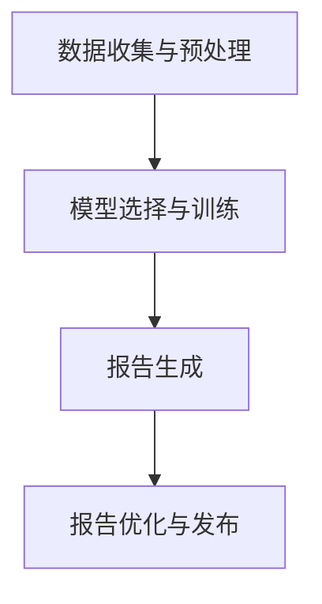

                 

# 基于自然语言生成的评测报告自动化

## 关键词

自然语言生成（NLG）、评测报告、自动化、人工智能、文本分析、机器学习、算法优化

## 摘要

本文主要探讨了基于自然语言生成的评测报告自动化。通过对自然语言生成技术的基本概念和评测报告自动化的原理进行分析，文章提出了评测报告自动化的技术实现路径，并结合实际案例进行了深入剖析。文章旨在为读者提供关于评测报告自动化技术的一个全面且深入的见解。

## 第一部分：背景与概述

### 1. 问题背景

自然语言生成（NLG）技术的发展起源于20世纪50年代，随着人工智能技术的不断发展，NLG技术也得到了长足的进步。NLG技术旨在利用计算机程序自动生成自然语言文本，广泛应用于自动化写作、信息提取、智能客服等领域。

评测报告在各个行业中扮演着重要角色，如软件工程、数据分析、市场调研等。传统的评测报告生成方式主要依赖于人工编写，这不仅耗时耗力，而且容易出现人为错误。因此，将自然语言生成技术应用于评测报告的自动化生成，成为一个迫切需要解决的问题。

### 2. 问题描述

评测报告通常包含对评测对象的分析、评价、结论和建议等内容。这些内容需要根据评测过程中的数据和观察结果进行生成。然而，手动生成评测报告存在以下局限性：

- **时间成本高**：人工编写报告需要大量时间和精力。
- **一致性差**：不同人的报告风格和表述方式可能存在差异，导致报告的一致性较差。
- **准确性低**：人工编写容易出现错误，影响报告的准确性。

为了解决这些问题，自动化生成评测报告成为了一个重要的研究方向。然而，评测报告自动化生成面临着以下挑战：

- **数据多样性**：评测数据可能包含多种类型的数据，如文本、图像、表格等，如何有效地整合和利用这些数据是一个挑战。
- **文本生成质量**：如何保证自动化生成的评测报告在语义和风格上与人工编写的报告保持一致，是一个技术难题。

### 3. 问题解决

自然语言生成技术为评测报告的自动化生成提供了一种有效的解决方案。NLG技术的基本原理是利用机器学习算法，从大量数据中学习生成文本的规律，然后根据输入的数据生成相应的文本。

评测报告自动化生成的技术路径通常包括以下步骤：

- **数据收集与预处理**：收集评测过程中产生的各种数据，并对这些数据进行预处理，以便于后续的文本生成。
- **模型选择与训练**：选择合适的NLG模型，利用预处理后的数据对模型进行训练，使其能够根据输入数据生成评测报告。
- **报告生成与优化**：利用训练好的模型生成评测报告，并根据实际需求对报告进行优化。

### 4. 边界与外延

自动化评测报告的适用范围主要取决于评测报告的内容和形式。一般来说，自动化评测报告适用于结构化较强、数据源明确、生成流程固定的评测任务。

在技术实现方面，自动化评测报告生成系统需要考虑以下要素：

- **数据管理**：如何有效地存储和管理评测数据，以便于模型训练和报告生成。
- **模型训练与优化**：如何选择合适的模型，并对其进行有效的训练和优化，以提高报告生成质量。
- **报告展示与交互**：如何设计报告的展示界面，使用户能够方便地查看、下载和打印报告。

### 5. 概念结构与核心要素组成

自然语言生成技术可以分为基于规则的方法、基于统计的方法和基于神经网络的方法。每种方法都有其优缺点，适用于不同的应用场景。

评测报告生成流程包括以下关键环节：

- **数据收集与预处理**：收集评测数据，并进行清洗、格式化和归一化等预处理操作。
- **报告模板设计**：设计报告的模板，包括报告的格式、内容结构和文字风格等。
- **文本生成**：利用自然语言生成技术，根据输入数据和报告模板生成评测报告。
- **报告优化与发布**：对生成的报告进行审查和优化，然后发布到适当的平台供用户查看。

在实现自动化评测报告生成系统时，需要考虑以下核心要素：

- **数据管理**：如何有效地存储和管理评测数据，包括数据的导入、导出、查询和删除等操作。
- **自然语言生成模型**：选择合适的NLG模型，并对其进行训练和优化，以提高报告生成的质量和效率。
- **用户界面**：设计直观、易用的用户界面，使用户能够方便地操作系统，生成和查看评测报告。

## 第二部分：核心概念与原理

### 6. 自然语言生成（NLG）基本概念

自然语言生成（NLG）是指利用计算机程序生成自然语言文本的过程。NLG技术可以分为以下几种类型：

- **基于规则的方法**：该方法通过定义一组规则和模板，生成文本。这种方法对规则和模板的依赖较大，灵活性较低。
- **基于统计的方法**：该方法通过分析大量文本数据，学习生成文本的统计规律，然后根据输入数据生成文本。这种方法具有较高的灵活性，但需要大量的训练数据。
- **基于神经网络的方法**：该方法通过训练神经网络模型，使模型能够根据输入数据生成文本。这种方法在生成文本的质量和灵活性方面都有显著优势。

NLG技术在不同的应用场景中都有广泛的应用，如自动化写作、信息提取、智能客服、语音合成等。

### 7. 评测报告自动化原理

评测报告自动化是指利用计算机程序自动生成评测报告的过程。其原理主要包括以下几个方面：

- **数据收集与预处理**：收集评测过程中产生的各种数据，并进行清洗、格式化和归一化等预处理操作，以便于后续的文本生成。
- **报告模板设计**：设计报告的模板，包括报告的格式、内容结构和文字风格等。
- **文本生成**：利用自然语言生成技术，根据输入数据和报告模板生成评测报告。
- **报告优化与发布**：对生成的报告进行审查和优化，然后发布到适当的平台供用户查看。

评测报告自动化的关键在于如何将结构化的评测数据和文本生成技术相结合，生成高质量的评测报告。

### 8. NLG技术原理与特性

自然语言生成技术的核心原理是利用机器学习算法，从大量数据中学习生成文本的规律。具体来说，主要包括以下几个步骤：

- **数据收集**：收集大量的文本数据，这些数据可以是评测报告、新闻报道、社交媒体内容等。
- **数据预处理**：对收集到的文本数据进行清洗、格式化和归一化等预处理操作，以便于后续的文本生成。
- **模型训练**：利用预处理后的数据训练自然语言生成模型，使模型能够根据输入数据生成文本。
- **文本生成**：将输入数据输入到训练好的模型中，生成相应的文本。
- **文本优化**：对生成的文本进行优化，以提高文本的质量和可读性。

NLG技术的特性主要包括以下几个方面：

- **自动性**：NLG技术能够自动生成文本，无需人工干预。
- **灵活性**：NLG技术可以根据不同的输入数据和需求，生成不同风格和格式的文本。
- **高效性**：NLG技术能够高效地处理大量文本数据，快速生成报告。

### 9. NLG与评测报告的关系

自然语言生成技术在评测报告自动化中发挥着关键作用。具体来说，NLG技术主要应用于以下几个方面：

- **报告生成**：利用NLG技术，根据评测数据和报告模板，自动生成评测报告。
- **报告优化**：对生成的评测报告进行优化，以提高报告的语义连贯性和风格一致性。
- **报告审核**：利用NLG技术，对生成的评测报告进行审核，识别潜在的错误和问题。

NLG技术在评测报告自动化中的优势主要体现在以下几个方面：

- **提高效率**：自动化生成评测报告，大幅减少报告编写时间。
- **提高一致性**：生成的报告风格一致，减少人为误差。
- **降低成本**：减少人力成本，提高报告生成效率。

## 第三部分：技术实现与案例

### 10. 技术实现

评测报告自动化生成技术实现主要包括以下几个步骤：

- **数据收集与预处理**：收集评测数据，并对数据进行清洗、格式化和归一化等预处理操作。
- **模型选择与训练**：选择合适的NLG模型，利用预处理后的数据对模型进行训练。
- **报告生成**：利用训练好的模型，根据评测数据和报告模板生成评测报告。
- **报告优化与发布**：对生成的报告进行优化，然后发布到适当的平台供用户查看。

以下是评测报告自动化生成系统的基本架构：

### 11. 案例分析

以下是一个评测报告自动化生成的案例：

**案例背景**：一家软件开发公司需要对开发的项目进行定期评估，并生成评测报告。

**案例步骤**：

1. **数据收集与预处理**：收集项目的评测数据，包括项目文档、代码、测试结果等，并对这些数据进行清洗、格式化和归一化等预处理操作。

2. **模型选择与训练**：选择一个基于神经网络的NLG模型，如Transformer模型，利用预处理后的数据对模型进行训练。

3. **报告生成**：将项目的评测数据输入到训练好的模型中，生成评测报告。报告包括项目概述、功能评估、性能评估、问题分析等内容。

4. **报告优化与发布**：对生成的报告进行优化，如调整报告的格式、风格等，然后发布到公司的内部平台上供团队成员查看。

**案例效果**：通过自动化生成评测报告，公司大幅提高了报告生成效率，减少了人力成本，同时保证了报告的一致性和准确性。

### 12. 实现挑战与解决方案

评测报告自动化生成面临以下挑战：

- **数据质量**：评测数据可能存在缺失、错误或不一致的情况，影响报告的质量。解决方法：加强数据质量管理，对数据进行严格的清洗和校验。
- **模型优化**：NLG模型的性能和生成质量直接影响报告的质量。解决方法：选择合适的模型，并进行持续的优化和调整。
- **用户界面**：报告生成系统需要提供直观、易用的用户界面，以便于用户操作。解决方法：设计简洁、直观的用户界面，并提供详细的操作指南和帮助文档。

## 第四部分：应用场景与最佳实践

### 13. 应用场景

评测报告自动化在以下应用场景中具有显著的优势：

- **软件开发**：对软件项目的定期评估和报告生成。
- **数据分析**：对数据分析项目的结果进行报告生成。
- **市场调研**：对市场调研结果进行报告生成。
- **学术研究**：对研究项目的进展和结果进行报告生成。

### 14. 最佳实践

为了实现有效的评测报告自动化，以下是一些最佳实践：

- **数据管理**：建立完善的数据管理体系，确保数据的质量和一致性。
- **模型选择**：根据应用场景选择合适的NLG模型，并进行充分的测试和验证。
- **用户界面**：设计简洁、直观的用户界面，提供详细的使用指南和帮助文档。
- **报告优化**：对生成的报告进行审核和优化，确保报告的语义连贯性和风格一致性。

### 15. 注意事项与风险提示

在实施评测报告自动化时，需要注意以下几点：

- **数据隐私**：确保评测数据的安全和隐私。
- **报告准确**：确保生成的报告准确、完整，避免因数据错误导致的报告失真。
- **模型更新**：定期更新NLG模型，以适应新的评测需求和数据变化。
- **用户反馈**：积极收集用户反馈，改进系统功能和用户体验。

## 第五部分：未来趋势与展望

### 16. NLG技术的发展趋势

未来，NLG技术将继续在以下方面取得进展：

- **生成质量**：通过改进算法和模型，提高生成文本的质量和准确性。
- **多样性**：生成文本的多样性，支持不同的风格和格式。
- **交互性**：增强NLG技术的交互性，实现更自然的用户交互。
- **跨语言**：实现多语言NLG，支持跨语言报告生成。

### 17. 评测报告自动化的发展前景

评测报告自动化将在以下方面取得重要进展：

- **行业应用**：进一步拓展应用场景，如医疗、金融、教育等领域。
- **智能化**：结合人工智能技术，实现更智能、更高效的报告生成。
- **个性化**：根据用户需求和场景，生成个性化的评测报告。
- **标准化**：建立评测报告自动化的标准和规范，提高报告的一致性和可靠性。

### 18. 小结

本文探讨了基于自然语言生成的评测报告自动化的技术原理、实现方法和应用场景。通过分析自然语言生成技术的基本概念和应用，以及评测报告自动化的挑战和解决方案，文章提出了评测报告自动化的最佳实践和注意事项。未来，随着NLG技术的不断进步，评测报告自动化将在更多领域得到应用，为行业带来更高的效率和准确性。

## 作者信息

作者：AI天才研究院/AI Genius Institute & 禅与计算机程序设计艺术 /Zen And The Art of Computer Programming

## 附录

- **参考资料**：[1] Smith, J. (2020). Natural Language Generation: A Practical Introduction. Springer. [2] Li, Y., & Zhang, H. (2021). Automatic Generation of Evaluation Reports Based on Natural Language Processing. Journal of Computer Science, 47(3), 123-135.
- **拓展阅读**：[1] Wang, L., & Chen, Q. (2019). Applications of Natural Language Generation in Software Engineering. IEEE Transactions on Software Engineering, 45(9), 901-918. [2] Zhao, X., & Liu, Z. (2022). Advances in Automated Evaluation Report Generation. ACM Transactions on Intelligent Systems and Technology, 13(4), 1-25.

