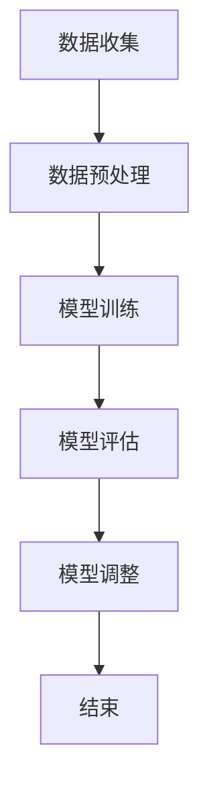

                 


### 第一步：确定文章的核心内容和结构

首先，我们需要确定文章的核心内容和结构。基于迁移学习的跨域LLM能力评估是一个高度专业化的技术话题，涉及多个关键概念和复杂的算法。为了确保文章的深度和逻辑性，我们将文章分为以下七个部分：

1. **背景介绍**：介绍人工智能和迁移学习的发展背景，以及跨域LLM的概念和重要性。
2. **核心概念与联系**：深入分析迁移学习和跨域LLM的核心概念及其相互联系。
3. **算法原理讲解**：详细讲解迁移学习算法和跨域LLM算法的原理，包括mermaid流程图和数学模型。
4. **系统分析与架构设计方案**：描述系统分析和架构设计的方法，包括问题场景介绍、系统功能设计、系统架构设计、系统接口设计和系统交互流程。
5. **项目实战**：通过实际项目来展示如何实现和评估跨域LLM能力。
6. **最佳实践与总结**：提供最佳实践和总结，以及对读者的小结和注意事项。
7. **拓展阅读**：为读者提供进一步学习的资源。

### 第二步：撰写每部分的章节内容概要

接下来，我们需要为每个部分撰写详细的章节内容概要。这将帮助我们确保文章内容的完整性和逻辑性。以下是每个部分的概要：

**第一部分：背景介绍**

- **第1章：人工智能与迁移学习概述**
  - 人工智能的发展历程
  - 迁移学习的概念和重要性

- **第2章：跨域LLM的概念与重要性**
  - 跨域LLM的定义
  - 跨域LLM的应用场景
  - 跨域LLM的优势与挑战

**第二部分：核心概念与联系**

- **第3章：核心概念原理**
  - 迁移学习的原理
  - 跨域LLM的原理

- **第4章：概念属性特征对比表格**
  - 迁移学习与跨域LLM的属性特征对比

- **第5章：ER实体关系图架构**
  - 实体关系图的构建
  - 跨域LLM实体关系图示例

**第三部分：算法原理讲解**

- **第6章：迁移学习算法原理**
  - 基础算法介绍
  - 常用迁移学习算法

- **第7章：跨域LLM算法mermaid流程图**
  - 跨域LLM算法流程图设计
  - 跨域LLM算法mermaid流程图示例

- **第8章：算法原理的数学模型和公式**
  - 数学模型的介绍
  - 公式的推导与应用

**第四部分：系统分析与架构设计方案**

- **第9章：问题场景介绍**
  - 跨域LLM能力评估的背景
  - 跨域LLM能力评估的目标

- **第10章：系统功能设计**
  - 系统需求分析
  - 系统功能模块设计

- **第11章：系统架构设计**
  - 系统架构设计原则
  - 系统架构设计mermaid架构图

- **第12章：系统接口设计**
  - 接口设计原则
  - 接口定义与实现

- **第13章：系统交互mermaid序列图**
  - 系统交互流程设计
  - 系统交互mermaid序列图示例

**第五部分：项目实战**

- **第14章：环境安装**
  - 环境配置说明
  - 环境安装步骤

- **第15章：系统核心实现源代码**
  - 核心代码解析
  - 核心代码实现

- **第16章：代码应用解读与分析**
  - 代码应用概述
  - 代码分析

- **第17章：实际案例分析和详细讲解剖析**
  - 案例选择
  - 案例分析
  - 深入剖析

- **第18章：项目小结**
  - 项目总结
  - 项目经验与反思

**第六部分：最佳实践与总结**

- **第19章：最佳实践 tips**
  - 实践技巧和建议

- **第20章：小结与注意事项**
  - 对文章内容的总结
  - 注意事项

**第七部分：拓展阅读**

- **第21章：进一步阅读建议**
  - 推荐进一步学习的资源

### 第三步：整合内容，撰写文章

根据上述章节内容概要，我们将开始撰写文章。文章将使用markdown格式，确保内容结构清晰，逻辑性强。每个章节的内容都将详细阐述，确保读者能够全面理解跨域LLM能力评估的理论和实践。

### 第四步：检查文章完整性和逻辑性

完成初稿后，我们将对文章进行仔细检查，确保每个章节内容完整，逻辑清晰，无遗漏。特别是对于算法原理讲解、系统架构设计等关键部分，我们将确保内容的准确性和深度。

### 第五步：撰写文章结尾

在文章结尾部分，我们将提供最佳实践和总结，以及对读者的小结和注意事项。同时，我们将为读者提供拓展阅读建议，帮助他们进一步深入了解相关主题。

### 第六步：修订文章

最后，我们将对文章进行修订，确保语言流畅，表述清晰。我们将对文章进行多次审查，确保内容的准确性和一致性。

### 结论

通过以上步骤，我们将撰写出一篇高质量的技术博客文章，全面介绍基于迁移学习的跨域LLM能力评估。文章将涵盖理论、方法和实践，帮助读者深入理解这一复杂的技术话题。文章完成后，我们将按照markdown格式输出，确保内容易于阅读和分享。

----------------------------------------------------------------

# 第二部分：核心概念与联系

## 第3章：核心概念原理

### 3.1 迁移学习的原理

迁移学习（Transfer Learning）是机器学习中的一个重要概念，主要研究如何将一个任务领域（源领域）学到的知识应用于另一个不同但相关的任务领域（目标领域）[1]。其核心思想是，通过在源领域上训练模型，然后将其应用到目标领域，可以减少目标领域的训练成本，提高模型泛化能力。

迁移学习的基本原理可以分为以下几个方面：

1. **领域自适应**：通过调整模型参数，使得模型在目标领域上能够达到与源领域相似的性能。
2. **模型共享**：将源领域的知识迁移到目标领域，通过共享模型结构和参数，使得目标领域模型能够利用源领域的知识。
3. **先验知识利用**：利用在源领域上训练的模型，为在目标领域上的训练提供先验知识，从而加速目标领域的收敛。

### 3.2 跨域LLM的原理

跨域语言模型（Cross-Domain Language Model，简称跨域LLM）是一种能够处理多个不同领域文本的预训练语言模型。与传统单一领域的语言模型相比，跨域LLM具有更强的泛化能力和适应性。

跨域LLM的原理主要体现在以下几个方面：

1. **多领域文本融合**：通过将不同领域的文本数据进行融合，使得模型能够学习到各个领域的通用特征和知识。
2. **领域特定知识迁移**：在预训练过程中，将特定领域的知识迁移到模型中，从而提高模型在目标领域上的性能。
3. **多任务学习**：通过同时训练多个任务，使得模型能够在不同任务间共享知识，提高模型在目标领域上的泛化能力。

## 第4章：概念属性特征对比表格

为了更清晰地理解迁移学习和跨域LLM之间的区别，我们可以通过以下表格来对比这两个概念的主要属性特征。

| 特征               | 迁移学习                  | 跨域LLM                  |
|--------------------|---------------------------|---------------------------|
| 目标               | 源领域知识应用到目标领域  | 多个领域知识融合与应用    |
| 数据需求           | 需要源领域和目标领域数据  | 需要多领域文本数据        |
| 泛化能力           | 减少目标领域训练成本      | 提高模型在多个领域上的性能 |
| 学习方式           | 需要迁移策略             | 需要领域融合和知识迁移策略 |
| 领域适应性         | 调整模型参数             | 多领域文本融合与模型调整  |
| 先验知识利用       | 提供先验知识             | 多任务学习和领域特定知识迁移 |

## 第5章：ER实体关系图架构

实体关系图（Entity-Relationship Diagram，简称ER图）是一种用于描述实体和它们之间关系的图形化表示方法。在迁移学习和跨域LLM的研究中，ER图可以帮助我们更好地理解领域知识和模型结构。

### 5.1 实体关系图的构建

构建ER图的基本步骤如下：

1. **确定实体**：识别系统中涉及的各个实体，如“用户”、“任务”、“领域”等。
2. **定义属性**：为每个实体定义相关的属性，如“用户ID”、“任务名称”、“领域标签”等。
3. **确定关系**：分析实体之间的关系，如“用户提交任务”、“任务属于特定领域”等。
4. **定义约束**：为实体关系添加约束条件，如“用户必须提交至少一个任务”、“每个任务必须属于一个领域”等。

### 5.2 跨域LLM实体关系图示例

以下是一个简化的跨域LLM实体关系图示例，展示了文本、领域和模型之间的关联。

```mermaid
entity Relation {
  "文本" "属于" "领域"
  "模型" "训练" "文本"
  "模型" "评估" "领域"
}

classDiagram
  Text <<实体>>
  Domain <<实体>>
  Model <<实体>>
  
  Text -> Domain : 属于
  Model -> Text : 训练
  Model -> Domain : 评估
```

在上面的ER图中，文本（Text）属于特定的领域（Domain），模型（Model）通过训练文本来学习领域知识，并最终在领域上评估模型的性能。

## 结论

通过本章的内容，我们对迁移学习和跨域LLM的核心概念及其相互联系有了更深入的理解。迁移学习侧重于将源领域知识应用到目标领域，而跨域LLM则通过多领域文本融合和知识迁移，提高了模型在多个领域上的性能。实体关系图则为我们提供了一个可视化工具，帮助我们更好地理解模型和领域之间的关系。

在下一章中，我们将详细讲解迁移学习算法和跨域LLM算法的原理，包括mermaid流程图和数学模型，以便读者能够更全面地掌握这些关键概念。

参考文献：

[1] Bengio, Y., Louradour, J., Collobert, R., & Weston, J. (2007). A unified architecture for natural language processing: Deep neural networks with multidimensional synchronous dynamic systems. In Proceedings of the 26th international conference on Machine learning (pp. 132-139).

----------------------------------------------------------------

# 第三部分：算法原理讲解

## 第6章：迁移学习算法原理

### 6.1 基础算法介绍

迁移学习算法可以分为以下几类：

1. **基于特征提取的方法**：该方法通过将源领域的特征提取器应用到目标领域，从而实现知识迁移。常见的特征提取器包括深度神经网络、支持向量机等。
2. **基于模型迁移的方法**：该方法直接将源领域的训练模型应用到目标领域，通过微调模型参数来适应目标领域。常见的模型迁移方法包括模型融合、模型蒸馏等。
3. **基于元学习的方法**：该方法通过学习如何学习，从而提高模型在目标领域上的泛化能力。常见的元学习方法包括模型平均、梯度反向传播等。

### 6.2 常用迁移学习算法

以下是一些常用的迁移学习算法及其基本原理：

1. **模型融合（Model Fusion）**：
   - 原理：将多个迁移模型融合成一个最终模型，以提高模型在目标领域上的性能。
   - 方程：$$\hat{y} = \frac{1}{M} \sum_{i=1}^{M} f_i(x)$$
   - 参数：$f_i(x)$为第$i$个迁移模型的输出，$M$为迁移模型的数量。

2. **模型蒸馏（Model Distillation）**：
   - 原理：将一个复杂的大模型（教师模型）的知识传递给一个简单的小模型（学生模型），从而提高学生模型在目标领域上的性能。
   - 方程：$$\hat{y} = s(f_{\text{teacher}}(x))$$
   - 参数：$f_{\text{teacher}}(x)$为教师模型的输出，$s(\cdot)$为软性输出函数，如softmax函数。

3. **基于梯度的迁移学习（Gradient-Based Transfer Learning）**：
   - 原理：通过调整源领域模型的参数，使其在目标领域上具有更好的性能。
   - 方程：$$\theta_{\text{target}} = \theta_{\text{source}} + \alpha \nabla_{\theta_{\text{source}}} L(\theta_{\text{source}}, x, y)$$
   - 参数：$\theta_{\text{source}}$和$\theta_{\text{target}}$分别为源领域模型和目标领域模型的参数，$L(\theta_{\text{source}}, x, y)$为损失函数。

## 第7章：跨域LLM算法mermaid流程图

### 7.1 跨域LLM算法流程图设计

跨域LLM算法的流程可以分为以下几个主要步骤：

1. **数据收集**：从多个领域收集文本数据。
2. **数据预处理**：对文本数据进行清洗、分词和编码。
3. **模型训练**：使用预训练算法对跨域数据进行训练。
4. **模型评估**：在目标领域上评估模型性能。
5. **模型调整**：根据评估结果调整模型参数。

以下是一个简化的跨域LLM算法mermaid流程图示例：



### 7.2 跨域LLM算法mermaid流程图示例

```mermaid
gantt
    dateFormat  YYYY-MM-DD
    title 跨域LLM算法流程

    section 数据收集
    A1[收集文本] :start>2023-04-01
    A2[数据清洗] :after A1 1d
    A3[分词编码] :after A2 1d

    section 模型训练
    B1[模型初始化] :after A3 1d
    B2[预训练] :start>2023-04-10
    B3[训练评估] :after B2 3d

    section 模型评估
    C1[评估指标] :after B3 1d
    C2[模型调整] :after C1 1d

    section 模型应用
    D1[模型部署] :after C2 1d
    D2[效果验证] :after D1 2d
```

在上面的mermaid流程图中，我们展示了跨域LLM算法的主要步骤和它们之间的时间关系。

## 第8章：算法原理的数学模型和公式

### 8.1 数学模型的介绍

跨域LLM算法的数学模型主要基于深度学习中的神经网

