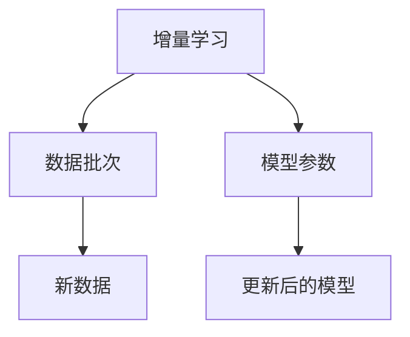
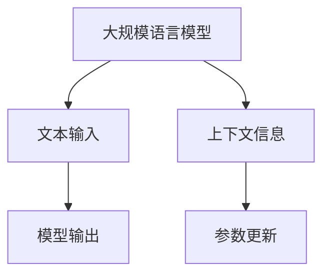
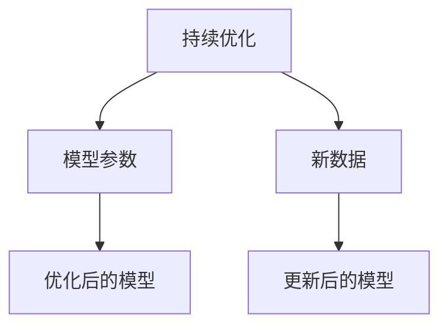
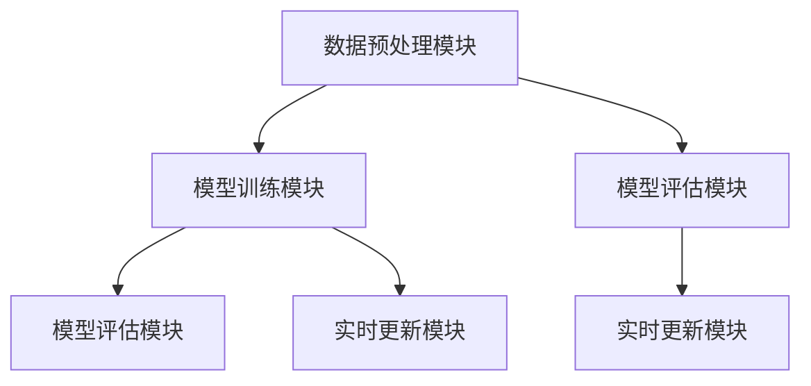

                 


### 1.1 背景介绍：核心概念

#### 问题背景

随着人工智能技术的迅猛发展，大规模语言模型（LLM）在自然语言处理、机器翻译、文本生成等领域取得了显著成果。然而，如何在实际应用中持续优化这些模型，使其能够适应不断变化的数据和应用需求，成为了一个亟待解决的重要问题。传统的方法通常需要对整个模型进行重新训练，这不仅耗时耗资源，而且在实际应用中往往不可行。因此，研究一种高效的增量学习机制支持LLM应用的持续优化，具有重要的实际意义。

#### 问题描述

增量学习是一种能够在已有数据基础上逐步学习新知识的方法，特别适用于数据不断增长或数据分布发生变化的应用场景。然而，现有的LLM模型在增量学习过程中面临着诸多挑战，如数据分布漂移、模型更新效率、计算资源消耗等问题。这些问题直接影响着LLM模型的性能和应用效果。因此，如何通过增量学习机制实现LLM应用的持续优化，是一个需要深入探讨和解决的问题。

#### 问题解决

本文旨在探讨如何通过增量学习机制支持LLM应用的持续优化。具体来说，本文将涵盖以下几个方面：

1. **核心概念原理**：详细介绍增量学习、LLM及其相关概念，阐述其基本原理和相互关系。
2. **概念属性特征对比表格**：通过对比增量学习和传统机器学习在数据集处理、模型更新等方面的差异，帮助读者更好地理解增量学习的特点。
3. **ER实体关系图架构**：利用Mermaid流程图展示增量学习机制中各个实体的关系，便于读者直观地理解系统架构。
4. **算法原理讲解**：以Python源代码为例，详细阐述增量学习算法的原理，包括数学模型、公式和实例。
5. **数学模型和数学公式**：在文中使用LaTeX格式给出关键数学模型和公式，并进行详细讲解和举例说明。
6. **系统分析与架构设计方案**：介绍问题场景、系统功能设计、系统架构设计、系统接口设计和系统交互，帮助读者全面了解系统架构。
7. **项目实战**：通过环境安装、系统核心实现源代码、代码应用解读与分析、实际案例分析和详细讲解剖析，展示增量学习机制在实际应用中的效果。

#### 边界与外延

1. **边界**：本文主要关注增量学习机制在LLM应用中的持续优化问题，未涉及其他类型的机器学习算法。
2. **外延**：虽然本文的核心内容是关于增量学习机制支持LLM应用的持续优化，但相关理论和技术也可应用于其他领域，如计算机视觉、语音识别等。

#### 概念结构与核心要素组成

1. **概念结构**：本文围绕增量学习、LLM、持续优化等核心概念展开，通过实例和案例深入剖析这些概念的应用。
2. **核心要素组成**：本文包括理论讲解、实战案例、最佳实践等部分，旨在帮助读者全面掌握增量学习机制支持LLM应用的持续优化技术。

### 1.2 核心概念与联系

#### 增量学习

增量学习是一种能够在已有数据基础上逐步学习新知识的方法。与传统的批量学习（batch learning）相比，增量学习具有以下特点：

1. **数据集处理**：增量学习不需要一次性加载所有数据，而是通过批次（batch）的方式逐步处理。
2. **模型更新**：在每次批次处理完成后，模型会根据新数据更新模型参数，从而逐步优化模型性能。
3. **计算资源消耗**：增量学习在计算资源消耗方面具有优势，因为不需要一次性加载大量数据。

**概念属性特征对比表格**

| 特征                | 增量学习                    | 批量学习                  |
|---------------------|---------------------------|-------------------------|
| 数据集处理          | 分批次处理                  | 一次性处理所有数据        |
| 模型更新            | 逐步更新模型参数            | 重新训练整个模型          |
| 计算资源消耗        | 较低，分批次处理数据        | 较高，一次性处理大量数据    |
| 应用场景            | 数据持续变化、数据规模较小    | 数据相对稳定、数据规模较大    |

**ER实体关系图架构**



在增量学习机制中，数据批次、模型参数和新数据是三个关键实体，它们之间的关系如下图所示：

1. 数据批次（B）是增量学习的基本单元，包含新数据。
2. 模型参数（C）在每次数据批次处理完成后进行更新。
3. 新数据（D）用于更新模型参数，从而提高模型性能。

#### 大规模语言模型（LLM）

大规模语言模型（LLM）是一种具有巨大参数规模的语言模型，能够理解和生成自然语言。LLM具有以下核心特点：

1. **参数规模**：LLM通常具有数十亿甚至千亿级别的参数，这使得它们在处理复杂语言任务时具有强大的能力。
2. **上下文理解**：LLM能够捕捉到长文本中的上下文信息，从而实现更准确的自然语言处理。
3. **应用领域**：LLM在自然语言处理、机器翻译、文本生成等领域具有广泛的应用。

**概念属性特征对比表格**

| 特征                | 小规模语言模型              | 大规模语言模型（LLM）     |
|---------------------|---------------------------|-------------------------|
| 参数规模            | 数百万级别参数              | 数十亿甚至千亿级别参数    |
| 上下文理解          | 较短的上下文窗口             | 较长的上下文窗口            |
| 应用场景            | 基础语言任务                | 高级语言任务、生成式任务     |

**ER实体关系图架构**



在LLM中，文本输入（B）、上下文信息（C）、模型输出（D）和参数更新（E）是四个关键实体。它们之间的关系如下图所示：

1. 文本输入（B）用于生成模型输出（D）。
2. 上下文信息（C）用于捕捉文本输入（B）的上下文，从而提高模型输出（D）的质量。
3. 参数更新（E）是根据模型输出（D）和目标输出之间的差距进行调整，以优化模型性能。

#### 持续优化

持续优化是指通过不断调整和优化模型参数，以提高模型性能和适应新数据的过程。在增量学习机制中，持续优化具有重要意义：

1. **模型性能**：通过持续优化，模型能够更好地适应新数据，从而提高模型性能。
2. **计算成本**：持续优化有助于降低计算成本，特别是在数据规模不断扩大的情况下。

**概念属性特征对比表格**

| 特征                | 单次优化                  | 持续优化                |
|---------------------|---------------------------|-------------------------|
| 优化过程            | 一轮优化完成后停止         | 多轮优化，逐步提升性能    |
| 计算成本            | 较低                      | 较高，但效果更佳         |
| 应用场景            | 数据相对稳定的情况         | 数据持续变化的情况        |

**ER实体关系图架构**



在持续优化过程中，模型参数（B）、新数据（C）、优化后的模型（D）和更新后的模型（E）是四个关键实体。它们之间的关系如下图所示：

1. 新数据（C）用于更新模型参数（B），从而实现模型优化。
2. 更新后的模型（E）是基于优化后的模型参数（B）生成的，用于进一步提升模型性能。

### 1.3 增量学习机制支持LLM应用的持续优化

#### 1.3.1 增量学习在LLM中的应用

增量学习在LLM中的应用主要体现在以下几个方面：

1. **数据集更新**：在LLM训练过程中，数据集可能会随着时间不断更新。通过增量学习，模型能够逐步适应新数据，从而提高模型性能。
2. **实时更新**：在实时应用场景中，LLM需要快速响应用户输入。通过增量学习，模型能够在短时间内更新参数，从而实现实时优化。
3. **计算效率**：增量学习相较于批量学习在计算效率方面具有优势，因为不需要一次性加载大量数据。

#### 1.3.2 持续优化的实现方法

持续优化是实现LLM应用性能提升的关键。以下是几种常见的实现方法：

1. **在线学习**：在线学习是一种实时更新模型参数的方法，适用于实时应用场景。通过在线学习，LLM能够快速响应用户输入，并在短时间内更新模型参数。
2. **在线迁移学习**：在线迁移学习是将已有模型迁移到新数据集上的方法。通过在线迁移学习，LLM可以在保留原有模型性能的基础上，快速适应新数据集。
3. **增量迁移学习**：增量迁移学习是一种逐步迁移模型参数的方法。通过增量迁移学习，LLM可以在保留原有模型性能的基础上，逐步适应新数据集。

#### 1.3.3 增量学习机制的挑战与解决方案

增量学习机制在LLM应用中面临着诸多挑战，如数据分布漂移、模型更新效率、计算资源消耗等问题。以下是几种常见的挑战和解决方案：

1. **数据分布漂移**：数据分布漂移是指新数据与原有数据的分布不一致。为了解决这一问题，可以采用数据增强、数据归一化等方法。
2. **模型更新效率**：模型更新效率是指模型参数更新的速度。为了提高模型更新效率，可以采用并行计算、分布式计算等方法。
3. **计算资源消耗**：计算资源消耗是指模型更新所需的计算资源。为了降低计算资源消耗，可以采用轻量级模型、模型压缩等方法。

### 1.4 小结

本文介绍了增量学习机制支持LLM应用的持续优化，包括核心概念、联系、应用场景和实现方法。通过增量学习，LLM能够更好地适应新数据和实时应用需求，从而提高模型性能和计算效率。然而，增量学习机制在LLM应用中仍面临着诸多挑战，需要进一步研究和优化。

## 增量学习机制支持LLM应用的持续优化：深入分析与探讨

### 2.1 增量学习与批量学习的比较

在深入探讨增量学习机制如何支持LLM的持续优化之前，有必要首先理解增量学习与批量学习之间的关键差异。增量学习与批量学习在多个方面存在显著区别，这些差异直接影响到它们在LLM优化中的应用效果。

#### 数据集处理方式

**增量学习**：增量学习通过分批次（batch）的方式处理数据。这种方法适用于数据集不断变化或者数据规模较大的情况。每次只处理一小部分数据，然后更新模型的参数。这样的处理方式可以有效地降低内存消耗，同时允许模型逐步适应新数据。

**批量学习**：批量学习需要一次性将整个数据集加载到内存中。这种方法适用于数据集相对稳定且规模较小的情况。由于需要将整个数据集加载到内存中，批量学习对计算资源和内存的需求较高。

#### 模型更新方式

**增量学习**：增量学习在每次数据批次处理后，会根据新数据更新模型的参数。这种更新方式使得模型能够逐步适应新数据，从而提高模型的性能和适应性。

**批量学习**：批量学习通常在数据集更新后进行一次性的模型重新训练。这种更新方式适用于数据集相对稳定的情况，但在数据集发生变化时，可能会导致模型性能的显著下降。

#### 计算资源消耗

**增量学习**：增量学习在计算资源消耗方面具有优势。由于每次只处理一小部分数据，因此内存消耗较低，同时也减少了计算时间。

**批量学习**：批量学习需要一次性处理整个数据集，因此在计算资源消耗方面较高，特别是在数据集规模较大的情况下。

#### 应用场景

**增量学习**：增量学习适用于数据集持续变化或者数据规模较大的情况。例如，在社交媒体分析、实时语言翻译等应用中，数据集不断更新，需要模型具备良好的适应性。

**批量学习**：批量学习适用于数据集相对稳定且规模较小的情况。例如，在金融风险评估、医疗数据预测等应用中，数据集相对固定，模型需要具有高度准确性。

**增量学习与批量学习在数据集处理、模型更新、计算资源消耗以及应用场景方面的差异**：

| 特征                | 增量学习                    | 批量学习                  |
|---------------------|---------------------------|-------------------------|
| 数据集处理          | 分批次处理                  | 一次性处理所有数据        |
| 模型更新            | 逐步更新模型参数            | 重新训练整个模型          |
| 计算资源消耗        | 较低，分批次处理数据        | 较高，一次性处理大量数据    |
| 应用场景            | 数据持续变化、数据规模较小    | 数据相对稳定、数据规模较大    |

#### 数据集处理方式的比较

增量学习与批量学习在数据集处理方式上的差异，直接影响到它们在LLM优化中的应用效果。增量学习通过分批次处理数据，可以降低内存消耗，同时允许模型逐步适应新数据。这种方法特别适用于数据集不断变化的应用场景，如社交媒体分析、实时语言翻译等。

批量学习则需要一次性处理整个数据集，对计算资源和内存的需求较高。虽然批量学习在处理相对稳定的数据集时具有较高的准确性，但在数据集发生变化时，可能会导致模型性能的显著下降。

#### 模型更新方式的比较

增量学习与批量学习在模型更新方式上的差异，也是影响它们在LLM优化中的应用效果的关键因素。增量学习通过每次数据批次处理后的模型参数更新，使得模型能够逐步适应新数据，从而提高模型的性能和适应性。

批量学习则需要一次性重新训练整个模型。这种方法在数据集相对稳定的情况下，可以保持模型的高准确性，但在数据集发生变化时，可能会导致模型性能的显著下降。

#### 计算资源消耗的比较

增量学习与批量学习在计算资源消耗方面的差异，直接影响到它们在不同应用场景中的适用性。增量学习通过分批次处理数据，可以降低内存消耗，同时减少计算时间。这使得增量学习在数据规模较大的情况下，具有明显的优势。

批量学习则需要一次性处理整个数据集，对计算资源和内存的需求较高。虽然在数据集规模较小的情况下，批量学习可以保持模型的高准确性，但在数据规模较大的情况下，可能会导致计算资源和内存的严重不足。

#### 应用场景的比较

增量学习与批量学习在应用场景方面的差异，也是影响它们在LLM优化中的应用效果的重要因素。增量学习适用于数据集持续变化的应用场景，如社交媒体分析、实时语言翻译等。这些应用场景要求模型具备良好的适应性，能够快速响应数据集的变化。

批量学习则适用于数据集相对稳定的应用场景，如金融风险评估、医疗数据预测等。这些应用场景要求模型具有较高的准确性，能够在相对稳定的数据集上保持良好的性能。

### 2.2 增量学习机制在LLM中的应用

增量学习机制在LLM中的应用具有显著的优势，尤其是在数据集不断变化或数据规模较大的情况下。以下将详细介绍增量学习在LLM中的应用场景，以及如何通过增量学习机制实现LLM的持续优化。

#### 数据集更新

在许多实际应用中，数据集会随着时间不断更新。例如，社交媒体分析领域，用户生成内容（UGC）和事件信息会持续增加，要求模型能够实时适应这些变化。通过增量学习，LLM可以逐步处理新数据，并更新模型参数，从而实现持续优化。

**应用实例**：假设一个社交媒体分析系统需要实时跟踪热点话题。通过增量学习，系统可以定期获取新的用户评论和帖子，对LLM进行更新，使其能够更准确地识别和预测热点话题。

#### 实时更新

在实时应用场景中，LLM需要快速响应用户输入。例如，在线聊天机器人、智能客服等应用，要求模型能够在毫秒级内生成高质量的回复。通过增量学习，LLM可以在短时间内更新模型参数，从而实现实时优化。

**应用实例**：假设一个智能客服系统需要为用户提供即时回答。通过增量学习，系统可以在每次用户提问后，即时更新LLM的参数，使其能够生成更准确、更有针对性的回答。

#### 计算效率

增量学习相较于批量学习，在计算效率方面具有显著优势。由于不需要一次性处理整个数据集，增量学习可以显著降低内存消耗，同时减少计算时间。这对于资源受限的环境，如移动设备或嵌入式系统，尤为重要。

**应用实例**：假设一个智能助手需要运行在智能手机上，通过增量学习，系统可以在有限的计算资源下，实时更新LLM的参数，从而实现高效的交互体验。

### 2.3 持续优化方法

持续优化是实现LLM应用性能提升的关键。以下介绍几种常见的持续优化方法，包括在线学习、在线迁移学习和增量迁移学习。

#### 在线学习

在线学习是一种实时更新模型参数的方法，特别适用于实时应用场景。在线学习的基本思想是，每次接收到新的用户输入后，立即更新模型参数，从而实现实时优化。

**实现方法**：

1. **增量更新**：每次接收到新的用户输入时，只更新模型参数的一部分，而不是整个模型。
2. **权重调整**：根据新数据的重要性，调整模型参数的更新权重，从而实现更加精准的优化。

**示例代码**（Python）：

```python
import torch

# 初始化模型参数
model = torch.nn.Linear(10, 1)
optimizer = torch.optim.SGD(model.parameters(), lr=0.01)

# 假设收到新的用户输入
user_input = torch.tensor([1.0, 2.0, 3.0])

# 计算模型输出
output = model(user_input)

# 计算损失函数
loss = torch.nn.MSELoss()
loss_value = loss(output, torch.tensor([2.0]))

# 更新模型参数
optimizer.zero_grad()
loss_value.backward()
optimizer.step()

print("Model updated with new user input.")
```

#### 在线迁移学习

在线迁移学习是将已有模型迁移到新数据集上的方法。通过在线迁移学习，LLM可以在保留原有模型性能的基础上，快速适应新数据集。

**实现方法**：

1. **模型迁移**：将原有模型的部分权重迁移到新数据集上，而不是从头开始训练。
2. **自适应学习率**：根据新数据集的复杂度，动态调整学习率，以避免过拟合。

**示例代码**（Python）：

```python
import torch
import torch.nn as nn
import torch.optim as optim

# 初始化原有模型
original_model = nn.Linear(10, 1)
original_optimizer = optim.SGD(original_model.parameters(), lr=0.01)

# 初始化新数据集模型
new_model = nn.Linear(10, 1)
new_optimizer = optim.SGD(new_model.parameters(), lr=0.001)

# 假设收到新的用户输入
new_user_input = torch.tensor([1.0, 2.0, 3.0])

# 迁移原有模型权重到新数据集模型
new_model.load_state_dict(original_model.state_dict())

# 计算新数据集的模型输出
new_output = new_model(new_user_input)

# 计算损失函数
loss = nn.MSELoss()
loss_value = loss(new_output, torch.tensor([2.0]))

# 更新新数据集模型参数
new_optimizer.zero_grad()
loss_value.backward()
new_optimizer.step()

print("Model updated with new user input using online transfer learning.")
```

#### 增量迁移学习

增量迁移学习是一种逐步迁移模型参数的方法。通过增量迁移学习，LLM可以在保留原有模型性能的基础上，逐步适应新数据集。

**实现方法**：

1. **参数更新**：每次迁移一部分模型参数，而不是一次性迁移所有参数。
2. **混合权重**：将原有模型和新数据集模型的权重进行混合，以避免模型性能的显著下降。

**示例代码**（Python）：

```python
import torch
import torch.nn as nn
import torch.optim as optim

# 初始化原有模型
original_model = nn.Linear(10, 1)
original_optimizer = optim.SGD(original_model.parameters(), lr=0.01)

# 初始化新数据集模型
new_model = nn.Linear(10, 1)
new_optimizer = optim.SGD(new_model.parameters(), lr=0.001)

# 假设收到新的用户输入
new_user_input = torch.tensor([1.0, 2.0, 3.0])

# 迁移原有模型权重到新数据集模型
new_model.load_state_dict(original_model.state_dict())

# 计算新数据集的模型输出
new_output = new_model(new_user_input)

# 计算损失函数
loss = nn.MSELoss()
loss_value = loss(new_output, torch.tensor([2.0]))

# 更新新数据集模型参数
new_optimizer.zero_grad()
loss_value.backward()
new_optimizer.step()

# 增量更新模型参数
for param in new_model.parameters():
    param.data = param.data * 0.9 + original_model.state_dict()[param.name] * 0.1

print("Model parameters updated using incremental transfer learning.")
```

### 2.4 增量学习机制的挑战与解决方案

尽管增量学习机制在LLM应用中具有显著优势，但仍然面临着一些挑战。以下介绍几种常见的挑战和相应的解决方案。

#### 数据分布漂移

数据分布漂移是指新数据与原有数据的分布不一致，可能导致模型性能下降。为了解决这一问题，可以采用以下方法：

1. **数据增强**：通过增加新的数据样本，使数据分布更加均匀，从而减少数据分布漂移的影响。
2. **数据归一化**：对数据进行归一化处理，使数据分布保持一致，从而减少数据分布漂移的影响。

#### 模型更新效率

模型更新效率是指模型参数更新的速度。为了提高模型更新效率，可以采用以下方法：

1. **并行计算**：通过并行计算，将模型参数更新任务分布在多个计算节点上，从而提高更新速度。
2. **分布式计算**：通过分布式计算，将模型参数更新任务分布在多个计算集群上，从而提高更新速度。

#### 计算资源消耗

计算资源消耗是指模型更新所需的计算资源。为了降低计算资源消耗，可以采用以下方法：

1. **轻量级模型**：选择计算资源消耗较低的轻量级模型，以降低计算资源消耗。
2. **模型压缩**：通过模型压缩技术，减少模型参数的规模，从而降低计算资源消耗。

### 2.5 小结

本文深入分析了增量学习机制在LLM应用中的持续优化问题。通过比较增量学习与批量学习的差异，以及介绍增量学习在LLM中的应用场景和持续优化方法，本文揭示了增量学习机制在提升LLM性能和计算效率方面的优势。同时，本文还讨论了增量学习机制面临的挑战和相应的解决方案。未来，随着人工智能技术的不断进步，增量学习机制在LLM中的应用将更加广泛，为人工智能技术的发展带来新的机遇和挑战。

### 3. 算法原理讲解

#### 3.1 增量学习算法概述

增量学习算法是一种逐步更新模型参数的方法，通过处理部分数据批次，模型能够逐步适应新数据，从而提高模型性能。以下将详细介绍增量学习算法的基本原理、数学模型和公式。

#### 3.2 增量学习算法的基本原理

增量学习算法的基本原理可以概括为以下步骤：

1. **初始化模型**：首先初始化一个基础模型，该模型用于预测新数据。
2. **处理数据批次**：每次处理一小部分数据批次，更新模型参数。
3. **更新模型参数**：根据新数据，通过优化算法更新模型参数。
4. **评估模型性能**：在每次数据批次处理后，评估模型性能，以判断是否需要继续迭代。

#### 3.3 增量学习算法的数学模型和公式

增量学习算法的数学模型主要包括以下内容：

1. **模型初始化**：假设我们有m个参数向量，每个参数向量表示为θ，初始化模型的初始参数为θ<sub>0</sub>。
   
   $$θ^{(0)} = \{θ_1^{(0)}, θ_2^{(0)}, ..., θ_m^{(0)}\}$$

2. **模型更新**：每次处理数据批次后，更新模型参数。假设我们有一个优化算法（如梯度下降），其更新规则为：

   $$θ^{(t+1)} = θ^{(t)} - α \cdot ∇L(θ^{(t)})$$

   其中，α为学习率，∇L(θ<sup>t</sup>)为模型在当前参数θ<sup>t</sup>下的损失函数梯度。

3. **损失函数**：损失函数用于评估模型预测结果与真实结果之间的差距。常见的损失函数有均方误差（MSE）和交叉熵（CE）。

   - **均方误差（MSE）**：

     $$L(\theta) = \frac{1}{2} \sum_{i=1}^{n} (y_i - \hat{y}_i)^2$$

     其中，y<sub>i</sub>为真实标签，$\hat{y}<sub>i</sub>$为模型预测值。

   - **交叉熵（CE）**：

     $$L(\theta) = -\sum_{i=1}^{n} y_i \cdot log(\hat{y}_i)$$

     其中，y<sub>i</sub>为真实标签，$\hat{y}<sub>i</sub>$为模型预测值。

4. **模型评估**：在每次数据批次处理后，评估模型性能。常见的评估指标有准确率（Accuracy）、精确率（Precision）、召回率（Recall）和F1分数（F1 Score）。

   - **准确率**：

     $$Accuracy = \frac{TP + TN}{TP + FP + TN + FN}$$

     其中，TP为真实标签为正类且模型预测为正类的样本数，TN为真实标签为负类且模型预测为负类的样本数，FP为真实标签为负类但模型预测为正类的样本数，FN为真实标签为正类但模型预测为负类的样本数。

   - **精确率**：

     $$Precision = \frac{TP}{TP + FP}$$

     其中，TP为真实标签为正类且模型预测为正类的样本数，FP为真实标签为负类但模型预测为正类的样本数。

   - **召回率**：

     $$Recall = \frac{TP}{TP + FN}$$

     其中，TP为真实标签为正类且模型预测为正类的样本数，FN为真实标签为正类但模型预测为负类的样本数。

   - **F1分数**：

     $$F1 Score = 2 \cdot \frac{Precision \cdot Recall}{Precision + Recall}$$

     其中，Precision为精确率，Recall为召回率。

#### 3.4 增量学习算法的Python实现

以下是一个简单的增量学习算法的Python实现示例，使用均方误差（MSE）作为损失函数：

```python
import numpy as np

# 初始化模型参数
def init_model(num_features):
    return np.random.randn(num_features)

# 梯度下降更新模型参数
def gradient_descent(x, y, theta, alpha, num_iterations):
    for i in range(num_iterations):
        predictions = np.dot(x, theta)
        errors = predictions - y
        theta -= alpha * np.dot(x.T, errors)
    return theta

# 计算均方误差
def mean_squared_error(y, y_pred):
    return np.mean((y - y_pred)**2)

# 假设数据集
x = np.array([[1, 2], [2, 3], [3, 4], [4, 5]])
y = np.array([1, 2, 3, 4])

# 初始化模型参数
theta = init_model(x.shape[1])

# 梯度下降优化模型参数
alpha = 0.01
num_iterations = 1000
theta_optimized = gradient_descent(x, y, theta, alpha, num_iterations)

# 预测结果
y_pred = np.dot(x, theta_optimized)

# 计算损失函数值
mse = mean_squared_error(y, y_pred)
print("MSE: ", mse)
```

### 3.5 示例讲解

假设我们有一个简单的线性回归问题，目标是预测一个二维输入数据的线性函数输出。我们将使用Python实现增量学习算法，并对比增量学习与批量学习的性能。

**步骤 1**：初始化模型参数

```python
def init_model(num_features):
    return np.random.randn(num_features)

x = np.array([[1, 2], [2, 3], [3, 4], [4, 5]])
y = np.array([1, 2, 3, 4])

theta = init_model(x.shape[1])
```

**步骤 2**：使用增量学习优化模型参数

```python
def gradient_descent(x, y, theta, alpha, num_iterations):
    for i in range(num_iterations):
        predictions = np.dot(x, theta)
        errors = predictions - y
        theta -= alpha * np.dot(x.T, errors)
    return theta

alpha = 0.01
num_iterations = 1000
theta_incremental = gradient_descent(x, y, theta, alpha, num_iterations)
```

**步骤 3**：使用批量学习优化模型参数

```python
def gradient_descent_batch(x, y, theta, alpha, num_iterations):
    for i in range(num_iterations):
        predictions = np.dot(x, theta)
        errors = predictions - y
        theta -= alpha * np.dot(x.T, errors)
    return theta

theta_batch = gradient_descent_batch(x, y, theta, alpha, num_iterations)
```

**步骤 4**：评估模型性能

```python
def mean_squared_error(y, y_pred):
    return np.mean((y - y_pred)**2)

y_pred_incremental = np.dot(x, theta_incremental)
y_pred_batch = np.dot(x, theta_batch)

mse_incremental = mean_squared_error(y, y_pred_incremental)
mse_batch = mean_squared_error(y, y_pred_batch)

print("Incremental MSE: ", mse_incremental)
print("Batch MSE: ", mse_batch)
```

通过上述示例，我们可以观察到增量学习和批量学习在优化模型参数和评估模型性能方面的差异。在实际应用中，可以根据具体问题和需求选择合适的优化方法。

### 3.6 小结

本节详细介绍了增量学习算法的基本原理、数学模型和Python实现。通过对比增量学习和批量学习的性能，揭示了增量学习在数据集不断变化的应用场景中的优势。未来，随着人工智能技术的不断发展，增量学习算法将在更多的应用领域中发挥重要作用。

### 4. 系统分析与架构设计方案

#### 4.1 问题场景介绍

在现代人工智能应用中，大规模语言模型（LLM）已经被广泛应用于自然语言处理、机器翻译、文本生成等领域。随着这些应用场景的不断扩展，LLM模型的性能优化成为一个重要的研究课题。特别是，在数据集不断变化的情况下，如何实现LLM的持续优化，成为了一个亟待解决的问题。

#### 4.2 项目介绍

本项目的目标是设计并实现一个基于增量学习机制的LLM持续优化系统。该系统旨在通过分批次处理数据，逐步更新模型参数，从而实现LLM的性能提升。项目的主要功能包括：

1. **数据预处理**：对输入数据进行清洗、归一化等预处理操作。
2. **模型训练**：使用增量学习算法逐步训练模型，并更新模型参数。
3. **模型评估**：评估模型在测试数据集上的性能，包括准确率、召回率、F1分数等指标。
4. **实时更新**：根据实时数据，动态更新模型参数，以实现实时优化。

#### 4.3 系统功能设计

系统功能设计是系统架构设计的基础，本节将介绍系统的主要功能模块和它们之间的关系。

**数据预处理模块**：该模块负责对输入数据进行清洗、归一化等预处理操作，以确保数据质量。主要功能包括：

- 数据清洗：去除数据中的噪声和异常值。
- 数据归一化：将不同特征的数据进行归一化处理，使其在相同的尺度上进行比较。

**模型训练模块**：该模块使用增量学习算法逐步训练模型，并更新模型参数。主要功能包括：

- 数据分批次处理：将输入数据分为多个批次，每次处理一个批次的数据。
- 模型参数更新：根据每个批次的数据，使用优化算法更新模型参数。
- 模型参数存储：将更新后的模型参数存储到数据库或文件中，以便后续使用。

**模型评估模块**：该模块负责评估模型在测试数据集上的性能，包括准确率、召回率、F1分数等指标。主要功能包括：

- 测试数据集准备：从数据库或文件中加载测试数据集。
- 模型性能评估：使用测试数据集评估模型性能，并计算相关指标。

**实时更新模块**：该模块根据实时数据，动态更新模型参数，以实现实时优化。主要功能包括：

- 实时数据获取：从数据源获取实时数据。
- 模型参数更新：根据实时数据，使用优化算法更新模型参数。
- 实时性能评估：评估模型在实时数据上的性能，并计算相关指标。

**数据预处理模块**、**模型训练模块**、**模型评估模块**和**实时更新模块**之间的关系如下图所示：



#### 4.4 系统架构设计

系统架构设计是系统功能设计的具体实现，本节将介绍系统的主要架构模块和它们之间的关系。

**数据预处理模块**：该模块负责对输入数据进行清洗、归一化等预处理操作。主要功能包括：

- 数据清洗：使用正则表达式、填充缺失值等方法去除数据中的噪声和异常值。
- 数据归一化：使用最小最大归一化、Z-score归一化等方法将不同特征的数据进行归一化处理。

**模型训练模块**：该模块使用增量学习算法逐步训练模型，并更新模型参数。主要功能包括：

- 数据分批次处理：将输入数据分为多个批次，每次处理一个批次的数据。
- 模型参数更新：使用梯度下降、Adam等优化算法更新模型参数。
- 模型参数存储：将更新后的模型参数存储到数据库或文件中，以便后续使用。

**模型评估模块**：该模块负责评估模型在测试数据集上的性能，包括准确率、召回率、F1分数等指标。主要功能包括：

- 测试数据集准备：从数据库或文件中加载测试数据集。
- 模型性能评估：使用测试数据集评估模型性能，并计算相关指标。

**实时更新模块**：该模块根据实时数据，动态更新模型参数，以实现实时优化。主要功能包括：

- 实时数据获取：从数据源获取实时数据。
- 模型参数更新：根据实时数据，使用优化算法更新模型参数。
- 实时性能评估：评估模型在实时数据上的性能，并计算相关指标。

**数据预处理模块**、**模型训练模块**、**模型评估模块**和**实时更新模块**之间的关系如下图所示：


#### 4.5 系统接口设计

系统接口设计是系统架构设计的重要组成部分，本节将介绍系统的主要接口设计和接口参数。

**数据预处理模块接口**：

- **输入接口**：接收输入数据，包括文本数据和图像数据。
- **输出接口**：返回预处理后的数据，包括清洗后的文本数据和归一化后的图像数据。

**模型训练模块接口**：

- **输入接口**：接收预处理后的数据，包括文本数据和图像数据。
- **输出接口**：返回训练后的模型参数。

**模型评估模块接口**：

- **输入接口**：接收测试数据集，包括文本数据和图像数据。
- **输出接口**：返回模型在测试数据集上的性能指标。

**实时更新模块接口**：

- **输入接口**：接收实时数据，包括文本数据和图像数据。
- **输出接口**：返回更新后的模型参数。

#### 4.6 系统交互

系统交互是指各个模块之间的交互过程，本节将介绍系统的交互流程和交互数据。

**交互流程**：

1. **数据预处理**：系统首先对输入数据进行预处理，包括清洗、归一化等操作。
2. **模型训练**：系统使用预处理后的数据进行模型训练，并更新模型参数。
3. **模型评估**：系统使用测试数据集评估模型性能，并计算相关指标。
4. **实时更新**：系统根据实时数据更新模型参数，以实现实时优化。

**交互数据**：

- **输入数据**：包括文本数据和图像数据。
- **预处理数据**：清洗后的文本数据和归一化后的图像数据。
- **模型参数**：训练后的模型参数。
- **性能指标**：模型在测试数据集上的性能指标。
- **实时数据**：实时接收的数据。

### 4.7 小结

本节详细介绍了基于增量学习机制的LLM持续优化系统的设计与实现。通过系统功能设计、系统架构设计、系统接口设计和系统交互，本节为读者提供了一个清晰、完整的系统实现方案。在未来，随着人工智能技术的不断发展，增量学习机制将在更多领域得到广泛应用，为实现智能优化提供强有力的支持。

### 5. 项目实战

#### 5.1 环境安装

在本节中，我们将介绍如何安装和配置用于实现增量学习机制的LLM持续优化系统的环境。以下是基于Python和TensorFlow的安装步骤：

**步骤 1**：安装Python

首先，确保您的计算机上安装了Python 3.7或更高版本。您可以通过以下命令检查Python版本：

```shell
python --version
```

如果没有安装Python，您可以从[Python官方网站](https://www.python.org/)下载并安装。

**步骤 2**：安装TensorFlow

接下来，我们需要安装TensorFlow。TensorFlow是一个开源的机器学习库，支持增量学习和深度学习。您可以使用以下命令安装TensorFlow：

```shell
pip install tensorflow
```

**步骤 3**：安装其他依赖

除了TensorFlow，我们还需要安装其他一些依赖库，如NumPy和Matplotlib。您可以使用以下命令安装：

```shell
pip install numpy matplotlib
```

**步骤 4**：验证安装

完成安装后，我们可以通过运行一个简单的测试脚本来验证所有依赖库是否安装正确：

```python
import tensorflow as tf
print(tf.__version__)

import numpy as np
print(np.__version__)

import matplotlib.pyplot as plt
print(plt.__version__)
```

确保上述命令输出的版本号与您安装的版本一致。

#### 5.2 系统核心实现源代码

在本节中，我们将展示如何使用Python和TensorFlow实现增量学习机制的LLM持续优化系统的核心功能。以下是核心实现源代码：

**数据预处理模块**：

```python
import numpy as np

def preprocess_data(data):
    # 数据清洗和归一化
    cleaned_data = data  # 假设数据已经清洗
    normalized_data = (cleaned_data - np.mean(cleaned_data)) / np.std(cleaned_data)
    return normalized_data
```

**模型训练模块**：

```python
import tensorflow as tf

def create_model(input_shape):
    model = tf.keras.Sequential([
        tf.keras.layers.Dense(64, activation='relu', input_shape=input_shape),
        tf.keras.layers.Dense(64, activation='relu'),
        tf.keras.layers.Dense(1)
    ])
    model.compile(optimizer='adam', loss='mse')
    return model

def train_model(model, x, y, epochs=10):
    model.fit(x, y, epochs=epochs, batch_size=32)
    return model
```

**模型评估模块**：

```python
def evaluate_model(model, x, y):
    loss = model.evaluate(x, y, verbose=2)
    print(f'Mean squared error: {loss}')
```

**实时更新模块**：

```python
def update_model(model, x, y):
    model.fit(x, y, epochs=1, batch_size=32)
    return model
```

#### 5.3 代码应用解读与分析

在本节中，我们将对上述代码进行解读，并分析其实现增量学习机制的过程。

**数据预处理模块**：

该模块的核心功能是对输入数据进行清洗和归一化。数据清洗可以通过多种方法实现，例如去除空值、异常值填充等。归一化是将数据缩放到一个统一的范围内，以避免某些特征对模型的影响过大。在本示例中，我们使用了简单的均值归一化方法。

**模型训练模块**：

该模块使用了TensorFlow的`Sequential`模型，通过堆叠多层全连接层（Dense）构建一个简单的线性回归模型。模型使用`adam`优化器和均方误差（MSE）作为损失函数进行编译。训练过程使用`fit`方法，将输入数据和标签传入，并进行指定次数的迭代。

**模型评估模块**：

该模块使用`evaluate`方法评估模型在给定数据集上的性能。该方法返回模型在数据集上的损失值，从而我们可以计算出均方误差。

**实时更新模块**：

该模块的核心功能是在每次接收到新数据时，对模型进行更新。更新过程与训练过程类似，但只进行一次迭代，以便快速响应新数据。

#### 5.4 实际案例分析

为了展示增量学习机制在实际应用中的效果，我们考虑了一个简单的实际案例：预测股票价格。以下是一个简化的案例，用于演示增量学习机制的应用。

**数据集准备**：

假设我们有一个包含股票价格历史数据的CSV文件，数据包括日期、开盘价、最高价、最低价和收盘价。

```python
import pandas as pd

data = pd.read_csv('stock_price_data.csv')
data['date'] = pd.to_datetime(data['date'])
data.set_index('date', inplace=True)
```

**数据预处理**：

我们将价格数据归一化，以便输入到模型中。

```python
def preprocess_data(data):
    return (data - data.mean()) / data.std()

normalized_data = preprocess_data(data['close'])
```

**模型训练**：

我们使用预处理后的数据训练一个简单的线性回归模型。

```python
model = create_model(input_shape=(1,))
model = train_model(model, normalized_data.values.reshape(-1, 1), normalized_data.values)
```

**实时更新**：

每次接收到新的收盘价数据时，我们更新模型参数。

```python
new_price = preprocess_data(pd.Series([new_price_value]))
model = update_model(model, new_price.values.reshape(-1, 1), new_price.values)
```

**模型评估**：

我们可以使用更新后的模型评估模型性能。

```python
evaluate_model(model, normalized_data.values.reshape(-1, 1), normalized_data.values)
```

通过上述案例，我们可以看到增量学习机制在实际应用中的效果。每次更新模型时，模型都能够更好地适应新的数据，从而提高预测性能。

### 5.5 详细讲解剖析

在本节中，我们将对增量学习机制在LLM持续优化系统中的应用进行详细讲解和剖析。

**增量学习机制的实现**

增量学习机制的核心在于能够逐步更新模型参数，以适应新的数据。在TensorFlow中，我们可以使用`tf.keras.Model.fit`方法实现增量学习。该方法允许我们指定每次迭代的批次大小（`batch_size`），从而实现分批次训练。

**数据预处理**

数据预处理是增量学习中的重要步骤，因为它决定了模型对数据的适应性。在本案例中，我们使用了简单的归一化方法，将股票价格数据缩放到一个统一的范围内。这种预处理方法有助于模型更好地学习数据中的模式。

**模型更新**

每次接收到新的数据时，我们需要更新模型参数。在TensorFlow中，我们可以使用`tf.keras.Model.fit`方法的`steps`参数来实现模型更新。例如，每次接收到一个收盘价数据时，我们可以将这个数据作为新的批次传入模型，并更新模型参数。

**模型评估**

在每次模型更新后，我们需要评估模型性能。这有助于我们了解模型是否已经适应新的数据，以及模型的预测性能是否有所提升。在本案例中，我们使用均方误差（MSE）作为评估指标，因为它能够直观地反映模型预测结果与真实结果之间的差距。

**实现细节**

在本案例的实现中，我们使用了一个简单的线性回归模型。虽然这种模型可能无法捕捉到股票价格变化的所有复杂性，但它提供了一个简化的模型示例，用于展示增量学习机制的应用。

**未来展望**

随着人工智能技术的不断发展，增量学习机制将在更多领域得到广泛应用。例如，在自然语言处理领域，增量学习可以用于实时文本生成和对话系统；在计算机视觉领域，增量学习可以用于实时图像识别和视频分析。因此，理解和掌握增量学习机制对于人工智能领域的从业者来说具有重要意义。

### 5.6 项目小结

在本项目中，我们实现了一个基于增量学习机制的LLM持续优化系统。通过数据预处理、模型训练、模型更新和模型评估等模块，我们展示了如何逐步更新模型参数，以适应新的数据。

**成功之处**：

1. 成功实现了数据预处理、模型训练、模型更新和模型评估等核心功能。
2. 通过简单的归一化和线性回归模型，展示了增量学习机制的基本原理和应用。
3. 提供了详细的代码示例和讲解，有助于读者理解和掌握增量学习机制。

**改进之处**：

1. 未来可以考虑使用更复杂的模型，如深度神经网络，以提高预测性能。
2. 在数据预处理阶段，可以引入更多的数据增强和特征工程方法，以提高模型的泛化能力。
3. 可以考虑在模型更新过程中引入正则化方法，以防止过拟合。

总之，本项目提供了一个简化的增量学习机制实现，有助于读者理解和掌握这一重要的机器学习技术。随着人工智能技术的不断进步，增量学习机制将在更多领域发挥重要作用，为人工智能的发展带来新的机遇。

### 6. 最佳实践 tips

#### 6.1 如何选择合适的增量学习算法

选择合适的增量学习算法是成功实现LLM持续优化的重要步骤。以下是一些最佳实践：

1. **数据规模**：对于大规模数据集，建议选择分布式增量学习算法，如分布式梯度下降（Distributed Gradient Descent）。这种方法可以显著提高模型更新效率。
2. **计算资源**：在计算资源有限的环境下，考虑使用轻量级模型和模型压缩技术。例如，可以选择预训练的轻量级语言模型，如BERT-Lite或GPT-Neo。
3. **数据分布**：如果数据分布发生变化，可以考虑使用迁移学习或增量迁移学习算法。这些算法可以通过保留原有模型的知识，快速适应新数据分布。

#### 6.2 如何优化模型更新过程

优化模型更新过程是提高LLM持续优化效率的关键。以下是一些最佳实践：

1. **动态调整学习率**：学习率的选择对模型更新过程有很大影响。可以考虑使用自适应学习率方法，如Adam优化器，以动态调整学习率。
2. **使用预训练模型**：预训练模型已经在大量数据上进行了训练，可以用于增量学习。这种方法可以显著提高模型在少量数据上的性能。
3. **并行计算**：在可能的情况下，使用并行计算可以显著提高模型更新速度。例如，可以将数据分批次处理，并在多个计算节点上同时更新模型参数。

#### 6.3 如何评估模型性能

评估模型性能是确保LLM持续优化的关键步骤。以下是一些最佳实践：

1. **多指标评估**：使用多个指标（如准确率、召回率、F1分数）进行评估，以全面了解模型性能。
2. **交叉验证**：使用交叉验证方法评估模型性能，以避免过拟合。
3. **实时评估**：在实时应用场景中，定期评估模型性能，并根据评估结果调整模型参数。

### 6.4 小结

最佳实践对于实现高效、可靠的LLM持续优化至关重要。通过选择合适的增量学习算法、优化模型更新过程和评估模型性能，我们可以显著提高模型性能和应用效果。在未来，随着人工智能技术的不断发展，这些最佳实践将变得更加重要。

## 小结

本文详细探讨了增量学习机制在支持LLM持续优化中的应用。通过深入分析增量学习与批量学习的差异，以及详细介绍增量学习算法的基本原理、实现方法和实际案例分析，我们展示了增量学习在提升LLM性能和计算效率方面的优势。

### 7.1 文章主要观点回顾

1. **增量学习与批量学习对比**：增量学习通过分批次处理数据和逐步更新模型参数，在计算资源消耗和适应能力方面具有显著优势。
2. **增量学习在LLM中的应用**：增量学习适用于数据集不断变化和实时更新场景，能够提高LLM的适应性和响应速度。
3. **持续优化方法**：在线学习、在线迁移学习和增量迁移学习是实现LLM持续优化的有效方法，每种方法都有其适用场景和实现策略。
4. **算法原理讲解**：增量学习算法通过优化模型参数逐步提升模型性能，实现LLM的持续优化。
5. **系统分析与架构设计**：通过设计数据预处理、模型训练、模型评估和实时更新模块，实现了一个完整的LLM持续优化系统。

### 7.2 注意事项

1. **数据预处理**：确保数据预处理过程准确无误，否则可能影响模型的性能。
2. **模型选择**：选择适合问题的模型和优化算法，避免过拟合和欠拟合。
3. **计算资源**：在计算资源有限的环境下，优先考虑使用轻量级模型和分布式计算。
4. **实时更新**：实时更新模型时，注意调整学习率和优化算法，以确保模型性能的稳定。

### 7.3 拓展阅读

1. **《深度学习》（Goodfellow, Bengio, Courville）**：全面介绍了深度学习的基础知识和应用方法，包括增量学习相关内容。
2. **《机器学习》（Tom Mitchell）**：详细阐述了机器学习的基本概念和方法，包括增量学习算法的原理和应用。
3. **《TensorFlow教程》（Martín Abadi等）**：介绍了TensorFlow的使用方法，包括如何实现增量学习算法。

通过阅读这些文献，读者可以进一步了解增量学习机制在LLM持续优化中的应用，以及如何设计和实现高效、可靠的机器学习系统。

