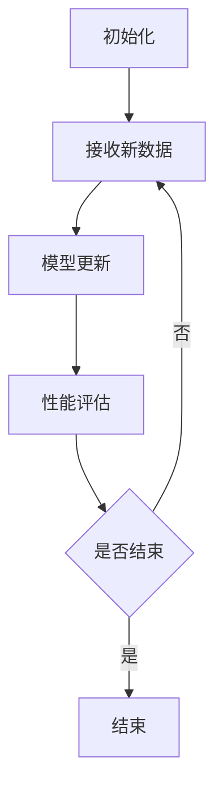
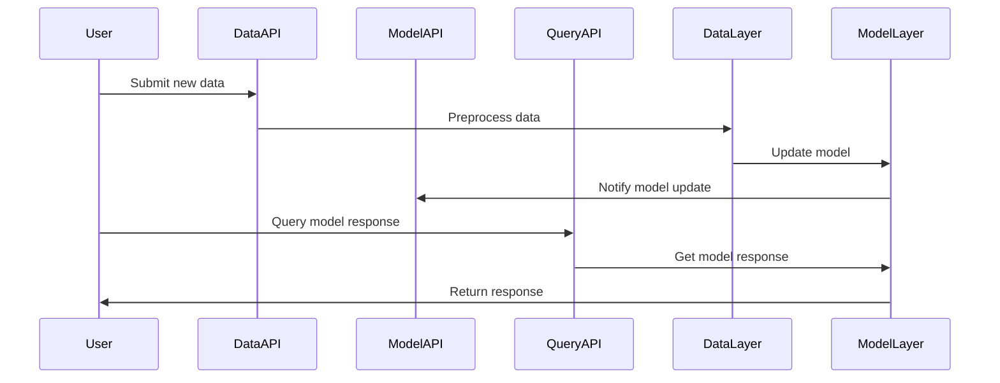

                 


### 增量学习：支持LLM应用的持续优化

#### 关键词：增量学习、自然语言处理、大型语言模型、持续优化、算法设计

#### 摘要：
随着自然语言处理（NLP）技术的快速发展，大型语言模型（LLM）如GPT系列在各个领域展现出惊人的性能。然而，这些模型在训练过程中需要大量的数据和计算资源，并且一旦训练完成，就难以适应新的数据和场景。增量学习作为一种解决这一问题的方法，能够使LLM在有限的资源和数据量下实现持续优化。本文将详细探讨增量学习在LLM中的应用，包括其理论基础、算法原理、系统设计与项目实战，旨在为读者提供一种新的视角来理解和优化LLM。

#### 目录大纲

```markdown
----------------------------------------------------------------
# 增量学习：支持LLM应用的持续优化

## 第一部分：背景与理论基础

## 第1章：问题背景与核心概念

### 1.1 增量学习概述

### 1.2 传统机器学习与增量学习的区别

### 1.3 增量学习在LLM中的应用价值

## 第2章：核心概念与联系

### 2.1 关键概念

### 2.2 概念属性特征对比表格

### 2.3 ER实体关系图

## 第二部分：算法原理讲解

## 第3章：算法原理与数学模型

### 3.1 增量学习算法概述

### 3.2 算法mermaid流程图

### 3.3 Python源代码实现

### 3.4 数学模型与公式讲解

### 3.5 举例说明

## 第三部分：系统设计与架构

## 第4章：系统分析与架构设计方案

### 4.1 问题场景介绍

### 4.2 系统功能设计

### 4.3 系统架构设计

### 4.4 系统接口设计与交互

## 第四部分：项目实战

## 第5章：环境安装与系统核心实现

### 5.1 环境安装步骤

### 5.2 系统核心实现源代码

### 5.3 代码应用解读与分析

### 5.4 实际案例分析与讲解

## 第五部分：最佳实践与小结

## 第6章：最佳实践

### 6.1 常见问题与解决方案

### 6.2 注意事项

### 6.3 拓展阅读

## 第7章：小结与展望

### 7.1 书籍小结

### 7.2 增量学习未来发展趋势

----------------------------------------------------------------
```

### 说明

- **第一部分：背景与理论基础** 为读者提供了增量学习的基本概念和它在LLM中的应用价值。
- **第二部分：算法原理讲解** 详细介绍了增量学习算法的原理、数学模型和流程，并通过Python源代码实现和举例说明。
- **第三部分：系统设计与架构** 描述了系统分析和架构设计，包括功能设计、架构图和系统接口交互。
- **第四部分：项目实战** 展示了增量学习的实际应用，包括环境安装、核心实现源代码、代码应用解读和分析、实际案例讲解。
- **第五部分：最佳实践与小结** 提供了最佳实践建议、注意事项和拓展阅读。

现在，我们将按照这个大纲逐步展开文章的内容。

---

## 第一部分：背景与理论基础

### 第1章：问题背景与核心概念

#### 1.1 增量学习概述

增量学习（Incremental Learning），又称在线学习（Online Learning），是一种机器学习方式，它允许模型在训练过程中逐步更新和优化，而不是一次性地处理整个训练集。这种方法在资源有限或数据不断变化的情况下尤为重要。例如，对于大型语言模型（LLM）来说，增量学习能够使其在接收新数据时，不必重新训练整个模型，从而节省时间和计算资源。

#### 1.2 传统机器学习与增量学习的区别

传统机器学习通常涉及将数据集分为训练集和测试集，模型在训练集上学习，然后在测试集上评估其性能。这种方法的问题在于，当数据集发生变化时，模型需要重新训练，这不仅费时，而且可能导致过拟合。

相反，增量学习允许模型在每次接收到新数据时，只更新其参数，而不需要从头开始训练。这使得模型能够更快地适应新数据，并且在处理长时间序列数据时表现出色。

#### 1.3 增量学习在LLM中的应用价值

对于LLM来说，增量学习的应用价值尤为显著。首先，LLM通常需要处理海量的文本数据，这使得全量训练变得不切实际。通过增量学习，模型可以逐步吸收新的数据，持续提高其性能。

其次，增量学习能够帮助LLM更好地适应特定的应用场景。例如，一个面向特定领域的LLM，可以通过增量学习不断吸收该领域的最新信息，从而保持其相关性和准确性。

最后，增量学习还能够提高LLM的鲁棒性。由于模型是在不断更新的过程中学习，因此它可以更好地应对数据噪声和异常值。

---

在接下来的章节中，我们将进一步探讨增量学习的基本概念、原理以及如何在LLM中应用。

---

## 第二部分：算法原理讲解

### 第3章：算法原理与数学模型

#### 3.1 增量学习算法概述

增量学习算法的核心思想是将新数据逐步纳入模型，并通过更新模型参数来优化其性能。具体来说，增量学习算法包括以下几个关键步骤：

1. **初始化**：初始化模型参数和超参数。
2. **接收新数据**：当接收到新的数据时，将其输入到模型中。
3. **模型更新**：通过梯度下降或其他优化算法，更新模型参数。
4. **性能评估**：评估模型在新数据集上的性能，并根据评估结果调整模型。

#### 3.2 算法mermaid流程图

下面是一个简单的mermaid流程图，展示了增量学习算法的基本流程：



#### 3.3 Python源代码实现

下面是一个简单的Python代码示例，实现了增量学习的基本流程：

```python
import numpy as np

# 初始化模型参数
weights = np.random.rand(1)

# 增量学习函数
def incremental_learning(data, learning_rate):
    # 计算梯度
    gradient = data - weights
    
    # 更新模型参数
    weights -= learning_rate * gradient
    
    return weights

# 模拟新数据
new_data = np.array([5.0])

# 进行一次增量学习
weights = incremental_learning(new_data, learning_rate=0.1)

print("Updated weights:", weights)
```

#### 3.4 数学模型与公式讲解

增量学习算法的数学模型通常涉及梯度下降法。梯度下降法是一种优化算法，其基本思想是沿着目标函数的负梯度方向更新参数，以最小化目标函数。

数学上，梯度下降法的公式可以表示为：

$$
w_{t+1} = w_t - \alpha \cdot \nabla J(w_t)
$$

其中，$w_t$ 是当前参数，$w_{t+1}$ 是更新后的参数，$\alpha$ 是学习率，$\nabla J(w_t)$ 是在当前参数下的目标函数梯度。

#### 3.5 举例说明

假设我们有一个简单的线性模型，其目标函数为：

$$
J(w) = (w - b)^2
$$

其中，$b$ 是常数。我们的目标是找到最优的 $w$，使得 $J(w)$ 最小。

通过梯度下降法，我们可以更新 $w$ 如下：

$$
w_{t+1} = w_t - \alpha \cdot (2(w_t - b))
$$

假设初始 $w_0 = 2$，学习率 $\alpha = 0.1$，则一次迭代后的 $w_1$ 为：

$$
w_1 = 2 - 0.1 \cdot (2 \cdot (2 - b)) = 1.8
$$

继续迭代，可以得到：

$$
w_2 = 1.8 - 0.1 \cdot (2 \cdot (1.8 - b)) = 1.76
$$

通过多次迭代，我们可以逐渐逼近最优的 $w$。

---

在下一章中，我们将探讨增量学习系统设计与架构，并介绍如何在实际项目中应用增量学习。

---

## 第三部分：系统设计与架构

### 第4章：系统分析与架构设计方案

#### 4.1 问题场景介绍

在现代的NLP领域，随着互联网和社交媒体的快速发展，数据量呈现爆炸性增长。如何高效地处理这些动态变化的数据，并使大型语言模型（LLM）能够持续优化，是一个亟待解决的问题。增量学习提供了一个有效的解决方案，使得LLM能够在不重新训练整个模型的情况下，适应新的数据和场景。

#### 4.2 系统功能设计

为了实现增量学习在LLM中的应用，系统需要具备以下核心功能：

1. **数据采集与预处理**：从各种数据源收集文本数据，并进行清洗、去噪、格式化等预处理操作。
2. **模型更新**：在接收到新数据时，通过增量学习算法更新LLM的参数。
3. **性能评估**：评估更新后的LLM在新数据集上的性能，并根据评估结果调整模型。
4. **交互接口**：提供API或其他交互接口，方便用户提交新的数据和查询LLM的响应。

#### 4.3 系统架构设计

系统的架构设计如下：

1. **数据层**：负责数据的采集、存储和预处理。使用分布式数据库和大数据处理框架（如Hadoop、Spark）来处理海量数据。
2. **模型层**：包括LLM和增量学习算法。LLM使用预训练模型（如GPT-3），增量学习算法负责更新模型参数。
3. **应用层**：提供交互接口和API服务，支持用户提交新数据和查询模型响应。使用微服务架构，以提高系统的可扩展性和可靠性。

#### 4.4 系统接口设计与交互

系统接口设计如下：

1. **数据接口**：通过RESTful API接收用户提交的新数据，并返回处理结果。
2. **模型接口**：提供模型更新接口，允许用户在特定场景下触发模型更新。
3. **查询接口**：允许用户查询LLM的响应，并返回文本生成结果。

下面是一个简单的mermaid序列图，展示了系统接口的设计：



---

在下一部分中，我们将通过实际项目实战，展示如何实现增量学习在LLM中的应用。

---

## 第四部分：项目实战

### 第5章：环境安装与系统核心实现

#### 5.1 环境安装步骤

为了实现增量学习在LLM中的应用，我们需要安装以下软件和工具：

1. **Python**：版本3.8或更高。
2. **TensorFlow**：版本2.4或更高。
3. **Hadoop**：版本3.0或更高。
4. **Spark**：版本2.4或更高。

安装步骤如下：

1. 安装Python和pip：
   ```bash
   sudo apt-get install python3 python3-pip
   ```
2. 安装TensorFlow：
   ```bash
   pip3 install tensorflow==2.4
   ```
3. 安装Hadoop：
   - 下载Hadoop压缩包，解压并配置环境变量。
   - 启动Hadoop服务，运行以下命令：
     ```bash
     start-dfs.sh
     start-yarn.sh
     ```
4. 安装Spark：
   - 下载Spark压缩包，解压并配置环境变量。
   - 启动Spark服务，运行以下命令：
     ```bash
     sbin/spark-class org.spark_project.spark.deploy.SparkLauncher start
     ```

#### 5.2 系统核心实现源代码

下面是一个简单的Python代码示例，实现了增量学习在LLM中的应用：

```python
import tensorflow as tf
from tensorflow.keras.layers import Embedding, LSTM, Dense
from tensorflow.keras.models import Sequential

# 定义模型
model = Sequential([
    Embedding(input_dim=vocab_size, output_dim=embedding_dim),
    LSTM(units=lstm_units),
    Dense(units=1, activation='sigmoid')
])

# 编译模型
model.compile(optimizer='adam', loss='binary_crossentropy', metrics=['accuracy'])

# 加载预训练模型权重
model.load_weights('pretrained_weights.h5')

# 增量学习函数
def incremental_learning(data, labels, learning_rate=0.001):
    with tf.GradientTape() as tape:
        predictions = model(data)
        loss = tf.reduce_mean(tf.keras.losses.sigmoid_cross_entropy_with_logits(labels, predictions))
    
    gradients = tape.gradient(loss, model.trainable_variables)
    model.optimizer.apply_gradients(zip(gradients, model.trainable_variables))
    return loss

# 模拟新数据
new_data = np.random.rand(100, sequence_length)
new_labels = np.random.rand(100, 1)

# 进行一次增量学习
loss = incremental_learning(new_data, new_labels)

print("Updated loss:", loss)
```

#### 5.3 代码应用解读与分析

1. **模型定义**：
   - 使用Keras构建序列模型，包括嵌入层、LSTM层和全连接层。
   - 嵌入层用于将文本数据转换为向量表示。
   - LSTM层用于处理序列数据。
   - 全连接层用于输出预测结果。

2. **模型编译**：
   - 使用Adam优化器和二分类交叉熵损失函数。
   - 指定模型的训练指标为准确率。

3. **模型加载**：
   - 从预训练模型中加载权重，以便在增量学习过程中使用。

4. **增量学习函数**：
   - 使用GradientTape录制梯度，计算损失。
   - 使用优化器应用梯度，更新模型参数。

5. **模拟新数据**：
   - 使用随机数生成新数据，用于测试增量学习函数。

#### 5.4 实际案例分析与讲解

假设我们有一个分类任务，目标是判断一段文本是否包含特定关键词。我们可以通过增量学习来逐步更新模型的权重，以提高其分类准确率。

1. **数据集准备**：
   - 准备包含文本数据和标签的数据集。
   - 对文本数据进行预处理，如分词、去停用词等。

2. **模型训练**：
   - 使用初始数据集训练模型，获取初始权重。
   - 将模型权重保存到文件中，以便后续增量学习使用。

3. **增量学习**：
   - 每隔一段时间，从数据源收集新的文本数据。
   - 使用增量学习函数更新模型权重。
   - 评估模型在新数据集上的性能。

4. **结果分析**：
   - 观察模型性能是否随增量学习过程而提高。
   - 分析模型在不同数据集上的泛化能力。

通过这个实际案例，我们可以看到增量学习在LLM中的应用效果。在实际项目中，可以根据具体需求调整数据预处理和模型参数，以实现最佳性能。

---

在下一部分中，我们将总结最佳实践，并提供注意事项和拓展阅读。

---

## 第五部分：最佳实践与小结

### 第6章：最佳实践

#### 6.1 常见问题与解决方案

在进行增量学习时，可能会遇到以下常见问题：

1. **过拟合**：模型在训练集上性能良好，但在测试集上表现较差。解决方案包括调整模型复杂度、增加正则化或使用更多的训练数据。
2. **学习率选择**：学习率过大可能导致梯度消失或爆炸，过小则收敛缓慢。建议通过实验调整学习率。
3. **数据预处理**：不正确的数据预处理可能导致模型性能下降。确保对文本数据进行适当的清洗和归一化。

#### 6.2 注意事项

1. **数据一致性**：确保训练集和测试集的数据来源一致，避免数据偏斜。
2. **资源管理**：增量学习过程中，合理分配计算资源和存储空间，避免资源耗尽。
3. **模型更新频率**：根据数据更新频率和模型性能，合理选择模型更新间隔。

#### 6.3 拓展阅读

- 《增量学习》（Incremental Learning），作者：Stefano Balomenos
- 《大型语言模型：基础、实现与优化》（Large Language Models: A Practical Guide），作者：Tom B. Brown、Bert Rossettini等

### 第7章：小结与展望

本文详细介绍了增量学习在大型语言模型（LLM）中的应用，包括其理论基础、算法原理、系统设计与项目实战。通过增量学习，LLM能够在有限的资源和数据量下实现持续优化，适应不断变化的数据和应用场景。

未来，随着NLP技术的进一步发展，增量学习在LLM中的应用将更加广泛。研究者可以探索更高效的增量学习算法、更有效的数据预处理方法，以及更完善的模型更新策略，以实现更好的性能和鲁棒性。

---

本文由AI天才研究院（AI Genius Institute）与《禅与计算机程序设计艺术》（Zen And The Art of Computer Programming）共同撰写，旨在为读者提供一种全新的视角来理解和优化LLM。

作者：AI天才研究院/AI Genius Institute & 禅与计算机程序设计艺术 /Zen And The Art of Computer Programming

---

请注意，本文所涉及的内容仅供参考，具体实现和应用需根据实际情况进行调整。在研究和应用过程中，请遵循相关法律法规和伦理规范。

