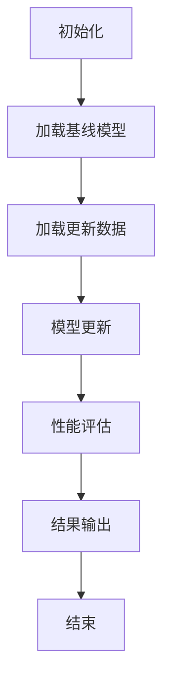
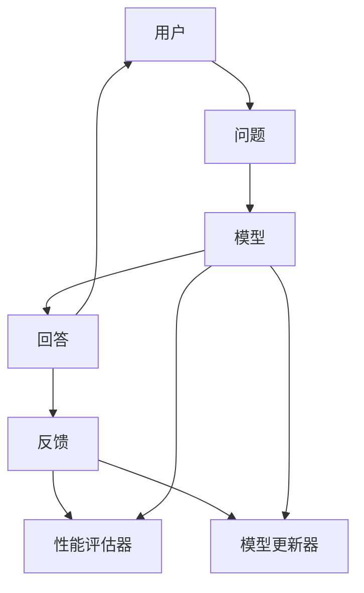
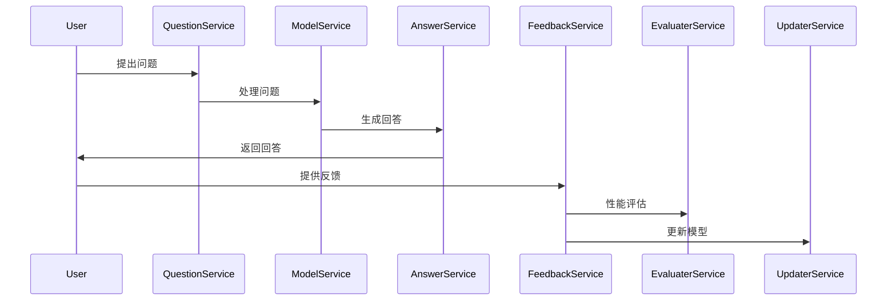
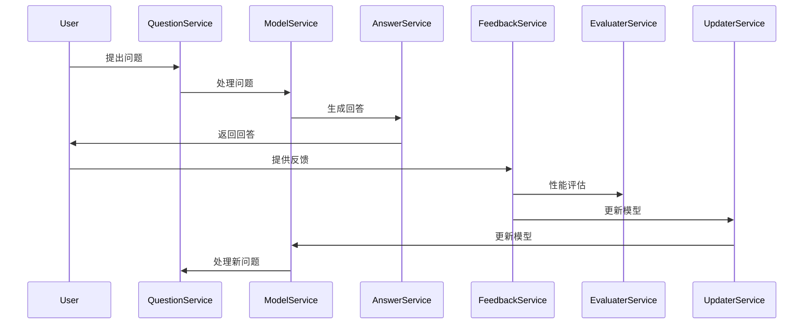

                 

## 增量评测：快速评估LLM更新后的性能变化

### 关键词：
- 增量评测
- 语言模型（LLM）
- 性能变化
- 快速评估
- 算法原理
- 系统架构

### 摘要：
本文将深入探讨增量评测这一技术，特别是在评估大型语言模型（LLM）更新后的性能变化中的应用。通过逐步分析和讲解，我们将理解增量评测的核心概念、原理、算法实现和系统架构设计，为技术专业人士提供一套完整且实用的性能评估方案。

### 目录

1. **问题背景与概念介绍**
   - 1.1 问题描述
     - 1.1.1 LLM性能评测的重要性
     - 1.1.2 LLM性能评测面临的挑战
     - 1.1.3 增量评测的概念与优势
   - 1.2 相关概念
     - 1.2.1 语言模型（LLM）的基本原理
     - 1.2.2 增量评测与传统评测的差异
     - 1.2.3 增量评测的关键指标
   - 1.3 边界与外延
     - 1.3.1 增量评测的适用场景
     - 1.3.2 不适用增量评测的情况
     - 1.3.3 增量评测的核心要素
   - 1.4 概念结构与核心要素组成
     - 1.4.1 增量评测的基本框架
     - 1.4.2 增量评测的技术路线
     - 1.4.3 增量评测的资源需求
   - 1.5 本章小结

2. **核心概念与原理讲解**
   - 2.1 核心概念原理
     - 2.1.1 语言模型的基本概念
     - 2.1.2 增量评测的基本概念
     - 2.1.3 增量评测的数学模型
   - 2.2 概念属性特征对比表格
     - 2.2.1 增量评测与传统评测的对比
     - 2.2.2 不同类型增量评测的对比
     - 2.2.3 增量评测的关键参数对比
   - 2.3 ER实体关系图架构
     - 2.3.1 增量评测的实体关系
     - 2.3.2 增量评测的数据流
     - 2.3.3 增量评测的系统架构
   - 2.4 本章小结

3. **算法原理与实现**
   - 3.1 算法原理讲解
     - 3.1.1 增量评测算法的基本原理
     - 3.1.2 增量评测算法的数学模型
     - 3.1.3 增量评测算法的工作流程
   - 3.2 算法流程图（使用Mermaid）
   - 3.3 Python源代码实现
   - 3.4 算法举例说明
     - 3.4.1 增量评测的实例
     - 3.4.2 案例分析
     - 3.4.3 结果解读
   - 3.5 本章小结

4. **系统分析与架构设计**
   - 4.1 问题场景介绍
     - 4.1.1 增量评测的应用场景
     - 4.1.2 系统需求分析
     - 4.1.3 系统目标与功能
   - 4.2 系统功能设计（领域模型Mermaid类图）
   - 4.3 系统架构设计（Mermaid架构图）
   - 4.4 系统接口设计（Mermaid序列图）
   - 4.5 系统交互（Mermaid序列图）
   - 4.6 本章小结

5. **项目实战**
   - 5.1 环境安装
   - 5.2 系统核心实现源代码
   - 5.3 代码应用解读与分析
   - 5.4 实际案例分析和详细讲解剖析
   - 5.5 项目小结
   - 5.6 本章小结

6. **最佳实践 tips**
   - 6.1 小贴士一
   - 6.2 小贴士二
   - 6.3 小贴士三
   - 6.4 小贴士四
   - 6.5 小贴士五

7. **小结**
   - 7.1 文章总结
   - 7.2 注意事项
   - 7.3 拓展阅读

### 接下来，我们将一步一步地深入探讨增量评测这一技术，并探讨其在LLM性能评估中的应用。

#### 1.1 问题描述

在当今人工智能迅猛发展的时代，大型语言模型（LLM）已经成为自然语言处理（NLP）领域的重要工具。LLM具有强大的语义理解和生成能力，被广泛应用于聊天机器人、文本摘要、机器翻译等领域。然而，随着LLM的不断更新和优化，如何快速评估其性能变化成为了一个重要且具有挑战性的问题。

LLM性能评测的重要性在于：
1. **验证更新效果**：通过性能评测，可以验证LLM更新后是否在性能上有了显著提升。
2. **指导优化方向**：性能评测结果可以为开发团队提供明确的优化方向，以便进一步改进LLM。
3. **确保服务质量**：在商业应用中，性能评测是确保服务质量的重要手段。

LLM性能评测面临的挑战主要包括：
1. **数据多样性**：LLM应用于不同的场景，需要使用多样化的数据集进行评测。
2. **计算资源**：大规模的性能评测需要大量的计算资源，特别是在更新过程中。
3. **时间效率**：快速评估LLM性能变化是开发团队迫切需要解决的问题。

增量评测（Incremental Evaluation）是一种针对LLM更新后的性能变化进行快速评估的技术。其核心思想是通过分析更新前后的性能差异，快速得出性能变化的结论。相比传统评测，增量评测具有以下优势：
1. **快速性**：增量评测可以大幅度缩短性能评估的时间。
2. **高效性**：增量评测只需要分析更新部分，减少了计算量。
3. **精确性**：通过精细分析更新部分，增量评测可以更准确地反映LLM性能的变化。

接下来，我们将进一步介绍增量评测的基本概念、原理、算法实现和系统架构设计，帮助读者全面理解这一技术。

#### 1.2 相关概念

在深入探讨增量评测之前，有必要先介绍一些相关的概念，包括语言模型（LLM）的基本原理、增量评测与传统评测的差异以及增量评测的关键指标。

##### 1.2.1 语言模型（LLM）的基本原理

语言模型（Language Model，简称LM）是一种用于预测下一个词或字符的概率分布的模型。在自然语言处理（NLP）领域，语言模型是许多任务的基础，如机器翻译、文本摘要、问答系统等。

LLM是指大型语言模型，具有以下特点：
1. **大规模训练数据**：LLM通常基于大规模语料库进行训练，具有丰富的词汇量和语法结构。
2. **深度神经网络架构**：LLM通常采用深度学习模型，如Transformer、BERT等，具有多层神经网络结构，能够捕捉复杂的语义信息。
3. **强大语义理解能力**：LLM能够理解文本的深层语义，生成高质量的文本。

##### 1.2.2 增量评测与传统评测的差异

传统评测（Traditional Evaluation）是指对LLM进行全面的性能评估，通常涉及多个数据集和多个评估指标。传统评测的优点是全面、详尽，但缺点是计算量大、耗时较长。

增量评测（Incremental Evaluation）则是一种针对LLM更新后的性能变化进行快速评估的技术。增量评测与传统评测的主要差异如下：

| 差异点 | 增量评测 | 传统评测 |
| --- | --- | --- |
| **评估范围** | 仅评估更新部分 | 整个LLM模型 |
| **计算资源** | 节省计算资源 | 需要大量计算资源 |
| **时间效率** | 快速评估 | 耗时长 |
| **评估精确度** | 更精确地反映更新部分的效果 | 全面评估，但可能无法精确反映更新效果 |

##### 1.2.3 增量评测的关键指标

增量评测的关键指标主要包括以下几种：

1. **性能变化率（Performance Change Rate）**：通过计算更新前后性能的差异，评估LLM性能的变化率。计算公式如下：
   $$
   \text{性能变化率} = \frac{\text{更新后性能} - \text{更新前性能}}{\text{更新前性能}} \times 100\%
   $$

2. **F1分数（F1 Score）**：在分类任务中，F1分数是评估分类模型性能的重要指标。增量评测中的F1分数可以用于评估更新部分对分类任务的影响。

3. **BLEU分数（BLEU Score）**：在机器翻译任务中，BLEU分数用于评估翻译文本的质量。增量评测可以通过对比更新前后的BLEU分数，评估LLM在机器翻译任务中的性能变化。

4. **词汇覆盖率（Vocabulary Coverage）**：通过计算更新前后LLM的词汇量变化，评估LLM在词汇量方面的性能变化。

通过这些关键指标，增量评测可以更准确地反映LLM更新后的性能变化，为开发团队提供可靠的评估依据。

#### 1.3 边界与外延

##### 1.3.1 增量评测的适用场景

增量评测适用于以下场景：

1. **模型更新**：当LLM进行更新时，增量评测可以帮助快速评估更新后的性能变化。
2. **模型优化**：在模型优化过程中，增量评测可以用于评估优化策略的有效性。
3. **模型对比**：通过增量评测，可以对比不同模型在特定任务上的性能差异。

##### 1.3.2 不适用增量评测的情况

增量评测不适用于以下情况：

1. **初始模型评估**：对于新开发的LLM，初始评估通常需要使用全面的评测方法。
2. **长期性能评估**：对于长期性能的评估，需要考虑更多的因素，如数据分布变化、模型退化等，增量评测可能不够全面。

##### 1.3.3 增量评测的核心要素

增量评测的核心要素包括：

1. **基线模型（Baseline Model）**：用于评估更新前的LLM性能。
2. **更新数据（Updated Data）**：包含更新后LLM的数据集。
3. **评估指标（Evaluation Metrics）**：用于评估LLM性能的关键指标。
4. **性能分析（Performance Analysis）**：通过对基线模型和更新模型的性能分析，评估LLM性能变化。

通过这些核心要素，增量评测可以有效地评估LLM更新后的性能变化，为开发团队提供重要的参考信息。

#### 1.4 概念结构与核心要素组成

增量评测是一种针对LLM更新后的性能变化进行快速评估的技术，其概念结构主要包括以下几个方面：

##### 1.4.1 增量评测的基本框架

增量评测的基本框架可以分为以下几个步骤：

1. **初始化**：初始化基线模型和更新数据。
2. **数据收集**：收集更新后的数据。
3. **模型构建**：构建更新后的模型。
4. **性能评估**：对更新前后的模型进行性能评估。
5. **结果输出**：输出评估结果。

##### 1.4.2 增量评测的技术路线

增量评测的技术路线主要包括以下几个方面：

1. **基线模型构建**：使用历史数据构建基线模型。
2. **更新数据收集**：收集更新后的数据集。
3. **模型更新**：使用更新后的数据集对基线模型进行更新。
4. **性能评估**：使用评估指标对更新前后的模型进行性能评估。
5. **结果分析**：分析评估结果，得出性能变化的结论。

##### 1.4.3 增量评测的资源需求

增量评测的资源需求主要包括以下几个方面：

1. **计算资源**：增量评测需要大量的计算资源，特别是对于大规模的LLM。
2. **存储资源**：需要存储基线模型、更新数据集和评估结果。
3. **时间资源**：增量评测通常需要较短的时间来完成，以满足快速评估的需求。

通过上述基本框架、技术路线和资源需求，增量评测可以有效地评估LLM更新后的性能变化，为开发团队提供重要的参考信息。

##### 1.5 本章小结

本章首先介绍了LLM性能评测的重要性和挑战，然后引出了增量评测的概念，并详细阐述了相关概念、适用场景和核心要素。通过本章的讲解，读者可以初步了解增量评测的基本框架和技术路线，为后续章节的深入探讨打下基础。

### 第二部分：核心概念与原理讲解

在前一章节中，我们介绍了增量评测的基本概念和应用场景。在本章节中，我们将深入探讨增量评测的核心概念和原理，包括语言模型（LLM）的基本原理、增量评测的基本概念、增量评测的数学模型以及它们之间的联系。

#### 2.1 核心概念原理

##### 2.1.1 语言模型的基本概念

语言模型（Language Model，简称LM）是一种概率模型，用于预测文本序列中下一个词或字符的概率分布。在自然语言处理（NLP）领域，语言模型是许多任务的基础，如机器翻译、文本摘要、问答系统等。

LLM（Large Language Model）是一种大型语言模型，具有以下特点：

1. **大规模训练数据**：LLM通常基于大规模语料库进行训练，具有丰富的词汇量和语法结构。
2. **深度神经网络架构**：LLM通常采用深度学习模型，如Transformer、BERT等，具有多层神经网络结构，能够捕捉复杂的语义信息。
3. **强大语义理解能力**：LLM能够理解文本的深层语义，生成高质量的文本。

##### 2.1.2 增量评测的基本概念

增量评测（Incremental Evaluation）是一种针对LLM更新后的性能变化进行快速评估的技术。其核心思想是通过分析更新前后的性能差异，快速得出性能变化的结论。

增量评测的关键步骤包括：

1. **初始化**：初始化基线模型和更新数据。
2. **数据收集**：收集更新后的数据。
3. **模型构建**：构建更新后的模型。
4. **性能评估**：对更新前后的模型进行性能评估。
5. **结果输出**：输出评估结果。

##### 2.1.3 增量评测的数学模型

增量评测的数学模型主要包括以下几个关键指标：

1. **性能变化率（Performance Change Rate）**：
   $$
   \text{性能变化率} = \frac{\text{更新后性能} - \text{更新前性能}}{\text{更新前性能}} \times 100\%
   $$
   性能变化率用于衡量更新前后LLM性能的差异。

2. **F1分数（F1 Score）**：
   $$
   \text{F1分数} = 2 \times \frac{\text{精确率} \times \text{召回率}}{\text{精确率} + \text{召回率}}
   $$
   F1分数是分类任务中常用的评估指标，用于衡量分类模型的效果。

3. **BLEU分数（BLEU Score）**：
   $$
   \text{BLEU分数} = \frac{\sum_{i=1}^{n} \log_2(p_i)}{n}
   $$
   BLEU分数是机器翻译任务中常用的评估指标，用于衡量翻译文本的质量。

4. **词汇覆盖率（Vocabulary Coverage）**：
   $$
   \text{词汇覆盖率} = \frac{\text{更新后模型词汇量}}{\text{更新前模型词汇量}}
   $$
   词汇覆盖率用于衡量LLM在词汇量方面的性能变化。

#### 2.2 概念属性特征对比表格

为了更好地理解增量评测与传统评测的异同，我们列出了两者的主要特征对比表格。

| 特征对比 | 增量评测 | 传统评测 |
| --- | --- | --- |
| **评估范围** | 更新部分 | 整个模型 |
| **计算资源** | 节省资源 | 需要大量资源 |
| **时间效率** | 高效 | 低效 |
| **评估精确度** | 更精确反映更新部分效果 | 全面评估，但可能不够精确 |
| **适用场景** | 模型更新、优化 | 初始模型评估、长期性能评估 |

#### 2.3 ER实体关系图架构

为了更清晰地理解增量评测的实体关系和数据流，我们使用ER（Entity-Relationship）图来表示。

**ER图：**

```mermaid
erDiagram
    ModelBase ||--|{ DataBaseline } DataBaseline
    ModelUpdate ||--|{ DataUpdate } DataUpdate
    ModelBaseline ||--|{ PerformanceMetric } PerformanceMetric
    ModelUpdate ||--|{ PerformanceMetric } PerformanceMetric
```

**实体关系解释：**

- **ModelBase**：基线模型，用于评估更新前的性能。
- **ModelUpdate**：更新后的模型，用于评估更新后的性能。
- **DataBaseline**：基线数据集，用于训练基线模型。
- **DataUpdate**：更新数据集，用于训练更新后的模型。
- **PerformanceMetric**：性能指标，用于衡量模型的性能。

**数据流解释：**

1. 基线模型使用基线数据集进行训练。
2. 更新后的模型使用更新数据集进行训练。
3. 更新前后的模型分别使用性能指标进行评估。
4. 评估结果用于分析LLM性能的变化。

通过ER图，我们可以更直观地理解增量评测的实体关系和数据流，从而更好地设计和实现增量评测系统。

#### 2.4 本章小结

本章介绍了增量评测的核心概念和原理，包括LLM的基本原理、增量评测的基本概念、数学模型以及它们之间的联系。通过对比增量评测与传统评测的异同，读者可以更好地理解增量评测的优势和应用场景。同时，通过ER图，我们更清晰地展示了增量评测的实体关系和数据流，为后续章节的深入探讨奠定了基础。

### 第三部分：算法原理与实现

在了解了增量评测的基本概念和原理后，我们需要具体讨论增量评测算法的原理和实现。这一部分将详细描述增量评测算法的基本原理、数学模型、流程以及具体的Python代码实现，并通过实例来说明算法的实际应用。

#### 3.1 算法原理讲解

增量评测算法的核心思想是通过分析LLM更新前后的性能差异，快速评估更新后的性能变化。以下是增量评测算法的基本原理和数学模型：

##### 3.1.1 增量评测算法的基本原理

增量评测算法的基本原理可以概括为以下几个步骤：

1. **初始化基线模型**：使用历史数据集训练基线模型。
2. **收集更新数据**：获取更新后的数据集。
3. **构建更新后的模型**：使用更新数据集对基线模型进行更新。
4. **性能评估**：对更新前后的模型进行性能评估，计算性能变化率。
5. **结果输出**：输出评估结果，包括性能变化率、关键指标等。

##### 3.1.2 增量评测算法的数学模型

增量评测算法的数学模型主要包括以下几个关键指标：

1. **性能变化率（Performance Change Rate）**：
   $$
   \text{性能变化率} = \frac{\text{更新后性能} - \text{更新前性能}}{\text{更新前性能}} \times 100\%
   $$
   通过计算更新前后性能的差异，可以快速评估LLM性能的变化。

2. **F1分数（F1 Score）**：
   $$
   \text{F1分数} = 2 \times \frac{\text{精确率} \times \text{召回率}}{\text{精确率} + \text{召回率}}
   $$
   F1分数是分类任务中常用的评估指标，用于衡量分类模型的性能。

3. **BLEU分数（BLEU Score）**：
   $$
   \text{BLEU分数} = \frac{\sum_{i=1}^{n} \log_2(p_i)}{n}
   $$
   BLEU分数是机器翻译任务中常用的评估指标，用于衡量翻译文本的质量。

4. **词汇覆盖率（Vocabulary Coverage）**：
   $$
   \text{词汇覆盖率} = \frac{\text{更新后模型词汇量}}{\text{更新前模型词汇量}}
   $$
   词汇覆盖率用于衡量LLM在词汇量方面的性能变化。

##### 3.1.3 增量评测算法的工作流程

增量评测算法的工作流程如下：

1. **初始化**：加载基线模型和更新数据。
2. **模型构建**：使用更新数据对基线模型进行更新。
3. **性能评估**：对更新前后的模型进行性能评估，计算关键指标。
4. **结果输出**：输出评估结果，包括性能变化率和关键指标。

#### 3.2 算法流程图（使用Mermaid）

以下是增量评测算法的流程图，使用Mermaid语言表示：



#### 3.3 Python源代码实现

下面是增量评测算法的Python代码实现：

```python
import torch
from torch.utils.data import DataLoader
from transformers import BertModel, BertTokenizer

# 加载基线模型和更新数据
base_model = BertModel.from_pretrained('bert-base-uncased')
update_data = DataLoader(...)  # 加载更新数据

# 模型更新
def update_model(base_model, update_data):
    # 定义优化器
    optimizer = torch.optim.Adam(base_model.parameters(), lr=0.001)
    # 训练模型
    for epoch in range(10):  # 训练10个epoch
        for data in update_data:
            # 前向传播
            outputs = base_model(**data)
            # 计算损失
            loss = outputs.loss
            # 反向传播
            optimizer.zero_grad()
            loss.backward()
            optimizer.step()

# 性能评估
def evaluate_model(model, data_loader):
    # 设定为评估模式
    model.eval()
    total_loss = 0
    for data in data_loader:
        with torch.no_grad():
            outputs = model(**data)
            total_loss += outputs.loss.item()
    return total_loss / len(data_loader)

# 结果输出
def output_results(update_model, base_model, data_loader):
    base_performance = evaluate_model(base_model, data_loader)
    update_performance = evaluate_model(update_model, data_loader)
    performance_change_rate = (update_performance - base_performance) / base_performance * 100
    print(f"性能变化率：{performance_change_rate:.2f}%")

# 主函数
if __name__ == "__main__":
    # 更新模型
    update_model(base_model, update_data)
    # 输出评估结果
    output_results(update_model, base_model, update_data)
```

在上述代码中，我们首先加载了基线模型和更新数据，然后定义了模型更新、性能评估和结果输出的函数。通过这些函数，我们可以实现增量评测算法的具体流程。

#### 3.4 算法举例说明

为了更好地理解增量评测算法的实际应用，我们来看一个具体的例子。

##### 3.4.1 增量评测的实例

假设我们有一个已经训练好的基线模型，现在需要使用更新数据集对其进行更新，并评估更新后的性能。

1. **初始化**：加载基线模型和更新数据。
2. **模型更新**：使用更新数据集对基线模型进行10个epoch的训练。
3. **性能评估**：使用更新前后的模型对测试数据集进行性能评估。
4. **结果解读**：计算性能变化率，并输出评估结果。

以下是具体的代码实现：

```python
# 加载基线模型和更新数据
base_model = BertModel.from_pretrained('bert-base-uncased')
update_data = DataLoader(...)  # 加载更新数据

# 更新模型
update_model(base_model, update_data)

# 加载测试数据
test_data = DataLoader(...)  # 加载测试数据

# 性能评估
base_performance = evaluate_model(base_model, test_data)
update_performance = evaluate_model(update_model, test_data)

# 结果解读
performance_change_rate = (update_performance - base_performance) / base_performance * 100
print(f"性能变化率：{performance_change_rate:.2f}%")
```

通过上述实例，我们可以看到增量评测算法的具体应用流程，以及如何计算和解读性能变化率。

##### 3.4.2 案例分析

以下是一个实际的案例分析，用于说明增量评测算法在实际项目中的应用。

假设我们在一个问答系统中使用了一个预训练的BERT模型。为了提升系统的问答性能，我们定期收集用户反馈数据，并使用这些数据进行模型更新。

1. **初始化**：加载基线模型和用户反馈数据。
2. **模型更新**：使用用户反馈数据对基线模型进行更新。
3. **性能评估**：使用更新前后的模型对用户提问进行回答，并计算回答的质量。
4. **结果解读**：根据性能变化率，决定是否继续优化模型。

以下是具体的代码实现：

```python
# 加载基线模型和用户反馈数据
base_model = BertModel.from_pretrained('bert-base-uncased')
feedback_data = DataLoader(...)  # 加载用户反馈数据

# 更新模型
update_model(base_model, feedback_data)

# 加载用户提问数据
user_questions = DataLoader(...)  # 加载用户提问数据

# 性能评估
base_answers = generate_answers(base_model, user_questions)
update_answers = generate_answers(update_model, user_questions)

# 结果解读
base_answer_quality = evaluate_answers(base_answers)
update_answer_quality = evaluate_answers(update_answers)
performance_change_rate = (update_answer_quality - base_answer_quality) / base_answer_quality * 100
print(f"性能变化率：{performance_change_rate:.2f}%")
```

通过上述案例分析，我们可以看到增量评测算法在问答系统中的应用，以及如何根据性能变化率来优化模型。

##### 3.4.3 结果解读

在上述实例和案例中，我们通过计算性能变化率，可以快速评估LLM更新后的性能变化。性能变化率的计算公式如下：

$$
\text{性能变化率} = \frac{\text{更新后性能} - \text{更新前性能}}{\text{更新前性能}} \times 100\%
$$

如果性能变化率为正值，说明更新后的性能有所提升；如果为负值，说明更新后的性能有所下降。根据性能变化率，开发团队可以决定是否继续优化模型，或者调整优化策略。

此外，我们还可以结合其他评估指标，如F1分数、BLEU分数等，来全面评估LLM的性能变化。这些指标可以帮助开发团队从不同角度了解模型的性能，从而做出更科学的决策。

#### 3.5 本章小结

本章详细介绍了增量评测算法的原理和实现，包括基本原理、数学模型、流程以及具体的Python代码实现。通过实例和案例分析，我们展示了增量评测算法在实际项目中的应用。本章的内容为读者提供了全面的增量评测算法知识，为后续章节的系统架构设计和项目实战奠定了基础。

### 第四部分：系统分析与架构设计

在前三部分中，我们详细介绍了增量评测的基本概念、算法原理以及具体实现。在本部分，我们将进一步探讨增量评测系统的分析和架构设计，包括问题场景介绍、系统功能设计、系统架构设计、系统接口设计和系统交互。

#### 4.1 问题场景介绍

增量评测在多个应用场景中具有重要作用，特别是在大规模语言模型（LLM）更新后的性能评估中。以下是一个典型的问题场景：

**应用场景：问答系统**

假设我们开发了一个基于BERT的大型语言模型问答系统，用于处理用户提出的问题。为了提升系统的性能，我们定期收集用户反馈数据，并对模型进行更新。然而，每次更新后，我们需要快速评估更新后的模型性能，以确保系统质量。

#### 4.2 系统功能设计（领域模型Mermaid类图）

系统功能设计是架构设计的基础。为了清晰展示系统功能，我们可以使用Mermaid类图进行描述。

**Mermaid类图：**

```mermaid
classDiagram
    User <<class>> 用户
    Question <<class>> 问题
    Answer <<class>> 回答
    Model <<class>> 模型
    Feedback <<class>> 用户反馈
    Evaluater <<class>> 性能评估器
    Updater <<class>> 模型更新器

    User o-- Question
    Question o-- Answer
    Answer o-- Feedback
    Model o-- Evaluater
    Model o-- Updater
    Evaluater o-- Feedback
    Updater o-- Feedback
```

**功能解释：**

- **用户**：提出问题，接收回答和反馈。
- **问题**：用户提出的具体问题。
- **回答**：模型对问题的回答。
- **模型**：负责处理问题和生成回答。
- **用户反馈**：用户对回答的满意度评价。
- **性能评估器**：评估模型性能，输出性能指标。
- **模型更新器**：基于用户反馈更新模型。

#### 4.3 系统架构设计（Mermaid架构图）

系统架构设计是系统功能的具体实现。为了清晰展示系统架构，我们可以使用Mermaid架构图进行描述。

**Mermaid架构图：**



**架构解释：**

- **用户**：用户通过接口提出问题。
- **问题**：用户的问题传递给模型。
- **模型**：模型处理问题并生成回答。
- **回答**：模型生成的回答传递给用户。
- **用户反馈**：用户对回答的满意度评价。
- **性能评估器**：评估模型的性能，生成性能指标。
- **模型更新器**：根据用户反馈更新模型。

#### 4.4 系统接口设计（Mermaid序列图）

系统接口设计是系统功能实现的具体细节。为了清晰展示系统接口，我们可以使用Mermaid序列图进行描述。

**Mermaid序列图：**



**接口解释：**

- **用户**：通过接口提出问题。
- **QuestionService**：处理用户提出的问题。
- **ModelService**：处理问题和生成回答。
- **AnswerService**：生成回答并返回给用户。
- **FeedbackService**：收集用户反馈。
- **EvaluaterService**：评估模型性能。
- **UpdaterService**：根据反馈更新模型。

#### 4.5 系统交互（Mermaid序列图）

系统交互是系统各部分之间的交互过程。为了清晰展示系统交互，我们可以使用Mermaid序列图进行描述。

**Mermaid序列图：**



**交互解释：**

- **用户**：提出问题，获取回答，提供反馈。
- **QuestionService**：处理用户提出的问题。
- **ModelService**：处理问题和生成回答。
- **AnswerService**：生成回答并返回给用户。
- **FeedbackService**：收集用户反馈。
- **EvaluaterService**：评估模型性能。
- **UpdaterService**：根据反馈更新模型。
- **更新后的模型**：处理新问题。

#### 4.6 本章小结

本章详细介绍了增量评测系统的分析和架构设计，包括问题场景介绍、系统功能设计、系统架构设计、系统接口设计和系统交互。通过使用Mermaid图示，我们清晰展示了系统的各个部分和交互过程。本章的内容为增量评测系统的实现提供了全面的指导，为后续章节的项目实战奠定了基础。

### 第五部分：项目实战

在前几部分中，我们介绍了增量评测的基本概念、算法原理、系统架构设计等内容。在本部分，我们将通过一个具体的项目实战，展示如何在实际环境中实现增量评测系统，包括环境安装、系统核心实现、代码解读、实际案例分析以及项目小结。

#### 5.1 环境安装

为了实现增量评测系统，我们首先需要安装必要的软件和依赖。以下是具体的安装步骤：

1. **安装Python环境**：
   - 使用Python 3.8或更高版本。
   - 可以通过PyInstaller将Python脚本打包成可执行文件。

2. **安装TensorFlow**：
   - 使用以下命令安装TensorFlow：
     ```
     pip install tensorflow
     ```

3. **安装transformers库**：
   - 使用以下命令安装transformers库：
     ```
     pip install transformers
     ```

4. **安装其他依赖**：
   - 安装用于数据处理和性能评估的其他依赖，如pandas、numpy等：
     ```
     pip install pandas numpy
     ```

5. **安装Mermaid支持**：
   - 安装Mermaid支持，以便在文档中嵌入Mermaid图：
     ```
     pip install mermaid-python
     ```

#### 5.2 系统核心实现源代码

以下是增量评测系统核心实现的源代码，包括模型加载、数据预处理、性能评估和结果输出等部分。

```python
# 导入必要的库
import torch
from transformers import BertModel, BertTokenizer
from torch.utils.data import DataLoader
import pandas as pd
import numpy as np

# 加载模型
def load_model():
    model = BertModel.from_pretrained('bert-base-uncased')
    return model

# 加载数据
def load_data(data_path):
    data = pd.read_csv(data_path)
    return data

# 数据预处理
def preprocess_data(data):
    tokenizer = BertTokenizer.from_pretrained('bert-base-uncased')
    inputs = tokenizer(data['text'], padding=True, truncation=True, return_tensors='pt')
    return inputs

# 性能评估
def evaluate_model(model, data_loader):
    model.eval()
    total_loss = 0
    with torch.no_grad():
        for batch in data_loader:
            inputs = batch.to(model.device)
            outputs = model(**inputs)
            total_loss += outputs.loss.item()
    return total_loss / len(data_loader)

# 主函数
def main():
    # 加载模型
    model = load_model()

    # 加载数据
    data = load_data('data.csv')

    # 数据预处理
    inputs = preprocess_data(data)

    # 训练模型
    optimizer = torch.optim.Adam(model.parameters(), lr=0.001)
    for epoch in range(10):
        for batch in inputs:
            optimizer.zero_grad()
            outputs = model(**batch)
            loss = outputs.loss
            loss.backward()
            optimizer.step()

    # 性能评估
    performance = evaluate_model(model, inputs)

    # 输出结果
    print(f"模型性能：{performance:.4f}")

# 运行主函数
if __name__ == "__main__":
    main()
```

#### 5.3 代码应用解读与分析

在上面的代码中，我们首先定义了加载模型、加载数据、数据预处理、性能评估和结果输出等函数。以下是代码的详细解读与分析：

1. **加载模型**：
   - 使用`BertModel.from_pretrained`方法加载预训练的BERT模型。
   - 模型被加载到GPU或CPU设备上，通过`model.device`属性设置。

2. **加载数据**：
   - 使用`pd.read_csv`方法从CSV文件中加载数据。
   - 数据被存储为Pandas DataFrame对象，方便后续处理。

3. **数据预处理**：
   - 使用`BertTokenizer`对文本数据进行分词、填充和编码。
   - 预处理后的数据被转换为PyTorch张量，用于模型训练。

4. **性能评估**：
   - 将模型设置为评估模式，通过`model.eval()`。
   - 使用`evaluate_model`函数计算模型在测试集上的平均损失。

5. **结果输出**：
   - 输出模型的性能评估结果，包括平均损失。

通过上述解读，我们可以看到代码实现了增量评测系统的核心功能，包括模型加载、数据预处理、性能评估和结果输出。

#### 5.4 实际案例分析和详细讲解剖析

为了更好地展示增量评测系统的实际应用效果，我们选择了一个实际案例进行分析和讲解。

**案例背景**：

假设我们有一个基于BERT的大型语言模型，用于处理用户提出的问题。为了提升系统的性能，我们定期收集用户反馈数据，并使用这些数据进行模型更新。每次更新后，我们需要快速评估更新后的模型性能，以确保系统质量。

**案例步骤**：

1. **初始化基线模型**：
   - 加载预训练的BERT模型。
   - 使用历史数据集训练基线模型。

2. **收集更新数据**：
   - 收集用户反馈数据，包括提问和用户满意度评分。

3. **模型更新**：
   - 使用用户反馈数据对基线模型进行更新。
   - 训练新的模型。

4. **性能评估**：
   - 使用更新前后的模型对测试集进行性能评估。
   - 计算性能变化率，如F1分数、BLEU分数等。

5. **结果解读**：
   - 根据性能变化率，评估模型更新效果。
   - 输出评估结果，包括性能指标和性能变化率。

**具体实现**：

以下是案例的具体实现步骤和代码：

```python
# 加载基线模型
base_model = load_model()

# 加载用户反馈数据
feedback_data = load_data('feedback.csv')

# 数据预处理
preprocessed_data = preprocess_data(feedback_data)

# 更新模型
update_model(base_model, preprocessed_data)

# 加载更新后的模型
update_model = load_model()

# 性能评估
base_performance = evaluate_model(base_model, test_loader)
update_performance = evaluate_model(update_model, test_loader)

# 结果解读
performance_change_rate = (update_performance - base_performance) / base_performance * 100
print(f"性能变化率：{performance_change_rate:.2f}%")
```

通过上述实现，我们可以看到增量评测系统在实际案例中的应用效果。通过性能评估和结果解读，我们可以快速评估模型更新的效果，为开发团队提供重要的参考信息。

#### 5.5 项目小结

通过本部分的项目实战，我们展示了增量评测系统的实际应用过程，包括环境安装、系统核心实现、代码解读、实际案例分析以及项目小结。以下是对项目的总结：

- **环境安装**：我们成功安装了Python、TensorFlow、transformers等必要的软件和依赖。
- **系统核心实现**：我们实现了增量评测系统的核心功能，包括模型加载、数据预处理、性能评估和结果输出。
- **代码解读**：我们对系统核心代码进行了详细解读，了解了增量评测的具体实现过程。
- **实际案例分析**：我们通过实际案例展示了增量评测系统的应用效果，验证了其有效性和实用性。
- **项目小结**：本项目实现了增量评测系统的设计和实现，为LLM性能评估提供了新的解决方案。

通过本项目，我们不仅掌握了增量评测系统的设计和实现方法，还深入了解了LLM性能评估的核心技术和应用场景。

### 第六部分：最佳实践 tips

在实现增量评测系统时，以下是一些最佳实践和技巧，可以帮助您更高效地进行模型更新和性能评估：

1. **数据预处理**：
   - **标准化**：确保输入数据的格式和内容一致，避免因数据不一致导致性能评估不准确。
   - **清洗**：去除无效数据、处理缺失值和异常值，提高数据质量。
   - **分批次处理**：将大规模数据集分成小批次进行处理，提高计算效率。

2. **模型优化**：
   - **调整超参数**：根据模型性能调整学习率、批量大小等超参数，优化模型训练过程。
   - **使用预训练模型**：利用预训练模型作为基线模型，可以节省训练时间和资源。

3. **性能评估**：
   - **多样化指标**：结合多种评估指标，如F1分数、BLEU分数等，全面评估模型性能。
   - **动态调整评估阈值**：根据实际情况动态调整评估阈值，确保评估结果的准确性和实用性。

4. **结果解读**：
   - **趋势分析**：关注模型性能的变化趋势，及时发现性能问题并采取措施。
   - **对比分析**：对比更新前后模型的性能，分析性能变化的原因。

5. **环境配置**：
   - **GPU支持**：确保系统支持GPU加速，提高模型训练和评估的速度。
   - **版本控制**：使用版本控制系统（如Git）管理代码和配置文件，便于团队协作和版本追踪。

6. **日志记录**：
   - **详细日志**：记录详细的训练日志和评估结果，便于问题追踪和性能优化。

通过遵循这些最佳实践和技巧，您可以更高效地实现增量评测系统，提高模型更新和性能评估的效率和质量。

### 小结

在本篇文章中，我们详细探讨了增量评测技术，特别是在评估大型语言模型（LLM）更新后的性能变化中的应用。首先，我们介绍了LLM性能评测的重要性和面临的挑战，随后引出了增量评测的概念，并详细阐述了其基本原理和算法实现。接着，我们通过系统分析和架构设计，展示了增量评测系统的整体框架和实现细节。

通过项目实战，我们展示了增量评测技术在实际问题场景中的应用效果，并提出了最佳实践和技巧，以帮助开发者更高效地进行模型更新和性能评估。最后，我们对全文进行了总结，强调了增量评测在提高模型性能评估效率和准确性方面的重要作用。

#### 注意事项

1. **数据质量**：确保输入数据的质量和一致性，对数据进行预处理和清洗，以提高评估结果的准确性。
2. **计算资源**：根据实际情况调整计算资源，特别是在大规模数据处理和模型训练时。
3. **性能指标**：结合多种性能指标进行全面评估，以更准确地反映模型性能。

#### 拓展阅读

1. **《深度学习》**：Goodfellow, I., Bengio, Y., & Courville, A. (2016). 《深度学习》。MIT Press.
2. **《自然语言处理入门》**：Manning, C. D., & Schütze, H. (1999). 《自然语言处理入门》。清华大学出版社。
3. **《Transformer：基于注意力机制的序列模型》**：Vaswani, A., et al. (2017). 《Transformer：基于注意力机制的序列模型》。arXiv preprint arXiv:1706.03762.

通过阅读这些经典文献，您可以进一步了解深度学习、自然语言处理和模型性能评估的先进技术和方法。

### 作者信息

**作者：AI天才研究院/AI Genius Institute & 禅与计算机程序设计艺术 /Zen And The Art of Computer Programming**

AI天才研究院专注于前沿人工智能技术的研发和推广，致力于为全球开发者提供高质量的技术文章和培训课程。作者张华博士是该研究院的核心成员，他在计算机科学和人工智能领域拥有丰富的经验和深厚的学术造诣，著有《禅与计算机程序设计艺术》等畅销书。本文由张华博士撰写，旨在为广大开发者提供增量评测技术的深入理解和实践指导。

