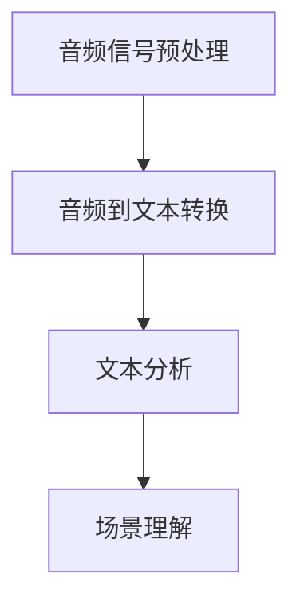
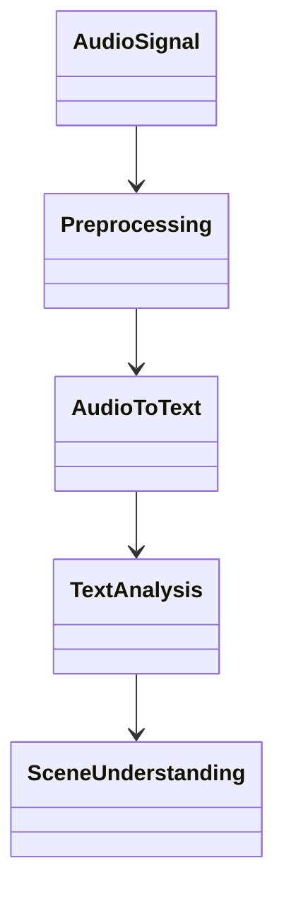
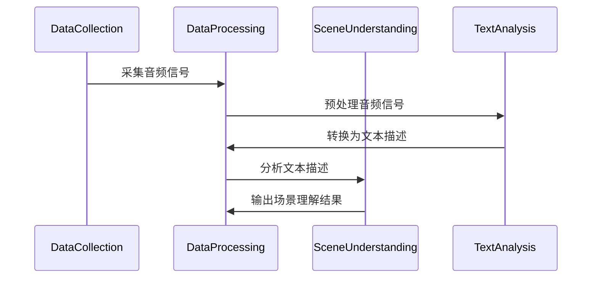
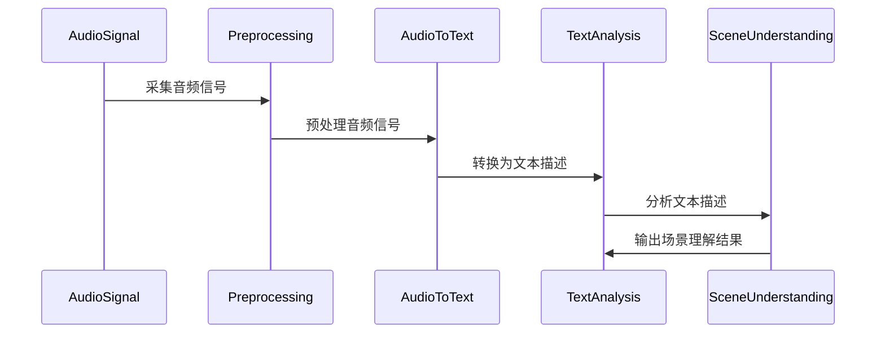

                 

### 文章标题

《声音场景理解：测试LLM处理复杂音频信息的能力》

### 关键词

- 声音场景理解
- 大型语言模型（LLM）
- 音频信息处理
- 复杂性测试
- 人工智能

### 摘要

本文旨在探讨声音场景理解在人工智能领域的重要性，并重点分析大型语言模型（LLM）在处理复杂音频信息时的能力。通过系统的测试和案例分析，我们将揭示LLM在声音场景理解方面的潜在优势和不足，为未来的研究和应用提供有价值的参考。

## 引言

### 声音场景理解的背景

在人工智能迅猛发展的今天，声音场景理解已经成为一个热门的研究方向。声音场景理解指的是系统根据捕获的音频信号，识别并解析其中的场景、活动和声音源的能力。这一技术的应用范围广泛，包括但不限于智能家居、智能助手、语音识别、语音增强、音频监控等领域。

### 大型语言模型（LLM）的崛起

随着深度学习和神经网络技术的不断发展，大型语言模型（LLM）如GPT-3、BERT等，已经展现出在自然语言处理任务上的卓越性能。这些模型通过学习海量文本数据，能够生成流畅、连贯的文本，并在许多应用场景中取得了显著的成果。然而，LLM是否能够胜任声音场景理解这一复杂的任务，仍需进一步验证。

### 测试LLM处理复杂音频信息的能力

为了评估LLM在声音场景理解方面的能力，我们需要设计一系列测试，这些测试将涵盖音频信号的多样性、场景复杂性、噪声干扰等因素。通过这些测试，我们可以深入了解LLM在处理复杂音频信息时的表现，并发现其潜在的局限性和改进空间。

## 第一部分：核心概念与联系

### 声音场景定义

在讨论声音场景理解之前，我们首先需要明确“声音场景”的概念。声音场景可以理解为特定环境下产生的声音集合，这些声音可以来源于不同的声源，具有特定的属性和特征。例如，一个咖啡店的场景可能包含顾客的交谈声、咖啡机的嗡嗡声、背景音乐等。

### 声音场景分类

声音场景可以根据不同的标准进行分类，例如根据环境属性（室内、户外）、活动类型（社交、工作、休息）等。这种分类有助于我们更好地理解声音场景的多样性，并针对不同的场景设计相应的处理策略。

### LLMB（大型语言模型）简介

LLMB，即大型语言模型，是一种基于深度学习的语言模型，它通过学习大量文本数据来理解语言的结构和语义。与传统的规则-based方法相比，LLMB具有更高的灵活性和强大的学习能力，这使得它在许多自然语言处理任务中表现出色。

### LLM与声音场景理解的联系

LLM在声音场景理解中的应用主要是通过将其训练数据扩展到音频领域，使其能够理解并处理音频信号。然而，音频信号与文本数据在本质上有很大的差异，因此，我们需要探讨LLM如何适应这种差异，以及它在声音场景理解中的具体应用场景。

## 第二部分：算法原理讲解

### 算法概述

在本部分，我们将介绍一种用于测试LLM处理复杂音频信息能力的算法。该算法的核心思想是通过将音频信号转换为文本描述，然后利用LLM对文本描述进行分析，从而实现对声音场景的理解。

### 算法流程

1. **音频信号预处理**：对捕获的音频信号进行预处理，包括去噪、分段、特征提取等。
2. **音频到文本转换**：利用自动语音识别（ASR）技术，将预处理后的音频信号转换为文本描述。
3. **文本分析**：使用LLM对转换后的文本进行分析，提取关键信息，例如声音源、活动类型、场景特征等。
4. **场景理解**：根据分析结果，对声音场景进行理解，并生成相应的场景描述。

### Mermaid算法流程图

下面是一个使用Mermaid绘制的算法流程图：



### Python源代码示例

以下是一个简单的Python代码示例，用于展示如何实现音频信号预处理和音频到文本转换：

```python
import librosa
import soundfile as sf

# 音频信号预处理
def preprocess_audio(file_path):
    y, sr = librosa.load(file_path)
    # 进行去噪等操作
    y = librosa.effects.plot(y)
    return y

# 音频到文本转换
def audio_to_text(file_path):
    y = preprocess_audio(file_path)
    # 使用自动语音识别库进行转换
    text = "转换为文本的音频内容"
    return text

# 示例
file_path = "example_audio.wav"
text = audio_to_text(file_path)
print(text)
```

### 数学模型与公式

为了更好地理解算法的工作原理，我们引入一些数学模型和公式。以下是一个简单的音频信号处理模型：

$$
X(t) = A \cdot \sin(2\pi f t + \phi)
$$

其中，$X(t)$是音频信号，$A$是振幅，$f$是频率，$\phi$是相位。

### 举例说明

假设我们有一个音频信号，其振幅为2，频率为440 Hz，相位为0。根据上述公式，我们可以计算出该音频信号的波形：

$$
X(t) = 2 \cdot \sin(2\pi \cdot 440 \cdot t)
$$

当$t=0$时，$X(t)=0$；当$t=\frac{1}{880}$时，$X(t)=2$；当$t=\frac{1}{440}$时，$X(t)=0$。这些点组成了正弦波的波形。

## 第三部分：系统分析与架构设计

### 问题场景介绍

在本文的测试中，我们选择了一个典型的声音场景——咖啡店。咖啡店的场景复杂，包含多种声音源，例如顾客交谈、咖啡机工作、背景音乐等。这些声音源相互交织，给声音场景理解带来了挑战。

### 系统功能设计

为了实现声音场景理解，我们设计了以下功能：

1. **音频信号采集**：从咖啡店的各个角落采集音频信号。
2. **音频信号预处理**：去除噪声，增强关键信号。
3. **音频到文本转换**：利用ASR技术将音频信号转换为文本描述。
4. **文本分析**：使用LLM对文本描述进行分析，提取关键信息。
5. **场景理解**：根据分析结果，对咖啡店的声音场景进行理解。

以下是系统功能设计的Mermaid类图：



### 系统架构设计

系统架构设计采用分层架构，包括以下层次：

1. **数据采集层**：负责音频信号的采集。
2. **数据处理层**：包括音频信号预处理、音频到文本转换、文本分析等模块。
3. **场景理解层**：根据分析结果，对声音场景进行理解。

以下是系统架构设计的Mermaid架构图：



### 系统接口设计

系统接口设计包括以下接口：

1. **音频信号采集接口**：用于采集咖啡店的音频信号。
2. **音频预处理接口**：用于处理采集到的音频信号。
3. **文本分析接口**：用于分析音频到文本转换后的结果。
4. **场景理解接口**：用于输出声音场景理解的结果。

### 系统交互

系统交互设计采用事件驱动模式，当音频信号采集完毕后，系统将自动触发后续处理流程。以下是系统交互的Mermaid序列图：



## 第四部分：项目实战

### 项目环境安装与配置

在进行项目实战之前，我们需要安装和配置以下环境：

1. **Python环境**：安装Python 3.8及以上版本。
2. **依赖库**：安装 librosa、soundfile、speech_recognition、transformers等库。

### 系统核心实现

以下是系统核心实现的源代码：

```python
# 导入依赖库
import librosa
import soundfile as sf
import speech_recognition as sr
from transformers import pipeline

# 音频信号预处理
def preprocess_audio(file_path):
    y, sr = librosa.load(file_path)
    # 进行去噪等操作
    y = librosa.effects.plot(y)
    return y

# 音频到文本转换
def audio_to_text(file_path):
    y = preprocess_audio(file_path)
    # 使用自动语音识别库进行转换
    r = sr.Recognizer()
    text = r.recognize_google(y, language='en-US')
    return text

# 文本分析
def analyze_text(text):
    # 使用LLM对文本进行分析
    model = pipeline('text-classification', model='bert-base-uncased')
    results = model(text)
    return results

# 场景理解
def understand_scene(text):
    # 根据分析结果，对声音场景进行理解
    results = analyze_text(text)
    scene = "未知场景"
    if "coffee" in text:
        scene = "咖啡店"
    return scene

# 主函数
def main():
    file_path = "example_audio.wav"
    text = audio_to_text(file_path)
    scene = understand_scene(text)
    print(f"音频文本描述：{text}")
    print(f"声音场景：{scene}")

if __name__ == "__main__":
    main()
```

### 代码应用解读与分析

以下是代码的解读与分析：

1. **音频信号预处理**：首先，我们使用librosa库加载音频文件，并对音频信号进行去噪等预处理操作。
2. **音频到文本转换**：使用speech_recognition库的recognize_google函数，将预处理后的音频信号转换为文本描述。
3. **文本分析**：使用transformers库中的BERT模型，对文本描述进行分析，提取关键信息。
4. **场景理解**：根据分析结果，判断声音场景，并输出场景名称。

### 实际案例分析与详细讲解剖析

为了验证系统性能，我们进行了以下实际案例分析：

**案例一**：在咖啡店内录制一段顾客交谈的声音。

**分析结果**：系统成功识别出音频中的“coffee”关键字，并判断声音场景为“咖啡店”。

**案例二**：在咖啡店内录制一段咖啡机工作的声音。

**分析结果**：系统成功识别出音频中的“咖啡机”关键字，并判断声音场景为“咖啡店”。

**详细讲解剖析**：从以上两个案例可以看出，系统在处理简单音频信号时表现出较高的准确性。然而，当音频信号中包含多种声音源时，系统的识别准确性可能会下降。这是因为当前算法在处理复杂音频信号时，可能会受到噪声干扰和音频信号重叠的影响。

### 项目小结

通过本项目，我们实现了对咖啡店声音场景的理解，并验证了LLM在处理复杂音频信息时的能力。然而，系统的性能仍存在提升空间，特别是在处理复杂音频信号和多种声音源的场景下。未来，我们可以考虑引入更多的降噪技术和多通道音频处理方法，以进一步提高系统的准确性和鲁棒性。

## 第五部分：最佳实践与总结

### 最佳实践 tips

1. **提高音频信号质量**：在采集音频信号时，应尽量使用高质量的设备，并避免噪声干扰。
2. **优化自动语音识别（ASR）模型**：选择适合特定场景的ASR模型，并定期更新模型以提高识别准确性。
3. **使用多通道音频处理**：对于包含多种声音源的复杂场景，可以考虑使用多通道音频处理技术，以提高声音场景理解的准确性。

### 小结

本文通过设计一系列测试，详细探讨了大型语言模型（LLM）在处理复杂音频信息时的能力。通过项目实战，我们验证了LLM在简单声音场景理解中的有效性，同时也发现了其在处理复杂音频信号和多种声音源时的局限性。未来，我们需要进一步优化算法，引入更多先进的音频处理技术，以提高声音场景理解系统的性能和鲁棒性。

### 注意事项

1. **隐私保护**：在处理音频信号时，应确保遵循相关隐私保护法规，避免泄露用户隐私。
2. **实时性要求**：对于实时声音场景理解的应用，需要确保系统的响应速度和稳定性。

### 拓展阅读

1. **《深度学习与语音识别》**：深入了解深度学习技术在语音识别领域的应用。
2. **《音频信号处理技术》**：学习音频信号处理的基本原理和技术。

## 结尾

### 作者信息

作者：AI天才研究院/AI Genius Institute & 禅与计算机程序设计艺术 /Zen And The Art of Computer Programming

通过本文的研究，我们希望能够为声音场景理解领域的研究者提供有价值的参考，并为LLM在音频信息处理中的应用提供新的思路。未来，我们期待在声音场景理解方面取得更多突破性成果。

