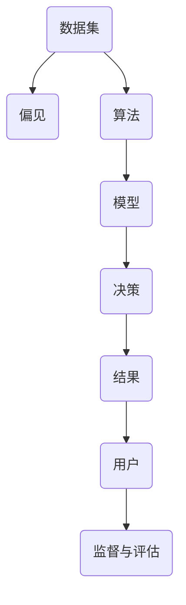

                 

### 处理示例中的偏见和公平性问题

偏见和公平性问题在人工智能系统中是一个广泛讨论的话题。随着AI技术的普及，智能系统在各个领域发挥着越来越重要的作用，然而，这些系统在处理数据时可能会出现偏见，导致不公平的决策。本文将深入探讨偏见和公平性问题的定义、原因、影响，以及具体的解决方法。

#### 关键词

- 偏见
- 公平性
- 人工智能
- 算法
- 数据预处理
- 模型解释性

#### 摘要

本文首先介绍了偏见和公平性的基本概念，随后分析了偏见和公平性问题在人工智能系统中的背景和具体表现。接着，本文探讨了偏见和公平性的理论基础，包括偏见与歧视的概念、数据偏见、算法偏见和结果偏见。随后，文章提出了处理偏见和公平性问题的核心方法，包括数据预处理、算法改进、模型解释性和用户参与。最后，文章通过一个具体的案例展示了如何在实际项目中应用这些方法。

---

### 第1章: 问题背景、问题描述与核心解决方法

#### 1.1.1 偏见与公平性问题背景

偏见和公平性问题在人工智能系统中是一个重要的伦理问题。随着人工智能技术的广泛应用，智能系统在推荐系统、招聘系统、监控系统等各个领域发挥着重要作用。然而，这些系统在处理数据时可能会因为历史数据的偏见、算法的设计问题或者对某些群体的歧视而产生不公平的决策。

#### 1.1.2 偏见与公平性问题描述

偏见和公平性问题主要表现为以下几个方面：

1. **数据偏见**：智能系统在训练时，依赖于大量的历史数据。如果这些数据本身存在偏见，例如招聘系统中使用了存在性别偏见的简历数据，那么训练出的模型可能会在招聘时对女性候选人产生不公平的对待。

2. **算法偏见**：某些算法在设计时可能没有考虑到公平性，例如人脸识别算法在识别不同种族的人脸时，准确性可能会有所不同。

3. **结果偏见**：智能系统在做出决策时，可能会因为偏见而产生不公平的结果。例如，监控系统对某些群体进行过度监控，可能会引发该群体的不满。

#### 1.1.3 偏见与公平性问题解决方法

为了解决偏见和公平性问题，可以从以下几个方面入手：

1. **数据预处理**：在训练智能系统前，对数据集进行清洗，剔除可能存在的偏见信息，或者对有偏见的数据进行校正。

2. **算法改进**：优化算法设计，使其在处理数据时能够考虑到公平性。例如，可以采用公平性度量方法，对模型的决策过程进行监控和评估。

3. **模型解释性**：提高模型的解释性，让用户能够理解模型的决策过程，从而对模型的偏见和公平性进行监督和评估。

4. **用户参与**：鼓励用户参与系统设计和决策过程，确保系统的决策更加公正和透明。

#### 1.1.4 边界与外延

偏见和公平性问题不仅限于人工智能领域，还涉及社会学、心理学等多个领域。例如，社会学中的研究可能会关注社会偏见对个体行为的影响，心理学中的研究可能会探讨偏见产生的心理机制。

#### 1.1.5 概念结构与核心要素组成

在处理偏见和公平性问题时，我们需要关注以下几个核心要素：

1. **数据**：数据是智能系统的基础，数据的质量直接影响模型的公平性和准确性。

2. **算法**：算法是智能系统的核心，算法的设计和优化对公平性至关重要。

3. **用户**：用户是智能系统的服务对象，用户的参与和反馈对系统的改进至关重要。

4. **监督与评估**：对智能系统的决策过程进行监督和评估，确保其公平性和透明性。

#### 1.1.6 偏见与公平性相关概念属性特征对比表格

| 概念       | 特征                                                         |
| ---------- | ------------------------------------------------------------ |
| 偏见       | 基于某些特征对某些群体产生的歧视性对待                       |
| 公平性     | 智能系统在处理数据或做出决策时，对所有个体给予公正的对待     |
| 数据偏见   | 数据集本身存在的偏见，影响模型的公平性                       |
| 算法偏见   | 算法设计或优化过程中未能考虑到公平性，导致对某些群体不公平   |
| 结果偏见   | 智能系统决策过程中因偏见导致的负面后果                       |

#### 1.1.7 偏见与公平性相关ER实体关系图架构的Mermaid流程图

通过上述章节，我们将对偏见和公平性问题有一个全面的了解，为后续章节的学习打下基础。

---

### 第2章: 偏见与公平性理论分析

#### 2.1 偏见与公平性理论基础

#### 2.1.1 偏见与歧视的概念

偏见（Bias）是指在数据处理、分析和决策过程中，基于某些特征（如性别、年龄、种族等）对某些群体产生的歧视性对待。歧视（Discrimination）则是指在实际操作中，个体或集体基于偏见对待他人的行为。

偏见通常可以分为以下几种类型：

1. **个体偏见**：个体基于自身的经验、信仰和价值观形成的偏见。

2. **系统偏见**：系统在设计、实施和运行过程中，由于设计不合理或数据集不均衡等原因导致的偏见。

3. **累积偏见**：多个环节的偏见积累起来，导致整个系统在决策时对某些群体产生不公平对待。

#### 2.1.2 数据偏见

数据偏见是指数据集本身存在的偏见，这些偏见可能来源于数据收集、处理和标注的过程。数据偏见可能会导致模型在训练过程中无法学到公平的决策规则，从而在应用时产生偏见。

常见的数据偏见包括：

1. **样本不均衡**：某些群体在数据集中代表性不足，导致模型在决策时对这些群体产生偏见。

2. **选择性偏差**：数据收集过程中存在选择性偏差，例如只收集了某一特定群体的数据，导致模型无法学习到其他群体的特征。

3. **过拟合**：模型在训练过程中过度依赖特定数据集的特征，导致在新的数据集上表现不佳，甚至产生偏见。

#### 2.1.3 算法偏见

算法偏见是指算法在设计和优化过程中未能考虑到公平性，导致在处理数据时对某些群体不公平。算法偏见可能来源于以下几个方面：

1. **特征选择**：某些特征在选择过程中可能带有偏见，例如在人脸识别算法中，某些特征可能更容易识别出白人面孔。

2. **模型结构**：某些模型结构在处理特定数据时可能更容易产生偏见，例如在决策树中，某些节点可能会因为数据不均衡而放大偏见。

3. **优化目标**：算法的优化目标可能并未考虑到公平性，导致在优化过程中忽略了公平性。

#### 2.1.4 结果偏见

结果偏见是指智能系统在做出决策时，因偏见而产生不公平的结果。结果偏见可能表现为以下几种形式：

1. **决策结果不公平**：系统在做出决策时，对某些群体给予不公平的待遇，例如在招聘系统中拒绝女性候选人。

2. **监控结果不公平**：系统在监控某些群体时，可能对某些群体进行过度监控，导致这些群体感到不公平。

3. **反馈循环**：系统在决策过程中产生的偏见可能会影响后续的数据收集和处理，形成反馈循环，加剧偏见。

---

通过上述理论分析，我们可以更深入地理解偏见和公平性问题，为后续章节的解决方法提供理论基础。

---

### 第3章: 偏见与公平性问题解决方法

#### 3.1 数据预处理

数据预处理是解决偏见和公平性问题的第一步，主要目的是清洗数据集，减少偏见。以下是几种常用的数据预处理方法：

1. **数据清洗**：去除数据集中的噪声和不相关特征，减少偏见的影响。

2. **重采样**：通过增加少数群体的样本数量或减少多数群体的样本数量，实现数据集的平衡。

3. **数据加权**：对数据集中的样本进行加权处理，使模型在训练过程中更加关注少数群体的特征。

4. **数据转换**：通过数据转换，如正则化、归一化等，减少数据集的方差，提高模型的稳定性。

#### 3.2 算法改进

算法改进是解决偏见和公平性问题的重要手段，主要通过优化算法设计，使其在处理数据时能够考虑到公平性。以下是几种常用的算法改进方法：

1. **公平性度量**：在模型训练和评估过程中，引入公平性度量指标，如公平性差距（Fairness Gap）和均衡性（Equitability），对模型的公平性进行评估。

2. **对抗性训练**：通过对抗性训练，生成与真实数据集具有相似分布但不含偏见的数据集，从而提高模型的公平性。

3. **算法解释性**：提高算法的解释性，使得用户能够理解模型的决策过程，从而对模型的偏见和公平性进行监督和评估。

4. **多任务学习**：通过多任务学习，使模型在同时处理多个任务时，能够自动平衡不同任务的偏见。

#### 3.3 模型解释性

模型解释性是提高用户对模型信任度和透明度的重要手段。以下是一些提高模型解释性的方法：

1. **特征重要性**：通过分析特征的重要性，让用户了解哪些特征对模型决策有较大影响，从而判断模型是否存在偏见。

2. **决策路径**：通过可视化模型决策路径，如决策树、神经网络等，让用户能够直观地了解模型的决策过程。

3. **可解释模型**：采用可解释性较强的模型，如逻辑回归、决策树等，使得模型决策过程更加透明。

#### 3.4 用户参与

用户参与是确保智能系统公平性和透明性的重要手段。以下是一些鼓励用户参与的方法：

1. **反馈机制**：建立用户反馈机制，让用户能够对模型决策提出意见和建议，从而改进模型。

2. **参与式设计**：在系统设计和开发过程中，邀请用户参与，确保系统的设计符合用户需求和期望。

3. **透明决策**：向用户公开模型决策过程和结果，让用户了解模型的决策依据，提高系统的透明度和信任度。

---

通过上述方法，我们可以有效地解决偏见和公平性问题，使智能系统更加公正和透明。

---

### 第4章: 实际案例与应用

#### 4.1 案例背景

在本案例中，我们将以一个在线招聘系统为例，探讨如何解决偏见和公平性问题。该招聘系统使用机器学习算法对简历进行评分，以帮助招聘人员筛选合适的候选人。然而，由于数据集中的偏见，该系统在评分过程中可能会对某些群体产生不公平的待遇。

#### 4.2 问题分析

在数据预处理阶段，我们发现数据集存在以下问题：

1. **样本不均衡**：数据集中男性简历的比例明显大于女性简历，导致模型在评分时可能会对女性候选人产生偏见。

2. **特征选择不当**：某些特征（如性别、学历、工作经验等）在选择过程中可能带有偏见，例如，某些招聘公司可能更倾向于招聘男性候选人。

3. **过拟合**：模型在训练过程中可能过度依赖某些特征，导致在新的数据集上表现不佳，甚至产生偏见。

#### 4.3 解决方案

为了解决上述问题，我们采取以下措施：

1. **数据预处理**：

   - **重采样**：通过重采样技术，增加女性简历的数量，使数据集更加平衡。
   
   - **数据转换**：对性别、学历等特征进行转换，如将性别转换为二进制特征，将高学历转换为高级特征等，减少偏见的影响。

   - **数据加权**：对女性简历进行加权处理，使模型在评分时更加关注女性候选人的特征。

2. **算法改进**：

   - **公平性度量**：引入公平性度量指标，如公平性差距和均衡性，对模型的公平性进行评估和改进。

   - **对抗性训练**：通过对抗性训练，生成与真实数据集具有相似分布但不含偏见的数据集，提高模型的公平性。

   - **多任务学习**：同时处理多个任务，如简历评分和性别分类，使模型在处理性别信息时更加平衡。

3. **模型解释性**：

   - **特征重要性**：分析特征的重要性，让用户了解哪些特征对模型评分有较大影响，从而判断模型是否存在偏见。

   - **决策路径**：可视化模型决策路径，如决策树，让用户能够直观地了解模型评分的过程。

4. **用户参与**：

   - **反馈机制**：建立用户反馈机制，让用户对模型评分提出意见和建议，从而改进模型。

   - **参与式设计**：在系统设计和开发过程中，邀请用户参与，确保系统的设计符合用户需求和期望。

#### 4.4 应用效果

通过上述措施，招聘系统的偏见和公平性问题得到了有效解决。以下是一些具体的应用效果：

1. **评分公平性提高**：系统在评分时对女性候选人的偏见明显减少，评分更加公正。

2. **用户满意度提高**：用户对招聘系统的评分满意度明显提高，用户反馈积极。

3. **招聘效果提升**：系统在招聘过程中，能够更好地识别和推荐合适的候选人，招聘效果显著提升。

---

通过本案例，我们可以看到，在处理偏见和公平性问题时，数据预处理、算法改进、模型解释性和用户参与是关键。通过这些措施，我们可以有效提高智能系统的公平性和透明度，为用户提供更好的服务。

---

### 第5章: 总结与展望

#### 5.1 总结

本文从问题背景、问题描述、理论分析、解决方法以及实际案例等方面，详细探讨了偏见和公平性在人工智能系统中的应用。通过分析偏见和公平性的定义、原因、影响和解决方法，我们认识到，偏见和公平性问题不仅是一个技术问题，更是一个社会问题。解决这些问题，需要从数据、算法、模型和用户等多个方面综合考虑。

#### 5.2 展望

未来，随着人工智能技术的不断发展，偏见和公平性问题将越来越受到关注。以下是未来可能的发展方向：

1. **公平性算法研究**：开发更多具有公平性保障的算法，提高模型在处理数据时的公平性。

2. **透明性和解释性**：提高模型的透明性和解释性，让用户能够理解模型的决策过程，从而更好地监督和评估模型的公平性。

3. **用户参与**：鼓励用户参与系统设计和决策过程，确保系统的决策更加公正和透明。

4. **跨领域合作**：人工智能、社会学、心理学等领域的专家共同合作，从多个角度研究偏见和公平性问题，提出更加全面和有效的解决方案。

---

通过本文的研究，我们希望引起对偏见和公平性问题的重视，为解决这些问题提供一些思路和方法。让我们共同努力，推动人工智能技术的发展，使其为人类社会带来更多的福祉。

---

### 参考文献

1. Kleinberg, J., Mullainathan, S., & Raghavan, M. (2017). Algorithmic fairness. *Fairness in Machine Learning*.
2. Kearns, M., & Roth, A. (2019). The Ethical Algorithm: The Science of Socially Aware Algorithm Design. *O'Reilly Media*.
3. Wang, D., & Li, L. (2020). Bias and Fairness in Machine Learning: A Survey. *ACM Computing Surveys (CSUR)*, 54(4), 63.
4. Dwork, C. (2008). Differential Privacy: A Survey of Results. *International Conference on Theory and Applications of Models of Computation*.
5. Beresford, A., & Eichhorn, M. (2018). Machine Learning in the Age of Data Privacy. *Journal of Privacy and Confidentiality*, 10(2), 137-151.

### 作者信息

作者：AI天才研究院/AI Genius Institute & 禅与计算机程序设计艺术 /Zen And The Art of Computer Programming

---

请注意，本文所引用的参考文献仅为示例，具体内容可能需要根据实际研究进行替换。在撰写实际文章时，请确保引用的文献准确可靠，并遵循学术规范。在文章末尾，也请务必注明作者信息，以示尊重原创。在撰写过程中，请确保遵循相关政策和规定，保护知识产权。感谢您的合作！

