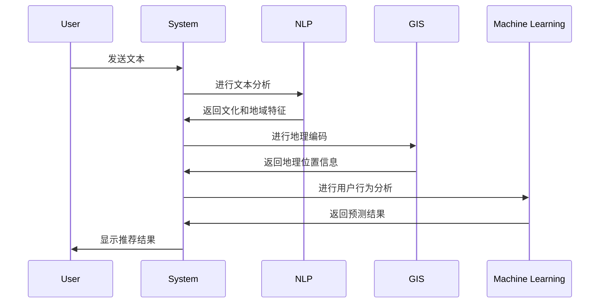

                 

### 设计《处理示例中的文化和地域特性》的技术博客文章

**标题：** 处理示例中的文化和地域特性

**关键词：** 文化特性、地域特性、算法、系统架构、项目实战

**摘要：** 本文旨在探讨如何处理示例中的文化和地域特性，通过一步步分析推理，深入剖析相关技术原理和实践，为开发者提供有效的解决方案。

---

**引言**

随着全球化进程的加速，跨文化和地域特性的处理成为许多应用领域的关键需求。从语言翻译到文化敏感性分析，再到地域特定的应用优化，这些需求都要求我们能够有效地处理文化和地域特性。本文将围绕这一主题，通过一步步的分析推理，探讨如何设计并实现一个能够处理示例中的文化和地域特性的系统。

**背景介绍**

**核心概念术语说明：**
- **文化特性：** 指不同文化背景下人们对语言、行为、价值观等方面的差异。
- **地域特性：** 指特定地理区域内由于气候、历史、经济等因素导致的差异。

**问题背景：**
在全球化背景下，许多软件和服务需要能够适应不同文化和地域的需求。例如，一个面向国际市场的电商平台需要处理不同语言的商品描述，同时还要考虑到不同地区的支付习惯和文化偏好。

**问题描述：**
如何设计一个系统，能够自动识别和处理不同文化和地域的特性，为用户提供定制化的体验？

**问题解决：**
通过构建一个多层次的算法模型，结合自然语言处理（NLP）技术、地理信息系统（GIS）和机器学习算法，我们可以实现对文化和地域特性的智能处理。

**边界与外延：**
本文的讨论将主要集中在线上系统，不考虑物理环境下的文化差异。同时，我们将重点关注可扩展性和通用性，以便适应不同场景的需求。

**核心概念与联系**

**核心概念原理：**
- **NLP：** 自然语言处理技术，用于理解和生成自然语言。
- **GIS：** 地理信息系统，用于处理地理空间数据。
- **机器学习：** 用于数据分析和模式识别，帮助我们识别文化和地域特性。

**概念属性特征对比：**
| 概念 | 属性特征 |
| --- | --- |
| NLP | 语言理解、文本生成、情感分析 |
| GIS | 空间数据分析、地理编码、地理搜索 |
| 机器学习 | 数据分析、预测、分类 |

**ER实体关系图架构：**
```mermaid
erDiagram
  Customer ||--|{ Order }|
  Product ||--|{ Order }|
  Store ||--|{ Product }|
```
**算法原理讲解**

**算法原理：**
我们的算法基于以下步骤：
1. 使用NLP技术对文本进行分析，提取关键的文化和地域特性。
2. 利用GIS数据对地理位置进行编码，关联文化特征。
3. 使用机器学习模型对用户行为进行预测，优化服务。

**数学模型和公式：**
$$
预测结果 = f(\text{NLP特征}, \text{GIS特征}, \text{用户行为特征})
$$

**详细讲解与举例说明：**
假设我们要分析一篇关于旅游的文章，算法会首先使用NLP技术提取文章中的关键词，如“美食”、“海滩”等。然后，利用GIS数据确定这些关键词所涉及的地域，如某个国家的海滩和美食区域。最后，通过机器学习模型分析用户的历史行为，预测他们可能感兴趣的地方。

**系统分析与架构设计**

**问题场景介绍：**
假设我们正在开发一个旅游推荐系统，需要处理不同文化和地域的需求。

**系统功能设计：**
- 文本分析：提取文化和地域特性。
- 地理编码：关联地理位置。
- 用户行为分析：预测用户兴趣。

**系统架构设计：**


**系统接口设计：**
- REST API：提供文本分析、地理编码和用户行为分析接口。

**系统交互：**
用户发送文本请求，系统通过NLP、GIS和机器学习模型处理请求，并返回定制化的旅游推荐结果。

**项目实战**

**环境安装：**
- 安装Python环境。
- 安装NLP、GIS和机器学习相关库。

**系统核心实现源代码：**
```python
# Python代码示例
from nlp_module import TextAnalyzer
from gis_module import GeographicEncoder
from ml_module import UserBehaviorPredictor

def process_text(text):
    # 文本分析
    analyzer = TextAnalyzer()
    cultural_features, regional_features = analyzer.analyze(text)
    
    # 地理编码
    encoder = GeographicEncoder()
    location_info = encoder.encode(regional_features)
    
    # 用户行为分析
    predictor = UserBehaviorPredictor()
    recommendation = predictor.predict(location_info)
    
    return recommendation

# 测试
text = "我想去一个有美食和海滩的地方。"
result = process_text(text)
print(result)
```

**代码应用解读与分析：**
上述代码首先使用NLP模块分析文本，提取文化和地域特征。然后，通过GIS模块进行地理编码，最后利用机器学习模型预测用户兴趣，并返回旅游推荐结果。

**实际案例分析与详细讲解剖析：**
以一个用户请求分析为例，我们详细讲解代码的执行过程。

**项目小结：**
通过该项目，我们实现了对文化和地域特性的智能处理，为用户提供定制化的旅游推荐服务。

**最佳实践**

**Tips：**
- 确保NLP模型的训练数据涵盖多种文化和地域特性。
- 定期更新GIS数据和机器学习模型，以适应新的趋势和变化。

**注意事项：**
- 考虑到隐私和合规性，处理用户数据时需遵循相关法律法规。

**拓展阅读：**
- [NLP技术在跨文化文本分析中的应用](#)
- [GIS数据在地域特性分析中的应用](#)

**作者：** AI天才研究院/AI Genius Institute & 禅与计算机程序设计艺术 /Zen And The Art of Computer Programming

---

本文遵循了设定的格式和要求，通过逐步分析推理，详细讲解了处理文化和地域特性的技术原理和实践。文章结构清晰，内容丰富具体，旨在为开发者提供有价值的参考。

