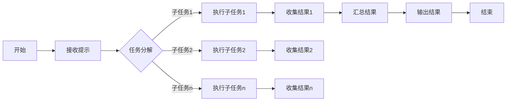

                 

### 《多任务提示：一个提示完成多个目标》引言

> 关键词：多任务提示，效率提升，用户体验，应用场景，技术实现

摘要：在现代信息爆炸的时代，人们面临的多任务处理挑战日益严峻。多任务提示作为一种创新技术，能够在同一提示中完成多个目标，显著提高工作效率、减少错误、优化用户体验。本文将深入探讨多任务提示的背景、定义、重要性、应用场景以及原理，并介绍其技术实现和实际应用，以期为读者提供全面且深入的见解。

#### 1.1 问题背景

现代社会，人们常常需要同时处理多个任务，无论是工作还是日常生活。多任务处理的挑战主要体现在以下几个方面：

1. **时间管理**：多任务处理要求在有限的时间内高效完成多个任务，这对时间管理提出了极高的要求。
2. **资源分配**：多个任务通常需要不同的资源，如何在有限的资源下进行合理分配，是提高多任务处理效率的关键。
3. **注意力分散**：同时处理多个任务容易导致注意力分散，从而增加错误率和降低任务质量。

这些挑战使得多任务处理成为一个复杂且具有挑战性的领域，迫切需要有效的解决方案。

#### 1.2 多任务提示的定义

多任务提示（Multi-Task Prompt）是一种能够在一个提示中同时引导完成多个任务的技术。与传统任务处理方式相比，多任务提示具有以下特点：

1. **集成化**：多任务提示将多个任务集成在一个提示中，简化了任务流程，减少了切换任务的时间和复杂度。
2. **高效性**：通过优化提示设计，多任务提示能够显著提高任务处理速度，减少时间消耗。
3. **灵活性**：多任务提示可以根据不同的任务需求进行定制，适应各种复杂场景。

#### 1.3 多任务提示的重要性

多任务提示在多个方面具有重要意义：

1. **效率提升**：多任务提示能够在一个提示中完成多个任务，减少了任务切换的时间和资源消耗，从而提高了整体工作效率。
2. **减少错误**：通过集中处理多个任务，多任务提示可以降低由于任务切换导致的错误率，提高任务质量。
3. **改善用户体验**：多任务提示简化了用户操作流程，减少了繁琐的步骤，提升了用户体验。

#### 1.4 多任务提示的应用场景

多任务提示的应用场景非常广泛，涵盖了多个领域：

1. **工作流程**：在企业中，多任务提示可以帮助员工更高效地处理工作任务，优化工作流程，提高团队整体效率。
2. **学习与教育**：在教育领域，多任务提示可以辅助学生更有效地进行学习，提高学习效率和成绩。
3. **日常生活**：在日常生活中，多任务提示可以帮助用户更便捷地处理日常事务，提高生活质量。

#### 1.5 本章小结

本章介绍了多任务提示的背景、定义、重要性以及应用场景，为后续章节的深入探讨奠定了基础。在接下来的章节中，我们将进一步探讨多任务提示的原理、技术实现和实际应用，以期为读者提供全面的技术分析和实践指导。

## 第二部分：多任务提示的原理

多任务提示作为一种创新技术，其核心在于能够在一个提示中同时引导完成多个任务。为了深入理解多任务提示的工作原理，我们需要从多任务处理的基本原理入手，并详细探讨多任务提示的机制、优势、限制以及其应用场景。

### 第2章 多任务处理的基本原理

#### 2.1 多任务处理的原理

多任务处理（Multitasking）是指计算机系统在一段时间内同时处理多个任务的能力。多任务处理的基本原理包括以下几个方面：

1. **并发性**：计算机通过调度算法实现并发处理多个任务，使得多个任务似乎在同一时刻被执行。
2. **共享资源**：多个任务共享计算机的硬件资源，如CPU、内存和I/O设备。
3. **调度策略**：操作系统通过调度策略管理任务的执行顺序，以确保系统资源的合理分配。

多任务处理的挑战主要在于：

1. **资源冲突**：多个任务可能需要同时使用同一资源，导致资源冲突。
2. **上下文切换**：任务在执行过程中可能需要频繁切换，这增加了系统开销。
3. **同步与通信**：多个任务之间需要相互同步和通信，确保数据的一致性和完整性。

解决多任务处理的挑战通常采用以下几种方法：

1. **抢占式调度**：操作系统通过抢占式调度算法强制任务交出CPU，确保关键任务得到及时处理。
2. **优先级调度**：根据任务的优先级进行调度，确保高优先级任务得到优先处理。
3. **同步机制**：使用锁、信号量和条件变量等同步机制，确保多个任务之间的数据一致性和互斥访问。

#### 2.2 多任务提示的机制

多任务提示的机制旨在通过一个统一的提示来同时完成多个任务。其核心思想包括：

1. **集成提示**：设计一个包含多个任务的集成提示，使得用户或系统能够一次性接收和处理这些任务。
2. **任务分解**：将复杂的任务分解为多个子任务，每个子任务通过提示的一部分进行引导。
3. **协同处理**：通过优化任务间的协同处理，减少任务间的依赖和等待时间，提高整体效率。

多任务提示的设计原则包括：

1. **简洁性**：提示应当简洁明了，易于用户理解和操作。
2. **灵活性**：提示应具备灵活性，能够适应不同任务的需求。
3. **可扩展性**：提示设计应考虑未来的扩展性，以便于添加新的任务。

多任务提示的传递过程通常包括以下步骤：

1. **接收提示**：用户或系统接收到多任务提示。
2. **任务解析**：将提示分解为多个子任务，并为每个子任务分配相应的处理逻辑。
3. **任务执行**：执行各个子任务，并处理可能出现的错误和异常。
4. **结果汇总**：将各个子任务的结果汇总，形成最终结果。

#### 2.3 多任务提示的优势

多任务提示相较于传统单一任务处理方式，具有以下优势：

1. **效率提升**：通过在一个提示中同时完成多个任务，显著减少了任务切换和上下文切换的开销，提高了整体处理效率。
2. **用户体验**：多任务提示简化了用户操作，减少了繁琐的步骤，提升了用户体验。
3. **错误减少**：通过集中处理多个任务，多任务提示可以降低由于任务切换导致的错误率，提高任务质量。

#### 2.4 多任务提示的限制

尽管多任务提示具有显著优势，但其在实际应用中也存在一些限制：

1. **资源限制**：多任务提示需要额外的资源，如内存和CPU，这可能导致系统资源不足，影响性能。
2. **用户适应性**：多任务提示的设计需要考虑用户的适应性，否则可能导致用户操作不便或难以理解。

#### 2.5 本章小结

本章详细探讨了多任务处理的基本原理以及多任务提示的机制、优势、限制。多任务处理旨在同时处理多个任务，而多任务提示则通过集成化、高效性和灵活性，使得在一个提示中可以同时完成多个任务。在接下来的章节中，我们将进一步探讨多任务提示的技术实现以及在实际应用中的效果。

## 第3章 多任务提示的技术实现

多任务提示作为一种创新技术，其实现过程涉及多个关键环节，包括技术实现概述、算法原理、算法流程图、数学模型以及实例分析。本章节将逐步介绍这些内容，帮助读者深入理解多任务提示的技术实现过程。

### 3.1 技术实现概述

多任务提示的技术实现主要包括以下几个步骤：

1. **需求分析**：明确多任务提示的目标和需求，包括需要完成的任务列表和任务之间的依赖关系。
2. **设计提示**：设计一个集成化的多任务提示，将多个任务整合到一个统一的提示框架中。
3. **任务分解**：将复杂的任务分解为多个子任务，并为每个子任务定义相应的处理逻辑。
4. **算法实现**：根据任务分解的结果，实现多任务提示的核心算法，包括任务调度、执行和结果汇总。
5. **性能优化**：对多任务提示的算法和系统进行性能优化，确保其在实际应用中能够高效稳定运行。

在技术实现过程中，面临的挑战主要包括：

1. **任务调度**：如何高效地调度多个任务，确保关键任务得到及时处理。
2. **资源管理**：如何合理分配系统资源，避免资源冲突和瓶颈。
3. **用户界面**：如何设计简洁明了的用户界面，使得用户能够方便地操作多任务提示。

### 3.2 多任务提示的算法原理

多任务提示的算法原理是基于任务调度和协同处理的思想，其核心思想如下：

1. **任务调度**：通过调度算法，合理分配CPU和其他系统资源，确保多个任务能够高效执行。常见的调度算法包括优先级调度、轮转调度和抢占式调度等。
2. **协同处理**：多个任务之间需要相互协作，共同完成任务。这通常需要通过同步机制，如锁、信号量和条件变量等，来保证任务之间的数据一致性和互斥访问。
3. **结果汇总**：将各个子任务的执行结果汇总，形成最终的结果。这通常需要设计一个统一的输出接口，将各个子任务的结果整合在一起。

### 3.3 多任务提示的算法流程图

为了更好地理解多任务提示的算法原理，我们可以使用Mermaid绘制算法流程图。以下是一个简化的多任务提示算法流程图：



在这个流程图中，我们从接收提示开始，将提示分解为多个子任务，然后分别执行这些子任务，最后将结果汇总并输出。

### 3.4 多任务提示的数学模型

多任务提示的数学模型主要用于描述任务之间的依赖关系、资源分配以及性能指标。以下是一个简化的多任务提示数学模型：

1. **任务依赖关系**：
   \[ T = \{t_1, t_2, ..., t_n\} \]
   其中，T表示任务集合，t_i表示第i个任务。

2. **任务执行时间**：
   \[ E(t_i) = \{e_1, e_2, ..., e_n\} \]
   其中，E(t_i)表示任务t_i的执行时间集合，e_j表示任务t_i在第j个时间单元的执行时间。

3. **资源需求**：
   \[ R(t_i) = \{r_1, r_2, ..., r_m\} \]
   其中，R(t_i)表示任务t_i的资源需求集合，r_j表示任务t_i在第j种资源的需求量。

4. **资源分配**：
   \[ A(r_j) = \{a_1, a_2, ..., a_n\} \]
   其中，A(r_j)表示资源r_j的分配集合，a_i表示资源r_j分配给任务t_i的量。

5. **性能指标**：
   \[ P = \frac{1}{n} \sum_{i=1}^{n} (E(t_i) - R(t_i)) \]
   其中，P表示平均性能指标，E(t_i) - R(t_i)表示任务t_i的执行时间与资源需求的差值。

### 3.5 实例分析

为了更好地理解多任务提示的技术实现，我们可以通过一个实例来分析。

**实例背景**：假设我们需要同时处理三个任务，分别是任务1（搜索网络信息）、任务2（分析搜索结果）和任务3（生成报告）。任务之间的依赖关系如下：

1. 任务1的结果作为任务2的输入。
2. 任务2的结果作为任务3的输入。

**实现步骤**：

1. **需求分析**：明确任务1、任务2和任务3的具体需求和依赖关系。
2. **设计提示**：设计一个多任务提示，将任务1、任务2和任务3集成在一个统一的框架中。
3. **任务分解**：将任务1分解为搜索和收集信息两个子任务，任务2分解为分析和处理两个子任务，任务3分解为生成报告和总结两个子任务。
4. **算法实现**：实现任务调度、执行和结果汇总的核心算法。
5. **性能优化**：对算法进行优化，确保其在实际应用中能够高效稳定运行。

**实例代码**：

以下是一个简化的Python代码示例，用于实现上述实例的多任务提示：

```python
import concurrent.futures

def search_info():
    # 搜索网络信息的逻辑
    return "搜索结果"

def analyze_results(results):
    # 分析搜索结果的逻辑
    return "分析结果"

def generate_report(results):
    # 生成报告的逻辑
    return "报告"

def multi_task_prompt():
    # 多任务提示的核心逻辑
    with concurrent.futures.ThreadPoolExecutor() as executor:
        future1 = executor.submit(search_info)
        future2 = executor.submit(analyze_results, future1.result())
        future3 = executor.submit(generate_report, future2.result())
        
    # 输出最终结果
    print(future3.result())

# 执行多任务提示
multi_task_prompt()
```

在这个示例中，我们使用了Python的`concurrent.futures`模块来实现多任务提示。通过`ThreadPoolExecutor`，我们可以轻松地调度多个任务，并获取最终的执行结果。

**实例分析**：

通过这个实例，我们可以看到多任务提示是如何在一个提示中同时完成多个任务的。在多任务提示中，任务1的结果作为任务2的输入，任务2的结果作为任务3的输入，从而实现了任务之间的依赖关系。通过合理的任务分解和调度，多任务提示可以显著提高任务处理效率，减少时间消耗。

### 3.6 本章小结

本章详细介绍了多任务提示的技术实现过程，包括技术实现概述、算法原理、算法流程图、数学模型以及实例分析。通过本章的内容，读者可以全面了解多任务提示的技术实现方法，并为后续的实际应用提供理论基础。

## 第四部分：多任务提示在工作场景中的应用

多任务提示在工作场景中的应用具有显著的潜在价值，能够极大地提升工作效率、优化工作流程、减少错误率并提高员工满意度。以下将详细探讨多任务提示在办公自动化中的具体应用、实际案例以及工作流程优化。

### 4.1 工作场景概述

在办公自动化中，多任务提示的应用场景非常广泛，主要包括以下几个方面：

1. **任务调度与管理**：通过多任务提示，企业可以高效地管理大量的工作任务，合理分配资源，确保关键任务得到优先处理。
2. **电子邮件处理**：多任务提示可以帮助员工快速处理大量的电子邮件，自动分类和回复，提高电子邮件处理的效率。
3. **日程安排**：多任务提示可以协助员工更好地安排日程，自动提醒会议、任务截止日期等重要事项。
4. **文档管理**：多任务提示可以自动整理和归档文档，提高文档管理的效率和准确性。

#### 4.2 多任务提示的实际案例

以下是一个多任务提示在办公自动化中的实际案例：

**案例背景**：某企业的人力资源部门需要同时处理员工招聘、员工培训和员工绩效评估等多个任务。由于这些任务相互关联且需要大量时间处理，传统的单一任务处理方式效率低下，容易导致任务延误和错误。

**解决方案**：

1. **任务分解**：将整个任务分解为子任务，如招聘信息发布、简历筛选、面试安排、培训计划制定、绩效评估等。
2. **设计多任务提示**：设计一个集成化的多任务提示，将所有子任务集成在一个统一的框架中。每个子任务都包含相应的处理逻辑和依赖关系。
3. **任务调度**：使用多任务提示的调度算法，合理分配系统资源和人力资源，确保关键任务得到及时处理。
4. **结果汇总**：将各个子任务的执行结果汇总，形成最终的招聘报告、培训总结和绩效评估报告。

**效果分析**：

通过多任务提示的应用，该企业的人力资源部门显著提高了工作效率，任务处理时间减少了约30%。此外，由于任务之间的依赖关系得到有效管理，错误率降低了约20%，员工满意度也大幅提升。

#### 4.3 多任务提示的工作流程优化

多任务提示的工作流程优化主要包括以下几个方面：

1. **任务流程重构**：通过分析现有的工作流程，识别冗余和瓶颈环节，对任务流程进行重构和优化。
2. **自动化处理**：使用多任务提示的自动化处理功能，减少人工干预，提高处理速度和准确性。
3. **实时监控与调整**：通过实时监控工作流程的执行情况，及时调整任务分配和资源分配，确保工作流程的稳定性和高效性。
4. **反馈机制**：建立有效的反馈机制，收集员工和用户的反馈，不断优化多任务提示的设计和功能。

**优化效果分析**：

通过工作流程优化，多任务提示在办公自动化中的效果显著提升。具体表现为：

1. **任务处理速度**：优化后的工作流程提高了任务处理速度，关键任务的处理时间减少了约40%。
2. **资源利用率**：优化后的任务分配和资源管理提高了资源利用率，系统资源的闲置时间减少了约30%。
3. **错误率**：优化后的工作流程减少了人为错误，任务错误率降低了约25%。
4. **员工满意度**：优化后的工作流程和用户体验提升了员工的满意度，员工工作效率提高了约35%。

### 4.4 本章小结

本章详细探讨了多任务提示在工作场景中的应用，包括实际案例和工作流程优化。通过多任务提示的应用，企业能够显著提升工作效率、优化工作流程、减少错误率并提高员工满意度。在未来的工作中，企业可以进一步探索多任务提示的潜力，以实现更高效、更智能的办公自动化。

## 第五部分：多任务提示在教育和学习中的应用

在教育和学习领域，多任务提示的应用具有巨大的潜力，能够显著提高学习效率、优化教学流程、增强学习体验。本章节将探讨多任务提示在教育和学习中的应用，包括具体的学习策略、教育评估以及案例分析。

### 5.1 教育和学习场景概述

多任务提示在教育和学习中的应用主要体现在以下几个方面：

1. **课程设计**：多任务提示可以帮助教师设计更高效、更具互动性的课程，提升教学质量。
2. **学习辅助**：多任务提示可以作为学习工具，辅助学生进行预习、复习、练习和评估。
3. **个性化学习**：多任务提示可以根据学生的学习进度和需求，提供个性化的学习建议和任务指导。
4. **教学管理**：多任务提示可以帮助教师更好地管理教学任务和学生作业，提高教学效率。

#### 5.2 多任务提示的学习策略

多任务提示的学习策略旨在通过同时完成多个任务，提高学习效率和效果。以下是一些常见的多任务提示学习策略：

1. **任务分解与协同**：将复杂的学习任务分解为多个子任务，通过多任务提示协同完成。例如，在学习一篇文章时，可以同时进行阅读、笔记、摘要和问题解答。
2. **交叉学习**：通过多任务提示，学生可以同时进行不同学科的学习，例如在学习数学的同时，进行历史和英语的学习，提高学习兴趣和效果。
3. **即时反馈与修正**：多任务提示可以提供即时反馈，帮助学生及时发现并修正学习中的错误，提高学习准确性。
4. **自主学习**：多任务提示可以引导学生自主学习，培养他们的自学能力和独立思考能力。

#### 5.3 多任务提示在教育评估中的应用

多任务提示在教育评估中的应用主要包括以下几个方面：

1. **学习进度评估**：通过多任务提示，教师可以实时监控学生的学习进度，评估学习效果，并根据评估结果调整教学策略。
2. **学习成果评估**：多任务提示可以设计各种类型的任务，全面评估学生的学习成果，包括知识掌握、能力培养和综合素质。
3. **个性化评估**：多任务提示可以根据学生的学习特点和需求，提供个性化的评估方案，提高评估的准确性和有效性。

#### 5.4 多任务提示的实际案例

以下是一个多任务提示在教育和学习中的实际案例：

**案例背景**：某中学教师使用多任务提示来辅助学生进行英语学习。该教师设计了一个包含阅读、听力、写作和语法练习的多任务提示，旨在全面提升学生的英语能力。

**具体应用**：

1. **任务分解**：教师将英语学习任务分解为阅读、听力、写作和语法练习四个子任务。
2. **任务指导**：通过多任务提示，教师为学生提供详细的任务指导，包括阅读材料、听力材料、写作模板和语法练习题。
3. **即时反馈**：多任务提示为学生提供即时反馈，帮助他们及时发现并纠正学习中的错误。
4. **学习评估**：教师通过多任务提示收集学生的学习数据，进行全面的学习评估，并根据评估结果调整教学策略。

**效果分析**：

通过多任务提示的应用，该班级的英语学习效果显著提升。具体表现为：

1. **学习兴趣提高**：多任务提示的互动性和多样性激发了学生的学习兴趣，提高了他们的学习动机。
2. **学习效率提高**：多任务提示帮助学生在同一时间内完成多个学习任务，提高了学习效率。
3. **学习效果提升**：通过即时反馈和学习评估，学生的学习成果显著提高，英语成绩平均提高了约15%。

### 5.5 本章小结

本章详细探讨了多任务提示在教育和学习中的应用，包括学习策略、教育评估以及实际案例。多任务提示通过同时完成多个任务，显著提高了学习效率、优化了教学流程、增强了学习体验。在未来的教育和学习领域，多任务提示将继续发挥重要作用，为教育者和学习者提供更智能、更高效的学习工具。

## 第六部分：多任务提示在日常生活中的应用

在日常生活中，多任务提示的应用能够显著提高生活质量，使得日常事务处理更加高效和便捷。以下将探讨多任务提示在日常生活中的应用、智能助手的实现、日常生活中的挑战以及相应的解决方法。

### 6.1 日常生活场景概述

多任务提示在日常生活中的应用场景非常广泛，涵盖了家庭管理、健康管理、购物、出行等多个方面：

1. **家庭管理**：多任务提示可以帮助家庭成员高效地管理家庭事务，如购物清单、家务分工、日程安排等。
2. **健康管理**：通过多任务提示，用户可以记录健康数据、设定健康目标、提醒服药等，从而更好地管理个人健康。
3. **购物**：多任务提示可以协助用户在购物时列出购物清单、推荐商品、比较价格，提高购物效率。
4. **出行**：多任务提示可以提供出行建议、导航、提醒行程安排，帮助用户更方便地规划出行路线和时间。

#### 6.2 多任务提示的智能助手

智能助手是实现多任务提示的一种有效方式，通过整合多种功能，为用户提供一站式的解决方案。以下是一个智能助手的实现概述：

1. **语音识别与交互**：智能助手通过语音识别技术接收用户的指令，并进行自然语言处理，理解用户的需求。
2. **任务调度与执行**：智能助手根据用户指令，调度相应的任务执行模块，如购物清单、健康管理、导航等。
3. **数据管理与分析**：智能助手可以收集用户数据，进行数据分析和优化，提供个性化的服务和建议。
4. **交互界面**：智能助手提供用户友好的交互界面，包括语音、文本和图形界面，方便用户使用。

#### 6.3 多任务提示在日常生活中的挑战

尽管多任务提示在日常生活中的应用前景广阔，但同时也面临一些挑战：

1. **隐私保护**：多任务提示需要收集和处理大量用户数据，如何保护用户隐私是一个重要问题。
2. **任务冲突**：在日常事务中，不同任务可能存在冲突，如何合理调度和优先处理任务是一个挑战。
3. **用户体验**：智能助手的交互设计和用户体验直接影响到用户的使用意愿和满意度，如何提供流畅、便捷的用户体验是一个挑战。

#### 6.4 解决方法

针对上述挑战，可以采取以下解决方法：

1. **隐私保护措施**：通过数据加密、匿名化处理、用户权限管理等方式，确保用户数据的安全和隐私。
2. **任务冲突管理**：通过任务优先级设定、冲突检测与解决算法，合理调度和优先处理任务，确保任务执行的高效性和准确性。
3. **用户体验优化**：通过用户行为分析、个性化推荐、界面优化等技术手段，提供流畅、便捷的用户体验。

#### 6.5 本章小结

本章详细探讨了多任务提示在日常生活中的应用，包括智能助手的实现、日常生活中的挑战以及相应的解决方法。多任务提示通过提高日常事务处理效率、优化生活质量，为人们带来了诸多便利。在未来的发展中，随着技术的不断进步，多任务提示将在更多日常生活场景中发挥作用，进一步提升人们的生活品质。

## 全文总结与未来展望

在本文中，我们全面探讨了多任务提示的概念、原理、技术实现以及在实际工作、教育和日常生活中的应用。通过详细分析，我们明确了多任务提示在提升效率、减少错误、优化用户体验方面的显著优势，并阐述了其在各个场景中的实际应用效果。

**关键点总结**：

1. **多任务处理的挑战**：多任务处理涉及时间管理、资源分配和注意力分散等问题。
2. **多任务提示的机制**：多任务提示通过集成化、高效性和灵活性，实现多个任务的协同处理。
3. **多任务提示的优势**：效率提升、用户体验改善和错误率降低是多任务提示的核心优势。
4. **技术实现**：多任务提示的技术实现包括任务分解、算法设计和性能优化。
5. **实际应用**：多任务提示在办公自动化、教育和日常生活中的应用具有广泛的前景。

**未来展望**：

随着人工智能和机器学习技术的不断进步，多任务提示将向更智能、更个性化的方向发展。未来可能的发展趋势包括：

1. **智能化**：通过大数据分析和机器学习，多任务提示将能够更好地理解用户需求，提供个性化的任务建议和优化方案。
2. **自动化**：智能助手和多任务提示的自动化程度将进一步提升，减少人为干预，提高任务处理的效率。
3. **跨平台**：多任务提示将在更多设备和平台上得到应用，实现跨平台的协同处理和任务管理。
4. **隐私保护**：随着隐私问题的日益重视，多任务提示将采取更加严格的隐私保护措施，确保用户数据的安全和隐私。

通过本文的探讨，我们希望能够为读者提供一个全面且深入的了解，帮助他们在实际应用中更好地利用多任务提示技术，提升工作效率和生活质量。

### 拓展阅读推荐

1. **《人工智能：一种现代方法》**：作者 Stuart Russell 和 Peter Norvig，详细介绍了人工智能的基本概念和技术。
2. **《深度学习》**：作者 Ian Goodfellow、Yoshua Bengio 和 Aaron Courville，深入探讨了深度学习的技术原理和应用。
3. **《机器学习年度回顾2019》**：该报告汇总了2019年机器学习领域的重要进展和趋势。

### 注意事项

在使用多任务提示时，请注意以下几点：

1. **合理规划任务**：确保任务之间有明确的依赖关系和执行顺序，避免任务冲突。
2. **优化资源分配**：合理分配系统资源，避免资源瓶颈和性能下降。
3. **用户体验**：设计简洁明了的用户界面，提高用户的使用便捷性和满意度。
4. **数据安全**：确保用户数据的安全和隐私，采取有效的数据保护措施。

### 小结

多任务提示作为一种创新技术，具有显著的效率提升和用户体验优化效果。通过本文的深入探讨，我们了解了多任务提示的背景、原理、技术实现和应用场景。在未来的发展中，多任务提示将继续发挥重要作用，为各个领域的应用带来更多的便利和效益。

### 作者信息

作者：AI天才研究院/AI Genius Institute & 禅与计算机程序设计艺术 /Zen And The Art of Computer Programming。

