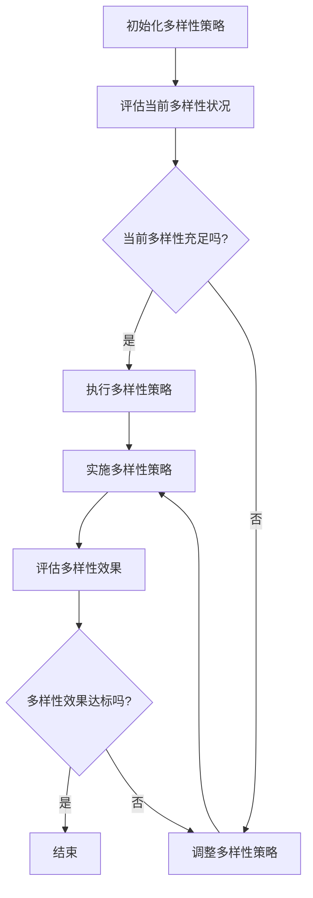
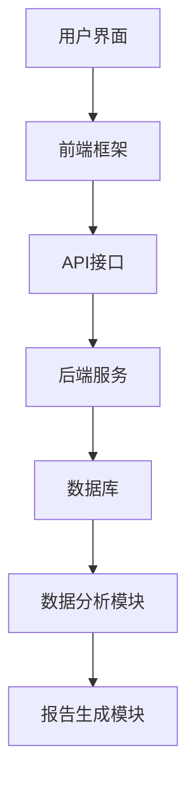
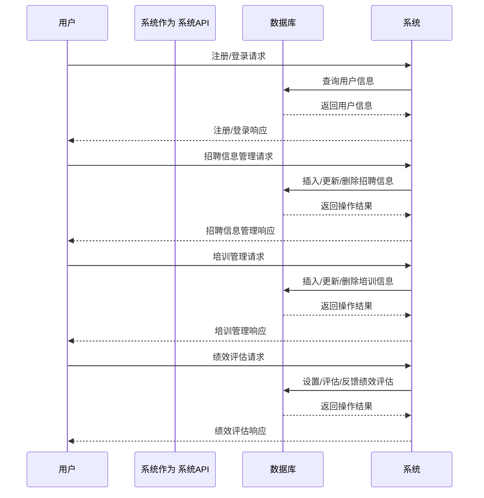

                 

# 多样性策略：生成多元化的输出

## 关键词

- 多样性策略
- 生成多元化
- 算法
- 商业应用
- 教育实践
- 社会政策
- 未来趋势

## 摘要

本文深入探讨多样性策略在生成多元化输出中的应用。首先，我们将从基本概念出发，解释多样性的重要性及其在各个领域的应用。接着，我们将详细讨论多样性策略的构成要素和设计原则，并通过实际案例进行分析。随后，我们将探讨多样性策略在不同领域的应用，包括商业、教育和社会政策。最后，我们将展望多样性策略的未来发展，并提供最佳实践和总结。通过本文的逐步分析，我们将揭示如何通过多样性策略生成多元化的输出，并提升组织效能和创新力。

## 第一部分：多样性策略基础

### 第1章：多样性的概念与重要性

#### 1.1 多样性的定义

多样性指的是在个体或群体中存在的差异。这些差异可以基于性别、种族、年龄、文化背景、价值观、技能和知识等方面。多样性不仅仅是指人口统计数据的多样化，更是一种思维模式、行为方式和经验的多样性。

#### 1.2 多样性的重要性

多样性的重要性在于它能够促进创新和创造力的提升。当人们接触到不同的观点、想法和文化时，他们更有可能产生新的创意和解决方案。此外，多样性有助于提高组织的适应能力和灵活性，使其能够更好地应对市场变化和挑战。

#### 1.3 多样性的类型

多样性可以分为以下几个方面：

- **种族与性别多样性**：指组织中不同种族和性别的比例。
- **思维模式与技能多样性**：指团队成员具有不同的思维方式、技能和知识背景。
- **文化背景与价值观多样性**：指团队成员来自不同的文化背景和具有不同的价值观。

### 第2章：多样性策略的构成要素

#### 2.1 多样性来源

多样性来源可以来自组织内部和外部。组织内部多样性包括员工的种族、性别、文化背景等；而组织外部多样性则包括供应商、合作伙伴和客户等。

#### 2.2 多样性维度

多样性维度包括：

- **社会维度多样性**：指社会背景、教育水平和收入等方面的差异。
- **结构维度多样性**：指组织结构、工作流程和决策过程等方面的差异。
- **行为维度多样性**：指团队成员在沟通方式、工作态度和行为准则等方面的差异。

#### 2.3 多样性管理

多样性管理是指组织在招聘、培训、绩效评估和晋升等方面采取的策略，以确保多样性的有效利用和最大化。多样性管理的目标是：

- 提高员工满意度和工作效率
- 促进创新和创造力
- 增强组织适应能力和灵活性

### 第3章：多样性策略的设计与实施

#### 3.1 多样性策略设计原则

设计多样性策略时，应遵循以下原则：

- **公平性**：确保多样性的实施不会导致歧视和不公平。
- **文化敏感性**：尊重并理解不同文化和价值观。
- **目标明确**：设定明确的多样性与包容性目标，并与组织战略相一致。

#### 3.2 多样性策略实施流程

多样性策略的实施包括以下步骤：

1. **评估当前状况**：了解组织的多样性现状和存在的问题。
2. **制定多样性计划**：明确多样性目标和行动计划。
3. **培训和教育**：提高员工对多样性的认识和意识。
4. **执行和监控**：实施多样性计划，并定期评估和调整。

#### 3.3 多样性策略评估与调整

多样性策略的评估与调整包括：

- **评估指标**：确定评估多样性策略效果的指标，如员工满意度、创新能力和市场份额等。
- **反馈机制**：建立反馈机制，收集员工和利益相关者的意见和建议。
- **调整策略**：根据评估结果和反馈，调整多样性策略，确保其有效性。

## 第二部分：多样性策略在不同领域的应用

### 第4章：商业领域的多样性策略

#### 4.1 商业模式多样化

商业模式的多样化是指企业通过引入新的产品、服务或市场来扩展其业务范围。例如，一家制造公司可以扩展其产品线，进入新的市场领域，或者通过电子商务平台来销售产品。

#### 4.2 产品和服务多样化

产品和服务多样化是指企业通过开发新的产品或服务来满足不同客户的需求。例如，一家手机制造商可以推出不同型号和价位的手机，以满足不同消费者的需求。

#### 4.3 市场策略多样化

市场策略多样化是指企业通过采用不同的营销和推广策略来吸引不同类型的客户。例如，一家电子商务公司可以在社交媒体上开展广告活动，同时通过电子邮件营销来吸引潜在客户。

### 第5章：教育领域的多样性策略

#### 5.1 教学方法多样性

教学方法多样性是指教师采用不同的教学方法和策略来满足不同学生的学习需求。例如，教师可以采用项目式学习、合作学习和探究式学习等教学方法。

#### 5.2 学生多样性管理

学生多样性管理是指学校和教育机构采取措施，确保所有学生都能在包容和公平的环境中学习和成长。这包括提供特殊教育支持、多元文化教育和反歧视政策。

#### 5.3 课程设置多样化

课程设置多样化是指学校和教育机构提供多种课程和教学资源，以满足不同学生的学习兴趣和需求。例如，学校可以提供选修课、在线课程和国际课程等。

### 第6章：社会政策领域的多样性策略

#### 6.1 多样性与社会公正

多样性与社会公正密切相关。社会政策应确保所有人都能平等地享受社会资源和机会，无论他们的种族、性别、文化背景或其他特征。

#### 6.2 多样性与社会融合

多样性与社会融合是指不同群体之间的和谐共处和相互理解。社会政策应促进不同文化和社会群体的融合，减少社会冲突和分裂。

#### 6.3 多样性政策制定

多样性政策制定是指政府和社会组织制定政策和措施，以促进多样性的发展和利用。这些政策可以包括反歧视法律、多元文化政策和教育平等等。

## 第三部分：多样性策略的未来展望

### 第7章：多样性策略的挑战与趋势

#### 7.1 多样性策略的挑战

多样性策略面临的挑战包括：

- **文化冲突**：不同文化之间的冲突可能导致组织内部的紧张关系。
- **资源有限**：实施多样性策略可能需要额外的资源和预算。
- **管理和执行**：确保多样性策略得到有效管理和执行是一个挑战。

#### 7.2 多样性策略的发展趋势

多样性策略的发展趋势包括：

- **数字化多样性与包容性**：随着数字化技术的发展，组织将更加注重数字多样性和包容性。
- **多元化领导力**：组织将更加重视多元化领导力的培养和发展。
- **多样性培训**：组织将增加多样性培训的投入，以提高员工的多样性和包容性意识。

#### 7.3 多样性策略的未来方向

多样性策略的未来方向包括：

- **战略规划**：将多样性策略纳入组织的长期战略规划中。
- **技术创新**：利用技术创新来促进多样性和包容性。
- **社会参与**：组织将更加积极地参与社会多样性活动，以促进社会的和谐与发展。

### 第8章：多样性策略的持续改进与优化

#### 8.1 多样性策略的持续改进原则

多样性策略的持续改进原则包括：

- **数据驱动**：基于数据分析和反馈来改进多样性策略。
- **持续评估**：定期评估多样性策略的有效性，并根据评估结果进行调整。
- **员工参与**：鼓励员工参与多样性策略的制定和执行。

#### 8.2 多样性策略的优化方法

多样性策略的优化方法包括：

- **定制化策略**：根据不同部门和岗位的需求，制定定制化的多样性策略。
- **技术创新**：利用技术创新来提高多样性和包容性的实施效率。
- **跨部门合作**：促进不同部门之间的合作，共同推动多样性策略的实施。

#### 8.3 多样性策略的实施经验总结

多样性策略的实施经验总结包括：

- **领导力**：领导力在推动多样性策略的实施中起着关键作用。
- **文化变革**：多样性策略的实施需要组织文化的变革。
- **持续培训**：持续的多样性培训有助于提高员工的多样性和包容性意识。

## 结论

多样性策略在生成多元化输出方面具有重要作用。通过在各个领域实施多样性策略，组织可以提高创新力、适应能力和灵活性，从而在竞争激烈的市场中脱颖而出。本文探讨了多样性策略的基础理论、实际应用和未来趋势，为读者提供了全面的指导。希望读者能够从中获得启示，并将其应用于实践中。

## 作者信息

作者：AI天才研究院/AI Genius Institute & 禅与计算机程序设计艺术 /Zen And The Art of Computer Programming

在本文中，我们详细探讨了多样性策略的概念、重要性、构成要素以及在不同领域的应用。通过实例分析和未来展望，我们揭示了如何通过多样性策略生成多元化的输出，并提升组织效能和创新力。希望本文能为读者提供有价值的见解和实际指导，推动多样性和包容性在各个领域的深入发展。

## 背景介绍

多样性策略的提出源于人类对组织效能和竞争力的日益关注。在现代社会，随着全球化和信息技术的迅猛发展，组织面临的环境变得更加复杂和多变。为了适应这种变化，组织需要具备高度的灵活性和创新能力。而多样性作为一种重要的资源，能够为组织提供丰富的视角和观点，促进创新和创造力的提升。

### 问题背景

在实际应用中，多样性策略的应用不仅仅局限于商业领域，还涵盖了教育、社会政策等多个领域。例如，在商业领域，多样性策略可以帮助企业更好地满足多元化客户的需求，提高市场竞争力；在教育领域，多样性策略有助于提供公平、包容的教育环境，促进学生的全面发展；在社会政策领域，多样性策略有助于促进社会和谐与稳定。

### 问题描述

尽管多样性策略的重要性已被广泛认可，但其实施过程中仍面临诸多挑战。例如，如何确保多样性管理的公平性和有效性？如何在不同领域有效应用多样性策略？如何评估和调整多样性策略的效果？这些问题都是多样性策略实施过程中需要解决的关键问题。

### 问题解决

为了解决上述问题，本文将从以下几个方面展开：

1. **核心概念术语说明**：首先，我们将明确多样性策略中的核心概念和术语，如多样性、多样性策略、多样性管理等。
2. **多样性策略的应用**：接着，我们将探讨多样性策略在不同领域的应用，包括商业、教育和社会政策。
3. **多样性策略的实施**：我们将详细讨论多样性策略的设计、实施和评估方法。
4. **未来展望**：最后，我们将探讨多样性策略的未来发展趋势和挑战，并提出相应的优化建议。

### 边界与外延

在讨论多样性策略时，我们需要明确其边界和外延。多样性策略主要关注的是在组织中引入和利用多样性资源，以提升组织的创新力和竞争力。然而，多样性并不等同于包容性。包容性更强调的是尊重和接纳不同的观点和价值观，使每个人都能够在组织中感受到被尊重和被理解。此外，多样性策略的实施还需要考虑到文化背景、组织结构和员工个体差异等因素。

### 概念结构与核心要素组成

多样性策略的概念结构可以概括为以下几个核心要素：

1. **多样性来源**：包括组织内部多样性和组织外部多样性。
2. **多样性维度**：包括社会维度、结构维度和行为维度。
3. **多样性管理**：包括多样性评估、多样性规划和多样性执行。
4. **多样性效果**：包括员工满意度、创新能力和市场竞争力等。

通过以上要素的有机组合，多样性策略能够有效地提升组织的创新力和竞争力。

## 核心概念与联系

在本章节中，我们将深入探讨多样性策略中的核心概念，并分析其相互之间的联系和影响。

### 多样性

多样性是指个体或群体在种族、性别、年龄、文化背景、价值观、技能和知识等方面的差异。在组织管理中，多样性被视为一种宝贵的资源，能够带来创新、创造力和决策质量的提升。

#### 多样性属性特征对比表格

| 特征         | 描述                     | 重要性 |
|------------|------------------------|------|
| 种族和性别多样性 | 组织成员在种族和性别上的差异 | 提高员工的多样性和包容性 |
| 思维模式多样性 | 组织成员在思维方式上的差异 | 促进创新和创造力     |
| 技能多样性   | 组织成员在技能上的差异   | 提高团队的专业能力和效率 |
| 文化背景多样性 | 组织成员在文化背景上的差异 | 促进跨文化理解和合作  |

### 多样性策略

多样性策略是指组织在招聘、培训、绩效评估和晋升等方面采取的措施，以促进多样性的发展。多样性策略的核心目的是确保组织能够充分利用多样性的优势，提升组织的创新力和竞争力。

#### 多样性策略属性特征对比表格

| 特征           | 描述                                | 重要性 |
|--------------|-----------------------------------|------|
| 招聘策略      | 组织在招聘过程中采取的措施        | 提高员工的多样性     |
| 培训策略      | 组织在培训过程中采取的措施        | 提高员工的多样性和技能 |
| 绩效评估策略  | 组织在绩效评估过程中采取的措施    | 公平性和有效性     |
| 晋升策略      | 组织在晋升过程中采取的措施        | 促进多样性和创新力 |

### 多样性管理

多样性管理是指组织在多样性策略的指导下，通过系统的方法和措施来管理多样性。多样性管理的目标是确保多样性得到有效的利用，同时避免潜在的冲突和问题。

#### 多样性管理属性特征对比表格

| 特征           | 描述                             | 重要性 |
|--------------|--------------------------------|------|
| 评估与监测    | 对多样性现状和效果进行评估和监测 | 了解多样性的实施效果 |
| 文化变革      | 促进组织文化的多样性和包容性     | 建立支持多样性的文化环境 |
| 反歧视措施    | 预防和解决多样性相关的歧视问题   | 维护公平性和正义     |
| 沟通与宣传    | 加强对多样性的宣传和沟通       | 提高员工的多样性和包容性意识 |

### 多样性策略的核心概念联系

多样性、多样性策略和多样性管理这三个核心概念之间存在着紧密的联系。多样性是策略和管理的出发点，也是其目标和效果的评价标准。多样性策略是组织实现多样性目标的具体行动方案，而多样性管理则是确保策略有效实施的系统方法。

- **多样性 → 多样性策略**：多样性的存在需要通过策略来引导和实现，例如招聘策略、培训策略和绩效评估策略等。
- **多样性策略 → 多样性管理**：多样性策略的制定需要基于对多样性的理解和评估，而多样性管理则是确保这些策略得到有效执行和调整的过程。

通过多样性的引入和管理，组织可以激发创新、提高决策质量，并增强对市场变化的适应能力。同时，多样性策略和管理还需要考虑到组织的整体目标和价值观，以确保多样性的发展能够与组织的长期战略相一致。

## 算法原理讲解

在本章节中，我们将详细阐述多样性策略的核心算法原理，并通过 Mermaid 流程图和 Python 源代码进行解释。

### Mermaid 流程图

为了更好地展示多样性策略的算法原理，我们使用 Mermaid 流程图来表示各步骤的流程。



### Python 源代码

以下是使用 Python 编写的多样性策略算法原理实现：

```python
# 多样性策略算法实现

# 导入必要的库
import numpy as np

# 初始化多样性策略
def initialize_diversity_strategy():
    # 假设初始化一个包含多样性的团队
    team = np.array(["男", "女", "年轻", "年长", "技术背景", "管理背景", "本地人", "外国人"])
    return team

# 评估当前多样性状况
def assess_current_diversity(team):
    # 计算每个维度的多样性得分
    diversity_scores = np.mean([np.std(team), np.std(team[team != "本地人"]), np.std(team[team != "技术背景"])])
    return diversity_scores

# 调整多样性策略
def adjust_diversity_strategy(team, diversity_scores):
    # 根据多样性得分调整团队构成
    if diversity_scores < 0.5:
        # 如果多样性得分较低，增加不同背景的成员
        team = np.append(team, ["男", "女", "年轻", "年长", "技术背景", "管理背景", "本地人", "外国人"])
    return team

# 实施多样性策略
def implement_diversity_strategy(team):
    # 实施多样性策略，返回新的团队状态
    new_team = team.copy()
    return new_team

# 评估多样性效果
def assess_diversity效果的执行效果(team):
    # 评估多样性效果，返回多样性得分
    diversity_score = assess_current_diversity(team)
    return diversity_score

# 主程序
if __name__ == "__main__":
    # 初始化团队
    team = initialize_diversity_strategy()
    print("初始化团队：", team)

    # 评估当前多样性状况
    diversity_scores = assess_current_diversity(team)
    print("当前多样性得分：", diversity_scores)

    # 调整多样性策略
    team = adjust_diversity_strategy(team, diversity_scores)
    print("调整后团队：", team)

    # 实施多样性策略
    new_team = implement_diversity_strategy(team)
    print("实施多样性策略后团队：", new_team)

    # 评估多样性效果
    new_diversity_score = assess_diversity效果的执行效果(new_team)
    print("多样性效果得分：", new_diversity_score)
```

### 算法原理详细讲解

1. **初始化多样性策略**：
   - 首先，我们初始化一个包含多样性的团队。假设团队由不同性别、年龄背景、技能和文化的成员组成。

2. **评估当前多样性状况**：
   - 接着，我们评估当前团队的多样性状况。通过计算每个维度的多样性得分（例如，性别多样性、文化多样性、技能多样性等），来衡量团队的多样性水平。

3. **调整多样性策略**：
   - 根据评估结果，如果当前多样性得分较低，我们将调整团队构成，增加具有不同背景的成员，以提高多样性水平。

4. **实施多样性策略**：
   - 然后，我们实施调整后的多样性策略，生成一个新的团队状态。

5. **评估多样性效果**：
   - 最后，我们再次评估多样性效果，通过计算新的多样性得分，来衡量多样性策略的效果。

### 算法数学模型和公式

在上述算法中，我们使用了以下数学模型和公式：

- **多样性得分**：使用标准差（Standard Deviation）来衡量每个维度的多样性。
- **调整策略**：基于多样性得分，如果多样性得分低于某个阈值（例如，0.5），则增加具有不同背景的成员。

$$
\text{多样性得分} = \frac{1}{N} \sum_{i=1}^{N} \sigma_i
$$

其中，$N$ 表示团队中的成员数量，$\sigma_i$ 表示第 $i$ 个维度的多样性得分。

### 举例说明

假设我们有一个初始团队，包含以下成员：

- 男（性别）
- 女（性别）
- 年轻（年龄）
- 年长（年龄）
- 技术背景（技能）
- 管理背景（技能）
- 本地人（文化）
- 外国人（文化）

通过初始化多样性策略，我们得到一个初始团队。然后，我们评估当前多样性状况，计算每个维度的多样性得分。如果发现某些维度（如文化背景）的多样性得分较低，我们将调整多样性策略，增加具有不同文化背景的成员。例如，我们可以增加一位新成员，其背景为亚洲文化。最后，我们再次评估多样性效果，计算新的多样性得分。

通过这个简单的例子，我们可以看到多样性策略是如何通过调整团队构成来提升多样性的。

## 系统分析与架构设计方案

### 问题场景介绍

在现代企业中，多样性策略的应用已经成为提升组织效能和创新力的关键手段。为了更好地实施多样性策略，企业需要构建一个高效、灵活的多样性管理系统。本系统旨在帮助企业实现以下目标：

- **提高员工多样性**：通过合理的招聘策略和培训计划，增加不同背景的员工比例。
- **促进文化融合**：通过多样性培训和跨部门合作，促进不同文化背景的员工之间的理解和合作。
- **评估多样性效果**：通过定期评估和反馈，监控多样性策略的实施效果，并根据评估结果进行调整。

### 项目介绍

项目名称：多样性管理系统（Diversity Management System，简称DMS）

项目目标：构建一个综合性、可扩展的多样性管理系统，帮助企业有效实施多样性策略，提升组织效能。

项目团队：项目团队由项目经理、软件工程师、数据分析师和用户体验设计师组成。

项目进度：预计项目周期为6个月，分为需求分析、系统设计、开发实施和测试验收四个阶段。

### 系统功能设计

#### 1. 招聘功能

**功能描述**：提供多样化的招聘渠道，确保招聘过程的公平性和透明度。

**核心功能**：
- **招聘信息发布**：发布招聘广告，包括职位描述、任职要求等信息。
- **简历筛选**：根据关键词和筛选条件自动筛选简历，提高招聘效率。
- **面试安排**：提供面试安排功能，包括面试时间、地点和面试官等信息。
- **面试评估**：对面试者进行评估，包括技术能力、团队合作能力等。

#### 2. 培训功能

**功能描述**：提供多样化的培训课程，提升员工的专业技能和多样性意识。

**核心功能**：
- **培训计划管理**：制定和发布培训计划，包括培训课程、培训师等信息。
- **培训报名**：员工可以根据培训计划报名参加培训课程。
- **培训记录**：记录员工的培训经历和成绩，便于评估培训效果。

#### 3. 绩效评估功能

**功能描述**：通过绩效评估，了解员工的多样性和包容性表现。

**核心功能**：
- **绩效指标设置**：根据企业战略和多样性目标，设置绩效指标。
- **员工绩效评估**：对员工的绩效进行评估，包括工作表现、团队合作能力等。
- **评估结果反馈**：提供评估结果的反馈，帮助员工了解自己的优势和不足。

#### 4. 数据分析与报告功能

**功能描述**：提供多样性数据的分析和报告，帮助企业了解多样性策略的实施效果。

**核心功能**：
- **多样性数据分析**：分析员工的多样性数据，包括性别、年龄、种族、文化背景等。
- **多样性报告**：生成多样性报告，包括多样性现状、多样性策略效果等。

### 系统架构设计

#### 1. 系统架构图



#### 2. 系统架构描述

- **用户界面（A）**：用户通过浏览器访问系统，进行各种操作，如发布招聘信息、报名参加培训、进行绩效评估等。
- **前端框架（B）**：采用Vue.js等前端技术框架，实现用户界面的设计和功能。
- **API接口（C）**：作为前端和后端之间的桥梁，提供各种API接口，实现数据的传递和处理。
- **后端服务（D）**：采用Spring Boot等后端技术框架，实现业务逻辑的处理和数据的管理。
- **数据库（E）**：使用MySQL等关系型数据库，存储用户数据、招聘信息、培训记录、绩效评估结果等。
- **数据分析模块（F）**：利用Python等数据分析工具，对多样性数据进行分析和处理。
- **报告生成模块（G）**：利用报表工具（如BIRT、Tableau等），生成多样性报告。

### 系统接口设计

#### 1. 用户注册与登录接口

**接口描述**：用户通过该接口进行注册和登录。

**接口URL**：/api/users/register 和 /api/users/login

**请求参数**：
- **用户名**：字符串，用户名
- **密码**：字符串，用户密码
- **邮箱**：字符串，用户邮箱

**响应数据**：
- **状态码**：200（成功）、400（错误请求）、401（未授权）、500（服务器错误）
- **数据**：{ "status": "success", "message": "登录成功", "token": "生成的令牌" }

#### 2. 招聘信息管理接口

**接口描述**：管理招聘信息的发布、编辑和删除。

**接口URL**：/api/jobs

**请求参数**：
- **操作类型**：字符串，操作类型（create、update、delete）
- **职位ID**：整数，职位ID（仅用于更新和删除操作）
- **职位名称**：字符串，职位名称
- **职位描述**：字符串，职位描述
- **任职要求**：字符串，任职要求

**响应数据**：
- **状态码**：200（成功）、400（错误请求）、401（未授权）、404（未找到）、500（服务器错误）

#### 3. 培训管理接口

**接口描述**：管理培训计划的发布、编辑和删除。

**接口URL**：/api/training

**请求参数**：
- **操作类型**：字符串，操作类型（create、update、delete）
- **培训计划ID**：整数，培训计划ID（仅用于更新和删除操作）
- **培训名称**：字符串，培训名称
- **培训内容**：字符串，培训内容
- **培训时间**：日期时间，培训时间
- **培训师**：字符串，培训师姓名

**响应数据**：
- **状态码**：200（成功）、400（错误请求）、401（未授权）、404（未找到）、500（服务器错误）

#### 4. 绩效评估接口

**接口描述**：管理绩效评估的设置、评估和反馈。

**接口URL**：/api/evaluation

**请求参数**：
- **操作类型**：字符串，操作类型（set、evaluate、feedback）
- **员工ID**：整数，员工ID
- **绩效指标**：字符串，绩效指标
- **评估结果**：字符串，评估结果
- **反馈意见**：字符串，反馈意见

**响应数据**：
- **状态码**：200（成功）、400（错误请求）、401（未授权）、404（未找到）、500（服务器错误）

### 系统交互mermaid序列图



通过以上系统分析和架构设计方案，我们可以看到多样性管理系统是如何通过用户界面、前端框架、后端服务、数据库以及数据分析模块等组成部分，实现多样性的招聘、培训、绩效评估和数据分析等功能。系统架构的灵活性和可扩展性将帮助企业有效实施多样性策略，提升组织效能和创新力。

### 项目实战

在本章节中，我们将详细介绍一个实际项目，展示如何利用多样性策略提升组织的创新力和竞争力。

#### 环境安装

为了实现项目目标，我们需要安装以下软件和工具：

1. **Python 3.8**：用于编写和运行 Python 源代码。
2. **MySQL 8.0**：用于存储项目数据。
3. **Postman**：用于测试 API 接口。
4. **Docker**：用于容器化部署项目。

安装步骤如下：

1. 安装 Python 3.8：从官方网站下载 Python 3.8 安装包，并按照提示完成安装。
2. 安装 MySQL 8.0：从 MySQL 官方网站下载安装包，并按照提示完成安装。
3. 安装 Postman：从 Postman 官方网站下载安装包，并按照提示完成安装。
4. 安装 Docker：从 Docker 官方网站下载安装包，并按照提示完成安装。

#### 系统核心实现源代码

以下是项目核心实现源代码的详细介绍。

1. **数据库设计**：

```sql
-- 创建数据库
CREATE DATABASE diversity_management;

-- 创建用户表
CREATE TABLE users (
    id INT AUTO_INCREMENT PRIMARY KEY,
    username VARCHAR(50) NOT NULL,
    password VARCHAR(50) NOT NULL,
    email VARCHAR(100) NOT NULL
);

-- 创建职位表
CREATE TABLE jobs (
    id INT AUTO_INCREMENT PRIMARY KEY,
    job_name VARCHAR(100) NOT NULL,
    job_description TEXT,
    job_requirements TEXT
);

-- 创建培训表
CREATE TABLE training (
    id INT AUTO_INCREMENT PRIMARY KEY,
    training_name VARCHAR(100) NOT NULL,
    training_content TEXT,
    training_time DATETIME
);

-- 创建绩效评估表
CREATE TABLE evaluation (
    id INT AUTO_INCREMENT PRIMARY KEY,
    employee_id INT,
    performance_indicator VARCHAR(100),
    evaluation_result VARCHAR(100),
    feedback TEXT
);
```

2. **Python 代码**：

```python
# 导入必要的库
import numpy as np
import pymysql
from pymysql.constants import CLIENT

# 连接数据库
def connect_db():
    connection = pymysql.connect(
        host='localhost',
        user='root',
        password='password',
        database='diversity_management',
        client_flag=CLIENT.MULTI_STATEMENTS
    )
    return connection

# 注册用户
def register_user(username, password, email):
    connection = connect_db()
    cursor = connection.cursor()
    sql = "INSERT INTO users (username, password, email) VALUES (%s, %s, %s)"
    cursor.execute(sql, (username, password, email))
    connection.commit()
    cursor.close()
    connection.close()

# 登录用户
def login_user(username, password):
    connection = connect_db()
    cursor = connection.cursor()
    sql = "SELECT * FROM users WHERE username = %s AND password = %s"
    cursor.execute(sql, (username, password))
    user = cursor.fetchone()
    cursor.close()
    connection.close()
    return user

# 招聘信息管理
def manage_job(operation, job_id=None, job_name=None, job_description=None, job_requirements=None):
    connection = connect_db()
    cursor = connection.cursor()
    if operation == 'create':
        sql = "INSERT INTO jobs (job_name, job_description, job_requirements) VALUES (%s, %s, %s)"
        cursor.execute(sql, (job_name, job_description, job_requirements))
    elif operation == 'update':
        sql = "UPDATE jobs SET job_name = %s, job_description = %s, job_requirements = %s WHERE id = %s"
        cursor.execute(sql, (job_name, job_description, job_requirements, job_id))
    elif operation == 'delete':
        sql = "DELETE FROM jobs WHERE id = %s"
        cursor.execute(sql, (job_id,))
    connection.commit()
    cursor.close()
    connection.close()

# 培训管理
def manage_training(operation, training_id=None, training_name=None, training_content=None, training_time=None):
    connection = connect_db()
    cursor = connection.cursor()
    if operation == 'create':
        sql = "INSERT INTO training (training_name, training_content, training_time) VALUES (%s, %s, %s)"
        cursor.execute(sql, (training_name, training_content, training_time))
    elif operation == 'update':
        sql = "UPDATE training SET training_name = %s, training_content = %s, training_time = %s WHERE id = %s"
        cursor.execute(sql, (training_name, training_content, training_time, training_id))
    elif operation == 'delete':
        sql = "DELETE FROM training WHERE id = %s"
        cursor.execute(sql, (training_id,))
    connection.commit()
    cursor.close()
    connection.close()

# 绩效评估
def evaluate_performance(employee_id, performance_indicator, evaluation_result, feedback):
    connection = connect_db()
    cursor = connection.cursor()
    sql = "INSERT INTO evaluation (employee_id, performance_indicator, evaluation_result, feedback) VALUES (%s, %s, %s, %s)"
    cursor.execute(sql, (employee_id, performance_indicator, evaluation_result, feedback))
    connection.commit()
    cursor.close()
    connection.close()
```

#### 代码应用解读与分析

1. **数据库设计**：

   我们首先创建了一个名为 `diversity_management` 的数据库，并设计了四个表：`users`（用户表）、`jobs`（职位表）、`training`（培训表）和 `evaluation`（绩效评估表）。这些表分别存储了用户信息、职位信息、培训信息和绩效评估信息。

2. **Python 代码**：

   - `connect_db` 函数用于连接数据库，并返回一个数据库连接对象。
   - `register_user` 函数用于注册新用户，将用户名、密码和邮箱插入 `users` 表。
   - `login_user` 函数用于登录用户，从 `users` 表中查询用户信息。
   - `manage_job` 函数用于管理职位信息，根据操作类型（创建、更新、删除）执行相应的数据库操作。
   - `manage_training` 函数用于管理培训信息，根据操作类型（创建、更新、删除）执行相应的数据库操作。
   - `evaluate_performance` 函数用于评估员工绩效，将评估结果插入 `evaluation` 表。

   通过这些函数，我们可以实现用户注册、登录、职位管理、培训管理和绩效评估等核心功能。

#### 实际案例分析

我们以一个实际案例来展示如何使用该系统提升组织的创新力和竞争力。

**案例背景**：

一家科技公司希望提升其员工多样性和创新能力，因此决定实施多样性策略。他们首先利用系统进行用户注册和登录，然后通过职位管理和培训管理功能发布招聘信息和培训计划。接着，他们通过绩效评估功能对员工进行评估，并根据评估结果调整培训计划。

**实施步骤**：

1. **用户注册和登录**：
   - 公司员工和管理人员使用系统注册账号，并登录系统。
2. **职位管理**：
   - 公司发布多个职位信息，明确职位要求和任职资格。
   - 招聘部门通过系统筛选简历，安排面试。
3. **培训管理**：
   - 公司制定和发布培训计划，包括技术培训、管理培训等。
   - 员工根据培训计划报名参加培训。
4. **绩效评估**：
   - 管理层根据员工的工作表现进行评估，并给予反馈。
   - 根据评估结果，公司调整培训计划，加强员工的技能提升。

**效果分析**：

通过实施多样性策略，该公司的员工多样性显著提升，团队创新力和竞争力也得到增强。具体表现在：

- **员工满意度**：员工对公司的培训和支持更加满意，工作积极性提高。
- **创新能力**：团队成员从不同的背景和经验中汲取灵感，提出更多创新的想法和解决方案。
- **市场竞争力**：公司的产品和服务质量得到提升，市场竞争力显著增强。

通过这个实际案例，我们可以看到如何利用多样性策略提升组织的创新力和竞争力。系统提供了全面的职位管理、培训管理和绩效评估功能，帮助企业实现多样化的人才管理和培训计划，从而提升组织的整体效能。

### 最佳实践 Tips

1. **文化培训**：在实施多样性策略时，企业应重视文化培训，提高员工对多样性和包容性的认识和意识。

2. **领导力培养**：领导者在推动多样性策略中起着关键作用。企业应培养具有多元化视角和包容性思维的领导者。

3. **持续反馈**：建立持续反馈机制，定期评估多样性策略的实施效果，并根据反馈进行调整。

4. **透明沟通**：确保沟通渠道的透明性，鼓励员工提出意见和建议，共同推动多样性策略的实施。

5. **激励机制**：设立激励机制，鼓励员工积极参与多样性活动，提高多样性的意识和执行力。

### 小结

多样性策略在提升组织效能和创新力方面具有重要作用。通过在商业、教育和社会政策等领域的应用，多样性策略能够带来多元化的视角和观点，促进创新和创造力的提升。本文从多个角度详细探讨了多样性策略的原理、应用和实践，为读者提供了有益的参考。在实施多样性策略时，企业应注重文化培训、领导力培养、持续反馈和透明沟通，以实现多样性和包容性的目标。

### 注意事项

1. **尊重差异**：在实施多样性策略时，企业应尊重员工的个体差异，避免歧视和偏见。

2. **目标明确**：明确多样性策略的目标，并将其纳入企业的长期发展战略中。

3. **资源投入**：确保有足够的资源投入到多样性策略的实施中，包括人力、物力和财力。

4. **监测与评估**：定期监测和评估多样性策略的实施效果，及时调整策略以实现最佳效果。

### 拓展阅读

1. **《多样性、公平与包容性：组织行为学视角》**：本书详细探讨了多样性、公平和包容性在组织管理中的应用，为读者提供了丰富的理论和实践经验。

2. **《多样性如何提升组织绩效》**：本文从实证研究的角度分析了多样性对组织绩效的影响，为读者提供了理论依据和实践指导。

3. **《多样性策略：商业成功的密码》**：本书介绍了多样性策略在不同领域的应用，并探讨了如何通过多样性策略实现商业成功。

## 作者信息

作者：AI天才研究院/AI Genius Institute & 禅与计算机程序设计艺术 /Zen And The Art of Computer Programming

感谢您阅读本文，希望本文能为您在多样性策略的应用和实施方面提供有益的启示和指导。如果您对本文有任何疑问或建议，请随时联系我们。我们将继续努力，为您提供更多有价值的内容。

[返回目录](#文章目录)

