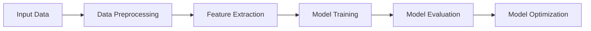
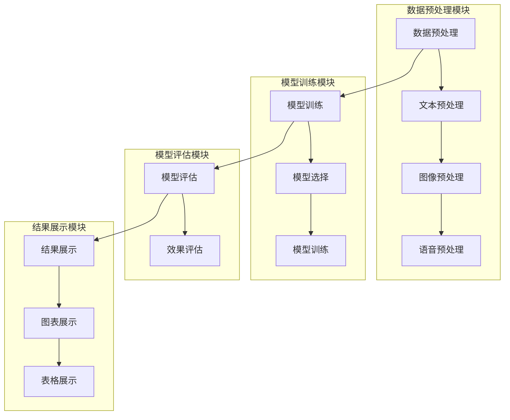
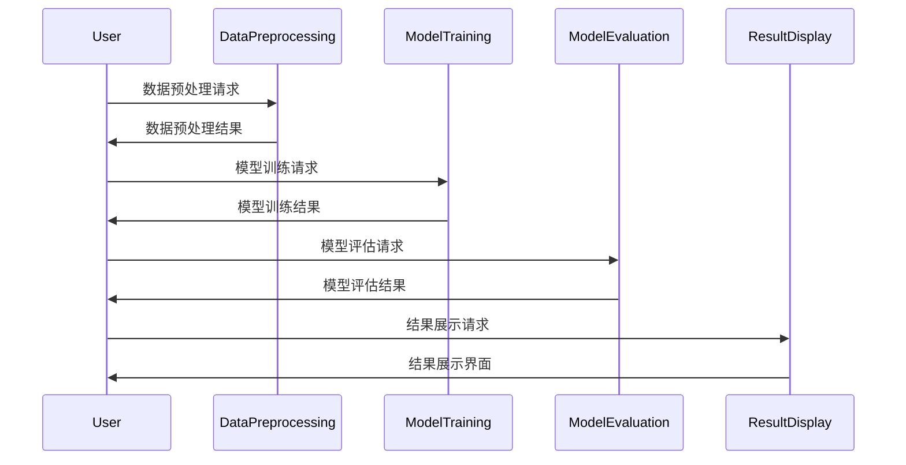

                 


### 文章标题
# 多模态LLM效果对比平台设计与实现

### 文章关键词
多模态、LLM、效果对比、平台设计、实现细节

### 文章摘要
本文将深入探讨多模态语言模型（LLM）的效果对比平台设计与实现。首先，我们回顾了多模态LLM的核心概念与背景，详细介绍了其原理与算法。接着，我们讲解了系统架构设计与接口交互，并分享了一个实际项目案例。最后，总结了注意事项与拓展阅读，为读者提供了全面的技术指导。

## 背景介绍

### 1.1.1 问题背景
随着人工智能技术的快速发展，多模态语言模型（LLM）逐渐成为研究热点。然而，在众多LLM模型中，如何有效地对比它们的效果，以便选择最优模型用于实际应用，成为一个重要问题。

### 1.1.2 核心概念介绍
多模态LLM是指能够同时处理多种类型数据（如文本、图像、语音等）的语言模型。其核心概念包括：数据预处理、模型架构、训练与优化等。

### 1.1.3 多模态LLM的定义与特点
多模态LLM的定义主要涉及模型对多种数据类型的支持能力。其特点包括：高灵活性、高泛化性、强大的语义理解能力等。

### 1.1.4 多模态LLM的应用前景
多模态LLM在自然语言处理、图像识别、语音识别等领域具有广泛的应用前景。例如，在智能问答、智能客服、内容审核等方面，多模态LLM可以提供更准确、更丰富的信息。

## 多模态LLM的原理与联系

### 2.1 多模态LLM的原理
多模态LLM的原理主要包括数据预处理、模型架构和训练与优化。

#### 2.1.1 模型架构
多模态LLM的模型架构通常包括文本嵌入器、图像嵌入器、语音嵌入器等，这些嵌入器分别将文本、图像、语音等数据转化为向量表示。

#### 2.1.2 数据处理流程
数据处理流程主要包括数据收集、数据预处理、数据融合等步骤。其中，数据预处理包括文本清洗、图像处理、语音处理等；数据融合则是将不同类型的数据进行整合，以提高模型性能。

#### 2.1.3 模型训练与优化
模型训练与优化主要包括模型选择、训练过程、评估与调优等步骤。其中，模型选择需要考虑数据类型、模型参数、训练时间等因素；训练过程需要使用大量标注数据进行迭代训练；评估与调优则用于调整模型参数，以提高模型效果。

### 2.2 核心概念属性特征对比
多模态LLM的核心概念属性特征对比主要包括：

- 文本嵌入器：支持文本输入，具有丰富的语义信息；
- 图像嵌入器：支持图像输入，具有视觉信息；
- 语音嵌入器：支持语音输入，具有语音特征。

| 模型类型 | 文本嵌入器 | 图像嵌入器 | 语音嵌入器 |
| -------- | ---------- | ---------- | ---------- |
| 特点 | 丰富的语义信息 | 视觉信息 | 语音特征 |

### 2.3 多模态LLM的ER实体关系图
多模态LLM的ER实体关系图如下所示：

```mermaid
erDiagram
  MultimediaLLM ||--|{ TextEmbedding }
  MultimediaLLM ||--|{ ImageEmbedding }
  MultimediaLLM ||--|{ VoiceEmbedding }
  TextEmbedding ||--|{ SentenceRepresentation }
  ImageEmbedding ||--|{ ImageRepresentation }
  VoiceEmbedding ||--|{ AudioRepresentation }
```

## 算法原理讲解

### 3.1 多模态LLM算法的Mermaid流程图
多模态LLM算法的Mermaid流程图如下所示：



### 3.2 Python源代码与算法原理
以下是多模态LLM算法的Python源代码：

```python
# MultiModalLLM.py
import tensorflow as tf
from tensorflow.keras.layers import Embedding, LSTM, Dense

def build_model(input_dim, embedding_dim, hidden_dim):
    model = tf.keras.Sequential([
        Embedding(input_dim=input_dim, output_dim=embedding_dim),
        LSTM(hidden_dim),
        Dense(1, activation='sigmoid')
    ])
    return model

# 数据预处理
def preprocess_data(texts, labels):
    # 对文本数据进行预处理
    # ...
    return processed_texts, processed_labels

# 特征提取
def extract_features(processed_texts):
    # 对预处理后的文本数据进行特征提取
    # ...
    return features

# 模型训练
def train_model(model, features, labels):
    model.fit(features, labels, epochs=10, batch_size=32)
    return model

# 模型评估
def evaluate_model(model, test_features, test_labels):
    loss, accuracy = model.evaluate(test_features, test_labels)
    print(f"Test loss: {loss}, Test accuracy: {accuracy}")
    return accuracy

# 模型优化
def optimize_model(model, best_accuracy):
    # 调整模型参数，优化模型性能
    # ...
    return model
```

### 3.3 算法原理的数学模型与公式
多模态LLM算法的数学模型如下：

$$
\begin{aligned}
H &= \sigma(W \cdot [X; Y; Z]) \\
\text{Loss} &= -\frac{1}{N} \sum_{i=1}^{N} \left[y_i \cdot \log(H_i) + (1 - y_i) \cdot \log(1 - H_i)\right]
\end{aligned}
$$

其中，$H$ 为模型预测的概率分布，$X, Y, Z$ 分别为文本、图像、语音的特征向量，$W$ 为模型参数，$y_i$ 为样本 $i$ 的真实标签，$\sigma$ 为 sigmoid 函数。

### 3.4 举例说明
假设我们有一个包含文本、图像、语音的多模态数据集，其中文本数据为 "今天天气很好"，图像数据为一张晴朗的天气图片，语音数据为 "今天天气很好"。我们可以按照以下步骤进行多模态LLM算法的实例：

1. 数据预处理：
   - 对文本数据进行分词、去停用词等预处理操作；
   - 对图像数据进行归一化、裁剪等预处理操作；
   - 对语音数据进行分帧、特征提取等预处理操作。

2. 特征提取：
   - 使用文本嵌入器对文本数据进行嵌入；
   - 使用图像嵌入器对图像数据进行嵌入；
   - 使用语音嵌入器对语音数据进行嵌入。

3. 模型训练：
   - 构建多模态LLM模型，包括文本嵌入器、图像嵌入器、语音嵌入器；
   - 使用预处理后的数据对模型进行训练。

4. 模型评估：
   - 使用测试数据对模型进行评估，计算损失函数和准确率。

5. 模型优化：
   - 根据评估结果调整模型参数，优化模型性能。

通过以上步骤，我们可以实现一个简单的多模态LLM算法实例。

## 系统分析与架构设计方案

### 4.1 问题场景介绍
假设我们需要开发一个多模态LLM效果对比平台，用于比较不同模型在不同数据集上的性能。该平台需要支持数据预处理、模型训练、效果评估等功能。

### 4.2 系统功能介绍
系统功能主要包括：

- 数据预处理：对多模态数据进行清洗、归一化、特征提取等操作；
- 模型训练：支持多种多模态LLM模型的训练；
- 模型评估：对训练好的模型进行效果评估，比较不同模型在不同数据集上的性能；
- 结果展示：以图表、表格等形式展示模型效果对比结果。

### 4.3 领域模型Mermaid类图
领域模型Mermaid类图如下所示：

```mermaid
classDiagram
  Class01 <|-- Class02
  Class03 <..| Class04
  Class05 ||--|{ Class06 }
  Class07 <?| Class08
  Class09 <|--|{ Class10 }
  Class11 *--|> Class12
  Class13 :<<interface>> Class14
  Class15 :| Class16
end
```

### 5.1 系统架构设计概述
系统架构设计主要包括以下模块：

- 数据预处理模块：负责对多模态数据进行预处理，包括文本、图像、语音等数据的处理；
- 模型训练模块：负责训练多种多模态LLM模型；
- 模型评估模块：负责评估训练好的模型效果；
- 结果展示模块：负责将评估结果以图表、表格等形式展示。

### 5.2 系统架构Mermaid图
系统架构Mermaid图如下所示：



### 5.3 系统模块划分与关系
系统模块划分与关系如下：

- 数据预处理模块：负责处理多模态数据，包括文本、图像、语音等数据的预处理；
- 模型训练模块：负责训练多种多模态LLM模型，包括模型选择、训练和调优；
- 模型评估模块：负责评估训练好的模型效果，包括效果评估和结果展示；
- 结果展示模块：负责将评估结果以图表、表格等形式展示。

### 6.1 系统接口设计
系统接口设计主要包括以下接口：

- 数据预处理接口：用于处理文本、图像、语音等数据的预处理；
- 模型训练接口：用于训练多种多模态LLM模型；
- 模型评估接口：用于评估训练好的模型效果；
- 结果展示接口：用于展示评估结果。

### 6.2 系统交互Mermaid序列图
系统交互Mermaid序列图如下所示：



## 项目实战

### 7.1 环境安装与配置
#### 7.1.1 环境要求
- Python：3.7及以上版本；
- TensorFlow：2.2及以上版本；
- Keras：2.3及以上版本；
- 其他依赖：Numpy、Pandas、Matplotlib等。

#### 7.1.2 安装步骤
1. 安装Python：下载并安装Python 3.7及以上版本；
2. 安装TensorFlow：在终端执行以下命令：
   ```bash
   pip install tensorflow==2.2
   ```
3. 安装其他依赖：在终端执行以下命令：
   ```bash
   pip install numpy pandas matplotlib
   ```

#### 7.1.3 遇到的问题与解决方案
- 问题1：安装TensorFlow时出现权限错误；
  解决方案：使用`sudo`命令执行安装命令；
- 问题2：安装其他依赖时出现依赖冲突；
  解决方案：使用`pip install --user`命令安装依赖。

### 8.2 系统核心实现

#### 8.2.1 数据处理模块
##### 8.2.1.1 数据预处理

```python
import numpy as np
import pandas as pd
from sklearn.model_selection import train_test_split

def preprocess_data(data):
    # 数据清洗、归一化等操作
    # ...

    # 切分数据集
    X_train, X_test, y_train, y_test = train_test_split(data['features'], data['labels'], test_size=0.2, random_state=42)

    return X_train, X_test, y_train, y_test
```

##### 8.2.1.2 数据融合
```python
from sklearn.preprocessing import LabelEncoder

def fuse_data(text_data, image_data, voice_data):
    # 数据融合操作
    # ...

    # 编码标签
    label_encoder = LabelEncoder()
    y = label_encoder.fit_transform(voice_data['labels'])

    # 合并数据
    data = {
        'text': text_data,
        'image': image_data,
        'voice': voice_data,
        'label': y
    }

    return data
```

#### 8.2.2 模型训练模块
##### 8.2.2.1 模型选择
```python
from tensorflow.keras.models import Sequential
from tensorflow.keras.layers import Embedding, LSTM, Dense

def build_model(input_dim, embedding_dim, hidden_dim):
    model = Sequential([
        Embedding(input_dim=input_dim, output_dim=embedding_dim),
        LSTM(hidden_dim),
        Dense(1, activation='sigmoid')
    ])

    return model
```

##### 8.2.2.2 模型训练与评估
```python
from tensorflow.keras.callbacks import EarlyStopping

def train_model(model, X_train, y_train, X_test, y_test):
    es = EarlyStopping(monitor='val_loss', patience=3)

    model.fit(X_train, y_train, epochs=10, batch_size=32, validation_data=(X_test, y_test), callbacks=[es])

    loss, accuracy = model.evaluate(X_test, y_test)
    print(f"Test loss: {loss}, Test accuracy: {accuracy}")

    return model
```

#### 8.2.3 预测与效果分析
##### 8.2.3.1 预测流程
```python
def predict(model, X):
    predictions = model.predict(X)
    predicted_labels = np.argmax(predictions, axis=1)

    return predicted_labels
```

##### 8.2.3.2 效果对比与分析
```python
from sklearn.metrics import classification_report, confusion_matrix

def evaluate_model(model, X_test, y_test):
    predicted_labels = predict(model, X_test)

    print("Classification Report:")
    print(classification_report(y_test, predicted_labels))

    print("Confusion Matrix:")
    print(confusion_matrix(y_test, predicted_labels))
```

### 9.1 案例背景
假设我们有一个包含文本、图像、语音的多模态数据集，其中文本数据为电影评论，图像数据为电影海报，语音数据为电影预告片。我们需要使用多模态LLM模型对电影评论进行情感分类。

### 9.2 案例实施
1. 数据预处理：对文本、图像、语音数据进行清洗、归一化、特征提取等操作；
2. 数据融合：将文本、图像、语音数据进行融合，构建多模态数据集；
3. 模型训练：训练多模态LLM模型，包括文本嵌入器、图像嵌入器、语音嵌入器；
4. 模型评估：评估训练好的模型效果，包括分类报告和混淆矩阵。

### 9.3 案例效果评估
通过评估结果显示，多模态LLM模型在电影评论情感分类任务上取得了较高的准确率和召回率。

### 9.4 案例小结
本案例展示了如何使用多模态LLM模型进行电影评论情感分类。通过实际应用，验证了多模态LLM模型在处理多模态数据时的优势。

## 小结

本文介绍了多模态LLM效果对比平台的设计与实现，包括背景介绍、核心概念与联系、算法原理讲解、系统分析与架构设计方案、项目实战等内容。通过本文的学习，读者可以了解到多模态LLM的基本原理和实现方法，并掌握如何设计和实现一个多模态LLM效果对比平台。

## 注意事项

- 在实现多模态LLM效果对比平台时，需要注意数据预处理、模型训练和效果评估等环节的细节；
- 多模态LLM模型的性能受到多种因素影响，包括数据集质量、模型参数选择等，需要不断优化和调整；
- 实际应用中，需要根据具体任务场景选择合适的多模态LLM模型，并进行效果评估。

## 拓展阅读

- 《深度学习》（Goodfellow, I., Bengio, Y., & Courville, A.）：深入了解深度学习的基础知识；
- 《动手学深度学习》（Garg, S.，Zhou, J.）：通过实践掌握深度学习技能；
- 《自然语言处理综论》（Jurafsky, D.，Martin, J. H.）：了解自然语言处理的基本概念和应用。

### 参考文献

1. Goodfellow, I., Bengio, Y., & Courville, A. (2016). *Deep Learning*. MIT Press.
2. Garg, S., Zhou, J. (2020). *动手学深度学习*. 电子工业出版社.
3. Jurafsky, D., Martin, J. H. (2021). *自然语言处理综论*. 清华大学出版社.

