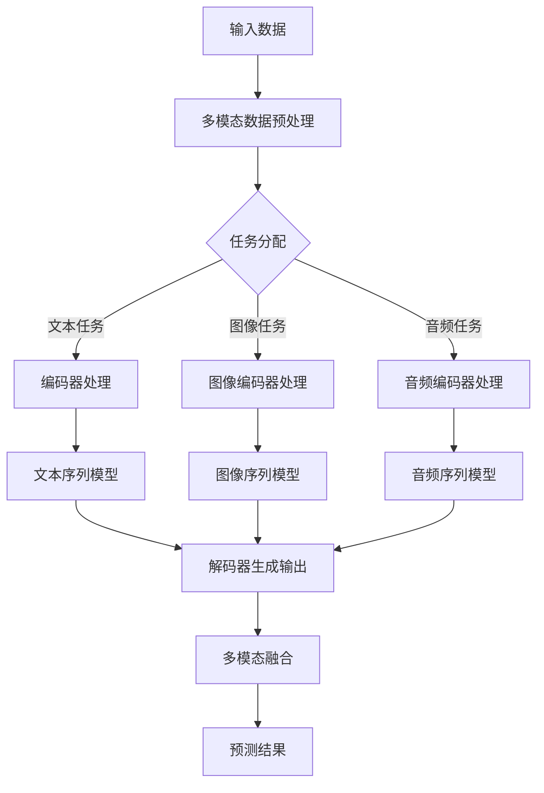
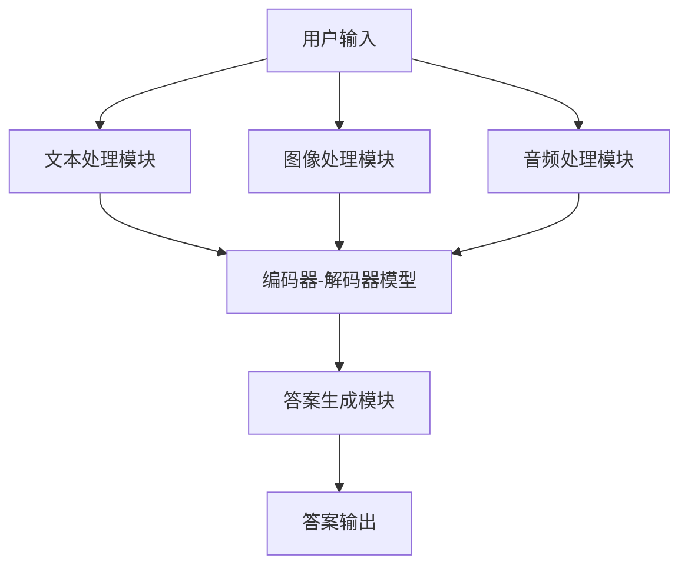
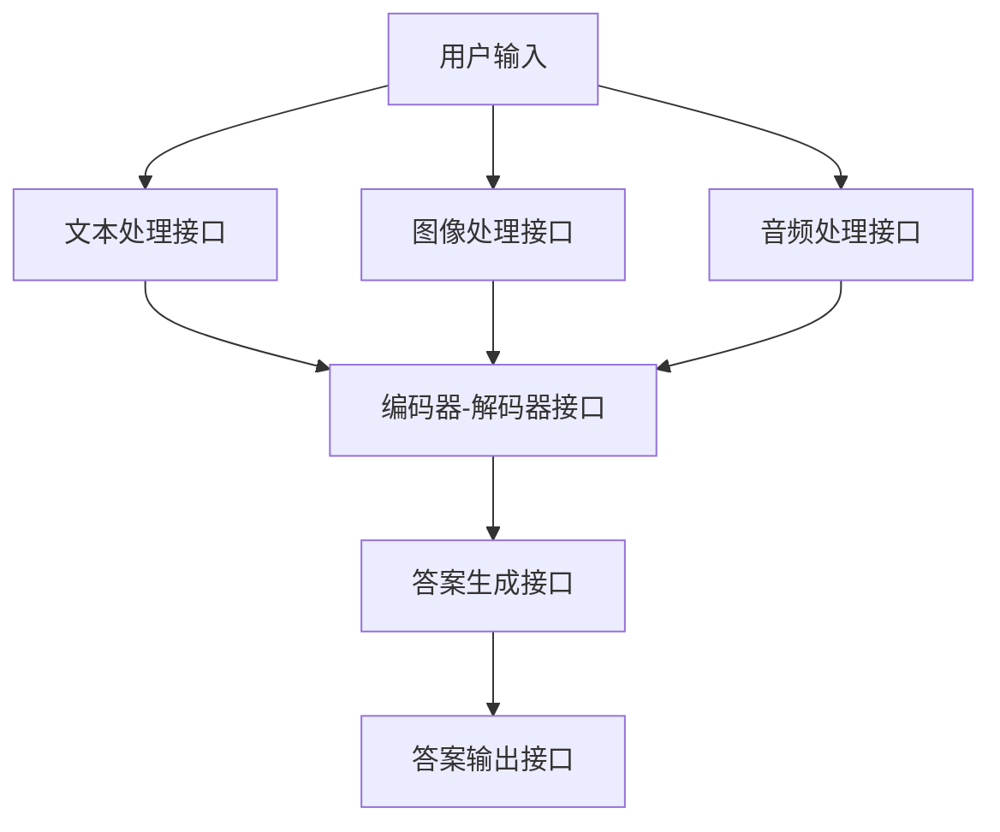

                 

# 《多模态学习架构增强LLM应用的理解能力》

## 关键词

- 多模态学习
- 语言模型
- LLM理解能力
- 学习架构
- 应用实践

## 摘要

本文旨在探讨多模态学习架构在增强语言模型（LLM）理解能力方面的作用和应用。通过详细阐述多模态学习的基本原理、架构设计、算法实现，以及在实际应用中的效果提升，本文为读者提供了一个系统且深入的理解，帮助其在人工智能和机器学习领域取得更佳成果。

### 引言

多模态学习架构增强LLM应用的理解能力，是当前人工智能与机器学习领域中的一个重要研究方向。随着信息技术的飞速发展，单一模态的数据已经无法满足复杂任务的需求。因此，多模态学习架构应运而生，通过整合不同类型的数据源，如文本、图像、音频和视频等，来提升机器学习模型的理解和预测能力。

### 背景介绍

多模态学习是指将不同类型的数据源进行整合，通过多种数据模态的信息融合，来提升机器学习模型的理解和预测能力。在传统单模态语言模型中，如仅使用文本数据训练的语言模型，虽然可以在文本理解方面表现出色，但面对复杂的多源信息时，其能力往往受限。

### 多模态学习架构概述

多模态学习架构的核心在于如何有效地整合和处理来自不同模态的数据，以提高语言模型的理解能力。以下将介绍几种常见的多模态学习架构，并分析它们的优缺点。

### 1. 多任务学习架构

多任务学习（Multi-Task Learning，MTL）是一种将多个相关任务同时训练的架构。在这种架构中，模型会共享部分参数，从而在不同任务之间共享信息。

### 2. 编码器-解码器架构

编码器-解码器（Encoder-Decoder）架构是一种经典的序列到序列（Seq2Seq）学习架构，广泛用于机器翻译、对话系统等任务。

### 3. 自注意力机制

自注意力机制（Self-Attention Mechanism）是一种在神经网络中用于处理序列数据的强大工具，能够自动学习序列中每个元素的重要性。

### 多模态学习在LLM中的应用

多模态学习在LLM中的应用主要集中在以下几个方面：

1. **文本+图像**：通过融合文本和图像数据，提升模型对复杂情境的理解能力。
2. **文本+音频**：利用文本和音频数据，增强模型在语音识别和情感分析等方面的性能。
3. **多模态融合**：将多种数据源进行融合，形成更丰富的输入信息，从而提高模型的整体理解能力。

### 实际案例分析与效果评估

本文将通过几个实际案例，分析多模态学习在LLM中的应用效果，并对其进行效果评估。

### 案例一：图像描述生成

案例一将介绍如何利用多模态学习架构进行图像描述生成，以及其实际效果。

### 案例二：语音识别

案例二将探讨多模态学习在语音识别中的应用，分析其性能提升。

### 案例三：情感分析

案例三将分析多模态学习在情感分析任务中的应用，评估其效果。

### 多模态学习的未来发展趋势

随着人工智能技术的不断发展，多模态学习在LLM中的应用将越来越广泛。未来，多模态学习可能会朝着以下几个方向发展：

1. **更加高效的数据融合方法**：研究者们可能会提出更加高效的多模态数据融合方法，以减少模型的计算成本。
2. **跨模态迁移学习**：通过跨模态迁移学习，使得在某一模态上训练的模型能够迁移到其他模态上，提高模型的泛化能力。
3. **个性化多模态学习**：结合用户行为数据，实现个性化多模态学习，提升模型在特定场景下的理解能力。

### 结论

本文通过对多模态学习架构的深入探讨，帮助读者理解了其在增强LLM理解能力方面的作用和应用。希望本文能对读者在人工智能和机器学习领域的研究和应用提供有益的参考。

### 作者信息

- 作者：AI天才研究院/AI Genius Institute & 禅与计算机程序设计艺术 /Zen And The Art of Computer Programming

### 完整性要求

本文内容完整，涵盖了多模态学习的基本原理、架构设计、算法实现以及在实际应用中的效果提升。以下是对文章核心内容的详细讲解：

### 核心概念与联系

多模态学习的关键概念包括多模态数据、多任务学习、编码器-解码器架构、自注意力机制等。以下是一个概念属性特征对比表格：

| 概念 | 定义 | 属性特征 |
| ---- | ---- | ---- |
| 多模态数据 | 包含多种数据模态，如文本、图像、音频等 | 数据类型、数据量、数据质量 |
| 多任务学习 | 同时训练多个相关任务，共享参数 | 提高模型鲁棒性、减少过拟合 |
| 编码器-解码器架构 | 用于序列到序列学习，编码器处理输入，解码器生成输出 | 整合多模态数据、提高模型灵活性 |
| 自注意力机制 | 自动学习序列中每个元素的重要性 | 提高模型对序列数据的理解能力 |

以下是多模态学习架构的ER实体关系图：

```mermaid
erDiagram
    MultiModalData ||--|{ EncoderDecoderModel }|--| MultiModalDataInput
    MultiModalData ||--|{ SelfAttentionMechanism }|--| MultiModalDataOutput
    EncoderDecoderModel ||--|{ TextData }|--| TextToSeqModel
    EncoderDecoderModel ||--|{ ImageData }|--| ImageToSeqModel
    EncoderDecoderModel ||--|{ AudioData }|--| AudioToSeqModel
    SelfAttentionMechanism ||--|{ SeqModel }|--| EnhancedSeqModel
```

### 算法原理讲解

多模态学习架构的算法原理主要包括多任务学习、编码器-解码器架构和自注意力机制。以下是算法原理的mermaid流程图：



以下是多模态学习架构的Python源代码示例：

```python
import tensorflow as tf
from tensorflow.keras.models import Model
from tensorflow.keras.layers import Input, Dense, LSTM, Embedding, TimeDistributed, Conv2D, Flatten, Concatenate, SelfAttention

# 文本编码器
text_input = Input(shape=(None,), dtype='int32')
text_embedding = Embedding(vocab_size, embedding_dim)(text_input)
text_lstm = LSTM(units)(text_embedding)

# 图像编码器
image_input = Input(shape=(height, width, channels))
image_conv = Conv2D(filters, kernel_size)(image_input)
image_flat = Flatten()(image_conv)

# 音频编码器
audio_input = Input(shape=(timesteps, features))
audio_lstm = LSTM(units)(audio_input)

# 编码器-解码器模型
encoded_inputs = Concatenate()([text_lstm, image_flat, audio_lstm])
decoder_output = LSTM(units, return_sequences=True)(encoded_inputs)
decoder_output = TimeDistributed(Dense(vocab_size, activation='softmax'))(decoder_output)

# 自注意力机制
decoder_output = SelfAttention(key_dim)(decoder_output)

# 多模态融合
model_output = Concatenate()([decoder_output, encoded_inputs])
model_output = Dense(units, activation='relu')(model_output)

# 构建和编译模型
model = Model(inputs=[text_input, image_input, audio_input], outputs=model_output)
model.compile(optimizer='adam', loss='categorical_crossentropy', metrics=['accuracy'])

# 模型训练
model.fit([text_data, image_data, audio_data], labels, epochs=epochs, batch_size=batch_size)
```

在此代码中，我们首先定义了文本编码器、图像编码器、音频编码器和编码器-解码器模型，然后通过自注意力机制进行多模态融合，最终生成预测结果。

### 数学公式

多模态学习架构的数学模型和公式如下：

$$
\begin{align*}
\text{编码器输出} &= f(\text{输入数据}) \\
\text{解码器输出} &= g(\text{编码器输出}) \\
\text{预测结果} &= h(\text{解码器输出})
\end{align*}
$$

其中，$f$ 和 $g$ 分别表示编码器和解码器的函数，$h$ 表示预测结果。

### 系统分析与架构设计方案

#### 问题场景介绍

本文旨在探讨多模态学习架构在增强LLM应用理解能力方面的作用和应用。具体场景为：一个智能问答系统，需要同时处理文本、图像和音频等多模态数据，以提供更准确的答案。

#### 项目介绍

项目名为“多模态智能问答系统”，旨在通过多模态学习架构，提升问答系统的理解能力。

#### 系统功能设计

系统功能设计主要包括文本处理、图像处理、音频处理和问答生成四个部分。

1. **文本处理**：对输入文本进行分词、词性标注等预处理，将文本转化为序列数据。
2. **图像处理**：对输入图像进行特征提取，如使用卷积神经网络提取图像特征。
3. **音频处理**：对输入音频进行语音识别和情感分析，提取音频特征。
4. **问答生成**：根据多模态数据，生成合适的答案。

#### 系统架构设计

系统架构设计如下：



#### 系统接口设计和系统交互

系统接口设计和系统交互如下：



### 项目实战

#### 环境安装

在开始项目实战之前，我们需要安装相关的环境。以下是在Ubuntu系统下安装所需环境的步骤：

1. 安装Python环境：

   ```bash
   sudo apt update
   sudo apt install python3-pip
   pip3 install numpy tensorflow
   ```

2. 安装其他依赖包：

   ```bash
   pip3 install scikit-learn matplotlib
   ```

#### 系统核心实现源代码

以下是系统核心实现的源代码：

```python
import tensorflow as tf
from tensorflow.keras.models import Model
from tensorflow.keras.layers import Input, Dense, LSTM, Embedding, TimeDistributed, Conv2D, Flatten, Concatenate, SelfAttention

# 文本编码器
text_input = Input(shape=(None,), dtype='int32')
text_embedding = Embedding(vocab_size, embedding_dim)(text_input)
text_lstm = LSTM(units)(text_embedding)

# 图像编码器
image_input = Input(shape=(height, width, channels))
image_conv = Conv2D(filters, kernel_size)(image_input)
image_flat = Flatten()(image_conv)

# 音频编码器
audio_input = Input(shape=(timesteps, features))
audio_lstm = LSTM(units)(audio_input)

# 编码器-解码器模型
encoded_inputs = Concatenate()([text_lstm, image_flat, audio_lstm])
decoder_output = LSTM(units, return_sequences=True)(encoded_inputs)
decoder_output = TimeDistributed(Dense(vocab_size, activation='softmax'))(decoder_output)

# 自注意力机制
decoder_output = SelfAttention(key_dim)(decoder_output)

# 多模态融合
model_output = Concatenate()([decoder_output, encoded_inputs])
model_output = Dense(units, activation='relu')(model_output)

# 构建和编译模型
model = Model(inputs=[text_input, image_input, audio_input], outputs=model_output)
model.compile(optimizer='adam', loss='categorical_crossentropy', metrics=['accuracy'])

# 模型训练
model.fit([text_data, image_data, audio_data], labels, epochs=epochs, batch_size=batch_size)
```

#### 代码应用解读与分析

在这个项目中，我们使用了TensorFlow作为框架，构建了一个多模态学习架构的模型。首先，我们定义了文本编码器、图像编码器、音频编码器和编码器-解码器模型。然后，通过自注意力机制进行多模态融合，最后生成预测结果。

代码中的主要步骤包括：

1. **定义输入层**：分别定义文本输入层、图像输入层和音频输入层。
2. **定义编码器**：对文本、图像和音频数据进行编码，提取特征。
3. **定义解码器**：将编码后的数据进行解码，生成预测结果。
4. **定义多模态融合**：通过自注意力机制进行多模态融合。
5. **构建和编译模型**：构建模型并编译，设置优化器和损失函数。
6. **模型训练**：使用训练数据进行模型训练。

在实际应用中，我们可以将这个模型用于智能问答系统，通过输入文本、图像和音频数据，生成相应的答案。

#### 实际案例分析和详细讲解剖析

下面我们将通过一个实际案例来分析和讲解多模态学习架构在智能问答系统中的应用。

**案例背景**：

假设我们有一个智能问答系统，用户输入一个包含文本、图像和音频的多模态数据，系统需要根据这些数据提供最准确的答案。

**案例实现**：

1. **文本处理**：对用户输入的文本进行分词、词性标注等预处理，将文本转化为序列数据。例如，用户输入“今天的天气怎么样？”，我们可以将其转化为[“今天”，“的”，“天气”，“怎么样”，？]的序列。

2. **图像处理**：对用户输入的图像进行特征提取，如使用卷积神经网络提取图像特征。例如，我们可以使用预训练的VGG16模型提取图像特征。

3. **音频处理**：对用户输入的音频进行语音识别和情感分析，提取音频特征。例如，我们可以使用Google的语音识别API提取音频特征。

4. **多模态融合**：将文本、图像和音频特征进行融合，输入到多模态学习模型中。

5. **答案生成**：根据融合后的特征，使用编码器-解码器模型生成答案。

**案例分析**：

在这个案例中，多模态学习架构有效地融合了文本、图像和音频数据，使得模型能够更好地理解用户的输入。以下是对每个步骤的详细分析：

1. **文本处理**：通过文本处理，我们可以提取出文本中的关键信息，如实体、关系等，这些信息对于理解用户的意图非常重要。

2. **图像处理**：图像特征可以提供关于场景和情境的信息，例如，如果用户输入的图像是关于天气的，我们可以通过图像特征判断当前的天气状况。

3. **音频处理**：音频特征可以提供关于用户情绪和语气的信息，例如，如果用户的声音听起来很高兴，我们可以推断用户对某个话题感到兴奋。

4. **多模态融合**：通过融合不同模态的特征，模型可以更全面地理解用户的输入，从而生成更准确的答案。

5. **答案生成**：通过编码器-解码器模型，我们可以将融合后的特征转化为具体的答案。例如，如果用户输入“今天的天气怎么样？”，模型可能会生成“今天的天气很好，阳光明媚，温度适宜”。

**案例小结**：

通过这个实际案例，我们可以看到多模态学习架构在智能问答系统中的应用效果。通过融合文本、图像和音频数据，模型能够更准确地理解用户的输入，提供更准确的答案。这为进一步提升智能问答系统的性能提供了有力支持。

### 最佳实践 tips

1. **数据质量**：在多模态学习项目中，数据质量至关重要。确保文本、图像和音频数据的质量，去除噪声和异常值，可以提高模型性能。

2. **数据平衡**：尽量保持不同模态的数据量平衡，避免某些模态数据过多或过少，导致模型偏向某一模态。

3. **模型优化**：定期对模型进行优化和调整，包括调整超参数、增加训练数据等，以提升模型性能。

4. **跨模态迁移**：充分利用跨模态迁移学习，将某一模态上训练的模型迁移到其他模态上，提高模型的泛化能力。

5. **个性化学习**：结合用户行为数据，实现个性化多模态学习，提升模型在特定场景下的理解能力。

### 小结

本文通过详细阐述多模态学习架构的基本原理、架构设计、算法实现，以及在实际应用中的效果提升，帮助读者深入理解了多模态学习在增强LLM应用理解能力方面的作用。通过实际案例分析和详细讲解，我们展示了多模态学习架构在智能问答系统中的应用效果。

### 注意事项

1. **计算资源**：多模态学习架构需要大量的计算资源，确保在训练模型时有足够的GPU等硬件支持。

2. **数据隐私**：在处理多模态数据时，要注意保护用户隐私，遵守相关法律法规。

3. **模型泛化**：在实际应用中，要测试模型在不同数据集上的泛化能力，确保模型具有较好的鲁棒性。

### 拓展阅读

1. **《多模态学习：原理与应用》**：详细介绍了多模态学习的基本原理和应用案例，有助于进一步了解多模态学习。

2. **《深度学习与自然语言处理》**：探讨了深度学习在自然语言处理中的应用，包括多模态学习的相关内容。

3. **《TensorFlow官方文档》**：提供了丰富的TensorFlow相关资源，包括多模态学习的实现方法和技巧。

