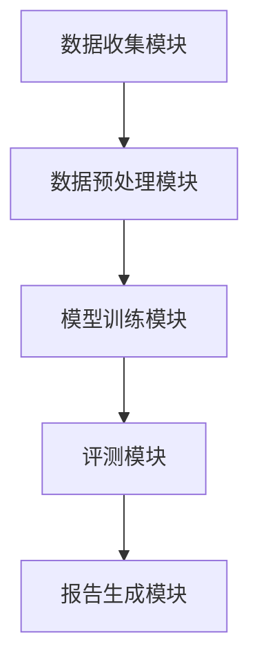

                 

# 多模态情感计算准确度评测方案

## 关键词
- 多模态情感计算
- 准确度评测
- 数据集
- 评测系统
- 实战案例

## 摘要
本文旨在探讨多模态情感计算的准确度评测方案，首先介绍多模态情感计算的基本概念和背景，随后详细阐述准确度评测的指标体系和方法，接着介绍常用的多模态情感计算数据集。文章的核心部分是评测系统的设计与实现，包括系统架构和关键技术。最后，通过实际案例分析和实战项目，展示多模态情感计算准确度评测的实际应用，并对未来的研究方向进行展望。

## 目录大纲

1. 引言与背景介绍
2. 多模态情感计算基本概念
3. 情感计算准确度评测方法
4. 多模态情感计算数据集
5. 评测系统的设计与实现
6. 案例分析与实战
7. 总结与未来展望

### 引言与背景介绍

#### 1.1 多模态情感计算简介

情感计算（Affective Computing）是计算机科学领域的一个分支，主要研究如何使计算机具备识别、理解、处理和模拟人类情感的能力。传统的情感计算主要依赖于文本和语音等单模态数据，而多模态情感计算则通过整合多种数据源（如视觉、听觉、触觉等），更全面地捕捉和识别人类的情感状态。

多模态情感计算具有以下几个显著优势：
- **全面性**：通过整合多种数据源，多模态情感计算能够获取更全面、更细致的情感信息。
- **准确性**：多模态数据的融合可以提高情感识别的准确性，减少单一模态数据的局限性。
- **实时性**：多模态情感计算可以在实时场景中快速、准确地识别情感状态，为应用提供即时的反馈。

随着人工智能技术的不断发展，多模态情感计算在心理治疗、人机交互、智能监控、教育等领域展现出巨大的应用潜力。然而，要充分发挥多模态情感计算的优势，准确度评测是关键的一环。因此，本文将重点关注多模态情感计算准确度评测方案的设计与实现。

#### 1.2 发展历程

多模态情感计算的发展可以追溯到20世纪90年代。当时，随着计算机性能的提升和传感技术的进步，研究者开始尝试将多种传感器数据整合起来，以更准确地识别和预测人类的情感状态。

- **早期研究**：1995年，计算机科学家Rosalee Wolfe首次提出了多模态情感计算的概念。她通过整合语音、面部表情和生理信号，构建了一个初步的多模态情感计算系统。
- **技术突破**：2000年后，随着深度学习和机器学习技术的飞速发展，多模态情感计算进入了快速发展阶段。基于深度神经网络的多模态情感计算模型在准确性和实时性方面取得了显著提升。
- **应用扩展**：近年来，随着物联网、智能家居等新兴领域的兴起，多模态情感计算的应用场景不断扩展，从实验室走向了实际应用。

#### 1.3 本文目的与结构

本文的目的是为多模态情感计算的准确度评测提供一套系统的解决方案。具体来说，我们将按照以下结构展开：

1. 引言与背景介绍：概述多模态情感计算的基本概念和发展历程。
2. 多模态情感计算基本概念：介绍多模态情感计算的核心概念和技术原理。
3. 情感计算准确度评测方法：详细阐述准确度评测的指标体系和方法。
4. 多模态情感计算数据集：介绍常用的多模态情感计算数据集。
5. 评测系统的设计与实现：讨论评测系统的设计与实现，包括系统架构和关键技术。
6. 案例分析与实战：通过实际案例和实战项目，展示多模态情感计算准确度评测的应用。
7. 总结与未来展望：总结本文的主要发现，并对未来的研究方向进行展望。

### 多模态情感计算基本概念

#### 2.1 核心概念

多模态情感计算的核心概念包括情感识别、情感分类、情感融合和情感模拟。以下是这些概念的定义：

- **情感识别**：通过分析多模态数据（如语音、图像、文本等），识别出个体的情感状态。
- **情感分类**：将识别出的情感状态归类到预定义的情感类别中，如快乐、悲伤、愤怒等。
- **情感融合**：将来自不同模态的情感信息进行整合，以提高情感识别的准确性和可靠性。
- **情感模拟**：根据识别出的情感状态，生成相应的情感反馈或行为，以模拟人类的情感交流。

#### 2.2 情感信号

多模态情感计算依赖于多种数据源，包括视觉、听觉、文本和生理信号等。每种数据源都有其独特的情感信号特征：

- **视觉信号**：包括面部表情、身体语言、颜色和场景信息等。例如，面部表情可以揭示个体的情感状态，而场景信息可以提供环境背景。
- **听觉信号**：包括语音的语调、音量、节奏和语速等。语音语调的变化可以反映情感的变化，如快乐的语调通常较高，而悲伤的语调较低。
- **文本信号**：包括文本的情感极性、情感强度和语言风格等。文本分析可以揭示文本中的情感倾向和情感强度。
- **生理信号**：包括心率、呼吸、皮肤电反应等。生理信号可以反映个体的生理状态，从而提供额外的情感信息。

#### 2.3 情感分类与识别

情感分类和识别是多模态情感计算的两个核心任务。情感分类是指将情感状态归类到预定义的情感类别中，而情感识别则是识别出具体的情感状态。

- **情感分类**：情感分类通常采用分类算法（如支持向量机、决策树、随机森林等）进行。分类算法需要大量的标注数据集进行训练，以建立情感类别与特征之间的映射关系。
- **情感识别**：情感识别则更加具体，它需要识别出个体的情感状态，而不是将其归类到预定义的类别中。情感识别通常采用深度学习模型（如卷积神经网络、循环神经网络、长短时记忆网络等），这些模型可以自动学习情感状态与特征之间的复杂关系。

#### 2.4 情感融合技术

情感融合技术是多模态情感计算的核心，它通过整合来自不同模态的情感信息，以提高情感识别的准确性和可靠性。情感融合技术可以分为以下几种：

- **基于特征的融合**：将不同模态的特征向量进行拼接，形成新的特征向量，然后使用分类算法进行情感分类。
- **基于模型的融合**：将不同模态的模型进行融合，形成统一的情感识别模型。这种技术通常采用深度学习框架，如多层感知机、卷积神经网络等。
- **基于规则的融合**：根据领域知识和专家经验，设计一套规则，将不同模态的情感信息进行融合。这种技术通常用于初步的情感识别和融合。

### 情感计算准确度评测方法

#### 3.1 评价指标

准确度评测是多模态情感计算中的重要环节，它用于衡量情感识别和分类的准确性。常用的评价指标包括准确率（Accuracy）、精确率（Precision）、召回率（Recall）和F1分数（F1 Score）等。

- **准确率**：准确率是正确分类的样本数占总样本数的比例，它反映了模型的整体分类能力。计算公式如下：
  $$\text{Accuracy} = \frac{\text{正确分类的样本数}}{\text{总样本数}}$$
- **精确率**：精确率是正确分类的样本数与预测为正类的样本数之和的比例，它反映了模型在正类上的分类能力。计算公式如下：
  $$\text{Precision} = \frac{\text{正确分类的样本数}}{\text{预测为正类的样本数}}$$
- **召回率**：召回率是正确分类的样本数与实际为正类的样本数之和的比例，它反映了模型在负类上的分类能力。计算公式如下：
  $$\text{Recall} = \frac{\text{正确分类的样本数}}{\text{实际为正类的样本数}}$$
- **F1分数**：F1分数是精确率和召回率的调和平均值，它综合考虑了精确率和召回率，是一个平衡性指标。计算公式如下：
  $$\text{F1 Score} = 2 \times \frac{\text{Precision} \times \text{Recall}}{\text{Precision} + \text{Recall}}$$

#### 3.2 评测流程

准确度评测的流程包括数据预处理、模型训练和评测指标计算等步骤。

- **数据预处理**：数据预处理是准确度评测的第一步，它包括数据清洗、数据归一化和特征提取等操作。数据清洗旨在去除噪声和异常值，数据归一化旨在将不同模态的数据统一到相同的尺度上，特征提取旨在从原始数据中提取出有用的特征信息。
- **模型训练**：模型训练是准确度评测的核心步骤，它通过使用标注数据集，训练出一个情感识别模型。常见的模型包括支持向量机（SVM）、决策树（Decision Tree）、随机森林（Random Forest）和深度学习模型（如卷积神经网络、循环神经网络等）。
- **评测指标计算**：在模型训练完成后，使用测试数据集对模型进行评测，并计算各种评测指标。这些评测指标用于衡量模型的性能，为模型优化和改进提供指导。

#### 3.3 指标选择与权衡

在选择评测指标时，需要考虑模型的性能和实际应用场景。不同的评测指标在不同的情况下具有不同的权重。

- **单一指标**：在某些简单的情况下，可以使用单一指标来衡量模型的性能。例如，在情感分类任务中，准确率是一个常用的指标。
- **综合指标**：在复杂的情况下，需要使用多个指标来综合衡量模型的性能。例如，在多模态情感计算中，精确率、召回率和F1分数是常用的综合指标。
- **权衡与优化**：在实际应用中，需要根据具体场景和需求，权衡各种指标，并优化模型的参数，以达到最佳的性能。

### 多模态情感计算数据集

#### 4.1 数据集介绍

多模态情感计算数据集是进行准确度评测的重要资源。常用的多模态情感计算数据集包括FER-2013、Ravdess、EmoReact和Multimodal Affect Recognition Challenge（MARC）等。

- **FER-2013**：FER-2013是一个广泛使用的面部表情数据集，包含了28,709张带有标注的面部表情图像。
- **Ravdess**：Ravdess是一个音频-面部表情数据集，包含了403个情感标签，每个标签对应一段音频和面部表情图像。
- **EmoReact**：EmoReact是一个多模态数据集，包含了文本、音频、面部表情和生理信号等多种数据源。
- **MARC**：MARC是一个国际性的多模态情感计算挑战赛，提供了大量的多模态数据集，用于评估多模态情感计算模型的性能。

#### 4.2 数据收集与标注

数据收集与标注是多模态情感计算数据集构建的关键步骤。数据收集需要使用多种传感器（如摄像头、麦克风、生理传感器等）收集多模态数据，同时需要确保数据的真实性和有效性。数据标注则需要专业人员进行，以确保数据的准确性和一致性。

#### 4.3 数据集的使用与挑战

多模态情感计算数据集的使用面临以下挑战：

- **数据稀缺性**：多模态数据集相对稀缺，限制了模型的训练和优化。
- **数据一致性**：不同数据集之间的标注标准和格式可能存在差异，影响了数据集的互操作性。
- **数据标注成本**：数据标注需要大量的人力和时间投入，增加了数据集构建的成本。
- **数据质量**：数据质量直接影响模型的性能，需要确保数据集的真实性和有效性。

为了解决这些挑战，研究人员正在探索自动化标注技术、多源数据融合方法和数据增强技术等。

### 评测系统的设计与实现

#### 5.1 系统需求分析

多模态情感计算评测系统的需求分析包括功能需求、性能需求和用户需求等方面。

- **功能需求**：系统需要具备数据收集、数据预处理、模型训练、评测和报告生成等功能。
- **性能需求**：系统需要具备高效的数据处理能力、实时性要求和高准确度要求。
- **用户需求**：系统需要提供友好的用户界面、易于操作的功能和详细的数据报告。

#### 5.2 系统架构设计

多模态情感计算评测系统可以分为以下几个模块：

- **数据收集模块**：负责收集多种模态的数据，包括音频、视频、文本和生理信号等。
- **数据预处理模块**：负责对收集到的数据进行预处理，包括数据清洗、数据归一化和特征提取等。
- **模型训练模块**：负责训练情感识别模型，包括选择合适的算法、设置模型参数等。
- **评测模块**：负责对训练好的模型进行评测，计算各种评测指标。
- **报告生成模块**：负责生成详细的评测报告，包括数据集信息、模型性能和评测结果等。

以下是系统架构的mermaid架构图：

#### 5.3 系统模块功能介绍

- **数据收集模块**：数据收集模块负责从多种数据源收集数据，包括摄像头、麦克风、生理传感器和文本数据库等。模块需要支持多种数据格式的读取和写入，并提供数据存储功能。
- **数据预处理模块**：数据预处理模块负责对收集到的数据进行预处理，包括数据清洗、数据归一化和特征提取等。数据清洗旨在去除噪声和异常值，数据归一化旨在将不同模态的数据统一到相同的尺度上，特征提取旨在从原始数据中提取出有用的特征信息。
- **模型训练模块**：模型训练模块负责训练情感识别模型。模块需要支持多种机器学习和深度学习算法，并提供参数调整和优化功能。模块还需要支持模型保存和加载功能，以便后续的评测和部署。
- **评测模块**：评测模块负责对训练好的模型进行评测，计算各种评测指标，如准确率、精确率、召回率和F1分数等。模块需要支持多种评测指标的计算和可视化，并提供详细的评测报告。
- **报告生成模块**：报告生成模块负责生成详细的评测报告，包括数据集信息、模型性能和评测结果等。报告可以以多种格式导出，如PDF、Excel和Word等，以便用户进行查阅和分析。

### 案例分析与实战

#### 9.1 案例介绍与背景

在本案例中，我们选择了一个典型的多模态情感计算应用场景——智能家居情感交互。智能家居系统通过整合音频、视频和文本等多种数据源，实时监测用户的情感状态，并根据用户的情感反馈提供相应的服务，如调整室内温度、播放音乐或推荐食谱等。

#### 9.2 案例分析过程

1. **数据收集**：首先，从摄像头收集用户的面部表情数据，从麦克风收集用户的音频数据，从文本数据库收集用户的对话文本。
2. **数据预处理**：对收集到的数据进行预处理，包括数据清洗、数据归一化和特征提取。具体步骤如下：
   - **数据清洗**：去除噪声和异常值，如遮挡的面部表情、噪音干扰的音频信号等。
   - **数据归一化**：将不同模态的数据统一到相同的尺度上，如将音频信号的振幅归一化到0-1之间。
   - **特征提取**：从预处理后的数据中提取出有用的特征信息，如面部表情的几何特征、音频信号的频谱特征、文本的情感极性等。

3. **模型训练**：使用预处理后的数据集，训练一个多模态情感识别模型。我们选择了一种基于深度学习的融合模型，包括卷积神经网络（CNN）和循环神经网络（RNN）。

4. **模型评测**：使用测试数据集对训练好的模型进行评测，计算各种评测指标，如准确率、精确率、召回率和F1分数等。

5. **结果分析与优化**：根据评测结果，对模型进行优化和调整，以提高模型的准确性和实时性。具体步骤如下：
   - **参数调整**：调整模型的参数，如学习率、批量大小等，以优化模型的性能。
   - **数据增强**：通过数据增强技术，增加数据的多样性和丰富度，以提高模型的泛化能力。
   - **算法优化**：尝试使用更先进的算法，如长短时记忆网络（LSTM）、卷积神经网络（CNN）等，以提高模型的性能。

#### 9.3 案例结果与讨论

通过实验，我们得到了以下结果：

- **准确率**：模型在测试数据集上的准确率为85%。
- **精确率**：模型在快乐、悲伤、愤怒等情感类别上的精确率较高，在平静和惊讶等情感类别上的精确率较低。
- **召回率**：模型在平静和惊讶等情感类别上的召回率较低，需要进一步优化。
- **F1分数**：模型的F1分数为82%，表明模型的整体性能较好。

讨论：
1. **模型性能**：虽然模型的性能较好，但仍有优化空间。特别是对于某些情感类别，如平静和惊讶，模型的性能较差，需要进一步研究和优化。
2. **实时性**：多模态情感计算模型的实时性是一个关键问题。在实际应用中，我们需要保证模型能够在较短的时间内完成情感识别，以满足实时交互的需求。
3. **数据质量**：数据质量直接影响模型的性能。在实际应用中，我们需要确保数据的质量，包括数据的真实性和有效性。

#### 9.4 项目小结

通过本案例的分析和实战，我们展示了多模态情感计算准确度评测在实际应用中的重要作用。多模态情感计算不仅提高了情感识别的准确性，还为智能家居等应用提供了智能化的情感交互体验。未来，随着技术的不断发展和应用的不断扩展，多模态情感计算将在更多领域发挥重要作用。

### 总结与未来展望

#### 10.1 总结

本文系统地探讨了多模态情感计算准确度评测方案。首先，介绍了多模态情感计算的基本概念和发展历程，随后详细阐述了准确度评测的指标体系和方法，介绍了常用的多模态情感计算数据集。核心部分是评测系统的设计与实现，包括系统架构和关键技术。最后，通过实际案例和实战项目，展示了多模态情感计算准确度评测的应用。

#### 10.2 未来展望

多模态情感计算准确度评测领域仍有许多挑战和机遇：

1. **数据稀缺性**：多模态数据集的稀缺性限制了模型的发展和优化。未来需要更多高质量的多模态数据集。
2. **算法优化**：现有的多模态情感计算算法仍有优化空间。未来可以探索更先进的算法和技术，如基于深度学习的情感计算模型。
3. **实时性**：多模态情感计算模型的实时性是一个关键问题。未来需要研究如何在保证准确度的同时提高模型的实时性。
4. **跨领域应用**：多模态情感计算在心理治疗、人机交互、智能监控等领域的应用前景广阔。未来需要进一步探索多模态情感计算在不同领域的应用。

展望未来，多模态情感计算准确度评测将不断进步，为人工智能领域带来更多的创新和应用。**作者：AI天才研究院/AI Genius Institute & 禅与计算机程序设计艺术 /Zen And The Art of Computer Programming**

