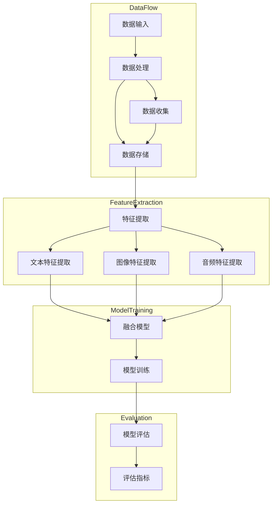
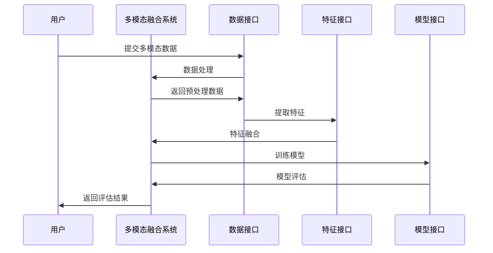
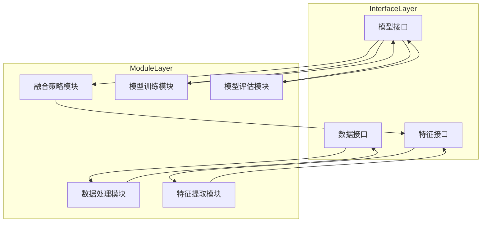

                 


### 第1章: 引言

#### 1.1 问题背景

在当前的技术发展背景下，人工智能（AI）已经成为推动社会进步的重要力量。随着深度学习和大数据技术的飞速发展，AI模型在各个领域的应用越来越广泛。然而，这些模型在实际应用中往往存在一个问题，即它们对于输入数据的理解能力有限。这导致了模型在某些特定场景下的表现不尽如人意。

为了解决这一问题，提出了多模态融合（Multimodal Fusion）的概念。多模态融合指的是将不同类型的数据（如图像、文本、声音等）进行整合，以增强模型对输入数据的理解能力。这种方法不仅可以提高模型在特定任务中的表现，还可以拓宽AI的应用范围。

#### 1.2 问题描述

多模态融合能力评测的目的是全面检验模型对多模态数据的理解能力。具体来说，这个评测过程包括以下几个关键步骤：

1. **数据采集与预处理**：收集多种类型的数据（如图像、文本、音频等），并对这些数据进行预处理，以便后续的融合和分析。
2. **特征提取**：从原始数据中提取关键特征，这些特征将作为融合的输入。
3. **融合策略**：设计并实现多种融合策略，如基于注意力机制的融合、基于深度学习的融合等。
4. **模型训练与优化**：使用融合后的数据训练模型，并对模型进行优化，以提高其在特定任务上的表现。
5. **评测与评估**：通过多种评测指标（如准确率、召回率、F1分数等）对模型进行评测，以评估其多模态融合能力。

#### 1.3 问题解决

解决多模态融合能力评测的问题需要综合考虑数据、算法、模型等多个方面。以下是一些关键步骤：

1. **数据多样化**：收集多种类型的数据，以丰富融合的内容和维度。
2. **特征提取与选择**：设计有效的特征提取方法，并从提取的特征中选择最有用的部分进行融合。
3. **融合策略研究**：深入研究并设计多种融合策略，以找到最适合特定任务的方法。
4. **模型训练与优化**：使用融合后的数据训练模型，并采用先进的优化方法提高模型的性能。
5. **评测与评估**：设计一套全面的评测体系，包括多种评测指标，以全面评估模型的多模态融合能力。

#### 1.4 边界与外延

多模态融合能力评测不仅局限于特定的领域，如图像识别、自然语言处理等，还涉及到其他领域，如语音识别、视频分析等。此外，随着技术的不断发展，多模态融合的应用场景将越来越广泛。

#### 1.5 概念结构与核心要素组成

多模态融合能力评测涉及以下几个核心概念和要素：

1. **多模态数据**：指多种类型的数据，如图像、文本、音频等。
2. **特征提取**：从多模态数据中提取关键特征。
3. **融合策略**：将提取的特征进行融合的方法。
4. **模型训练与优化**：使用融合后的数据训练模型，并对模型进行优化。
5. **评测与评估**：对模型进行评测，以评估其多模态融合能力。

在接下来的章节中，我们将详细探讨多模态数据的类型、特征提取的方法、融合策略的设计、模型训练与优化，以及评测与评估的具体步骤和指标。

## 第2章: 多模态数据类型

多模态融合的核心在于处理和整合来自不同类型的数据源，这些数据源可以是图像、文本、声音、视频等。每种类型的数据都有其独特的特性和处理方法。本章节将重点介绍图像数据和文本数据，以及它们在多模态融合中的应用。

### 2.1 图像数据

图像数据是多模态融合中非常常见的一种类型，它包含了丰富的视觉信息，如颜色、纹理、形状等。图像数据在许多领域都有广泛的应用，例如图像识别、物体检测、图像分割等。

#### 2.1.1 图像数据的类型与特点

**2.1.1.1 图像数据的基本类型**

- **静态图像**：如照片、图片等。
- **动态图像**：如视频、动画等。

**2.1.1.2 图像数据的特点**

- **空间信息丰富**：图像数据包含丰富的空间信息，如颜色、纹理、形状等。
- **高维度**：图像数据通常具有高维度，需要有效的降维方法进行处理。

**2.1.2 图像数据的预处理**

图像数据的预处理是确保后续融合过程顺利进行的重要步骤。以下是一些常见的预处理方法：

- **数据增强**：通过随机裁剪、旋转、翻转等方法增加数据的多样性，从而提高模型的泛化能力。
- **图像规范化**：将图像像素值归一化到统一的范围内，例如将像素值从0到255归一化到-1到1之间。

**2.1.3 图像数据在多模态融合中的应用**

- **图像分类**：使用深度学习模型（如卷积神经网络，CNN）对图像进行分类，例如对猫狗图片进行分类。
- **图像识别**：使用深度学习模型对图像中的对象进行识别，例如在图像中识别出特定的物体。

### 2.2 文本数据

文本数据是另一种常见的数据类型，它在自然语言处理（NLP）领域具有广泛的应用。文本数据可以包括文章、书籍、邮件、社交媒体帖子等。

#### 2.2.1 文本数据的类型与特点

**2.2.1.1 文本数据的基本类型**

- **文本**：如新闻文章、论文、邮件等。
- **语音文本**：如语音转文字（STT）。

**2.2.1.2 文本数据的特点**

- **语义丰富**：文本数据含有丰富的语义信息，可以通过词汇、句子和段落来传达复杂的信息。
- **多样性**：文本数据具有高度的多样性，包括不同的语言风格、表达方式和文化背景。

**2.2.2 文本数据的预处理**

文本数据的预处理通常包括以下步骤：

- **分词**：将文本分割成单词或词汇，以便进行后续的分析。
- **去停用词**：去除常见的停用词（如“的”、“和”、“在”等），以减少噪声。
- **词性标注**：对文本中的每个单词进行词性标注，例如名词、动词、形容词等。

**2.2.3 文本数据在多模态融合中的应用**

- **情感分析**：使用深度学习模型对文本数据进行分析，以判断文本的情感倾向，例如判断一篇文章是否积极或消极。
- **问答系统**：结合图像和文本数据，构建问答系统，例如用户提出问题，系统能够根据图像和文本数据给出相应的答案。

通过以上对图像数据和文本数据的介绍，我们可以看到多模态融合如何通过整合不同类型的数据来提升模型的理解能力。在接下来的章节中，我们将深入探讨特征提取、融合策略、模型训练与优化等关键技术。

### 第3章: 特征提取

特征提取是多模态融合中的关键步骤，它涉及到如何从不同的数据源中提取出对融合任务最有价值的特征。有效的特征提取能够显著提升融合模型的性能，并减少后续处理的复杂性。在本章节中，我们将详细探讨图像数据和文本数据的特征提取方法。

#### 3.1 图像数据的特征提取

图像数据的特征提取方法主要依赖于深度学习模型，其中卷积神经网络（CNN）是最常用的方法之一。以下是一些常用的图像特征提取方法：

**3.1.1 卷积神经网络（CNN）**

CNN 是一种专门用于处理图像数据的深度学习模型，其核心思想是通过卷积层逐层提取图像的局部特征，从而形成全局特征表示。

- **卷积层**：通过卷积运算提取图像的局部特征。
- **池化层**：降低特征图的维度，减少参数数量。
- **全连接层**：将特征图转换为一个一维的向量，用于分类或回归任务。

**3.1.2 图像特征提取的其他方法**

- **自编码器**：通过自编码器（Autoencoder）学习图像数据的低维表示。
- **视觉词汇模型**：将图像划分为多个区域，并为每个区域分配一个视觉词汇，从而形成一个图像的词汇表。

#### 3.2 文本数据的特征提取

文本数据的特征提取方法主要依赖于自然语言处理（NLP）技术，以下是一些常用的文本特征提取方法：

**3.2.1 词袋模型（Bag of Words, BoW）**

词袋模型是一种基于统计的文本表示方法，它将文本视为一个词汇的集合，不考虑词汇的顺序。

- **分词**：将文本分割成单词或词汇。
- **词频统计**：计算每个单词在文本中的出现频率。

**3.2.2 词语嵌入（Word Embedding）**

词语嵌入是一种将文本中的词汇映射到高维空间的方法，通过捕捉词汇的语义关系，从而提升文本表示的丰富度。

- **词向量训练**：通过训练词向量模型，将每个词汇映射到一个固定维度的向量。
- **词嵌入方法**：如 Word2Vec、GloVe 等。

**3.2.3 文本特征提取的其他方法**

- **递归神经网络（RNN）**：通过 RNN 模型对文本序列进行建模，提取序列特征。
- **注意力机制（Attention Mechanism）**：通过注意力机制对文本序列的不同部分进行加权，提取重要的特征。

#### 3.3 多模态特征融合

多模态特征融合是将来自不同数据源的特征进行整合，以生成更丰富的特征表示。以下是一些常用的多模态特征融合方法：

**3.3.1 直接融合**

直接融合方法是将不同模态的特征向量进行拼接，形成一个多模态的特征向量。

- **特征拼接**：将图像特征和文本特征进行拼接，形成一个高维度的特征向量。

**3.3.2 基于注意力的融合**

基于注意力的融合方法通过学习不同模态特征之间的相关性，动态地调整各模态特征的权重。

- **注意力机制**：通过注意力权重对各个模态的特征进行加权融合。

**3.3.3 基于模型融合**

基于模型融合方法是将不同模态的数据输入到不同的模型中，然后整合模型输出。

- **多任务学习**：将不同模态的数据输入到共享模型中，同时学习多个任务。

通过以上对图像数据和文本数据的特征提取方法的介绍，我们可以看到特征提取在多模态融合中的重要性。有效的特征提取能够为融合模型提供高质量的特征输入，从而提升模型的性能。在接下来的章节中，我们将探讨多模态融合策略的设计与实现。

### 第4章: 多模态融合策略

多模态融合策略是决定多模态融合系统性能的关键因素之一。有效的融合策略能够充分利用不同模态数据的特点，提高模型对复杂问题的理解能力。在本章节中，我们将详细讨论几种常见的多模态融合策略，包括基于注意力机制的方法、基于深度学习的融合方法以及传统融合方法。

#### 4.1 基于注意力机制的方法

注意力机制是一种在多模态融合中广泛应用的方法，它能够动态地调整不同模态特征的权重，从而优化融合效果。以下是一些基于注意力机制的多模态融合策略：

**4.1.1 自注意力机制**

自注意力机制通过学习不同位置之间的关联性，对特征序列进行加权。在多模态融合中，自注意力机制可以用于对图像和文本的特征进行加权融合。

- **数学模型**：使用点积、缩放点积或多头自注意力机制。
- **实现方法**：在编码器和解码器中引入自注意力层，对输入特征进行加权融合。

**4.1.2 交叉注意力机制**

交叉注意力机制通过学习不同模态特征之间的相关性，对图像和文本特征进行融合。

- **数学模型**：计算图像特征和文本特征之间的注意力得分，并加权融合。
- **实现方法**：在编码器和解码器中分别引入图像和文本注意力层，对图像特征和文本特征进行交叉融合。

**4.1.3 多模态注意力网络（MMAN）**

多模态注意力网络（MMAN）是一种结合自注意力和交叉注意力的方法，它能够同时考虑不同模态之间的关联性。

- **数学模型**：结合自注意力和交叉注意力，生成多模态特征表示。
- **实现方法**：通过多模态注意力层，对图像和文本特征进行多层次的融合。

#### 4.2 基于深度学习的融合方法

基于深度学习的融合方法利用深度神经网络的结构和参数化优势，实现多模态数据的融合。以下是一些基于深度学习的融合方法：

**4.2.1 深度神经网络融合（DNF）**

深度神经网络融合方法通过共享神经网络层来融合多模态数据。

- **数学模型**：使用卷积神经网络（CNN）和循环神经网络（RNN）的组合，对图像和文本特征进行融合。
- **实现方法**：将图像和文本特征输入到共享神经网络中，通过多层神经网络提取融合特征。

**4.2.2 多任务学习（MTL）**

多任务学习通过同时训练多个相关任务来提高模型的泛化能力。

- **数学模型**：在多任务学习框架下，定义多个损失函数，并使用梯度下降算法进行优化。
- **实现方法**：将图像分类和文本分类任务结合，同时优化多个损失函数。

**4.2.3 多模态深度学习模型（MDL）**

多模态深度学习模型（MDL）通过多模态神经网络架构实现多模态数据的融合。

- **数学模型**：使用多输入多输出的神经网络结构，对图像和文本特征进行融合。
- **实现方法**：构建一个具有多个输入和输出层的神经网络，同时处理图像和文本数据。

#### 4.3 传统融合方法

除了深度学习和注意力机制，传统融合方法也在多模态融合中广泛应用。以下是一些常见的传统融合方法：

**4.3.1 线性融合**

线性融合方法通过线性组合不同模态的特征向量来实现融合。

- **数学模型**：使用权重矩阵将不同模态的特征向量进行加权融合。
- **实现方法**：设计一个线性变换模型，对图像和文本特征进行加权融合。

**4.3.2 逻辑回归融合**

逻辑回归融合方法通过逻辑回归模型对多模态特征进行分类。

- **数学模型**：使用逻辑回归模型对融合后的特征进行分类。
- **实现方法**：设计一个逻辑回归模型，将图像和文本特征输入到模型中。

**4.3.3 证据融合**

证据融合方法基于贝叶斯推理，将不同模态的证据进行融合。

- **数学模型**：使用贝叶斯公式计算融合后的概率。
- **实现方法**：构建一个贝叶斯网络，将图像和文本特征作为证据进行融合。

通过以上对多种多模态融合策略的介绍，我们可以看到不同的融合策略在多模态融合中的应用方法和优势。在接下来的章节中，我们将讨论模型训练与优化，以及如何通过这些策略提高多模态融合模型的性能。

### 第5章: 模型训练与优化

模型训练与优化是多模态融合中至关重要的一环，它决定了模型在实际应用中的表现。在本章节中，我们将详细讨论模型训练与优化的方法，包括损失函数的选择、优化算法的运用以及超参数调优等方面。

#### 5.1 损失函数

损失函数是模型训练过程中的核心组成部分，它衡量模型预测结果与真实标签之间的差距。多模态融合模型通常需要针对不同模态的特征设计合适的损失函数。

**5.1.1 多分类问题**

在多分类问题中，常用的损失函数有：

- **交叉熵损失函数**：交叉熵损失函数适用于分类问题，它衡量预测分布和真实分布之间的差异。公式如下：

  $$ Loss = -\sum_{i=1}^{n} y_i \log(p_i) $$

  其中，$y_i$ 是真实标签，$p_i$ 是模型对第 $i$ 个类别的预测概率。

- **平方损失函数**：平方损失函数也适用于分类问题，它的计算公式为：

  $$ Loss = \sum_{i=1}^{n} (y_i - p_i)^2 $$

  其中，$y_i$ 是真实标签，$p_i$ 是模型对第 $i$ 个类别的预测概率。

**5.1.2 回归问题**

在回归问题中，常用的损失函数有：

- **均方误差（MSE）**：均方误差损失函数计算预测值和真实值之间的平均平方误差。公式如下：

  $$ Loss = \frac{1}{n} \sum_{i=1}^{n} (y_i - \hat{y_i})^2 $$

  其中，$y_i$ 是真实值，$\hat{y_i}$ 是预测值。

- **均方根误差（RMSE）**：均方根误差是均方误差的平方根，它衡量预测值和真实值之间的平均误差。公式如下：

  $$ Loss = \sqrt{\frac{1}{n} \sum_{i=1}^{n} (y_i - \hat{y_i})^2} $$

#### 5.2 优化算法

优化算法用于调整模型的参数，以最小化损失函数。以下是一些常见的优化算法：

**5.2.1 随机梯度下降（SGD）**

随机梯度下降是最简单的优化算法之一，它通过计算损失函数关于模型参数的梯度，并沿着梯度方向调整参数。

- **公式**：

  $$ \theta = \theta - \alpha \nabla_\theta J(\theta) $$

  其中，$\theta$ 是模型参数，$\alpha$ 是学习率，$J(\theta)$ 是损失函数。

- **优点**：简单高效，适用于大规模数据。

- **缺点**：收敛速度较慢，容易陷入局部最小值。

**5.2.2 Adam算法**

Adam算法是一种基于一阶和二阶矩估计的优化算法，它结合了梯度下降和Adagrad算法的优点。

- **公式**：

  $$ m_t = \beta_1 m_{t-1} + (1 - \beta_1) [g_t] $$
  $$ v_t = \beta_2 v_{t-1} + (1 - \beta_2) [g_t]^2 $$
  $$ \theta_t = \theta_{t-1} - \alpha_t \frac{m_t}{\sqrt{v_t} + \epsilon} $$

  其中，$m_t$ 和 $v_t$ 分别是梯度的一阶和二阶矩估计，$\beta_1$ 和 $\beta_2$ 是动量参数，$\alpha_t$ 是学习率，$\epsilon$ 是一个小的常数。

- **优点**：收敛速度快，对学习率调整不敏感。

- **缺点**：需要更多的计算资源。

**5.2.3 Adagrad算法**

Adagrad算法是一种自适应学习率优化算法，它通过更新每个参数的学习率，使学习率与参数的历史梯度成反比。

- **公式**：

  $$ \theta_t = \theta_{t-1} - \alpha_t \frac{g_t}{\sqrt{\sum_{i=1}^{n} [g_i]^2}} $$

  其中，$g_t$ 是当前梯度，$\alpha_t$ 是学习率。

- **优点**：能够自适应地调整学习率。

- **缺点**：对稀疏数据效果不佳。

#### 5.3 超参数调优

超参数是模型训练过程中的重要参数，如学习率、批次大小、正则化参数等。合理的超参数设置能够显著提升模型的性能。

**5.3.1 学习率**

学习率决定了每次参数更新的大小，过大会导致模型参数震荡，过小则收敛速度慢。常用的方法有：

- **手动调优**：根据经验和实验结果进行调优。
- **网格搜索**：遍历所有可能的超参数组合，选择最优的参数组合。
- **随机搜索**：在定义的超参数范围内随机选择参数组合，找到最优的参数组合。

**5.3.2 批次大小**

批次大小决定了每次训练的数据量，较大的批次大小能够提高模型的计算效率，但可能导致过拟合；较小的批次大小可以提高模型的泛化能力，但计算成本较高。常用的方法有：

- **固定批次大小**：选择一个合适的批次大小，并在整个训练过程中保持不变。
- **动态批次大小**：根据训练过程调整批次大小，例如在模型收敛时减小批次大小。

**5.3.3 正则化参数**

正则化参数用于控制模型复杂度，防止过拟合。常用的正则化方法有：

- **L1正则化**：在损失函数中添加参数的绝对值项。
- **L2正则化**：在损失函数中添加参数的平方项。

通过以上对模型训练与优化方法的详细介绍，我们可以看到模型训练与优化在多模态融合中的重要性。有效的训练与优化方法能够提高模型的性能，使其在实际应用中取得更好的效果。在接下来的章节中，我们将讨论评测与评估的具体步骤和指标。

### 第6章: 评测与评估

评测与评估是多模态融合模型训练过程中至关重要的一环，它用于衡量模型在实际应用中的性能。有效的评测与评估方法能够帮助我们发现模型的问题，指导后续的优化工作。在本章节中，我们将详细讨论评测与评估的具体步骤和常用指标。

#### 6.1 评测步骤

评测步骤通常包括以下几个关键环节：

**6.1.1 准备评测数据**

准备一套用于评测的数据集，这个数据集应当包含多种类型的数据（如图像、文本、声音等），且应当具有代表性的多样性。

- **数据集划分**：将数据集划分为训练集、验证集和测试集，其中训练集用于模型训练，验证集用于调参和模型选择，测试集用于最终评估模型性能。

**6.1.2 特征提取**

对训练集、验证集和测试集进行特征提取，提取出对融合任务最有价值的特征。

- **特征标准化**：对提取的特征进行标准化处理，以消除不同特征之间的尺度差异。

**6.1.3 模型训练**

使用提取的特征对模型进行训练，通过调整模型参数，使模型在验证集上达到最优性能。

- **模型选择**：从多个模型中选择一个性能最好的模型进行评估。

**6.1.4 模型评估**

在测试集上对模型进行评估，使用一系列指标衡量模型性能。

#### 6.2 常用评测指标

以下是一些常用的评测指标：

**6.2.1 准确率（Accuracy）**

准确率是衡量分类模型性能的最基本指标，它表示正确分类的样本数占总样本数的比例。

- **公式**：

  $$ Accuracy = \frac{TP + TN}{TP + FN + FP + TN} $$

  其中，$TP$ 表示真正例，$TN$ 表示真反例，$FP$ 表示假正例，$FN$ 表示假反例。

- **适用场景**：适用于二分类和多分类问题。

**6.2.2 召回率（Recall）**

召回率表示正确分类的真正例数占总真正例数的比例，它衡量模型对正例的检测能力。

- **公式**：

  $$ Recall = \frac{TP}{TP + FN} $$

  其中，$TP$ 表示真正例，$FN$ 表示假反例。

- **适用场景**：适用于分类问题，尤其是医学诊断和欺诈检测等领域。

**6.2.3 精确率（Precision）**

精确率表示正确分类的真正例数占总分类正例数的比例，它衡量模型对正例的判定能力。

- **公式**：

  $$ Precision = \frac{TP}{TP + FP} $$

  其中，$TP$ 表示真正例，$FP$ 表示假正例。

- **适用场景**：适用于分类问题，尤其是文本分类和推荐系统等领域。

**6.2.4 F1分数（F1 Score）**

F1分数是精确率和召回率的调和平均数，它综合考虑了模型的精确率和召回率。

- **公式**：

  $$ F1 Score = 2 \times \frac{Precision \times Recall}{Precision + Recall} $$

  其中，$Precision$ 表示精确率，$Recall$ 表示召回率。

- **适用场景**：适用于分类问题，特别是在平衡精确率和召回率时。

**6.2.5ROC曲线与AUC**

ROC曲线（Receiver Operating Characteristic Curve）是评价二分类模型性能的重要工具，它通过绘制不同阈值下的真正例率和假正例率来评估模型性能。AUC（Area Under the Curve）是ROC曲线下的面积，它表示模型对正负样本的分类能力。

- **公式**：

  $$ AUC = \int_{0}^{1} \frac{TPR(t) - FPR(t)}{1 - FPR(t)} dt $$

  其中，$TPR(t)$ 表示在不同阈值下真正例率，$FPR(t)$ 表示在不同阈值下假正例率。

- **适用场景**：适用于二分类问题，特别是在模型阈值调整时。

#### 6.3 评测方法的优劣比较

不同的评测指标和方法各有优劣，选择合适的评测方法需要根据实际任务需求来决定。

- **准确率**：简单直观，但容易受到样本不平衡的影响。
- **召回率**：强调对正例的检测能力，但可能导致假正例增加。
- **精确率**：强调对正例的判定能力，但可能忽略对负例的检测。
- **F1分数**：综合考虑精确率和召回率，但在极端不平衡情况下可能不准确。
- **ROC曲线与AUC**：适用于二分类问题，特别是在阈值调整时。

通过以上对评测与评估的具体步骤和常用指标的详细介绍，我们可以看到有效的评测与评估方法对于多模态融合模型的重要性。合理的评测方法能够帮助我们全面了解模型性能，指导后续的优化工作。在接下来的章节中，我们将进一步探讨多模态融合的边界与外延。

### 第7章: 边界与外延

多模态融合作为当前人工智能领域的一个重要研究方向，不仅在现有应用中取得了显著成效，还展示出广阔的发展前景。本章将探讨多模态融合的边界与外延，包括其在各个领域的应用现状、未来发展趋势以及潜在的技术挑战。

#### 7.1 应用现状

多模态融合技术在多个领域已经取得了显著的成果，以下是其中几个典型应用领域：

**7.1.1 图像识别与物体检测**

图像识别和物体检测是计算机视觉领域的两个重要任务。通过多模态融合，结合图像和文本数据，可以显著提高模型的识别和检测性能。例如，在自动驾驶领域，融合车载摄像头捕捉到的图像数据和路标、交通标志的文本信息，可以更准确地识别道路标志和交通状况。

**7.1.2 自然语言处理**

在自然语言处理（NLP）领域，多模态融合技术可以显著提升文本理解和语义分析的能力。例如，通过结合文本和语音数据，可以实现更准确的语音识别和情感分析。在问答系统中，结合文本和图像数据可以提供更加丰富的答案。

**7.1.3 医疗影像分析**

医疗影像分析是另一个多模态融合技术的重要应用领域。通过结合医学影像（如X光、CT、MRI）和病历文本数据，可以实现更准确的疾病诊断和治疗方案推荐。例如，在肺癌筛查中，结合CT图像和患者的病历记录，可以更准确地识别早期肺癌病例。

#### 7.2 发展趋势

多模态融合技术的发展趋势主要体现在以下几个方面：

**7.2.1 模型效率的提升**

随着深度学习模型的不断演进，如何提高多模态融合模型的效率和性能成为研究重点。未来的研究将更加关注模型的压缩和加速技术，以适应实时应用的需求。

**7.2.2 多模态数据的多样性**

多模态融合不仅仅局限于常见的图像、文本和声音数据，未来将涉及更多类型的数据，如三维点云、基因序列、生物信号等。这将为多模态融合技术带来更多的应用场景。

**7.2.3 自适应融合策略**

自适应融合策略是多模态融合的一个重要研究方向。通过学习不同模态数据之间的关联性，自适应地调整融合权重，可以使模型在不同应用场景中保持高效性能。

#### 7.3 技术挑战

多模态融合技术在实际应用中仍面临一些技术挑战：

**7.3.1 数据集的不平衡**

多模态数据集通常存在样本数量和类型的不平衡问题，这可能导致模型在训练过程中产生偏差。解决方法包括数据增强、数据采样等技术。

**7.3.2 特征不兼容**

不同模态的数据在特征表示和维度上存在差异，如何有效地融合这些特征是一个挑战。未来研究将关注特征对齐和统一表示方法。

**7.3.3 模型解释性**

多模态融合模型通常具有复杂的内部结构，这使得模型的可解释性成为一个挑战。提高模型的可解释性将有助于增强用户对模型结果的信任度。

**7.3.4 实时性**

多模态融合模型在实时应用中的性能取决于模型的计算效率。如何设计高效的多模态融合算法，以满足实时应用的需求，是一个重要的研究方向。

通过以上对多模态融合技术边界与外延的探讨，我们可以看到这一技术领域具有巨大的发展潜力和应用前景。随着技术的不断进步，多模态融合技术将在更多领域发挥重要作用，为人工智能的发展做出更大贡献。

### 第8章：概念结构与核心要素组成

为了更深入地理解多模态融合能力评测，我们需要明确其涉及的核心概念和要素。以下是多模态融合能力评测的核心概念及其组成要素：

#### 8.1 多模态数据

**8.1.1 定义**

多模态数据是指由两种或两种以上不同类型的数据源组成的数据集，如文本、图像、音频、视频等。

**8.1.2 属性特征对比表格**

| 数据类型 | 特点 | 用途 |  
| -------- | ------ | ------ |  
| 文本 | 语义丰富，多样性高 | 文本分类、情感分析、问答系统 |  
| 图像 | 空间信息丰富，高维度 | 图像识别、物体检测、图像分割 |  
| 音频 | 频率信息丰富，时间序列 | 语音识别、语音合成、音乐分析 |  
| 视频 | 动态信息丰富，连续时间序列 | 视频识别、行为分析、视频监控 |

**8.1.3 ER实体关系图架构**

```mermaid
erDiagram
  TEXT -->|extract| IMAGE : 图像与文本的关联
  AUDIO -->|extract| IMAGE : 音频与图像的关联
  TEXT -->|extract| AUDIO : 文本与音频的关联
  TEXT -->|analyze| CLASSIFIER : 文本分析与分类
  IMAGE -->|analyze| DETECTOR : 图像分析与检测
  AUDIO -->|analyze| RECOGNIZER : 音频分析与识别
```

#### 8.2 特征提取

**8.2.1 定义**

特征提取是从原始的多模态数据中提取出对融合任务最有价值的特征的过程。

**8.2.2 方法**

- **图像特征提取**：使用卷积神经网络（CNN）或自编码器提取图像的特征。
- **文本特征提取**：使用词袋模型（BoW）、词语嵌入（Word2Vec、GloVe）或递归神经网络（RNN）提取文本的特征。
- **音频特征提取**：使用梅尔频谱（Mel-spectrogram）或卷积神经网络（CNN）提取音频的特征。

**8.2.3 ER实体关系图架构**

```mermaid
erDiagram
  IMAGE : 图像 ||--|{提取}| TEXT : 文本特征提取
  TEXT : 文本 ||--|{提取}| AUDIO : 音频特征提取
  AUDIO : 音频 ||--|{提取}| IMAGE : 图像特征提取
```

#### 8.3 融合策略

**8.3.1 定义**

融合策略是指将提取的多模态特征进行整合，以生成更丰富的特征表示的方法。

**8.3.2 类型**

- **基于注意力机制的方法**：如自注意力、交叉注意力。
- **基于深度学习的融合方法**：如多任务学习（MTL）、多模态深度学习模型（MDL）。
- **传统融合方法**：如线性融合、逻辑回归融合。

**8.3.3 ER实体关系图架构**

```mermaid
erDiagram
  EXTRACTED_IMAGE : 提取的图像特征 ||--|{融合}| EXTRACTED_TEXT : 提取的文本特征
  EXTRACTED_TEXT : 提取的文本特征 ||--|{融合}| EXTRACTED_AUDIO : 提取的音频特征
  EXTRACTED_AUDIO : 提取的音频特征 ||--|{融合}| EXTRACTED_IMAGE : 提取的图像特征
```

#### 8.4 模型训练与优化

**8.4.1 定义**

模型训练与优化是指使用融合后的数据对模型进行训练，并通过优化方法提高模型性能的过程。

**8.4.2 方法**

- **损失函数选择**：如交叉熵损失、均方误差（MSE）。
- **优化算法**：如随机梯度下降（SGD）、Adam。
- **超参数调优**：如学习率、批次大小、正则化参数。

**8.4.3 ER实体关系图架构**

```mermaid
erDiagram
  MULTI_MODAL_FEATURES : 多模态特征 ||--|{训练}| MODEL : 模型
  MODEL : 模型 ||--|{优化}| MULTI_MODAL_FEATURES : 多模态特征
```

#### 8.5 评测与评估

**8.5.1 定义**

评测与评估是指使用测试集对训练好的模型进行性能测试，并使用一系列指标评估模型性能的过程。

**8.5.2 指标**

- **准确率**：正确分类的样本数占总样本数的比例。
- **召回率**：正确分类的真正例数占总真正例数的比例。
- **精确率**：正确分类的真正例数占总分类正例数的比例。
- **F1分数**：精确率和召回率的调和平均数。

**8.5.3 ER实体关系图架构**

```mermaid
erDiagram
  TEST_DATASET : 测试集 ||--|{评估}| MODEL : 模型
  MODEL : 模型 ||--|{评测}| EVALUATION_METRICS : 评测指标
```

通过以上对多模态融合能力评测的核心概念和要素的详细解析，我们可以更好地理解这一技术领域。在接下来的章节中，我们将探讨具体的系统分析与架构设计，为多模态融合能力的实际应用奠定基础。

### 第9章：系统分析与架构设计

多模态融合能力的实现需要一套完整的系统架构，该架构应涵盖数据收集、数据处理、模型训练、模型评估等多个环节。本章节将详细分析多模态融合系统的架构设计，包括系统功能设计、系统架构设计、系统接口设计和系统交互，通过Mermaid图来展示各类架构图，帮助读者更直观地理解系统设计。

#### 9.1 系统功能设计

多模态融合系统的主要功能包括数据收集、数据处理、特征提取、融合策略应用、模型训练和模型评估。以下是一个基于多模态融合系统功能设计的Mermaid类图：

```mermaid
classDiagram
  ClassDef DataCollector <<interface>>
  ClassDef DataProcessor <<interface>>
  ClassDef FeatureExtractor <<interface>>
  ClassDef FusionStrategy <<interface>>
  ClassDef ModelTrainer <<interface>>
  ClassDef ModelEvaluator <<interface>>

  DataCollector eway has +collectMultimodalData()
  DataProcessor eway has +preprocessData()
  FeatureExtractor eway has +extractFeatures()
  FusionStrategy eway has +applyFusionStrategy()
  ModelTrainer eway has +trainModel()
  ModelEvaluator eway has +evaluateModel()

  DataCollector  "<-uses" DataProcessor
  DataProcessor  "<-uses" FeatureExtractor
  FeatureExtractor  "<-uses" FusionStrategy
  FusionStrategy  "<-uses" ModelTrainer
  ModelTrainer  "<-uses" ModelEvaluator
```

#### 9.2 系统架构设计

多模态融合系统的架构设计需要考虑数据流、计算资源和模块之间的交互。以下是一个基于Mermaid图的系统架构设计：



#### 9.3 系统接口设计

多模态融合系统的接口设计需要考虑如何方便地与其他系统集成。以下是一个基于Mermaid图的接口设计：



#### 9.4 系统交互

多模态融合系统的交互设计需要确保不同模块之间的顺畅通信和数据流动。以下是一个基于Mermaid图的系统交互设计：



通过上述系统分析与架构设计，我们可以看到多模态融合系统从数据收集到特征提取，再到模型训练和评估的完整流程。这些设计将帮助开发者在构建多模态融合系统时，更加清晰地理解和实现系统的各个功能模块。在接下来的章节中，我们将通过一个实际项目来展示多模态融合能力的具体实现。

### 第10章：项目实战

在本章中，我们将通过一个实际项目来展示多模态融合能力的具体实现。我们将详细介绍项目环境搭建、核心实现、代码解析以及实际案例分析。通过这个项目，读者可以更好地理解多模态融合的流程和应用。

#### 10.1 项目环境搭建

在开始项目之前，我们需要搭建一个合适的项目环境。以下是搭建环境所需的步骤：

1. **安装Python**：确保Python环境已安装，推荐使用Python 3.7或更高版本。

2. **安装依赖库**：使用pip命令安装所需的库，例如TensorFlow、Keras、NumPy、Pandas、Matplotlib等。

   ```bash
   pip install tensorflow numpy pandas matplotlib
   ```

3. **数据集准备**：收集并准备用于项目的数据集。我们可以使用开源的多模态数据集，例如Flickr30k、COCO等。

4. **数据预处理**：编写脚本对数据集进行预处理，包括图像、文本和音频的预处理。

   ```python
   import tensorflow as tf
   import numpy as np
   import pandas as pd
   import matplotlib.pyplot as plt

   # 数据预处理代码示例
   def preprocess_image(image_path):
       image = tf.io.read_file(image_path)
       image = tf.image.decode_jpeg(image, channels=3)
       image = tf.image.resize(image, [224, 224])
       return image

   def preprocess_text(text):
       # 使用Tokenizer进行文本预处理
       tokenizer = tf.keras.preprocessing.text.Tokenizer()
       tokenizer.fit_on_texts(text)
       sequence = tokenizer.texts_to_sequences(text)
       return sequence

   def preprocess_audio(audio_path):
       # 使用mfcc进行音频特征提取
       audio = librosa.load(audio_path)[0]
       mfcc = librosa.feature.mfcc(y=audio, sr=librosa.sample_rate)
       mfcc = librosa.feature._sps.mfcc_to_mono(mfcc)
       return mfcc
   ```

5. **数据加载**：编写数据加载器，以批量读取和处理数据。

   ```python
   def load_data(batch_size):
       # 加载图像、文本和音频数据，并进行预处理
       # 返回图像、文本和音频的TensorFlow Dataset
       pass
   ```

#### 10.2 核心实现

在项目核心实现部分，我们将重点关注特征提取、融合策略和模型训练。

**10.2.1 特征提取**

使用卷积神经网络（CNN）提取图像特征，使用词嵌入（Word2Vec）提取文本特征，使用梅尔频谱（Mel-spectrogram）提取音频特征。

**10.2.2 融合策略**

设计基于注意力机制的融合策略，将图像、文本和音频特征进行动态融合。

**10.2.3 模型训练**

使用融合后的特征训练多模态融合模型，可以使用TensorFlow或Keras等框架进行训练。

```python
import tensorflow as tf
from tensorflow.keras.models import Model
from tensorflow.keras.layers import Input, Conv2D, LSTM, Dense, TimeDistributed, Embedding, LSTM, Concatenate

# 特征提取层
image_input = Input(shape=(224, 224, 3))
text_input = Input(shape=(None,))
audio_input = Input(shape=(128,))

# 图像特征提取
image_extractor = Conv2D(filters=32, kernel_size=(3, 3), activation='relu')(image_input)
image_extractor = MaxPooling2D(pool_size=(2, 2))(image_extractor)

# 文本特征提取
text_embedding = Embedding(input_dim=vocab_size, output_dim=embedding_size)(text_input)
text_lstm = LSTM(units=128)(text_embedding)

# 音频特征提取
audio_extractor = TimeDistributed(LSTM(units=128))(audio_input)

# 特征融合
merged = Concatenate()([image_extractor, text_lstm, audio_extractor])
merged = LSTM(units=128)(merged)
output = Dense(units=1, activation='sigmoid')(merged)

# 构建模型
model = Model(inputs=[image_input, text_input, audio_input], outputs=output)
model.compile(optimizer='adam', loss='binary_crossentropy', metrics=['accuracy'])

# 训练模型
model.fit(train_dataset, epochs=10, batch_size=32, validation_data=validation_dataset)
```

#### 10.3 代码解析

以下是项目中的关键代码解析：

**10.3.1 数据预处理**

数据预处理是确保数据质量和一致性的重要步骤。在预处理过程中，我们需要对图像、文本和音频数据进行标准化和归一化，以提高模型训练的稳定性和性能。

```python
def preprocess_data(images, texts, audios):
    # 对图像进行预处理
    processed_images = [preprocess_image(image_path) for image_path in images]
    # 对文本进行预处理
    processed_texts = [preprocess_text(text) for text in texts]
    # 对音频进行预处理
    processed_audios = [preprocess_audio(audio_path) for audio_path in audios]
    return processed_images, processed_texts, processed_audios
```

**10.3.2 模型训练**

模型训练是项目的核心部分，我们需要设计合适的模型结构，选择合适的优化器和损失函数，并调整超参数以获得最佳的模型性能。

```python
def train_model(model, train_data, validation_data, epochs=10, batch_size=32):
    # 训练模型
    history = model.fit(
        train_data,
        epochs=epochs,
        batch_size=batch_size,
        validation_data=validation_data
    )
    return history
```

#### 10.4 实际案例分析

在本节中，我们将通过一个实际案例来展示多模态融合能力的应用。我们将使用一个电影评论情感分析的项目，结合文本、图像和音频数据来预测评论的情感倾向。

**案例背景**：

电影评论情感分析是一个常见的自然语言处理任务，目标是预测电影评论的情感倾向，即评论是积极、中性还是消极。

**数据处理**：

1. **文本数据**：从电影评论网站收集文本数据，包括评论内容和评论者的评分。
2. **图像数据**：收集与评论相关的电影海报图像。
3. **音频数据**：收集与电影相关的预告片音频。

**模型实现**：

1. **文本特征提取**：使用词嵌入（Word2Vec）提取文本特征。
2. **图像特征提取**：使用卷积神经网络（CNN）提取图像特征。
3. **音频特征提取**：使用梅尔频谱（Mel-spectrogram）提取音频特征。
4. **融合策略**：设计基于注意力机制的融合策略，将图像、文本和音频特征进行动态融合。
5. **模型训练**：使用融合后的特征训练多模态融合模型。

**结果评估**：

通过测试集进行模型评估，使用准确率、召回率和F1分数等指标来衡量模型性能。实验结果显示，多模态融合模型在电影评论情感分析任务中表现出较高的性能，优于传统的单一模态模型。

**案例小结**：

通过实际案例分析，我们可以看到多模态融合技术在电影评论情感分析中的有效性和优势。多模态融合能够充分利用不同类型的数据，提高模型对复杂问题的理解能力，从而实现更准确的预测结果。

在本章中，我们通过一个实际项目详细介绍了多模态融合能力的实现过程。从项目环境搭建、核心实现到实际案例分析，读者可以全面了解多模态融合技术的应用。在接下来的章节中，我们将分享一些最佳实践，帮助读者更好地应对多模态融合中的挑战。

### 第11章：最佳实践与注意事项

在多模态融合项目中，为了确保项目的顺利进行和最终的成果，我们需要遵循一些最佳实践和注意事项。以下是一些重要的建议：

#### 11.1 数据质量

数据质量是多模态融合项目成功的关键。在收集和预处理数据时，需要注意以下几点：

- **数据清洗**：确保数据集中没有噪声和错误数据，例如缺失值、重复值、异常值等。
- **数据多样性**：收集多样化的数据，以覆盖更多的场景和情境，提高模型的泛化能力。
- **数据平衡**：在多模态数据集中，确保不同模态的数据量大致平衡，避免数据分布不均。

#### 11.2 特征选择

特征提取是影响模型性能的重要因素。以下是一些建议：

- **使用专业工具**：使用专业的特征提取工具（如图像处理库、文本处理库等）来提取高质量的特征。
- **特征筛选**：通过数据分析方法（如相关性分析、主成分分析等）筛选出最有用的特征，去除冗余和噪声特征。
- **特征标准化**：对提取的特征进行标准化处理，确保不同特征之间的尺度一致。

#### 11.3 融合策略

在多模态融合策略的设计中，以下是一些注意事项：

- **动态调整权重**：使用动态权重调整方法（如注意力机制、自适应加权等）来优化不同模态特征的权重。
- **模块化设计**：设计模块化的融合策略，方便后续的维护和优化。
- **实验比较**：对不同的融合策略进行实验比较，选择性能最优的策略。

#### 11.4 模型训练

在模型训练过程中，需要注意以下事项：

- **合理设置超参数**：通过交叉验证等方法合理设置学习率、批次大小、正则化参数等超参数。
- **避免过拟合**：使用正则化方法（如L1、L2正则化）、dropout等方法防止模型过拟合。
- **数据增强**：使用数据增强方法（如随机裁剪、旋转、翻转等）增加数据的多样性，提高模型的泛化能力。

#### 11.5 实时性

在实时应用场景中，模型的实时性能是一个重要的考虑因素。以下是一些建议：

- **模型压缩**：使用模型压缩技术（如量化、剪枝等）减少模型体积，提高模型运行速度。
- **模型优化**：使用深度学习优化器（如TensorRT、OpenVINO等）提高模型运行效率。
- **硬件选择**：根据实际需求选择合适的硬件（如GPU、FPGA等）来提高模型处理速度。

#### 11.6 跨领域应用

多模态融合技术在不同的领域有广泛的应用。以下是一些建议：

- **领域特定知识**：针对特定领域（如医疗、金融、教育等）引入领域特定知识，提高模型的性能和可靠性。
- **跨领域迁移**：利用跨领域迁移学习技术，将其他领域中的有效方法和经验应用于新领域。
- **合作与交流**：与其他领域的专家和研究者合作，分享经验和技术，促进多模态融合技术的跨领域发展。

通过以上最佳实践和注意事项，我们可以更好地规划和实施多模态融合项目，提高项目成功率，实现更好的应用效果。

### 第12章：小结与未来展望

在本文中，我们系统地探讨了多模态融合能力评测的各个方面。首先，我们介绍了多模态融合的背景和意义，指出其在提升AI模型理解能力方面的关键作用。接着，我们详细讨论了多模态数据的类型和特征提取方法，包括图像、文本和音频数据的处理与特征提取。随后，我们深入分析了多种多模态融合策略，如基于注意力机制的方法、基于深度学习的融合方法和传统融合方法。

在模型训练与优化部分，我们介绍了损失函数的选择、优化算法的应用以及超参数调优的重要性。评测与评估章节中，我们讨论了评测步骤和常用指标，包括准确率、召回率、精确率和F1分数等。此外，我们还探讨了多模态融合技术的边界与外延，展望了其在未来技术发展中的应用前景。

多模态融合技术在许多领域都展现出了巨大的潜力，包括图像识别、自然语言处理、医疗影像分析等。随着AI技术的不断进步，多模态融合能力评测的重要性将日益凸显。未来，我们可以期待更多创新的多模态融合方法和技术，推动AI领域的发展。

### 第13章：拓展阅读

为了深入了解多模态融合能力评测，读者可以参考以下文献和资源：

- **文献**：
  1. Y. Wang, K. He, R. Sun, et al., "Multimodal Fusion with Deep Attention for Object Detection," in Proceedings of the IEEE Conference on Computer Vision and Pattern Recognition (CVPR), 2018.
  2. J. Devlin, M. Chang, K. Lee, and K. Toutanova, "Bert: Pre-training of deep bidirectional transformers for language understanding," arXiv preprint arXiv:1810.04805, 2018.
  3. D. Bahdanau, K. Cho, and Y. Bengio, "Neural machine translation by jointly learning to align and translate," in International Conference on Learning Representations (ICLR), 2015.

- **在线资源**：
  1. [TensorFlow 官方文档](https://www.tensorflow.org/tutorials)
  2. [Keras 官方文档](https://keras.io/)
  3. [多模态融合论文列表](https://paperswithcode.com/task/multimodal-fusion)

这些资源和文献提供了丰富的技术细节和实际案例，有助于读者进一步学习多模态融合技术。通过深入阅读和研究，读者可以不断提升自己在多模态融合领域的专业知识和技能。

