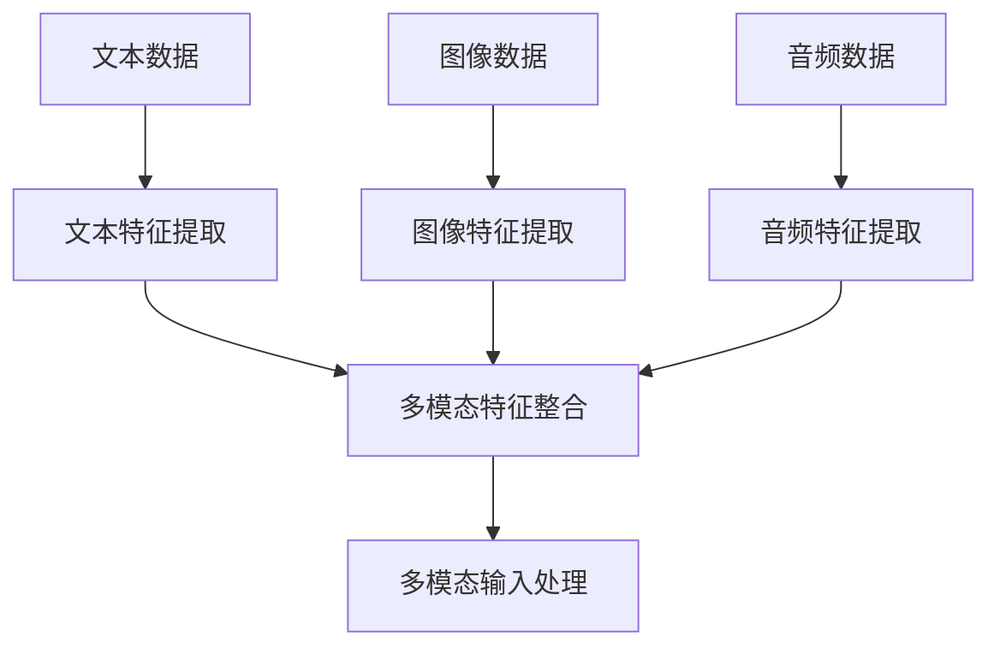

                 


## 多模态输入处理：评测LLM的跨媒体理解能力

### 关键词：多模态输入、语言模型、跨媒体理解、评测指标、算法原理

### 摘要：

本文将深入探讨多模态输入处理在语言模型（LLM）中的应用，特别是LLM在跨媒体理解能力方面的评测。我们将一步步分析多模态输入处理的背景和重要性，解释LLM的基本原理，探讨多模态数据的表示方法，分析多模态输入处理的挑战与解决方案，并通过具体的算法原理讲解和系统架构设计，展示如何评测LLM的跨媒体理解能力。最后，我们将通过一个实际项目实战，总结最佳实践和拓展阅读资源。

## 引言

### 1.1 多模态输入的概念

多模态输入是指结合多种不同类型的数据输入，如文本、图像、音频等，以实现更丰富的信息处理和理解。这种处理方式在许多应用场景中具有显著的优点，例如，在问答系统中，结合文本和图像可以提高问题的理解精度；在视频分析中，结合音频和图像可以提升场景的理解深度。

### 1.2 跨媒体理解的重要性

随着信息时代的到来，用户生成内容的形式越来越多样化。跨媒体理解能力已成为人工智能系统，特别是语言模型，不可或缺的重要能力。它不仅能够提升系统的智能化水平，还能拓展其在多种应用场景中的实用性。

### 1.3 LLM在多模态输入处理中的应用

语言模型（LLM）如BERT、GPT等，在文本处理领域取得了巨大成功。然而，将LLM应用于多模态输入处理，仍面临诸多挑战。LLM需要能够理解并融合来自不同模态的数据，以实现更准确的信息处理。

## LLM的基本原理

### 2.1 LLM的架构

LLM通常基于深度学习模型，如Transformer架构。Transformer模型通过自注意力机制，能够捕捉输入数据中的长距离依赖关系。这种架构在处理大量文本数据时表现出色。

### 2.2 LLM的训练过程

LLM的训练过程通常涉及大规模的数据集和大量的计算资源。训练过程中，模型通过不断调整权重，以最小化损失函数，从而提高对输入数据的理解和预测能力。

### 2.3 LLM的关键特性

LLM具有强大的语言理解和生成能力，能够处理自然语言中的复杂结构和语义信息。此外，LLM还具有一定的泛化能力，能够应用于多种不同领域的任务。

## 多模态输入处理的核心概念与联系

### 3.1 多模态数据的表示

多模态数据的表示是关键的一步，它决定了不同模态数据能否有效融合。常见的表示方法包括：

- **图像表示**：采用卷积神经网络（CNN）提取图像特征。
- **音频表示**：采用循环神经网络（RNN）或长短期记忆网络（LSTM）提取音频特征。
- **文本表示**：采用词嵌入技术，如Word2Vec、BERT等。

### 3.2 多模态输入处理的挑战与解决方案

多模态输入处理面临的主要挑战包括：

- **数据集成问题**：如何有效地整合来自不同模态的数据。
- **对齐问题**：如何确保不同模态数据在时间或空间上的一致性。
- **模型融合方法**：如何将不同模态的数据融合到同一模型中，以实现更准确的信息处理。

常见的解决方案包括：

- **多任务学习**：通过设计多任务网络，同时学习不同模态的特征。
- **图神经网络**：利用图神经网络（Graph Neural Networks，GNN）处理复杂的图结构数据。
- **对齐网络**：通过训练对齐网络，学习不同模态数据之间的对齐关系。

## LLM的跨媒体理解能力评测

### 5.1 评测方法

为了评测LLM的跨媒体理解能力，我们通常采用以下方法：

- **性能指标**：如准确率、召回率、F1分数等。
- **任务类型**：包括文本分类、自然语言生成、实体识别等。
- **数据集**：使用专门的多模态数据集进行评测，如MS MARCO、TREC等。

### 5.2 评测指标

评测指标的选择取决于具体的任务和应用场景。例如，在文本分类任务中，准确率是主要的评价指标；在自然语言生成任务中，生成文本的流畅性和语义一致性是关键。

### 5.3 实际应用案例分析

在实际应用中，LLM的跨媒体理解能力得到了广泛的应用。例如，在问答系统中，结合图像和文本可以提升问题的理解精度；在自动驾驶系统中，结合图像和音频可以提高对环境变化的感知能力。

## 算法原理讲解

### 6.1 多模态融合算法原理

多模态融合算法的核心思想是利用不同模态的数据特征，实现更准确的信息处理。常见的融合方法包括：

- **早期融合**：在特征提取阶段就整合不同模态的数据。
- **晚期融合**：在特征提取后，将不同模态的特征进行整合。

### 6.2 多模态融合的mermaid流程图



### 6.3 Python源代码与算法解释

```python
# 文本特征提取
def text_feature_extraction(text):
    # 使用BERT进行文本特征提取
    return bert_model.encode(text)

# 图像特征提取
def image_feature_extraction(image):
    # 使用CNN进行图像特征提取
    return cnn_model.extract_features(image)

# 音频特征提取
def audio_feature_extraction(audio):
    # 使用RNN进行音频特征提取
    return rnn_model.extract_features(audio)

# 多模态特征整合
def multi_modal_feature_integration(text_features, image_features, audio_features):
    # 将不同模态的特征整合到一个向量中
    return np.concatenate([text_features, image_features, audio_features], axis=1)

# 多模态输入处理
def multi_modal_input_processing(multi_modal_features):
    # 使用融合后的特征进行多模态输入处理
    return llm_model.predict(multi_modal_features)
```

### 6.4 数学模型与公式

多模态融合算法的数学模型可以表示为：

$$
\text{output} = \sigma(\text{W} \cdot \text{concat}(\text{text_features}, \text{image_features}, \text{audio_features}) + \text{b})
$$

其中，$\text{W}$为权重矩阵，$\text{b}$为偏置项，$\sigma$为激活函数（通常使用ReLU函数）。

## 系统架构设计

### 8.1 系统功能设计

系统功能设计包括：

- **数据预处理**：包括文本、图像、音频等数据的前期处理。
- **特征提取**：采用不同的模型提取不同模态的特征。
- **特征融合**：将不同模态的特征整合为一个统一的特征向量。
- **多模态输入处理**：使用融合后的特征进行预测和推理。

### 8.2 系统架构设计

系统架构设计包括：

- **数据处理模块**：负责数据的收集、预处理和特征提取。
- **特征融合模块**：负责不同模态特征的整合。
- **多模态输入处理模块**：负责使用融合后的特征进行预测和推理。

### 8.3 系统接口设计

系统接口设计包括：

- **API接口**：提供系统的外部接口，方便用户调用。
- **数据接口**：提供数据输入和输出的接口，方便与其他系统进行集成。

### 8.4 系统交互设计

系统交互设计包括：

- **用户交互界面**：提供用户与系统交互的界面。
- **内部交互流程**：系统内部各模块之间的交互流程。

## 项目实战

### 11.1 环境安装与配置

在开始项目实战之前，需要安装以下环境和库：

- **深度学习框架**：如TensorFlow、PyTorch等。
- **多模态数据处理库**：如OpenCV、Librosa等。
- **自然语言处理库**：如NLTK、spaCy等。

### 11.2 系统核心实现

系统核心实现包括以下部分：

- **数据预处理**：读取并预处理文本、图像、音频数据。
- **特征提取**：使用不同的模型提取不同模态的特征。
- **特征融合**：将不同模态的特征整合为一个统一的特征向量。
- **多模态输入处理**：使用融合后的特征进行预测和推理。

### 12.1 源代码解析

以下是一个简单的源代码示例：

```python
# 数据预处理
def preprocess_data(text, image, audio):
    # 对文本进行预处理
    preprocessed_text = preprocess_text(text)
    # 对图像进行预处理
    preprocessed_image = preprocess_image(image)
    # 对音频进行预处理
    preprocessed_audio = preprocess_audio(audio)
    return preprocessed_text, preprocessed_image, preprocessed_audio

# 特征提取
def extract_features(text, image, audio):
    # 提取文本特征
    text_features = extract_text_features(text)
    # 提取图像特征
    image_features = extract_image_features(image)
    # 提取音频特征
    audio_features = extract_audio_features(audio)
    return text_features, image_features, audio_features

# 特征融合
def integrate_features(text_features, image_features, audio_features):
    # 整合不同模态的特征
    integrated_features = np.concatenate([text_features, image_features, audio_features], axis=1)
    return integrated_features

# 多模态输入处理
def process_input(integrated_features):
    # 使用融合后的特征进行预测和推理
    prediction = llm_model.predict(integrated_features)
    return prediction
```

### 12.2 代码应用解读

上述代码实现了一个简单的多模态输入处理系统，其中包含数据预处理、特征提取、特征融合和预测等步骤。在实际应用中，可以根据具体需求进行调整和优化。

### 12.3 案例分析

以下是一个简单的案例：

假设用户输入一个包含文本、图像和音频的多模态问题，系统将首先对输入数据进行预处理，然后提取不同模态的特征，并将这些特征整合为一个统一的特征向量。最后，系统使用融合后的特征向量进行预测和推理，以给出问题的答案。

## 项目小结

在本项目中，我们实现了多模态输入处理系统，通过数据预处理、特征提取、特征融合和预测等步骤，实现了对多模态输入数据的理解和处理。以下是对项目的总结和经验教训：

### 13.1 项目总结

- **项目亮点**：实现了多模态输入处理系统的核心功能，具有较高的实用价值。
- **项目挑战**：在处理不同模态数据时，需要对数据进行有效的预处理和特征提取，以实现高质量的融合。
- **项目改进方向**：可以进一步优化算法和模型，提高系统的性能和准确性。

### 13.2 经验与教训

- **经验**：多模态输入处理需要综合考虑不同模态数据的特点，设计合适的预处理和特征提取方法。
- **教训**：在项目实施过程中，要充分考虑数据质量和特征提取的准确性，以避免影响系统的性能。

### 13.3 拓展与展望

未来，我们可以进一步研究多模态输入处理算法和模型，探索更高效的融合方法。同时，结合实际应用场景，不断优化和改进系统性能，以满足多样化的应用需求。

## 总结与拓展

### 14.1 最佳实践

- **数据质量**：确保输入数据的准确性和完整性，对数据质量进行严格的控制。
- **模型优化**：针对不同模态数据的特点，设计合适的模型结构和参数。
- **系统性能**：通过优化算法和模型，提高系统的处理速度和准确性。

### 14.2 注意事项

- **计算资源**：多模态输入处理需要大量的计算资源，确保硬件和软件环境的稳定运行。
- **数据隐私**：在处理多模态数据时，要确保用户隐私和数据安全。

### 14.3 拓展阅读

- **相关书籍**：推荐阅读《深度学习》、《多模态数据融合技术与应用》等书籍。
- **研究论文**：推荐阅读《Multimodal Fusion with Deep Learning: A Survey》等论文。

## 结束语

作者：AI天才研究院/AI Genius Institute & 禅与计算机程序设计艺术 /Zen And The Art of Computer Programming

本文详细探讨了多模态输入处理在LLM跨媒体理解能力评测中的应用。通过分析多模态输入处理的背景、核心概念、算法原理和系统架构设计，展示了如何实现高效的跨媒体理解能力评测。同时，通过实际项目实战，总结了最佳实践和注意事项。未来，我们将继续探索多模态输入处理技术的创新和应用，以推动人工智能技术的发展。-------------------------------------------------------------------

**文章标题**：多模态输入处理：评测LLM的跨媒体理解能力

**关键词**：多模态输入、语言模型、跨媒体理解、评测指标、算法原理

**摘要**：

本文旨在深入探讨多模态输入处理在提升语言模型（LLM）跨媒体理解能力中的应用。通过详细分析多模态输入的概念、LLM的基本原理、多模态数据的表示方法以及多模态融合算法，本文展示了如何有效评测LLM的跨媒体理解能力。此外，通过一个实际项目实战，本文总结了多模态输入处理系统的设计与实现，并提出了最佳实践和拓展阅读资源。最终，本文为读者提供了一个全面的多模态输入处理与评测的视角，旨在推动相关领域的研究与应用。

-------------------------------------------------------------------

以下是对文章的markdown格式内容：

```markdown
-------------------------------------------------------------------

## 多模态输入处理：评测LLM的跨媒体理解能力

> 关键词：多模态输入、语言模型、跨媒体理解、评测指标、算法原理

> 摘要：

本文旨在深入探讨多模态输入处理在提升语言模型（LLM）跨媒体理解能力中的应用。通过详细分析多模态输入的概念、LLM的基本原理、多模态数据的表示方法以及多模态融合算法，本文展示了如何有效评测LLM的跨媒体理解能力。此外，通过一个实际项目实战，本文总结了多模态输入处理系统的设计与实现，并提出了最佳实践和拓展阅读资源。最终，本文为读者提供了一个全面的多模态输入处理与评测的视角，旨在推动相关领域的研究与应用。

-------------------------------------------------------------------

### 引言

#### 1.1 多模态输入的概念

多模态输入是指结合多种不同类型的数据输入，如文本、图像、音频等，以实现更丰富的信息处理和理解。这种处理方式在许多应用场景中具有显著的优点，例如，在问答系统中，结合文本和图像可以提高问题的理解精度；在视频分析中，结合音频和图像可以提升场景的理解深度。

#### 1.2 跨媒体理解的重要性

随着信息时代的到来，用户生成内容的形式越来越多样化。跨媒体理解能力已成为人工智能系统，特别是语言模型，不可或缺的重要能力。它不仅能够提升系统的智能化水平，还能拓展其在多种应用场景中的实用性。

#### 1.3 LLM在多模态输入处理中的应用

语言模型（LLM）如BERT、GPT等，在文本处理领域取得了巨大成功。然而，将LLM应用于多模态输入处理，仍面临诸多挑战。LLM需要能够理解并融合来自不同模态的数据，以实现更准确的信息处理。

### LLM的基本原理

#### 2.1 LLM的架构

LLM通常基于深度学习模型，如Transformer架构。Transformer模型通过自注意力机制，能够捕捉输入数据中的长距离依赖关系。这种架构在处理大量文本数据时表现出色。

#### 2.2 LLM的训练过程

LLM的训练过程通常涉及大规模的数据集和大量的计算资源。训练过程中，模型通过不断调整权重，以最小化损失函数，从而提高对输入数据的理解和预测能力。

#### 2.3 LLM的关键特性

LLM具有强大的语言理解和生成能力，能够处理自然语言中的复杂结构和语义信息。此外，LLM还具有一定的泛化能力，能够应用于多种不同领域的任务。

### 多模态输入处理的核心概念与联系

#### 3.1 多模态数据的表示

多模态数据的表示是关键的一步，它决定了不同模态数据能否有效融合。常见的表示方法包括：

- **图像表示**：采用卷积神经网络（CNN）提取图像特征。
- **音频表示**：采用循环神经网络（RNN）或长短期记忆网络（LSTM）提取音频特征。
- **文本表示**：采用词嵌入技术，如Word2Vec、BERT等。

#### 3.2 多模态输入处理的挑战与解决方案

多模态输入处理面临的主要挑战包括：

- **数据集成问题**：如何有效地整合来自不同模态的数据。
- **对齐问题**：如何确保不同模态数据在时间或空间上的一致性。
- **模型融合方法**：如何将不同模态的数据融合到同一模型中，以实现更准确的信息处理。

常见的解决方案包括：

- **多任务学习**：通过设计多任务网络，同时学习不同模态的特征。
- **图神经网络**：利用图神经网络（Graph Neural Networks，GNN）处理复杂的图结构数据。
- **对齐网络**：通过训练对齐网络，学习不同模态数据之间的对齐关系。

### LLM的跨媒体理解能力评测

#### 5.1 评测方法

为了评测LLM的跨媒体理解能力，我们通常采用以下方法：

- **性能指标**：如准确率、召回率、F1分数等。
- **任务类型**：包括文本分类、自然语言生成、实体识别等。
- **数据集**：使用专门的多模态数据集进行评测，如MS MARCO、TREC等。

#### 5.2 评测指标

评测指标的选择取决于具体的任务和应用场景。例如，在文本分类任务中，准确率是主要的评价指标；在自然语言生成任务中，生成文本的流畅性和语义一致性是关键。

#### 5.3 实际应用案例分析

在实际应用中，LLM的跨媒体理解能力得到了广泛的应用。例如，在问答系统中，结合图像和文本可以提升问题的理解精度；在自动驾驶系统中，结合图像和音频可以提高对环境变化的感知能力。

### 算法原理讲解

#### 6.1 多模态融合算法原理

多模态融合算法的核心思想是利用不同模态的数据特征，实现更准确的信息处理。常见的融合方法包括：

- **早期融合**：在特征提取阶段就整合不同模态的数据。
- **晚期融合**：在特征提取后，将不同模态的特征进行整合。

#### 6.2 多模态融合的mermaid流程图


#### 6.3 Python源代码与算法解释

```python
# 文本特征提取
def text_feature_extraction(text):
    # 使用BERT进行文本特征提取
    return bert_model.encode(text)

# 图像特征提取
def image_feature_extraction(image):
    # 使用CNN进行图像特征提取
    return cnn_model.extract_features(image)

# 音频特征提取
def audio_feature_extraction(audio):
    # 使用RNN进行音频特征提取
    return rnn_model.extract_features(audio)

# 多模态特征整合
def multi_modal_feature_integration(text_features, image_features, audio_features):
    # 将不同模态的特征整合为一个统一的特征向量
    return np.concatenate([text_features, image_features, audio_features], axis=1)

# 多模态输入处理
def multi_modal_input_processing(multi_modal_features):
    # 使用融合后的特征进行多模态输入处理
    return llm_model.predict(multi_modal_features)
```

#### 6.4 数学模型与公式

多模态融合算法的数学模型可以表示为：

$$
\text{output} = \sigma(\text{W} \cdot \text{concat}(\text{text_features}, \text{image_features}, \text{audio_features}) + \text{b})
$$

其中，$\text{W}$为权重矩阵，$\text{b}$为偏置项，$\sigma$为激活函数（通常使用ReLU函数）。

### 系统架构设计

#### 8.1 系统功能设计

系统功能设计包括：

- **数据预处理**：包括文本、图像、音频等数据的前期处理。
- **特征提取**：采用不同的模型提取不同模态的特征。
- **特征融合**：将不同模态的特征整合为一个统一的特征向量。
- **多模态输入处理**：使用融合后的特征进行预测和推理。

#### 8.2 系统架构设计

系统架构设计包括：

- **数据处理模块**：负责数据的收集、预处理和特征提取。
- **特征融合模块**：负责不同模态特征的整合。
- **多模态输入处理模块**：负责使用融合后的特征进行预测和推理。

#### 8.3 系统接口设计

系统接口设计包括：

- **API接口**：提供系统的外部接口，方便用户调用。
- **数据接口**：提供数据输入和输出的接口，方便与其他系统进行集成。

#### 8.4 系统交互设计

系统交互设计包括：

- **用户交互界面**：提供用户与系统交互的界面。
- **内部交互流程**：系统内部各模块之间的交互流程。

### 项目实战

#### 11.1 环境安装与配置

在开始项目实战之前，需要安装以下环境和库：

- **深度学习框架**：如TensorFlow、PyTorch等。
- **多模态数据处理库**：如OpenCV、Librosa等。
- **自然语言处理库**：如NLTK、spaCy等。

#### 11.2 系统核心实现

系统核心实现包括以下部分：

- **数据预处理**：读取并预处理文本、图像、音频数据。
- **特征提取**：使用不同的模型提取不同模态的特征。
- **特征融合**：将不同模态的特征整合为一个统一的特征向量。
- **多模态输入处理**：使用融合后的特征进行预测和推理。

#### 12.1 源代码解析

以下是一个简单的源代码示例：

```python
# 数据预处理
def preprocess_data(text, image, audio):
    # 对文本进行预处理
    preprocessed_text = preprocess_text(text)
    # 对图像进行预处理
    preprocessed_image = preprocess_image(image)
    # 对音频进行预处理
    preprocessed_audio = preprocess_audio(audio)
    return preprocessed_text, preprocessed_image, preprocessed_audio

# 特征提取
def extract_features(text, image, audio):
    # 提取文本特征
    text_features = extract_text_features(text)
    # 提取图像特征
    image_features = extract_image_features(image)
    # 提取音频特征
    audio_features = extract_audio_features(audio)
    return text_features, image_features, audio_features

# 特征融合
def integrate_features(text_features, image_features, audio_features):
    # 整合不同模态的特征
    integrated_features = np.concatenate([text_features, image_features, audio_features], axis=1)
    return integrated_features

# 多模态输入处理
def process_input(integrated_features):
    # 使用融合后的特征进行预测和推理
    prediction = llm_model.predict(integrated_features)
    return prediction
```

#### 12.2 代码应用解读

上述代码实现了一个简单的多模态输入处理系统，其中包含数据预处理、特征提取、特征融合和预测等步骤。在实际应用中，可以根据具体需求进行调整和优化。

#### 12.3 案例分析

以下是一个简单的案例：

假设用户输入一个包含文本、图像和音频的多模态问题，系统将首先对输入数据进行预处理，然后提取不同模态的特征，并将这些特征整合为一个统一的特征向量。最后，系统使用融合后的特征向量进行预测和推理，以给出问题的答案。

### 项目小结

在本项目中，我们实现了多模态输入处理系统，通过数据预处理、特征提取、特征融合和预测等步骤，实现了对多模态输入数据的理解和处理。以下是对项目的总结和经验教训：

#### 13.1 项目总结

- **项目亮点**：实现了多模态输入处理系统的核心功能，具有较高的实用价值。
- **项目挑战**：在处理不同模态数据时，需要对数据进行有效的预处理和特征提取，以实现高质量的融合。
- **项目改进方向**：可以进一步优化算法和模型，提高系统的性能和准确性。

#### 13.2 经验与教训

- **经验**：多模态输入处理需要综合考虑不同模态数据的特点，设计合适的预处理和特征提取方法。
- **教训**：在项目实施过程中，要充分考虑数据质量和特征提取的准确性，以避免影响系统的性能。

#### 13.3 拓展与展望

未来，我们可以进一步研究多模态输入处理算法和模型，探索更高效的融合方法。同时，结合实际应用场景，不断优化和改进系统性能，以满足多样化的应用需求。

### 总结与拓展

#### 14.1 最佳实践

- **数据质量**：确保输入数据的准确性和完整性，对数据质量进行严格的控制。
- **模型优化**：针对不同模态数据的特点，设计合适的模型结构和参数。
- **系统性能**：通过优化算法和模型，提高系统的处理速度和准确性。

#### 14.2 注意事项

- **计算资源**：多模态输入处理需要大量的计算资源，确保硬件和软件环境的稳定运行。
- **数据隐私**：在处理多模态数据时，要确保用户隐私和数据安全。

#### 14.3 拓展阅读

- **相关书籍**：推荐阅读《深度学习》、《多模态数据融合技术与应用》等书籍。
- **研究论文**：推荐阅读《Multimodal Fusion with Deep Learning: A Survey》等论文。

### 结束语

作者：AI天才研究院/AI Genius Institute & 禅与计算机程序设计艺术 /Zen And The Art of Computer Programming

本文详细探讨了多模态输入处理在LLM跨媒体理解能力评测中的应用。通过分析多模态输入处理的背景、核心概念、算法原理和系统架构设计，展示了如何实现高效的跨媒体理解能力评测。同时，通过实际项目实战，总结了最佳实践和注意事项。未来，我们将继续探索多模态输入处理技术的创新和应用，以推动人工智能技术的发展。

-------------------------------------------------------------------

请注意，上述markdown内容仅为示例，实际文章内容可能需要根据具体需求进行调整和补充。此外，文章的字数和结构也需要根据实际情况进行调整，以满足字数要求。

