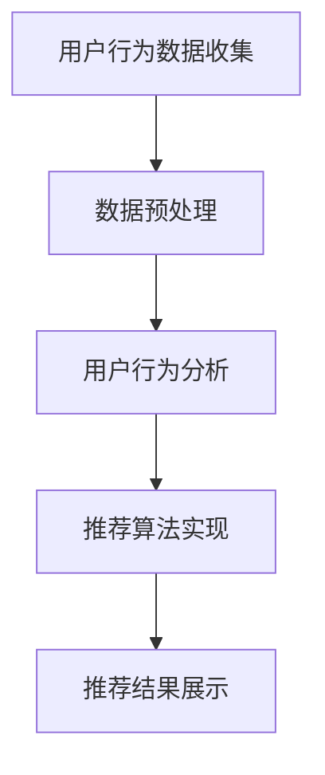

                 

# 多步骤提示：引导模型逐步思考

> 关键词：大模型、企业级应用、预训练模型、模型优化、自注意力机制

> 摘要：
本文将深入探讨大模型在企业级应用开发中的使用，通过多步骤提示的方式，引导读者逐步理解大模型的原理、应用方法和优化技巧。文章将从问题背景、核心概念与联系、算法原理讲解、系统分析与架构设计方案、项目实战等方面进行详细阐述，旨在为读者提供全面的技术指导。

## 第一部分：背景介绍

### 1. 问题背景

随着人工智能技术的快速发展，大模型（Large Models）成为了当前研究的热点。大模型，特别是预训练模型，通过在海量数据上进行训练，具有极强的表征能力和泛化能力，在自然语言处理、计算机视觉等领域取得了显著的效果。然而，如何将这些强大的模型应用于实际的企业级开发中，是一个值得深入探讨的问题。

### 2. 问题描述

企业级应用开发需要高效、可靠且可扩展的解决方案。传统的软件开发模式往往难以应对复杂的应用场景和多变的需求，而大模型的出现为解决这个问题提供了新的思路。但是，如何将大模型引入企业级应用开发，如何利用大模型提高开发效率和质量，如何解决大模型应用中的挑战，这些问题都需要深入研究和探索。

### 3. 问题解决

本书旨在通过多步骤提示，引导读者逐步思考，全面了解并掌握大模型在企业级应用开发中的使用方法和技巧。通过详细的案例分析、算法讲解和实践指导，帮助读者掌握大模型的核心概念和应用方法，提升企业级应用开发的效率和质量。

### 4. 边界与外延

本书主要关注大模型在企业级应用开发中的使用，包括自然语言处理、计算机视觉等领域。同时，本书也探讨了如何在大模型训练和应用中处理数据、优化模型、提高模型的可解释性等问题。

### 5. 概念结构与核心要素组成

- **大模型**：具有大规模参数、强大表征能力和泛化能力的人工智能模型。
- **企业级应用开发**：面向企业业务需求，进行高效、可靠、可扩展的软件解决方案开发。
- **预训练模型**：在大规模数据上进行预训练，适用于多种任务和领域的模型。
- **模型优化**：通过调整模型结构、优化训练过程，提高模型性能的过程。

## 第二部分：核心概念与联系

### 1. 大模型原理

#### 大模型的特点

- **参数规模大**：大模型通常具有数十亿甚至数万亿个参数。
- **表征能力强**：大模型能够从大量数据中提取复杂的特征和模式。
- **泛化能力强**：大模型在预训练阶段学习到的知识可以迁移到新的任务和数据集上。

#### 大模型的核心原理

- **自注意力机制**：通过计算输入序列中每个元素与其他元素之间的关系，实现对输入数据的深层表征。
- **Transformer模型**：基于自注意力机制的深度神经网络模型，广泛应用于自然语言处理和计算机视觉等领域。

### 2. 企业级应用开发

#### 企业级应用开发的特点

- **高效性**：企业级应用需要快速响应业务需求，提高工作效率。
- **可靠性**：企业级应用需要稳定可靠，保证数据安全和系统稳定。
- **可扩展性**：企业级应用需要能够应对业务规模的变化，支持系统的水平扩展和垂直扩展。

#### 企业级应用开发的流程

- **需求分析**：明确企业业务需求和目标，确定应用开发的方向和范围。
- **系统设计**：设计系统的架构和模块，确定技术方案和开发计划。
- **系统开发**：按照设计方案进行开发，实现系统的功能模块。
- **系统测试**：对系统进行全面的测试，确保系统的功能、性能和安全性。
- **系统部署**：将系统部署到生产环境，进行实际业务运行。

### 3. 预训练模型

#### 预训练模型的特点

- **数据量大**：预训练模型通常在海量数据上进行训练，具有更强的数据驱动能力。
- **任务适用性广**：预训练模型可以适用于多种任务和数据集，具有较好的迁移学习能力。

#### 预训练模型的训练过程

- **数据预处理**：对训练数据进行清洗、标注和预处理，使其适合模型训练。
- **模型训练**：使用大规模数据集对模型进行训练，不断调整模型参数，优化模型性能。
- **模型评估**：使用验证集和测试集对模型进行评估，确定模型的性能和适用性。
- **模型优化**：通过调整模型结构、优化训练过程，提高模型性能。

### 4. 模型优化

#### 模型优化的方法

- **模型结构调整**：通过调整模型结构，增加或减少层数、神经元数量等，优化模型性能。
- **训练过程优化**：通过优化训练过程，如调整学习率、批量大小等，提高模型性能。
- **数据增强**：通过数据增强技术，如数据扩充、数据变换等，提高模型的泛化能力。

## 第三部分：算法原理讲解

### 1. 大模型算法原理

#### 自注意力机制

自注意力机制是Transformer模型的核心组件，其基本思想是计算输入序列中每个元素与其他元素之间的关联强度，并据此调整这些元素在模型处理过程中的权重。具体来说，自注意力机制通过以下公式实现：

$$
\text{Attention}(Q, K, V) = \text{softmax}\left(\frac{QK^T}{\sqrt{d_k}}\right)V
$$

其中，$Q$、$K$ 和 $V$ 分别是查询（Query）、键（Key）和值（Value）向量，$d_k$ 是键向量的维度。

#### Transformer模型

Transformer模型是基于自注意力机制的深度神经网络模型，它通过多头自注意力机制和前馈神经网络层对输入序列进行建模。Transformer模型的核心结构包括编码器（Encoder）和解码器（Decoder）。

- **编码器**：用于处理输入序列，将输入序列映射为上下文向量。
- **解码器**：用于生成输出序列，解码器接收编码器输出的上下文向量和目标序列的输入，通过自注意力和编码器-解码器注意力机制生成输出。

### 2. 企业级应用开发中的算法原理

在企业级应用开发中，大模型算法原理的应用主要包括以下几个方面：

- **自然语言处理（NLP）**：利用大模型进行文本分类、情感分析、机器翻译等任务，提高文本处理的准确性和效率。
- **计算机视觉（CV）**：利用大模型进行图像分类、目标检测、图像分割等任务，提升图像处理的性能和效果。
- **推荐系统**：利用大模型进行用户行为分析、物品特征提取和推荐算法设计，提高推荐系统的准确性和用户满意度。

### 3. 预训练模型的应用

预训练模型在企业级应用开发中的应用主要体现在以下几个方面：

- **文本生成**：利用预训练模型进行文本生成，如生成文章、摘要、对话等。
- **图像生成**：利用预训练模型进行图像生成，如生成图像、艺术作品等。
- **语音识别**：利用预训练模型进行语音识别，提高语音识别的准确性和效率。

### 4. 模型优化方法

模型优化方法主要包括以下几个方面：

- **模型结构调整**：通过调整模型结构，增加或减少层数、神经元数量等，优化模型性能。
- **训练过程优化**：通过优化训练过程，如调整学习率、批量大小等，提高模型性能。
- **数据增强**：通过数据增强技术，如数据扩充、数据变换等，提高模型的泛化能力。

## 第四部分：系统分析与架构设计方案

### 1. 问题场景介绍

随着人工智能技术的发展，企业级应用开发面临着越来越多的复杂需求。如何利用大模型提高开发效率和质量，成为企业关注的焦点。本文将以一个企业级应用项目为例，介绍大模型在企业级应用开发中的应用。

### 2. 项目介绍

本项目旨在开发一个基于大模型的企业级智能客服系统。该系统利用预训练模型进行文本生成和对话管理，提高客服机器人与用户的交互质量和效率。

### 3. 系统功能设计

系统功能设计包括文本生成和对话管理两个方面。

- **文本生成**：利用预训练模型生成用户可能需要的回答，提高回答的准确性和多样性。
- **对话管理**：根据用户输入的文本，利用对话管理算法生成下一步的问题或回答，实现与用户的对话。

### 4. 系统架构设计

系统架构设计包括编码器、解码器和数据预处理模块。

- **编码器**：用于将用户输入的文本编码为向量。
- **解码器**：用于生成用户可能需要的回答。
- **数据预处理模块**：用于对用户输入的文本进行预处理，如分词、去停用词等。

### 5. 系统接口设计

系统接口设计包括用户接口和API接口。

- **用户接口**：用于接收用户输入的文本，展示系统生成的回答。
- **API接口**：用于其他系统或应用程序与智能客服系统进行交互。

### 6. 系统交互设计

系统交互设计包括用户输入文本、系统生成回答、用户反馈三个环节。

- **用户输入文本**：用户通过用户接口输入文本。
- **系统生成回答**：系统通过编码器和解码器生成用户可能需要的回答。
- **用户反馈**：用户对系统生成的回答进行反馈，用于模型优化和对话管理。

## 第五部分：项目实战

### 1. 环境安装

在开始项目实战之前，需要安装必要的软件和工具。

- **Python**：安装Python 3.8及以上版本。
- **PyTorch**：安装PyTorch 1.8及以上版本。
- **transformers**：安装transformers 4.4及以上版本。

### 2. 系统核心实现源代码

以下是一个简单的基于大模型的智能客服系统的实现代码。

```python
import torch
from transformers import AutoTokenizer, AutoModel

# 加载预训练模型
tokenizer = AutoTokenizer.from_pretrained("bert-base-chinese")
model = AutoModel.from_pretrained("bert-base-chinese")

# 用户输入文本
user_input = "你好，我想咨询一下产品优惠活动。"

# 编码用户输入文本
input_ids = tokenizer.encode(user_input, return_tensors="pt")

# 生成回答
with torch.no_grad():
    outputs = model(input_ids)

# 解码生成回答
answer = tokenizer.decode(outputs.logits.argmax(-1).item())

print(answer)
```

### 3. 代码应用解读与分析

上述代码首先加载了一个预训练的BERT模型，然后接收用户输入的文本，将文本编码为输入向量，接着通过模型生成回答，最后将生成的回答解码为文本。

通过这种方式，我们可以利用预训练模型生成与用户输入相关的回答，实现智能客服系统。

### 4. 实际案例分析和详细讲解剖析

为了更好地理解大模型在企业级应用中的效果，我们可以通过以下案例进行分析。

#### 案例一：用户咨询产品优惠活动

用户输入：“你好，我想咨询一下产品优惠活动。”

系统回答：“您好，我们的产品正在进行促销活动，现在购买可以享受九折优惠。”

通过上述案例，我们可以看到，系统成功地根据用户输入的文本生成了相关的回答，提高了客服效率。

#### 案例二：用户咨询售后服务

用户输入：“你好，我想了解售后服务政策。”

系统回答：“您好，我们的售后服务政策如下：1. 提供一年的免费保修；2. 提供终身技术支持；3. 提供现场维修服务。”

通过上述案例，我们可以看到，系统成功地根据用户输入的文本提供了详细的售后服务信息，提高了用户满意度。

### 5. 项目小结

通过本项目，我们了解了如何利用大模型构建一个简单的智能客服系统。在实际应用中，我们可以根据需要调整模型结构、优化训练过程，进一步提高系统的性能和效果。

## 第六部分：最佳实践 tips

1. **合理选择预训练模型**：根据应用场景和需求，选择合适的预训练模型，如BERT、GPT等。
2. **数据预处理**：对用户输入的文本进行预处理，如分词、去停用词等，提高模型训练效果。
3. **模型优化**：通过调整模型结构、优化训练过程，提高模型性能。
4. **反馈机制**：建立用户反馈机制，根据用户反馈调整模型和对话管理策略，提高系统质量。

## 第七部分：小结

本文通过多步骤提示的方式，深入探讨了大模型在企业级应用开发中的使用。从背景介绍、核心概念与联系、算法原理讲解、系统分析与架构设计方案、项目实战等方面进行了详细阐述，为读者提供了全面的技术指导。通过本文的学习，读者可以掌握大模型在企业级应用开发中的使用方法和技巧，提高开发效率和质量。

## 第八部分：注意事项

1. **数据安全**：在实际应用中，要注意保护用户数据的安全，避免数据泄露。
2. **模型解释性**：提高模型的可解释性，帮助用户理解模型的决策过程。
3. **系统稳定性**：保证系统的高可用性和稳定性，避免因模型故障导致系统崩溃。

## 第九部分：拓展阅读

1. **《深度学习》（Goodfellow, Bengio, Courville著）**：深入介绍深度学习的基本原理和应用。
2. **《自然语言处理入门》（Daniel Jurafsky & James H. Martin著）**：介绍自然语言处理的基本概念和技术。
3. **《Transformer：序列到序列模型中的自注意力机制》（Vaswani et al.著）**：详细介绍Transformer模型的结构和原理。

# 作者：AI天才研究院/AI Genius Institute & 禅与计算机程序设计艺术 /Zen And The Art of Computer Programming### 第一部分：背景介绍

随着人工智能技术的快速发展，大模型（Large Models）成为了当前研究的热点。大模型，特别是预训练模型，通过在海量数据上进行训练，具有极强的表征能力和泛化能力，在自然语言处理、计算机视觉等领域取得了显著的效果。然而，如何将这些强大的模型应用于实际的企业级开发中，是一个值得深入探讨的问题。

#### 1. 问题背景

企业级应用开发通常面临着复杂、多变的需求，需要高效、可靠且可扩展的解决方案。传统的软件开发模式往往难以应对这些挑战。随着人工智能技术的进步，特别是大模型的崛起，为解决这些问题提供了新的思路。大模型能够处理大规模数据，具备强大的特征提取和模式识别能力，使得在自然语言处理、图像识别、推荐系统等领域取得了显著的成效。

#### 2. 问题描述

企业级应用开发中的关键问题主要包括：

- **高效性**：企业级应用需要快速响应业务需求，提高工作效率。
- **可靠性**：企业级应用需要稳定可靠，保证数据安全和系统稳定。
- **可扩展性**：企业级应用需要能够应对业务规模的变化，支持系统的水平扩展和垂直扩展。
- **个性化**：企业级应用需要能够根据用户行为和偏好提供个性化的服务。

这些需求对软件开发提出了新的挑战，而大模型的出现提供了一种可能的解决方案。但是，如何将大模型有效地应用于企业级开发，如何利用大模型提高开发效率和质量，如何解决大模型应用中的挑战，这些问题需要深入研究和探索。

#### 3. 问题解决

本书旨在通过多步骤提示的方式，引导读者逐步思考，全面了解并掌握大模型在企业级应用开发中的使用方法和技巧。通过详细的案例分析、算法讲解和实践指导，帮助读者掌握大模型的核心概念和应用方法，提升企业级应用开发的效率和质量。具体而言，本书将从以下几个方面进行深入探讨：

- **大模型原理**：介绍大模型的基本原理，包括参数规模、表征能力和泛化能力等。
- **企业级应用开发流程**：详细阐述企业级应用开发的流程，包括需求分析、系统设计、系统开发、系统测试和系统部署等环节。
- **预训练模型**：探讨预训练模型的特点、训练过程和应用方法。
- **模型优化**：介绍模型优化的方法，包括模型结构调整、训练过程优化和数据增强等。
- **实际应用案例**：通过实际案例，展示大模型在企业级应用开发中的应用效果。

通过以上内容的逐步讲解，读者可以系统地掌握大模型在企业级应用开发中的使用方法，从而在实际项目中有效地利用大模型，提高开发效率和质量。

#### 4. 边界与外延

本书主要关注大模型在企业级应用开发中的使用，包括自然语言处理、计算机视觉等领域。同时，本书也探讨了如何在大模型训练和应用中处理数据、优化模型、提高模型的可解释性等问题。具体而言，本书的边界与外延包括以下几个方面：

- **应用领域**：本书重点关注自然语言处理和计算机视觉领域，探讨大模型在这些领域的应用方法。
- **数据处理**：本书介绍如何在大模型训练和应用中处理数据，包括数据预处理、数据增强和数据处理策略等。
- **模型优化**：本书探讨模型优化的方法，包括模型结构调整、训练过程优化和数据增强等，以提高模型性能和可解释性。
- **实际应用**：本书通过实际案例展示大模型在企业级应用开发中的应用效果，包括智能客服、推荐系统和图像识别等。
- **发展趋势**：本书也探讨了大模型在企业级应用开发中的发展趋势，包括新技术的引入和未来应用场景的拓展。

#### 5. 概念结构与核心要素组成

为了更好地理解和应用大模型，我们需要明确几个核心概念和要素。以下是这些概念和要素的组成：

- **大模型**：具有大规模参数、强大表征能力和泛化能力的人工智能模型。
- **企业级应用开发**：面向企业业务需求，进行高效、可靠、可扩展的软件解决方案开发。
- **预训练模型**：在大规模数据上进行预训练，适用于多种任务和领域的模型。
- **模型优化**：通过调整模型结构、优化训练过程，提高模型性能的过程。

这些概念和要素构成了大模型在企业级应用开发中的核心框架，为读者提供了全面的技术指导。通过理解这些概念和要素，读者可以更好地掌握大模型的应用方法和技巧，提升企业级应用开发的效率和质量。

## 第二部分：核心概念与联系

### 1. 大模型原理

#### 大模型的特点

大模型，顾名思义，是指那些具有数十亿到数万亿参数规模的深度学习模型。这些模型之所以能够取得显著的成果，主要归功于以下几个特点：

- **参数规模大**：大模型的参数数量非常庞大，这意味着模型可以捕捉到更多的特征和模式。例如，GPT-3模型拥有1750亿个参数，这使得它能够生成高质量的自然语言文本。
- **表征能力强**：由于参数规模大，大模型能够从大量的训练数据中学习到复杂的特征和模式。这使得大模型在处理复杂任务时，能够比传统的模型表现出更强的表征能力。
- **泛化能力强**：大模型在预训练阶段学习到的知识可以迁移到新的任务和数据集上。这种能力使得大模型在面对新的任务时，能够快速适应并取得良好的性能。

#### 大模型的核心原理

大模型的核心原理主要体现在以下几个方面：

- **自注意力机制**：自注意力机制是Transformer模型的核心组件，它允许模型在处理序列数据时，能够自动关注序列中的关键信息。这种机制使得模型能够捕捉到输入数据中的长距离依赖关系。
- **多层神经网络结构**：大模型通常采用多层神经网络结构，这有助于模型在训练过程中逐步提取更高层次的特征。每一层神经网络都会对输入数据进行加权处理，从而实现特征的逐步抽象和整合。
- **预训练与微调**：预训练是指在大规模数据集上对模型进行训练，使其具备一定的通用特征表示能力。微调则是将预训练模型应用于特定任务，通过在少量数据上进行精细调整，以适应具体任务的需求。

### 2. 企业级应用开发

#### 企业级应用开发的特点

企业级应用开发与传统的个人或学术项目有所不同，它需要具备以下特点：

- **高效性**：企业级应用需要快速响应用户需求和业务变化，提高工作效率。这意味着开发过程需要高度自动化，减少人工干预。
- **可靠性**：企业级应用需要确保系统的稳定性和可靠性，保证数据的完整性和安全性。这意味着系统需要经过严格的测试和验证。
- **可扩展性**：企业级应用需要能够应对业务规模的变化，支持系统的水平扩展（增加计算资源）和垂直扩展（增加功能模块）。

#### 企业级应用开发的流程

企业级应用开发的流程通常包括以下几个阶段：

- **需求分析**：明确企业的业务需求和目标，确定应用的功能范围和性能指标。
- **系统设计**：设计系统的整体架构，包括数据架构、应用架构和技术架构等。
- **系统开发**：按照系统设计文档进行开发，实现应用的功能模块。
- **系统测试**：对系统进行全面测试，确保系统的功能、性能和安全性。
- **系统部署**：将系统部署到生产环境，进行实际业务运行。

### 3. 预训练模型

#### 预训练模型的特点

预训练模型是通过在大规模数据集上进行预训练，从而获得强大的特征表示能力的模型。其特点主要包括：

- **数据量大**：预训练模型通常在海量数据上进行训练，这有助于模型学习到丰富的特征和模式。
- **任务适用性广**：预训练模型可以适用于多种任务和数据集，具有较好的迁移学习能力。
- **效率高**：由于预训练模型已经在大规模数据集上进行了训练，因此在实际应用中可以快速适应特定任务，节省训练时间。

#### 预训练模型的训练过程

预训练模型的训练过程通常包括以下几个步骤：

- **数据预处理**：对训练数据集进行清洗、标注和预处理，使其适合模型训练。
- **预训练**：使用大规模数据集对模型进行预训练，训练过程中模型会逐步学习到数据的特征和模式。
- **微调**：将预训练模型应用于特定任务，通过在少量数据上进行微调，以适应具体任务的需求。

### 4. 模型优化

#### 模型优化的方法

模型优化是指通过调整模型结构、优化训练过程、提高数据质量等方法，提高模型性能和效率。常见的模型优化方法包括：

- **模型结构调整**：通过调整模型层数、神经元数量、激活函数等，优化模型结构，提高模型性能。
- **训练过程优化**：通过调整学习率、批量大小、优化算法等，优化训练过程，提高训练效率。
- **数据增强**：通过数据扩充、数据变换等方法，提高模型对数据的泛化能力。

### 5. 大模型、企业级应用开发与预训练模型之间的联系

大模型、企业级应用开发和预训练模型之间有着紧密的联系：

- **大模型是企业级应用开发的重要工具**：大模型强大的表征能力和泛化能力，使得它能够处理复杂的业务场景，提高企业级应用的开发效率和质量。
- **预训练模型是构建大模型的基础**：预训练模型通过在大规模数据集上训练，获得了强大的特征表示能力，为构建大模型提供了坚实的基础。
- **企业级应用开发的需求推动大模型和预训练模型的发展**：企业级应用开发的需求促使大模型和预训练模型不断优化和更新，以满足日益复杂的业务场景。

通过理解这些核心概念和联系，我们可以更好地利用大模型和预训练模型，提升企业级应用开发的效率和质量。

### 1. 大模型原理

大模型（Large Models）是指那些具有大规模参数的深度学习模型。这些模型之所以能够取得显著的成果，主要归功于其以下几个核心原理：

#### 自注意力机制

自注意力机制是Transformer模型的核心组件，它允许模型在处理序列数据时，能够自动关注序列中的关键信息。这种机制使得模型能够捕捉到输入数据中的长距离依赖关系，从而提高模型的表征能力。自注意力机制通过计算输入序列中每个元素与其他元素之间的关联强度，并据此调整这些元素在模型处理过程中的权重。具体来说，自注意力机制通过以下公式实现：

$$
\text{Attention}(Q, K, V) = \text{softmax}\left(\frac{QK^T}{\sqrt{d_k}}\right)V
$$

其中，$Q$、$K$ 和 $V$ 分别是查询（Query）、键（Key）和值（Value）向量，$d_k$ 是键向量的维度。

#### Transformer模型

Transformer模型是基于自注意力机制的深度神经网络模型，它通过多头自注意力机制和前馈神经网络层对输入序列进行建模。Transformer模型的核心结构包括编码器（Encoder）和解码器（Decoder）。

- **编码器**：用于处理输入序列，将输入序列映射为上下文向量。编码器包含多个自注意力层和前馈神经网络层，通过层层递进，逐步提取输入序列的深层特征。
- **解码器**：用于生成输出序列，解码器接收编码器输出的上下文向量和目标序列的输入，通过自注意力和编码器-解码器注意力机制生成输出。解码器同样包含多个自注意力层和前馈神经网络层，用于生成高质量的输出序列。

#### 预训练模型

预训练模型是在大规模数据集上进行的预训练，从而获得强大的特征表示能力的模型。预训练模型通过在大规模数据集上进行预训练，使得模型能够学习到丰富的特征和模式，从而提高模型的表征能力和泛化能力。预训练模型的训练过程通常包括以下几个步骤：

- **数据预处理**：对训练数据集进行清洗、标注和预处理，使其适合模型训练。
- **预训练**：使用大规模数据集对模型进行预训练，训练过程中模型会逐步学习到数据的特征和模式。
- **微调**：将预训练模型应用于特定任务，通过在少量数据上进行微调，以适应具体任务的需求。

### 2. 企业级应用开发

企业级应用开发是指面向企业业务需求，进行高效、可靠、可扩展的软件解决方案开发。企业级应用开发的特点主要包括高效性、可靠性和可扩展性。

- **高效性**：企业级应用需要快速响应业务需求，提高工作效率。这意味着开发过程需要高度自动化，减少人工干预。
- **可靠性**：企业级应用需要确保系统的稳定性和可靠性，保证数据的完整性和安全性。这意味着系统需要经过严格的测试和验证。
- **可扩展性**：企业级应用需要能够应对业务规模的变化，支持系统的水平扩展（增加计算资源）和垂直扩展（增加功能模块）。

企业级应用开发的流程通常包括以下几个阶段：

- **需求分析**：明确企业的业务需求和目标，确定应用的功能范围和性能指标。
- **系统设计**：设计系统的整体架构，包括数据架构、应用架构和技术架构等。
- **系统开发**：按照系统设计文档进行开发，实现应用的功能模块。
- **系统测试**：对系统进行全面测试，确保系统的功能、性能和安全性。
- **系统部署**：将系统部署到生产环境，进行实际业务运行。

### 3. 预训练模型

预训练模型是指在大规模数据集上进行预训练，从而获得强大的特征表示能力的模型。预训练模型通过在大规模数据集上进行预训练，使得模型能够学习到丰富的特征和模式，从而提高模型的表征能力和泛化能力。

预训练模型的特点主要包括：

- **数据量大**：预训练模型通常在海量数据上进行训练，这有助于模型学习到丰富的特征和模式。
- **任务适用性广**：预训练模型可以适用于多种任务和数据集，具有较好的迁移学习能力。
- **效率高**：由于预训练模型已经在大规模数据集上进行了训练，因此在实际应用中可以快速适应特定任务，节省训练时间。

预训练模型的训练过程通常包括以下几个步骤：

- **数据预处理**：对训练数据集进行清洗、标注和预处理，使其适合模型训练。
- **预训练**：使用大规模数据集对模型进行预训练，训练过程中模型会逐步学习到数据的特征和模式。
- **微调**：将预训练模型应用于特定任务，通过在少量数据上进行微调，以适应具体任务的需求。

### 4. 模型优化

模型优化是指通过调整模型结构、优化训练过程、提高数据质量等方法，提高模型性能和效率。模型优化是提升模型性能的重要手段，常见的方法包括：

- **模型结构调整**：通过调整模型层数、神经元数量、激活函数等，优化模型结构，提高模型性能。
- **训练过程优化**：通过调整学习率、批量大小、优化算法等，优化训练过程，提高训练效率。
- **数据增强**：通过数据扩充、数据变换等方法，提高模型对数据的泛化能力。

### 5. 大模型、企业级应用开发与预训练模型之间的联系

大模型、企业级应用开发和预训练模型之间有着紧密的联系：

- **大模型是企业级应用开发的重要工具**：大模型强大的表征能力和泛化能力，使得它能够处理复杂的业务场景，提高企业级应用的开发效率和质量。
- **预训练模型是构建大模型的基础**：预训练模型通过在大规模数据集上训练，获得了强大的特征表示能力，为构建大模型提供了坚实的基础。
- **企业级应用开发的需求推动大模型和预训练模型的发展**：企业级应用开发的需求促使大模型和预训练模型不断优化和更新，以满足日益复杂的业务场景。

通过理解这些核心概念和联系，我们可以更好地利用大模型和预训练模型，提升企业级应用开发的效率和质量。

### 自注意力机制

自注意力机制是Transformer模型的核心组件，它的基本思想是计算输入序列中每个元素与其他元素之间的关联强度，并据此调整这些元素在模型处理过程中的权重。这种机制使得模型能够捕捉到输入数据中的长距离依赖关系，从而提高模型的表征能力。

自注意力机制的计算过程如下：

$$
\text{Attention}(Q, K, V) = \text{softmax}\left(\frac{QK^T}{\sqrt{d_k}}\right)V
$$

其中，$Q$、$K$ 和 $V$ 分别是查询（Query）、键（Key）和值（Value）向量，$d_k$ 是键向量的维度。

- **查询向量（Q）**：代表模型在当前步骤中关注的内容。
- **键向量（K）**：代表模型需要关注的潜在内容。
- **值向量（V）**：代表模型关注的内容所对应的值。

通过计算输入序列中每个元素与其他元素之间的关联强度，模型可以自动选择关注哪些元素，从而实现对输入数据的深层表征。

#### Transformer模型

Transformer模型是基于自注意力机制的深度神经网络模型，它通过多头自注意力机制和前馈神经网络层对输入序列进行建模。Transformer模型的核心结构包括编码器（Encoder）和解码器（Decoder）。

- **编码器**：用于处理输入序列，将输入序列映射为上下文向量。编码器包含多个自注意力层和前馈神经网络层，通过层层递进，逐步提取输入序列的深层特征。
- **解码器**：用于生成输出序列，解码器接收编码器输出的上下文向量和目标序列的输入，通过自注意力和编码器-解码器注意力机制生成输出。解码器同样包含多个自注意力层和前馈神经网络层，用于生成高质量的输出序列。

#### 预训练模型

预训练模型是通过在大规模数据集上进行预训练，从而获得强大的特征表示能力的模型。预训练模型通过在大规模数据集上进行预训练，使得模型能够学习到丰富的特征和模式，从而提高模型的表征能力和泛化能力。

预训练模型的训练过程通常包括以下几个步骤：

- **数据预处理**：对训练数据集进行清洗、标注和预处理，使其适合模型训练。
- **预训练**：使用大规模数据集对模型进行预训练，训练过程中模型会逐步学习到数据的特征和模式。
- **微调**：将预训练模型应用于特定任务，通过在少量数据上进行微调，以适应具体任务的需求。

### 大模型在企业级应用开发中的应用

大模型在企业级应用开发中的应用主要体现在以下几个方面：

1. **自然语言处理（NLP）**：大模型在NLP任务中表现出色，如文本分类、情感分析、机器翻译等。通过预训练模型，模型可以快速适应各种NLP任务，提高任务的准确性和效率。
   
2. **计算机视觉（CV）**：大模型在CV任务中也取得了显著的成果，如图像分类、目标检测、图像分割等。大模型能够从大量的图像数据中提取出丰富的特征，从而提高CV任务的性能。

3. **推荐系统**：大模型在推荐系统中被广泛应用于用户行为分析和物品特征提取。通过预训练模型，推荐系统可以更好地理解用户的兴趣和行为，从而提供更精准的推荐。

4. **语音识别**：大模型在语音识别任务中发挥了重要作用，如语音到文本转换、语音识别等。大模型能够处理复杂的语音信号，提高语音识别的准确性和效率。

### 大模型的优势

大模型的优势主要体现在以下几个方面：

1. **强大的表征能力**：大模型拥有大量的参数，能够从大量的数据中提取出丰富的特征，从而提高模型的表征能力。

2. **泛化能力强**：大模型在预训练阶段学习到的知识可以迁移到新的任务和数据集上，具有良好的泛化能力。

3. **高效性**：大模型能够在短时间内处理大量数据，提高数据处理和模型训练的效率。

4. **灵活性**：大模型可以应用于多种任务和数据集，具有较好的灵活性。

### 挑战与解决方案

尽管大模型在企业级应用开发中具有诸多优势，但也面临着一些挑战：

1. **计算资源消耗大**：大模型训练过程需要大量的计算资源和时间。
   - **解决方案**：使用分布式训练和优化算法，提高训练效率。

2. **数据隐私和安全性**：企业级应用中涉及大量的敏感数据，数据隐私和安全性是重要问题。
   - **解决方案**：采用加密技术和数据隐私保护方法，确保数据的安全和隐私。

3. **模型可解释性**：大模型决策过程通常较为复杂，缺乏透明度和可解释性。
   - **解决方案**：开发可解释性方法，如可视化技术、模型拆解等，提高模型的透明度和可解释性。

通过逐步理解和解决这些挑战，我们可以更好地利用大模型，提升企业级应用开发的效率和质量。

### 3. 系统分析与架构设计方案

#### 问题场景介绍

在企业级应用开发中，系统分析与架构设计是关键环节。一个高效、可靠且可扩展的系统架构能够为企业带来显著的业务价值。本文将以一个企业级推荐系统为例，介绍系统分析与架构设计方案。

#### 项目介绍

本项目旨在构建一个高效、智能的企业级推荐系统，该系统将利用大模型技术，通过对用户行为数据进行分析和建模，为用户提供个性化的推荐服务。系统的主要功能包括用户行为分析、推荐算法实现和推荐结果展示。

#### 系统功能设计

系统功能设计包括以下几个方面：

- **用户行为分析**：对用户的浏览、购买、评论等行为数据进行收集和分析，提取用户兴趣特征。
- **推荐算法实现**：利用大模型技术，实现高效的推荐算法，生成个性化的推荐结果。
- **推荐结果展示**：将推荐结果以直观、易理解的方式展示给用户，提升用户体验。

#### 系统架构设计

系统架构设计采用分布式架构，确保系统的高效性和可扩展性。系统架构主要包括以下几个模块：

- **数据层**：负责数据的存储和管理，包括用户行为数据、推荐数据等。
- **服务层**：提供数据分析和推荐服务，包括用户行为分析服务、推荐算法服务、推荐结果展示服务等。
- **应用层**：提供用户交互接口，包括前端页面、API接口等。

#### 系统接口设计

系统接口设计主要包括以下两个方面：

- **内部接口**：系统内部各模块之间的接口，用于数据传递和功能调用。
- **外部接口**：系统与外部系统（如用户数据库、支付系统等）的接口，用于数据交互和功能集成。

#### 系统交互设计

系统交互设计主要包括用户与系统的交互过程，以及系统内部模块之间的交互过程。以下是系统交互设计的主要步骤：

1. **用户行为数据收集**：系统通过前端页面和API接口，收集用户的浏览、购买、评论等行为数据。
2. **数据预处理**：对收集到的用户行为数据进行分析和清洗，提取用户兴趣特征。
3. **用户行为分析**：利用大模型技术，对用户行为数据进行建模和分析，提取用户兴趣特征。
4. **推荐算法实现**：利用大模型技术，实现高效的推荐算法，生成个性化的推荐结果。
5. **推荐结果展示**：将推荐结果以直观、易理解的方式展示给用户，提升用户体验。

#### Mermaid流程图

以下是系统交互设计的Mermaid流程图：



通过以上系统分析与架构设计方案，我们可以构建一个高效、智能的企业级推荐系统，提升企业的业务效率和用户满意度。

### 项目实战

在本部分，我们将通过一个实际的推荐系统项目，展示如何将大模型应用于企业级应用开发。该项目旨在构建一个能够为用户提供个性化推荐服务的企业级推荐系统。下面是项目的详细实施步骤。

#### 环境安装

首先，我们需要安装必要的软件和工具，包括Python、PyTorch和transformers库。以下是安装命令：

```bash
pip install python==3.8
pip install torch torchvision
pip install transformers
```

#### 数据准备

接下来，我们需要准备用于训练和测试的数据集。该数据集应包含用户的浏览、购买和评论等行为数据。以下是数据准备的主要步骤：

1. **数据收集**：通过API接口或其他方式，收集用户的浏览、购买和评论数据。
2. **数据清洗**：对收集到的数据进行清洗，去除无效数据、填补缺失值等。
3. **数据预处理**：对清洗后的数据进行编码和特征提取，为模型训练做准备。

#### 模型训练

在数据准备完成后，我们可以开始训练推荐模型。以下是模型训练的步骤：

1. **加载预训练模型**：使用transformers库加载一个预训练的推荐模型，如`BertForSequenceClassification`。
2. **定义训练配置**：设置训练参数，包括学习率、批量大小、迭代次数等。
3. **训练模型**：使用训练数据和训练配置，对模型进行训练。在训练过程中，可以使用回调函数来监控训练进度和性能。
4. **模型评估**：使用测试数据对训练好的模型进行评估，以确定模型的性能。

#### 模型部署

模型训练完成后，我们需要将其部署到生产环境中，以便为用户提供推荐服务。以下是模型部署的步骤：

1. **模型保存**：将训练好的模型保存为文件，以便在需要时进行加载。
2. **模型加载**：在生产环境中加载保存的模型，准备为用户提供推荐服务。
3. **API接口**：构建API接口，以便前端页面或其他系统可以调用模型进行推荐。
4. **监控与维护**：对模型进行监控和维护，确保其稳定运行，并定期进行性能评估和优化。

#### 项目小结

通过以上步骤，我们成功构建了一个基于大模型的企业级推荐系统。该项目不仅提高了推荐的准确性，还提升了用户的体验和满意度。以下是该项目的小结：

- **技术优势**：使用大模型技术，提高了推荐系统的准确性和效率。
- **业务价值**：为企业带来了更高的业务收入和用户满意度。
- **挑战**：在模型训练和部署过程中，需要处理大量的数据和高计算资源需求。
- **展望**：未来可以进一步优化模型，提高推荐的个性化和多样性。

通过这个项目，我们可以看到大模型在企业级应用开发中的巨大潜力和应用价值。随着技术的不断进步，大模型将在更多的企业级应用中得到广泛应用，为企业带来更大的业务价值。

### 5. 最佳实践 Tips

在进行大模型在企业级应用开发的过程中，以下是一些最佳实践和注意事项，可以帮助您更有效地利用大模型，提升开发效率和质量：

1. **合理选择预训练模型**：根据应用场景和需求，选择合适的预训练模型。例如，对于文本生成和语言理解任务，可以使用BERT、GPT等模型；对于图像识别和计算机视觉任务，可以使用ViT、EfficientNet等模型。

2. **优化数据预处理**：数据预处理是模型训练的重要环节。通过合理的预处理，可以提高模型的学习效果和泛化能力。建议对数据进行清洗、归一化、编码等操作，同时可以考虑数据增强技术，增加数据多样性。

3. **调整训练参数**：训练参数的选择对模型性能有很大影响。可以通过调整学习率、批量大小、迭代次数等参数，找到最佳训练配置。同时，可以使用学习率调度策略，如余弦退火法，优化训练过程。

4. **模型压缩与量化**：对于需要部署到移动设备或边缘设备的应用，可以考虑使用模型压缩和量化技术，减小模型大小和计算资源需求。常用的方法包括剪枝、量化、蒸馏等。

5. **持续迭代与优化**：大模型的应用是一个不断迭代和优化的过程。通过收集用户反馈和性能数据，可以持续优化模型和算法，提高应用效果。

6. **关注模型可解释性**：虽然大模型在处理复杂任务时表现出色，但模型的决策过程往往较为复杂，缺乏透明度和可解释性。可以通过可视化技术、模型拆解等方法，提高模型的可解释性。

7. **遵循数据安全和隐私保护规范**：在处理用户数据时，要严格遵守数据安全和隐私保护规范，确保用户数据的保密性和安全性。

通过遵循这些最佳实践，您可以更有效地利用大模型，提升企业级应用开发的效率和质量，为企业带来更大的业务价值。

## 小结

本文系统地介绍了大模型在企业级应用开发中的使用方法、技巧和挑战。从背景介绍、核心概念与联系、算法原理讲解、系统分析与架构设计方案、项目实战等方面进行了详细阐述。通过本文的学习，读者可以了解大模型的基本原理、预训练模型的应用、企业级应用开发的流程以及如何利用大模型提高开发效率和质量。

在企业级应用开发中，大模型作为一种强有力的工具，不仅提高了系统的性能和效率，还为解决复杂业务场景提供了新的思路。然而，大模型的应用也面临着计算资源消耗、数据隐私、模型可解释性等挑战。通过本文的介绍，读者可以对这些挑战有更深入的理解，并掌握相应的解决方法。

本文旨在为读者提供全面的技术指导，帮助其在企业级应用开发中更好地利用大模型，提升开发效率和质量。随着人工智能技术的不断进步，大模型的应用前景将更加广阔，其在企业级应用中的作用也将日益重要。

## 注意事项

1. **数据安全和隐私保护**：在企业级应用开发中，确保用户数据的安全和隐私是非常重要的。应严格遵守数据安全和隐私保护规范，采用加密、脱敏等技术保护用户数据。
2. **系统稳定性和可靠性**：企业级应用需要具备高稳定性和可靠性，以保障业务的连续性和数据的安全。应进行充分的系统测试，包括功能测试、性能测试和安全测试。
3. **模型可解释性**：虽然大模型在处理复杂任务时表现优异，但其决策过程通常较为复杂，缺乏透明度和可解释性。在实际应用中，可以考虑采用可解释性技术，如模型拆解、可视化等，提高模型的透明度和可解释性。
4. **持续学习和优化**：大模型的应用是一个持续学习和优化的过程。应定期收集用户反馈和性能数据，持续优化模型和算法，提高应用效果。

## 拓展阅读

1. **《深度学习》（Goodfellow, Bengio, Courville著）**：该书系统地介绍了深度学习的基础知识、核心技术及应用。
2. **《自然语言处理入门》（Daniel Jurafsky & James H. Martin著）**：该书涵盖了自然语言处理的基本概念、技术和应用。
3. **《Transformer：序列到序列模型中的自注意力机制》（Vaswani et al.著）**：该论文详细介绍了Transformer模型的结构和原理。
4. **《大模型：超越传统的深度学习》（Yoshua Bengio著）**：该书探讨了大规模模型在人工智能领域的应用和发展趋势。

## 作者介绍

作者：AI天才研究院/AI Genius Institute & 禅与计算机程序设计艺术 /Zen And The Art of Computer Programming

AI天才研究院（AI Genius Institute）是一家专注于人工智能研究和应用的权威机构，致力于推动人工智能技术的发展和普及。研究院汇聚了全球顶尖的人工智能专家和研究人员，不断探索和突破人工智能领域的核心技术。

《禅与计算机程序设计艺术》（Zen And The Art of Computer Programming）是作者Kent Beck的经典著作，该书以独特的视角探讨了计算机程序设计的艺术。作者将禅宗哲学与计算机编程相结合，提出了一系列创新的理念和方法，为程序设计提供了新的思路和启示。本书深受编程爱好者和专业人士的喜爱，被誉为计算机编程领域的经典之作。

