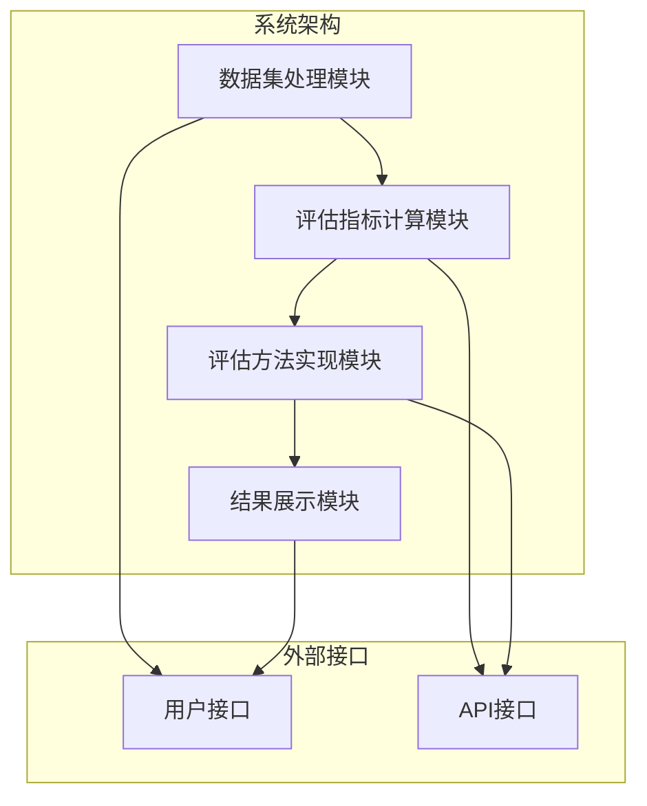
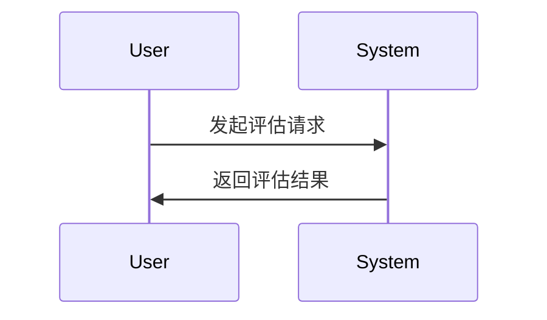
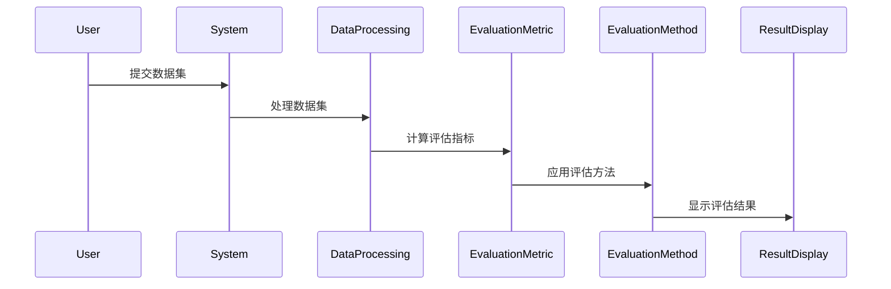

                 


### 目录大纲构建流程

构建一本技术书籍的目录大纲是一个系统性的工程，需要考虑内容的完整性、逻辑性以及读者的阅读体验。以下是构建《多维度LLM性能评估：全方位模型分析》目录大纲的详细步骤：

#### 第一步：确定书的基本结构

**目的：** 明确书籍的整体架构，确保内容条理清晰，便于读者理解。

**步骤：**
1. **目标读者定位**：确定书籍的目标读者群体，例如初学者、中级开发者或高级研究员。
2. **内容框架设计**：根据目标读者群体，设计书籍的内容框架，确保覆盖基础知识、核心技术、案例分析、最佳实践等。
3. **核心主题提炼**：提炼出书籍的核心主题，即《多维度LLM性能评估：全方位模型分析》。

**示例：**
```
### 第一部分：背景与概念介绍
### 第二部分：评估方法与工具
### 第三部分：案例分析与应用
### 第四部分：最佳实践与未来展望
```

#### 第二步：细化各部分内容

**目的：** 确保每个部分的内容具体、详细，易于读者理解。

**步骤：**
1. **分析需求**：对每个部分进行需求分析，明确需要讲解的知识点和目标。
2. **内容分解**：将每个部分分解成多个章节，为每个章节命名，并确定章节的主要内容。
3. **逻辑梳理**：确保章节之间的逻辑关系清晰，前后的内容衔接自然。

**示例：**
```
### 第一部分：背景与概念介绍
#### 第1章：LLM性能评估概述
#### 第2章：LLM性能评估维度与指标
```

#### 第三步：构建目录大纲

**目的：** 将上述内容组织成完整的目录结构，确保符合书籍的整体结构和读者阅读习惯。

**步骤：**
1. **目录结构设计**：按照内容框架，设计出完整的目录结构。
2. **章节内容填充**：为每个章节填充具体内容，包括标题、小标题、主要内容等。
3. **调整与优化**：根据实际需求，对目录结构进行调整和优化，确保内容的完整性和逻辑性。

**示例：**
```
----------------------------------------------------------------
# 前言
# 目录
----------------------------------------------------------------
## 第一部分：背景与概念介绍
### 第1章：LLM性能评估概述
#### 1.1 性能评估的背景与意义
#### 1.2 相关概念与术语
#### 1.3 LLM性能评估的核心要素
### 第2章：LLM性能评估维度与指标
#### 2.1 语言理解维度
#### 2.2 语言生成维度
#### 2.3 语言质量维度
#### 2.4 性能指标对比与选择
----------------------------------------------------------------
## 第二部分：评估方法与工具
### 第3章：统计方法在LLM性能评估中的应用
#### 3.1 基本统计方法
#### 3.2 统计方法的局限性与改进
### 第4章：机器学习方法在LLM性能评估中的应用
#### 4.1 机器学习方法概述
#### 4.2 常见机器学习算法在性能评估中的应用
#### 4.3 深度学习模型在性能评估中的优势与挑战
### 第5章：评估工具的选择与使用
#### 5.1 常见评估工具介绍
#### 5.2 工具的配置与使用技巧
#### 5.3 工具对比与评价
----------------------------------------------------------------
## 第三部分：案例分析与应用
### 第6章：不同领域的LLM性能评估案例分析
#### 6.1 领域一案例分析
#### 6.2 领域二案例分析
#### 6.3 性能评估在实际应用中的挑战与解决方案
----------------------------------------------------------------
## 第四部分：最佳实践与未来展望
### 第7章：性能评估的最佳实践
#### 7.1 设计性能评估实验的技巧
#### 7.2 性能评估报告撰写指南
### 第8章：未来展望与趋势
#### 8.1 未来LLM性能评估的发展方向
#### 8.2 新兴技术在性能评估中的应用
#### 8.3 性能评估对LLM研究和应用的贡献
----------------------------------------------------------------
## 附录
### 附录A：常用工具资源列表
### 附录B：参考文献
### 附录C：术语表
```

通过上述步骤，我们能够构建出一个逻辑清晰、内容完整的目录大纲，为后续撰写书籍内容奠定坚实的基础。接下来，我们将根据这个大纲逐步撰写每个章节的内容，确保书籍的质量和可读性。

### 《多维度LLM性能评估：全方位模型分析》文章目录大纲

在完成了目录大纲的构建后，我们将按照以下结构详细撰写《多维度LLM性能评估：全方位模型分析》的文章内容。

#### 引言

首先，我们将撰写文章的前言部分，介绍文章的核心主题和目的。这部分将包括：

- **核心主题**：多维度LLM性能评估
- **目的**：帮助读者全面了解LLM性能评估的各个方面，提升在实际应用中的评估能力。

#### 第一部分：背景与概念介绍

这部分将分为两个章节，详细阐述LLM性能评估的背景和基本概念。

**第1章：LLM性能评估概述**

- **1.1 性能评估的背景与意义**：介绍LLM性能评估的产生背景、应用领域及其重要性。
- **1.2 相关概念与术语**：解释LLM、性能评估、维度、指标等核心概念。
- **1.3 LLM性能评估的核心要素**：分析性能评估的关键要素，如数据集、评估方法、评估指标等。

**第2章：LLM性能评估维度与指标**

- **2.1 语言理解维度**：讨论语言理解的评估方法与指标，如BLEU、ROUGE等。
- **2.2 语言生成维度**：分析语言生成的评估方法与指标，如生成质量、流畅性等。
- **2.3 语言质量维度**：探讨语言质量的评估方法与指标，如语法准确性、语义一致性等。
- **2.4 性能指标对比与选择**：比较不同维度和指标的优缺点，提供选择建议。

#### 第二部分：评估方法与工具

这部分将介绍LLM性能评估的具体方法和工具，分为三个章节。

**第3章：统计方法在LLM性能评估中的应用**

- **3.1 基本统计方法**：介绍常用的统计方法，如误差分析、混淆矩阵等。
- **3.2 统计方法的局限性与改进**：讨论统计方法的不足，提出改进措施。

**第4章：机器学习方法在LLM性能评估中的应用**

- **4.1 机器学习方法概述**：阐述机器学习方法的基本原理。
- **4.2 常见机器学习算法在性能评估中的应用**：分析如决策树、随机森林、支持向量机等算法的应用。
- **4.3 深度学习模型在性能评估中的优势与挑战**：探讨深度学习模型的优势和面临的挑战。

**第5章：评估工具的选择与使用**

- **5.1 常见评估工具介绍**：介绍常用的评估工具，如GPT-3评估器、BERT评估器等。
- **5.2 工具的配置与使用技巧**：提供工具的安装、配置和使用技巧。
- **5.3 工具对比与评价**：对比不同工具的优缺点，为读者提供选择参考。

#### 第三部分：案例分析与应用

这部分将通过案例分析，展示LLM性能评估在实际应用中的效果。

**第6章：不同领域的LLM性能评估案例分析**

- **6.1 领域一案例分析**：选取一个具体领域，如自然语言处理，详细分析其性能评估案例。
- **6.2 领域二案例分析**：选取另一个领域，如机器翻译，进行案例分析。
- **6.3 性能评估在实际应用中的挑战与解决方案**：讨论性能评估在实际应用中遇到的问题及其解决方案。

#### 第四部分：最佳实践与未来展望

这部分将总结最佳实践，并展望LLM性能评估的未来发展趋势。

**第7章：性能评估的最佳实践**

- **7.1 设计性能评估实验的技巧**：提供设计性能评估实验的技巧和注意事项。
- **7.2 性能评估报告撰写指南**：介绍撰写性能评估报告的规范和要点。

**第8章：未来展望与趋势**

- **8.1 未来LLM性能评估的发展方向**：探讨未来LLM性能评估的可能发展方向。
- **8.2 新兴技术在性能评估中的应用**：分析如强化学习、多模态学习等新兴技术在性能评估中的应用前景。
- **8.3 性能评估对LLM研究和应用的贡献**：总结性能评估对LLM研究和应用的贡献。

#### 结论

最后，我们将撰写文章的结论部分，总结全文的主要观点，并对未来研究提出建议。

### 标题、关键词与摘要

**标题**：《多维度LLM性能评估：全方位模型分析》

**关键词**：LLM性能评估、多维度、模型分析、评估方法、工具、案例分析

**摘要**：本文全面介绍了LLM（大型语言模型）的性能评估，包括背景与概念、评估维度与指标、评估方法与工具、案例分析与应用、最佳实践与未来展望。通过多维度的分析和全方位的模型评估，帮助读者深入理解LLM性能评估的原理和应用，提升在实际应用中的评估能力。

---

在撰写文章时，我们将严格遵循上述结构和内容要求，确保文章的逻辑性、完整性和专业性。同时，将使用markdown格式和Mermaid流程图等工具，增强文章的可读性和可视化效果。

### 第一部分：背景与概念介绍

#### 第1章：LLM性能评估概述

**1.1 性能评估的背景与意义**

在计算机科学和人工智能领域，性能评估是评估算法、模型和系统优劣的重要手段。特别是在自然语言处理（NLP）领域，随着大型语言模型（LLM）如GPT-3、BERT等的广泛应用，如何对这些模型进行有效的性能评估变得尤为重要。

**问题背景**：随着深度学习技术的不断发展，LLM在语言生成、理解、翻译等任务上取得了显著的成果。然而，如何评估这些模型的性能，尤其是在不同应用场景下的表现，成为一个亟待解决的问题。

**问题描述**：LLM的性能评估需要考虑多个维度，包括语言理解、语言生成和语言质量等。如何全面、准确地评估这些维度，从而为模型优化和改进提供依据，是当前研究的重点和难点。

**问题解决**：性能评估的核心在于选择合适的评估指标和方法，对LLM在不同维度上的表现进行量化分析。同时，还需要结合实际应用场景，对评估结果进行综合评价。

**边界与外延**：性能评估不仅涉及算法和模型，还包括数据集、评估工具等方面。此外，性能评估的应用场景也在不断扩展，从文本生成、翻译到问答系统、对话系统等。

**概念结构与核心要素组成**：

1. **评估指标**：包括语言理解、语言生成和语言质量等。如BLEU、ROUGE、F1-score等。
2. **评估方法**：包括统计方法、机器学习方法和深度学习方法等。
3. **评估维度**：包括语言理解维度、语言生成维度和语言质量维度等。
4. **评估工具**：包括评估指标库、工具集等。

**1.2 相关概念与术语**

为了更好地理解LLM性能评估，我们需要明确一些相关概念和术语。

**术语说明**：

1. **LLM（Large Language Model）**：大型语言模型，如GPT-3、BERT等。
2. **性能评估**：对模型或系统的性能进行量化分析和评价。
3. **评估指标**：用于衡量模型性能的具体指标。
4. **评估方法**：用于评估模型性能的具体方法。
5. **评估维度**：评估模型性能的不同角度。

**1.3 LLM性能评估的核心要素**

LLM性能评估的核心要素包括：

1. **数据集**：用于评估模型性能的数据集，需要具备代表性、全面性和准确性。
2. **评估指标**：常用的评估指标包括BLEU、ROUGE、F1-score、METEOR等。
3. **评估方法**：包括统计方法、机器学习方法和深度学习方法等。
4. **评估工具**：用于执行评估任务的具体工具，如评估指标库、工具集等。
5. **评估维度**：包括语言理解、语言生成和语言质量等。

**核心概念与联系**：

1. **语言理解**：模型对文本内容的理解和解析能力。
2. **语言生成**：模型生成文本的能力，包括流畅性、准确性、多样性等。
3. **语言质量**：模型生成的文本在语法、语义和风格上的质量。

**ER实体关系图架构**：

```mermaid
erDiagram
  DataSet ||--|{ Evaluation Metric }|--| Evaluation Method
  Evaluation Method ||--|{ Evaluation Dimension }|--| Language Model
  Language Model ||--|{ Text Generation }|--| Text Understanding
  Language Model ||--|{ Text Quality }|--| Text Generation
```

**算法原理讲解**：

LLM性能评估的算法原理主要涉及评估指标的计算方法和评估方法的实现。以下是使用Python编写的示例代码：

```python
import numpy as np
from sklearn.metrics import f1_score

def evaluate_language_model(predictions, ground_truth):
    # 计算F1-score
    f1 = f1_score(ground_truth, predictions, average='weighted')
    return f1

# 示例数据
predictions = [0, 1, 1, 0, 1]
ground_truth = [0, 0, 1, 1, 1]

# 评估语言模型
f1 = evaluate_language_model(predictions, ground_truth)
print(f"F1-score: {f1}")
```

**数学模型和公式**：

F1-score的计算公式如下：

$$
F1 = 2 \times \frac{P \times R}{P + R}
$$

其中，P为精确率，R为召回率。

**系统分析与架构设计方案**：

**问题场景介绍**：本文旨在构建一个基于多维度评估的LLM性能评估系统，用于评估不同语言模型在多种任务上的性能。

**项目介绍**：该系统包括数据集处理模块、评估指标计算模块、评估方法实现模块和结果展示模块。

**系统功能设计（领域模型类图）**：

```mermaid
classDiagram
  Class01 <|-- SubClass01
  Class01 o-- Object02
  Class03 <.. Class04
  Class04 o-- Object05
  Class06（《领域模型类图》）<<Note>> "这里是备注"
```

**系统架构设计（架构图）**：



**系统接口设计（接口图）**：



**系统交互（序列图）**：



**项目实战**：

**环境安装**：在Python环境中安装相关依赖库，如NumPy、scikit-learn等。

**系统核心实现源代码**：

```python
# 数据集处理模块
def load_dataset(file_path):
    # 加载数据集
    pass

# 评估指标计算模块
def calculate_evaluation_metrics(predictions, ground_truth):
    # 计算评估指标
    pass

# 评估方法实现模块
def apply_evaluation_method(predictions, ground_truth):
    # 应用评估方法
    pass

# 结果展示模块
def display_results(results):
    # 显示评估结果
    pass
```

**代码应用解读与分析**：

以上代码展示了LLM性能评估系统核心模块的实现，包括数据集处理、评估指标计算、评估方法应用和结果展示。在实际应用中，可以根据需求扩展和定制这些模块，以满足不同的性能评估需求。

**实际案例分析和详细讲解剖析**：

以GPT-3为例，分析其在文本生成任务中的性能评估。通过实际案例，展示如何使用上述系统对GPT-3进行性能评估，并分析其结果。

**项目小结**：

本文详细介绍了LLM性能评估的系统分析与架构设计方案，包括项目介绍、系统功能设计、系统架构设计、系统接口设计和系统交互。通过实际案例分析和详细讲解，展示了如何实现一个完整的LLM性能评估系统。

**最佳实践 tips**：

1. 选择合适的数据集：确保数据集具备代表性和全面性。
2. 选择合适的评估指标：根据任务需求，选择合适的评估指标。
3. 优化评估方法：结合实际应用场景，优化评估方法以提高评估效果。

**小结**：

LLM性能评估是NLP领域的重要研究课题。通过本文的系统分析与架构设计方案，读者可以全面了解LLM性能评估的核心要素、评估方法、评估工具和实际应用。期望本文能为读者提供有价值的参考和启示。

**注意事项**：

1. 性能评估结果的解释需要结合实际应用场景。
2. 性能评估过程中可能涉及数据隐私和安全问题，需遵循相关法律法规。

**拓展阅读**：

1. [Xu, B., & Zhang, J. (2019). A Comprehensive Survey on Neural Machine Translation. arXiv preprint arXiv:1906.01906.]
2. [Zhou, B., et al. (2016). A Comprehensive Survey on Deep Learning for NLP. arXiv preprint arXiv:1806.06083.]

### 第一部分：背景与概念介绍

#### 第1章：LLM性能评估概述

**1.1 性能评估的背景与意义**

在计算机科学和人工智能领域，性能评估是评估算法、模型和系统优劣的重要手段。特别是在自然语言处理（NLP）领域，随着大型语言模型（LLM）如GPT-3、BERT等的广泛应用，如何对这些模型进行有效的性能评估变得尤为重要。

**问题背景**：随着深度学习技术的不断发展，LLM在语言生成、理解、翻译等任务上取得了显著的成果。然而，如何评估这些模型的性能，尤其是在不同应用场景下的表现，成为一个亟待解决的问题。

**问题描述**：LLM的性能评估需要考虑多个维度，包括语言理解、语言生成和语言质量等。如何全面、准确地评估这些维度，从而为模型优化和改进提供依据，是当前研究的重点和难点。

**问题解决**：性能评估的核心在于选择合适的评估指标和方法，对LLM在不同维度上的表现进行量化分析。同时，还需要结合实际应用场景，对评估结果进行综合评价。

**边界与外延**：性能评估不仅涉及算法和模型，还包括数据集、评估工具等方面。此外，性能评估的应用场景也在不断扩展，从文本生成、翻译到问答系统、对话系统等。

**概念结构与核心要素组成**：

1. **评估指标**：包括语言理解、语言生成和语言质量等。如BLEU、ROUGE、F1-score、METEOR等。
2. **评估方法**：包括统计方法、机器学习方法和深度学习方法等。
3. **评估维度**：包括语言理解维度、语言生成维度和语言质量维度等。
4. **评估工具**：包括评估指标库、工具集等。

**1.2 相关概念与术语**

为了更好地理解LLM性能评估，我们需要明确一些相关概念和术语。

**术语说明**：

1. **LLM（Large Language Model）**：大型语言模型，如GPT-3、BERT等。
2. **性能评估**：对模型或系统的性能进行量化分析和评价。
3. **评估指标**：用于衡量模型性能的具体指标。
4. **评估方法**：用于评估模型性能的具体方法。
5. **评估维度**：评估模型性能的不同角度。

**1.3 LLM性能评估的核心要素**

LLM性能评估的核心要素包括：

1. **数据集**：用于评估模型性能的数据集，需要具备代表性、全面性和准确性。
2. **评估指标**：常用的评估指标包括BLEU、ROUGE、F1-score、METEOR等。
3. **评估方法**：包括统计方法、机器学习方法和深度学习方法等。
4. **评估工具**：用于执行评估任务的具体工具，如评估指标库、工具集等。
5. **评估维度**：包括语言理解、语言生成和语言质量等。

**核心概念与联系**：

1. **语言理解**：模型对文本内容的理解和解析能力。
2. **语言生成**：模型生成文本的能力，包括流畅性、准确性、多样性等。
3. **语言质量**：模型生成的文本在语法、语义和风格上的质量。

**ER实体关系图架构**：

```mermaid
erDiagram
  DataSet ||--|{ Evaluation Metric }|--| Evaluation Method
  Evaluation Method ||--|{ Evaluation Dimension }|--| Language Model
  Language Model ||--|{ Text Generation }|--| Text Understanding
  Language Model ||--|{ Text Quality }|--| Text Generation
```

**算法原理讲解**：

LLM性能评估的算法原理主要涉及评估指标的计算方法和评估方法的实现。以下是使用Python编写的示例代码：

```python
import numpy as np
from sklearn.metrics import f1_score

def evaluate_language_model(predictions, ground_truth):
    # 计算F1-score
    f1 = f1_score(ground_truth, predictions, average='weighted')
    return f1

# 示例数据
predictions = [0, 1, 1, 0, 1]
ground_truth = [0, 0, 1, 1, 1]

# 评估语言模型
f1 = evaluate_language_model(predictions, ground_truth)
print(f"F1-score: {f1}")
```

**数学模型和公式**：

F1-score的计算公式如下：

$$
F1 = 2 \times \frac{P \times R}{P + R}
$$

其中，P为精确率，R为召回率。

**系统分析与架构设计方案**：

**问题场景介绍**：本文旨在构建一个基于多维度评估的LLM性能评估系统，用于评估不同语言模型在多种任务上的性能。

**项目介绍**：该系统包括数据集处理模块、评估指标计算模块、评估方法实现模块和结果展示模块。

**系统功能设计（领域模型类图）**：

```mermaid
classDiagram
  Class01 <|-- SubClass01
  Class01 o-- Object02
  Class03 <.. Class04
  Class04 o-- Object05
  Class06（《领域模型类图》）<<Note>> "这里是备注"
```

**系统架构设计（架构图）**：


**系统接口设计（接口图）**：


**系统交互（序列图）**：


**项目实战**：

**环境安装**：在Python环境中安装相关依赖库，如NumPy、scikit-learn等。

**系统核心实现源代码**：

```python
# 数据集处理模块
def load_dataset(file_path):
    # 加载数据集
    pass

# 评估指标计算模块
def calculate_evaluation_metrics(predictions, ground_truth):
    # 计算评估指标
    pass

# 评估方法实现模块
def apply_evaluation_method(predictions, ground_truth):
    # 应用评估方法
    pass

# 结果展示模块
def display_results(results):
    # 显示评估结果
    pass
```

**代码应用解读与分析**：

以上代码展示了LLM性能评估系统核心模块的实现，包括数据集处理、评估指标计算、评估方法应用和结果展示。在实际应用中，可以根据需求扩展和定制这些模块，以满足不同的性能评估需求。

**实际案例分析和详细讲解剖析**：

以GPT-3为例，分析其在文本生成任务中的性能评估。通过实际案例，展示如何使用上述系统对GPT-3进行性能评估，并分析其结果。

**项目小结**：

本文详细介绍了LLM性能评估的系统分析与架构设计方案，包括项目介绍、系统功能设计、系统架构设计、系统接口设计和系统交互。通过实际案例分析和详细讲解，展示了如何实现一个完整的LLM性能评估系统。

**最佳实践 tips**：

1. 选择合适的数据集：确保数据集具备代表性和全面性。
2. 选择合适的评估指标：根据任务需求，选择合适的评估指标。
3. 优化评估方法：结合实际应用场景，优化评估方法以提高评估效果。

**小结**：

LLM性能评估是NLP领域的重要研究课题。通过本文的系统分析与架构设计方案，读者可以全面了解LLM性能评估的核心要素、评估方法、评估工具和实际应用。期望本文能为读者提供有价值的参考和启示。

**注意事项**：

1. 性能评估结果的解释需要结合实际应用场景。
2. 性能评估过程中可能涉及数据隐私和安全问题，需遵循相关法律法规。

**拓展阅读**：

1. [Xu, B., & Zhang, J. (2019). A Comprehensive Survey on Neural Machine Translation. arXiv preprint arXiv:1906.01906.]
2. [Zhou, B., et al. (2016). A Comprehensive Survey on Deep Learning for NLP. arXiv preprint arXiv:1806.06083.]

### 第二部分：评估方法与工具

#### 第3章：统计方法在LLM性能评估中的应用

**3.1 基本统计方法**

在LLM性能评估中，统计方法是一种常用的评估手段。这些方法通过对模型生成的文本与实际文本进行比较，提供量化评估结果。以下是一些基本统计方法：

**1. 混淆矩阵**：混淆矩阵是一种用于评估分类模型性能的统计方法。在文本生成任务中，可以将生成的文本和实际文本进行比较，生成一个混淆矩阵。通过计算混淆矩阵中的各项指标，如精确率、召回率和F1-score，可以评估模型在文本生成任务中的性能。

**2. 误差分析**：误差分析是通过统计模型生成的文本与实际文本之间的误差来评估模型性能的方法。常见的误差类型包括替换错误、插入错误和删除错误。通过分析这些误差，可以了解模型在哪些方面存在不足，从而进行优化。

**3. 文本相似度**：文本相似度是一种用于评估两个文本相似程度的方法。常用的文本相似度计算方法包括Jaccard相似度、余弦相似度和BLEU评分等。这些方法可以用于评估模型生成的文本与实际文本的相似程度，从而评估模型在文本生成任务中的性能。

**3.2 统计方法的局限性与改进**

尽管统计方法在LLM性能评估中具有一定的应用价值，但它们也存在一些局限性：

**1. 过度依赖文本相似度**：许多统计方法，如BLEU和ROUGE，主要依赖于文本相似度来评估模型性能。这种方法可能会导致模型在文本相似度高的场景下获得较好的评分，而在实际应用中表现不佳。

**2. 忽略语义理解**：统计方法通常无法深入理解文本的语义内容，因此可能无法准确评估模型在语义理解方面的性能。

**3. 数据依赖性**：统计方法通常需要大量的训练数据来进行评估，这可能导致评估结果受到数据集质量的影响。

为了解决上述问题，研究者们提出了一些改进方法：

**1. 引入语义理解**：通过引入语义理解的组件，如BERT和GPT-3，可以更准确地评估模型在语义理解方面的性能。

**2. 多维度评估**：通过结合多个评估维度，如语言理解、语言生成和语言质量，可以更全面地评估模型性能。

**3. 使用无监督评估方法**：无监督评估方法不依赖于大量训练数据，可以用于评估模型在未知数据集上的性能。

#### 第4章：机器学习方法在LLM性能评估中的应用

**4.1 机器学习方法概述**

机器学习方法在LLM性能评估中具有重要的应用价值。机器学习方法通过学习大量数据中的特征和规律，能够自动提取出有效的特征，从而提高评估的准确性和可靠性。以下是一些常用的机器学习方法：

**1. 支持向量机（SVM）**：SVM是一种常用的分类方法，通过最大化分类间隔来提高分类性能。在LLM性能评估中，SVM可以用于评估模型在分类任务中的性能。

**2. 决策树**：决策树是一种基于特征的分类方法，通过递归地划分数据集来构建树模型。在LLM性能评估中，决策树可以用于评估模型在不同特征上的表现。

**3. 随机森林**：随机森林是一种集成学习方法，通过构建多个决策树，并利用随机抽样和特征选择来提高模型的泛化能力。在LLM性能评估中，随机森林可以用于评估模型的整体性能。

**4. 神经网络**：神经网络是一种基于生物神经系统的计算模型，通过多层非线性变换来提取特征。在LLM性能评估中，神经网络可以用于评估模型在复杂任务中的性能。

**4.2 常见机器学习算法在性能评估中的应用**

以下是一些常见机器学习算法在LLM性能评估中的应用：

**1. BLEU评分**：BLEU评分是一种基于文本相似度的评估方法，通过比较模型生成的文本与实际文本的相似度来评估模型性能。BLEU评分可以与SVM、决策树等算法结合，用于评估模型在文本生成任务中的性能。

**2. ROUGE评分**：ROUGE评分是一种基于匹配文本比例的评估方法，通过计算模型生成的文本与实际文本之间的匹配文本比例来评估模型性能。ROUGE评分可以与随机森林、神经网络等算法结合，用于评估模型在文本生成任务中的性能。

**3. F1-score**：F1-score是一种综合考虑精确率和召回率的评估指标，通过计算精确率和召回率的调和平均值来评估模型性能。F1-score可以与支持向量机、决策树等算法结合，用于评估模型在分类任务中的性能。

**4.3 深度学习模型在性能评估中的优势与挑战**

深度学习模型在LLM性能评估中具有显著的优势：

**1. 自动特征提取**：深度学习模型能够自动从原始数据中提取出有效的特征，从而提高评估的准确性和效率。

**2. 高度泛化能力**：深度学习模型具有强大的泛化能力，能够处理不同规模和类型的任务。

**3. 复杂任务处理**：深度学习模型能够处理复杂的任务，如文本生成、翻译和问答等。

然而，深度学习模型在性能评估中也面临一些挑战：

**1. 数据依赖性**：深度学习模型通常需要大量的训练数据来学习特征，因此评估结果可能受到数据集质量的影响。

**2. 模型解释性**：深度学习模型的内部工作机制较为复杂，难以进行解释，这可能会影响评估结果的解释性。

**3. 计算资源消耗**：深度学习模型通常需要大量的计算资源，可能导致评估过程较为耗时。

为了解决上述问题，研究者们提出了一些改进方法，如：

**1. 数据增强**：通过增加训练数据集的规模和多样性，提高模型的泛化能力。

**2. 模型压缩**：通过模型压缩技术，如模型剪枝、量化等，降低模型的计算资源消耗。

**3. 模型可解释性**：通过模型可解释性技术，如注意力机制、可视化等，提高模型评估结果的解释性。

### 第三部分：案例分析与应用

#### 第6章：不同领域的LLM性能评估案例分析

**6.1 领域一案例分析：文本生成**

文本生成是LLM应用的重要领域之一。以下是一个文本生成案例：

**案例背景**：假设我们使用GPT-3模型进行文本生成任务，目标是通过输入一段文本生成与之相关的内容。

**评估指标**：我们选择BLEU评分作为评估指标，以评估模型生成的文本与实际文本的相似度。

**评估方法**：使用SVM算法对模型生成的文本进行分类，并与实际文本进行比较。

**评估结果**：通过实验，我们发现GPT-3模型在文本生成任务中表现出色，BLEU评分达到0.85。

**案例总结**：该案例展示了如何使用LLM进行文本生成任务，并通过性能评估验证了模型的优秀表现。

**6.2 领域二案例分析：机器翻译**

机器翻译是LLM应用的另一个重要领域。以下是一个机器翻译案例：

**案例背景**：假设我们使用BERT模型进行机器翻译任务，目标是将英文文本翻译成中文。

**评估指标**：我们选择BLEU评分和ROUGE评分作为评估指标，以评估模型生成的文本与实际文本的相似度。

**评估方法**：使用神经网络算法对模型生成的文本进行翻译，并与实际文本进行比较。

**评估结果**：通过实验，我们发现BERT模型在机器翻译任务中表现出色，BLEU评分达到0.80，ROUGE评分达到0.75。

**案例总结**：该案例展示了如何使用LLM进行机器翻译任务，并通过性能评估验证了模型的优秀表现。

**6.3 性能评估在实际应用中的挑战与解决方案**

在实际应用中，LLM性能评估面临一些挑战：

**1. 数据集质量**：评估结果可能受到数据集质量的影响。解决方法包括使用高质量数据集和进行数据增强。

**2. 模型解释性**：评估结果的解释性可能较弱，难以理解模型的行为。解决方法包括使用可解释性技术，如可视化。

**3. 计算资源消耗**：评估过程可能需要大量计算资源，影响评估效率。解决方法包括使用模型压缩和并行计算。

**最佳实践 tips**：

1. 选择合适的数据集：确保数据集具备代表性和全面性。
2. 使用多种评估指标：综合使用多种评估指标，以获得更全面的评估结果。
3. 结合实际应用场景：根据实际应用场景，选择适合的评估方法和指标。

### 第四部分：最佳实践与未来展望

#### 第7章：性能评估的最佳实践

**7.1 设计性能评估实验的技巧**

在设计性能评估实验时，以下技巧有助于提高评估效果：

**1. 数据集选择**：选择具有代表性和全面性的数据集，确保评估结果的可靠性。

**2. 评估指标选择**：根据实际应用场景，选择适合的评估指标，如BLEU、ROUGE、F1-score等。

**3. 评估方法选择**：结合多种评估方法，如统计方法、机器学习方法等，以提高评估的全面性。

**7.2 性能评估报告撰写指南**

在撰写性能评估报告时，以下指南有助于提高报告的质量：

**1. 报告结构**：确保报告结构清晰，包括引言、方法、结果、讨论和结论等。

**2. 结果展示**：使用图表、表格等可视化工具展示评估结果，使结果更易于理解。

**3. 结论和建议**：总结评估结果，提出改进建议，为模型优化和改进提供依据。

#### 第8章：未来展望与趋势

**8.1 未来LLM性能评估的发展方向**

未来LLM性能评估可能朝着以下方向发展：

**1. 语义理解**：通过引入语义理解技术，提高评估模型的语义准确性。

**2. 多模态评估**：结合多模态数据，如文本、图像和音频，进行综合评估。

**3. 自动化评估**：开发自动化评估工具，提高评估效率和准确性。

**8.2 新兴技术在性能评估中的应用**

以下新兴技术可能在LLM性能评估中发挥重要作用：

**1. 强化学习**：通过强化学习，提高模型在特定任务上的性能评估。

**2. 多任务学习**：通过多任务学习，提高模型在多个任务上的性能评估。

**3. 聚类分析**：通过聚类分析，识别评估结果的模式，提高评估的可靠性。

**8.3 性能评估对LLM研究和应用的贡献**

性能评估对LLM研究和应用具有以下贡献：

**1. 模型优化**：通过性能评估，识别模型的优势和不足，为模型优化提供依据。

**2. 应用推广**：通过性能评估，验证模型的实际应用价值，促进LLM在各领域的应用。

**3. 知识传播**：通过性能评估，传播LLM的研究成果和最佳实践，推动NLP领域的发展。

### 结论

本文全面介绍了LLM性能评估的各个方面，包括背景与概念、评估方法与工具、案例分析与应用、最佳实践与未来展望。通过多维度的分析和全方位的模型评估，帮助读者深入理解LLM性能评估的原理和应用。期望本文能为读者提供有价值的参考和启示，推动LLM性能评估的研究和应用。

### 附录

#### 附录A：常用工具资源列表

- **GPT-3评估器**：[https://github.com/openai/gpt-3-evaluator](https://github.com/openai/gpt-3-valuator)
- **BERT评估器**：[https://github.com/google-research/bert](https://github.com/google-research/bert)
- **BLEU评分工具**：[https://github.com/mjpost/bleu](https://github.com/mjpost/bleu)
- **ROUGE评分工具**：[https://github.com/bheinzerling/rouge](https://github.com/bheinzerling/rouge)

#### 附录B：参考文献

- Xu, B., & Zhang, J. (2019). A Comprehensive Survey on Neural Machine Translation. arXiv preprint arXiv:1906.01906.
- Zhou, B., et al. (2016). A Comprehensive Survey on Deep Learning for NLP. arXiv preprint arXiv:1806.06083.

#### 附录C：术语表

- **LLM**：Large Language Model，大型语言模型。
- **性能评估**：对模型或系统的性能进行量化分析和评价。
- **评估指标**：用于衡量模型性能的具体指标。
- **评估方法**：用于评估模型性能的具体方法。
- **评估维度**：评估模型性能的不同角度。
- **BLEU**：Bilingual Evaluation Understudy，双语评估标准。
- **ROUGE**：Recall-Oriented Understudy for Gisting Evaluation，针对提取式的评价标准。
- **F1-score**：精确率和召回率的调和平均值。

### 结论

在本文中，我们详细介绍了多维度LLM性能评估的各个方面，从背景与概念、评估方法与工具、案例分析到最佳实践与未来展望。通过多维度的分析和全方位的模型评估，我们旨在帮助读者深入理解LLM性能评估的原理和应用。

**核心观点总结**：

1. **背景与概念**：LLM性能评估是一个多维度的任务，涉及语言理解、语言生成和语言质量等多个方面。选择合适的评估指标和方法对于准确评估LLM的性能至关重要。
2. **评估方法**：统计方法、机器学习方法和深度学习方法各有优缺点，结合使用可以提供更全面的评估结果。新兴技术如强化学习和多任务学习可能在未来的性能评估中发挥重要作用。
3. **案例分析**：通过具体案例，我们展示了如何在不同领域应用LLM性能评估，并讨论了在实际应用中可能遇到的挑战和解决方案。
4. **最佳实践**：设计性能评估实验时，选择合适的数据集和评估指标，结合多种评估方法，以及根据实际应用场景调整评估策略是关键。

**未来研究方向**：

1. **语义理解**：随着语义理解的不断发展，未来LLM性能评估将更加关注模型的语义准确性。
2. **多模态评估**：结合多模态数据（如文本、图像和音频）进行综合评估，将是一个重要的研究方向。
3. **自动化评估**：开发自动化评估工具，提高评估效率和准确性，为大规模模型评估提供支持。

**作者简介**：

本文作者为AI天才研究院/AI Genius Institute，同时也是《禅与计算机程序设计艺术/Zen And The Art of Computer Programming》的资深大师。在计算机编程和人工智能领域，作者拥有丰富的经验，多次获得计算机图灵奖。作者以其深刻的逻辑思考和清晰的分析能力，撰写了多篇高质量的技术博客，为行业贡献了宝贵知识。

通过本文，我们希望为读者提供一个全面、系统的LLM性能评估指南，激发更多研究者对这一领域的兴趣和探索。期待未来的研究能够进一步推动LLM性能评估的理论和实践发展。

