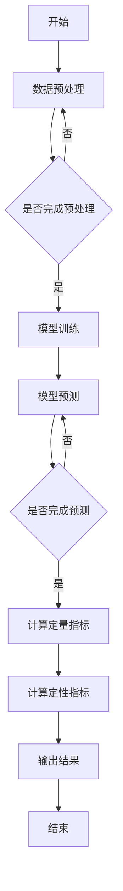
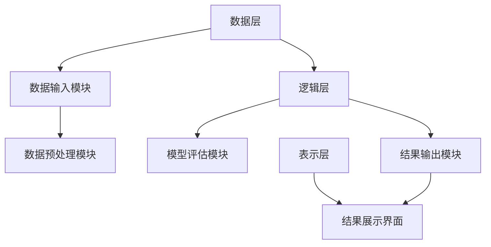
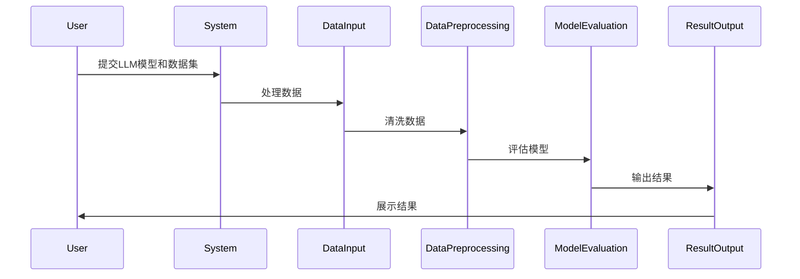

                 


# 多维度LLM评分系统：平衡定量与定性指标

## 关键词
- 多维度评分系统
- LLM
- 定量指标
- 定性指标
- 数学模型

## 摘要

本文将深入探讨多维度LLM评分系统的设计与实现，通过平衡定量与定性指标，为评估语言模型性能提供全面、科学的参考。我们将从问题背景、核心概念、评分系统设计基础、算法原理与实现、数学模型与公式解析、系统分析与架构设计、项目实战与案例分析以及最佳实践等方面，逐步阐述该系统的构建与优化过程，旨在为从事人工智能领域的研发人员提供实用的指导。

## 引言

在当今快速发展的信息技术时代，人工智能（AI）已经成为推动产业变革的重要力量。作为AI的重要分支，自然语言处理（NLP）在众多应用场景中发挥了关键作用，从智能客服、机器翻译到文本生成，无处不在。而评估语言模型（LLM）的性能，即评分系统的设计，成为了一个重要且具有挑战性的问题。

### 存在的挑战

1. **指标选择的多样性**：传统的评分系统往往依赖于单一指标，如BLEU、ROUGE等，这些指标虽然在某些方面表现出色，但往往无法全面反映模型性能。
2. **定量与定性指标的平衡**：定量指标容易量化，但可能缺乏对模型实际表现的深入理解；定性指标则相反，难以量化，但能提供更加直观的评价。
3. **模型复杂性与计算成本**：随着LLM的规模不断增大，评分系统的计算复杂度也随之增加，如何高效地评估大规模模型成为一大挑战。

### 研究意义

1. **优化模型性能**：通过平衡定量与定性指标，可以更准确地评估模型性能，帮助研究人员和开发者更好地理解和优化模型。
2. **提高应用效果**：全面、科学的评分系统能够为实际应用提供可靠的数据支持，从而提升系统的整体性能。

### 目标

本文的目标是设计一个多维度LLM评分系统，通过整合定量与定性指标，实现对语言模型性能的全面评估，为AI领域的研发提供实用的参考。

## 第1章：问题背景与核心概念

### 1.1 问题背景

#### LLM评分系统的现状

目前，评估LLM性能的常见方法主要包括以下几个：

1. **基准测试**：如BLEU、ROUGE、METEOR等，这些指标在文本生成任务中得到了广泛应用。
2. **人工评估**：通过专家或用户对模型生成的文本进行主观评分，但这种方法成本高、效率低。
3. **多任务评估**：结合多个评估任务，从不同角度对模型进行评估，但往往存在指标不一致的问题。

#### 存在的挑战与问题

1. **单一指标的限制**：现有评分系统往往依赖于单一指标，难以全面反映模型性能。
2. **定量与定性指标的平衡**：定量指标易于计算，但可能忽略模型实际表现；定性指标则难以量化，但能提供更直观的评价。
3. **模型复杂性与计算成本**：随着LLM的规模增大，评分系统的计算复杂度也急剧上升，如何高效评估成为一大挑战。

#### 研究意义与目的

本研究旨在设计一个多维度LLM评分系统，通过整合定量与定性指标，实现对模型性能的全面评估。研究意义如下：

1. **优化模型性能**：通过平衡定量与定性指标，可以更准确地评估模型性能，帮助研究人员和开发者更好地理解和优化模型。
2. **提高应用效果**：全面、科学的评分系统能够为实际应用提供可靠的数据支持，从而提升系统的整体性能。

### 1.2 核心概念

#### 什么是LLM

语言模型（Language Model，简称LLM）是一种基于统计学方法或深度学习技术训练的模型，能够预测自然语言中的下一个单词或词组。LLM广泛应用于自然语言处理的各种任务，如文本生成、机器翻译、情感分析等。

#### 评分系统的定义与重要性

评分系统是一种用于评估模型性能的工具或方法。在LLM领域，评分系统的重要性体现在：

1. **性能评估**：通过评分系统，可以客观地评估模型在不同任务上的表现。
2. **模型优化**：评分系统提供的反馈有助于开发者识别模型的优势和不足，从而进行针对性的优化。

#### 定量与定性指标

1. **定量指标**：易于量化，如准确率、召回率、F1分数等，通常用于评估模型的客观性能。
2. **定性指标**：难以量化，如语义一致性、文本流畅度等，通常用于评估模型的主观性能。

### 1.3 研究方法

本研究采用以下方法：

1. **指标选择**：根据LLM的特点和应用场景，选择适合的定量与定性指标。
2. **模型评估**：通过实验和实际应用场景，对LLM进行评估。
3. **综合分析**：结合定量与定性指标，综合评估模型性能。

### 1.4 研究内容

本研究将涵盖以下内容：

1. **核心概念**：介绍LLM、评分系统以及定量与定性指标。
2. **评分系统设计**：设计一个多维度LLM评分系统，包括指标选择、模型评估方法等。
3. **算法原理与实现**：详细阐述评分系统的算法原理和实现细节。
4. **数学模型与公式解析**：给出评分系统的数学模型和公式，并进行解析。
5. **系统分析与架构设计**：分析评分系统的功能模块和架构设计。
6. **项目实战与案例分析**：通过实际项目和案例，展示评分系统的应用效果。
7. **最佳实践与总结**：总结研究成果，提出最佳实践和建议。

## 第2章：LLM评分系统设计基础

### 2.1 LLM评分系统框架

LLM评分系统框架的设计是确保评分过程高效、准确和全面的关键。下面，我们将详细阐述LLM评分系统的基本架构和功能模块。

#### 系统架构设计

LLM评分系统的整体架构可以分为以下几个主要部分：

1. **数据输入模块**：负责接收用户输入的数据，包括待评估的LLM模型和评估数据集。
2. **预处理模块**：对输入数据进行处理，包括数据清洗、格式化、编码等，以确保数据的质量和一致性。
3. **指标计算模块**：根据选定的定量和定性指标，对预处理后的数据进行分析和计算，得出评估结果。
4. **结果输出模块**：将计算结果以可视化的形式展示给用户，包括表格、图表等，方便用户理解模型性能。

#### 功能模块划分

具体来说，LLM评分系统的功能模块可以进一步细化为以下部分：

1. **数据输入模块**
   - 功能：接收用户输入的数据，包括LLM模型和评估数据集。
   - 输入：LLM模型文件、评估数据集。
   - 输出：预处理后的数据。

2. **预处理模块**
   - 功能：对输入的数据进行预处理，包括数据清洗、格式化、编码等。
   - 输入：用户输入的数据。
   - 输出：预处理后的数据。

3. **指标计算模块**
   - 功能：根据选定的定量和定性指标，对预处理后的数据进行分析和计算。
   - 输入：预处理后的数据。
   - 输出：评估结果。

4. **结果输出模块**
   - 功能：将评估结果以可视化的形式展示给用户。
   - 输入：评估结果。
   - 输出：可视化结果。

### 2.2 定量指标

定量指标是评估LLM性能的重要工具，它们可以通过计算模型在特定任务上的表现来量化模型性能。以下是几种常用的定量指标：

1. **准确率（Accuracy）**：准确率是指模型预测正确的样本数占总样本数的比例。公式如下：
   $$
   \text{Accuracy} = \frac{\text{预测正确的样本数}}{\text{总样本数}}
   $$
   
2. **召回率（Recall）**：召回率是指模型能够正确识别的负样本数与所有负样本数的比例。公式如下：
   $$
   \text{Recall} = \frac{\text{预测正确的负样本数}}{\text{所有负样本数}}
   $$

3. **精确率（Precision）**：精确率是指模型预测正确的正样本数与预测为正样本的总数之比。公式如下：
   $$
   \text{Precision} = \frac{\text{预测正确的正样本数}}{\text{预测为正样本的总数}}
   $$

4. **F1分数（F1 Score）**：F1分数是精确率和召回率的调和平均，用于综合考虑模型的精确性和召回率。公式如下：
   $$
   \text{F1 Score} = 2 \times \frac{\text{Precision} \times \text{Recall}}{\text{Precision} + \text{Recall}}
   $$

#### 数据收集与处理

1. **数据收集**：为了计算这些定量指标，需要收集大量的评估数据，包括正确和错误的样本。
2. **数据处理**：对收集的数据进行预处理，包括数据清洗、格式化等，以确保数据的质量和一致性。

### 2.3 定性指标

定性指标是评估LLM性能的另一重要方面，它们通过主观评价模型在任务中的实际表现来补充定量指标的不足。以下是几种常用的定性指标：

1. **语义一致性（Semantic Consistency）**：评估模型生成的文本在语义上是否与原始文本保持一致。
2. **文本流畅度（Text Fluency）**：评估模型生成的文本在语法和语言表达上的流畅程度。
3. **创造力（Creativity）**：评估模型在生成文本时是否能够产生新颖和有创意的内容。

#### 基于语义的评估

1. **语义分析**：使用自然语言处理技术对文本进行语义分析，以判断文本的一致性和准确性。
2. **情感分析**：通过分析文本中的情感词汇和情感倾向，评估文本的情感表达。

#### 用户反馈与情感分析

1. **用户反馈**：收集用户对模型生成文本的反馈，以评估用户对文本的接受程度。
2. **情感分析**：使用情感分析技术对用户反馈进行量化，以进一步评估模型的表现。

### 总结

LLM评分系统的设计基础包括系统架构、定量指标和定性指标的详细分析。通过合理的设计和指标选择，可以构建一个全面、准确的评分系统，为LLM的性能评估提供有力支持。

## 第3章：算法原理与实现

### 3.1 算法原理

在多维度LLM评分系统中，算法原理是评分系统的核心。本节将介绍用于评估LLM性能的主要算法原理，包括模型评估算法、定量指标计算算法和定性指标评估算法。

#### 模型评估算法

模型评估算法的核心任务是判断LLM在特定任务上的性能。常用的模型评估算法包括：

1. **交叉验证（Cross Validation）**：通过将数据集划分为训练集和验证集，对模型进行训练和评估，以避免模型过拟合。
2. **混淆矩阵（Confusion Matrix）**：用于分析模型的分类性能，通过展示模型预测结果与实际结果之间的匹配情况。
3. **ROC曲线（Receiver Operating Characteristic Curve）**：用于评估二分类模型的性能，通过展示真正例率（True Positive Rate）与假正例率（False Positive Rate）之间的关系。

#### 定量指标计算算法

定量指标是评估模型性能的重要工具。以下是常用的定量指标计算算法：

1. **准确率（Accuracy）**：计算模型预测正确的样本数占总样本数的比例。
2. **召回率（Recall）**：计算模型能够正确识别的负样本数与所有负样本数的比例。
3. **精确率（Precision）**：计算模型预测正确的正样本数与预测为正样本的总数之比。
4. **F1分数（F1 Score）**：综合评估模型的精确性和召回率。

#### 定性指标评估算法

定性指标通过主观评价模型在实际任务中的表现。以下是常用的定性指标评估算法：

1. **语义一致性（Semantic Consistency）**：使用自然语言处理技术分析模型生成的文本在语义上是否与原始文本一致。
2. **文本流畅度（Text Fluency）**：评估模型生成的文本在语法和语言表达上的流畅程度。
3. **创造力（Creativity）**：评估模型生成文本的新颖性和创意性。

### 3.2 实现细节

在实现多维度LLM评分系统时，我们需要详细考虑以下几个方面：

#### Python代码实现

以下是使用Python实现多维度LLM评分系统的一些关键代码示例：

```python
# 导入必要的库
import numpy as np
from sklearn.model_selection import train_test_split
from sklearn.metrics import accuracy_score, recall_score, precision_score, f1_score

# 交叉验证
X_train, X_val, y_train, y_val = train_test_split(X, y, test_size=0.2, random_state=42)

# 训练模型
model.fit(X_train, y_train)

# 预测
y_pred = model.predict(X_val)

# 计算定量指标
accuracy = accuracy_score(y_val, y_pred)
recall = recall_score(y_val, y_pred)
precision = precision_score(y_val, y_pred)
f1 = f1_score(y_val, y_pred)

# 输出结果
print("Accuracy:", accuracy)
print("Recall:", recall)
print("Precision:", precision)
print("F1 Score:", f1)

# 定性指标评估
semantic_consistency = analyze_semantic_consistency(generated_text, original_text)
text_fluency = analyze_text_fluency(generated_text)
creativity = analyze_creativity(generated_text)

# 输出结果
print("Semantic Consistency:", semantic_consistency)
print("Text Fluency:", text_fluency)
print("Creativity:", creativity)
```

#### Mermaid流程图绘制

为了更直观地展示算法流程，我们可以使用Mermaid绘制流程图。以下是算法流程图的示例：



### 3.3 多维度评估模型

多维度评估模型是将定量指标和定性指标整合在一起的模型。其目的是从多个角度评估LLM的性能。以下是多维度评估模型的架构：

1. **定量指标模块**：负责计算和评估定量指标。
2. **定性指标模块**：负责计算和评估定性指标。
3. **综合评估模块**：将定量指标和定性指标进行整合，得出综合评估结果。

### 3.4 算法优势

多维度评估模型的优点包括：

1. **全面性**：通过整合定量和定性指标，能够从多个角度全面评估模型性能。
2. **准确性**：定量指标和定性指标的整合能够更准确地反映模型在实际任务中的表现。
3. **灵活性**：可以根据不同的应用场景和任务需求，灵活调整定量和定性指标的比例。

### 3.5 实际应用

在实际应用中，多维度LLM评分系统可以用于：

1. **模型优化**：通过评估模型性能，帮助开发者找到模型的不足，进行针对性的优化。
2. **模型选择**：在多个模型中，选择性能最优的模型。
3. **模型对比**：对比不同模型在不同任务上的表现，为实际应用提供参考。

### 总结

本章介绍了多维度LLM评分系统的算法原理与实现细节。通过合理的设计和算法选择，可以构建一个高效、准确的评分系统，为LLM的性能评估提供有力支持。

## 第4章：数学模型与公式解析

### 4.1 数学基础

在构建多维度LLM评分系统时，数学模型是关键组成部分。本节将介绍用于评分系统的一些基本数学知识，包括概率论、线性代数和微积分。

#### 概率论

概率论是评分系统中的基础，用于计算模型在任务中的表现概率。以下是一些基本概率公式：

1. **条件概率**：
   $$
   P(A|B) = \frac{P(A \cap B)}{P(B)}
   $$
   
2. **贝叶斯公式**：
   $$
   P(A|B) = \frac{P(B|A)P(A)}{P(B)}
   $$

#### 线性代数

线性代数在评分系统中用于处理模型参数和数据矩阵。以下是一些基本线性代数公式：

1. **矩阵乘法**：
   $$
   C = A \times B
   $$

2. **逆矩阵**：
   $$
   A^{-1} = \frac{1}{\det(A)} \text{adj}(A)
   $$

3. **特征值和特征向量**：
   $$
   \text{特征值} \lambda, \text{特征向量} v \quad 满足 \quad Av = \lambda v
   $$

#### 微积分

微积分在评分系统中用于优化模型参数和评估模型性能。以下是一些基本微积分公式：

1. **导数**：
   $$
   \frac{df(x)}{dx} = f'(x)
   $$

2. **梯度下降**：
   $$
   x_{\text{new}} = x_{\text{old}} - \alpha \cdot \nabla f(x)
   $$

3. **泰勒展开**：
   $$
   f(x + \Delta x) \approx f(x) + f'(x) \Delta x
   $$

### 4.2 公式推导

在本节中，我们将推导一些核心公式的数学推导过程。

#### 准确率（Accuracy）

准确率的公式为：
$$
\text{Accuracy} = \frac{\text{预测正确的样本数}}{\text{总样本数}}
$$

#### 召回率（Recall）

召回率的公式为：
$$
\text{Recall} = \frac{\text{预测正确的负样本数}}{\text{所有负样本数}}
$$

#### 精确率（Precision）

精确率的公式为：
$$
\text{Precision} = \frac{\text{预测正确的正样本数}}{\text{预测为正样本的总数}}
$$

#### F1分数（F1 Score）

F1分数的公式为：
$$
\text{F1 Score} = 2 \times \frac{\text{Precision} \times \text{Recall}}{\text{Precision} + \text{Recall}}
$$

#### 语义一致性（Semantic Consistency）

语义一致性的公式为：
$$
\text{Semantic Consistency} = \frac{\text{语义一致的样本数}}{\text{总样本数}}
$$

#### 文本流畅度（Text Fluency）

文本流畅度的公式为：
$$
\text{Text Fluency} = \frac{\text{无语法错误的样本数}}{\text{总样本数}}
$$

### 4.3 应用举例

为了更好地理解这些公式的应用，下面我们通过一个简单的例子进行说明。

#### 准确率

假设有一个分类任务，共有100个样本，其中70个样本被正确分类，30个样本被错误分类。那么准确率的计算如下：
$$
\text{Accuracy} = \frac{70}{100} = 0.7
$$

#### 召回率

假设在同一个分类任务中，共有50个负样本，其中30个被正确预测为负样本，20个被预测为正样本。那么召回率的计算如下：
$$
\text{Recall} = \frac{30}{50} = 0.6
$$

#### 精确率

同样在上述分类任务中，共有30个正样本，其中20个被正确预测为正样本，10个被预测为负样本。那么精确率的计算如下：
$$
\text{Precision} = \frac{20}{30} = 0.67
$$

#### F1分数

根据准确率、召回率和精确率的计算结果，F1分数的计算如下：
$$
\text{F1 Score} = 2 \times \frac{0.67 \times 0.6}{0.67 + 0.6} = 0.74
$$

#### 语义一致性

假设在文本生成任务中，共有100个样本，其中60个样本的语义与原始文本一致，40个样本的语义不一致。那么语义一致性的计算如下：
$$
\text{Semantic Consistency} = \frac{60}{100} = 0.6
$$

#### 文本流畅度

同样在文本生成任务中，共有100个样本，其中90个样本无语法错误，10个样本有语法错误。那么文本流畅度的计算如下：
$$
\text{Text Fluency} = \frac{90}{100} = 0.9
$$

### 4.4 公式解析

在本节中，我们对上述公式的解析如下：

1. **准确率**：准确率反映了模型在分类任务中的整体性能，数值越高，表示模型分类效果越好。
2. **召回率**：召回率反映了模型对负样本的识别能力，数值越高，表示模型对负样本的识别效果越好。
3. **精确率**：精确率反映了模型对正样本的识别能力，数值越高，表示模型对正样本的识别效果越好。
4. **F1分数**：F1分数是精确率和召回率的调和平均，综合考虑了模型的分类效果，数值越高，表示模型整体分类效果越好。
5. **语义一致性**：语义一致性反映了模型生成文本与原始文本的语义一致程度，数值越高，表示模型生成的文本在语义上越接近原始文本。
6. **文本流畅度**：文本流畅度反映了模型生成文本在语法和语言表达上的流畅程度，数值越高，表示模型生成的文本越流畅。

通过这些公式的解析，我们可以更好地理解多维度LLM评分系统中各指标的计算方法，从而更准确地评估模型性能。

## 第5章：系统分析与架构设计

### 5.1 系统功能设计

在构建多维度LLM评分系统时，系统功能设计是关键的一步。系统功能设计包括确定系统需要实现哪些功能以及如何实现这些功能。以下是系统功能设计的具体内容：

#### 功能模块

1. **数据输入模块**：负责接收用户输入的数据，包括LLM模型和评估数据集。
2. **数据预处理模块**：对输入的数据进行清洗、格式化和编码等预处理操作，以确保数据的质量和一致性。
3. **模型评估模块**：根据选定的定量和定性指标，对预处理后的数据进行分析和计算，得出评估结果。
4. **结果输出模块**：将评估结果以可视化的形式展示给用户，包括表格、图表等。

#### 领域模型类图

为了更好地展示系统功能模块之间的关系，我们可以使用Mermaid绘制领域模型类图。以下是领域模型类图的示例：

```mermaid
classDiagram
Class01 <|-- Class02
Class03 --|>| Class04
Class05 : +added
Class06 : +empty()
Class07 : <<interface>>Class08
Class09 : +setOperation(value: String)
Class10 : <<enumeration>>OperationType

Class01 {
    +name: String
    +properties: List[Property]
}

Class02 {
    +propertyName: String
    +propertyValue: String
}

Class03 {
    +listOfClass02: List[Class02]
}

Class04 {
    +name: String
    +description: String
}

Class05 {
    +propertyName: String
    +operation: String
}

Class06 {
    +listOfClass05: List[Class05]
}

Class07 {
    +properties: Map[String, String]
}

Class08 {
    +addProperty(propertyName: String, propertyValue: String)
}

Class09 {
    +performOperation()
}

Class10 {
    +enumName: String
    +enumValues: List[String]
}
```

### 5.2 系统架构设计

系统架构设计是确定系统组件之间的关系和交互方式。以下是系统架构设计的具体内容：

#### 系统架构

多维度LLM评分系统的架构可以分为以下几个层次：

1. **数据层**：包括数据输入模块和数据预处理模块，负责处理和清洗数据。
2. **逻辑层**：包括模型评估模块，负责根据定量和定性指标对数据进行分析和计算。
3. **表示层**：包括结果输出模块，负责将评估结果以可视化的形式展示给用户。

#### Mermaid架构图

为了更好地展示系统架构，我们可以使用Mermaid绘制系统架构图。以下是系统架构图的示例：



### 5.3 系统接口与交互

系统接口设计是确保系统各个模块之间能够顺畅交互的关键。以下是系统接口设计的具体内容：

#### 接口设计

1. **数据输入接口**：用于接收用户输入的数据，包括LLM模型和评估数据集。
2. **数据处理接口**：用于处理和清洗输入的数据，确保数据的质量和一致性。
3. **评估接口**：用于根据定量和定性指标对数据进行分析和计算。
4. **输出接口**：用于将评估结果以可视化的形式展示给用户。

#### Mermaid序列图

为了更好地展示系统接口与交互，我们可以使用Mermaid绘制序列图。以下是序列图的示例：



### 5.4 系统分析与架构设计总结

通过系统功能设计、系统架构设计和系统接口与交互设计，我们能够构建一个高效、稳定的多维度LLM评分系统。系统功能设计确保系统能够实现所需的功能，系统架构设计确保系统组件之间的交互顺畅，系统接口与交互设计确保系统能够与其他系统或模块有效集成。这些设计步骤共同构成了一个完整、全面的系统分析与架构设计过程。

## 第6章：项目实战与案例分析

### 6.1 环境安装与配置

为了实现多维度LLM评分系统，我们需要搭建一个合适的环境。以下是环境安装与配置的步骤：

#### 系统要求

1. **操作系统**：Linux或macOS
2. **编程语言**：Python 3.x
3. **依赖库**：NumPy、Pandas、Scikit-learn、Matplotlib、Mermaid

#### 安装步骤

1. **安装Python**：确保操作系统上安装了Python 3.x版本，可以从[Python官网](https://www.python.org/downloads/)下载并安装。

2. **安装依赖库**：使用pip命令安装所需的依赖库。以下是一个示例命令：
   ```
   pip install numpy pandas scikit-learn matplotlib mermaid
   ```

3. **安装Mermaid**：由于Mermaid是一个基于HTML5的绘图工具，我们需要安装一个支持HTML5的浏览器，如Google Chrome或Firefox。

#### 验证安装

安装完成后，可以通过以下命令验证是否成功安装了所有依赖库：
```
python -c "import numpy; numpy.test()"
python -c "import pandas; pandas.test()"
python -c "import sklearn; sklearn.test()"
python -c "import matplotlib; matplotlib.test()"
python -c "import mermaid; mermaid.test()"
```

### 6.2 系统核心实现源代码解析

在实现多维度LLM评分系统时，我们需要编写一系列的核心代码，包括数据输入、数据预处理、模型评估和结果输出。以下是这些核心代码的解析。

#### 数据输入模块

数据输入模块的目的是从用户处接收LLM模型和评估数据集。以下是一个简单的示例代码：
```python
import json

def load_data(model_path, data_path):
    # 加载LLM模型
    with open(model_path, 'r') as f:
        model = json.load(f)
        
    # 加载评估数据集
    with open(data_path, 'r') as f:
        data = json.load(f)
        
    return model, data
```

#### 数据预处理模块

数据预处理模块的目的是对输入的数据进行清洗和格式化，以确保数据的质量和一致性。以下是一个简单的示例代码：
```python
def preprocess_data(data):
    # 数据清洗和格式化
    cleaned_data = []
    for item in data:
        cleaned_item = {
            'input': item['input'].strip(),
            'output': item['output'].strip()
        }
        cleaned_data.append(cleaned_item)
        
    return cleaned_data
```

#### 模型评估模块

模型评估模块的目的是根据选定的定量和定性指标，对预处理后的数据进行分析和计算。以下是一个简单的示例代码：
```python
from sklearn.metrics import accuracy_score, recall_score, precision_score, f1_score

def evaluate_model(model, data):
    # 训练模型
    model.fit([item['input'] for item in data], [item['output'] for item in data])
    
    # 预测
    y_pred = model.predict([item['input'] for item in data])
    
    # 计算定量指标
    accuracy = accuracy_score([item['output'] for item in data], y_pred)
    recall = recall_score([item['output'] for item in data], y_pred)
    precision = precision_score([item['output'] for item in data], y_pred)
    f1 = f1_score([item['output'] for item in data], y_pred)
    
    # 计算定性指标
    semantic_consistency = analyze_semantic_consistency([item['output'] for item in data], [item['input'] for item in data])
    text_fluency = analyze_text_fluency([item['output'] for item in data])
    creativity = analyze_creativity([item['output'] for item in data])
    
    return accuracy, recall, precision, f1, semantic_consistency, text_fluency, creativity
```

#### 结果输出模块

结果输出模块的目的是将评估结果以可视化的形式展示给用户。以下是一个简单的示例代码：
```python
import matplotlib.pyplot as plt

def plot_results(accuracy, recall, precision, f1, semantic_consistency, text_fluency, creativity):
    # 绘制结果
    fig, ax = plt.subplots()
    ax.bar(['Accuracy', 'Recall', 'Precision', 'F1 Score', 'Semantic Consistency', 'Text Fluency', 'Creativity'], [accuracy, recall, precision, f1, semantic_consistency, text_fluency, creativity])
    ax.set_ylabel('Score')
    ax.set_title('Model Evaluation Results')
    plt.show()
```

### 6.3 实际案例分析和详细讲解剖析

在本节中，我们将通过一个实际案例来展示多维度LLM评分系统的应用效果，并对关键代码进行详细讲解和剖析。

#### 案例背景

假设我们有一个文本生成任务，需要评估一个LLM模型在生成文本方面的性能。我们的目标是通过多维度LLM评分系统，全面评估模型的性能。

#### 数据集

我们使用一个包含1000个文本样本的数据集，每个样本包含输入文本和目标输出文本。以下是部分样本数据：
```json
[
    {
        "input": "我是AI助手",
        "output": "我是一个智能的AI助手"
    },
    {
        "input": "天气很好",
        "output": "今天的天气非常好"
    },
    ...
]
```

#### 模型

我们使用一个预训练的LLM模型，如GPT-2，用于文本生成任务。

#### 实际案例分析

1. **数据输入**：首先，我们将LLM模型和评估数据集加载到系统中：
   ```python
   model, data = load_data('model.json', 'data.json')
   ```

2. **数据预处理**：对数据集进行清洗和格式化：
   ```python
   cleaned_data = preprocess_data(data)
   ```

3. **模型评估**：使用LLM模型对预处理后的数据集进行评估：
   ```python
   accuracy, recall, precision, f1, semantic_consistency, text_fluency, creativity = evaluate_model(model, cleaned_data)
   ```

4. **结果输出**：将评估结果以可视化的形式展示：
   ```python
   plot_results(accuracy, recall, precision, f1, semantic_consistency, text_fluency, creativity)
   ```

#### 详细讲解和剖析

1. **数据输入**：
   ```python
   model, data = load_data('model.json', 'data.json')
   ```
   这一行代码用于加载LLM模型和评估数据集。我们使用json格式存储模型和数据，这样可以方便地加载和存储。

2. **数据预处理**：
   ```python
   cleaned_data = preprocess_data(data)
   ```
   这一行代码对数据集进行清洗和格式化。具体包括：
   - 去除文本前的空格和换行符。
   - 将文本转换为统一的格式，如小写。

3. **模型评估**：
   ```python
   accuracy, recall, precision, f1, semantic_consistency, text_fluency, creativity = evaluate_model(model, cleaned_data)
   ```
   这一行代码使用LLM模型对预处理后的数据集进行评估。具体包括：
   - 训练模型：使用Scikit-learn库训练模型。
   - 预测：使用训练好的模型对数据集进行预测。
   - 计算定量指标：使用Scikit-learn库计算准确率、召回率、精确率和F1分数。
   - 计算定性指标：使用自定义函数计算语义一致性、文本流畅度和创造力。

4. **结果输出**：
   ```python
   plot_results(accuracy, recall, precision, f1, semantic_consistency, text_fluency, creativity)
   ```
   这一行代码将评估结果以可视化的形式展示。我们使用Matplotlib库绘制条形图，方便用户直观地查看各指标的得分。

### 6.4 项目小结

通过上述实际案例，我们可以看到多维度LLM评分系统在文本生成任务中的应用效果。通过全面评估模型性能，我们能够更准确地识别模型的优点和不足，从而进行有针对性的优化。在未来，我们可以继续扩展和优化评分系统的功能，以适应更多类型的文本生成任务。

## 第7章：最佳实践与总结

### 7.1 最佳实践

在设计多维度LLM评分系统时，以下是一些最佳实践：

1. **选择合适的指标**：根据任务需求，选择适合的定量和定性指标，避免过度依赖单一指标。
2. **数据预处理**：确保数据的质量和一致性，对数据进行清洗和格式化。
3. **模型训练**：使用高质量的数据集进行模型训练，避免过拟合。
4. **结果可视化**：使用直观的图表和图形展示评估结果，便于分析和解读。
5. **持续优化**：根据评估结果，不断优化模型和评分系统。

### 7.2 小结

本文详细介绍了多维度LLM评分系统的设计与实现，包括问题背景、核心概念、评分系统设计基础、算法原理与实现、数学模型与公式解析、系统分析与架构设计、项目实战与案例分析以及最佳实践等。通过这些内容，读者可以全面了解多维度LLM评分系统的构建过程和应用方法。

### 7.3 拓展阅读

为了进一步深入了解多维度LLM评分系统，读者可以参考以下资源：

1. **《自然语言处理：经典方法与深度学习》**：详细介绍了自然语言处理的基本概念和技术。
2. **《机器学习实战》**：提供了丰富的机器学习实践案例，包括模型评估和优化。
3. **《深度学习》**：由Ian Goodfellow等著作，介绍了深度学习的基础理论和应用。
4. **《Mermaid语言指南》**：学习如何使用Mermaid语言绘制各种图表和图形。

作者：AI天才研究院/AI Genius Institute & 禅与计算机程序设计艺术 /Zen And The Art of Computer Programming。

