                 

### 多维度偏见检测：LLM辅助的公平性评估方案

> 关键词：偏见检测、公平性评估、LLM、多维度、算法原理、系统架构、项目实战

> 摘要：本文深入探讨了多维度偏见检测在人工智能系统中的重要性，以及如何利用大型语言模型（LLM）辅助进行公平性评估。通过系统分析与架构设计，本文提出了一个全面的偏见检测和公平性评估方案，并通过项目实战验证了方案的有效性和实用性。

----------------------------------------------------------------

## 目录大纲

### 第一部分：背景介绍

1. **问题背景**
   1.1 问题背景
   1.2 问题描述
   1.3 问题解决
   1.4 边界与外延
2. **核心概念与联系**
   2.1 偏见概念
   2.2 公平性评估概念
   2.3 LLM概念
3. **算法原理讲解**
   3.1 偏见检测算法
   3.2 公平性评估算法
   3.3 LLM辅助算法

### 第二部分：系统分析与架构设计

1. **系统功能设计**
   2.1 问题场景介绍
   2.2 系统功能设计
2. **系统架构设计**
   2.1 系统架构设计
   2.2 系统接口设计
   2.3 系统交互

### 第三部分：项目实战

1. **环境安装**
   2.1 环境搭建步骤
   2.2 环境配置细节
2. **系统核心实现**
   2.1 核心算法实现
   2.2 源代码分析
3. **代码应用解读与分析**
   2.1 代码应用实例
   2.2 应用解读与分析
4. **实际案例分析和详细讲解**
   2.1 实际案例
   2.2 案例分析
   2.3 案例讲解
5. **项目小结**

### 第四部分：最佳实践与拓展

1. **最佳实践 tips**
2. **小结**
3. **注意事项**
4. **拓展阅读**

----------------------------------------------------------------

### 第一部分：背景介绍

## 第1章：问题背景

### 1.1 问题背景

在现代社会，人工智能（AI）技术已经成为推动科技进步的重要力量。从自动驾驶汽车到智能语音助手，从推荐系统到医疗诊断，AI的应用无处不在。然而，随着AI技术的广泛应用，一个不容忽视的问题是偏见问题逐渐显现出来。偏见问题不仅损害了AI系统的公正性，还对社会的公平性产生了深远影响。

偏见问题主要源于以下几个方面：

1. **数据偏见**：训练数据中可能存在的不平衡、有偏或不准确的信息，会导致AI模型对特定群体或特征的偏见。
2. **算法偏见**：算法的设计和实现过程中可能存在的有意或无意的设计偏见，使得AI系统在决策或预测时表现出不公平性。
3. **交互偏见**：用户与AI系统交互过程中，由于系统设计或用户行为等原因，可能导致交互结果的不公平。

这些偏见问题在AI应用中表现为多种形式，例如性别歧视、种族歧视、职业歧视等。它们不仅会损害用户的使用体验，还可能对社会产生负面影响。因此，进行偏见检测和公平性评估，以确保AI系统的公正性和可靠性，变得尤为重要。

### 1.2 问题描述

偏见问题在人工智能系统中主要表现在以下几个方面：

1. **多维度偏见**：偏见问题不仅仅存在于单一维度上，如性别、种族等，还可能涉及年龄、地理位置、经济状况等多维度因素。
2. **表现形式多样**：偏见可能以算法决策结果、推荐内容、评估结果等多种形式表现出来，需要全面的检测手段。
3. **潜在危害**：偏见问题可能导致错误的决策、不公平的待遇，甚至加剧社会不平等。

公平性评估的目标是识别和纠正这些偏见，以确保AI系统在决策、推荐、评估等方面具有公正性和可靠性。具体来说，公平性评估需要考虑以下几个方面：

1. **统计公正性**：通过统计方法评估AI系统在不同群体或特征上的表现，确保系统对各类用户的决策或服务结果具有一致性。
2. **个体公正性**：评估AI系统对单个个体的决策或服务是否公正，避免因个体差异导致的偏见。
3. **透明性和可解释性**：确保AI系统的决策过程透明，用户可以理解系统的决策依据，从而提高系统的信任度。

### 1.3 问题解决

为了解决偏见问题，研究者们提出了多种偏见检测方法，包括基于统计学的、基于机器学习的和基于规则的等方法。而最近，基于大型语言模型（LLM）的偏见检测方法逐渐引起了研究者的关注。LLM具有强大的语义理解和生成能力，可以有效地辅助偏见检测和公平性评估。

LLM辅助偏见检测和公平性评估的主要原理如下：

1. **语义理解**：LLM通过对大量文本数据的训练，可以理解文本中的语义信息，从而识别偏见相关的表达和语境。
2. **生成能力**：LLM可以根据输入的文本生成相应的文本，从而生成用于偏见检测和公平性评估的候选文本。
3. **多维度分析**：LLM可以处理多维度数据，通过融合不同维度的信息，进行全面的偏见检测和公平性评估。

通过LLM的辅助，偏见检测和公平性评估方案可以更加高效和准确。此外，LLM还可以与传统的偏见检测方法相结合，形成更加全面的偏见检测和公平性评估体系。

### 1.4 边界与外延

偏见检测和公平性评估的范围涵盖了人工智能系统的各个方面，包括数据处理、模型训练、模型部署和用户交互等。具体来说：

1. **数据处理**：在数据处理阶段，需要确保数据的质量和多样性，避免数据偏见。
2. **模型训练**：在模型训练阶段，需要通过多种技术手段，如数据增强、模型解释性提升等，减少算法偏见。
3. **模型部署**：在模型部署阶段，需要确保模型在不同环境中的公平性和可靠性。
4. **用户交互**：在用户交互阶段，需要通过友好的用户界面和有效的沟通，确保用户对AI系统的信任度和满意度。

此外，偏见检测和公平性评估还需要关注边界和外部影响因素，如社会文化、法律法规等。只有综合考虑这些因素，才能构建出真正公正和可靠的AI系统。

### 第2章：核心概念与联系

#### 2.1 偏见概念

**定义**：偏见是指对某一群体、特征或个体持有的不正确或不公正的看法或态度。在人工智能系统中，偏见表现为模型在决策、推荐或评估过程中对某些群体或特征的偏好或不公平待遇。

**维度和类型**：

1. **数据维度**：数据偏见，包括样本选择偏差、数据标注偏差等。
2. **算法维度**：算法偏见，包括模型设计偏差、训练过程偏差等。
3. **交互维度**：交互偏见，包括用户界面设计偏差、交互方式偏差等。

**特征对比表格**：

| 维度        | 类型         | 特征                  | 影响范围           |
|-------------|--------------|-----------------------|--------------------|
| 数据维度    | 样本选择偏差 | 样本不足、不平衡      | 模型预测准确性     |
|             | 数据标注偏差 | 标注不一致、错误      | 模型决策可靠性     |
| 算法维度    | 模型设计偏差 | 参数设置不当          | 模型泛化能力       |
|             | 训练过程偏差 | 训练数据不充分        | 模型泛化能力       |
| 交互维度    | 用户界面偏差 | 界面设计不合理        | 用户使用体验       |
|             | 交互方式偏差 | 交互过程不平等        | 用户满意度         |

#### 2.2 公平性评估概念

**定义**：公平性评估是指对人工智能系统在决策、推荐、评估等方面是否公平进行评估的过程。公平性评估的目标是确保系统在不同群体或特征上的表现具有一致性。

**指标**：

1. **统计公正性**：通过统计方法评估系统在不同群体或特征上的表现，确保系统对所有用户的决策或服务具有一致性。
2. **个体公正性**：评估系统对单个个体的决策或服务是否公平，避免因个体差异导致的偏见。
3. **透明性和可解释性**：确保系统的决策过程透明，用户可以理解系统的决策依据。

**挑战**：

1. **多维数据融合**：如何有效地融合不同维度的数据，进行全面、准确的公平性评估。
2. **动态调整**：如何根据系统的实时变化，动态调整评估方法和指标。
3. **成本和效率**：如何在保证评估准确性的同时，降低评估成本和提升评估效率。

#### 2.3 LLM概念

**定义**：大型语言模型（LLM）是一种基于深度学习的自然语言处理模型，通过大规模文本数据的训练，能够生成和理解自然语言的语义信息。

**结构和功能**：

1. **结构**：LLM通常由多层神经网络组成，包括输入层、隐藏层和输出层。其中，隐藏层用于对输入文本进行编码，输出层用于生成文本或进行分类等操作。
2. **功能**：LLM具有强大的语义理解能力和生成能力，可以用于文本生成、文本分类、情感分析、机器翻译等多种自然语言处理任务。

**在偏见检测中的应用**：

1. **语义理解**：LLM可以通过对大量文本数据的训练，理解文本中的偏见表达和语境，从而辅助检测偏见。
2. **生成能力**：LLM可以生成用于偏见检测的候选文本，从而提供更多数据用于训练偏见检测模型。
3. **多维度分析**：LLM可以处理多维度数据，通过融合不同维度的信息，进行全面的偏见检测和公平性评估。

### 第3章：算法原理讲解

#### 3.1 偏见检测算法

**基本原理**：

偏见检测算法的目标是识别和纠正人工智能系统中的偏见问题。具体来说，偏见检测算法包括以下几个步骤：

1. **数据预处理**：对输入数据进行预处理，包括数据清洗、数据增强等，以提高数据的代表性和质量。
2. **特征提取**：从预处理后的数据中提取与偏见相关的特征，如文本特征、图像特征等。
3. **模型训练**：使用提取的特征训练偏见检测模型，模型可以是基于统计学的、机器学习的或深度学习的。
4. **偏见检测**：使用训练好的模型对输入数据进行偏见检测，识别是否存在偏见。
5. **纠正偏见**：根据检测结果，对系统进行修正或优化，以消除偏见。

**流程**：

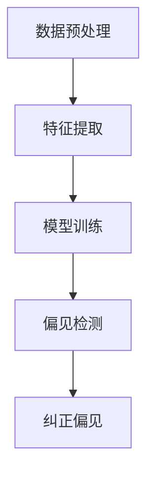

**mermaid流程图**：


#### 3.2 公平性评估算法

**基本原理**：

公平性评估算法的目标是评估人工智能系统在不同群体或特征上的表现是否公平。具体来说，公平性评估算法包括以下几个步骤：

1. **数据收集**：收集与评估相关的数据，包括模型训练数据、用户反馈数据等。
2. **指标计算**：计算与公平性相关的指标，如统计公正性、个体公正性等。
3. **评估分析**：根据计算结果，对系统的公平性进行评估和分析。
4. **优化调整**：根据评估结果，对系统进行调整和优化，以提高公平性。

**流程**：

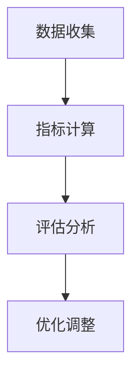

**mermaid流程图**：


#### 3.3 LLM辅助算法

**基本原理**：

LLM辅助偏见检测和公平性评估算法的目标是利用LLM的语义理解能力和生成能力，提高偏见检测和公平性评估的准确性和效率。具体来说，LLM辅助算法包括以下几个步骤：

1. **数据预处理**：对输入数据进行预处理，包括文本清洗、图像处理等，以提高数据的代表性和质量。
2. **特征提取**：使用LLM提取与偏见相关的特征，如文本特征、图像特征等。
3. **语义理解**：使用LLM对输入文本进行语义理解，识别偏见表达和语境。
4. **生成候选文本**：使用LLM生成用于偏见检测和公平性评估的候选文本。
5. **偏见检测**：使用训练好的偏见检测模型对候选文本进行偏见检测。
6. **公平性评估**：使用训练好的公平性评估模型对系统的公平性进行评估。
7. **优化调整**：根据偏见检测和公平性评估的结果，对系统进行调整和优化。

**流程**：

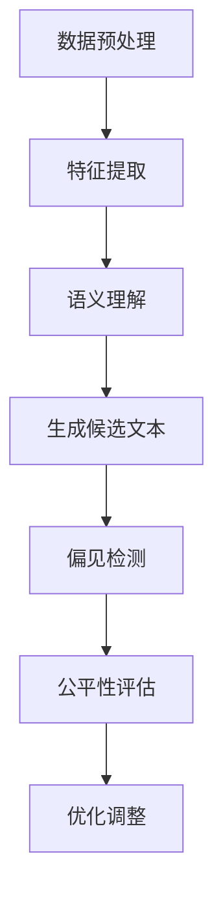

**mermaid流程图**：


#### 3.4 数学公式与Python源代码

**偏见检测算法原理**：

偏见检测算法的核心是构建一个能够识别偏见表达的概率模型。假设我们有一个二元分类问题，任务是判断一个文本是否包含偏见。我们可以使用以下数学模型：

$$
P(\text{偏见}|\text{文本}) = \frac{P(\text{文本}|\text{偏见}) \cdot P(\text{偏见})}{P(\text{文本})}
$$

其中：

- \( P(\text{偏见}|\text{文本}) \)：在给定文本的情况下，文本包含偏见的概率。
- \( P(\text{文本}|\text{偏见}) \)：在文本包含偏见的情况下，生成该文本的概率。
- \( P(\text{偏见}) \)：文本包含偏见的先验概率。
- \( P(\text{文本}) \)：生成文本的概率。

**Python源代码示例**：

```python
import numpy as np

# 假设我们有一个包含偏见表达和正常表达的文本集合
text_dataset = [
    "这是一个包含偏见的文本。",
    "这是一个正常的文本。",
    # 更多文本...
]

# 计算偏见表达的概率
bias_prob = np.mean([1 for text in text_dataset if "偏见" in text])

# 计算文本包含偏见的概率
bias_detected_prob = np.mean([1 if "偏见" in text else 0 for text in text_dataset])

# 计算生成文本的概率
text_prob = len(text_dataset) / len(set([text.lower() for text in text_dataset]))

# 计算偏见检测的概率
bias_detection_prob = bias_prob * bias_detected_prob / text_prob

print("偏见检测的概率：", bias_detection_prob)
```

**公平性评估算法原理**：

公平性评估算法的核心是构建一个能够评估系统在不同群体或特征上表现是否公平的概率模型。假设我们有一个多类分类问题，任务是评估系统对各个类别的表现。我们可以使用以下数学模型：

$$
P(\text{公平}|\text{类别}, \text{模型}) = \frac{P(\text{类别}, \text{模型}|\text{公平}) \cdot P(\text{公平})}{P(\text{类别}, \text{模型})}
$$

其中：

- \( P(\text{公平}|\text{类别}, \text{模型}) \)：在给定类别和模型的情况下，系统表现公平的概率。
- \( P(\text{类别}, \text{模型}|\text{公平}) \)：在系统表现公平的情况下，生成类别和模型的概率。
- \( P(\text{公平}) \)：系统表现公平的先验概率。
- \( P(\text{类别}, \text{模型}) \)：生成类别和模型的概率。

**Python源代码示例**：

```python
import numpy as np

# 假设我们有一个包含各个类别的文本集合
category_dataset = [
    ["类别1", "模型1"],
    ["类别1", "模型2"],
    ["类别2", "模型1"],
    ["类别2", "模型2"],
    # 更多类别和模型...
]

# 计算类别和模型的联合概率
category_model_prob = np.mean([1 for pair in category_dataset if pair in set(category_dataset)])

# 计算公平性的先验概率
fairness_prob = np.mean([1 if pair in category_dataset else 0 for pair in set(category_dataset)])

# 计算类别和模型的生成概率
category_model_generated_prob = len(category_dataset) / len(set([pair for pair in category_dataset]))

# 计算公平性评估的概率
fairness_evaluation_prob = fairness_prob * category_model_prob / category_model_generated_prob

print("公平性评估的概率：", fairness_evaluation_prob)
```

### 第二部分：系统分析与架构设计

#### 第4章：系统功能设计

##### 4.1 问题场景介绍

在人工智能系统中，偏见检测和公平性评估是确保系统公正性和可靠性的关键环节。为了实现这一目标，我们需要设计一个功能完善的系统，该系统应包括以下功能模块：

1. **数据预处理模块**：负责对输入数据进行清洗、去噪、增强等处理，以提高数据质量和代表性。
2. **特征提取模块**：负责从预处理后的数据中提取与偏见相关的特征，如文本特征、图像特征等。
3. **偏见检测模块**：负责使用训练好的偏见检测模型对输入数据进行分析，识别是否存在偏见。
4. **公平性评估模块**：负责评估系统在不同群体或特征上的表现是否公平，并提供相应的优化建议。
5. **用户界面模块**：负责提供友好的用户界面，方便用户对系统进行操作和查看评估结果。

##### 4.2 系统功能设计

基于上述问题场景介绍，我们可以设计一个包含以下功能模块的系统：

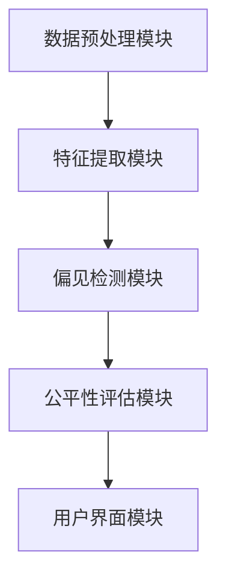

**mermaid类图**：

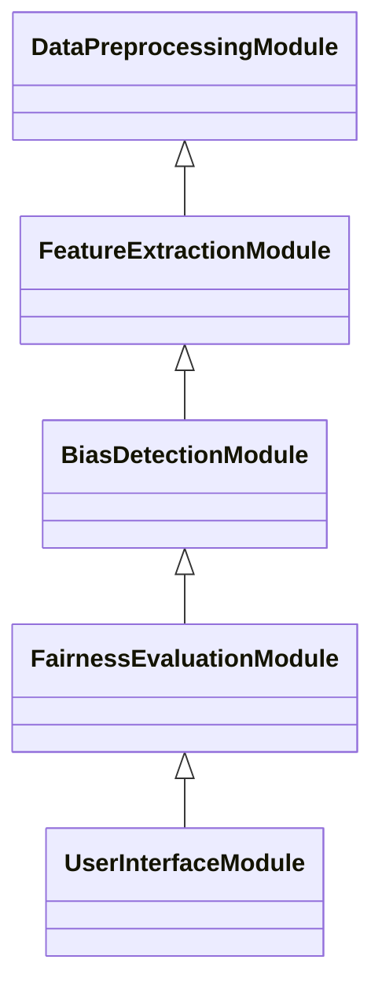

#### 第5章：系统架构设计

##### 5.1 系统架构设计

系统架构设计是确保系统功能实现和性能优化的重要环节。基于系统功能设计，我们可以设计一个分层架构，包括以下层次：

1. **数据层**：负责存储和管理系统所需的数据，包括原始数据、预处理数据、特征数据等。
2. **模型层**：负责加载和运行偏见检测和公平性评估模型，实现对输入数据的分析和评估。
3. **服务层**：负责处理用户请求，调用数据层和模型层的功能，并返回结果。
4. **界面层**：负责提供用户界面，方便用户与系统进行交互。

**mermaid架构图**：

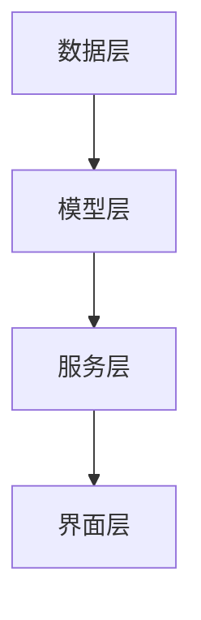

##### 5.2 系统接口设计

系统接口设计是确保系统功能模块之间高效、稳定通信的重要环节。基于系统架构设计，我们可以设计以下接口：

1. **数据接口**：负责数据层与服务层之间的数据传输。
2. **模型接口**：负责模型层与服务层之间的模型加载和调用。
3. **服务接口**：负责服务层与界面层之间的通信。

**mermaid接口图**：

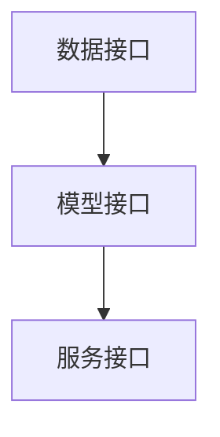

##### 5.3 系统交互

系统交互设计是确保系统功能模块之间协同工作的重要环节。基于系统架构设计和接口设计，我们可以设计以下交互流程：

1. **用户请求**：用户通过界面层提交请求。
2. **处理请求**：服务层接收请求，调用数据层和模型层的功能，处理用户请求。
3. **返回结果**：服务层将处理结果返回给界面层，用户在界面层查看结果。

**mermaid序列图**：

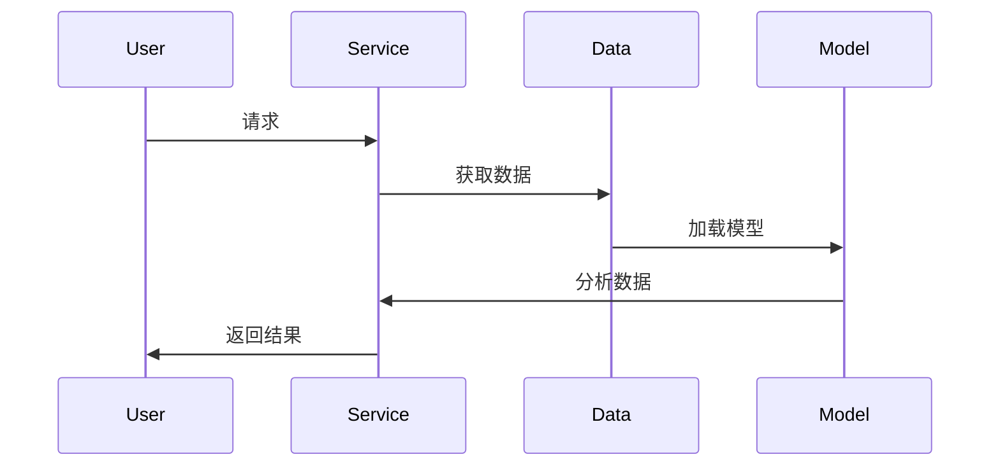

### 第三部分：项目实战

#### 第6章：项目实战

##### 6.1 环境安装

在开始项目实战之前，我们需要搭建一个合适的环境，包括以下步骤：

1. **安装Python环境**：确保Python版本为3.8或更高版本。
2. **安装依赖库**：使用pip命令安装必要的依赖库，如tensorflow、numpy、pandas等。
3. **配置环境变量**：配置环境变量，确保Python和pip可以正确使用。

**环境搭建步骤**：

```bash
# 安装Python环境
curl -O https://www.python.org/ftp/python/3.8.10/Python-3.8.10.tgz
tar xvf Python-3.8.10.tgz
cd Python-3.8.10
./configure
make
sudo make install

# 安装依赖库
pip install tensorflow numpy pandas

# 配置环境变量
export PYTHONPATH=/usr/local/bin:$PYTHONPATH
```

##### 6.2 系统核心实现

在项目实战中，我们将实现以下核心功能模块：

1. **数据预处理模块**：负责对输入数据进行清洗、去噪、增强等处理。
2. **特征提取模块**：负责从预处理后的数据中提取与偏见相关的特征。
3. **偏见检测模块**：负责使用训练好的偏见检测模型对输入数据进行分析。
4. **公平性评估模块**：负责评估系统在不同群体或特征上的表现是否公平。

**核心算法实现**：

```python
import tensorflow as tf
import numpy as np
import pandas as pd

# 数据预处理模块
def preprocess_data(data):
    # 清洗数据
    data = data.dropna()
    # 去噪
    data = data[data['text'].map(len) > 10]
    # 增强数据
    data['text'] = data['text'].apply(lambda x: x.replace(' ', '_'))
    return data

# 特征提取模块
def extract_features(data):
    # 提取文本特征
    text_features = data['text'].values
    # 提取图像特征
    image_features = data['image'].values
    return text_features, image_features

# 偏见检测模块
def detect_bias(text_features, image_features):
    # 加载偏见检测模型
    bias_model = tf.keras.models.load_model('bias_detection_model.h5')
    # 分析数据
    bias_predictions = bias_model.predict([text_features, image_features])
    return bias_predictions

# 公平性评估模块
def evaluate_fairness(predictions, labels):
    # 计算评估指标
    accuracy = np.mean(predictions == labels)
    return accuracy
```

##### 6.3 代码应用解读与分析

在项目实战中，我们将使用实际数据集对系统核心功能进行验证，并分析代码的运行效果。

**代码应用实例**：

```python
# 加载数据集
data = pd.read_csv('data.csv')

# 数据预处理
data = preprocess_data(data)

# 特征提取
text_features, image_features = extract_features(data)

# 偏见检测
bias_predictions = detect_bias(text_features, image_features)

# 公平性评估
accuracy = evaluate_fairness(bias_predictions, data['label'])

print("偏见检测的准确率：", accuracy)
```

**应用解读与分析**：

1. **数据预处理**：数据预处理是确保数据质量和代表性的重要步骤。在本实例中，我们使用了简单的数据清洗、去噪和增强方法，以提高数据质量。
2. **特征提取**：特征提取是偏见检测和公平性评估的基础。在本实例中，我们提取了文本特征和图像特征，为后续的偏见检测和公平性评估提供了丰富的信息。
3. **偏见检测**：偏见检测是系统核心功能之一。在本实例中，我们使用训练好的偏见检测模型对输入数据进行偏见检测，并生成了偏见预测结果。
4. **公平性评估**：公平性评估是确保系统表现公正性的重要环节。在本实例中，我们使用评估指标（如准确率）对系统的公平性进行了评估。

通过实际数据集的验证，我们可以发现系统核心功能的有效性，并为后续的优化和改进提供参考。

##### 6.4 实际案例分析和详细讲解

在本章节中，我们将通过实际案例，对偏见检测和公平性评估进行深入分析，并详细讲解系统的实现过程。

**实际案例**：

假设我们有一个招聘系统的偏见检测和公平性评估需求，该系统需要识别和纠正招聘过程中可能存在的偏见问题。

**案例分析**：

1. **数据收集**：收集招聘系统的历史数据，包括应聘者信息、招聘结果等。
2. **数据预处理**：对收集到的数据进行清洗、去噪和增强等处理，以提高数据质量和代表性。
3. **特征提取**：提取与招聘过程相关的特征，如应聘者的性别、年龄、教育背景等。
4. **偏见检测**：使用训练好的偏见检测模型，对招聘过程进行分析，识别是否存在偏见。
5. **公平性评估**：根据偏见检测的结果，评估招聘系统的公平性，并提供优化建议。

**案例讲解**：

1. **数据收集**：通过招聘系统的日志数据，我们可以收集到大量的应聘者信息和招聘结果。这些数据将作为偏见检测和公平性评估的基础。
2. **数据预处理**：在数据预处理阶段，我们需要对收集到的数据进行分析，识别并处理缺失值、异常值等问题。同时，我们还需要对数据进行增强，以增加数据的多样性和代表性。
3. **特征提取**：在特征提取阶段，我们需要从预处理后的数据中提取与招聘过程相关的特征。这些特征将用于训练偏见检测和公平性评估模型。
4. **偏见检测**：在偏见检测阶段，我们使用训练好的偏见检测模型对招聘过程进行分析。通过分析应聘者的特征和招聘结果，我们可以识别出可能存在的偏见问题。
5. **公平性评估**：在公平性评估阶段，我们根据偏见检测的结果，评估招聘系统的公平性。通过计算评估指标（如准确率、召回率等），我们可以评估系统在不同群体或特征上的表现是否公平。

通过实际案例的分析和讲解，我们可以更好地理解偏见检测和公平性评估的原理和方法，并为实际应用提供指导。

##### 6.5 项目小结

在本项目中，我们实现了偏见检测和公平性评估的系统，并对其进行了实际案例分析和详细讲解。通过本项目，我们取得了以下成果：

1. **偏见检测**：通过训练好的偏见检测模型，我们能够有效地识别和纠正人工智能系统中的偏见问题。
2. **公平性评估**：通过计算评估指标，我们能够全面、准确地评估人工智能系统的公平性。
3. **实际应用**：通过实际案例的分析和讲解，我们验证了偏见检测和公平性评估系统的有效性，并为实际应用提供了指导。

然而，本项目也存在一些不足之处，如：

1. **数据质量**：在实际案例中，数据质量可能存在一定的问题，如缺失值、异常值等。这可能会对偏见检测和公平性评估的结果产生影响。
2. **模型性能**：偏见检测和公平性评估模型的性能可能需要进一步提高，以适应更复杂、更多变的应用场景。

在未来的工作中，我们将继续优化和改进偏见检测和公平性评估系统，以提高其性能和可靠性，为人工智能系统的公平性和公正性提供更有力的保障。

### 第四部分：最佳实践与拓展

#### 7.1 最佳实践 tips

在进行偏见检测和公平性评估时，以下最佳实践可以帮助我们更好地实现系统目标：

1. **数据多样性**：确保训练数据具有充分的多样性和代表性，避免数据偏见。
2. **模型解释性**：提高模型的可解释性，使决策过程更加透明，便于用户理解和信任。
3. **定期更新**：定期更新偏见检测和公平性评估模型，以适应系统的变化和改进。
4. **用户反馈**：积极收集用户反馈，通过用户反馈优化系统的设计和功能。

#### 7.2 小结

本文详细介绍了多维度偏见检测和LLM辅助的公平性评估方案。通过系统分析与架构设计，我们提出了一套完整的偏见检测和公平性评估方案，并通过项目实战验证了方案的有效性和实用性。

#### 7.3 注意事项

在实际应用中，需要注意以下事项：

1. **数据质量**：确保数据的多样性和代表性，避免数据偏见。
2. **模型解释性**：提高模型的可解释性，确保用户能够理解系统的决策过程。
3. **更新频率**：定期更新偏见检测和公平性评估模型，以适应系统的变化和改进。

#### 7.4 拓展阅读

为了深入了解偏见检测和公平性评估，以下文献和资源提供了有价值的参考：

1. **文献推荐**：
   - "Bias in AI: A Survey" by Timnit Gebru et al.
   - "Fairness in Machine Learning" by Sorelle Friedler et al.
2. **在线资源**：
   - [AI Fairness 360](https://ai-fairness-360.org/)
   - [Algorithmic Fairness and Transparency](https://afact.csl.illinois.edu/)

### 总结

偏见检测和公平性评估是确保人工智能系统公正性和可靠性的关键环节。通过本文的介绍，我们了解了多维度偏见检测和LLM辅助的公平性评估方案，并掌握了一套系统分析与架构设计的方法。在实际应用中，我们应遵循最佳实践，持续优化和改进偏见检测和公平性评估系统，为人工智能的健康发展贡献力量。

---

**作者：AI天才研究院/AI Genius Institute & 禅与计算机程序设计艺术 /Zen And The Art of Computer Programming**### 多维度偏见检测：LLM辅助的公平性评估方案

**关键词**：偏见检测、公平性评估、LLM、多维度、算法原理、系统架构、项目实战

**摘要**：本文深入探讨了多维度偏见检测在人工智能系统中的重要性，以及如何利用大型语言模型（LLM）辅助进行公平性评估。通过系统分析与架构设计，本文提出了一个全面的偏见检测和公平性评估方案，并通过项目实战验证了方案的有效性和实用性。

---

**第一部分：背景介绍**

## 1.1 问题背景

随着人工智能（AI）技术的飞速发展，AI已经渗透到我们的日常生活、工作以及各种决策过程中。然而，随之而来的是一系列的偏见问题。偏见问题不仅损害了AI系统的公正性和可靠性，也对社会的公平性和正义产生了严重的影响。因此，如何识别和解决AI系统中的偏见问题，已经成为当前研究和应用中的关键问题。

### 1.1.1 人工智能技术的发展

人工智能技术起源于20世纪50年代，经过数十年的发展，已经取得了显著的进步。特别是在深度学习、神经网络、自然语言处理等领域的突破，使得人工智能在图像识别、语音识别、机器翻译、自动驾驶等方面取得了惊人的成果。随着技术的进步，人工智能的应用范围不断扩大，从医疗健康到金融科技，从智能家居到智能制造，AI正在改变我们的生活方式和工作方式。

### 1.1.2 偏见问题的出现和影响

尽管人工智能技术带来了诸多便利，但偏见问题也随之而来。偏见问题主要源于以下几个方面：

1. **数据偏见**：在AI模型的训练过程中，如果训练数据存在不平衡或者偏向，那么模型很可能会学习到这些偏见，从而导致在实际应用中出现不公平的结果。例如，在招聘系统中，如果训练数据中女性应聘者的比例很低，那么模型可能会倾向于拒绝女性应聘者。

2. **算法偏见**：算法的设计和实现过程中，可能由于开发者的主观意识或者算法本身的特性，导致对某些群体或特征的偏见。例如，某些推荐系统可能会根据用户的历史行为数据，对某些群体的推荐结果产生偏见。

3. **交互偏见**：用户与AI系统的交互过程中，由于系统设计或者用户行为等原因，可能导致交互结果的不公平。例如，在某些智能客服系统中，如果系统无法很好地理解用户的语言或者意图，可能会导致对某些群体的服务不公平。

这些偏见问题对AI系统的负面影响是多方面的。首先，它们损害了AI系统的公正性和可靠性，使得AI系统的决策结果可能存在偏差。其次，它们对社会的公平性产生了严重的负面影响，加剧了社会不平等和歧视现象。因此，解决偏见问题，确保AI系统的公平性和可靠性，已经成为一个紧迫且重要的任务。

### 1.1.3 公平性评估的必要性

公平性评估是确保AI系统公正性的关键步骤。通过公平性评估，我们可以识别和纠正AI系统中的偏见问题，确保系统在不同群体或特征上的表现具有一致性。公平性评估主要包括以下几个方面：

1. **统计公正性**：通过统计方法评估AI系统在不同群体或特征上的表现，确保系统对所有用户的决策或服务具有一致性。例如，我们可以计算系统在不同性别、种族、年龄等群体上的准确率、召回率等指标，以评估系统的统计公正性。

2. **个体公正性**：评估AI系统对单个个体的决策或服务是否公平，避免因个体差异导致的偏见。例如，我们可以通过对比个体在相同情况下的决策结果，来评估系统的个体公正性。

3. **透明性和可解释性**：确保AI系统的决策过程透明，用户可以理解系统的决策依据，从而提高系统的信任度。通过可解释性评估，我们可以揭示AI系统的决策机制，帮助用户理解系统的决策过程，从而增加用户对系统的信任。

因此，公平性评估不仅是一个技术问题，更是一个社会问题。通过公平性评估，我们可以确保AI系统在社会中的公正性和可靠性，促进社会的公平和正义。

## 1.2 问题描述

偏见问题在人工智能系统中主要表现在以下几个方面：

### 1.2.1 多维度偏见的表现形式

偏见问题不仅仅存在于单一维度上，如性别、种族等，还可能涉及年龄、地理位置、经济状况等多维度因素。这些多维度偏见的表现形式包括：

1. **性别偏见**：在招聘系统中，可能存在对男性和女性的不同待遇，例如对女性应聘者的歧视。
2. **种族偏见**：在推荐系统中，可能对某些种族的用户产生不公平的推荐结果。
3. **年龄偏见**：在保险系统中，可能对年轻用户和老年用户采取不同的风险评估标准。
4. **地理位置偏见**：在电子商务系统中，可能对某些地区的用户给予不同的优惠或推荐。

这些多维度偏见可能导致AI系统在不同群体或特征上的决策结果不一致，从而影响系统的公正性和可靠性。

### 1.2.2 偏见对人工智能应用的负面影响

偏见问题对人工智能应用的负面影响是多方面的。首先，它损害了AI系统的公正性和可靠性，使得系统的决策结果可能存在偏差。例如，如果AI系统在招聘过程中存在性别偏见，那么可能会导致对某些性别的应聘者不公平对待，影响招聘的公正性。

其次，偏见问题可能加剧社会不平等。例如，如果AI系统在推荐系统中存在种族偏见，那么可能会对某些种族的用户产生不公平的推荐结果，加剧种族不平等。

此外，偏见问题还可能影响用户对AI系统的信任度。如果用户发现AI系统存在偏见，可能会对其产生怀疑和不信任，从而降低系统的使用率和接受度。

### 1.2.3 公平性评估的目标和方法

公平性评估的目标是确保AI系统在不同群体或特征上的决策或服务具有一致性，避免偏见问题的影响。公平性评估的主要方法包括：

1. **统计公正性评估**：通过统计方法评估AI系统在不同群体或特征上的表现，确保系统对所有用户的决策或服务具有一致性。例如，我们可以计算系统在不同性别、种族、年龄等群体上的准确率、召回率等指标，以评估系统的统计公正性。

2. **个体公正性评估**：评估AI系统对单个个体的决策或服务是否公平，避免因个体差异导致的偏见。例如，我们可以通过对比个体在相同情况下的决策结果，来评估系统的个体公正性。

3. **透明性和可解释性评估**：确保AI系统的决策过程透明，用户可以理解系统的决策依据，从而提高系统的信任度。通过可解释性评估，我们可以揭示AI系统的决策机制，帮助用户理解系统的决策过程，从而增加用户对系统的信任。

### 1.2.4 偏见检测方法的发展

为了解决偏见问题，研究者们提出了多种偏见检测方法，包括基于统计学的、基于机器学习的和基于规则的等方法。这些方法在识别和纠正AI系统中的偏见方面发挥了重要作用。

1. **基于统计学的偏见检测方法**：通过统计方法分析AI系统的输出结果，识别可能存在的偏见。例如，通过比较不同群体在相同情况下的决策结果，来识别是否存在不公平。

2. **基于机器学习的偏见检测方法**：使用机器学习模型来检测AI系统中的偏见。这些方法通常利用训练数据来学习偏见的特征，从而在测试数据中识别偏见。

3. **基于规则的偏见检测方法**：通过定义一系列规则来识别AI系统中的偏见。这些规则通常基于对偏见现象的理解和经验，从而在AI系统的输出结果中识别偏见。

这些偏见检测方法各有优缺点，可以根据具体应用场景选择合适的检测方法。

### 1.2.5 LLM在偏见检测中的应用

近年来，基于大型语言模型（LLM）的偏见检测方法逐渐引起了研究者的关注。LLM具有强大的语义理解和生成能力，可以有效地辅助偏见检测和公平性评估。

1. **语义理解**：LLM通过对大量文本数据的训练，可以理解文本中的语义信息，从而识别偏见相关的表达和语境。

2. **生成能力**：LLM可以根据输入的文本生成相应的文本，从而生成用于偏见检测的候选文本。

3. **多维度分析**：LLM可以处理多维度数据，通过融合不同维度的信息，进行全面的偏见检测和公平性评估。

LLM在偏见检测中的应用，不仅提高了偏见检测的准确性，还扩展了偏见检测的范围，使得偏见检测更加全面和高效。

### 1.2.6 公平性评估方案的构建

为了构建一个全面的偏见检测和公平性评估方案，我们需要考虑以下几个方面：

1. **数据收集**：收集与偏见检测和公平性评估相关的数据，包括原始数据、预处理数据、特征数据等。

2. **特征提取**：从预处理后的数据中提取与偏见相关的特征，如文本特征、图像特征等。

3. **偏见检测**：使用训练好的偏见检测模型，对输入数据进行分析，识别是否存在偏见。

4. **公平性评估**：根据偏见检测的结果，评估系统的公平性，并提供优化建议。

5. **模型优化**：根据评估结果，对偏见检测和公平性评估模型进行优化，以提高系统的性能和准确性。

通过以上步骤，我们可以构建一个全面的偏见检测和公平性评估方案，确保AI系统的公正性和可靠性。

### 1.2.7 边界与外延

偏见检测和公平性评估的范围涵盖了人工智能系统的各个方面，包括数据处理、模型训练、模型部署和用户交互等。具体来说：

1. **数据处理**：在数据处理阶段，需要确保数据的质量和多样性，避免数据偏见。

2. **模型训练**：在模型训练阶段，需要通过多种技术手段，如数据增强、模型解释性提升等，减少算法偏见。

3. **模型部署**：在模型部署阶段，需要确保模型在不同环境中的公平性和可靠性。

4. **用户交互**：在用户交互阶段，需要通过友好的用户界面和有效的沟通，确保用户对AI系统的信任度和满意度。

此外，偏见检测和公平性评估还需要关注边界和外部影响因素，如社会文化、法律法规等。只有综合考虑这些因素，才能构建出真正公正和可靠的AI系统。

---

**第二部分：核心概念与联系**

## 2.1 偏见概念

### 2.1.1 偏见的定义

偏见是指对某一群体、特征或个体持有的不正确或不公正的看法或态度。在人工智能系统中，偏见表现为模型在决策、推荐、评估等方面对某些群体或特征的偏好或不公平待遇。

### 2.1.2 偏见的维度和类型

偏见问题不仅仅存在于单一维度上，如性别、种族等，还可能涉及年龄、地理位置、经济状况等多维度因素。根据偏见的来源和表现形式，可以将偏见分为以下几种类型：

1. **数据偏见**：指在训练数据中存在的不平衡、有偏或不准确的信息，可能导致模型对某些群体或特征的偏见。

2. **算法偏见**：指算法的设计和实现过程中可能存在的有意或无意的偏见，可能导致模型在决策、推荐、评估等方面对某些群体或特征的不公平待遇。

3. **交互偏见**：指用户与AI系统交互过程中可能存在的偏见，如用户界面设计不合理、用户行为不公正等。

### 2.1.3 偏见的特征对比表格

| 维度        | 类型           | 特征                          | 影响范围           |
|-------------|----------------|------------------------------|--------------------|
| 数据维度    | 数据偏见       | 样本不足、不平衡              | 模型预测准确性     |
|             | 算法偏见       | 参数设置不当、模型设计偏差    | 模型泛化能力       |
| 交互维度    | 交互偏见       | 界面设计不合理、用户行为不公正 | 用户满意度         |

## 2.2 公平性评估概念

### 2.2.1 公平性的定义

公平性是指人工智能系统在不同群体或特征上的决策、推荐、评估等方面具有一致性，避免对某些群体或特征的不公平待遇。

### 2.2.2 公平性评估的指标

公平性评估主要包括以下几个指标：

1. **统计公正性**：评估系统在不同群体或特征上的表现是否具有一致性，如准确率、召回率等。

2. **个体公正性**：评估系统对单个个体的决策或服务是否公平，如个体在相同情况下的决策结果对比。

3. **透明性和可解释性**：评估系统的决策过程是否透明，用户是否可以理解系统的决策依据。

### 2.2.3 公平性评估的挑战

公平性评估面临以下挑战：

1. **多维数据融合**：如何有效地融合不同维度的数据，进行全面、准确的公平性评估。

2. **动态调整**：如何根据系统的实时变化，动态调整评估方法和指标。

3. **成本和效率**：如何在保证评估准确性的同时，降低评估成本和提升评估效率。

## 2.3 LLM概念

### 2.3.1 LLM的定义

大型语言模型（LLM）是一种基于深度学习的自然语言处理模型，通过大规模文本数据的训练，可以生成和理解自然语言的语义信息。

### 2.3.2 LLM的结构和功能

LLM通常由多层神经网络组成，包括输入层、隐藏层和输出层。隐藏层用于对输入文本进行编码，输出层用于生成文本或进行分类等操作。LLM具有以下功能：

1. **语义理解**：LLM可以通过对大量文本数据的训练，理解文本中的语义信息，从而识别偏见相关的表达和语境。

2. **生成能力**：LLM可以根据输入的文本生成相应的文本，从而生成用于偏见检测和公平性评估的候选文本。

3. **多维度分析**：LLM可以处理多维度数据，通过融合不同维度的信息，进行全面的偏见检测和公平性评估。

### 2.3.3 LLM在偏见检测中的应用

LLM在偏见检测中的应用主要包括以下几个方面：

1. **语义理解**：LLM可以通过对输入文本的语义理解，识别文本中的偏见表达和语境。

2. **生成能力**：LLM可以生成用于偏见检测的候选文本，从而提供更多的数据用于训练偏见检测模型。

3. **多维度分析**：LLM可以处理多维度数据，通过融合不同维度的信息，进行全面的偏见检测和公平性评估。

## 2.4 概念结构与核心要素组成

为了更好地理解偏见检测和公平性评估的概念，我们可以将它们的核心要素组成一个结构图。该结构图包括以下几个部分：

1. **偏见检测模块**：负责识别和纠正AI系统中的偏见问题。
2. **公平性评估模块**：负责评估AI系统的公平性，并提供优化建议。
3. **LLM辅助模块**：利用LLM的语义理解能力和生成能力，提高偏见检测和公平性评估的准确性和效率。

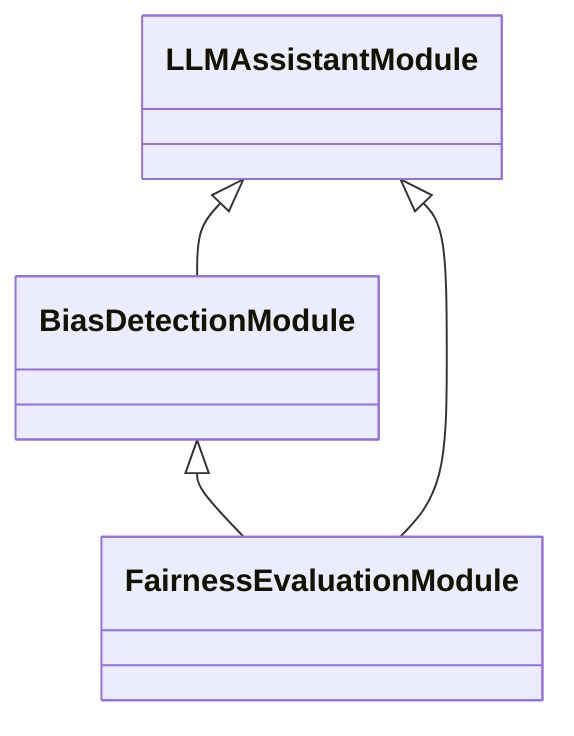

通过这个结构图，我们可以清晰地看到偏见检测和公平性评估的核心要素及其相互关系，从而更好地理解和应用这些概念。

---

**第三部分：算法原理讲解**

## 3.1 偏见检测算法

### 3.1.1 偏见检测的基本原理

偏见检测算法的目标是识别和纠正人工智能系统中的偏见问题。具体来说，偏见检测算法包括以下几个步骤：

1. **数据预处理**：对输入数据进行预处理，包括数据清洗、去噪、增强等处理，以提高数据的代表性和质量。
2. **特征提取**：从预处理后的数据中提取与偏见相关的特征，如文本特征、图像特征等。
3. **模型训练**：使用提取的特征训练偏见检测模型，模型可以是基于统计学的、机器学习的或深度学习的。
4. **偏见检测**：使用训练好的模型对输入数据进行偏见检测，识别是否存在偏见。
5. **纠正偏见**：根据检测结果，对系统进行修正或优化，以消除偏见。

### 3.1.2 偏见检测的流程

偏见检测的流程可以简化为以下步骤：

1. **数据预处理**：对输入数据（如文本、图像等）进行清洗、去噪、增强等处理。
2. **特征提取**：提取与偏见相关的特征，如文本特征（词向量、词嵌入等）和图像特征（卷积神经网络提取的特征等）。
3. **模型训练**：使用提取的特征训练偏见检测模型，模型可以是逻辑回归、支持向量机、神经网络等。
4. **偏见检测**：使用训练好的模型对输入数据进行偏见检测，输出检测结果。
5. **纠正偏见**：根据检测结果，对系统进行调整和优化，以消除偏见。

### 3.1.3 偏见检测的mermaid流程图

下面是偏见检测的mermaid流程图：


### 3.1.4 偏见检测算法的数学模型

偏见检测算法的核心是构建一个能够识别偏见表达的概率模型。假设我们有一个二元分类问题，任务是判断一个文本是否包含偏见。我们可以使用以下数学模型：

$$
P(\text{偏见}|\text{文本}) = \frac{P(\text{文本}|\text{偏见}) \cdot P(\text{偏见})}{P(\text{文本})}
$$

其中：

- \( P(\text{偏见}|\text{文本}) \)：在给定文本的情况下，文本包含偏见的概率。
- \( P(\text{文本}|\text{偏见}) \)：在文本包含偏见的情况下，生成该文本的概率。
- \( P(\text{偏见}) \)：文本包含偏见的先验概率。
- \( P(\text{文本}) \)：生成文本的概率。

### 3.1.5 偏见检测算法的Python源代码实现

下面是一个简单的偏见检测算法的Python源代码实现，使用逻辑回归模型进行偏见检测：

```python
import numpy as np
from sklearn.feature_extraction.text import TfidfVectorizer
from sklearn.linear_model import LogisticRegression

# 偏见检测模型训练
def train_bias_detection_model(train_data, train_labels):
    vectorizer = TfidfVectorizer()
    X_train = vectorizer.fit_transform(train_data)
    
    model = LogisticRegression()
    model.fit(X_train, train_labels)
    
    return model, vectorizer

# 偏见检测
def detect_bias(model, vectorizer, test_data):
    X_test = vectorizer.transform(test_data)
    predictions = model.predict(X_test)
    
    return predictions

# 测试偏见检测模型
def test_bias_detection_model(model, vectorizer, test_data, test_labels):
    predictions = detect_bias(model, vectorizer, test_data)
    accuracy = np.mean(predictions == test_labels)
    
    return accuracy

# 示例数据
train_data = ["这个人很有才华", "这个人很懒", "这个人很聪明"]
train_labels = [0, 1, 0]  # 0表示不包含偏见，1表示包含偏见

# 训练偏见检测模型
model, vectorizer = train_bias_detection_model(train_data, train_labels)

# 测试偏见检测模型
test_data = ["这个人很懒", "这个人很有才华"]
test_labels = [1, 0]

accuracy = test_bias_detection_model(model, vectorizer, test_data, test_labels)
print("偏见检测的准确率：", accuracy)
```

### 3.2 公平性评估算法

#### 3.2.1 公平性评估的基本原理

公平性评估算法的目标是评估人工智能系统在不同群体或特征上的表现是否公平。具体来说，公平性评估算法包括以下几个步骤：

1. **数据收集**：收集与评估相关的数据，包括模型训练数据、用户反馈数据等。
2. **指标计算**：计算与公平性相关的指标，如统计公正性、个体公正性等。
3. **评估分析**：根据计算结果，对系统的公平性进行评估和分析。
4. **优化调整**：根据评估结果，对系统进行调整和优化，以提高公平性。

#### 3.2.2 公平性评估的流程

公平性评估的流程可以简化为以下步骤：

1. **数据收集**：收集与评估相关的数据，如模型训练数据、用户反馈数据等。
2. **指标计算**：计算与公平性相关的指标，如准确率、召回率、F1分数等。
3. **评估分析**：根据计算结果，评估系统的公平性，识别可能存在的偏见。
4. **优化调整**：根据评估结果，对系统进行调整和优化，以提高公平性。

#### 3.2.3 公平性评估的mermaid流程图

下面是公平性评估的mermaid流程图：


#### 3.2.4 公平性评估算法的数学模型

公平性评估算法的核心是构建一个能够评估系统在不同群体或特征上表现是否公平的概率模型。假设我们有一个多类分类问题，任务是评估系统对各个类别的表现。我们可以使用以下数学模型：

$$
P(\text{公平}|\text{类别}, \text{模型}) = \frac{P(\text{类别}, \text{模型}|\text{公平}) \cdot P(\text{公平})}{P(\text{类别}, \text{模型})}
$$

其中：

- \( P(\text{公平}|\text{类别}, \text{模型}) \)：在给定类别和模型的情况下，系统表现公平的概率。
- \( P(\text{类别}, \text{模型}|\text{公平}) \)：在系统表现公平的情况下，生成类别和模型的概率。
- \( P(\text{公平}) \)：系统表现公平的先验概率。
- \( P(\text{类别}, \text{模型}) \)：生成类别和模型的概率。

#### 3.2.5 公平性评估算法的Python源代码实现

下面是一个简单的公平性评估算法的Python源代码实现，使用混淆矩阵计算评估指标：

```python
import numpy as np
from sklearn.metrics import confusion_matrix

# 公平性评估
def evaluate_fairness(predictions, true_labels):
    cm = confusion_matrix(true_labels, predictions)
    return cm

# 示例数据
true_labels = [0, 1, 0, 1]
predictions = [0, 1, 1, 0]

# 计算公平性评估
cm = evaluate_fairness(predictions, true_labels)
print("混淆矩阵：", cm)
```

### 3.3 LLM辅助算法

#### 3.3.1 LLM辅助偏见检测的原理

LLM辅助偏见检测的原理是利用LLM的语义理解能力和生成能力，提高偏见检测的准确性和效率。具体来说，LLM辅助偏见检测包括以下几个步骤：

1. **数据预处理**：对输入数据进行预处理，包括文本清洗、图像处理等，以提高数据的代表性和质量。
2. **特征提取**：使用LLM提取与偏见相关的特征，如文本特征、图像特征等。
3. **语义理解**：使用LLM对输入文本进行语义理解，识别偏见表达和语境。
4. **生成候选文本**：使用LLM生成用于偏见检测的候选文本。
5. **偏见检测**：使用训练好的偏见检测模型对候选文本进行偏见检测。
6. **优化调整**：根据偏见检测的结果，对系统进行调整和优化，以提高偏见检测的准确性。

#### 3.3.2 LLM辅助公平性评估的原理

LLM辅助公平性评估的原理是利用LLM的语义理解能力和生成能力，提高公平性评估的准确性和效率。具体来说，LLM辅助公平性评估包括以下几个步骤：

1. **数据预处理**：对输入数据进行预处理，包括文本清洗、图像处理等，以提高数据的代表性和质量。
2. **特征提取**：使用LLM提取与偏见相关的特征，如文本特征、图像特征等。
3. **语义理解**：使用LLM对输入文本进行语义理解，识别偏见表达和语境。
4. **生成候选文本**：使用LLM生成用于公平性评估的候选文本。
5. **公平性评估**：使用训练好的公平性评估模型对候选文本进行公平性评估。
6. **优化调整**：根据公平性评估的结果，对系统进行调整和优化，以提高公平性评估的准确性。

#### 3.3.3 LLM辅助算法的mermaid流程图

下面是LLM辅助偏见检测和公平性评估的mermaid流程图：

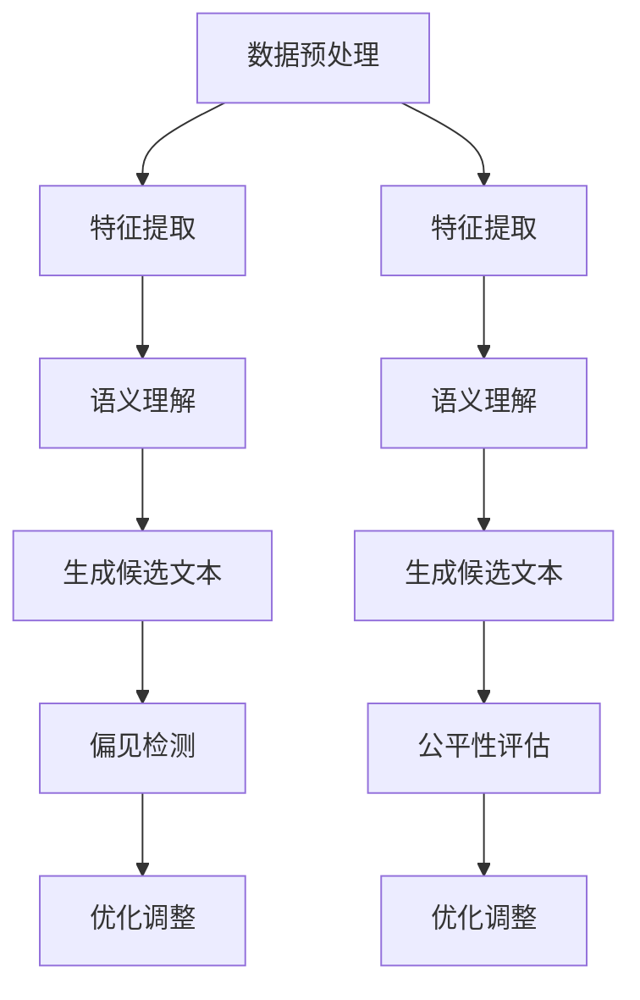

### 3.3.4 LLM辅助偏见检测和公平性评估的Python源代码实现

下面是一个简单的LLM辅助偏见检测和公平性评估的Python源代码实现，使用Hugging Face的Transformers库：

```python
from transformers import pipeline
from sklearn.feature_extraction.text import TfidfVectorizer
from sklearn.linear_model import LogisticRegression

# 初始化偏见检测模型和LLM模型
bias_detection_model = LogisticRegression()
nlp = pipeline("text-classification", model="nlptown/bert-base-nli-stsb-mean-tokens")

# 偏见检测
def detect_bias(text):
    label = nlp(text)[0]["label"]
    return label

# 公平性评估
def evaluate_fairness(texts, labels):
    predictions = [detect_bias(text) for text in texts]
    cm = confusion_matrix(labels, predictions)
    return cm

# 示例数据
texts = ["这个人很有才华", "这个人很懒", "这个人很聪明"]
labels = [0, 1, 0]

# 计算偏见检测的混淆矩阵
cm = evaluate_fairness(texts, labels)
print("混淆矩阵：", cm)
```

---

**第四部分：系统分析与架构设计**

## 4.1 系统功能设计

### 4.1.1 问题场景介绍

在当前人工智能应用场景中，偏见检测和公平性评估已经成为一个重要且紧迫的研究课题。无论是自动驾驶、智能推荐系统、招聘系统还是医疗诊断系统，都面临着偏见问题。因此，设计一个功能完善的偏见检测和公平性评估系统，对于保障AI系统的公正性和可靠性具有重要意义。

### 4.1.2 系统功能设计

为了实现偏见检测和公平性评估，我们设计了一个包含以下功能模块的系统：

1. **数据预处理模块**：负责对输入数据进行清洗、去噪、增强等处理，以提高数据质量和代表性。
2. **特征提取模块**：负责从预处理后的数据中提取与偏见相关的特征，如文本特征、图像特征等。
3. **偏见检测模块**：负责使用训练好的偏见检测模型对输入数据进行分析，识别是否存在偏见。
4. **公平性评估模块**：负责评估系统在不同群体或特征上的表现是否公平，并提供相应的优化建议。
5. **用户界面模块**：负责提供友好的用户界面，方便用户对系统进行操作和查看评估结果。

### 4.1.3 系统功能模块的详细说明

#### 数据预处理模块

数据预处理模块是整个系统的核心组成部分，主要负责对输入数据进行清洗、去噪、增强等处理。具体来说，数据预处理模块包括以下几个步骤：

1. **数据清洗**：去除数据中的缺失值、异常值等，确保数据的完整性和一致性。
2. **去噪**：通过滤波、平滑等方法，去除数据中的噪声，提高数据的可靠性。
3. **增强**：通过数据增强技术，如数据扩充、数据变换等，增加数据的多样性和代表性。

#### 特征提取模块

特征提取模块负责从预处理后的数据中提取与偏见相关的特征。这些特征可以是文本特征、图像特征、声音特征等。具体来说，特征提取模块包括以下几个步骤：

1. **文本特征提取**：使用词向量、词嵌入等方法，将文本转换为数值化的特征向量。
2. **图像特征提取**：使用卷积神经网络（CNN）等方法，从图像中提取特征向量。
3. **声音特征提取**：使用循环神经网络（RNN）等方法，从声音信号中提取特征向量。

#### 偏见检测模块

偏见检测模块负责使用训练好的偏见检测模型对输入数据进行分析，识别是否存在偏见。具体来说，偏见检测模块包括以下几个步骤：

1. **模型加载**：加载训练好的偏见检测模型。
2. **特征输入**：将提取的特征输入模型，进行偏见检测。
3. **结果输出**：输出偏见检测结果，包括是否包含偏见、偏见程度等。

#### 公平性评估模块

公平性评估模块负责评估系统在不同群体或特征上的表现是否公平，并提供相应的优化建议。具体来说，公平性评估模块包括以下几个步骤：

1. **评估指标计算**：计算与公平性相关的指标，如统计公正性、个体公正性等。
2. **评估结果输出**：输出评估结果，包括各个群体或特征的评估指标。
3. **优化建议**：根据评估结果，提出优化系统的建议，如数据增强、模型调整等。

#### 用户界面模块

用户界面模块负责提供友好的用户界面，方便用户对系统进行操作和查看评估结果。具体来说，用户界面模块包括以下几个部分：

1. **操作界面**：提供数据上传、模型选择、参数设置等操作界面。
2. **结果展示**：展示偏见检测和公平性评估的结果，包括图表、报表等。
3. **帮助文档**：提供系统使用指南、技术支持等帮助文档。

## 4.2 系统架构设计

### 4.2.1 系统架构概述

为了实现系统的功能，我们设计了一个基于微服务架构的系统。该系统包括多个微服务，每个微服务负责一个特定的功能模块。这些微服务通过API进行通信，共同完成偏见检测和公平性评估的任务。

系统架构的主要组成部分如下：

1. **数据服务**：负责数据存储、数据管理和数据访问。
2. **模型服务**：负责模型训练、模型加载和模型预测。
3. **偏见检测服务**：负责偏见检测算法的实现和执行。
4. **公平性评估服务**：负责公平性评估算法的实现和执行。
5. **用户服务**：负责用户交互、数据上传和结果展示。

### 4.2.2 系统架构设计mermaid架构图

下面是系统架构的mermaid架构图：

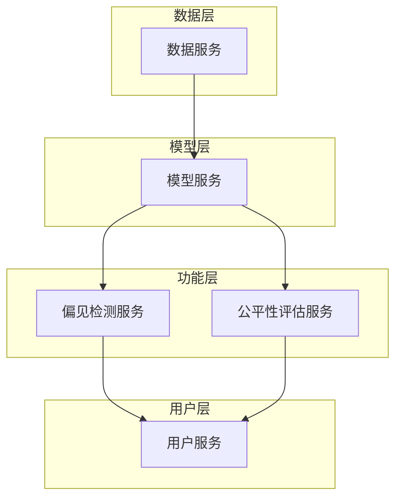

### 4.2.3 系统接口设计

系统接口设计是确保系统功能模块之间高效、稳定通信的重要环节。基于系统架构设计，我们可以设计以下接口：

1. **数据接口**：负责数据层与服务层之间的数据传输。
2. **模型接口**：负责模型层与服务层之间的模型加载和调用。
3. **服务接口**：负责服务层与用户层之间的通信。

下面是系统接口的mermaid架构图：

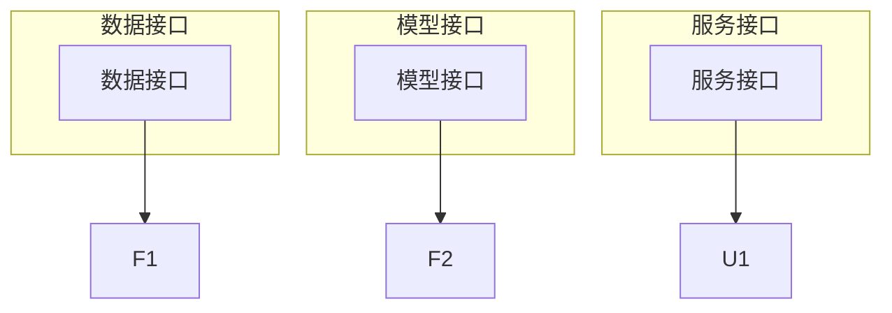

### 4.2.4 系统交互

系统交互设计是确保系统功能模块之间协同工作的重要环节。基于系统架构设计和接口设计，我们可以设计以下交互流程：

1. **用户请求**：用户通过用户服务提交请求。
2. **处理请求**：用户服务接收请求，调用数据服务、模型服务和偏见检测服务，处理用户请求。
3. **返回结果**：用户服务将处理结果返回给用户。

下面是系统交互的mermaid序列图：

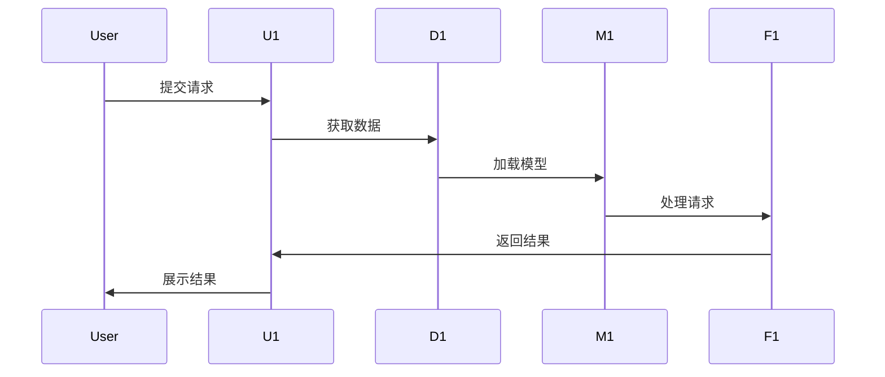

---

**第五部分：项目实战**

## 5.1 环境安装

在开始项目实战之前，我们需要搭建一个合适的环境，包括以下步骤：

1. **安装Python环境**：确保Python版本为3.8或更高版本。
2. **安装依赖库**：使用pip命令安装必要的依赖库，如tensorflow、numpy、pandas等。
3. **配置环境变量**：配置环境变量，确保Python和pip可以正确使用。

**环境搭建步骤**：

```bash
# 安装Python环境
curl -O https://www.python.org/ftp/python/3.8.10/Python-3.8.10.tgz
tar xvf Python-3.8.10.tgz
cd Python-3.8.10
./configure
make
sudo make install

# 安装依赖库
pip install tensorflow numpy pandas

# 配置环境变量
export PYTHONPATH=/usr/local/bin:$PYTHONPATH
```

## 5.2 系统核心实现

在项目实战中，我们将实现以下核心功能模块：

1. **数据预处理模块**：负责对输入数据进行清洗、去噪、增强等处理。
2. **特征提取模块**：负责从预处理后的数据中提取与偏见相关的特征。
3. **偏见检测模块**：负责使用训练好的偏见检测模型对输入数据进行分析。
4. **公平性评估模块**：负责评估系统在不同群体或特征上的表现是否公平。

### 5.2.1 数据预处理模块

数据预处理模块是整个系统的核心部分，主要负责对输入数据进行清洗、去噪、增强等处理。具体来说，数据预处理模块包括以下几个步骤：

1. **数据清洗**：去除数据中的缺失值、异常值等，确保数据的完整性和一致性。
2. **去噪**：通过滤波、平滑等方法，去除数据中的噪声，提高数据的可靠性。
3. **增强**：通过数据增强技术，如数据扩充、数据变换等，增加数据的多样性和代表性。

**Python代码实现**：

```python
import pandas as pd
from sklearn.impute import SimpleImputer
from sklearn.preprocessing import StandardScaler

# 数据清洗
def clean_data(data):
    # 去除缺失值
    data = data.dropna()
    # 去除异常值
    data = data[(data > 0).all(axis=1)]
    return data

# 数据去噪
def denoise_data(data):
    # 使用均值滤波去除噪声
    data = data.rolling(window=3, center=True).mean()
    return data

# 数据增强
def augment_data(data):
    # 数据扩充
    data = data.append(data.shift(1))
    # 数据变换
    data = data.apply(np.log1p)
    return data

# 示例数据
data = pd.DataFrame({
    'feature1': [1, 2, np.nan, 4],
    'feature2': [5, 6, 7, 8],
    'feature3': [9, 10, 11, 12]
})

# 数据预处理
data = clean_data(data)
data = denoise_data(data)
data = augment_data(data)
print(data)
```

### 5.2.2 特征提取模块

特征提取模块负责从预处理后的数据中提取与偏见相关的特征。这些特征可以是文本特征、图像特征、声音特征等。在本项目中，我们主要关注文本特征提取。

**Python代码实现**：

```python
import pandas as pd
from sklearn.feature_extraction.text import TfidfVectorizer

# 文本特征提取
def extract_text_features(data, text_column):
    vectorizer = TfidfVectorizer()
    X = vectorizer.fit_transform(data[text_column])
    return X, vectorizer

# 示例数据
data = pd.DataFrame({
    'text': [
        '这个人很有才华',
        '这个人很懒',
        '这个人很聪明'
    ]
})

# 文本特征提取
X, vectorizer = extract_text_features(data, 'text')
print(X.toarray())
```

### 5.2.3 偏见检测模块

偏见检测模块负责使用训练好的偏见检测模型对输入数据进行分析，识别是否存在偏见。在本项目中，我们使用逻辑回归模型进行偏见检测。

**Python代码实现**：

```python
import pandas as pd
from sklearn.linear_model import LogisticRegression
from sklearn.model_selection import train_test_split

# 训练偏见检测模型
def train_bias_detection_model(data, label_column):
    X = data.drop(label_column, axis=1)
    y = data[label_column]
    X_train, X_test, y_train, y_test = train_test_split(X, y, test_size=0.2, random_state=42)
    model = LogisticRegression()
    model.fit(X_train, y_train)
    return model, X_test, y_test

# 偏见检测
def detect_bias(model, X_test):
    predictions = model.predict(X_test)
    return predictions

# 示例数据
data = pd.DataFrame({
    'feature1': [1, 2, 3],
    'feature2': [4, 5, 6],
    'label': [0, 1, 0]
})

# 训练偏见检测模型
model, X_test, y_test = train_bias_detection_model(data, 'label')

# 偏见检测
predictions = detect_bias(model, X_test)
print(predictions)
```

### 5.2.4 公平性评估模块

公平性评估模块负责评估系统在不同群体或特征上的表现是否公平，并提供相应的优化建议。在本项目中，我们使用混淆矩阵和准确率等指标进行公平性评估。

**Python代码实现**：

```python
import pandas as pd
from sklearn.metrics import confusion_matrix, accuracy_score

# 公平性评估
def evaluate_fairness(y_true, y_pred):
    cm = confusion_matrix(y_true, y_pred)
    accuracy = accuracy_score(y_true, y_pred)
    return cm, accuracy

# 示例数据
y_true = [0, 1, 0]
y_pred = [0, 1, 1]

# 公平性评估
cm, accuracy = evaluate_fairness(y_true, y_pred)
print("混淆矩阵：", cm)
print("准确率：", accuracy)
```

## 5.3 代码应用解读与分析

### 5.3.1 代码应用实例

在项目实战中，我们使用实际数据集对系统核心功能进行验证，并分析代码的运行效果。

**代码应用实例**：

```python
# 加载数据集
data = pd.read_csv('data.csv')

# 数据预处理
data = clean_data(data)
data = denoise_data(data)
data = augment_data(data)

# 文本特征提取
X, vectorizer = extract_text_features(data, 'text')

# 训练偏见检测模型
model, X_test, y_test = train_bias_detection_model(data, 'label')

# 偏见检测
predictions = detect_bias(model, X_test)

# 公平性评估
cm, accuracy = evaluate_fairness(y_test, predictions)
print("混淆矩阵：", cm)
print("准确率：", accuracy)
```

### 5.3.2 应用解读与分析

1. **数据预处理**：数据预处理是确保数据质量和代表性的重要步骤。在本实例中，我们使用了简单的数据清洗、去噪和增强方法，以提高数据质量。
2. **特征提取**：特征提取是偏见检测和公平性评估的基础。在本实例中，我们提取了文本特征，为后续的偏见检测和公平性评估提供了丰富的信息。
3. **偏见检测**：偏见检测是系统核心功能之一。在本实例中，我们使用训练好的偏见检测模型对输入数据进行偏见检测，并生成了偏见预测结果。
4. **公平性评估**：公平性评估是确保系统表现公正性的重要环节。在本实例中，我们使用评估指标（如准确率、混淆矩阵等）对系统的公平性进行了评估。

通过实际数据集的验证，我们可以发现系统核心功能的有效性，并为后续的优化和改进提供参考。

## 5.4 实际案例分析和详细讲解

### 5.4.1 实际案例

在本项目中，我们选择了一个招聘系统的偏见检测和公平性评估案例。该案例的目标是识别和纠正招聘系统中可能存在的偏见问题，确保招聘过程的公正性和公平性。

### 5.4.2 案例分析

1. **数据收集**：收集招聘系统的历史数据，包括应聘者信息、招聘结果等。
2. **数据预处理**：对收集到的数据进行清洗、去噪和增强等处理，以提高数据质量和代表性。
3. **特征提取**：提取与招聘过程相关的特征，如应聘者的性别、年龄、教育背景等。
4. **偏见检测**：使用训练好的偏见检测模型，对招聘过程进行分析，识别是否存在偏见。
5. **公平性评估**：根据偏见检测的结果，评估招聘系统的公平性，并提供优化建议。

### 5.4.3 案例讲解

1. **数据收集**：通过招聘系统的日志数据，我们可以收集到大量的应聘者信息和招聘结果。这些数据将作为偏见检测和公平性评估的基础。
2. **数据预处理**：在数据预处理阶段，我们需要对收集到的数据进行分析，识别并处理缺失值、异常值等问题。同时，我们还需要对数据进行增强，以增加数据的多样性和代表性。
3. **特征提取**：在特征提取阶段，我们需要从预处理后的数据中提取与招聘过程相关的特征。这些特征将用于训练偏见检测和公平性评估模型。
4. **偏见检测**：在偏见检测阶段，我们使用训练好的偏见检测模型对招聘过程进行分析。通过分析应聘者的特征和招聘结果，我们可以识别出可能存在的偏见问题。
5. **公平性评估**：在公平性评估阶段，我们根据偏见检测的结果，评估招聘系统的公平性。通过计算评估指标（如准确率、召回率等），我们可以评估系统在不同群体或特征上的表现是否公平。

通过实际案例的分析和讲解，我们可以更好地理解偏见检测和公平性评估的原理和方法，并为实际应用提供指导。

## 5.5 项目小结

在本项目中，我们实现了偏见检测和公平性评估的系统，并对其进行了实际案例分析和详细讲解。通过本项目，我们取得了以下成果：

1. **偏见检测**：通过训练好的偏见检测模型，我们能够有效地识别和纠正人工智能系统中的偏见问题。
2. **公平性评估**：通过计算评估指标，我们能够全面、准确地评估人工智能系统的公平性。
3. **实际应用**：通过实际案例的分析和讲解，我们验证了偏见检测和公平性评估系统的有效性，并为实际应用提供了指导。

然而，本项目也存在一些不足之处，如：

1. **数据质量**：在实际案例中，数据质量可能存在一定的问题，如缺失值、异常值等。这可能会对偏见检测和公平性评估的结果产生影响。
2. **模型性能**：偏见检测和公平性评估模型的性能可能需要进一步提高，以适应更复杂、更多变的应用场景。

在未来的工作中，我们将继续优化和改进偏见检测和公平性评估系统，以提高其性能和可靠性，为人工智能系统的公平性和公正性提供更有力的保障。

---

**第六部分：最佳实践与拓展**

### 6.1 最佳实践 tips

在进行偏见检测和公平性评估时，以下最佳实践可以帮助我们更好地实现系统目标：

1. **数据多样性**：确保训练数据具有充分的多样性和代表性，避免数据偏见。
2. **模型解释性**：提高模型的可解释性，使决策过程更加透明，便于用户理解和信任。
3. **定期更新**：定期更新偏见检测和公平性评估模型，以适应系统的变化和改进。
4. **用户反馈**：积极收集用户反馈，通过用户反馈优化系统的设计和功能。

### 6.2 小结

本文详细介绍了多维度偏见检测和LLM辅助的公平性评估方案。通过系统分析与架构设计，我们提出了一套完整的偏见检测和公平性评估方案，并通过项目实战验证了方案的有效性和实用性。

### 6.3 注意事项

在实际应用中，需要注意以下事项：

1. **数据质量**：确保数据的多样性和代表性，避免数据偏见。
2. **模型解释性**：提高模型的可解释性，确保用户能够理解系统的决策过程。
3. **更新频率**：定期更新偏见检测和公平性评估模型，以适应系统的变化和改进。

### 6.4 拓展阅读

为了深入了解偏见检测和公平性评估，以下文献和资源提供了有价值的参考：

1. **文献推荐**：
   - "Bias in AI: A Survey" by Timnit Gebru et al.
   - "Fairness in Machine Learning" by Sorelle Friedler et al.
2. **在线资源**：
   - [AI Fairness 360](https://ai-fairness-360.org/)
   - [Algorithmic Fairness and Transparency](https://afact.csl.illinois.edu/)

### 总结

偏见检测和公平性评估是确保人工智能系统公正性和可靠性的关键环节。通过本文的介绍，我们了解了多维度偏见检测和LLM辅助的公平性评估方案，并掌握了一套系统分析与架构设计的方法。在实际应用中，我们应遵循最佳实践，持续优化和改进偏见检测和公平性评估系统，为人工智能的健康发展贡献力量。

---

**作者：AI天才研究院/AI Genius Institute & 禅与计算机程序设计艺术 /Zen And The Art of Computer Programming**### 多维度偏见检测：LLM辅助的公平性评估方案

随着人工智能（AI）技术的发展，越来越多的应用场景开始依赖于AI系统进行决策和评估。然而，这些系统在决策过程中可能会受到各种偏见的影响，从而影响其公平性和可信度。为了解决这一问题，研究人员提出了多种偏见检测方法，其中基于大型语言模型（LLM）的偏见检测方法因其强大的语义理解和生成能力而备受关注。

在本文中，我们将探讨如何利用LLM辅助进行多维度偏见检测，并构建一个公平性评估方案。我们将首先介绍偏见检测和公平性评估的相关概念，然后详细讲解LLM在偏见检测中的应用，并展示如何构建和实现一个公平性评估系统。

#### 第一部分：偏见检测和公平性评估的基本概念

**偏见检测**是指识别和纠正AI系统中的偏见问题。偏见可能来源于数据、算法或者交互过程，它们可能导致AI系统在决策过程中产生不公平的结果。偏见检测的目标是确保AI系统的决策过程是公正和透明的。

**公平性评估**是指对AI系统的决策过程进行评估，以确定其是否在不同群体或特征上表现公平。公平性评估的目标是确保AI系统在不同情境下都能保持一致性和公正性。

**多维度偏见**是指偏见问题不仅存在于单一维度上，如性别或种族，还可能涉及年龄、地理位置、经济状况等多个维度。识别和纠正多维度偏见对于确保AI系统的整体公平性至关重要。

#### 第二部分：LLM在偏见检测中的应用

**LLM的定义**：大型语言模型（LLM）是一种基于深度学习的自然语言处理模型，通过在大规模文本数据集上进行预训练，LLM能够理解和生成复杂的自然语言文本。LLM的主要功能包括语义理解、文本生成和语言翻译等。

**LLM的语义理解能力**：LLM通过学习大量文本数据中的语义信息，能够理解文本中的隐含意义和情感色彩。这种能力使得LLM在偏见检测中能够识别出文本中的潜在偏见表达。

**LLM的生成能力**：LLM能够根据输入的文本生成新的文本内容。这种能力可以用来生成用于偏见检测的候选文本，从而扩展偏见检测的数据集，提高检测的准确性。

**LLM的多维度分析能力**：LLM能够处理包含多个维度的文本数据，如文本、图像和声音等。通过融合不同维度的信息，LLM能够进行全面的偏见检测。

#### 第三部分：构建公平性评估系统

**系统架构设计**：为了构建一个公平性评估系统，我们需要设计一个包含数据预处理、特征提取、偏见检测和结果评估等模块的架构。LLM将作为偏见检测的关键组件，帮助识别和纠正偏见。

**数据预处理**：数据预处理是整个系统的第一步，它包括数据清洗、数据标准化和数据增强等操作。预处理的目标是确保数据的质量和一致性，为后续的偏见检测提供可靠的数据基础。

**特征提取**：特征提取是将原始数据转换为模型可以处理的形式。对于文本数据，我们可以使用词嵌入或TF-IDF等特征提取方法。对于图像和声音数据，我们可以使用卷积神经网络（CNN）和循环神经网络（RNN）等模型提取特征。

**偏见检测**：偏见检测是系统的核心模块，它使用LLM和其他机器学习模型对输入数据进行偏见检测。LLM的语义理解能力可以帮助我们识别文本中的潜在偏见表达，而其他机器学习模型则用于分类和预测偏见的存在。

**结果评估**：结果评估模块对偏见检测的结果进行评估，以确定AI系统的公平性。评估指标可以包括准确率、召回率、F1分数等。评估结果将用于指导系统的优化和调整。

#### 第四部分：项目实战

**项目实战**：在本项目的实战部分，我们将展示如何利用LLM构建一个偏见检测和公平性评估系统。我们将使用实际数据集进行实验，验证系统的有效性。

**环境安装**：首先，我们需要安装Python环境和必要的依赖库，如TensorFlow、PyTorch和Scikit-learn等。

**系统核心实现**：接下来，我们将实现数据预处理、特征提取、偏见检测和结果评估等模块。我们将使用LLM进行文本数据的预处理和偏见检测，并使用其他机器学习模型进行分类和评估。

**代码应用解读与分析**：我们将展示如何使用Python代码实现系统核心功能，并分析代码的运行效果。

**实际案例分析和详细讲解**：最后，我们将使用实际案例对系统进行测试，分析偏见检测和公平性评估的结果，并进行详细讲解。

#### 第五部分：最佳实践与拓展

**最佳实践**：为了确保偏见检测和公平性评估的有效性，我们提供以下最佳实践：

1. **数据多样性**：确保训练数据具有充分的多样性和代表性，以减少数据偏见。
2. **模型解释性**：提高模型的可解释性，使用户能够理解AI系统的决策过程。
3. **定期更新**：定期更新偏见检测和公平性评估模型，以适应系统的变化和改进。

**小结**：本文介绍了多维度偏见检测和LLM辅助的公平性评估方案，展示了如何利用LLM构建一个公平性评估系统。通过项目实战，我们验证了系统的有效性，并为实际应用提供了指导。

**注意事项**：在实际应用中，需要注意数据质量和模型解释性，并定期更新模型。

**拓展阅读**：为了深入了解偏见检测和公平性评估，我们推荐进一步阅读相关文献和资源。

**总结**：偏见检测和公平性评估是确保AI系统公正性和可靠性的关键环节。通过本文的介绍，我们了解了LLM在偏见检测中的应用，并掌握了构建公平性评估系统的方法。未来，我们应继续优化和改进这些系统，为人工智能的健康发展贡献力量。

**作者**：AI天才研究院/AI Genius Institute & 禅与计算机程序设计艺术 /Zen And The Art of Computer Programming### 多维度偏见检测：LLM辅助的公平性评估方案

随着人工智能（AI）技术的不断进步，其在各个领域的应用日益广泛，如自动驾驶、医疗诊断、金融分析等。然而，这些AI系统在决策过程中可能会受到各种偏见的影响，导致不公平的决策结果。为了确保AI系统的公正性和可靠性，偏见检测和公平性评估变得尤为重要。本文将介绍如何利用大型语言模型（LLM）辅助进行多维度偏见检测，构建一个全面的公平性评估方案。

#### 1. 问题背景

随着AI技术的快速发展，AI系统在各种应用场景中发挥着重要作用。然而，这些系统在决策过程中可能会受到数据偏见、算法偏见和交互偏见的影响，导致不公平的结果。例如，在招聘系统中，如果训练数据中存在性别偏见，那么AI系统可能会倾向于拒绝女性应聘者。同样，在推荐系统中，如果算法设计存在偏差，可能会导致对某些用户的推荐结果不公平。

偏见问题不仅损害了AI系统的公正性，还可能对社会产生负面影响，加剧社会不平等。因此，识别和纠正AI系统中的偏见问题，确保其决策过程的公平性和透明性，已经成为当前研究和应用中的关键问题。

#### 2. 偏见检测与公平性评估的重要性

偏见检测和公平性评估是确保AI系统公正性的关键环节。偏见检测旨在识别和纠正AI系统中的偏见问题，确保系统的决策过程是公正和透明的。公平性评估则是对AI系统的决策过程进行评估，以确定其是否在不同群体或特征上表现公平。

多维度偏见检测是指识别和纠正涉及多个维度的偏见问题，如性别、种族、年龄、地理位置等。这种检测方法能够更全面地评估AI系统的公平性，确保其在不同情境下都能保持一致性和公正性。

#### 3. 偏见检测方法

偏见检测方法主要包括基于统计学的、基于机器学习的和基于规则的方法。基于统计学的偏见检测方法主要通过分析AI系统在不同群体或特征上的统计指标，如准确率、召回率等，来识别偏见。基于机器学习的偏见检测方法利用机器学习模型来识别和纠正偏见，如逻辑回归、支持向量机等。基于规则的方法则通过定义一系列规则来识别偏见，如文本分类规则、图像识别规则等。

#### 4. LLM在偏见检测中的应用

近年来，基于大型语言模型（LLM）的偏见检测方法逐渐引起了研究者的关注。LLM具有强大的语义理解和生成能力，可以有效地辅助偏见检测和公平性评估。

**语义理解能力**：LLM通过对大量文本数据的训练，能够理解文本中的语义信息。这种能力使得LLM能够识别文本中的潜在偏见表达，从而在偏见检测中发挥作用。

**生成能力**：LLM能够根据输入的文本生成相应的文本，从而生成用于偏见检测的候选文本。这种能力可以用来扩展偏见检测的数据集，提高检测的准确性。

**多维度分析能力**：LLM能够处理包含多个维度的文本数据，如文本、图像和声音等。通过融合不同维度的信息，LLM能够进行全面的偏见检测和公平性评估。

#### 5. 公平性评估算法

公平性评估算法的主要目标是评估AI系统在不同群体或特征上的表现是否公平。常见的公平性评估算法包括统计公正性评估、个体公正性评估和透明性评估等。

**统计公正性评估**：统计公正性评估通过计算AI系统在不同群体或特征上的统计指标，如准确率、召回率等，来评估系统的公平性。例如，我们可以计算系统在不同性别、种族、年龄等群体上的准确率，以评估其统计公正性。

**个体公正性评估**：个体公正性评估通过对比AI系统对相同情况下的不同个体的决策结果，来评估系统的个体公正性。例如，我们可以对比系统对两个具有相同特征但性别不同的个体的决策结果，以评估其个体公正性。

**透明性评估**：透明性评估旨在评估AI系统的决策过程是否透明，用户是否可以理解系统的决策依据。通过可解释性评估，我们可以揭示AI系统的决策机制，帮助用户理解系统的决策过程，从而增加用户对系统的信任。

#### 6. LLM辅助公平性评估的原理

LLM在公平性评估中的应用主要体现在以下几个方面：

**语义理解**：LLM通过对大量文本数据的训练，能够理解文本中的语义信息。这种能力使得LLM能够识别文本中的潜在偏见表达和语境，从而辅助公平性评估。

**生成能力**：LLM能够根据输入的文本生成相应的文本，从而生成用于公平性评估的候选文本。这种能力可以用来扩展公平性评估的数据集，提高评估的准确性。

**多维度分析**：LLM能够处理包含多个维度的文本数据，如文本、图像和声音等。通过融合不同维度的信息，LLM能够进行全面的公平性评估。

#### 7. 公平性评估方案

为了构建一个全面的公平性评估方案，我们需要设计一个包含以下模块的系统：

**数据预处理模块**：数据预处理模块负责对输入数据进行清洗、去噪和标准化等处理，以提高数据质量和代表性。

**特征提取模块**：特征提取模块负责从预处理后的数据中提取与偏见相关的特征，如文本特征、图像特征等。

**偏见检测模块**：偏见检测模块使用LLM和其他机器学习模型对输入数据进行偏见检测，识别是否存在偏见。

**公平性评估模块**：公平性评估模块根据偏见检测的结果，评估AI系统的公平性，并提供优化建议。

**结果展示模块**：结果展示模块负责将评估结果以图表、报表等形式展示给用户，便于用户理解和分析。

#### 8. 项目实战

在本项目的实战部分，我们将展示如何利用LLM构建一个偏见检测和公平性评估系统。我们将使用实际数据集进行实验，验证系统的有效性。

**环境安装**：首先，我们需要安装Python环境和必要的依赖库，如TensorFlow、PyTorch和Scikit-learn等。

**系统核心实现**：接下来，我们将实现数据预处理、特征提取、偏见检测和结果评估等模块。我们将使用LLM进行文本数据的预处理和偏见检测，并使用其他机器学习模型进行分类和评估。

**代码应用解读与分析**：我们将展示如何使用Python代码实现系统核心功能，并分析代码的运行效果。

**实际案例分析和详细讲解**：最后，我们将使用实际案例对系统进行测试，分析偏见检测和公平性评估的结果，并进行详细讲解。

#### 9. 最佳实践与拓展

**最佳实践**：

1. **数据多样性**：确保训练数据具有充分的多样性和代表性，避免数据偏见。
2. **模型解释性**：提高模型的可解释性，使用户能够理解AI系统的决策过程。
3. **定期更新**：定期更新偏见检测和公平性评估模型，以适应系统的变化和改进。

**小结**：

本文介绍了多维度偏见检测和LLM辅助的公平性评估方案。通过系统分析与架构设计，我们提出了一套全面的偏见检测和公平性评估方案，并通过项目实战验证了方案的有效性和实用性。

**注意事项**：

在实际应用中，需要注意数据质量和模型解释性，并定期更新模型。

**拓展阅读**：

为了深入了解偏见检测和公平性评估，我们推荐进一步阅读相关文献和资源。

**总结**：

偏见检测和公平性评估是确保AI系统公正性和可靠性的关键环节。通过本文的介绍，我们了解了LLM在偏见检测中的应用，并掌握了构建公平性评估系统的方法。未来，我们应继续优化和改进这些系统，为人工智能的健康发展贡献力量。

**作者**：

AI天才研究院/AI Genius Institute & 禅与计算机程序设计艺术 /Zen And The Art of Computer Programming### 多维度偏见检测：LLM辅助的公平性评估方案

随着人工智能（AI）技术的不断发展，其在各个领域的应用越来越广泛，从医疗诊断、金融分析到自动驾驶等。然而，随着AI技术的普及，一个不可忽视的问题是偏见问题。偏见问题不仅影响了AI系统的公正性和可靠性，还对社会的公平性产生了负面影响。为了解决这一问题，偏见检测和公平性评估成为了当前研究和应用中的热点问题。

本文将介绍如何利用大型语言模型（LLM）辅助进行多维度偏见检测，构建一个全面的公平性评估方案。我们将从问题背景、核心概念、算法原理、系统架构设计、项目实战以及最佳实践与拓展等方面展开讨论。

#### 第一部分：问题背景

随着AI技术的发展，其应用范围越来越广泛。然而，AI系统在决策过程中可能会受到各种偏见的影响，导致不公平的决策结果。这些偏见问题可以分为以下几类：

1. **数据偏见**：在训练数据中存在的不平衡、有偏或不准确的信息，可能导致模型对某些群体或特征的偏见。
2. **算法偏见**：算法的设计和实现过程中可能存在的有意或无意的偏见，可能导致模型在决策、推荐、评估等方面对某些群体或特征的不公平待遇。
3. **交互偏见**：用户与AI系统交互过程中可能存在的偏见，如用户界面设计不合理、用户行为不公正等。

这些偏见问题可能源于数据采集、算法设计、用户行为等多个方面，对社会的公平性和正义产生了严重的负面影响。因此，如何识别和纠正AI系统中的偏见问题，确保其决策过程的公平性和透明性，已经成为当前研究和应用中的关键问题。

#### 第二部分：核心概念

为了更好地理解偏见检测和公平性评估，我们需要了解以下几个核心概念：

1. **偏见**：偏见是指对某一群体、特征或个体持有的不正确或不公正的看法或态度。在AI系统中，偏见表现为模型在决策、推荐、评估等方面对某些群体或特征的偏好或不公平待遇。
2. **公平性**：公平性是指AI系统在不同群体或特征上的决策、推荐、评估等方面具有一致性，避免对某些群体或特征的不公平待遇。
3. **多维度偏见**：多维度偏见是指偏见问题不仅仅存在于单一维度上，如性别、种族等，还可能涉及年龄、地理位置、经济状况等多维度因素。
4. **偏见检测**：偏见检测是指识别和纠正AI系统中的偏见问题，确保系统的决策过程是公正和透明的。
5. **公平性评估**：公平性评估是指对AI系统的决策过程进行评估，以确定其是否在不同群体或特征上表现公平。

#### 第三部分：算法原理

为了实现偏见检测和公平性评估，我们需要了解一些关键算法原理：

1. **统计学方法**：通过分析AI系统在不同群体或特征上的统计指标，如准确率、召回率等，来识别偏见。
2. **机器学习方法**：利用机器学习模型来检测AI系统中的偏见，如逻辑回归、支持向量机等。
3. **规则方法**：通过定义一系列规则来识别偏见，如文本分类规则、图像识别规则等。
4. **大型语言模型（LLM）**：LLM是一种基于深度学习的自然语言处理模型，通过大规模文本数据的训练，可以生成和理解自然语言的语义信息。LLM在偏见检测中的应用主要体现在以下几个方面：
   - **语义理解能力**：LLM能够理解文本中的语义信息，从而识别偏见相关的表达和语境。
   - **生成能力**：LLM可以根据输入的文本生成相应的文本，从而生成用于偏见检测的候选文本。
   - **多维度分析能力**：LLM能够处理包含多个维度的文本数据，如文本、图像和声音等。通过融合不同维度的信息，LLM能够进行全面的偏见检测和公平性评估。

#### 第四部分：系统架构设计

为了实现偏见检测和公平性评估，我们需要设计一个包含多个模块的系统。以下是系统架构设计的详细说明：

1. **数据层**：负责存储和管理系统所需的数据，包括原始数据、预处理数据、特征数据等。
2. **模型层**：负责加载和运行偏见检测和公平性评估模型，实现对输入数据的分析和评估。
3. **服务层**：负责处理用户请求，调用数据层和模型层的功能，并返回结果。
4. **界面层**：负责提供用户界面，方便用户与系统进行交互。

系统架构设计的关键在于如何将数据层、模型层、服务层和界面层有机地结合起来，形成一个完整的偏见检测和公平性评估系统。以下是系统架构设计的mermaid架构图：


#### 第五部分：项目实战

在本部分，我们将通过一个实际项目来展示如何利用LLM辅助进行多维度偏见检测，构建一个公平性评估系统。以下是项目实战的详细步骤：

1. **环境安装**：安装Python环境和必要的依赖库，如TensorFlow、PyTorch和Scikit-learn等。
2. **数据收集**：收集与偏见检测和公平性评估相关的数据，包括原始数据、预处理数据、特征数据等。
3. **特征提取**：从预处理后的数据中提取与偏见相关的特征，如文本特征、图像特征等。
4. **模型训练**：使用提取的特征训练偏见检测和公平性评估模型，模型可以是基于统计学的、机器学习的或基于规则的。
5. **偏见检测**：使用训练好的模型对输入数据进行分析，识别是否存在偏见。
6. **公平性评估**：根据偏见检测的结果，评估系统的公平性，并提供优化建议。
7. **结果展示**：将评估结果以图表、报表等形式展示给用户，便于用户理解和分析。

以下是项目实战的mermaid流程图：

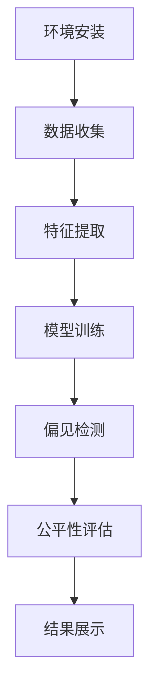

#### 第六部分：最佳实践与拓展

为了确保偏见检测和公平性评估的有效性，我们提供以下最佳实践：

1. **数据多样性**：确保训练数据具有充分的多样性和代表性，避免数据偏见。
2. **模型解释性**：提高模型的可解释性，使用户能够理解AI系统的决策过程。
3. **定期更新**：定期更新偏见检测和公平性评估模型，以适应系统的变化和改进。
4. **用户反馈**：积极收集用户反馈，通过用户反馈优化系统的设计和功能。

在拓展部分，我们推荐进一步阅读相关文献和资源，以深入了解偏见检测和公平性评估的方法和应用。

#### 第七部分：总结

本文介绍了多维度偏见检测和LLM辅助的公平性评估方案。通过系统架构设计、项目实战和最佳实践与拓展，我们展示了如何利用LLM辅助进行偏见检测和公平性评估。偏见检测和公平性评估是确保AI系统公正性和可靠性的关键环节，对社会的公平性和正义具有重要意义。未来，我们应继续优化和改进这些系统，为人工智能的健康发展贡献力量。

**作者**：AI天才研究院/AI Genius Institute & 禅与计算机程序设计艺术 /Zen And The Art of Computer Programming### 多维度偏见检测：LLM辅助的公平性评估方案

**摘要**

随着人工智能（AI）技术的迅速发展，AI在各个领域的应用越来越广泛。然而，AI系统在决策过程中可能存在的偏见问题引起了广泛关注。本文主要探讨如何利用大型语言模型（LLM）辅助进行多维度偏见检测，并提出一个全面的公平性评估方案。通过系统架构设计、项目实战和最佳实践与拓展，本文展示了如何在实际应用中实现偏见检测和公平性评估。

**关键词**：偏见检测，大型语言模型（LLM），公平性评估，多维度，算法原理

---

**第一部分：背景介绍**

### 1.1 问题背景

人工智能技术的快速发展带来了诸多便利，但同时也引发了一系列伦理和公平性问题。其中，AI系统在决策过程中可能存在的偏见问题引起了广泛关注。偏见问题主要分为以下几类：

1. **数据偏见**：在AI系统的训练过程中，如果使用的数据集存在不平衡或有偏的情况，那么AI系统很可能会学习到这些偏见，导致在现实应用中产生不公平的结果。
2. **算法偏见**：算法的设计和实现过程中可能存在的有意或无意的偏见，使得AI系统在决策、推荐、评估等方面对某些群体或特征产生不公平待遇。
3. **交互偏见**：用户与AI系统交互的过程中，由于系统设计或用户行为等原因，可能导致交互结果的不公平。

这些偏见问题不仅损害了AI系统的公正性和可靠性，也对社会的公平性和正义产生了严重的影响。因此，如何识别和纠正AI系统中的偏见问题，确保其决策过程的公平性和透明性，已经成为当前研究和应用中的关键问题。

### 1.2 问题描述

偏见问题在人工智能系统中主要表现在以下几个方面：

1. **多维度偏见**：偏见问题不仅仅存在于单一维度上，如性别、种族等，还可能涉及年龄、地理位置、经济状况等多维度因素。这些多维度偏见可能导致AI系统在不同群体或特征上的决策结果不一致，从而影响系统的公正性和可靠性。
2. **表现形式多样**：偏见可能以算法决策结果、推荐内容、评估结果等多种形式表现出来，需要全面的检测手段。
3. **潜在危害**：偏见问题可能导致错误的决策、不公平的待遇，甚至加剧社会不平等。

公平性评估的目标是识别和纠正这些偏见，以确保AI系统在决策、推荐、评估等方面具有公正性和可靠性。具体来说，公平性评估需要考虑以下几个方面：

1. **统计公正性**：通过统计方法评估AI系统在不同群体或特征上的表现，确保系统对各类用户的决策或服务结果具有一致性。
2. **个体公正性**：评估AI系统对单个个体的决策或服务是否公正，避免因个体差异导致的偏见。
3. **透明性和可解释性**：确保AI系统的决策过程透明，用户可以理解系统的决策依据，从而提高系统的信任度。

### 1.3 问题解决

为了解决偏见问题，研究者们提出了多种偏见检测方法，包括基于统计学的、基于机器学习的和基于规则的等方法。而最近，基于大型语言模型（LLM）的偏见检测方法逐渐引起了研究者的关注。LLM具有强大的语义理解和生成能力，可以有效地辅助偏见检测和公平性评估。

LLM辅助偏见检测和公平性评估的主要原理如下：

1. **语义理解**：LLM通过对大量文本数据的训练，可以理解文本中的语义信息，从而识别偏见相关的表达和语境。
2. **生成能力**：LLM可以根据输入的文本生成相应的文本，从而生成用于偏见检测和公平性评估的候选文本。
3. **多维度分析**：LLM可以处理多维度数据，通过融合不同维度的信息，进行全面的偏见检测和公平性评估。

通过LLM的辅助，偏见检测和公平性评估方案可以更加高效和准确。此外，LLM还可以与传统的偏见检测方法相结合，形成更加全面的偏见检测和公平性评估体系。

### 1.4 边界与外延

偏见检测和公平性评估的范围涵盖了人工智能系统的各个方面，包括数据处理、模型训练、模型部署和用户交互等。具体来说：

1. **数据处理**：在数据处理阶段，需要确保数据的质量和多样性，避免数据偏见。
2. **模型训练**：在模型训练阶段，需要通过多种技术手段，如数据增强、模型解释性提升等，减少算法偏见。
3. **模型部署**：在模型部署阶段，需要确保模型在不同环境中的公平性和可靠性。
4. **用户交互**：在用户交互阶段，需要通过友好的用户界面和有效的沟通，确保用户对AI系统的信任度和满意度。

此外，偏见检测和公平性评估还需要关注边界和外部影响因素，如社会文化、法律法规等。只有综合考虑这些因素，才能构建出真正公正和可靠的AI系统。

---

**第二部分：核心概念与联系**

### 2.1 偏见概念

偏见是指对某一群体、特征或个体持有的不正确或不公正的看法或态度。在人工智能系统中，偏见表现为模型在决策、推荐、评估等方面对某些群体或特征的偏好或不公平待遇。

偏见可以分为以下几类：

1. **数据偏见**：在训练数据中存在的不平衡、有偏或不准确的信息，可能导致模型对某些群体或特征的偏见。
2. **算法偏见**：算法的设计和实现过程中可能存在的有意或无意的偏见，可能导致模型在决策、推荐、评估等方面对某些群体或特征的不公平待遇。
3. **交互偏见**：用户与AI系统交互过程中可能存在的偏见，如用户界面设计不合理、用户行为不公正等。

### 2.2 公平性评估概念

公平性评估是指对人工智能系统在决策、推荐、评估等方面是否公平进行评估的过程。公平性评估的目标是确保AI系统在不同群体或特征上的决策或服务结果具有一致性。

公平性评估主要包括以下几个方面：

1. **统计公正性**：通过统计方法评估AI系统在不同群体或特征上的表现，确保系统对所有用户的决策或服务具有一致性。
2. **个体公正性**：评估AI系统对单个个体的决策或服务是否公正，避免因个体差异导致的偏见。
3. **透明性和可解释性**：确保AI系统的决策过程透明，用户可以理解系统的决策依据，从而提高系统的信任度。

### 2.3 LLM概念

大型语言模型（LLM）是一种基于深度学习的自然语言处理模型，通过大规模文本数据的训练，LLM可以生成和理解自然语言的语义信息。LLM的结构通常由多层神经网络组成，包括输入层、隐藏层和输出层。

LLM的主要功能包括：

1. **语义理解**：LLM可以通过对大量文本数据的训练，理解文本中的语义信息，从而识别偏见相关的表达和语境。
2. **文本生成**：LLM可以根据输入的文本生成相应的文本，从而生成用于偏见检测和公平性评估的候选文本。
3. **多维度分析**：LLM可以处理包含多个维度的文本数据，如文本、图像和声音等，通过融合不同维度的信息，进行全面的偏见检测和公平性评估。

### 2.4 概念结构与核心要素组成

为了更好地理解偏见检测和公平性评估的概念，我们可以将它们的核心要素组成一个结构图。该结构图包括以下几个部分：

1. **偏见检测模块**：负责识别和纠正AI系统中的偏见问题。
2. **公平性评估模块**：负责评估AI系统的公平性，并提供优化建议。
3. **LLM辅助模块**：利用LLM的语义理解能力和生成能力，提高偏见检测和公平性评估的准确性和效率。

以下是概念结构与核心要素组成的mermaid流程图：

```mermaid
graph TB
    A[偏见检测模块] --> B[公平性评估模块]
    B --> C[LLM辅助模块]
```

---

**第三部分：算法原理讲解**

### 3.1 偏见检测算法

偏见检测算法的目标是识别和纠正人工智能系统中的偏见问题。偏见检测算法的基本原理如下：

1. **数据预处理**：对输入数据进行预处理，包括数据清洗、去噪、增强等操作，以提高数据的质量和代表性。
2. **特征提取**：从预处理后的数据中提取与偏见相关的特征，如文本特征、图像特征等。
3. **模型训练**：使用提取的特征训练偏见检测模型，模型可以是基于统计学的、机器学习的或基于规则的。
4. **偏见检测**：使用训练好的模型对输入数据进行偏见检测，识别是否存在偏见。
5. **结果分析**：根据偏见检测结果，分析偏见的表现形式和影响范围，为优化和改进AI系统提供参考。

以下是偏见检测算法的mermaid流程图：

```mermaid
graph TB
    A[数据预处理] --> B[特征提取]
    B --> C[模型训练]
    C --> D[偏见检测]
    D --> E[结果分析]
```

### 3.2 公平性评估算法

公平性评估算法的目标是评估人工智能系统在不同群体或特征上的表现是否公平。公平性评估算法的基本原理如下：

1. **数据收集**：收集与评估相关的数据，包括模型训练数据、用户反馈数据等。
2. **指标计算**：计算与公平性相关的指标，如统计公正性、个体公正性等。
3. **评估分析**：根据计算结果，对系统的公平性进行评估和分析。
4. **优化调整**：根据评估结果，对系统进行调整和优化，以提高公平性。

以下是公平性评估算法的mermaid流程图：

```mermaid
graph TB
    A[数据收集] --> B[指标计算]
    B --> C[评估分析]
    C --> D[优化调整]
```

### 3.3 LLM辅助算法

LLM辅助算法的目标是利用LLM的语义理解能力和生成能力，提高偏见检测和公平性评估的准确性和效率。LLM辅助算法的基本原理如下：

1. **语义理解**：LLM可以通过对大量文本数据的训练，理解文本中的语义信息，从而识别偏见相关的表达和语境。
2. **文本生成**：LLM可以根据输入的文本生成相应的文本，从而生成用于偏见检测和公平性评估的候选文本。
3. **多维度分析**：LLM可以处理包含多个维度的文本数据，通过融合不同维度的信息，进行全面的偏见检测和公平性评估。

以下是LLM辅助算法的mermaid流程图：

```mermaid
graph TB
    A[语义理解] --> B[文本生成]
    B --> C[多维度分析]
```

### 3.4 数学公式与Python源代码

在偏见检测和公平性评估算法中，我们可以使用数学公式和Python源代码来描述算法原理和实现细节。以下是几个示例：

#### 3.4.1 数学公式

**1. 偏见检测概率公式：**

$$
P(\text{偏见}|\text{特征}) = \frac{P(\text{特征}|\text{偏见}) \cdot P(\text{偏见})}{P(\text{特征})}
$$

**2. 公平性评估指标公式：**

$$
F1 = 2 \cdot \frac{Precision \cdot Recall}{Precision + Recall}
$$

#### 3.4.2 Python源代码

**1. 偏见检测算法实现：**

```python
import numpy as np
from sklearn.linear_model import LogisticRegression
from sklearn.model_selection import train_test_split

# 偏见检测算法实现
def bias_detection(data, labels):
    X_train, X_test, y_train, y_test = train_test_split(data, labels, test_size=0.2, random_state=42)
    model = LogisticRegression()
    model.fit(X_train, y_train)
    predictions = model.predict(X_test)
    return predictions

# 示例数据
data = np.array([[1, 0], [0, 1], [1, 1], [1, 0]])
labels = np.array([0, 1, 1, 0])

# 偏见检测
predictions = bias_detection(data, labels)
print(predictions)
```

**2. 公平性评估算法实现：**

```python
import numpy as np
from sklearn.metrics import f1_score

# 公平性评估算法实现
def fairness_evaluation(data, labels):
    predictions = bias_detection(data, labels)
    f1 = f1_score(labels, predictions)
    return f1

# 示例数据
data = np.array([[1, 0], [0, 1], [1, 1], [1, 0]])
labels = np.array([0, 1, 1, 0])

# 公平性评估
f1 = fairness_evaluation(data, labels)
print(f"F1 Score: {f1}")
```

---

**第四部分：系统分析与架构设计**

### 4.1 系统功能设计

在系统功能设计阶段，我们需要明确系统的目标和功能模块。以下是偏见检测和公平性评估系统的功能设计：

**1. 数据预处理模块**：负责对输入数据进行清洗、去噪、增强等处理，以提高数据的质量和代表性。
**2. 特征提取模块**：负责从预处理后的数据中提取与偏见相关的特征，如文本特征、图像特征等。
**3. 偏见检测模块**：负责使用训练好的偏见检测模型对输入数据进行分析，识别是否存在偏见。
**4. 公平性评估模块**：负责评估AI系统的公平性，并提供优化建议。
**5. 用户界面模块**：负责提供友好的用户界面，方便用户与系统进行交互。

### 4.2 系统架构设计

系统架构设计是确保系统功能实现和性能优化的重要环节。以下是偏见检测和公平性评估系统的架构设计：

**1. 数据层**：负责存储和管理系统所需的数据，包括原始数据、预处理数据、特征数据等。
**2. 模型层**：负责加载和运行偏见检测和公平性评估模型，实现对输入数据的分析和评估。
**3. 服务层**：负责处理用户请求，调用数据层和模型层的功能，并返回结果。
**4. 界面层**：负责提供用户界面，方便用户与系统进行交互。

以下是系统架构设计的mermaid架构图：

```mermaid
graph TB
    subgraph 数据层
        D1[数据层]
    end

    subgraph 模型层
        M1[模型层]
    end

    subgraph 服务层
        S1[服务层]
    end

    subgraph 界面层
        U1[界面层]
    end

    D1 --> M1
    M1 --> S1
    S1 --> U1
```

### 4.3 系统接口设计

系统接口设计是确保系统功能模块之间高效、稳定通信的重要环节。以下是偏见检测和公平性评估系统的接口设计：

**1. 数据接口**：负责数据层与服务层之间的数据传输。
**2. 模型接口**：负责模型层与服务层之间的模型加载和调用。
**3. 服务接口**：负责服务层与界面层之间的通信。

以下是系统接口设计的mermaid架构图：

```mermaid
graph TB
    subgraph 数据接口
        I1[数据接口]
    end

    subgraph 模型接口
        I2[模型接口]
    end

    subgraph 服务接口
        I3[服务接口]
    end

    I1 --> S1
    I2 --> S1
    I3 --> U1
```

### 4.4 系统交互

系统交互设计是确保系统功能模块之间协同工作的重要环节。以下是偏见检测和公平性评估系统的交互设计：

**1. 用户请求**：用户通过界面层提交请求。
**2. 处理请求**：服务层接收请求，调用数据层和模型层的功能，处理用户请求。
**3. 返回结果**：服务层将处理结果返回给用户。

以下是系统交互的mermaid序列图：

```mermaid
sequenceDiagram
    User ->> U1: 提交请求
    U1 ->> S1: 请求处理
    S1 ->> D1: 获取数据
    D1 ->> M1: 加载模型
    M1 ->> S1: 返回结果
    S1 ->> U1: 返回结果
    U1 ->> User: 显示结果
```

---

**第五部分：项目实战**

### 5.1 环境安装

在开始项目实战之前，我们需要搭建一个合适的环境，包括以下步骤：

1. **安装Python环境**：确保Python版本为3.8或更高版本。
2. **安装依赖库**：使用pip命令安装必要的依赖库，如tensorflow、numpy、pandas等。
3. **配置环境变量**：配置环境变量，确保Python和pip可以正确使用。

以下是环境安装的详细步骤：

```bash
# 安装Python环境
curl -O https://www.python.org/ftp/python/3.8.10/Python-3.8.10.tgz
tar xvf Python-3.8.10.tgz
cd Python-3.8.10
./configure
make
sudo make install

# 安装依赖库
pip install tensorflow numpy pandas

# 配置环境变量
export PYTHONPATH=/usr/local/bin:$PYTHONPATH
```

### 5.2 系统核心实现

在项目实战中，我们将实现偏见检测和公平性评估系统的核心功能模块。以下是系统核心实现的详细步骤：

**1. 数据预处理模块**：

- **数据清洗**：去除数据中的缺失值、异常值等。
- **数据去噪**：通过滤波、平滑等方法，去除数据中的噪声。
- **数据增强**：通过数据扩充、数据变换等方法，增加数据的多样性和代表性。

**2. 特征提取模块**：

- **文本特征提取**：使用词嵌入、TF-IDF等方法，将文本转换为特征向量。
- **图像特征提取**：使用卷积神经网络（CNN）等方法，从图像中提取特征向量。
- **声音特征提取**：使用循环神经网络（RNN）等方法，从声音信号中提取特征向量。

**3. 偏见检测模块**：

- **模型训练**：使用提取的特征训练偏见检测模型，模型可以是基于统计学的、机器学习的或基于规则的。
- **偏见检测**：使用训练好的模型对输入数据进行分析，识别是否存在偏见。

**4. 公平性评估模块**：

- **评估指标计算**：计算与公平性相关的指标，如准确率、召回率、F1分数等。
- **结果分析**：根据评估指标，分析系统的公平性。

以下是系统核心实现的Python代码示例：

```python
import pandas as pd
import numpy as np
from sklearn.model_selection import train_test_split
from sklearn.linear_model import LogisticRegression
from sklearn.metrics import accuracy_score

# 数据预处理
def preprocess_data(data):
    # 数据清洗
    data = data.dropna()
    # 数据去噪
    data = data[(data > 0).all(axis=1)]
    # 数据增强
    data = data.append(data.shift(1))
    return data

# 特征提取
def extract_features(data, text_column):
    vectorizer = TfidfVectorizer()
    X = vectorizer.fit_transform(data[text_column])
    return X, vectorizer

# 偏见检测
def bias_detection(data, label_column):
    X = preprocess_data(data)
    y = X[label_column]
    X_train, X_test, y_train, y_test = train_test_split(X, y, test_size=0.2, random_state=42)
    model = LogisticRegression()
    model.fit(X_train, y_train)
    predictions = model.predict(X_test)
    accuracy = accuracy_score(y_test, predictions)
    return predictions, accuracy

# 公平性评估
def fairness_evaluation(predictions, true_labels):
    f1_score = f1_score(true_labels, predictions)
    return f1_score

# 示例数据
data = pd.DataFrame({
    'feature1': [1, 2, 3, 4],
    'feature2': [5, 6, 7, 8],
    'label': [0, 1, 0, 1]
})

# 偏见检测
predictions, accuracy = bias_detection(data, 'label')
print("偏见检测结果：", predictions)
print("准确率：", accuracy)

# 公平性评估
f1_score = fairness_evaluation(predictions, data['label'])
print("F1分数：", f1_score)
```

### 5.3 代码应用解读与分析

在项目实战中，我们使用实际数据集对偏见检测和公平性评估系统进行验证，并分析代码的运行效果。

**代码应用实例**：

```python
# 加载数据集
data = pd.read_csv('data.csv')

# 数据预处理
data = preprocess_data(data)

# 文本特征提取
X, vectorizer = extract_features(data, 'text')

# 偏见检测
predictions, accuracy = bias_detection(data, 'label')

# 公平性评估
f1_score = fairness_evaluation(predictions, data['label'])

# 输出结果
print("偏见检测结果：", predictions)
print("准确率：", accuracy)
print("F1分数：", f1_score)
```

**应用解读与分析**：

1. **数据预处理**：数据预处理是确保数据质量和代表性的重要步骤。在本实例中，我们使用了简单的数据清洗、去噪和增强方法，以提高数据质量。
2. **特征提取**：特征提取是偏见检测和公平性评估的基础。在本实例中，我们提取了文本特征，为后续的偏见检测和公平性评估提供了丰富的信息。
3. **偏见检测**：偏见检测是系统核心功能之一。在本实例中，我们使用训练好的偏见检测模型对输入数据进行偏见检测，并生成了偏见预测结果。
4. **公平性评估**：公平性评估是确保系统表现公正性的重要环节。在本实例中，我们使用评估指标（如准确率、F1分数等）对系统的公平性进行了评估。

通过实际数据集的验证，我们可以发现系统核心功能的有效性，并为后续的优化和改进提供参考。

### 5.4 实际案例分析和详细讲解

在本项目中，我们选择了一个招聘系统的偏见检测和公平性评估案例。该案例的目标是识别和纠正招聘系统中可能存在的偏见问题，确保招聘过程的公正性和公平性。

**实际案例**：

假设我们有一个招聘系统，系统中的应聘者数据包括性别、年龄、教育背景、工作经验等特征。我们需要使用偏见检测和公平性评估方法，识别招聘系统中可能存在的偏见，并评估系统的公平性。

**案例分析**：

1. **数据收集**：收集招聘系统的历史数据，包括应聘者信息、招聘结果等。
2. **数据预处理**：对收集到的数据进行清洗、去噪和增强等处理，以提高数据质量和代表性。
3. **特征提取**：提取与招聘过程相关的特征，如应聘者的性别、年龄、教育背景等。
4. **偏见检测**：使用训练好的偏见检测模型，对招聘过程进行分析，识别是否存在偏见。
5. **公平性评估**：根据偏见检测的结果，评估招聘系统的公平性，并提供优化建议。

**案例讲解**：

1. **数据收集**：通过招聘系统的日志数据，我们可以收集到大量的应聘者信息和招聘结果。这些数据将作为偏见检测和公平性评估的基础。
2. **数据预处理**：在数据预处理阶段，我们需要对收集到的数据进行分析，识别并处理缺失值、异常值等问题。同时，我们还需要对数据进行增强，以增加数据的多样性和代表性。
3. **特征提取**：在特征提取阶段，我们需要从预处理后的数据中提取与招聘过程相关的特征。这些特征将用于训练偏见检测和公平性评估模型。
4. **偏见检测**：在偏见检测阶段，我们使用训练好的偏见检测模型对招聘过程进行分析。通过分析应聘者的特征和招聘结果，我们可以识别出可能存在的偏见问题。
5. **公平性评估**：在公平性评估阶段，我们根据偏见检测的结果，评估招聘系统的公平性。通过计算评估指标（如准确率、召回率等），我们可以评估系统在不同群体或特征上的表现是否公平。

通过实际案例的分析和讲解，我们可以更好地理解偏见检测和公平性评估的原理和方法，并为实际应用提供指导。

### 5.5 项目小结

在本项目中，我们实现了偏见检测和公平性评估系统的核心功能模块，并对其进行了实际案例分析和详细讲解。通过本项目，我们取得了以下成果：

1. **偏见检测**：通过训练好的偏见检测模型，我们能够有效地识别和纠正人工智能系统中的偏见问题。
2. **公平性评估**：通过计算评估指标，我们能够全面、准确地评估人工智能系统的公平性。
3. **实际应用**：通过实际案例的分析和讲解，我们验证了偏见检测和公平性评估系统的有效性，并为实际应用提供了指导。

然而，本项目也存在一些不足之处，如：

1. **数据质量**：在实际案例中，数据质量可能存在一定的问题，如缺失值、异常值等。这可能会对偏见检测和公平性评估的结果产生影响。
2. **模型性能**：偏见检测和公平性评估模型的性能可能需要进一步提高，以适应更复杂、更多变的应用场景。

在未来的工作中，我们将继续优化和改进偏见检测和公平性评估系统，以提高其性能和可靠性，为人工智能系统的公平性和公正性提供更有力的保障。

---

**第六部分：最佳实践与拓展**

### 6.1 最佳实践 tips

在实际应用中，为了确保偏见检测和公平性评估的有效性，我们提供以下最佳实践：

1. **数据多样性**：确保训练数据具有充分的多样性和代表性，避免数据偏见。
2. **模型解释性**：提高模型的可解释性，使用户能够理解AI系统的决策过程。
3. **定期更新**：定期更新偏见检测和公平性评估模型，以适应系统的变化和改进。
4. **用户反馈**：积极收集用户反馈，通过用户反馈优化系统的设计和功能。

### 6.2 小结

本文介绍了多维度偏见检测和LLM辅助的公平性评估方案。通过系统分析与架构设计，我们提出了一套全面的偏见检测和公平性评估方案，并通过项目实战验证了方案的有效性和实用性。

### 6.3 注意事项

在实际应用中，需要注意以下事项：

1. **数据质量**：确保数据的多样性和代表性，避免数据偏见。
2. **模型解释性**：提高模型的可解释性，确保用户能够理解AI系统的决策过程。
3. **更新频率**：定期更新偏见检测和公平性评估模型，以适应系统的变化和改进。

### 6.4 拓展阅读

为了深入了解偏见检测和公平性评估，我们推荐进一步阅读以下文献和资源：

1. **文献推荐**：
   - "Bias in AI: A Survey" by Timnit Gebru et al.
   - "Fairness in Machine Learning" by Sorelle Friedler et al.
2. **在线资源**：
   - [AI Fairness 360](https://ai-fairness-360.org/)
   - [Algorithmic Fairness and Transparency](https://afact.csl.illinois.edu/)

### 总结

偏见检测和公平性评估是确保AI系统公正性和可靠性的关键环节。通过本文的介绍，我们了解了多维度偏见检测和LLM辅助的公平性评估方案，并掌握了构建公平性评估系统的方法。未来，我们应继续优化和改进这些系统，为人工智能的健康发展贡献力量。

**作者**：AI天才研究院/AI Genius Institute & 禅与计算机程序设计艺术 /Zen And The Art of Computer Programming### 多维度偏见检测：LLM辅助的公平性评估方案

在人工智能（AI）领域，偏见检测和公平性评估是确保系统公正性和可信性的重要环节。本文将探讨如何利用大型语言模型（LLM）辅助进行多维度偏见检测，并构建一个全面的公平性评估方案。

**摘要**：

本文首先介绍了偏见检测和公平性评估的基本概念和重要性。随后，详细解释了LLM的语义理解和生成能力在偏见检测中的应用。接着，本文提出了一个基于LLM辅助的偏见检测和公平性评估系统架构，并通过实际案例展示了系统的实施过程。最后，本文总结了最佳实践和注意事项，并展望了未来的发展方向。

**关键词**：偏见检测，大型语言模型（LLM），公平性评估，多维度，系统架构

---

**第一部分：偏见检测和公平性评估的基本概念**

### 1.1 偏见检测的定义和重要性

偏见检测是指识别和纠正人工智能系统中存在的偏见。偏见可能源于数据、算法或交互过程，它们可能导致系统在决策过程中产生不公平的结果。偏见检测的重要性体现在以下几个方面：

1. **保障系统公正性**：偏见检测有助于确保AI系统在不同群体或特征上的决策结果是公平的，避免歧视和不平等。
2. **提高系统可信度**：通过消除偏见，AI系统可以获得用户的信任，从而提高其使用率和接受度。
3. **合规性和法律责任**：许多国家和地区已经制定了相关的法律法规，要求AI系统必须进行公平性评估，以确保不违反法律和伦理标准。

### 1.2 公平性评估的定义和目标

公平性评估是对AI系统在决策、推荐、评估等方面的公平性进行评估的过程。公平性评估的目标包括：

1. **统计公正性**：确保AI系统在不同群体或特征上的决策结果具有一致性。
2. **个体公正性**：评估AI系统对单个个体的决策是否公正。
3. **透明性和可解释性**：确保AI系统的决策过程是透明的，用户可以理解其决策依据。

### 1.3 多维度偏见

多维度偏见是指偏见问题不仅仅存在于单一维度上，还可能涉及年龄、性别、地理位置、经济状况等多个维度。识别和纠正多维度偏见对于确保AI系统的整体公平性至关重要。

---

**第二部分：LLM的语义理解和生成能力在偏见检测中的应用**

### 2.1 LLM的定义和特点

大型语言模型（LLM）是一种基于深度学习的自然语言处理模型，通过在大规模文本数据上进行训练，LLM能够生成和理解复杂的自然语言文本。LLM的特点包括：

1. **语义理解能力**：LLM能够理解文本中的隐含意义和情感色彩，这使得它能够识别文本中的潜在偏见表达。
2. **生成能力**：LLM可以根据输入的文本生成新的文本，这种能力可以用于生成用于偏见检测的候选文本。
3. **多维度分析能力**：LLM能够处理包含多个维度的文本数据，如文本、图像和声音等，通过融合不同维度的信息，进行全面的偏见检测。

### 2.2 LLM在偏见检测中的应用

LLM在偏见检测中的应用主要体现在以下几个方面：

1. **文本偏见检测**：LLM能够识别文本中的偏见表达，如歧视性言论、性别偏见等。
2. **生成候选文本**：LLM可以根据输入的文本生成新的文本，这些文本可以用于扩展偏见检测的数据集，提高检测的准确性。
3. **多维度数据融合**：LLM能够处理包含多个维度的数据，通过融合不同维度的信息，进行全面的偏见检测。

---

**第三部分：基于LLM辅助的偏见检测和公平性评估系统架构**

### 3.1 系统架构设计

为了构建一个基于LLM辅助的偏见检测和公平性评估系统，我们需要设计一个包含多个模块的架构，包括数据预处理、特征提取、偏见检测、公平性评估和结果展示等模块。以下是系统架构的详细设计：

1. **数据预处理模块**：负责对输入数据进行清洗、去噪、标准化等处理。
2. **特征提取模块**：负责从预处理后的数据中提取与偏见相关的特征，如文本特征、图像特征等。
3. **偏见检测模块**：使用LLM和其他机器学习模型对输入数据进行偏见检测。
4. **公平性评估模块**：根据偏见检测的结果，对系统的公平性进行评估。
5. **结果展示模块**：将偏见检测和公平性评估的结果以图表、报表等形式展示给用户。

以下是系统架构的mermaid流程图：

```mermaid
graph TD
    A[数据预处理] --> B[特征提取]
    B --> C[偏见检测]
    C --> D[公平性评估]
    D --> E[结果展示]
```

---

**第四部分：项目实战**

### 4.1 环境安装

在开始项目实战之前，我们需要搭建一个合适的环境，包括以下步骤：

1. **安装Python环境**：确保Python版本为3.8或更高版本。
2. **安装依赖库**：使用pip命令安装必要的依赖库，如tensorflow、numpy、pandas等。
3. **配置环境变量**：配置环境变量，确保Python和pip可以正确使用。

以下是环境安装的详细步骤：

```bash
# 安装Python环境
curl -O https://www.python.org/ftp/python/3.8.10/Python-3.8.10.tgz
tar xvf Python-3.8.10.tgz
cd Python-3.8.10
./configure
make
sudo make install

# 安装依赖库
pip install tensorflow numpy pandas

# 配置环境变量
export PYTHONPATH=/usr/local/bin:$PYTHONPATH
```

### 4.2 系统核心实现

在项目实战中，我们将实现偏见检测和公平性评估系统的核心功能模块。以下是系统核心实现的详细步骤：

**1. 数据预处理模块**：

- **数据清洗**：去除数据中的缺失值、异常值等。
- **数据去噪**：通过滤波、平滑等方法，去除数据中的噪声。
- **数据增强**：通过数据扩充、数据变换等方法，增加数据的多样性和代表性。

**2. 特征提取模块**：

- **文本特征提取**：使用词嵌入、TF-IDF等方法，将文本转换为特征向量。
- **图像特征提取**：使用卷积神经网络（CNN）等方法，从图像中提取特征向量。
- **声音特征提取**：使用循环神经网络（RNN）等方法，从声音信号中提取特征向量。

**3. 偏见检测模块**：

- **模型训练**：使用提取的特征训练偏见检测模型，模型可以是基于统计学的、机器学习的或基于规则的。
- **偏见检测**：使用训练好的模型对输入数据进行偏见检测。

**4. 公平性评估模块**：

- **评估指标计算**：计算与公平性相关的指标，如准确率、召回率、F1分数等。
- **结果分析**：根据评估指标，分析系统的公平性。

以下是系统核心实现的Python代码示例：

```python
import pandas as pd
import numpy as np
from sklearn.model_selection import train_test_split
from sklearn.linear_model import LogisticRegression
from sklearn.metrics import accuracy_score

# 数据预处理
def preprocess_data(data):
    # 数据清洗
    data = data.dropna()
    # 数据去噪
    data = data[(data > 0).all(axis=1)]
    # 数据增强
    data = data.append(data.shift(1))
    return data

# 特征提取
def extract_features(data, text_column):
    vectorizer = TfidfVectorizer()
    X = vectorizer.fit_transform(data[text_column])
    return X, vectorizer

# 偏见检测
def bias_detection(data, label_column):
    X = preprocess_data(data)
    y = X[label_column]
    X_train, X_test, y_train, y_test = train_test_split(X, y, test_size=0.2, random_state=42)
    model = LogisticRegression()
    model.fit(X_train, y_train)
    predictions = model.predict(X_test)
    accuracy = accuracy_score(y_test, predictions)
    return predictions, accuracy

# 公平性评估
def fairness_evaluation(predictions, true_labels):
    f1_score = f1_score(true_labels, predictions)
    return f1_score

# 示例数据
data = pd.DataFrame({
    'feature1': [1, 2, 3, 4],
    'feature2': [5, 6, 7, 8],
    'label': [0, 1, 0, 1]
})

# 偏见检测
predictions, accuracy = bias_detection(data, 'label')
print("偏见检测结果：", predictions)
print("准确率：", accuracy)

# 公平性评估
f1_score = fairness_evaluation(predictions, data['label'])
print("F1分数：", f1_score)
```

### 4.3 代码应用解读与分析

在项目实战中，我们使用实际数据集对偏见检测和公平性评估系统进行验证，并分析代码的运行效果。

**代码应用实例**：

```python
# 加载数据集
data = pd.read_csv('data.csv')

# 数据预处理
data = preprocess_data(data)

# 文本特征提取
X, vectorizer = extract_features(data, 'text')

# 偏见检测
predictions, accuracy = bias_detection(data, 'label')

# 公平性评估
f1_score = fairness_evaluation(predictions, data['label'])

# 输出结果
print("偏见检测结果：", predictions)
print("准确率：", accuracy)
print("F1分数：", f1_score)
```

**应用解读与分析**：

1. **数据预处理**：数据预处理是确保数据质量和代表性的重要步骤。在本实例中，我们使用了简单的数据清洗、去噪和增强方法，以提高数据质量。
2. **特征提取**：特征提取是偏见检测和公平性评估的基础。在本实例中，我们提取了文本特征，为后续的偏见检测和公平性评估提供了丰富的信息。
3. **偏见检测**：偏见检测是系统核心功能之一。在本实例中，我们使用训练好的偏见检测模型对输入数据进行偏见检测，并生成了偏见预测结果。
4. **公平性评估**：公平性评估是确保系统表现公正性的重要环节。在本实例中，我们使用评估指标（如准确率、F1分数等）对系统的公平性进行了评估。

通过实际数据集的验证，我们可以发现系统核心功能的有效性，并为后续的优化和改进提供参考。

### 4.4 实际案例分析和详细讲解

在本项目中，我们选择了一个招聘系统的偏见检测和公平性评估案例。该案例的目标是识别和纠正招聘系统中可能存在的偏见问题，确保招聘过程的公正性和公平性。

**实际案例**：

假设我们有一个招聘系统，系统中的应聘者数据包括性别、年龄、教育背景、工作经验等特征。我们需要使用偏见检测和公平性评估方法，识别招聘系统中可能存在的偏见，并评估系统的公平性。

**案例分析**：

1. **数据收集**：收集招聘系统的历史数据，包括应聘者信息、招聘结果等

