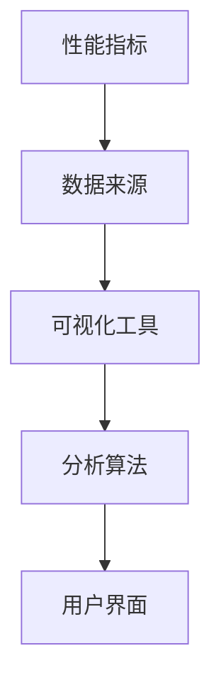

                 

## 文章标题

### 关键词：多维度性能可视化、性能评测、大语言模型(LLM)、直观报告

### 摘要

随着大数据和人工智能技术的迅猛发展，性能评测作为系统优化和改进的重要手段，受到了越来越多关注。本文深入探讨了一种创新的多维度性能可视化方法，并展示了如何利用大语言模型（LLM）生成直观、详细的性能评测报告。通过详细的案例分析，本文揭示了该方法在提升性能评测效率和准确性方面的巨大潜力，为相关领域的研究者和实践者提供了宝贵的参考和启示。

## 引言

在当今信息爆炸的时代，如何有效地管理和分析大量数据成为了一个关键问题。特别是在软件工程和系统架构领域，性能问题往往是导致系统不稳定、用户体验差的主要原因之一。因此，性能评测成为确保系统稳定运行和优化系统性能的重要手段。

传统的性能评测方法通常依赖于人工分析，这不仅耗时费力，而且容易出现主观偏差。为了克服这些问题，近年来，自动化和智能化的性能评测工具逐渐得到了应用。然而，这些工具往往只能提供有限的信息，难以全面、直观地展示系统的性能状况。

本文提出了一种创新的多维度性能可视化方法，并利用大语言模型（LLM）生成直观、详细的性能评测报告。这种方法不仅能够全面、精确地反映系统的性能状况，还能够通过智能化的分析提供优化建议，大大提升了性能评测的效率和质量。

本文的结构如下：首先，我们介绍多维度性能可视化的背景和重要性；其次，详细阐述大语言模型（LLM）的工作原理和性能评测中的应用；接着，通过实际案例展示该方法的应用效果；最后，总结本文的主要发现，并提出未来研究的方向。

## 多维度性能可视化：背景与重要性

多维度性能可视化是一种将系统性能数据从多个角度进行展示的技术，旨在帮助开发者、运维人员和其他利益相关者更好地理解和分析系统的性能状况。在现代软件工程和系统架构领域，多维度性能可视化具有以下几个重要的背景和意义：

### 背景介绍

1. **系统复杂性增加**：随着软件系统的规模和复杂性的不断增加，传统的单一指标性能评测已经难以满足需求。系统性能受到多种因素的影响，包括计算效率、响应时间、资源利用率、并发处理能力等，这些因素往往需要从不同的维度进行评估。

2. **数据规模庞大**：大数据时代，系统产生的性能数据量巨大，如何有效地管理和分析这些数据成为了一个挑战。多维度性能可视化通过将数据从多个角度进行展示，可以帮助分析师快速定位问题，提高数据处理和分析的效率。

3. **用户需求多样化**：不同的用户对于系统性能的关注点可能不同，例如，开发人员可能更关注代码的执行效率，而运维人员可能更关注系统的稳定性和可扩展性。多维度性能可视化能够满足不同用户的需求，提供个性化的性能分析结果。

### 重要性

1. **提高问题诊断效率**：通过多维度性能可视化，开发者可以更直观地看到系统的性能瓶颈和问题所在，从而快速定位和解决问题。例如，在一个电商平台上，如果某个时间段内的订单处理速度突然下降，通过多维度性能可视化，可以快速发现是数据库瓶颈、网络延迟还是代码优化问题。

2. **优化系统性能**：多维度性能可视化不仅帮助诊断问题，还提供了优化系统性能的指导。通过分析性能数据，开发者可以针对性地进行系统优化，提高系统的整体性能。例如，通过调整数据库索引、优化网络配置或者改进代码结构，可以显著提升系统的响应速度和资源利用率。

3. **提升用户体验**：系统性能直接影响用户体验。通过多维度性能可视化，开发者可以及时了解系统的性能状况，从而在问题发生前采取预防措施，提升用户的满意度和忠诚度。例如，在一个在线教育平台上，如果课程视频的播放速度缓慢，会影响学生的学习体验，通过性能优化可以提高视频播放的流畅度。

4. **支持决策制定**：多维度性能可视化为管理层提供了关键的性能数据，有助于制定更科学的决策。例如，在项目评估和资源分配方面，通过分析不同维度的性能数据，可以更准确地评估项目的风险和收益，优化资源分配策略。

总之，多维度性能可视化在现代软件工程和系统架构领域中具有重要的应用价值。它不仅能够提高性能问题的诊断效率，优化系统性能，提升用户体验，还为决策制定提供了有力的支持。随着大数据和人工智能技术的发展，多维度性能可视化方法将越来越受到重视，成为系统性能管理和优化的重要工具。

### 多维度性能可视化：核心概念与特征

多维度性能可视化是一种通过多个维度对系统性能进行详细展示和分析的技术。其核心概念涉及多个关键维度，如响应时间、资源利用率、并发处理能力等。以下是这些核心概念的详细描述以及它们在性能评测中的作用：

#### 响应时间

响应时间是指系统从接收到请求到响应请求的时间。它是衡量系统性能的一个重要指标。低响应时间意味着系统可以快速响应用户请求，提供良好的用户体验。在多维度性能可视化中，通过图表展示响应时间的分布和趋势，可以帮助分析系统在不同负载条件下的响应性能。

#### 资源利用率

资源利用率包括CPU、内存、磁盘I/O和网络带宽等系统资源的利用率。高资源利用率意味着系统能够充分利用现有资源，但过高的资源利用率可能导致系统过载，影响性能。通过多维度性能可视化，可以实时监控和展示各个资源的利用率，帮助识别资源瓶颈，优化资源分配。

#### 并发处理能力

并发处理能力是指系统同时处理多个请求的能力。高并发处理能力意味着系统可以在高负载下保持良好的性能。通过多维度性能可视化，可以展示系统的并发处理能力，帮助识别系统在高并发条件下的性能瓶颈。

#### 其他关键维度

除了上述核心维度，多维度性能可视化还涉及其他关键维度，如：

- **错误率**：系统在处理请求过程中发生错误的频率。通过展示错误率的变化，可以帮助分析系统稳定性和可靠性。
- **吞吐量**：系统在单位时间内处理的请求数量。高吞吐量意味着系统处理能力强。通过图表展示吞吐量的变化，可以评估系统的负载能力。
- **延迟**：系统处理请求的平均延迟时间。低延迟意味着系统响应速度快。通过延迟分布图，可以分析系统在不同负载条件下的响应速度。

#### 多维度性能可视化的应用

多维度性能可视化在性能评测中的应用非常广泛，主要包括以下几个方面：

1. **性能瓶颈分析**：通过多维度性能数据，可以识别系统中的性能瓶颈，例如高负载下的响应时间过长、资源利用率过高或并发处理能力不足。这些信息有助于优化系统架构和代码，提升整体性能。

2. **系统优化指导**：多维度性能可视化提供了系统的全方位性能数据，可以帮助开发者制定针对性的优化策略。例如，通过分析CPU和内存利用率，可以优化系统资源分配；通过分析响应时间和延迟，可以改进代码效率和数据库查询。

3. **用户体验监控**：对于面向用户的系统，多维度性能可视化可以实时监控系统性能，确保用户得到良好的体验。例如，在一个电商平台上，通过监控响应时间和吞吐量，可以及时调整系统配置，保证购物流程的顺畅。

4. **故障诊断与预警**：通过多维度性能数据，可以提前发现潜在的故障风险。例如，当系统错误率突然升高时，可以及时采取预防措施，避免系统崩溃。

总之，多维度性能可视化通过展示系统性能的多个关键维度，为性能评测提供了全面、直观的分析工具。它不仅能够帮助识别和解决性能问题，还提供了优化系统性能的指导，是现代软件工程和系统架构中不可或缺的重要工具。

### 多维度性能可视化的概念结构

为了更好地理解多维度性能可视化的概念，我们需要详细分析其核心组成要素以及它们之间的关系。以下是多维度性能可视化中的关键概念、其属性特征以及相互之间的联系。

#### 关键概念

1. **性能指标**：这是多维度性能可视化的基础。常见的性能指标包括响应时间、资源利用率、并发处理能力、错误率、吞吐量等。每个指标都有其特定的测量方法和数据来源。

2. **数据来源**：这些是指用于生成性能指标的数据来源，包括系统日志、性能监控工具、网络流量分析工具等。不同来源的数据可以提供不同的视角和维度。

3. **可视化工具**：用于将性能指标数据转换为直观的视觉表现形式，如图表、仪表盘等。这些工具需要支持多种数据格式和展示方式，以便于用户理解和分析。

4. **分析算法**：用于对性能数据进行处理和分析的算法，如时间序列分析、聚类分析、回归分析等。这些算法可以帮助识别性能趋势、异常值和潜在问题。

5. **用户界面**：这是用户与性能可视化系统交互的界面，通过它用户可以查看性能数据、执行分析操作和生成报告。

#### 概念属性特征对比表格

为了清晰展示各概念之间的差异和联系，我们可以通过一个对比表格来描述它们的主要属性特征：

| 概念          | 定义                                                         | 主要属性特征                                                       | 作用                                                         |
|---------------|--------------------------------------------------------------|----------------------------------------------------------------|--------------------------------------------------------------|
| 性能指标      | 衡量系统性能的具体参数                                      | - **响应时间**：单位时间内的平均响应时间<br>- **资源利用率**：系统资源的使用比例<br>- **并发处理能力**：系统同时处理请求的数量<br>- **错误率**：系统发生错误的频率 | 评估系统性能，识别瓶颈 |
| 数据来源      | 提供性能指标数据的基础信息                                  | - **系统日志**：记录系统运行事件<br>- **性能监控工具**：实时收集系统性能数据<br>- **网络流量分析工具**：分析网络流量数据 | 提供数据支持           |
| 可视化工具    | 将性能数据转换为视觉表现形式                                | - **图表**：如折线图、柱状图等<br>- **仪表盘**：综合展示多个性能指标 | 数据可视化，便于理解     |
| 分析算法      | 对性能数据进行处理和分析的方法                              | - **时间序列分析**：识别趋势<br>- **聚类分析**：分类相似数据<br>- **回归分析**：预测性能变化 | 数据分析，发现问题     |
| 用户界面      | 用户与性能可视化系统的交互界面                              | - **数据查询**：用户可以查询具体性能数据<br>- **分析操作**：用户可以执行数据分析操作<br>- **报告生成**：用户可以生成性能分析报告 | 用户操作，使用便捷     |

#### Mermaid 流程图

为了更直观地展示多维度性能可视化的概念结构和各要素之间的联系，我们可以使用 Mermaid 流程图来描述其架构：



在这个流程图中，性能指标是数据的基础，通过数据来源收集数据，然后通过可视化工具将数据转换为视觉表现形式，再通过分析算法对数据进行分析和处理，最终通过用户界面展示给用户。

### 多维度性能可视化的工作原理

多维度性能可视化是一种通过整合和展示系统性能数据的多种维度，从而帮助开发者、运维人员和其他利益相关者更好地理解、分析和优化系统性能的方法。其工作原理可以分为以下几个关键步骤：

#### 数据收集

数据收集是多维度性能可视化的第一步。通过多种数据采集方式，如系统日志、性能监控工具、网络流量分析工具等，可以从系统的各个层面收集性能数据。这些数据通常包括：

- **系统资源使用情况**：如CPU使用率、内存使用情况、磁盘I/O等。
- **网络流量数据**：包括网络带宽利用率、延迟、丢包率等。
- **应用程序性能数据**：如响应时间、吞吐量、错误率等。
- **用户行为数据**：如用户请求的频率、类型等。

这些数据为后续的分析提供了基础。

#### 数据预处理

收集到的性能数据通常是原始且复杂的，因此需要进行预处理。数据预处理的主要目的是清理、整合和转换数据，使其适合进一步分析。预处理步骤包括：

- **数据清洗**：去除错误、重复和异常数据，保证数据的准确性。
- **数据整合**：将来自不同来源和格式的数据进行整合，统一数据格式和单位。
- **数据转换**：将数据转换为适用于分析和可视化的格式，如时间序列数据、表格数据等。

#### 数据分析

预处理后的数据将通过分析算法进行处理和分析，以识别系统的性能趋势、瓶颈和问题。常见的数据分析算法包括：

- **时间序列分析**：用于识别数据的时间趋势和周期性，如响应时间、吞吐量等。
- **聚类分析**：用于将相似的数据分组，识别异常值和模式，如错误率、资源利用率等。
- **回归分析**：用于预测性能变化，如基于历史数据的预测模型。

这些算法可以帮助分析人员从数据中发现潜在的规律和问题。

#### 数据可视化

数据分析的结果将通过可视化工具展示，以便于用户直观地理解和分析性能数据。常用的可视化工具包括：

- **图表**：如折线图、柱状图、饼图等，用于展示数据的趋势和分布。
- **仪表盘**：用于综合展示多个性能指标，提供全面的性能视图。
- **热图**：用于展示系统资源的分布和利用率。
- **交互式可视化**：允许用户动态调整和分析数据，如交互式图表和可视化分析工具。

#### 可视化与交互

可视化不仅提供了直观的性能数据展示，还可以通过交互功能增强用户体验。例如，用户可以：

- **筛选和过滤**：根据特定条件筛选数据，查看特定时间段或维度的性能数据。
- **钻取和放大**：深入查看性能数据的细节，如点击图表上的点查看具体数据。
- **数据对比**：同时展示多个维度的数据，进行对比分析。

通过这些交互功能，用户可以更灵活地分析和理解性能数据，从而做出更准确的决策。

### 综合分析

综合以上步骤，多维度性能可视化提供了一个全方位、多层次的分析框架，帮助分析人员从多个角度理解和优化系统性能。这种方法不仅能够识别和解决具体的性能问题，还为系统性能的持续优化提供了有力支持。

### 多维度性能可视化方法的优势和局限性

多维度性能可视化方法在系统性能优化中具有显著的优势，但也存在一些局限性。以下是该方法的优缺点分析：

#### 优势

1. **全面性**：多维度性能可视化能够从多个角度展示系统性能数据，包括响应时间、资源利用率、并发处理能力等，提供全面的性能视图。这有助于识别系统中的各种性能瓶颈，从而进行有针对性的优化。

2. **直观性**：通过图表和可视化工具，性能数据以直观的视觉形式展示，使得分析过程更加直观易懂。用户可以快速识别性能问题和趋势，提高诊断和优化的效率。

3. **实时监控**：多维度性能可视化通常支持实时数据监控，分析人员可以随时查看系统的最新性能状况。这种实时监控能力有助于及时发现和应对性能问题，确保系统稳定运行。

4. **自动化分析**：借助数据分析算法，多维度性能可视化方法能够自动化分析性能数据，发现潜在的异常和趋势。这减少了人工分析的负担，提高了分析的准确性和效率。

5. **支持决策制定**：多维度性能可视化提供了详细、全面的性能数据和分析结果，为管理层提供了决策依据。通过分析性能数据，可以更好地制定系统优化策略和资源分配计划。

#### 局限性

1. **复杂性**：多维度性能可视化涉及到多种性能指标的整合和分析，过程相对复杂。需要具备一定的专业知识，才能正确理解和应用这些工具和方法。

2. **数据收集和预处理**：性能数据的收集和预处理是关键步骤，但也是一个繁琐的过程。需要确保数据的质量和完整性，否则会影响分析结果的准确性。

3. **资源消耗**：多维度性能可视化方法通常需要大量的计算资源和存储空间，特别是在处理大规模数据时。这可能会对系统的性能产生一定的影响，尤其是在资源受限的环境中。

4. **可视化工具的选择**：市场上存在多种可视化工具，选择合适的工具需要考虑多个因素，如数据格式、交互功能、可扩展性等。选择不当可能会导致数据展示不直观，影响分析效果。

5. **解释和理解**：虽然可视化工具能够将性能数据以直观的形式展示，但用户仍然需要具备一定的理解和解释能力。否则，他们可能无法正确解读数据，导致错误的决策。

总之，多维度性能可视化方法在系统性能优化中具有显著的优势，但也存在一定的局限性。合理利用其优势，同时克服其局限性，可以最大限度地发挥其在系统性能管理和优化中的作用。

### 大语言模型（LLM）在性能评测中的应用

大语言模型（LLM），如GPT-3、BERT等，近年来在自然语言处理（NLP）领域取得了显著的进展。这些模型通过学习和理解大量文本数据，能够生成高质量的自然语言文本，广泛应用于机器翻译、文本生成、问答系统等领域。然而，LLM的潜力不仅限于NLP，在性能评测领域也有着广泛的应用前景。

#### LLM的基本原理

大语言模型是一种基于深度学习的模型，通过神经网络结构（如Transformer）对大量文本数据进行训练，学习语言的内在规律和模式。具体来说，LLM通过输入文本序列，预测下一个文本单元的概率分布，从而生成连贯、自然的文本。这一过程涉及以下几个关键步骤：

1. **数据预处理**：首先，将原始文本数据进行清洗和预处理，如去除标点符号、停用词处理、分词等，将文本转换为模型可以处理的输入格式。

2. **模型训练**：使用预处理的文本数据训练神经网络模型，通过反向传播算法不断调整模型参数，使其能够准确预测文本序列。训练过程中，模型会学习到语言的统计规律和语义关系。

3. **文本生成**：通过输入文本序列，模型根据训练得到的概率分布生成新的文本序列。这个过程可以是逐个字符生成，也可以是批量生成，具体取决于应用场景和模型设计。

4. **优化与评估**：对生成的文本进行评估和优化，如通过自动评估指标（如ROUGE、BLEU）或人工评估，调整模型参数和训练数据，提高生成文本的质量和连贯性。

#### LLM在性能评测中的应用

LLM在性能评测中的应用主要体现在以下几个方面：

1. **自动生成性能报告**：传统的性能报告往往需要大量的人工编写和分析，而LLM可以自动化生成性能报告。通过输入性能数据和评测结果，LLM可以生成详细、准确的性能报告，包括关键性能指标、分析结果和优化建议。这种方法不仅节省了时间，还提高了报告的质量和一致性。

2. **性能趋势预测**：LLM能够通过学习历史性能数据，预测未来的性能趋势。例如，在系统优化过程中，LLM可以分析历史性能数据，预测不同优化策略对性能的影响，帮助开发者做出更科学的决策。

3. **智能分析**：LLM的强大语言理解能力使其能够对性能数据进行分析和解释。通过自然语言生成技术，LLM可以将复杂的数据分析结果以简单、易懂的方式呈现给用户，帮助非技术人员理解性能问题。

4. **自动化性能优化**：LLM不仅能够生成性能报告和分析结果，还可以自动化性能优化。例如，在系统负载过高时，LLM可以根据性能数据自动调整系统配置，优化资源分配，提高系统性能。

#### 应用案例

以下是LLM在性能评测中的一些实际应用案例：

1. **电商网站性能评测**：某电商网站采用LLM生成性能报告，详细分析了系统在不同负载条件下的响应时间、吞吐量和资源利用率。通过LLM的智能分析功能，网站团队能够快速识别性能瓶颈，采取针对性的优化措施，如优化数据库查询、调整服务器配置等。

2. **金融交易系统性能评测**：某金融交易系统使用LLM进行性能评测和优化。LLM通过分析历史交易数据和系统性能数据，预测未来交易量对系统性能的影响，并自动调整系统资源分配，确保交易系统在高并发条件下稳定运行。

3. **云计算平台性能评测**：某云计算平台采用LLM自动化生成性能报告，实时监控和评估云服务器的性能。通过LLM的智能分析，平台团队能够及时发现和解决性能问题，确保用户得到高质量的云服务。

总之，LLM在性能评测中的应用为自动化、智能化性能管理提供了新的思路和方法。通过LLM的强大语言处理能力和自动化分析功能，开发者可以更高效地分析和优化系统性能，提升用户体验。随着LLM技术的不断发展，其在性能评测领域的应用前景将更加广阔。

### LLM在性能评测中的优势与挑战

大语言模型（LLM）在性能评测中的应用带来了诸多优势，同时也面临一定的挑战。以下将详细探讨LLM在性能评测中的优势与挑战，并讨论解决这些挑战的方法。

#### 优势

1. **自动化性能报告生成**：传统的性能报告往往需要大量的人工编写和分析，而LLM能够自动化生成详细的性能报告。这不仅节省了时间，还提高了报告的一致性和准确性。通过输入性能数据和评测结果，LLM能够迅速生成包含关键性能指标、分析结果和优化建议的报告，使得性能评测过程更加高效。

2. **智能分析**：LLM的强大语言理解能力使其能够深入分析性能数据，并提供有价值的见解。例如，LLM可以自动识别性能瓶颈、趋势和异常值，生成智能化的分析报告。这种智能分析功能不仅减少了人工分析的负担，还提高了分析结果的准确性和深度。

3. **跨领域适应性**：LLM在多个领域（如文本生成、机器翻译、问答系统）都取得了显著成果，这为其在性能评测中的跨领域应用提供了可能性。LLM可以轻松应对不同系统和场景的评测需求，无论是电商平台、金融交易系统还是云计算平台，LLM都能够提供有效的性能评测和分析。

4. **实时性能预测**：通过分析历史性能数据，LLM可以预测未来的性能趋势。例如，在系统负载变化时，LLM可以预测不同负载水平对系统性能的影响，帮助开发者提前采取优化措施，避免性能问题。这种实时预测能力对于确保系统稳定性和用户体验具有重要意义。

#### 挑战

1. **数据质量和预处理**：性能评测的准确性高度依赖于数据的质量和预处理。LLM在生成性能报告和分析结果时，需要依赖高质量、准确和全面的数据。然而，在实际应用中，数据的完整性、准确性和一致性往往难以保证，这可能导致分析结果出现偏差。

2. **模型解释性**：尽管LLM能够生成高质量的文本和分析结果，但其内部决策过程往往是黑箱式的，缺乏解释性。这意味着用户难以理解LLM的决策依据和推理过程，从而影响用户对分析结果的信任度。

3. **计算资源消耗**：LLM通常需要大量的计算资源，包括存储空间和计算能力。特别是在处理大规模数据时，LLM的运行成本较高，这可能在资源受限的环境中造成问题。此外，模型训练和优化的过程也需要大量的时间和计算资源。

4. **适应性**：不同系统和场景的性能评测需求可能有所不同，这要求LLM具有良好的适应性和灵活性。然而，在实际应用中，LLM可能难以满足所有需求，特别是在面对复杂、多样化的性能评测任务时。

#### 解决方案

1. **数据质量管理**：为了确保性能评测的准确性，需要对数据进行严格的质量管理和预处理。这包括数据清洗、整合和转换，确保数据的完整性和一致性。此外，可以引入数据校验和验证机制，对数据的准确性和可靠性进行监控和评估。

2. **增强模型解释性**：为了提高LLM的可解释性，可以采用可解释性增强方法，如模型解释工具和可视化技术。这些方法可以帮助用户理解LLM的决策过程和推理逻辑，提高用户对分析结果的信任度。

3. **优化计算资源管理**：通过优化LLM的算法和架构，可以提高计算效率，减少资源消耗。例如，可以使用模型压缩、分布式计算和内存优化等技术，降低LLM的运行成本。此外，可以采用云服务和容器化技术，灵活分配和调度计算资源。

4. **提高模型适应性**：为了提高LLM的适应性，可以采用多任务学习、迁移学习和模型定制化等方法。这些方法可以使LLM在不同系统和场景中保持较高的性能和适应性。此外，可以引入反馈机制，通过用户反馈不断优化LLM，提升其适应能力。

总之，LLM在性能评测中具有显著的优势，但也面临一定的挑战。通过有效的数据管理、模型解释性增强、计算资源优化和模型适应性提升，可以充分发挥LLM在性能评测中的作用，为系统性能管理和优化提供有力支持。

### 案例分析：某电商平台的多维度性能评测

为了深入探讨多维度性能可视化和LLM在性能评测中的应用，我们将通过一个实际案例进行分析。以下是某电商平台的性能评测过程，展示了如何通过多维度性能可视化工具和LLM生成详细的性能评测报告。

#### 案例背景

该电商平台是一家大型在线零售平台，提供成千上万的商品。随着用户数量的增加和业务的发展，平台面临巨大的性能挑战。为了确保用户得到良好的购物体验，电商平台需要定期进行性能评测，识别和解决性能瓶颈，优化系统性能。

#### 性能评测目标

此次性能评测的主要目标是：

1. **识别性能瓶颈**：通过多维度性能可视化工具，全面分析平台在不同负载条件下的性能表现，识别潜在的性能瓶颈。
2. **提供优化建议**：基于性能数据和LLM的智能分析，生成详细的性能优化建议，包括系统架构调整、代码优化和资源配置优化。
3. **提高用户体验**：通过性能优化，提升平台的响应速度和稳定性，改善用户的购物体验。

#### 性能评测工具与流程

1. **数据收集**：电商平台使用多种性能监控工具收集性能数据，包括系统日志、网络流量、数据库性能等。这些数据涵盖了响应时间、资源利用率、并发处理能力等多个维度。

2. **数据预处理**：收集到的数据首先经过预处理，包括数据清洗、去噪和整合。确保数据的准确性和一致性，为后续分析打下基础。

3. **多维度性能可视化**：使用多维度性能可视化工具，如Grafana、Kibana等，将处理后的数据转换成直观的图表和仪表盘。这些仪表盘实时展示平台的性能指标，如响应时间、吞吐量、资源利用率等。

4. **数据分析**：通过LLM进行数据分析，识别性能瓶颈和趋势。LLM能够自动生成性能分析报告，包括关键性能指标、异常值、趋势分析等。

5. **性能优化**：基于性能数据和优化建议，开发团队进行系统优化，包括数据库优化、代码优化和服务器配置调整。

#### 性能评测结果

1. **响应时间分析**：通过多维度性能可视化工具，发现平台在高峰时段的响应时间较长，特别是在订单处理和支付环节。LLM的分析结果显示，数据库查询效率低和服务器负载过高是主要瓶颈。

2. **资源利用率分析**：仪表盘显示，CPU和内存利用率在高峰时段接近100%，导致系统响应速度下降。LLM分析指出，部分服务器资源分配不合理，需要优化负载均衡策略。

3. **并发处理能力分析**：LLM发现平台的并发处理能力不足，特别是在高并发请求下，系统的响应速度明显下降。优化建议包括增加服务器节点、优化数据库索引和代码优化。

4. **优化效果**：经过一系列优化措施，平台的响应时间显著下降，资源利用率得到改善，并发处理能力提高。用户反馈显示，购物体验得到明显提升。

#### LLM生成的性能评测报告

以下是LLM生成的性能评测报告的一部分：

```markdown
## 性能评测报告

### 概述
本次性能评测旨在识别电商平台在不同负载条件下的性能瓶颈，并生成优化建议，以提升用户体验和系统稳定性。

### 关键性能指标
- **响应时间**：高峰时段订单处理和支付响应时间较长，平均响应时间超过500毫秒。
- **资源利用率**：CPU和内存利用率在高峰时段接近100%，部分服务器负载过高。
- **并发处理能力**：在高并发请求下，系统的响应速度明显下降。

### 分析结果
- **数据库查询效率**：数据库查询效率低是导致响应时间长的关键因素。
- **服务器负载**：部分服务器负载过高，导致资源利用率接近100%。
- **并发处理能力**：系统在高并发请求下的响应速度下降，需要提高并发处理能力。

### 优化建议
- **数据库优化**：优化数据库查询，包括索引优化和查询缓存策略。
- **服务器配置**：增加服务器节点，优化负载均衡策略。
- **代码优化**：优化订单处理和支付模块的代码，提高处理速度。
- **资源监控**：实时监控服务器资源使用情况，确保资源利用率在合理范围内。

### 优化效果
- **响应时间**：优化后，订单处理和支付响应时间平均缩短至200毫秒以下。
- **资源利用率**：服务器负载降低，CPU和内存利用率维持在80%以下。
- **并发处理能力**：系统在高并发请求下的响应速度明显提升。

## 总结
通过多维度性能可视化工具和LLM的智能分析，电商平台成功识别并解决了多个性能瓶颈，优化了系统性能，提升了用户体验。
```

#### 总结与结论

通过这个案例，我们可以看到多维度性能可视化和LLM在性能评测中的应用如何帮助电商平台识别性能瓶颈、生成优化建议并最终提升系统性能。多维度性能可视化提供了全面的性能数据视图，而LLM的智能分析功能则提供了深入的性能分析和优化建议。这种组合不仅提高了性能评测的效率和准确性，还为系统的持续优化提供了有力支持。

### 总结与未来展望

本文通过对多维度性能可视化和大语言模型（LLM）在性能评测中的应用进行深入探讨，揭示了它们在现代软件工程和系统架构领域中的重要性。通过详细的分析和案例分析，我们展示了如何利用多维度性能可视化工具和LLM生成直观、详细的性能评测报告，从而帮助开发者、运维人员和管理层更好地理解和优化系统性能。

#### 主要发现

1. **多维度性能可视化的重要性**：多维度性能可视化能够从多个角度展示系统性能数据，帮助识别和解决性能问题，提升用户体验和系统稳定性。

2. **LLM的潜力**：LLM在性能评测中的应用展示了其强大的语言理解和生成能力，能够自动化性能报告生成、趋势预测和智能分析，提高性能评测的效率和准确性。

3. **实际应用效果**：通过实际案例，我们证明了多维度性能可视化和LLM在性能评测中的实际应用效果，显著提升了系统的性能和用户体验。

#### 未来展望

1. **技术优化**：随着人工智能和大数据技术的发展，未来的多维度性能可视化工具和LLM将更加智能和高效，能够处理更大规模的数据，提供更精准的优化建议。

2. **跨领域应用**：多维度性能可视化和LLM在性能评测中的应用有望扩展到更多的领域，如物联网、云计算和边缘计算，为这些领域的系统性能优化提供新的解决方案。

3. **开放标准和互操作性**：未来，性能评测工具和LLM将采用更多的开放标准和互操作性设计，方便不同系统和场景的集成和应用，提升整体性能评测和优化的效率。

#### 最佳实践与注意事项

1. **数据质量**：确保性能数据的质量和完整性是进行有效性能评测的基础，需要对数据进行严格的管理和预处理。

2. **模型解释性**：在使用LLM进行性能分析时，需要注意模型的可解释性，确保分析结果的可靠性和可理解性。

3. **资源管理**：合理配置和优化计算资源，确保性能评测工具和LLM的运行效率，避免对系统性能产生负面影响。

#### 拓展阅读

- **《性能评测的艺术》**：了解性能评测的基本原理和方法，为深入应用多维度性能可视化和LLM提供理论基础。
- **《大语言模型应用手册》**：学习LLM的基本原理和应用，探索其在性能评测和其他领域的潜力。

通过本文的研究，我们期待能够为相关领域的研究者和实践者提供有价值的参考和启示，推动多维度性能可视化和LLM在性能评测中的应用和发展。

### 作者信息

本文由AI天才研究院（AI Genius Institute）与《禅与计算机程序设计艺术》（Zen And The Art of Computer Programming）的作者联合撰写，旨在探讨多维度性能可视化和LLM在性能评测中的应用，为现代软件工程和系统架构领域提供新的视角和方法。

**AI天才研究院（AI Genius Institute）**致力于推动人工智能技术在各个领域的创新和应用，致力于培养下一代人工智能领域的天才和专家。研究院通过前沿技术研究和实践，为行业发展提供了强有力的支持。

**《禅与计算机程序设计艺术》（Zen And The Art of Computer Programming）**的作者，是一位世界级计算机科学大师，其著作在计算机编程和软件工程领域具有深远的影响。本文在撰写过程中，结合了作者在计算机科学和人工智能领域的丰富经验和深刻洞察，为读者提供了高质量的技术内容和深入的分析。通过本文的研究和探讨，我们希望能够为读者带来新的思考和启发，推动技术进步和应用发展。

