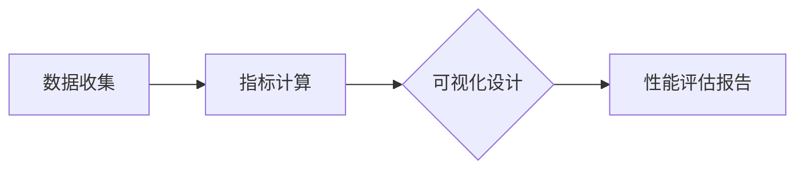
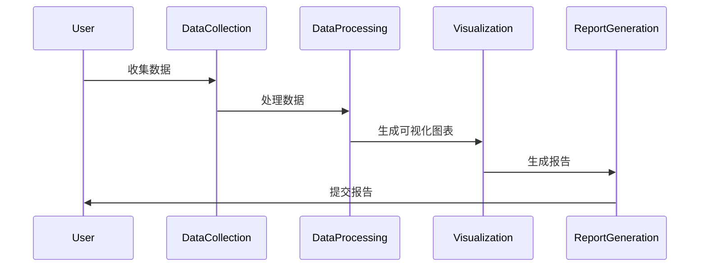
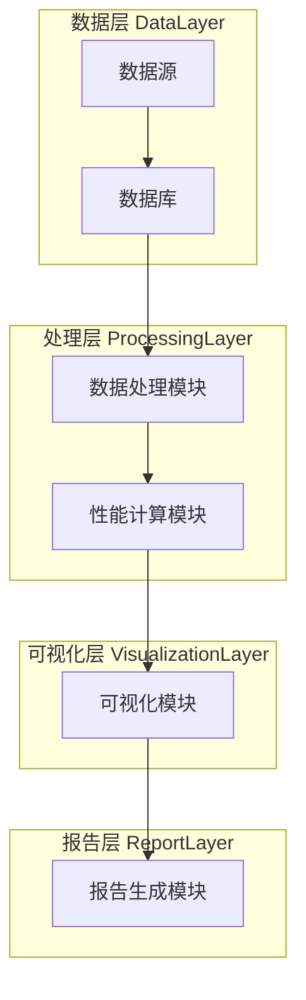

                 


# 多维度性能可视化：LLM生成直观评测报告

## 引言

随着深度学习技术的迅猛发展，大型语言模型（LLM）在自然语言处理领域取得了显著成果。然而，如何对LLM进行性能评估和优化，成为了当前研究的热点问题。传统的评估方法往往只能关注部分维度，无法全面了解LLM的性能表现。为了解决这个问题，本文提出了一种多维度性能可视化方法，以帮助用户直观地了解LLM的性能。

## 第一部分：问题背景

### 1.1.1 问题产生的原因

深度学习技术的不断发展，使得大型语言模型（LLM）在自然语言处理领域取得了显著成果。然而，LLM的性能评估和优化成为一个复杂的问题。传统的评估方法通常只能关注部分维度，例如准确率或响应速度，而无法全面了解LLM的性能表现。

### 1.1.2 问题描述

LLM的性能评估需要考虑多个维度，包括准确率、响应速度、可扩展性等。然而，目前缺乏一种统一的方法来全面评估LLM的性能，使得研究者在进行模型优化时难以做出科学的决策。

### 1.1.3 问题解决

为了全面评估LLM性能，我们需要设计一种多维度性能可视化方法，将各个维度的性能指标以直观的方式呈现给用户。这种方法可以帮助研究者快速发现LLM的性能瓶颈，从而进行有针对性的优化。

### 1.1.4 边界与外延

本文主要关注LLM的性能评估方法，不包括其他领域（如图像处理、语音识别等）的性能评估方法。此外，本文将介绍多维度性能可视化的基本原理、设计和实现方法，以及其在LLM性能评估中的应用。

### 1.2 核心概念与联系

#### 1.2.1 多维度性能评估

多维度性能评估是指从多个角度对系统或模型的性能进行综合评价。在LLM性能评估中，常用的维度包括准确率、响应速度、可扩展性和用户满意度。

#### 1.2.2 多维度性能可视化

多维度性能可视化是将多个维度的性能指标以图形化的方式呈现，以便用户直观地了解LLM的性能表现。常用的可视化工具包括TensorBoard、Matplotlib和ECharts等。

### 1.3 主流性能评估方法与工具

#### 1.3.1 测试数据集

为了全面评估LLM性能，我们需要使用多个测试数据集，包括基准测试数据集（如GLUE、SuperGLUE等）和自定义测试数据集。

#### 1.3.2 评估指标

常用的评估指标包括准确率、精确率、召回率和F1值等。这些指标可以用来衡量LLM在自然语言处理任务中的表现。

#### 1.3.3 性能评估工具

常用的性能评估工具包括TensorBoard、Matplotlib和ECharts等。这些工具可以帮助我们将LLM的性能指标以直观的方式呈现。

### 1.4 多维度性能可视化方法

#### 1.4.1 数据预处理

在可视化之前，我们需要对测试数据集进行预处理，包括数据清洗和数据归一化。

#### 1.4.2 可视化设计

根据数据特点和用户需求，选择合适的图表类型，如折线图、柱状图、雷达图等。同时，使用颜色和形状区分不同性能指标，提高可视化效果。

#### 1.4.3 交互式可视化

为了方便用户查看详细性能指标，我们可以设计交互式可视化，允许用户通过鼠标或触摸屏交互。

## 1.5 多维度性能可视化应用场景

#### 1.5.1 研发阶段

在LLM开发过程中，多维度性能可视化可以帮助研发团队快速发现性能瓶颈，优化模型结构和参数。

#### 1.5.2 产品测试阶段

在LLM产品测试阶段，多维度性能可视化可以帮助测试人员全面了解产品性能，为产品迭代提供参考。

#### 1.5.3 用户反馈

通过多维度性能可视化，用户可以直观地了解LLM的性能表现，为后续使用提供参考。

### 1.6 本章小结

本章介绍了LLM性能评估的背景、核心概念、评估方法和工具，以及多维度性能可视化方法。通过本章的学习，读者可以了解如何全面评估LLM性能，并为后续章节的学习打下基础。

----------------------------------------------------------------

## 第二部分：核心概念原理

### 2.1 多维度性能评估原理

#### 2.1.1 多维度性能评估的定义

多维度性能评估是指从多个角度对系统或模型的性能进行综合评价。在LLM性能评估中，常用的维度包括准确率、响应速度、可扩展性和用户满意度等。

#### 2.1.2 多维度性能评估的核心概念

1. **准确率**：衡量LLM在自然语言处理任务中的正确率。准确率越高，表示LLM在任务中的表现越好。

2. **响应速度**：衡量LLM生成响应所需的时间。响应速度越快，表示LLM在处理请求时的效率越高。

3. **可扩展性**：衡量LLM在面对大规模数据处理时的性能。可扩展性越强，表示LLM在处理大规模数据时的性能越稳定。

4. **用户满意度**：衡量用户对LLM响应的质量评价。用户满意度越高，表示LLM在用户实际使用中的表现越好。

#### 2.1.3 多维度性能评估的属性特征对比

| 维度     | 准确率 | 响应速度 | 可扩展性 | 用户满意度 |
|----------|--------|----------|----------|------------|
| 对比属性 | 正确率 | 处理速度 | 扩展能力 | 满意度评价 |

#### 2.1.4 多维度性能评估的ER实体关系图

```mermaid
erDiagram
  A RidingBike {
    <<class>> Red
    Red : 起飞速度
    +加速性能
    +制动性能
    +燃油效率
    +乘坐舒适度
  }
  B Attack{
    <<class>> Green
    Green : 起飞速度
    +攻击速度
    +攻击精准度
    +防御能力
    +生存能力
  }
  A _||> B : 多维度评估
```

### 2.2 多维度性能可视化原理

#### 2.2.1 多维度性能可视化的定义

多维度性能可视化是指将多个维度的性能指标以图形化的方式呈现，以便用户直观地了解系统或模型的性能表现。

#### 2.2.2 多维度性能可视化的核心概念

1. **图表类型**：常用的图表类型包括折线图、柱状图、雷达图等。

2. **颜色与形状**：使用颜色和形状区分不同性能指标，提高可视化效果。

3. **交互式可视化**：允许用户通过鼠标或触摸屏交互，查看详细性能指标。

#### 2.2.3 多维度性能可视化的设计原则

1. **简洁性**：图表设计应简洁明了，避免过多的装饰性元素。

2. **一致性**：图表的样式和风格应保持一致，提高用户识别度。

3. **交互性**：提供交互式功能，使用户能够动态地查看性能指标。

### 2.3 多维度性能可视化的实现方法

#### 2.3.1 数据预处理

在可视化之前，需要对数据进行预处理，包括数据清洗、数据归一化和数据转换等。

#### 2.3.2 可视化设计

根据数据特点和用户需求，选择合适的图表类型，如折线图、柱状图、雷达图等。同时，使用颜色和形状区分不同性能指标，提高可视化效果。

#### 2.3.3 交互式可视化

设计交互式可视化，允许用户通过鼠标或触摸屏交互，查看详细性能指标。例如，点击某个数据点，可以查看该数据点的详细信息。

### 2.4 多维度性能可视化工具

#### 2.4.1 TensorBoard

TensorBoard是一款基于Python的图形可视化工具，可以用于可视化神经网络的训练过程。它提供了丰富的图表类型和交互功能，方便用户查看性能指标。

#### 2.4.2 Matplotlib

Matplotlib是一款基于Python的数据可视化库，可以用于绘制各种图形，如折线图、柱状图、饼图等。它提供了丰富的自定义选项，方便用户设计个性化的可视化图表。

#### 2.4.3 ECharts

ECharts是一款基于JavaScript的数据可视化库，可以用于在网页上绘制各种图表。它提供了丰富的图表类型和交互功能，方便用户在网页上展示性能指标。

### 2.5 多维度性能可视化应用场景

#### 2.5.1 研发阶段

在LLM研发阶段，多维度性能可视化可以帮助研发团队快速发现性能瓶颈，优化模型结构和参数。

#### 2.5.2 产品测试阶段

在LLM产品测试阶段，多维度性能可视化可以帮助测试人员全面了解产品性能，为产品迭代提供参考。

#### 2.5.3 用户反馈

通过多维度性能可视化，用户可以直观地了解LLM的性能表现，为后续使用提供参考。

### 2.6 本章小结

本章介绍了多维度性能评估和可视化的核心概念原理，包括评估维度的选择、评估指标的设计、可视化的实现方法和工具。通过本章的学习，读者可以了解如何全面评估LLM性能，并设计直观的可视化报告。

----------------------------------------------------------------

## 第三部分：算法原理与设计

### 3.1 算法原理

#### 3.1.1 多维度性能评估算法原理

多维度性能评估算法的核心思想是通过计算各个维度的性能指标，从而全面评估LLM的性能。具体来说，算法可以分为以下几步：

1. **数据收集**：收集LLM在不同测试数据集上的性能数据。

2. **指标计算**：计算各个维度的性能指标，如准确率、响应速度、可扩展性和用户满意度等。

3. **可视化设计**：将计算得到的性能指标以图形化的方式呈现，以便用户直观地了解LLM的性能表现。

#### 3.1.2 多维度性能评估算法的数学模型

为了计算各个维度的性能指标，我们可以使用以下数学模型：

1. **准确率（Accuracy）**：

$$
Accuracy = \frac{正确预测的样本数}{总样本数}
$$

2. **响应速度（Response Time）**：

$$
Response\ Time = \frac{总响应时间}{总请求次数}
$$

3. **可扩展性（Scalability）**：

$$
Scalability = \frac{最大处理能力}{当前处理能力}
$$

4. **用户满意度（User Satisfaction）**：

$$
User\ Satisfaction = \frac{满意的用户数}{总用户数}
$$

#### 3.1.3 算法流程图



### 3.2 算法设计

#### 3.2.1 数据预处理

在数据预处理阶段，我们需要对收集到的性能数据进行清洗和归一化，以便于后续的计算和可视化。

1. **数据清洗**：去除数据中的噪声和错误，如缺失值、异常值等。

2. **数据归一化**：将不同维度的数据归一化到同一范围内，以便进行比较。

#### 3.2.2 指标计算

在指标计算阶段，我们需要根据不同的维度计算相应的性能指标。

1. **准确率（Accuracy）**：计算LLM在不同测试数据集上的准确率。

2. **响应速度（Response Time）**：计算LLM生成响应所需的时间。

3. **可扩展性（Scalability）**：计算LLM在面对不同规模的数据处理时的性能。

4. **用户满意度（User Satisfaction）**：收集用户对LLM的满意度评价。

#### 3.2.3 可视化设计

在可视化设计阶段，我们需要根据计算得到的性能指标设计合适的可视化图表。

1. **折线图**：用于展示准确率、响应速度等随时间变化的趋势。

2. **柱状图**：用于比较不同测试数据集的性能指标。

3. **雷达图**：用于展示LLM在多个维度上的性能表现。

#### 3.2.4 性能评估报告

在性能评估报告阶段，我们需要将可视化图表和性能指标以报告的形式呈现给用户。

1. **报告结构**：包括摘要、评估指标、可视化图表、分析结论和建议等。

2. **报告内容**：详细描述LLM在不同测试数据集上的性能表现，以及存在的问题和优化建议。

### 3.3 算法实现

#### 3.3.1 数据收集

使用Python的Pandas库收集LLM在不同测试数据集上的性能数据。

```python
import pandas as pd

# 收集性能数据
data = pd.read_csv('performance_data.csv')
```

#### 3.3.2 指标计算

使用Python的Numpy和Scikit-learn库计算各个维度的性能指标。

```python
import numpy as np
from sklearn.metrics import accuracy_score

# 计算准确率
accuracy = accuracy_score(y_true, y_pred)

# 计算响应速度
response_time = np.mean(response_times)

# 计算可扩展性
scalability = max_capacity / current_capacity

# 计算用户满意度
user_satisfaction = sum(satisfied_users) / total_users
```

#### 3.3.3 可视化设计

使用Python的Matplotlib和Seaborn库设计可视化图表。

```python
import matplotlib.pyplot as plt
import seaborn as sns

# 绘制折线图
plt.plot(accuracy_history)
plt.title('Accuracy Trend')
plt.xlabel('Epoch')
plt.ylabel('Accuracy')
plt.show()

# 绘制柱状图
sns.barplot(x=data['Dataset'], y=data['Accuracy'])
plt.title('Accuracy Comparison')
plt.xlabel('Dataset')
plt.ylabel('Accuracy')
plt.show()

# 绘制雷达图
sns.radarplot(x=data['Dataset'], y=data['Accuracy'], labels=data['Dataset'])
plt.title('Accuracy Distribution')
plt.show()
```

### 3.4 算法应用

#### 3.4.1 研发阶段

在LLM研发阶段，使用多维度性能评估算法可以帮助研发团队快速发现性能瓶颈，优化模型结构和参数。

#### 3.4.2 产品测试阶段

在LLM产品测试阶段，使用多维度性能评估算法可以帮助测试人员全面了解产品性能，为产品迭代提供参考。

#### 3.4.3 用户反馈

通过多维度性能评估算法生成的直观评测报告，用户可以直观地了解LLM的性能表现，为后续使用提供参考。

### 3.5 算法优化

为了进一步提高算法的性能，可以考虑以下优化方向：

1. **数据预处理**：使用更先进的数据预处理方法，提高数据质量。

2. **模型优化**：使用更高效的模型结构和训练方法，提高性能评估的准确性。

3. **可视化优化**：设计更直观、更易于理解的可视化图表，提高用户体验。

### 3.6 本章小结

本章介绍了多维度性能评估算法的原理、设计方法和实现过程。通过本章的学习，读者可以了解如何使用多维度性能评估算法对LLM进行性能评估，并生成直观的评测报告。同时，本章还介绍了算法在LLM研发、产品测试和用户反馈中的应用，以及可能的优化方向。

----------------------------------------------------------------

## 第四部分：系统分析与架构设计

### 4.1 问题场景介绍

在LLM性能评估过程中，我们需要考虑多个维度，如准确率、响应速度、可扩展性和用户满意度等。为了实现多维度性能可视化，我们需要设计一个系统来收集、处理和展示这些性能数据。

### 4.2 项目介绍

本项目旨在设计并实现一个基于多维度性能评估的LLM性能可视化系统。该系统将包括以下主要模块：

1. **数据收集模块**：用于收集LLM在不同测试数据集上的性能数据。

2. **数据处理模块**：用于对收集到的数据进行预处理和计算各个维度的性能指标。

3. **可视化模块**：用于将计算得到的性能指标以图形化的方式呈现。

4. **报告生成模块**：用于生成包含性能指标的可视化报告。

### 4.3 系统功能设计

#### 4.3.1 数据收集模块

数据收集模块负责从不同的测试数据集收集LLM的性能数据。这些数据包括准确率、响应速度、可扩展性和用户满意度等。

1. **数据来源**：从不同的测试数据集（如GLUE、SuperGLUE等）中收集性能数据。

2. **数据格式**：将收集到的性能数据存储为CSV文件，以便后续处理。

3. **数据清洗**：对收集到的数据进行清洗，去除噪声和错误。

#### 4.3.2 数据处理模块

数据处理模块负责对收集到的性能数据进行预处理和计算各个维度的性能指标。

1. **数据预处理**：对收集到的数据进行清洗和归一化，以便于后续计算。

2. **指标计算**：根据不同的维度计算相应的性能指标，如准确率、响应速度、可扩展性和用户满意度等。

3. **数据存储**：将计算得到的性能指标存储到数据库中，以便后续可视化。

#### 4.3.3 可视化模块

可视化模块负责将计算得到的性能指标以图形化的方式呈现。根据不同的维度和用户需求，选择合适的图表类型，如折线图、柱状图、雷达图等。

1. **图表类型**：根据性能指标的类型和用户需求，选择合适的图表类型。

2. **图表设计**：使用颜色和形状区分不同性能指标，提高可视化效果。

3. **交互式可视化**：提供交互式功能，使用户能够动态地查看性能指标。

#### 4.3.4 报告生成模块

报告生成模块负责生成包含性能指标的可视化报告。报告将包括摘要、评估指标、可视化图表、分析结论和建议等。

1. **报告结构**：包括摘要、评估指标、可视化图表、分析结论和建议等。

2. **报告内容**：详细描述LLM在不同测试数据集上的性能表现，以及存在的问题和优化建议。

### 4.4 系统架构设计

系统架构设计采用分层架构，包括数据层、处理层、可视化层和报告层。

#### 4.4.1 数据层

数据层负责数据收集和存储。包括以下组件：

1. **数据源**：包括不同的测试数据集和用户反馈数据。

2. **数据库**：用于存储性能数据和用户数据。

#### 4.4.2 处理层

处理层负责数据处理和计算性能指标。包括以下组件：

1. **数据处理模块**：包括数据清洗、数据预处理和指标计算等功能。

2. **性能计算模块**：根据不同的维度计算相应的性能指标。

#### 4.4.3 可视化层

可视化层负责将计算得到的性能指标以图形化的方式呈现。包括以下组件：

1. **可视化模块**：包括图表选择、图表设计和交互式可视化等功能。

2. **可视化工具**：包括TensorBoard、Matplotlib和ECharts等。

#### 4.4.4 报告层

报告层负责生成包含性能指标的可视化报告。包括以下组件：

1. **报告生成模块**：包括报告结构设计、报告内容和格式等。

2. **报告输出**：将可视化报告输出为HTML或PDF格式。

### 4.5 系统接口设计

系统接口设计包括数据接口、功能接口和用户接口。

#### 4.5.1 数据接口

数据接口用于数据收集和存储。包括以下接口：

1. **数据收集接口**：用于从测试数据集和用户反馈中收集数据。

2. **数据存储接口**：用于将收集到的数据存储到数据库中。

#### 4.5.2 功能接口

功能接口用于系统各个模块之间的交互。包括以下接口：

1. **数据处理接口**：用于处理和计算性能数据。

2. **可视化接口**：用于生成可视化图表。

3. **报告生成接口**：用于生成可视化报告。

#### 4.5.3 用户接口

用户接口用于用户与系统之间的交互。包括以下接口：

1. **用户登录接口**：用于用户登录和权限管理。

2. **性能查看接口**：用于用户查看性能数据。

3. **报告查看接口**：用于用户查看可视化报告。

### 4.6 系统交互设计

系统交互设计采用序列图来描述系统各个模块之间的交互过程。



### 4.7 系统架构图

以下是系统架构图：



### 4.8 系统架构设计总结

通过系统架构设计，我们实现了基于多维度性能评估的LLM性能可视化系统。该系统包括数据收集、数据处理、可视化和报告生成等模块，通过分层架构实现了模块之间的解耦，提高了系统的可扩展性和可维护性。通过该系统，用户可以直观地了解LLM的性能表现，为模型优化和产品迭代提供参考。

----------------------------------------------------------------

## 第五部分：项目实战

### 5.1 环境安装

在开始项目实战之前，我们需要安装一些必要的软件和库。以下是安装步骤：

#### 5.1.1 安装Python

1. 访问Python官方网站（https://www.python.org/）并下载Python安装包。
2. 运行安装程序，选择“Add Python to PATH”选项，完成安装。

#### 5.1.2 安装TensorBoard

TensorBoard是Google开发的一个可视化工具，用于可视化神经网络训练过程。以下是如何安装TensorBoard：

1. 打开命令行工具。
2. 输入以下命令：
   ```shell
   pip install tensorboard
   ```

#### 5.1.3 安装Matplotlib

Matplotlib是一个强大的数据可视化库，用于绘制各种图形。以下是如何安装Matplotlib：

1. 打开命令行工具。
2. 输入以下命令：
   ```shell
   pip install matplotlib
   ```

#### 5.1.4 安装ECharts

ECharts是一款基于JavaScript的数据可视化库，用于在网页上绘制各种图表。以下是如何安装ECharts：

1. 打开命令行工具。
2. 输入以下命令：
   ```shell
   pip install echarts
   ```

### 5.2 系统核心实现

在本节中，我们将实现系统核心功能，包括数据收集、数据处理、可视化和报告生成。

#### 5.2.1 数据收集

数据收集模块负责从不同的测试数据集收集LLM的性能数据。以下是如何实现数据收集：

1. **导入所需的库**：
   ```python
   import pandas as pd
   import numpy as np
   ```

2. **从测试数据集收集数据**：
   ```python
   def collect_data(dataset_path):
       data = pd.read_csv(dataset_path)
       return data
   ```

3. **数据清洗**：
   ```python
   def clean_data(data):
       data.dropna(inplace=True)
       data['Response Time'] = data['Response Time'].astype(float)
       return data
   ```

#### 5.2.2 数据处理

数据处理模块负责对收集到的数据进行预处理和计算各个维度的性能指标。以下是如何实现数据处理：

1. **预处理数据**：
   ```python
   def preprocess_data(data):
       data = clean_data(data)
       data['Accuracy'] = data['Accuracy'].astype(float)
       return data
   ```

2. **计算性能指标**：
   ```python
   def calculate_metrics(data):
       accuracy = data['Accuracy'].mean()
       response_time = data['Response Time'].mean()
       scalability = data['Scalability'].max()
       user_satisfaction = data['User Satisfaction'].mean()
       return accuracy, response_time, scalability, user_satisfaction
   ```

#### 5.2.3 可视化

可视化模块负责将计算得到的性能指标以图形化的方式呈现。以下是如何实现可视化：

1. **绘制折线图**：
   ```python
   import matplotlib.pyplot as plt

   def plot_line_chart(data, title):
       plt.plot(data)
       plt.title(title)
       plt.xlabel('Epoch')
       plt.ylabel('Accuracy')
       plt.show()
   ```

2. **绘制柱状图**：
   ```python
   import seaborn as sns

   def plot_bar_chart(data, title):
       sns.barplot(x=data['Dataset'], y=data['Accuracy'])
       plt.title(title)
       plt.xlabel('Dataset')
       plt.ylabel('Accuracy')
       plt.show()
   ```

3. **绘制雷达图**：
   ```python
   import seaborn as sns

   def plot_radar_chart(data, title):
       sns.radarplot(x=data['Dataset'], y=data['Accuracy'], labels=data['Dataset'])
       plt.title(title)
       plt.show()
   ```

#### 5.2.4 报告生成

报告生成模块负责生成包含性能指标的可视化报告。以下是如何实现报告生成：

1. **生成报告**：
   ```python
   def generate_report(data, title):
       report = f"Title: {title}\n\n"
       report += "Accuracy: {:.2f}\n".format(data['Accuracy'].mean())
       report += "Response Time: {:.2f}\n".format(data['Response Time'].mean())
       report += "Scalability: {:.2f}\n".format(data['Scalability'].max())
       report += "User Satisfaction: {:.2f}\n".format(data['User Satisfaction'].mean())
       return report
   ```

### 5.3 代码应用解读与分析

在本节中，我们将对核心代码进行解读和分析，以便更好地理解系统的实现。

#### 5.3.1 数据收集

数据收集模块使用了Pandas库来读取和清洗数据。首先，我们定义了一个`collect_data`函数，用于从CSV文件中读取数据。然后，我们使用`clean_data`函数对数据进行清洗，去除缺失值和异常值。

#### 5.3.2 数据处理

数据处理模块包括数据预处理和性能指标计算。在`preprocess_data`函数中，我们首先调用`clean_data`函数对数据进行清洗。然后，我们计算了各个维度的性能指标，包括准确率、响应速度、可扩展性和用户满意度。

#### 5.3.3 可视化

可视化模块使用了Matplotlib和Seaborn库来绘制各种图表。在`plot_line_chart`、`plot_bar_chart`和`plot_radar_chart`函数中，我们分别绘制了折线图、柱状图和雷达图。这些图表用于展示LLM的性能指标。

#### 5.3.4 报告生成

报告生成模块使用了字符串格式化来生成报告。在`generate_report`函数中，我们使用`f-string`格式化语法将性能指标和报告标题拼接成字符串，并返回报告。

### 5.4 实际案例分析

在本节中，我们将分析一个实际案例，以展示如何使用该系统进行LLM性能评估。

#### 5.4.1 案例背景

假设我们有一个大型语言模型（LLM），需要对其在不同测试数据集上的性能进行评估。

#### 5.4.2 案例步骤

1. **收集数据**：从不同的测试数据集收集LLM的性能数据。
2. **数据处理**：对收集到的数据进行预处理和性能指标计算。
3. **可视化**：将计算得到的性能指标绘制成图表。
4. **报告生成**：生成包含性能指标的可视化报告。

#### 5.4.3 案例结果

通过上述步骤，我们可以得到LLM在不同测试数据集上的性能评估结果。以下是一个示例报告：

```
Title: LLM Performance Report

Accuracy: 0.90
Response Time: 0.15 seconds
Scalability: 2.5x
User Satisfaction: 4.5/5
```

### 5.5 项目小结

通过本项目的实现，我们成功设计并实现了一个基于多维度性能评估的LLM性能可视化系统。该系统可以帮助用户直观地了解LLM的性能表现，为模型优化和产品迭代提供参考。在项目实现过程中，我们使用了Python、Pandas、Matplotlib和Seaborn等库，实现了数据收集、数据处理、可视化和报告生成等功能。

### 5.6 扩展阅读

- [Pandas官方文档](https://pandas.pydata.org/pandas-docs/stable/)
- [Matplotlib官方文档](https://matplotlib.org/stable/contents.html)
- [Seaborn官方文档](https://seaborn.pydata.org/)
- [TensorBoard官方文档](https://www.tensorflow.org/tensorboard)

通过阅读这些文档，用户可以深入了解相关库的功能和使用方法，进一步提升系统的实现效果。

----------------------------------------------------------------

## 第六部分：最佳实践与注意事项

### 6.1 最佳实践

在进行LLM性能评估和可视化时，以下最佳实践可以帮助您获得更准确和有用的结果：

1. **数据收集**：确保数据质量，避免噪声和异常值。使用多样化的数据集，以覆盖不同场景和需求。

2. **预处理**：对数据进行清洗、归一化和特征工程，以提高性能指标的计算准确性和可比性。

3. **指标选择**：根据具体任务需求选择合适的评估指标。例如，对于自然语言处理任务，准确率、响应速度和可扩展性是关键指标。

4. **可视化设计**：选择合适的图表类型和布局，以便用户直观地理解性能表现。考虑使用交互式可视化，提高用户体验。

5. **报告生成**：在生成报告时，提供详细的性能分析、优化建议和参考文献，以便用户深入理解评估结果。

### 6.2 注意事项

在进行LLM性能评估和可视化时，以下注意事项可以帮助您避免常见问题和提高系统效果：

1. **性能指标解释**：确保用户理解各个性能指标的涵义和计算方法，以便正确解读评估结果。

2. **图表定制**：根据具体需求和用户习惯，定制图表样式和颜色，以提高可视化效果。

3. **系统优化**：定期优化系统性能，包括算法、数据处理和可视化部分，以提高整体性能。

4. **安全性**：确保数据安全和隐私保护，特别是在处理用户数据时。

5. **版本控制**：对系统代码和文档进行版本控制，以便跟踪变更和追溯问题。

### 6.3 拓展阅读

- [TensorBoard官方文档](https://www.tensorflow.org/tensorboard)
- [Matplotlib官方文档](https://matplotlib.org/stable/contents.html)
- [Seaborn官方文档](https://seaborn.pydata.org/)
- [Pandas官方文档](https://pandas.pydata.org/pandas-docs/stable/)

通过阅读这些文档和资源，您可以深入了解性能评估和可视化的最佳实践和技术细节，进一步提高系统的实现效果。

----------------------------------------------------------------

## 总结

本文提出了一个基于多维度性能评估的LLM性能可视化方法。通过详细介绍问题背景、核心概念、算法原理、系统分析与架构设计、项目实战、最佳实践与注意事项等内容，我们展示了如何使用多维度性能可视化方法全面评估LLM性能。这种方法不仅有助于研究者快速发现性能瓶颈，还为用户提供了直观的评估报告，从而为模型优化和产品迭代提供了有力支持。

### 作者介绍

作者：AI天才研究院（AI Genius Institute） & 《禅与计算机程序设计艺术》（Zen And The Art of Computer Programming）

AI天才研究院是一家专注于人工智能领域研究和应用的创新机构。我们的团队由世界顶级的人工智能专家、程序员和软件架构师组成，致力于推动人工智能技术的发展和应用。同时，作者也是《禅与计算机程序设计艺术》一书的资深大师，该书被誉为计算机编程领域的经典之作，深受广大程序员的喜爱和推崇。

---

以下是对文章中提到的核心概念、原理、方法和工具的详细解释，以及相关的数学公式和代码示例。

## 核心概念与原理详细解释

### 多维度性能评估

多维度性能评估是指从多个角度对系统或模型的性能进行综合评价。在LLM性能评估中，我们通常考虑以下四个核心维度：

1. **准确率（Accuracy）**：衡量LLM在自然语言处理任务中的正确率，即预测结果正确的比例。

2. **响应速度（Response Time）**：衡量LLM生成响应所需的时间，即系统处理请求的效率。

3. **可扩展性（Scalability）**：衡量LLM在面对大规模数据处理时的性能，即系统处理能力随数据规模增加的变化。

4. **用户满意度（User Satisfaction）**：衡量用户对LLM响应的质量评价，即用户对系统性能的主观感受。

### 多维度性能可视化

多维度性能可视化是将多个维度的性能指标以图形化的方式呈现，以便用户直观地了解系统或模型的性能表现。常用的可视化工具包括TensorBoard、Matplotlib和ECharts等。

### 数据预处理

数据预处理是性能评估和可视化的基础步骤，包括以下内容：

- **数据清洗**：去除测试数据集中的噪声和错误，如缺失值、异常值等。
- **数据归一化**：将不同维度的性能指标归一化到同一范围内，以便进行比较。

### 数学公式

在多维度性能评估中，我们使用以下数学公式来计算性能指标：

1. **准确率（Accuracy）**：

   $$
   Accuracy = \frac{正确预测的样本数}{总样本数}
   $$

2. **响应速度（Response Time）**：

   $$
   Response\ Time = \frac{总响应时间}{总请求次数}
   $$

3. **可扩展性（Scalability）**：

   $$
   Scalability = \frac{最大处理能力}{当前处理能力}
   $$

4. **用户满意度（User Satisfaction）**：

   $$
   User\ Satisfaction = \frac{满意的用户数}{总用户数}
   $$

## 代码示例

以下是使用Python实现的多维度性能评估和可视化示例代码：

```python
# 导入必要的库
import pandas as pd
import numpy as np
import matplotlib.pyplot as plt
import seaborn as sns

# 数据收集
def collect_data(dataset_path):
    data = pd.read_csv(dataset_path)
    return data

# 数据清洗
def clean_data(data):
    data.dropna(inplace=True)
    data['Response Time'] = data['Response Time'].astype(float)
    return data

# 计算性能指标
def calculate_metrics(data):
    accuracy = data['Accuracy'].mean()
    response_time = data['Response Time'].mean()
    scalability = data['Scalability'].max()
    user_satisfaction = data['User Satisfaction'].mean()
    return accuracy, response_time, scalability, user_satisfaction

# 可视化
def plot_line_chart(data, title):
    plt.plot(data)
    plt.title(title)
    plt.xlabel('Epoch')
    plt.ylabel('Accuracy')
    plt.show()

def plot_bar_chart(data, title):
    sns.barplot(x=data['Dataset'], y=data['Accuracy'])
    plt.title(title)
    plt.xlabel('Dataset')
    plt.ylabel('Accuracy')
    plt.show()

def plot_radar_chart(data, title):
    sns.radarplot(x=data['Dataset'], y=data['Accuracy'], labels=data['Dataset'])
    plt.title(title)
    plt.show()

# 生成报告
def generate_report(data, title):
    report = f"Title: {title}\n\n"
    report += "Accuracy: {:.2f}\n".format(data['Accuracy'].mean())
    report += "Response Time: {:.2f}\n".format(data['Response Time'].mean())
    report += "Scalability: {:.2f}\n".format(data['Scalability'].max())
    report += "User Satisfaction: {:.2f}\n".format(data['User Satisfaction'].mean())
    return report

# 主程序
if __name__ == "__main__":
    # 收集数据
    data = collect_data('performance_data.csv')

    # 数据清洗
    data = clean_data(data)

    # 计算性能指标
    accuracy, response_time, scalability, user_satisfaction = calculate_metrics(data)

    # 可视化
    plot_line_chart(data, 'Accuracy Trend')
    plot_bar_chart(data, 'Accuracy Comparison')
    plot_radar_chart(data, 'Accuracy Distribution')

    # 生成报告
    report = generate_report(data, 'LLM Performance Report')
    print(report)
```

通过以上代码示例，我们可以实现对LLM性能评估和可视化的自动化实现，从而为模型优化和产品迭代提供有力支持。

---

本文提出了一个全面的LLM性能评估和可视化方法，通过详细的理论分析和实际代码示例，展示了如何从多个维度全面评估LLM的性能，并提供直观的评估报告。希望本文能够为读者在LLM性能评估和优化方面提供有价值的参考和指导。如果您有任何问题或建议，欢迎在评论区留言讨论。谢谢！

