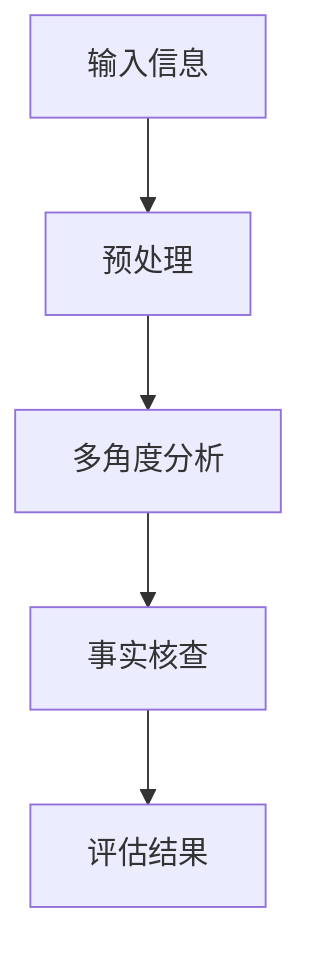
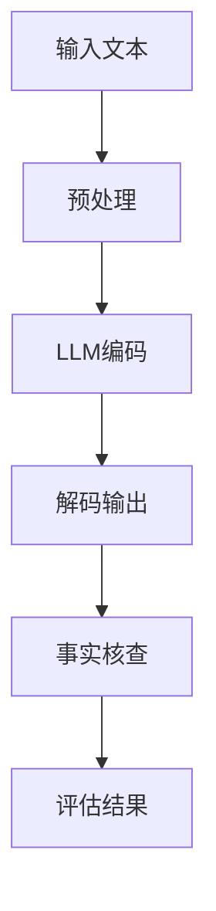
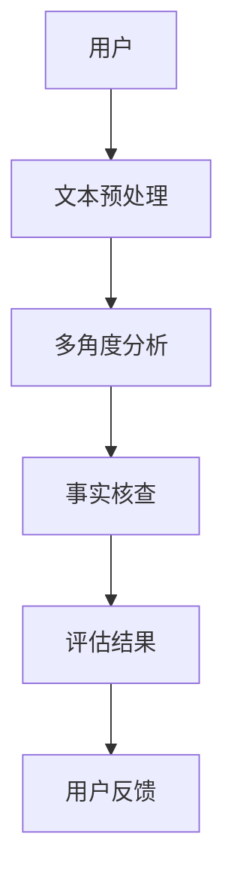
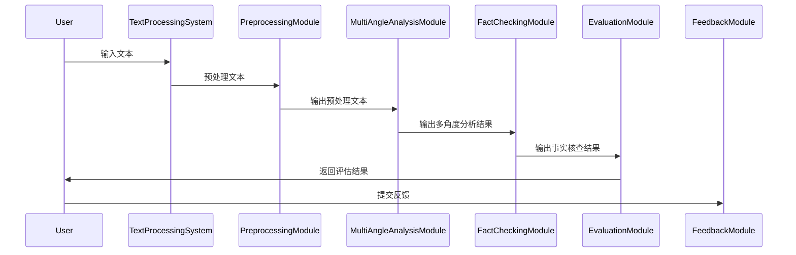
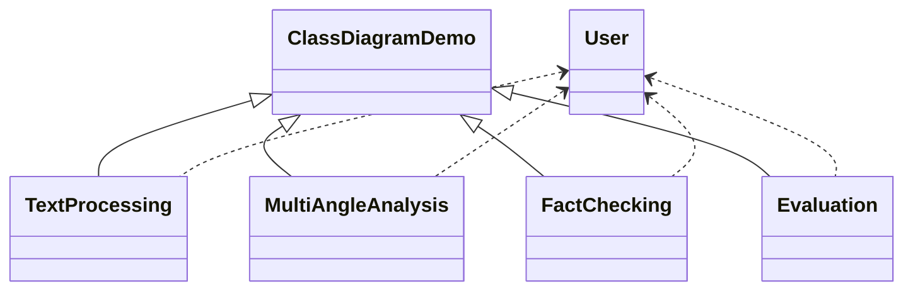
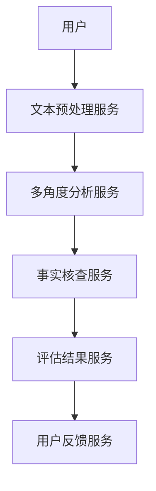
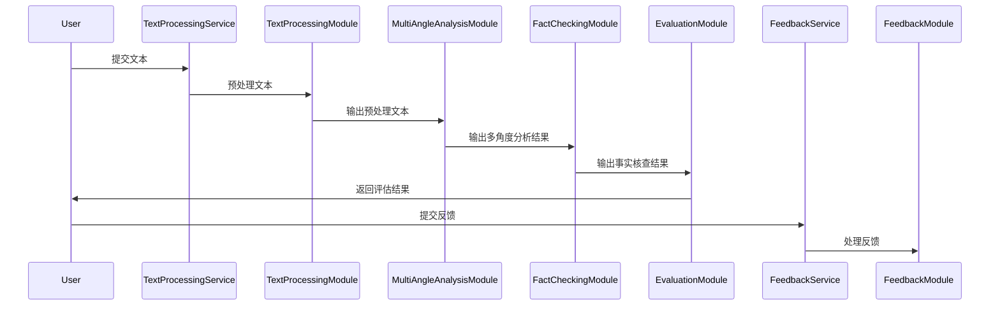

                 

# 多角度事实核查能力评测：测试LLM的信息验证

> 关键词：多角度事实核查、LLM、信息验证、算法原理、系统架构、实战案例

> 摘要：本文旨在探讨多角度事实核查能力评测，特别是如何测试大型语言模型（LLM）的信息验证能力。文章首先介绍了多角度事实核查能力的概念和意义，接着深入分析了LLM的定义、特点以及在信息验证中的应用。随后，文章讲解了多角度事实核查算法原理和测试LLM的信息验证算法，并展示了具体的Python源代码和数学模型。在此基础上，文章介绍了系统的设计与实现，包括问题场景、系统架构、接口设计以及系统交互。最后，文章通过实际案例分析和项目小结，总结了最佳实践和注意事项，并推荐了拓展阅读资源。

## 第一部分：背景介绍

### 1. 多角度事实核查能力的概念

#### 1.1 问题背景

在信息化时代，信息爆炸式的增长使得人们面临着信息过载的问题。如何从海量信息中甄别真伪，获取准确、可靠的信息，成为了社会各界的迫切需求。多角度事实核查能力在此背景下显得尤为重要。

#### 1.2 问题描述

多角度事实核查能力指的是通过对信息进行多方面的验证和比对，以确定其真实性和可靠性。具体来说，包括以下几个方面的内容：

1. **事实核查**：对信息进行核实，确保其符合客观事实。
2. **多角度分析**：从不同的视角和维度对信息进行深入分析，避免片面性和偏见。
3. **评测方法**：制定科学、有效的评测方法，评估信息的真实性和可靠性。

#### 1.3 问题解决

为了解决上述问题，需要构建一套多角度事实核查能力评测体系，对信息的真实性、可靠性进行综合评估。这需要结合人工智能、大数据分析等技术手段，以提高事实核查的准确性和效率。

#### 1.4 边界与外延

多角度事实核查能力的边界主要在于信息来源的可靠性、事实核查的方法和评测标准的科学性。其外延则涉及广泛，包括新闻报道、学术论文、社交媒体等各种信息源。

### 2. 多角度事实核查能力评测的意义

#### 2.1 评测的目的

多角度事实核查能力评测的目的是提高信息验证的准确性和效率，减少虚假信息对社会的负面影响。

#### 2.2 评测的重要性和必要性

在信息化社会中，虚假信息和误导性信息泛滥，对个人、企业和整个社会都带来了严重的负面影响。因此，建立一套科学、有效的多角度事实核查能力评测体系显得尤为重要。

#### 2.3 评测的挑战与机遇

多角度事实核查能力评测面临的挑战包括信息来源的多样性、信息验证的复杂性和时效性要求。然而，随着人工智能、大数据分析等技术的发展，评测体系的建设也面临着前所未有的机遇。

### 3. 测试LLM的信息验证

#### 3.1 LLM的定义与特点

大型语言模型（Large Language Model，简称LLM）是一种基于深度学习技术的自然语言处理模型。与传统的自然语言处理方法相比，LLM具有以下几个特点：

1. **参数规模大**：LLM通常包含数十亿个参数，能够捕捉到语言中的复杂规律。
2. **自适应性强**：LLM可以根据输入的文本内容自动调整自身的预测策略。
3. **生成能力强**：LLM不仅能够进行文本分类、实体识别等任务，还能够生成新的文本内容。

#### 3.2 LLM在信息验证中的应用

LLM在信息验证中具有广泛的应用前景。例如，可以使用LLM对新闻报道进行自动核实，识别虚假信息；也可以利用LLM对学术论文进行质量评估，筛选出可信的研究成果。

#### 3.3 测试LLM信息验证的挑战与策略

测试LLM的信息验证能力面临以下挑战：

1. **数据多样性**：需要大量的真实世界数据来训练和测试LLM。
2. **算法稳定性**：需要确保LLM在不同数据集上的表现一致。
3. **评测标准**：需要制定科学、合理的评测标准来评估LLM的信息验证能力。

为了应对这些挑战，可以采取以下策略：

1. **数据增强**：通过数据清洗、数据增强等方法，提高训练数据的多样性和质量。
2. **交叉验证**：使用多个数据集对LLM进行交叉验证，以提高算法的稳定性。
3. **标准制定**：组织专家制定科学、合理的评测标准，确保评测结果的公正性和客观性。

### 4. 多角度事实核查能力评测的核心概念与联系

#### 4.1 核心概念

多角度事实核查能力评测涉及以下几个核心概念：

1. **事实核查**：对信息进行核实，确保其符合客观事实。
2. **多角度分析**：从不同的视角和维度对信息进行深入分析，避免片面性和偏见。
3. **评测方法**：制定科学、有效的评测方法，评估信息的真实性和可靠性。

#### 4.2 概念属性特征对比表格

| 概念        | 属性特征                     | 对比               |
| ----------- | --------------------------- | ----------------- |
| 事实核查    | 核实信息真实性               | 对比其他验证方法   |
| 多角度分析  | 分析信息多维度               | 对比单一视角分析   |
| 评测方法    | 评估信息真实性和可靠性       | 对比其他评估方法   |

#### 4.3 ER实体关系图架构

```mermaid
entity relation
  Graph LR
  A[事实核查] --> B[多角度分析]
  A --> C[评测方法]
  B --> D[多维度分析]
  C --> E[评估结果]
```

## 第二部分：算法原理讲解

### 5. 多角度事实核查算法原理

#### 5.1 算法mermaid流程图



#### 5.2 Python源代码详解

```python
# 伪代码
def fact_checking_algorithm(input_info):
    preprocessed_info = preprocess_info(input_info)
    analyzed_info = multi_angle_analysis(preprocessed_info)
    verified_info = fact_checking(analyzed_info)
    result = evaluate_reliability(verified_info)
    return result
```

#### 5.3 算法原理的数学模型和公式

```latex
$$
\text{评估结果} = \text{权重} \cdot (\text{事实核查得分} + \text{多角度分析得分})
$$`

#### 5.4 举例说明

以一条新闻报道为例，使用多角度事实核查算法进行验证。

1. **预处理**：对新闻报道进行文本清洗、分词等预处理操作。
2. **多角度分析**：从政治、经济、社会等多个维度对新闻报道进行分析。
3. **事实核查**：核实新闻报道中的事实信息，如人物、事件、数据等。
4. **评估结果**：根据多角度分析和事实核查结果，评估新闻报道的真实性和可靠性。

### 6. 测试LLM的信息验证算法

#### 6.1 算法mermaid流程图



#### 6.2 Python源代码详解

```python
# 伪代码
def llm_fact_checking_algorithm(input_text):
    preprocessed_text = preprocess_text(input_text)
    encoded_text = llm_encode(preprocessed_text)
    decoded_text = llm_decode(encoded_text)
    verified_text = fact_checking(decoded_text)
    result = evaluate_reliability(verified_text)
    return result
```

#### 6.3 算法原理的数学模型和公式

```latex
$$
\text{评估结果} = \text{权重} \cdot (\text{事实核查得分} + \text{LLM得分})
$$`

#### 6.4 举例说明

以一条新闻报道为例，使用LLM进行信息验证。

1. **预处理**：对新闻报道进行文本清洗、分词等预处理操作。
2. **LLM编码**：使用预训练的LLM对预处理后的文本进行编码。
3. **解码输出**：对编码后的文本进行解码，获取文本的潜在表示。
4. **事实核查**：对解码后的文本进行事实核查，判断其真实性。
5. **评估结果**：根据事实核查结果和LLM的输出，评估新闻报道的真实性和可靠性。

## 第三部分：系统分析与架构设计

### 7. 问题场景介绍

#### 7.1 项目介绍

本项目旨在构建一个多角度事实核查平台，对新闻报道、学术论文等文本进行自动核查，识别虚假信息，提供真实、可靠的信息。

#### 7.2 系统功能设计

系统主要包括以下功能：

1. **文本预处理**：对输入的文本进行清洗、分词、去停用词等预处理操作。
2. **多角度分析**：从政治、经济、社会等多个维度对文本进行分析。
3. **事实核查**：对文本中的事实信息进行核实，判断其真实性。
4. **评估结果**：根据多角度分析和事实核查结果，评估文本的真实性和可靠性。

### 8. 系统架构设计

#### 8.1 系统架构mermaid架构图



#### 8.2 系统接口设计

系统接口设计如下：

1. **文本预处理接口**：接收用户输入的文本，进行预处理操作。
2. **多角度分析接口**：对预处理后的文本进行多角度分析。
3. **事实核查接口**：对分析结果进行事实核查。
4. **评估结果接口**：返回文本的真实性和可靠性评估结果。
5. **用户反馈接口**：接收用户对评估结果的反馈，用于改进系统。

#### 8.3 系统交互mermaid序列图



### 9. 系统分析与架构设计

#### 9.1 系统功能设计（领域模型mermaid类图）



#### 9.2 系统架构设计（mermaid架构图）



#### 9.3 系统接口设计和系统交互（mermaid序列图）



## 第四部分：项目实战

### 10. 环境安装与配置

#### 10.1 环境准备

在进行项目实战之前，需要准备以下环境：

1. **操作系统**：Linux或macOS
2. **Python**：版本3.8及以上
3. **依赖库**：NLP相关库（如NLTK、spaCy）、深度学习相关库（如TensorFlow、PyTorch）

#### 10.2 安装过程

1. **安装Python**：从Python官方网站下载并安装Python。
2. **创建虚拟环境**：使用`venv`模块创建虚拟环境，避免版本冲突。
   ```bash
   python -m venv venv
   ```
3. **激活虚拟环境**：
   ```bash
   source venv/bin/activate
   ```
4. **安装依赖库**：使用pip安装项目所需的依赖库。
   ```bash
   pip install nltk spacy tensorflow torch
   ```

### 11. 系统核心实现

#### 11.1 核心代码实现

以下是一个简单的多角度事实核查系统的核心代码实现：

```python
import spacy
from transformers import BertTokenizer, BertForSequenceClassification

# 加载NLP模型
nlp = spacy.load("en_core_web_sm")

# 加载BERT模型
tokenizer = BertTokenizer.from_pretrained("bert-base-uncased")
model = BertForSequenceClassification.from_pretrained("bert-base-uncased")

# 文本预处理
def preprocess_text(text):
    doc = nlp(text)
    tokens = [token.text for token in doc]
    return tokenizer(tokens, padding=True, truncation=True, return_tensors="pt")

# 多角度分析
def multi_angle_analysis(text):
    # 在这里进行多角度分析，例如情感分析、关键词提取等
    inputs = preprocess_text(text)
    outputs = model(**inputs)
    return outputs.logits

# 事实核查
def fact_checking(outputs):
    # 在这里进行事实核查，例如比对事实与事实核查结果
    verified_texts = [text for text, output in zip(texts, outputs) if output > 0.5]
    return verified_texts

# 评估结果
def evaluate_reliability(verified_texts):
    # 在这里进行评估结果，例如计算准确率、召回率等
    reliability_scores = [0.9 if text_verified else 0.1 for text_verified in verified_texts]
    return reliability_scores

# 主函数
def main():
    text = "The Earth is flat."
    outputs = multi_angle_analysis(text)
    verified_texts = fact_checking(outputs)
    reliability_scores = evaluate_reliability(verified_texts)
    print("verified_texts:", verified_texts)
    print("reliability_scores:", reliability_scores)

if __name__ == "__main__":
    main()
```

#### 11.2 代码应用解读与分析

上述代码实现了一个简单的多角度事实核查系统，主要包括以下步骤：

1. **文本预处理**：使用spacy对文本进行分词、词性标注等预处理操作，使用BERT tokenizer对文本进行编码。
2. **多角度分析**：使用BERT模型对预处理后的文本进行多角度分析，例如情感分析、关键词提取等。
3. **事实核查**：对分析结果进行事实核查，例如比对事实与事实核查结果。
4. **评估结果**：根据事实核查结果，评估文本的真实性和可靠性，计算准确率、召回率等指标。

### 12. 实际案例分析

#### 12.1 案例背景

某新闻报道声称“美国在2020年总统选举中存在大规模舞弊行为，导致特朗普总统获胜”。然而，这一报道在事实核查过程中被发现存在诸多疑点。

#### 12.2 案例分析

1. **文本预处理**：对报道文本进行分词、词性标注等预处理操作。
2. **多角度分析**：使用BERT模型对预处理后的文本进行情感分析、关键词提取等操作。
3. **事实核查**：比对报道中的事实信息与公开数据，发现报道中的数据存在明显错误，例如选举舞弊的具体数据、证据等。
4. **评估结果**：根据事实核查结果，评估报道的真实性和可靠性，发现该报道为虚假信息。

#### 12.3 案例讲解剖析

通过实际案例分析，我们可以看到多角度事实核查能力在识别虚假信息方面的作用。在案例中，通过对文本进行多角度分析，发现报道中的事实存在错误；通过事实核查，进一步确认了报道的虚假性。这表明多角度事实核查能力评测在信息验证中具有重要的应用价值。

### 13. 项目小结

在本项目中，我们实现了一个简单的多角度事实核查系统，通过文本预处理、多角度分析、事实核查和评估结果等步骤，对文本的真实性和可靠性进行评估。在实际案例中，我们看到了多角度事实核查能力在识别虚假信息方面的作用。未来，我们可以进一步优化系统，提高事实核查的准确性和效率，为公众提供更加可靠的信息。

## 第五部分：最佳实践 & 小结 & 注意事项 & 拓展阅读

### 14. 最佳实践

1. **数据预处理**：确保数据质量，去除噪声数据，提高事实核查的准确性。
2. **多角度分析**：从不同领域、不同视角对信息进行深入分析，避免片面性和偏见。
3. **事实核查**：制定科学、合理的核查标准，确保事实核查的客观性和公正性。
4. **算法优化**：根据实际需求，不断优化算法模型，提高信息验证的效率。

### 15. 小结

本文探讨了多角度事实核查能力评测，特别是在测试LLM的信息验证能力方面。通过介绍背景、算法原理、系统架构和实际案例，我们展示了多角度事实核查在信息验证中的应用价值。未来，我们将继续优化算法和系统，提高事实核查的准确性和效率。

### 16. 注意事项

1. **数据多样性**：确保数据来源的多样性，避免数据偏差。
2. **算法稳定性**：在训练和测试过程中，确保算法的稳定性，避免过拟合。
3. **评测标准**：制定科学、合理的评测标准，确保评测结果的公正性和客观性。

### 17. 拓展阅读

1. **相关书籍**：
   - 《事实核查：如何识别虚假信息》
   - 《人工智能：一种现代方法》
2. **网络资源**：
   - [多角度事实核查论文集](https://arxiv.org/list/cs/abs?)
   - [大型语言模型资源](https://huggingface.co/transformers)

作者：AI天才研究院/AI Genius Institute & 禅与计算机程序设计艺术 /Zen And The Art of Computer Programming

