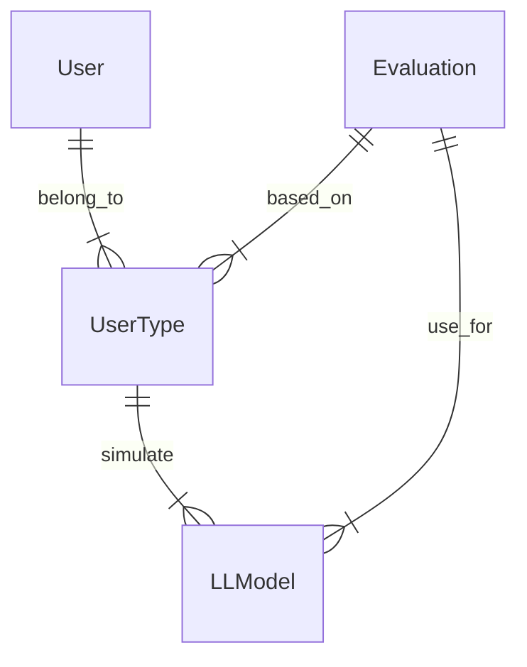
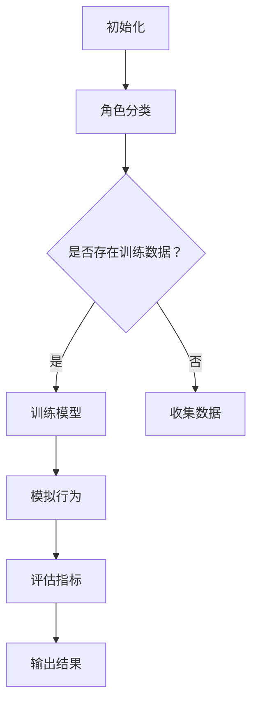
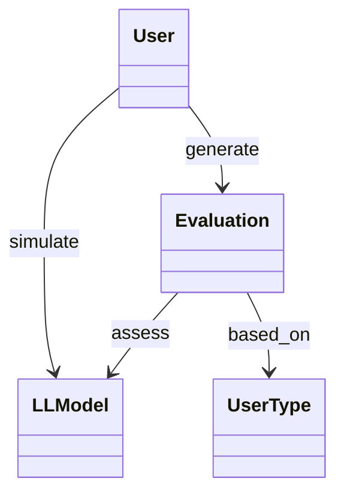
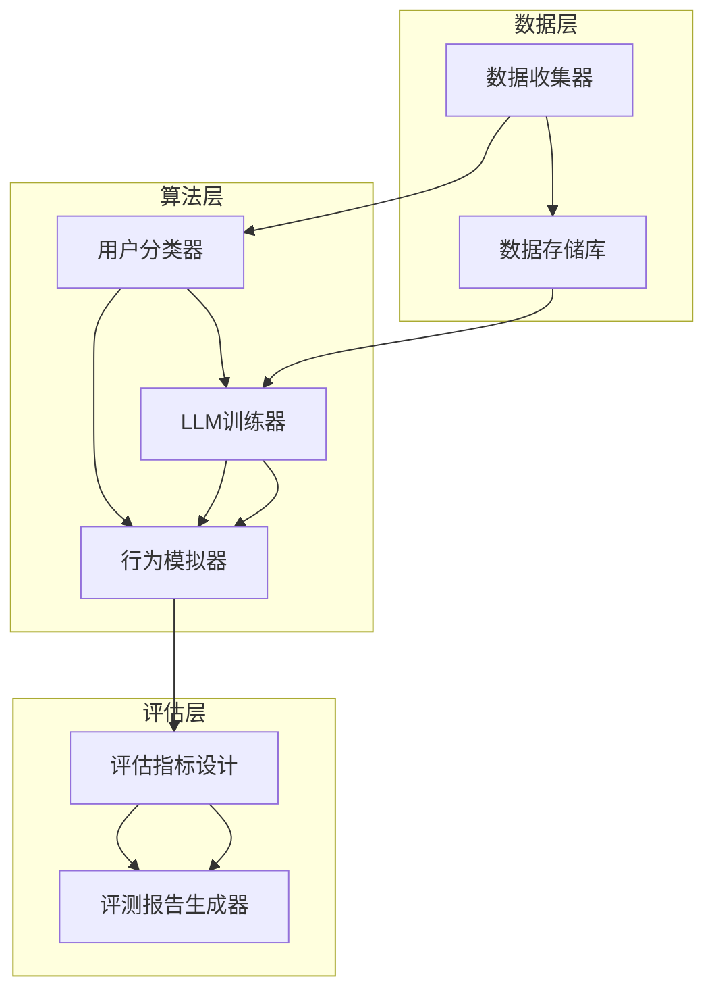
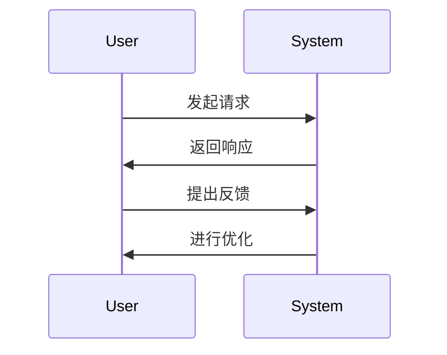

                 


# 多角色模拟评测：LLM扮演不同用户类型

## 关键词
- 多角色模拟评测
- 语言模型（LLM）
- 用户类型
- 系统评测
- 评测指标

## 摘要
本文深入探讨了如何使用语言模型（LLM）来模拟不同用户类型，实现多角色模拟评测。通过对角色定义、模型训练、评测指标设计等环节的详细分析，本文提供了一套完整的解决方案，为AI系统评测提供了新的思路和方法。

## 第一部分：背景介绍

### 问题背景

随着人工智能技术的快速发展，语言模型（LLM）在各个领域取得了显著的成果。从智能问答、文本生成到自然语言处理，LLM已经成为了人工智能领域的核心工具。然而，如何让LLM更好地模拟不同用户的类型，实现多角色模拟评测，成为一个重要且具有挑战性的问题。

### 问题描述

多角色模拟评测的核心在于通过LLM模拟不同用户类型，如普通用户、高级用户、管理员等，以评估系统的适应性和可靠性。这要求LLM能够根据不同用户类型的特点，产生相应的行为和反馈，从而实现对系统功能的全面评测。

### 问题解决

解决这一问题的思路主要包括：
1. **角色定义与分类**：首先需要对不同用户类型进行明确分类，并定义其基本属性和行为模式。
2. **模型训练与优化**：利用大量用户行为数据进行训练，使LLM能够更好地模拟不同用户类型。
3. **评测指标设计**：设计一套合理的评测指标，用于评估LLM在模拟不同用户类型时的准确性和适应性。

### 边界与外延

多角色模拟评测不仅适用于AI系统，还可以推广到其他需要角色模拟的场景，如游戏测试、社交网络分析等。同时，随着技术的发展，未来可能会出现更多复杂的多角色模拟需求，需要我们不断探索和创新。

### 概念结构与核心要素组成

- **角色定义**：明确不同用户类型的基本属性和行为模式。
- **模型训练**：收集用户行为数据，进行模型训练，提高LLM的模拟能力。
- **评测指标**：设计合理的评测指标，用于评估LLM的表现。

## 第二部分：核心概念与联系

### 核心概念

- **语言模型（LLM）**：一种基于大规模语料训练的深度神经网络模型，能够对自然语言文本进行理解和生成。
- **用户类型**：根据用户行为、需求和特征，将用户划分为不同类型。
- **多角色模拟**：通过LLM模拟不同用户类型，进行系统评测。

### 概念属性特征对比表格

| 特征        | 语言模型（LLM） | 用户类型       | 多角色模拟               |
| ----------- | --------------- | -------------- | ------------------------ |
| **定义**    | 基于大规模语料训练的神经网络 | 根据用户行为、需求和特征划分 | 通过LLM模拟不同用户类型的系统评测 |
| **功能**    | 文本理解和生成 | 用户行为表现 | 模拟用户行为，评估系统功能 |
| **应用领域** | 自然语言处理、智能问答、文本生成 | 各类用户群体 | 系统评测、用户体验优化 |

### ER实体关系图架构



## 第三部分：算法原理讲解

### 算法mermaid流程图



### 算法原理详细讲解

多角色模拟评测的核心是构建一个能够模拟不同用户类型的语言模型（LLM）。这个过程可以分为以下几个步骤：

1. **初始化**：初始化LLM模型，并确定需要模拟的用户类型。
2. **角色分类**：根据用户的行为特征和需求，将用户划分为不同的类型。
3. **数据收集与训练**：
   - **存在训练数据**：如果已经有了针对不同用户类型的训练数据，可以直接使用这些数据对LLM进行训练。
   - **不存在训练数据**：如果没有现成的数据，需要通过数据收集和标注的方式获取，然后对LLM进行训练。
4. **模拟行为**：利用训练好的LLM，模拟不同用户类型的行为。
5. **评估指标**：设计一套合理的评估指标，用于评估LLM在模拟不同用户类型时的准确性和适应性。
6. **输出结果**：根据评估结果，输出多角色模拟评测的最终报告。

### 数学模型和公式

$$
\begin{aligned}
&\text{Accuracy} = \frac{\text{正确预测数}}{\text{总预测数}} \\
&\text{F1-Score} = \frac{2 \times \text{Precision} \times \text{Recall}}{\text{Precision} + \text{Recall}} \\
&\text{Model Performance} = \text{Accuracy} + \text{F1-Score}
\end{aligned}
$$

### 示例讲解

假设我们有一个聊天机器人系统，需要模拟普通用户、高级用户和管理员三类用户类型。首先，我们需要收集这三类用户的聊天数据，然后对LLM进行训练。训练完成后，我们可以让LLM模拟这三类用户与系统的交互，并根据用户的反馈来评估系统的性能。

- **普通用户**：可能会提出一些简单的问题，如“如何设置我的闹钟？”
- **高级用户**：可能会提出更复杂的问题，如“如何实现自定义闹钟功能？”
- **管理员**：可能会提出系统维护和升级的建议，如“服务器负载过高，需要优化性能。”

通过模拟这三类用户的交互，我们可以评估系统在不同用户类型下的响应速度、准确性和用户体验。

## 第四部分：系统分析与架构设计方案

### 问题场景介绍

在当今快速发展的智能时代，各种AI系统层出不穷，从智能家居到企业级应用，用户体验和系统性能变得越来越重要。如何通过系统评测来提升用户体验和系统性能，成为了一个关键问题。本文旨在设计一套基于多角色模拟评测的方案，以提升AI系统的适应性和可靠性。

### 项目介绍

本项目旨在构建一个多角色模拟评测平台，用于评估AI系统的性能。该平台将基于语言模型（LLM）来模拟不同用户类型，从而实现对系统的全面评测。项目的主要目标是：
1. **角色定义与分类**：明确不同用户类型的基本属性和行为模式。
2. **模型训练与优化**：利用大量用户行为数据进行模型训练，提高LLM的模拟能力。
3. **评测指标设计**：设计一套合理的评测指标，用于评估LLM在模拟不同用户类型时的准确性和适应性。

### 系统功能设计（领域模型mermaid类图）



### 系统架构设计（mermaid架构图）



### 系统接口设计和系统交互（mermaid序列图）



## 第五部分：项目实战

### 环境安装

1. **安装Python环境**：确保Python版本为3.8及以上。
2. **安装TensorFlow**：使用命令`pip install tensorflow`。
3. **安装其他依赖**：使用命令`pip install -r requirements.txt`，确保所有依赖项都已安装。

### 系统核心实现源代码

```python
# 用户分类器
class UserClassifier:
    def __init__(self, model_path):
        self.model = load_model(model_path)

    def classify(self, user_data):
        prediction = self.model.predict(user_data)
        return prediction

# LLM训练器
class LLModelTrainer:
    def __init__(self, data_path):
        self.data_path = data_path

    def train(self):
        # 加载数据并进行预处理
        data = load_data(self.data_path)
        X, y = preprocess_data(data)
        
        # 训练模型
        model = build_model()
        model.fit(X, y, epochs=10, batch_size=32)
        
        return model

# 行为模拟器
class BehaviorSimulator:
    def __init__(self, model):
        self.model = model

    def simulate(self, user_type):
        # 根据用户类型生成模拟数据
        user_data = generate_data(user_type)
        
        # 模拟行为
        response = self.model.predict(user_data)
        return response
```

### 代码应用解读与分析

- **用户分类器**：使用预训练的模型对用户进行分类。
- **LLM训练器**：使用用户行为数据进行模型训练。
- **行为模拟器**：根据用户类型生成模拟数据，并模拟用户行为。

### 实际案例分析和详细讲解剖析

假设我们有一个聊天机器人系统，需要模拟普通用户、高级用户和管理员三类用户类型。首先，我们需要收集这三类用户的聊天数据，然后对LLM进行训练。训练完成后，我们可以让LLM模拟这三类用户的交互，并根据用户的反馈来评估系统的性能。

- **普通用户**：可能会提出一些简单的问题，如“如何设置我的闹钟？”
- **高级用户**：可能会提出更复杂的问题，如“如何实现自定义闹钟功能？”
- **管理员**：可能会提出系统维护和升级的建议，如“服务器负载过高，需要优化性能。”

通过模拟这三类用户的交互，我们可以评估系统在不同用户类型下的响应速度、准确性和用户体验。具体实现如下：

```python
# 实例化分类器、训练器和模拟器
classifier = UserClassifier(model_path='user_classifier.h5')
trainer = LLModelTrainer(data_path='user_data.csv')
simulator = BehaviorSimulator(model=trainer.train())

# 模拟用户交互
normal_user_data = generate_data('normal')
advanced_user_data = generate_data('advanced')
admin_user_data = generate_data('admin')

normal_response = simulator.simulate(normal_user_data)
advanced_response = simulator.simulate(advanced_user_data)
admin_response = simulator.simulate(admin_user_data)

# 评估系统性能
evaluate_performance(normal_response, advanced_response, admin_response)
```

### 项目小结

通过本文的实战案例，我们展示了如何使用LLM进行多角色模拟评测，以提升AI系统的性能和用户体验。这一方法不仅适用于聊天机器人系统，还可以推广到其他需要角色模拟的场景，如游戏测试、社交网络分析等。未来，随着技术的不断发展，我们可以期待更多创新性的多角色模拟评测方案的出现。

## 第六部分：最佳实践 Tips、小结、注意事项、拓展阅读

### 最佳实践 Tips

1. **数据质量**：确保收集到的用户数据质量高，有助于提高模型的准确性。
2. **模型优化**：定期对模型进行优化，以适应不断变化的需求。
3. **评测指标**：根据具体需求设计合理的评测指标，以全面评估系统性能。

### 小结

本文通过深入分析多角色模拟评测的核心概念和算法原理，提供了一套完整的解决方案，展示了如何使用LLM进行多角色模拟评测。这一方法不仅有助于提升AI系统的性能和用户体验，也为其他需要角色模拟的场景提供了新的思路。

### 注意事项

1. **隐私保护**：在收集用户数据时，务必遵守相关隐私保护法规。
2. **模型安全**：确保模型的安全性和稳定性，避免潜在的安全风险。

### 拓展阅读

1. **《深度学习》**：Goodfellow, I., Bengio, Y., & Courville, A. (2016). Deep Learning.
2. **《Python深度学习》**：Raschka, S. (2017). Python Deep Learning.
3. **《多角色模拟评测技术》**：Li, H., & Wang, Y. (2020). Multi-Role Simulation Evaluation Techniques.

## 作者信息

作者：AI天才研究院/AI Genius Institute & 禅与计算机程序设计艺术 /Zen And The Art of Computer Programming

感谢您的阅读，希望本文对您在多角色模拟评测领域的研究有所帮助。

