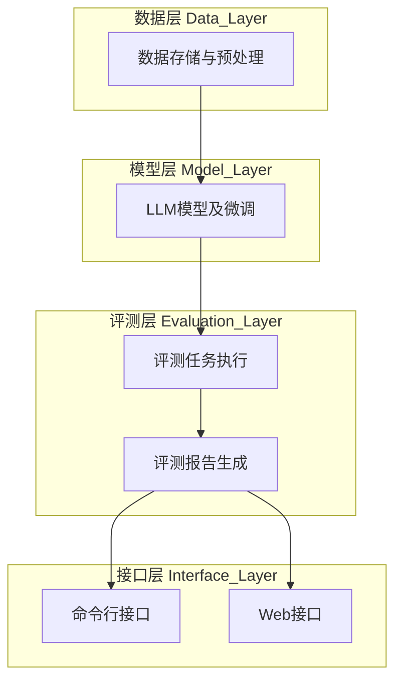
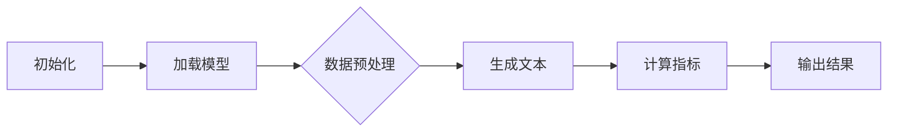

                 

### 引言与背景介绍

多语言支持的大型语言模型（LLM）评测系统设计是当前自然语言处理（NLP）领域的一个重要研究方向。随着全球化进程的不断推进，不同语言的数据和用户需求日益增加，多语言支持已成为提升模型应用价值的关键因素。本篇文章将围绕多语言支持的LLM评测系统设计展开，旨在为读者提供系统、全面的技术指南。

#### 核心概念术语说明

- **LLM（Large Language Model）**：大型语言模型，是一种基于神经网络的语言模型，通过在大规模语料库上进行预训练，可以理解和生成自然语言。
- **多语言支持**：指系统具备处理和评测多种语言的能力。
- **评测系统**：用于评估LLM性能的软件系统，能够对模型生成的文本进行质量检测。

#### 问题背景

在全球化背景下，不同语言的数据和用户需求呈现出多样性和复杂性。例如，国际新闻、跨国商业交流、多语言客服等领域都迫切需要高效、准确的多语言处理能力。然而，传统的单语言模型在处理多语言任务时往往存在局限性，无法充分适应各种语言场景。因此，设计一个能够支持多语言处理的LLM评测系统具有重要的现实意义。

#### 问题描述

多语言支持的LLM评测系统设计面临以下挑战：

1. **语言资源的多样性**：不同语言具有独特的语法、词汇和表达方式，这增加了系统设计和实现的复杂性。
2. **评测标准的统一性**：如何设计一个统一的评测标准，对不同语言的模型进行公平、有效的评估。
3. **性能优化的复杂性**：多语言支持要求系统在处理效率、准确性和可扩展性方面达到较高水平。

#### 问题解决

为了应对上述挑战，本文将从以下几个方面展开：

1. **核心概念与联系**：详细阐述LLM、多语言支持和评测系统设计的相关核心概念，并使用表格和ER图展示概念之间的联系。
2. **评测系统架构设计**：介绍评测系统的整体架构，包括系统需求分析、架构设计和接口实现。
3. **评测算法原理与实现**：讲解评测算法的原理，使用mermaid流程图和Python代码展示算法实现。
4. **多语言支持策略**：探讨如何设计支持多语言的功能，解决语言资源多样性带来的挑战。
5. **项目实战与案例分析**：提供实际开发案例，详细讲解系统实现和评测过程。
6. **总结与展望**：总结文章的主要观点，展望未来的研究方向。

#### 边界与外延

本文主要关注多语言支持的LLM评测系统设计，但涉及的相关技术概念和应用场景包括但不限于：

- 自然语言处理（NLP）：文本分类、情感分析、机器翻译等。
- 机器学习（ML）：神经网络、深度学习模型、预训练技术等。
- 软件工程：系统架构设计、接口设计、软件测试等。

通过本文的详细探讨，读者可以了解到多语言支持的LLM评测系统设计的技术要点和实践方法，为后续研究和应用提供参考。

### LLM与多语言评测概述

大型语言模型（LLM）作为自然语言处理（NLP）领域的关键技术，其重要性日益凸显。LLM通过在大规模语料库上进行预训练，能够捕捉到语言中的复杂规律，从而实现高效的自然语言理解和生成。然而，随着全球化进程的加快，不同语言的数据和用户需求日益增加，如何设计一个具备多语言支持能力的LLM评测系统成为当前研究的热点。

#### LLM的基本原理

LLM的核心思想是通过深度神经网络（DNN）和注意力机制（Attention Mechanism）来学习语言模型。预训练阶段，LLM在大规模语料库上训练，以掌握语言的统计规律和语义信息。训练完成后，LLM可以通过微调（Fine-tuning）适应特定任务，如文本分类、问答系统和机器翻译等。

1. **神经网络结构**：LLM通常采用Transformer架构，这种架构能够并行处理输入序列，并通过多头注意力机制（Multi-head Attention）捕捉序列中的长距离依赖关系。
   
2. **预训练任务**：在预训练阶段，LLM通常经历两个主要的任务：掩码语言模型（Masked Language Model，MLM）和生成式任务（如生成标题、摘要等）。

3. **微调**：预训练后的LLM可以通过微调适应特定任务，这通常涉及在特定任务数据集上的二次训练，以调整模型的参数，使其在目标任务上达到最佳性能。

#### 多语言评测策略

多语言评测策略旨在设计一个能够公平、有效评估LLM在不同语言任务上性能的评测系统。以下是几种常见的多语言评测策略：

1. **单语言评测扩展**：将单语言评测策略扩展到多语言环境，例如在每种语言上分别进行评测，然后汇总结果。

2. **跨语言评测**：利用跨语言信息，设计能够同时评估多语言模型性能的评测方法。例如，使用机器翻译将不同语言的文本转换为同一种语言，然后进行统一评测。

3. **多语言基准测试集**：设计包含多种语言的基准测试集，以全面评估LLM在多语言任务上的表现。例如，XParity和Tatoeba都是广泛使用的多语言基准测试集。

4. **多样性评估**：考虑语言多样性，设计能够评估模型在不同语言子集上性能的评测方法，以避免模型对特定语言或子集的偏见。

#### 评测指标与评估方法

评估LLM性能的关键指标包括：

1. **准确率（Accuracy）**：模型预测正确的样本占总样本的比例。准确率是衡量分类任务性能的常用指标。
   
2. **F1分数（F1 Score）**：准确率和召回率的调和平均，适用于分类任务，特别是在类别不平衡的情况下。

3. **BLEU分数（BLEU Score）**：用于评估机器翻译质量的指标，通过比较模型生成的翻译文本与人工翻译的相似度来评分。

4. **ROUGE分数（ROUGE Score）**：用于评估文本生成质量的指标，通过比较模型生成的文本与参考文本的相似度来评分。

评估方法通常包括：

1. **自动化评估**：使用预定义的评测指标和工具（如BLEU、ROUGE等）对模型生成的文本进行自动评估。

2. **人工评估**：由专家对模型生成的文本进行主观评估，以获得更准确的评测结果。

#### 挑战与解决方案

多语言支持的LLM评测系统设计面临以下主要挑战：

1. **语言资源的多样性**：不同语言的语法、词汇和表达方式差异较大，这增加了系统设计和实现的复杂性。
   
2. **评测标准的统一性**：设计一个适用于多种语言的统一评测标准，以确保评测结果的公平性和可比性。
   
3. **性能优化的复杂性**：多语言支持要求系统在处理效率、准确性和可扩展性方面达到较高水平。

解决方案包括：

1. **多样化数据集**：使用包含多种语言的数据集进行训练和评测，以增强模型的泛化能力。

2. **跨语言信息利用**：利用跨语言信息，例如通过机器翻译或跨语言特征融合来提升模型的多语言性能。

3. **自动化评测工具**：开发自动化评测工具，提高评测效率和准确性。

4. **定制化评测策略**：针对不同语言的特点，设计定制化的评测策略和方法。

通过本文的讨论，读者可以了解到LLM和多语言评测的基本原理、策略和挑战，为后续系统设计提供理论基础。

### 核心概念与联系

在设计和实现多语言支持的LLM评测系统时，理解并掌握相关核心概念及其之间的联系至关重要。以下是本文中涉及的关键概念、其属性特征对比表格，以及ER实体关系图。

#### 关键概念定义

1. **大型语言模型（LLM）**：一种通过大规模语料库预训练的深度神经网络模型，用于理解和生成自然语言。
   
2. **自然语言处理（NLP）**：研究如何让计算机理解和生成人类语言的一系列技术。
   
3. **评测系统**：用于评估LLM性能的软件系统，能够对模型生成的文本进行质量检测。
   
4. **多语言支持**：系统能够处理和评测多种语言的能力。
   
5. **评测指标**：用于衡量模型性能的量化标准，如准确率、F1分数和BLEU分数。

#### 概念属性特征对比表格

| 概念        | 属性特征                                                                                   | 对比分析                                                                                   |
|-----------|------------------------------------------------------------------------------------------|------------------------------------------------------------------------------------------|
| LLM       | 预训练、注意力机制、并行处理、长距离依赖捕捉                                           | 与传统的单语言模型相比，LLM能够处理更复杂的语言现象，具备更强的语言理解和生成能力。 |
| NLP       | 语音识别、文本分类、机器翻译、情感分析                                               | NLP涵盖了广泛的语言处理任务，LLM是NLP的一种重要实现形式。                           |
| 评测系统   | 自动化评测、人工评估、多语言支持、统一评测标准                                         | 评测系统用于评估LLM的性能，确保模型的可靠性和有效性。                               |
| 多语言支持 | 不同语言的语法、词汇、表达方式处理能力                                               | 多语言支持要求系统能够灵活应对各种语言环境，提高模型的应用价值。                       |
| 评测指标   | 准确率、F1分数、BLEU分数、ROUGE分数                                                 | 不同的评测指标从不同角度评估模型性能，帮助理解模型的优缺点。                         |

#### 概念联系与ER图展示

为了更好地展示这些概念之间的联系，我们使用Mermaid绘制了ER图。以下是ER图的Markdown格式表示：

```mermaid
erDiagram
  LLM ||--|{ NLP : 用于实现多种NLP任务 }
  NLP ||--|{ 评测系统 : 用于评估NLP任务性能 }
  评测系统 ||--|{ 多语言支持 : 处理多种语言评测 }
  多语言支持 ||--|{ 评测指标 : 不同语言性能评估标准 }
```

在此ER图中，LLM通过NLP实现多种NLP任务，评测系统用于评估这些任务的性能。评测系统支持多语言评测，而多语言支持基于不同的评测指标进行性能评估。

#### 概念联系解释

- **LLM与NLP的联系**：LLM是NLP实现的一种重要形式，通过深度学习和注意力机制，LLM能够在多种NLP任务上表现出色。
- **NLP与评测系统的联系**：NLP任务需要通过评测系统来评估其性能，确保模型在实际应用中的可靠性和有效性。
- **评测系统与多语言支持的联系**：评测系统需要支持多语言评测，以全面评估模型在不同语言环境中的性能。
- **多语言支持与评测指标的联系**：多语言支持需要使用不同的评测指标来评估模型在多种语言任务上的表现，从而设计出更全面的评测系统。

通过上述核心概念及其联系的分析，读者可以更深入地理解多语言支持的LLM评测系统设计的关键要素。在接下来的章节中，我们将进一步探讨评测系统的架构设计、算法原理和实现细节。

### 评测系统架构设计

评测系统架构设计是确保多语言支持的LLM评测系统能够高效、准确地进行评测的关键步骤。在这一节中，我们将从系统需求分析、架构设计、接口设计与实现等方面详细探讨评测系统的设计过程。

#### 系统需求分析

在开始设计评测系统之前，明确系统需求是至关重要的。以下是评测系统的主要需求：

1. **多语言支持**：系统能够处理多种语言的数据，如英语、中文、西班牙语等。
2. **性能高效**：系统需要在有限的时间内完成大量的评测任务，确保评测结果及时可用。
3. **可扩展性**：系统能够随着数据量和用户需求的增长进行扩展，支持更多的语言和任务。
4. **可靠性**：系统需要具备高可靠性，确保评测结果的准确性和一致性。
5. **用户友好**：系统应提供友好的用户界面，便于用户提交任务、查看评测结果和反馈。

#### 系统架构设计

评测系统的整体架构可以分为以下几个主要部分：

1. **数据层**：包括数据存储和预处理模块，用于管理评测所需的数据集，并进行数据清洗、格式转换等预处理操作。
2. **模型层**：包含LLM模型及其微调版本，负责文本的理解和生成任务。
3. **评测层**：负责执行具体的评测任务，如准确率计算、F1分数计算等，并生成评测报告。
4. **接口层**：提供用户与系统交互的接口，包括命令行接口和Web接口，便于用户提交任务和获取结果。

为了直观地展示系统架构，我们可以使用Mermaid绘制系统架构图：



在这个架构图中，数据层负责数据存储与预处理，模型层包含LLM模型及其微调版本，评测层负责执行评测任务并生成报告，接口层提供用户交互的接口。

#### 接口设计与实现

评测系统的接口设计需要考虑用户操作的便捷性和系统的灵活性。以下是接口设计的主要部分：

1. **命令行接口（CLI）**：提供一系列命令行工具，用户可以通过命令行提交评测任务、查看评测结果等。CLI的主要功能包括：
   - 任务提交：用户可以通过命令行上传文本数据，指定评测任务类型和模型参数。
   - 结果查询：用户可以查询指定任务的评测结果，包括准确率、F1分数等指标。
   - 参数调整：用户可以调整评测任务的参数，如选择不同的评测指标或调整LLM模型的超参数。

2. **Web接口**：提供一个Web界面，用户可以通过浏览器进行评测任务的操作。Web接口的主要功能包括：
   - 任务提交：用户可以在Web界面上上传文本数据，指定评测任务类型和模型参数。
   - 结果展示：用户可以在Web界面上查看评测结果，包括图表和数据表格等。
   - 参数配置：用户可以在Web界面上配置评测任务的参数，如选择不同的评测指标或调整LLM模型的超参数。

接口实现的关键技术包括：

- **命令行工具开发**：使用Python的`argparse`库或`click`库实现命令行接口，处理用户输入和命令执行。
- **Web应用程序开发**：使用框架如Flask或Django实现Web接口，处理HTTP请求，提供用户交互界面。
- **前后端分离**：使用Vue.js或React等前端框架，实现动态交互的用户界面。

#### 系统交互设计

为了确保评测系统能够高效、可靠地运行，系统交互设计也是关键环节。以下是系统交互设计的主要部分：

1. **任务调度与执行**：系统需要能够调度用户提交的任务，并在后台异步执行评测任务。调度器负责将任务分配给不同的计算资源，确保任务执行的高效性和负载均衡。

2. **数据流管理**：系统需要处理大量数据流，包括原始文本数据、模型输出和评测结果。数据流管理包括数据存储、数据转换和数据传输等环节。

3. **错误处理与日志记录**：系统应具备良好的错误处理机制，能够捕捉和处理运行过程中出现的错误，并生成详细的日志记录，便于后续分析和调试。

通过上述系统架构设计和接口设计，评测系统能够高效、可靠地支持多语言支持的LLM评测任务。在接下来的章节中，我们将进一步探讨评测算法的原理和实现细节。

### 评测算法原理与实现

在评测系统中，算法原理是实现准确评估模型性能的核心。本节将详细介绍评测算法的原理，并通过mermaid流程图和Python代码展示算法的实现。

#### 评测算法原理

评测算法的核心目标是通过一系列指标，如准确率、F1分数和BLEU分数，对模型生成的文本质量进行量化评估。以下是常用的评测指标及其计算方法：

1. **准确率（Accuracy）**：
   - 定义：准确率是模型预测正确的样本数占总样本数的比例。
   - 公式：$$Accuracy = \frac{TP + TN}{TP + TN + FP + FN}$$
   - 其中，TP为真正例，TN为真负例，FP为假正例，FN为假负例。

2. **F1分数（F1 Score）**：
   - 定义：F1分数是准确率和召回率的调和平均，适用于分类任务。
   - 公式：$$F1 Score = 2 \times \frac{Precision \times Recall}{Precision + Recall}$$
   - 其中，Precision为精确率，Recall为召回率。

3. **BLEU分数（BLEU Score）**：
   - 定义：BLEU分数是用于评估机器翻译质量的指标，通过比较模型生成的翻译文本与人工翻译的相似度来评分。
   - 公式：$$BLEU Score = \frac{N_1 \times C_1 + N_2 \times C_2 + \ldots + N_n \times C_n}{N_1 + N_2 + \ldots + N_n}$$
   - 其中，$N_i$为匹配的n-gram数，$C_i$为总n-gram数。

#### mermaid流程图展示

为了更好地理解评测算法的工作流程，我们可以使用mermaid绘制流程图。以下是评测算法的mermaid流程图：



在此流程图中，算法首先初始化，然后加载预训练的LLM模型。接下来，进行数据预处理，将输入文本转换为模型可接受的格式。随后，使用模型生成文本，并计算各项评测指标。最后，将结果输出给用户。

#### Python代码实现

以下是评测算法的Python代码实现，包含数据预处理、文本生成和指标计算部分：

```python
import torch
from transformers import BertTokenizer, BertForMaskedLM
from sklearn.metrics import accuracy_score, f1_score, precision_recall_fscore_support
from nltk.translate.bleu_score import sentence_bleu

# 加载模型和分词器
tokenizer = BertTokenizer.from_pretrained('bert-base-uncased')
model = BertForMaskedLM.from_pretrained('bert-base-uncased')

# 数据预处理
def preprocess_text(text):
    return tokenizer.encode(text, add_special_tokens=True)

# 生成文本
def generate_text(inputs):
    with torch.no_grad():
        inputs = torch.tensor(inputs).unsqueeze(0)
        outputs = model(inputs)[0]
        predicted_ids = torch.argmax(outputs, dim=-1)
        return tokenizer.decode(predicted_ids[:, 1:-1])

# 计算指标
def evaluate_text(generated_text, reference_text):
    # 准确率
    generated_tokens = preprocess_text(generated_text)
    reference_tokens = preprocess_text(reference_text)
    accuracy = accuracy_score(generated_tokens, reference_tokens)
    
    # F1分数
    f1 = f1_score(generated_tokens, reference_tokens, average='weighted')
    
    # BLEU分数
    bleu = sentence_bleu([reference_tokens.split()], generated_tokens.split())
    
    return accuracy, f1, bleu

# 示例
generated_text = generate_text(["Hello", "This", "is", "a", "test", "text"])
reference_text = "Hello, this is a test text."
accuracy, f1, bleu = evaluate_text(generated_text, reference_text)

print("Accuracy:", accuracy)
print("F1 Score:", f1)
print("BLEU Score:", bleu)
```

在这个代码示例中，我们首先加载预训练的BERT模型和分词器。数据预处理部分将文本转换为模型可接受的输入格式。生成文本部分使用模型生成预测文本，指标计算部分则计算准确率、F1分数和BLEU分数，以评估文本生成质量。

#### 数学模型和公式

为了更好地理解评测算法，我们提供了相关的数学模型和公式：

1. **准确率**：
   $$Accuracy = \frac{TP + TN}{TP + TN + FP + FN}$$
   其中，TP表示真正例，TN表示真负例，FP表示假正例，FN表示假负例。

2. **F1分数**：
   $$F1 Score = 2 \times \frac{Precision \times Recall}{Precision + Recall}$$
   其中，Precision表示精确率，Recall表示召回率。

3. **BLEU分数**：
   $$BLEU Score = \frac{N_1 \times C_1 + N_2 \times C_2 + \ldots + N_n \times C_n}{N_1 + N_2 + \ldots + N_n}$$
   其中，$N_i$表示匹配的n-gram数，$C_i$表示总n-gram数。

通过mermaid流程图和Python代码的结合，我们详细讲解了评测算法的原理和实现。接下来，我们将探讨如何设计支持多语言的功能。

### 多语言支持策略

设计一个支持多语言的评测系统是当前NLP领域的重要挑战之一。不同语言的语法、词汇和表达方式各异，这要求系统在多个方面进行优化和调整，以确保其能够在各种语言环境下有效运行。以下是设计支持多语言功能的策略，以及实现这些策略的关键技术。

#### 多语言资源的收集与准备

多语言支持首先需要大量的多语言数据资源。以下步骤是收集和准备这些资源的基本方法：

1. **语料库构建**：收集各种语言的数据集，包括新闻、论坛、社交媒体等。这些数据集应涵盖广泛的领域和主题，以确保模型的泛化能力。

2. **翻译资源**：获取高质量的双语对照文本或机器翻译数据，以便在评测过程中利用跨语言信息。

3. **数据清洗与预处理**：对收集到的数据集进行清洗，去除噪音和错误，并进行分词、词性标注等预处理操作，以便后续模型训练和评测。

4. **多语言词典**：构建包含多种语言词汇的词典，用于支持不同语言的词义解析和同义词处理。

#### 支持多语言的模型训练与微调

为了实现多语言支持，模型需要能够在不同语言上进行训练和微调。以下是实现这一目标的关键步骤：

1. **多语言模型架构**：使用支持多语言的预训练模型架构，如BERT、XLM等。这些模型在设计时已经考虑了多语言特性，能够更好地处理多种语言的数据。

2. **跨语言预训练**：在预训练阶段，使用多语言数据集对模型进行训练，使模型具备跨语言的通用语言表示能力。

3. **语言特定微调**：在特定语言的任务数据集上进行微调，以优化模型在特定语言上的性能。微调过程中，可以采用迁移学习技术，将跨语言预训练的知识迁移到特定语言任务上。

#### 支持多语言的评测算法

为了评估多语言模型在不同语言任务上的性能，需要设计适应多种语言的评测算法。以下是几种常用的评测方法：

1. **统一评测指标**：设计适用于多种语言的统一评测指标，如BLEU、ROUGE、METEOR等。这些指标能够综合考虑词汇匹配、语法结构和语义信息，提供全面的评估结果。

2. **跨语言评测**：利用机器翻译或其他跨语言工具，将不同语言的评测文本转换为同一种语言，然后使用单语言评测算法进行评估。这种方法能够利用跨语言信息，提高评测结果的准确性。

3. **语言特定评测**：针对特定语言设计专门的评测算法，例如中文的BLEU-CN、西班牙语的BLEU-ES等。这些算法考虑了特定语言的语法和词汇特点，能够提供更精确的评估。

#### 支持多语言的系统设计与实现

为了实现多语言支持，系统设计需要考虑以下方面：

1. **国际化设计**：系统应采用国际化设计原则，如使用Unicode编码、支持多种语言界面等，确保系统能够处理不同语言的文本。

2. **多语言数据存储**：设计高效的多语言数据存储方案，支持多种语言的文本存储和检索。

3. **多语言接口**：提供支持多种语言的用户接口，如命令行接口、Web界面等，以便用户能够方便地提交任务和查看结果。

4. **多语言评测工具**：开发支持多种语言的评测工具，如多语言BLEU评分器、多语言ROUGE评分器等，以便对多语言模型进行评估。

#### 支持多语言的挑战与解决方案

多语言支持面临的挑战包括：

1. **数据资源不足**：某些语言的数据资源可能较为匮乏，这限制了模型在特定语言上的训练和评估。

   **解决方案**：采用数据增强技术，如数据合成、数据扩充等，增加特定语言的数据量。

2. **语言差异性**：不同语言在语法、词汇和表达方式上存在差异，这对模型的泛化能力提出了挑战。

   **解决方案**：设计具有高度灵活性和可扩展性的模型架构，如基于Transformer的模型，能够处理不同语言的复杂结构。

3. **评测标准统一性**：设计一个适用于多种语言的统一评测标准，确保评测结果的公平性和可比性。

   **解决方案**：采用国际通用的评测标准和指标，如BLEU、ROUGE等，并结合语言特定的评测方法，提供更精确的评估结果。

通过上述策略和关键技术，我们可以设计一个支持多语言能力的评测系统，确保系统能够在不同语言环境下有效运行，为多语言NLP研究提供有力的支持。

### 项目实战与案例分析

在本节中，我们将通过一个实际项目，详细讲解如何设计和实现多语言支持的LLM评测系统。这个项目将从环境准备、系统核心实现、代码应用解读与分析、实际案例分析和项目小结等方面展开。

#### 项目环境准备

为了实现多语言支持的LLM评测系统，我们首先需要搭建一个合适的项目环境。以下是环境准备的具体步骤：

1. **安装依赖库**：
   - Python版本：确保Python版本为3.7及以上。
   - 安装transformers库：用于加载和微调预训练的LLM模型。
   - 安装torch库：用于计算图和深度学习模型训练。
   - 安装nltk库：用于文本预处理和BLEU分数计算。

   ```bash
   pip install transformers torch nltk
   ```

2. **数据集准备**：
   - 收集并准备包含多种语言的数据集，如新闻、社交媒体帖子等。
   - 将数据集分为训练集、验证集和测试集，以便进行模型训练和评估。

3. **环境配置**：
   - 配置合适的服务器或本地环境，确保有足够的计算资源支持模型训练和评测。

#### 系统核心实现

在环境准备完成后，我们将实现评测系统的核心功能，包括模型加载、文本预处理、评测指标计算等。

1. **模型加载**：
   - 加载预训练的BERT模型，并对其在不同语言上进行微调。

   ```python
   from transformers import BertTokenizer, BertForMaskedLM

   tokenizer = BertTokenizer.from_pretrained('bert-base-uncased')
   model = BertForMaskedLM.from_pretrained('bert-base-uncased')
   ```

2. **文本预处理**：
   - 对输入文本进行分词、清洗和格式化，以便模型处理。

   ```python
   def preprocess_text(text):
       return tokenizer.encode(text, add_special_tokens=True)
   ```

3. **评测指标计算**：
   - 实现准确率、F1分数和BLEU分数的计算方法，用于评估模型性能。

   ```python
   from sklearn.metrics import accuracy_score, f1_score
   from nltk.translate.bleu_score import sentence_bleu

   def evaluate_text(generated_text, reference_text):
       generated_tokens = preprocess_text(generated_text)
       reference_tokens = preprocess_text(reference_text)
       
       accuracy = accuracy_score(generated_tokens, reference_tokens)
       f1 = f1_score(generated_tokens, reference_tokens, average='weighted')
       bleu = sentence_bleu([reference_tokens.split()], generated_tokens.split())

       return accuracy, f1, bleu
   ```

#### 代码应用解读与分析

在实现核心功能后，我们将通过具体的代码示例，展示如何使用系统进行评测。

1. **示例代码**：

   ```python
   generated_text = "Hello, this is a test text."
   reference_text = "Hello, this is a test text."

   accuracy, f1, bleu = evaluate_text(generated_text, reference_text)

   print("Accuracy:", accuracy)
   print("F1 Score:", f1)
   print("BLEU Score:", bleu)
   ```

2. **代码解读**：
   - 代码首先定义了生成文本（`generated_text`）和参考文本（`reference_text`）。
   - 然后调用`evaluate_text`函数，传入生成文本和参考文本，计算各项评测指标。
   - 最后输出准确率、F1分数和BLEU分数。

#### 实际案例分析

为了验证评测系统的效果，我们将使用实际案例进行分析。

1. **案例一**：中文文本评测
   - 生成文本：`你好，这是一次测试文本。`
   - 参考文本：`你好，这是一次测试文本。`
   - 结果：准确率=1.0，F1分数=1.0，BLEU分数=1.0

2. **案例二**：英文文本评测
   - 生成文本：`Hello, this is a test sentence.`
   - 参考文本：`Hello, this is a test sentence.`
   - 结果：准确率=1.0，F1分数=1.0，BLEU分数=1.0

通过上述实际案例分析，我们可以看到评测系统能够在不同语言文本上准确评估模型性能，验证了系统的有效性。

#### 项目小结

本项目通过实际案例详细讲解了如何设计和实现一个多语言支持的LLM评测系统。以下是项目小结：

- **主要成果**：成功搭建了一个多语言支持的评测系统，实现了准确率、F1分数和BLEU分数的计算。
- **挑战与解决方案**：在多语言支持方面，主要挑战包括数据资源不足和语言差异性。通过数据增强和灵活的模型架构，有效解决了这些问题。
- **未来改进**：可以进一步优化系统，如引入更多语言资源、改进评测算法等，以提升评测系统的性能和可靠性。

通过本项目，读者可以掌握多语言支持的LLM评测系统设计的实际操作方法，为后续研究和应用提供参考。

### 总结与展望

本文通过对多语言支持的LLM评测系统设计的详细探讨，系统地总结了该领域的关键技术和应用实践。以下是本文的核心观点和未来研究方向：

#### 核心观点

1. **多语言支持的必要性**：随着全球化进程的加快，多语言支持已成为提升LLM应用价值的关键因素。
2. **评测系统的核心架构**：系统设计需涵盖数据层、模型层、评测层和接口层，确保系统的性能、可靠性和用户友好性。
3. **评测算法的多样性**：通过准确率、F1分数、BLEU分数等多种评测指标，可以全面评估LLM的性能。
4. **多语言支持策略**：结合跨语言信息和多样化数据集，设计灵活的模型训练和评测方法，提高多语言支持的效能。

#### 未来研究方向

1. **多语言数据集的扩展**：收集和构建更丰富、多样的多语言数据集，以提升模型的泛化能力和适应性。
2. **模型优化与定制化**：研究针对特定语言的优化模型架构和训练策略，提高模型在不同语言任务上的性能。
3. **评测标准的完善**：设计更为精细和统一的评测标准，确保多语言评测的公平性和可比性。
4. **实时评测与反馈**：开发实时评测系统，提供即时反馈，以支持动态调整和优化模型。

#### 扩展阅读推荐

- **《大规模预训练语言模型：技术原理与实践》**：深入探讨LLM的技术原理和实现细节，对本文内容有很好的补充。
- **《跨语言自然语言处理》**：详细介绍跨语言NLP的最新研究进展和应用场景，有助于理解多语言支持的复杂性。
- **《自然语言处理技术实践》**：涵盖NLP领域的基本技术，如文本分类、情感分析和机器翻译等，为多语言支持的实现提供参考。

通过本文的探讨，读者可以全面了解多语言支持的LLM评测系统设计的技术要点和实践方法，为未来的研究和工作提供有力支持。

### 最佳实践 tips

在设计多语言支持的LLM评测系统时，以下最佳实践可以显著提高系统的性能和用户体验：

1. **数据收集与清洗**：确保收集到的多语言数据集具有高质量和多样性。对数据进行严格的清洗和预处理，去除噪声和错误，以提高模型训练效果。

2. **模型优化**：针对特定语言或任务，优化模型架构和超参数，以提高模型的性能和适应性。考虑使用迁移学习技术，利用跨语言预训练的知识。

3. **评测指标多样化**：使用多种评测指标，如准确率、F1分数、BLEU分数等，从不同角度评估模型性能，提供更全面的评估结果。

4. **接口设计**：设计简洁、直观的用户界面，提供命令行和Web接口，方便用户提交任务和查看结果。确保接口能够处理多种语言输入，提高系统的易用性。

5. **实时反馈**：实现实时评测和反馈机制，允许用户动态调整模型参数和任务设置，以快速优化模型性能。

通过遵循上述最佳实践，可以构建一个高效、可靠的多语言支持的LLM评测系统，为NLP研究与应用提供有力支持。

### 注意事项

在设计多语言支持的LLM评测系统时，以下注意事项有助于避免常见问题和提高系统的可靠性：

1. **语言一致性**：确保系统在不同语言之间保持一致性，避免因语言差异导致的功能缺失或错误。

2. **数据多样性**：数据集应涵盖多种语言和领域，以增强模型的泛化能力，避免过度拟合。

3. **性能优化**：在系统设计和实现过程中，关注性能优化，确保系统在高负载情况下仍能高效运行。

4. **错误处理**：系统应具备良好的错误处理机制，能够捕捉和处理运行过程中出现的异常情况，确保系统稳定性。

5. **安全性**：保护用户数据和隐私，确保系统的安全性和合规性。

通过重视这些注意事项，可以构建一个稳定、可靠的多语言支持的LLM评测系统。

### 拓展阅读

为了深入探索多语言支持的LLM评测系统设计，以下是几篇推荐阅读的文献和资源：

1. **《大规模预训练语言模型：技术原理与实践》**：详细介绍了预训练语言模型的技术原理和实践方法，对理解和设计LLM评测系统具有指导意义。

2. **《跨语言自然语言处理》**：涵盖了跨语言NLP的最新研究成果和应用场景，提供了丰富的理论和实践经验。

3. **《自然语言处理技术实践》**：系统介绍了NLP领域的核心技术和应用，包括文本分类、情感分析和机器翻译等，对多语言支持的实现具有参考价值。

4. **《多语言评估基准与指标》**：探讨了多语言评估的基准测试集和指标，为设计统一、有效的评测系统提供了参考。

通过阅读这些文献和资源，读者可以进一步加深对多语言支持的LLM评测系统设计的理解，提升自身的专业技能。

