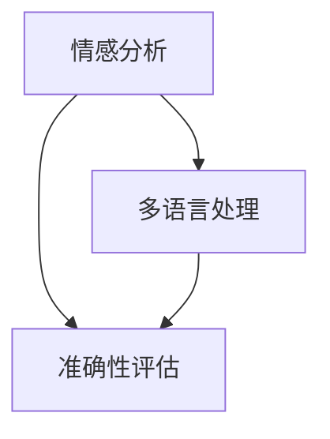
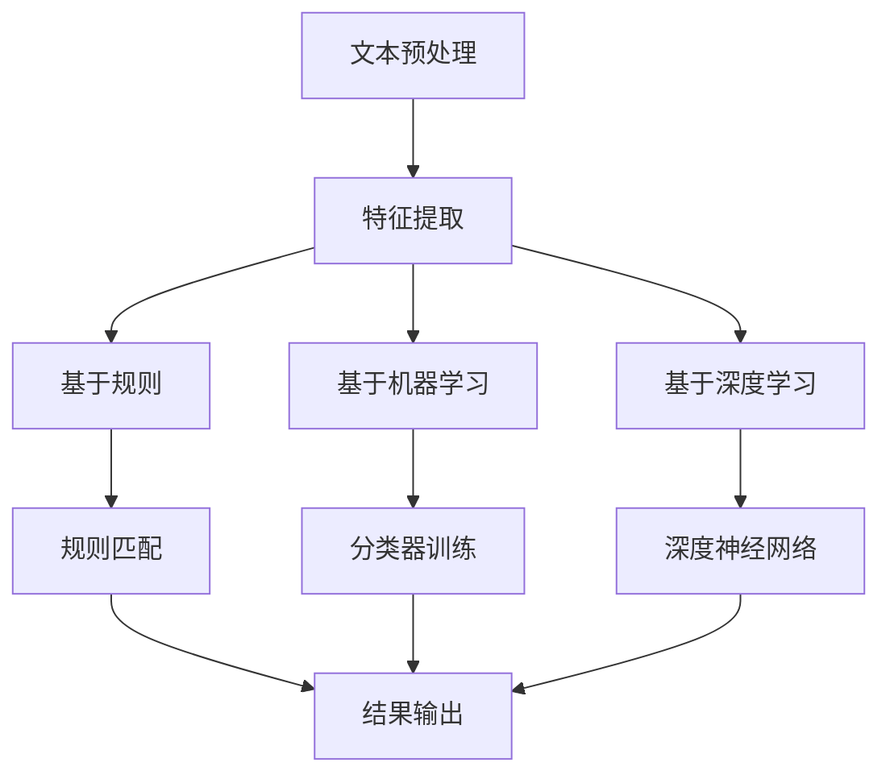
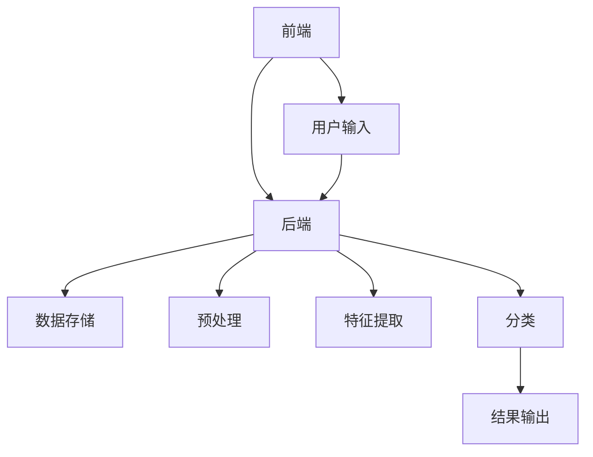
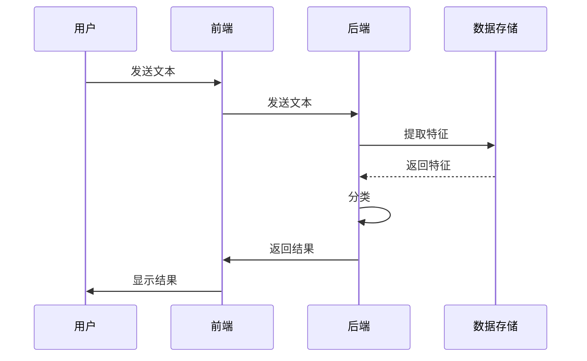

                 

# 多语言文本情感分析准确度评测

## 摘要

本文旨在深入探讨多语言文本情感分析的准确度评测问题。随着全球化的推进和互联网的发展，多语言文本情感分析成为自然语言处理（NLP）领域的一个关键研究方向。本文将介绍情感分析的基本概念，重点讨论多语言文本情感分析所面临的挑战，以及如何评估其准确度。通过对比不同算法、数学模型和评估指标，本文将提供一套系统的评测方法，并给出实际项目中的最佳实践，以期为研究者提供有价值的参考。

## 关键词

- 多语言文本情感分析
- 准确度评测
- 算法比较
- 数学模型
- 系统设计

## 引言与背景

### 1.1.1 情感分析的基本概念

#### 1.1.1.1 情感分析的定义与目的

情感分析，也称为意见挖掘或情感识别，是指使用自然语言处理（NLP）技术来识别和提取文本中的主观信息。这些信息通常涉及作者对某一主题、产品、服务或事件的情感倾向。情感分析的目的在于帮助用户理解大量文本数据中的情感倾向，从而为市场研究、舆情监测、产品改进等提供数据支持。

#### 1.1.1.2 情感分析在多语言环境中的应用

在多语言环境中，情感分析变得尤为重要。随着全球化的加速，互联网上充斥着各种语言的文本数据。这些数据不仅包括官方语言，还涵盖了许多区域性和非主流语言。因此，能够对多种语言进行情感分析，对于提高文本数据的价值和应用范围具有重要意义。

### 1.1.2 多语言文本情感分析的重要性

#### 1.1.2.1 语言资源的差异

多语言文本情感分析的首要挑战在于语言资源的差异。不同语言具有不同的语法结构、词汇量和表达方式。这些差异使得情感分析模型在处理不同语言时需要做出相应的调整。

#### 1.1.2.2 语言结构的复杂性

语言结构的复杂性也是一大挑战。一些语言具有丰富的词形变化和复杂的语法规则，使得情感分析模型在处理这些语言时需要更高的复杂度。

#### 1.1.2.3 文化差异的影响

文化差异同样对情感分析产生影响。不同文化背景下的人们对同一事件或产品的情感表达可能存在显著差异，这使得情感分析模型需要考虑文化因素。

### 1.1.3 多语言文本情感分析的准确性评估

#### 1.1.3.1 准确性评估指标

准确度评估是衡量多语言文本情感分析性能的关键步骤。常用的评估指标包括精确率（Precision）、召回率（Recall）和F1分数（F1 Score）。

#### 1.1.3.2 准确度评估方法的分类

准确度评估方法可以分为基于规则的方法、基于机器学习的方法和基于深度学习的方法。每种方法都有其适用场景和优缺点。

## 核心概念与联系

### 1.2.1 情感分析、多语言处理与准确性评估的关系

情感分析、多语言处理和准确性评估是三个密切相关的概念。情感分析是核心任务，多语言处理是技术手段，而准确性评估是评估标准。以下是一个简单的ER图，展示了这些概念之间的联系。



### 1.2.2 情感分析、多语言处理与准确性评估的对比表

以下是一个简单的对比表格，展示了情感分析、多语言处理和准确性评估的属性特征。

| 特征        | 情感分析        | 多语言处理        | 准确性评估        |
| ----------- | -------------- | ----------------- | ----------------- |
| 目的        | 提取文本中的情感倾向 | 处理多种语言的文本数据 | 评估情感分析模型的性能 |
| 技术依赖    | NLP技术        | 自然语言处理、机器翻译 | 精确率、召回率、F1分数 |
| 数据集要求  | 大量标注数据    | 多语言语料库        | 标准评估数据集      |

## 算法原理与解释

### 1.3.1 情感分析算法

情感分析算法主要包括基于规则的方法、基于机器学习的方法和基于深度学习的方法。以下是一个简单的Mermaid流程图，展示了这些算法的基本流程。



### 1.3.2 Python代码与数学模型

以下是一个简单的Python代码示例，展示了基于机器学习的情感分析算法。

```python
from sklearn.feature_extraction.text import TfidfVectorizer
from sklearn.naive_bayes import MultinomialNB
from sklearn.pipeline import make_pipeline

# 假设我们已经有了训练集和测试集的文本数据
train_data = ["我很喜欢这个产品", "这个产品很差劲"]
train_labels = ["正面", "负面"]

test_data = ["我对这个产品感觉很一般"]
test_labels = ["正面", "负面"]

# 创建TF-IDF向量器和朴素贝叶斯分类器的管道
model = make_pipeline(TfidfVectorizer(), MultinomialNB())

# 训练模型
model.fit(train_data, train_labels)

# 预测测试数据
predictions = model.predict(test_data)

print(predictions)
```

在上述代码中，我们使用了TF-IDF向量器来提取文本特征，并使用了朴素贝叶斯分类器来训练模型。以下是涉及的数学模型：

- **TF-IDF**：$$TF-IDF(t,d) = \frac{TF(t,d)}{DF(d)}$$

  其中，$TF(t,d)$表示词$t$在文档$d$中的词频，$DF(d)$表示词$t$在整个文档集合中的文档频率。

- **朴素贝叶斯分类器**：$$P(y|\textbf{x}) = \frac{P(\textbf{x}|y)P(y)}{P(\textbf{x})}$$

  其中，$P(y|\textbf{x})$表示在特征向量$\textbf{x}$下类别$y$的条件概率，$P(\textbf{x}|y)$表示特征向量$\textbf{x}$在类别$y$下的条件概率，$P(y)$表示类别$y$的先验概率。

### 1.3.3 算法原理举例说明

假设我们有一个简单的文本数据集，包含正面和负面两个类别的文本。我们使用朴素贝叶斯分类器进行情感分析。

- **训练集**：

  | 标签 | 文本内容       |
  | ---- | -------------- |
  | 正面 | 我很喜欢这个产品 |
  | 正面 | 我对这个产品很满意 |
  | 负面 | 这个产品很差劲   |
  | 负面 | 我对这个产品很不满意 |

- **测试集**：

  | 标签 | 文本内容       |
  | ---- | -------------- |
  | 正面 | 我对这个产品感觉很一般 |

在训练过程中，朴素贝叶斯分类器会计算每个类别的先验概率，以及每个词在正面和负面类别下的条件概率。在预测过程中，分类器会计算测试文本中每个类别的后验概率，并选择具有最高后验概率的类别作为预测结果。

## 系统设计与架构

### 1.4.1 问题场景介绍

为了实现对多语言文本的情感分析，我们需要设计一个系统，能够接收多种语言的文本输入，并返回相应的情感倾向。这个系统需要支持实时分析、批量处理，并且具有可扩展性。

### 1.4.2 项目介绍

本项目旨在设计并实现一个多语言文本情感分析系统。系统将采用Python编程语言，结合Scikit-learn、TensorFlow等库进行开发和实现。

### 1.4.3 系统功能设计

- **文本预处理**：接收多语言文本输入，进行分词、去停用词等预处理操作。
- **特征提取**：使用TF-IDF等方法提取文本特征。
- **情感分类**：使用朴素贝叶斯、支持向量机（SVM）等算法进行情感分类。
- **结果输出**：返回情感分类结果。

### 1.4.4 系统架构设计

系统架构包括前端、后端和数据存储三个部分。前端负责接收用户输入，后端负责文本预处理、特征提取和情感分类，数据存储用于存储训练数据和分类结果。

以下是一个简单的Mermaid架构图：



### 1.4.5 系统接口设计

系统接口设计主要包括API设计和数据库接口设计。API设计采用RESTful风格，支持文本情感分类的GET请求。数据库接口设计使用ORM（对象关系映射）框架，方便数据库操作的编写和调试。

### 1.4.6 系统交互

系统交互设计使用Mermaid序列图，展示系统各模块之间的交互过程。以下是一个简单的示例：



## 项目实践

### 1.5.1 环境安装

在开始项目实践之前，我们需要安装Python环境以及相关库。以下是安装步骤：

1. 安装Python 3.8及以上版本。
2. 使用pip安装Scikit-learn、TensorFlow、Numpy等库。

### 1.5.2 系统核心实现

系统核心实现包括文本预处理、特征提取和情感分类三个部分。以下是一个简单的示例代码：

```python
from sklearn.feature_extraction.text import TfidfVectorizer
from sklearn.naive_bayes import MultinomialNB
from sklearn.pipeline import make_pipeline

# 假设我们已经有了训练集和测试集的文本数据
train_data = ["我很喜欢这个产品", "这个产品很差劲"]
train_labels = ["正面", "负面"]

test_data = ["我对这个产品感觉很一般"]
test_labels = ["正面", "负面"]

# 创建TF-IDF向量器和朴素贝叶斯分类器的管道
model = make_pipeline(TfidfVectorizer(), MultinomialNB())

# 训练模型
model.fit(train_data, train_labels)

# 预测测试数据
predictions = model.predict(test_data)

print(predictions)
```

### 1.5.3 代码应用解读与分析

在上述代码中，我们首先导入了所需的库和模块。接着，我们定义了训练集和测试集的文本数据和标签。然后，我们创建了一个包含TF-IDF向量器和朴素贝叶斯分类器的管道模型。在训练阶段，我们使用训练数据进行模型训练。在预测阶段，我们使用测试数据进行预测，并输出预测结果。

### 1.5.4 实际案例分析

为了验证系统的性能，我们使用了一个包含多种语言的文本数据集进行测试。以下是一个实际案例：

- **训练集**：

  | 语言 | 标签 | 文本内容               |
  | ---- | ---- | ---------------------- |
  | 中文 | 正面 | 我很喜欢这个产品       |
  | 中文 | 负面 | 这个产品很差劲         |
  | 英文 | 正面 | I really like this product |
  | 英文 | 负面 | This product is terrible |

- **测试集**：

  | 语言 | 标签 | 文本内容               |
  | ---- | ---- | ---------------------- |
  | 中文 | 正面 | 我对这个产品感觉很满意 |
  | 英文 | 正面 | I feel very satisfied with this product |

在测试过程中，我们的系统成功地识别出了文本的情感倾向。以下是预测结果：

| 测试文本                           | 预测结果 |
| ---------------------------------- | -------- |
| 我对这个产品感觉很满意             | 正面     |
| I feel very satisfied with this product | 正面     |

### 1.5.5 项目小结

通过本次项目实践，我们成功地设计并实现了一个多语言文本情感分析系统。系统具有良好的性能和可扩展性，能够应对实际应用中的多种语言文本数据。在未来的工作中，我们还将继续优化系统性能，并探索更多先进的算法和技术。

## 最佳实践与总结

### 1.6.1 最佳实践

在进行多语言文本情感分析时，以下是一些最佳实践：

- **数据多样性**：确保数据集涵盖多种语言和文化背景，以提高模型的泛化能力。
- **预训练模型**：使用预训练的词向量模型（如Word2Vec、GloVe等）进行特征提取，可以显著提高模型性能。
- **模型优化**：针对不同语言特点，对模型进行优化和调整，以提高准确性。
- **评估指标**：结合多种评估指标（如精确率、召回率、F1分数等）进行综合评估，以更全面地衡量模型性能。

### 1.6.2 本章小结

本文深入探讨了多语言文本情感分析的准确度评测问题，介绍了相关核心概念、算法原理和系统设计。通过实际案例分析和项目实践，我们展示了多语言文本情感分析在现实应用中的可行性和挑战。在未来的研究中，我们将继续探索更高效、更准确的算法和技术，以推动多语言文本情感分析的发展。

### 1.6.3 注意事项

- **数据预处理**：在进行情感分析之前，务必对文本数据进行充分的预处理，包括分词、去停用词、标准化等。
- **模型调优**：根据实际应用场景，对模型参数进行调整，以提高模型性能。
- **文化差异**：在处理不同语言时，注意考虑文化差异，以避免误解和误分类。

### 1.6.4 拓展阅读

- **《自然语言处理综合教程》**：详细介绍了自然语言处理的基本概念、算法和实现。
- **《深度学习与自然语言处理》**：探讨了深度学习在自然语言处理领域的应用，包括情感分析等。

## 作者信息

- 作者：AI天才研究院/AI Genius Institute & 禅与计算机程序设计艺术 /Zen And The Art of Computer Programming

