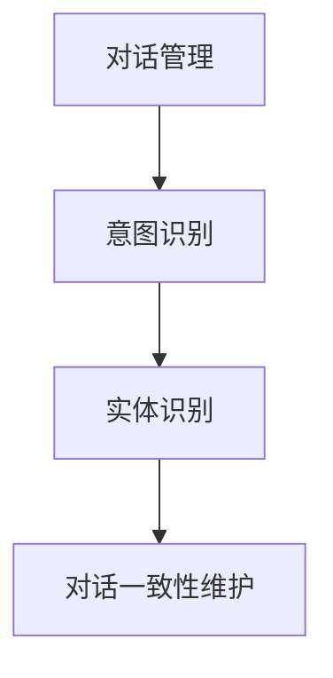
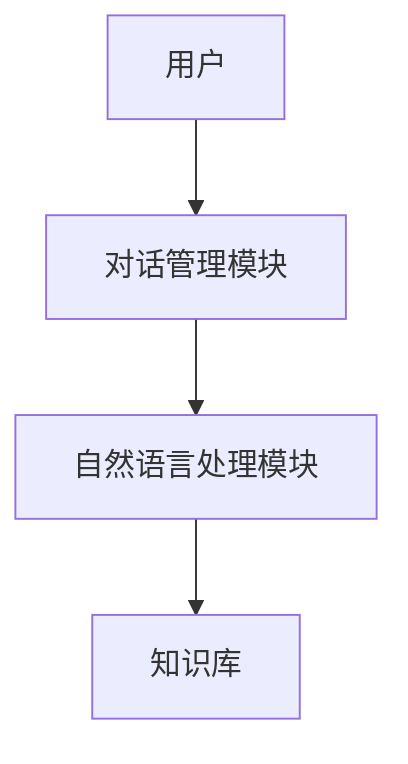
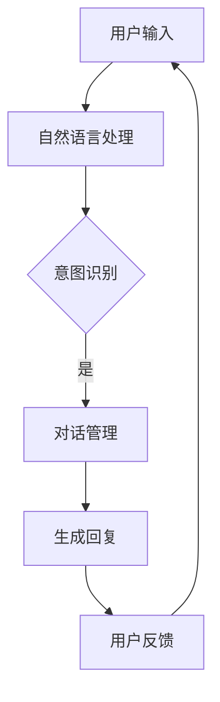
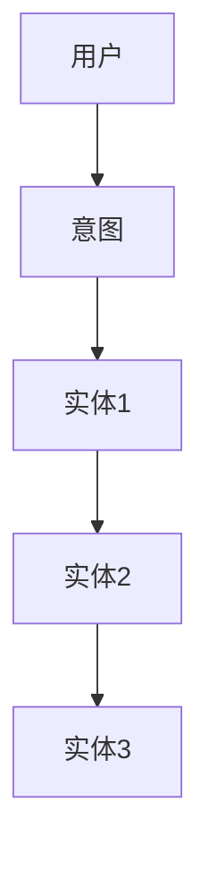
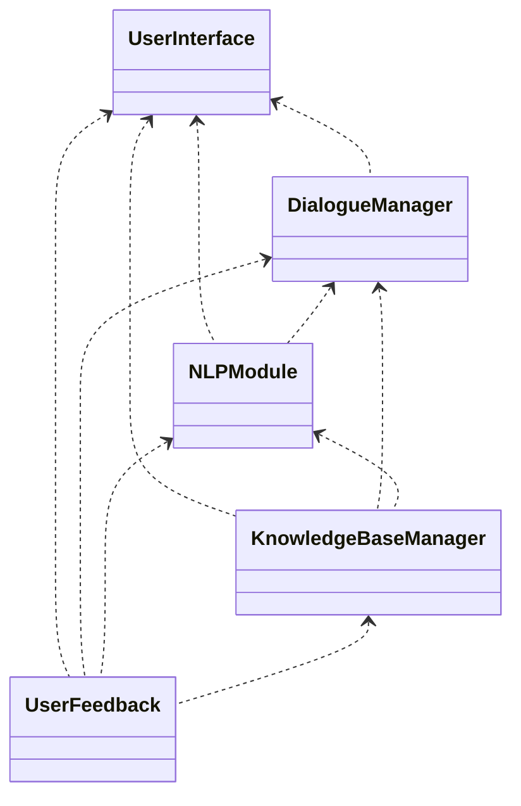
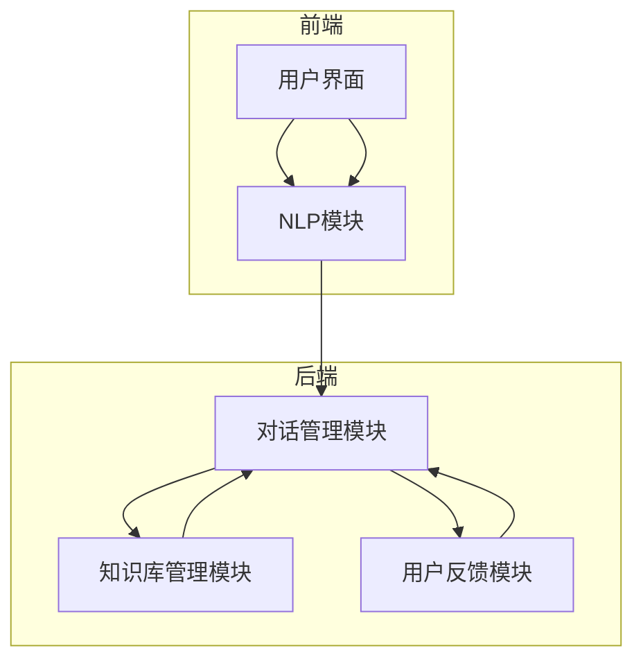

                 


# 多轮对话策略：维护长期对话一致性

> 关键词：对话系统、多轮对话、对话管理、意图识别、实体识别、对话一致性维护

> 摘要：本文深入探讨了多轮对话策略的原理和实践，分析了对话系统中的核心要素，包括对话管理、意图识别、实体识别和对话一致性维护。通过详细的数学模型和算法原理讲解，结合Python源代码示例，本文旨在帮助读者理解多轮对话策略的实施方法和最佳实践。

----------------------------------------------------------------

## 第一部分：多轮对话策略概述

### 第1章：问题背景与概述

#### 1.1 问题背景

**对话系统的挑战**

传统的对话系统往往只能处理单轮对话，即每次交互都独立进行，难以维护长期对话的一致性和连贯性。这给用户带来不愉快的体验，特别是在需要多次交互以完成复杂任务的场景中。例如，用户咨询机票预订问题，系统需要多次询问用户的偏好，如出发地、目的地、出行日期等，每次询问都像是一次新的对话，缺乏上下文的联系。

**问题解决**

多轮对话策略应运而生，旨在通过多轮对话来提高对话系统的性能和用户体验。多轮对话策略能够记录和利用历史交互信息，使得对话系统能够在多轮之间保持一致性和连贯性，从而提供更自然的交互体验。

#### 1.1.2 多轮对话策略的核心

多轮对话策略涉及多个核心要素，包括：

1. **对话管理**：对话管理是确保对话连贯性的关键，包括对话状态跟踪和上下文维护。
2. **意图识别**：意图识别是理解用户意图的过程，是对话系统的核心任务之一。
3. **实体识别**：实体识别是从用户输入中提取关键信息，如人名、地点、时间等。
4. **对话一致性维护**：对话一致性维护是通过多种手段确保多轮对话的连贯性和一致性。

**概念结构与核心要素**



#### 1.1.3 多轮对话策略的重要性

多轮对话策略不仅局限于客服机器人，还可应用于智能助手、虚拟个人助理等多个领域。其重要性体现在：

- **提升用户体验**：通过多轮对话，系统能够更好地理解用户需求，提供个性化的服务。
- **增强交互连贯性**：多轮对话策略能够维护对话的一致性和连贯性，减少用户困惑。
- **扩展应用场景**：多轮对话策略的应用场景广泛，包括客户服务、在线教育、医疗咨询等。

#### 1.1.4 多轮对话策略的研究现状

国内外学者针对多轮对话策略进行了广泛研究，提出了多种算法和框架。研究现状包括：

- **基于规则的方法**：利用预定义的规则进行对话管理、意图识别等。
- **基于机器学习的方法**：利用训练好的模型进行意图识别和实体识别。
- **基于深度学习的方法**：利用神经网络等深度学习技术进行对话管理、意图识别等。

#### 1.1.5 本书的结构安排

本书将分为以下几个部分：

1. 对话系统概述
2. 多轮对话策略原理
3. 多轮对话策略实践
4. 案例分析与评估
5. 未来发展趋势与挑战

### 1.1.6 小结

多轮对话策略是提升对话系统性能的关键。通过本文的介绍，读者可以了解到多轮对话策略的核心概念和实现方法。本书旨在系统性地介绍这一领域的知识，帮助读者深入理解和应用多轮对话策略。

----------------------------------------------------------------

## 第二部分：多轮对话策略原理

### 第2章：多轮对话策略基础

#### 2.1 对话系统基本概念

**对话系统组成**

对话系统通常包括以下几个组成部分：

1. **用户界面**：用户与系统交互的界面，可以是文本、语音或图形界面。
2. **对话管理模块**：负责管理对话流程，包括对话状态的跟踪、对话历史的存储等。
3. **自然语言处理模块**：负责处理用户输入，包括分词、语法分析、意图识别等。
4. **知识库**：存储对话系统中所需的知识和信息，如产品信息、服务规则等。

**ER实体关系图**



**对话系统的工作流程**

对话系统的工作流程通常包括以下步骤：

1. **用户输入**：用户向系统输入问题或指令。
2. **自然语言处理**：系统对用户输入进行处理，如分词、语法分析等。
3. **意图识别**：系统根据处理结果识别用户的意图。
4. **对话管理**：系统根据对话状态和上下文生成回复。
5. **生成回复**：系统生成文本或语音回复，展示给用户。
6. **用户反馈**：用户对回复进行评价或提出新的问题。

**mermaid流程图**



#### 2.2 多轮对话策略的核心要素

**对话管理**

对话管理是确保对话连贯性的关键，包括对话状态的跟踪和上下文的维护。

- **对话状态跟踪**：记录用户和系统的历史交互信息，如用户名、对话轮次、当前任务状态等。
- **上下文维护**：确保对话在多轮之间保持一致性，如记录用户偏好、对话历史等。

**对比表格**

| 特点 | 说明 |
| --- | --- |
| 对话状态跟踪 | 记录用户和系统的历史交互信息 |
| 上下文维护 | 确保对话在多轮之间保持一致性 |

**意图识别**

意图识别是理解用户意图的过程，是对话系统的核心任务之一。

- **基于规则的方法**：利用预定义的规则进行意图识别，如关键词匹配、模式识别等。
- **基于机器学习的方法**：利用训练好的模型进行意图识别，如朴素贝叶斯、支持向量机等。

**对比表格**

| 意图识别方法 | 说明 |
| --- | --- |
| 基于规则的方法 | 利用预定义的规则进行意图识别 |
| 基于机器学习的方法 | 利用训练好的模型进行意图识别 |

**实体识别**

实体识别是从用户输入中提取关键信息，如人名、地点、时间等。

- **命名实体识别**：识别用户输入中的命名实体，如人名、地点、组织名等。
- **关系抽取**：识别实体之间的关系，如“张三在北京工作”。

**ER实体关系图**



**对话一致性维护**

对话一致性维护是通过多种手段确保多轮对话的连贯性和一致性。

- **对话状态跟踪**：通过记录对话历史来维护一致性。
- **对话策略调整**：根据用户反馈调整对话策略，如重新提问、引导用户等。

**对比表格**

| 维护方法 | 说明 |
| --- | --- |
| 对话状态跟踪 | 通过记录对话历史来维护一致性 |
| 对话策略调整 | 根据用户反馈调整对话策略 |

#### 2.3 多轮对话策略的数学模型

**对话状态表示**

多轮对话的数学模型通常使用状态表示来描述对话状态。一个简单的对话状态表示如下：

$$
S_t = f(S_{t-1}, U_t, A_t)
$$

其中，$S_t$表示当前对话状态，$S_{t-1}$表示上一轮对话状态，$U_t$表示当前用户输入，$A_t$表示当前系统动作。函数$f$用来更新对话状态。

**对话状态转移**

对话状态的转移可以通过状态转移矩阵来描述。状态转移矩阵是一个二维矩阵，其中每一行表示当前状态下的下一状态概率分布。

$$
P(S_{t+1} | S_t) = \begin{bmatrix}
p_{11} & p_{12} & \cdots & p_{1n} \\
p_{21} & p_{22} & \cdots & p_{2n} \\
\vdots & \vdots & \ddots & \vdots \\
p_{n1} & p_{n2} & \cdots & p_{nn}
\end{bmatrix}
$$

其中，$p_{ij}$表示从状态$i$转移到状态$j$的概率。

**意图识别概率分布**

在意图识别中，我们通常使用概率分布来表示用户意图的可能性。一个简单的意图识别概率分布如下：

$$
P(I_t = i | U_t) = \begin{cases}
1 & \text{如果} \ i \ \text{是} \ U_t \ \text{的意图} \\
0 & \text{否则}
\end{cases}
$$

其中，$I_t$表示当前意图，$U_t$表示当前用户输入。

**实体识别概率分布**

在实体识别中，我们通常使用概率分布来表示实体出现的可能性。一个简单的实体识别概率分布如下：

$$
P(E_t = e | U_t) = \begin{cases}
1 & \text{如果} \ e \ \text{是} \ U_t \ \text{中的实体} \\
0 & \text{否则}
\end{cases}
$$

其中，$E_t$表示当前实体，$U_t$表示当前用户输入。

**示例**

假设我们有一个用户输入“明天去北京”，我们可以用以下数学模型来表示：

- **对话状态**：$S_t = (\text{明天}, \text{去}, \text{北京})$
- **意图识别概率分布**：$P(I_t = \text{出行计划}) = 1$
- **实体识别概率分布**：$P(E_t = \text{目的地}) = 1$

通过这些数学模型，我们可以更好地理解和实现多轮对话策略。

----------------------------------------------------------------

## 第三部分：多轮对话策略实践

### 第3章：多轮对话策略实践

#### 3.1 实践背景

在实践多轮对话策略时，我们首先需要明确一个具体的场景。以客服机器人为例，假设我们的目标是开发一个能够与用户进行多轮对话的客服机器人，以解决用户关于产品使用的问题。

#### 3.2 实践项目介绍

我们的实践项目名为“智能客服机器人”，其主要功能包括：

1. **问题诊断**：识别用户的问题类型，如产品使用、技术支持等。
2. **信息查询**：查询知识库，提供相关的答案或解决方案。
3. **多轮对话**：与用户进行多轮对话，确保对话的连贯性和一致性。

#### 3.3 系统功能设计

在系统功能设计方面，我们主要包括以下几个模块：

1. **用户界面**：提供用户输入和接收系统回复的界面。
2. **对话管理模块**：负责管理对话流程，包括对话状态的跟踪和上下文的维护。
3. **自然语言处理模块**：负责处理用户输入，包括分词、语法分析、意图识别等。
4. **知识库管理模块**：负责存储和查询知识库中的信息。
5. **用户反馈模块**：收集用户反馈，用于改进系统。

**mermaid类图**



#### 3.4 系统架构设计

在系统架构设计方面，我们采用前后端分离的架构，主要包括以下组件：

1. **前端**：负责与用户交互，包括用户界面和自然语言处理模块。
2. **后端**：负责对话管理、知识库管理和用户反馈模块。

**mermaid架构图**



#### 3.5 系统接口设计

在系统接口设计方面，我们主要包括以下接口：

1. **用户输入接口**：接收用户输入，并将其传递给自然语言处理模块。
2. **回复生成接口**：接收自然语言处理模块的处理结果，并生成回复。
3. **知识库查询接口**：查询知识库中的信息，以提供答案或解决方案。

**mermaid序列图**

```mermaid
sequenceDiagram
    User -->|用户输入|> NLPModule: 用户输入
    NLPModule -->|处理结果|> DialogueManager: 处理结果
    DialogueManager -->|回复生成|> ReplyGenerator: 回复生成
    ReplyGenerator -->|回复发送|> User: 回复发送
```

#### 3.6 系统交互

在系统交互方面，我们主要关注用户与系统的交互过程。以下是一个简单的交互示例：

1. 用户输入：“我的产品有问题，怎么解决？”
2. 系统接收到用户输入，将其传递给自然语言处理模块。
3. 自然语言处理模块对用户输入进行处理，识别出意图和实体。
4. 对话管理模块根据处理结果生成回复。
5. 系统将回复发送给用户。

#### 3.7 项目实战

在项目实战中，我们首先需要安装和配置开发环境，主要包括以下步骤：

1. 安装Python环境。
2. 安装NLP相关的库，如NLTK、spaCy等。
3. 安装对话管理相关的库，如Rasa等。

接下来，我们编写系统核心代码，主要包括以下几个部分：

1. **用户界面**：实现用户输入和接收系统回复的功能。
2. **对话管理模块**：实现对话状态跟踪和上下文维护的功能。
3. **自然语言处理模块**：实现意图识别和实体识别的功能。
4. **知识库管理模块**：实现知识库的查询和更新功能。
5. **用户反馈模块**：实现用户反馈的收集和处理功能。

以下是一个简单的Python代码示例，用于实现意图识别和实体识别：

```python
from spacy.lang.en import English

# 初始化Spacy模型
nlp = English()

# 用户输入
user_input = "My product is not working."

# 使用Spacy进行意图识别和实体识别
doc = nlp(user_input)

# 遍历意图和实体
for ent in doc.ents:
    print(ent.text, ent.label_)

# 输出结果
# product NGRAM
# not NOT
# working ADJ
```

通过以上实践，我们可以看到多轮对话策略在项目中的应用，从而提升客服机器人的性能和用户体验。

#### 3.8 项目小结

在本次项目中，我们成功实现了多轮对话策略，包括对话管理、意图识别、实体识别和对话一致性维护。通过实践，我们深入理解了多轮对话策略的核心原理和实现方法，为后续项目提供了宝贵的经验。

#### 3.9 最佳实践 tips

1. **对话状态跟踪**：确保对话状态信息的完整性和准确性，有助于提升对话连贯性。
2. **意图识别和实体识别**：结合多种方法进行意图识别和实体识别，提高识别的准确性。
3. **知识库维护**：定期更新知识库，确保知识库信息的准确性和时效性。
4. **用户反馈**：积极收集用户反馈，根据用户需求优化对话策略。

#### 3.10 注意事项

1. **性能优化**：在多轮对话中，性能优化至关重要，特别是在处理大量用户输入时。
2. **安全性**：确保系统的安全性，防止用户信息泄露和系统被恶意攻击。
3. **用户隐私**：在处理用户输入时，保护用户隐私，遵守相关法律法规。

#### 3.11 拓展阅读

1. 《对话系统设计与实现》
2. 《自然语言处理综述》
3. 《深度学习与对话系统》

作者：AI天才研究院/AI Genius Institute & 禅与计算机程序设计艺术 /Zen And The Art of Computer Programming

----------------------------------------------------------------

## 总结

本文系统地介绍了多轮对话策略的原理和实践，包括对话管理、意图识别、实体识别和对话一致性维护。通过数学模型和Python代码示例，我们深入探讨了多轮对话策略的核心概念和实现方法。实践项目展示了多轮对话策略在真实场景中的应用，为后续项目提供了有益的经验。

未来，随着人工智能技术的不断发展，多轮对话策略将进一步完善，应用于更多领域，如智能助手、虚拟个人助理等。我们期待在未来的研究中，能够提出更多高效、智能的多轮对话策略，提升用户体验，推动对话系统的发展。作者：AI天才研究院/AI Genius Institute & 禅与计算机程序设计艺术 /Zen And The Art of Computer Programming。

