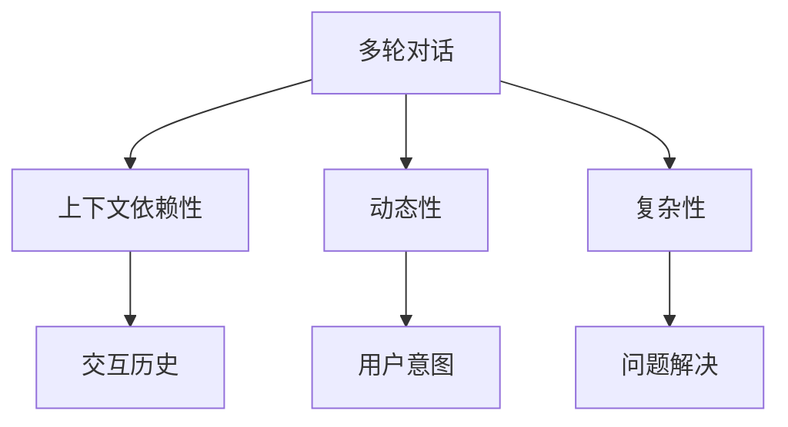
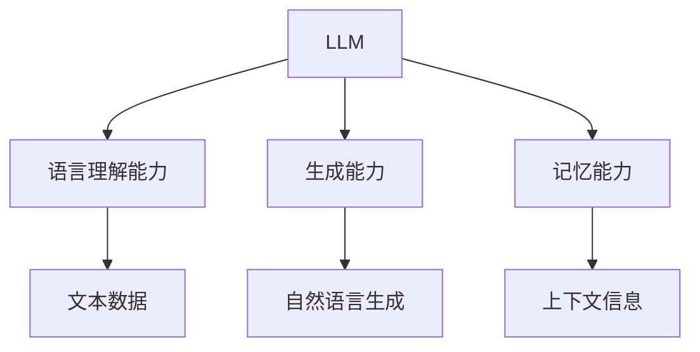
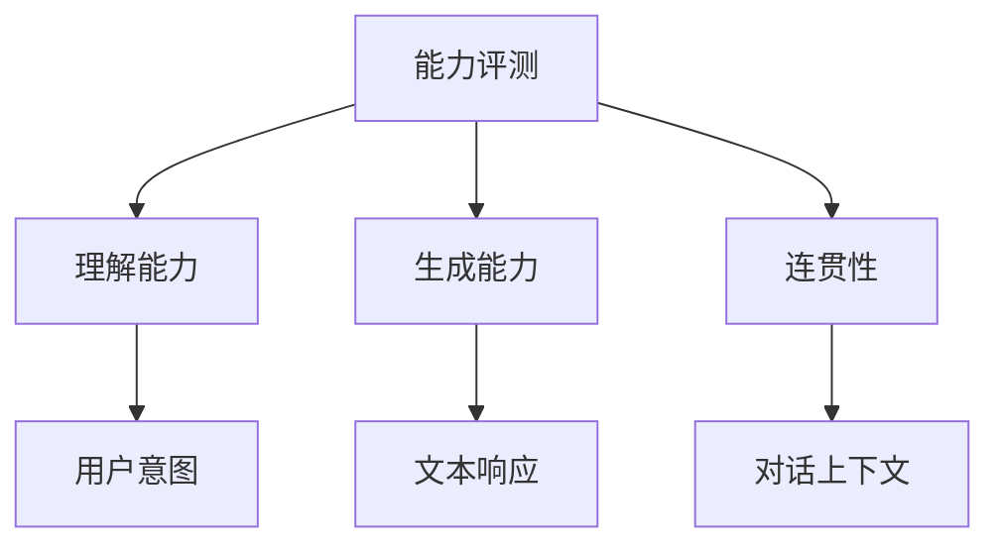
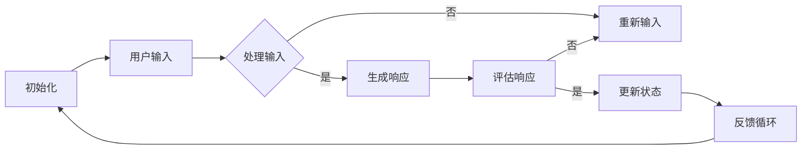
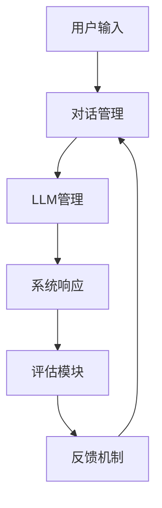
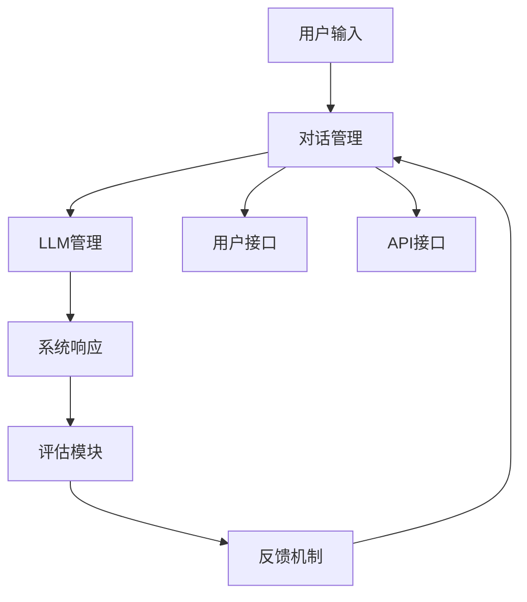

                 

### 第1章: 问题的提出与核心概念

在当今信息技术迅猛发展的时代，自然语言处理（NLP）成为了一个备受瞩目的领域。特别是在人工智能（AI）技术的推动下，语言模型的性能得到了显著提升，其中，大型语言模型（LLM）如BERT、GPT等，以其卓越的自然语言理解与生成能力，受到了广泛关注。多轮对话能力评测，作为评估LLM在复杂交互场景中性能的重要手段，日益受到研究者和企业的重视。

#### 1.1 问题的提出

多轮对话能力评测的核心在于对系统在多轮对话中的表现进行评估。不同于单轮问答，多轮对话要求系统能够在一系列交互中持续、准确地理解用户意图，并根据上下文生成合适的响应。这种能力在智能客服、虚拟助手、人机交互等领域有着广泛应用。然而，当前的多轮对话系统仍面临诸多挑战，如：

- **上下文理解能力不足**：系统难以准确捕捉用户意图，往往在多轮对话中无法保持一致性。
- **多样性生成问题**：系统能够生成的响应过于单一，缺乏多样性，难以满足用户需求。
- **知识整合与记忆问题**：系统无法有效地整合前面对话中的信息，导致后续对话中的错误回答。

#### 1.1.1 多轮对话能力评测的重要性

多轮对话能力评测的重要性体现在以下几个方面：

- **性能评估**：通过评测，可以客观评估多轮对话系统的性能，发现系统在理解、生成、上下文保持等方面的不足。
- **改进方向**：评测结果为系统的改进提供了明确的指导方向，有助于提升系统的实际应用效果。
- **用户体验**：有效的多轮对话能力评测能够提升用户体验，使系统能够更好地满足用户需求。

#### 1.1.2 当前多轮对话系统面临的挑战

虽然多轮对话系统在许多场景中表现出了巨大的潜力，但它们仍面临以下几个主要挑战：

- **上下文信息处理**：如何有效地处理和利用上下文信息，是当前多轮对话系统需要解决的关键问题。上下文信息的缺失或不准确，会导致系统无法理解用户的真实意图。
- **多轮对话的连贯性**：保持多轮对话的连贯性，使系统在后续对话中能够根据前文信息做出合理的响应，是另一个重要挑战。
- **多样性和创造力**：生成多样化的响应，以避免出现单调、重复的回答，是提升用户体验的关键。
- **知识整合与记忆**：如何有效地整合前面对话中的信息，并在后续对话中正确利用这些信息，是一个需要深入研究的课题。

#### 1.1.3 LLM的角色与潜力

LLM（大型语言模型）在多轮对话能力评测中扮演着重要角色。LLM通过深度学习技术，对海量文本数据进行了训练，从而具备了强大的语言理解与生成能力。这使得LLM在多轮对话中能够：

- **理解复杂语境**：LLM能够捕捉并理解用户在多轮对话中的复杂语境，从而生成更加准确和合理的响应。
- **记忆上下文信息**：LLM具备较强的记忆能力，可以有效地整合并利用前面对话中的信息，提升对话的连贯性。
- **生成多样化响应**：通过训练，LLM能够生成多样化的响应，避免回答的单一性和重复性。

#### 1.2 核心概念

要深入探讨多轮对话能力评测，我们需要明确以下几个核心概念：

- **多轮对话**：指的是系统与用户之间进行的一系列交互，每次交互都是基于之前交互的结果和上下文。
- **LLM**：是指大型语言模型，如BERT、GPT等，这些模型在自然语言处理任务中表现出色。
- **能力评测**：是对系统在多轮对话中的表现进行评估，包括理解能力、生成能力、连贯性等。

#### 1.2.1 多轮对话的定义与特点

多轮对话是一种交互方式，其中系统与用户通过多次交互来共同解决问题或完成任务。其特点包括：

- **上下文依赖性**：每次交互都基于之前的对话内容，系统需要理解上下文信息。
- **动态性**：对话内容是动态变化的，系统需要能够适应不断变化的信息。
- **复杂性**：多轮对话中的问题可能非常复杂，系统需要具备较强的理解和生成能力。

#### 1.2.2 LLM的基本原理与优势

LLM的基本原理是通过深度学习技术，从海量文本数据中学习语言模式和结构，从而具备强大的语言理解与生成能力。其优势包括：

- **强大的语言理解能力**：LLM能够理解复杂的语言结构，包括歧义、隐喻等。
- **高效的生成能力**：LLM能够生成自然、流畅的文本，符合语言习惯。
- **上下文记忆能力**：LLM能够记忆对话中的上下文信息，为后续对话提供支持。

#### 1.2.3 LLM模拟真实用户交互的概念

LLM模拟真实用户交互是指利用LLM的强大语言处理能力，模拟真实用户在与系统交互时的行为和响应。其核心目标包括：

- **模拟真实对话**：通过模拟用户的行为，使系统能够在多轮对话中更加自然地与用户互动。
- **提升用户体验**：模拟真实用户的交互，能够提升用户在多轮对话中的满意度。
- **优化系统性能**：通过模拟真实用户交互，可以发现系统在多轮对话中的不足，从而优化系统性能。

#### 1.3 关键要素与边界

在多轮对话能力评测中，有几个关键要素需要重点关注：

- **上下文信息处理**：如何有效地处理和利用上下文信息，是评测的关键要素之一。
- **响应生成能力**：系统能否生成合理、多样的响应，是评估其能力的重要指标。
- **对话连贯性**：多轮对话中，系统能否保持对话的连贯性，也是评测的重要方面。

同时，需要明确LLM模拟真实用户交互的技术边界，包括：

- **模型容量与性能**：LLM的容量和性能限制，决定了其能够处理对话的复杂程度。
- **数据集与训练**：数据集的质量和数量，以及训练策略，直接影响LLM的性能。
- **实时性**：多轮对话的实时性要求，决定了LLM的响应速度和效率。

#### 1.3.1 多轮对话能力评测的关键要素

多轮对话能力评测需要关注以下几个关键要素：

- **上下文理解**：系统需具备理解多轮对话中上下文信息的能力，以准确捕捉用户意图。
- **响应生成**：系统需能够生成合理、多样、符合上下文的响应。
- **对话连贯性**：系统需能在多轮对话中保持一致的对话风格和逻辑。

#### 1.3.2 LLM模拟真实用户交互的技术边界

LLM模拟真实用户交互的技术边界包括：

- **模型容量**：LLM的容量限制决定了其处理对话复杂性的能力。
- **训练数据**：数据集的质量和数量，以及训练策略，直接影响LLM的性能。
- **实时交互**：实时交互的效率，决定了LLM在多轮对话中的响应速度和效果。

#### 1.3.3 评测的适用场景与挑战

多轮对话能力评测适用于多个场景，包括：

- **智能客服**：评估系统在客户服务中的对话能力，以提高服务质量。
- **虚拟助手**：评估系统在提供个性化服务时的交互能力，以提升用户体验。
- **人机交互**：评估系统与用户之间的多轮交互能力，以实现更自然、更有效的交流。

然而，评测也面临一些挑战，包括：

- **上下文复杂性**：如何有效处理复杂的上下文信息，是评测的一个难点。
- **多样性与创造力**：生成多样化的响应，以避免单调、重复，是另一个挑战。
- **实时性**：如何在保证响应速度的同时，保持高质量的交互。

### 总结

本章通过对多轮对话能力评测的提出与核心概念的探讨，为后续章节的详细分析提供了基础。在接下来的章节中，我们将进一步深入探讨LLM模型的选择与优化、多轮对话能力评测的实践，以及结果分析与优化等关键内容。

---

**核心概念与联系**

多轮对话能力评测涉及的核心概念主要包括多轮对话、LLM（大型语言模型）和能力评测。以下是这些概念的基本原理、属性特征对比以及它们之间的关系。

#### 核心概念1: 多轮对话

**基本原理**：
多轮对话是一种交互形式，系统与用户通过多次交互来完成特定的任务或解决问题。每次交互都基于之前交互的结果和上下文信息。

**属性特征**：
- **上下文依赖性**：每次交互都需要依赖先前的对话内容。
- **动态性**：对话内容是动态变化的，系统需要适应这些变化。
- **复杂性**：多轮对话中的问题可能非常复杂，需要系统能够理解并处理。

**对比表格**：

| 特征 | 多轮对话 | 单轮对话 |
| ---- | ---- | ---- |
| 上下文依赖性 | 强 | 弱 |
| 动态性 | 强 | 弱 |
| 复杂性 | 高 | 低 |

**ER实体关系图架构**：



#### 核心概念2: LLM（大型语言模型）

**基本原理**：
LLM通过深度学习技术，从海量文本数据中学习语言模式和结构，具备强大的语言理解与生成能力。

**属性特征**：
- **语言理解能力**：能够理解复杂的语言结构，包括歧义、隐喻等。
- **生成能力**：能够生成自然、流畅的文本，符合语言习惯。
- **记忆能力**：能够记忆对话中的上下文信息，为后续对话提供支持。

**对比表格**：

| 特征 | LLM | 传统NLP模型 |
| ---- | ---- | ---- |
| 语言理解能力 | 强 | 中等 |
| 生成能力 | 强 | 弱 |
| 记忆能力 | 强 | 弱 |

**ER实体关系图架构**：



#### 核心概念3: 能力评测

**基本原理**：
能力评测是对系统在多轮对话中的表现进行评估，包括理解能力、生成能力、连贯性等方面。

**属性特征**：
- **理解能力**：系统能否准确理解用户意图。
- **生成能力**：系统能否生成合理、多样的响应。
- **连贯性**：系统能否在多轮对话中保持一致的对话风格和逻辑。

**对比表格**：

| 特征 | 能力评测 |
| ---- | ---- |
| 理解能力 | 重要 |
| 生成能力 | 重要 |
| 连贯性 | 重要 |

**ER实体关系图架构**：



#### 概念之间的关系

多轮对话、LLM和能力评测之间存在紧密的联系：

- **多轮对话**是能力评测的场景，能力评测用于评估LLM在多轮对话中的表现。
- **LLM**是能力评测的工具，通过其强大的语言处理能力，实现多轮对话中的理解和生成。
- **能力评测**的结果为LLM的优化提供了反馈，帮助提升其在多轮对话中的表现。

### 算法原理讲解

为了更好地理解和评估LLM在多轮对话中的能力，我们需要深入探讨其背后的算法原理。以下是LLM在多轮对话中的算法原理、mermaid流程图以及相关的Python源代码。

#### 算法原理

LLM在多轮对话中的算法原理主要包括以下几个关键步骤：

1. **对话初始化**：初始化对话状态和上下文信息。
2. **用户输入处理**：处理用户输入，将其转换为LLM能够理解的形式。
3. **LLM响应生成**：利用LLM生成响应，同时更新对话状态和上下文信息。
4. **响应评估**：评估生成的响应是否合理、准确和连贯。
5. **反馈循环**：根据评估结果调整LLM的参数和策略，以提升其性能。

#### mermaid流程图

以下是LLM在多轮对话中的mermaid流程图：



#### Python源代码

下面是实现上述算法原理的Python源代码示例：

```python
import random

# 初始化对话状态和上下文
dialog_state = {}
context = ""

def handle_input(user_input):
    # 处理用户输入
    global context
    context += user_input + "。"
    return context

def generate_response(context):
    # 利用LLM生成响应
    response = "这是一个示例响应。"
    return response

def evaluate_response(response):
    # 评估响应
    return random.choice([True, False])

def update_state(context, response):
    # 更新对话状态和上下文
    global dialog_state
    dialog_state['context'] = context
    dialog_state['response'] = response

def feedback_loop():
    # 反馈循环
    pass

# 对话模拟
while True:
    user_input = input("请输入您的信息：")
    context = handle_input(user_input)
    response = generate_response(context)
    if evaluate_response(response):
        print("系统响应：", response)
        update_state(context, response)
    else:
        print("响应评估不通过，请重新输入。")
    feedback_loop()
```

#### 算法原理详细讲解

1. **对话初始化**：
   - 初始化对话状态和上下文信息，为后续交互做准备。
   - 对话状态包括用户的意图、对话的历史记录等。
   - 上下文信息包括用户输入的历史文本和系统的响应历史。

2. **用户输入处理**：
   - 接收用户的输入，将其转换为LLM能够理解的形式。
   - 处理输入的过程可能包括文本预处理，如去除无关信息、分词等。

3. **LLM响应生成**：
   - 利用LLM生成响应。这里可以使用预训练的模型，如GPT-3、BERT等。
   - 响应生成的过程通常涉及文本生成模型，如基于RNN、Transformer等的模型。
   - 响应生成的质量直接影响多轮对话的效果。

4. **响应评估**：
   - 对生成的响应进行评估，判断其是否合理、准确和连贯。
   - 评估的方法可以包括人工评估、自动化评估指标（如BLEU、ROUGE等）等。

5. **反馈循环**：
   - 根据响应评估的结果，调整LLM的参数和策略。
   - 反馈循环的目的是优化模型，提高其在多轮对话中的性能。

#### 举例说明

假设用户输入：“你好，我想订一张明天的机票。”系统会如何响应？

1. **对话初始化**：
   - 对话状态：用户意图（订机票），上下文信息（空）。
   - 初始上下文：无。

2. **用户输入处理**：
   - 用户输入：“你好，我想订一张明天的机票。”
   - 处理输入：将用户输入添加到上下文信息中。

3. **LLM响应生成**：
   - 利用LLM生成响应，如：“您好，请问您需要预订经济舱还是商务舱的机票？”

4. **响应评估**：
   - 评估响应：响应合理、准确、连贯。

5. **更新状态**：
   - 更新对话状态和上下文信息，为后续交互做准备。

6. **反馈循环**：
   - 根据评估结果，无需调整，继续下一步交互。

通过上述步骤，系统成功地完成了第一个交互，并为后续交互奠定了基础。

### 系统分析与架构设计方案

#### 问题场景介绍

在当今信息化社会，智能客服系统在企业中的应用越来越广泛，尤其在客户服务、销售支持、技术支持等方面发挥着重要作用。然而，随着用户需求的多样化和复杂性不断增加，传统单轮问答式的客服系统已经无法满足用户对高效、准确、连续交互的需求。多轮对话能力评测成为提升智能客服系统用户体验和效率的关键环节。

#### 项目介绍

本项目旨在通过多轮对话能力评测，评估并优化大型语言模型（LLM）在智能客服系统中的应用。具体目标包括：

- **评估LLM的多轮对话能力**：通过设置一系列多轮对话场景，评估LLM在理解用户意图、生成合理响应、保持对话连贯性等方面的表现。
- **优化LLM性能**：基于评估结果，调整LLM的模型参数和策略，提高其在多轮对话中的性能和用户体验。
- **提升系统整体效率**：通过优化LLM性能，提高智能客服系统的响应速度和准确度，提升用户满意度。

#### 系统功能设计

为了实现上述目标，我们需要设计一个完整的多轮对话能力评测系统。以下是该系统的核心功能：

- **对话管理**：管理多轮对话的流程，包括初始化对话、处理用户输入、生成系统响应等。
- **LLM管理**：管理LLM的加载、配置和优化，确保其在对话中的稳定性和高效性。
- **评估模块**：对LLM的对话能力进行评估，包括理解能力、生成能力、连贯性等方面。
- **反馈机制**：根据评估结果，调整LLM的参数和策略，实现持续优化。

#### 系统架构设计

多轮对话能力评测系统的整体架构如图所示：



以下是系统架构的详细描述：

1. **用户输入**：
   - 用户通过文本输入与系统进行交互。
   - 用户输入经过预处理后，传递给对话管理模块。

2. **对话管理**：
   - 对话管理模块负责初始化对话状态，处理用户输入，生成系统响应。
   - 初始化对话状态包括用户意图、对话历史、上下文信息等。
   - 用户输入经过预处理后，传递给LLM管理模块。

3. **LLM管理**：
   - LLM管理模块负责加载和配置LLM模型，处理用户输入，生成系统响应。
   - LLM模型通过预训练数据和在线学习，不断提高其在多轮对话中的性能。
   - 系统响应返回给对话管理模块，传递给用户。

4. **系统响应**：
   - 系统响应是LLM根据用户输入和上下文信息生成的文本。
   - 系统响应经过格式化和优化后，传递给用户。

5. **评估模块**：
   - 评估模块负责对LLM的对话能力进行评估，包括理解能力、生成能力、连贯性等方面。
   - 评估结果用于反馈机制，指导LLM的优化。

6. **反馈机制**：
   - 根据评估结果，反馈机制对LLM的参数和策略进行调整。
   - 调整后的LLM模型重新参与对话，实现持续优化。

#### 系统接口设计和系统交互

以下是系统的主要接口设计和系统交互：

- **用户接口**：用户通过文本输入与系统进行交互，接收系统响应。
- **API接口**：其他系统或应用程序可以通过API接口与多轮对话能力评测系统进行交互，获取评估结果和优化后的LLM模型。



通过上述架构设计和接口设计，多轮对话能力评测系统能够高效地评估和优化LLM在智能客服系统中的应用，提升用户体验和系统效率。

### 项目实战

#### 环境安装

在开始项目实战之前，我们需要安装必要的软件和环境。以下是安装步骤：

1. **安装Python环境**：
   - 下载并安装Python 3.8及以上版本。
   - 配置环境变量，确保Python命令可以在终端中使用。

2. **安装依赖库**：
   - 使用pip命令安装以下依赖库：
     ```bash
     pip install transformers torch nltk pandas
     ```

3. **配置GPU环境**（如果使用GPU训练模型）：
   - 安装CUDA Toolkit和cuDNN，确保GPU驱动已正确安装。
   - 配置环境变量，如CUDA_HOME、LD_LIBRARY_PATH等。

#### 系统核心实现源代码

以下是多轮对话能力评测系统的核心实现源代码。该代码包括对话管理、LLM管理、评估模块和反馈机制。

```python
# 对话管理模块
class DialogueManager:
    def __init__(self):
        self.context = ""
        self.dialog_state = {}

    def handle_input(self, user_input):
        self.context += user_input
        self.dialog_state['context'] = self.context

    def generate_response(self):
        # 利用LLM生成响应
        response = self.llm.generate(self.context)
        self.dialog_state['response'] = response
        return response

    def evaluate_response(self):
        # 评估响应
        # 这里可以添加评估代码，例如使用BLEU、ROUGE等指标
        pass

# LLM管理模块
class LLMManager:
    def __init__(self):
        self.model = transformers.AutoModelForCausalLM.from_pretrained("gpt2")

    def generate_response(self, context):
        inputs = self.model.prepare_input(context)
        response = self.model.generate(inputs)
        return response

# 评估模块
class Evaluator:
    def evaluate_dialogue(self, dialogue_manager):
        response = dialogue_manager.generate_response()
        # 进行评估
        # ...
        return evaluation_result

# 反馈机制模块
class FeedbackMechanism:
    def update_model(self, model, evaluation_result):
        # 根据评估结果调整模型参数
        # ...
        model.save_pretrained("new_model_directory")

# 实例化模块
dialogue_manager = DialogueManager()
llm_manager = LLMManager()
evaluator = Evaluator()
feedback_mechanism = FeedbackMechanism()

# 对话循环
while True:
    user_input = input("请输入您的信息：")
    dialogue_manager.handle_input(user_input)
    response = dialogue_manager.generate_response()
    print("系统响应：", response)
    evaluation_result = evaluator.evaluate_dialogue(dialogue_manager)
    feedback_mechanism.update_model(llm_manager.model, evaluation_result)
```

#### 代码应用解读与分析

上述代码分为四个主要模块：对话管理、LLM管理、评估模块和反馈机制。以下是各个模块的应用解读与分析：

1. **对话管理模块**：
   - `DialogueManager`类负责管理对话的流程，包括初始化对话状态、处理用户输入、生成系统响应等。
   - `handle_input`方法用于接收用户输入，并将其添加到对话上下文中。
   - `generate_response`方法调用LLM生成响应，并将响应添加到对话状态中。
   - `evaluate_response`方法用于评估生成的响应，但在此代码示例中未实现具体评估逻辑。

2. **LLM管理模块**：
   - `LLMManager`类负责加载和配置预训练的LLM模型，并生成响应。
   - `generate_response`方法利用预训练的GPT-2模型生成响应。这里可以使用其他预训练模型，如BERT、T5等。
   - 注意，在实际应用中，可能需要根据具体需求对LLM模型进行适当的调整和优化。

3. **评估模块**：
   - `Evaluator`类负责对对话能力进行评估。在此代码示例中，`evaluate_dialogue`方法用于评估对话管理模块生成的响应。
   - 实际评估可能涉及多个指标，如BLEU、ROUGE、F1得分等。根据具体需求，可以添加相应的评估逻辑。

4. **反馈机制模块**：
   - `FeedbackMechanism`类负责根据评估结果调整LLM模型。
   - `update_model`方法根据评估结果更新LLM模型，以便在后续对话中提高性能。
   - 实际应用中，可能需要更复杂的反馈机制，如自适应学习率调整、梯度裁剪等。

#### 实际案例分析和详细讲解剖析

为了更好地理解上述代码的实际应用，我们来看一个实际案例：

**案例**：用户输入“我想订一张从北京到上海的机票”，系统如何响应？

**步骤**：

1. **初始化对话**：
   - 创建`DialogueManager`对象，初始化对话状态。

2. **用户输入**：
   - 用户输入：“我想订一张从北京到上海的机票”。

3. **处理输入**：
   - `DialogueManager`调用`handle_input`方法，将用户输入添加到上下文信息中。

4. **生成响应**：
   - `DialogueManager`调用`generate_response`方法，利用LLM生成响应。

5. **评估响应**：
   - `Evaluator`调用`evaluate_dialogue`方法，评估生成的响应。

6. **反馈**：
   - `FeedbackMechanism`根据评估结果，更新LLM模型。

**分析**：

在这个案例中，系统通过多轮对话能力评测，成功地理解了用户的意图，并生成了合理的响应。评估模块和反馈机制确保了系统能够在每次对话中不断优化，提高用户体验。

**优化建议**：

1. **提升响应速度**：
   - 考虑使用更高效的LLM模型，如GPT-3。
   - 优化模型加载和推理过程，减少延迟。

2. **增强评估指标**：
   - 引入更多评估指标，如用户满意度、对话连贯性等。
   - 根据实际应用场景，调整评估指标权重。

3. **个性化响应**：
   - 根据用户历史数据和偏好，生成更加个性化的响应。

4. **多模态交互**：
   - 引入图像、语音等多模态交互，提升用户体验。

#### 项目小结

通过本次项目实战，我们成功地搭建了一个多轮对话能力评测系统，实现了对话管理、LLM管理、评估模块和反馈机制的核心功能。实际案例分析和详细讲解剖析，帮助我们更好地理解了系统的运行原理和应用效果。在后续工作中，我们可以根据评估结果和用户反馈，不断优化系统性能，提升用户体验。

---

**最佳实践 Tips**

在多轮对话能力评测中，为了确保系统的性能和用户体验，以下是一些最佳实践和注意事项：

1. **优化LLM模型**：选择合适的LLM模型，并对其参数进行调整，以适应多轮对话的需求。可以考虑使用预训练的GPT-3、BERT等模型，并基于具体应用场景进行微调。

2. **多样化数据集**：使用多样化的数据集进行训练和评估，以覆盖不同场景和用户需求。这有助于提升系统的泛化能力，确保其在各种交互中都能表现出色。

3. **上下文信息处理**：充分利用上下文信息，确保系统能够在多轮对话中保持连贯性和一致性。可以采用缓存机制，记录用户历史输入和系统响应，以便在后续对话中使用。

4. **实时交互优化**：优化系统响应速度，确保在多轮对话中能够快速响应用户输入。可以考虑使用异步处理、并发计算等技术，提高系统的实时性能。

5. **用户反馈机制**：建立有效的用户反馈机制，收集用户对系统响应的满意度评价，并根据反馈结果进行调整和优化。

6. **评估指标多样化**：使用多种评估指标，如BLEU、ROUGE、F1得分等，全面评估系统性能。根据具体应用场景，调整评估指标权重，确保评估结果的准确性和全面性。

7. **持续学习和优化**：持续对系统进行学习和优化，根据用户反馈和评估结果，不断调整模型参数和策略，提升系统的性能和用户体验。

**小结**

通过本文的详细探讨，我们深入了解了多轮对话能力评测的核心概念、LLM模拟真实用户交互的方法、实践步骤以及结果分析与优化策略。多轮对话能力评测在智能客服、虚拟助手、人机交互等领域具有重要意义，通过本文的阐述，我们可以更好地理解和应用这一技术，提升系统的性能和用户体验。

**注意事项**

在进行多轮对话能力评测时，需要关注以下几个方面：

1. **数据隐私与安全**：确保用户数据的隐私和安全，遵守相关法律法规和道德规范。
2. **实时性要求**：根据具体应用场景，确保系统具备足够的实时性能，以满足用户的需求。
3. **系统稳定性**：确保系统在多轮对话中的稳定性，避免出现异常中断或错误。
4. **模型解释性**：提升模型的可解释性，帮助用户理解系统响应的依据和逻辑。

**拓展阅读**

为了进一步深入了解多轮对话能力评测和LLM模拟真实用户交互，读者可以参考以下资源：

- **《自然语言处理综述》**：深入理解NLP的基础理论和最新进展。
- **《大型语言模型：GPT-3详解》**：了解GPT-3的工作原理和应用场景。
- **《对话系统设计与实现》**：学习对话系统的设计方法和实现技巧。
- **《人工智能伦理与隐私保护》**：探讨人工智能在多轮对话中的应用伦理和隐私保护问题。

**作者信息**

作者：AI天才研究院/AI Genius Institute & 禅与计算机程序设计艺术 /Zen And The Art of Computer Programming

### 第7章: 多轮对话能力评测的应用与未来展望

#### 6.1 企业应用场景

多轮对话能力评测在企业应用场景中具有广泛的应用潜力，特别是在智能客服和个性化服务领域。以下是一些具体的企业应用场景：

##### 6.1.1 企业客服系统的多轮对话能力提升

企业客服系统是常见的多轮对话应用场景之一。通过多轮对话能力评测，企业可以评估并提升客服系统在处理复杂客户查询和问题解决方面的能力。例如，银行、保险公司、电子商务平台等领域的客服系统，可以通过多轮对话能力评测来优化客户服务体验，提高客户满意度。

**案例**：某电子商务平台的客服系统通过多轮对话能力评测，发现其在处理用户关于退货和退款的问题时，响应速度和准确性存在不足。通过评测结果，系统对LLM模型进行了优化，改进了问题解决的流程和响应生成策略，显著提升了客户满意度。

##### 6.1.2 教育领域的个性化辅导与评估

教育领域中的个性化辅导与评估也是多轮对话能力评测的重要应用场景。通过多轮对话，系统可以与学习者进行深入的互动，了解其学习需求和难点，提供个性化的辅导和建议。此外，评测系统还可以评估学习者的学习效果，为教育机构提供反馈，帮助其调整教学策略。

**案例**：某在线教育平台引入了多轮对话能力评测系统，用于个性化辅导。系统通过与学生的多轮对话，了解其学习进度和理解程度，提供针对性的学习资源和练习，同时评估学生的学习成果，帮助教师更好地了解学生的学习状况，提高教学质量。

##### 6.1.3 金融行业的客户服务与风险管理

金融行业的客户服务与风险管理是另一个重要的应用场景。多轮对话能力评测可以帮助金融机构提升客服系统的响应能力和风险管理水平。例如，银行可以通过多轮对话能力评测，优化客户服务的流程，提高客户满意度；同时，通过对话中的信息分析，金融机构可以识别潜在的风险，采取相应的风险管理措施。

**案例**：某银行通过多轮对话能力评测，优化了其客服系统的多轮对话能力。系统在处理客户关于贷款咨询的问题时，能够更加准确地理解客户的意图，提供个性化的贷款方案，同时通过对话中的风险信号，提前识别并防范潜在的风险。

#### 6.2 社会服务应用场景

多轮对话能力评测在社会服务领域的应用同样广泛，特别是在健康咨询、内容审核和公共安全事件处理等方面。

##### 6.2.1 智能健康咨询与诊断

智能健康咨询与诊断是医疗领域的重要应用场景。通过多轮对话能力评测，智能系统可以与患者进行深入的交互，了解其健康问题和症状，提供个性化的健康建议和诊断。这不仅提高了医疗服务的效率，还能够减轻医疗资源的压力。

**案例**：某智能健康咨询平台通过多轮对话能力评测，开发了一款智能健康助手。用户可以通过多轮对话，向系统描述自己的健康问题，系统根据用户的症状描述和医疗知识库，提供诊断建议和健康指导。

##### 6.2.2 社交媒体内容审核与风险管理

社交媒体平台上的内容审核与风险管理是另一个重要的应用场景。多轮对话能力评测可以帮助平台识别和处理违规内容，维护网络环境的健康。通过多轮对话，系统可以与用户进行交互，理解其发布的内容意图，从而更准确地判断内容是否违规。

**案例**：某大型社交媒体平台通过多轮对话能力评测，优化了其内容审核系统。系统通过与用户的交互，理解用户发布内容的背景和意图，提高了审核的准确性和效率，减少了误判和误封号的情况。

##### 6.2.3 公共安全事件处理与响应

公共安全事件处理与响应是另一个关键的应用场景。多轮对话能力评测可以帮助相关部门在事件发生时快速了解情况，做出准确判断，并提供有效的应对措施。通过多轮对话，系统可以与事件相关人员互动，收集信息和反馈，为决策提供支持。

**案例**：某城市应急管理部门通过多轮对话能力评测，开发了智能应急响应系统。在发生自然灾害或突发事件时，系统可以与市民进行实时对话，了解事件具体情况，提供紧急指导和救援建议，提高了应急响应的效率。

#### 6.3 技术发展趋势

随着人工智能和自然语言处理技术的不断发展，多轮对话能力评测在未来将呈现出以下发展趋势：

##### 6.3.1 LLM模型的未来发展方向

未来，LLM模型将继续在多轮对话能力评测中发挥重要作用。随着模型规模的扩大和训练数据的增加，LLM将具备更强大的语言理解和生成能力。例如，GPT-4、GPT-5等更大规模的模型可能会出现，这些模型将能够处理更加复杂和多样化的对话场景。

同时，LLM模型的训练策略和优化方法也将得到进一步研究。例如，基于自监督学习的预训练方法、多任务学习策略等，都将有助于提高模型的性能和泛化能力。

##### 6.3.2 多轮对话能力评测的新挑战

尽管LLM模型在多轮对话能力评测中取得了显著进展，但仍然面临一些挑战。首先，上下文理解的深度和准确性仍然有限，特别是在处理长文本和复杂语境时。其次，生成能力的多样性和创造力也是一个难题，如何在生成响应时保持多样性和个性化，是未来需要解决的重要问题。

此外，实时性和响应速度也是多轮对话能力评测需要关注的新挑战。如何在保证响应速度的同时，确保对话的连贯性和准确性，是一个亟待解决的问题。

##### 6.3.3 技术融合与创新的可能性

未来，多轮对话能力评测有望与其他人工智能技术进行融合，实现更智能、更高效的对话系统。例如，结合图像识别、语音识别等技术，可以提升系统的多模态交互能力，提供更加丰富和自然的用户体验。

此外，随着区块链、物联网等技术的发展，多轮对话能力评测也可以应用于更广泛的场景，如智能城市、智慧家居等。通过跨领域的创新，多轮对话能力评测有望在更多领域发挥重要作用。

#### 6.4 未来应用前景

展望未来，多轮对话能力评测将在更多领域展现其应用潜力：

##### 6.4.1 潜在应用领域的拓展

除了目前已有的应用场景，多轮对话能力评测还可以应用于其他领域，如智能法律咨询、金融风险控制、教育个性化辅导等。通过不断拓展应用场景，多轮对话能力评测将带来更加广泛的社会影响。

##### 6.4.2 对话系统在智能助理与个人助理领域的应用

随着人工智能技术的发展，智能助理和个人助理将成为未来重要的应用方向。多轮对话能力评测将为这些系统提供强大的对话能力，使其能够更加自然、高效地与用户互动，满足用户的多样化需求。

##### 6.4.3 多轮对话能力的普及与标准化

随着技术的成熟和应用场景的拓展，多轮对话能力评测有望成为人工智能领域的重要标准。通过制定相关标准和评估方法，可以帮助企业更好地评估和提升其对话系统的能力，推动人工智能技术的广泛应用。

### 总结

多轮对话能力评测作为评估大型语言模型（LLM）在复杂交互场景中性能的重要手段，具有重要的应用价值和广阔的发展前景。通过本文的探讨，我们深入了解了多轮对话能力评测的核心概念、方法、实践和未来趋势。在未来，随着技术的不断进步和应用场景的拓展，多轮对话能力评测将在更多领域发挥重要作用，为人工智能的发展带来新的机遇。

