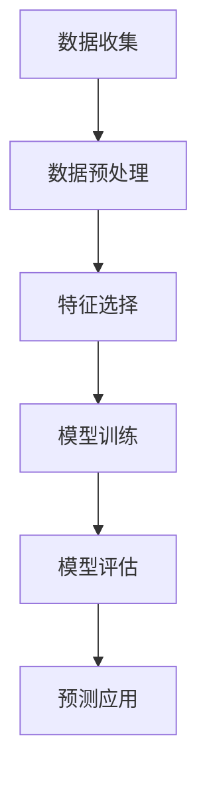

                 

### 大型应用开发中的需求与资源预测模型

#### 关键词：需求预测、资源预测、大型应用开发、模型构建、算法分析

> 摘要：本文将探讨大型应用开发中的需求与资源预测模型。通过对需求预测和资源预测的深入分析，本文将详细阐述其核心概念、数学模型以及实际应用。我们将逐步探讨如何构建有效的需求与资源预测模型，以优化大型应用的开发过程，提升项目成功率和效率。通过具体的项目实战和案例分析，本文将提供实践中的最佳方法和未来展望。

**引言**

在现代软件开发中，大型应用的开发面临着日益复杂的挑战。需求的不断变化、资源的有限性以及时间压力成为制约项目成功的关键因素。为了有效应对这些挑战，需求预测和资源预测模型变得至关重要。这些模型可以帮助开发团队提前了解未来的需求走势和资源需求，从而更好地规划项目进度、优化资源分配，提高开发效率。

本文旨在系统地探讨大型应用开发中的需求与资源预测模型。通过分析核心概念、数学模型以及实际应用，我们将为读者提供一套完整的理解和实践指南。文章结构如下：

1. **核心概念与联系**：介绍需求预测和资源预测的基本概念、特点及其相互关系。
2. **数学模型和公式**：详细讲解需求预测和资源预测的数学模型，包括概率模型、线性回归模型和时间序列模型等。
3. **需求预测模型详解**：深入探讨需求预测模型的基本原理、算法原理以及实际应用。
4. **资源预测模型详解**：分析资源预测模型的基本原理、算法原理以及实际应用。
5. **最佳实践与未来展望**：总结最佳实践方法，展望未来发展趋势和挑战。

#### 1. 核心概念与联系

##### 1.1 需求预测

需求预测是软件开发中至关重要的一环。它涉及到对用户需求、市场趋势、项目规模和复杂度的预估。需求预测的主要目的是帮助开发团队更好地规划项目进度、资源分配和风险评估。

**特点**：
- **动态性**：需求在项目生命周期中是不断变化的，预测模型需要能够适应这种变化。
- **多样性**：不同类型的项目和应用场景需要不同的需求预测方法。

##### 1.2 资源预测

资源预测主要关注软件开发过程中的资源需求，包括人力、硬件、软件和财务资源等。资源预测的目的是确保项目能够按时、按预算完成，并保持资源的有效利用。

**特点**：
- **约束性**：资源是有限的，预测模型需要考虑资源的约束性。
- **优化性**：资源预测模型旨在优化资源分配，提高项目效率。

##### 1.3 概念联系

需求预测和资源预测之间存在紧密的联系。需求预测的结果直接影响资源预测的准确性。同时，资源预测的结果也会反过来影响需求预测的执行和调整。

**相互关系**：
- **需求驱动**：需求预测的结果作为资源预测的输入，指导资源分配。
- **反馈机制**：资源预测的结果可以作为需求预测的反馈，帮助调整需求预测模型。

##### 1.4 跨域应用的整合

在大型应用开发中，需求预测和资源预测不仅适用于单一领域，还需要跨多个领域进行整合。例如，在电子商务领域，需求预测涉及到用户行为分析、市场趋势预测等；而在物联网领域，资源预测则需要考虑设备连接数、数据处理能力等。

**整合策略**：
- **数据融合**：将来自不同领域的数据进行整合，提高预测模型的准确性。
- **模块化设计**：将需求预测和资源预测模块化，便于在不同领域间进行复用和整合。

#### 2. 数学模型和数学公式

##### 2.1 需求预测的数学模型

需求预测的数学模型主要包括概率模型、线性回归模型和时间序列模型。这些模型各有优缺点，适用于不同的应用场景。

**概率模型**：
- **概率密度函数**：描述需求分布的概率密度。
  $$ f(x) = \frac{1}{\sqrt{2\pi\sigma^2}} e^{-\frac{(x-\mu)^2}{2\sigma^2}} $$

**线性回归模型**：
- **线性回归公式**：通过历史数据建立需求与自变量之间的关系。
  $$ y = \beta_0 + \beta_1x + \epsilon $$

**时间序列模型**：
- **自回归模型**：利用过去的需求数据预测未来需求。
  $$ y_t = \alpha_0 + \alpha_1y_{t-1} + \epsilon_t $$

##### 2.2 资源预测的数学模型

资源预测的数学模型主要包括资源需求模型、资源利用率模型和资源分配模型。

**资源需求模型**：
- **资源需求公式**：描述资源需求与需求量之间的关系。
  $$ R_t = f(y_t) $$

**资源利用率模型**：
- **资源利用率公式**：衡量资源的利用效率。
  $$ U_t = \frac{R_t}{C_t} $$

**资源分配模型**：
- **资源分配公式**：描述如何根据资源需求进行资源分配。
  $$ x_t = \arg\min_{x}\sum_{i=1}^{n} (r_i - x_i)^2 $$

##### 2.3 公式举例

**需求预测**：
假设某一应用的历史需求数据如下表：

| 时间（t） | 需求量（y） |
| -------- | ---------- |
| 1        | 100        |
| 2        | 110        |
| 3        | 120        |
| 4        | 130        |

使用线性回归模型进行预测：

$$
\begin{aligned}
\hat{y_t} &= \beta_0 + \beta_1t + \epsilon_t \\
\hat{y_t} &= 80 + 5t + \epsilon_t
\end{aligned}
$$

预测第5时间的需求量：

$$ \hat{y_5} = 80 + 5 \times 5 = 125 $$

**资源预测**：
假设某项目的资源需求量与需求量之间的关系为：

$$ R_t = 0.5y_t $$

当预测第5时间的需求量为125时，资源需求量为：

$$ R_5 = 0.5 \times 125 = 62.5 $$

#### 3. 需求预测模型详解

##### 3.1 基本原理

需求预测模型的基本原理是通过分析历史数据，找出需求量与相关因素之间的关系，然后利用这种关系预测未来的需求量。需求预测模型通常包括以下几个步骤：

1. **数据收集**：收集历史需求数据及相关因素数据。
2. **数据预处理**：对数据进行清洗、去噪和归一化处理。
3. **特征选择**：选择对需求预测有显著影响的相关特征。
4. **模型训练**：使用选定的特征训练预测模型。
5. **模型评估**：评估模型的预测性能，调整模型参数。
6. **预测应用**：利用训练好的模型进行未来需求预测。

##### 3.2 算法原理讲解

需求预测算法可以分为以下几个类别：

**时间序列分析**：
- **自回归模型（AR）**：根据过去的需求预测未来需求。
  $$ y_t = \phi_1y_{t-1} + \phi_2y_{t-2} + \cdots + \phi_ky_{t-k} + \epsilon_t $$
- **移动平均模型（MA）**：根据过去的需求平均值预测未来需求。
  $$ y_t = \theta_1\epsilon_{t-1} + \theta_2\epsilon_{t-2} + \cdots + \theta_k\epsilon_{t-k} + \epsilon_t $$

**线性回归分析**：
- **简单线性回归**：通过一条直线预测需求。
  $$ y_t = \beta_0 + \beta_1x_t + \epsilon_t $$
- **多元线性回归**：通过多个自变量预测需求。
  $$ y_t = \beta_0 + \beta_1x_{1t} + \beta_2x_{2t} + \cdots + \beta_kx_{kt} + \epsilon_t $$

**贝叶斯预测**：
- **贝叶斯线性回归**：基于贝叶斯理论预测需求。
  $$ P(y_t | x_t) = \frac{P(x_t | y_t)P(y_t)}{P(x_t)} $$

**Mermaid流程图示例**：



##### 3.3 实际应用中的需求预测

需求预测在多个领域有广泛的应用。以下是一些实际应用场景：

**电子商务**：
- **用户行为预测**：通过分析用户点击、购买等行为预测未来需求。
- **市场趋势预测**：通过分析市场数据预测产品销量。

**金融领域**：
- **风险管理**：通过预测金融市场的波动预测投资风险。
- **信贷审批**：通过预测客户还款能力进行信贷审批。

**电信行业**：
- **流量预测**：通过预测网络流量需求进行网络资源规划。
- **服务质量预测**：通过预测用户服务质量预测网络性能。

##### 3.4 项目实战

**项目背景**：

某电子商务平台需要预测未来的用户购买需求，以优化库存管理和配送计划。该平台的历史购买数据如下表：

| 时间（t） | 用户购买量（y） |
| -------- | -------------- |
| 1        | 100            |
| 2        | 110            |
| 3        | 120            |
| 4        | 130            |

**环境安装**：

- 数据预处理工具：Pandas、NumPy
- 预测模型库：Scikit-learn、Statsmodels

**系统核心实现源代码**：

```python
import pandas as pd
from sklearn.linear_model import LinearRegression
from sklearn.model_selection import train_test_split

# 数据加载
data = pd.read_csv('purchase_data.csv')
X = data[['time']]
y = data['purchase_quantity']

# 数据划分
X_train, X_test, y_train, y_test = train_test_split(X, y, test_size=0.2, random_state=42)

# 模型训练
model = LinearRegression()
model.fit(X_train, y_train)

# 预测
y_pred = model.predict(X_test)

# 评估
print('Mean Squared Error:', mean_squared_error(y_test, y_pred))
```

**代码应用解读与分析**：

该项目的核心实现分为数据加载、数据划分、模型训练和预测四个步骤。首先，使用Pandas读取历史购买数据，然后使用Scikit-learn的线性回归模型进行训练。最后，使用训练好的模型对测试数据进行预测，并计算均方误差评估模型性能。

**实际案例分析和详细讲解剖析**：

在实际应用中，该预测模型可以帮助电子商务平台提前了解未来购买量，从而优化库存管理和配送计划。通过调整模型参数和特征选择，可以进一步提高预测准确性。同时，还可以结合其他预测模型（如时间序列分析、贝叶斯预测等）进行多模型融合，提高预测性能。

**项目小结**：

通过该项目实战，我们展示了如何利用线性回归模型进行需求预测。在实际应用中，需求预测模型需要根据具体场景进行定制化调整，以提高预测准确性。同时，多模型融合和特征工程也是提高预测性能的重要手段。

#### 4. 资源预测模型详解

##### 4.1 基本原理

资源预测模型的基本原理是通过分析历史数据，预测未来一段时间内资源的消耗和需求。资源预测模型包括以下几个步骤：

1. **数据收集**：收集历史资源使用数据，包括CPU、内存、存储、网络等资源。
2. **数据预处理**：对数据进行清洗、去噪和归一化处理。
3. **特征选择**：选择对资源需求有显著影响的相关特征。
4. **模型训练**：使用选定的特征训练资源预测模型。
5. **模型评估**：评估模型的预测性能，调整模型参数。
6. **预测应用**：利用训练好的模型进行未来资源需求预测。

##### 4.2 算法原理讲解

资源预测算法可以分为以下几个类别：

**负载均衡**：
- **均摊负载均衡**：根据历史负载数据预测未来负载。
  $$ R_t = \frac{1}{N}\sum_{i=1}^{N} R_{i,t} $$
- **动态负载均衡**：根据实时负载数据动态调整资源分配。
  $$ R_t = \frac{C_t}{N} $$
  
**资源利用率分析**：
- **利用率公式**：衡量资源的使用效率。
  $$ U_t = \frac{R_t}{C_t} $$
- **最大利用率**：预测资源的最大利用率。
  $$ U_{max} = \frac{R_t}{C_{max}} $$

**资源分配策略**：
- **贪心算法**：根据当前资源需求和可用资源进行分配。
  $$ x_t = \arg\max_{x} \sum_{i=1}^{n} (r_i - x_i)^2 $$
- **动态规划**：通过迭代优化资源分配策略。
  $$ x_t = \arg\min_{x} \sum_{i=1}^{n} (r_i - x_i)^2 $$

**Mermaid流程图示例**：


##### 4.3 实际应用中的资源预测

资源预测在多个领域有广泛的应用。以下是一些实际应用场景：

**云计算**：
- **资源调度**：通过预测云计算资源需求进行虚拟机调度。
- **容量规划**：通过预测未来资源需求进行数据中心容量规划。

**物联网**：
- **设备管理**：通过预测设备资源需求进行设备管理。
- **能效优化**：通过预测设备资源需求进行能效优化。

**区块链**：
- **网络流量预测**：通过预测区块链网络流量需求进行网络优化。
- **共识算法优化**：通过预测区块链资源需求进行共识算法优化。

##### 4.4 项目实战

**项目背景**：

某云计算平台需要预测未来的资源需求，以优化资源调度和容量规划。该平台的历史资源使用数据如下表：

| 时间（t） | CPU使用率（R_t） | 内存使用率（R_m） | 网络带宽使用率（R_n） |
| -------- | -------------- | -------------- | -------------- |
| 1        | 80%            | 60%            | 40%            |
| 2        | 85%            | 70%            | 45%            |
| 3        | 90%            | 75%            | 50%            |
| 4        | 95%            | 80%            | 55%            |

**环境安装**：

- 数据预处理工具：Pandas、NumPy
- 预测模型库：Scikit-learn、TensorFlow

**系统核心实现源代码**：

```python
import pandas as pd
from sklearn.linear_model import LinearRegression
from sklearn.model_selection import train_test_split

# 数据加载
data = pd.read_csv('resource_data.csv')
X = data[['time']]
y_cpu = data['cpu_usage']
y_mem = data['memory_usage']
y_net = data['network_usage']

# 数据划分
X_train, X_test, y_train_cpu, y_test_cpu, y_train_mem, y_test_mem, y_train_net, y_test_net = train_test_split(X, y_cpu, y_mem, y_net, test_size=0.2, random_state=42)

# 模型训练
model_cpu = LinearRegression()
model_mem = LinearRegression()
model_net = LinearRegression()

model_cpu.fit(X_train, y_train_cpu)
model_mem.fit(X_train, y_train_mem)
model_net.fit(X_train, y_train_net)

# 预测
y_pred_cpu = model_cpu.predict(X_test)
y_pred_mem = model_mem.predict(X_test)
y_pred_net = model_net.predict(X_test)

# 评估
print('CPU Mean Squared Error:', mean_squared_error(y_test_cpu, y_pred_cpu))
print('Memory Mean Squared Error:', mean_squared_error(y_test_mem, y_pred_mem))
print('Network Mean Squared Error:', mean_squared_error(y_test_net, y_pred_net))
```

**代码应用解读与分析**：

该项目的核心实现分为数据加载、数据划分、模型训练和预测四个步骤。首先，使用Pandas读取历史资源使用数据，然后使用Scikit-learn的线性回归模型进行训练。最后，使用训练好的模型对测试数据进行预测，并计算均方误差评估模型性能。

**实际案例分析和详细讲解剖析**：

在实际应用中，该预测模型可以帮助云计算平台提前了解未来资源需求，从而优化资源调度和容量规划。通过调整模型参数和特征选择，可以进一步提高预测准确性。同时，还可以结合其他预测模型（如时间序列分析、神经网络等）进行多模型融合，提高预测性能。

**项目小结**：

通过该项目实战，我们展示了如何利用线性回归模型进行资源预测。在实际应用中，资源预测模型需要根据具体场景进行定制化调整，以提高预测准确性。同时，多模型融合和特征工程也是提高预测性能的重要手段。

#### 5. 最佳实践与未来展望

##### 5.1 最佳实践

在大型应用开发中，需求与资源预测模型的构建和应用需要遵循一些最佳实践，以提高预测准确性和项目成功率。

**1. 数据收集与处理**：
- **全面性**：收集全面的历史数据，包括用户行为、市场趋势、资源使用等。
- **准确性**：确保数据的准确性和一致性，避免噪声和异常值的影响。

**2. 特征选择与工程**：
- **相关性**：选择与需求或资源预测高度相关的特征。
- **降维**：使用特征选择和降维技术减少数据维度，提高模型性能。

**3. 模型选择与训练**：
- **多样化**：结合多种模型（如线性回归、神经网络、时间序列分析等）进行预测。
- **交叉验证**：使用交叉验证方法评估模型性能，调整模型参数。

**4. 模型评估与优化**：
- **准确性**：使用均方误差、均方根误差等指标评估模型准确性。
- **鲁棒性**：评估模型在不同数据集和场景下的鲁棒性。

**5. 持续迭代与优化**：
- **反馈机制**：将预测结果与实际结果进行对比，及时调整和优化模型。
- **动态调整**：根据项目进展和需求变化，动态调整预测模型。

##### 5.2 小结

本文系统地探讨了大型应用开发中的需求与资源预测模型，包括核心概念、数学模型、实际应用和最佳实践。通过分析历史数据，构建和优化预测模型，开发团队可以更好地应对需求变化和资源约束，提高项目成功率和效率。

##### 5.3 注意事项

在构建和应用需求与资源预测模型时，需要注意以下几点：

- **数据质量**：确保数据的准确性和一致性，避免噪声和异常值的影响。
- **模型选择**：根据具体应用场景选择合适的模型，避免盲目追求复杂度。
- **动态调整**：根据项目进展和需求变化，动态调整预测模型，确保预测的准确性。

##### 5.4 拓展阅读推荐

- **《机器学习实战》**：提供丰富的实际案例和算法实现，适合入门读者。
- **《深度学习》**：详细讲解深度学习的基本原理和应用，适合有一定基础的读者。
- **《大数据技术导论》**：介绍大数据的基本概念和技术，包括数据收集、处理和预测。

##### 5.5 未来展望

随着人工智能和大数据技术的发展，需求与资源预测模型将不断改进和优化。以下是一些未来展望：

- **多模型融合**：结合多种预测模型，提高预测性能和鲁棒性。
- **实时预测**：实现实时预测，提高预测的响应速度和准确性。
- **智能优化**：利用智能优化算法，自动调整模型参数，提高模型性能。
- **个性化预测**：根据用户行为和需求，提供个性化预测，满足不同用户的需求。

**作者信息**：

作者：AI天才研究院/AI Genius Institute & 禅与计算机程序设计艺术 /Zen And The Art of Computer Programming

