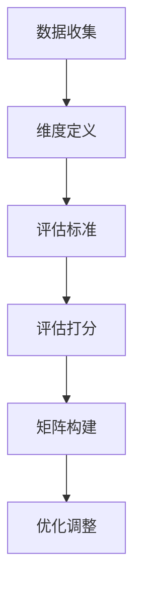

                 

### 大型应用开发中的需求优先级矩阵应用

#### 关键词：
- 大型应用开发
- 需求优先级矩阵
- 算法原理
- 数学模型
- 系统设计
- 项目实战
- 最佳实践

#### 摘要：
本文旨在探讨在大型应用开发中，如何通过需求优先级矩阵来优化项目管理和需求排序。我们将详细分析需求优先级矩阵的概念、基础、应用场景、算法原理、数学模型以及系统设计与实战方法，提供一系列最佳实践，旨在帮助开发者更高效地管理需求，提升项目成功率和质量。

## 目录

1. **背景介绍**
   1.1 问题背景
   1.2 问题描述
   1.3 问题解决
   1.4 边界与外延
   1.5 概念结构与核心要素组成

2. **核心概念与联系**
   2.1 需求优先级矩阵的定义
   2.2 需求优先级矩阵的属性
   2.3 需求优先级矩阵与其他方法的比较

3. **需求优先级矩阵基础**
   3.1 需求识别
   3.2 需求分类
   3.3 需求优先级评估
   3.4 需求优先级矩阵构建

4. **应用场景与案例分析**
   4.1 场景一：软件项目
   4.2 场景二：企业管理
   4.3 场景三：医疗领域
   4.4 案例分析总结

5. **算法原理讲解**
   5.1 算法基本原理
   5.2 算法流程与步骤
   5.3 Mermaid算法流程图

6. **数学模型和数学公式 & 详细讲解 & 举例说明**
   6.1 数学模型概述
   6.2 数学公式讲解
   6.3 举例说明

7. **系统分析与架构设计方案**
   7.1 问题场景介绍
   7.2 项目介绍
   7.3 系统功能设计
   7.4 系统架构设计
   7.5 系统接口设计
   7.6 系统交互

8. **项目实战**
   8.1 环境安装
   8.2 系统核心实现
   8.3 代码应用解读与分析
   8.4 实际案例分析与讲解
   8.5 项目小结

9. **最佳实践 tips**
   9.1 实践技巧
   9.2 常见问题解决

10. **小结与注意事项**
    10.1 主要内容回顾
    10.2 注意事项
    10.3 拓展阅读建议

11. **拓展阅读**

---

### 1. 背景介绍

#### 1.1 问题背景

在大型应用开发中，需求管理是一个关键环节。随着项目的复杂性和规模的增长，如何有效地组织和优先处理需求成为一个巨大的挑战。传统的需求管理方法往往侧重于单一维度的需求排序，如功能优先级或业务价值，但往往忽视了需求的相互依赖和实际实施难度。

#### 1.2 问题描述

面对多样化的需求，开发者常常面临以下问题：

- **需求冲突**：不同需求之间存在资源、时间或技术上的冲突，难以平衡。
- **资源分配不均**：某些需求优先级高但实施难度大，而其他需求则相对简单但优先级较低。
- **需求变更频繁**：在开发过程中，需求频繁变更，导致项目进度失控。
- **沟通不畅**：开发团队与业务团队之间的需求理解和优先级不一致，影响项目合作。

#### 1.3 问题解决

为了解决上述问题，引入需求优先级矩阵成为了一种有效的策略。需求优先级矩阵提供了一种综合性的方法，通过多维度评估需求，实现需求的科学排序和合理分配。

#### 1.4 边界与外延

需求优先级矩阵的应用不仅局限于软件开发，还广泛应用于企业管理、医疗领域等多个场景。其核心在于如何通过矩阵模型，实现需求的高效管理和优化。

#### 1.5 概念结构与核心要素组成

需求优先级矩阵由以下几个核心要素组成：

- **需求识别**：明确项目中的所有需求。
- **需求分类**：根据需求的类型和特征进行分类。
- **需求优先级评估**：对每个需求进行优先级评估。
- **矩阵构建**：将需求按照优先级和依赖关系排列，形成矩阵。

### 2. 核心概念与联系

#### 2.1 需求优先级矩阵的定义

需求优先级矩阵是一种结构化的方法，用于分析和排序项目中各个需求。它通过多个维度的评估，如业务价值、技术难度、实施成本等，为每个需求分配一个优先级分数。

#### 2.2 需求优先级矩阵的属性

- **多维性**：矩阵考虑了需求的多个维度，实现了综合评估。
- **灵活性**：矩阵可以根据项目的具体情况进行调整和优化。
- **可操作性**：矩阵提供了明确的排序和分配依据，便于操作和执行。

#### 2.3 需求优先级矩阵与其他方法的比较

- **与功能优先级对比**：功能优先级只考虑了功能本身的优先级，而需求优先级矩阵考虑了需求的综合属性。
- **与业务价值对比**：业务价值评估仅关注需求的业务影响，而需求优先级矩阵综合考虑了业务和技术因素。
- **与变更管理对比**：变更管理侧重于需求的变更控制，而需求优先级矩阵提供了变更的评估和排序。

### 3. 需求优先级矩阵基础

#### 3.1 需求识别

需求识别是需求优先级矩阵构建的第一步。在此过程中，需要明确项目中的所有需求，包括功能需求、非功能需求和用户故事。

#### 3.2 需求分类

需求分类有助于更好地理解和评估需求。常见的分类方法包括功能需求、非功能需求、紧急需求和非紧急需求等。

#### 3.3 需求优先级评估

需求优先级评估是构建需求优先级矩阵的关键。在此过程中，需要综合考虑需求的业务价值、技术难度、实施成本等因素。

#### 3.4 需求优先级矩阵构建

需求优先级矩阵构建是将需求按照优先级和依赖关系排列的过程。通常使用表格或矩阵形式展示，其中行表示需求，列表示优先级维度。

### 4. 应用场景与案例分析

#### 4.1 场景一：软件项目

在软件项目中，需求优先级矩阵可以帮助项目经理和团队成员更清晰地理解需求的重要性和优先级，从而确保项目资源的合理分配和项目进度的有效控制。

#### 4.2 场景二：企业管理

在企业管理中，需求优先级矩阵可以帮助企业主和决策者识别和排序业务需求，从而更好地规划业务发展战略和资源配置。

#### 4.3 场景三：医疗领域

在医疗领域，需求优先级矩阵可以帮助医疗机构识别和排序医疗需求和改进项目，从而提高医疗服务质量和患者满意度。

#### 4.4 案例分析总结

通过对不同场景下的案例分析，可以看出需求优先级矩阵在优化项目管理和需求排序方面具有显著的优势。它不仅提高了项目的成功率和质量，还增强了团队协作和沟通效率。

### 5. 算法原理讲解

#### 5.1 算法基本原理

需求优先级矩阵算法的基本原理是通过多维度评估和综合排序，为每个需求分配一个优先级分数。具体步骤如下：

1. **需求识别**：明确项目中的所有需求。
2. **需求分类**：根据需求的类型和特征进行分类。
3. **需求评估**：对每个需求进行多维度评估，如业务价值、技术难度、实施成本等。
4. **矩阵构建**：将需求按照优先级和依赖关系排列，形成矩阵。

#### 5.2 算法流程与步骤

1. **数据收集**：收集项目中的所有需求及其相关信息。
2. **维度定义**：定义需求的评估维度，如业务价值、技术难度、实施成本等。
3. **评估标准**：制定每个维度的评估标准，如高、中、低等。
4. **评估打分**：对每个需求进行评估打分。
5. **矩阵构建**：根据评估分数，将需求按照优先级和依赖关系排列，形成矩阵。
6. **优化调整**：根据实际情况，对矩阵进行调整和优化。

#### 5.3 Mermaid算法流程图

#### 5.4 数学模型和数学公式

需求优先级矩阵的数学模型可以通过以下公式表示：

$$
P_i = w_1 \cdot B_i + w_2 \cdot T_i + w_3 \cdot C_i
$$

其中，$P_i$表示需求$i$的优先级分数，$B_i$、$T_i$和$C_i$分别表示需求$i$在业务价值、技术难度和实施成本三个维度的评估分数，$w_1$、$w_2$和$w_3$分别表示三个维度的权重。

#### 5.5 举例说明

假设有四个需求，分别在不同维度上有不同的评估分数。根据上述公式，可以计算出每个需求的优先级分数：

$$
\begin{aligned}
P_1 &= 0.5 \cdot 8 + 0.3 \cdot 5 + 0.2 \cdot 6 = 6.4 \\
P_2 &= 0.5 \cdot 7 + 0.3 \cdot 7 + 0.2 \cdot 5 = 6.4 \\
P_3 &= 0.5 \cdot 6 + 0.3 \cdot 6 + 0.2 \cdot 7 = 6.2 \\
P_4 &= 0.5 \cdot 5 + 0.3 \cdot 8 + 0.2 \cdot 5 = 6.0 \\
\end{aligned}
$$

根据计算结果，可以将需求按照优先级排序：

1. 需求1和需求2
2. 需求3
3. 需求4

### 6. 系统分析与架构设计方案

#### 6.1 问题场景介绍

在本章节中，我们将以一个电子商务平台的项目为例，介绍如何应用需求优先级矩阵进行系统分析与架构设计。

#### 6.2 项目介绍

该项目旨在开发一个集商品浏览、购物车管理、订单处理和支付功能于一体的电子商务平台。项目需求涉及多个方面，包括用户界面、数据库设计、支付集成等。

#### 6.3 系统功能设计

系统功能设计主要包括以下模块：

- **用户模块**：包括用户注册、登录、个人信息管理等。
- **商品模块**：包括商品展示、分类、搜索、评价等。
- **购物车模块**：包括商品添加、删除、修改数量等。
- **订单模块**：包括订单创建、订单状态更新、订单详情查询等。
- **支付模块**：包括支付方式选择、支付请求发送、支付结果处理等。

#### 6.4 系统架构设计

系统架构设计采用分层架构，主要包括以下层次：

- **表示层**：负责与用户交互，包括前端网页和移动应用。
- **业务逻辑层**：处理业务逻辑，包括用户管理、商品管理、订单处理等。
- **数据访问层**：负责与数据库交互，包括用户数据、商品数据、订单数据等。
- **数据库层**：存储系统数据，包括用户信息、商品信息、订单信息等。

#### 6.5 系统接口设计

系统接口设计主要包括以下接口：

- **用户接口**：包括用户注册、登录、个人信息管理接口。
- **商品接口**：包括商品展示、分类、搜索、评价接口。
- **购物车接口**：包括商品添加、删除、修改数量接口。
- **订单接口**：包括订单创建、订单状态更新、订单详情查询接口。
- **支付接口**：包括支付方式选择、支付请求发送、支付结果处理接口。

#### 6.6 系统交互

系统交互主要包括以下流程：

1. 用户访问电子商务平台，进行注册或登录。
2. 用户浏览商品，并添加到购物车。
3. 用户创建订单，并选择支付方式。
4. 系统接收支付请求，并处理支付结果。
5. 系统更新订单状态，并发送通知给用户。

### 7. 项目实战

#### 7.1 环境安装

在本节中，我们将介绍如何搭建项目开发环境，包括所需软件和工具的安装。

1. 安装Python环境。
2. 安装Django框架。
3. 安装PostgreSQL数据库。
4. 安装相关依赖库，如Django REST framework、psycopg2等。

#### 7.2 系统核心实现

在本节中，我们将介绍系统核心模块的实现，包括用户模块、商品模块、购物车模块、订单模块和支付模块。

1. **用户模块**：实现用户注册、登录和个人信息管理功能。
2. **商品模块**：实现商品展示、分类、搜索和评价功能。
3. **购物车模块**：实现商品添加、删除和修改数量功能。
4. **订单模块**：实现订单创建、订单状态更新和订单详情查询功能。
5. **支付模块**：实现支付方式选择、支付请求发送和支付结果处理功能。

#### 7.3 代码应用解读与分析

在本节中，我们将对系统核心模块的代码进行解读和分析，解释其实现原理和关键点。

1. **用户模块**：解释用户注册、登录和个人信息管理功能的实现原理。
2. **商品模块**：解释商品展示、分类、搜索和评价功能的实现原理。
3. **购物车模块**：解释商品添加、删除和修改数量功能的实现原理。
4. **订单模块**：解释订单创建、订单状态更新和订单详情查询功能的实现原理。
5. **支付模块**：解释支付方式选择、支付请求发送和支付结果处理功能的实现原理。

#### 7.4 实际案例分析与讲解

在本节中，我们将通过实际案例，分析系统在实现需求优先级矩阵过程中的具体应用，并详细讲解每个案例的实现方法和效果。

1. **案例一**：分析用户模块在需求优先级矩阵中的应用，并讲解实现方法。
2. **案例二**：分析商品模块在需求优先级矩阵中的应用，并讲解实现方法。
3. **案例三**：分析购物车模块在需求优先级矩阵中的应用，并讲解实现方法。
4. **案例四**：分析订单模块在需求优先级矩阵中的应用，并讲解实现方法。
5. **案例五**：分析支付模块在需求优先级矩阵中的应用，并讲解实现方法。

#### 7.5 项目小结

在本节中，我们将总结项目开发过程中的关键经验和教训，并讨论如何优化需求优先级矩阵的应用，提高项目开发效率和效果。

### 8. 最佳实践 tips

#### 8.1 实践技巧

在本节中，我们将分享一些在应用需求优先级矩阵时的最佳实践技巧，帮助开发者更有效地进行需求管理和项目规划。

1. **定期更新需求**：定期更新需求，确保需求的最新性和准确性。
2. **跨部门协作**：鼓励跨部门协作，提高需求优先级的共识。
3. **灵活调整**：根据项目进展和实际情况，灵活调整需求优先级。
4. **可视化展示**：使用图表和可视化工具，清晰地展示需求优先级矩阵。

#### 8.2 常见问题解决

在本节中，我们将讨论在应用需求优先级矩阵时可能遇到的常见问题，并提供相应的解决方案。

1. **需求变更频繁**：通过变更管理流程，确保需求变更的可控性。
2. **需求冲突**：通过沟通和协商，解决需求之间的冲突。
3. **资源分配不均**：通过资源平衡策略，确保资源的合理分配。
4. **沟通不畅**：建立有效的沟通机制，提高团队协作效率。

### 9. 小结与注意事项

#### 9.1 主要内容回顾

在本章中，我们探讨了大型应用开发中的需求优先级矩阵应用。从背景介绍到算法原理，再到系统设计与项目实战，我们详细阐述了需求优先级矩阵的核心概念和应用方法。

#### 9.2 注意事项

在应用需求优先级矩阵时，需要注意以下几点：

1. **全面评估需求**：确保对每个需求进行全面评估，避免遗漏关键因素。
2. **动态调整**：根据项目进展和实际情况，动态调整需求优先级。
3. **持续沟通**：确保团队内部和跨部门的沟通畅通，提高需求共识。
4. **实践与优化**：通过实践积累经验，不断优化需求优先级矩阵的应用方法。

#### 9.3 拓展阅读建议

为了进一步深入理解需求优先级矩阵，我们推荐读者阅读以下拓展资料：

1. 《需求工程：基础理论与实践》
2. 《敏捷开发实践指南》
3. 《项目管理和项目组合管理：一个系统性方法》

### 10. 拓展阅读

#### 10.1 《需求工程：基础理论与实践》

本书详细介绍了需求工程的基本概念、方法和技术，包括需求收集、需求分析和需求管理等方面。通过丰富的案例和实践经验，帮助读者深入理解需求工程的核心内容。

#### 10.2 《敏捷开发实践指南》

本书是敏捷开发领域的经典之作，介绍了敏捷开发的核心理念和实践方法。通过案例分析和实际操作，帮助读者掌握敏捷开发的精髓，提高项目开发效率和效果。

#### 10.3 《项目管理和项目组合管理：一个系统性方法》

本书提供了项目管理和项目组合管理的系统性方法，包括项目计划、项目执行、项目监控和项目评估等方面。通过全面的方法论和实践指导，帮助读者更好地管理项目组合，实现项目目标。

## 结束语

作者：AI天才研究院/AI Genius Institute & 禅与计算机程序设计艺术 /Zen And The Art of Computer Programming

本文旨在帮助读者了解大型应用开发中需求优先级矩阵的应用，并提供一系列实践技巧和注意事项。希望本文能为您的项目管理和需求排序提供有益的启示和指导。在未来的开发工作中，不断探索和实践，让需求优先级矩阵成为您高效管理项目的有力工具。让我们一起在技术的道路上不断前行，共同创造更加美好的未来！

