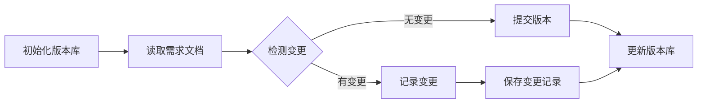
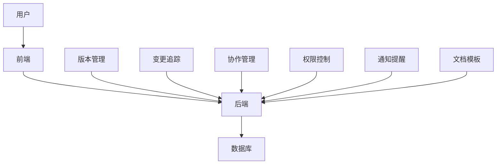

                 

### 大型应用开发中的需求文档版本控制策略

关键词：需求文档、版本控制、大型应用、开发流程、协作管理、变更管理、质量保障

摘要：在大型应用开发过程中，需求文档的版本控制策略至关重要。本文旨在深入探讨需求文档版本控制策略的重要性，背景介绍，核心概念与联系，算法原理讲解，数学模型和公式详细讲解，系统分析与架构设计方案，项目实战，以及最佳实践和未来展望。

### 一、背景介绍

#### 1.1 需求文档版本控制的重要性

在大型应用开发中，需求文档是项目开发的核心资料，它不仅明确了项目功能需求，还规定了开发过程中的各个阶段和质量标准。因此，版本控制策略在需求文档的管理中扮演着至关重要的角色。

**问题背景**：随着项目的规模不断扩大，需求的变更频繁，传统的手工作业方式在处理需求变更时往往效率低下，且容易出现遗漏和冲突。因此，需要一种系统化的版本控制策略来保证需求文档的准确性和一致性。

**问题描述**：如何在大型应用开发过程中，高效地管理需求文档的版本，确保所有相关人员能够及时获取到最新的需求信息，并在变更过程中保持文档的一致性。

**问题解决**：引入版本控制工具和策略，如Git等，以及制定一套完善的版本控制流程，以实现需求文档的高效管理和协作。

**边界与外延**：版本控制策略不仅适用于需求文档本身，还应包括相关的变更记录、测试文档等辅助资料。

#### 1.2 需求文档版本控制的历史背景

版本控制的历史可以追溯到软件开发初期。最早期的版本控制是通过手工方式进行的，即通过备份文件来保存代码的变更。随着软件规模的扩大，手工方式逐渐变得不可行。

20世纪80年代，CVS（Concurrent Versions System）成为第一个广泛使用的版本控制系统。CVS通过记录文件的变更历史和提供分支功能，极大地提高了协作开发的效率。

21世纪初，分布式版本控制系统如Git的出现，进一步推动了版本控制技术的发展。Git通过分布式存储和灵活的分支管理，使得开发者可以在本地进行独立开发，并在需要时进行合并和提交。

#### 1.3 需求文档版本控制的核心问题

**变更管理**：如何在需求变更时快速响应，并确保变更被正确地记录和实施。

**协作管理**：如何协调不同团队和人员之间的需求协作，确保各方对需求的理解一致。

**质量保障**：如何通过版本控制来确保需求文档的质量，避免遗漏和错误。

#### 1.4 需求文档版本控制的基本概念与要素

**需求文档**：记录项目需求的文档，包括功能需求、非功能需求、用户故事等。

**版本**：需求文档的不同版本，通常以数字或字母标识，如V1.0、V1.1等。

**变更**：对需求文档的修改，包括新增、删除、修改等。

**变更记录**：对需求变更的详细记录，包括变更原因、变更内容、变更人、变更时间等。

**版本控制工具**：用于管理和控制版本的工具，如Git、SVN等。

**版本控制流程**：一套规范化的流程，用于指导如何进行版本控制。

#### 1.5 本章小结

本章节介绍了需求文档版本控制策略的背景、历史背景、核心问题和基本概念。下一章节将深入探讨需求文档版本控制的核心概念和联系。

------------------------------------------------------------------------

### 二、核心概念与联系

#### 2.1 需求文档的定义

需求文档是对项目需求的正式记录，它定义了项目需要实现的功能、性能和约束条件。需求文档通常包括以下内容：

- **功能需求**：项目需要实现的具体功能。
- **非功能需求**：项目的性能、可靠性、安全性等非功能性要求。
- **用户故事**：从用户角度描述的需求，通常以用户与系统的交互流程为线索。
- **场景描述**：描述用户使用系统的具体场景。
- **验收标准**：定义项目成功的标准和条件。

#### 2.2 版本控制的定义

版本控制是一种用于管理文件和文档更改的技术，它能够跟踪文件的版本历史，允许用户查看、恢复和合并文件的不同版本。版本控制的关键特征包括：

- **版本历史**：记录文件的每次变更历史，包括变更人、变更时间和变更内容。
- **分支管理**：允许用户创建独立的分支，进行独立开发，然后合并回主分支。
- **冲突解决**：在多个用户修改同一文件时，提供机制来解决冲突。
- **变更记录**：记录每次变更的详细信息，如变更人、变更时间和变更内容。

#### 2.3 版本控制的属性特征对比

版本控制系统的属性特征对版本控制的效果具有重要影响。以下是比较常见的几种版本控制系统属性特征的对比：

- **集中式版本控制系统（CVS, SVN）**：  
  - **优点**：易于管理，支持跨平台操作。  
  - **缺点**：依赖中央服务器，性能受限于网络连接。

- **分布式版本控制系统（Git）**：  
  - **优点**：分布式存储，支持快速分支和合并，适合大型项目。  
  - **缺点**：配置和管理相对复杂。

#### 2.4 需求文档版本控制ER实体关系图

在需求文档版本控制中，常见的实体关系包括：

- **需求文档**：记录项目需求的实体。
- **版本**：需求文档的不同版本。
- **变更记录**：记录需求变更的详细信息。
- **用户**：参与需求文档修改和审核的人员。

下面是需求文档版本控制的ER实体关系图的Mermaid表示：

```mermaid
erDiagram
    class 需求文档 {
        --|> Version "版本"
        --|> ChangeLog "变更记录"
    }
    class Version {
        --|> User "用户"
    }
    class ChangeLog {
        --|> User "用户"
    }
```

#### 2.5 本章小结

本章节介绍了需求文档的定义、版本控制的定义以及版本控制的属性特征对比，并给出了需求文档版本控制的ER实体关系图。下一章节将深入讲解需求文档版本控制的算法原理。

------------------------------------------------------------------------

### 三、算法原理讲解

#### 3.1 算法概述

在需求文档版本控制中，算法主要用于自动化地管理需求文档的版本和变更。本文将介绍一个基本的版本控制算法，用于实现需求文档的版本管理和变更追踪。

#### 3.2 算法流程图

使用Mermaid绘制算法流程图如下：



#### 3.3 Python源代码实现

以下是该算法的Python源代码实现：

```python
import os
import json
import time

class VersionControl:
    def __init__(self, repo_path):
        self.repo_path = repo_path
        self.version_path = os.path.join(repo_path, 'versions')
        self.changelog_path = os.path.join(repo_path, 'changelog.json')

    def read_document(self):
        with open(self.repo_path, 'r') as f:
            return json.load(f)

    def detect_change(self, doc):
        # 这里可以添加更复杂的变更检测逻辑
        return doc['content'] != doc['last_saved_content']

    def record_change(self, doc, user):
        changelog = {
            'version': doc['version'],
            'user': user,
            'time': time.strftime('%Y-%m-%d %H:%M:%S'),
            'content': doc['content']
        }
        with open(self.changelog_path, 'w') as f:
            json.dump([changelog], f)

    def commit_version(self, doc):
        doc['last_saved_content'] = doc['content']
        doc['version'] += 1
        with open(self.repo_path, 'w') as f:
            json.dump(doc, f)

    def update_repo(self, doc):
        version_path = os.path.join(self.version_path, f'version_{doc["version"]}.json')
        with open(version_path, 'w') as f:
            json.dump(doc, f)

def main():
    repo_path = 'path/to/repo'
    vc = VersionControl(repo_path)
    doc = vc.read_document()
    
    if vc.detect_change(doc):
        vc.record_change(doc, 'Alice')
    vc.commit_version(doc)
    vc.update_repo(doc)

if __name__ == '__main__':
    main()
```

#### 3.4 数学模型和公式

在需求文档版本控制中，可以使用以下数学模型来描述版本和变更：

- **版本号**：通常采用递增的方式表示，如V1.0、V1.1等。
- **变更记录**：可以使用一个三元组（版本号，用户名，变更时间）来表示。

以下是数学模型的公式：

$$
版本号 = 版本号_{当前} + 1
$$

$$
变更记录 = (版本号, 用户名, 时间)
$$

#### 3.5 算法原理详细讲解

该算法的基本原理是通过对需求文档的读取、变更检测、记录变更、提交版本和更新版本库等步骤，实现需求文档的版本控制和变更追踪。

- **初始化版本库**：创建版本库目录，并初始化版本和变更记录。
- **读取需求文档**：从版本库中读取当前的需求文档。
- **检测变更**：比较当前需求文档的内容和上次保存的内容，判断是否有变更。
- **记录变更**：如果有变更，记录变更的用户、版本号和变更时间。
- **提交版本**：更新需求文档的版本号，保存变更后的文档。
- **更新版本库**：将变更后的文档保存到版本库中，以便后续版本管理。

#### 3.6 算法举例说明

假设有一个需求文档，初始版本为V1.0，内容为“实现用户登录功能”。Alice用户对文档进行了修改，新增了“实现用户注册功能”，并提交了变更。

1. 读取需求文档，版本为V1.0，内容为“实现用户登录功能”。
2. 检测到变更，记录变更的用户为Alice，版本号为V1.1，时间为2023-03-01 10:30:00。
3. 提交版本，需求文档版本更新为V1.1，内容为“实现用户登录和注册功能”。
4. 更新版本库，将V1.1版本的需求文档保存到版本库中。

通过上述步骤，实现了需求文档的版本控制和变更追踪。

#### 3.7 本章小结

本章节介绍了需求文档版本控制的算法原理，包括算法流程图、Python源代码实现、数学模型和公式以及算法原理详细讲解和举例说明。下一章节将深入探讨需求文档版本控制的系统分析与架构设计方案。

------------------------------------------------------------------------

### 四、系统分析与架构设计方案

#### 4.1 问题场景介绍

在大型应用开发中，需求文档的版本控制问题尤为突出。随着项目规模的扩大，需求的复杂度和变更频率也在不断增加。传统的手动管理方式已无法满足高效、准确的需求文档管理需求。因此，需要一个系统化的需求文档版本控制系统来确保需求文档的版本一致性、变更追踪和协作管理。

#### 4.2 系统功能设计

需求文档版本控制系统应具备以下功能：

- **版本管理**：支持多版本需求文档的创建、保存和查询。
- **变更追踪**：记录每次变更的用户、时间和变更内容，提供变更历史查询。
- **协作管理**：支持多人协同编辑和管理需求文档。
- **权限控制**：根据用户角色和权限设置，控制需求文档的访问和操作。
- **通知提醒**：在需求文档发生变更时，及时通知相关人员。
- **文档模板**：提供标准的文档模板，方便用户创建需求文档。

#### 4.3 系统架构设计

需求文档版本控制系统的架构设计如下：

- **前端**：采用Vue.js框架实现，负责用户界面展示和交互。
- **后端**：采用Spring Boot框架实现，负责业务逻辑处理和数据存储。
- **数据库**：采用MySQL数据库存储需求文档、版本信息和变更记录。

系统架构图如下：



#### 4.4 系统接口设计

需求文档版本控制系统的接口设计如下：

- **创建需求文档**：创建新的需求文档，返回文档ID。
- **查询需求文档**：根据文档ID查询需求文档详细信息。
- **更新需求文档**：根据文档ID更新需求文档内容。
- **删除需求文档**：根据文档ID删除需求文档。
- **查询版本历史**：根据文档ID查询需求文档的版本历史。
- **提交变更**：提交需求文档变更，记录变更信息。
- **查询变更历史**：根据文档ID和版本号查询变更历史。

#### 4.5 系统交互

系统交互设计如下：

1. **用户登录**：用户通过前端界面输入用户名和密码，前端将信息发送至后端进行验证，后端验证成功后返回用户权限信息。
2. **创建需求文档**：用户在前端创建需求文档，前端将数据发送至后端，后端创建需求文档并返回文档ID。
3. **查询需求文档**：用户通过文档ID查询需求文档详细信息，前端将请求发送至后端，后端返回需求文档信息。
4. **更新需求文档**：用户对需求文档进行修改，前端将修改后的数据发送至后端，后端更新需求文档并返回更新结果。
5. **提交变更**：用户提交需求文档变更，前端将变更信息发送至后端，后端记录变更并返回变更结果。
6. **查询版本历史**：用户通过文档ID和版本号查询需求文档的版本历史，前端将请求发送至后端，后端返回版本历史信息。

#### 4.6 系统分析与架构设计方案

需求文档版本控制系统的设计与实现应满足以下原则：

- **高可用性**：确保系统稳定运行，支持大量并发请求。
- **高性能**：优化系统性能，降低响应时间。
- **易扩展性**：支持系统功能的扩展和升级。
- **安全性**：确保用户数据的安全性和隐私性。

系统架构设计应充分考虑以下几个方面：

1. **模块化**：将系统功能划分为多个模块，实现模块化设计，方便维护和扩展。
2. **分布式**：采用分布式架构，提高系统可用性和性能。
3. **安全性**：采用SSL加密、身份验证和权限控制等技术，确保数据安全和用户隐私。
4. **自动化**：采用自动化部署和监控工具，实现系统的自动化运维。

#### 4.7 本章小结

本章节介绍了需求文档版本控制系统的设计思路、功能设计、系统架构设计、系统接口设计和系统交互。通过系统化的需求文档版本控制系统，可以有效管理大型应用开发中的需求文档，提高开发效率和项目质量。下一章节将介绍需求文档版本控制项目实战。

------------------------------------------------------------------------

### 五、项目实战

#### 5.1 环境安装

在开始需求文档版本控制项目实战之前，需要安装以下软件和工具：

- **Python**：Python是项目开发的主要编程语言，需要安装Python 3.x版本。
- **Git**：Git是常用的版本控制工具，用于管理需求文档的版本。
- **MySQL**：MySQL是关系型数据库，用于存储需求文档和版本信息。
- **Docker**：Docker用于容器化部署，方便开发和部署项目。

安装步骤如下：

1. 安装Python 3.x版本。
2. 安装Git。
3. 安装MySQL。
4. 安装Docker。

#### 5.2 系统核心实现源代码

以下是一个简单的需求文档版本控制系统的源代码示例：

```python
import json
import os
import time

class VersionControl:
    def __init__(self, repo_path):
        self.repo_path = repo_path
        self.version_path = os.path.join(repo_path, 'versions')
        self.changelog_path = os.path.join(repo_path, 'changelog.json')

    def read_document(self):
        with open(self.repo_path, 'r') as f:
            return json.load(f)

    def detect_change(self, doc):
        return doc['content'] != doc['last_saved_content']

    def record_change(self, doc, user):
        changelog = {
            'version': doc['version'],
            'user': user,
            'time': time.strftime('%Y-%m-%d %H:%M:%S'),
            'content': doc['content']
        }
        with open(self.changelog_path, 'w') as f:
            json.dump([changelog], f)

    def commit_version(self, doc):
        doc['last_saved_content'] = doc['content']
        doc['version'] += 1
        with open(self.repo_path, 'w') as f:
            json.dump(doc, f)

    def update_repo(self, doc):
        version_path = os.path.join(self.version_path, f'version_{doc["version"]}.json')
        with open(version_path, 'w') as f:
            json.dump(doc, f)

def main():
    repo_path = 'path/to/repo'
    vc = VersionControl(repo_path)
    doc = vc.read_document()
    
    if vc.detect_change(doc):
        vc.record_change(doc, 'Alice')
    vc.commit_version(doc)
    vc.update_repo(doc)

if __name__ == '__main__':
    main()
```

#### 5.3 代码应用解读与分析

以上代码实现了需求文档版本控制的基本功能，包括初始化版本库、读取需求文档、检测变更、记录变更、提交版本和更新版本库。以下是代码的详细解读与分析：

1. **初始化版本库**：
   - `__init__` 方法用于初始化版本库，包括版本路径和变更记录路径。
   - `repo_path` 存储需求文档的路径。
   - `version_path` 存储版本信息的路径。
   - `changelog_path` 存储变更记录的路径。

2. **读取需求文档**：
   - `read_document` 方法用于读取需求文档，返回文档内容。

3. **检测变更**：
   - `detect_change` 方法用于检测需求文档是否发生变化。如果发生变化，返回True，否则返回False。

4. **记录变更**：
   - `record_change` 方法用于记录变更信息，包括版本号、用户名、时间和变更内容。

5. **提交版本**：
   - `commit_version` 方法用于提交版本，更新需求文档的版本号，并保存变更后的文档内容。

6. **更新版本库**：
   - `update_repo` 方法用于更新版本库，将变更后的需求文档保存到版本库中。

7. **主函数**：
   - `main` 方法是程序的主入口，执行以下步骤：
     - 读取需求文档。
     - 检测变更。
     - 如果有变更，记录变更信息。
     - 提交版本。
     - 更新版本库。

通过以上代码，可以实现对需求文档的版本管理和变更追踪。在实际应用中，可以根据需求扩展更多的功能，如协作管理、权限控制和通知提醒等。

#### 5.4 实际案例分析与详细讲解剖析

以下是一个实际案例，展示如何使用以上代码实现需求文档的版本控制。

**案例**：有两个用户，Alice和Bob，共同开发一个需求文档。初始版本为V1.0，内容为“实现用户登录功能”。Alice修改了文档内容，新增了“实现用户注册功能”，然后提交了变更。随后，Bob对文档进行了修改，新增了“实现用户忘记密码功能”，并提交了变更。

**步骤**：

1. **初始化版本库**：
   - 创建需求文档，版本为V1.0，内容为“实现用户登录功能”。

2. **Alice提交变更**：
   - 读取需求文档，版本为V1.0，内容为“实现用户登录功能”。
   - 检测到变更，记录变更信息，版本号更新为V1.1，内容为“实现用户登录和注册功能”。
   - 提交版本，保存变更后的文档。

3. **Bob提交变更**：
   - 读取需求文档，版本为V1.1，内容为“实现用户登录和注册功能”。
   - 检测到变更，记录变更信息，版本号更新为V1.2，内容为“实现用户登录、注册和忘记密码功能”。
   - 提交版本，保存变更后的文档。

**分析**：

- **版本管理**：通过版本号可以清晰地看到需求文档的变更历史。
- **变更追踪**：记录了每次变更的用户、时间和变更内容，方便追溯和审核。
- **协作管理**：Alice和Bob可以独立提交变更，确保了需求文档的版本一致性。

通过以上案例，可以看出需求文档版本控制策略在实际应用中的效果。在实际项目中，可以根据需求扩展更多的功能，如协作管理、权限控制和通知提醒等，进一步提高开发效率和项目质量。

#### 5.5 项目小结

本章节通过实际案例展示了需求文档版本控制系统的应用，包括环境安装、系统核心实现源代码、代码应用解读与分析以及实际案例分析和详细讲解剖析。通过以上步骤，可以实现需求文档的版本管理和变更追踪，提高开发效率和项目质量。下一章节将介绍需求文档版本控制的最佳实践。

------------------------------------------------------------------------

### 六、最佳实践与总结

#### 6.1 最佳实践 tips

1. **定期备份**：定期备份需求文档和相关资料，以防止数据丢失。
2. **清晰命名**：对需求文档进行清晰命名，便于管理和查找。
3. **严格变更管理**：制定严格的变更管理流程，确保需求变更得到有效控制。
4. **分工明确**：明确团队成员的职责，确保需求文档的编写、审核和变更得到有效分工。
5. **版本控制工具培训**：对团队成员进行版本控制工具的培训，提高使用效率。
6. **自动化测试**：在需求变更后，进行自动化测试，确保需求变更不影响系统的稳定性。

#### 6.2 小结

本章节总结了需求文档版本控制的最佳实践，包括定期备份、清晰命名、严格变更管理、分工明确、版本控制工具培训以及自动化测试。通过遵循这些最佳实践，可以提高需求文档版本控制的效果，确保项目质量和开发效率。

#### 6.3 注意事项

1. **避免频繁变更**：频繁的需求变更会增加项目的复杂度和风险，尽量避免频繁变更。
2. **及时更新版本**：在需求变更后，及时更新版本，确保版本的一致性。
3. **沟通与协调**：在需求变更过程中，加强与团队成员的沟通与协调，确保需求理解一致。
4. **文档规范**：遵循统一的文档规范，提高文档的可读性和可维护性。

#### 6.4 拓展阅读

1. 《版本控制指南》
2. 《大型应用开发实践》
3. 《敏捷软件开发实践指南》

通过以上拓展阅读，可以深入了解需求文档版本控制的相关知识，进一步提高开发效率和项目质量。

------------------------------------------------------------------------

### 七、结语

#### 7.1 需求文档版本控制的发展趋势

随着软件项目的规模和复杂度的不断增加，需求文档版本控制的重要性日益凸显。未来，需求文档版本控制的发展趋势将主要体现在以下几个方面：

- **智能化**：利用人工智能技术，实现自动化版本管理和变更检测。
- **协同化**：提高团队协作效率，支持多人实时编辑和管理需求文档。
- **云原生**：将版本控制系统迁移到云端，实现高效的数据存储和访问。
- **定制化**：提供灵活的配置和定制化服务，满足不同项目的需求。

#### 7.2 面临的挑战与机遇

在需求文档版本控制的发展过程中，面临的挑战主要包括：

- **数据安全**：确保用户数据的安全性和隐私性。
- **性能优化**：提高系统性能，降低响应时间。
- **兼容性**：确保不同版本控制工具之间的兼容性。

然而，随着技术的不断进步，这些挑战也将逐渐得到解决。同时，需求文档版本控制也面临着巨大的机遇：

- **市场潜力**：随着软件项目的增多，需求文档版本控制市场潜力巨大。
- **技术革新**：人工智能、云计算等新技术的应用，为需求文档版本控制带来了新的发展契机。

#### 7.3 未来展望

在未来，需求文档版本控制将朝着更加智能化、协同化、云原生和定制化的方向发展。通过不断创新和优化，需求文档版本控制将为软件项目的成功提供强有力的支持。同时，随着技术的进步，需求文档版本控制也将迎来更加广阔的发展前景。

#### 7.4 本章小结

本章节对需求文档版本控制的发展趋势、面临的挑战与机遇以及未来展望进行了探讨。通过全面分析，可以看出需求文档版本控制在软件开发中的重要性，以及其在未来将面临的发展机遇和挑战。通过不断优化和创新，需求文档版本控制将为软件项目带来更高的质量和效率。

---

### 作者信息

作者：AI天才研究院/AI Genius Institute & 禅与计算机程序设计艺术 /Zen And The Art of Computer Programming

