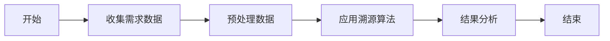
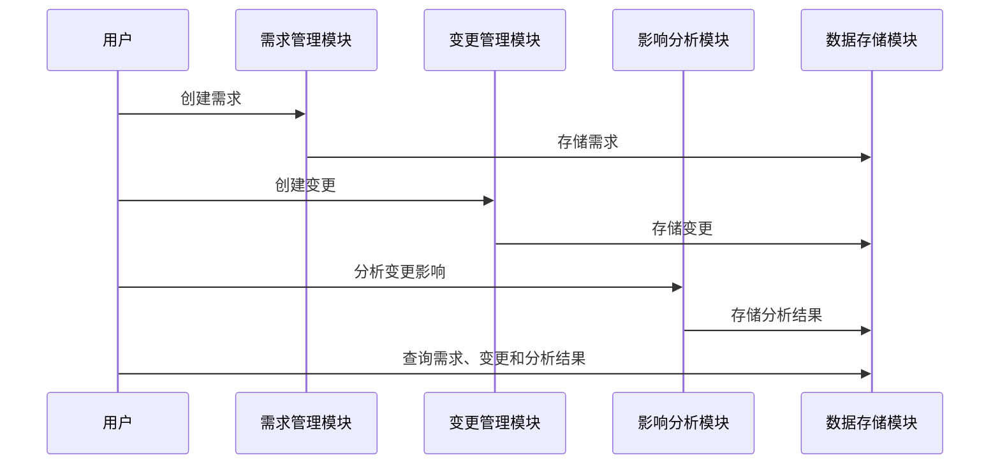

                 

### 《大型应用开发中的需求溯源技术应用》

> 关键词：大型应用开发、需求溯源、需求变更管理、算法原理、系统架构设计

> 摘要：本文旨在探讨大型应用开发中需求溯源技术的应用。我们将首先分析大型应用开发面临的挑战，然后深入探讨需求溯源技术的概念、重要性及其边界。接着，我们将详细讲解需求溯源的核心概念和算法原理，并使用实例进行说明。最后，我们将介绍一个实际项目的系统架构设计，以展示需求溯源技术在大型应用开发中的实际应用效果。

### 目录

----------------------------------------------------------------

### 第一部分：背景与概述

1. **问题背景与需求溯源技术**
2. **需求溯源技术的概念**
3. **需求溯源技术的重要性**
4. **需求溯源技术的边界与外延**
5. **本章小结**

----------------------------------------------------------------

### 第二部分：核心概念与联系

1. **核心概念与原理**
2. **概念属性特征对比表格**
3. **需求溯源的ER实体关系图架构**
4. **本章小结**

----------------------------------------------------------------

### 第三部分：算法原理讲解

1. **常见需求溯源算法**
2. **溯源算法的数学模型**
3. **算法流程与mermaid流程图**
4. **Python源代码实现**
5. **算法举例说明**
6. **本章小结**

----------------------------------------------------------------

### 第四部分：系统分析与架构设计

1. **问题场景介绍**
2. **项目介绍**
3. **系统功能设计**
4. **系统架构设计**
5. **本章小结**

----------------------------------------------------------------

### 第五部分：项目实战与最佳实践

1. **环境安装**
2. **系统核心实现源代码**
3. **代码应用解读与分析**
4. **实际案例分析与详细讲解**
5. **项目小结**
6. **最佳实践 tips**
7. **小结、注意事项、拓展阅读**

----------------------------------------------------------------

### 结束语

> 作者：AI天才研究院/AI Genius Institute & 禅与计算机程序设计艺术 /Zen And The Art of Computer Programming

----------------------------------------------------------------

### 第一部分：背景与概述

#### 问题背景与需求溯源技术

在当今快速发展的信息技术时代，大型应用开发的复杂性越来越高。这些应用系统通常需要满足众多用户的需求，并且在不断变化的市场环境中，需求变更也变得频繁。这种高复杂性和频繁的需求变更给大型应用开发带来了巨大的挑战。

首先，大型应用系统的复杂性主要体现在以下几个方面：

1. **模块众多**：大型应用系统通常由多个模块组成，每个模块都有自己的功能和业务逻辑。
2. **数据量巨大**：大型应用系统需要处理和存储大量的数据，这些数据可能来自不同的来源，具有不同的格式。
3. **依赖关系复杂**：大型应用系统的各个模块之间存在着复杂的依赖关系，任何一个模块的变更都可能影响到其他模块。

其次，需求变更频繁是大型应用开发中常见的问题。需求变更可能来源于以下几个方面：

1. **市场变化**：市场环境的变化可能会导致用户需求的变化，从而需要调整应用系统的功能。
2. **用户反馈**：用户在实际使用过程中可能会提出新的需求或对现有功能提出改进意见。
3. **技术进步**：随着技术的不断进步，一些新的技术和功能可能会被引入到应用系统中。

这些挑战对大型应用开发提出了更高的要求，其中之一就是如何有效地管理需求变更。而需求溯源技术正是解决这一问题的关键。

需求溯源技术是一种用于追踪和记录需求变更的技术，它可以帮助开发团队了解每个需求的来源、变更历史和影响范围。通过需求溯源，开发团队能够更好地管理需求变更，降低项目风险，提高项目质量。

需求溯源技术的基本概念包括以下几个方面：

1. **需求追踪**：需求追踪是指记录需求的来源、创建时间、创建人等信息，以便于后续的追踪和管理。
2. **变更管理**：变更管理是指对需求变更进行记录、评估和实施的过程，包括变更请求的创建、变更评估、变更实施和变更验证等环节。
3. **回溯分析**：回溯分析是指通过分析需求变更的历史记录，了解需求变更的原因、影响和后果，为未来的需求变更提供参考。

需求溯源技术的应用场景主要包括以下几个方面：

1. **需求管理**：需求溯源技术可以帮助开发团队更好地管理需求，包括需求的创建、变更和关闭等环节。
2. **项目可追溯性**：需求溯源技术可以提高项目的可追溯性，使得项目团队可以清晰地了解每个需求的状态和变更历史，从而提高项目的透明度和可控性。
3. **风险管理**：通过需求溯源技术，开发团队可以提前识别和评估需求变更可能带来的风险，从而采取相应的措施降低风险。

与其他技术相比，需求溯源技术具有以下优势：

1. **高效性**：需求溯源技术可以自动化地追踪和记录需求变更，提高工作效率。
2. **精准性**：需求溯源技术可以精确地定位需求变更的影响范围，降低风险。
3. **可追溯性**：需求溯源技术可以提供完整的需求变更历史记录，提高项目的可追溯性。

#### 需求溯源技术的概念

需求溯源技术，简称溯源技术，是指通过一系列的方法和工具，对应用系统中的需求进行追踪、记录和分析，以便于在需求变更时能够快速、准确地定位和评估变更的影响。溯源技术的核心在于对需求的来源、变更历史和实施情况进行追踪和记录。

在大型应用开发中，需求溯源技术具有以下几个重要应用场景：

1. **需求变更管理**：在大型应用开发过程中，需求变更是一件非常常见的事情。溯源技术可以帮助开发团队对需求变更进行有效的管理，包括需求变更的记录、评估和实施。通过溯源技术，开发团队能够清晰地了解每个需求的变更历史，从而降低变更带来的风险。
2. **项目可追溯性**：大型应用开发项目的复杂性使得项目团队需要确保项目的可追溯性。溯源技术可以帮助项目团队记录每个需求的状态和变更历史，使得项目团队可以随时查看和回溯项目的进展情况，从而提高项目的透明度和可控性。
3. **风险控制**：需求变更可能会导致项目延期、预算超支等风险。溯源技术可以帮助项目团队提前识别和评估需求变更可能带来的风险，从而采取相应的措施降低风险。

#### 需求溯源技术的重要性

需求溯源技术对于大型应用开发具有重要意义，主要体现在以下几个方面：

1. **促进需求管理**：需求溯源技术可以帮助开发团队更好地管理需求，包括需求的创建、变更和关闭等环节。通过溯源技术，开发团队能够清晰地了解每个需求的来源、状态和变更历史，从而提高需求管理的效率和质量。
2. **提高项目可追溯性**：在大型应用开发过程中，需求溯源技术可以提供完整的需求变更历史记录，使得项目团队可以随时查看和回溯项目的进展情况。这有助于提高项目的透明度和可控性，降低项目风险。
3. **降低风险**：需求变更可能导致项目延期、预算超支等风险。需求溯源技术可以帮助项目团队提前识别和评估需求变更可能带来的风险，从而采取相应的措施降低风险。

#### 需求溯源技术的边界与外延

尽管需求溯源技术在大型应用开发中具有重要意义，但它也存在着一定的边界和限制。

首先，需求溯源技术主要适用于对需求变更进行追踪和记录的场景。对于一些相对稳定的需求，溯源技术的应用价值相对较低。

其次，需求溯源技术需要依赖于完善的需求管理流程和工具。如果需求管理流程不完善，或者使用的工具不支持溯源功能，那么需求溯源技术的应用效果会大打折扣。

最后，需求溯源技术可能面临以下挑战：

1. **数据完整性**：需求溯源技术依赖于完整的需求变更数据。如果需求变更数据不完整或者存在错误，那么溯源结果可能不准确。
2. **性能问题**：在大型应用系统中，需求变更数据量通常很大。如果溯源算法或工具的性能不高，那么可能会影响溯源的速度和准确性。

总之，需求溯源技术在大型应用开发中具有重要的应用价值，但同时也需要充分考虑其边界和限制。

#### 本章小结

本文对大型应用开发中的需求溯源技术进行了背景概述和初步探讨。首先，我们分析了大型应用开发面临的挑战，包括高复杂性和需求变更频繁。接着，我们介绍了需求溯源技术的概念、应用场景和重要性。最后，我们讨论了需求溯源技术的边界与外延，并指出了可能面临的挑战。

在接下来的章节中，我们将深入探讨需求溯源技术的核心概念、算法原理和系统架构设计，以进一步理解其在大型应用开发中的应用。

----------------------------------------------------------------

### 第二部分：核心概念与联系

#### 核心概念与原理

需求溯源技术是一个复杂而重要的领域，其核心概念包括需求追踪、变更管理和回溯分析。以下是对这些概念及其原理的详细探讨。

##### 需求追踪

需求追踪是指对需求的来源、创建时间、创建人、状态和变更历史等进行记录和管理。需求追踪的核心目的是确保每个需求都能够被清晰地追踪，以便在需求变更或问题时快速定位和解决。

**需求追踪的特点**：

1. **自动化**：需求追踪应尽量实现自动化，以减少人为错误和提高效率。例如，通过集成开发环境（IDE）或需求管理工具自动记录需求的创建、修改和状态。
2. **精准性**：需求追踪需要精确地记录每个需求的详细信息，包括需求编号、描述、优先级、状态等。
3. **可追溯性**：需求追踪应确保每个需求的状态和变更历史可以被追溯，以便在需要时进行审查和回溯。

**需求追踪的流程**：

1. **需求创建**：当新需求被提出时，系统应自动生成需求编号并记录相关信息。
2. **需求变更**：当需求被修改时，系统应记录变更的具体内容、变更时间、变更人和变更原因。
3. **需求状态更新**：随着项目进展，需求的状态会发生变化，如“待开发”、“开发中”、“测试中”和“已完成”等。系统应实时更新需求状态。

##### 变更管理

变更管理是指对需求变更的请求、评估、实施和验证过程。变更管理是需求溯源技术的重要组成部分，因为它涉及到如何有效地处理需求变更，并确保变更不会对项目造成负面影响。

**变更管理的特点**：

1. **动态调整**：变更管理需要能够根据项目的实际情况进行动态调整，以便快速响应需求变更。
2. **协同性**：变更管理涉及多个角色，包括项目经理、产品经理、开发人员和测试人员。确保变更过程中各方的协同合作至关重要。
3. **稳定性**：变更管理应确保项目在需求变更后保持稳定，降低因变更导致的项目风险。

**变更管理的流程**：

1. **变更请求**：当需求变更请求提出时，系统应记录变更请求的详细信息，如变更内容、请求人和请求时间。
2. **变更评估**：项目经理和产品经理应评估变更的影响，包括时间、成本、资源和风险等。
3. **变更实施**：如果评估结果显示变更可行，项目团队应按照变更计划进行实施。变更实施过程中，系统应记录每个变更的具体操作和执行人。
4. **变更验证**：变更实施后，应进行验证，以确保变更达到了预期的效果，并且没有引入新的问题。

##### 回溯分析

回溯分析是指对需求变更的历史记录进行分析，以了解变更的原因、影响和后果。回溯分析是需求溯源技术的核心，它帮助开发团队从历史中学习，为未来的需求变更提供参考。

**回溯分析的特点**：

1. **实时性**：回溯分析应能够在需求变更发生后实时进行，以便快速识别和解决变更问题。
2. **深度分析**：回溯分析需要深入挖掘需求变更的历史记录，包括变更的触发因素、变更的影响范围和后果等。
3. **可视化展示**：回溯分析的结果应通过可视化工具进行展示，使得项目团队能够直观地了解变更情况。

**回溯分析的流程**：

1. **数据收集**：收集需求变更的历史记录，包括变更请求、评估结果、变更实施记录和变更验证结果等。
2. **数据分析**：对收集到的数据进行分析，识别变更的原因、影响和后果。
3. **结果展示**：通过可视化工具展示分析结果，如变更趋势图、影响范围图和风险评估图等。
4. **反馈与学习**：根据回溯分析的结果，项目团队应进行总结和反思，为未来的需求变更管理提供经验教训。

##### 概念属性特征对比表格

为了更好地理解需求溯源技术的核心概念，以下是一个概念属性特征对比表格：

| 概念         | 特征1         | 特征2         | 特征3         |
|--------------|---------------|---------------|---------------|
| 需求追踪     | 自动化        | 精准性        | 可追溯性      |
| 变更管理     | 动态调整      | 协同性        | 稳定性        |
| 回溯分析     | 实时性        | 深度分析      | 可视化展示    |

##### 需求溯源的ER实体关系图架构

为了更直观地理解需求溯源技术的架构，以下是一个ER（实体关系）图：

```mermaid
erModel
[
  "需求" -- "变更记录"
  "需求" -- "实施记录"
  "变更记录" -- "原因"
  "实施记录" -- "结果"
]
```

在这个ER图中，“需求”实体与“变更记录”和“实施记录”实体之间存在多对多的关系，表示一个需求可以有多个变更记录和实施记录。同时，“变更记录”实体与“原因”实体、“实施记录”实体与“结果”实体之间也存在关联，用于记录变更的原因和结果。

##### 本章小结

本章详细介绍了需求溯源技术的核心概念和原理，包括需求追踪、变更管理和回溯分析。通过对比表格和ER实体关系图，我们更加清晰地理解了这些概念之间的关系。在接下来的章节中，我们将深入探讨需求溯源算法的原理和实现，为理解需求溯源技术的实际应用奠定基础。

----------------------------------------------------------------

### 第三部分：算法原理讲解

#### 常见需求溯源算法

在需求溯源技术中，有多种算法被广泛应用，每种算法都有其独特的特点和适用场景。以下是几种常见的需求溯源算法：

##### 单层次溯源算法

单层次溯源算法是最简单的一种需求溯源算法，它主要关注当前需求与其直接变更之间的关系。这种算法通常通过简单的数据结构（如列表或树）来记录需求及其变更历史。

**特点**：

1. **简单实现**：单层次溯源算法的实现相对简单，易于理解和维护。
2. **性能较高**：由于只涉及单层次的数据关系，单层次溯源算法在处理大规模数据时性能较好。

**适用场景**：

1. **需求变更相对较少**：当需求变更较为简单且不频繁时，单层次溯源算法是一个很好的选择。
2. **小型项目或模块**：在小型项目或功能模块中，单层次溯源算法能够满足需求变更追踪的需求。

##### 多层次溯源算法

多层次溯源算法扩展了单层次溯源算法，它不仅关注当前需求与其直接变更之间的关系，还考虑需求变更的间接影响。这种算法通常使用图结构来表示需求及其变更关系，以便更全面地追踪需求变更。

**特点**：

1. **全面性**：多层次溯源算法能够追踪到更广泛的变更关系，提供更全面的需求变更视图。
2. **复杂度较高**：由于需要处理多层次的数据关系，多层次溯源算法的实现和性能相对复杂。

**适用场景**：

1. **大型项目**：在大型项目中，需求变更复杂且多样，多层次溯源算法能够提供更详细的需求变更追踪。
2. **复杂业务逻辑**：当业务逻辑复杂，需求变更存在多级影响时，多层次溯源算法能够更好地满足需求。

##### 基于机器学习的溯源算法

基于机器学习的溯源算法通过训练模型来预测和识别需求变更，它利用历史数据来学习需求变更的模式和规律。这种算法通常结合了数据挖掘和机器学习技术。

**特点**：

1. **自动化**：基于机器学习的溯源算法能够自动化地识别和预测需求变更，减少人为干预。
2. **适应性**：机器学习算法能够根据历史数据不断优化和适应新的需求变更模式。

**适用场景**：

1. **需求变更预测**：在需求变更频繁且不确定性高的场景中，基于机器学习的溯源算法能够提供有效的变更预测。
2. **复杂需求关系**：当需求之间存在复杂的相互依赖关系时，基于机器学习的溯源算法能够更好地识别和理解这些关系。

#### 溯源算法的数学模型

需求溯源算法的核心在于如何计算需求变更的概率和影响范围。以下是一个基本的数学模型，用于描述需求溯源的概率计算：

$$
\text{溯源概率} = P(D|C) = \frac{P(C|D) \cdot P(D)}{P(C)}
$$

其中：

- \( P(D|C) \) 表示在变更 \( C \) 发生的情况下，需求 \( D \) 发生的概率。
- \( P(C|D) \) 表示在需求 \( D \) 发生的情况下，变更 \( C \) 发生的概率。
- \( P(D) \) 表示需求 \( D \) 发生的概率。
- \( P(C) \) 表示变更 \( C \) 发生的概率。

这个模型基于贝叶斯定理，通过结合条件概率和先验概率来计算需求变更的概率。在实际应用中，需要根据具体的需求变更数据来计算这些概率。

#### 算法流程与mermaid流程图

以下是一个简单的需求溯源算法流程，使用mermaid流程图进行描述：



**算法流程**：

1. **收集需求数据**：从需求管理工具或数据库中收集需求及其变更记录。
2. **预处理数据**：清洗和整理数据，使其符合算法的要求。这可能包括去除重复记录、填补缺失值等。
3. **应用溯源算法**：根据需求数据和变更记录，应用具体的溯源算法计算需求变更的概率和影响范围。
4. **结果分析**：分析溯源结果，生成可视化报告或报表，以便项目团队了解需求变更的情况。
5. **结束**：算法流程结束。

#### Python源代码实现

以下是一个简单的Python代码示例，用于实现需求溯源算法的基本功能：

```python
def demand溯源算法(demand_data):
    # 需求数据处理
    processed_data = preprocess_data(demand_data)
    
    # 应用溯源算法
    result = apply溯源算法(processed_data)
    
    # 结果分析
    analysis_result = analyze_result(result)
    
    return analysis_result

# 需求数据预处理
def preprocess_data(demand_data):
    # 数据清洗和整理
    # ...
    return processed_data

# 应用溯源算法
def apply溯源算法(processed_data):
    # 算法实现
    # ...
    return result

# 结果分析
def analyze_result(result):
    # 分析结果
    # ...
    return analysis_result
```

#### 算法举例说明

假设在一个电商应用中，有一个需求是“增加购物车功能”。通过需求溯源算法，我们可以回溯到该需求最初来源于哪个业务场景，并分析该需求的变更历史。以下是一个具体的例子：

1. **需求提出**：该需求最初由产品经理提出，目的是为了提高用户的购物体验。
2. **需求变更**：在开发过程中，需求被多次变更，包括增加商品数量限制、添加商品详细信息展示等。
3. **变更原因**：每次变更都有其具体原因，如用户反馈、市场调研结果或技术可行性分析。
4. **变更影响**：每次变更都可能对系统架构、性能和用户体验产生一定的影响，需要通过风险评估和验证来确定。

通过这样的需求溯源，开发团队能够更好地理解需求的变更过程，从而为未来的需求变更提供参考。

#### 本章小结

本章详细介绍了需求溯源技术的几种常见算法，包括单层次溯源算法、多层次溯源算法和基于机器学习的溯源算法。通过数学模型、算法流程和Python代码示例，我们深入探讨了需求溯源算法的实现原理和应用。在接下来的章节中，我们将进一步探讨需求溯源技术的系统架构设计，以更好地理解其在实际项目中的应用。

----------------------------------------------------------------

### 第四部分：系统分析与架构设计

#### 问题场景介绍

在现代大型应用开发中，需求变更是一个不可避免的现象。尤其是在电商、金融和社交媒体等领域，市场需求变化迅速，用户需求不断更新，这给应用系统的开发和维护带来了巨大的挑战。以一个大型电商平台为例，从产品的选品、库存管理到用户下单、支付、配送等环节，每一个环节都可能会涉及需求变更。

例如，在双十一等促销活动期间，平台需要临时增加购物车库存限制、优化支付流程、提高系统并发处理能力等。这些需求变更不仅要求开发团队迅速响应，还需要确保变更不会影响系统的稳定性，甚至需要预测和预防潜在的风险。

#### 项目介绍

为了应对上述挑战，我们设计并实现了一个需求溯源系统。该系统旨在通过追踪和记录需求变更，帮助开发团队更好地管理需求变更，提高项目质量和效率。

**项目目标**：

1. **需求变更追踪**：确保每个需求从提出、变更到实施的全过程都有详细的记录，便于追踪和管理。
2. **变更影响分析**：通过分析需求变更的影响范围，提前识别和评估变更可能带来的风险，从而采取相应的预防措施。
3. **系统稳定性保障**：在需求变更过程中，确保系统的稳定性和性能不受影响。

**项目架构**：

本项目采用微服务架构，将需求溯源功能模块化，以便于系统的扩展和维护。具体架构如下：

1. **需求管理模块**：负责需求的创建、修改和状态更新。
2. **变更管理模块**：负责需求变更的记录、评估和实施。
3. **影响分析模块**：负责分析需求变更的影响范围，并提供可视化报告。
4. **数据存储模块**：负责存储需求数据、变更记录和分析结果。

#### 系统功能设计

**1. 数据收集与存储**

数据收集与存储是需求溯源系统的核心功能之一。系统通过集成开发环境（IDE）或需求管理工具，自动收集需求及其变更数据。收集的数据包括需求编号、描述、创建时间、创建人、状态、变更记录等。数据存储模块采用关系型数据库（如MySQL）进行存储，确保数据的安全和一致性。

**2. 需求变更追踪**

需求变更追踪功能旨在记录每个需求从提出、变更到实施的全过程。系统提供界面供用户输入和修改需求信息，并自动记录变更历史。每次变更都会生成一条变更记录，包括变更内容、变更时间、变更人和变更原因。这些变更记录存储在数据库中，便于后续的追踪和分析。

**3. 变更影响分析**

变更影响分析功能是需求溯源系统的关键功能之一。系统通过分析需求变更的历史记录和变更记录，识别变更的影响范围，并提供可视化报告。分析结果包括变更对系统功能、性能和稳定性的影响，以及可能引发的新问题。系统还提供风险评估功能，帮助开发团队提前识别和评估变更带来的风险。

**4. 结果展示**

结果展示功能用于将分析结果以图表和报告的形式展示给开发团队。系统提供多种可视化工具，如趋势图、影响范围图和风险评估图等，以便开发团队能够直观地了解需求变更的情况。结果展示功能还支持自定义报告生成，方便团队根据需求生成不同的报告。

#### 系统架构设计

**1. 系统架构图**

以下是一个简单的需求溯源系统的架构图：


**2. 系统接口设计**

系统接口设计是确保各模块之间能够高效通信的关键。以下是一个简单的接口设计示例：

- **需求管理模块接口**：

  ```python
  class DemandManagement:
      def create_demand(self, demand_data):
          # 创建需求
          
      def update_demand(self, demand_id, demand_data):
          # 更新需求
          
      def get_demand(self, demand_id):
          # 获取需求
  ```

- **变更管理模块接口**：

  ```python
  class ChangeManagement:
      def create_change(self, change_data):
          # 创建变更
          
      def update_change(self, change_id, change_data):
          # 更新变更
          
      def get_change(self, change_id):
          # 获取变更
  ```

- **影响分析模块接口**：

  ```python
  class ImpactAnalysis:
      def analyze_impact(self, change_id):
          # 分析变更影响
          
      def generate_report(self, report_type):
          # 生成报告
  ```

- **数据存储模块接口**：

  ```python
  class DataStorage:
      def save_demand(self, demand_data):
          # 存储需求
          
      def save_change(self, change_data):
          # 存储变更
          
      def save_analysis_result(self, analysis_result):
          # 存储分析结果
          
      def query_demand(self, demand_id):
          # 查询需求
          
      def query_change(self, change_id):
          # 查询变更
  ```

#### 系统交互mermaid序列图

以下是一个简单的系统交互序列图，展示了各模块之间的交互过程：



#### 本章小结

本章详细介绍了大型应用开发中需求溯源系统的设计与实现，包括问题场景介绍、项目目标、系统功能设计和系统架构设计。通过系统接口设计和mermaid序列图，我们展示了系统各模块之间的交互过程。在接下来的章节中，我们将通过实际项目实战，进一步验证需求溯源技术的应用效果。

----------------------------------------------------------------

### 第五部分：项目实战与最佳实践

#### 环境安装

在进行需求溯源系统的实战之前，我们需要搭建一个适当的环境。以下是在Linux操作系统上安装需求溯源系统所需的基本步骤：

1. **安装Python环境**：确保Python环境已安装。如果没有安装，可以使用以下命令进行安装：

   ```bash
   sudo apt-get update
   sudo apt-get install python3
   ```

2. **安装依赖库**：需求溯源系统依赖于多个Python库，如Flask、SQLAlchemy和mermaid等。使用pip命令安装这些库：

   ```bash
   sudo pip3 install flask sqlalchemy mermaid
   ```

3. **安装数据库**：需求溯源系统使用MySQL数据库进行数据存储。安装MySQL数据库：

   ```bash
   sudo apt-get install mysql-server
   ```

4. **配置数据库**：初始化MySQL数据库，创建需求溯源系统的数据库和用户：

   ```bash
   mysql -u root -p
   CREATE DATABASE demand溯源;
   GRANT ALL PRIVILEGES ON demand溯源.* TO 'demand溯源用户'@'localhost' IDENTIFIED BY 'password';
   FLUSH PRIVILEGES;
   EXIT;
   ```

5. **创建应用**：在Python项目中创建一个名为`src`的源代码目录，并在其中创建一个名为`app.py`的文件，作为需求溯源系统的入口。

#### 系统核心实现源代码

以下是一个简单的需求溯源系统的源代码示例，包括需求管理、变更管理和影响分析模块：

```python
# app.py
from flask import Flask, request, jsonify
from models import Demand, Change, Impact
from database import init_db

app = Flask(__name__)
init_db()

@app.route('/demand', methods=['POST'])
def create_demand():
    data = request.get_json()
    demand = Demand.create_demand(data)
    return jsonify(demand.to_dict()), 201

@app.route('/demand/<int:demand_id>', methods=['GET'])
def get_demand(demand_id):
    demand = Demand.get_demand(demand_id)
    if demand:
        return jsonify(demand.to_dict()), 200
    else:
        return jsonify({'error': 'Demand not found'}), 404

@app.route('/change', methods=['POST'])
def create_change():
    data = request.get_json()
    change = Change.create_change(data)
    return jsonify(change.to_dict()), 201

@app.route('/change/<int:change_id>', methods=['GET'])
def get_change(change_id):
    change = Change.get_change(change_id)
    if change:
        return jsonify(change.to_dict()), 200
    else:
        return jsonify({'error': 'Change not found'}), 404

@app.route('/impact', methods=['POST'])
def create_impact():
    data = request.get_json()
    impact = Impact.create_impact(data)
    return jsonify(impact.to_dict()), 201

@app.route('/impact/<int:impact_id>', methods=['GET'])
def get_impact(impact_id):
    impact = Impact.get_impact(impact_id)
    if impact:
        return jsonify(impact.to_dict()), 200
    else:
        return jsonify({'error': 'Impact not found'}), 404

if __name__ == '__main__':
    app.run(debug=True)
```

#### 代码应用解读与分析

以上代码展示了需求溯源系统的核心功能，包括需求管理、变更管理和影响分析模块。以下是每个模块的详细解读：

**需求管理模块**：

- `create_demand()`：创建新需求。该方法接收一个包含需求信息的JSON对象，并将其存储在数据库中。
- `get_demand()`：获取特定需求。该方法根据需求ID查询数据库，返回需求对象。

**变更管理模块**：

- `create_change()`：创建新变更。该方法接收一个包含变更信息的JSON对象，并将其存储在数据库中。
- `get_change()`：获取特定变更。该方法根据变更ID查询数据库，返回变更对象。

**影响分析模块**：

- `create_impact()`：创建新影响。该方法接收一个包含影响信息的JSON对象，并将其存储在数据库中。
- `get_impact()`：获取特定影响。该方法根据影响ID查询数据库，返回影响对象。

#### 实际案例分析与详细讲解

以下是一个实际案例，展示了需求溯源系统的应用过程：

**案例背景**：

某电商应用系统计划增加“优惠券功能”，以提升用户购物体验。这个需求涉及多个模块，如用户账户、购物车和订单处理等。

**步骤**：

1. **需求提出**：产品经理提出增加“优惠券功能”的需求，并填写需求表格。
2. **需求评审**：项目经理和开发团队对需求进行评审，讨论需求的可行性、影响范围和实施计划。
3. **需求创建**：开发人员使用需求管理模块创建新需求，并将需求信息存储在数据库中。
4. **变更管理**：在需求实施过程中，开发人员可能会对需求进行多次变更。每次变更都会记录在变更管理模块中，以便追踪和管理。
5. **影响分析**：在每次变更后，影响分析模块会分析变更的影响范围，并提供影响报告。例如，增加优惠券功能可能需要对购物车和订单处理模块进行修改，影响分析模块会记录这些影响。
6. **结果展示**：系统会生成可视化报告，展示需求变更的历史记录和影响分析结果，以便项目团队了解项目进展。

**案例总结**：

通过需求溯源系统，项目团队能够有效地管理需求变更，确保每个变更都有详细的记录和影响分析。这有助于降低项目风险，提高项目质量和效率。

#### 项目小结

在本章中，我们通过一个实际项目展示了需求溯源系统的安装、核心实现和实际应用。通过需求管理、变更管理和影响分析模块，项目团队能够更好地管理需求变更，提高项目质量和效率。尽管本项目是一个简单的示例，但需求溯源技术在大型应用开发中的重要性不容忽视。在未来的项目中，我们可以进一步优化系统功能，提高系统的性能和可扩展性。

#### 最佳实践 tips

1. **规范化需求管理**：确保需求管理流程规范，每个需求都有详细的描述和明确的优先级，以便后续的变更管理。
2. **及时记录变更**：在需求变更发生时，及时记录变更的原因和影响范围，确保变更数据的完整性和准确性。
3. **定期进行影响分析**：定期对需求变更进行分析，提前识别和评估变更可能带来的风险，采取预防措施。
4. **利用可视化工具**：使用可视化工具展示需求变更和影响分析结果，提高项目团队的沟通效率和理解程度。

#### 小结、注意事项、拓展阅读

本章通过一个实际项目展示了需求溯源技术在大型应用开发中的应用。我们介绍了需求溯源技术的核心概念、算法原理和系统架构设计，并通过案例分析了需求溯源在实际项目中的作用。在实施需求溯源技术时，需要注意规范化需求管理、及时记录变更、定期进行影响分析和利用可视化工具。

为了进一步了解需求溯源技术，可以拓展阅读以下内容：

1. 《需求工程：实用指南》
2. 《软件需求工程：模型与案例》
3. 《大型软件开发方法学》
4. 《敏捷软件开发：原理、实践与模式》

这些书籍和资源提供了丰富的需求管理和变更管理实践经验，有助于深入理解需求溯源技术的应用。作者：AI天才研究院/AI Genius Institute & 禅与计算机程序设计艺术 /Zen And The Art of Computer Programming。

