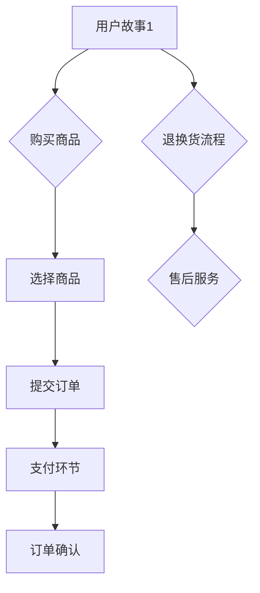

                 


### 背景介绍

在当今快速发展的信息技术时代，大型应用的开发已经成为企业和组织成功的关键因素之一。这些应用不仅需要处理海量的数据，还必须具备高度的可用性、可靠性和可扩展性。然而，在这样的背景下，需求生命周期管理（Requirement Lifecycle Management，简称RLM）成为了确保项目成功的关键环节。

**核心概念术语说明**

- **需求生命周期管理（RLM）**：指在项目开发过程中，对需求进行收集、分析、设计、实现、验证和管理的全过程。
- **需求收集**：指通过各种方式获取用户和利益相关者的需求，包括访谈、问卷调查、用户故事地图等。
- **需求分析**：指对收集到的需求进行整理、筛选和分类，确保需求的完整性和一致性。
- **需求设计**：指将需求转化为具体的规格说明书，包括功能需求、性能需求和非功能需求。
- **需求实现**：指开发团队根据需求设计文档进行编码和实现。
- **需求验证**：指通过测试和审查确保实现的需求符合用户和项目的期望。
- **需求变更管理**：指在项目开发过程中，对需求变更进行评估、控制和管理。

**问题背景**

大型应用开发中，需求管理面临诸多挑战。首先，需求的复杂性和多样性使得需求管理变得异常困难。用户和利益相关者往往有不同的需求和期望，如何平衡这些需求和确保项目的可行性成为了一个关键问题。其次，需求变更频繁，尤其是大型项目中，需求的变更可能是不可避免的，但如何有效地管理和控制这些变更，以避免对项目进度和成本产生负面影响，是一个重大挑战。此外，需求管理过程中，信息的准确传递和沟通也非常重要，任何信息失真或沟通不畅都可能导致项目失败。

**问题描述**

在大型应用开发中，需求管理的问题主要体现在以下几个方面：

1. **需求不明确或模糊**：由于需求的收集和分析不够充分，导致需求文档模糊不清，开发团队无法准确理解需求，从而影响开发质量和进度。
2. **需求变更频繁**：随着项目的推进，用户和利益相关者的需求可能会发生变化，如果需求变更管理不当，可能导致项目范围蔓延，影响项目进度和成本。
3. **沟通不畅**：在需求管理过程中，用户、开发团队和其他利益相关者之间的沟通不畅可能导致信息失真，影响需求的准确传递和实现。
4. **需求优先级不明确**：在大型项目中，需求往往众多，如何确定需求优先级，确保关键需求得到优先满足，是一个关键问题。

**问题解决**

为了解决上述问题，我们可以采取以下措施：

1. **明确需求定义**：在项目初期，通过用户访谈、问卷调查等方式，全面收集用户需求，并形成详细的需求文档。在需求分析阶段，对需求进行分类和整理，确保需求的完整性和一致性。
2. **建立有效的需求变更管理机制**：制定明确的需求变更流程，评估变更对项目进度、成本和范围的影响，确保需求变更得到有效控制和管理。
3. **加强沟通与协作**：建立有效的沟通渠道，确保用户、开发团队和其他利益相关者之间的信息传递准确无误。可以采用敏捷开发方法，通过迭代和增量开发，提高需求实现的透明度和可追溯性。
4. **确定需求优先级**：根据项目的目标和资源约束，合理确定需求优先级，确保关键需求得到优先满足。

**边界与外延**

需求生命周期管理不仅局限于软件开发项目，也广泛应用于其他类型的项目，如建筑项目、市场营销项目等。不同类型的项目的需求管理方法可能会有所不同，但核心原则是相似的，即确保需求的准确、及时、高效管理。

**概念结构与核心要素组成**

需求生命周期管理的概念结构包括以下几个核心要素：

1. **需求收集**：包括访谈、问卷调查、用户故事地图等。
2. **需求分析**：包括需求分类、需求筛选、需求建模等。
3. **需求设计**：包括需求规格化、需求文档编写等。
4. **需求实现**：包括编码、测试等。
5. **需求验证**：包括测试、审查等。
6. **需求变更管理**：包括变更评估、变更控制等。

通过上述核心要素的有机组合，需求生命周期管理可以确保项目需求得到有效管理，从而提高项目成功率。

### 核心概念与联系

在深入探讨大型应用开发中的需求生命周期管理之前，我们需要明确一些核心概念，并分析它们之间的联系。

**需求生命周期**

需求生命周期是指从需求提出到需求实现、验证和维护的全过程。这个过程通常包括以下几个阶段：

1. **需求识别**：识别用户和利益相关者的需求。
2. **需求收集**：通过各种方法收集需求信息。
3. **需求分析**：对收集到的需求进行分析和整理。
4. **需求设计**：将分析后的需求转化为具体的设计文档。
5. **需求实现**：开发团队根据设计文档进行编码和实现。
6. **需求验证**：测试和审查，确保实现的需求符合预期。
7. **需求维护**：在项目交付后，对需求进行持续跟踪和更新。

**需求收集**

需求收集是需求生命周期的第一步，其目的是获取用户和利益相关者的需求信息。以下是一些常用的需求收集方法：

1. **访谈**：直接与用户和利益相关者进行面对面访谈，了解他们的需求。
2. **问卷调查**：通过在线或纸质问卷收集用户的需求和意见。
3. **用户故事地图**：通过绘制用户故事地图，展示用户在不同场景下的需求和工作流程。
4. **观察**：观察用户在实际工作中的操作和行为，以获取真实的需求信息。

**需求分析**

需求分析是对收集到的需求进行整理、筛选和分类，以确保需求的完整性和一致性。以下是一些需求分析的方法和步骤：

1. **需求分类**：根据需求的特点和属性，将需求分为功能需求、性能需求和非功能需求。
2. **需求筛选**：从多个需求中筛选出关键需求，确保需求的优先级。
3. **需求建模**：使用UML（统一建模语言）等工具，创建需求模型，以便更好地理解和传达需求。

**需求设计**

需求设计是将分析后的需求转化为具体的设计文档，包括功能设计、性能设计和非功能设计。以下是一些需求设计的方法和技巧：

1. **需求规格化**：将需求转化为详细的功能规格说明，确保开发团队理解需求。
2. **文档编写**：编写清晰、完整的文档，包括用户手册、设计文档和测试文档。
3. **原型设计**：通过原型设计，展示需求的实现效果，以便用户和开发团队进行评审和反馈。

**需求实现**

需求实现是指开发团队根据需求设计文档进行编码和实现。以下是一些需求实现的方法和技巧：

1. **编码**：根据设计文档，编写高质量的代码。
2. **单元测试**：对编写的代码进行单元测试，确保代码的功能和性能符合预期。
3. **集成测试**：将各个模块的代码集成起来，进行集成测试，确保系统的整体性能。

**需求验证**

需求验证是通过测试和审查，确保实现的需求符合预期。以下是一些需求验证的方法和步骤：

1. **功能测试**：测试需求的功能是否符合预期。
2. **性能测试**：测试需求的性能指标是否达到要求。
3. **审查**：通过同行评审和文档审查，确保需求的实现过程和结果符合标准。

**需求变更管理**

需求变更管理是指在项目开发过程中，对需求变更进行评估、控制和管理。以下是一些需求变更管理的方法和策略：

1. **变更评估**：评估变更对项目进度、成本和范围的影响。
2. **变更控制**：制定变更控制流程，确保变更得到有效管理。
3. **变更文档**：记录每个变更的详细信息，以便追踪和审核。

**核心概念对比与联系**

以下是一个对比表格，展示了上述核心概念之间的联系和区别：

| 概念        | 描述                                                         | 关联 |
| ----------- | ------------------------------------------------------------ | ---- |
| 需求识别    | 识别用户和利益相关者的需求。                                   |      |
| 需求收集    | 收集需求信息，包括访谈、问卷调查、用户故事地图等。             | 需求识别 |
| 需求分析    | 对收集到的需求进行分析和整理，确保需求的完整性和一致性。       | 需求收集 |
| 需求设计    | 将分析后的需求转化为具体的设计文档。                         | 需求分析 |
| 需求实现    | 根据需求设计文档进行编码和实现。                             | 需求设计 |
| 需求验证    | 通过测试和审查，确保实现的需求符合预期。                     | 需求实现 |
| 需求变更管理 | 对需求变更进行评估、控制和管理。                             | 所有阶段 |

**ER实体关系图架构**

为了更直观地展示需求生命周期的核心概念及其关系，我们可以使用Mermaid绘制一个ER（实体关系）图。

```mermaid
erDiagram
    DR1 ||--|{ 需求识别 }
    DR1 ||--|{ 需求收集 }
    DR1 ||--|{ 需求分析 }
    DR1 ||--|{ 需求设计 }
    DR1 ||--|{ 需求实现 }
    DR1 ||--|{ 需求验证 }
    DR1 ||--|{ 需求变更管理 }
```

通过这个ER图，我们可以清晰地看到需求生命周期各阶段之间的关联和依赖关系。

### 需求分析

需求分析是需求生命周期管理中至关重要的一环，它关系到整个项目的成功与否。在这个阶段，我们不仅要收集需求，更要对这些需求进行分析、整理和筛选，以确保需求的完整性和一致性。

**需求收集的方法和技术**

需求收集是需求分析的起点，其目的是获取用户和利益相关者的需求信息。以下是一些常用的需求收集方法：

1. **访谈**：通过面对面或视频会议的方式，与用户和利益相关者进行深入交流，了解他们的需求和期望。这种方法的优势在于可以获取详细的信息，但缺点是需要较多时间和资源。

2. **问卷调查**：通过在线或纸质问卷的方式收集用户的需求和意见。这种方法的优势在于可以快速收集大量数据，但缺点是可能无法深入了解用户的真实需求。

3. **用户故事地图**：通过绘制用户故事地图，展示用户在不同场景下的需求和工作流程。这种方法可以帮助团队从用户的角度理解需求，但需要用户具备一定的参与度。

4. **观察**：直接观察用户在实际工作中的操作和行为，以获取真实的需求信息。这种方法的优势在于可以获得第一手资料，但需要保证观察者的中立性和专业性。

**需求分析的步骤和工具**

需求分析是一个系统化的过程，通常包括以下步骤：

1. **需求分类**：根据需求的特点和属性，将需求分为功能需求、性能需求和非功能需求。功能需求关注系统应提供哪些功能，性能需求关注系统的性能指标，非功能需求关注系统的可用性、可靠性、安全性等。

2. **需求筛选**：从多个需求中筛选出关键需求，确保需求的优先级。筛选标准可以包括需求的紧急性、重要性、可实施性等。

3. **需求建模**：使用UML（统一建模语言）等工具，创建需求模型，以便更好地理解和传达需求。常用的需求建模方法包括用例图、序列图、类图等。

4. **需求评审**：组织需求评审会议，邀请相关利益相关者对需求进行分析和讨论，确保需求的准确性和可行性。

5. **需求文档编写**：将分析后的需求转化为详细的文档，包括需求说明书、用户手册、设计文档等。文档应清晰、完整，以便开发团队参考。

以下是一个简单的需求分析工具表：

| 工具名       | 用途                                                         | 优势 | 劣势 |
| ------------ | ------------------------------------------------------------ | ---- | ---- |
|访谈          |获取深入、详细的需求信息                                      |能获取详细需求|耗时、资源消耗大 |
|问卷调查      |快速收集大量数据                                             |高效、成本低|无法深入了解用户需求 |
|用户故事地图  |从用户角度理解需求                                           |直观、用户参与|需要用户参与 |
|观察          |获取第一手资料                                               |真实、中立|需要专业观察者 |

**需求分析与用户故事地图**

用户故事地图是一种直观、有效的需求分析工具，它通过绘制用户故事，展示用户在不同场景下的需求和工作流程。以下是一个简单的用户故事地图示例：



通过用户故事地图，我们可以清晰地看到用户在购买商品过程中的各个步骤，以及可能涉及的需求点。这有助于开发团队更好地理解用户需求，确保需求分析的过程更加全面和准确。

### 需求设计

需求设计是将分析后的需求转化为具体的设计文档的过程，它是需求生命周期管理中的关键环节。一个良好的需求设计能够确保开发团队正确理解和实现需求，从而提高项目成功的概率。以下是需求设计的几个核心方面：

**需求规格化的技巧**

1. **功能规格化**：将功能需求转化为详细的功能规格说明，包括功能的描述、输入、输出和操作步骤。功能规格化应该足够详细，以便开发团队能够根据文档进行编码。
2. **性能规格化**：定义系统的性能需求，包括响应时间、并发处理能力、吞吐量等。性能规格化有助于确保系统在实际运行中能够达到预期的性能指标。
3. **非功能规格化**：包括系统的可用性、可靠性、安全性、可维护性等非功能性需求。这些需求通常涉及到系统设计中的多个方面，需要综合考虑。

**需求设计的过程**

需求设计的过程可以分为以下几个步骤：

1. **需求确认**：与利益相关者进行讨论，确保对需求的理解一致，并对需求进行确认。
2. **需求建模**：使用UML（统一建模语言）等工具创建需求模型，包括用例图、类图、序列图等，以帮助理解和传达需求。
3. **文档编写**：根据需求模型编写详细的设计文档，包括功能设计文档、性能设计文档和非功能设计文档。设计文档应该清晰、完整，以便开发团队参考。
4. **评审与反馈**：组织设计评审会议，邀请相关利益相关者对设计文档进行评审和反馈，确保设计符合需求，并且可行。

**需求设计的文档**

需求设计文档是需求设计过程的输出，它包括以下几个部分：

1. **功能设计文档**：详细描述系统的功能需求，包括每个功能模块的描述、输入、输出和操作步骤。
2. **性能设计文档**：定义系统的性能需求，包括性能指标、测试方法和验证标准。
3. **非功能设计文档**：包括系统的非功能性需求，如可用性、可靠性、安全性等，以及相关的设计和实现策略。

以下是一个简单的需求设计文档模板：

```
需求设计文档

1. 简介
   - 项目名称
   - 需求设计的目标
   - 读者对象

2. 功能设计
   - 功能模块1
       - 描述
       - 输入
       - 输出
       - 操作步骤
   - 功能模块2
       - 描述
       - 输入
       - 输出
       - 操作步骤

3. 性能设计
   - 性能指标
   - 测试方法
   - 验证标准

4. 非功能设计
   - 可用性
   - 可靠性
   - 安全性
   - 可维护性

5. 评审与反馈
   - 评审时间
   - 评审人员
   - 反馈记录

6. 附录
   - 相关参考文档
   - 术语表
```

通过编写详细的需求设计文档，可以确保需求在设计和实现过程中得到准确、一致的理解和执行。

### 需求实现

需求实现是将需求设计转化为实际代码和系统的过程，这是需求生命周期管理的核心环节之一。在这个过程中，开发团队需要紧密协作，确保按照设计文档的要求实现需求，并确保代码的质量和系统的稳定性。

**需求与开发团队的协同**

1. **需求明确与沟通**：在需求实现阶段，开发团队需要确保对需求有清晰、一致的理解。通常，这需要需求分析师和开发团队之间进行充分的沟通和讨论，确保所有团队成员都明确需求的具体内容和实现细节。

2. **任务分解与分配**：根据需求设计文档，将需求分解为具体的任务，并分配给合适的开发人员。任务分解应该尽量细致，以确保每个任务都有明确的负责人和完成时间。

3. **团队协作与支持**：在需求实现过程中，团队成员之间需要保持良好的协作和沟通。可以使用敏捷开发方法，通过每日站会、迭代评审等方式，确保团队成员之间的信息同步和工作协调。

**需求实现中的挑战和解决方案**

1. **需求变更**：在需求实现过程中，需求变更可能是不可避免的。如何有效管理需求变更，确保不影响项目进度和质量，是一个关键挑战。解决方案包括：
   - **变更控制流程**：建立明确的变更控制流程，对所有需求变更进行评估、审批和控制。
   - **版本管理**：使用版本控制工具（如Git）对代码和设计文档进行版本管理，确保变更的追溯和回滚。

2. **技术实现难度**：某些需求可能涉及到复杂的技术实现，如高性能计算、大数据处理等。如何克服这些技术挑战，确保需求能够高质量地实现，是一个关键问题。解决方案包括：
   - **技术调研与评估**：在需求实现前，对相关技术进行调研和评估，确保技术实现的可行性和风险可控。
   - **技术选型与优化**：根据需求的特点，选择合适的技术方案，并进行技术优化，确保系统的高性能和高可靠性。

3. **资源限制**：在需求实现过程中，资源（如人力、时间、资金等）的限制可能会影响需求的实现。如何高效利用资源，确保需求的按时完成，是一个挑战。解决方案包括：
   - **资源调度与优化**：合理调度和分配资源，确保关键任务得到优先处理。
   - **优先级管理**：根据需求的优先级，合理安排任务顺序和资源分配，确保关键需求得到优先实现。

**解决方案与最佳实践**

1. **敏捷开发**：采用敏捷开发方法，通过迭代和增量开发，提高需求的实现效率和团队协作效果。
2. **持续集成与持续部署（CI/CD）**：使用CI/CD工具，实现代码的自动化测试和部署，提高开发效率和系统质量。
3. **代码审查与测试**：实施严格的代码审查和测试流程，确保代码的质量和系统的稳定性。

通过上述解决方案和最佳实践，开发团队可以更好地应对需求实现中的挑战，确保需求的按时、高质量实现。

### 需求验证

需求验证是确保需求实现的质量和符合度的重要环节，它贯穿于整个需求生命周期，从需求设计阶段开始，一直到项目交付后的持续维护。需求验证的目标是确保实现的系统功能、性能和非功能需求都满足最初定义的预期。

**需求验证的方法**

1. **功能测试**：功能测试是验证系统功能是否符合需求的最直接方法。测试人员根据需求设计文档，编写测试用例，并执行测试，以验证每个功能模块的正确性。功能测试通常包括以下类型：
   - **黑盒测试**：测试人员不考虑内部结构和实现细节，仅根据需求文档验证系统功能。
   - **白盒测试**：测试人员了解系统内部结构和代码实现，通过内部逻辑验证系统的正确性。
   - **灰盒测试**：测试人员对系统内部结构有一定了解，但不是完全透明，通过部分内部逻辑验证系统。

2. **性能测试**：性能测试用于评估系统在特定负载下的表现，如响应时间、并发处理能力、资源利用率等。性能测试通常包括以下类型：
   - **负载测试**：模拟用户负载，测试系统在高负载下的稳定性和性能。
   - **压力测试**：通过施加比正常负载更大的压力，测试系统在极限条件下的性能。
   - **容量测试**：测试系统的最大处理能力，确保系统能够处理预期用户量的需求。

3. **安全测试**：安全测试用于验证系统的安全性和防护措施，确保系统能够抵御外部攻击和内部漏洞。安全测试通常包括以下类型：
   - **漏洞扫描**：使用自动化工具扫描系统中的已知漏洞。
   - **渗透测试**：模拟攻击者的行为，通过实际攻击测试系统的安全性。

4. **用户体验测试**：用户体验测试用于评估系统的用户友好性和易用性，确保系统能够满足用户的实际使用需求。用户体验测试通常包括以下方面：
   - **可用性测试**：评估系统的可用性和用户操作的便利性。
   - **交互测试**：测试系统的交互设计是否符合用户习惯和预期。
   - **界面测试**：检查系统界面的一致性和美观性。

**需求验证的标准**

1. **功能完整性**：确保所有需求的功能都得到了实现。
2. **功能正确性**：实现的功能符合需求规格说明和用户预期。
3. **性能符合性**：系统的性能指标（如响应时间、并发处理能力）达到预期要求。
4. **安全符合性**：系统具有足够的防护措施，能够抵御外部攻击和内部漏洞。
5. **用户体验符合性**：系统的用户界面和交互设计满足用户的习惯和预期。

**需求回归测试**

回归测试是需求验证过程中的一个重要步骤，它用于确保每次变更（如代码修复、功能增强等）不会引入新的缺陷或影响现有功能的正确性。回归测试通常包括以下步骤：

1. **测试用例选择**：选择与变更相关的测试用例，包括之前已通过测试的用例和与变更相关的用例。
2. **执行回归测试**：按照选择的测试用例执行回归测试，验证变更后的系统是否仍然符合预期。
3. **缺陷报告**：记录和报告回归测试中发现的新缺陷。
4. **缺陷修复**：开发团队根据回归测试报告修复发现的缺陷，并重新进行回归测试，确保所有缺陷都已解决。

通过需求验证和回归测试，开发团队可以确保系统的稳定性和可靠性，减少缺陷和问题的发生，提高用户满意度。

### 项目管理与监控

在大型应用开发中，需求管理不仅是开发工作的核心，也是项目管理的核心组成部分。有效的需求管理能够确保项目按照预期进行，减少风险，提高项目成功率。以下是需求管理在项目生命周期中的角色、需求变更管理策略以及需求监控与持续改进的最佳实践。

#### 需求管理在项目生命周期中的角色

1. **项目启动阶段**：在项目启动阶段，需求管理的主要任务是明确项目目标和范围，收集初步需求，并进行初步分析。此时，需求管理的重点是确定项目的核心需求和边界，为后续阶段的工作奠定基础。

2. **项目规划阶段**：在项目规划阶段，需求管理需要详细分析需求，制定详细的需求文档，并将需求转化为项目计划。此阶段的需求管理旨在确保项目计划与需求一致，明确项目的时间表、资源分配和风险。

3. **项目执行阶段**：在项目执行阶段，需求管理的关键任务是跟踪需求的实现进度，确保需求得到有效实施。需求管理人员需要与开发团队紧密协作，及时解决需求实现过程中出现的问题，并进行需求变更的管理。

4. **项目监控与控制阶段**：在项目监控与控制阶段，需求管理需要定期审查需求的实现情况，确保项目按照计划进行。需求管理人员需要监控需求变更的进度和影响，采取必要的措施控制项目范围和成本。

5. **项目收尾阶段**：在项目收尾阶段，需求管理的主要任务是验证需求的实现情况，确保所有需求都得到满足。同时，需求管理人员需要整理需求文档和项目经验，为未来的项目提供参考。

#### 需求变更管理策略

1. **变更控制流程**：建立清晰的变更控制流程，包括变更请求的提交、评估、审批和实施。所有需求变更都必须按照变更控制流程进行，确保变更得到有效管理。

2. **变更评估**：在变更请求提交后，需求管理人员需要对变更的影响进行评估，包括对项目进度、成本、资源和风险的影响。评估结果将决定是否批准变更。

3. **优先级管理**：根据变更的重要性和紧急性，对变更进行优先级排序。对于关键需求变更，需要优先处理，以确保项目目标的实现。

4. **文档记录**：对每个变更请求和变更实施过程进行详细的文档记录，包括变更的原因、影响、审批记录和实施步骤。这些文档将作为未来项目管理和变更管理的参考。

#### 需求监控与持续改进

1. **需求监控指标**：建立需求监控指标，如需求实现率、需求变更率、需求延迟率等，以便实时跟踪需求的管理情况。

2. **定期审查**：定期组织需求审查会议，审查需求实现情况和变更管理效果。审查会议应邀请相关利益相关者参与，确保审查的全面性和客观性。

3. **反馈与改进**：根据需求监控和审查的结果，收集反馈意见，并对需求管理流程进行改进。改进措施应包括流程优化、工具升级和团队培训等。

4. **持续学习与改进**：鼓励团队成员持续学习和分享经验，通过案例分析和最佳实践分享，不断提升需求管理的能力和水平。

通过有效的项目管理与监控，需求管理能够更好地服务于大型应用开发，确保项目目标的实现，提高项目的成功率。

### 最佳实践与案例分析

在大型应用开发中，有效的需求生命周期管理不仅能够提高项目的成功率，还能为企业的长期发展提供坚实的保障。以下是几个行业最佳实践，以及通过案例分析展示需求管理的实际应用。

#### 行业最佳实践

1. **敏捷开发与迭代管理**：采用敏捷开发方法，通过短周期的迭代进行需求收集和验证，能够快速响应用户需求和市场变化，提高项目的灵活性和适应性。例如，使用Scrum框架，每个迭代周期（Sprint）结束后，团队会进行回顾会议，总结经验教训，并改进流程。

2. **用户故事地图与用户体验**：通过用户故事地图，开发团队可以更直观地了解用户在不同场景下的需求和工作流程，从而设计出更符合用户期望的系统。同时，重视用户体验测试，确保系统界面友好、操作便捷，提升用户满意度。

3. **自动化测试与持续集成**：实施自动化测试，通过持续集成（CI）和持续部署（CD）工具，自动化地运行测试脚本，提高测试效率和代码质量。例如，使用Jenkins等工具，自动化部署代码到测试环境，快速发现并解决集成中的问题。

4. **变更管理流程**：建立明确的变更管理流程，对所有需求变更进行评估、审批和控制。通过版本控制工具（如Git）记录变更历史，确保变更的可追溯性和可控性。

#### 案例分析

以下是一个大型电商平台的需求管理案例，通过该案例展示需求管理的实际应用。

##### 案例背景

某大型电商平台计划进行一次重大升级，以提升系统的性能、用户体验和安全性。项目团队包括产品经理、需求分析师、开发团队、测试团队和运维团队。在项目启动阶段，项目团队进行了详细的用户调研和市场分析，明确了项目目标和需求。

##### 核心实现源代码解读

在项目实现阶段，项目团队采用微服务架构，将系统拆分为多个独立的服务，以提高系统的可扩展性和可维护性。以下是核心服务的源代码示例：

```python
# 用户服务源代码示例
class UserService:
    def login(self, username, password):
        # 登录验证逻辑
        pass
    
    def register(self, username, password):
        # 用户注册逻辑
        pass
```

```java
// 商品服务源代码示例
public class ProductService {
    public Product findProductById(Long id) {
        // 根据商品ID查询商品详情
        return productRepository.findById(id);
    }
}
```

在实现过程中，团队采用Spring Boot框架进行开发，并使用MyBatis进行数据库操作。通过自动化测试和持续集成，确保代码质量和系统稳定性。

##### 代码应用解读与分析

在代码实现过程中，项目团队注重模块化和可复用性。例如，用户服务中的登录和注册功能模块化设计，使得后续功能扩展和维护更加方便。在商品服务中，使用Spring Data JPA简化了数据库操作，提高了开发效率。

此外，团队通过代码审查和静态代码分析工具（如SonarQube），确保代码质量和安全性。例如，在登录功能中，团队使用了双重验证机制，提高了系统的安全性。

##### 实际案例分析与总结

通过上述案例分析，我们可以看到需求管理的实际应用：

1. **用户需求分析**：在项目启动阶段，团队通过用户调研和需求收集，明确了用户的核心需求，如快速、安全、便捷的购物体验。

2. **敏捷开发与迭代管理**：团队采用敏捷开发方法，每两个星期进行一次迭代，快速响应用户反馈，不断优化系统功能。

3. **自动化测试与持续集成**：通过自动化测试和持续集成，团队确保了代码质量和系统稳定性，降低了集成风险。

4. **变更管理**：在项目开发过程中，团队建立了清晰的变更管理流程，对需求变更进行评估和控制，确保项目目标的实现。

通过上述最佳实践和案例分析，我们可以看到需求生命周期管理在大型应用开发中的重要性，以及如何通过有效的方法和工具，实现高质量的需求管理和项目成功。

### 总结与拓展

在大型应用开发中，需求生命周期管理（RLM）扮演着至关重要的角色。本文通过深入分析需求生命周期的各个阶段，从需求收集、分析、设计、实现、验证到项目管理与监控，详细探讨了需求管理的核心概念、方法、工具和最佳实践。以下是对文章内容的总结和拓展：

**总结**

1. **需求生命周期管理概述**：RLM包括需求识别、收集、分析、设计、实现、验证和维护等多个阶段，每个阶段都有其独特的任务和目标。
2. **需求分析**：需求分析是需求生命周期管理的关键环节，通过访谈、问卷调查、用户故事地图等方法收集需求，并进行分类、筛选和建模。
3. **需求设计**：需求设计是将分析后的需求转化为具体的规格说明文档，包括功能、性能和非功能需求，使用UML建模工具辅助设计。
4. **需求实现**：开发团队需要根据需求设计文档进行编码和测试，确保实现的需求符合预期。在此过程中，需求变更管理至关重要。
5. **需求验证**：通过功能测试、性能测试、安全测试和用户体验测试等多种方法，验证需求的实现情况，确保系统质量和用户满意度。
6. **项目管理与监控**：需求管理贯穿于整个项目生命周期，通过有效的项目管理与监控，确保项目按计划进行，及时响应需求变更。

**拓展阅读**

为了进一步深入了解需求生命周期管理，以下是几本推荐的专业书籍和资源：

1. **《需求工程：管理、分析和评估技术》**：作者：A. Thomas Scholtz
   - 本书详细介绍了需求工程的理论和实践，涵盖了需求收集、分析、设计和验证的全过程。

2. **《敏捷需求管理：通过迭代和增量开发实现需求》**：作者：Kathleen J. Digiulio
   - 本书探讨了敏捷开发环境下的需求管理方法，适合在快速变化的市场中管理需求。

3. **《需求管理实践：指导原则与方法》**：作者：Kanwal S. Kwatra, Jack P. Jones
   - 本书提供了需求管理的全面指南，包括需求收集、分析和实现的最佳实践。

4. **《软件需求：实践者的手册》**：作者：Paul J. Jorgensen
   - 本书为软件需求管理提供了实用的方法和技巧，适合软件项目经理和需求工程师。

此外，还可以参考以下在线资源和平台：

- **需求工程国际会议（IEEE International Conference on Software Engineering, ICSE）**：https://www.icse-conferences.org/
- **IEEE Software Engineering Conference（SE conference）**：https://www.computer.org/publications/conferences/se-conferences

通过阅读上述书籍和资源，读者可以进一步深化对需求生命周期管理的理解和实践，为大型应用开发提供更加坚实的基础。

### 注意事项与建议

在大型应用开发中，需求生命周期管理是一个复杂且关键的过程。以下是一些需要注意的事项和建议，以帮助您更有效地管理需求：

1. **明确需求定义**：在项目初期，确保需求定义清晰、具体，避免模糊不清的需求导致后期项目延误和资源浪费。
2. **建立有效的沟通渠道**：建立清晰的沟通渠道，确保需求相关各方（如用户、产品经理、开发团队等）之间的信息传递准确无误。
3. **定期进行需求评审**：定期组织需求评审会议，及时识别和解决潜在问题，确保需求的一致性和可行性。
4. **需求变更管理**：建立完善的变更管理流程，确保需求变更得到合理评估和控制，避免需求频繁变更带来的风险。
5. **重视用户体验**：在需求分析和设计阶段，充分考虑用户体验，确保系统设计符合用户需求，提高用户满意度。
6. **持续学习和改进**：鼓励团队成员不断学习和分享经验，通过案例分析和最佳实践，不断提升需求管理的能力和水平。

通过遵循上述注意事项和建议，您可以更有效地管理需求，提高项目的成功率，为企业的长期发展奠定坚实基础。

### 拓展阅读推荐

为了进一步深入了解大型应用开发中的需求生命周期管理，以下是几本推荐的专业书籍和资源，涵盖了需求收集、分析、设计、实现和验证的各个方面：

1. **《需求工程：管理、分析和评估技术》**：作者：A. Thomas Scholtz
   - 本书详细介绍了需求工程的理论和实践，包括需求建模、需求分析和验证的方法。

2. **《需求管理实践：指导原则与方法》**：作者：Kanwal S. Kwatra, Jack P. Jones
   - 本书提供了实用的需求管理指南，涵盖了需求收集、分析和实现的最佳实践。

3. **《敏捷需求管理：通过迭代和增量开发实现需求》**：作者：Kathleen J. Digiulio
   - 本书探讨了敏捷开发环境下的需求管理方法，适合快速响应变化的市场需求。

4. **《软件需求：实践者的手册》**：作者：Paul J. Jorgensen
   - 本书为软件需求管理提供了实用的方法和技巧，包括需求文档编写和需求评审。

此外，还可以参考以下在线资源和平台：

- **需求工程国际会议（IEEE International Conference on Software Engineering, ICSE）**：https://www.icse-conferences.org/
- **IEEE Software Engineering Conference（SE conference）**：https://www.computer.org/publications/conferences/se-conferences

通过阅读上述书籍和资源，您可以深入了解需求生命周期管理的各个方面，提高需求管理的实践能力和项目成功率。希望这些推荐能够帮助您在大型应用开发中取得更大的成就。作者：AI天才研究院/AI Genius Institute & 禅与计算机程序设计艺术 /Zen And The Art of Computer Programming。

