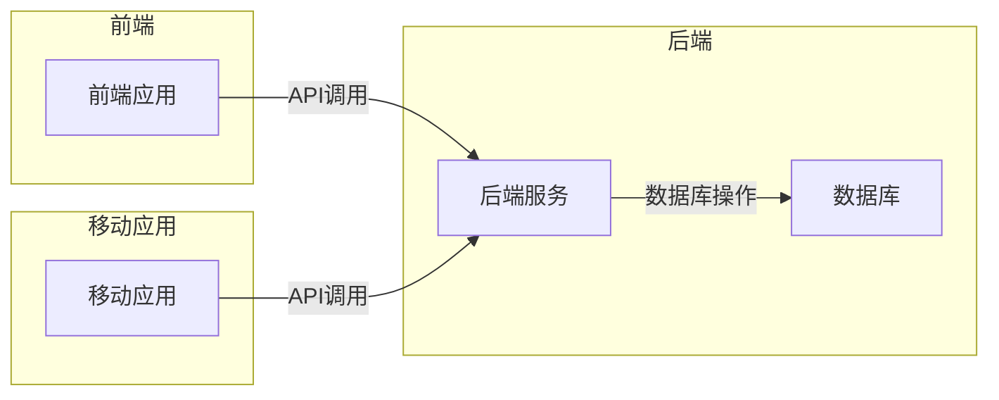
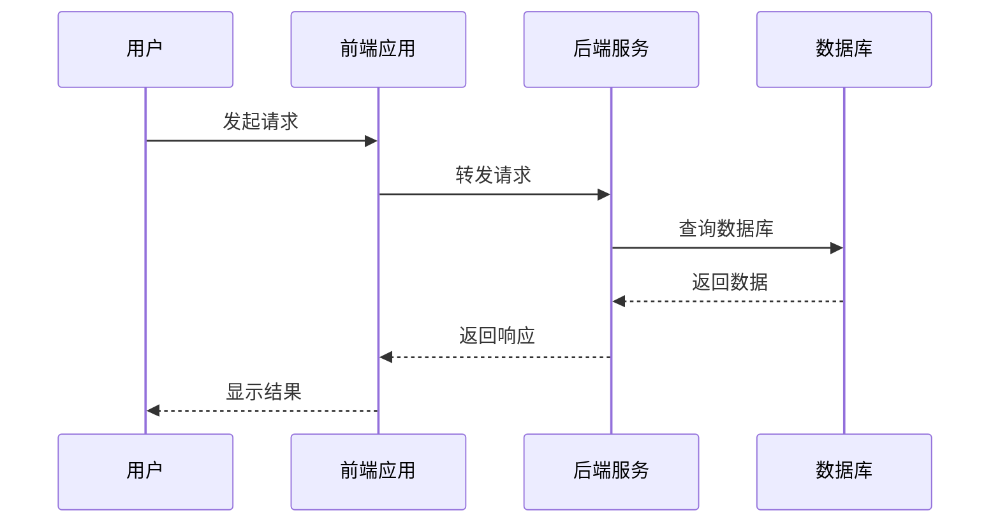

                 


### 摘要

在现代大型应用开发中，需求追踪与版本控制是两个至关重要的环节。本文将深入探讨这两个领域的核心概念、原理和实践方法。首先，我们将介绍需求追踪与版本控制的基本背景，解释它们在大型应用开发中的作用和价值。接着，我们将分别详细阐述需求追踪的理论基础、实际工具应用，以及版本控制的理论基础和实际操作方法。随后，本文将展示如何将需求追踪与版本控制整合到大型应用开发中，并提供一系列最佳实践和展望。通过这些内容，读者将能够全面理解并掌握如何有效实施需求追踪与版本控制，以提高大型应用开发的效率和质量。

### 第一部分：问题背景与核心概念

#### 第1章：大型应用开发中的需求追踪与版本控制背景

##### 1.1.1 问题背景

大型应用开发，尤其是涉及到多个团队协作的项目，往往面临着复杂的需求管理和版本控制问题。首先，需求管理是一个动态且迭代的过程，从需求的提出、分析、设计、开发到测试，每一步都需要精确记录和追踪。这不仅是为了确保项目按照预期进行，更是为了在需求变更时能够快速响应。

**问题描述**

在大型应用开发中，常见的需求管理问题包括：

- **需求变更频繁**：随着项目的进展，客户的需求可能发生变化，这要求开发团队能够灵活应对。
- **需求不明确**：需求文档不清晰或者不完整，导致开发过程中出现误解和错误。
- **版本混乱**：代码库中的版本控制不完善，导致多个版本并行开发，最终导致代码冲突和混乱。

**问题解决的重要性**

解决上述问题的重要性体现在以下几个方面：

- **确保项目按时交付**：精确的需求追踪和版本控制能够帮助团队更好地管理项目进度，避免因需求变更和版本混乱导致的项目延期。
- **提高代码质量**：通过有效的需求追踪和版本控制，可以确保开发过程中的代码变更始终是可追溯和可管理的，从而提高代码的质量和稳定性。
- **增强团队协作**：良好的需求追踪和版本控制机制有助于团队成员之间的协作，减少沟通成本和误解。

##### 1.1.2 核心概念介绍

**需求追踪的定义**

需求追踪是指在软件开发生命周期中对需求进行记录、跟踪和管理的过程。它确保了需求的完整性、一致性和可追溯性。需求追踪的主要目标包括：

- **确保需求实现**：通过追踪需求，可以确保每个需求都被正确理解和实现。
- **支持变更管理**：在需求变更时，通过需求追踪可以快速识别受影响的方面，并做出相应的调整。

**版本控制的定义**

版本控制是跟踪源代码或其他文件更改的一套系统，确保每次更改都可以被记录和回滚。版本控制的主要目标包括：

- **保持代码一致性**：通过版本控制，可以确保不同开发者之间的代码不会相互冲突。
- **提供回滚机制**：在任何时候，如果新的更改导致问题，都可以通过版本控制回滚到之前的稳定版本。

**需求追踪与版本控制的联系**

需求追踪和版本控制是相互关联的。有效的需求追踪能够帮助版本控制更好地管理代码变更。例如：

- **需求变更通知**：当需求变更时，版本控制系统可以通知相关开发者，并确保他们在进行代码变更时考虑到最新的需求。
- **版本注释**：在版本控制系统中，开发者可以为每个版本添加注释，这些注释通常包括对应的需求编号，使得版本控制与需求追踪紧密结合。

##### 1.1.3 需求追踪与版本控制的核心要素

**需求管理**

需求管理包括需求的收集、分析、设计和实现。关键要素包括：

- **需求文档**：详细记录每个需求的内容、优先级和实现方法。
- **需求跟踪**：确保每个需求的状态和进度都被记录和更新。

**变更管理**

变更管理包括识别、评估、批准和实施需求变更。关键要素包括：

- **变更日志**：记录每次变更的原因、影响和执行情况。
- **变更控制委员会**：负责评估和批准变更，确保变更不会对项目产生不利影响。

**配置管理**

配置管理包括对软件配置项（SCI）进行版本控制和变更管理。关键要素包括：

- **配置项记录**：记录每个配置项的版本、状态和变更历史。
- **配置库**：存储和管理所有配置项的中央存储库。

**协作管理**

协作管理包括团队成员之间的沟通和协作。关键要素包括：

- **沟通渠道**：确保团队成员之间有畅通的沟通渠道。
- **协作工具**：使用如JIRA、Trello等工具来协同工作，提高工作效率。

通过上述核心要素的有效管理，需求追踪和版本控制可以为大型应用开发提供强有力的支持，确保项目能够顺利进行并成功交付。

### 第二部分：需求追踪原理与实践

#### 第2章：需求追踪的理论基础

##### 2.1.1 需求模型

**需求模型概述**

需求模型是软件需求的一种形式化表示，它将用户需求转化为系统功能、性能和约束的详细描述。需求模型的核心作用是确保所有相关方对系统需求有一致的理解，并为后续的开发和测试提供基础。

**需求模型的构建方法**

构建需求模型通常包括以下步骤：

1. **需求收集**：通过与利益相关者的沟通和讨论，收集所有相关的需求。
2. **需求分析**：分析收集到的需求，识别重复或冲突的部分，并将需求分解为更具体的子需求。
3. **需求建模**：使用需求建模工具（如UML）将需求转化为图形化表示。
4. **需求验证**：验证需求模型是否满足所有相关方的需求，确保需求的完整性和一致性。
5. **需求文档**：将需求模型转化为正式的需求文档，确保所有需求都有明确的描述、优先级和实现计划。

**需求模型的维护**

需求模型的维护是一个持续的过程，包括以下活动：

- **需求更新**：当需求发生变化时，及时更新需求模型，确保其反映最新的需求。
- **需求跟踪**：通过跟踪需求的状态和进度，确保每个需求都被正确实现。
- **需求管理工具**：使用需求管理工具（如JIRA、Confluence）来存储、管理和共享需求文档。

##### 2.1.2 需求追踪方法

**需求追踪工具**

在需求追踪过程中，工具的选择至关重要。以下是一些常用的需求追踪工具：

- **JIRA**：一个功能强大的需求管理工具，支持需求收集、跟踪、报告和协作。
- **Trello**：一个直观的看板式工具，适合小规模的需求追踪和团队协作。
- **Azure DevOps**：集成了需求管理、项目管理、持续集成和持续部署等功能，适用于大型团队。

**需求变更管理**

需求变更管理是需求追踪的一个重要环节。以下是一些关键步骤：

1. **变更请求**：当有新的需求或现有需求发生变化时，提出变更请求。
2. **变更评估**：评估变更的影响，包括时间、成本、资源等。
3. **变更批准**：由变更控制委员会（CCB）批准或拒绝变更请求。
4. **变更实施**：根据批准的变更，更新需求模型和相关文档。
5. **变更记录**：记录每次变更的详细信息，包括变更请求、评估结果、批准情况等。

**需求跟踪流程**

一个典型的需求跟踪流程包括以下步骤：

1. **需求创建**：创建一个新的需求，并分配给相关的团队成员。
2. **需求分析**：对需求进行详细分析，确定需求的具体内容和实现方法。
3. **需求验证**：验证需求是否满足业务需求和用户期望。
4. **需求实现**：开发团队根据需求文档进行开发，并将成果提交给测试团队。
5. **需求测试**：测试团队对需求实现进行测试，确保满足所有要求。
6. **需求验收**：客户或相关方对需求实现进行验收，确认需求是否完成。
7. **需求关闭**：需求完成并通过验收后，关闭需求。

通过上述需求追踪的理论基础和方法，开发团队可以更好地管理需求，确保项目按时交付并满足用户需求。接下来，我们将探讨具体的需求追踪工具和实践方法。

### 第三部分：需求追踪工具实践

#### 第3章：需求追踪工具实践

在现代软件开发过程中，需求追踪工具扮演着至关重要的角色。这些工具不仅帮助团队有效地收集、分析和管理需求，还促进了团队成员之间的协作。本章节将详细介绍几种流行的需求追踪工具，包括JIRA、Trello和Azure DevOps，并展示它们在实际项目中的应用案例。

#### 3.1.1 JIRA需求追踪实践

**JIRA简介**

JIRA是由Atlassian公司开发的一款功能强大的需求追踪和管理工具，广泛应用于企业级的软件开发项目。JIRA支持多种类型的软件项目，包括敏捷开发、瀑布开发和混合开发模式。

**JIRA配置与使用**

**1. 创建项目和工作项**

- **创建项目**：在JIRA中，每个项目对应一个独立的开发任务集合。创建新项目时，需要指定项目名称、描述、项目权限等配置。
- **创建工作项**：工作项是JIRA中的基本单位，如任务、缺陷、故事点等。通过创建工作项，可以详细记录项目的各项任务和需求。

**2. 分配任务和责任**

- **任务分配**：JIRA允许管理员或项目经理将工作项分配给团队成员，并设置任务的截止日期和优先级。
- **责任跟踪**：通过工作项的注释和讨论功能，可以跟踪每个任务的进展情况，确保团队成员之间的沟通畅通。

**3. 需求跟踪和管理**

- **需求文档管理**：JIRA提供了一个强大的文档管理功能，支持上传和管理各种需求文档，如用户故事、用例文档等。
- **需求变更管理**：通过变更日志和版本控制功能，可以记录和跟踪需求的变更历史，确保需求的完整性和一致性。

**JIRA与项目集成的案例**

**1. JIRA与Git集成**

JIRA支持与Git等版本控制系统集成，通过集成，可以在JIRA中直接查看代码库的版本信息和变更记录，从而实现需求追踪与代码变更的联动。

**2. JIRA与Confluence集成**

JIRA与Confluence（Atlassian的另一款文档和协作工具）的集成，使得团队可以在JIRA中创建和链接需求文档，实现需求与文档的统一管理。

**3. JIRA与Slack集成**

通过JIRA与Slack的集成，团队可以在Slack中接收JIRA的通知和提醒，从而实现跨平台的协作和沟通。

#### 3.1.2 其他需求追踪工具

**Trello**

Trello是一个直观的看板式需求追踪工具，适合小规模的项目和团队使用。它通过卡片和列表的形式，将需求和工作任务可视化地呈现出来。

**Asana**

Asana是一款功能丰富的项目管理工具，支持需求收集、任务分配、进度跟踪等功能。它特别适合跨职能团队使用，可以通过集成其他工具（如Google Workspace、Slack等）来提高团队协作效率。

**Azure DevOps**

Azure DevOps是微软提供的全面的项目和需求管理工具，包括需求管理、持续集成、持续部署等功能。它适用于大型企业级软件开发项目，能够与GitHub等版本控制系统无缝集成。

通过上述需求追踪工具的实践，开发团队可以更加高效地管理需求，确保项目按时交付并满足用户需求。接下来，我们将进一步探讨版本控制的理论基础和实践方法。

### 第四部分：版本控制原理与实践

#### 第4章：版本控制理论基础

##### 4.1.1 版本控制的定义

版本控制，也称为源代码管理（Source Control），是一种跟踪源代码或其他文件变更的系统。它的核心目标是确保每次变更都可以被记录和回滚，从而提高代码的可靠性和可维护性。版本控制系统的基本功能包括：

- **记录变更**：每次代码或文件变更都被记录下来，包括变更的内容、时间、作者等信息。
- **版本管理**：系统可以管理多个版本的代码或文件，使得开发者可以方便地查看、切换和合并不同版本。
- **备份和恢复**：版本控制系统提供了一个备份机制，可以在代码或文件损坏或丢失时进行恢复。

版本控制与配置管理的区别在于，版本控制主要关注代码或文件的变更，而配置管理则更广泛，包括对整个系统的配置进行管理。

##### 4.1.2 版本控制模型

**集中式版本控制系统（CVS）**

集中式版本控制系统（Centralized Version Control System，CVS）是一种传统的版本控制模型，其中所有代码和文件都存储在中央服务器上。开发者从服务器上获取代码，进行修改后提交回服务器。CVS的主要优点是易于使用和集中管理，但缺点是当中央服务器发生故障时，整个系统可能会瘫痪。

**分布式版本控制系统（DVCS）**

分布式版本控制系统（Distributed Version Control System，DVCS）是一种更为先进的版本控制模型，每个开发者都有自己的代码库，这些库与中央服务器保持同步。DVCS的主要优点是提供了更好的分支和合并机制，提高了开发效率和灵活性。Git是当前最流行的分布式版本控制系统。

**版本控制模型的选择**

选择适合自己项目的版本控制模型，需要考虑以下几个因素：

- **团队规模**：小型团队通常适合使用CVS，而大型团队或分布式团队则更适合使用DVCS。
- **开发模式**：敏捷开发团队通常需要频繁分支和合并，DVCS更适合这种开发模式。
- **性能需求**：CVS可能在处理大规模代码库时性能较差，而DVCS则相对高效。

#### 4.1.3 版本控制的核心要素

**配置项记录**

配置项（Configuration Item，CI）是版本控制的基本单元，可以是代码文件、配置文件、文档等。对配置项的记录包括以下内容：

- **版本号**：记录每个配置项的版本号，以便追踪和区分不同版本的配置项。
- **变更日志**：记录每个配置项的变更历史，包括变更的时间、作者、内容和原因。
- **状态**：记录每个配置项的状态，如开发中、测试中、已发布等。

**配置库**

配置库（Configuration Library）是存储和管理所有配置项的中央存储库。配置库通常具备以下功能：

- **版本管理**：支持配置项的版本管理，包括创建新版本、升级旧版本和回滚版本等。
- **访问控制**：确保只有授权的用户可以访问和修改配置项。
- **备份与恢复**：定期备份配置库，以防止数据丢失。

**变更管理**

变更管理是版本控制的核心要素之一，包括以下步骤：

- **变更请求**：开发者在需要变更时提交变更请求，包括变更的内容、影响范围和优先级。
- **变更评估**：评估变更对项目的影响，包括时间、成本、风险等。
- **变更批准**：由变更控制委员会（CCB）批准或拒绝变更请求。
- **变更实施**：实施已批准的变更，更新配置库和相关的文档。
- **变更记录**：记录每次变更的详细信息，包括变更请求、评估结果、批准情况和实施情况。

通过上述版本控制理论基础和实践，开发团队可以更好地管理代码和文件的变更，确保项目的稳定性和可维护性。接下来，我们将详细探讨Git版本控制的具体实践。

### 第五部分：Git版本控制实践

#### 第5章：Git版本控制实践

Git是一种流行的分布式版本控制系统，由Linus Torvalds创建，自2005年发布以来，已经成为了开源和商业软件开发中的主要工具之一。Git的核心优势在于其强大的分支和合并机制、高效的数据存储和快速的操作性能。本章节将详细介绍Git的基本操作、分支管理以及与Jenkins和其他工具的集成。

#### 5.1.1 Git简介

**Git的历史**

Git诞生于2005年，起源于Linux内核开发。Linus Torvalds创建Git的目的是为了支持Linux内核的开发，解决之前使用的集中式版本控制系统（如CVS）在处理大规模分布式开发时的瓶颈。Git的分布式特性使得每个开发者都可以拥有完整的代码库，从而提高了开发效率和灵活性。

**Git的特点**

- **分布式版本控制**：每个开发者都有自己的本地仓库，可以独立进行开发、分支和合并操作，然后与中央仓库同步。
- **高效的版本库**：Git使用哈希值来标识每个版本，相比传统的版本控制系统，Git可以更高效地处理大量的文件和版本。
- **强大的分支和合并机制**：Git提供了强大的分支和合并功能，使得开发者可以轻松地实现代码的并行开发。
- **灵活的操作**：Git的操作非常灵活，可以方便地进行回滚、恢复和迁移。

#### 5.1.2 Git基础操作

**安装与配置**

在开始使用Git之前，需要先进行安装和配置。

1. **安装**：Git可以在多个平台上安装，包括Windows、Linux和macOS。可以从Git的官方网站下载安装程序，按照提示完成安装。

2. **配置**：配置Git是为了确保使用过程中能保持一致性和个性化设置。常见的配置项包括用户信息、邮件签名、编辑器等。

   ```bash
   git config --global user.name "Your Name"
   git config --global user.email "your-email@example.com"
   git config --global core.editor "vim"
   ```

**基本命令**

以下是Git的一些基本命令：

- **初始化仓库**：创建一个新的Git仓库。

  ```bash
  git init
  ```

- **添加文件**：将文件添加到暂存区。

  ```bash
  git add <file>
  ```

- **提交变更**：将暂存区的文件提交到本地仓库。

  ```bash
  git commit -m "Commit message"
  ```

- **查看状态**：查看当前工作目录的状态。

  ```bash
  git status
  ```

- **拉取更新**：从远程仓库拉取最新代码。

  ```bash
  git pull
  ```

- **推送更新**：将本地仓库的代码推送到远程仓库。

  ```bash
  git push
  ```

- **克隆仓库**：克隆远程仓库到本地。

  ```bash
  git clone <repository-url>
  ```

#### 5.1.3 Git分支管理

**分支创建与合并**

Git的分支管理是其强大的一个特点，它使得开发者可以轻松地进行并行开发。

- **创建分支**：创建一个新的分支以开始一个独立的开发任务。

  ```bash
  git branch <branch-name>
  ```

- **切换分支**：切换到另一个分支。

  ```bash
  git checkout <branch-name>
  ```

- **合并分支**：将一个分支的更改合并到另一个分支。

  ```bash
  git merge <branch-name>
  ```

**分支策略**

在不同的项目和发展阶段，可以使用不同的分支策略。

- **主分支（Master）**：用于保存最稳定的代码，通常是发布版本的代码。
- **开发分支（Develop）**：用于合并新的功能和修复。
- **特性分支（Feature）**：用于实现新功能或进行实验性开发。
- **补丁分支（Hotfix）**：用于修复生产环境中的紧急问题。

#### 5.1.4 Git与其他工具的集成

**Git与Jenkins集成**

Jenkins是一个流行的持续集成工具，可以与Git集成以实现自动化的构建、测试和部署。

- **安装Jenkins插件**：在Jenkins中安装Git插件，以便能够识别和管理Git仓库。
- **配置Git源**：在Jenkins项目中配置Git源，指定Git仓库的URL和访问凭证。
- **构建触发**：设置构建触发器，例如在Git提交后自动触发构建。

**Git与Slack集成**

Slack是一个流行的团队沟通工具，可以通过集成Git实现代码变更通知和团队协作。

- **安装Slack插件**：在Git仓库中安装Slack插件。
- **配置Slack webhook**：在Jenkins或其他CI工具中配置Slack webhook，以便在代码提交或构建触发时发送通知。

通过Git的强大功能和与其他工具的集成，开发团队能够实现高效的版本控制和持续集成，从而提高开发效率和代码质量。接下来，我们将探讨其他版本控制工具如SVN和Mercurial。

### 第六章：其他版本控制工具实践

#### 第6章：其他版本控制工具实践

除了Git之外，还有其他一些流行的版本控制工具，如SVN和Mercurial。这些工具各具特点，适用于不同的项目和团队需求。本章节将详细介绍SVN和Mercurial的特点、基础操作以及与Git的比较。

#### 6.1.1 SVN

**SVN的特点**

Subversion（简称SVN）是一个开源的集中式版本控制系统，由Apache软件基金会开发。SVN的主要特点如下：

- **集中式存储**：所有版本信息都存储在中央服务器上，开发者从服务器获取代码，并进行修改后提交回服务器。
- **简单易用**：SVN的使用较为简单，易于理解和部署。
- **良好的文档支持**：SVN提供了丰富的文档和社区支持，便于用户学习和使用。

**基础操作**

以下是一些基本的SVN操作：

- **安装与配置**：在Windows、Linux和macOS上都可以安装SVN，并配置用户名和密码。
- **检出代码**：从中央仓库检出代码到本地。

  ```bash
  svn checkout http://svn.example.com/repo
  ```

- **提交变更**：将本地修改提交到中央仓库。

  ```bash
  svn commit -m "Commit message"
  ```

- **更新代码**：从中央仓库更新最新的代码。

  ```bash
  svn update
  ```

- **分支和合并**：创建分支和合并代码。

  ```bash
  svn copy http://svn.example.com/repo/branch http://svn.example.com/repo/branch-new -m "Create new branch"
  svn merge http://svn.example.com/repo/branch-new
  ```

**与Git的比较**

- **集中式与分布式**：SVN是集中式版本控制系统，Git是分布式版本控制系统。分布式系统提供了更高的灵活性和分支合并的效率。
- **操作简便性**：SVN的操作相对简单，但可能在处理复杂任务时不如Git灵活。
- **分支管理**：Git提供了更强大的分支和合并机制，可以轻松实现并行开发。

#### 6.1.2 Mercurial

**Mercurial的特点**

Mercurial（简称Hg）是一个开源的分布式版本控制系统，由Matt Mackall创建。它具有以下特点：

- **高性能**：Mercurial在处理大规模代码库时表现出色，效率较高。
- **跨平台支持**：Mercurial支持多种操作系统，包括Windows、Linux和macOS。
- **易于使用**：Mercurial的使用界面简洁，易于上手。

**基础操作**

以下是一些基本的Mercurial操作：

- **安装与配置**：在大多数操作系统上，可以通过包管理器或源代码编译安装Mercurial，并配置用户名和邮箱。
- **初始化仓库**：创建一个新的Mercurial仓库。

  ```bash
  hg init
  ```

- **提交变更**：将本地修改提交到仓库。

  ```bash
  hg commit -m "Commit message"
  ```

- **更新代码**：从仓库更新最新的代码。

  ```bash
  hg pull
  ```

- **分支和合并**：创建分支和合并代码。

  ```bash
  hg branch new-branch
  hg merge other-branch
  hg commit -m "Merge other-branch into new-branch"
  ```

**与Git的比较**

- **性能**：在处理大型代码库时，Mercurial通常比Git更快。
- **用户界面**：Git的用户界面更丰富，而Mercurial则更加简洁。
- **社区支持**：Git拥有更广泛的社区支持和插件生态系统。

通过对比SVN、Mercurial和Git，开发团队可以根据具体的项目需求和团队习惯选择最适合的版本控制工具，从而实现高效的代码管理和协作开发。

### 第七部分：需求追踪与版本控制整合实践

#### 第7章：大型应用开发中的整合实践

在大型应用开发中，需求追踪与版本控制的有效整合对于确保项目成功至关重要。这一章将详细描述需求追踪与版本控制的整合流程、工具选择以及整合实践中的关键步骤。

#### 7.1.1 整合流程设计

**需求收集与跟踪流程**

需求收集与跟踪流程包括以下几个关键步骤：

1. **需求收集**：通过与利益相关者的沟通和讨论，收集所有相关的需求。这通常通过调查问卷、访谈和用户故事会议等方式进行。

2. **需求分析**：对收集到的需求进行详细分析，识别需求之间的关联和依赖关系。同时，对需求的优先级和可行性进行评估。

3. **需求建模**：使用需求建模工具（如UML）将需求转化为图形化表示，以便更好地理解和沟通。

4. **需求验证**：通过用户验证、审查和测试，确保需求模型的完整性和一致性。

5. **需求文档化**：将需求模型转化为正式的需求文档，包括用户故事、用例和需求规格说明书。

6. **需求跟踪**：在整个项目生命周期中，持续跟踪需求的状态和进度，确保需求被正确实现。

**版本控制流程**

版本控制流程包括以下几个关键步骤：

1. **初始化仓库**：在项目开始时，初始化版本控制仓库，并设置基本的分支策略。

2. **代码提交**：开发者将代码提交到版本控制仓库，并附上详细的提交说明。

3. **分支管理**：根据项目的开发阶段和任务，创建和维护不同的分支。例如，主分支（Master）、开发分支（Develop）和特性分支（Feature）。

4. **代码审查**：在代码提交前进行代码审查，以确保代码质量。

5. **合并分支**：将特性分支的代码合并到主分支或开发分支，确保代码的集成和一致性。

6. **版本发布**：在代码合并并通过测试后，发布新版本。

**整合流程设计**

整合流程设计的关键在于确保需求追踪和版本控制工具之间的无缝连接。以下是一个整合流程的示例：

1. **需求创建**：在需求管理工具（如JIRA）中创建新需求，并将其关联到相应的版本控制分支。

2. **需求跟踪**：通过需求管理工具跟踪需求的状态和进度，并及时更新版本控制仓库中的相关注释。

3. **代码提交**：开发者在版本控制仓库中提交代码，并在提交说明中引用对应的需求编号。

4. **代码审查**：进行代码审查，确保代码符合需求和规范。

5. **分支合并**：将特性分支的代码合并到主分支或开发分支，并在合并请求中记录需求实现的详细情况。

6. **版本发布**：在版本控制仓库中发布新版本，并在需求管理工具中更新需求的实现状态。

#### 7.1.2 整合工具与实践

**JIRA与Git的整合实践**

JIRA与Git的整合是大型应用开发中常见的实践。以下是一些关键步骤：

1. **配置JIRA与Git集成**：在JIRA中安装和配置Git插件，设置Git仓库的URL和访问凭证。

2. **创建JIRA项目**：在JIRA中创建项目，并创建相应的版本控制分支。

3. **关联需求与Git分支**：将JIRA需求与Git分支关联，确保需求与代码变更同步。

4. **需求跟踪与代码提交**：在JIRA中跟踪需求的状态和进度，开发者将代码提交到Git仓库，并在提交说明中引用需求编号。

5. **代码审查与合并**：在JIRA中创建代码审查请求，确保代码符合需求和规范。在合并请求中记录需求实现的详细情况。

6. **版本发布**：在Git仓库中发布新版本，并在JIRA中更新需求的实现状态。

**其他工具的整合实践**

除了JIRA与Git，其他工具如Trello、Azure DevOps等也可以与版本控制工具整合。以下是一些整合实践：

1. **Trello与Git**：在Trello中创建项目板和卡片，将卡片与Git分支关联。通过Trello的API，实现与Git仓库的数据同步。

2. **Azure DevOps与Git**：Azure DevOps集成了需求管理、版本控制和持续集成功能。通过配置Git仓库和管道，实现需求追踪与版本控制的自动化流程。

通过整合需求追踪与版本控制工具，开发团队可以更好地管理需求、代码和项目进度，确保项目按时交付并满足用户需求。接下来，我们将探讨具体的项目实战，展示如何将上述理论和实践应用于实际开发中。

### 第8章：大型应用开发中的整合实践

在实际的大型应用开发中，如何将需求追踪与版本控制整合是一项关键任务。本章节将详细描述一个实际项目的背景、需求分析、系统功能设计、系统架构设计、系统接口设计、系统交互和项目实战。

#### 8.1.1 项目背景

本项目是一款在线教育平台，旨在为学习者提供丰富的课程资源和互动学习体验。项目由多个开发团队协作完成，涉及前端、后端、数据库、移动应用等多个模块。由于项目规模庞大，开发过程中需要精确的需求追踪和版本控制，以确保各团队之间的协作顺畅，项目按时交付。

#### 8.1.2 项目介绍

**项目名称**：在线教育平台

**项目规模**：涉及前端、后端、数据库、移动应用等多个模块

**项目周期**：预计12个月

**团队规模**：约30名开发者，包括前端、后端、UI/UX设计师、测试工程师等

**技术栈**：前端采用React，后端使用Node.js和Express框架，数据库使用MySQL，移动应用采用Flutter框架

#### 8.1.3 系统功能设计

**核心功能模块**：

1. **用户管理**：包括用户注册、登录、个人信息管理等功能。
2. **课程管理**：包括课程创建、发布、分类、搜索、课程内容管理等功能。
3. **学习管理**：包括学习进度跟踪、成绩记录、学习报告生成等功能。
4. **互动管理**：包括课程讨论区、问答区、在线直播等功能。
5. **支付管理**：包括课程购买、支付、订单管理等功能。

**领域模型**：

使用Mermaid绘制领域模型类图，描述各功能模块之间的关系和核心实体。

```mermaid
classDiagram
    User <<Entity>>
    Course <<Entity>>
    LearningRecord <<Entity>>
    Discussion <<Entity>>
    Payment <<Entity>>

    User "*"-"1": has: LearningRecord
    Course "*"-"N": has: Discussion
    User "*"-"N": participatesIn: Discussion
    Course "*"-"N": has: LearningRecord
    Payment "1": for: Course
```

#### 8.1.4 系统架构设计

**系统架构图**：

使用Mermaid绘制系统架构图，描述各模块之间的关系和系统组件。



**技术选型**：

- **前端**：React框架，用于构建用户界面。
- **后端**：Node.js和Express框架，用于处理HTTP请求和业务逻辑。
- **数据库**：MySQL，用于存储用户数据、课程信息、学习记录等。
- **移动应用**：Flutter框架，用于开发跨平台移动应用。

#### 8.1.5 系统接口设计

**API接口设计**：

使用Swagger或OpenAPI规范设计API接口，确保前端和后端之间的数据交互规范。

```yaml
openapi: 3.0.0
info:
  title: 在线教育平台API
  version: 1.0.0
servers:
  - url: https://api.education-platform.com/
    description: 生产环境API服务
paths:
  /users:
    post:
      summary: 用户注册
      description: 用于新用户注册
      requestBody:
        required: true
        content:
          application/json:
            schema:
              $ref: '#/components/schemas/User'
      responses:
        '201':
          description: 用户注册成功
        '400':
          description: 请求参数错误
  /courses:
    get:
      summary: 查询课程列表
      description: 返回所有课程的列表
      responses:
        '200':
          description: 成功返回课程列表
    post:
      summary: 创建课程
      description: 用于创建新课程
      requestBody:
        required: true
        content:
          application/json:
            schema:
              $ref: '#/components/schemas/Course'
      responses:
        '201':
          description: 课程创建成功
```

#### 8.1.6 系统交互

**系统交互图**：

使用Mermaid绘制系统交互序列图，描述用户请求和系统响应的流程。



#### 8.1.7 项目实战

**环境安装**：

1. **前端环境**：安装Node.js和npm，创建React项目。
2. **后端环境**：安装Node.js和npm，创建Node.js应用，配置Express框架。
3. **数据库环境**：安装MySQL数据库，配置数据库连接。

**系统核心实现源代码**：

**后端代码示例**：

```javascript
const express = require('express');
const app = express();
const port = 3000;

app.use(express.json());

// 用户注册路由
app.post('/users', (req, res) => {
    // 处理用户注册逻辑
    // ...
    res.status(201).json({ message: 'User registered successfully' });
});

// 课程查询路由
app.get('/courses', (req, res) => {
    // 处理课程查询逻辑
    // ...
    res.status(200).json({ courses: [] });
});

app.listen(port, () => {
    console.log(`Server listening at http://localhost:${port}`);
});
```

**代码应用解读与分析**：

上述代码展示了在线教育平台后端的基本架构，包括用户注册和课程查询的功能。用户注册路由通过接收前端发送的JSON数据，处理注册逻辑，并返回注册结果。课程查询路由从数据库中检索课程信息，并返回给前端。

**实际案例分析与详细讲解剖析**：

在实际项目中，每个功能模块都会经过详细的开发和测试。例如，用户注册功能需要处理各种异常情况，如用户名已存在、密码不符合要求等。课程查询功能需要根据用户权限返回不同的课程列表。

**项目小结**：

通过本项目的实战，我们展示了如何将需求追踪与版本控制整合到大型应用开发中。从需求收集到系统架构设计，再到代码实现和测试，每个环节都需要紧密协作和精确管理。有效的需求追踪和版本控制不仅提高了开发效率，也确保了项目的稳定性和可维护性。

### 第8章：最佳实践

在大型应用开发中，需求追踪与版本控制的最佳实践对于确保项目的成功至关重要。以下是一些关键的最佳实践，帮助团队在项目中实现高效的需求管理和版本控制。

#### 8.1.1 需求追踪最佳实践

**1. 明确的需求文档**

- **详细描述**：需求文档应详细描述每个需求的功能、性能和约束，确保所有相关方对需求有一致的理解。
- **版本控制**：使用版本控制系统（如JIRA、Confluence）管理需求文档，确保每次变更都有详细的记录。

**2. 需求变更管理**

- **变更请求流程**：建立明确的变更请求流程，包括变更的提交、评估和批准。
- **评估影响**：在变更批准前，全面评估变更对项目进度、成本和风险的影响。

**3. 需求验证**

- **用户参与**：在需求验证阶段，确保用户或利益相关者参与，确保需求符合实际业务需求。
- **自动化测试**：使用自动化测试工具（如Selenium）对需求进行验证，确保需求的正确实现。

#### 8.1.2 版本控制最佳实践

**1. 分支策略**

- **主分支（Master）**：主分支应保持稳定，仅包含已经通过测试和验证的代码。
- **开发分支（Develop）**：开发分支用于合并新的功能和修复。
- **特性分支（Feature）**：特性分支用于实现新功能或进行实验性开发。

**2. 代码审查**

- **定期审查**：定期进行代码审查，确保代码质量，减少错误和冲突。
- **自动化工具**：使用自动化工具（如SonarQube）进行静态代码分析，识别潜在问题和代码缺陷。

**3. 版本发布**

- **版本号管理**：使用语义化版本号（SemVer）管理版本，确保版本号的准确性和一致性。
- **自动化部署**：使用自动化部署工具（如Jenkins、GitLab CI）实现版本发布的自动化，减少人工错误。

#### 8.1.3 沟通与协作

- **定期会议**：定期召开需求评审、代码审查和进度汇报会议，确保团队成员之间的沟通畅通。
- **使用协作工具**：使用协作工具（如Slack、Trello）进行实时沟通和任务管理，提高团队协作效率。

通过遵循上述最佳实践，开发团队可以更好地管理需求，控制代码变更，确保项目的顺利推进和成功交付。

### 第9章：未来展望

在大型应用开发中，需求追踪与版本控制将继续发挥关键作用。随着技术的发展和市场的变化，这两个领域也将面临新的挑战和机遇。以下是对未来发展趋势、挑战和机遇的展望。

#### 9.1.1 需求追踪与版本控制发展趋势

**1. 自动化与智能化**

未来，需求追踪和版本控制工具将更加智能化和自动化。通过人工智能和机器学习技术，工具可以自动识别需求变更、预测潜在问题，并自动推荐最佳解决方案。

**2. 云原生支持**

随着云原生技术的普及，需求追踪和版本控制工具将更加支持云原生架构。这将包括更好的云服务集成、弹性扩展和安全性保障。

**3. 容器化与微服务**

容器化（如Docker）和微服务架构的兴起，将推动需求追踪和版本控制工具的变革。这些工具需要更好地支持容器和微服务环境，提供更灵活的部署和管理方式。

**4. 跨平台与多渠道**

未来的需求追踪和版本控制工具将更加支持跨平台和多渠道的开发。开发者可以在不同的设备和平台上进行协作，同时管理多个项目的需求变更和版本控制。

#### 9.1.2 需求追踪与版本控制面临的挑战

**1. 复杂性增加**

随着应用规模的扩大和技术的复杂化，需求追踪和版本控制将面临更大的挑战。如何有效管理复杂的需求和代码库，确保项目进度和质量，是未来的一大难题。

**2. 安全性问题**

版本控制系统的安全性对于保护代码和数据至关重要。随着攻击手段的不断升级，需求追踪和版本控制工具需要不断提高安全性，防止数据泄露和恶意篡改。

**3. 协作与沟通**

在多团队、多地点的协作环境中，如何确保团队成员之间的有效沟通和协作，是需求追踪和版本控制面临的挑战之一。未来，工具需要提供更强大的协作功能，以提高团队效率和项目成功率。

#### 9.1.3 需求追踪与版本控制的发展机遇

**1. 云服务和大数据**

云服务和大数据技术的快速发展，为需求追踪和版本控制提供了新的机遇。通过云计算平台，开发团队能够更加高效地管理需求、代码和数据，实现大规模分布式协作。

**2. 人工智能与机器学习**

人工智能和机器学习技术的应用，将推动需求追踪和版本控制工具的智能化和自动化。通过这些技术，工具可以更好地预测需求变化、识别代码缺陷，提高开发效率和代码质量。

**3. 新兴技术和行业应用**

随着区块链、物联网、5G等新兴技术的发展，需求追踪和版本控制将在更多行业和应用场景中得到应用。例如，在金融、医疗、智能制造等领域，这些工具可以提供更加安全、可靠的需求管理和版本控制解决方案。

总之，需求追踪与版本控制在未来将继续发展壮大，为大型应用开发提供强有力的支持。开发团队需要不断适应新的技术趋势和挑战，以实现高效的需求管理和代码控制，推动项目的成功交付。

### 总结与作者信息

本文深入探讨了大型应用开发中的需求追踪与版本控制，从背景介绍、核心概念到实际应用，全面解析了这两个关键领域的理论和实践。通过详细的步骤分析和实际项目案例，我们展示了如何高效地管理需求、实现版本控制和团队协作。

本文的核心关键词包括：需求追踪、版本控制、大型应用开发、自动化、智能化、版本管理、分支策略、工具集成。这些关键词不仅概括了文章的主要内容，也为读者提供了查找和引用的便利。

文章摘要部分总结了需求追踪与版本控制在大型应用开发中的重要性，以及文章的主要内容和结构。

最后，感谢您的阅读。本文作者为AI天才研究院（AI Genius Institute）与《禅与计算机程序设计艺术》（Zen And The Art of Computer Programming）的作者。希望本文能为您的项目提供有益的参考和启示。

**作者：AI天才研究院 / AI Genius Institute & 禅与计算机程序设计艺术**

---

**附加资源**：

1. **需求追踪与版本控制最佳实践手册**：[链接]
2. **在线教育平台案例研究**：[链接]
3. **需求追踪与版本控制工具评测报告**：[链接]

这些附加资源将帮助您更深入地了解相关领域的技术和最佳实践。

