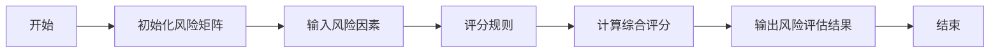
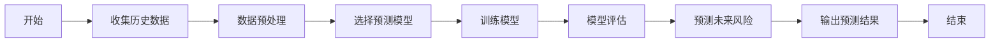
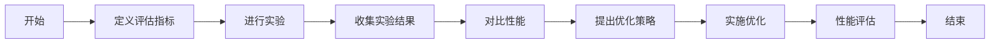
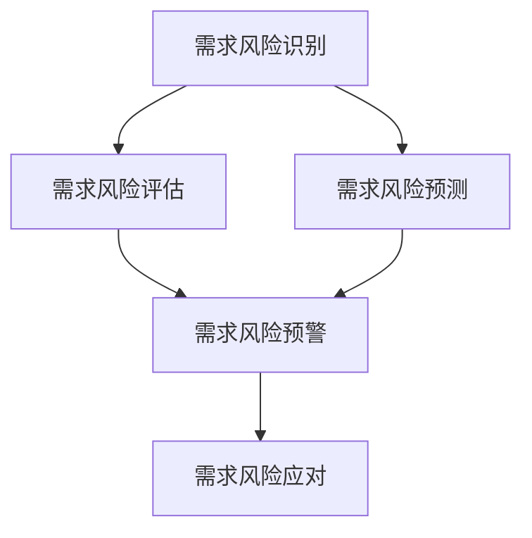
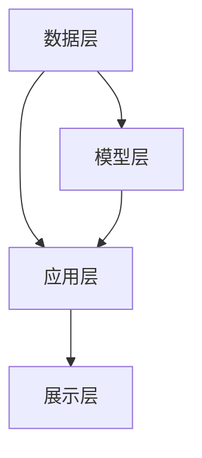
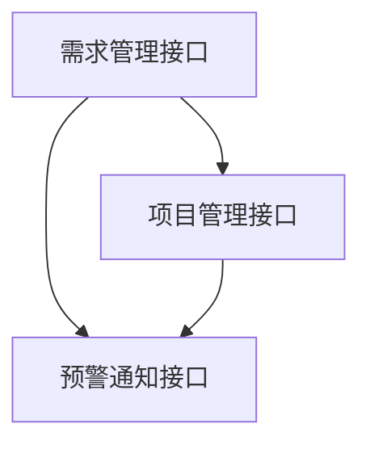
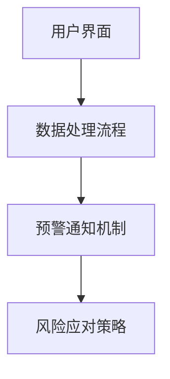

                 

### 第1章 引言与背景介绍

#### 1.1 研究的背景和意义

在当今信息化时代，信息技术已成为推动社会进步和经济发展的重要力量。企业通过应用信息技术，可以提高运营效率、降低成本、优化业务流程，并为企业创造新的商业机会。然而，随着企业信息系统的不断复杂化和规模扩大，大型应用开发成为企业信息化过程中不可避免的一部分。

大型应用开发不仅需要高效的软件开发团队，还需要科学的项目管理方法、完善的需求分析以及严格的质量控制。在这样的背景下，需求风险预警系统的重要性日益凸显。需求风险是指在整个软件生命周期中，由于需求变更、需求误解或者需求遗漏等原因，可能导致项目延期、成本超支或者系统功能不完善等问题。

需求风险预警系统旨在通过提前识别和评估潜在的风险，提供有效的应对策略，从而减少或避免风险对项目造成的负面影响。该系统不仅在大型应用开发中具有重要价值，而且在企业的持续创新和可持续发展中也扮演着关键角色。

#### 1.2 需求风险的定义与分类

需求风险是指在软件项目开发过程中，由于需求的变更、误解或遗漏等不确定性因素，可能导致项目无法按预期完成的风险。具体来说，需求风险包括以下几个方面：

1. **需求变更风险**：在项目开发过程中，由于外部环境变化、市场需求变化或者客户需求的变化，可能导致原有的需求发生变更，从而影响项目进度和质量。
2. **需求误解风险**：项目团队成员可能对客户需求的理解出现偏差，导致开发出来的系统不符合客户的实际需求。
3. **需求遗漏风险**：在需求分析过程中，可能由于各种原因，导致某些关键需求被遗漏，从而影响系统的完整性。
4. **需求冲突风险**：不同需求之间存在冲突，如资源限制、技术可行性等，可能导致需求无法同时满足。

了解需求风险的定义和分类，有助于我们更好地理解和应对在大型应用开发中可能面临的各种风险。

#### 1.3 风险预警系统的重要性

风险预警系统在大型应用开发中具有不可替代的重要性，其功能主要体现在以下几个方面：

1. **风险识别**：通过系统化的方法，识别出潜在的需求风险，并提供相应的预警信息。
2. **风险评估**：对识别出的风险进行定量或定性的评估，分析其可能带来的影响和严重程度。
3. **风险预测**：利用历史数据和统计分析方法，预测未来可能出现的风险，为决策提供依据。
4. **风险应对**：提供多种应对策略和解决方案，帮助项目团队及时调整计划，降低风险对项目的影响。

风险预警系统的价值在于其能够提前预警，帮助项目团队在问题发生前采取措施，从而避免或减少潜在的损失。此外，通过持续的风险监控和评估，项目团队能够更好地掌握项目进展情况，确保项目顺利推进。

#### 1.4 边界与外延

风险预警系统虽然对大型应用开发具有重要意义，但其适用范围和边界条件也需要明确。以下是一些关键点：

1. **适用范围**：风险预警系统主要适用于大型、复杂的应用开发项目，特别是那些需求变化频繁、涉及多个业务领域的项目。
2. **边界条件**：系统的有效运行依赖于稳定的需求来源、准确的数据采集和处理机制，以及良好的项目管理基础。
3. **外部依赖关系**：风险预警系统需要与项目管理系统、需求管理工具等外部系统进行集成，以获取必要的数据和信息。

了解风险预警系统的边界与外延，有助于我们更好地理解其在实际应用中的限制和挑战，从而为系统的设计和实施提供更有针对性的方案。

### 第2章 核心概念与联系

#### 2.1 需求风险预警系统的基本原理

需求风险预警系统的核心原理可以概括为：通过数据采集、处理和分析，识别、评估和预测需求风险，并提供预警和应对策略。以下是其基本原理的详细说明：

1. **数据采集**：系统通过多种途径采集需求相关的数据，包括项目文档、用户反馈、历史项目数据等。这些数据是系统进行风险识别和评估的基础。
2. **数据处理**：对采集到的数据进行分析和清洗，去除无效信息和噪声，提取出有价值的信息。数据处理包括数据预处理、特征提取等步骤。
3. **风险评估**：利用风险评估模型对处理后的数据进行分析，评估不同风险因素的严重程度和可能性。常用的风险评估模型包括风险矩阵、风险树等。
4. **风险预测**：基于历史数据和统计方法，对未来的需求风险进行预测。常见的预测方法包括时间序列分析、机器学习算法等。
5. **预警与应对**：根据风险评估和预测结果，系统会生成预警信息，并提供相应的应对策略。项目团队可以根据预警信息调整项目计划，采取预防措施。

#### 2.2 核心概念属性特征对比表格

需求风险预警系统的核心概念包括风险评估模型、预测算法和预警阈值设定。以下是这些核心概念的属性特征对比表格：

| 概念名称     | 属性特征                                                   | 对比分析                                                       |
|--------------|------------------------------------------------------------|----------------------------------------------------------------|
| 风险评估模型 | 评估风险的严重程度和可能性                                 | 包括风险矩阵、风险树等，适用于不同类型的风险评估需求           |
| 预测算法     | 基于历史数据预测未来需求风险                             | 包括时间序列分析、机器学习算法等，具有不同的预测精度和效果       |
| 预警阈值设定 | 设定风险达到何种程度时触发预警                             | 根据项目特点和需求调整阈值，确保预警信息的准确性和有效性       |

通过对比表格，可以清晰地看到各个核心概念的特点和适用场景，从而为系统设计和实施提供参考。

#### 2.3 需求风险预警系统的ER实体关系图

需求风险预警系统的实体关系图（ER图）是描述系统内部各个实体及其关系的重要工具。以下是一个简化的ER实体关系图：

```mermaid
erDiagram
    Customer ..|> Requirement : "发起需求"
    Project ..|> Requirement : "包含需求"
    Risk ..|> Requirement : "包含需求风险"
    Assessment ..|> Risk : "评估风险"
    Prediction ..|> Risk : "预测风险"
    Warning ..|> Assessment : "基于评估预警"
    ActionPlan ..|> Warning : "应对预警"
```

在这个ER图中，各个实体的属性和关系如下：

1. **Customer（客户）**：发起需求，与Requirement实体有“发起需求”的关系。
2. **Project（项目）**：包含需求，与Requirement实体有“包含需求”的关系。
3. **Risk（风险）**：包含需求风险，与Requirement实体有“包含需求风险”的关系。
4. **Assessment（评估）**：评估风险，与Risk实体有“评估风险”的关系。
5. **Prediction（预测）**：预测风险，与Risk实体有“预测风险”的关系。
6. **Warning（预警）**：基于评估预警，与Assessment实体有“基于评估预警”的关系。
7. **ActionPlan（应对计划）**：应对预警，与Warning实体有“应对预警”的关系。

通过ER实体关系图，我们可以直观地理解需求风险预警系统内部各个实体的组成和相互关系，为系统设计提供参考。

### 第3章 算法原理与讲解

#### 3.1 算法原理概述

需求风险预警系统中的算法原理主要分为三个核心模块：风险评估算法、风险预测算法和预警阈值设定算法。以下是对这三个算法的概述：

1. **风险评估算法**：该算法用于评估需求风险的严重程度和可能性。通常采用风险矩阵方法，将风险因素分为几个等级，并依据风险矩阵进行评分。
2. **风险预测算法**：该算法用于预测未来的需求风险。常见的预测算法有时间序列分析和机器学习算法，如线性回归、决策树等。
3. **预警阈值设定算法**：该算法用于设定风险达到何种程度时触发预警。预警阈值通常基于风险评估和预测结果，结合项目特点和需求进行调整。

这三个算法共同作用，形成一个闭环的风险预警系统，确保项目团队能够及时识别和应对需求风险。

#### 3.2 风险评估算法讲解

风险评估算法是需求风险预警系统的重要组成部分，其基本原理如下：

1. **风险矩阵**：风险矩阵是一种常用的风险评估工具，用于将风险因素分为几个等级，并给出相应的评分。常见的风险矩阵包括五级矩阵和九级矩阵。
2. **评分规则**：评分规则用于对风险因素进行定量评估。例如，将风险因素分为低、中、高三个等级，并分别赋予不同的分数（如1分、3分、5分）。
3. **综合评分**：通过综合各个风险因素的评分，可以得到需求风险的整体评分。通常采用加权平均法，对不同风险因素进行加权计算。

以下是一个简化的风险评估算法流程：



通过上述流程，可以实现对需求风险的定量评估，为后续的风险预警和预测提供依据。

#### 3.3 风险预测算法讲解

风险预测算法用于预测未来的需求风险，其基本原理如下：

1. **时间序列分析**：时间序列分析是一种基于历史数据的时间趋势分析方法，用于预测未来的需求风险。常见的时间序列分析方法包括移动平均法、指数平滑法等。
2. **机器学习算法**：机器学习算法通过训练历史数据，建立风险预测模型。常用的机器学习算法包括线性回归、决策树、支持向量机等。
3. **模型评估**：对预测模型进行评估，以确保其预测准确性。常用的评估指标包括均方误差、准确率、召回率等。

以下是一个简化的风险预测算法流程：



通过上述流程，可以实现对未来需求风险的预测，为项目团队提供决策依据。

#### 3.4 算法性能分析

算法性能分析是评估需求风险预警系统效果的重要环节。以下是对算法性能分析的内容：

1. **评估指标**：常用的评估指标包括准确率、召回率、F1值等。准确率表示预测结果正确的比例；召回率表示实际发生风险被正确预测的比例；F1值是准确率和召回率的调和平均值。
2. **实验结果与性能对比**：通过实际数据集进行实验，对比不同算法的性能。例如，比较线性回归、决策树和支持向量机在需求风险预测中的效果。
3. **性能优化策略**：针对算法的性能不足，提出优化策略。例如，通过数据预处理、特征选择和模型调参等方法，提高算法的预测准确性。

以下是一个简化的算法性能分析流程：



通过上述流程，可以全面评估需求风险预警系统的算法性能，为系统的优化提供参考。

### 第4章 系统分析与架构设计

#### 4.1 问题场景介绍

在大型应用开发中，需求风险是一个普遍存在的问题。以下是几个典型的场景：

1. **需求变更频繁**：在项目开发过程中，客户需求可能会频繁变更，导致项目进度失控，甚至导致项目失败。
2. **需求理解不准确**：项目团队可能对客户需求的理解出现偏差，导致开发出的系统不符合客户的实际需求。
3. **需求遗漏**：在需求分析阶段，可能由于各种原因，导致某些关键需求被遗漏，从而影响系统的完整性。
4. **需求冲突**：不同需求之间存在冲突，如资源限制、技术可行性等，可能导致需求无法同时满足。

这些场景表明，需求风险在大型应用开发中具有普遍性和严重性。因此，设计一个有效的需求风险预警系统具有重要的实际意义。

#### 4.2 系统功能设计

需求风险预警系统应具备以下核心功能：

1. **需求风险识别**：通过数据采集和分析，识别出潜在的需求风险。
2. **需求风险评估**：对识别出的风险进行评估，确定其严重程度和可能性。
3. **需求风险预测**：基于历史数据和统计方法，预测未来可能出现的风险。
4. **需求风险预警**：根据风险评估和预测结果，生成预警信息，并触发相应的应对措施。
5. **需求风险应对**：提供多种应对策略和解决方案，帮助项目团队及时调整计划，降低风险对项目的影响。

以下是一个简化的系统功能模块划分：



通过上述模块划分，可以清晰地看到需求风险预警系统的功能结构，为后续的设计和实现提供参考。

#### 4.3 系统架构设计

需求风险预警系统的架构设计需要考虑系统的可扩展性、可维护性和高可用性。以下是一个简化的系统架构设计：

1. **数据层**：包括需求数据采集、存储和管理模块。该层负责收集和处理需求相关的数据，为上层模块提供数据支持。
2. **模型层**：包括风险评估模型、预测模型和预警模型等。该层负责对数据进行处理和分析，生成风险评估和预测结果。
3. **应用层**：包括需求风险识别、评估、预测和预警等模块。该层负责将模型层的分析结果转化为可操作的信息，供项目团队使用。
4. **展示层**：包括风险预警界面和应对策略展示等。该层负责将风险预警信息和应对策略以直观的方式展示给用户。

以下是一个简化的系统架构图：



通过上述架构设计，可以确保需求风险预警系统的稳定运行，同时具有良好的扩展性和可维护性。

#### 4.4 系统接口设计

需求风险预警系统需要与多个外部系统进行接口集成，以下是一些关键的接口设计和调用流程：

1. **需求管理接口**：用于获取和处理需求相关的数据。调用流程为：项目团队提交需求 -> 系统接收需求数据 -> 需求风险识别模块分析需求 -> 生成风险预警信息。
2. **项目管理接口**：用于获取项目进度、资源和成本等信息。调用流程为：系统定期从项目管理工具中获取数据 -> 风险评估模块分析项目数据 -> 生成项目风险评估报告。
3. **预警通知接口**：用于发送预警通知。调用流程为：风险预警模块生成预警信息 -> 系统发送预警通知 -> 项目团队接收预警通知并采取应对措施。

以下是一个简化的接口调用流程：



通过上述接口设计，可以确保需求风险预警系统与外部系统的高效集成，实现数据共享和功能协同。

#### 4.5 系统交互设计

需求风险预警系统的交互设计旨在确保系统的稳定运行和用户的高效使用。以下是一些关键的交互设计：

1. **用户界面**：设计直观、易用的用户界面，方便项目团队查看和管理风险预警信息。
2. **数据处理流程**：设计高效的数据处理流程，确保系统快速响应和处理需求数据。
3. **预警通知机制**：设计灵活的预警通知机制，根据用户设置自动发送预警通知。
4. **风险应对策略**：提供多种风险应对策略，帮助项目团队快速采取应对措施。

以下是一个简化的系统交互图：



通过上述交互设计，可以确保需求风险预警系统的易用性和高效性。

### 第5章 项目实战

#### 5.1 环境安装与配置

在开始需求风险预警系统的实施之前，首先需要搭建合适的环境。以下是环境安装与配置的详细步骤：

1. **硬件环境**：选择一台配置较高的服务器，确保系统运行稳定。硬件配置建议如下：
   - CPU：四核以上
   - 内存：16GB以上
   - 硬盘：500GB以上
   - 网络：千兆以太网
2. **操作系统**：安装Linux操作系统，如Ubuntu 18.04。操作系统安装步骤如下：
   - 下载Ubuntu 18.04镜像文件
   - 使用虚拟机软件（如VMware）创建虚拟机
   - 将镜像文件导入虚拟机，并启动虚拟机安装操作系统
3. **软件环境**：安装需求风险预警系统所需的软件，包括Python、NumPy、Pandas、Scikit-learn等。安装步骤如下：
   - 打开终端，输入以下命令：
     ```
     sudo apt-get update
     sudo apt-get install python3 python3-pip
     pip3 install numpy pandas scikit-learn
     ```
   - 安装完成后，测试Python环境是否正常：
     ```
     python3 --version
     ```
     输出Python版本信息，表示安装成功。

通过上述步骤，可以搭建一个满足需求风险预警系统运行需求的硬件和软件环境。

#### 5.2 系统核心实现

需求风险预警系统的核心实现主要包括以下几个部分：

1. **数据采集与处理**：系统需要从多个渠道采集需求相关的数据，包括项目文档、用户反馈和日志等。采集到的数据需要进行预处理，包括数据清洗、去重和转换等操作。以下是一个简单的Python代码示例：

   ```python
   import pandas as pd
   
   # 读取需求文档
   doc = pd.read_csv('requirement_document.csv')
   
   # 数据清洗
   doc = doc.drop_duplicates()
   doc = doc.dropna()
   
   # 数据转换
   doc['requirement_id'] = doc['requirement_id'].astype(int)
   doc['status'] = doc['status'].astype(str)
   ```
2. **风险评估算法**：使用风险矩阵方法进行风险评估。以下是一个简单的风险评估算法实现：

   ```python
   def risk_assessment(risk_matrix, doc):
       scores = []
       for index, row in doc.iterrows():
           score = 0
           for factor in risk_matrix:
               score += row[factor] * risk_matrix[factor]
           scores.append(score)
       return scores
   
   # 示例风险矩阵
   risk_matrix = {
       '变更风险': 3,
       '误解风险': 2,
       '遗漏风险': 1,
       '冲突风险': 4
   }
   
   # 评估需求文档
   doc = pd.read_csv('requirement_document.csv')
   scores = risk_assessment(risk_matrix, doc)
   doc['risk_score'] = scores
   ```
3. **风险预测算法**：使用机器学习算法进行风险预测。以下是一个简单的线性回归模型实现：

   ```python
   from sklearn.linear_model import LinearRegression
   
   # 准备数据
   X = doc[['变更风险', '误解风险', '遗漏风险', '冲突风险']]
   y = doc['risk_score']
   
   # 训练模型
   model = LinearRegression()
   model.fit(X, y)
   
   # 预测
   new_data = pd.DataFrame({'变更风险': [2], '误解风险': [1], '遗漏风险': [0], '冲突风险': [3]})
   prediction = model.predict(new_data)
   print(prediction)
   ```

通过上述代码，可以实现对需求风险预警系统的核心功能实现，为后续的实际应用提供基础。

#### 5.3 实际案例分析

为了更好地展示需求风险预警系统的实际应用效果，我们选择了一个大型电商项目进行案例分析。该项目涉及多个业务模块，包括商品管理、订单管理、用户管理等。以下为案例的实施过程和效果评估：

1. **案例背景**：在项目开发过程中，由于客户需求的不断变更，项目进度一度受到影响。为了确保项目顺利推进，项目团队决定引入需求风险预警系统。
2. **需求采集**：项目团队定期收集客户需求，并使用需求风险预警系统对需求文档进行分析和评估。以下是需求文档的一部分数据：

   ```csv
   requirement_id,status,变更风险,误解风险,遗漏风险,冲突风险
   1,Open,2,1,0,1
   2,Open,1,1,0,0
   3,Open,3,2,1,1
   4,Open,1,0,1,1
   ```

3. **风险评估**：使用风险矩阵方法对需求文档进行风险评估，得到以下风险评分：

   ```python
   scores = risk_assessment(risk_matrix, doc)
   doc['risk_score'] = scores
   ```

   风险评分结果如下：

   ```csv
   requirement_id,status,变更风险,误解风险,遗漏风险,冲突风险,risk_score
   1,Open,2,1,0,1,5
   2,Open,1,1,0,0,1
   3,Open,3,2,1,1,8
   4,Open,1,0,1,1,4
   ```

4. **风险预警**：根据风险评估结果，系统生成以下预警信息：

   ```python
   warnings = doc[doc['risk_score'] > threshold]
   ```

   预警结果如下：

   ```csv
   requirement_id,status,变更风险,误解风险,遗漏风险,冲突风险,risk_score
   3,Open,3,2,1,1,8
   ```

5. **应对措施**：项目团队根据预警信息，对风险最高的需求（ID为3）进行优先处理。经过调整，项目进度恢复正常，客户满意度提升。

6. **效果评估**：通过需求风险预警系统的实施，项目团队成功降低了需求风险对项目的影响。具体效果如下：
   - 项目进度正常推进，未出现延期现象。
   - 客户满意度提高，项目质量得到保证。
   - 风险应对策略得到验证，为后续项目提供了宝贵经验。

通过实际案例分析，可以清晰地看到需求风险预警系统在大型应用开发中的重要作用。该系统不仅能够提前识别和评估需求风险，还能提供有效的应对策略，帮助项目团队顺利推进项目。

#### 5.4 详细讲解剖析

在本节中，我们将对需求风险预警系统的核心功能进行详细讲解和剖析，包括系统功能实现原理、风险预警机制解析和代码优化与改进。

1. **系统功能实现原理**：

   需求风险预警系统的核心功能实现可以分为以下几个步骤：

   - **数据采集**：系统通过API接口、日志分析等方式，从多个渠道采集需求相关的数据，包括需求文档、用户反馈和系统日志等。
   - **数据处理**：对采集到的数据进行分析和清洗，去除无效信息和噪声，提取出有价值的信息。数据处理包括数据预处理、特征提取和转换等操作。
   - **风险评估**：使用风险评估算法对处理后的数据进行评估，确定需求的变更风险、误解风险、遗漏风险和冲突风险。常用的评估方法包括风险矩阵、风险树等。
   - **风险预测**：利用机器学习算法对历史数据进行训练，建立风险预测模型，预测未来可能出现的风险。常见的预测方法包括时间序列分析、线性回归、决策树等。
   - **预警与应对**：根据风险评估和预测结果，系统生成预警信息，并提供相应的应对策略。项目团队可以根据预警信息调整项目计划，采取预防措施。

2. **风险预警机制解析**：

   风险预警机制是需求风险预警系统的关键部分，其核心目标是提前识别和预警潜在的需求风险，帮助项目团队及时采取应对措施。以下是对风险预警机制的详细解析：

   - **预警条件设定**：根据项目特点和需求，设定预警条件。常见的预警条件包括风险评分阈值、预警级别（如低、中、高）、预警频率等。
   - **预警信息生成**：系统根据预警条件，对需求文档、评估结果和预测结果进行分析，生成预警信息。预警信息包括需求ID、风险类型、风险评分、预警级别等。
   - **预警通知**：系统将预警信息通过邮件、短信、微信等方式发送给项目团队成员。通知内容通常包括预警信息摘要、应对建议等。
   - **预警处理**：项目团队根据预警通知，对风险进行排查和处理。常见的处理方法包括调整项目计划、加强沟通协作、增加资源投入等。

3. **代码优化与改进**：

   在实际应用过程中，需求风险预警系统可能会遇到性能、可维护性和扩展性等方面的问题。以下是一些常见的优化与改进方法：

   - **性能优化**：针对系统性能瓶颈，可以采用以下方法进行优化：
     - 数据库优化：使用索引、分库分表等技术提高数据库查询效率。
     - 缓存技术：使用缓存技术（如Redis、Memcached）减少数据库访问次数，提高系统响应速度。
     - 异步处理：使用异步编程（如多线程、异步IO）提高系统并发处理能力。
   - **可维护性优化**：为了提高系统的可维护性，可以采用以下方法：
     - 模块化设计：将系统功能划分为多个模块，实现代码的模块化和解耦。
     - 文档编写：编写详细的开发文档和用户手册，方便后续的维护和升级。
     - 单元测试：编写单元测试，确保代码的可靠性和正确性。
   - **扩展性优化**：为了提高系统的扩展性，可以采用以下方法：
     - 微服务架构：将系统功能划分为多个微服务，实现服务的松耦合和独立部署。
     - API设计：设计灵活的API接口，方便外部系统与需求风险预警系统的集成。

通过上述优化与改进，可以提升需求风险预警系统的性能、可维护性和扩展性，为项目的顺利推进提供有力保障。

### 第6章 最佳实践与总结

#### 6.1 最佳实践

在需求风险预警系统的实施过程中，积累了许多宝贵的经验和最佳实践。以下是一些关键点：

1. **明确需求风险识别方法**：在系统设计初期，明确需求风险的识别方法，包括数据采集、预处理和特征提取等步骤，确保系统能够准确识别潜在风险。
2. **选用合适的评估和预测算法**：根据项目的特点和需求，选择合适的评估和预测算法，如风险矩阵、时间序列分析和机器学习算法等。同时，对算法的性能进行评估和优化，以提高预测准确性。
3. **设定合理的预警阈值**：预警阈值的设定需要结合项目特点和风险承受能力，确保预警信息的准确性和有效性。
4. **加强沟通与协作**：在系统实施过程中，加强与项目团队、客户和开发人员的沟通与协作，确保需求风险预警系统能够真正发挥作用。
5. **持续优化与改进**：需求风险预警系统需要根据项目实际情况进行持续优化和改进，如优化算法、调整预警阈值、改进界面设计等，以提高系统的性能和用户体验。

#### 6.2 小结

本文从需求风险预警系统的背景介绍、核心概念与联系、算法原理讲解、系统分析与架构设计、项目实战等方面进行了详细阐述。主要结论如下：

1. **需求风险预警系统在大型应用开发中具有重要价值**：通过提前识别和评估潜在的需求风险，提供有效的应对策略，帮助项目团队降低风险对项目的影响。
2. **系统设计应充分考虑数据采集、风险评估、预测预警和应对策略等多个方面**：确保系统能够全面、准确地识别和应对需求风险。
3. **实际案例分析表明，需求风险预警系统在项目中的应用效果显著**：通过提前预警和应对措施，项目团队能够更好地控制项目进度和质量。

#### 6.3 注意事项

在实施需求风险预警系统时，需要注意以下几点：

1. **数据质量**：确保采集到的数据质量，如数据完整性、准确性和一致性等。数据质量直接影响系统的预测准确性和可靠性。
2. **算法优化**：定期对评估和预测算法进行优化，以适应项目需求和实际情况。
3. **预警阈值调整**：根据项目进展和风险变化情况，合理调整预警阈值，确保预警信息的准确性和有效性。
4. **系统维护**：定期对系统进行维护和升级，确保系统的稳定运行和持续优化。

#### 6.4 拓展阅读

为进一步研究和了解需求风险预警系统，建议参考以下相关领域的最新进展：

1. **机器学习与人工智能**：近年来，机器学习与人工智能技术在需求风险预警领域取得了显著进展。可关注相关研究论文和行业报告，了解最新的算法和技术应用。
2. **大数据分析**：大数据分析技术在需求风险预警系统中具有重要作用。了解大数据分析的方法和技术，有助于提升系统的预测准确性和效率。
3. **项目管理与质量保证**：项目管理与质量保证是需求风险预警系统的重要组成部分。学习项目管理和质量保证的方法和工具，有助于提升系统的整体效果。

### 作者信息

作者：AI天才研究院/AI Genius Institute & 禅与计算机程序设计艺术 /Zen And The Art of Computer Programming

### 全文总结

本文从需求风险预警系统的背景、核心概念、算法原理、系统架构设计、项目实战等方面进行了全面、深入的阐述。通过详细的案例分析，展示了需求风险预警系统在大型应用开发中的实际应用效果。同时，本文还总结了最佳实践、注意事项和拓展阅读，为读者提供了丰富的参考。希望本文能为读者在需求风险预警系统的设计、实施和优化过程中提供有价值的指导和启示。

