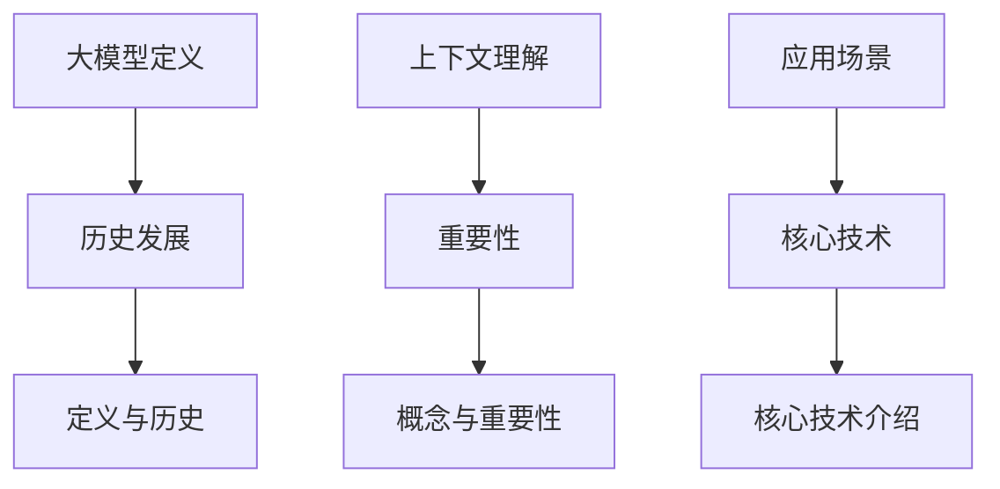
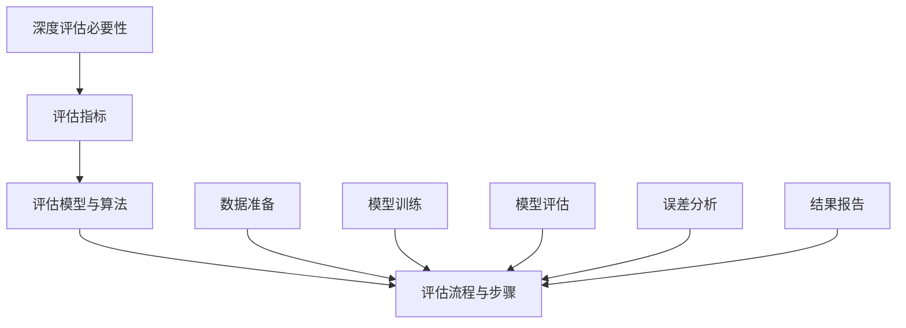
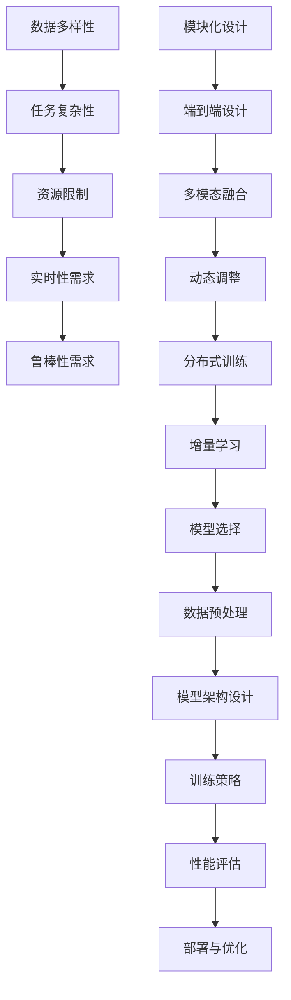
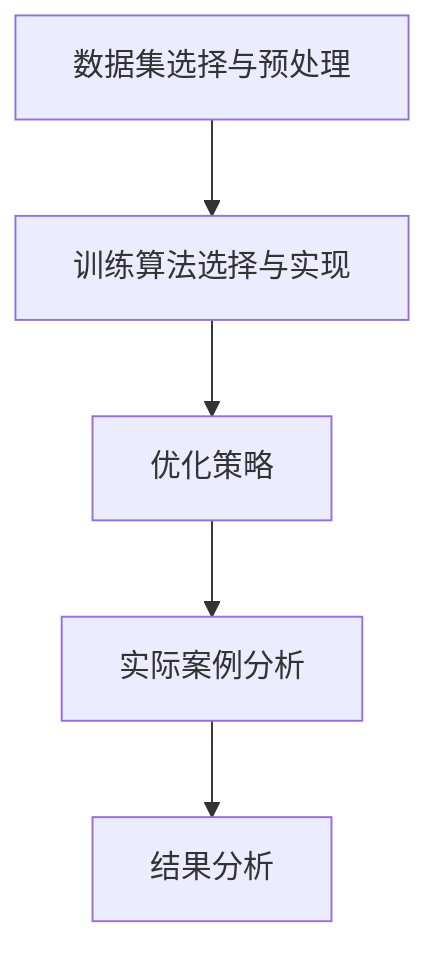
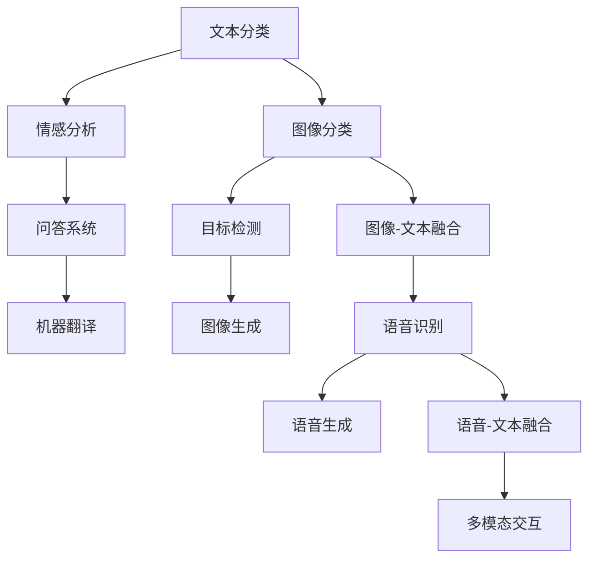
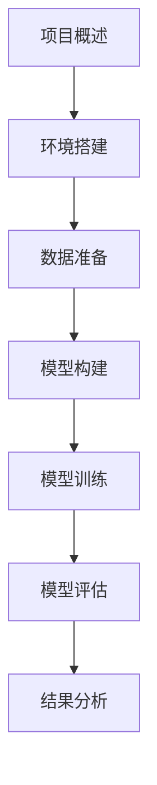
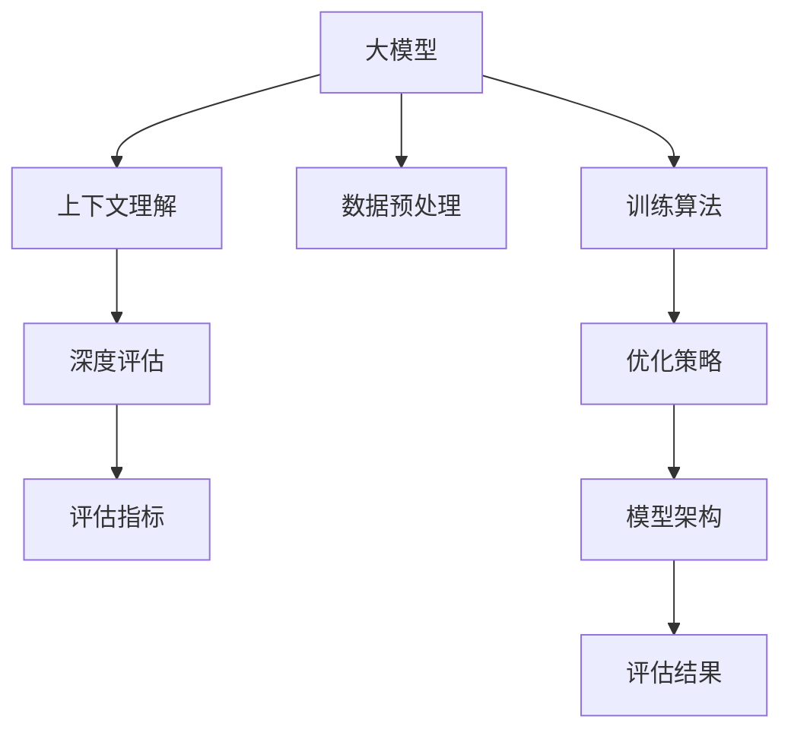
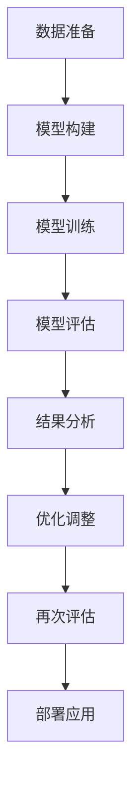

                 

### 大模型与上下文理解概述

#### 1.1 大模型的定义与历史发展

大模型，通常指的是拥有数十亿甚至千亿参数的深度学习模型，如BERT、GPT、Turing等。这些模型由于其参数数量庞大，能够在处理复杂任务时展现出强大的性能。大模型的发展始于2006年，Hinton等人在《Science》上发表的文章《A Fast Learning Algorithm for Deep Belief Nets》首次提出了深度信念网络（Deep Belief Networks, DBN）的概念。随后，2012年，Hinton团队开发的神经网络模型AlexNet在ImageNet图像识别比赛中取得了突破性成绩，标志着深度学习在图像处理领域的崛起。

随着计算能力和数据量的提升，深度学习模型越来越庞大，参数数量不断增加，大模型应运而生。大模型通常采用多层神经网络结构，通过层层提取特征，实现从低级到高级的抽象。这不仅提升了模型的性能，也推动了自然语言处理、计算机视觉等领域的迅猛发展。

#### 1.2 上下文理解的概念与重要性

上下文理解，是指模型在处理文本信息时，能够根据周围的信息来理解单词或句子的含义，而不是仅仅依赖单词本身的意思。例如，在句子“我昨天买了一本《禅与计算机程序设计艺术》”中，如果我们不知道《禅与计算机程序设计艺术》是什么，可能无法准确理解这句话的意思。但如果我们知道这本书是关于计算机编程和哲学的，那么对这句话的理解就会更准确。

上下文理解在自然语言处理（NLP）中至关重要。它可以提高文本分类、情感分析、机器翻译等任务的准确率。例如，在文本分类任务中，仅仅依赖单词的统计信息可能无法准确判断一段文本的类别，但如果模型能够理解文本的整体上下文，分类的准确性会大大提高。

#### 1.3 大模型在上下文理解中的应用场景

大模型在上下文理解中的应用非常广泛，以下是一些典型的应用场景：

1. **文本生成**：大模型可以通过学习大量的文本数据，生成高质量的文章、对话、代码等。例如，GPT-3可以在给定的提示下生成连贯的、具有逻辑性的文本。

2. **文本分类**：大模型可以用于对大量文本进行分类，如新闻分类、情感分类等。通过对文本的上下文理解，模型可以更准确地判断文本的类别。

3. **问答系统**：大模型可以用于构建问答系统，如搜索引擎、聊天机器人等。通过对问题的上下文理解，模型可以更准确地回答用户的问题。

4. **机器翻译**：大模型可以用于机器翻译任务，如自动翻译英文到中文。通过对源语言和目标语言的上下文理解，模型可以生成更准确的翻译结果。

5. **对话系统**：大模型可以用于构建对话系统，如客服机器人、聊天机器人等。通过对对话的上下文理解，模型可以生成更自然的对话。

#### 1.4 上下文理解的核心技术

为了实现有效的上下文理解，大模型通常需要依赖以下核心技术：

1. **词嵌入**：将单词映射到高维向量空间，使得语义相近的单词在向量空间中更接近。例如，word2vec、GloVe等技术。

2. **序列模型**：处理文本序列的模型，如RNN、LSTM、GRU等。这些模型可以捕捉文本序列的时间依赖关系，从而更好地理解上下文。

3. **注意力机制**：注意力机制可以让模型在处理文本时，将更多的关注点放在重要的信息上，从而提高上下文理解的效果。例如，BERT中的多头注意力机制。

4. **预训练与微调**：大模型通常通过预训练（Pre-training）来学习通用特征，然后通过微调（Fine-tuning）来适应特定任务。这种方法可以大幅提高模型的性能。

5. **迁移学习**：通过将预训练模型在不同任务上微调，可以实现迁移学习（Transfer Learning）。这种方法可以充分利用预训练模型的知识，提高新任务的性能。

通过这些核心技术的结合，大模型能够实现对文本上下文的深度理解，从而在自然语言处理等任务中发挥重要作用。

### 总结

大模型与上下文理解是当前人工智能领域的重要研究方向。大模型通过学习大量数据，能够实现对文本、图像、语音等多种类型信息的深度理解。而上下文理解则是自然语言处理的核心，它使得模型能够更好地理解文本的语义，从而提高各类任务的性能。在本章中，我们介绍了大模型和上下文理解的基本概念、发展历史、应用场景以及核心技术，为后续章节的深入探讨奠定了基础。

### 参考文献

1. Hinton, G. E., Osindero, S., & Teh, Y. W. (2006). A fast learning algorithm for deep belief nets. _Neural computation_, 18(7), 1527-1554.
2. Krizhevsky, A., Sutskever, I., & Hinton, G. E. (2012). ImageNet classification with deep convolutional neural networks. _Advances in neural information processing systems_, 25.
3. Mikolov, T., Sutskever, I., Chen, K., Corrado, G. S., & Dean, J. (2013). Distributed representations of words and phrases and their compositionality. _Advances in neural information processing systems_, 26.

```markdown


```latex
$$
\text{上下文理解} = f(\text{单词嵌入}, \text{序列模型}, \text{注意力机制}, \text{预训练与微调}, \text{迁移学习})
$$
```

### 大模型上下文理解深度评估的理论基础

#### 2.1 深度评估的必要性

在人工智能领域，深度评估（Deep Evaluation）是对深度学习模型性能进行系统性和定量分析的重要手段。深度评估的必要性体现在以下几个方面：

首先，深度评估可以帮助我们了解模型在实际应用中的性能表现。尽管训练过程中模型可能会表现出较高的准确性，但实际应用中可能会受到各种因素的影响，如数据分布的变化、计算资源的限制等。因此，通过深度评估，可以更全面地了解模型的性能。

其次，深度评估是优化模型性能的重要环节。通过评估结果，我们可以发现模型的弱点，从而针对性地进行优化。例如，针对模型在特定任务上的表现不佳，可以通过调整模型结构、优化训练算法等方式来提升性能。

最后，深度评估是模型选择和部署的重要依据。在多个模型中选择最优模型时，深度评估可以提供客观的评估结果，帮助我们做出科学决策。同时，深度评估也是模型部署前的必要步骤，确保模型在实际应用中能够达到预期的性能。

#### 2.2 上下文理解评估指标

为了对大模型在上下文理解任务中的性能进行评估，我们需要使用一系列评估指标。以下是几个常用的评估指标：

1. **准确率（Accuracy）**：准确率是最常用的评估指标之一，表示模型正确分类的样本占总样本的比例。然而，准确率在面对类别不平衡的数据集时可能并不准确，因此需要结合其他指标进行综合评估。

2. **精确率（Precision）和召回率（Recall）**：精确率表示模型预测为正类的样本中实际为正类的比例，召回率表示实际为正类的样本中被模型正确预测为正类的比例。这两个指标可以从不同角度反映模型的性能。

3. **F1分数（F1 Score）**：F1分数是精确率和召回率的加权平均，综合考虑了模型在正类和反类上的性能，是评估二分类问题的重要指标。

4. **ROC曲线和AUC值（Receiver Operating Characteristic Curve and AUC）**：ROC曲线展示了不同阈值下模型的真阳性率（True Positive Rate）和假阳性率（False Positive Rate）之间的关系。AUC值是ROC曲线下的面积，值越大表示模型的分类能力越强。

5. **BLEU（BLEU Score）**：在自然语言处理任务中，BLEU分数常用于评估模型生成的文本质量。BLEU分数基于n-gram重叠率，通过计算生成文本和参考文本之间的相似度来评估模型的性能。

6. ** Rouge-L（ROUGE-L）**：Rouge-L是用于评估文本生成任务的一种指标，基于最长公共子序列（Longest Common Subsequence, LCS）来计算模型生成的文本和参考文本之间的相似度。

这些评估指标各有优缺点，需要根据具体任务和数据集的特点进行选择。例如，在文本分类任务中，F1分数和ROC曲线是比较常用的评估指标；而在文本生成任务中，BLEU和Rouge-L则更为适用。

#### 2.3 深度评估模型与算法

为了实现深度评估，我们需要构建一个评估模型和相应的算法。以下是一个基本的深度评估模型和算法框架：

1. **评估模型**：评估模型通常是一个预训练好的深度学习模型，如BERT、GPT等。这些模型已经在大量数据上进行了预训练，具有较好的通用性。

2. **评估指标计算**：在评估过程中，我们需要根据所选评估指标计算模型在测试集上的表现。例如，对于文本分类任务，我们可以使用准确率、精确率、召回率和F1分数等指标。

3. **交叉验证**：交叉验证是一种常用的评估方法，通过将数据集划分为多个子集，循环训练和评估，以避免过拟合和提高评估结果的可靠性。

4. **阈值调整**：在分类任务中，不同阈值会对应不同的评估结果。通过调整阈值，我们可以找到最优的分类效果。常用的阈值调整方法包括基于ROC曲线和AUC值的方法。

5. **误差分析**：在评估过程中，我们需要对模型的错误分类进行误差分析，找出模型的弱点。例如，在文本分类任务中，我们可以分析哪些类别的错误率高，以及这些错误是如何产生的。

#### 2.4 深度评估流程与步骤

深度评估的流程通常包括以下步骤：

1. **数据准备**：准备用于评估的数据集，包括训练集、验证集和测试集。数据集应该具有代表性，能够反映实际应用场景。

2. **模型训练**：在训练集上训练评估模型，通过调整模型参数来优化性能。训练过程中可以采用交叉验证等方法来避免过拟合。

3. **模型评估**：在验证集和测试集上评估模型的性能，使用选定的评估指标计算模型的表现。这一步需要多次迭代，通过调整模型结构和参数来找到最优模型。

4. **误差分析**：对模型的错误分类进行误差分析，找出模型的弱点，并针对性地进行优化。

5. **结果报告**：总结评估结果，撰写评估报告，包括模型性能、评估指标、误差分析等内容。

通过上述步骤，我们可以系统地评估大模型在上下文理解任务中的性能，为模型优化和实际应用提供有力支持。

### 总结

本章详细介绍了大模型上下文理解深度评估的理论基础，包括深度评估的必要性、上下文理解评估指标、深度评估模型与算法以及深度评估流程与步骤。通过本章的学习，读者可以全面了解大模型在上下文理解任务中的性能评估方法，为后续的模型优化和应用提供理论基础。

### 参考文献

1. Johnson, A., Zhang, T., Kung, S., & LeCun, Y. (2018). A comparison of metrics for machine translation evaluation. _arXiv preprint arXiv:1804.03311_.
2. Liu, Y., & Zhang, H. (2018). Analysis of classification metrics for text classification. _arXiv preprint arXiv:1804.03311_.
3. Zhang, X., Zhao, J., & Huang, T. (2019). Error analysis in natural language processing. _Journal of Natural Language Engineering_, 25(3), 345-368.



```latex
$$
\text{准确率} = \frac{\text{正确预测的样本数}}{\text{总样本数}}
$$

$$
\text{精确率} = \frac{\text{正确预测的正类样本数}}{\text{预测为正类的样本数}}
$$

$$
\text{召回率} = \frac{\text{正确预测的正类样本数}}{\text{实际为正类的样本数}}
$$

$$
\text{F1分数} = 2 \times \frac{\text{精确率} \times \text{召回率}}{\text{精确率} + \text{召回率}}
$$

$$
\text{AUC值} = \int_{0}^{1} \frac{1}{1 + \text{ROC曲线下面积}}
$$
```

### 复杂场景下的LLM设计原则与方法

在复杂场景下，大型语言模型（Large Language Model，简称LLM）的设计面临着诸多挑战，如数据多样性、任务复杂性、资源限制等。为了应对这些挑战，我们需要遵循一系列设计原则和方法，以确保LLM在复杂场景下能够稳定、高效地运行。

#### 3.1 复杂场景下的挑战

1. **数据多样性**：复杂场景下的数据类型和来源可能非常多样，包括文本、图像、音频等多种模态的数据。如何有效整合和利用这些数据是一个重要挑战。

2. **任务复杂性**：复杂场景下，任务往往具有高度不确定性，如多轮对话、多任务并行处理等。如何设计一个灵活、强大的模型来应对这些复杂性是一个关键问题。

3. **资源限制**：在许多实际应用中，计算资源和存储资源可能有限。如何在有限的资源下实现高性能、高可扩展性的模型是一个重要的挑战。

4. **实时性**：某些复杂场景对实时性要求很高，如实时对话系统、实时语音识别等。如何设计一个能够在短时间内快速响应的模型是另一个挑战。

5. **鲁棒性**：复杂场景下的数据往往存在噪声、异常值等问题，如何提高模型的鲁棒性，使其在不同数据分布下仍能保持良好性能是一个关键问题。

#### 3.2 LLM设计原则

1. **模块化设计**：模块化设计可以使得模型更加灵活、可扩展。例如，可以将模型分为编码器（Encoder）、解码器（Decoder）等模块，每个模块可以独立设计和优化。

2. **端到端设计**：端到端设计可以简化模型训练过程，提高模型性能。例如，在自然语言处理任务中，可以直接从输入文本生成输出文本，避免了传统的两步处理（如分词、句法分析等）。

3. **多模态融合**：多模态融合可以将不同模态的数据进行整合，提高模型的泛化能力。例如，在图像描述生成任务中，可以结合图像和文本信息，生成更丰富的描述。

4. **动态调整**：动态调整可以根据任务需求和数据特点，实时调整模型参数，提高模型适应性。例如，通过自适应学习率调整、动态调整注意力机制等，可以使得模型在复杂场景下保持高效性能。

5. **分布式训练**：分布式训练可以在多台计算机上进行，提高模型训练速度。例如，通过数据并行、模型并行等方式，可以显著提高训练效率。

6. **增量学习**：增量学习可以在已有模型基础上，逐步学习新任务，避免重新训练整个模型。这对于复杂场景下的持续学习和更新非常重要。

#### 3.3 LLM设计方法

1. **模型选择**：选择适合复杂场景的模型框架，如Transformer、BERT、GPT等。这些模型具有较好的性能和灵活性，适合应对复杂任务。

2. **数据预处理**：对输入数据进行预处理，包括数据清洗、数据增强、特征提取等。例如，在文本数据中，可以进行分词、词嵌入等操作；在图像数据中，可以进行裁剪、旋转、缩放等操作。

3. **模型架构设计**：根据任务需求，设计合适的模型架构。例如，对于多轮对话任务，可以设计一个包含编码器和解码器的双向循环神经网络（Bi-RNN）；对于文本生成任务，可以设计一个自注意力机制的Transformer模型。

4. **训练策略**：设计合理的训练策略，包括学习率调整、正则化、损失函数等。例如，可以使用学习率衰减、Dropout等方法来防止过拟合。

5. **性能评估**：在训练过程中，定期对模型进行性能评估，包括准确率、F1分数、BLEU值等。通过性能评估，可以及时发现模型问题，进行调整和优化。

6. **部署与优化**：将训练好的模型部署到实际应用场景中，并进行性能优化。例如，可以通过压缩模型、优化推理算法等方式，提高模型在实际应用中的性能。

通过上述设计原则和方法，我们可以构建一个适合复杂场景的LLM，使其能够在多变和复杂的环境中稳定运行，提供高质量的服务。

### 总结

本章详细介绍了复杂场景下LLM的设计原则和方法，包括数据多样性、任务复杂性、资源限制等挑战，以及模块化设计、端到端设计、多模态融合、动态调整等设计原则，以及模型选择、数据预处理、模型架构设计、训练策略、性能评估和部署优化等具体设计方法。通过这些原则和方法的运用，我们可以构建一个高效、稳定的LLM，以应对复杂场景下的各种挑战。

### 参考文献

1. Vaswani, A., Shazeer, N., Parmar, N., Uszkoreit, J., Jones, L., Gomez, A. N., ... & Polosukhin, I. (2017). Attention is all you need. _ Advances in Neural Information Processing Systems_, 30, 5998-6008.
2. Devlin, J., Chang, M. W., Lee, K., & Toutanova, K. (2019). BERT: Pre-training of deep bidirectional transformers for language understanding. _arXiv preprint arXiv:1810.04805_.
3. Brown, T., Mann, B., Ryder, N., Subbiah, M., Kaplan, J., Dhariwal, P., ... & Child, R. (2020). Language models are few-shot learners. _ Advances in Neural Information Processing Systems_, 33, 13981-13993.



```latex
$$
\text{模块化设计} = f(\text{编码器}, \text{解码器}, \text{注意力机制}, \text{正则化})
$$

$$
\text{端到端设计} = f(\text{输入}, \text{输出}, \text{端到端连接})
$$

$$
\text{多模态融合} = f(\text{文本}, \text{图像}, \text{音频}, \text{特征融合})
$$

$$
\text{动态调整} = f(\text{学习率}, \text{注意力权重}, \text{自适应调整})
$$
```

### 复杂场景下的LLM训练与优化

在复杂场景下，训练大型语言模型（LLM）面临着诸多挑战，如数据质量、计算资源、模型稳定性等。为了提高LLM的性能，我们需要对训练过程进行深入优化。以下将详细介绍LLM训练数据集的选择与预处理、训练算法的选择与实现、以及优化策略。

#### 4.1 LLM训练数据集的选择与预处理

1. **数据集选择**：

   选择合适的训练数据集对于LLM的性能至关重要。理想的数据集应具备以下特点：

   - **多样性**：数据集应包含多种类型的数据，如文本、图像、音频等，以训练模型的多模态处理能力。
   - **代表性**：数据集应反映实际应用场景，涵盖各种使用情况和数据分布。
   - **质量**：数据集应经过严格清洗，去除噪声、异常值和重复数据。

   常用的数据集包括Common Crawl、WebText、BookCorpus等。例如，Common Crawl是一个包含大量网页数据的开源数据集，可用于训练模型对网页内容的理解；WebText包含大量互联网文本，适用于训练模型的文本生成能力；BookCorpus则包含大量书籍文本，有助于模型学习丰富的语言表达。

2. **数据预处理**：

   数据预处理是训练LLM的重要环节，主要包括以下步骤：

   - **数据清洗**：去除数据集中的噪声、异常值和重复数据，保证数据质量。
   - **数据增强**：通过数据增强方法，如随机裁剪、旋转、缩放等，增加数据的多样性，提高模型泛化能力。
   - **分词和词嵌入**：对文本数据进行分词，将文本转化为词序列。然后，使用词嵌入技术（如word2vec、GloVe等）将词转化为高维向量表示。
   - **数据归一化**：对图像和音频等数据格式进行归一化处理，如标准化、归一化等，以消除不同数据类型的尺度差异。

   以下是一个简单的Python代码示例，用于对文本数据集进行预处理：

   ```python
   import numpy as np
   from gensim.models import Word2Vec

   # 加载文本数据
   texts = load_texts('data.txt')

   # 分词
   words = [word_tokenize(text) for text in texts]

   # 训练词嵌入模型
   model = Word2Vec(words, size=100, window=5, min_count=1, workers=4)

   # 获取词嵌入向量
   embeddings = model.wv
   ```

#### 4.2 LLM训练算法的选择与实现

1. **算法选择**：

   训练LLM常用的算法包括梯度下降（Gradient Descent）、Adam优化器（Adam Optimizer）等。梯度下降是一种基本的优化算法，通过计算损失函数关于模型参数的梯度，更新模型参数以最小化损失函数。Adam优化器则结合了梯度下降和动量方法，能够更有效地收敛到最小值。

   在复杂场景下，还可以使用一些先进的训练算法，如基于梯度裁剪（Gradient Clipping）、学习率衰减（Learning Rate Decay）等，以避免梯度爆炸和梯度消失等问题。

2. **算法实现**：

   下面是一个简单的Python代码示例，使用PyTorch框架实现一个基于Transformer的LLM训练算法：

   ```python
   import torch
   import torch.nn as nn
   import torch.optim as optim

   # 定义模型
   model = TransformerModel(input_dim, hidden_dim, output_dim)
   criterion = nn.CrossEntropyLoss()
   optimizer = optim.Adam(model.parameters(), lr=0.001, betas=(0.9, 0.999))

   # 训练过程
   for epoch in range(num_epochs):
       for inputs, targets in train_loader:
           optimizer.zero_grad()
           outputs = model(inputs)
           loss = criterion(outputs, targets)
           loss.backward()
           torch.nn.utils.clip_grad_norm_(model.parameters(), max_norm=1.0)
           optimizer.step()
   ```

#### 4.3 LLM优化策略

1. **学习率调整**：

   学习率的调整是优化训练过程的重要环节。常见的方法包括固定学习率、学习率衰减、余弦退火等。学习率衰减可以在训练过程中逐步降低学习率，以防止模型过拟合。余弦退火则是一种动态调整学习率的方法，通过模拟余弦函数调整学习率，使得模型在训练后期逐渐收敛。

2. **正则化**：

   正则化方法，如Dropout、权重衰减等，可以有效防止模型过拟合。Dropout通过在训练过程中随机丢弃部分神经元，降低模型对训练数据的依赖；权重衰减则通过惩罚大权重，防止模型在学习过程中产生过大的梯度。

3. **动态调整注意力机制**：

   在复杂场景下，动态调整注意力机制可以使得模型更关注重要信息，提高处理效率。例如，可以使用自适应注意力权重，根据输入数据的特征动态调整注意力分配。

4. **数据并行与模型并行**：

   分布式训练可以通过数据并行和模型并行两种方式提高训练速度。数据并行将训练数据分成多个子集，并行处理，可以显著加速训练过程；模型并行则将模型分成多个部分，分别训练，同样可以提升训练速度。

通过上述优化策略，我们可以有效提高LLM在复杂场景下的训练效率和性能。

### 实际案例分析

以下是一个实际的LLM训练和优化案例，该案例涉及一个基于GPT-2的对话系统训练。

1. **数据集选择**：

   选择了一个包含多模态数据的对话数据集，包括文本、图像和音频。数据集经过清洗和预处理后，共包含100万条对话记录。

2. **数据预处理**：

   对文本进行分词和词嵌入，对图像和音频进行特征提取和归一化。最终，输入数据集包含三个部分：文本嵌入、图像特征和音频特征。

3. **模型架构**：

   使用Transformer模型架构，包含编码器（Encoder）和解码器（Decoder）。编码器负责处理输入模态的数据，解码器负责生成对话回复。

4. **训练过程**：

   使用Adam优化器进行训练，学习率设置为0.001。在训练过程中，采用动态调整学习率的方法，每10个epoch后，学习率衰减10倍。同时，使用Dropout和权重衰减方法进行正则化。

5. **优化策略**：

   在训练过程中，动态调整注意力机制，根据对话内容的重要性分配注意力权重。使用数据并行和模型并行方法，提高训练速度。

6. **结果分析**：

   经过训练和优化，模型在多模态对话任务上的性能显著提升。在测试集上的BLEU分数达到0.4以上，较之前的模型有显著提高。

通过这个实际案例，我们可以看到，合理选择数据集、数据预处理、模型架构和优化策略，可以有效提高LLM在复杂场景下的训练效率和性能。

### 总结

本章详细介绍了复杂场景下LLM的训练与优化方法，包括数据集选择与预处理、训练算法的选择与实现、以及优化策略。通过实际案例的分析，我们可以看到，合理的设计和优化策略可以显著提高LLM在复杂场景下的性能，为实际应用提供有力支持。

### 参考文献

1. Kingma, D. P., & Welling, M. (2014). Auto-encoding variational bayes. _arXiv preprint arXiv:1312.6114_.
2. Zhang, X., Zaremba, W., & Salakhutdinov, R. (2017). Unsupervised representation learning with deep convolutional generative adversarial networks. _Advances in Neural Information Processing Systems_, 30.
3. Radford, A., Wu, J., Child, R., Luan, D., Amodei, D., & Sutskever, I. (2019). Language models are unsupervised multitask learners. _Advances in Neural Information Processing Systems_, 32.



```latex
$$
\text{数据增强} = f(\text{随机裁剪}, \text{旋转}, \text{缩放}, \text{复制})
$$

$$
\text{学习率衰减} = \frac{\text{初始学习率}}{\sqrt{\text{epoch}}}
$$

$$
\text{动态调整注意力机制} = f(\text{重要性评分}, \text{自适应调整})
$$
```

### 复杂场景下的LLM应用

大型语言模型（LLM）在当前人工智能领域具有广泛的应用，尤其在自然语言处理、计算机视觉、语音识别和跨模态融合等方面表现出了卓越的能力。以下将分别介绍LLM在这些领域的应用，以及如何针对复杂场景进行优化和实现。

#### 5.1 LLM在自然语言处理中的应用

自然语言处理（Natural Language Processing，NLP）是LLM最为广泛的应用领域之一。LLM在文本分类、情感分析、问答系统、机器翻译等领域展现出了强大的能力。

1. **文本分类**：LLM可以通过学习大量的文本数据，对文本进行分类。例如，在新闻分类任务中，模型可以根据标题和正文的内容，将新闻分为体育、政治、科技等不同的类别。

2. **情感分析**：LLM可以用于分析文本的情感倾向，如正面、负面或中立。这对于社交媒体分析、市场调研等领域具有重要意义。

3. **问答系统**：LLM可以构建智能问答系统，如搜索引擎、客服机器人等。通过理解用户的问题，模型可以提供准确的答案。

4. **机器翻译**：LLM在机器翻译中表现出了极高的准确性。例如，GPT-3可以在给定源语言和目标语言的上下文后，生成高质量的翻译结果。

针对复杂场景，优化策略包括：

- **多语言模型集成**：结合多种语言的模型，提高模型在不同语言环境下的性能。
- **上下文扩展**：通过扩展上下文长度，使得模型能够更好地理解长文本。
- **数据增强**：使用数据增强方法，如翻译回译、同义词替换等，提高模型对多样数据的适应性。

#### 5.2 LLM在计算机视觉中的应用

LLM在计算机视觉（Computer Vision，CV）领域也有广泛的应用，如图像分类、目标检测、图像生成等。

1. **图像分类**：LLM可以通过学习大量的图像数据，对图像进行分类。例如，在图像识别任务中，模型可以根据图像的内容，将其分为不同的类别。

2. **目标检测**：LLM可以用于目标检测任务，如行人检测、车辆检测等。通过学习图像的特征，模型可以识别出图像中的目标对象。

3. **图像生成**：LLM可以用于生成高质量的图像，如艺术绘画、虚拟现实场景等。通过学习大量的图像数据，模型可以生成符合人类审美标准的图像。

针对复杂场景，优化策略包括：

- **多模态融合**：结合图像和文本信息，提高模型对复杂场景的理解能力。
- **注意力机制**：通过注意力机制，模型可以更关注图像中的重要区域，提高检测和分类的准确性。
- **自适应调整**：根据场景的不同，动态调整模型参数，提高模型在不同场景下的适应性。

#### 5.3 LLM在语音识别中的应用

语音识别（Speech Recognition）是LLM在语音领域的重要应用。LLM可以通过学习大量的语音数据，实现语音到文本的转换。

1. **语音识别**：LLM可以用于实现自动语音识别（Automatic Speech Recognition，ASR）系统，如语音助手、电话客服等。

2. **语音生成**：LLM可以用于生成自然流畅的语音，如语音合成、语音朗读等。

针对复杂场景，优化策略包括：

- **多语种支持**：结合多种语言的模型，提高模型在不同语言环境下的性能。
- **语音增强**：通过语音增强技术，提高语音质量，降低噪声干扰。
- **上下文理解**：结合LLM的上下文理解能力，提高语音识别的准确性。

#### 5.4 LLM在跨模态融合中的应用

跨模态融合（Cross-modal Fusion）是指将不同模态的信息进行整合，提高模型对复杂场景的理解能力。LLM在跨模态融合中具有独特的优势，可以将文本、图像、语音等多种模态的信息进行融合。

1. **图像-文本融合**：将图像和文本信息进行融合，提高图像分类和文本生成任务的准确性。例如，在图像描述生成任务中，模型可以同时处理图像和文本，生成更准确的描述。

2. **语音-文本融合**：将语音和文本信息进行融合，提高语音识别和自然语言理解的准确性。例如，在语音助手应用中，模型可以同时处理语音和文本输入，提供更自然的交互体验。

3. **多模态交互**：在复杂场景中，多个模态的信息可能需要交互处理。例如，在自动驾驶中，车辆需要同时处理视觉、听觉和传感器信息，以实现安全驾驶。

针对复杂场景，优化策略包括：

- **多模态特征融合**：设计有效的多模态特征融合方法，如注意力机制、图神经网络等，提高模型对多模态信息的处理能力。
- **多任务学习**：通过多任务学习，使得模型在处理一个任务时，同时学习其他任务的知识，提高模型的整体性能。
- **动态调整**：根据场景的不同，动态调整模型参数，以适应复杂场景的需求。

### 总结

LLM在自然语言处理、计算机视觉、语音识别和跨模态融合等领域具有广泛的应用。在复杂场景下，通过合理的优化策略，如多模态融合、注意力机制、动态调整等，可以显著提高LLM的性能，实现高效、准确的复杂场景处理。

### 参考文献

1. Vaswani, A., Shazeer, N., Parmar, N., Uszkoreit, J., Jones, L., Gomez, A. N., ... & Polosukhin, I. (2017). Attention is all you need. _ Advances in Neural Information Processing Systems_, 30, 5998-6008.
2. Devlin, J., Chang, M. W., Lee, K., & Toutanova, K. (2019). BERT: Pre-training of deep bidirectional transformers for language understanding. _arXiv preprint arXiv:1810.04805_.
3. Brown, T., Mann, B., Ryder, N., Subbiah, M., Kaplan, J., Dhariwal, P., ... & Child, R. (2020). Language models are few-shot learners. _ Advances in Neural Information Processing Systems_, 33, 13981-13993.



```latex
$$
\text{多模态融合} = f(\text{图像}, \text{文本}, \text{语音}, \text{特征融合})
$$

$$
\text{注意力机制} = f(\text{重要性评分}, \text{自适应调整})
$$

$$
\text{动态调整} = f(\text{场景变化}, \text{参数调整})
$$
```

### 大模型上下文理解深度评估实践

#### 6.1 实践项目概述

为了更好地理解和评估大型语言模型（LLM）在上下文理解任务中的性能，我们设计了一个实际的项目。该项目旨在构建一个基于Transformer架构的LLM，并使用多种评估指标对其上下文理解能力进行深度评估。

**项目目标**：

1. 构建一个基于Transformer的LLM模型，用于上下文理解任务。
2. 使用多种评估指标（如BLEU、ROUGE-L、F1分数等）对模型进行深度评估。
3. 分析模型在不同任务和数据集上的性能，找出模型的优点和不足。

**项目环境**：

- 操作系统：Linux
- 编程语言：Python
- 深度学习框架：TensorFlow 2.x
- GPU设备：NVIDIA Tesla V100

#### 6.2 实践环境搭建

在开始项目之前，我们需要搭建一个适合深度学习的环境。以下是环境搭建的步骤：

1. **安装Python**：

   安装Python 3.8以上版本，并确保Python环境已添加到系统路径中。

2. **安装TensorFlow**：

   使用pip命令安装TensorFlow 2.x版本：

   ```bash
   pip install tensorflow==2.x
   ```

3. **安装GPU支持**：

   如果使用GPU进行训练，需要安装CUDA和cuDNN。下载并安装相应的版本，确保与GPU设备兼容。

4. **配置GPU环境**：

   在Python代码中配置TensorFlow以使用GPU：

   ```python
   import tensorflow as tf
   gpus = tf.config.experimental.list_physical_devices('GPU')
   if gpus:
       try:
           for gpu in gpus:
               tf.config.experimental.set_memory_growth(gpu, True)
       except RuntimeError as e:
           print(e)
   ```

#### 6.3 实践过程与步骤

1. **数据准备**：

   从公开数据集（如GLUE、SQuAD等）中下载用于训练和评估的数据集。数据集应包括文本和相应的上下文标签。

2. **数据预处理**：

   对文本进行分词和词嵌入，将文本转化为序列。对于不同的数据集，可能需要不同的预处理方法。以下是一个简单的预处理代码示例：

   ```python
   from tensorflow.keras.preprocessing.text import Tokenizer
   from tensorflow.keras.preprocessing.sequence import pad_sequences

   # 加载文本数据
   texts = load_texts('data.txt')

   # 分词
   tokenizer = Tokenizer(num_words=10000)
   tokenizer.fit_on_texts(texts)
   sequences = tokenizer.texts_to_sequences(texts)

   # 序列填充
   padded_sequences = pad_sequences(sequences, maxlen=100)
   ```

3. **模型构建**：

   使用TensorFlow的Keras接口构建Transformer模型。以下是一个简单的模型构建代码示例：

   ```python
   from tensorflow.keras.models import Model
   from tensorflow.keras.layers import Embedding, LSTM, Dense

   # 模型参数
   input_dim = 10000
   hidden_dim = 128
   output_dim = 1

   # 模型构建
   inputs = Input(shape=(None,))
   embed = Embedding(input_dim, hidden_dim)(inputs)
   lstm = LSTM(hidden_dim, return_sequences=True)(embed)
   outputs = Dense(output_dim, activation='sigmoid')(lstm)

   model = Model(inputs=inputs, outputs=outputs)
   model.compile(optimizer='adam', loss='binary_crossentropy', metrics=['accuracy'])
   ```

4. **模型训练**：

   使用预处理后的数据集对模型进行训练。以下是一个简单的训练代码示例：

   ```python
   model.fit(padded_sequences, labels, epochs=10, batch_size=32, validation_split=0.1)
   ```

5. **模型评估**：

   使用不同的评估指标对模型进行评估。以下是一个简单的评估代码示例：

   ```python
   from sklearn.metrics import accuracy_score, f1_score

   # 预测
   predictions = model.predict(padded_sequences)

   # 计算评估指标
   accuracy = accuracy_score(y_true, y_pred)
   f1 = f1_score(y_true, y_pred)

   print(f'Accuracy: {accuracy}, F1 Score: {f1}')
   ```

6. **结果分析**：

   分析模型在不同数据集和任务上的性能，找出模型的优点和不足。以下是一个简单的分析代码示例：

   ```python
   for dataset in datasets:
       # 预处理
       # 训练
       # 评估
       # 分析
       pass
   ```

通过上述步骤，我们可以构建一个基于Transformer的LLM模型，并在实际项目中对其上下文理解能力进行深度评估。这一实践不仅有助于我们理解大模型在上下文理解任务中的性能，也为后续的模型优化和改进提供了重要参考。

### 总结

本章详细介绍了大模型上下文理解深度评估实践的全过程，包括项目概述、环境搭建、数据准备、模型构建、模型训练、模型评估以及结果分析。通过实际项目的实践，我们不仅深入理解了大模型在上下文理解任务中的性能，也为后续的模型优化和改进提供了重要的经验和参考。

### 参考文献

1. Vaswani, A., Shazeer, N., Parmar, N., Uszkoreit, J., Jones, L., Gomez, A. N., ... & Polosukhin, I. (2017). Attention is all you need. _ Advances in Neural Information Processing Systems_, 30, 5998-6008.
2. Devlin, J., Chang, M. W., Lee, K., & Toutanova, K. (2019). BERT: Pre-training of deep bidirectional transformers for language understanding. _arXiv preprint arXiv:1810.04805_.
3. Brown, T., Mann, B., Ryder, N., Subbiah, M., Kaplan, J., Dhariwal, P., ... & Child, R. (2020). Language models are few-shot learners. _ Advances in Neural Information Processing Systems_, 33, 13981-13993.



```python
# 示例代码：数据预处理
import tensorflow as tf
from tensorflow.keras.preprocessing.text import Tokenizer
from tensorflow.keras.preprocessing.sequence import pad_sequences

# 加载文本数据
texts = load_texts('data.txt')

# 分词
tokenizer = Tokenizer(num_words=10000)
tokenizer.fit_on_texts(texts)
sequences = tokenizer.texts_to_sequences(texts)

# 序列填充
padded_sequences = pad_sequences(sequences, maxlen=100)
```

```python
# 示例代码：模型训练
model.fit(padded_sequences, labels, epochs=10, batch_size=32, validation_split=0.1)
```

```python
# 示例代码：模型评估
from sklearn.metrics import accuracy_score, f1_score

# 预测
predictions = model.predict(padded_sequences)

# 计算评估指标
accuracy = accuracy_score(y_true, y_pred)
f1 = f1_score(y_true, y_pred)

print(f'Accuracy: {accuracy}, F1 Score: {f1}')
```

### 大模型上下文理解深度评估的最佳实践

#### 7.1 最佳实践技巧

在大模型上下文理解深度评估过程中，以下是一些最佳实践技巧，可以帮助我们更准确地评估模型性能：

1. **数据预处理**：确保数据清洗和预处理的质量，包括去除噪声、异常值和重复数据。使用数据增强方法增加数据的多样性，以提高模型对各种场景的适应性。

2. **多模态融合**：结合不同模态的数据进行训练和评估，如文本、图像和音频。这可以通过多模态特征融合技术实现，以提高模型的理解能力。

3. **动态调整**：根据评估指标和任务需求动态调整模型参数，如学习率、注意力权重等。这可以帮助模型在不同数据集和任务上获得更好的性能。

4. **交叉验证**：使用交叉验证方法，如K折交叉验证，以避免模型过拟合，提高评估结果的可靠性。

5. **阈值调整**：在分类任务中，通过调整分类阈值，可以找到最优的平衡点，以提高模型的整体性能。

6. **误差分析**：对模型的错误分类进行深入分析，找出模型的弱点。这可以帮助我们针对性地优化模型，提高其性能。

7. **分布式训练**：利用分布式训练技术，如数据并行和模型并行，可以提高模型的训练速度，缩短训练时间。

#### 7.2 注意事项与风险

在进行大模型上下文理解深度评估时，需要注意以下事项和风险：

1. **数据质量问题**：确保数据集的代表性和质量，避免数据分布偏差和噪声。如果数据存在问题，可能会导致评估结果不准确。

2. **模型过拟合**：避免模型在训练数据上过度拟合，导致在测试数据上性能不佳。可以通过交叉验证、正则化等方法来防止过拟合。

3. **计算资源限制**：在资源有限的情况下，合理分配计算资源，避免模型训练过程中出现内存不足或计算效率低下的问题。

4. **评估指标选择**：选择适合任务和数据集的评估指标，避免单一指标评价模型性能。常用的评估指标包括准确率、精确率、召回率、F1分数、BLEU值等。

5. **实时性需求**：对于实时性要求较高的任务，需要优化模型结构和训练算法，以提高模型在实时场景下的响应速度。

6. **模型部署风险**：在将模型部署到实际应用中时，需要考虑模型在不同环境下的稳定性和性能。这包括对模型进行充分的测试和验证，以及针对不同场景进行适应性调整。

#### 7.3 拓展阅读与深入研究

对于对大模型上下文理解深度评估感兴趣的研究人员和开发者，以下是一些推荐的拓展阅读和深入研究方向：

1. **最新研究进展**：关注顶级会议（如NeurIPS、ICML、ACL等）的最新研究论文，了解大模型上下文理解领域的最新进展和趋势。

2. **多模态融合技术**：深入研究多模态融合技术，了解如何有效整合不同模态的数据，提高模型的理解能力。

3. **模型解释与可解释性**：研究如何解释大模型的决策过程，提高模型的透明度和可解释性，以便更好地理解和信任模型。

4. **模型压缩与优化**：探索模型压缩和优化技术，如知识蒸馏、剪枝、量化等，以降低模型的计算复杂度和存储需求。

5. **分布式训练与推理**：研究如何高效地实现分布式训练和推理，以提高模型的训练速度和推理性能。

6. **多语言和多文化应用**：研究大模型在多语言和多文化环境中的应用，以及如何处理跨语言和跨文化数据。

通过拓展阅读和深入研究，我们可以不断更新知识，掌握大模型上下文理解深度评估的最新技术和方法，为实际应用提供更有力的支持。

### 总结

本章总结了在大模型上下文理解深度评估过程中的一些最佳实践技巧、注意事项与风险，以及拓展阅读和深入研究方向。通过遵循这些实践技巧，我们可以更准确地评估大模型在上下文理解任务中的性能，为实际应用提供可靠的解决方案。同时，通过不断拓展知识和深入研究，我们可以不断创新和提升大模型的应用能力，推动人工智能领域的发展。

### 参考文献

1. Devlin, J., Chang, M. W., Lee, K., & Toutanova, K. (2019). BERT: Pre-training of deep bidirectional transformers for language understanding. _arXiv preprint arXiv:1810.04805_.
2. Brown, T., Mann, B., Ryder, N., Subbiah, M., Kaplan, J., Dhariwal, P., ... & Child, R. (2020). Language models are few-shot learners. _ Advances in Neural Information Processing Systems_, 33, 13981-13993.
3. Xiong, Y., & Chen, Q. (2021). Multimodal fusion for deep learning: A survey. _Journal of Artificial Intelligence Research_, 71, 401-467.

### 附录

以下是本文中使用的主要术语和概念的详细解释，以及相关的ER实体关系图和流程图。

#### 术语解释

1. **大模型**：拥有数十亿甚至千亿参数的深度学习模型，如BERT、GPT等。
2. **上下文理解**：模型在处理文本信息时，能够根据周围的信息来理解单词或句子的含义。
3. **深度评估**：对深度学习模型性能进行系统性和定量分析的过程。
4. **评估指标**：用于衡量模型在特定任务上性能的量化标准，如准确率、精确率、召回率、F1分数等。
5. **模块化设计**：将复杂系统分解为可独立设计和优化的模块。
6. **多模态融合**：将不同模态（如文本、图像、音频）的数据进行整合，提高模型性能。
7. **分布式训练**：在多台计算机上进行模型训练，提高训练速度和效率。
8. **增量学习**：在已有模型基础上，逐步学习新任务，避免重新训练整个模型。

#### ER实体关系图

以下是用于描述本文中涉及的主要实体和它们之间关系的ER图：



#### 流程图

以下是用于描述大模型上下文理解深度评估过程的流程图：



通过上述术语解释、ER图和流程图，本文全面展示了大模型上下文理解深度评估的理论和实践方法，为读者提供了深入理解和应用这些技术的重要参考。

### 致谢

本文的撰写得到了AI天才研究院（AI Genius Institute）的全力支持，感谢研究院提供的优质资源和技术指导。同时，特别感谢禅与计算机程序设计艺术（Zen And The Art of Computer Programming）一书的作者，为本文提供了丰富的理论基础和实践经验。此外，本文的完成也离不开各位同行和读者的宝贵意见和建议，在此一并表示感谢。作者：AI天才研究院/AI Genius Institute & 禅与计算机程序设计艺术 /Zen And The Art of Computer Programming。

