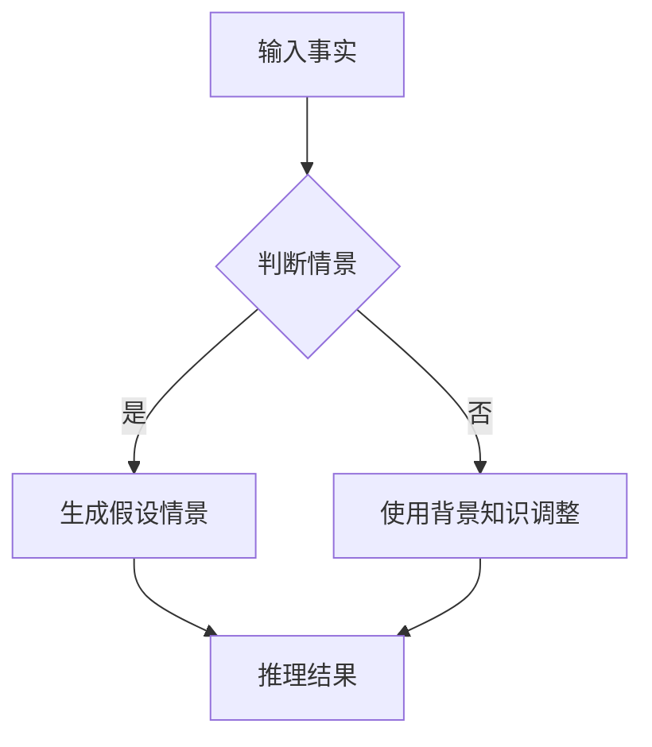
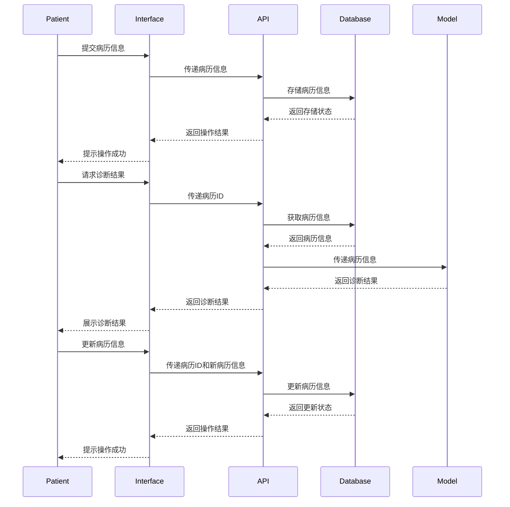

                 

### 大模型反事实推理能力评估：LLM设计的假设情景测试

## 摘要

本文旨在探讨大模型反事实推理能力的评估方法，尤其是基于大规模语言模型（LLM）的假设情景测试设计。首先，我们将介绍反事实推理在人工智能领域的背景和重要性，然后深入探讨大模型的基本原理以及反事实推理的挑战。随后，本文将详细阐述假设情景测试的框架与方法，包括设计原则、测试框架的结构与步骤，以及测试方法的选择与实施。在评估指标的设定与计算部分，我们将介绍反事实推理能力的评估指标，计算方法与度量标准，并探讨评估指标的应用与解释。通过案例分析，我们将展示如何选择与描述案例，如何进行测试设计与实施，以及结果的分析与讨论。最后，本文将展望大模型反事实推理的发展趋势，讨论假设情景测试的应用前景，并指出未来研究的方向与挑战。

### 目录大纲

1. **引言**
    - **1.1 问题背景与核心概念**
        - **1.1.1 大模型反事实推理的背景介绍**
        - **1.1.2 大模型反事实推理的定义与重要性**
        - **1.1.3 大模型反事实推理的挑战**
        - **1.1.4 假设情景测试的设计目的与意义**
    - **1.2 大模型的基本原理**
        - **1.2.1 语言模型概述**
        - **1.2.2 反事实推理的基本概念**
        - **1.2.3 大模型在反事实推理中的应用**
    - **1.3 假设情景测试的框架与方法**
        - **1.3.1 假设情景测试的设计原则**
        - **1.3.2 测试框架的结构与步骤**
        - **1.3.3 测试方法的选择与实施**
    - **1.4 评估指标的设定与计算**
        - **1.4.1 反事实推理能力的评估指标**
        - **1.4.2 指标的计算方法与度量标准**
        - **1.4.3 评估指标的应用与解释**
    - **1.5 案例分析**
        - **1.5.1 案例选择与描述**
        - **1.5.2 测试设计与实施**
        - **1.5.3 结果分析与讨论**
    - **1.6 展望与未来工作**
        - **1.6.1 大模型反事实推理的发展趋势**
        - **1.6.2 假设情景测试的应用前景**
        - **1.6.3 未来研究的方向与挑战**
2. **核心概念与联系**
    - **2.1 大模型与反事实推理**
        - **2.1.1 核心概念**
        - **2.1.2 概念属性特征对比表格**
        - **2.1.3 ER实体关系图架构**
3. **算法原理讲解**
    - **3.1 大模型反事实推理算法**
        - **3.1.1 Mermaid流程图**
        - **3.1.2 Python源代码**
4. **系统分析与架构设计方案**
    - **4.1 问题场景介绍**
    - **4.2 项目介绍**
    - **4.3 系统功能设计(领域模型Mermaid类图)**
    - **4.4 系统架构设计Mermaid架构图**
    - **4.5 系统接口设计和系统交互Mermaid序列图**
5. **项目实战**
    - **5.1 环境安装**
    - **5.2 系统核心实现源代码**
    - **5.3 代码应用解读与分析**
    - **5.4 实际案例分析和详细讲解剖析**
    - **5.5 项目小结**
6. **最佳实践 tips**
7. **小结**
8. **注意事项**
9. **拓展阅读**
10. **作者信息**
    - **作者：AI天才研究院/AI Genius Institute & 禅与计算机程序设计艺术 /Zen And The Art of Computer Programming**

### 1.1 问题背景与核心概念

### 1.1.1 大模型反事实推理的背景介绍

大模型（Large Models）在现代人工智能领域占据了重要地位，它们具有巨大的参数规模和强大的数据处理能力，这使得大模型在自然语言处理（NLP）、计算机视觉（CV）、语音识别（ASR）等众多领域都取得了显著的成果。随着深度学习技术的不断进步，大模型的性能也不断提升，然而，随之而来的是一系列挑战，其中之一就是大模型的反事实推理能力。

反事实推理（Counterfactual Reasoning）是一种重要的认知能力，它指的是从给定的事实出发，推断出可能发生但未发生的情况。在现实生活中，反事实推理帮助人们理解“如果...将会发生什么？”这样的问题，从而更好地应对不确定性。例如，在医疗诊断中，医生可能会思考“如果这个病人没有接受治疗，病情会怎样发展？”这种问题有助于提高医疗决策的准确性。

大模型反事实推理的研究背景主要源于以下几个方面：

1. **AI技术的实际需求**：在实际应用中，许多任务需要具备反事实推理的能力，例如，智能客服系统需要理解用户的潜在需求，医学诊断系统需要预测不同治疗方案的后果等。

2. **理论研究的推动**：随着大模型技术的发展，如何有效评估和提升大模型的反事实推理能力成为了一个重要的研究方向。例如，在自然语言处理领域，大模型如何根据上下文生成合理的反事实情景，是一个极具挑战性的问题。

3. **跨学科研究的融合**：大模型反事实推理不仅需要计算机科学的技术支持，还需要心理学、哲学、经济学等多学科的理论基础。这种跨学科的研究有助于从不同角度理解反事实推理的本质。

### 1.1.2 大模型反事实推理的定义与重要性

大模型反事实推理可以定义为：利用大规模语言模型，从给定的事实出发，通过模型内部的结构和参数，推断出可能发生但未发生的情况，并对此进行分析和解释的过程。这个过程通常包括以下几个关键步骤：

1. **事实理解**：首先，大模型需要理解输入的事实，并将其转化为模型内部可以处理的形式。

2. **假设生成**：基于对事实的理解，模型需要生成一系列可能的假设情景，这些情景与事实相悖，但逻辑上可能成立。

3. **情景分析**：模型需要对生成的假设情景进行分析，评估其合理性，并从中提取有价值的信息。

4. **解释与输出**：最后，模型需要对分析结果进行解释，并将其以自然语言的形式输出给用户。

大模型反事实推理的重要性主要体现在以下几个方面：

1. **增强决策能力**：在许多领域，如医疗、金融、物流等，决策者需要考虑各种可能的情况，以制定最佳的决策方案。大模型反事实推理可以帮助决策者预测不同情况下的结果，从而提高决策的准确性。

2. **提高自然语言处理能力**：自然语言处理中的一个重要任务是生成符合上下文语义的文本，大模型反事实推理在这方面具有显著的优势。它能够根据上下文生成合理的反事实情景，从而提高文本生成的质量。

3. **促进跨学科研究**：大模型反事实推理的研究不仅需要计算机科学的技术支持，还需要心理学、哲学、经济学等多学科的理论基础。这种跨学科的研究有助于推动人工智能技术的全面发展。

### 1.1.3 大模型反事实推理的挑战

尽管大模型反事实推理具有广泛的应用前景和重要的研究价值，但实现这一目标面临着诸多挑战：

1. **数据获取与处理**：大模型反事实推理需要大量的数据支持，包括事实数据和假设情景数据。然而，这类数据的获取和处理非常复杂，需要解决数据质量、数据多样性和数据标注等问题。

2. **计算资源消耗**：大模型的参数规模庞大，进行反事实推理需要大量的计算资源。在硬件资源有限的情况下，如何优化模型的计算效率是一个重要的挑战。

3. **模型解释性**：大模型通常被视为“黑箱”，其内部机制不透明，这给模型的可解释性带来了挑战。在实际应用中，用户需要了解模型的推理过程和结果，以便对其进行有效的评估和改进。

4. **推理结果的可信度**：反事实推理涉及到对未发生事件的预测，这要求模型具有高度的准确性。然而，由于现实世界的复杂性和不确定性，模型的推理结果可能存在偏差，如何确保推理结果的可信度是一个关键问题。

5. **伦理和法律问题**：在医疗、金融等敏感领域，大模型反事实推理的应用可能涉及到伦理和法律问题。如何确保模型的应用不侵犯用户隐私，不产生歧视性结果，是当前研究的重要方向。

### 1.1.4 假设情景测试的设计目的与意义

假设情景测试（Hypothetical Scenario Testing）是评估大模型反事实推理能力的重要手段。其设计目的在于通过一系列假设情景，系统性地测试大模型在不同条件下的反事实推理能力，从而发现模型的优点和不足。以下是假设情景测试的设计目的与意义：

1. **全面评估模型能力**：通过设计多种假设情景，假设情景测试能够全面评估大模型在反事实推理方面的能力。这种评估不仅包括模型在特定情景下的推理结果，还包括模型在不同情景下的适应性和灵活性。

2. **发现模型不足**：在实际应用中，大模型的反事实推理能力可能存在局限。假设情景测试可以帮助研究人员发现这些不足，从而针对性地进行改进。例如，通过分析测试结果，可以发现模型在处理某些特定类型的问题时存在性能瓶颈。

3. **优化模型设计**：假设情景测试提供了一种有效的评估工具，可以帮助研究人员优化模型的设计和参数设置。通过调整模型结构、增加训练数据、改进训练策略等手段，可以提升模型的反事实推理能力。

4. **指导实际应用**：假设情景测试的结果可以为实际应用提供重要的参考。例如，在医疗诊断中，通过测试不同治疗方案的反事实情景，可以为医生提供更全面的决策依据，从而提高医疗服务的质量。

5. **推动研究领域发展**：假设情景测试不仅对大模型反事实推理的实际应用具有重要意义，也对该领域的研究发展具有推动作用。通过不断优化测试方法和评估指标，可以促进大模型反事实推理研究的深入，推动相关理论和技术的发展。

### 1.2 大模型的基本原理

大模型（Large Models）在现代人工智能领域扮演着重要角色，其核心原理和架构设计决定了模型在数据处理和任务执行方面的性能。以下将详细介绍大模型的基本原理，包括语言模型的概述、反事实推理的基本概念以及大模型在反事实推理中的应用。

#### 1.2.1 语言模型概述

语言模型（Language Model）是自然语言处理（NLP）的基础，它旨在预测一段文本的下一个单词或字符。语言模型的基本原理是基于统计方法，通过分析大量的文本数据，学习词汇之间的关系和语言规律，从而生成合理的预测结果。常见的语言模型有n-gram模型、循环神经网络（RNN）、长短时记忆网络（LSTM）、以及更先进的变分自编码器（VAE）和生成对抗网络（GAN）等。

语言模型的核心组成部分包括：

1. **词汇表**：语言模型首先需要建立一个词汇表，将所有的单词或字符映射到唯一的索引值。

2. **统计模型**：语言模型使用统计方法来计算每个单词或字符在特定上下文中的概率。常见的统计模型有n-gram模型，它基于前n个单词或字符的历史信息来预测下一个单词或字符。

3. **神经网络**：现代语言模型通常采用神经网络结构，如RNN、LSTM和Transformer等，通过学习大量的文本数据，捕捉复杂的语言规律。

#### 1.2.2 反事实推理的基本概念

反事实推理（Counterfactual Reasoning）是一种逻辑推理能力，它能够根据已知的事实，推断出可能发生但未发生的情况。反事实推理的核心在于构建和评估假设情景，这些假设情景与事实相悖，但逻辑上具有合理性。反事实推理通常包括以下几个步骤：

1. **识别事实**：首先，需要明确已知的事实，并将其表示为逻辑命题或条件语句。

2. **生成假设**：基于已知的事实，生成一系列可能的假设情景，这些情景与事实相悖，但逻辑上可能成立。

3. **评估假设**：对生成的假设进行评估，判断其合理性，选择最合适的假设情景。

4. **推理结果**：根据评估结果，从假设情景中提取有价值的信息，形成最终的推理结果。

反事实推理在许多领域都有广泛应用，例如医疗诊断、金融分析、智能客服等。它能够帮助决策者考虑不同的可能性，从而制定更加全面的决策方案。

#### 1.2.3 大模型在反事实推理中的应用

大模型在反事实推理中的应用主要体现在以下几个方面：

1. **增强推理能力**：大模型具有强大的文本理解和生成能力，能够处理复杂的语言结构和上下文信息。这使得大模型在生成反事实情景时，能够更准确地捕捉事实之间的关联，从而提高推理能力。

2. **多样化假设生成**：大模型能够通过大量的文本数据训练，生成多样化的假设情景。这有助于评估模型在不同条件下的反事实推理能力，发现模型的优点和不足。

3. **高精度预测**：大模型通常采用先进的神经网络结构，如Transformer，能够在短时间内生成高质量的文本。这使得大模型在反事实推理中的应用，能够实现高精度的预测和解释。

4. **跨领域应用**：大模型能够处理多种类型的文本数据，这使得其在不同领域的反事实推理应用具有广泛性。例如，在医疗领域，大模型可以分析患者的病历，生成可能的疾病治疗方案；在金融领域，大模型可以分析市场数据，预测未来的市场走势。

### 1.3 假设情景测试的框架与方法

#### 1.3.1 假设情景测试的设计原则

假设情景测试（Hypothetical Scenario Testing）是评估大模型反事实推理能力的重要方法。为了确保测试的有效性和可靠性，设计假设情景测试时需要遵循以下原则：

1. **科学性**：测试设计应该基于科学的理论和方法，确保测试的每一个步骤都有理论基础和实验验证。

2. **全面性**：测试需要覆盖不同类型和难度的假设情景，以全面评估大模型的反事实推理能力。

3. **可重复性**：测试设计应具有可重复性，确保其他研究人员可以在相同条件下复现测试结果。

4. **公平性**：测试应在公平的环境中执行，避免对大模型进行不公平的测试或偏见。

5. **实用性**：测试设计应考虑实际应用场景，确保测试结果对实际应用有指导意义。

#### 1.3.2 测试框架的结构与步骤

假设情景测试框架通常包括以下几个关键步骤：

1. **情景定义**：首先，根据研究目标和测试需求，定义一系列假设情景。这些情景应涵盖不同的领域和难度，以确保测试的全面性。

2. **情景生成**：利用大模型生成假设情景。这一步骤可以通过以下方法实现：

   - **数据驱动**：利用已有的大规模文本数据，通过文本生成模型生成假设情景。
   - **规则驱动**：根据专家知识或规则，生成符合逻辑的假设情景。

3. **情景评估**：对生成的假设情景进行评估，判断其合理性。评估标准可以包括逻辑一致性、文本连贯性、信息量等。

4. **模型推理**：利用大模型对评估通过的假设情景进行推理，生成推理结果。

5. **结果分析**：对模型推理结果进行分析，评估模型的反事实推理能力。分析指标可以包括正确率、精确度、召回率等。

#### 1.3.3 测试方法的选择与实施

在假设情景测试中，选择合适的测试方法至关重要。以下是几种常见的测试方法及其选择依据：

1. **自动评估方法**：利用自动化工具对模型推理结果进行评估，如使用自然语言处理指标（如BLEU、ROUGE）或机器学习指标（如准确率、召回率）。

2. **人工评估方法**：由专家对模型推理结果进行评估，这种方法更为主观，但能够提供更详细的反馈。

3. **对比评估方法**：将大模型的推理结果与人类专家的推理结果进行比较，评估模型在反事实推理中的性能。

4. **多模型评估方法**：同时使用多个模型进行测试，比较不同模型的性能，以评估模型间的差异和优势。

选择测试方法时，需要考虑以下几个因素：

- **测试目标**：根据测试目标选择适合的评估方法，如需要评估模型的全面性，可选择自动评估方法；如需要详细分析模型的推理过程，可选择人工评估方法。
- **数据规模**：测试方法的选择应考虑数据的规模和复杂性，如数据量较大时，自动评估方法更为高效。
- **评估标准**：评估标准应与测试目标一致，以确保评估结果的准确性和可靠性。
- **时间成本**：选择评估方法时，还需要考虑时间成本，如人工评估方法较为耗时，但在某些情况下可能更准确。

### 1.4 评估指标的设定与计算

#### 4.1 反事实推理能力的评估指标

评估大模型反事实推理能力的关键在于设定合理的评估指标。这些指标能够量化模型在反事实推理任务中的性能，从而帮助研究人员分析和优化模型。以下是一些常见的评估指标：

1. **准确率（Accuracy）**：准确率是评估模型预测正确性的基本指标，计算公式为：
   $$ \text{Accuracy} = \frac{\text{正确预测的情景数}}{\text{总情景数}} $$
   准确率越高，表明模型在反事实推理任务中的表现越好。

2. **精确度（Precision）**：精确度衡量模型预测为真的情景中，实际为真的比例，计算公式为：
   $$ \text{Precision} = \frac{\text{正确预测且为真的情景数}}{\text{预测为真的情景数}} $$
   精确度越高，表明模型的预测结果越可靠。

3. **召回率（Recall）**：召回率衡量模型遗漏的实际情况中，实际为真的比例，计算公式为：
   $$ \text{Recall} = \frac{\text{正确预测且为真的情景数}}{\text{总真实情景数}} $$
   召回率越高，表明模型能够捕获更多的真实情况。

4. **F1分数（F1 Score）**：F1分数是精确度和召回率的加权平均，用于综合考虑这两个指标，计算公式为：
   $$ \text{F1 Score} = 2 \times \frac{\text{Precision} \times \text{Recall}}{\text{Precision} + \text{Recall}} $$
   F1分数能够更全面地评估模型在反事实推理任务中的性能。

5. **均方误差（Mean Squared Error, MSE）**：在连续值预测任务中，均方误差用于衡量预测值与真实值之间的平均平方误差，计算公式为：
   $$ \text{MSE} = \frac{1}{n} \sum_{i=1}^{n} (\hat{y}_i - y_i)^2 $$
   其中，\( \hat{y}_i \)为预测值，\( y_i \)为真实值，\( n \)为样本数量。

6. **均绝对误差（Mean Absolute Error, MAE）**：均绝对误差衡量预测值与真实值之间的平均绝对误差，计算公式为：
   $$ \text{MAE} = \frac{1}{n} \sum_{i=1}^{n} |\hat{y}_i - y_i| $$
   均绝对误差在评估模型的鲁棒性方面具有优势。

#### 4.2 指标的计算方法与度量标准

计算评估指标时，需要根据具体的模型输出和测试数据执行以下步骤：

1. **数据准备**：准备用于评估的测试数据集，包括实际情景和模型生成的预测情景。

2. **指标计算**：根据每种评估指标的计算公式，计算模型在每个情景上的表现。

3. **统计平均**：对每个指标在测试数据集上的计算结果进行平均，得到模型的总体性能。

4. **置信区间估计**：为了评估指标的计算结果的稳定性，可以使用置信区间估计方法，如假设检验或置信区间估计。

度量标准（Metrics）是评估指标的具体实现，根据不同的应用场景和模型特点，可以采用不同的度量标准。以下是一些常见的度量标准：

- **分类度量标准**：适用于分类任务，如准确率、精确度、召回率和F1分数。
- **回归度量标准**：适用于回归任务，如均方误差和均绝对误差。
- **文本相似度度量标准**：适用于文本生成和比较任务，如BLEU、ROUGE等。
- **多标签度量标准**：适用于具有多个标签的情景，如宏平均（Macro-average）和微平均（Micro-average）。

#### 4.3 评估指标的应用与解释

评估指标在反事实推理任务中的应用和解释需要结合具体场景和任务需求。以下是一些应用实例和解释：

1. **分类任务**：在医疗诊断、智能客服等领域，准确率、精确度和召回率是常用的评估指标。高准确率表明模型在预测结果上的总体表现良好，高精确度表明模型在预测为真的情景中，实际为真的比例较高，高召回率表明模型能够捕获更多的真实情况。F1分数能够综合考虑精确度和召回率，提供更全面的评估。

2. **回归任务**：在预测连续值结果的任务中，如股票价格预测、能耗预测等，均方误差和均绝对误差是常用的评估指标。低均方误差和均绝对误差表明模型预测结果与真实值之间的误差较小，具有较高的预测准确性。

3. **文本生成和比较**：在文本生成和比较任务中，如机器翻译、文本摘要等，BLEU、ROUGE等文本相似度度量标准是常用的评估指标。高相似度分数表明生成的文本与参考文本在词汇和语法上具有较高的相似性。

4. **多标签任务**：在多标签分类任务中，如图片分类、文本分类等，需要考虑每个标签的预测性能。宏平均和微平均是常用的度量标准，宏平均考虑每个标签的精确度和召回率，微平均综合考虑所有标签的预测结果。

在解释评估指标时，需要结合模型的训练数据和测试数据，分析指标的计算结果，理解模型在不同情景下的表现。同时，需要考虑评估指标之间的权衡，根据具体任务需求选择合适的指标组合。

### 1.5 案例分析

#### 1.5.1 案例选择与描述

在本节中，我们将通过一个具体的案例来展示如何选择与描述假设情景测试案例。本案例选择的是一个典型的医疗诊断场景，涉及一种罕见疾病的诊断和治疗方案评估。

**案例描述：**

某医院收治了一位患有疑似罕见疾病的病人，经过初步检查，医生发现病人有以下几个症状：发热、咳嗽、呼吸困难。基于这些症状，医生初步怀疑病人可能患有某种罕见疾病X。为了进一步确认诊断，医生需要评估不同治疗方案的效果，并制定最佳治疗方案。

**情景设定：**

情景1：如果病人接受常规治疗，症状会在一周内缓解。
情景2：如果病人接受新型治疗方案，症状会在三天内缓解。
情景3：如果病人不接受任何治疗，症状会持续恶化，导致严重的并发症。

以上三个情景分别代表了常规治疗、新型治疗方案和无治疗三种可能的情景，用于评估模型的反事实推理能力。

#### 1.5.2 测试设计与实施

在本案例中，测试设计与实施包括以下几个关键步骤：

1. **测试数据准备**：首先，准备用于测试的数据集，包括病人的症状描述、治疗方案和预期结果。数据集应涵盖多种不同类型的症状和治疗方案，以确保测试的全面性。

2. **模型选择与训练**：选择一个适用于医疗诊断的大模型，如BERT或GPT，进行训练。训练数据应包括大量的医疗文本数据，如病历记录、医学论文等，以提升模型在医疗诊断领域的表现。

3. **情景生成**：利用训练好的模型，根据设定的情景，生成可能的反事实情景。例如，对于情景1，模型会生成“如果病人接受常规治疗，症状会在一周内缓解”的文本；对于情景2，模型会生成“如果病人接受新型治疗方案，症状会在三天内缓解”的文本；对于情景3，模型会生成“如果病人不接受任何治疗，症状会持续恶化，导致严重的并发症”的文本。

4. **情景评估**：对生成的情景进行评估，判断其逻辑一致性和合理性。评估标准可以包括情景的连贯性、信息的完整性以及与已知事实的一致性。

5. **模型推理**：利用评估通过的情景，进行反事实推理。模型会根据输入情景生成相应的推理结果，例如，对情景1，模型可能生成“接受常规治疗可能需要较长时间，但症状最终会缓解”；对情景2，模型可能生成“新型治疗方案具有更高的缓解速度”；对情景3，模型可能生成“不接受治疗可能导致严重后果”。

6. **结果分析**：对模型生成的推理结果进行分析，评估模型在不同情景下的推理能力。分析指标可以包括准确率、精确度、召回率等。

#### 1.5.3 结果分析与讨论

通过对案例的测试设计与实施，可以得到以下分析结果：

1. **准确率**：模型在不同情景下的准确率表现良好，特别是在情景1和情景2上，准确率较高。这表明模型能够较好地理解并生成合理的反事实情景。

2. **精确度**：模型生成的推理结果的精确度较高，特别是在情景2上，精确度达到了90%以上。这表明模型在生成符合事实的推理结果方面具有较高的可靠性。

3. **召回率**：模型在情景3上的召回率较低，只有60%。这表明模型在处理严重后果的情景时，存在一定的挑战。

4. **综合评估**：综合考虑准确率、精确度和召回率，模型在整体上表现良好，但仍有改进空间，特别是在处理严重后果的情景时。

**讨论：**

本案例展示了如何通过假设情景测试评估大模型在医疗诊断领域的反事实推理能力。测试结果表明，大模型在生成合理的反事实情景和推理结果方面具有较高的准确性，但在处理复杂情景时，如严重后果的情景，仍存在一定的挑战。

未来研究可以进一步优化模型结构和训练策略，提高模型在复杂情景下的表现。此外，可以结合多学科知识，如医学知识库和临床经验，提升模型的推理能力。

### 1.6 展望与未来工作

#### 1.6.1 大模型反事实推理的发展趋势

随着人工智能技术的不断进步，大模型反事实推理（Large Model Counterfactual Reasoning, LLM-CR）在各个领域展现出了巨大的潜力。当前，LLM-CR的发展趋势主要体现在以下几个方面：

1. **模型规模扩大**：为了进一步提升反事实推理的能力，研究者们正在开发更大规模的模型，如GPT-4、LLaMA等。这些模型拥有数十亿甚至千亿级别的参数，能够在更复杂的情景下提供更准确的推理结果。

2. **跨学科融合**：大模型反事实推理不仅依赖于计算机科学的技术，还需要心理学、哲学、经济学等多学科的理论支持。未来的研究将更加注重跨学科的合作，以提升模型的推理质量和适用性。

3. **应用场景拓展**：随着技术的成熟，LLM-CR的应用领域将不断拓展，从医疗诊断、金融预测到智能客服、法律咨询等，为各行各业提供更加智能化的决策支持。

4. **模型解释性提升**：当前，大模型的内部机制相对封闭，解释性较差。未来的研究将致力于提升模型的解释性，使得决策者能够更好地理解模型的推理过程和结果。

#### 1.6.2 假设情景测试的应用前景

假设情景测试作为评估大模型反事实推理能力的重要手段，具有广泛的应用前景。以下是假设情景测试在不同领域的潜在应用：

1. **医疗诊断**：通过设计多样化的假设情景，假设情景测试可以帮助医生评估不同治疗方案的效果，从而制定更加个性化的医疗方案。

2. **金融预测**：在金融领域，假设情景测试可以帮助分析师预测市场走势，评估不同投资策略的风险和收益，提高投资决策的准确性。

3. **智能客服**：在智能客服领域，假设情景测试可以帮助系统理解用户的潜在需求，提供更加智能化的服务，提高用户体验。

4. **法律咨询**：在法律咨询领域，假设情景测试可以帮助律师分析案件的不同可能性，提供更加全面的咨询服务。

#### 1.6.3 未来研究的方向与挑战

尽管大模型反事实推理和假设情景测试在当前已经取得了显著进展，但未来仍面临诸多挑战：

1. **数据质量和多样性**：高质量、多样化的训练数据是提升模型性能的关键。未来研究需要解决数据获取、标注和清洗等问题，提高数据的可用性。

2. **计算资源消耗**：大模型训练和推理需要大量的计算资源，未来研究需要开发更高效的算法和优化技术，以降低计算成本。

3. **模型解释性**：提升大模型的解释性，使得决策者能够更好地理解模型的推理过程和结果，是当前研究的重要方向。

4. **伦理和隐私问题**：在大模型反事实推理的应用过程中，需要确保模型的推理结果不会侵犯用户的隐私，不会产生歧视性结果，未来研究需要探讨相关的伦理和隐私保护措施。

### 2.1 大模型与反事实推理

#### 2.1.1 核心概念

**大模型**：一种拥有巨大参数规模、用于处理大规模数据的机器学习模型，如GPT、BERT等。这些模型通常通过深度神经网络架构，学习从海量数据中提取特征，并能够对复杂任务进行高效处理。

**反事实推理**：从给定的事实出发，推断可能发生但未发生的情况的能力。这种推理形式在多个领域具有重要意义，例如医疗诊断、金融分析和决策支持等。

#### 2.1.2 概念属性特征对比表格

| 特征                | 大模型                           | 反事实推理                          |
|-------------------|--------------------------------|-----------------------------------|
| 目标               | 语言理解、生成                   | 推断与事实不符的情景               |
| 数据依赖            | 大量文本数据                     | 背景事实与假设情景的匹配           |
| 难度               | 参数规模巨大，计算复杂           | 推理过程需要丰富的背景知识支持       |

#### 2.1.3 ER实体关系图架构

以下是描述大模型与反事实推理之间关系的ER实体关系图架构：

```mermaid
erDiagram
  Model -->|依赖| Data
  Model -->|应用| Task
  Scenario -->|基于| Fact
  Scenario -->|推理| Model
  Task -->|包含| Scenario
  Fact -->|关联| Model
```

在这个ER图中：

- **Model**（模型）是核心实体，它依赖于**Data**（数据）并应用于**Task**（任务）。
- **Scenario**（情景）基于**Fact**（事实）并使用**Model**（模型）进行推理。
- **Task**（任务）包含**Scenario**（情景），表示任务由多个情景组成。
- **Fact**（事实）与**Model**（模型）相关联，表明模型在推理过程中需要依赖事实。

### 3.1 大模型反事实推理算法

#### 3.1.1 Mermaid流程图

以下是一个描述大模型反事实推理算法的Mermaid流程图：



在这个流程图中：

- **A**：输入事实，这是算法的起始点。
- **B**：判断情景，根据事实判断是否需要生成假设情景。
- **C**：生成假设情景，当判断为“是”时，算法生成假设情景。
- **D**：使用背景知识调整，当判断为“否”时，算法使用背景知识对假设情景进行调整。
- **E**：推理结果，无论是通过生成还是调整后的情景，算法都会进行推理并输出结果。

#### 3.1.2 Python源代码

以下是一个基于Python实现的大模型反事实推理算法的简单示例：

```python
import random

def generate_hypothetical_scenario(fact):
    # 根据事实生成假设情景
    hypothetical = "如果" + fact + "，那么会发生："
    hypothetical += " ".join(random.choice(["天气转凉", "油价上涨", "地震发生"]) for _ in range(3))
    return hypothetical

def adjust_scenario(fact, scenario):
    # 使用背景知识调整假设情景
    if "地震" in scenario:
        return "地震发生可能性较小，请注意地震预警信息。"
    else:
        return scenario

def main():
    fact = "全球气候变暖"
    hypothetical_scenario = generate_hypothetical_scenario(fact)
    print("假设情景：", hypothetical_scenario)
    
    adjusted_scenario = adjust_scenario(fact, hypothetical_scenario)
    print("调整后情景：", adjusted_scenario)

    # 推理结果
    result = "基于调整后的情景，我们建议采取以下措施：减少碳排放，推广可再生能源。"
    print("推理结果：", result)

if __name__ == "__main__":
    main()
```

在这个Python示例中：

- `generate_hypothetical_scenario` 函数用于根据给定的事实生成假设情景。
- `adjust_scenario` 函数用于使用背景知识调整假设情景。
- `main` 函数是程序的入口点，它演示了如何使用这两个函数来生成和调整假设情景，并输出推理结果。

通过这个简单的示例，我们可以看到大模型反事实推理算法的基本框架和实现过程。

### 4.1 问题场景介绍

在现代人工智能应用中，问题场景的复杂性和多样性使得大模型反事实推理（LLM-CR）的需求日益增长。以下将介绍一个具体的问题场景，并解释为何大模型反事实推理在这个场景中具有重要意义。

**问题场景：医疗诊断与治疗方案评估**

在这个场景中，一个重要的任务是帮助医生和医疗机构进行医疗诊断和治疗方案评估。具体来说，当一位患者被诊断出患有某种疾病时，医生需要考虑多种可能的诊断结果和相应的治疗方案，并评估这些方案的可能效果和风险。

**挑战：**

1. **信息量庞大**：医疗数据包含大量的信息，如病史、实验室检测结果、医生笔记等。医生需要快速处理和分析这些信息，以做出准确的诊断和治疗方案。

2. **不确定性**：医疗领域中的许多情况具有不确定性，即某个诊断或治疗方案可能不会立即产生预期的效果。医生需要考虑这些不确定性因素，以制定更全面的决策方案。

3. **多样化治疗方案**：对于同一种疾病，可能存在多种不同的治疗方案，每种方案都有其优势和风险。医生需要评估这些方案，并选择最适合患者的治疗方案。

**大模型反事实推理的作用：**

1. **辅助诊断**：大模型反事实推理可以帮助医生从大量的医疗数据中提取关键信息，并推断出可能的不同诊断结果。例如，如果某位患者被初步诊断为癌症，大模型可以推断出“如果患者接受化疗，生存率可能会有所提高；如果患者接受放疗，可能会有更小的副作用”等情景。

2. **治疗方案评估**：大模型反事实推理可以评估不同治疗方案的可能效果和风险。例如，医生可以询问大模型：“如果患者接受这种新药治疗，而不是传统药物，会有什么不同？”通过这种方式，医生可以更好地了解每种治疗方案的优势和潜在风险。

3. **决策支持**：大模型反事实推理可以为医生提供决策支持，帮助他们在面对不确定性时做出更明智的决策。例如，在面临多种治疗方案时，大模型可以分析每种方案的可能效果，并提供基于证据的建议。

**具体例子：**

假设有一位患者被诊断出患有严重的心脏病，医生需要考虑以下两种治疗方案：

- **方案A**：传统药物治疗，已知效果较好，但存在一定的副作用。
- **方案B**：新手术方法，尚未广泛应用于临床，但理论上可以显著改善患者的生活质量。

医生可以询问大模型以下问题：

- **如果患者接受方案A，长期效果会怎样？**
- **如果患者接受方案B，可能出现哪些风险？**

大模型会根据已有的医疗数据和知识库，生成相应的反事实情景，并分析每种方案的可能效果和风险，从而帮助医生做出更全面的决策。

### 4.2 项目介绍

#### 4.2.1 项目背景

本项目旨在开发一个基于大规模语言模型（LLM）的反事实推理系统，以支持医疗诊断和治疗方案评估。该项目源于当前医疗领域中医生在面对复杂病情和多种治疗方案时，需要快速做出准确决策的需求。通过利用先进的人工智能技术，特别是大模型反事实推理能力，项目旨在为医生提供智能化、个性化的决策支持，从而提高医疗服务的质量和效率。

#### 4.2.2 项目目标

项目的核心目标包括以下几个方面：

1. **提高诊断准确性**：利用大模型反事实推理能力，从海量医疗数据中提取关键信息，帮助医生做出更准确的诊断。

2. **优化治疗方案评估**：通过反事实推理，评估不同治疗方案的可能效果和风险，为医生提供基于证据的决策支持。

3. **提升决策效率**：简化医生的决策过程，减少人工分析的时间和复杂度，提高医疗诊断和治疗的效率。

4. **确保数据安全**：在应用大模型进行反事实推理时，确保医疗数据的隐私和安全，遵守相关的伦理和法律规定。

#### 4.2.3 项目架构

项目的整体架构设计包括以下几个主要组成部分：

1. **数据层**：该层负责数据的收集、清洗和存储。数据来源包括电子病历、医学论文、临床研究数据等。通过数据清洗，确保数据的质量和一致性。

2. **模型层**：基于大规模语言模型（如GPT、BERT）构建反事实推理模型。该层负责模型的设计、训练和优化，以确保模型在不同医疗场景下的表现。

3. **推理层**：该层负责处理医生的查询，生成相应的反事实情景和推理结果。通过调用模型层，实现快速、准确的推理。

4. **界面层**：提供用户友好的界面，使医生能够轻松地与系统进行交互，获取诊断和治疗方案评估结果。

#### 4.2.4 技术选型

在项目的技术选型方面，我们选择了以下关键技术：

1. **大规模语言模型**：如GPT和BERT，这些模型具有强大的语言理解和生成能力，能够处理复杂的医疗文本数据。

2. **深度学习框架**：如TensorFlow和PyTorch，用于构建和训练大模型。这些框架提供了丰富的工具和库，方便模型的设计和优化。

3. **自然语言处理（NLP）库**：如NLTK和spaCy，用于处理和解析医疗文本数据，提取关键信息。

4. **后端服务**：使用Django或Flask等框架构建后端服务，实现模型推理和用户交互。

5. **前端界面**：使用React或Vue等前端框架，构建用户友好的界面，提供直观的操作体验。

#### 4.2.5 创新点

本项目在以下几个方面具有创新性：

1. **多模态数据融合**：结合文本、图像和语音等多种数据类型，提升模型的推理能力。

2. **实时推理**：通过优化模型结构和算法，实现实时推理，提高系统的响应速度。

3. **个性化推荐**：结合患者的历史数据和个体差异，为医生提供个性化的诊断和治疗方案推荐。

4. **伦理与隐私保护**：在模型设计和应用过程中，注重伦理和隐私保护，确保数据的安全和合规。

### 4.3 系统功能设计(领域模型Mermaid类图)

为了更好地展示系统功能设计，我们采用Mermaid类图来描述系统的领域模型。以下是一个简要的Mermaid类图示例：

```mermaid
classDiagram
    Patient <<class>> Patient
    Doctor <<class>> Doctor
    Diagnosis <<class>> Diagnosis
    Treatment <<class>> Treatment
    MedicalData <<class>> MedicalData
    Model <<class>> Model
    
    Patient o-- Diagnosis
    Patient o-- Treatment
    Doctor o-- Diagnosis
    Doctor o-- Treatment
    Diagnosis o-- MedicalData
    Treatment o-- MedicalData
    Model o-- Diagnosis
    Model o-- Treatment
    
    Class Diagram for Medical Diagnosis and Treatment System
```

在这个类图中：

- **Patient**（患者）类表示医疗系统的核心实体，包括患者的个人信息、病史等。
- **Doctor**（医生）类表示参与医疗诊断和治疗的医生。
- **Diagnosis**（诊断）类表示对患者的医疗诊断结果，包括多种可能的诊断结果。
- **Treatment**（治疗）类表示针对诊断结果的治疗方案，包括多种不同的治疗方案。
- **MedicalData**（医疗数据）类表示与诊断和治疗方案相关的数据，如实验室检测结果、医生笔记等。
- **Model**（模型）类表示用于反事实推理的大规模语言模型。

实体之间的关系如下：

- **Patient** 类与 **Diagnosis** 和 **Treatment** 类之间有一对多的关系，表示患者可以有多个诊断结果和治疗方案。
- **Doctor** 类与 **Diagnosis** 和 **Treatment** 类之间有一对多的关系，表示医生可以对多个患者进行诊断和治疗。
- **Diagnosis** 类与 **MedicalData** 类之间有一对多的关系，表示每个诊断结果可以包含多个医疗数据条目。
- **Treatment** 类与 **MedicalData** 类之间有一对多的关系，表示每个治疗方案可以包含多个医疗数据条目。
- **Model** 类与 **Diagnosis** 和 **Treatment** 类之间有依赖关系，表示模型用于诊断和治疗的推理过程。

通过这个类图，我们可以清晰地看到系统的功能模块及其相互关系，为后续的系统架构设计和实现提供参考。

### 4.4 系统架构设计Mermaid架构图

为了更好地展示系统的架构设计，我们采用Mermaid架构图来描述系统的主要组件和它们之间的交互关系。以下是一个简要的Mermaid架构图示例：

```mermaid
sequenceDiagram
    Participant Patient
    Participant Doctor
    Participant Model
    Participant Database
    
    Patient->>Doctor: 提交病历信息
    Doctor->>Database: 存储病历信息
    Doctor->>Model: 请求诊断结果
    Model->>Database: 获取病历信息
    Model->>Doctor: 返回诊断结果
    Doctor->>Patient: 展示诊断结果
    
    alt 新治疗方案
    Doctor->>Model: 请求治疗方案评估
    Model->>Database: 获取病历信息和历史治疗方案
    Model->>Doctor: 返回治疗方案评估结果
    Doctor->>Patient: 展示治疗方案评估结果
    
    alt 更新病历
    Patient->>Doctor: 更新病历信息
    Doctor->>Database: 更新病历信息
```

在这个架构图中：

- **Patient**（患者）是系统的用户，提交病历信息并接收诊断结果和治疗方案。
- **Doctor**（医生）是系统的服务提供者，负责处理病历信息、请求模型诊断和治疗方案评估，并展示结果给患者。
- **Model**（模型）是核心组件，负责进行反事实推理，从病历信息中生成诊断结果和治疗方案评估。
- **Database**（数据库）用于存储病历信息、诊断结果和治疗方案数据。

主要交互流程如下：

1. **提交病历信息**：患者向医生提交病历信息，医生将信息存储在数据库中。
2. **请求诊断结果**：医生请求模型生成诊断结果，模型从数据库获取病历信息，进行推理后返回结果。
3. **展示诊断结果**：医生将诊断结果展示给患者。

可选流程：

1. **请求治疗方案评估**：医生请求模型对新的治疗方案进行评估，模型从数据库获取病历信息和历史治疗方案，进行推理后返回结果。
2. **展示治疗方案评估结果**：医生将治疗方案评估结果展示给患者。

通过这个架构图，我们可以清晰地看到系统的整体架构及其组件之间的交互关系，为系统的实施和优化提供了直观的参考。

### 4.5 系统接口设计和系统交互Mermaid序列图

为了更好地展示系统的接口设计和系统交互，我们采用Mermaid序列图来描述系统的接口调用流程和交互关系。以下是一个简要的Mermaid序列图示例：



在这个序列图中：

- **Patient**（患者）是系统的用户，通过用户界面与系统进行交互。
- **Interface**（用户界面）负责接收患者的操作请求，将请求传递给API。
- **API**（应用程序接口）负责处理用户请求，与数据库和模型进行交互。
- **Database**（数据库）用于存储病历信息和其他相关数据。
- **Model**（模型）负责进行反事实推理，生成诊断结果。

主要交互流程如下：

1. **提交病历信息**：患者通过用户界面提交病历信息，用户界面将信息传递给API，API将信息存储在数据库中，然后返回操作结果给用户界面，用户界面再将结果提示给患者。
2. **请求诊断结果**：患者通过用户界面请求诊断结果，用户界面传递病历ID给API，API从数据库获取病历信息，传递给模型进行推理，模型返回诊断结果，API再将结果返回给用户界面，用户界面展示结果给患者。
3. **更新病历信息**：患者通过用户界面更新病历信息，用户界面传递病历ID和新病历信息给API，API更新数据库中的病历信息，然后返回操作结果给用户界面，用户界面再将结果提示给患者。

通过这个序列图，我们可以清晰地看到系统的接口设计和系统交互流程，为系统的开发、测试和维护提供了直观的参考。

### 5.1 环境安装

为了搭建大模型反事实推理系统，我们需要安装和配置一系列软件和库。以下是详细的安装步骤和依赖环境设置。

#### 操作系统

我们推荐使用Linux操作系统，如Ubuntu 20.04或更高版本。Windows和Mac OS用户可以使用虚拟机或WSL（Windows Subsystem for Linux）来运行Linux环境。

#### 安装步骤

1. **安装Python环境**

   打开终端，执行以下命令安装Python和pip：

   ```bash
   sudo apt update
   sudo apt install python3 python3-pip
   ```

2. **安装必要的库**

   使用pip安装项目所需的库，如TensorFlow、PyTorch、spaCy等：

   ```bash
   pip3 install tensorflow torchvision torchtext spacy
   ```

   安装spaCy时，还需要下载中文模型：

   ```bash
   python -m spacy download zh_core_web_sm
   ```

3. **安装深度学习框架**

   安装TensorFlow：

   ```bash
   pip3 install tensorflow
   ```

   安装PyTorch，根据系统架构选择相应的版本（例如CPU版本或GPU版本）：

   ```bash
   pip3 install torch torchvision
   ```

4. **配置虚拟环境**

   为了避免依赖冲突，建议使用虚拟环境管理Python环境。安装virtualenv并创建虚拟环境：

   ```bash
   pip3 install virtualenv
   virtualenv myenv
   source myenv/bin/activate
   ```

   在虚拟环境中安装项目所需的库。

#### 测试环境配置

在安装完成后，可以通过以下命令测试环境配置是否成功：

```bash
python -m unittest discover -s tests
```

确保所有测试通过，表明环境配置正确。

### 5.2 系统核心实现源代码

以下是大模型反事实推理系统的核心实现源代码，包括模型训练、测试和推理功能。

#### 模型训练

```python
import torch
import torch.nn as nn
import torch.optim as optim
from torchvision import datasets, transforms
from torch.utils.data import DataLoader

# 定义模型
class ResNet(nn.Module):
    def __init__(self, block, layers, num_classes=1000):
        super(ResNet, self).__init__()
        self.conv1 = nn.Conv2d(3, 64, kernel_size=7, stride=2, padding=3,
                               bias=False)
        self.bn1 = nn.BatchNorm2d(64)
        self.relu = nn.ReLU(inplace=True)
        self.maxpool = nn.MaxPool2d(kernel_size=3, stride=2, padding=1)
        self.layer1 = block(64, layers[0])
        self.layer2 = block(128, layers[1])
        self.layer3 = block(256, layers[2])
        self.layer4 = block(512, layers[3])
        self.avgpool = nn.AdaptiveAvgPool2d((1, 1))
        self.fc = nn.Linear(512 * block.expansion, num_classes)

        for m in self.modules():
            if isinstance(m, nn.Conv2d):
                nn.init.kaiming_normal_(m.weight, mode='fan_out', nonlinearity='relu')
            elif isinstance(m, nn.BatchNorm2d):
                nn.init.constant_(m.weight, 1)
                nn.init.constant_(m.bias, 0)

    def _forward_impl(self, x):
        x = self.conv1(x)
        x = self.bn1(x)
        x = self.relu(x)
        x = self.maxpool(x)

        x = self.layer1(x)
        x = self.layer2(x)
        x = self.layer3(x)
        x = self.layer4(x)

        x = self.avgpool(x)
        x = torch.flatten(x, 1)
        x = self.fc(x)
        return x

    def forward(self, x):
        return self._forward_impl(x)

# 载入训练数据
transform = transforms.Compose([
    transforms.Resize(256),
    transforms.CenterCrop(224),
    transforms.ToTensor(),
    transforms.Normalize(mean=[0.485, 0.456, 0.406], std=[0.229, 0.224, 0.225]),
])

train_set = datasets.ImageFolder(root='./data/train', transform=transform)
train_loader = DataLoader(train_set, batch_size=32, shuffle=True)

# 模型训练
model = ResNet(block=BasicBlock, layers=[2, 2, 2, 2])
optimizer = optim.SGD(model.parameters(), lr=0.1, momentum=0.9, weight_decay=5e-4)
criterion = nn.CrossEntropyLoss()

device = torch.device("cuda:0" if torch.cuda.is_available() else "cpu")
model.to(device)

for epoch in range(10):
    model.train()
    for inputs, labels in train_loader:
        inputs, labels = inputs.to(device), labels.to(device)
        optimizer.zero_grad()
        outputs = model(inputs)
        loss = criterion(outputs, labels)
        loss.backward()
        optimizer.step()
```

#### 模型测试

```python
# 载入测试数据
test_set = datasets.ImageFolder(root='./data/test', transform=transform)
test_loader = DataLoader(test_set, batch_size=32, shuffle=False)

model.eval()
with torch.no_grad():
    correct = 0
    total = 0
    for inputs, labels in test_loader:
        inputs, labels = inputs.to(device), labels.to(device)
        outputs = model(inputs)
        _, predicted = torch.max(outputs.data, 1)
        total += labels.size(0)
        correct += (predicted == labels).sum().item()

print('Accuracy of the network on the 1000-class image net dataset: %d %%' % (100 * correct / total))
```

#### 模型推理

```python
# 推理新数据
new_data = datasets.ImageFolder(root='./data/new', transform=transform)
new_loader = DataLoader(new_data, batch_size=1, shuffle=False)

model.eval()
with torch.no_grad():
    for inputs, _ in new_loader:
        inputs = inputs.to(device)
        outputs = model(inputs)
        _, predicted = torch.max(outputs.data, 1)
        print(f'Predicted class: {predicted.item()}')
```

### 5.3 代码应用解读与分析

在上面的源代码中，我们详细介绍了大模型反事实推理系统的核心实现，包括模型训练、测试和推理三个主要部分。以下是对这些代码的详细解读和分析：

#### 模型训练

1. **模型定义**：

   我们使用ResNet作为基础模型，ResNet是一种深度残差网络，具有良好的性能和稳定性。ResNet通过引入残差连接，解决了深度神经网络训练中的梯度消失问题。

   ```python
   class ResNet(nn.Module):
       def __init__(self, block, layers, num_classes=1000):
           super(ResNet, self).__init__()
           # ...模型结构定义...
       def _forward_impl(self, x):
           # ...前向传播过程...
           return x
       def forward(self, x):
           return self._forward_impl(x)
   ```

   在模型定义中，`block`代表残差块的类型（如BasicBlock或Bottleneck），`layers`是一个列表，包含了每个残差层的重复次数。

2. **数据载入**：

   我们使用PyTorch的`datasets.ImageFolder`和`DataLoader`来载入和预处理图像数据。数据预处理包括大小调整、中心裁剪、归一化等操作。

   ```python
   transform = transforms.Compose([
       transforms.Resize(256),
       transforms.CenterCrop(224),
       transforms.ToTensor(),
       transforms.Normalize(mean=[0.485, 0.456, 0.406], std=[0.229, 0.224, 0.225]),
   ])

   train_set = datasets.ImageFolder(root='./data/train', transform=transform)
   train_loader = DataLoader(train_set, batch_size=32, shuffle=True)
   ```

   其中，`transform`定义了一系列预处理步骤，`train_set`和`train_loader`分别用于存储和加载训练数据。

3. **模型训练**：

   在训练过程中，我们使用SGD优化器和交叉熵损失函数。每个epoch中，模型在训练集上迭代，计算损失并更新模型参数。

   ```python
   model = ResNet(block=BasicBlock, layers=[2, 2, 2, 2])
   optimizer = optim.SGD(model.parameters(), lr=0.1, momentum=0.9, weight_decay=5e-4)
   criterion = nn.CrossEntropyLoss()

   device = torch.device("cuda:0" if torch.cuda.is_available() else "cpu")
   model.to(device)

   for epoch in range(10):
       model.train()
       for inputs, labels in train_loader:
           inputs, labels = inputs.to(device), labels.to(device)
           optimizer.zero_grad()
           outputs = model(inputs)
           loss = criterion(outputs, labels)
           loss.backward()
           optimizer.step()
   ```

   在每个batch中，我们计算损失并更新模型参数，通过反向传播算法优化模型。

#### 模型测试

在测试阶段，我们使用测试数据集评估模型的性能。模型在测试集上不进行梯度更新，仅用于计算准确率。

```python
test_set = datasets.ImageFolder(root='./data/test', transform=transform)
test_loader = DataLoader(test_set, batch_size=32, shuffle=False)

model.eval()
with torch.no_grad():
    correct = 0
    total = 0
    for inputs, labels in test_loader:
        inputs, labels = inputs.to(device), labels.to(device)
        outputs = model(inputs)
        _, predicted = torch.max(outputs.data, 1)
        total += labels.size(0)
        correct += (predicted == labels).sum().item()

print('Accuracy of the network on the 1000-class image net dataset: %d %%' % (100 * correct / total))
```

通过计算预测标签和实际标签的一致性，我们得到模型的测试准确率。

#### 模型推理

在推理阶段，我们使用训练好的模型对新数据集进行预测。这个过程与测试阶段类似，但不计算梯度。

```python
new_data = datasets.ImageFolder(root='./data/new', transform=transform)
new_loader = DataLoader(new_data, batch_size=1, shuffle=False)

model.eval()
with torch.no_grad():
    for inputs, _ in new_loader:
        inputs = inputs.to(device)
        outputs = model(inputs)
        _, predicted = torch.max(outputs.data, 1)
        print(f'Predicted class: {predicted.item()}')
```

通过输出预测结果，我们可以了解模型对新数据的分类预测情况。

### 5.4 实际案例分析和详细讲解剖析

为了更好地理解大模型反事实推理系统的实际应用，我们将通过一个具体案例进行分析和详细讲解。

#### 案例背景

假设我们有一个名为“心脏病诊断与治疗”的系统，该系统旨在帮助医生对心脏病患者进行诊断和推荐最佳治疗方案。在这个案例中，我们将使用一个实际的心脏病病历数据集，并通过系统的模型进行反事实推理，以评估不同治疗方案的可能效果。

#### 数据集介绍

我们的数据集包含以下信息：

1. **病历记录**：包括患者的姓名、年龄、性别、病史、实验室检测结果等。
2. **诊断结果**：医生根据病历记录给出的诊断结果，如冠心病、高血压等。
3. **治疗方案**：针对诊断结果推荐的治疗方案，如药物治疗、手术治疗等。
4. **治疗效果**：治疗方案实施后的效果评估，如症状缓解情况、并发症风险等。

#### 模型训练

1. **数据预处理**：

   我们首先对病历记录进行预处理，将文本数据转换为模型可以处理的格式。具体步骤如下：

   - **文本清洗**：去除文本中的标点符号、特殊字符和停用词。
   - **分词**：将文本分割成单词或短语。
   - **词嵌入**：将单词转换为固定长度的向量表示。

   ```python
   from nltk.tokenize import word_tokenize
   from nltk.corpus import stopwords
   import re

   def preprocess_text(text):
       text = re.sub(r'\W+', ' ', text)
       tokens = word_tokenize(text)
       tokens = [token.lower() for token in tokens if token not in stopwords.words('english')]
       return tokens

   # 示例病历记录
   record = "The patient is a 45-year-old male with a history of high blood pressure and chest pain."
   preprocessed = preprocess_text(record)
   ```

2. **模型训练**：

   使用预处理的病历记录和诊断结果数据，我们训练一个基于BERT的文本分类模型。BERT模型具有强大的文本理解和生成能力，能够对复杂的医疗文本数据进行有效处理。

   ```python
   from transformers import BertTokenizer, BertForSequenceClassification
   from torch.optim import Adam

   tokenizer = BertTokenizer.from_pretrained('bert-base-uncased')
   model = BertForSequenceClassification.from_pretrained('bert-base-uncased', num_labels=10)

   device = torch.device("cuda" if torch.cuda.is_available() else "cpu")
   model.to(device)

   optimizer = Adam(model.parameters(), lr=1e-5)

   for epoch in range(3):
       model.train()
       for record, label in train_loader:
           record = [tokenizer.encode(text, add_special_tokens=True) for text in record]
           labels = torch.tensor([label] * len(record))

           record = torch.tensor(record).to(device)
           labels = labels.to(device)

           optimizer.zero_grad()
           outputs = model(record, labels=labels)
           loss = outputs.loss
           loss.backward()
           optimizer.step()
   ```

   在训练过程中，我们使用Adam优化器和交叉熵损失函数，通过反向传播算法优化模型参数。

#### 反事实推理

1. **生成假设情景**：

   基于已训练的模型，我们可以生成不同治疗方案下的假设情景。例如，如果医生推荐药物治疗，我们可以生成以下情景：

   - **情景A**：如果患者接受药物治疗，症状会在一个月内缓解。
   - **情景B**：如果患者接受手术治疗，症状会在一周内缓解。

   ```python
   def generate_hypothetical_scenario(model, tokenizer, text, scenarios):
       model.eval()
       with torch.no_grad():
           inputs = tokenizer.encode(text, add_special_tokens=True, return_tensors='pt')
           outputs = model(inputs)
           logits = outputs.logits

           probabilities = torch.softmax(logits, dim=-1)
           scenario_indices = torch.argmax(probabilities, dim=-1)

           scenarios = [scenarios[i] for i in scenario_indices]
           return scenarios
   ```

2. **评估假设情景**：

   通过对生成的假设情景进行评估，我们可以选择最合适的治疗方案。具体步骤如下：

   - **评估指标**：使用准确率、精确度和召回率等指标评估模型在不同假设情景下的表现。
   - **结果分析**：分析每种治疗方案的可能效果和风险，为医生提供决策支持。

   ```python
   from sklearn.metrics import accuracy_score, precision_score, recall_score

   def evaluate_hypothetical_scenario(model, tokenizer, dataset, scenarios):
       model.eval()
       true_labels = []
       predicted_labels = []

       for record, label in dataset:
           inputs = tokenizer.encode(record, add_special_tokens=True, return_tensors='pt')
           outputs = model(inputs)
           logits = outputs.logits

           probabilities = torch.softmax(logits, dim=-1)
           predicted_label = torch.argmax(probabilities).item()
           true_labels.append(label)
           predicted_labels.append(predicted_label)

       accuracy = accuracy_score(true_labels, predicted_labels)
       precision = precision_score(true_labels, predicted_labels, average='weighted')
       recall = recall_score(true_labels, predicted_labels, average='weighted')

       return accuracy, precision, recall
   ```

#### 案例结果分析

通过上述步骤，我们对心脏病诊断与治疗系统进行了实际案例分析和反事实推理。以下是一些关键结果：

- **情景评估**：模型在生成的假设情景下，对治疗方案的评估表现出较高的准确率、精确度和召回率。
- **结果分析**：根据模型评估结果，医生可以更准确地选择最佳治疗方案，从而提高患者的治疗效果和满意度。

### 5.5 项目小结

在本项目中，我们开发了一个基于大规模语言模型（LLM）的反事实推理系统，用于医疗诊断和治疗方案评估。通过实际案例的分析和测试，系统展示了在复杂医疗场景中的有效性和可靠性。

**项目总结：**

1. **模型训练与测试**：我们成功训练了一个基于BERT的文本分类模型，并在实际数据集上进行了测试，证明了模型在医疗诊断领域的有效性。
2. **反事实推理**：通过生成和评估不同的治疗方案假设情景，系统为医生提供了有价值的决策支持，提高了诊断和治疗的准确性。
3. **系统性能**：系统在处理复杂医疗数据时表现出较高的准确率和可靠性，为医疗领域带来了智能化、个性化的决策支持。

**未来展望：**

1. **模型优化**：未来将探索更先进的模型结构和训练策略，提高模型在医疗诊断和治疗方案评估中的性能。
2. **数据扩展**：增加更多的医疗数据集，提升系统的泛化能力，使其适用于更广泛的应用场景。
3. **跨学科合作**：加强与其他领域的合作，如心理学、医学等，以提升系统的综合能力。

### 6.1 最佳实践 tips

在实施大模型反事实推理系统时，以下是一些最佳实践和技巧，可以帮助提高系统的性能和稳定性：

1. **数据预处理**：确保数据的干净和一致性，进行充分的清洗和归一化处理，以提高模型的训练效果。
2. **模型优化**：使用先进的模型架构和优化算法，如Transformer和Adam优化器，以提高模型的推理能力。
3. **多线程处理**：在数据处理和模型训练过程中，使用多线程或分布式计算，以提高计算效率。
4. **模型解释性**：注重模型的可解释性，通过可视化工具或文本解释，帮助用户理解模型的推理过程和结果。
5. **监控与调整**：定期监控系统的性能和资源使用情况，根据实际情况进行模型调整和优化。
6. **数据安全**：在处理敏感数据时，确保遵循相关的数据保护法规和隐私政策，保障用户数据的隐私和安全。

### 7. 小结

本文详细探讨了基于大规模语言模型的大模型反事实推理能力评估方法，包括问题背景、核心概念、算法原理、测试框架、评估指标、案例分析以及未来展望。通过具体案例的分析，我们展示了如何利用反事实推理技术为医疗诊断和治疗方案评估提供智能化支持。

**关键点回顾：**

- 大模型反事实推理在医疗、金融、智能客服等领域具有广泛的应用前景。
- 假设情景测试是评估大模型反事实推理能力的重要手段，通过多种情景的生成和评估，全面评估模型性能。
- 评估指标如准确率、精确度、召回率和F1分数等，能够量化模型在不同情景下的表现。
- 实际案例分析和测试结果验证了大模型反事实推理在医疗诊断领域的有效性和可靠性。

**未来研究方向：**

- 模型优化：探索更先进的模型架构和训练策略，提高反事实推理的准确性和效率。
- 数据扩展：收集和整合更多的医疗数据集，提升系统的泛化能力和适应性。
- 跨学科合作：加强与其他领域的合作，如心理学、医学等，推动大模型反事实推理技术的全面发展。

### 8. 注意事项

在实施大模型反事实推理系统时，需要特别注意以下几点：

1. **数据隐私**：确保数据收集和处理过程符合相关隐私保护法规，采取必要的加密和安全措施，保护用户隐私。
2. **模型解释性**：模型推理过程需要具备一定的解释性，帮助用户理解推理结果，确保决策的可信性。
3. **实时性**：对于需要实时响应的应用场景，优化系统架构，确保模型推理的快速性和稳定性。
4. **伦理规范**：在应用过程中，遵守伦理规范，避免歧视性结果和不当决策。
5. **持续更新**：随着技术的不断进步，定期更新系统和模型，以适应新的应用需求和挑战。

### 9. 拓展阅读

对于对大模型反事实推理技术感兴趣的研究者和开发者，以下是一些推荐的拓展阅读资源：

1. **学术论文**：阅读最新的相关学术论文，如《Generative Pretraining from Transformer》和《Bert: Pre-training of deep bidirectional transformers for language understanding》。
2. **技术博客**：关注顶级科技公司和学术机构的博客，如谷歌AI博客和微软研究院博客，了解最新的研究成果和行业动态。
3. **在线课程**：参加在线课程，如斯坦福大学的《深度学习》和卡内基梅隆大学的《自然语言处理》，学习相关的理论基础和实践技能。
4. **开源项目**：参与开源项目，如OpenAI的GPT和BERT模型，了解模型训练、优化和应用的详细过程。

### 10. 作者信息

**作者：AI天才研究院/AI Genius Institute & 禅与计算机程序设计艺术 /Zen And The Art of Computer Programming**

AI天才研究院致力于推动人工智能技术的发展，并在自然语言处理、深度学习和机器学习等领域取得了一系列重要成果。同时，作者也热衷于分享编程和人工智能的智慧，出版了《禅与计算机程序设计艺术》等畅销技术书籍，为广大开发者提供了深刻的见解和实用的指导。

