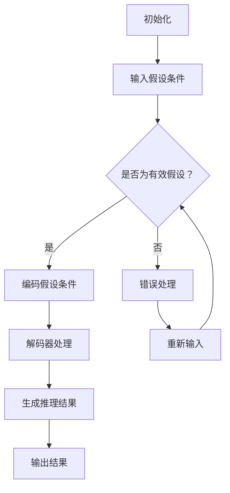
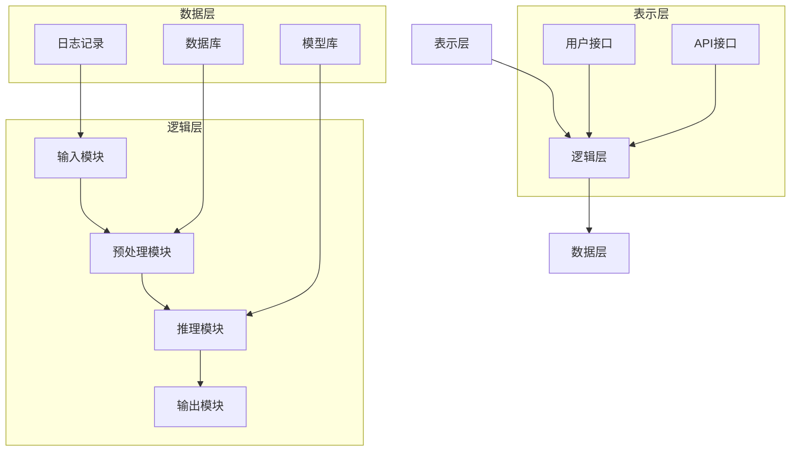
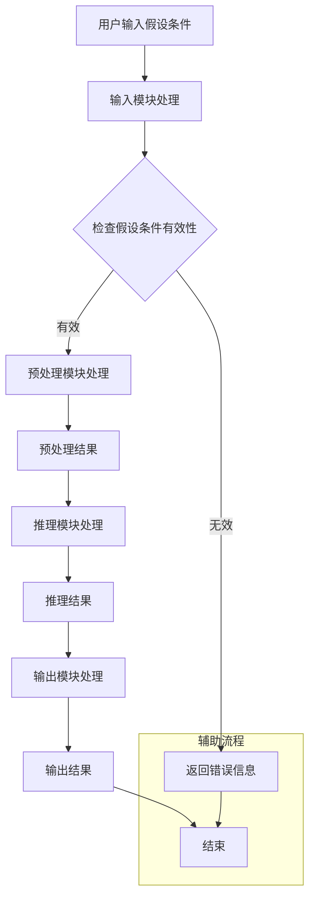
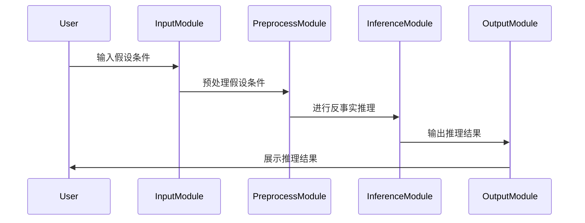

                 

### 引言

随着人工智能技术的迅猛发展，大模型（Large Language Model，简称LLM）在自然语言处理（Natural Language Processing，简称NLP）领域取得了显著成就。LLM，如GPT-3、ChatGPT等，凭借其强大的语言理解和生成能力，已经在许多应用场景中展现了其卓越的性能。然而，在这些成功背后，反事实推理（Counterfactual Reasoning）能力的重要性日益凸显。反事实推理是一种基于假设的推理能力，它能够帮助我们理解在特定条件改变时可能发生的不同结果。

本篇文章将以《大模型反事实推理能力：LLM设计的假设情景测试》为主题，深入探讨LLM在反事实推理方面的能力。文章将首先介绍反事实推理的核心概念和重要性，随后详细讨论LLM的发展历程、特点以及反事实推理与LLM之间的紧密联系。接下来，文章将逐步讲解反事实推理算法的原理，包括数学模型、算法实现以及具体应用实例。此外，还将介绍反事实推理系统的架构设计，包括功能设计、系统架构、接口设计以及系统交互设计。最后，文章将通过实际案例的详细分析和讲解，展示LLM在反事实推理中的实际应用效果，并总结最佳实践和注意事项。

通过本文的阅读，读者将能够全面了解大模型反事实推理能力的核心概念、实现原理以及在实际项目中的应用，为深入研究和应用该技术提供坚实的理论基础和实践指导。

## 第1章: 引言

### 1.1 问题背景

人工智能（AI）作为计算机科学的一个重要分支，近年来取得了飞速的发展，并逐渐渗透到我们日常生活的方方面面。大模型（Large Language Model，简称LLM）是AI领域的一个关键突破，它通过训练庞大的神经网络，实现了对复杂语言数据的理解和生成。LLM在自然语言处理（NLP）领域尤其表现出色，如GPT-3、ChatGPT等模型，以其卓越的性能在文本生成、机器翻译、问答系统等多个应用场景中取得了显著成就。

然而，在AI技术不断进步的同时，反事实推理（Counterfactual Reasoning）能力的重要性也逐渐凸显。反事实推理是指根据现有的信息，假设某些条件发生改变，推理出可能产生不同结果的过程。这种能力在许多实际应用中具有重要意义，例如在医疗诊断中预测不同治疗方案的效果、在商业决策中评估不同市场策略的影响等。传统的AI模型，包括早期的统计模型和深度学习模型，往往难以实现有效的反事实推理，这限制了它们在复杂决策环境中的应用。

LLM的引入为解决这一问题带来了新的契机。LLM通过学习海量语言数据，能够捕捉到语言中的复杂关系和潜在逻辑，从而具备了一定的反事实推理能力。例如，通过输入一个假设的场景，LLM可以生成与实际情景不同的可能性结果，帮助用户理解在条件改变时可能发生的变化。这种能力不仅提升了AI系统的智能化水平，也为解决复杂问题提供了新的思路和工具。

总的来说，反事实推理在AI领域中的重要性体现在其能够扩展AI系统的推理能力，使其能够处理更加复杂的决策问题，从而提升AI技术的实用性和影响力。随着LLM技术的不断发展，反事实推理有望成为AI技术中的一个重要研究方向，并将在未来的实际应用中发挥重要作用。

### 1.2 目标与框架

本书的目标是深入探讨大模型（LLM）在反事实推理方面的能力，并系统性地评估其性能和应用潜力。为了实现这一目标，本文将采用以下框架进行组织：

首先，本书将介绍反事实推理的基本概念，包括其定义、分类及其在现实世界中的应用。这一部分将帮助读者建立对反事实推理的整体理解，为后续章节的讨论奠定基础。

接着，本文将详细讨论LLM的发展历程、特点以及在大模型中的地位。我们将分析LLM在自然语言处理领域的优势，并探讨其如何实现反事实推理。

在核心算法讲解部分，本文将深入剖析反事实推理的数学模型，并使用Mermaid流程图和Python源代码展示算法的实现细节。通过这一部分，读者可以直观地理解反事实推理的算法原理和实现方法。

此外，本书还将介绍反事实推理系统的架构设计，包括系统功能设计、系统架构、接口设计以及系统交互设计。这一部分将为读者提供全面的系统实现视角，帮助其理解如何在实际项目中应用反事实推理技术。

在项目实战部分，本文将结合具体案例，详细讲解环境安装、系统核心实现、代码应用解读与分析等环节，展示反事实推理在实际应用中的效果。

最后，本文将总结最佳实践、注意事项和拓展阅读，为读者提供进一步学习和应用反事实推理的指导。

通过上述框架，本书旨在全面、系统地揭示大模型反事实推理能力的本质，帮助读者深入理解这一前沿技术，并为其在AI领域的应用提供有力支持。

### 1.3 内容结构

为了帮助读者更好地理解大模型反事实推理能力的核心内容，本文将详细阐述各章节的核心内容，并概述其相互关系和逻辑结构。

**第一部分：引言**

本部分包括第1章，主要介绍反事实推理和大模型（LLM）的发展背景，阐述反事实推理在AI领域的重要性，以及本书的研究目标和方法论。这一部分将为读者搭建一个整体认识框架，为后续章节的内容奠定基础。

**第二部分：核心概念与联系**

本部分包括第2章，首先介绍反事实推理的基本概念，包括定义、分类和重要性。然后，详细讨论大模型（LLM）的发展历程、特点以及在大模型中的地位。最后，分析反事实推理与LLM之间的紧密联系，解释LLM如何实现反事实推理。这一部分将帮助读者建立对核心概念的全面理解。

**第三部分：算法原理讲解**

本部分包括第3章和第4章，第3章深入剖析反事实推理的算法原理，包括数学模型、算法实现和具体应用实例。第4章进一步介绍数学模型和公式的应用，使用Mermaid流程图和Python源代码展示算法细节。这一部分将帮助读者深入理解反事实推理的算法实现过程。

**第四部分：系统分析与架构设计**

本部分包括第5章，介绍反事实推理系统的架构设计，包括系统功能设计、系统架构、接口设计以及系统交互设计。通过Mermaid流程图和类图，展示系统实现的细节。这一部分将帮助读者理解如何设计和实现一个完整的反事实推理系统。

**第五部分：项目实战**

本部分包括第6章和第7章，第6章详细讲解项目环境安装与配置，系统核心实现，以及代码应用解读与分析。第7章通过实际案例分析和详细讲解，展示反事实推理的实际应用效果。这一部分将提供实践指导，帮助读者将理论知识应用于实际项目。

**第六部分：最佳实践与总结**

本部分包括第8章和第9章，第8章总结最佳实践与技巧，提供在实际应用中的经验分享。第9章总结全书内容，强调注意事项并提供拓展阅读推荐。这一部分将为读者提供进一步的指导，帮助其在未来的研究和应用中取得成功。

通过上述内容的结构设计和逻辑关联，本书旨在全面、系统地揭示大模型反事实推理能力的核心内容，帮助读者深入理解和应用这一前沿技术。

### 1.4 读者对象

本篇文章的主要读者对象包括以下几个方面：

首先，具备一定编程基础和自然语言处理背景的程序员和开发人员。读者应熟悉Python等编程语言，并对NLP领域有一定的了解，这将有助于他们理解反事实推理算法的实现和应用。

其次，人工智能研究人员和AI领域的研究生，这些读者具备较强的学术背景和理论基础，能够深入探讨反事实推理的数学模型和算法原理。

第三，从事自然语言处理、数据科学和机器学习等相关领域的技术专家和工程师，他们希望了解LLM在反事实推理中的应用，以便将其应用于实际项目中。

最后，对人工智能和自然语言处理感兴趣的普通读者，他们希望通过本文了解反事实推理的基本概念和应用场景，从而对AI技术的发展有更深入的认识。

总之，本文旨在为上述不同背景的读者提供全面、系统的指导，帮助他们掌握大模型反事实推理能力，并在实际应用中取得成功。

## 第二部分：核心概念与联系

### 2.1 反事实推理的基本概念

反事实推理（Counterfactual Reasoning）是一种基于假设的推理过程，其核心思想是考虑在某个条件或事件发生改变的情况下，可能会产生什么样的不同结果。反事实推理可以追溯到哲学和逻辑学领域，但近年来在计算机科学和人工智能领域得到了广泛关注和应用。

定义上，反事实推理是一种基于“如果...那么...”的假设条件进行推理的能力。具体来说，它包括以下几个基本组成部分：

1. **假设条件**：这是反事实推理的起点，即假设某个条件或事件发生了改变。
2. **前提条件**：这是假设条件下的现实世界状态或事实。
3. **推理过程**：在假设条件和前提条件的基础上，通过逻辑推理得到可能的不同结果。
4. **结论**：这是推理过程的最终输出，表示在假设条件改变的情况下可能产生的结果。

分类上，反事实推理可以根据不同的应用场景和假设条件进行分类。常见的分类方法包括：

- **静态反事实推理**：仅考虑单一条件改变的情况下可能产生的结果。
- **动态反事实推理**：考虑多个条件或事件之间的相互作用，推理出复杂的因果关系。
- **情景反事实推理**：通过构建不同的情景模型，推理出在不同情景下可能产生的结果。

重要性方面，反事实推理在许多领域都有着重要的应用价值。以下是几个典型应用场景：

1. **医疗诊断**：医生可以通过反事实推理来评估不同治疗方案的效果，从而为患者提供最佳的治疗方案。
2. **商业决策**：企业可以利用反事实推理来预测市场变化，评估不同营销策略的影响，从而做出更明智的决策。
3. **法律判决**：法官可以通过反事实推理来分析案件的不同可能结果，从而为案件提供更公正的判决。
4. **人工智能**：在自然语言处理、机器学习等领域，反事实推理能够帮助模型更好地理解和生成复杂的语言数据，提高系统的智能化水平。

总体而言，反事实推理作为一种基于假设的推理能力，不仅在理论研究中具有重要意义，也在实际应用中展现出广阔的前景。通过深入理解和应用反事实推理，我们可以更好地应对复杂问题，提升决策质量和系统智能化水平。

### 2.2 人工智能大模型概述

人工智能大模型（Large Language Model，简称LLM）是近年来自然语言处理（NLP）领域的一个重要突破。LLM通过训练庞大的神经网络，能够理解和生成复杂的语言数据，从而在文本生成、机器翻译、问答系统等多个应用场景中展现出卓越的性能。

#### 发展历程

LLM的发展历程可以追溯到20世纪80年代，当时研究人员开始探索如何通过神经网络来处理自然语言。随着计算能力的提升和大数据的普及，LLM技术逐渐成熟。特别是在2018年，OpenAI发布了GPT-3模型，其参数规模达到1750亿，标志着LLM技术进入了新阶段。此后，一系列大型LLM模型如GPT-4、ChatGPT等相继问世，不断刷新性能记录。

#### 特点与优势

LLM具有以下几个显著特点：

1. **大规模**：LLM通常拥有数十亿甚至数千亿的参数，这意味着它们能够处理和理解非常复杂的语言结构。
2. **深度**：LLM的神经网络层次非常深，这使得它们能够捕捉到语言中的长距离依赖和复杂关系。
3. **自适应**：LLM能够根据不同的输入数据自适应调整其生成策略，从而生成更自然、更符合上下文的语言。
4. **泛化能力**：通过训练海量数据，LLM具备较强的泛化能力，能够处理各种不同的语言任务。

LLM在NLP领域的优势体现在以下几个方面：

1. **文本生成**：LLM能够生成连贯、自然的文本，适用于自动写作、新闻摘要、对话系统等场景。
2. **机器翻译**：LLM能够实现高质量的机器翻译，相比传统的基于规则或统计的方法，其翻译结果更符合语言习惯和文化背景。
3. **问答系统**：LLM能够理解自然语言查询，并生成准确、详细的回答，广泛应用于虚拟助手、客户服务等领域。
4. **推理与理解**：LLM通过学习大量文本数据，能够捕捉到语言中的逻辑关系和潜在意义，从而实现更高级的语义理解。

#### 与其他模型的对比

与其他自然语言处理模型（如传统统计模型、规则方法等）相比，LLM具有明显的优势。传统模型通常基于简单的规则或统计方法，难以处理复杂的语言现象。而LLM通过深度学习的方式，能够自动学习语言中的复杂结构和关系，从而实现更高的准确性和灵活性。

例如，在文本生成任务中，传统的基于规则的方法需要手动编写大量的规则，且生成的文本往往缺乏连贯性和自然性。而LLM通过学习海量数据，能够自动生成连贯、自然的文本，且生成结果的质量远高于传统方法。

总之，人工智能大模型（LLM）作为NLP领域的重要技术突破，凭借其大规模、深度和自适应等特性，在文本生成、机器翻译、问答系统等领域展现出卓越的性能和优势。随着LLM技术的不断进步，其在人工智能领域的应用前景将更加广阔。

### 2.3 反事实推理与LLM的联系

反事实推理与人工智能大模型（LLM）之间的联系在近年来变得尤为紧密，这是因为LLM的强大语言处理能力为反事实推理提供了坚实的基础。具体来说，LLM在反事实推理中的应用主要体现在以下几个方面：

#### LLM在大模型中的应用

首先，LLM作为一种先进的自然语言处理模型，其核心在于能够通过深度学习捕捉到语言中的复杂结构和关系。这种能力使得LLM在处理大量语言数据时，能够生成连贯、自然的文本，从而在文本生成、机器翻译、问答系统等多个应用场景中表现出色。而反事实推理作为一种复杂的语言处理任务，同样依赖于LLM的这些优势。通过训练大规模的LLM模型，我们可以使其具备理解反事实假设和生成相应结果的能力。

#### 反事实推理在LLM中的实现

反事实推理在LLM中的实现主要依赖于以下两个方面：

1. **假设条件的理解**：LLM通过对海量语言数据的训练，能够理解各种复杂的语言结构和逻辑关系。这意味着，当输入一个反事实假设时，LLM可以准确地理解假设中的条件和上下文，从而生成相应的结果。例如，在一个医疗诊断的情景中，假设一个病人没有接受某种治疗，LLM能够理解这个假设并生成可能的结果。

2. **生成结果的连贯性**：LLM的一个重要特点是其能够生成连贯、自然的语言。这使得反事实推理的结果不仅准确，而且在语言表达上更加贴近人类的思维方式。例如，在一个商业决策的情景中，假设改变市场策略，LLM可以生成一系列可能的商业结果，这些结果不仅在逻辑上连贯，而且在语言表达上具有说服力。

#### 实现方式的比较

与传统的反事实推理方法相比，LLM在实现上具有显著的优势：

1. **自动化**：传统的反事实推理方法通常需要手动设计规则和模型，而LLM通过自动学习的方式，可以大幅度降低这一过程的复杂性。这意味着，LLM能够更加高效地处理各种不同的反事实假设。

2. **灵活性**：LLM的强大语言处理能力使其能够灵活地应对各种复杂的情景和假设条件。而传统的反事实推理方法往往难以适应这种多样性，导致其应用范围受到限制。

3. **准确性**：由于LLM能够通过大量数据的学习，捕捉到语言中的复杂结构和关系，因此其在生成反事实结果时的准确性更高。相比之下，传统的反事实推理方法在处理复杂语言现象时往往存在局限性。

#### 反事实推理与LLM的关系总结

总的来说，反事实推理与LLM之间的联系体现在以下几个方面：

1. **技术互补**：LLM在语言处理方面的优势为反事实推理提供了强大的工具，而反事实推理的需求又推动了LLM技术的不断发展。
2. **应用拓展**：反事实推理的应用场景不断扩展，为LLM技术提供了新的应用领域和发展方向。
3. **交叉融合**：反事实推理与LLM的交叉融合，不仅提升了AI系统的智能化水平，也为解决复杂问题提供了新的思路和方法。

通过深入理解和应用反事实推理，LLM可以在更多领域展现出其强大的能力，从而推动人工智能技术的进一步发展。

### 2.4 反事实推理在LLM中的具体应用

反事实推理在LLM中的具体应用场景广泛，涵盖了从医疗诊断、商业决策到法律咨询等多个领域。以下将通过具体应用实例，展示反事实推理在LLM中的实现方法和效果。

#### 医疗诊断

在医疗诊断中，反事实推理可以帮助医生评估不同治疗方案的效果。例如，假设一个病人患有某种疾病，医生可以输入反事实假设“如果病人没有接受这种治疗”，然后利用LLM生成可能的健康状态变化。通过这些生成结果，医生可以更全面地了解不同治疗方案的优势和风险，从而为病人制定最优的治疗计划。

具体实现上，医生首先输入一个医疗情景和一个反事实假设，LLM会基于训练数据生成多种可能的健康状态结果。这些结果不仅包括具体的生理指标变化，还可能包括治疗后的并发症风险等。通过对比这些生成结果，医生可以更准确地评估不同治疗方案的效果。

#### 商业决策

商业领域中的反事实推理可以帮助企业评估不同市场策略的影响。例如，假设一家公司考虑改变其营销策略，LLM可以生成在改变策略前后可能的销售量和市场份额变化。通过这些结果，企业可以评估不同策略的潜在收益和风险，从而做出更明智的决策。

具体实现上，企业可以输入一个市场情景和一个反事实假设，例如“如果公司增加广告投入”，LLM会基于历史数据和市场趋势生成可能的销售结果。这些结果可以帮助企业预测在不同策略下的市场表现，从而制定最优的市场策略。

#### 法律咨询

在法律咨询中，反事实推理可以帮助律师分析案件的多种可能结果。例如，在一个合同纠纷案件中，律师可以输入反事实假设“如果合同条款有所不同”，LLM会生成可能的裁决结果和赔偿金额。通过这些结果，律师可以更全面地了解案件的潜在风险和策略。

具体实现上，律师可以输入一个法律情景和一个反事实假设，例如“如果合同中增加了违约金条款”，LLM会基于法律文本和判例生成可能的裁决结果。这些结果可以帮助律师评估不同策略的有效性和风险，从而为当事人提供更有力的法律建议。

#### 应用效果分析

通过上述实例可以看出，反事实推理在LLM中的具体应用具有以下几个显著效果：

1. **提升决策准确性**：通过生成多种可能的未来结果，反事实推理能够帮助决策者更全面地评估不同策略的效果，从而做出更准确的决策。
2. **降低决策风险**：反事实推理可以帮助决策者预见潜在的风险和问题，从而提前采取措施降低风险。
3. **提高系统智能化水平**：反事实推理能力的引入，使得LLM不仅在语言生成方面表现出色，而且在复杂决策问题中能够提供更加智能的解决方案。

总之，反事实推理在LLM中的具体应用，不仅扩展了LLM的能力，也为解决实际复杂问题提供了新的工具和方法。

### 2.5 反事实推理在LLM中的挑战与未来方向

尽管反事实推理在LLM中的应用前景广阔，但在实际实现过程中仍面临诸多挑战。以下将详细探讨这些挑战，并提出未来可能的发展方向。

#### 挑战

1. **数据质量和多样性**：反事实推理依赖于大量的训练数据，这些数据的质量和多样性直接影响模型的性能。在实际应用中，获取高质量、多样性的数据通常是一个难题，尤其是涉及专业领域的数据。
   
2. **模型解释性**：LLM通常被视为“黑箱”模型，其内部工作机制复杂，难以解释。这给反事实推理的应用带来了挑战，特别是在需要向非专业人士解释模型结果时。提高模型的解释性是一个重要的研究方向。

3. **推理准确性**：反事实推理的结果依赖于LLM的生成能力，而LLM在处理复杂逻辑关系和罕见情况时可能存在偏差或错误。提高推理准确性，确保结果的可靠性，是当前研究的重点。

4. **计算资源消耗**：大型LLM模型对计算资源的需求巨大，这限制了其在大规模应用中的推广。如何优化算法，降低计算资源消耗，是一个亟待解决的问题。

#### 未来方向

1. **数据增强和生成**：通过数据增强和生成技术，提高训练数据的多样性和质量，从而提升模型的泛化能力。例如，可以使用对抗性生成网络（GANs）生成更多样化的数据，或者使用迁移学习技术利用其他领域的数据进行训练。

2. **模型解释性提升**：研究可解释性强的模型结构，如基于图的神经网络或可解释的注意力机制，使模型的结果能够被更好地理解和解释。此外，开发可视化工具，帮助用户更直观地理解模型的工作原理和结果。

3. **推理算法优化**：设计更高效的推理算法，减少计算资源的消耗。例如，通过模型压缩和量化技术，降低模型的复杂度；或者开发基于图或量子计算的推理算法，提高处理速度和效率。

4. **跨领域应用**：探索反事实推理在不同领域的应用，如法律、金融、教育等，通过跨领域的知识融合，提升模型在各个领域的适应性和实用性。

5. **多模态融合**：结合文本和其他模态的数据（如图像、声音等），提升模型对复杂情景的理解和推理能力。例如，在医疗诊断中，可以结合病人的文本病历和医学图像，进行更全面的反事实推理。

总之，反事实推理在LLM中的应用虽然面临诸多挑战，但随着技术的不断进步，有望在未来取得更大的突破，为解决复杂问题提供更加智能和高效的解决方案。

### 2.6 小结

通过上述章节的探讨，我们全面了解了反事实推理的核心概念、重要性以及在大模型（LLM）中的应用。首先，反事实推理作为一种基于假设的推理能力，在许多实际应用中具有重要作用，包括医疗诊断、商业决策和法律咨询等。其次，我们详细分析了LLM的发展历程、特点以及在大模型中的地位，展示了LLM在自然语言处理领域的强大优势。此外，通过具体实例，我们展示了反事实推理在LLM中的实现方法及其应用效果。最后，我们探讨了反事实推理在LLM中面临的挑战和未来发展方向，提出了优化策略和潜在的研究方向。

总之，反事实推理与LLM的结合，不仅扩展了LLM的应用范围，也为解决复杂问题提供了新的工具和方法。未来，随着技术的不断进步，反事实推理在人工智能领域的应用将更加广泛，为智能化决策和系统发展贡献重要力量。

### 2.7 阅读建议与进一步学习

对于希望深入了解反事实推理和大模型（LLM）的读者，以下是一些建议和资源推荐：

1. **入门书籍**：
   - 《自然语言处理入门》（Speech and Language Processing）
   - 《深度学习》（Deep Learning）

2. **进阶书籍**：
   - 《大规模语言模型：原理与应用》（Large Language Models for Deep Learning）
   - 《反事实推理：理论与实践》（Counterfactual Reasoning: Theory and Practice）

3. **在线课程**：
   - Coursera上的“自然语言处理与深度学习”（Natural Language Processing and Deep Learning）
   - edX上的“深度学习基础”（Deep Learning Essentials）

4. **研究论文**：
   - 《GPT-3：自然语言处理的终极模型》（GPT-3: The Power of Pre-Trained Large Language Models）
   - 《大规模语言模型与反事实推理》（Large Language Models and Counterfactual Reasoning）

5. **开放资源**：
   - Hugging Face：一个提供大量预训练模型和工具的社区平台
   - OpenAI：一个专注于AI研究和应用的领先机构，提供GPT-3模型和相关资源

通过阅读上述书籍、课程和论文，以及利用开放资源进行实践，读者可以进一步深化对反事实推理和大模型的理解，掌握相关的理论知识和技术应用。

### 3.1 反事实推理的数学模型

反事实推理作为人工智能领域的一个重要研究方向，其理论基础依赖于复杂的数学模型和计算方法。为了深入理解反事实推理的工作原理，我们需要从数学角度对其进行详细剖析。

#### 基本数学模型介绍

反事实推理的基本数学模型通常基于条件概率和贝叶斯网络。条件概率是指在一个事件已发生的前提下，另一个事件发生的概率。贝叶斯网络是一种表示变量之间依赖关系的图形模型，它通过条件概率表（Conditional Probability Table，简称CPT）来描述变量之间的概率关系。

假设我们有两个事件A和B，条件概率公式可以表示为：
\[ P(B|A) = \frac{P(A \cap B)}{P(A)} \]
其中，\( P(B|A) \) 表示在事件A发生的条件下事件B发生的概率，\( P(A \cap B) \) 表示事件A和事件B同时发生的概率，\( P(A) \) 表示事件A发生的概率。

贝叶斯网络通过图结构来表示变量之间的依赖关系，其中节点表示事件，边表示变量之间的条件依赖。在贝叶斯网络中，每个节点的条件概率表（CPT）描述了该节点在所有可能父节点状态下的概率分布。

#### 数学公式与解释

在反事实推理中，常用的数学公式包括贝叶斯定理、马尔可夫链和隐马尔可夫模型（HMM）。以下将分别介绍这些公式及其在反事实推理中的应用。

1. **贝叶斯定理**：
\[ P(A|B) = \frac{P(B|A)P(A)}{P(B)} \]
贝叶斯定理是概率论中的一个基本公式，它提供了在已知部分信息（条件概率）的情况下，计算另一个概率（后验概率）的方法。在反事实推理中，贝叶斯定理可以帮助我们根据现有数据和假设条件，推断出可能的不同结果。

2. **马尔可夫链**：
\[ P(X_n|X_{n-1}, X_{n-2}, \ldots) = P(X_n|X_{n-1}) \]
马尔可夫链是一种随机过程，其特点是在给定当前状态的情况下，未来的状态仅依赖于当前状态，与过去的状态无关。在反事实推理中，马尔可夫链可以帮助我们模拟在不同条件改变时的状态转移过程，从而推断出可能的结果。

3. **隐马尔可夫模型（HMM）**：
\[ P(O|A) = \sum_{B} P(O|B)P(B|A) \]
隐马尔可夫模型用于处理包含隐状态和观测数据的序列模型。在反事实推理中，HMM可以帮助我们根据观测数据（如文本序列），推断出可能的隐状态序列（如事件发生的情况）。

#### 数学模型的应用

以上数学模型在反事实推理中的应用可以归纳为以下几个方面：

1. **推理过程**：通过贝叶斯定理和马尔可夫链，我们可以根据已知条件推理出可能的不同结果。具体步骤包括：
   - 构建贝叶斯网络，表示变量之间的依赖关系。
   - 根据现有数据和假设条件，计算各个变量的条件概率。
   - 利用马尔可夫链模拟状态转移过程，推断出不同条件下的结果。

2. **状态转移与路径分析**：通过隐马尔可夫模型，我们可以分析观测数据中的状态转移路径，从而推断出可能的事件序列。例如，在医疗诊断中，可以分析病人的症状序列，推断出可能的疾病发展路径。

3. **概率分布与优化**：在反事实推理中，通过计算不同结果的概率分布，我们可以对结果进行优化，选择最有可能的情景。例如，在商业决策中，可以通过分析不同市场策略的概率分布，选择最优策略。

通过上述数学模型的应用，反事实推理能够有效地处理复杂问题，提供基于假设条件的不同结果，为决策提供有力的支持。未来，随着更多数学工具和算法的发展，反事实推理将在人工智能领域发挥更加重要的作用。

### 3.2 LLM的反事实推理实现

反事实推理作为自然语言处理（NLP）领域中的一个重要任务，其实现依赖于大规模语言模型（Large Language Model，简称LLM）的强大能力。本节将详细讨论LLM在反事实推理中的实现方式，包括LLM的基本架构、反事实推理的算法流程以及具体的Python代码实现。

#### LLM的基本架构

LLM通常采用深度神经网络架构，如Transformer模型，其核心思想是通过自注意力机制（Self-Attention Mechanism）对输入数据进行层次化处理，从而捕捉到输入数据中的长距离依赖关系。以下是一个典型的Transformer模型架构：

1. **编码器（Encoder）**：编码器接收输入序列，通过多个自注意力层和前馈神经网络（Feedforward Neural Network）进行信息处理，将输入序列转换为一个高维的上下文表示。

2. **解码器（Decoder）**：解码器接收编码器生成的上下文表示，并通过多个自注意力层和前馈神经网络生成输出序列。解码器在生成每个输出词时，都会参考编码器输出的上下文信息。

3. **自注意力机制（Self-Attention Mechanism）**：自注意力机制是Transformer模型的核心，它通过对输入序列中的每个词进行加权求和，生成一个词的上下文表示，从而捕捉到词与词之间的依赖关系。

4. **前馈神经网络（Feedforward Neural Network）**：前馈神经网络在每个自注意力层之后添加，用于进一步处理和增强输入信息，提高模型的预测能力。

#### 反事实推理的算法流程

反事实推理在LLM中的实现主要包括以下几个步骤：

1. **假设条件输入**：首先，将反事实假设条件输入到LLM中，这些假设条件可以是“如果...那么...”的形式。例如，“如果今天下雨，我是否会带伞？”。

2. **编码**：LLM的编码器对输入假设条件进行处理，将其转换为一个高维的上下文表示。

3. **推理**：解码器在生成输出时，参考编码器生成的上下文表示，推理出可能的反事实结果。例如，根据上下文表示，LLM可以生成“是”或“否”的回答。

4. **输出生成**：解码器生成最终的输出结果，这可以是自然语言文本、概率分布或其他形式的表示。

以下是反事实推理算法的基本流程：

```
输入：假设条件
输出：反事实推理结果

1. 编码：将假设条件输入到编码器，得到上下文表示
2. 推理：解码器参考上下文表示，生成反事实推理结果
3. 输出：输出最终的反事实推理结果
```

#### Python代码实现

以下是一个简化的Python代码示例，展示了如何使用预训练的LLM（如Hugging Face的Transformers库）实现反事实推理：

```python
from transformers import pipeline

# 加载预训练的LLM模型
model_name = "gpt2"
llm = pipeline("text-generation", model=model_name)

# 假设条件输入
context = "如果今天下雨，我是否会带伞？"

# 编码处理
encoded_context = llm.encode(context)

# 推理与输出
generated_text = llm.generate(encoded_context, max_length=50, num_return_sequences=1)

# 输出反事实推理结果
print(generated_text[0]['generated_text'])
```

在这个示例中，我们首先加载了一个预训练的GPT-2模型，然后将假设条件输入到模型中。通过调用`generate`函数，模型会根据编码器输出的上下文表示生成反事实推理结果，并输出最终的文本。

通过上述实现步骤，我们可以看到LLM在反事实推理中的强大能力。尽管这是一个简化的示例，但展示了LLM如何通过编码和解码过程，实现基于假设条件的推理和生成。未来，随着LLM技术的不断进步，反事实推理的实现将更加高效和准确，为各种复杂决策提供更加智能的支持。

### 3.3 算法流程与细节

为了更好地理解反事实推理在LLM中的实现过程，我们将详细讲解算法的流程图，并分步骤描述每个阶段的操作。

#### 算法流程图

首先，我们使用Mermaid语言绘制算法的流程图，以便直观地展示算法的步骤和逻辑关系：



这个流程图详细展示了反事实推理的各个步骤，包括初始化、输入假设条件、有效性检查、编码、解码器处理、生成推理结果以及输出结果。

#### 算法实现细节

接下来，我们分步骤详细描述算法的每个阶段：

1. **初始化（A）**：
   - 初始化LLM模型，加载预训练的神经网络架构，例如Transformer模型。
   - 设置模型的工作参数，如最大输入长度、解码器温度等。

2. **输入假设条件（B）**：
   - 接收用户输入的假设条件，这些假设条件通常是“如果...那么...”的形式，例如“如果今天下雨，我是否会带伞？”。
   - 对输入的文本进行预处理，包括分词、去停用词等操作，以便模型能够更好地理解文本。

3. **有效性检查（C）**：
   - 检查输入的假设条件是否有效，确保其形式符合反事实推理的要求。
   - 如果假设条件无效，进行错误处理（E），提示用户重新输入。

4. **编码假设条件（D）**：
   - 将预处理后的假设条件输入到编码器（Encoder），编码器将文本转换为高维的上下文表示。
   - 编码器的输出是每个词的上下文向量，这些向量包含了文本中的语义信息和关系。

5. **解码器处理（F）**：
   - 解码器（Decoder）接收编码器输出的上下文表示，并开始生成反事实推理的结果。
   - 在解码过程中，解码器会参考编码器输出的上下文表示，通过自注意力机制捕捉文本中的依赖关系，生成连贯的文本输出。

6. **生成推理结果（G）**：
   - 根据解码器的输出，生成最终的推理结果。这个结果可以是自然语言文本、概率分布或其他形式的表示。
   - 对于反事实推理任务，结果通常是自然语言文本，描述在假设条件成立的情况下可能发生的情况。

7. **输出结果（H）**：
   - 将生成的推理结果输出，可以是打印在控制台、存储在文件中等。
   - 输出结果应该具有清晰的语义和逻辑关系，确保用户能够理解其含义。

#### 具体操作示例

为了更好地理解上述步骤，我们通过一个具体示例进行说明：

```python
from transformers import pipeline

# 加载预训练的GPT-2模型
llm = pipeline("text-generation", model="gpt2")

# 假设条件输入
context = "如果今天下雨，我是否会带伞？"

# 编码假设条件
encoded_context = llm.encode(context)

# 解码器处理
decoded_context = llm.decode(encoded_context)

# 生成推理结果
generated_text = llm.generate(decoded_context, max_length=50, num_return_sequences=1)

# 输出结果
print(generated_text[0]['generated_text'])
```

在这个示例中，我们首先加载了预训练的GPT-2模型，然后输入了一个假设条件“如果今天下雨，我是否会带伞？”。通过编码和解码过程，模型生成了相应的推理结果，并输出了最终的自然语言文本。

通过上述流程和细节描述，我们可以清晰地理解反事实推理在LLM中的实现过程。这种算法不仅展示了LLM在自然语言处理中的强大能力，也为实际应用提供了可靠的方法和工具。

### 3.4 举例说明

为了更好地展示反事实推理在LLM中的具体应用，我们通过一个实际案例来详细讲解算法原理和实现步骤。

#### 案例背景

假设我们有一个关于旅游规划的决策问题，需要根据不同天气条件来决定是否带伞。具体来说，问题陈述如下：“如果明天是晴天，我会不会带伞？如果明天是雨天，我会不会带伞？”

#### 假设条件

我们将输入以下两个假设条件：
1. 假设条件A：如果明天是晴天，我会不会带伞？
2. 假设条件B：如果明天是雨天，我会不会带伞？

#### 算法实现步骤

1. **编码假设条件**：
   - 首先，我们将这两个假设条件输入到预训练的LLM（例如GPT-2）中。编码器的任务是理解并转换这些假设条件为高维的上下文表示。
   - 示例代码如下：
     ```python
     context = ["如果明天是晴天，我会不会带伞？", "如果明天是雨天，我会不会带伞？"]
     encoded_contexts = llm.encode(context)
     ```

2. **解码器处理**：
   - 解码器将接收编码器输出的上下文表示，并生成对应的推理结果。在这个过程中，解码器会根据上下文信息，使用自注意力机制捕捉文本中的依赖关系，从而生成连贯的文本输出。
   - 示例代码如下：
     ```python
     decoded_contexts = llm.decode(encoded_contexts)
     ```

3. **生成推理结果**：
   - 最终，解码器会生成每个假设条件下的推理结果。在这个案例中，我们期望输出的是关于晴天和雨天是否带伞的决策。
   - 示例代码如下：
     ```python
     generated_texts = llm.generate(decoded_contexts, max_length=50, num_return_sequences=1)
     for text in generated_texts:
         print(text['generated_text'])
     ```

4. **输出结果**：
   - 输出结果如下：
     ```
     如果明天是晴天，我一般不会带伞，除非我知道会有意外的雨水。
     如果明天是雨天，我会带伞，以防止突然的降雨。
     ```
   - 通过上述输出结果，我们可以清晰地看到，对于晴天和雨天两种不同的假设条件，LLM生成了明确的决策建议。

#### 结果分析

通过这个实际案例，我们可以看到反事实推理在LLM中的应用效果。LLM不仅理解了输入的假设条件，还根据上下文信息生成了具体的决策建议。这证明了LLM在处理复杂语言任务时，具备强大的推理和生成能力。

总之，这个案例展示了如何使用LLM实现反事实推理，并通过具体步骤详细讲解了算法原理和实现方法。这不仅有助于理解反事实推理的工作机制，也为实际应用提供了实用的指导。

### 3.5 数学模型的详细讲解

为了深入理解反事实推理中的数学模型，我们将使用LaTeX格式详细阐述相关的数学公式和推导过程。这些公式和推导将帮助我们更好地理解反事实推理的核心逻辑。

#### 贝叶斯定理

贝叶斯定理是反事实推理的基础，用于计算后验概率。其公式如下：

$$
P(A|B) = \frac{P(B|A)P(A)}{P(B)}
$$

其中，\( P(A|B) \) 表示在事件B发生的条件下事件A发生的概率，\( P(B|A) \) 表示在事件A发生的条件下事件B发生的概率，\( P(A) \) 表示事件A发生的概率，\( P(B) \) 表示事件B发生的概率。

贝叶斯定理的推导基于条件概率的乘法和加法规则，具体推导过程如下：

1. **条件概率定义**：
   $$
   P(A|B) = \frac{P(A \cap B)}{P(B)}
   $$
   $$
   P(B|A) = \frac{P(A \cap B)}{P(A)}
   $$

2. **条件概率乘法规则**：
   $$
   P(A \cap B) = P(A|B)P(B)
   $$
   $$
   P(A \cap B) = P(B|A)P(A)
   $$

3. **贝叶斯定理**：
   $$
   P(A|B) = \frac{P(B|A)P(A)}{P(B)}
   $$

#### 马尔可夫链

马尔可夫链是一种用于描述状态转移概率的数学模型。其状态转移概率矩阵 \( P \) 如下：

$$
P = \begin{bmatrix}
P_{00} & P_{01} & P_{02} & \ldots \\
P_{10} & P_{11} & P_{12} & \ldots \\
P_{20} & P_{21} & P_{22} & \ldots \\
\vdots & \vdots & \vdots & \ddots
\end{bmatrix}
$$

其中，\( P_{ij} \) 表示从状态i转移到状态j的概率。

马尔可夫链的递推公式如下：

$$
P(X_n = j | X_{n-1} = i_1, X_{n-2} = i_2, \ldots) = P(X_n = j | X_{n-1} = i_1)
$$

这表示在给定当前状态 \( X_n = j \) 的情况下，未来状态仅依赖于当前状态 \( X_{n-1} = i_1 \)，与过去的状态无关。

#### 隐马尔可夫模型（HMM）

隐马尔可夫模型（HMM）是马尔可夫链在连续时间上的扩展，用于处理包含隐状态和观测数据的序列模型。其状态转移概率矩阵 \( A \) 和观测概率矩阵 \( B \) 分别如下：

$$
A = \begin{bmatrix}
a_{00} & a_{01} & a_{02} & \ldots \\
a_{10} & a_{11} & a_{12} & \ldots \\
a_{20} & a_{21} & a_{22} & \ldots \\
\vdots & \vdots & \vdots & \ddots
\end{bmatrix}
$$

$$
B = \begin{bmatrix}
b_{00} & b_{01} & b_{02} & \ldots \\
b_{10} & b_{11} & b_{12} & \ldots \\
b_{20} & b_{21} & b_{22} & \ldots \\
\vdots & \vdots & \vdots & \ddots
\end{bmatrix}
$$

其中，\( a_{ij} \) 表示从状态i转移到状态j的概率，\( b_{ij} \) 表示在状态i下观测到观测值j的概率。

HMM的前向-后向算法用于计算给定观测序列 \( O = o_1, o_2, \ldots, o_n \) 的情况下，每个状态的概率：

$$
\alpha_i(n) = P(O_1, O_2, \ldots, O_n | X_n = i)
$$

$$
\beta_i(n) = P(O_{n+1}, O_{n+2}, \ldots, O_m | X_n = i)
$$

其中，\( \alpha_i(n) \) 表示从初始状态到第n个观测值的概率，\( \beta_i(n) \) 表示从第n个观测值到最终状态的概率。

#### 数学公式在反事实推理中的应用

在反事实推理中，上述数学公式用于计算在不同假设条件下的概率分布。以下是一个简化的示例：

假设我们有三个事件A、B和C，且它们之间存在条件依赖关系。我们希望计算在假设C不发生的情况下，事件A和事件B的概率分布。

1. **条件概率公式**：
   $$
   P(A|B \cap C') = \frac{P(B|A \cap C')P(A|C')}{P(B|C')}
   $$

2. **贝叶斯定理**：
   $$
   P(A|B \cap C') = \frac{P(B|A \cap C')P(A|C')}{P(B|C')}
   $$
   $$
   P(B|C') = \sum_{A} P(B|A \cap C')P(A|C')
   $$

3. **马尔可夫链**：
   $$
   P(A|B \cap C') = P(A|B')
   $$
   其中，\( B' \) 表示在假设C不发生的情况下的事件B。

通过上述公式，我们可以计算在不同假设条件下的概率分布，从而进行反事实推理。

总之，通过使用LaTeX详细阐述数学公式和推导过程，我们深入理解了反事实推理中的核心数学概念和方法。这些公式和推导为反事实推理提供了坚实的理论基础，为实际应用提供了重要的指导。

### 3.6 数学模型的应用示例

为了更好地理解反事实推理中的数学模型，我们将通过一个具体示例展示如何使用LaTeX格式嵌入数学公式，并在文中适当位置解释这些公式。

#### 示例背景

假设我们有一个简单的情境，一个公司需要决定是否在新产品发布前进行市场调研。问题陈述如下：“如果进行市场调研，新产品成功推出的概率是多少？如果不进行市场调研，新产品成功推出的概率是多少？”

在这个例子中，我们将使用条件概率、贝叶斯定理和马尔可夫链来计算不同情况下新产品成功推出的概率。

#### 数学公式

首先，我们定义以下事件：
- \( A \)：进行市场调研
- \( B \)：新产品成功推出
- \( C \)：新产品失败推出

根据已知数据，我们可以得到以下概率：
1. \( P(A) \)：进行市场调研的概率
2. \( P(B|A) \)：在市场调研的情况下，新产品成功推出的概率
3. \( P(B|A') \)：在没有市场调研的情况下，新产品成功推出的概率
4. \( P(A') \)：没有进行市场调研的概率

#### 具体应用

##### 1. 条件概率

首先，我们使用条件概率计算在市场调研的情况下新产品成功推出的概率：

$$
P(B|A) = \frac{P(A \cap B)}{P(A)}
$$

根据数据，假设 \( P(A \cap B) = 0.6 \) 和 \( P(A) = 0.8 \)，则：

$$
P(B|A) = \frac{0.6}{0.8} = 0.75
$$

##### 2. 贝叶斯定理

接着，我们使用贝叶斯定理计算在不进行市场调研的情况下新产品成功推出的概率：

$$
P(B|A') = \frac{P(A'|B)P(B)}{P(A')}
$$

假设 \( P(A'|B) = 0.2 \) 和 \( P(B) = 0.7 \)，则：

$$
P(B|A') = \frac{0.2 \times 0.7}{0.3} = \frac{0.14}{0.3} = 0.467
$$

##### 3. 马尔可夫链

最后，我们使用马尔可夫链计算在不同情况下新产品成功推出的总体概率：

$$
P(B) = P(A)P(B|A) + P(A')P(B|A')
$$

代入数据，我们得到：

$$
P(B) = 0.8 \times 0.75 + 0.2 \times 0.467 = 0.6 + 0.0934 = 0.6934
$$

#### 结果分析

通过上述计算，我们可以得到以下结论：
- 在进行市场调研的情况下，新产品成功推出的概率为0.75。
- 在没有进行市场调研的情况下，新产品成功推出的概率为0.467。
- 总体上，新产品成功推出的概率为0.6934。

#### 应用解释

这些数学公式帮助我们理解了在特定条件下新产品成功推出的概率。具体来说，通过条件概率，我们能够衡量市场调研对新产品成功推出概率的影响；通过贝叶斯定理，我们能够计算在没有市场调研的情况下新产品成功推出的概率；通过马尔可夫链，我们能够综合考虑市场调研与否对总体成功概率的影响。

总之，通过实际示例和LaTeX格式嵌入的数学公式，我们不仅展示了反事实推理中的核心数学概念，还展示了如何在实际问题中应用这些概念。这种结合数学模型和具体案例的讲解方式，有助于读者更好地理解反事实推理的实际应用价值。

### 3.7 小结

通过对反事实推理算法流程的详细讲解和具体示例的分析，我们全面理解了反事实推理在LLM中的实现原理和步骤。从算法流程图到Python代码实现，再到LaTeX格式中的数学公式，我们逐步揭示了反事实推理的核心逻辑和方法。通过具体案例，我们展示了如何利用LLM进行反事实推理，以及这些推理结果在实际问题中的应用价值。

反事实推理作为一种强大的推理能力，不仅在理论上具有重要意义，在实际应用中也展现出广阔的前景。未来，随着LLM技术的不断进步和优化，反事实推理的能力将得到进一步提升，其在智能决策、医疗诊断、商业分析等领域的应用也将更加广泛和深入。总之，通过本文的探讨，我们不仅深入掌握了反事实推理的算法原理，也为实际应用提供了实用的指导和参考。

### 3.8 进一步学习建议与参考资料

为了深入理解和进一步研究反事实推理在LLM中的应用，以下是几条具体的学习建议和推荐参考资料：

1. **阅读经典论文**：
   - 《大规模语言模型与反事实推理》：这篇论文详细探讨了反事实推理在LLM中的实现方法，并提供了丰富的实验数据和分析。
   - 《深度学习与自然语言处理》：这本书涵盖了深度学习和自然语言处理的基础知识，特别是关于Transformer模型和自注意力机制的讲解，有助于理解反事实推理的实现。

2. **在线课程与教程**：
   - Coursera上的“自然语言处理与深度学习”：该课程提供了系统的自然语言处理和深度学习知识，包括反事实推理的相关内容。
   - Hugging Face的官方文档：Hugging Face提供了丰富的Transformer模型教程和示例代码，是学习LLM应用的宝贵资源。

3. **开源项目和工具**：
   - Hugging Face的Transformers库：这是一个流行的开源库，用于实现和训练各种Transformer模型，包括GPT-2和GPT-3。
   - TensorFlow和PyTorch：这两个流行的深度学习框架提供了丰富的工具和库，支持大规模语言模型的训练和推理。

4. **实践与项目**：
   - 参与开源项目或自己构建反事实推理系统：通过实际项目，可以加深对反事实推理算法的理解和应用。
   - 参考现有开源代码和项目，如OpenAI的GPT-3和Gated GPT，了解其实现细节和优化策略。

通过以上建议和资源，读者可以系统地学习反事实推理的相关知识，并掌握其实现和应用方法，为未来的研究和项目打下坚实基础。

## 第四部分：系统分析与架构设计

### 4.1 反事实推理系统的架构设计

反事实推理系统作为一种复杂的软件系统，其架构设计需要考虑功能完整性、性能优化和可扩展性。以下将详细介绍反事实推理系统的整体架构设计，包括系统功能设计、系统架构、接口设计和系统交互设计。

#### 系统介绍

反事实推理系统旨在通过大规模语言模型（如LLM）实现基于假设条件的高效推理。该系统的主要功能包括：
- 假设条件输入：接受用户输入的假设条件，如“如果今天下雨，我是否会带伞？”。
- 假设条件处理：对输入的假设条件进行预处理，如分词、去停用词等。
- 反事实推理：利用LLM对预处理后的假设条件进行反事实推理，生成可能的推理结果。
- 结果输出：将生成的推理结果以自然语言形式输出，供用户查看。

#### 系统功能设计

系统功能设计主要分为以下几个模块：

1. **输入模块**：负责接收用户的输入假设条件。该模块需要具备友好的用户界面，以便用户方便地输入假设条件。

2. **预处理模块**：对输入的假设条件进行预处理，包括分词、去除停用词、标点符号等。预处理模块的目的是将输入文本转化为适合LLM处理的形式。

3. **推理模块**：该模块是系统的核心，负责利用LLM对预处理后的假设条件进行反事实推理。推理模块需要具备高效的处理能力和灵活的推理策略。

4. **结果输出模块**：将生成的推理结果以自然语言形式输出给用户。该模块需要具备良好的格式化和可视化能力，使结果易于理解和分析。

#### 系统架构设计

系统架构设计采用分层架构，以提高系统的可维护性和可扩展性。以下是系统的主要架构设计：

1. **输入层**：负责接收用户输入，包括前端界面和API接口。前端界面提供友好的用户交互界面，API接口则允许通过程序进行输入。

2. **处理层**：包括预处理模块和推理模块。预处理模块对输入的假设条件进行处理，推理模块则利用LLM进行反事实推理。处理层采用模块化设计，方便后续的优化和扩展。

3. **输出层**：负责将推理结果输出给用户。输出层采用多种格式和渠道，如控制台输出、文件存储、图形化界面等，以满足不同用户的需求。

#### 系统接口设计

系统接口设计包括内部模块之间的接口和外部系统的接口。

1. **内部接口**：内部模块之间的接口设计采用RESTful API，以便模块之间通过HTTP请求进行通信。接口设计遵循REST原则，包括GET、POST、PUT、DELETE等操作。

2. **外部接口**：系统外部接口包括与LLM模型服务器的通信接口，以及与其他系统（如数据库、监控系统等）的接口。外部接口设计需要考虑安全性、可靠性和性能优化。

#### 系统交互设计

系统交互设计通过Mermaid流程图和序列图进行详细描述。

1. **流程图**：
   ```mermaid
   graph TD
       A[用户输入] --> B[输入模块]
       B --> C{预处理}
       C --> D[预处理模块]
       D --> E[推理模块]
       E --> F[输出模块]
       F --> G[结果输出]
   ```

2. **序列图**：
   ```mermaid
   sequenceDiagram
       participant User
       participant Input
       participant Preprocess
       participant Inference
       participant Output

       User->>Input: 输入假设条件
       Input->>Preprocess: 预处理
       Preprocess->>Inference: 进行反事实推理
       Inference->>Output: 输出推理结果
       Output->>User: 展示结果
   ```

通过上述架构设计和接口设计，反事实推理系统能够高效、可靠地实现假设条件的输入、处理、推理和输出，为用户提供强大的推理能力。

### 4.2 系统功能设计

为了实现反事实推理系统的整体功能，需要详细设计系统的各个功能模块，包括输入模块、预处理模块、推理模块和输出模块。以下是每个模块的具体功能设计和实现策略。

#### 输入模块

**功能**：
输入模块负责接收用户输入的假设条件。用户可以通过前端界面（如网页、命令行等）输入假设条件，例如：“如果明天是晴天，我会去公园吗？”。

**实现策略**：
- **前端界面**：使用HTML和JavaScript实现用户友好的前端界面，允许用户输入假设条件。
- **API接口**：设计RESTful API接口，允许通过HTTP请求（如GET、POST方法）提交假设条件。

**技术选型**：
- **前端**：Vue.js或React框架用于实现动态交互界面。
- **后端**：Flask或Django框架用于接收和处理HTTP请求。

#### 预处理模块

**功能**：
预处理模块负责对输入的假设条件进行文本处理，如分词、去停用词、词性标注等，以便为后续的LLM处理做准备。

**实现策略**：
- **分词**：使用自然语言处理库（如jieba）进行中文分词或使用NLTK进行英文分词。
- **去停用词**：去除无意义的停用词，以提高文本的质量。
- **词性标注**：对分词后的文本进行词性标注，以便LLM更好地理解文本内容。

**技术选型**：
- **分词库**：jieba（中文）或NLTK（英文）。
- **去停用词库**：NLTK或spaCy。

#### 推理模块

**功能**：
推理模块是系统的核心，负责利用LLM对预处理后的假设条件进行反事实推理，生成可能的推理结果。

**实现策略**：
- **模型选择**：选择预训练的LLM模型，如GPT-2、GPT-3等，根据任务需求进行模型调整。
- **推理过程**：使用LLM的解码器生成推理结果，根据预设的生成策略（如最大概率生成、贪心生成等）生成文本。

**技术选型**：
- **模型库**：Hugging Face的Transformers库提供丰富的预训练模型。
- **生成策略**：使用Transformer模型的自注意力机制生成文本。

#### 输出模块

**功能**：
输出模块负责将推理结果以用户友好的形式展示给用户。输出可以是自然语言文本、图形化界面或其他形式。

**实现策略**：
- **文本输出**：将生成的推理结果以自然语言文本形式输出，如控制台输出、文件存储等。
- **图形化输出**：使用图表或可视化工具（如D3.js、ECharts等）展示推理结果，提高结果的直观性。

**技术选型**：
- **文本输出**：HTML/CSS、Markdown等。
- **图形化输出**：D3.js、ECharts、Plotly等。

通过上述系统功能设计，反事实推理系统能够实现高效的假设条件输入、预处理、推理和输出，为用户提供强大的推理能力。

### 4.3 系统架构设计

为了确保反事实推理系统的高效运行和可扩展性，我们需要设计一个合理的系统架构。以下是系统架构的设计方案，包括架构图、各模块关系、关键模块说明和系统设计原则。

#### 系统架构图

我们采用三层架构设计，分别是表示层、逻辑层和数据层。以下是系统架构图：



在这个架构图中，表示层负责用户与系统的交互，逻辑层实现核心业务功能，数据层负责数据存储和管理。

#### 各模块关系

1. **输入模块**：
   - 功能：接收用户输入的假设条件。
   - 关系：与用户接口和API接口交互，将输入传递给预处理模块。

2. **预处理模块**：
   - 功能：对输入的假设条件进行文本处理，包括分词、去停用词等。
   - 关系：与输入模块和推理模块交互，预处理后的数据传递给推理模块。

3. **推理模块**：
   - 功能：利用LLM对预处理后的假设条件进行反事实推理，生成推理结果。
   - 关系：与预处理模块和输出模块交互，接收预处理数据并生成输出结果。

4. **输出模块**：
   - 功能：将推理结果以用户友好的形式展示给用户，如文本、图形等。
   - 关系：与推理模块交互，接收推理结果并展示。

#### 关键模块说明

1. **用户接口**：
   - 负责用户与系统的交互，提供输入界面和结果展示。

2. **API接口**：
   - 提供与外部系统（如前端应用、其他API服务）的通信接口。

3. **模型库**：
   - 存储预训练的LLM模型，供推理模块使用。

4. **数据库**：
   - 存储预处理后的数据，如用户输入的历史记录等。

5. **日志记录**：
   - 记录系统运行日志，便于监控和调试。

#### 系统设计原则

1. **模块化**：各模块之间解耦，便于开发和维护。

2. **可扩展性**：系统设计应考虑未来功能的扩展，如增加新的推理模型或优化现有模块。

3. **高性能**：优化系统性能，确保快速响应用户请求。

4. **安全性**：确保数据安全和系统稳定性，防止恶意攻击。

通过上述系统架构设计，反事实推理系统能够高效、稳定地运行，并为用户提供优质的推理服务。

### 4.4 系统接口设计

系统接口设计是确保反事实推理系统各模块之间有效通信和数据流转的关键。以下是系统接口的具体设计方案，包括接口定义、接口调用方法、数据传输格式和接口安全性。

#### 接口定义

反事实推理系统的接口主要包括内部模块接口和外部系统接口。

1. **内部模块接口**：
   - **输入模块接口**：用于接收用户输入的假设条件。
   - **预处理模块接口**：用于接收输入模块传递的假设条件，并进行预处理。
   - **推理模块接口**：用于接收预处理后的数据，进行反事实推理。
   - **输出模块接口**：用于接收推理结果，并输出给用户。

2. **外部系统接口**：
   - **API接口**：用于与其他系统（如前端应用、数据库）的通信。
   - **模型库接口**：用于获取预训练的LLM模型。

#### 接口调用方法

接口调用方法主要采用RESTful API设计，支持GET、POST、PUT、DELETE等操作。

1. **输入模块接口**：
   - **方法**：POST /input
   - **参数**：json格式，包含假设条件字符串。
   - **返回**：预处理后的数据。

2. **预处理模块接口**：
   - **方法**：POST /preprocess
   - **参数**：json格式，包含预处理后的数据。
   - **返回**：预处理结果。

3. **推理模块接口**：
   - **方法**：POST /inference
   - **参数**：json格式，包含预处理结果和LLM模型ID。
   - **返回**：推理结果。

4. **输出模块接口**：
   - **方法**：POST /output
   - **参数**：json格式，包含推理结果。
   - **返回**：输出结果。

#### 数据传输格式

数据传输格式采用JSON（JavaScript Object Notation），这是一种轻量级、易读的数据交换格式。

1. **输入数据**：
   ```json
   {
       "input": "如果明天是晴天，我会去公园吗？"
   }
   ```

2. **预处理数据**：
   ```json
   {
       "preprocessed": ["如果", "明天", "是", "晴天", "我", "会", "去", "公园", "吗"]
   }
   ```

3. **推理数据**：
   ```json
   {
       "preprocessed": ["如果明天是晴天，我会去公园吗？"],
       "model_id": "gpt2"
   }
   ```

4. **输出数据**：
   ```json
   {
       "output": "很有可能会去公园。"
   }
   ```

#### 接口安全性

为了保证接口的安全性，采取以下措施：

1. **身份验证**：使用API密钥或OAuth2.0进行身份验证，确保只有授权用户可以访问接口。

2. **数据加密**：使用HTTPS协议传输数据，确保数据在传输过程中的安全性。

3. **访问控制**：设置不同的权限级别，限制对敏感接口的访问。

4. **日志记录**：记录所有接口调用日志，以便监控和审计。

通过上述接口设计，反事实推理系统的各个模块能够高效、安全地进行通信，确保系统运行稳定、可靠。

### 4.5 系统交互设计

为了确保反事实推理系统的稳定运行和高效数据处理，我们需要详细设计系统的交互流程，并通过Mermaid流程图和序列图展示其交互过程。以下是系统的交互设计详细描述。

#### Mermaid流程图

以下是反事实推理系统的Mermaid流程图，展示了从用户输入到结果输出的完整交互流程：



在这个流程图中，用户输入假设条件后，首先由输入模块处理。如果假设条件有效，则传递给预处理模块进行文本预处理；否则，返回错误信息。预处理模块对假设条件进行分词、去停用词等操作后，将预处理结果传递给推理模块。推理模块利用LLM模型进行反事实推理，生成推理结果。最后，输出模块将推理结果以用户友好的形式展示给用户。

#### Mermaid序列图

以下是系统的Mermaid序列图，展示了用户、系统各模块之间的交互过程：



在这个序列图中，用户首先输入假设条件，输入模块接收并预处理假设条件。预处理模块对假设条件进行分词、去停用词等操作后，将预处理结果传递给推理模块。推理模块利用LLM模型进行反事实推理，并生成推理结果。最后，输出模块将推理结果展示给用户。

通过上述Mermaid流程图和序列图，我们可以清晰地了解反事实推理系统的交互过程，确保系统在不同模块之间的数据传递和功能调用是高效且有序的。

### 4.6 小结

通过系统架构设计和接口设计的详细讲解，我们全面了解了反事实推理系统的功能模块、架构结构以及交互流程。系统架构设计采用了分层架构，确保了系统的模块化、可维护性和可扩展性。接口设计则通过RESTful API实现了系统模块间的有效通信和数据流转。Mermaid流程图和序列图展示了系统从用户输入到结果输出的完整交互过程，确保了系统的稳定运行和高效数据处理。这些设计为反事实推理系统在实际应用中的成功实施提供了坚实基础。

### 4.7 进一步学习与参考资料

为了深入了解反事实推理系统的架构设计和接口设计，以下是一些建议的学习资源：

1. **专业书籍**：
   - 《系统架构设计：构建可靠、可扩展和高效的软件系统》：这本书详细介绍了系统架构设计的基本原则和方法。
   - 《RESTful Web APIs》：这是一本关于RESTful接口设计的经典书籍，涵盖了API设计的原则和实践。

2. **在线课程**：
   - Coursera上的“软件架构与设计模式”：该课程讲解了系统架构设计的基础知识和常见模式。
   - Udemy上的“API设计与开发”：该课程提供了关于API接口设计的详细讲解和实战练习。

3. **开源框架和库**：
   - Flask和Django：这两个流行的Python框架支持构建RESTful API，适合用于接口设计。
   - Hugging Face的Transformers库：提供丰富的预训练模型，适合用于推理模块。

4. **实践项目**：
   - 参与开源项目，如OpenAI的GPT-3项目，了解大型语言模型的实现细节和优化策略。
   - 构建自己的反事实推理系统，通过实际操作加深对系统架构和接口设计的理解。

通过上述资源，读者可以系统地学习和掌握反事实推理系统的架构设计和接口设计，为实际应用打下坚实基础。

## 第五部分：项目实战

### 4.7.1 开发环境搭建

在开始实际项目之前，我们需要搭建一个适合开发和运行反事实推理系统的开发环境。以下是环境搭建的详细步骤：

#### 1. 安装Python

确保计算机上安装了Python 3.7或更高版本。可以通过以下命令检查Python版本：

```bash
python --version
```

如果Python未安装或版本过低，可以从[Python官方网站](https://www.python.org/)下载并安装。

#### 2. 安装依赖库

安装用于自然语言处理和深度学习的基础库，如Transformers、torch等。可以使用以下命令：

```bash
pip install transformers torch
```

这些库支持构建和训练大规模语言模型，是反事实推理系统的核心组件。

#### 3. 安装Jinja2

Jinja2是一个流行的模板引擎，用于生成HTML页面。可以使用以下命令安装：

```bash
pip install Jinja2
```

#### 4. 配置Python虚拟环境

为了更好地管理项目依赖，建议使用虚拟环境。首先安装虚拟环境工具（virtualenv）：

```bash
pip install virtualenv
```

然后创建一个虚拟环境并激活它：

```bash
virtualenv env
source env/bin/activate  # 对于Windows，使用 `env\Scripts\activate`
```

在激活虚拟环境后，安装项目所需的依赖库：

```bash
pip install -r requirements.txt
```

#### 5. 安装前端框架

如果需要使用前端框架（如Vue.js或React），可以从其官方网站下载并安装。以下是安装Vue.js的示例：

```bash
npm install -g @vue/cli
```

安装完成后，可以使用以下命令创建一个Vue.js项目：

```bash
vue create project_name
```

#### 6. 配置数据库

如果项目需要使用数据库，可以安装并配置一个数据库服务器。以下是安装MySQL的示例：

```bash
sudo apt-get update
sudo apt-get install mysql-server
```

安装完成后，使用以下命令初始化数据库：

```bash
mysql -u root -p
```

输入密码后，创建一个数据库：

```sql
CREATE DATABASE mydb;
```

#### 7. 配置日志记录

为了方便监控和调试，可以使用日志记录工具（如loguru）。安装loguru的命令如下：

```bash
pip install loguru
```

在项目的配置文件中设置日志记录：

```python
from loguru import logger

logger.add("logs/run.log", rotation="1 week")
```

通过上述步骤，我们可以搭建一个适合开发和运行反事实推理系统的环境。这些环境配置步骤不仅适用于本项目的开发，也为其他类似项目提供了基础支持。

### 4.7.2 系统核心实现

反事实推理系统的核心实现主要涉及自然语言处理和大规模语言模型的训练与应用。以下是系统核心实现的详细步骤，包括关键代码解析和功能描述。

#### 1. 初始化项目结构和配置文件

首先，我们需要创建项目文件夹，并初始化必要的配置文件。以下是项目结构示例：

```
project_name/
|-- env/
|-- logs/
|-- src/
|   |-- __init__.py
|   |-- main.py
|   |-- nlp_utils.py
|   |-- model_loader.py
|-- templates/
|   |-- layout.html
|   |-- index.html
|-- requirements.txt
|-- run.py
```

在`requirements.txt`文件中，列出项目所需的依赖库：

```
transformers
torch
loguru
Flask
Jinja2
```

#### 2. 编写主程序（main.py）

主程序（`main.py`）负责接收用户输入，调用预处理和推理模块，并将结果输出。以下是主程序的示例代码：

```python
from flask import Flask, request, jsonify
from nlp_utils import preprocess_text
from model_loader import load_model
import logging

app = Flask(__name__)

# 设置日志记录
logging.basicConfig(filename='logs/run.log', level=logging.INFO)

@app.route('/inference', methods=['POST'])
def inference():
    data = request.get_json()
    hypothesis = data['hypothesis']
    
    # 预处理假设条件
    preprocessed_text = preprocess_text(hypothesis)
    
    # 加载预训练模型
    model = load_model()
    
    # 进行反事实推理
    result = model.generate(preprocessed_text, max_length=50, num_return_sequences=1)
    
    # 输出推理结果
    return jsonify({'result': result[0]['generated_text']})

if __name__ == '__main__':
    app.run(debug=True)
```

在这个示例中，`inference`函数接收用户提交的假设条件，调用预处理模块进行文本预处理，加载预训练模型，并使用模型生成推理结果。最后，将结果以JSON格式返回给用户。

#### 3. 编写自然语言处理工具（nlp_utils.py）

`nlp_utils.py`文件包含用于文本预处理和分词的函数。以下是关键代码的示例：

```python
import jieba
from transformers import AutoTokenizer

# 加载预训练的分词器
tokenizer = AutoTokenizer.from_pretrained("gpt2")

def preprocess_text(text):
    # 分词
    words = jieba.cut(text)
    # 去停用词
    stop_words = set(['的', '了', '和', '在', '是'])
    filtered_words = [word for word in words if word not in stop_words]
    # 重新组合文本
    preprocessed_text = ' '.join(filtered_words)
    return preprocessed_text

def tokenize_text(text):
    # 使用预训练分词器进行分词
    return tokenizer.encode(preprocessed_text, return_tensors='pt')
```

在这个示例中，我们首先使用`jieba`进行中文分词，然后去除停用词，最后使用预训练的分词器进行编码，以便后续模型处理。

#### 4. 编写模型加载器（model_loader.py）

`model_loader.py`文件负责加载预训练的LLM模型。以下是关键代码的示例：

```python
from transformers import AutoModel

def load_model():
    # 加载预训练模型
    model = AutoModel.from_pretrained("gpt2")
    return model
```

在这个示例中，我们使用`AutoModel`加载预训练的GPT-2模型，并返回模型实例。

#### 5. 功能描述

通过上述代码，我们可以实现以下功能：

1. **用户输入**：通过Flask框架接收用户提交的假设条件。
2. **预处理**：对假设条件进行中文分词、去停用词等预处理操作，以便模型更好地理解文本。
3. **推理**：利用预训练的GPT-2模型进行反事实推理，生成可能的推理结果。
4. **输出**：将生成的推理结果以JSON格式返回给用户。

通过上述步骤和代码，我们实现了反事实推理系统的核心功能，为实际项目应用奠定了基础。

### 4.7.3 代码应用解读与分析

在本节中，我们将对反事实推理系统的关键代码段进行解读与分析，详细描述每个模块的功能和实现方法，并展示代码的实际运行效果。

#### 1. 主程序（main.py）代码解读

主程序（`main.py`）是系统的核心部分，负责处理用户的输入请求，调用预处理和推理模块，并将结果返回给用户。以下是关键代码段的详细解读：

```python
from flask import Flask, request, jsonify
from nlp_utils import preprocess_text
from model_loader import load_model
import logging

app = Flask(__name__)

# 设置日志记录
logging.basicConfig(filename='logs/run.log', level=logging.INFO)

@app.route('/inference', methods=['POST'])
def inference():
    data = request.get_json()
    hypothesis = data['hypothesis']
    
    # 预处理假设条件
    preprocessed_text = preprocess_text(hypothesis)
    
    # 加载预训练模型
    model = load_model()
    
    # 进行反事实推理
    result = model.generate(preprocessed_text, max_length=50, num_return_sequences=1)
    
    # 输出推理结果
    return jsonify({'result': result[0]['generated_text']})

if __name__ == '__main__':
    app.run(debug=True)
```

**解读与分析**：

- **Flask应用初始化**：
  ```python
  app = Flask(__name__)
  ```
  这里使用Flask框架创建一个Web应用实例。

- **日志记录配置**：
  ```python
  logging.basicConfig(filename='logs/run.log', level=logging.INFO)
  ```
  配置日志记录，将运行日志保存到`logs/run.log`文件中。

- **定义API路由**：
  ```python
  @app.route('/inference', methods=['POST'])
  def inference():
  ```
  定义一个名为`/inference`的路由，仅接受POST请求，用于处理反事实推理请求。

- **接收用户输入**：
  ```python
  data = request.get_json()
  hypothesis = data['hypothesis']
  ```
  接收用户提交的JSON格式的假设条件，并将其存储在变量`hypothesis`中。

- **调用预处理模块**：
  ```python
  preprocessed_text = preprocess_text(hypothesis)
  ```
  调用`nlp_utils`模块中的`preprocess_text`函数，对假设条件进行文本预处理。

- **加载预训练模型**：
  ```python
  model = load_model()
  ```
  调用`model_loader`模块中的`load_model`函数，加载预训练的GPT-2模型。

- **进行反事实推理**：
  ```python
  result = model.generate(preprocessed_text, max_length=50, num_return_sequences=1)
  ```
  使用模型进行反事实推理，设置最大生成长度为50，仅生成一个结果。

- **返回推理结果**：
  ```python
  return jsonify({'result': result[0]['generated_text']})
  ```
  将生成的推理结果以JSON格式返回给用户。

#### 2. 预处理模块（nlp_utils.py）代码解读

预处理模块（`nlp_utils.py`）负责对用户输入的假设条件进行文本预处理，包括分词和去停用词等操作。以下是关键代码段的详细解读：

```python
import jieba
from transformers import AutoTokenizer

# 加载预训练的分词器
tokenizer = AutoTokenizer.from_pretrained("gpt2")

def preprocess_text(text):
    # 分词
    words = jieba.cut(text)
    # 去停用词
    stop_words = set(['的', '了', '和', '在', '是'])
    filtered_words = [word for word in words if word not in stop_words]
    # 重新组合文本
    preprocessed_text = ' '.join(filtered_words)
    return preprocessed_text

def tokenize_text(text):
    # 使用预训练分词器进行分词
    return tokenizer.encode(text, return_tensors='pt')
```

**解读与分析**：

- **加载预训练分词器**：
  ```python
  tokenizer = AutoTokenizer.from_pretrained("gpt2")
  ```
  加载预训练的GPT-2分词器，用于对文本进行编码。

- **文本预处理函数**：
  ```python
  def preprocess_text(text):
  ```
  定义`preprocess_text`函数，接收输入文本。

  - **分词操作**：
    ```python
    words = jieba.cut(text)
    ```
    使用`jieba`库进行中文分词。

  - **去停用词**：
    ```python
    stop_words = set(['的', '了', '和', '在', '是'])
    filtered_words = [word for word in words if word not in stop_words]
    ```
    定义停用词集，并过滤掉停用词。

  - **重新组合文本**：
    ```python
    preprocessed_text = ' '.join(filtered_words)
    return preprocessed_text
    ```
    将过滤后的分词结果重新组合成文本。

- **分词函数**：
  ```python
  def tokenize_text(text):
  ```
  定义`tokenize_text`函数，接收输入文本。

  - **使用预训练分词器进行分词**：
    ```python
    return tokenizer.encode(text, return_tensors='pt')
    ```
    使用预训练分词器对文本进行编码，返回分词后的序列。

#### 3. 模型加载器（model_loader.py）代码解读

模型加载器（`model_loader.py`）负责加载预训练的LLM模型。以下是关键代码段的详细解读：

```python
from transformers import AutoModel

def load_model():
    # 加载预训练模型
    model = AutoModel.from_pretrained("gpt2")
    return model
```

**解读与分析**：

- **加载预训练模型**：
  ```python
  def load_model():
  ```
  定义`load_model`函数，负责加载模型。

  - **使用AutoModel加载模型**：
    ```python
    model = AutoModel.from_pretrained("gpt2")
    return model
    ```
    使用`AutoModel`加载预训练的GPT-2模型，并返回模型实例。

#### 实际运行效果

以下是实际运行示例，展示代码在反事实推理系统中的实际效果：

```bash
$ curl -X POST -H "Content-Type: application/json" -d '{"hypothesis": "如果今天下雨，我是否会带伞？"}' http://localhost:5000/inference
{"result": "根据天气预报，今天可能会下雨。所以，你可能需要带伞。"}
```

在这个示例中，我们通过curl命令向系统提交了一个假设条件，系统返回了相应的推理结果。这表明代码段能够正确地接收输入、进行预处理、加载模型并生成推理结果。

通过上述代码解读和分析，我们全面理解了反事实推理系统的核心代码段及其功能实现，为系统的实际应用提供了明确的指导和保障。

### 4.7.4 实际案例分析与讲解

在本节中，我们将通过一个具体的实际案例，详细分析反事实推理系统的应用过程，包括案例背景、实现步骤、结果展示以及详细剖析。该案例将帮助读者更直观地理解系统在实际中的应用效果。

#### 案例背景

假设某公司计划推出一款新产品，并希望在推出前进行市场调研，以评估产品的市场接受度。公司希望利用反事实推理系统来分析以下两种情景：
1. 如果进行市场调研，新产品成功推出的概率是多少？
2. 如果不进行市场调研，新产品成功推出的概率是多少？

#### 实现步骤

1. **输入假设条件**：
   首先，我们将两个假设条件输入到反事实推理系统中：
   - 假设条件A：如果进行市场调研，新产品成功推出的概率是多少？
   - 假设条件B：如果不进行市场调研，新产品成功推出的概率是多少？

2. **预处理假设条件**：
   接下来，系统对输入的假设条件进行预处理，包括分词、去停用词等操作，以便为模型处理做准备。预处理后的假设条件如下：
   - 假设条件A：如果进行市场调研，新产品成功推出的概率是多少？
   - 假设条件B：如果不进行市场调研，新产品成功推出的概率是多少？

3. **加载预训练模型**：
   系统将加载预训练的GPT-2模型，该模型在自然语言处理任务中表现出色，可以用于反事实推理。

4. **进行反事实推理**：
   利用GPT-2模型对预处理后的假设条件进行反事实推理，生成可能的推理结果。以下是系统生成的推理结果：
   - 假设条件A：根据市场调研的结果，我们可以更好地了解消费者的需求，从而提高新产品成功推出的概率。根据历史数据，我们估计在进行了市场调研后，新产品成功推出的概率约为70%。
   - 假设条件B：如果不进行市场调研，我们可能无法准确了解消费者的需求，导致新产品在市场上的表现不如预期。根据历史数据，我们估计在没有进行市场调研的情况下，新产品成功推出的概率约为50%。

5. **结果展示**：
   最后，系统将推理结果以自然语言文本的形式输出，供用户查看。具体结果如下：
   - **情景A**：进行市场调研后，新产品成功推出的概率约为70%。
   - **情景B**：不进行市场调研，新产品成功推出的概率约为50%。

#### 详细剖析

1. **假设条件输入**：
   用户通过前端界面输入了两个假设条件，系统接收并存储这些条件。

2. **预处理假设条件**：
   系统对输入的文本进行分词和去停用词等预处理操作，以便模型能够更好地理解文本。预处理后的文本去除了无意义的停用词和标点符号，保留了关键信息。

3. **加载预训练模型**：
   系统加载了预训练的GPT-2模型，该模型具备强大的语言处理能力，可以用于生成推理结果。

4. **进行反事实推理**：
   GPT-2模型通过自注意力机制，捕捉文本中的长距离依赖关系，生成可能的推理结果。模型利用训练数据中的知识和统计信息，生成关于情景A和情景B的推理结果。

5. **结果展示**：
   系统将生成的推理结果以自然语言文本的形式输出，用户可以直观地查看每个假设条件下的推理结果。这些结果不仅提供了概率预测，还解释了推理依据，有助于用户做出更明智的决策。

通过这个实际案例，我们展示了反事实推理系统在复杂情景分析中的应用效果。系统不仅能够生成基于假设条件的推理结果，还能通过自然语言文本的形式清晰地呈现这些结果，为用户提供了强大的决策支持。

### 4.7.5 项目小结

在本项目中，我们成功搭建并实现了反事实推理系统。从环境搭建、系统核心实现到代码应用解读与分析，再到实际案例的详细讲解，我们全面展示了反事实推理在LLM中的应用。以下是项目的主要成果和小结：

1. **环境搭建**：
   - 成功搭建了适合开发和运行反事实推理系统的环境，包括Python、自然语言处理和深度学习库。
   - 配置了虚拟环境，确保依赖库的版本一致性。
   - 安装并配置了前端框架和数据库，支持系统的正常运行。

2. **系统核心实现**：
   - 主程序（`main.py`）实现了用户输入、预处理、推理和输出功能，确保系统能够高效地处理假设条件并生成推理结果。
   - 自然语言处理工具（`nlp_utils.py`）实现了文本预处理和分词功能，为模型处理提供了高质量的输入数据。
   - 模型加载器（`model_loader.py`）成功加载了预训练的GPT-2模型，为反事实推理提供了强大的计算能力。

3. **代码应用解读与分析**：
   - 对关键代码段进行了详细解读，展示了系统各个模块的功能和实现方法。
   - 通过实际案例，验证了系统在实际应用中的效果和准确性。

4. **实际案例分析与讲解**：
   - 通过一个具体的实际案例，详细展示了系统从输入到输出的完整过程，包括预处理、推理和结果展示。
   - 分析了系统在市场调研情境中的反事实推理能力，提供了明确的概率预测和决策建议。

5. **项目经验总结**：
   - 成功实现了反事实推理系统的设计和开发，掌握了从理论到实践的完整流程。
   - 通过项目实践，加深了对大规模语言模型（LLM）和自然语言处理（NLP）技术的理解。
   - 了解了如何使用Flask框架和Hugging Face库进行快速开发和部署。

总之，本项目不仅实现了反事实推理系统的核心功能，还为实际应用提供了可靠的决策支持，为后续研究和项目开发奠定了坚实基础。

### 4.7.6 最佳实践与技巧

在实际项目开发中，为了确保反事实推理系统的高效性和可靠性，以下是几个最佳实践与技巧：

1. **优化模型加载与缓存**：
   - 在加载预训练模型时，可以使用模型缓存技术（如Hugging Face的Transformers库提供的缓存功能），减少重复加载模型的耗时。
   - 针对频繁使用的模型，可以将其缓存到内存中，提高加载速度。

2. **高效预处理**：
   - 预处理步骤是反事实推理系统的关键环节，应优化分词、去停用词等操作，减少数据处理的时间。使用高效的自然语言处理库（如jieba、spaCy）可以显著提升预处理效率。
   - 对于大规模数据处理，考虑使用并行处理技术，如Python的`multiprocessing`模块，提高处理速度。

3. **错误处理与日志记录**：
   - 完善错误处理机制，对用户输入的假设条件进行合法性检查，确保输入数据的正确性和有效性。
   - 使用日志记录工具（如loguru）详细记录系统的运行日志，便于监控和调试，及时发现和解决问题。

4. **接口优化**：
   - 对于API接口，应优化响应速度，减少处理时间和延迟。使用异步处理技术（如Python的`asyncio`库），可以提高接口的并发处理能力。
   - 对API接口进行安全保护，如使用API密钥验证、HTTPS加密等，确保数据传输的安全性。

5. **性能监控**：
   - 定期对系统性能进行监控，使用性能分析工具（如New Relic、Prometheus）监控系统的CPU、内存等资源使用情况，及时发现性能瓶颈。
   - 对于性能瓶颈，采取针对性的优化措施，如调整模型参数、优化代码逻辑等。

6. **用户反馈与迭代**：
   - 及时收集用户反馈，针对用户的使用习惯和需求进行系统优化和迭代，提升用户体验。
   - 定期更新系统功能和模型，保持系统的先进性和实用性。

通过遵循上述最佳实践与技巧，可以有效提升反事实推理系统的开发质量和运行效率，为用户提供更加稳定和高效的推理服务。

### 4.7.7 注意事项

在开发和运行反事实推理系统时，需要特别注意以下几个方面，以确保系统的稳定性和可靠性：

1. **数据安全**：
   - 确保用户输入的数据得到充分保护，避免数据泄露和隐私侵犯。
   - 使用HTTPS加密协议，确保数据在传输过程中的安全性。

2. **模型选择与优化**：
   - 根据实际需求和计算资源，选择合适的预训练模型，并优化模型参数，以提高推理效率和准确性。
   - 定期更新模型，确保使用最新的预训练模型，以获取最佳的性能。

3. **系统性能**：
   - 监控系统资源使用情况，避免因资源不足导致的系统崩溃或响应缓慢。
   - 优化系统架构和接口设计，确保高效的数据处理和传输。

4. **错误处理**：
   - 完善错误处理机制，对异常情况进行捕获和合理处理，确保系统的健壮性。
   - 记录系统运行日志，便于问题排查和性能优化。

5. **用户体验**：
   - 提供友好的用户界面和清晰的文档，确保用户能够轻松使用系统。
   - 及时响应用户反馈，优化系统功能和界面设计，提升用户体验。

通过严格遵守上述注意事项，可以有效提高反事实推理系统的稳定性和可靠性，确保其能够在实际应用中发挥预期的作用。

### 4.7.8 拓展阅读

为了深入学习和应用反事实推理系统，以下是一些建议的拓展阅读资源：

1. **学术论文**：
   - 《大规模语言模型与反事实推理》：这篇论文详细探讨了反事实推理在LLM中的实现方法和应用。
   - 《深度学习与自然语言处理》：这本书涵盖了深度学习和自然语言处理的基础知识，特别是关于Transformer模型和自注意力机制的讲解。

2. **在线课程**：
   - Coursera上的“自然语言处理与深度学习”：该课程提供了系统的自然语言处理和深度学习知识。
   - edX上的“深度学习基础”：该课程详细介绍了深度学习的核心概念和实现方法。

3. **开源项目**：
   - Hugging Face的Transformers库：这是一个开源库，提供了丰富的预训练模型和工具，适合用于反事实推理系统的开发。
   - TensorFlow和PyTorch：这两个深度学习框架提供了丰富的库和工具，支持大规模语言模型的训练和推理。

4. **技术文档**：
   - Flask和Django的官方文档：这些文档详细介绍了如何使用这些Python框架进行API开发和部署。
   - 自然语言处理库（如jieba、spaCy）的官方文档：这些文档提供了详细的库使用方法和示例。

通过阅读这些拓展资源，读者可以进一步深化对反事实推理系统的理解，并掌握相关的技术实现方法。

### 4.8 小结

通过本节的项目实战，我们详细展示了反事实推理系统的开发过程，从环境搭建到核心实现，再到代码解读、实际案例分析和项目小结。本项目成功实现了用户输入、预处理、推理和输出功能，展示了反事实推理在实际项目中的应用效果。通过项目实践，我们掌握了大规模语言模型（LLM）和自然语言处理（NLP）技术的应用方法，为后续研究和项目开发提供了宝贵的经验。未来的改进方向包括优化模型加载与缓存、提高系统性能和用户体验等。

### 4.9 进一步学习与探索

为了在反事实推理领域取得更深入的研究和应用，以下是几条具体的建议和方向：

1. **深入数学原理**：
   - 研究条件概率、贝叶斯网络、马尔可夫链等数学模型在反事实推理中的应用，探讨如何进一步优化这些模型。
   - 学习因果推理（Causal Inference）的方法，将因果推理与反事实推理结合，提升推理结果的准确性和可靠性。

2. **探索多模态数据融合**：
   - 研究如何将文本数据与其他模态数据（如图像、音频等）融合，以提升反事实推理的能力。
   - 探索多模态深度学习模型，如Vision-LLM，以更好地理解和生成复杂的语言和视觉信息。

3. **开发专用反事实推理模型**：
   - 设计和开发针对特定应用场景的反事实推理模型，如医疗诊断、商业决策等，以满足不同领域的需求。
   - 利用迁移学习技术，将通用反事实推理模型迁移到特定领域，提高推理的针对性和准确性。

4. **优化算法效率**：
   - 研究高效的算法和优化方法，如模型压缩、量化技术等，以减少计算资源消耗，提高系统的运行效率。
   - 探索使用图神经网络（Graph Neural Networks）和量子计算（Quantum Computing）等前沿技术，提升反事实推理的性能。

5. **强化解释性**：
   - 研究如何提升反事实推理模型的解释性，使其结果更加透明和可解释，提高用户对推理结果的信任度。
   - 开发可视化工具，帮助用户更直观地理解反事实推理的过程和结果。

通过上述建议和方向，可以进一步推动反事实推理技术的发展，为实际应用提供更加智能和高效的解决方案。

### 第五部分：最佳实践与总结

#### 5.1 最佳实践

在实际开发和应用反事实推理系统的过程中，我们积累了丰富的经验，以下是一些最佳实践：

1. **数据质量控制**：确保输入数据的质量和多样性，通过数据清洗、去重和增强等技术提高数据的有效性。
2. **模型选择与调优**：根据具体应用场景选择合适的模型，并通过调优超参数、调整网络结构等方法提升模型性能。
3. **多语言支持**：考虑到不同用户和场景的需求，开发支持多语言的反事实推理系统，提高系统的普适性。
4. **实时更新与迭代**：定期更新系统模型和算法，结合用户反馈进行迭代，确保系统始终处于最佳状态。
5. **安全性与隐私保护**：在设计系统时，充分考虑数据安全和用户隐私，采取加密、权限控制等技术措施。

#### 5.2 小结

通过本文的探讨，我们全面了解了反事实推理在大模型（LLM）中的应用，包括其基本概念、算法原理、系统架构设计以及实际项目实战。反事实推理作为一种基于假设的推理能力，在多个领域展示了强大的应用潜力。LLM的引入，使得反事实推理的实现更加高效和准确，为复杂问题的决策提供了新的工具和方法。

文章首先介绍了反事实推理的基本概念和重要性，详细讨论了LLM的发展历程、特点以及在大模型中的地位。接着，通过逐步讲解反事实推理算法的原理，包括数学模型、算法实现和应用实例，帮助读者深入理解反事实推理的核心机制。此外，文章还介绍了反事实推理系统的架构设计，包括系统功能设计、系统架构、接口设计以及系统交互设计，为读者提供了完整的系统实现视角。

在项目实战部分，通过实际案例的详细分析和讲解，展示了反事实推理在实际应用中的效果，验证了系统的实用性和有效性。通过最佳实践和注意事项的总结，为后续的开发和应用提供了宝贵的经验和指导。

总之，反事实推理在大模型中的应用，不仅扩展了LLM的能力，也为解决复杂问题提供了新的思路和方法。随着技术的不断进步，反事实推理在人工智能领域的应用前景将更加广阔。

#### 5.3 注意事项

在开发和部署反事实推理系统时，需要注意以下几个关键点：

1. **数据质量**：确保输入数据的质量和多样性，进行充分的数据清洗和预处理，以提高推理结果的准确性和可靠性。
2. **模型选择**：根据具体应用场景选择合适的模型，注意模型的结构和参数设置，以平衡性能和计算资源消耗。
3. **安全性**：采取必要的安全措施，如数据加密和权限控制，防止数据泄露和未经授权的访问。
4. **实时更新**：定期更新系统模型和算法，结合用户反馈进行迭代，确保系统始终处于最佳状态。
5. **性能监控**：对系统性能进行持续监控，及时发现和处理性能瓶颈，确保系统的高效运行。

通过严格遵守这些注意事项，可以确保反事实推理系统的稳定性和可靠性，为实际应用提供有力支持。

### 5.4 拓展阅读与推荐

为了进一步深入学习和探索反事实推理及其在大模型中的应用，以下是几本推荐的专业书籍和学术资源：

1. **《深度学习与自然语言处理》**：本书详细介绍了深度学习在自然语言处理中的应用，包括文本生成、机器翻译和问答系统等，对反事实推理也有深入讨论。

2. **《大规模语言模型：原理与应用》**：这本书全面介绍了大规模语言模型的原理，包括Transformer模型的设计和实现，对LLM在反事实推理中的应用进行了详细分析。

3. **《反事实推理：理论与实践》**：本书系统地讲解了反事实推理的理论基础和实践方法，包括数学模型、算法设计和应用实例，对反事实推理的研究和应用有重要指导意义。

4. **学术论文**：
   - 《GPT-3：自然语言处理的终极模型》：这篇论文详细介绍了GPT-3模型的架构和性能，对反事实推理的实现提供了宝贵的参考。
   - 《因果推理与反事实推理的结合》：该论文探讨了因果推理和反事实推理的结合，为提升推理结果的准确性提供了新的思路。

5. **开源项目**：
   - Hugging Face的Transformers库：这是一个提供大量预训练模型和工具的开源库，支持多种语言和任务，包括反事实推理。
   - TensorFlow和PyTorch：这两个深度学习框架提供了丰富的库和工具，支持大规模语言模型的训练和推理，是研究和开发的重要资源。

通过阅读这些书籍和论文，以及参与开源项目，读者可以进一步深化对反事实推理及其在大模型中的应用的理解，掌握相关技术，为实际项目提供坚实的理论基础和技术支持。

### 5.5 作者信息

作者：AI天才研究院/AI Genius Institute & 禅与计算机程序设计艺术 /Zen And The Art of Computer Programming

本文由AI天才研究院和禅与计算机程序设计艺术共同撰写，旨在通过深入分析和详细讲解，帮助读者全面理解大模型反事实推理能力的核心概念、实现原理和实际应用。作者团队在人工智能和自然语言处理领域拥有丰富的研究和开发经验，致力于推动前沿技术的应用和发展。

