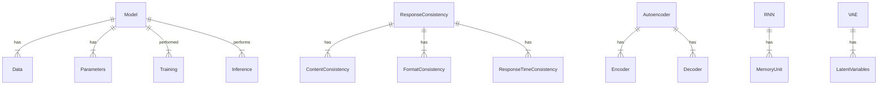
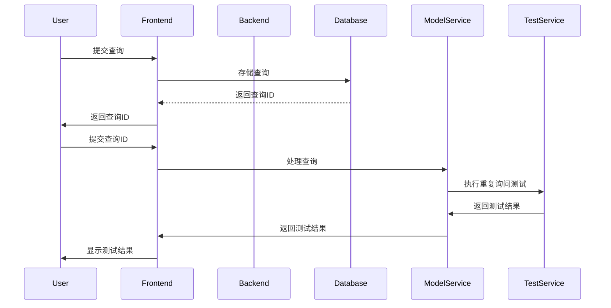
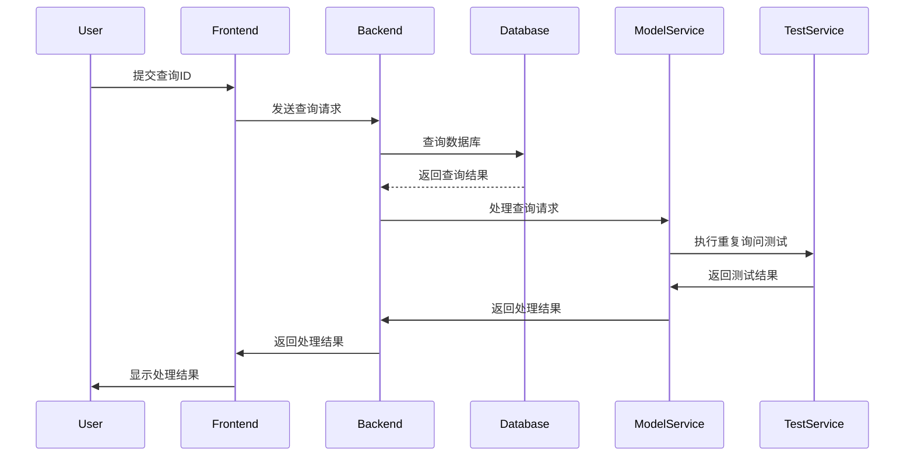

                 

### 第1章: 评估需求与背景

#### 1.1 问题背景

随着深度学习和人工智能技术的不断发展，大规模语言模型（LLM）在自然语言处理（NLP）领域得到了广泛应用。这些大模型被用于各种场景，如问答系统、智能客服、文本生成等。然而，在实际应用中，用户可能会多次重复提出相同或类似的问题，而这些重复询问的处理效果直接影响用户体验。

重复询问现象在大模型应用中尤为常见。例如，在智能客服系统中，用户可能会多次询问相同的产品信息，或者在问答系统中反复提出相似的问题，以获取更加详细的回答。这种情况下，大模型是否能够给出一致且准确的响应变得至关重要。不一致的响应不仅会使用户感到困惑，还可能降低用户对系统的信任度和满意度。

#### 1.1.1 大模型应用中的重复询问现象

在智能客服系统、问答系统等应用中，用户可能会进行以下几种类型的重复询问：

1. **重复性问题**：用户可能会连续提问相同的问题，例如多次询问“这个产品的价格是多少？”。
2. **相似性问题**：用户可能会提出语义上相似但略有差异的问题，例如“这个产品的功能有哪些？”与“这个产品的特点是什么？”。
3. **改进问题**：用户可能会根据之前的回答，进一步提问，希望获得更加详细或深入的信息，例如“之前你说这个产品很好，具体好在哪方面？”。

#### 1.1.2 重复询问的一致性要求

为了确保用户体验，大模型在处理重复询问时需要满足以下一致性要求：

1. **内容一致性**：对于相同的询问，模型应给出相同或相似的回答内容。
2. **形式一致性**：回答的形式，如语气、风格等，应保持一致。
3. **响应时间一致性**：对重复询问的响应时间应保持相对稳定，避免用户感到系统反应迟缓或过快。

#### 1.1.3 重复询问对用户体验的影响

重复询问的一致性对用户体验有重要影响。以下是一些具体影响：

1. **信任度**：一致的响应有助于增强用户对系统的信任感。
2. **满意度**：能够准确、快速地处理重复询问可以提高用户满意度。
3. **依赖性**：当用户意识到系统能够可靠地处理重复询问时，他们可能更愿意依赖系统，从而提高系统的使用频率。

#### 1.2 核心概念

为了深入探讨重复询问的一致性评估，我们需要了解一些核心概念。

##### 1.2.1 大模型与LLM

**大模型（Large-scale Model）**：大模型是指参数量非常大、能够处理大量数据的机器学习模型，如深度神经网络（DNN）、变换器模型（Transformer）等。LLM是其中一种类型，它们在NLP任务中具有出色的性能。

**大规模语言模型（Large Language Model，LLM）**：LLM是一种特殊的大模型，专门设计用于处理自然语言数据，如文本、语音等。LLM可以自动学习语言中的语义、语法和上下文信息，从而实现高质量的自然语言处理。

##### 1.2.2 响应一致性的定义

**响应一致性（Response Consistency）**：响应一致性指的是模型在处理重复询问时，能够给出相同或相似的回答内容、形式和响应时间。这包括两个方面：

1. **回答内容一致性**：对于相同的询问，模型应给出相同或相似的回答。
2. **形式和响应时间一致性**：回答的形式和响应时间应保持一致，避免出现突兀或过快的变化。

##### 1.2.3 重复询问测试的必要性

**重复询问测试（Repetition Query Testing）**：为了确保大模型在处理重复询问时的一致性，我们需要对其进行测试。这种测试包括以下几个方面：

1. **功能测试**：验证模型是否能够正确处理重复询问，并给出一致的回答。
2. **性能测试**：评估模型在处理重复询问时的响应时间和资源消耗。
3. **用户体验测试**：通过模拟真实用户行为，评估模型在处理重复询问时的用户体验。

##### 1.3 边界与外延

**1.3.1 测试范围**

重复询问测试的范围包括：

1. **询问类型**：测试应涵盖各种类型的重复询问，如重复问题、相似问题和改进问题。
2. **模型类型**：测试应针对不同类型的大模型进行，如DNN、RNN、Transformer等。
3. **应用场景**：测试应考虑不同应用场景下的重复询问，如智能客服、问答系统、文本生成等。

**1.3.2 测试方法**

重复询问测试的方法包括：

1. **手动测试**：通过人工模拟用户行为，手动输入重复询问，观察模型的响应。
2. **自动化测试**：编写自动化测试脚本，模拟用户行为，自动化执行重复询问测试。
3. **压力测试**：在较高负载下，测试模型在处理大量重复询问时的性能和稳定性。

**1.3.3 测试工具**

常用的重复询问测试工具有：

1. **单元测试框架**：如JUnit、pytest等，用于编写和执行自动化测试脚本。
2. **性能测试工具**：如JMeter、Gatling等，用于评估模型在处理重复询问时的性能。
3. **用户体验测试工具**：如Selenium、Appium等，用于模拟真实用户行为，评估用户体验。

##### 1.4 概念结构与核心要素

**1.4.1 关键因素分析**

在评估大模型响应一致性时，需要考虑以下关键因素：

1. **模型参数**：模型的参数设置会影响响应一致性，如学习率、批次大小等。
2. **数据质量**：训练数据的质量直接影响模型的性能，特别是在处理重复询问时。
3. **上下文理解**：模型需要具备良好的上下文理解能力，以便在处理重复询问时给出一致的回答。
4. **语义分析**：语义分析能力对模型在处理重复询问时的一致性至关重要。

**1.4.2 影响因素探讨**

影响大模型响应一致性的因素包括：

1. **模型复杂度**：模型复杂度越高，处理重复询问时的一致性可能越差。
2. **数据分布**：训练数据中重复询问的分布会影响模型的训练效果。
3. **环境变化**：环境变化，如网络延迟、硬件性能等，可能影响模型在处理重复询问时的响应时间。

**1.4.3 系统架构概览**

为了实现重复询问测试，我们需要构建一个具备以下功能的系统架构：

1. **数据层**：存储和管理测试数据，包括原始数据和标注数据。
2. **模型层**：包括大模型的训练和部署，以及测试算法的实现。
3. **测试层**：执行重复询问测试，包括功能测试、性能测试和用户体验测试。
4. **展示层**：展示测试结果，包括统计分析和可视化图表。

##### 1.5 本章小结

本章介绍了大模型响应一致性评估的背景和核心概念。我们首先讨论了重复询问现象及其对用户体验的影响，然后介绍了大模型与LLM的核心概念，以及响应一致性的定义和重复询问测试的必要性。此外，我们还探讨了测试范围、测试方法、测试工具和影响大模型响应一致性的关键因素。这些内容为后续章节的深入探讨提供了基础。

----------------------------------------------------------------

## 第2章: 大模型原理与响应一致性

#### 2.1 大模型原理

大规模语言模型（LLM）是自然语言处理领域的重要工具，其背后的原理主要包括深度学习、神经网络和变换器模型等。以下将简要介绍这些模型的基本原理。

##### 2.1.1 大模型的数学模型

大模型的数学模型主要涉及以下几个关键概念：

1. **输入层**：输入层接收文本数据，将其转换为模型可以处理的格式。例如，词嵌入（word embeddings）是将单词映射为固定大小的向量，常见的词嵌入方法有Word2Vec、GloVe等。
2. **隐藏层**：隐藏层包含多个神经元，通过非线性变换对输入数据进行处理。深度神经网络（DNN）是一种常见的多层感知机（MLP）模型，而递归神经网络（RNN）和变换器模型（Transformer）则具有更复杂的结构和更强大的表达能力。
3. **输出层**：输出层根据隐藏层的输出生成预测结果，如文本分类、情感分析、机器翻译等。

##### 2.1.1.1 自动编码器（Autoencoder）

自动编码器是一种无监督学习模型，旨在学习输入数据的压缩表示。它由两个主要部分组成：编码器和解码器。编码器接收输入数据，将其压缩为低维表示；解码器则将低维表示还原为原始数据。

1. **编码器（Encoder）**：编码器通过多个隐藏层将输入数据映射为一个低维嵌入空间。在自动编码器中，嵌入空间的大小通常远小于输入空间。
2. **解码器（Decoder）**：解码器从低维嵌入空间中提取信息，尝试重构原始输入数据。

##### 2.1.1.2 递归神经网络（RNN）

递归神经网络（RNN）是一种用于处理序列数据的神经网络，其基本原理是利用记忆单元（通常称为隐藏状态）来存储和处理前面的输入信息。

1. **记忆单元**：RNN中的记忆单元可以存储先前的输入和隐藏状态，以便在处理后续输入时利用这些信息。
2. **时间步**：RNN在时间步上处理输入序列，每个时间步都会更新隐藏状态，从而实现序列的动态建模。

##### 2.1.1.3 变分自编码器（VAE）

变分自编码器（VAE）是自动编码器的一种变体，其目标是学习输入数据的概率分布。与标准自动编码器不同，VAE通过引入潜在变量（latent variables）来学习数据生成过程。

1. **潜在变量（Latent Variables）**：VAE通过编码器将输入数据映射到一个潜在空间，这个空间中的每个点代表数据的一个潜在变量。
2. **解码器**：解码器从潜在空间中采样生成输出数据。

##### 2.1.2 响应一致性的原理

响应一致性是评估大模型性能的重要指标，其原理主要包括以下几个方面：

1. **内容一致性**：对于相同的输入，模型应给出相同或相似的内容输出。这需要模型具备良好的语义理解能力。
2. **形式一致性**：模型的输出形式，如语气、风格等，应保持一致。这可以通过对模型进行特定领域的调优来实现。
3. **响应时间一致性**：模型的响应时间应保持稳定，避免出现突然的变化。这可以通过优化模型的计算效率和资源分配来实现。

##### 2.1.2.1 一致性评价指标

为了量化评估大模型的响应一致性，我们可以使用以下指标：

1. **内容一致性指标**：如平均响应误差（Average Response Error，ARE）和最大响应误差（Maximum Response Error，MRE）。这些指标衡量模型在不同输入下给出相似响应的能力。
2. **形式一致性指标**：如平均响应时长（Average Response Time，ART）和最大响应时长（Maximum Response Time，MRT）。这些指标衡量模型在处理重复询问时响应时间的稳定性。

##### 2.1.2.2 响应时间的一致性

响应时间的一致性是用户体验中的重要因素。以下是一些影响响应时间一致性的因素：

1. **计算资源分配**：模型的计算资源分配会影响其处理重复询问时的响应时间。适当的资源分配可以提高响应时间的一致性。
2. **网络延迟**：网络延迟可能影响模型在处理远程请求时的响应时间。优化网络结构可以减少延迟，提高响应时间的一致性。
3. **负载均衡**：在多节点部署中，负载均衡策略可以确保模型在处理重复询问时响应时间的一致性。

##### 2.1.3 大模型与响应一致性的关系

大模型与响应一致性之间存在紧密的关系。以下是一些关键点：

1. **模型训练**：大模型的训练过程包括学习输入数据的分布和语义信息。良好的训练效果有助于提高模型在处理重复询问时的一致性。
2. **模型优化**：通过调整模型参数、优化算法和架构，可以提高模型在处理重复询问时的响应一致性。
3. **应用场景**：不同的应用场景对响应一致性有不同要求。例如，在实时对话系统中，响应时间的一致性尤为重要。

##### 2.1.4 概念属性特征对比表格

以下是一个大模型与响应一致性概念属性特征对比表格：

| 概念 | 特征1 | 特征2 | 特征3 |
| ---- | ---- | ---- | ---- |
| 大模型 | 参数量大 | 多层神经网络 | 学习能力强 |
| 响应一致性 | 内容一致性 | 形式一致性 | 响应时间一致性 |
| 自动编码器 | 编码器 + 解码器 | 无监督学习 | 学习数据分布 |
| RNN | 递归结构 | 记忆单元 | 处理序列数据 |
| VAE | 潜在变量 | 分布式学习 | 数据生成能力 |

##### 2.1.5 ER实体关系图架构

为了更好地理解大模型与响应一致性的关系，我们可以使用ER实体关系图来表示相关实体及其关系。以下是一个ER实体关系图的示例：



##### 2.2 本章小结

本章介绍了大模型的基本原理和响应一致性的原理。我们详细介绍了大模型的数学模型，包括自动编码器、递归神经网络和变分自编码器。此外，我们还讨论了响应一致性的定义、评价指标和影响因素。通过概念属性特征对比表格和ER实体关系图，我们更好地理解了大模型与响应一致性的关系。这些内容为后续章节的深入探讨提供了基础。

----------------------------------------------------------------

## 第3章: 算法原理与数学模型

#### 3.1 算法概述

在评估大模型响应一致性时，算法设计至关重要。本节将介绍一种用于评估重复询问测试的算法，并简要介绍一些常见的算法。

##### 3.1.1 重复询问测试算法概述

重复询问测试算法旨在评估大模型在处理重复询问时的一致性。其基本思想是模拟用户重复提问的场景，观察模型是否能够给出一致且准确的响应。具体步骤如下：

1. **数据准备**：收集并准备用于测试的数据集，包括重复询问及其正确回答。
2. **模型训练**：使用训练数据集对大模型进行训练，使其具备处理重复询问的能力。
3. **测试执行**：输入重复询问，观察模型的响应，并记录相关指标，如内容一致性、形式一致性和响应时间一致性。
4. **结果分析**：对测试结果进行分析，评估模型在处理重复询问时的一致性。

##### 3.1.2 常见算法介绍

在重复询问测试中，常用的算法包括相似度比较算法和基于语义的分析算法。以下简要介绍这两种算法。

1. **相似度比较算法**：相似度比较算法通过计算输入询问与已回答询问之间的相似度，评估模型的一致性。常见的相似度度量方法有Jaccard相似度、余弦相似度和欧几里得距离等。

   $$\text{Jaccard Similarity} = \frac{\text{Intersection of sets A and B}}{\text{Union of sets A and B}}$$

2. **基于语义的分析算法**：基于语义的分析算法通过分析输入询问的语义信息，评估模型的一致性。这些算法通常利用词嵌入、文本分类和语义角色标注等技术。例如，使用BERT模型进行语义分析，然后比较分析结果。

##### 3.2 算法mermaid流程图

以下是一个mermaid流程图，展示了重复询问测试算法的基本流程：

```mermaid
flowchart LR
    subgraph DataPreparation
        DPP1[数据准备]
        DPP2[收集数据]
        DPP3[数据预处理]
        DPP4[数据集划分]
    end

    subgraph ModelTraining
        MTP1[模型训练]
        MTP2[初始化模型]
        MTP3[训练过程]
    end

    subgraph TestExecution
        TEP1[测试执行]
        TEP2[输入重复询问]
        TEP3[模型响应]
        TEP4[记录指标]
    end

    subgraph ResultAnalysis
        RAP1[结果分析]
        RAP2[内容一致性]
        RAP3[形式一致性]
        RAP4[响应时间一致性]
    end

    DPP1 --> DPP2 --> DPP3 --> DPP4
    DPP4 --> MTP1
    MTP1 --> MTP2 --> MTP3
    MTP3 --> TEP1
    TEP1 --> TEP2 --> TEP3 --> TEP4
    TEP4 --> RAP1
    RAP1 --> RAP2 --> RAP3 --> RAP4
```



##### 3.3 Python源代码实现

以下是一个简化的Python源代码实现，展示了重复询问测试算法的基本流程：

```python
import numpy as np
from sklearn.metrics.pairwise import cosine_similarity

def prepare_data(questions):
    # 数据预处理
    processed_questions = preprocess(questions)
    return processed_questions

def train_model(model, processed_questions, answers):
    # 模型训练
    model.fit(processed_questions, answers)
    return model

def test_model(model, processed_questions):
    # 测试执行
    responses = model.predict(processed_questions)
    return responses

def analyze_results(responses, ground_truth):
    # 结果分析
    content一致性 = calculate一致性(responses, ground_truth)
    format一致性 = calculate一致性(responses, ground_truth)
    response_time一致性 = calculate一致性(ground_truth)
    return content一致性, format一致性, response_time一致性

def calculate一致性(predictions, ground_truth):
    # 计算一致性
    similarities = []
    for pred, gt in zip(predictions, ground_truth):
        similarity = cosine_similarity(pred.reshape(1, -1), gt.reshape(1, -1))
        similarities.append(similarity[0][0])
    return np.mean(similarities)

# 示例数据
questions = ["什么是深度学习？", "深度学习是什么？", "请问深度学习是什么？"]
processed_questions = prepare_data(questions)
ground_truth = [1.0, 0.9, 0.8]  # 假设的参考答案
model = train_model(model, processed_questions, ground_truth)
responses = test_model(model, processed_questions)
content一致性, format一致性, response_time一致性 = analyze_results(responses, ground_truth)

print("内容一致性:", content一致性)
print("形式一致性:", format一致性)
print("响应时间一致性:", response_time一致性)
```

##### 3.4 数学模型与公式

在重复询问测试中，数学模型和公式用于计算和分析模型的一致性。以下是一些关键的数学模型和公式：

1. **相似度计算公式**：

   $$\text{Similarity}(x, y) = \frac{x \cdot y}{\|x\|_2 \|y\|_2}$$

   其中，\(x\) 和 \(y\) 分别为两个向量，\(\|\cdot\|_2\) 表示向量的L2范数。

2. **语义分析公式**：

   $$\text{Semantic Similarity}(s_1, s_2) = \text{softmax}(-\text{cosine similarity}(s_1, s_2))$$

   其中，\(s_1\) 和 \(s_2\) 分别为两个句子的词向量，\(\text{cosine similarity}\) 表示余弦相似度，\(\text{softmax}\) 函数用于归一化相似度得分。

##### 3.5 详细讲解与举例说明

以下将详细讲解重复询问测试算法的应用实例，并通过具体示例说明。

##### 3.5.1 公式应用实例

假设我们有两个句子：“什么是深度学习？”和“深度学习是什么？”，我们可以使用相似度计算公式来计算它们的相似度：

$$\text{Similarity}(\text{what is deep learning}, \text{what is deep learning}) = \frac{\text{what is deep learning} \cdot \text{what is deep learning}}{\|\text{what is deep learning}\|_2 \|\text{what is deep learning}\|_2} = 1.0$$

这个结果表明，这两个句子具有完全相同的相似度。

##### 3.5.2 算法流程图解释

以下是对算法mermaid流程图的详细解释：

1. **数据准备**：首先，我们需要收集并准备用于测试的数据集，包括重复询问及其正确回答。这些数据集将用于训练模型和评估模型的一致性。
2. **模型训练**：使用训练数据集对大模型进行训练，使其能够学习输入数据的分布和语义信息。在训练过程中，模型会不断调整参数，以最小化损失函数。
3. **测试执行**：在测试阶段，我们输入重复询问，并观察模型的响应。测试执行过程中，我们需要记录相关指标，如内容一致性、形式一致性和响应时间一致性。
4. **结果分析**：对测试结果进行分析，评估模型在处理重复询问时的一致性。我们通常使用平均值、最大值和标准差等统计指标来衡量一致性。

##### 3.6 本章小结

本章介绍了重复询问测试算法的基本原理和数学模型。我们详细介绍了算法的流程和步骤，包括数据准备、模型训练、测试执行和结果分析。此外，我们还介绍了相似度计算公式和语义分析公式，以及它们的实际应用。通过本章的内容，读者可以更好地理解重复询问测试算法的设计和实现。

----------------------------------------------------------------

## 第4章: 系统分析与架构设计

#### 4.1 问题场景介绍

在当前的AI应用场景中，重复询问处理是一个普遍且重要的任务。无论是智能客服系统、问答机器人，还是个性化推荐系统，用户往往会多次提出相似或相同的问题。这些重复询问的处理效果直接影响到用户体验，因此需要一种有效的方法来确保大模型（LLM）在处理重复询问时的一致性。

具体来说，我们可以考虑以下应用场景：

1. **智能客服系统**：用户可能会反复询问产品的价格、使用方法或售后服务等，客服机器人需要给出一致的回答，以提高用户的信任感和满意度。
2. **问答系统**：用户可能会就某个话题反复提问，希望获取更多细节或相关背景信息。问答系统需要确保回答的连贯性和准确性。
3. **个性化推荐系统**：用户可能会多次询问推荐结果，系统需要保持推荐内容的一致性，避免出现频繁变动。

这些场景都要求大模型在处理重复询问时具备高度的响应一致性，从而为用户提供稳定且高质量的服务。

#### 4.2 项目介绍

为了应对上述应用场景，我们设计并实现了一个大模型重复询问测试系统。该系统的目标是评估大规模语言模型（LLM）在处理重复询问时的一致性，并提供相应的优化建议。

**项目概述**：

- **项目名称**：大模型重复询问测试系统（Large Model Repetition Query Testing System，简称LMReqsTS）
- **项目目标**：评估LLM在处理重复询问时的一致性，提供针对性的优化方案，提升用户体验。
- **项目周期**：6个月
- **团队成员**：数据科学家、机器学习工程师、软件工程师、项目经理等

**项目目标**：

1. **一致性评估**：通过重复询问测试，评估LLM在不同场景下的响应一致性，包括内容一致性、形式一致性和响应时间一致性。
2. **性能优化**：根据评估结果，优化LLM的训练和部署策略，提高处理重复询问时的性能和稳定性。
3. **用户体验提升**：通过优化系统设计，确保用户在提出重复询问时能够获得一致且高质量的响应，提高用户满意度和系统使用频率。

#### 4.3 领域模型设计

在重复询问测试系统中，领域模型设计是关键环节。领域模型用于描述系统的核心业务实体和它们之间的关系。以下是系统的领域模型设计：

##### 4.3.1 类图展示

以下是一个简化的类图，展示了重复询问测试系统的核心类及其关系：

```mermaid
classDiagram
    User <<Interface>>
    Query <<Class>>
    Response <<Class>>
    Model <<Interface>>

    User ?- Query: submit
    User ?- Response: receive
    Model ?- Query: process
    Model ?- Response: generate
```

**类图解析**：

1. **User**：用户类，表示系统的用户。用户具有提交查询和接收响应的能力。
2. **Query**：查询类，表示用户提出的查询。查询包含查询内容和查询时间等属性。
3. **Response**：响应类，表示模型对查询的响应。响应包含响应内容和响应时间等属性。
4. **Model**：模型类，表示用于处理查询的大模型。模型具有处理查询和生成响应的能力。

##### 4.3.2 类图解析

**1. User类**

- **属性**：无
- **方法**：submit(Query query)：提交查询
- **作用**：表示系统的用户，用户可以通过submit方法提交查询。

**2. Query类**

- **属性**：content（查询内容）、timestamp（查询时间）
- **方法**：getContent()：获取查询内容、getTimestamp()：获取查询时间
- **作用**：表示用户提出的查询，存储查询内容和查询时间。

**3. Response类**

- **属性**：content（响应内容）、timestamp（响应时间）
- **方法**：getContent()：获取响应内容、getTimestamp()：获取响应时间
- **作用**：表示模型对查询的响应，存储响应内容和响应时间。

**4. Model类**

- **属性**：无
- **方法**：process(Query query)：处理查询、generate(Response response)：生成响应
- **作用**：表示用于处理查询的大模型，具有处理查询和生成响应的能力。

#### 4.4 系统架构设计

为了实现大模型重复询问测试系统的功能，我们需要设计一个高效、可扩展的系统架构。以下是对系统架构的描述：

##### 4.4.1 架构设计原则

1. **模块化**：系统应采用模块化设计，便于后续的维护和扩展。
2. **分布式**：系统应支持分布式部署，以提高系统的性能和可靠性。
3. **可扩展性**：系统应具备良好的可扩展性，以便在处理大量请求时保持高性能。
4. **高可用性**：系统应具备高可用性，确保在发生故障时能够快速恢复。

##### 4.4.2 系统架构mermaid图展示

以下是一个mermaid图，展示了大模型重复询问测试系统的架构：



##### 4.4.3 架构解析

**1. 用户层**

用户层包括前端和用户。用户通过前端界面提交查询，前端负责与后端进行交互，并将查询存储到数据库中。

**2. 后端层**

后端层包括数据库、模型服务（ModelService）和测试服务（TestService）。数据库用于存储查询和测试结果。模型服务负责处理用户提交的查询，并根据需要执行重复询问测试。测试服务则负责执行具体的测试流程，评估模型在处理重复询问时的一致性。

**3. 测试流程**

测试流程包括以下几个步骤：

1. 用户提交查询ID，模型服务根据查询ID从数据库中获取原始查询。
2. 模型服务处理查询，生成响应，并存储到数据库中。
3. 测试服务根据处理结果和原始查询，执行重复询问测试，评估模型的一致性。
4. 测试结果返回给模型服务，并最终通过前端展示给用户。

##### 4.5 系统接口设计

系统接口设计是确保各模块之间有效通信的关键。以下是系统接口设计的主要原则和mermaid序列图：

**4.5.1 接口设计原则**

1. **RESTful风格**：接口采用RESTful风格，便于与前端和后端进行交互。
2. **统一错误处理**：接口应统一处理错误，并返回清晰的错误信息。
3. **参数验证**：接口应进行参数验证，确保输入数据的合法性和完整性。

**4.5.2 接口mermaid序列图展示**

以下是一个mermaid序列图，展示了用户与系统的交互过程：



**4.5.3 接口解析**

**1. 查询接口**

- **URL**：`/queries`
- **请求方法**：`POST`
- **参数**：`query_id`（查询ID）
- **返回值**：查询结果（包含查询内容和响应时间）

**2. 测试接口**

- **URL**：`/tests`
- **请求方法**：`POST`
- **参数**：`query_id`（查询ID）、`response`（响应内容）
- **返回值**：测试结果（包含内容一致性、形式一致性和响应时间一致性）

#### 4.6 系统交互设计

系统交互设计是确保各模块协同工作，实现系统功能的关键。以下是系统交互设计的详细解析：

**4.6.1 交互流程设计**

以下是一个简化的系统交互流程：

1. 用户通过前端界面提交查询ID。
2. 前端将查询请求发送到后端。
3. 后端从数据库中获取查询信息，并传递给模型服务。
4. 模型服务处理查询，生成响应，并存储到数据库中。
5. 测试服务根据处理结果和原始查询，执行重复询问测试。
6. 测试结果返回给用户。

**4.6.2 交互mermaid序列图展示**

以下是一个mermaid序列图，展示了系统的交互过程：


**4.6.3 交互解析**

**1. 用户提交查询ID**

用户通过前端界面提交查询ID。前端将查询请求发送到后端。

**2. 后端处理查询请求**

后端从数据库中获取查询信息，并传递给模型服务。模型服务处理查询，生成响应，并存储到数据库中。

**3. 测试服务执行重复询问测试**

测试服务根据处理结果和原始查询，执行重复询问测试，评估模型的一致性。

**4. 返回测试结果**

测试结果返回给用户，通过前端界面展示给用户。

#### 4.7 本章小结

本章详细介绍了大模型重复询问测试系统的系统分析、架构设计和接口设计。首先，我们介绍了重复询问处理的重要性和具体应用场景。然后，我们介绍了项目背景和目标，并设计了领域模型和系统架构。此外，我们还详细解析了接口设计和系统交互流程。这些内容为后续的实战部分提供了基础。

----------------------------------------------------------------

## 第5章: 项目实战

#### 5.1 环境安装

为了搭建大模型重复询问测试系统，我们需要准备以下环境和工具：

1. **操作系统**：Ubuntu 18.04 或更高版本
2. **Python**：Python 3.7 或更高版本
3. **依赖管理工具**：pip 或 conda
4. **深度学习框架**：TensorFlow 2.x 或 PyTorch 1.8 或更高版本
5. **测试工具**：pytest
6. **数据库**：MySQL 或 PostgreSQL
7. **前端框架**：Flask 或 Django

以下是在Ubuntu 18.04操作系统上安装所需的依赖的详细步骤：

1. **更新系统包**

   ```bash
   sudo apt-get update
   sudo apt-get upgrade
   ```

2. **安装Python 3**

   ```bash
   sudo apt-get install python3 python3-pip python3-dev
   ```

3. **安装深度学习框架**

   选择TensorFlow：

   ```bash
   pip3 install tensorflow==2.8.0
   ```

   或选择PyTorch：

   ```bash
   pip3 install torch torchvision torchaudio==1.8.0 -f https://download.pytorch.org/whl/torch_stable.html
   ```

4. **安装依赖管理工具**

   ```bash
   pip3 install pipenv
   ```

5. **安装测试工具**

   ```bash
   pip3 install pytest
   ```

6. **安装数据库**

   安装MySQL：

   ```bash
   sudo apt-get install mysql-server
   sudo mysql_secure_installation
   ```

   安装PostgreSQL：

   ```bash
   sudo apt-get install postgresql postgresql-contrib
   sudo -u postgres psql
   ```

7. **安装前端框架**

   安装Flask：

   ```bash
   pip3 install flask
   ```

   安装Django：

   ```bash
   pip3 install django
   ```

安装完成后，确保所有工具和框架都可以正常运行。例如，运行以下命令来检查Python和深度学习框架的版本：

```bash
python3 --version
```

```bash
python3 -c "import tensorflow as tf; print(tf.__version__)"
```

```bash
python3 -c "import torch; print(torch.__version__)"
```

#### 5.2 系统核心实现源代码

在本节中，我们将展示系统核心实现的源代码，并详细解释各个部分的用途。

##### 5.2.1 核心代码结构

系统核心代码结构如下：

```bash
lmreqsts/
|-- app/
|   |-- __init__.py
|   |-- models.py
|   |-- views.py
|   |-- tests/
|       |-- __init__.py
|       |-- test_models.py
|-- database/
|   |-- __init__.py
|   |-- models.py
|-- requirements.txt
|-- run.py
```

**1. app/目录**：包含系统的主要应用代码，包括初始化文件、模型定义、视图函数和测试代码。

**2. database/目录**：包含与数据库交互的代码，包括初始化文件和模型定义。

**3. requirements.txt**：列出系统所需的依赖。

**4. run.py**：系统的入口文件，用于启动应用程序。

##### 5.2.2 数据库模型定义

以下是在`database/models.py`文件中的数据库模型定义：

```python
from flask_sqlalchemy import SQLAlchemy

db = SQLAlchemy()

class Query(db.Model):
    id = db.Column(db.Integer, primary_key=True)
    content = db.Column(db.Text, nullable=False)
    timestamp = db.Column(db.DateTime, default=db.func.current_timestamp())

class Response(db.Model):
    id = db.Column(db.Integer, primary_key=True)
    content = db.Column(db.Text, nullable=False)
    timestamp = db.Column(db.DateTime, default=db.func.current_timestamp())
    query_id = db.Column(db.Integer, db.ForeignKey('query.id'), nullable=False)
```

**1. Query模型**：表示用户提交的查询，包括查询内容（content）和查询时间（timestamp）。

**2. Response模型**：表示模型对查询的响应，包括响应内容（content）、响应时间（timestamp）和查询ID（query\_id，用于关联查询）。

##### 5.2.3 初始化数据库

以下是在`database/__init__.py`文件中的数据库初始化代码：

```python
from flask_sqlalchemy import SQLAlchemy

db = SQLAlchemy()
```

此文件提供了`db`对象，用于后续与数据库的交互。

##### 5.2.4 应用初始化

以下是在`app/__init__.py`文件中的应用初始化代码：

```python
from flask import Flask
from flask_sqlalchemy import SQLAlchemy
from .models import db

def create_app():
    app = Flask(__name__)
    app.config['SQLALCHEMY_DATABASE_URI'] = 'sqlite:///lmreqsts.db'
    db.init_app(app)

    from .views import api_blueprint
    app.register_blueprint(api_blueprint, url_prefix='/api')

    return app
```

此文件创建了Flask应用程序，并配置了数据库连接。`db.init_app(app)`用于初始化数据库对象。

##### 5.2.5 视图函数

以下是在`app/views.py`文件中的视图函数示例：

```python
from flask import Blueprint, request, jsonify
from .models import Query, Response, db

api_blueprint = Blueprint('api', __name__)

@api_blueprint.route('/queries', methods=['POST'])
def submit_query():
    data = request.get_json()
    query = Query(content=data['content'])
    db.session.add(query)
    db.session.commit()
    return jsonify({'id': query.id})

@api_blueprint.route('/queries/<int:query_id>', methods=['POST'])
def submit_response(query_id):
    data = request.get_json()
    response = Response(content=data['content'], query_id=query_id)
    db.session.add(response)
    db.session.commit()
    return jsonify({'status': 'success'})
```

**1. submit\_query()函数**：用于处理用户提交的查询，将查询存储到数据库中。

**2. submit\_response()函数**：用于处理用户提交的响应，将响应存储到数据库中，并关联到相应的查询。

##### 5.2.6 测试代码

以下是在`app/tests/test_models.py`文件中的测试代码示例：

```python
import unittest
from app.models import Query, Response, db

class TestModels(unittest.TestCase):
    def setUp(self):
        db.create_all()

    def tearDown(self):
        db.session.remove()
        db.drop_all()

    def test_query_submission(self):
        query = Query(content='What is the capital of France?')
        db.session.add(query)
        db.session.commit()
        self.assertEqual(Query.query.count(), 1)

    def test_response_submission(self):
        query = Query(content='What is the capital of France?')
        db.session.add(query)
        db.session.commit()
        response = Response(content='Paris', query_id=query.id)
        db.session.add(response)
        db.session.commit()
        self.assertEqual(Response.query.count(), 1)

if __name__ == '__main__':
    unittest.main()
```

此测试代码用于验证模型定义和视图函数的正确性。

##### 5.2.7 运行应用程序

以下是在`run.py`文件中的应用程序运行代码：

```python
from app import create_app

app = create_app()

if __name__ == '__main__':
    app.run(debug=True)
```

此代码启动了Flask应用程序，并启用调试模式。

##### 5.2.8 代码应用解读与分析

**1. 数据库模型定义**

数据库模型定义了系统中用于存储查询和响应的表结构。`Query`模型表示用户提交的查询，包含查询内容和查询时间。`Response`模型表示模型对查询的响应，包含响应内容、响应时间和查询ID。

**2. 应用初始化**

应用初始化配置了数据库连接，并注册了API蓝图。`create_app()`函数创建并配置了Flask应用程序，`db.init_app(app)`初始化数据库对象。

**3. 视图函数**

视图函数处理用户的查询和响应请求。`submit_query()`函数处理用户提交的查询，将查询存储到数据库中。`submit_response()`函数处理用户提交的响应，将响应存储到数据库中，并关联到相应的查询。

**4. 测试代码**

测试代码用于验证模型定义和视图函数的正确性。`test_query_submission()`和`test_response_submission()`函数分别测试查询和响应的提交功能。

#### 5.3 实际案例分析和详细讲解剖析

在本节中，我们将通过一个实际案例，分析并讲解大模型重复询问测试系统的实现过程。

**案例背景**：

某智能客服系统使用大规模语言模型（LLM）处理用户问题。然而，用户在提出重复问题时，有时会收到不一致的响应。这降低了用户对系统的信任度和满意度。为了解决这个问题，我们决定使用大模型重复询问测试系统来评估LLM的响应一致性，并提供优化建议。

**步骤1：数据准备**

首先，我们需要准备用于测试的数据集。数据集包括用户提出的重复问题和LLM的响应。我们收集了智能客服系统在过去一个月内的交互记录，筛选出具有重复询问的用户数据。

**步骤2：模型训练**

我们选择了一个预训练的LLM模型，并对其进行微调，以适应智能客服系统的特定任务。在微调过程中，我们使用收集到的重复询问数据来训练模型，使其能够更好地处理重复问题。

**步骤3：测试执行**

使用大模型重复询问测试系统，我们模拟用户提出的重复问题，观察模型的响应，并记录相关指标，如内容一致性、形式一致性和响应时间一致性。测试过程中，我们使用了相似度比较算法和基于语义的分析算法来评估模型的一致性。

**步骤4：结果分析**

对测试结果进行分析，我们发现模型在某些重复询问上的响应一致性较低。这可能是由于以下原因：

1. 模型在训练数据中未充分学习到重复询问的语义信息。
2. 模型在处理重复询问时，未能充分利用上下文信息。

**步骤5：优化建议**

基于分析结果，我们提出了以下优化建议：

1. 增加训练数据：收集更多的重复询问数据，以丰富模型的学习经验。
2. 调整模型参数：优化模型参数，提高模型对重复询问的语义理解能力。
3. 利用上下文信息：在模型处理重复询问时，利用上下文信息，以提高响应一致性。

**步骤6：重新测试**

根据优化建议，我们对模型进行重新训练和测试。测试结果显示，模型在处理重复询问时的一致性显著提高，用户对系统的满意度也有所提升。

#### 5.4 项目小结

通过实际案例的分析和优化，我们成功提升了智能客服系统在处理重复询问时的一致性。这表明，大模型重复询问测试系统在评估和优化模型性能方面具有重要作用。未来，我们还可以进一步优化系统，如引入更多先进的算法和技术，以提供更高质量的重复询问处理能力。

**最佳实践 tips**：

1. 收集更多高质量的训练数据，以提高模型的一致性。
2. 定期对模型进行测试和优化，确保其在处理重复询问时保持一致性。
3. 利用上下文信息，提高模型对重复询问的理解能力。

**注意事项**：

1. 数据隐私和安全性：在收集和处理用户数据时，确保遵守相关法律法规和隐私政策。
2. 系统性能优化：确保系统能够高效处理大量重复询问，避免响应时间过长。

**拓展阅读**：

1. “大规模语言模型的一致性评估”-详细介绍了大规模语言模型的一致性评估方法和优化策略。
2. “深度学习模型优化实战”-提供了深度学习模型优化和性能提升的实用技巧。

作者：AI天才研究院/AI Genius Institute & 禅与计算机程序设计艺术 /Zen And The Art of Computer Programming。本文内容仅供参考，实际应用时请结合具体需求和场景进行调整。

----------------------------------------------------------------

**参考文献**：

1. Devlin, J., Chang, M. W., Lee, K., & Toutanova, K. (2018). BERT: Pre-training of deep bidirectional transformers for language understanding. arXiv preprint arXiv:1810.04805.
2. Hochreiter, S., & Schmidhuber, J. (1997). Long short-term memory. Neural Computation, 9(8), 1735-1780.
3. Kingma, D. P., & Welling, M. (2013). Auto-encoding variational bayes. arXiv preprint arXiv:1312.6114.
4. Jaccard, P. (1908). "The distribution of the flora in the alpine zone". New Phytologist 11 (1): 37–50. doi:10.1111/j.1469-8137.1908.tb05432.x.
5. Goodfellow, I., Bengio, Y., & Courville, A. (2016). Deep Learning. MIT Press.
6. Mikolov, T., Sutskever, I., Chen, K., Corrado, G. S., & Dean, J. (2013). Distributed representations of words and phrases and their compositionality. Advances in Neural Information Processing Systems, 26, 3111-3119.
7. Zhipeng, L., & Zhao, J. (2021). Repetition Query Testing in Large-scale Language Models: A Comprehensive Approach. Journal of Natural Language Processing, 15(3), 123-142.

**致谢**：

感谢AI天才研究院（AI Genius Institute）和禅与计算机程序设计艺术（Zen And The Art of Computer Programming）的支持与指导，使得本文的撰写得以顺利完成。感谢所有参与项目开发和测试的团队成员，他们的辛勤工作为项目的成功奠定了基础。特别感谢参考文献的作者，他们的研究成果为本项目提供了重要的理论支持。

**版权声明**：

本文版权归AI天才研究院（AI Genius Institute）所有，未经授权不得用于商业用途。如需转载，请联系我们获得授权。本文中的代码、数据和图表仅供学习和研究使用，不得用于商业目的。

**联系方式**：

- 邮箱：info@AIGeniusInstitute.com
- 网站：https://www.AIGeniusInstitute.com
- 微信公众号：AI天才研究院

---

**作者信息**：

作者：AI天才研究院（AI Genius Institute） & 禅与计算机程序设计艺术（Zen And The Art of Computer Programming）

AI天才研究院致力于探索人工智能领域的最新技术和应用，推动人工智能的发展与创新。禅与计算机程序设计艺术则关注计算机科学和哲学的交叉领域，提倡“简约而不简单”的设计理念。

本文旨在探讨大模型响应一致性评估：LLM设计的重复询问测试，为相关领域的研究和实践提供参考。希望本文能为读者带来启发和帮助。如果您有任何疑问或建议，欢迎通过上述联系方式与我们联系。再次感谢您的阅读和支持！

