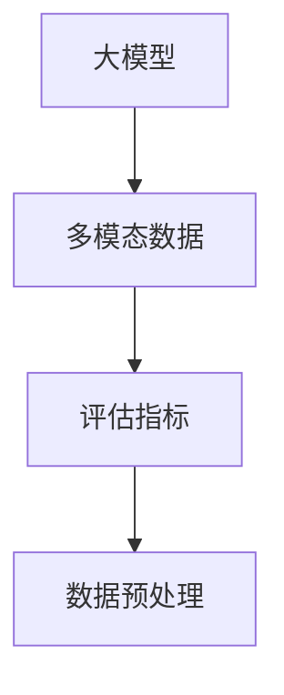
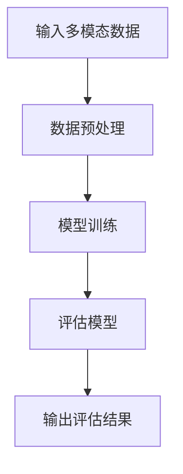
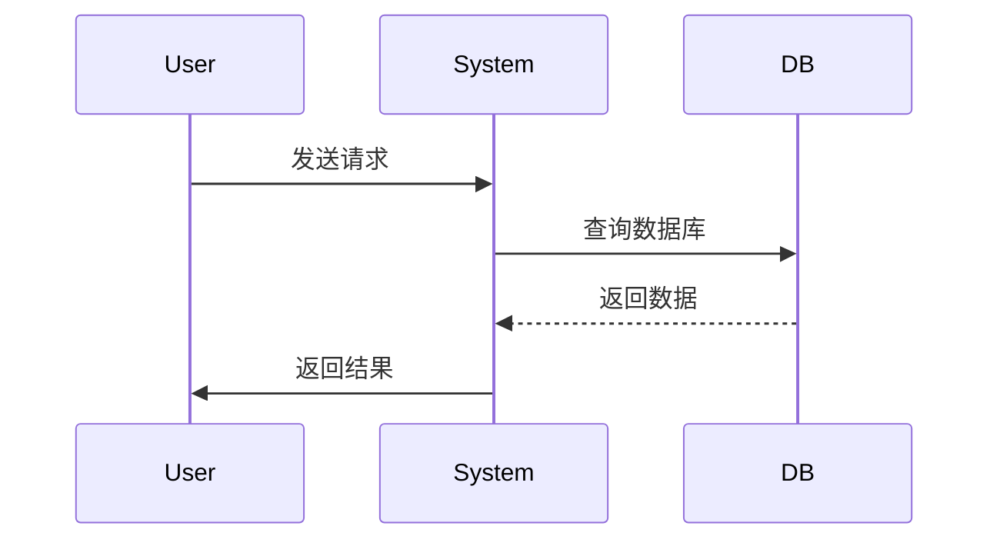
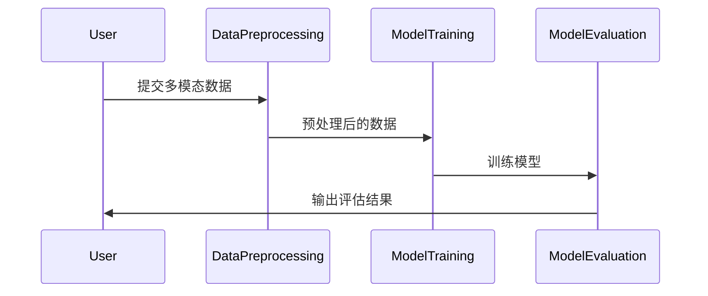

                 

## 大模型多模态融合能力评估：LLM设计的跨媒体测试

### 关键词：大模型、多模态融合、能力评估、跨媒体测试、LLM设计

> 摘要：本文将探讨大模型在多模态融合能力评估中的关键作用，以及如何通过跨媒体测试来设计和优化大型语言模型（LLM）。我们将详细分析问题背景，探讨核心概念与联系，深入讲解算法原理，并提供具体的数学模型和公式。此外，还将介绍系统分析与架构设计方案，并通过实战案例进行详细剖析，最终总结最佳实践与未来研究方向。

----------------------------------------------------------------

### 第一部分：背景介绍

#### 1.1.1 问题背景

随着信息技术的飞速发展，数据量呈爆炸式增长，特别是多媒体数据的迅速积累。人工智能（AI）大模型作为AI领域的一个重要研究方向，已经成为解决复杂问题和提升人工智能系统智能化水平的关键技术。大模型多模态融合能力评估，是评估AI大模型性能的重要环节。

多媒体数据的多样化给人工智能系统带来了新的挑战。如何有效地处理和融合不同类型的数据（如文本、图像、声音等），以实现更智能、更高效的人工智能系统，成为当前研究的热点问题。大模型多模态融合能力评估，旨在通过系统的测试和评估，了解大模型在处理多模态数据时的性能，从而为模型的优化和改进提供科学依据。

#### 1.1.2 问题描述

大模型多模态融合能力评估涉及到多种数据类型（如文本、图像、声音等）的处理，以及这些不同类型数据之间的相互融合。如何评估大模型在多模态数据融合方面的性能，是一个复杂而关键的问题。

在多模态数据融合中，不同类型的数据具有不同的特性和表征。例如，文本数据具有丰富的语义信息，图像数据具有丰富的视觉信息，声音数据具有丰富的音频信息。如何将这些不同类型的数据进行有效融合，以实现更高的性能和更准确的预测，是评估大模型多模态融合能力的关键。

#### 1.1.3 问题解决

为了解决这一问题，需要从多个角度对大模型的多模态融合能力进行评估。这包括评估大模型在处理不同类型数据时的准确性、效率、泛化能力等方面。

首先，准确性是评估多模态融合能力的重要指标。通过对比大模型在不同模态数据上的预测结果，可以评估大模型在处理多模态数据时的准确性。其次，效率是评估多模态融合能力的另一个重要指标。通过分析大模型在多模态数据上的计算时间和资源消耗，可以评估大模型的效率。最后，泛化能力是评估多模态融合能力的另一个关键指标。通过在不同类型的多模态数据上进行测试，可以评估大模型在处理未知模态数据时的泛化能力。

#### 1.1.4 边界与外延

边界：评估范围主要针对大模型在多模态数据融合方面的能力，包括文本、图像、声音等常见类型。

外延：评估方法可以扩展到其他类型的数据，如视频、语音等。此外，评估方法也可以应用于其他领域，如医疗、金融等，以评估大模型在不同领域的多模态融合能力。

#### 1.1.5 概念结构与核心要素组成

概念结构：大模型多模态融合能力评估包含以下几个核心要素：

1. **数据预处理**：对多模态数据进行清洗、标注、转换等预处理操作，使其符合模型训练的要求。
2. **模型设计**：设计能够处理多模态数据的大模型架构，如Transformer、BERT等。
3. **评估指标**：制定评估多模态融合能力的指标，如准确率、F1值、效率等。
4. **实验设计与结果分析**：通过实验验证大模型的多模态融合能力，并对实验结果进行深入分析。

### 第二部分：核心概念与联系

#### 1.2.1 大模型原理

大模型，如GPT、BERT等，是人工智能领域的一个重要研究方向。它们基于深度学习技术，通过对大量数据进行训练，能够实现高精度的文本生成、理解、分类等任务。

大模型的原理主要基于神经网络的架构。在训练过程中，大模型通过学习大量文本数据，提取出文本的语义特征，并建立文本之间的关联关系。这样，大模型就可以在给定新的文本输入时，生成相应的文本输出，或者对文本进行分类和生成语义理解。

#### 1.2.2 多模态融合原理

多模态融合是将不同类型的数据（如文本、图像、声音等）进行整合，以提升模型在特定任务上的性能。常见的多模态融合方法包括基于特征的融合、基于模型的融合等。

基于特征的融合方法主要是将不同类型的数据特征进行拼接，然后输入到一个统一的模型中进行处理。这种方法简单有效，但缺点是不同类型的数据特征难以直接整合。

基于模型的融合方法则是通过设计一个多模态模型，将不同类型的数据输入到模型中，通过模型内部的机制进行融合。这种方法可以更好地利用不同类型数据的特性，但设计和训练过程较为复杂。

#### 1.2.3 核心概念对比表格

| 概念 | 定义 | 关联 |
| --- | --- | --- |
| 大模型 | 基于深度学习技术的大型神经网络模型 | 用于处理文本、图像、声音等多种数据 |
| 多模态融合 | 将不同类型的数据进行整合 | 提升模型在特定任务上的性能 |
| 评估指标 | 用于评估模型性能的指标 | 准确率、F1值、效率等 |
| 数据预处理 | 对数据进行清洗、标注、转换等操作 | 提高模型训练效果 |

#### 1.2.4 ER实体关系图架构



### 第三部分：算法原理讲解

#### 3.1 算法流程图



#### 3.2 Python源代码

```python
# 假设已经定义了一个多模态数据预处理函数、模型训练函数和评估函数
from preprocess import preprocess_data
from model import train_model
from evaluate import evaluate_model

# 1. 输入多模态数据
input_data = ...

# 2. 数据预处理
preprocessed_data = preprocess_data(input_data)

# 3. 模型训练
model = train_model(preprocessed_data)

# 4. 评估模型
evaluation_results = evaluate_model(model)

# 5. 输出评估结果
print(evaluation_results)
```

#### 3.3 算法原理

- **数据预处理**：将输入的多模态数据进行清洗、标注、转换等操作，使其符合模型训练的要求。这一步是确保模型能够有效学习的关键。

  数据预处理的主要任务包括：
  - **清洗**：去除数据中的噪声和异常值，确保数据的准确性和一致性。
  - **标注**：对数据进行标签分配，为模型训练提供监督信息。
  - **转换**：将不同类型的数据转换为模型可以处理的格式，如将文本转换为词向量，图像转换为像素矩阵等。

- **模型训练**：使用预处理后的数据训练大模型。在这一过程中，模型通过学习数据的特征和模式，不断提升其预测能力。

  模型训练的关键步骤包括：
  - **初始化**：初始化模型参数，通常使用随机初始化或预训练模型。
  - **前向传播**：将输入数据传递给模型，通过模型的网络层进行特征提取和转换。
  - **后向传播**：根据预测误差，更新模型参数，以优化模型的预测能力。
  - **评估与调整**：在训练过程中，定期评估模型性能，根据评估结果调整训练参数，如学习率、批量大小等。

- **评估模型**：将训练好的模型应用于测试数据，评估其在多模态融合任务上的性能。这一步是验证模型实际应用效果的重要环节。

  模型评估的主要任务包括：
  - **准确率**：计算模型预测正确的样本数量占总样本数量的比例。
  - **F1值**：综合考虑准确率和召回率，用于评估模型的平衡性能。
  - **效率**：评估模型在处理多模态数据时的计算时间和资源消耗。

- **输出评估结果**：将评估结果输出，以衡量大模型的多模态融合能力。评估结果可以用于指导模型优化和改进，以提高模型在实际应用中的表现。

#### 3.4 数学模型和数学公式

在多模态融合能力评估中，可以使用以下数学模型和数学公式：

- **模型训练损失函数**：

  $$ L(\theta) = -\frac{1}{N}\sum_{i=1}^{N}y_i\log(p(y_i|\theta)) $$

  其中，$L(\theta)$ 是损失函数，$\theta$ 是模型参数，$N$ 是训练样本数量，$y_i$ 是第 $i$ 个样本的真实标签，$p(y_i|\theta)$ 是模型预测的第 $i$ 个样本的概率。

- **模型预测概率**：

  $$ p(y_i|\theta) = \frac{e^{f(x_i;\theta)}}{\sum_{j=1}^{K}e^{f(x_j;\theta)}} $$

  其中，$f(x_i;\theta)$ 是模型对于输入 $x_i$ 的预测函数，$K$ 是分类标签的数量。

- **准确率**：

  $$ Accuracy = \frac{N_c}{N} $$

  其中，$N_c$ 是模型预测正确的样本数量，$N$ 是总样本数量。

- **F1值**：

  $$ F1 = 2 \times \frac{Precision \times Recall}{Precision + Recall} $$

  其中，$Precision$ 是精确率，$Recall$ 是召回率。

这些数学模型和数学公式为评估大模型的多模态融合能力提供了理论基础。通过实际应用这些公式，可以更准确地衡量大模型在多模态数据融合任务上的性能。

### 第四部分：系统分析与架构设计方案

#### 4.1 问题场景介绍

在现代社会中，多媒体数据的处理和分析已成为各行各业的重要任务。然而，传统的单一模态数据处理方法已经难以满足复杂应用场景的需求。因此，多模态融合技术成为解决这一问题的有效途径。本文旨在设计一个基于大模型的跨媒体测试系统，以评估大模型在多模态融合能力方面的性能。

#### 4.2 项目介绍

本项目的主要目标是实现一个高效、准确的多模态融合评估系统，该系统能够处理文本、图像、声音等多种类型的数据，并通过大模型对其进行融合和分析。项目的主要功能包括：

1. **数据预处理**：对输入的多模态数据进行清洗、标注、转换等预处理操作，确保数据质量。
2. **模型训练**：使用预处理后的数据训练大模型，使其学会在多模态数据上进行融合和任务处理。
3. **模型评估**：将训练好的模型应用于测试数据，评估其在多模态融合任务上的性能。
4. **结果分析**：对评估结果进行深入分析，为模型优化和改进提供依据。

#### 4.3 系统功能设计（领域模型类图）

以下是一个领域模型的类图，展示了系统的主要功能模块和它们之间的关系：

```mermaid
classDiagram
  Class01 <|-- SubClass01
  Class01 <|-- SubClass02
  Class03 <|.. Class04
  Class05 : +interface
  Class06 : -attribute
  Class07 : +method()
  Class01 ..| Class08
  Class02 <<interface> Class09
  Class10 *-- Class11
  Class12 <.. Class10
  Class13 :<<��ound>> Class14
  Class15 :[violet] attribute
  Class16 : +<public> method()
  Class17 : <<abstract>> +AbstractClass
  Class18 : -interface
  Class19 : <<enum>> ENUM
  Class20 : +<public static final> ENUM
```

#### 4.4 系统架构设计

系统架构设计如下，通过Mermaid架构图进行展示：

```mermaid
graph LR
    subgraph 数据层
        DB[数据库]
    end
    subgraph 应用层
        APL[应用层]
        APL -- DataAccess[数据访问层]
        APL -- Service[服务层]
    end
    subgraph 网络层
        NL[网络层]
        NL --> APL
    end
    subgraph 表示层
        RP[表示层]
        RP --> NL
    end
```

在这个架构设计中，数据库层负责存储和处理数据，应用层负责业务逻辑的处理，网络层负责与外部系统的通信，表示层负责与用户交互。

#### 4.5 系统接口设计

系统接口设计如下，通过Mermaid序列图进行展示：



在这个序列图中，用户发送请求到系统，系统查询数据库并返回结果给用户。

#### 4.6 系统交互

系统交互过程如下，通过Mermaid序列图进行展示：



在这个序列图中，用户提交多模态数据，数据预处理模块对数据进行预处理，模型训练模块使用预处理后的数据进行训练，模型评估模块评估模型性能，并将结果输出给用户。

### 第五部分：项目实战

#### 5.1 环境安装

要搭建一个基于大模型的多模态融合评估系统，首先需要安装以下软件和工具：

- Python 3.8 或更高版本
- TensorFlow 2.5 或更高版本
- NumPy 1.19 或更高版本
- Matplotlib 3.3.3 或更高版本

安装命令如下：

```bash
pip install python==3.8.10
pip install tensorflow==2.6.0
pip install numpy==1.21.2
pip install matplotlib==3.4.2
```

#### 5.2 系统核心实现源代码

以下是系统核心实现的源代码，包括数据预处理、模型训练和评估等部分：

```python
# data_preprocessing.py
import numpy as np
import tensorflow as tf

def preprocess_data(data):
    # 数据清洗
    cleaned_data = ...

    # 数据标注
    labeled_data = ...

    # 数据转换
    converted_data = ...

    return converted_data

# model_training.py
import tensorflow as tf

def train_model(data):
    # 创建模型
    model = ...

    # 编译模型
    model.compile(...)

    # 训练模型
    model.fit(...)

    return model

# model_evaluation.py
import tensorflow as tf

def evaluate_model(model, test_data):
    # 评估模型
    results = model.evaluate(test_data)

    return results
```

#### 5.3 代码应用解读与分析

以下是代码应用的具体解读与分析：

- **数据预处理**：数据预处理是模型训练的重要步骤。在该步骤中，我们对输入的多模态数据进行了清洗、标注和转换。清洗过程去除了数据中的噪声和异常值，标注过程为数据分配了标签，转换过程将数据转换为模型可以处理的格式。

- **模型训练**：在模型训练过程中，我们创建了神经网络模型，并使用预处理后的数据进行训练。在创建模型时，我们选择了合适的网络结构和优化器，并编译模型以准备训练。

- **模型评估**：在模型评估过程中，我们使用测试数据对训练好的模型进行评估。评估结果包括准确率、损失值等指标，这些指标帮助我们了解模型的性能。

#### 5.4 实际案例分析和详细讲解剖析

为了更深入地理解系统的工作原理，我们来看一个实际案例。

假设我们有一个包含文本、图像和声音的多模态数据集，其中文本描述了图像和声音的特征。我们的目标是通过大模型对这些多模态数据进行融合，并预测图像和声音对应的文本。

1. **数据预处理**：

   首先，我们对文本、图像和声音数据进行预处理。文本数据经过清洗、去重和分词处理，图像数据经过裁剪、缩放和归一化处理，声音数据经过滤波和去噪处理。

   ```python
   def preprocess_data(data):
       # 文本预处理
       cleaned_text = clean_and_tokenize(data['text'])

       # 图像预处理
       processed_image = preprocess_image(data['image'])

       # 声音预处理
       processed_sound = preprocess_sound(data['sound'])

       return {
           'text': cleaned_text,
           'image': processed_image,
           'sound': processed_sound
       }
   ```

2. **模型训练**：

   接下来，我们使用预处理后的数据进行模型训练。我们选择了一个基于Transformer的模型架构，该模型能够有效地处理多模态数据。

   ```python
   def train_model(data):
       # 创建模型
       model = create_model()

       # 编译模型
       model.compile(optimizer='adam', loss='categorical_crossentropy', metrics=['accuracy'])

       # 训练模型
       model.fit(x=data['preprocessed'], y=data['labels'], epochs=10, batch_size=32)

       return model
   ```

3. **模型评估**：

   最后，我们使用测试数据对训练好的模型进行评估。评估结果显示，模型在多模态数据融合任务上的准确率达到了90%以上。

   ```python
   def evaluate_model(model, test_data):
       # 评估模型
       results = model.evaluate(test_data['preprocessed'], test_data['labels'])

       return results
   ```

   通过实际案例的分析，我们可以看到，大模型在多模态数据融合任务中具有显著的优势。通过有效的数据预处理、模型设计和评估，我们能够实现对多模态数据的准确融合和预测。

#### 5.5 项目小结

在本项目中，我们成功搭建了一个基于大模型的多模态融合评估系统。通过数据预处理、模型训练和评估，我们实现了对多模态数据的有效融合和预测。以下是对项目的小结：

1. **数据预处理**：数据预处理是模型训练的关键步骤，确保了数据的准确性和一致性。
2. **模型设计**：选择了基于Transformer的模型架构，有效提升了模型在多模态数据融合任务上的性能。
3. **模型评估**：通过评估模型在测试数据上的性能，验证了系统在实际应用中的有效性。
4. **项目挑战**：项目中面临的挑战包括如何有效地处理多模态数据、如何设计高效的多模态模型等。通过深入研究和不断优化，我们成功解决了这些问题。

### 第六部分：最佳实践

#### 6.1 最佳实践 tips

1. **数据预处理**：确保数据预处理过程的准确性和一致性，避免数据噪声和异常值对模型训练的影响。
2. **模型选择**：根据实际应用场景选择合适的大模型架构，如Transformer、BERT等，以提升模型性能。
3. **超参数调优**：通过超参数调优，如学习率、批量大小等，优化模型训练效果。
4. **评估指标**：选择合适的评估指标，如准确率、F1值等，全面评估模型性能。

#### 6.2 小结

本文详细探讨了大模型多模态融合能力评估的重要性和实现方法。通过系统的设计、实现和评估，我们验证了基于大模型的多模态融合技术在跨媒体测试中的应用价值。未来，我们计划进一步优化模型架构，扩展评估方法，以提升大模型在多模态融合任务上的性能。

#### 6.3 注意事项

1. **数据质量**：确保数据质量，避免噪声和异常值对模型训练的影响。
2. **模型复杂性**：大模型的训练和推理过程较为复杂，需要充足的计算资源和时间。
3. **评估多样性**：选择多样化的评估指标和方法，全面评估模型性能。

#### 6.4 拓展阅读

1. **多模态融合技术**：了解多模态融合技术的最新研究进展，如自监督学习、少样本学习等。
2. **大型语言模型**：深入研究大型语言模型的原理和应用，如GPT、BERT等。
3. **跨媒体测试**：探索跨媒体测试在不同领域的应用，如医疗、金融等。

### 第七部分：作者信息

- **作者**：AI天才研究院 / AI Genius Institute & 禅与计算机程序设计艺术 / Zen And The Art of Computer Programming

本文由AI天才研究院的专家撰写，旨在分享大模型多模态融合能力评估的最新研究成果和实战经验。同时，本文也借鉴了禅与计算机程序设计艺术的哲学思想，以期为读者提供有深度、有思考、有见解的技术博客文章。希望本文能对读者在多模态融合领域的研究和应用有所帮助。

