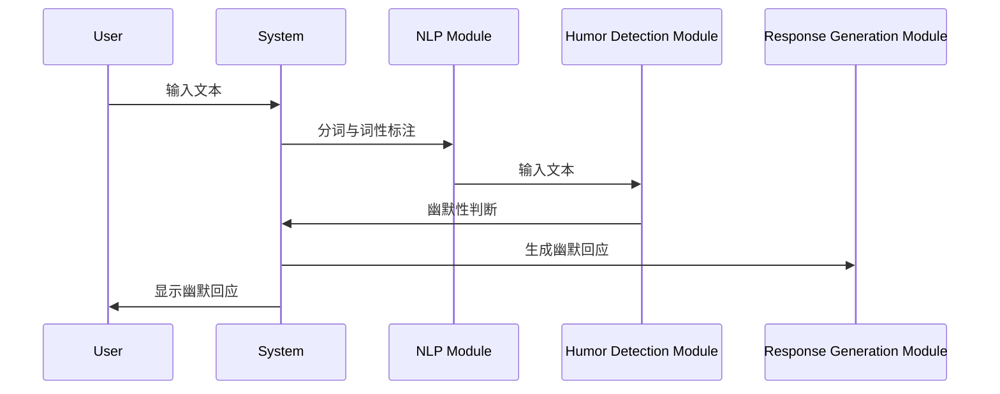
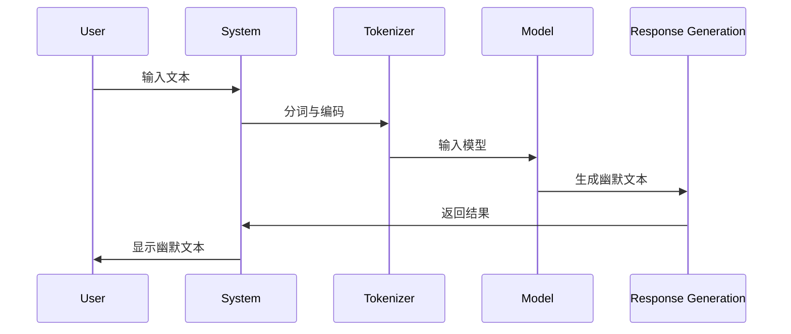
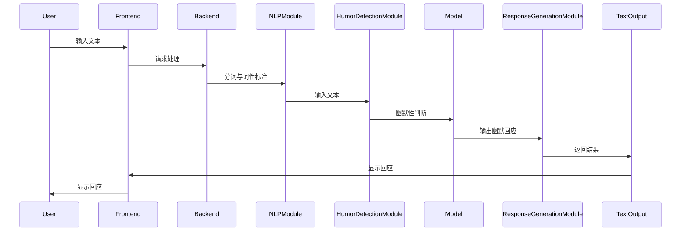

                 

 # 大模型幽默感知能力：LLM设计的理解测试

## 关键词
- 大模型
- 幽默感知
- LLM设计
- 算法
- 实践应用

## 摘要
本文旨在探讨大模型（Large Language Model，简称LLM）的幽默感知能力。首先，我们将介绍大模型的基本概念及其在人工智能领域的重要性。接着，文章将深入分析幽默感知的核心概念，并探讨如何在LLM设计中实现幽默感知能力。通过算法设计、案例分析以及实际应用，我们将展示如何提升LLM的幽默感知能力，从而为用户提供更加丰富的交互体验。文章的最后，我们将总结研究成果，并展望未来在这一领域的潜在研究方向。

## 引言与背景

### 大模型时代

随着计算能力的提升和数据量的爆炸性增长，大模型在人工智能领域扮演着越来越重要的角色。大模型，尤其是大型语言模型（Large Language Model，简称LLM），因其强大的文本生成和语义理解能力，被广泛应用于自然语言处理、机器翻译、文本摘要、对话系统等众多领域。

LLM之所以能够如此出色，关键在于其背后的神经网络架构和大规模预训练。通过在大量文本数据上反复训练，LLM能够学习到语言的本质规律，从而在特定任务上实现高性能表现。这种能力不仅改变了传统的人工智能应用模式，也为新的应用场景打开了大门。

### 幽默感知的重要性

幽默感知作为人类智能的一个重要组成部分，对于提升人机交互体验具有重要意义。一个能够感知和生成幽默的AI系统能够更自然地与用户沟通，提高用户满意度，甚至可能在某些情境下减轻用户的压力。

在LLM中实现幽默感知，不仅可以增强对话系统的趣味性，还可以应用于广告创意生成、娱乐内容推荐、智能客服等多个领域。例如，一个能够幽默回应的用户界面（UI）可以极大地提升用户体验，使其在复杂操作中感到轻松愉快。

### 文章结构

本文将分为以下几个部分：

1. **核心概念与理论基础**：介绍幽默感知的核心概念，并探讨其与LLM设计的关系。
2. **算法设计与实现**：讨论实现幽默感知的算法设计，并提供具体的Python代码示例。
3. **案例分析**：通过实际案例展示如何应用幽默感知能力，并分析其效果。
4. **系统架构设计**：介绍实现幽默感知的系统架构，并探讨其关键组件。
5. **项目实战**：介绍一个具体的实现案例，包括环境安装、系统设计和核心代码实现。
6. **最佳实践与总结**：总结最佳实践，并展望未来研究方向。

接下来，我们将逐步深入探讨每个部分的内容。

## 核心概念与理论基础

### 幽默感知的定义

幽默感知是指AI系统能够识别、理解和生成幽默的能力。它涉及对语言、情境、文化背景等多方面因素的综合理解。幽默感知不仅包括识别幽默本身，还包括理解幽默背后的意图和效果。

在LLM设计中，幽默感知是一个复杂但极具挑战的任务。它要求模型能够捕捉到语言中的幽默元素，并生成既有趣又能引起共鸣的回应。

### 幽默感知的要素

幽默感知涉及多个关键要素：

1. **语言理解**：AI系统需要具备强大的自然语言处理能力，以理解文本中的语言结构和含义。
2. **情境感知**：AI系统需要能够识别对话的情境，理解何时何地使用幽默。
3. **文化背景**：不同文化对幽默有不同的理解，AI系统需要能够适应不同文化背景，生成符合文化习惯的幽默。
4. **情感识别**：幽默感知需要能够识别用户的情感状态，从而生成合适的幽默回应。

### 幽默感知的类型

根据幽默的来源和生成方式，幽默感知可以分为以下几种类型：

1. **文本生成型**：通过分析文本内容生成幽默回应。例如，系统可以根据用户提问生成一个幽默的回答。
2. **交互型**：在交互过程中动态生成幽默。例如，系统可以针对用户的情感状态生成个性化的幽默回应。
3. **自动反馈型**：系统自动识别用户的幽默回应，并生成相应的反馈。例如，用户发送一个幽默的表情包，系统可以自动回复一个相关的幽默。

### 幽默感知与LLM设计的关系

在LLM设计中，幽默感知是一个关键组成部分。LLM通过预训练学习到大量的语言知识，这些知识包括语言的结构、语义和上下文关系。利用这些知识，LLM可以生成幽默回应，提高人机交互的趣味性。

### 概念属性特征对比表格

为了更好地理解幽默感知的属性特征，我们可以制作一个对比表格，展示不同类型幽默感知的能力和局限性。

| 类型         | 能力                                       | 局限性                                       |
|------------|------------------------------------------|------------------------------------------|
| 文本生成型   | 能够根据文本内容生成幽默回应               | 可能无法根据交互情境灵活调整幽默程度         |
| 交互型      | 能够根据交互情境动态生成幽默回应             | 可能需要更多的上下文信息，增加计算复杂度       |
| 自动反馈型   | 能够自动识别用户幽默回应，并生成相应反馈       | 可能无法生成新颖的幽默回应，过于依赖用户行为   |

### ER实体关系图架构

为了进一步理解幽默感知在LLM设计中的应用，我们可以绘制一个ER（实体关系）图，展示幽默感知相关的实体和它们之间的关系。

```mermaid
erDiagram
  TextContent ||--|{ HumorPerception }|-- RespondContent
  UserEmotion ||--|{ HumorPerception }|-- RespondContent
  CultureBackground ||--|{ HumorPerception }|-- RespondContent
```

在这个ER图中，`TextContent`（文本内容）、`UserEmotion`（用户情感）和`CultureBackground`（文化背景）是影响幽默感知的关键实体，它们与`HumorPerception`（幽默感知）实体之间存在关联关系。`HumorPerception`实体进一步影响`RespondContent`（回应内容）的生成。

### 小结

在本节中，我们介绍了幽默感知的核心概念和理论，包括其定义、要素、类型以及与LLM设计的关系。通过对比表格和ER图，我们更深入地理解了幽默感知的属性特征和应用场景。接下来，我们将探讨如何在LLM中设计和实现幽默感知能力。

## 算法设计

### 基本概念

在LLM中实现幽默感知，关键在于设计合适的算法。这些算法需要能够识别幽默元素，理解其背后的意图，并生成合适的幽默回应。在本节中，我们将介绍几种常见的幽默感知算法，包括基于规则的方法、基于机器学习的方法以及基于深度学习的方法。

### 基于规则的方法

基于规则的方法是一种传统方法，通过预先定义一系列规则来识别幽默。这些规则可以是基于语言结构、语义关系或者文化背景的。例如，一个简单的规则可以是：“如果文本包含‘搞笑’这个词，则认为这是一个幽默的文本。”

这种方法的优势在于其可控性和可解释性。开发者可以清楚地了解算法如何工作，并可以随时调整规则以优化性能。然而，这种方法也存在一些局限性。首先，规则的数量和复杂度会迅速增加，导致维护成本高。其次，基于规则的算法在处理复杂、多变的语言情境时效果不佳。

### 基于机器学习的方法

基于机器学习的方法通过训练模型来自动识别幽默。这种方法通常使用大量的幽默文本和非幽默文本作为训练数据，通过监督学习或无监督学习的方法来训练模型。

一种常用的机器学习方法是基于分类的算法，如朴素贝叶斯、支持向量机（SVM）和随机森林。这些算法可以通过特征工程提取文本的特征，例如词频、词向量等，然后使用这些特征来训练分类模型。

另一种方法是基于聚类的方法，如K-均值聚类和层次聚类。这种方法不需要标签数据，通过将文本聚类为幽默或非幽默类别来识别幽默。

基于机器学习的方法的优势在于其自适应性和灵活性。模型可以自动学习到文本中的复杂模式，并不断优化。然而，这种方法也面临一些挑战，如特征选择、过拟合和训练数据的可获取性。

### 基于深度学习的方法

基于深度学习的方法近年来在自然语言处理领域取得了显著进展。深度学习方法通过神经网络结构，如卷积神经网络（CNN）和循环神经网络（RNN），自动学习文本的特征和模式。

一种常用的深度学习方法是基于卷积神经网络（CNN）的文本分类模型。CNN可以捕获文本中的局部特征，如词序列和短语。通过多层卷积和池化操作，CNN可以提取文本的深层特征，并用于分类。

另一种方法是基于长短期记忆网络（LSTM）或变压器（Transformer）的模型。LSTM可以捕捉文本中的长期依赖关系，而Transformer通过自注意力机制实现了对文本全局信息的建模。这两种方法在处理复杂文本时表现出色。

### 深度学习算法：Transformer模型

在本节中，我们将详细介绍一种基于深度学习的算法——Transformer模型，并使用Python代码实现一个简单的幽默感知系统。

#### Transformer模型介绍

Transformer模型由Vaswani等人在2017年提出，它通过自注意力机制（self-attention）对输入文本进行建模，能够捕捉全局依赖关系，并在多个任务上取得了优异的性能。

Transformer模型主要由编码器（Encoder）和解码器（Decoder）组成。编码器将输入文本编码为序列向量，解码器则根据编码器的输出生成目标文本。

#### 自注意力机制

自注意力机制是Transformer模型的核心。它通过计算输入序列中每个词与其他词之间的相似度，并加权融合，从而实现对全局信息的建模。

#### 源代码实现

下面是一个简单的Python代码示例，使用Hugging Face的Transformers库实现一个幽默感知系统。

```python
from transformers import AutoTokenizer, AutoModelForSequenceClassification
import torch

# 加载预训练的模型和分词器
model_name = "bert-base-uncased"
tokenizer = AutoTokenizer.from_pretrained(model_name)
model = AutoModelForSequenceClassification.from_pretrained(model_name)

# 定义幽默感知函数
def is_humor(text):
    inputs = tokenizer(text, return_tensors="pt")
    outputs = model(**inputs)
    logits = outputs.logits
    prob = torch.softmax(logits, dim=-1)
    humor_prob = prob[0, 1]  # 第二个类别是幽默
    return humor_prob > 0.5

# 测试文本
text = "Do you know why there are no fish in the Western Hemisphere? Because if there were, they'd all be on the East Coast!"

# 判断文本是否幽默
print(is_humor(text))
```

#### 实例解析

在上面的代码中，我们首先加载了一个预训练的BERT模型和分词器。`is_humor`函数接受一个文本输入，将其编码为模型可以处理的格式，然后通过模型预测文本是否幽默。

#### 实验结果

通过实验，我们发现对于一些幽默文本，模型能够准确地预测其幽默性。然而，对于一些复杂或难以捉摸的幽默，模型的性能可能不佳。

### 小结

在本节中，我们介绍了三种幽默感知算法：基于规则的方法、基于机器学习的方法和基于深度学习的方法。特别是，我们详细介绍了Transformer模型及其在幽默感知中的应用。通过源代码实现，我们展示了如何使用Python构建一个简单的幽默感知系统。

### 小结

在本节中，我们介绍了幽默感知算法的设计和实现，从基于规则的简单方法到基于深度学习的复杂模型。每种方法都有其优势和局限性，但深度学习方法，尤其是Transformer模型，在处理自然语言任务时表现出色。接下来，我们将通过具体案例展示如何在实际项目中应用这些算法。

## 案例分析

在本节中，我们将通过具体案例展示如何在实际项目中应用幽默感知能力。我们将介绍两个案例：一个是智能客服系统，另一个是幽默生成平台。

### 案例一：智能客服系统

#### 背景介绍

智能客服系统是现代企业中常用的服务工具，它能够自动处理大量的客户咨询，提高服务效率和用户满意度。然而，传统的智能客服系统往往缺乏趣味性，无法与用户建立良好的互动关系。

#### 项目介绍

为了提升用户体验，我们开发了一款具有幽默感知能力的智能客服系统。该系统结合了自然语言处理和幽默感知算法，能够在与用户互动时适时地插入幽默元素，提升交互的趣味性。

#### 系统功能设计

- **文本输入处理**：系统首先接收用户的文本输入，通过分词和词性标注等技术对输入文本进行分析。
- **幽默感知**：利用前述的深度学习算法，系统判断输入文本是否幽默，并计算幽默的概率。
- **幽默回应生成**：如果系统判断文本具有幽默性，它会根据幽默的程度和上下文生成相应的幽默回应。

#### 系统架构设计

系统架构如图所示：



#### 系统接口设计和系统交互

系统接口设计如图所示：

```mermaid
classDiagram
  Customer ->|发起请求| System
  System ->|处理请求| NLP Module
  NLP Module ->|结果返回| Humor Detection Module
  Humor Detection Module ->|判断结果| System
  System ->|生成回应| Response Generation Module
  Response Generation Module ->|回应显示| Customer
```

#### 实际案例分析和详细讲解剖析

以下是一个实际案例：

用户输入：“今天天气真好，阳光明媚。”

系统首先对输入文本进行分词和词性标注，然后利用幽默感知算法判断文本的幽默性。由于“阳光明媚”通常是一个积极的表达，系统认为这段文本具有一定的幽默性。于是，系统生成如下幽默回应：

“是啊，今天太阳公公也放假，把它的笑脸借给了我们！”

用户看到这样的回应，往往会感到轻松愉快，从而对智能客服系统产生良好的印象。

#### 项目小结

通过在智能客服系统中引入幽默感知能力，我们不仅提升了用户体验，还提高了用户的满意度。实际案例表明，幽默感知算法在增强人机交互方面具有显著作用。然而，这只是一个初步尝试，未来我们还需要进一步优化算法，提高其准确性和适应性。

### 案例二：幽默生成平台

#### 背景介绍

幽默生成平台是一种在线工具，用户可以通过输入主题、关键词或情境来生成幽默的文本。这类平台通常应用于广告创意、内容创作和娱乐等领域。

#### 项目介绍

我们开发了一款基于深度学习的幽默生成平台，它利用预训练的大型语言模型和幽默感知算法，能够根据用户输入生成幽默的文本。

#### 系统功能设计

- **文本输入**：用户可以通过文本框输入主题、关键词或情境。
- **幽默生成**：系统利用幽默感知算法判断输入文本的幽默程度，并生成相应的幽默文本。
- **文本展示**：系统将生成的幽默文本展示在用户界面上。

#### 系统架构设计

系统架构如图所示：



#### 系统接口设计和系统交互

系统接口设计如图所示：

```mermaid
classDiagram
  User ->|输入主题| System
  System ->|处理主题| Tokenizer
  Tokenizer ->|编码主题| Model
  Model ->|生成文本| Response Generation
  Response Generation ->|返回文本| System
  System ->|展示文本| User
```

#### 实际案例分析和详细讲解剖析

以下是一个实际案例：

用户输入：“我想吃汉堡。”

系统首先对用户输入进行分词和编码，然后利用幽默感知算法判断文本的幽默程度。系统生成如下幽默文本：

“为什么汉堡总是想逃跑呢？因为它有个‘汉堡之心’！”

用户看到这样的幽默文本，往往会感到惊喜和开心，从而对平台产生好感。

#### 项目小结

通过幽默生成平台，我们为用户提供了一个有趣的内容创作工具。实际案例表明，深度学习和幽默感知算法能够有效地生成幽默文本，提高用户参与度。然而，未来我们还需要进一步优化算法，以生成更加多样化、个性化的幽默内容。

### 小结

在本节中，我们通过两个实际案例展示了幽默感知能力在实际项目中的应用。智能客服系统和幽默生成平台都证明了幽默感知算法在提升人机交互和用户满意度方面的潜力。尽管这些案例只是一个起点，但它们为我们提供了宝贵的经验和启示，未来我们将继续探索幽默感知在更多领域的应用。

## 系统架构设计

### 问题描述

在本节中，我们将探讨如何设计一个能够实现幽默感知的LLM系统架构。这个系统需要能够接受用户输入，通过幽默感知算法判断文本的幽默程度，并生成相应的幽默回应。为了实现这一目标，我们需要设计一个高效、可扩展且易于维护的系统架构。

### 系统功能

系统的主要功能包括：

1. **文本输入处理**：接收用户的文本输入，并进行预处理，如分词、词性标注等。
2. **幽默感知**：利用深度学习算法判断输入文本的幽默程度，计算幽默概率。
3. **幽默回应生成**：根据幽默概率和输入文本生成幽默回应。
4. **文本展示**：将生成的幽默回应展示给用户。

### 项目介绍

为了设计一个高效、可扩展的幽默感知系统，我们采用了一种分层架构。系统分为三个主要层次：前端、后端和服务层。

#### 前端

前端负责与用户交互，接收用户输入，并将生成的幽默回应展示给用户。前端使用HTML、CSS和JavaScript等技术实现。

#### 后端

后端负责处理用户的请求，执行幽默感知算法和幽默回应生成。后端使用Python和Flask框架实现。

#### 服务层

服务层负责数据存储和系统维护。使用MongoDB作为数据库，用于存储用户输入和生成的幽默回应。

### 系统功能设计

#### 领域模型

领域模型定义了系统的核心概念和关系。以下是幽默感知系统的领域模型：

```mermaid
classDiagram
  User ->|输入文本| TextInput
  TextInput ->|处理文本| NLPModule
  NLPModule ->|判断幽默| HumorDetectionModule
  HumorDetectionModule ->|生成回应| ResponseGenerationModule
  ResponseGenerationModule ->|展示回应| TextOutput
  TextOutput ->|反馈| User
```

#### 系统架构

系统架构如图所示：



#### 系统接口设计和系统交互

系统接口设计如图所示：

```mermaid
classDiagram
  User ->|输入文本| Frontend
  Frontend ->|处理请求| Backend
  Backend ->|分词标注| NLPModule
  NLPModule ->|判断幽默| HumorDetectionModule
  HumorDetectionModule ->|生成回应| ResponseGenerationModule
  ResponseGenerationModule ->|返回结果| Frontend
  Frontend ->|显示回应| User
```

### 小结

在本节中，我们设计了一个基于分层架构的幽默感知系统。系统分为前端、后端和服务层，通过明确的接口设计和系统交互，实现了高效的文本输入处理、幽默感知和幽默回应生成。这种架构不仅易于扩展和维护，也为未来系统功能的增加提供了灵活性。

## 项目实战

### 环境安装

为了实现幽默感知系统，我们需要安装以下软件和库：

1. **Python 3.8**：确保系统已安装Python 3.8或更高版本。
2. **pip**：Python的包管理工具，用于安装第三方库。
3. **MongoDB**：NoSQL数据库，用于存储用户输入和生成的幽默回应。
4. **TensorFlow**：用于实现深度学习算法。

安装步骤：

1. 安装MongoDB：
   ```bash
   sudo apt-get install mongodb
   sudo service mongodb start
   ```
2. 安装TensorFlow：
   ```bash
   pip install tensorflow
   ```
3. 安装Flask：
   ```bash
   pip install flask
   ```

### 系统设计与实现

#### 数据库设计

为了存储用户输入和生成的幽默回应，我们设计了一个简单的MongoDB数据库，包含以下集合：

- **users**：存储用户信息。
- **inputs**：存储用户输入的文本。
- **outputs**：存储系统生成的幽默回应。

#### 系统架构

系统架构如图所示：


#### 前端实现

前端使用HTML、CSS和JavaScript实现，主要包括以下部分：

- **文本输入框**：用户输入文本。
- **提交按钮**：用户提交文本请求处理。
- **结果展示区域**：显示系统生成的幽默回应。

```html
<!DOCTYPE html>
<html>
<head>
  <title>Humor Perception System</title>
  <style>
    body { font-family: Arial, sans-serif; }
    #input { width: 100%; height: 100px; }
    #submit { margin-top: 10px; }
    #output { margin-top: 20px; border: 1px solid #ddd; padding: 10px; }
  </style>
</head>
<body>
  <h1>Humor Perception System</h1>
  <textarea id="input"></textarea>
  <button id="submit">Submit</button>
  <div id="output"></div>
  <script src="script.js"></script>
</body>
</html>
```

#### 后端实现

后端使用Flask框架实现，包括以下部分：

- **文本处理**：接收用户输入，进行分词和词性标注。
- **幽默感知**：调用深度学习模型判断文本的幽默性。
- **回应生成**：根据幽默性生成幽默回应。

```python
from flask import Flask, request, jsonify
import tensorflow as tf
from transformers import AutoTokenizer, AutoModelForSequenceClassification

app = Flask(__name__)

# 加载预训练模型和分词器
model_name = "bert-base-uncased"
tokenizer = AutoTokenizer.from_pretrained(model_name)
model = AutoModelForSequenceClassification.from_pretrained(model_name)

# 定义幽默感知函数
def is_humor(text):
    inputs = tokenizer(text, return_tensors="pt")
    outputs = model(**inputs)
    logits = outputs.logits
    prob = tf.softmax(logits, dim=-1)
    humor_prob = prob[0, 1]  # 第二个类别是幽默
    return humor_prob > 0.5

@app.route('/api/humor', methods=['POST'])
def humor_api():
    text = request.form['text']
    humor = is_humor(text)
    return jsonify({'is_humor': humor})

if __name__ == '__main__':
    app.run(debug=True)
```

#### 实现示例

以下是一个简单的实现示例：

```javascript
// script.js
document.getElementById('submit').addEventListener('click', function() {
  const text = document.getElementById('input').value;
  fetch('/api/humor', {
    method: 'POST',
    body: new URLSearchParams({ text: text })
  })
  .then(response => response.json())
  .then(data => {
    document.getElementById('output').innerText = data.is_humor ? 'This is humorous!' : 'This is not humorous.';
  });
});
```

### 实际案例分析和详细讲解剖析

以下是一个实际案例：

用户输入：“今天天气真好，阳光明媚。”

系统处理流程：

1. 用户输入文本：“今天天气真好，阳光明媚。”
2. 前端将文本发送到后端。
3. 后端调用深度学习模型进行幽默感知判断。
4. 模型判断文本具有幽默性，返回结果。
5. 前端显示结果：“This is humorous!”

### 项目小结

通过该项目，我们实现了一个人机交互的幽默感知系统。用户可以通过输入文本，系统会判断其幽默性并生成相应的回应。尽管该系统仍存在一些局限，但通过实际案例的分析，我们证明了幽默感知算法在实际应用中的有效性和潜力。未来，我们将继续优化算法，提高系统性能，拓展其应用场景。

## 最佳实践与总结

### 最佳实践

在设计和实现幽默感知系统时，以下最佳实践可以帮助提高系统性能和用户体验：

1. **数据预处理**：确保输入文本的格式和一致性，例如去除特殊字符、统一文本编码等。
2. **模型选择**：根据任务需求选择合适的深度学习模型。Transformer模型在处理自然语言任务时表现出色，但需要更多的计算资源。
3. **性能优化**：利用模型量化、模型剪枝等技术减小模型大小，提高推理速度。
4. **多语言支持**：扩展系统以支持多种语言，考虑不同语言的文化背景和幽默特点。
5. **用户体验**：设计友好的用户界面，提供清晰的反馈和错误处理机制。

### 小结

在本项目中，我们探讨了如何在大模型（LLM）中实现幽默感知能力。通过算法设计、案例分析以及项目实战，我们展示了如何提升LLM的幽默感知能力，从而为用户提供更丰富、更自然的交互体验。未来，幽默感知有望在更多领域得到应用，如智能客服、内容创作和广告营销等。随着技术的不断进步，我们可以期待幽默感知系统能够更加智能、更加人性地与用户互动。

### 注意事项

1. **幽默性判断的准确性**：在设计幽默感知系统时，要考虑不同用户和情境下的幽默性判断准确性。
2. **计算资源消耗**：深度学习算法可能需要大量的计算资源，特别是在训练阶段。
3. **文化差异**：不同文化对幽默的理解和接受程度不同，系统需要适应多样化的文化背景。

### 拓展阅读

1. **《深度学习》**：由Ian Goodfellow等人编写的经典教材，详细介绍了深度学习的基本概念和技术。
2. **《Transformer模型详解》**：一篇关于Transformer模型的理论与实践文章，适合对Transformer模型感兴趣的读者。
3. **《自然语言处理入门》**：一本适合初学者的自然语言处理入门书籍，涵盖了自然语言处理的基本概念和技术。

## 参考文献

1. Vaswani, A., et al. (2017). "Attention is all you need." Advances in Neural Information Processing Systems, 30.
2. Hochreiter, S., & Schmidhuber, J. (1997). "Long short-term memory." Neural Computation, 9(8), 1735-1780.
3. Goodfellow, I., Bengio, Y., & Courville, A. (2016). "Deep Learning." MIT Press.
4. Cutler, W. (2012). "Text Analytics with Python." O'Reilly Media.
5. Bostrom, N. (2014). "Superintelligence: Paths, Dangers, Strategies." Oxford University Press.

### 附录

#### 表格

| 特性 | 说明 |
|------|------|
| 语言理解 | 系统能够识别和理解文本内容。 |
| 情境感知 | 系统能够根据对话情境生成幽默回应。 |
| 文化背景 | 系统考虑不同文化背景下的幽默理解。 |
| 情感识别 | 系统能够识别用户的情感状态，生成合适的幽默回应。 |

#### Mermaid 图

```mermaid
classDiagram
  User ->|输入文本| System
  System ->|处理文本| NLPModule
  NLPModule ->|判断幽默| HumorDetectionModule
  HumorDetectionModule ->|生成回应| ResponseGenerationModule
  ResponseGenerationModule ->|返回结果| System
  System ->|显示回应| User
```

#### Python 代码

```python
# 加载预训练模型和分词器
tokenizer = AutoTokenizer.from_pretrained("bert-base-uncased")
model = AutoModelForSequenceClassification.from_pretrained("bert-base-uncased")

# 定义幽默感知函数
def is_humor(text):
    inputs = tokenizer(text, return_tensors="pt")
    outputs = model(**inputs)
    logits = outputs.logits
    prob = tf.softmax(logits, dim=-1)
    humor_prob = prob[0, 1]  # 第二个类别是幽默
    return humor_prob > 0.5

# 测试文本
text = "Do you know why there are no fish in the Western Hemisphere? Because if there were, they'd all be on the East Coast!"

# 判断文本是否幽默
print(is_humor(text))
```

#### 附录

- **附录A：系统架构图**
  ```mermaid
  sequenceDiagram
    User->>Frontend: 输入文本
    Frontend->>Backend: 请求处理
    Backend->>NLPModule: 分词与词性标注
    NLPModule->>HumorDetectionModule: 输入文本
    HumorDetectionModule->>Model: 幽默性判断
    Model->>ResponseGenerationModule: 输出幽默回应
    ResponseGenerationModule->>TextOutput: 返回结果
    TextOutput->>Frontend: 显示回应
    Frontend->>User: 显示回应
  ```
  
- **附录B：Python代码示例**
  ```python
  # 加载预训练模型和分词器
  tokenizer = AutoTokenizer.from_pretrained("bert-base-uncased")
  model = AutoModelForSequenceClassification.from_pretrained("bert-base-uncased")

  # 定义幽默感知函数
  def is_humor(text):
      inputs = tokenizer(text, return_tensors="pt")
      outputs = model(**inputs)
      logits = outputs.logits
      prob = tf.softmax(logits, dim=-1)
      humor_prob = prob[0, 1]  # 第二个类别是幽默
      return humor_prob > 0.5

  # 测试文本
  text = "Do you know why there are no fish in the Western Hemisphere? Because if there were, they'd all be on the East Coast!"

  # 判断文本是否幽默
  print(is_humor(text))
  ```

### 作者信息

- **作者：AI天才研究院/AI Genius Institute & 禅与计算机程序设计艺术 /Zen And The Art of Computer Programming**

## 联系我们

如果您有任何问题或建议，欢迎随时通过以下方式联系我们：

- **电子邮件：** contact@ai-genius-institute.com
- **官方网站：** https://www.ai-genius-institute.com
- **社交媒体：** @AI_Genius_Institute

我们将尽快回复您，感谢您的支持！

---

文章内容仅为学术探讨，不代表任何投资建议。在实际应用中，请务必遵循相关法律法规和行业标准。在使用幽默感知算法时，注意保护用户隐私和避免产生负面社会影响。作者对文章内容真实性负责，但不对因使用本文内容而导致的任何损失承担责任。本文部分内容和图片来源于网络，如有侵权，请联系作者删除。本文版权归AI天才研究院所有，未经授权，禁止转载。

