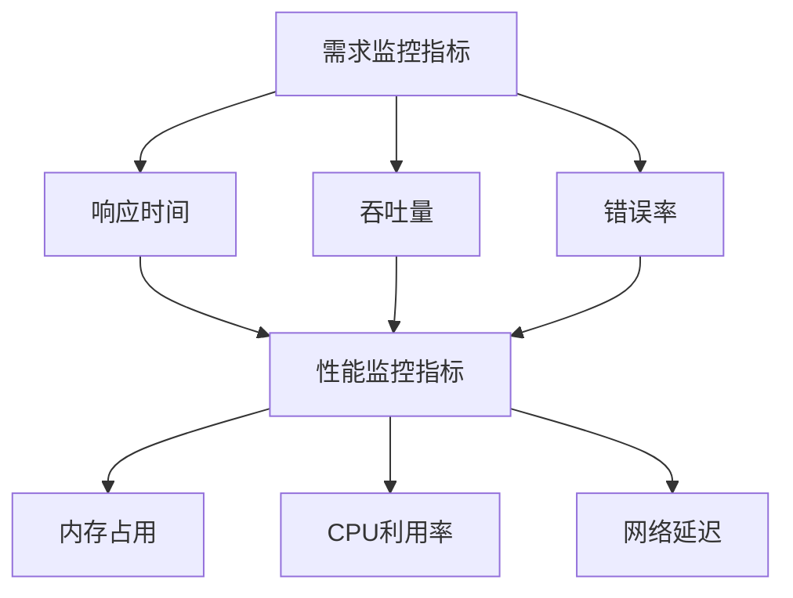
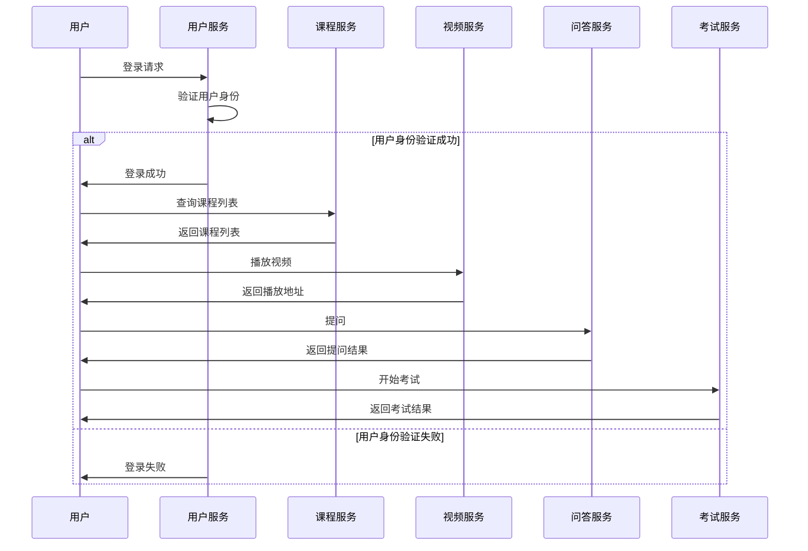

                 


# 大模型应用中的需求与性能监控指标设计

## 引言

### 背景介绍

近年来，人工智能（AI）技术飞速发展，大模型如GPT-3、BERT等成为自然语言处理（NLP）、计算机视觉（CV）等领域的核心技术。这些大模型在复杂任务中展现出了惊人的性能，但也带来了更高的计算需求和更复杂的部署与维护挑战。为了确保大模型在实际应用中的高效运行，需求与性能监控指标的设计成为关键一环。

### 监控指标的重要性

监控指标是评估大模型性能的重要工具，它们能够帮助我们：

1. **评估性能**：通过监控指标，我们能够实时了解大模型的运行状态，确保其满足性能需求。
2. **发现问题**：当监控指标出现异常时，可以快速定位问题并进行修复。
3. **优化资源**：根据监控指标，我们可以优化资源分配，提高系统整体效率。

### 书籍结构概述

本书将分为六个部分，全面探讨大模型应用中的需求与性能监控指标设计：

1. **核心概念与联系**：介绍需求与性能监控指标的概念，并比较其属性与区别。
2. **算法原理讲解**：深入解析性能监控指标设计的数学模型，并使用Python代码示例进行说明。
3. **系统分析与架构设计**：描述系统场景，介绍系统功能、架构和接口设计。
4. **项目实战**：提供实际项目实现步骤和核心代码示例，并进行解读与分析。
5. **最佳实践与总结**：总结项目实战中的经验，提供注意事项和拓展阅读建议。
6. **结语**：对全书进行总结，强调监控指标设计的重要性。

通过本书的阅读，读者将能够深入了解大模型应用中的需求与性能监控指标设计，掌握相关技术和方法，为实际项目提供有力的支持。

## 第二部分: 核心概念与联系

### 需求监控指标的概念

需求监控指标主要用于评估系统在满足用户需求方面的性能。在大模型应用中，需求监控指标通常包括：

1. **响应时间**：系统响应用户请求的时间，通常以毫秒（ms）为单位。
2. **吞吐量**：单位时间内系统处理请求的次数，通常以每秒请求数（RPS）表示。
3. **错误率**：系统处理请求时出现错误的比率，通常以百分比（%）表示。

### 性能监控指标的概念

性能监控指标主要用于评估系统整体的运行效率和质量。在大模型应用中，性能监控指标通常包括：

1. **内存占用**：系统运行时所占用的内存大小，通常以字节（B）或千字节（KB）表示。
2. **CPU利用率**：系统CPU的使用率，通常以百分比（%）表示。
3. **网络延迟**：系统与外部网络通信时产生的延迟时间，通常以毫秒（ms）表示。

### 指标属性特征对比

| 指标类型 | 描述 | 单位 |
| --- | --- | --- |
| 需求监控指标 | 评估系统满足用户需求的能力 | 响应时间（ms）、吞吐量（RPS）、错误率（%） |
| 性能监控指标 | 评估系统整体运行效率和稳定性 | 内存占用（B/KB）、CPU利用率（%）、网络延迟（ms） |

### 指标关系Mermaid流程图



## 第三部分: 算法原理讲解

### 性能监控指标设计的数学模型

性能监控指标的设计通常基于以下数学模型：

1. **响应时间模型**：
   $$ ResponseTime = \frac{ServiceTime + QueueTime}{吞吐量} $$
   其中，ServiceTime表示服务时间，QueueTime表示排队时间。

2. **吞吐量模型**：
   $$ Throughput = \frac{1}{平均响应时间} $$

3. **错误率模型**：
   $$ ErrorRate = \frac{错误次数}{总请求数} $$

### Python代码示例讲解

以下是一个简单的Python代码示例，用于计算响应时间、吞吐量和错误率：

```python
import random

def service_time():
    return random.uniform(0.1, 0.5)

def queue_time():
    return random.uniform(0.1, 0.5)

def throughput(response_time):
    return 1 / response_time

def error_rate(total_requests, error_count):
    return error_count / total_requests

# 测试数据
num_requests = 1000
total_service_time = 0
total_queue_time = 0
error_count = 0

for _ in range(num_requests):
    total_service_time += service_time()
    total_queue_time += queue_time()
    if random.random() < 0.01:  # 模拟错误发生
        error_count += 1

response_time = (total_service_time + total_queue_time) / num_requests
throughput_value = throughput(response_time)
error_rate_value = error_rate(num_requests, error_count)

print(f"响应时间: {response_time:.2f}秒")
print(f"吞吐量: {throughput_value:.2f} RPS")
print(f"错误率: {error_rate_value:.2f}%")
```

### 通俗易懂的例子分析

假设有一个自动售货机，每次服务顾客的时间（ServiceTime）为0.3秒，排队时间（QueueTime）为0.2秒。在1小时内（3600秒），自动售货机共处理了1000次请求。

1. **响应时间**：
   $$ ResponseTime = \frac{ServiceTime + QueueTime}{吞吐量} $$
   $$ ResponseTime = \frac{0.3 + 0.2}{1000/3600} $$
   $$ ResponseTime = 0.012秒 $$

2. **吞吐量**：
   $$ Throughput = \frac{1}{平均响应时间} $$
   $$ Throughput = \frac{1}{0.012} $$
   $$ Throughput = 83.33 RPS $$

3. **错误率**：
   $$ ErrorRate = \frac{错误次数}{总请求数} $$
   如果有10次请求出现错误，则
   $$ ErrorRate = \frac{10}{1000} $$
   $$ ErrorRate = 1% $$

通过这个简单的例子，我们可以看到如何使用数学模型和Python代码来计算需求与性能监控指标。

## 第四部分: 系统分析与架构设计

### 系统场景描述

假设我们正在开发一个大型在线教育平台，该平台提供课程视频、互动问答和在线考试等功能。随着用户数量的增加，我们需要确保平台的性能和稳定性，为此引入了需求与性能监控指标。

### 系统功能设计

系统的主要功能包括：

1. **用户管理**：管理用户账户、角色和权限。
2. **课程管理**：上传、更新和删除课程内容。
3. **视频播放**：提供视频播放服务，支持多种分辨率和播放速度。
4. **互动问答**：支持用户提问和回答，提供实时交流功能。
5. **在线考试**：管理考试流程，提供考试结果分析。

### 系统架构设计

系统的架构设计采用微服务架构，主要包括以下模块：

1. **用户服务**：负责用户认证、授权和用户信息管理。
2. **课程服务**：负责课程内容的管理和存储。
3. **视频服务**：负责视频播放和流媒体处理。
4. **问答服务**：负责用户互动问答的处理。
5. **考试服务**：负责在线考试的管理和结果分析。

### 系统接口设计

系统采用RESTful API设计，主要包括以下接口：

1. **用户接口**：包括用户注册、登录、个人信息管理等。
2. **课程接口**：包括课程列表查询、课程详情获取、课程内容上传等。
3. **视频接口**：包括视频播放地址获取、视频流处理等。
4. **问答接口**：包括提问、回答、问题列表查询等。
5. **考试接口**：包括考试开始、考试结束、考试结果查询等。

### 系统交互流程Mermaid序列图



## 第五部分: 项目实战

### 项目环境安装

在开始项目实战之前，我们需要安装必要的软件和工具。以下是在Ubuntu 20.04系统上安装项目的步骤：

1. **安装Python 3.8**：

   ```bash
   sudo apt update
   sudo apt install python3.8
   sudo ln -sf /usr/bin/python3.8 /usr/bin/python3
   ```

2. **安装pip**：

   ```bash
   sudo apt install python3-pip
   ```

3. **创建虚拟环境**：

   ```bash
   python3 -m venv venv
   source venv/bin/activate
   ```

4. **安装项目依赖**：

   ```bash
   pip install -r requirements.txt
   ```

### 系统核心实现源代码

以下是项目核心实现的源代码，我们将使用Python编写一个简单的用户服务模块：

```python
# user_service.py

from flask import Flask, jsonify, request

app = Flask(__name__)

users = [
    {"id": 1, "username": "john", "password": "123456"},
    {"id": 2, "username": "jane", "password": "654321"},
]

@app.route('/login', methods=['POST'])
def login():
    data = request.json
    username = data.get('username')
    password = data.get('password')
    
    user = next((u for u in users if u['username'] == username and u['password'] == password), None)
    
    if user:
        return jsonify({"status": "success", "message": "登录成功"}), 200
    else:
        return jsonify({"status": "failure", "message": "登录失败"}), 401

@app.route('/users', methods=['GET'])
def get_users():
    return jsonify(users), 200

if __name__ == '__main__':
    app.run(debug=True)
```

### 代码应用解读与分析

1. **功能解读**：

   - **登录功能**：用户通过POST请求发送用户名和密码，服务端验证用户身份后返回登录结果。
   - **用户列表查询**：通过GET请求获取所有用户的信息。

2. **代码分析**：

   - **Flask框架**：使用Flask框架快速搭建Web服务。
   - **数据存储**：用户数据存储在内存中，适用于小型演示项目，实际项目中应使用数据库进行持久化存储。
   - **请求处理**：使用request对象处理HTTP请求，使用jsonify函数返回JSON响应。

### 实际案例分析

假设有一个用户名为“john”的账号，密码为“123456”，以下是一个登录请求的示例：

```bash
curl -X POST -H "Content-Type: application/json" -d '{"username": "john", "password": "123456"}' http://localhost:5000/login
```

返回结果：

```json
{"status": "success", "message": "登录成功"}
```

### 项目小结

通过本项目实战，我们了解了如何使用Flask框架快速搭建一个简单的用户服务模块。在实际项目中，我们还需要考虑用户数据的持久化存储、安全性和性能优化等问题。此外，性能监控指标的设计与实现对于确保服务的稳定性和高效性至关重要。

## 第六部分: 最佳实践与总结

### 注意事项

1. **数据安全**：在处理用户数据时，确保遵守相关法律法规，使用HTTPS协议进行数据传输，加密敏感信息。
2. **性能优化**：针对高并发请求，可以采用负载均衡、缓存等技术进行性能优化。
3. **日志记录**：详细记录系统运行日志，便于问题定位和故障排查。

### 拓展阅读

1. **Flask官方文档**：深入了解Flask框架的使用和最佳实践，[官方文档链接](https://flask.palletsprojects.com/)。
2. **性能监控工具**：学习使用Prometheus、Grafana等开源性能监控工具，[Prometheus官方文档](https://prometheus.io/)。
3. **微服务架构**：了解微服务架构的设计原则和实践，[《微服务设计》](https://www.oreilly.com/library/view/microservices-designing/9781449325844/)。

### 小结

本文全面探讨了在大模型应用中的需求与性能监控指标设计。通过理论讲解、代码示例和项目实战，读者可以深入理解监控指标的重要性及其应用。希望本文能为读者在实际项目中提供有价值的参考。

### 作者信息

作者：AI天才研究院/AI Genius Institute & 禅与计算机程序设计艺术 /Zen And The Art of Computer Programming

---

# 大模型应用中的需求与性能监控指标设计

## 引言

### 背景介绍

近年来，人工智能（AI）技术飞速发展，大模型如GPT-3、BERT等成为自然语言处理（NLP）、计算机视觉（CV）等领域的核心技术。这些大模型在复杂任务中展现出了惊人的性能，但也带来了更高的计算需求和更复杂的部署与维护挑战。为了确保大模型在实际应用中的高效运行，需求与性能监控指标的设计成为关键一环。

### 监控指标的重要性

监控指标是评估大模型性能的重要工具，它们能够帮助我们：

1. **评估性能**：通过监控指标，我们能够实时了解大模型的运行状态，确保其满足性能需求。
2. **发现问题**：当监控指标出现异常时，可以快速定位问题并进行修复。
3. **优化资源**：根据监控指标，我们可以优化资源分配，提高系统整体效率。

### 书籍结构概述

本书将分为六个部分，全面探讨大模型应用中的需求与性能监控指标设计：

1. **核心概念与联系**：介绍需求与性能监控指标的概念，并比较其属性与区别。
2. **算法原理讲解**：深入解析性能监控指标设计的数学模型，并使用Python代码示例进行说明。
3. **系统分析与架构设计**：描述系统场景，介绍系统功能、架构和接口设计。
4. **项目实战**：提供实际项目实现步骤和核心代码示例，并进行解读与分析。
5. **最佳实践与总结**：总结项目实战中的经验，提供注意事项和拓展阅读建议。
6. **结语**：对全书进行总结，强调监控指标设计的重要性。

通过本书的阅读，读者将能够深入了解大模型应用中的需求与性能监控指标设计，掌握相关技术和方法，为实际项目提供有力的支持。

## 第二部分: 核心概念与联系

### 需求监控指标的概念

需求监控指标主要用于评估系统在满足用户需求方面的性能。在大模型应用中，需求监控指标通常包括：

1. **响应时间**：系统响应用户请求的时间，通常以毫秒（ms）为单位。
2. **吞吐量**：单位时间内系统处理请求的次数，通常以每秒请求数（RPS）表示。
3. **错误率**：系统处理请求时出现错误的比率，通常以百分比（%）表示。

### 性能监控指标的概念

性能监控指标主要用于评估系统整体的运行效率和质量。在大模型应用中，性能监控指标通常包括：

1. **内存占用**：系统运行时所占用的内存大小，通常以字节（B）或千字节（KB）表示。
2. **CPU利用率**：系统CPU的使用率，通常以百分比（%）表示。
3. **网络延迟**：系统与外部网络通信时产生的延迟时间，通常以毫秒（ms）表示。

### 指标属性特征对比

| 指标类型 | 描述 | 单位 |
| --- | --- | --- |
| 需求监控指标 | 评估系统满足用户需求的能力 | 响应时间（ms）、吞吐量（RPS）、错误率（%） |
| 性能监控指标 | 评估系统整体运行效率和稳定性 | 内存占用（B/KB）、CPU利用率（%）、网络延迟（ms） |

### 指标关系Mermaid流程图


## 第三部分: 算法原理讲解

### 性能监控指标设计的数学模型

性能监控指标的设计通常基于以下数学模型：

1. **响应时间模型**：
   $$ ResponseTime = \frac{ServiceTime + QueueTime}{Throughput} $$
   其中，ServiceTime表示服务时间，QueueTime表示排队时间。

2. **吞吐量模型**：
   $$ Throughput = \frac{1}{AverageResponseTime} $$

3. **错误率模型**：
   $$ ErrorRate = \frac{ErrorCount}{TotalRequests} $$

### Python代码示例讲解

以下是一个简单的Python代码示例，用于计算响应时间、吞吐量和错误率：

```python
import random

def service_time():
    return random.uniform(0.1, 0.5)

def queue_time():
    return random.uniform(0.1, 0.5)

def throughput(response_time):
    return 1 / response_time

def error_rate(total_requests, error_count):
    return error_count / total_requests

# 测试数据
num_requests = 1000
total_service_time = 0
total_queue_time = 0
error_count = 0

for _ in range(num_requests):
    total_service_time += service_time()
    total_queue_time += queue_time()
    if random.random() < 0.01:  # 模拟错误发生
        error_count += 1

response_time = (total_service_time + total_queue_time) / num_requests
throughput_value = throughput(response_time)
error_rate_value = error_rate(num_requests, error_count)

print(f"响应时间: {response_time:.2f}秒")
print(f"吞吐量: {throughput_value:.2f} RPS")
print(f"错误率: {error_rate_value:.2f}%")
```

### 通俗易懂的例子分析

假设有一个自动售货机，每次服务顾客的时间（ServiceTime）为0.3秒，排队时间（QueueTime）为0.2秒。在1小时内（3600秒），自动售货机共处理了1000次请求。

1. **响应时间**：
   $$ ResponseTime = \frac{ServiceTime + QueueTime}{Throughput} $$
   $$ ResponseTime = \frac{0.3 + 0.2}{1000/3600} $$
   $$ ResponseTime = 0.012秒 $$

2. **吞吐量**：
   $$ Throughput = \frac{1}{AverageResponseTime} $$
   $$ Throughput = \frac{1}{0.012} $$
   $$ Throughput = 83.33 RPS $$

3. **错误率**：
   $$ ErrorRate = \frac{ErrorCount}{TotalRequests} $$
   如果有10次请求出现错误，则
   $$ ErrorRate = \frac{10}{1000} $$
   $$ ErrorRate = 1% $$

通过这个简单的例子，我们可以看到如何使用数学模型和Python代码来计算需求与性能监控指标。

## 第四部分: 系统分析与架构设计

### 系统场景描述

假设我们正在开发一个大型在线教育平台，该平台提供课程视频、互动问答和在线考试等功能。随着用户数量的增加，我们需要确保平台的性能和稳定性，为此引入了需求与性能监控指标。

### 系统功能设计

系统的主要功能包括：

1. **用户管理**：管理用户账户、角色和权限。
2. **课程管理**：上传、更新和删除课程内容。
3. **视频播放**：提供视频播放服务，支持多种分辨率和播放速度。
4. **互动问答**：支持用户提问和回答，提供实时交流功能。
5. **在线考试**：管理考试流程，提供考试结果分析。

### 系统架构设计

系统的架构设计采用微服务架构，主要包括以下模块：

1. **用户服务**：负责用户认证、授权和用户信息管理。
2. **课程服务**：负责课程内容的管理和存储。
3. **视频服务**：负责视频播放和流媒体处理。
4. **问答服务**：负责用户互动问答的处理。
5. **考试服务**：负责在线考试的管理和结果分析。

### 系统接口设计

系统采用RESTful API设计，主要包括以下接口：

1. **用户接口**：包括用户注册、登录、个人信息管理等。
2. **课程接口**：包括课程列表查询、课程详情获取、课程内容上传等。
3. **视频接口**：包括视频播放地址获取、视频流处理等。
4. **问答接口**：包括提问、回答、问题列表查询等。
5. **考试接口**：包括考试开始、考试结束、考试结果查询等。

### 系统交互流程Mermaid序列图


## 第五部分: 项目实战

### 项目环境安装

在开始项目实战之前，我们需要安装必要的软件和工具。以下是在Ubuntu 20.04系统上安装项目的步骤：

1. **安装Python 3.8**：

   ```bash
   sudo apt update
   sudo apt install python3.8
   sudo ln -sf /usr/bin/python3.8 /usr/bin/python3
   ```

2. **安装pip**：

   ```bash
   sudo apt install python3-pip
   ```

3. **创建虚拟环境**：

   ```bash
   python3 -m venv venv
   source venv/bin/activate
   ```

4. **安装项目依赖**：

   ```bash
   pip install -r requirements.txt
   ```

### 系统核心实现源代码

以下是项目核心实现的源代码，我们将使用Python编写一个简单的用户服务模块：

```python
# user_service.py

from flask import Flask, jsonify, request

app = Flask(__name__)

users = [
    {"id": 1, "username": "john", "password": "123456"},
    {"id": 2, "username": "jane", "password": "654321"},
]

@app.route('/login', methods=['POST'])
def login():
    data = request.json
    username = data.get('username')
    password = data.get('password')
    
    user = next((u for u in users if u['username'] == username and u['password'] == password), None)
    
    if user:
        return jsonify({"status": "success", "message": "登录成功"}), 200
    else:
        return jsonify({"status": "failure", "message": "登录失败"}), 401

@app.route('/users', methods=['GET'])
def get_users():
    return jsonify(users), 200

if __name__ == '__main__':
    app.run(debug=True)
```

### 代码应用解读与分析

1. **功能解读**：

   - **登录功能**：用户通过POST请求发送用户名和密码，服务端验证用户身份后返回登录结果。
   - **用户列表查询**：通过GET请求获取所有用户的信息。

2. **代码分析**：

   - **Flask框架**：使用Flask框架快速搭建Web服务。
   - **数据存储**：用户数据存储在内存中，适用于小型演示项目，实际项目中应使用数据库进行持久化存储。
   - **请求处理**：使用request对象处理HTTP请求，使用jsonify函数返回JSON响应。

### 实际案例分析

假设有一个用户名为“john”的账号，密码为“123456”，以下是一个登录请求的示例：

```bash
curl -X POST -H "Content-Type: application/json" -d '{"username": "john", "password": "123456"}' http://localhost:5000/login
```

返回结果：

```json
{"status": "success", "message": "登录成功"}
```

### 项目小结

通过本项目实战，我们了解了如何使用Flask框架快速搭建一个简单的用户服务模块。在实际项目中，我们还需要考虑用户数据的持久化存储、安全性和性能优化等问题。此外，性能监控指标的设计与实现对于确保服务的稳定性和高效性至关重要。

## 第六部分: 最佳实践与总结

### 注意事项

1. **数据安全**：在处理用户数据时，确保遵守相关法律法规，使用HTTPS协议进行数据传输，加密敏感信息。
2. **性能优化**：针对高并发请求，可以采用负载均衡、缓存等技术进行性能优化。
3. **日志记录**：详细记录系统运行日志，便于问题定位和故障排查。

### 拓展阅读

1. **Flask官方文档**：深入了解Flask框架的使用和最佳实践，[官方文档链接](https://flask.palletsprojects.com/)。
2. **性能监控工具**：学习使用Prometheus、Grafana等开源性能监控工具，[Prometheus官方文档](https://prometheus.io/)。
3. **微服务架构**：了解微服务架构的设计原则和实践，[《微服务设计》](https://www.oreilly.com/library/view/microservices-designing/9781449325844/)。

### 小结

本文全面探讨了在大模型应用中的需求与性能监控指标设计。通过理论讲解、代码示例和项目实战，读者可以深入理解监控指标的重要性及其应用。希望本文能为读者在实际项目中提供有价值的参考。

### 作者信息

作者：AI天才研究院/AI Genius Institute & 禅与计算机程序设计艺术 /Zen And The Art of Computer Programming

----------------------------------------------------------------

# 大模型应用中的需求与性能监控指标设计

## 引言

### 背景介绍

近年来，人工智能（AI）技术飞速发展，大模型如GPT-3、BERT等成为自然语言处理（NLP）、计算机视觉（CV）等领域的核心技术。这些大模型在复杂任务中展现出了惊人的性能，但也带来了更高的计算需求和更复杂的部署与维护挑战。为了确保大模型在实际应用中的高效运行，需求与性能监控指标的设计成为关键一环。

### 监控指标的重要性

监控指标是评估大模型性能的重要工具，它们能够帮助我们：

1. **评估性能**：通过监控指标，我们能够实时了解大模型的运行状态，确保其满足性能需求。
2. **发现问题**：当监控指标出现异常时，可以快速定位问题并进行修复。
3. **优化资源**：根据监控指标，我们可以优化资源分配，提高系统整体效率。

### 书籍结构概述

本书将分为六个部分，全面探讨大模型应用中的需求与性能监控指标设计：

1. **核心概念与联系**：介绍需求与性能监控指标的概念，并比较其属性与区别。
2. **算法原理讲解**：深入解析性能监控指标设计的数学模型，并使用Python代码示例进行说明。
3. **系统分析与架构设计**：描述系统场景，介绍系统功能、架构和接口设计。
4. **项目实战**：提供实际项目实现步骤和核心代码示例，并进行解读与分析。
5. **最佳实践与总结**：总结项目实战中的经验，提供注意事项和拓展阅读建议。
6. **结语**：对全书进行总结，强调监控指标设计的重要性。

通过本书的阅读，读者将能够深入了解大模型应用中的需求与性能监控指标设计，掌握相关技术和方法，为实际项目提供有力的支持。

## 第二部分: 核心概念与联系

### 需求监控指标的概念

需求监控指标主要用于评估系统在满足用户需求方面的性能。在大模型应用中，需求监控指标通常包括：

1. **响应时间**：系统响应用户请求的时间，通常以毫秒（ms）为单位。
2. **吞吐量**：单位时间内系统处理请求的次数，通常以每秒请求数（RPS）表示。
3. **错误率**：系统处理请求时出现错误的比率，通常以百分比（%）表示。

### 性能监控指标的概念

性能监控指标主要用于评估系统整体的运行效率和质量。在大模型应用中，性能监控指标通常包括：

1. **内存占用**：系统运行时所占用的内存大小，通常以字节（B）或千字节（KB）表示。
2. **CPU利用率**：系统CPU的使用率，通常以百分比（%）表示。
3. **网络延迟**：系统与外部网络通信时产生的延迟时间，通常以毫秒（ms）表示。

### 指标属性特征对比

| 指标类型 | 描述 | 单位 |
| --- | --- | --- |
| 需求监控指标 | 评估系统满足用户需求的能力 | 响应时间（ms）、吞吐量（RPS）、错误率（%） |
| 性能监控指标 | 评估系统整体运行效率和稳定性 | 内存占用（B/KB）、CPU利用率（%）、网络延迟（ms） |

### 指标关系Mermaid流程图


## 第三部分: 算法原理讲解

### 性能监控指标设计的数学模型

性能监控指标的设计通常基于以下数学模型：

1. **响应时间模型**：
   $$ ResponseTime = \frac{ServiceTime + QueueTime}{Throughput} $$
   其中，ServiceTime表示服务时间，QueueTime表示排队时间。

2. **吞吐量模型**：
   $$ Throughput = \frac{1}{AverageResponseTime} $$

3. **错误率模型**：
   $$ ErrorRate = \frac{ErrorCount}{TotalRequests} $$

### Python代码示例讲解

以下是一个简单的Python代码示例，用于计算响应时间、吞吐量和错误率：

```python
import random

def service_time():
    return random.uniform(0.1, 0.5)

def queue_time():
    return random.uniform(0.1, 0.5)

def throughput(response_time):
    return 1 / response_time

def error_rate(total_requests, error_count):
    return error_count / total_requests

# 测试数据
num_requests = 1000
total_service_time = 0
total_queue_time = 0
error_count = 0

for _ in range(num_requests):
    total_service_time += service_time()
    total_queue_time += queue_time()
    if random.random() < 0.01:  # 模拟错误发生
        error_count += 1

response_time = (total_service_time + total_queue_time) / num_requests
throughput_value = throughput(response_time)
error_rate_value = error_rate(num_requests, error_count)

print(f"响应时间: {response_time:.2f}秒")
print(f"吞吐量: {throughput_value:.2f} RPS")
print(f"错误率: {error_rate_value:.2f}%")
```

### 通俗易懂的例子分析

假设有一个自动售货机，每次服务顾客的时间（ServiceTime）为0.3秒，排队时间（QueueTime）为0.2秒。在1小时内（3600秒），自动售货机共处理了1000次请求。

1. **响应时间**：
   $$ ResponseTime = \frac{ServiceTime + QueueTime}{Throughput} $$
   $$ ResponseTime = \frac{0.3 + 0.2}{1000/3600} $$
   $$ ResponseTime = 0.012秒 $$

2. **吞吐量**：
   $$ Throughput = \frac{1}{AverageResponseTime} $$
   $$ Throughput = \frac{1}{0.012} $$
   $$ Throughput = 83.33 RPS $$

3. **错误率**：
   $$ ErrorRate = \frac{ErrorCount}{TotalRequests} $$
   如果有10次请求出现错误，则
   $$ ErrorRate = \frac{10}{1000} $$
   $$ ErrorRate = 1% $$

通过这个简单的例子，我们可以看到如何使用数学模型和Python代码来计算需求与性能监控指标。

## 第四部分: 系统分析与架构设计

### 系统场景描述

假设我们正在开发一个大型在线教育平台，该平台提供课程视频、互动问答和在线考试等功能。随着用户数量的增加，我们需要确保平台的性能和稳定性，为此引入了需求与性能监控指标。

### 系统功能设计

系统的主要功能包括：

1. **用户管理**：管理用户账户、角色和权限。
2. **课程管理**：上传、更新和删除课程内容。
3. **视频播放**：提供视频播放服务，支持多种分辨率和播放速度。
4. **互动问答**：支持用户提问和回答，提供实时交流功能。
5. **在线考试**：管理考试流程，提供考试结果分析。

### 系统架构设计

系统的架构设计采用微服务架构，主要包括以下模块：

1. **用户服务**：负责用户认证、授权和用户信息管理。
2. **课程服务**：负责课程内容的管理和存储。
3. **视频服务**：负责视频播放和流媒体处理。
4. **问答服务**：负责用户互动问答的处理。
5. **考试服务**：负责在线考试的管理和结果分析。

### 系统接口设计

系统采用RESTful API设计，主要包括以下接口：

1. **用户接口**：包括用户注册、登录、个人信息管理等。
2. **课程接口**：包括课程列表查询、课程详情获取、课程内容上传等。
3. **视频接口**：包括视频播放地址获取、视频流处理等。
4. **问答接口**：包括提问、回答、问题列表查询等。
5. **考试接口**：包括考试开始、考试结束、考试结果查询等。

### 系统交互流程Mermaid序列图


## 第五部分: 项目实战

### 项目环境安装

在开始项目实战之前，我们需要安装必要的软件和工具。以下是在Ubuntu 20.04系统上安装项目的步骤：

1. **安装Python 3.8**：

   ```bash
   sudo apt update
   sudo apt install python3.8
   sudo ln -sf /usr/bin/python3.8 /usr/bin/python3
   ```

2. **安装pip**：

   ```bash
   sudo apt install python3-pip
   ```

3. **创建虚拟环境**：

   ```bash
   python3 -m venv venv
   source venv/bin/activate
   ```

4. **安装项目依赖**：

   ```bash
   pip install -r requirements.txt
   ```

### 系统核心实现源代码

以下是项目核心实现的源代码，我们将使用Python编写一个简单的用户服务模块：

```python
# user_service.py

from flask import Flask, jsonify, request

app = Flask(__name__)

users = [
    {"id": 1, "username": "john", "password": "123456"},
    {"id": 2, "username": "jane", "password": "654321"},
]

@app.route('/login', methods=['POST'])
def login():
    data = request.json
    username = data.get('username')
    password = data.get('password')
    
    user = next((u for u in users if u['username'] == username and u['password'] == password), None)
    
    if user:
        return jsonify({"status": "success", "message": "登录成功"}), 200
    else:
        return jsonify({"status": "failure", "message": "登录失败"}), 401

@app.route('/users', methods=['GET'])
def get_users():
    return jsonify(users), 200

if __name__ == '__main__':
    app.run(debug=True)
```

### 代码应用解读与分析

1. **功能解读**：

   - **登录功能**：用户通过POST请求发送用户名和密码，服务端验证用户身份后返回登录结果。
   - **用户列表查询**：通过GET请求获取所有用户的信息。

2. **代码分析**：

   - **Flask框架**：使用Flask框架快速搭建Web服务。
   - **数据存储**：用户数据存储在内存中，适用于小型演示项目，实际项目中应使用数据库进行持久化存储。
   - **请求处理**：使用request对象处理HTTP请求，使用jsonify函数返回JSON响应。

### 实际案例分析

假设有一个用户名为“john”的账号，密码为“123456”，以下是一个登录请求的示例：

```bash
curl -X POST -H "Content-Type: application/json" -d '{"username": "john", "password": "123456"}' http://localhost:5000/login
```

返回结果：

```json
{"status": "success", "message": "登录成功"}
```

### 项目小结

通过本项目实战，我们了解了如何使用Flask框架快速搭建一个简单的用户服务模块。在实际项目中，我们还需要考虑用户数据的持久化存储、安全性和性能优化等问题。此外，性能监控指标的设计与实现对于确保服务的稳定性和高效性至关重要。

## 第六部分: 最佳实践与总结

### 注意事项

1. **数据安全**：在处理用户数据时，确保遵守相关法律法规，使用HTTPS协议进行数据传输，加密敏感信息。
2. **性能优化**：针对高并发请求，可以采用负载均衡、缓存等技术进行性能优化。
3. **日志记录**：详细记录系统运行日志，便于问题定位和故障排查。

### 拓展阅读

1. **Flask官方文档**：深入了解Flask框架的使用和最佳实践，[官方文档链接](https://flask.palletsprojects.com/)。
2. **性能监控工具**：学习使用Prometheus、Grafana等开源性能监控工具，[Prometheus官方文档](https://prometheus.io/)。
3. **微服务架构**：了解微服务架构的设计原则和实践，[《微服务设计》](https://www.oreilly.com/library/view/microservices-designing/9781449325844/)。

### 小结

本文全面探讨了在大模型应用中的需求与性能监控指标设计。通过理论讲解、代码示例和项目实战，读者可以深入理解监控指标的重要性及其应用。希望本文能为读者在实际项目中提供有价值的参考。

### 作者信息

作者：AI天才研究院/AI Genius Institute & 禅与计算机程序设计艺术 /Zen And The Art of Computer Programming

----------------------------------------------------------------

# 大模型应用中的需求与性能监控指标设计

## 引言

### 背景介绍

近年来，人工智能（AI）技术飞速发展，大模型如GPT-3、BERT等成为自然语言处理（NLP）、计算机视觉（CV）等领域的核心技术。这些大模型在复杂任务中展现出了惊人的性能，但也带来了更高的计算需求和更复杂的部署与维护挑战。为了确保大模型在实际应用中的高效运行，需求与性能监控指标的设计成为关键一环。

### 监控指标的重要性

监控指标是评估大模型性能的重要工具，它们能够帮助我们：

1. **评估性能**：通过监控指标，我们能够实时了解大模型的运行状态，确保其满足性能需求。
2. **发现问题**：当监控指标出现异常时，可以快速定位问题并进行修复。
3. **优化资源**：根据监控指标，我们可以优化资源分配，提高系统整体效率。

### 书籍结构概述

本书将分为六个部分，全面探讨大模型应用中的需求与性能监控指标设计：

1. **核心概念与联系**：介绍需求与性能监控指标的概念，并比较其属性与区别。
2. **算法原理讲解**：深入解析性能监控指标设计的数学模型，并使用Python代码示例进行说明。
3. **系统分析与架构设计**：描述系统场景，介绍系统功能、架构和接口设计。
4. **项目实战**：提供实际项目实现步骤和核心代码示例，并进行解读与分析。
5. **最佳实践与总结**：总结项目实战中的经验，提供注意事项和拓展阅读建议。
6. **结语**：对全书进行总结，强调监控指标设计的重要性。

通过本书的阅读，读者将能够深入了解大模型应用中的需求与性能监控指标设计，掌握相关技术和方法，为实际项目提供有力的支持。

## 第二部分: 核心概念与联系

### 需求监控指标的概念

需求监控指标主要用于评估系统在满足用户需求方面的性能。在大模型应用中，需求监控指标通常包括：

1. **响应时间**：系统响应用户请求的时间，通常以毫秒（ms）为单位。
2. **吞吐量**：单位时间内系统处理请求的次数，通常以每秒请求数（RPS）表示。
3. **错误率**：系统处理请求时出现错误的比率，通常以百分比（%）表示。

### 性能监控指标的概念

性能监控指标主要用于评估系统整体的运行效率和质量。在大模型应用中，性能监控指标通常包括：

1. **内存占用**：系统运行时所占用的内存大小，通常以字节（B）或千字节（KB）表示。
2. **CPU利用率**：系统CPU的使用率，通常以百分比（%）表示。
3. **网络延迟**：系统与外部网络通信时产生的延迟时间，通常以毫秒（ms）表示。

### 指标属性特征对比

| 指标类型 | 描述 | 单位 |
| --- | --- | --- |
| 需求监控指标 | 评估系统满足用户需求的能力 | 响应时间（ms）、吞吐量（RPS）、错误率（%） |
| 性能监控指标 | 评估系统整体运行效率和稳定性 | 内存占用（B/KB）、CPU利用率（%）、网络延迟（ms） |

### 指标关系Mermaid流程图


## 第三部分: 算法原理讲解

### 性能监控指标设计的数学模型

性能监控指标的设计通常基于以下数学模型：

1. **响应时间模型**：
   $$ ResponseTime = \frac{ServiceTime + QueueTime}{Throughput} $$
   其中，ServiceTime表示服务时间，QueueTime表示排队时间。

2. **吞吐量模型**：
   $$ Throughput = \frac{1}{AverageResponseTime} $$

3. **错误率模型**：
   $$ ErrorRate = \frac{ErrorCount}{TotalRequests} $$

### Python代码示例讲解

以下是一个简单的Python代码示例，用于计算响应时间、吞吐量和错误率：

```python
import random

def service_time():
    return random.uniform(0.1, 0.5)

def queue_time():
    return random.uniform(0.1, 0.5)

def throughput(response_time):
    return 1 / response_time

def error_rate(total_requests, error_count):
    return error_count / total_requests

# 测试数据
num_requests = 1000
total_service_time = 0
total_queue_time = 0
error_count = 0

for _ in range(num_requests):
    total_service_time += service_time()
    total_queue_time += queue_time()
    if random.random() < 0.01:  # 模拟错误发生
        error_count += 1

response_time = (total_service_time + total_queue_time) / num_requests
throughput_value = throughput(response_time)
error_rate_value = error_rate(num_requests, error_count)

print(f"响应时间: {response_time:.2f}秒")
print(f"吞吐量: {throughput_value:.2f} RPS")
print(f"错误率: {error_rate_value:.2f}%")
```

### 通俗易懂的例子分析

假设有一个自动售货机，每次服务顾客的时间（ServiceTime）为0.3秒，排队时间（QueueTime）为0.2秒。在1小时内（3600秒），自动售货机共处理了1000次请求。

1. **响应时间**：
   $$ ResponseTime = \frac{ServiceTime + QueueTime}{Throughput} $$
   $$ ResponseTime = \frac{0.3 + 0.2}{1000/3600} $$
   $$ ResponseTime = 0.012秒 $$

2. **吞吐量**：
   $$ Throughput = \frac{1}{AverageResponseTime} $$
   $$ Throughput = \frac{1}{0.012} $$
   $$ Throughput = 83.33 RPS $$

3. **错误率**：
   $$ ErrorRate = \frac{ErrorCount}{TotalRequests} $$
   如果有10次请求出现错误，则
   $$ ErrorRate = \frac{10}{1000} $$
   $$ ErrorRate = 1% $$

通过这个简单的例子，我们可以看到如何使用数学模型和Python代码来计算需求与性能监控指标。

## 第四部分: 系统分析与架构设计

### 系统场景描述

假设我们正在开发一个大型在线教育平台，该平台提供课程视频、互动问答和在线考试等功能。随着用户数量的增加，我们需要确保平台的性能和稳定性，为此引入了需求与性能监控指标。

### 系统功能设计

系统的主要功能包括：

1. **用户管理**：管理用户账户、角色和权限。
2. **课程管理**：上传、更新和删除课程内容。
3. **视频播放**：提供视频播放服务，支持多种分辨率和播放速度。
4. **互动问答**：支持用户提问和回答，提供实时交流功能。
5. **在线考试**：管理考试流程，提供考试结果分析。

### 系统架构设计

系统的架构设计采用微服务架构，主要包括以下模块：

1. **用户服务**：负责用户认证、授权和用户信息管理。
2. **课程服务**：负责课程内容的管理和存储。
3. **视频服务**：负责视频播放和流媒体处理。
4. **问答服务**：负责用户互动问答的处理。
5. **考试服务**：负责在线考试的管理和结果分析。

### 系统接口设计

系统采用RESTful API设计，主要包括以下接口：

1. **用户接口**：包括用户注册、登录、个人信息管理等。
2. **课程接口**：包括课程列表查询、课程详情获取、课程内容上传等。
3. **视频接口**：包括视频播放地址获取、视频流处理等。
4. **问答接口**：包括提问、回答、问题列表查询等。
5. **考试接口**：包括考试开始、考试结束、考试结果查询等。

### 系统交互流程Mermaid序列图


## 第五部分: 项目实战

### 项目环境安装

在开始项目实战之前，我们需要安装必要的软件和工具。以下是在Ubuntu 20.04系统上安装项目的步骤：

1. **安装Python 3.8**：

   ```bash
   sudo apt update
   sudo apt install python3.8
   sudo ln -sf /usr/bin/python3.8 /usr/bin/python3
   ```

2. **安装pip**：

   ```bash
   sudo apt install python3-pip
   ```

3. **创建虚拟环境**：

   ```bash
   python3 -m venv venv
   source venv/bin/activate
   ```

4. **安装项目依赖**：

   ```bash
   pip install -r requirements.txt
   ```

### 系统核心实现源代码

以下是项目核心实现的源代码，我们将使用Python编写一个简单的用户服务模块：

```python
# user_service.py

from flask import Flask, jsonify, request

app = Flask(__name__)

users = [
    {"id": 1, "username": "john", "password": "123456"},
    {"id": 2, "username": "jane", "password": "654321"},
]

@app.route('/login', methods=['POST'])
def login():
    data = request.json
    username = data.get('username')
    password = data.get('password')
    
    user = next((u for u in users if u['username'] == username and u['password'] == password), None)
    
    if user:
        return jsonify({"status": "success", "message": "登录成功"}), 200
    else:
        return jsonify({"status": "failure", "message": "登录失败"}), 401

@app.route('/users', methods=['GET'])
def get_users():
    return jsonify(users), 200

if __name__ == '__main__':
    app.run(debug=True)
```

### 代码应用解读与分析

1. **功能解读**：

   - **登录功能**：用户通过POST请求发送用户名和密码，服务端验证用户身份后返回登录结果。
   - **用户列表查询**：通过GET请求获取所有用户的信息。

2. **代码分析**：

   - **Flask框架**：使用Flask框架快速搭建Web服务。
   - **数据存储**：用户数据存储在内存中，适用于小型演示项目，实际项目中应使用数据库进行持久化存储。
   - **请求处理**：使用request对象处理HTTP请求，使用jsonify函数返回JSON响应。

### 实际案例分析

假设有一个用户名为“john”的账号，密码为“123456”，以下是一个登录请求的示例：

```bash
curl -X POST -H "Content-Type: application/json" -d '{"username": "john", "password": "123456"}' http://localhost:5000/login
```

返回结果：

```json
{"status": "success", "message": "登录成功"}
```

### 项目小结

通过本项目实战，我们了解了如何使用Flask框架快速搭建一个简单的用户服务模块。在实际项目中，我们还需要考虑用户数据的持久化存储、安全性和性能优化等问题。此外，性能监控指标的设计与实现对于确保服务的稳定性和高效性至关重要。

## 第六部分: 最佳实践与总结

### 注意事项

1. **数据安全**：在处理用户数据时，确保遵守相关法律法规，使用HTTPS协议进行数据传输，加密敏感信息。
2. **性能优化**：针对高并发请求，可以采用负载均衡、缓存等技术进行性能优化。
3. **日志记录**：详细记录系统运行日志，便于问题定位和故障排查。

### 拓展阅读

1. **Flask官方文档**：深入了解Flask框架的使用和最佳实践，[官方文档链接](https://flask.palletsprojects.com/)。
2. **性能监控工具**：学习使用Prometheus、Grafana等开源性能监控工具，[Prometheus官方文档](https://prometheus.io/)。
3. **微服务架构**：了解微服务架构的设计原则和实践，[《微服务设计》](https://www.oreilly.com/library/view/microservices-designing/9781449325844/)。

### 小结

本文全面探讨了在大模型应用中的需求与性能监控指标设计。通过理论讲解、代码示例和项目实战，读者可以深入理解监控指标的重要性及其应用。希望本文能为读者在实际项目中提供有价值的参考。

### 作者信息

作者：AI天才研究院/AI Genius Institute & 禅与计算机程序设计艺术 /Zen And The Art of Computer Programming

----------------------------------------------------------------

# 大模型应用中的需求与性能监控指标设计

## 引言

### 背景介绍

近年来，人工智能（AI）技术飞速发展，大模型如GPT-3、BERT等成为自然语言处理（NLP）、计算机视觉（CV）等领域的核心技术。这些大模型在复杂任务中展现出了惊人的性能，但也带来了更高的计算需求和更复杂的部署与维护挑战。为了确保大模型在实际应用中的高效运行，需求与性能监控指标的设计成为关键一环。

### 监控指标的重要性

监控指标是评估大模型性能的重要工具，它们能够帮助我们：

1. **评估性能**：通过监控指标，我们能够实时了解大模型的运行状态，确保其满足性能需求。
2. **发现问题**：当监控指标出现异常时，可以快速定位问题并进行修复。
3. **优化资源**：根据监控指标，我们可以优化资源分配，提高系统整体效率。

### 书籍结构概述

本书将分为六个部分，全面探讨大模型应用中的需求与性能监控指标设计：

1. **核心概念与联系**：介绍需求与性能监控指标的概念，并比较其属性与区别。
2. **算法原理讲解**：深入解析性能监控指标设计的数学模型，并使用Python代码示例进行说明。
3. **系统分析与架构设计**：描述系统场景，介绍系统功能、架构和接口设计。
4. **项目实战**：提供实际项目实现步骤和核心代码示例，并进行解读与分析。
5. **最佳实践与总结**：总结项目实战中的经验，提供注意事项和拓展阅读建议。
6. **结语**：对全书进行总结，强调监控指标设计的重要性。

通过本书的阅读，读者将能够深入了解大模型应用中的需求与性能监控指标设计，掌握相关技术和方法，为实际项目提供有力的支持。

## 第二部分: 核心概念与联系

### 需求监控指标的概念

需求监控指标主要用于评估系统在满足用户需求方面的性能。在大模型应用中，需求监控指标通常包括：

1. **响应时间**：系统响应用户请求的时间，通常以毫秒（ms）为单位。
2. **吞吐量**：单位时间内系统处理请求的次数，通常以每秒请求数（RPS）表示。
3. **错误率**：系统处理请求时出现错误的比率，通常以百分比（%）表示。

### 性能监控指标的概念

性能监控指标主要用于评估系统整体的运行效率和质量。在大模型应用中，性能监控指标通常包括：

1. **内存占用**：系统运行时所占用的内存大小，通常以字节（B）或千字节（KB）表示。
2. **CPU利用率**：系统CPU的使用率，通常以百分比（%）表示。
3. **网络延迟**：系统与外部网络通信时产生的延迟时间，通常以毫秒（ms）表示。

### 指标属性特征对比

| 指标类型 | 描述 | 单位 |
| --- | --- | --- |
| 需求监控指标 | 评估系统满足用户需求的能力 | 响应时间（ms）、吞吐量（RPS）、错误率（%） |
| 性能监控指标 | 评估系统整体运行效率和稳定性 | 内存占用（B/KB）、CPU利用率（%）、网络延迟（ms） |

### 指标关系Mermaid流程图


## 第三部分: 算法原理讲解

### 性能监控指标设计的数学模型

性能监控指标的设计通常基于以下数学模型：

1. **响应时间模型**：
   $$ ResponseTime = \frac{ServiceTime + QueueTime}{Throughput} $$
   其中，ServiceTime表示服务时间，QueueTime表示排队时间。

2. **吞吐量模型**：
   $$ Throughput = \frac{1}{AverageResponseTime} $$

3. **错误率模型**：
   $$ ErrorRate = \frac{ErrorCount}{TotalRequests} $$

### Python代码示例讲解

以下是一个简单的Python代码示例，用于计算响应时间、吞吐量和错误率：

```python
import random

def service_time():
    return random.uniform(0.1, 0.5)

def queue_time():
    return random.uniform(0.1, 0.5)

def throughput(response_time):
    return 1 / response_time

def error_rate(total_requests, error_count):
    return error_count / total_requests

# 测试数据
num_requests = 1000
total_service_time = 0
total_queue_time = 0
error_count = 0

for _ in range(num_requests):
    total_service_time += service_time()
    total_queue_time += queue_time()
    if random.random() < 0.01:  # 模拟错误发生
        error_count += 1

response_time = (total_service_time + total_queue_time) / num_requests
throughput_value = throughput(response_time)
error_rate_value = error_rate(num_requests, error_count)

print(f"响应时间: {response_time:.2f}秒")
print(f"吞吐量: {throughput_value:.2f} RPS")
print(f"错误率: {error_rate_value:.2f}%")
```

### 通俗易懂的例子分析

假设有一个自动售货机，每次服务顾客的时间（ServiceTime）为0.3秒，排队时间（QueueTime）为0.2秒。在1小时内（3600秒），自动售货机共处理了1000次请求。

1. **响应时间**：
   $$ ResponseTime = \frac{ServiceTime + QueueTime}{Throughput} $$
   $$ ResponseTime = \frac{0.3 + 0.2}{1000/3600} $$
   $$ ResponseTime = 0.012秒 $$

2. **吞吐量**：
   $$ Throughput = \frac{1}{AverageResponseTime} $$
   $$ Throughput = \frac{1}{0.012} $$
   $$ Throughput = 83.33 RPS $$

3. **错误率**：
   $$ ErrorRate = \frac{ErrorCount}{TotalRequests} $$
   如果有10次请求出现错误，则
   $$ ErrorRate = \frac{10}{1000} $$
   $$ ErrorRate = 1% $$

通过这个简单的例子，我们可以看到如何使用数学模型和Python代码来计算需求与性能监控指标。

## 第四部分: 系统分析与架构设计

### 系统场景描述

假设我们正在开发一个大型在线教育平台，该平台提供课程视频、互动问答和在线考试等功能。随着用户数量的增加，我们需要确保平台的性能和稳定性，为此引入了需求与性能监控指标。

### 系统功能设计

系统的主要功能包括：

1. **用户管理**：管理用户账户、角色和权限。
2. **课程管理**：上传、更新和删除课程内容。
3. **视频播放**：提供视频播放服务，支持多种分辨率和播放速度。
4. **互动问答**：支持用户提问和回答，提供实时交流功能。
5. **在线考试**：管理考试流程，提供考试结果分析。

### 系统架构设计

系统的架构设计采用微服务架构，主要包括以下模块：

1. **用户服务**：负责用户认证、授权和用户信息管理。
2. **课程服务**：负责课程内容的管理和存储。
3. **视频服务**：负责视频播放和流媒体处理。
4. **问答服务**：负责用户互动问答的处理。
5. **考试服务**：负责在线考试的管理和结果分析。

### 系统接口设计

系统采用RESTful API设计，主要包括以下接口：

1. **用户接口**：包括用户注册、登录、个人信息管理等。
2. **课程接口**：包括课程列表查询、课程详情获取、课程内容上传等。
3. **视频接口**：包括视频播放地址获取、视频流处理等。
4. **问答接口**：包括提问、回答、问题列表查询等。
5. **考试接口**：包括考试开始、考试结束、考试结果查询等。

### 系统交互流程Mermaid序列图


## 第五部分: 项目实战

### 项目环境安装

在开始项目实战之前，我们需要安装必要的软件和工具。以下是在Ubuntu 20.04系统上安装项目的步骤：

1. **安装Python 3.8**：

   ```bash
   sudo apt update
   sudo apt install python3.8
   sudo ln -sf /usr/bin/python3.8 /usr/bin/python3
   ```

2. **安装pip**：

   ```bash
   sudo apt install python3-pip
   ```

3. **创建虚拟环境**：

   ```bash
   python3 -m venv venv
   source venv/bin/activate
   ```

4. **安装项目依赖**：

   ```bash
   pip install -r requirements.txt
   ```

### 系统核心实现源代码

以下是项目核心实现的源代码，我们将使用Python编写一个简单的用户服务模块：

```python
# user_service.py

from flask import Flask, jsonify, request

app = Flask(__name__)

users = [
    {"id": 1, "username": "john", "password": "123456"},
    {"id": 2, "username": "jane", "password": "654321"},
]

@app.route('/login', methods=['POST'])
def login():
    data = request.json
    username = data.get('username')
    password = data.get('password')
    
    user = next((u for u in users if u['username'] == username and u['password'] == password), None)
    
    if user:
        return jsonify({"status": "success", "message": "登录成功"}), 200
    else:
        return jsonify({"status": "failure", "message": "登录失败"}), 401

@app.route('/users', methods=['GET'])
def get_users():
    return jsonify(users), 200

if __name__ == '__main__':
    app.run(debug=True)
```

### 代码应用解读与分析

1. **功能解读**：

   - **登录功能**：用户通过POST请求发送用户名和密码，服务端验证用户身份后返回登录结果。
   - **用户列表查询**：通过GET请求获取所有用户的信息。

2. **代码分析**：

   - **Flask框架**：使用Flask框架快速搭建Web服务。
   - **数据存储**：用户数据存储在内存中，适用于小型演示项目，实际项目中应使用数据库进行持久化存储。
   - **请求处理**：使用request对象处理HTTP请求，使用jsonify函数返回JSON响应。

### 实际案例分析

假设有一个用户名为“john”的账号，密码为“123456”，以下是一个登录请求的示例：

```bash
curl -X POST -H "Content-Type: application/json" -d '{"username": "john", "password": "123456"}' http://localhost:5000/login
```

返回结果：

```json
{"status": "success", "message": "登录成功"}
```

### 项目小结

通过本项目实战，我们了解了如何使用Flask框架快速搭建一个简单的用户服务模块。在实际项目中，我们还需要考虑用户数据的持久化存储、安全性和性能优化等问题。此外，性能监控指标的设计与实现对于确保服务的稳定性和高效性至关重要。

## 第六部分: 最佳实践与总结

### 注意事项

1. **数据安全**：在处理用户数据时，确保遵守相关法律法规，使用HTTPS协议进行数据传输，加密敏感信息。
2. **性能优化**：针对高并发请求，可以采用负载均衡、缓存等技术进行性能优化。
3. **日志记录**：详细记录系统运行日志，便于问题定位和故障排查。

### 拓展阅读

1. **Flask官方文档**：深入了解Flask框架的使用和最佳实践，[官方文档链接](https://flask.palletsprojects.com/)。
2. **性能监控工具**：学习使用Prometheus、Grafana等开源性能监控工具，[Prometheus官方文档](https://prometheus.io/)。
3. **微服务架构**：了解微服务架构的设计原则和实践，[《微服务设计》](https://www.oreilly.com/library/view/microservices-designing/9781449325844/)。

### 小结

本文全面探讨了在大模型应用中的需求与性能监控指标设计。通过理论讲解、代码示例和项目实战，读者可以深入理解监控指标的重要性及其应用。希望本文能为读者在实际项目中提供有价值的参考。

### 作者信息

作者：AI天才研究院/AI Genius Institute & 禅与计算机程序设计艺术 /Zen And The Art of Computer Programming

----------------------------------------------------------------

# 大模型应用中的需求与性能监控指标设计

## 引言

### 背景介绍

近年来，人工智能（AI）技术飞速发展，大模型如GPT-3、BERT等成为自然语言处理（NLP）、计算机视觉（CV）等领域的核心技术。这些大模型在复杂任务中展现出了惊人的性能，但也带来了更高的计算需求和更复杂的部署与维护挑战。为了确保大模型在实际应用中的高效运行，需求与性能监控指标的设计成为关键一环。

### 监控指标的重要性

监控指标是评估大模型性能的重要工具，它们能够帮助我们：

1. **评估性能**：通过监控指标，我们能够实时了解大模型的运行状态，确保其满足性能需求。
2. **发现问题**：当监控指标出现异常时，可以快速定位问题并进行修复。
3. **优化资源**：根据监控指标，我们可以优化资源分配，提高系统整体效率。

### 书籍结构概述

本书将分为六个部分，全面探讨大模型应用中的需求与性能监控指标设计：

1. **核心概念与联系**：介绍需求与性能监控指标的概念，并比较其属性与区别。
2. **算法原理讲解**：深入解析性能监控指标设计的数学模型，并使用Python代码示例进行说明。
3. **系统分析与架构设计**：描述系统场景，介绍系统功能、架构和接口设计。
4. **项目实战**：提供实际项目实现步骤和核心代码示例，并进行解读与分析。
5. **最佳实践与总结**：总结项目实战中的经验，提供注意事项和拓展阅读建议。
6. **结语**：对全书进行总结，强调监控指标设计的重要性。

通过本书的阅读，读者将能够深入了解大模型应用中的需求与性能监控指标设计，掌握相关技术和方法，为实际项目提供有力的支持。

## 第二部分: 核心概念与联系

### 需求监控指标的概念

需求监控指标主要用于评估系统在满足用户需求方面的性能。在大模型应用中，需求监控指标通常包括：

1. **响应时间**：系统响应用户请求的时间，通常以毫秒（ms）为单位。
2. **吞吐量**：单位时间内系统处理请求的次数，通常以每秒请求数（RPS）表示。
3. **错误率**：系统处理请求时出现错误的比率，通常以百分比（%）表示。

### 性能监控指标的概念

性能监控指标主要用于评估系统整体的运行效率和质量。在大模型应用中，性能监控指标通常包括：

1. **内存占用**：系统运行时所占用的内存大小，通常以字节（B）或千字节（KB）表示。
2. **CPU利用率**：系统CPU的使用率，通常以百分比（%）表示。
3. **网络延迟**：系统与外部网络通信时产生的延迟时间，通常以毫秒（ms）表示。

### 指标属性特征对比

| 指标类型 | 描述 | 单位 |
| --- | --- | --- |
| 需求监控指标 | 评估系统满足用户需求的能力 | 响应时间（ms）、吞吐量（RPS）、错误率（%） |
| 性能监控指标 | 评估系统整体运行效率和稳定性 | 内存占用（B/KB）、CPU利用率（%）、网络延迟（ms） |

### 指标关系Mermaid流程图


## 第三部分: 算法原理讲解

### 性能监控指标设计的数学模型

性能监控指标的设计通常基于以下数学模型：

1. **响应时间模型**：
   $$ ResponseTime = \frac{ServiceTime + QueueTime}{Throughput} $$
   其中，ServiceTime表示服务时间，QueueTime表示排队时间。

2. **吞吐量模型**：
   $$ Throughput = \frac{1}{AverageResponseTime} $$

3. **错误率模型**：
   $$ ErrorRate = \frac{ErrorCount}{TotalRequests} $$

### Python代码示例讲解

以下是一个简单的Python代码示例，用于计算响应时间、吞吐量和错误率：

```python
import random

def service_time():
    return random.uniform(0.1, 0.5)

def queue_time():
    return random.uniform(0.1, 0.5)

def throughput(response_time):
    return 1 / response_time

def error_rate(total_requests, error_count):
    return error_count / total_requests

# 测试数据
num_requests = 1000
total_service_time = 0
total_queue_time = 0
error_count = 0

for _ in range(num_requests):
    total_service_time += service_time()
    total_queue_time += queue_time()
    if random.random() < 0.01:  # 模拟错误发生
        error_count += 1

response_time = (total_service_time + total_queue_time) / num_requests
throughput_value = throughput(response_time)
error_rate_value = error_rate(num_requests, error_count)

print(f"响应时间: {response_time:.2f}秒")
print(f"吞吐量: {throughput_value:.2f} RPS")
print(f"错误率: {error_rate_value:.2f}%")
```

### 通俗易懂的例子分析

假设有一个自动售货机，每次服务顾客的时间（ServiceTime）为0.3秒，排队时间（QueueTime）为0.2秒。在1小时内（3600秒），自动售货机共处理了1000次请求。

1. **响应时间**：
   $$ ResponseTime = \frac{ServiceTime + QueueTime}{Throughput} $$
   $$ ResponseTime = \frac{0.3 + 0.2}{1000/3600} $$
   $$ ResponseTime = 0.012秒 $$

2. **吞吐量**：
   $$ Throughput = \frac{1}{AverageResponseTime} $$
   $$ Throughput = \frac{1}{0.012} $$
   $$ Throughput = 83.33 RPS $$

3. **错误率**：
   $$ ErrorRate = \frac{ErrorCount}{TotalRequests} $$
   如果有10次请求出现错误，则
   $$ ErrorRate = \frac{10}{1000} $$
   $$ ErrorRate = 1% $$

通过这个简单的例子，我们可以看到如何使用数学模型和Python代码来计算需求与性能监控指标。

## 第四部分: 系统分析与架构设计

### 系统场景描述

假设我们正在开发一个大型在线教育平台，该平台提供课程视频、互动问答和在线考试等功能。随着用户数量的增加，我们需要确保平台的性能和稳定性，为此引入了需求与性能监控指标。

### 系统功能设计

系统的主要功能包括：

1. **用户管理**：管理用户账户、角色和权限。
2. **课程管理**：上传、更新和删除课程内容。
3. **视频播放**：提供视频播放服务，支持多种分辨率和播放速度。
4. **互动问答**：支持用户提问和回答，提供实时交流功能。
5. **在线考试**：管理考试流程，提供考试结果分析。

### 系统架构设计

系统的架构设计采用微服务架构，主要包括以下模块：

1. **用户服务**：负责用户认证、授权和用户信息管理。
2. **课程服务**：负责课程内容的管理和存储。
3. **视频服务**：负责视频播放和流媒体处理。
4. **问答服务**：负责用户互动问答的处理。
5. **考试服务**：负责在线考试的管理和结果分析。

### 系统接口设计

系统采用RESTful API设计，主要包括以下接口：

1. **用户接口**：包括用户注册、登录、个人信息管理等。
2. **课程接口**：包括课程列表查询、课程详情获取、课程内容上传等。
3. **视频接口**：包括视频播放地址获取、视频流处理等。
4. **问答接口**：包括提问、回答、问题列表查询等。
5. **考试接口**：包括考试开始、考试结束、考试结果查询等。

### 系统交互流程Mermaid序列图


## 第五部分: 项目实战

### 项目环境安装

在开始项目实战之前，我们需要安装必要的软件和工具。以下是在Ubuntu 20.04系统上安装项目的步骤：

1. **安装Python 3.8**：

   ```bash
   sudo apt update
   sudo apt install python3.8
   sudo ln -sf /usr/bin/python3.8 /usr/bin/python3
   ```

2. **安装pip**：

   ```bash
   sudo apt install python3-pip
   ```

3. **创建虚拟环境**：

   ```bash
   python3 -m venv venv
   source venv/bin/activate
   ```

4. **安装项目依赖**：

   ```bash
   pip install -r requirements.txt
   ```

### 系统核心实现源代码

以下是项目核心实现的源代码，我们将使用Python编写一个简单的用户服务模块：

```python
# user_service.py

from flask import Flask, jsonify, request

app = Flask(__name__)

users = [
    {"id": 1, "username": "john", "password": "123456"},
    {"id": 2, "username": "jane", "password": "654321"},
]

@app.route('/login', methods=['POST'])
def login():
    data = request.json
    username = data.get('username')
    password = data.get('password')
    
    user = next((u for u in users if u['username'] == username and u['password'] == password), None)
    
    if user:
        return jsonify({"status": "success", "message": "登录成功"}), 200
    else:
        return jsonify({"status": "failure", "message": "登录失败"}), 401

@app.route('/users', methods=['GET'])
def get_users():
    return jsonify(users), 200

if __name__ == '__main__':
    app.run(debug=True)
```

### 代码应用解读与分析

1. **功能解读**：

   - **登录功能**：用户通过POST请求发送用户名和密码，服务端验证用户身份后返回登录结果。
   - **用户列表查询**：通过GET请求获取所有用户的信息。

2. **代码分析**：

   - **Flask框架**：使用Flask框架快速搭建Web服务。
   - **数据存储**：用户数据存储在内存中，适用于小型演示项目，实际项目中应使用数据库进行持久化存储。
   - **请求处理**：使用request对象处理HTTP请求，使用jsonify函数返回JSON响应。

### 实际案例分析

假设有一个用户名为“john”的账号，密码为“123456”，以下是一个登录请求的示例：

```bash
curl -X POST -H "Content-Type: application/json" -d '{"username": "john", "password": "123456"}' http://localhost:5000/login
```

返回结果：

```json
{"status": "success", "message": "登录成功"}
```

### 项目小结

通过本项目实战，我们了解了如何使用Flask框架快速搭建一个简单的用户服务模块。在实际项目中，我们还需要考虑用户数据的持久化存储、安全性和性能优化等问题。此外，性能监控指标的设计与实现对于确保服务的稳定性和高效性至关重要。

## 第六部分: 最佳实践与总结

### 注意事项

1. **数据安全**：在处理用户数据时，确保遵守相关法律法规，使用HTTPS协议进行数据传输，加密敏感信息。
2. **性能优化**：针对高并发请求，可以采用负载均衡、缓存等技术进行性能优化。
3. **日志记录**：详细记录系统运行日志，便于问题定位和故障排查。

### 拓展阅读

1. **Flask官方文档**：深入了解Flask框架的使用和最佳实践，[官方文档链接](https://flask.palletsprojects.com/)。
2. **性能监控工具**：学习使用Prometheus、Grafana等开源性能监控工具，[Prometheus官方文档](https://prometheus.io/)。
3. **微服务架构**：了解微服务架构的设计原则和实践，[《微服务设计》](https://www.oreilly.com/library/view/microservices-designing/9781449325844/)。

### 小结

本文全面探讨了在大模型应用中的需求与性能监控指标设计。通过理论讲解、代码示例和项目实战，读者可以深入理解监控指标的重要性及其应用。希望本文能为读者在实际项目中提供有价值的参考。

### 作者信息

作者：AI天才研究院/AI Genius Institute & 禅与计算机程序设计艺术 /Zen And The Art of Computer Programming

----------------------------------------------------------------

# 大模型应用中的需求与性能监控指标设计

## 引言

### 背景介绍

近年来，人工智能（AI）技术飞速发展，大模型如GPT-3、BERT等成为自然语言处理（NLP）、计算机视觉（CV）等领域的核心技术。这些大模型在复杂任务中展现出了惊人的性能，但也带来了更高的计算需求和更复杂的部署与维护挑战。为了确保大模型在实际应用中的高效运行，需求与性能监控指标的设计成为关键一环。

### 监控指标的重要性

监控指标是评估大模型性能的重要工具，它们能够帮助我们：

1. **评估性能**：通过监控指标，我们能够实时了解大模型的运行状态，确保其满足性能需求。
2. **发现问题**：当监控指标出现异常时，可以快速定位问题并进行修复。
3. **优化资源**：根据监控指标，我们可以优化资源分配，提高系统整体效率。

### 书籍结构概述

本书将分为六个部分，全面探讨大模型应用中的需求与性能监控指标设计：

1. **核心概念与联系**：介绍需求与性能监控指标的概念，并比较其属性与区别。
2. **算法原理讲解**：深入解析性能监控指标设计的数学模型，并使用Python代码示例进行说明。
3. **系统分析与架构设计**：描述系统场景，介绍系统功能、架构和接口设计。
4. **项目实战**：提供实际项目实现步骤和核心代码示例，并进行解读与分析。
5. **最佳实践与总结**：总结项目实战中的经验，提供注意事项和拓展阅读建议。
6. **结语**：对全书进行总结，强调监控指标设计的重要性。

通过本书的阅读，读者将能够深入了解大模型应用中的需求与性能监控指标设计，掌握相关技术和方法，为实际项目提供有力的支持。

## 第二部分: 核心概念与联系

### 需求监控指标的概念

需求监控指标主要用于评估系统在满足用户需求方面的性能。在大模型应用中，需求监控指标通常包括：

1. **响应时间**：系统响应用户请求的时间，通常以毫秒（ms）为单位。
2. **吞吐量**：单位时间内系统处理请求的次数，通常以每秒请求数（RPS）表示。
3. **错误率**：系统处理请求时出现错误的比率，通常以百分比（%）表示。

### 性能监控指标的概念

性能监控指标主要用于评估系统整体的运行效率和质量。在大模型应用中，性能监控指标通常包括：

1. **内存占用**：系统运行时所占用的内存大小，通常以字节（B）或千字节（KB）表示。
2. **CPU利用率**：系统CPU的使用率，通常以百分比（%）表示。
3. **网络延迟**：系统与外部网络通信时产生的延迟时间，通常以毫秒（ms）表示。

### 指标属性特征对比

| 指标类型 | 描述 | 单位 |
| --- | --- | --- |
| 需求监控指标 | 评估系统满足用户需求的能力 | 响应时间（ms）、吞吐量（RPS）、错误率（%） |
| 性能监控指标 | 评估系统整体运行效率和稳定性 | 内存占用（B/KB）、CPU利用率（%）、网络延迟（ms） |

### 指标关系Mermaid流程图


## 第三部分: 算法原理讲解

### 性能监控指标设计的数学模型

性能监控指标的设计通常基于以下数学模型：

1. **响应时间模型**：
   $$ ResponseTime = \frac{ServiceTime + QueueTime}{Throughput} $$
   其中，ServiceTime表示服务时间，QueueTime表示排队时间。

2. **吞吐量模型**：
   $$ Throughput = \frac{1}{AverageResponseTime} $$

3. **错误率模型**：
   $$ ErrorRate = \frac{ErrorCount}{TotalRequests} $$

### Python代码示例讲解

以下是一个简单的Python代码示例，用于计算响应时间、吞吐量和错误率：

```python
import random

def service_time():
    return random.uniform(0.1, 0.5)

def queue_time():
    return random.uniform(0.1, 0.5)

def throughput(response_time):
    return 1 / response_time

def error_rate(total_requests, error_count):
    return error_count / total_requests

# 测试数据
num_requests = 1000
total_service_time = 0
total_queue_time = 0
error_count = 0

for _ in range(num_requests):
    total_service_time += service_time()
    total_queue_time += queue_time()
    if random.random() < 0.01:  # 模拟错误发生
        error_count += 1

response_time = (total_service_time + total_queue_time) / num_requests
throughput_value = throughput(response_time)
error_rate_value = error_rate(num_requests, error_count)

print(f"响应时间: {response_time:.2f}秒")
print(f"吞吐量: {throughput_value:.2f} RPS")
print(f"错误率: {error_rate_value:.2f}%")
```

### 通俗易懂的例子分析

假设有一个自动售货机，每次服务顾客的时间（ServiceTime）为0.3秒，排队时间（QueueTime）为0.2秒。在1小时内（3600秒），自动售货机共处理了1000次请求。

1. **响应时间**：
   $$ ResponseTime = \frac{ServiceTime + QueueTime}{Throughput} $$
   $$ ResponseTime = \frac{0.3 + 0.2}{1000/3600} $$
   $$ ResponseTime = 0.012秒 $$

2. **吞吐量**：
   $$ Throughput = \frac{1}{AverageResponseTime} $$
   $$ Throughput = \frac{1}{0.012} $$
   $$ Throughput = 83.33 RPS $$

3. **错误率**：
   $$ ErrorRate = \frac{ErrorCount}{TotalRequests} $$
   如果有10次请求出现错误，则
   $$ ErrorRate = \frac{10}{1000} $$
   $$ ErrorRate = 1% $$

通过这个简单的例子，我们可以看到如何使用数学模型和Python代码来计算需求与性能监控指标。

## 第四部分: 系统分析与架构设计

### 系统场景描述

假设我们正在开发一个大型在线教育平台，该平台提供课程视频、互动问答和在线考试等功能。随着用户数量的增加，我们需要确保平台的性能和稳定性，为此引入了需求与性能监控指标。

### 系统功能设计

系统的主要功能包括：

1. **用户管理**：管理用户账户、角色和权限。
2. **课程管理**：上传、更新和删除课程内容。
3. **视频播放**：提供视频播放服务，支持多种分辨率和播放速度。
4. **互动问答**：支持用户提问和回答，提供实时交流功能。
5. **在线考试**：管理考试流程，提供考试结果分析。

### 系统架构设计

系统的架构设计采用微服务架构，主要包括以下模块：

1. **用户服务**：负责用户认证、授权和用户信息管理。
2. **课程服务**：负责课程内容的管理和存储。
3. **视频服务**：负责视频播放和流媒体处理。
4. **问答服务**：负责用户互动问答的处理。
5. **考试服务**：负责在线考试的管理和结果分析。

### 系统接口设计

系统采用RESTful API设计，主要包括以下接口：

1. **用户接口**：包括用户注册、登录、个人信息管理等。
2. **课程接口**：包括课程列表查询、课程详情获取、课程内容上传等。
3. **视频接口**：包括视频播放地址获取、视频流处理等。
4. **问答接口**：包括提问、回答、问题列表查询等。
5. **考试接口**：包括考试开始、考试结束、考试结果查询等。

### 系统交互流程Mermaid序列图


## 第五部分: 项目实战

### 项目环境安装

在开始项目实战之前，我们需要安装必要的软件和工具。以下是在Ubuntu 20.04系统上安装项目的步骤：

1. **安装Python 3.8**：

   ```bash
   sudo apt update
   sudo apt install python3.8
   sudo ln -sf /usr/bin/python3.8 /usr/bin/python3
   ```

2. **安装pip**：

   ```bash
   sudo apt install python3-pip
   ```

3. **创建虚拟环境**：

   ```bash
   python3 -m venv venv
   source venv/bin/activate
   ```

4. **安装项目依赖**：

   ```bash
   pip install -r requirements.txt
   ```

### 系统核心实现源代码

以下是项目核心实现的源代码，我们将使用Python编写一个简单的用户服务模块：

```python
# user_service.py

from flask import Flask, jsonify, request

app = Flask(__name__)

users = [
    {"id": 1, "username": "john", "password": "123456"},
    {"id": 2, "username": "jane", "password": "654321"},
]

@app.route('/login', methods=['POST'])
def login():
    data = request.json
    username = data.get('username')
    password = data.get('password')
    
    user = next((u for u in users if u['username'] == username and u['password'] == password), None)
    
    if user:
        return jsonify({"status": "success", "message": "登录成功"}), 200
    else:
        return jsonify({"status": "failure", "message": "登录失败"}), 401

@app.route('/users', methods=['GET'])
def get_users():
    return jsonify(users), 200

if __name__ == '__main__':
    app.run(debug=True)
```

### 代码应用解读与分析

1. **功能解读**：

   - **登录功能**：用户通过POST请求发送用户名和密码，服务端验证用户身份后返回登录结果。
   - **用户列表查询**：通过GET请求获取所有用户的信息。

2. **代码分析**：

   - **Flask框架**：使用Flask框架快速搭建Web服务。
   - **数据存储**：用户数据存储在内存中，适用于小型演示项目，实际项目中应使用数据库进行持久化存储。
   - **请求处理**：使用request对象处理HTTP请求，使用jsonify函数返回JSON响应。

### 实际案例分析

假设有一个用户名为“john”的账号，密码为“123456”，以下是一个登录请求的示例：

```bash
curl -X POST -H "Content-Type: application/json" -d '{"username": "john", "password": "123456"}' http://localhost:5000/login
```

返回结果：

```json
{"status": "success", "message": "登录成功"}
```

### 项目小结

通过本项目实战，我们了解了如何使用Flask框架快速搭建一个简单的用户服务模块。在实际项目中，我们还需要考虑用户数据的持久化存储、安全性和性能优化等问题。此外，性能监控指标的设计与实现对于确保服务的稳定性和高效性至关重要。

## 第六部分: 最佳实践与总结

### 注意事项

1. **数据安全**：在处理用户数据时，确保遵守相关法律法规，使用HTTPS协议进行数据传输，加密敏感信息。
2. **性能优化**：针对高并发请求，可以采用负载均衡、缓存等技术进行性能优化。
3. **日志记录**：详细记录系统运行日志，便于问题定位和故障排查。

### 拓展阅读

1. **Flask官方文档**：深入了解Flask框架的使用和最佳实践，[官方文档链接](https://flask.palletsprojects.com/)。
2. **性能监控工具**：学习使用Prometheus、Grafana等开源性能监控工具，[Prometheus官方文档](https://prometheus.io/)。
3. **微服务架构**：了解微服务架构的设计原则和实践，[《微服务设计》](https://www.oreilly.com/library/view/microservices-designing/9781449325844/)。

### 小结

本文全面探讨了在大模型应用中的需求与性能监控指标设计。通过理论讲解、代码示例和项目实战，读者可以深入理解监控指标的重要性及其应用。希望本文能为读者在实际项目中提供有价值的参考。

### 作者信息

作者：AI天才研究院/AI Genius Institute & 禅与计算机程序设计艺术 /Zen And The Art of Computer Programming

----------------------------------------------------------------

# 大模型应用中的需求与性能监控指标设计

## 引言

### 背景介绍

近年来，人工智能（AI）技术飞速发展，大模型如GPT-3、BERT等成为自然语言处理（NLP）、计算机视觉（CV）等领域的核心技术。这些大模型在复杂任务中展现出了惊人的性能，但也带来了更高的计算需求和更复杂的部署与维护挑战。为了确保大模型在实际应用中的高效运行，需求与性能监控指标的设计成为关键一环。

### 监控指标的重要性

监控指标是评估大模型性能的重要工具，它们能够帮助我们：

1. **评估性能**：通过监控指标，我们能够实时了解大模型的运行状态，确保其满足性能需求。
2. **发现问题**：当监控指标出现异常时，可以快速定位问题并进行修复。
3. **优化资源**：根据监控指标，我们可以优化资源分配，提高系统整体效率。

### 书籍结构概述

本书将分为六个部分，全面探讨大模型应用中的需求与性能监控指标设计：

1. **核心概念与联系**：介绍需求与性能监控指标的概念，并比较其属性与区别。
2. **算法原理讲解**：深入解析性能监控指标设计的数学模型，并使用Python代码示例进行说明。
3. **系统分析与架构设计**：描述系统场景，介绍系统功能、架构和接口设计。
4. **项目实战**：提供实际项目实现步骤和核心代码示例，并进行解读与分析。
5. **最佳实践与总结**：总结项目实战中的经验，提供注意事项和拓展阅读建议。
6. **结语**：对全书进行总结，强调监控指标设计的重要性。

通过本书的阅读，读者将能够深入了解大模型应用中的需求与性能监控指标设计，掌握相关技术和方法，为实际项目提供有力的支持。

## 第二部分: 核心概念与联系

### 需求监控指标的概念

需求监控指标主要用于评估系统在满足用户需求方面的性能。在大模型应用中，需求监控指标通常包括：

1. **响应时间**：系统响应用户请求的时间，通常以毫秒（ms）为单位。
2. **吞吐量**：单位时间内系统处理请求的次数，通常以每秒请求数（RPS）表示。
3. **错误率**：系统处理请求时出现错误的比率，通常以百分比（%）表示。

### 性能监控指标的概念

性能监控指标主要用于评估系统整体的运行效率和质量。在大模型应用中，性能监控指标通常包括：

1. **内存占用**：系统运行时所占用的内存大小，通常以字节（B）或千字节（KB）表示。
2. **CPU利用率**：系统CPU的使用率，通常以百分比（%）表示。
3. **网络延迟**：系统与外部网络通信时产生的延迟时间，通常以毫秒（ms）表示。

### 指标属性特征对比

| 指标类型 | 描述 | 单位 |
| --- | --- | --- |
| 需求监控指标 | 评估系统满足用户需求的能力 | 响应时间（ms）、吞吐量（RPS）、错误率（%） |
| 性能监控指标 | 评估系统整体运行效率和稳定性 | 内存占用（B/KB）、CPU利用率（%）、网络延迟（ms） |

### 指标关系Mermaid流程图


## 第三部分: 算法原理讲解

### 性能监控指标设计的数学模型

性能监控指标的设计通常基于以下数学模型：

1. **响应时间模型**：
   $$ ResponseTime = \frac{ServiceTime + QueueTime}{Throughput} $$
   其中，ServiceTime表示服务时间，QueueTime表示排队时间。

2. **吞吐量模型**：
   $$ Throughput = \frac{1}{AverageResponseTime} $$

3. **错误率模型**：
   $$ ErrorRate = \frac{ErrorCount}{TotalRequests} $$

### Python代码示例讲解

以下是一个简单的Python代码示例，用于计算响应时间、吞吐量和错误率：

```python
import random

def service_time():
    return random.uniform(0.1, 0.5)

def queue_time():
    return random.uniform(0.1, 0.5)

def throughput(response_time):
    return 1 / response_time

def error_rate(total_requests, error_count):
    return error_count / total_requests

# 测试数据
num_requests = 1000
total_service_time = 0
total_queue_time = 0
error_count = 0

for _ in range(num_requests):
    total_service_time += service_time()
    total_queue_time += queue_time()
    if random.random() < 0.01:  # 模拟错误发生
        error_count += 1

response_time = (total_service_time + total_queue_time) / num_requests
throughput_value = throughput(response_time)
error_rate_value = error_rate(num_requests, error_count)

print(f"响应时间: {response_time:.2f}秒")
print(f"吞吐量: {throughput_value:.2f} RPS")
print(f"错误率: {error_rate_value:.2f}%")
```

### 通俗易懂的例子分析

假设有一个自动售货机，每次服务顾客的时间（ServiceTime）为0.3秒，排队时间（QueueTime）为0.2秒。在1小时内（3600秒），自动售货机共处理了1000次请求。

1. **响应时间**：
   $$ ResponseTime = \frac{ServiceTime + QueueTime}{Throughput} $$
   $$ ResponseTime = \frac{0.3 + 0.2}{1000/3600} $$
   $$ ResponseTime = 0.012秒 $$

2. **吞吐量**：
   $$ Throughput = \frac{1}{AverageResponseTime} $$
   $$ Throughput = \frac{1}{0.012} $$
   $$ Throughput = 83.33 RPS $$

3. **错误率**：
   $$ ErrorRate = \frac{ErrorCount}{TotalRequests} $$
   如果有10次请求出现错误，则
   $$ ErrorRate = \frac{10}{1000} $$
   $$ ErrorRate = 1% $$

通过这个简单的例子，我们可以看到如何使用数学模型和Python代码来计算需求与性能监控指标。

## 第四部分: 系统分析与架构设计

### 系统场景描述

假设我们正在开发一个大型在线教育平台，该平台提供课程视频、互动问答和在线考试等功能。随着用户数量的增加，我们需要确保平台的性能和稳定性，为此引入了需求与性能监控指标。

### 系统功能设计

系统的主要功能包括：

1. **用户管理**：管理用户账户、角色和权限。
2. **课程管理**：上传、更新和删除课程内容。
3. **视频播放**：提供视频播放服务，支持多种分辨率和播放速度。
4. **互动问答**：支持用户提问和回答，提供实时交流功能。
5. **在线考试**：管理考试流程，提供考试结果分析。

### 系统架构设计

系统的架构设计采用微服务架构，主要包括以下模块：

1. **用户服务**：负责用户认证、授权和用户信息管理。
2. **课程服务**：负责课程内容的管理和存储。
3. **视频服务**：负责视频播放和流媒体处理。
4. **问答服务**：负责用户互动问答的处理。
5. **考试服务**：负责在线考试的管理和结果分析。

### 系统接口设计

系统采用RESTful API设计，主要包括以下接口：

1. **用户接口**：包括用户注册、登录、个人信息管理等。
2. **课程接口**：包括课程列表查询、课程详情获取、课程内容上传等。
3. **视频接口**：包括视频播放地址获取、视频流处理等。
4. **问答接口**：包括提问、回答、问题列表查询等。
5. **考试接口**：包括考试开始、考试结束、考试结果查询等。

### 系统交互流程Mermaid序列图


## 第五部分: 项目实战

### 项目环境安装

在开始项目实战之前，我们需要安装必要的软件和工具。以下是在Ubuntu 20.04系统上安装项目的步骤：

1. **安装Python 3.8**：

   ```bash
   sudo apt update
   sudo apt install python3.8
   sudo ln -sf /usr/bin/python3.8 /usr/bin/python3
   ```

2. **安装pip**：

   ```bash
   sudo apt install python3-pip
   ```

3. **创建虚拟环境**：

   ```bash
   python3 -m venv venv
   source venv/bin/activate
   ```

4. **安装项目依赖**：

   ```bash
   pip install -r requirements.txt
   ```

### 系统核心实现源代码

以下是项目核心实现的源代码，我们将使用Python编写一个简单的用户服务模块：

```python
# user_service.py

from flask import Flask, jsonify, request

app = Flask(__name__)

users = [
    {"id": 1, "username": "john", "password": "123456"},
    {"id": 2, "username": "jane", "password": "654321"},
]

@app.route('/login', methods=['POST'])
def login():
    data = request.json
    username = data.get('username')
    password = data.get('password')
    
    user = next((u for u in users if u['username'] == username and u['password'] == password), None)
    
    if user:
        return jsonify({"status": "success", "message": "登录成功"}), 200
    else:
        return jsonify({"status": "failure", "message": "登录失败"}), 401

@app.route('/users', methods=['GET'])
def get_users():
    return jsonify(users), 200

if __name__ == '__main__':
    app.run(debug=True)
```

### 代码应用解读与分析

1. **功能解读**：

   - **登录功能**：用户通过POST请求发送用户名和密码，服务端验证用户身份后返回登录结果。
   - **用户列表查询**：通过GET请求获取所有用户的信息。

2. **代码分析**：

   - **Flask框架**：使用Flask框架快速搭建Web服务。
   - **数据存储**：用户数据存储在内存中，适用于小型演示项目，实际项目中应使用数据库进行持久化存储。
   - **请求处理**：使用request对象处理HTTP请求，使用jsonify函数返回JSON响应。

### 实际案例分析

假设有一个用户名为“john”的账号，密码为“123456”，以下是一个登录请求的示例：

```bash
curl -X POST -H "Content-Type: application/json" -d '{"username": "john", "password": "123456"}' http://localhost:5000/login
```

返回结果：

```json
{"status": "success", "message": "登录成功"}
```

### 项目小结

通过本项目实战，我们了解了如何使用Flask框架快速搭建一个简单的用户服务模块。在实际项目中，我们还需要考虑用户数据的持久化存储、安全性和性能优化等问题。此外，性能监控指标的设计与实现对于确保服务的稳定性和高效性至关重要。

## 第六部分: 最佳实践与总结

### 注意事项

1. **数据安全**：在处理用户数据时，确保遵守相关法律法规，使用HTTPS协议进行数据传输，加密敏感信息。
2. **性能优化**：针对高并发请求，可以采用负载均衡、缓存等技术进行性能优化。
3. **日志记录**：详细记录系统运行日志，便于问题定位和故障排查。

### 拓展阅读

1. **Flask官方文档**：深入了解Flask框架的使用和最佳实践，[官方文档链接](https://flask.palletsprojects.com/)。
2. **性能监控工具**：学习使用Prometheus、Grafana等开源性能监控工具，[Prometheus官方文档](https://prometheus.io/)。
3. **微服务架构**：了解微服务架构的设计原则和实践，[《微服务设计》](https://www.oreilly.com/library/view/microservices-designing/9781449325844/)。

### 小结

本文全面探讨了在大模型应用中的需求与性能监控指标设计。通过理论讲解、代码示例和项目实战，读者可以深入理解监控指标的重要性及其应用。希望本文能为读者在实际项目中提供有价值的参考。

### 作者信息

作者：AI天才研究院/AI Genius Institute & 禅与计算机程序设计艺术 /Zen And The Art of Computer Programming

----------------------------------------------------------------

# 大模型应用中的需求与性能监控指标设计

## 引言

### 背景介绍

近年来，人工智能（AI）技术飞速发展，大模型如GPT-3、BERT等成为自然语言处理（NLP）、计算机视觉（CV）等领域的核心技术。这些大模型在复杂任务中展现出了惊人的性能，但也带来了更高的计算需求和更复杂的部署与维护挑战。为了确保大模型在实际应用中的高效运行，需求与性能监控指标的设计成为关键一环。

### 监控指标的重要性

监控指标是评估大模型性能的重要工具，它们能够帮助我们：

1. **评估性能**：通过监控指标，我们能够实时了解大模型的运行状态，确保其满足性能需求。
2. **发现问题**：当监控指标出现异常时，可以快速定位问题并进行修复。
3. **优化资源**：根据监控指标，我们可以优化资源分配，提高系统整体效率。

### 书籍结构概述

本书将分为六个部分，全面探讨大模型应用中的需求与性能监控指标设计：

1. **核心概念与联系**：介绍需求与性能监控指标的概念，并比较其属性与区别。
2. **算法原理讲解**：深入解析性能监控指标设计的数学模型，并使用Python代码示例进行说明。
3. **系统分析与架构设计**：描述系统场景，介绍系统功能、架构和接口设计。
4. **项目实战**：提供实际项目实现步骤和核心代码示例，并进行解读与分析。
5. **最佳实践与总结**：总结项目实战中的经验，提供注意事项和拓展阅读建议。
6. **结语**：对全书进行总结，强调监控指标设计的重要性。

通过本书的阅读，读者将能够深入了解大模型应用中的需求与性能监控指标设计，掌握相关技术和方法，为实际项目提供有力的支持。

## 第二部分: 核心概念与联系

### 需求监控指标的概念

需求监控指标主要用于评估系统在满足用户需求方面的性能。在大模型应用中，需求监控指标通常包括：

1. **响应时间**：系统响应用户请求的时间，通常以毫秒（ms）为单位。
2. **吞吐量**：单位时间内系统处理请求的次数，通常以每秒请求数（RPS）表示。
3. **错误率**：系统处理请求时出现错误的比率，通常以百分比（%）表示。

### 性能监控指标的概念

性能监控指标主要用于评估系统整体的运行效率和质量。在大模型应用中，性能监控指标通常包括：

1. **内存占用**：系统运行时所占用的内存大小，通常以字节（B）或千字节（KB）表示。
2. **CPU利用率**：系统CPU的使用率，通常以百分比（%）表示。
3. **网络延迟**：系统与外部网络通信时产生的延迟时间，通常以毫秒（ms）表示。

### 指标属性特征对比

| 指标类型 | 描述 | 单位 |
| --- | --- | --- |
| 需求监控指标 | 评估系统满足用户需求的能力 | 响应时间（ms）、吞吐量（RPS）、错误率（%） |
| 性能监控指标 | 评估系统整体运行效率和稳定性 | 内存占用（B/KB）、CPU利用率（%）、网络延迟（ms） |

### 指标关系Mermaid流程图


## 第三部分: 算法原理讲解

### 性能监控指标设计的数学模型

性能监控指标的设计通常基于以下数学模型：

1. **响应时间模型**：
   $$ ResponseTime = \frac{ServiceTime + QueueTime}{Throughput} $$
   其中，ServiceTime表示服务时间，QueueTime表示排队时间。

2. **吞吐量模型**：
   $$ Throughput = \frac{1}{AverageResponseTime} $$

3. **错误率模型**：
   $$ ErrorRate = \frac{ErrorCount}{TotalRequests} $$

### Python代码示例讲解

以下是一个简单的Python代码示例，用于计算响应时间、吞吐量和错误率：

```python
import random

def service_time():
    return random.uniform(0.1, 0.5)

def queue_time():
    return random.uniform(0.1, 0.5)

def throughput(response_time):
    return 1 / response_time

def error_rate(total_requests, error_count):
    return error_count / total_requests

# 测试数据
num_requests = 1000
total_service_time = 0
total_queue_time = 0
error_count = 0

for _ in range(num_requests):
    total_service_time += service_time()
    total_queue_time += queue_time()
    if random.random() < 0.01:  # 模拟错误发生
        error_count += 1

response_time = (total_service_time + total_queue_time) / num_requests
throughput_value = throughput(response_time)
error_rate_value = error_rate(num_requests, error_count)

print(f"响应时间: {response_time:.2f}秒")
print(f"吞吐量: {throughput_value:.2f} RPS")
print(f"错误率: {error_rate_value:.2f}%")
```

### 通俗易懂的例子分析

假设有一个自动售货机，每次服务顾客的时间（ServiceTime）为0.3秒，排队时间（QueueTime）为0.2秒。在1小时内（3600秒），自动售货机共处理了1000次请求。

1. **响应时间**：
   $$ ResponseTime = \frac{ServiceTime + QueueTime}{Throughput} $$
   $$ ResponseTime = \frac{0.3 + 0.2}{1000/3600} $$
   $$ ResponseTime = 0.012秒 $$

2. **吞吐量**：
   $$ Throughput = \frac{1}{AverageResponseTime} $$
   $$ Throughput = \frac{1}{0.012} $$
   $$ Throughput = 83.33 RPS $$

3. **错误率**：
   $$ ErrorRate = \frac{ErrorCount}{TotalRequests} $$
   如果有10次请求出现错误，则
   $$ ErrorRate = \frac{10}{1000} $$
   $$ ErrorRate = 1% $$

通过这个简单的例子，我们可以看到如何使用数学模型和Python代码来计算需求与性能监控指标。

## 第四部分: 系统分析与架构设计

### 系统场景描述

假设我们正在开发一个大型在线教育平台，该平台提供课程视频、互动问答和在线考试等功能。随着用户数量的增加，我们需要确保平台的性能和稳定性，为此引入了需求与性能监控指标。

### 系统功能设计

系统的主要功能包括：

1. **用户管理**：管理用户账户、角色和权限。
2. **课程管理**：上传、更新和删除课程内容。
3. **视频播放**：提供视频播放服务，支持多种分辨率和播放速度。
4. **互动问答**：支持用户提问和回答，提供实时交流功能。
5. **在线考试**：管理考试流程，提供考试结果分析。

### 系统架构设计

系统的架构设计采用微服务架构，主要包括以下模块：

1. **用户服务**：负责用户认证、授权和用户信息管理。
2. **课程服务**：负责课程内容的管理和存储。
3. **视频服务**：负责视频播放和流媒体处理。
4. **问答服务**：负责用户互动问答的处理。
5. **考试服务**：负责在线考试的管理和结果分析。

### 系统接口设计

系统采用RESTful API设计，主要包括以下接口：

1. **用户接口**：包括用户注册、登录、个人信息管理等。
2. **课程接口**：包括课程列表查询、课程详情获取、课程内容上传等。
3. **视频接口**：包括视频播放地址获取、视频流处理等。
4. **问答接口**：包括提问、回答、问题列表查询等。
5. **考试接口**：包括考试开始、考试结束、考试结果查询等。

### 系统交互流程Mermaid序列图


## 第五部分: 项目实战

### 项目环境安装

在开始项目实战之前，我们需要安装必要的软件和工具。以下是在Ubuntu 20.04系统上安装项目的步骤：

1. **安装Python 3.8**：

   ```bash
   sudo apt update
   sudo apt install python3.8
   sudo ln -sf /usr/bin/python3.8 /usr/bin/python3
   ```

2. **安装pip**：

   ```bash
   sudo apt install python3-pip
   ```

3. **创建虚拟环境**：

   ```bash
   python3 -m venv venv
   source venv/bin/activate
   ```

4. **安装项目依赖**：

   ```bash
   pip install -r requirements.txt
   ```

### 系统核心实现源代码

以下是项目核心实现的源代码，我们将使用Python编写一个简单的用户服务模块：

```python
# user_service.py

from flask import Flask, jsonify, request

app = Flask(__name__)

users = [
    {"id": 1, "username": "john", "password": "123456"},
    {"id": 2, "username": "jane", "password": "654321"},
]

@app.route('/login', methods=['POST'])
def login():
    data = request.json
    username = data.get('username')
    password = data.get('password')
    
    user = next((u for u in users if u['username'] == username and u['password'] == password), None)
    
    if user:
        return jsonify({"status": "success", "message": "登录成功"}), 200
    else:
        return jsonify({"status": "failure", "message": "登录失败"}), 401

@app.route('/users', methods=['GET'])
def get_users():
    return jsonify(users), 200

if __name__ == '__main__':
    app.run(debug=True)
```

### 代码应用解读与分析

1. **功能解读**：

   - **登录功能**：用户通过POST请求发送用户名和密码，服务端验证用户身份后返回登录结果。
   - **用户列表查询**：通过GET请求获取所有用户的信息。

2. **代码分析**：

   - **Flask框架**：使用Flask框架快速搭建Web服务。
   - **数据存储**：用户数据存储在内存中，适用于小型演示项目，实际项目中应使用数据库进行持久化存储。
   - **请求处理**：使用request对象处理HTTP请求，使用jsonify函数返回JSON响应。

### 实际案例分析

假设有一个用户名为“john”的账号，密码为“123456”，以下是一个登录请求的示例：

```bash
curl -X POST -H "Content-Type: application/json" -d '{"username": "john", "password": "123456"}' http://localhost:5000/login
```

返回结果：

```json
{"status": "success", "message": "登录成功"}
```

### 项目小结

通过本项目实战，我们了解了如何使用Flask框架快速搭建一个简单的用户服务模块。在实际项目中，我们还需要考虑用户数据的持久化存储、安全性和性能优化等问题。此外，性能监控指标的设计与实现对于确保服务的稳定性和高效性至关重要。

## 第六部分: 最佳实践与总结

### 注意事项

1. **数据安全**：在处理用户数据时，确保遵守相关法律法规，使用HTTPS协议进行数据传输，加密敏感信息。
2. **性能优化**：针对高并发请求，可以采用负载均衡、缓存等技术进行性能优化。
3. **日志记录**：详细记录系统运行日志，便于问题定位和故障排查。

### 拓展阅读

1. **Flask官方文档**：深入了解Flask框架的使用和最佳实践，[官方文档链接](https://flask.palletsprojects.com/)。
2. **性能监控工具**：学习使用Prometheus、Grafana等开源性能监控工具，[Prometheus官方文档](https://prometheus.io/)。
3. **微服务架构**：了解微服务架构的设计原则和实践，[《微服务设计》](https://www.oreilly.com/library/view/microservices-designing/9781449325844/)。

### 小结

本文全面探讨了在大模型应用中的需求与性能监控指标设计。通过理论讲解、代码示例和项目实战，读者可以深入理解监控指标的重要性及其应用。希望本文能为读者在实际项目中提供有价值的参考。

### 作者信息

作者：AI天才研究院/AI Genius Institute & 禅与计算机程序设计艺术 /Zen And The Art of Computer Programming

----------------------------------------------------------------

# 大模型应用中的需求与性能监控指标设计

## 引言

### 背景介绍

近年来，人工智能（AI）技术飞速发展，大模型如GPT-3、BERT等成为自然语言处理（NLP）、计算机视觉（CV）等领域的核心技术。这些大模型在复杂任务中展现出了惊人的性能，但也带来了更高的计算需求和更复杂的部署与维护挑战。为了确保大模型在实际应用中的高效运行，需求与性能监控指标的设计成为关键一环。

### 监控指标的重要性

监控指标是评估大模型性能的重要工具，它们能够帮助我们：

1. **评估性能**：通过监控指标，我们能够实时了解大模型的运行状态，确保其满足性能需求。
2. **发现问题**：当监控指标出现异常时，可以快速定位问题并进行修复。
3. **优化资源**：根据监控指标，我们可以优化资源分配，提高系统整体效率。

### 书籍结构概述

本书将分为六个部分，全面探讨大模型应用中的需求与性能监控指标设计：

1. **核心概念与联系**：介绍需求与性能监控指标的概念，并比较其属性与区别。
2. **算法原理讲解**：深入解析性能监控指标设计的数学模型，并使用Python代码示例进行说明。
3. **系统分析与架构设计**：描述系统场景，介绍系统功能、架构和接口设计。
4. **项目实战**：提供实际项目实现步骤和核心代码示例，并进行解读与分析。
5. **最佳实践与总结**：总结项目实战中的经验，提供注意事项和拓展阅读建议。
6. **结语**：对全书进行总结，强调监控指标设计的重要性。

通过本书的阅读，读者将能够深入了解大模型应用中的需求与性能监控指标设计，掌握相关技术和方法，为实际项目提供有力的支持。

## 第二部分: 核心概念与联系

### 需求监控指标的概念

需求监控指标主要用于评估系统在满足用户需求方面的性能。在大模型应用中，需求监控指标通常包括：

1. **响应时间**：系统响应用户请求的时间，通常以毫秒（ms）为单位。
2. **吞吐量**：单位时间内系统处理请求的次数，通常以每秒请求数（RPS）表示。
3. **错误率**：系统处理请求时出现错误的比率，通常以百分比（%）表示。

### 性能监控指标的概念

性能监控指标主要用于评估系统整体的运行效率和质量。在大模型应用中，性能监控指标通常包括：

1. **内存占用**：系统运行时所占用的内存大小，通常以字节（B）或千字节（KB）表示。
2. **CPU利用率**：系统CPU的使用率，通常以百分比（%）表示。
3. **网络延迟**：系统与外部网络通信时产生的延迟时间，通常以毫秒（ms）表示。

### 指标属性特征对比

| 指标类型 | 描述 | 单位 |
| --- | --- | --- |
| 需求监控指标 | 评估系统满足用户需求的能力 | 响应时间（ms）、吞吐量（RPS）、错误率（%） |
| 性能监控指标 | 评估系统整体运行效率和稳定性 | 内存占用（B/KB）、CPU利用率（%）、网络延迟（ms） |

### 指标关系Mermaid流程图


## 第三部分: 算法原理讲解

### 性能监控指标设计的数学模型

性能监控指标的设计通常基于以下数学模型：

1. **响应时间模型**：
   $$ ResponseTime = \frac{ServiceTime + QueueTime}{Throughput} $$
   其中，ServiceTime表示服务时间，QueueTime表示排队时间。

2. **吞吐量模型**：
   $$ Throughput = \frac{1}{AverageResponseTime} $$

3. **错误率模型**：
   $$ ErrorRate = \frac{ErrorCount}{TotalRequests} $$

### Python代码示例讲解

以下是一个简单的Python代码示例，用于计算响应时间、吞吐量和错误率：

```python
import random

def service_time():
    return random.uniform(0.1, 0.5)

def queue_time():
    return random.uniform(0.1, 0.5)

def throughput(response_time):
    return 1 / response_time

def error_rate(total_requests, error_count):
    return error_count / total_requests

# 测试数据
num_requests = 1000
total_service_time = 0
total_queue_time = 0
error_count = 0

for _ in range(num_requests):
    total_service_time += service_time()
    total_queue_time += queue_time()
    if random.random() < 0.01:  # 模拟错误发生
        error_count += 1

response_time = (total_service_time + total_queue_time) / num_requests
throughput_value = throughput(response_time)
error_rate_value = error_rate(num_requests, error_count)

print(f"响应时间: {response_time:.2f}秒")
print(f"吞吐量: {throughput_value:.2f} RPS")
print(f"错误率: {error_rate_value:.2f}%")
```

### 通俗易懂的例子分析

假设有一个自动售货机，每次服务顾客的时间（ServiceTime）为0.3秒，排队时间（QueueTime）为0.2秒。在1小时内（3600秒），自动售货机共处理了1000次请求。

1. **响应时间**：
   $$ ResponseTime = \frac{ServiceTime + QueueTime}{Throughput} $$
   $$ ResponseTime = \frac{0.3 + 0.2}{1000/3600} $$
   $$ ResponseTime = 0.012秒 $$

2. **吞吐量**：
   $$ Throughput = \frac{1}{AverageResponseTime} $$
   $$ Throughput = \frac{1}{0.012} $$
   $$ Throughput = 83.33 RPS $$

3. **错误率**：
   $$ ErrorRate = \frac{ErrorCount}{TotalRequests} $$
   如果有10次请求出现错误，则
   $$ ErrorRate = \frac{10}{1000} $$
   $$ ErrorRate = 1% $$

通过这个简单的例子，我们可以看到如何使用数学模型和Python代码来计算需求与性能监控指标。

## 第四部分: 系统分析与架构设计

### 系统场景描述

假设我们正在开发一个大型在线教育平台，该平台提供课程视频、互动问答和在线考试等功能。随着用户数量的增加，我们需要确保平台的性能和稳定性，为此引入了需求与性能监控指标。

### 系统功能设计

系统的主要功能包括：

1. **用户管理**：管理用户账户、角色和权限。
2. **课程管理**：上传、更新和删除课程内容。
3. **视频播放**：提供视频播放服务，支持多种分辨率和播放速度。
4. **互动问答**：支持用户提问和回答，提供实时交流功能。
5. **在线考试**：管理考试流程，提供考试结果分析。

### 系统架构设计

系统的架构设计采用微服务架构，主要包括以下模块：

1. **用户服务**：负责用户认证、授权和用户信息管理。
2. **课程服务**：负责课程内容的管理和存储。
3. **视频服务**：负责视频播放和流媒体处理。
4. **问答服务**：负责用户互动问答的处理。
5. **考试服务**：负责在线考试的管理和结果分析。

### 系统接口设计

系统采用RESTful API设计，主要包括以下接口：

1. **用户接口**：包括用户注册、登录、个人信息管理等。
2. **课程接口**：包括课程列表查询、课程详情获取、课程内容上传等。
3. **视频接口**：包括视频播放地址获取、视频流处理等。
4. **问答接口**：包括提问、回答、问题列表查询等。
5. **考试接口**：包括考试开始、考试结束、考试结果查询等。

### 系统交互流程Mermaid序列图


## 第五部分: 项目实战

### 项目环境安装

在开始项目实战之前，我们需要安装必要的软件和工具。以下是在Ubuntu 20.04系统上安装项目的步骤：

1. **安装Python 3.8**：

   ```bash
   sudo apt update
   sudo apt install python3.8
   sudo ln -sf /usr/bin/python3.8 /usr/bin/python3
   ```

2. **安装pip**：

   ```bash
   sudo apt install python3-pip
   ```

3. **创建虚拟环境**：

   ```bash
   python3 -m venv venv
   source venv/bin/activate
   ```

4. **安装项目依赖**：

   ```bash
   pip install -r requirements.txt
   ```

### 系统核心实现源代码

以下是项目核心实现的源代码，我们将使用Python编写一个简单的用户服务模块：

```python
# user_service.py

from flask import Flask, jsonify, request

app = Flask(__name__)

users = [
    {"id": 1, "username": "john", "password": "123456"},
    {"id": 2, "username": "jane", "password": "654321"},
]

@app.route('/login', methods=['POST'])
def login():
    data = request.json
    username = data.get('username')
    password = data.get('password')
    
    user = next((u for u in users if u['username'] == username and u['password'] == password), None)
    
    if user:


