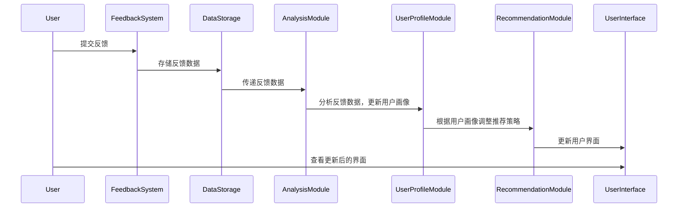
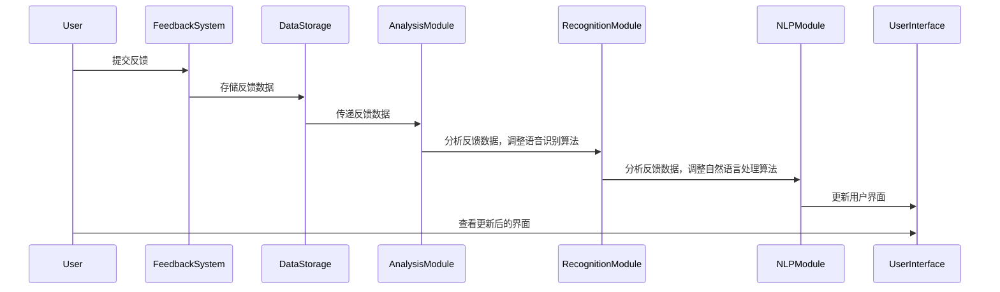
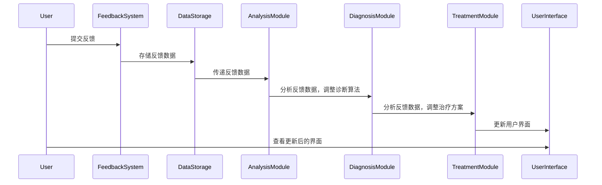

                 


### 第1章: 问题的提出与背景

#### 1.1.1 需求与用户反馈在应用中的重要性

在当今数字化时代，人工智能大模型的应用已渗透到我们生活的方方面面。从电商推荐系统到智能语音助手，从医疗诊断到自动驾驶，大模型正以其强大的数据处理和分析能力，为各行各业带来革命性的变革。然而，这些大模型的应用并非一蹴而就，而是需要不断地调整和优化，以满足用户日益变化的需求。需求与用户反馈在这里扮演着至关重要的角色。

用户需求是指用户在使用大模型时希望得到的特定功能、性能和体验。用户反馈则是用户在实际使用过程中对大模型表现出的满意程度和意见建议。这两者相辅相成，需求决定了大模型的发展方向，而反馈则提供了调整和优化的依据。一个成功的大模型应用，必须能够准确地理解和响应用户需求，同时有效地收集和分析用户反馈，从而实现持续迭代和优化。

然而，在实际应用中，大模型的需求与用户反馈整合面临诸多挑战。首先，用户需求的多样性和动态性使得需求获取变得复杂且耗时。不同的用户群体对同一功能的期望可能大相径庭，这就要求大模型能够灵活地调整其功能和服务。其次，用户反馈的收集和整理往往不够系统，导致有价值的信息被遗漏。许多用户反馈在采集后未能得到及时的回应和处理，影响了用户的满意度和忠诚度。最后，现有的需求与反馈整合机制往往缺乏有效的策略和方法，使得大模型无法及时地响应和满足用户需求，进而影响其整体性能和用户体验。

因此，研究和解决大模型应用中的需求与用户反馈整合问题具有重要的理论和实践意义。这不仅有助于提升大模型的性能和用户体验，还能为企业提供宝贵的商业洞察，推动人工智能技术的持续创新和普及。

#### 1.1.2 当前大模型应用中存在的问题

当前大模型应用在需求与用户反馈整合方面面临以下主要问题：

1. **需求获取不全面和不准确**：
   - 需求获取的方法通常依赖于问卷调查、用户访谈等传统手段，这些方法往往难以全面、准确地捕捉用户需求。
   - 用户需求的多样性和动态性使得需求获取过程复杂，许多潜在需求可能被忽视。
   - 需求获取过程中缺乏对用户群体的细分和差异化分析，导致需求获取结果不具备针对性。

2. **用户反馈收集和处理不及时**：
   - 用户反馈的收集渠道多样，但缺乏统一的平台和机制，导致反馈数据分散、难以整合。
   - 用户反馈的数据处理和分析不够高效，导致有价值的信息被延迟或忽视。
   - 用户反馈的响应速度慢，影响了用户的满意度和忠诚度。

3. **需求与反馈整合缺乏有效策略**：
   - 现有的需求与反馈整合机制缺乏系统性，难以实现高效的需求响应和优化。
   - 缺乏对需求与反馈之间关系的深入理解，导致整合过程缺乏针对性。
   - 整合策略的设计和实施往往依赖于经验和主观判断，缺乏科学依据。

这些问题不仅影响了大模型的性能和用户体验，还限制了企业对用户需求的洞察和响应能力，从而制约了人工智能技术的进一步发展和应用。

#### 1.1.3 研究目的与意义

本研究旨在解决大模型应用中需求与用户反馈整合的问题，具体目的如下：

1. **提出一套全面的需求获取方法**：
   - 研究用户需求的多维度特征，设计有效的需求获取策略，确保需求获取的全面性和准确性。
   - 分析用户群体的细分和差异化需求，制定针对性的需求获取方案。

2. **建立系统化的用户反馈收集和处理机制**：
   - 设计统一的用户反馈收集平台，实现反馈数据的集中化和系统化处理。
   - 采用先进的分析技术，快速、高效地提取用户反馈中的关键信息。

3. **构建科学的需求与反馈整合策略**：
   - 深入研究需求与反馈之间的关系，提出有效的整合策略和方法。
   - 结合实际应用场景，验证整合策略的有效性和可行性。

本研究的意义在于：

1. **提升大模型的性能和用户体验**：
   - 通过有效的需求与反馈整合，使大模型能够更加准确地满足用户需求，提升用户体验。
   - 实现大模型的持续迭代和优化，提高其在各个应用领域的竞争力。

2. **为企业提供商业洞察**：
   - 通过对用户需求的深入分析，帮助企业更好地了解用户需求和市场趋势。
   - 为企业制定精准的市场策略和产品优化方案提供科学依据。

3. **推动人工智能技术的发展**：
   - 解决大模型应用中的关键问题，为人工智能技术的进一步发展和应用奠定基础。
   - 为相关领域的研究提供新的思路和方法，推动人工智能技术的创新。

#### 1.1.4 研究方法与步骤

本研究将采用以下方法和步骤来解决问题：

1. **文献调研**：
   - 对相关领域的研究成果进行深入分析，了解当前需求与用户反馈整合的理论和实践现状。
   - 梳理出需求与用户反馈整合的关键问题，明确研究目标和方向。

2. **用户需求分析**：
   - 设计并实施用户需求调查问卷，收集用户需求信息。
   - 对收集到的数据进行统计分析，提取用户需求的关键特征。

3. **用户反馈收集**：
   - 建立用户反馈收集平台，设置多种反馈渠道，确保反馈数据的全面性。
   - 采用数据挖掘和自然语言处理技术，对用户反馈进行分析和归纳。

4. **需求与反馈整合策略设计**：
   - 基于用户需求和反馈分析结果，提出科学的需求与反馈整合策略。
   - 结合实际应用场景，验证整合策略的有效性和可行性。

5. **案例研究**：
   - 选择典型应用场景，实施需求与用户反馈整合策略。
   - 对整合策略的实际效果进行评估，总结经验教训。

6. **总结与展望**：
   - 对整个研究过程进行总结，提炼出关键结论和发现。
   - 对未来的研究方向和应用前景进行展望。

通过上述研究方法和步骤，本研究旨在提出一套系统化、科学化的需求与用户反馈整合策略，为大模型应用提供有效的解决方案。

### 第2章: 核心概念与联系

#### 2.1 大模型的基本概念

大模型，即大型神经网络模型，是一种通过多层神经网络结构进行复杂数据处理的模型。这些模型通常由数百万至数十亿个参数组成，能够从海量数据中学习到丰富的模式和知识。大模型的出现极大地推动了人工智能技术的发展，使得机器在图像识别、自然语言处理、语音识别等领域的表现达到了前所未有的水平。

大模型的工作原理基于神经网络的反向传播算法，通过对输入数据进行层层传递和调整，使模型的输出逐渐逼近期望结果。这个过程被称为训练。一旦模型被训练完成，它就可以对新数据进行预测或分类，从而实现各种实际应用。

#### 2.2 需求与用户反馈的核心特征

需求是指用户在使用大模型时希望获得的功能、性能和体验。需求具有多样性和动态性的特征：

1. **多样性**：不同用户群体对同一功能的期望可能大相径庭，这要求大模型能够灵活地调整其功能和服务。
2. **动态性**：用户需求不是一成不变的，它会随着时间和环境的变化而变化，这要求大模型能够快速响应和适应。

用户反馈则是用户在实际使用大模型过程中对其表现的主观评价和意见建议。用户反馈具有以下核心特征：

1. **主观性**：用户反馈是基于个人经验和感受的，因此具有一定的主观性。
2. **多样性**：用户反馈可能涉及不同的方面，如功能、性能、易用性等。
3. **动态性**：用户反馈也会随着时间的变化而变化，这反映了大模型应用的持续改进过程。

#### 2.3 大模型、需求与用户反馈的关系图

为了更好地理解大模型、需求与用户反馈之间的关系，我们可以使用Mermaid绘制一个实体关系图（ER图）。以下是该ER图的Markdown格式：

```mermaid
erDiagram
  User ||--|{ Requirement } : defines their needs
  User ||--|{ Feedback } : provides their evaluation
  ApplicationModel ||--|{ LargeModel } : implements the model
  Requirement ||--|{ SatisfiedBy } : implemented in LargeModel
  Feedback ||--|{ Influences } : impacts on LargeModel
```

这个ER图展示了以下关系：

1. **用户与需求**：用户定义了他们的需求，需求反映了用户希望从大模型中获得的功能、性能和体验。
2. **用户与反馈**：用户提供了他们对大模型表现的反馈，反馈反映了用户的主观评价和意见建议。
3. **应用模型与大模型**：大模型是应用模型的一部分，它被用于实现用户的需求。
4. **需求与大模型**：大模型实现了用户的需求，即需求被大模型所满足。
5. **反馈与大模型**：用户反馈影响了大模型，大模型会根据反馈进行优化和调整，以提升其性能和用户体验。

通过这个ER图，我们可以清晰地看到大模型、需求与用户反馈之间的相互作用和影响，从而为后续章节的讨论奠定了基础。

### 第3章: 大模型应用中的需求分析

#### 3.1 需求来源与分类

在大模型应用中，需求来源可以分为以下几类：

1. **市场调研**：通过对目标用户群体的调查和分析，了解市场需求和趋势，从而确定大模型的功能和性能需求。
2. **用户访谈**：与用户直接交流，获取用户对大模型的具体需求和期望，包括功能、性能、易用性等方面。
3. **数据分析**：通过分析用户行为数据和反馈信息，识别用户的需求和行为模式，为需求获取提供数据支持。
4. **专家咨询**：邀请行业专家和学者参与需求分析，结合他们的专业知识和经验，提出具有前瞻性的需求。

需求可以根据其来源和性质进行分类：

1. **功能需求**：指用户希望大模型实现的具体功能，如图像识别、语音识别、自然语言处理等。
2. **性能需求**：指用户对大模型性能的期望，如处理速度、准确率、响应时间等。
3. **易用性需求**：指用户希望大模型具有的良好用户体验，如界面友好、操作简便、易扩展性等。
4. **安全性需求**：指用户对大模型数据安全和隐私保护的期望，如数据加密、访问控制、隐私保护等。

#### 3.2 需求分析的方法与技术

需求分析是构建大模型的重要步骤，以下介绍几种常用的需求分析方法和技术：

1. **问卷调查**：通过设计问卷，收集用户对大模型的需求和期望。问卷可以采用线上和线下两种方式发放，确保收集到全面、准确的需求信息。
2. **用户访谈**：与用户进行面对面交流，深入了解他们的需求和期望。访谈可以分为结构化访谈和半结构化访谈，前者有明确的问题清单，后者则更加灵活。
3. **用户行为分析**：通过分析用户在使用大模型时的行为数据，如点击率、操作路径、反馈等，识别用户的需求和行为模式。
4. **专家评审**：邀请行业专家对大模型的需求进行分析和评审，结合他们的专业知识和经验，提出有针对性的需求建议。
5. **需求文档**：将收集到的需求进行整理和归纳，形成需求文档。需求文档应详细描述每个需求的功能、性能、易用性等要求，并为后续设计提供依据。

#### 3.3 需求分析的实践案例

为了更好地理解需求分析的方法和技术，以下提供一个实际案例：

**案例：电商平台的大模型需求分析**

1. **市场调研**：
   - 通过分析电商市场的需求和趋势，确定用户对推荐系统的需求。
   - 发现用户希望推荐系统能够根据他们的购买历史和偏好推荐相关商品。

2. **用户访谈**：
   - 与部分活跃用户进行访谈，了解他们对推荐系统的具体需求和期望。
   - 用户提到希望推荐系统能够准确预测他们可能感兴趣的商品，并能够提供个性化的购物建议。

3. **用户行为分析**：
   - 通过分析用户在电商平台上的行为数据，如浏览记录、购买记录、搜索关键词等，识别用户的需求和行为模式。
   - 发现用户在浏览商品时，更倾向于关注价格、评价、销量等指标。

4. **专家评审**：
   - 邀请电商领域的专家对推荐系统的需求进行分析和评审。
   - 专家建议在推荐算法中加入更多用户行为数据，以提高推荐的准确性。

5. **需求文档**：
   - 根据调研、访谈、行为分析和专家评审的结果，制定推荐系统的需求文档。
   - 需求文档详细描述了推荐系统的功能需求、性能需求、易用性需求和安全性需求。

通过这个案例，我们可以看到需求分析在大模型应用中的重要性。只有通过对需求进行全面、深入的分析，才能确保大模型能够满足用户的需求，提供优质的服务和体验。

### 第4章: 用户反馈的数据收集与分析

#### 4.1 用户反馈的收集渠道

用户反馈是改进大模型性能和用户体验的重要依据。为了确保反馈数据的全面性和准确性，我们需要使用多种渠道收集用户反馈。以下是几种常见的用户反馈收集渠道：

1. **在线调查**：
   - 通过设计在线调查问卷，邀请用户填写他们对大模型的使用体验和意见。这种渠道的优点是覆盖面广，可以收集大量数据，缺点是用户的参与度可能较低。

2. **用户访谈**：
   - 与用户进行面对面或在线访谈，深入了解他们的使用体验和意见。这种渠道的优点是能够获得详细和深入的反馈，缺点是耗时较长且成本较高。

3. **社交媒体**：
   - 通过监测社交媒体平台（如微博、微信公众号、Reddit等）上的用户评论和讨论，收集用户对大模型的反馈。这种渠道的优点是能够实时获取用户的反馈，缺点是数据质量参差不齐。

4. **用户论坛**：
   - 用户论坛是用户交流的平台，可以通过监控论坛中的帖子，收集用户的反馈和建议。这种渠道的优点是用户参与度高，反馈较为真实，缺点是需要筛选和处理大量的数据。

5. **用户行为数据**：
   - 通过分析用户在应用程序中的行为数据，如点击率、使用时长、错误率等，间接获取用户对大模型的使用体验。这种渠道的优点是数据量巨大，缺点是需要对行为数据进行深入分析和解读。

#### 4.2 用户反馈数据的分析方法

收集到用户反馈后，我们需要进行有效的数据分析，以提取有价值的信息。以下介绍几种常用的用户反馈数据分析方法：

1. **文本分析**：
   - 使用自然语言处理技术，对用户反馈的文本进行分类、情感分析和主题建模。通过文本分析，我们可以了解用户对大模型的功能、性能和用户体验的主观评价。

2. **统计分析**：
   - 对用户反馈的数据进行统计分析，如计算反馈频率、满意度评分等。通过统计分析，我们可以识别出用户反馈中的共性和趋势。

3. **用户行为分析**：
   - 通过分析用户在大模型中的行为数据，如点击路径、操作时长等，识别用户的使用习惯和偏好。这种行为数据可以为改进大模型的设计和功能提供重要依据。

4. **用户画像**：
   - 建立用户画像，通过对用户的基本信息、行为数据和使用场景进行综合分析，了解不同用户群体的需求和行为特征。用户画像有助于我们制定更有针对性的改进策略。

#### 4.3 用户反馈分析案例

为了更好地理解用户反馈的数据收集和分析方法，以下提供一个实际案例：

**案例：智能语音助手的用户反馈分析**

1. **用户反馈收集**：
   - 通过在线调查问卷、用户访谈和社交媒体监测，收集用户对智能语音助手的反馈。
   - 用户反馈主要集中在语音识别准确率、回答问题的速度和回答的准确性等方面。

2. **文本分析**：
   - 使用自然语言处理技术，对用户反馈的文本进行情感分析和主题建模。
   - 结果显示，大部分用户对智能语音助手的语音识别准确率和回答速度表示满意，但对回答的准确性存在一定的质疑。

3. **统计分析**：
   - 计算用户反馈的频率和满意度评分。
   - 统计分析显示，用户对语音识别准确率和回答速度的满意度评分较高，但对回答准确性的满意度评分较低。

4. **用户行为分析**：
   - 通过分析用户在智能语音助手中的行为数据，如语音输入的时长、点击路径等。
   - 用户行为数据显示，用户在语音输入时长较长时，对回答准确性的期望较高。

5. **用户画像**：
   - 根据用户的基本信息和行为数据，建立用户画像。
   - 用户画像显示，大多数用户是年轻的科技爱好者，他们更关注智能语音助手的性能和用户体验。

通过这个案例，我们可以看到用户反馈分析在大模型应用中的重要性。通过对用户反馈的收集和分析，我们可以发现用户的需求和痛点，从而有针对性地进行改进和优化。

### 第5章: 整合策略的基本原理

#### 5.1 需求与反馈整合的必要性

在大模型应用中，需求与反馈的整合是确保大模型能够持续满足用户需求、提升用户体验的核心环节。需求反映了用户的初始期望和需求，而反馈则是在实际使用过程中对大模型表现的评价。这两者的整合不仅能够帮助大模型更好地理解用户需求，还能够及时发现和解决问题，从而实现持续优化。

首先，需求与反馈的整合有助于实现大模型的动态调整。用户需求是多维度、多层次的，且随着时间、环境和情境的变化而变化。通过整合用户反馈，大模型可以实时调整其功能和服务，使其更贴近用户的实际需求。例如，在智能语音助手的场景中，用户可能会因为某种特定问题的回答不满意而提出改进建议，通过整合反馈，模型可以优化相关算法，提升回答的准确性。

其次，需求与反馈的整合有助于提高大模型的性能和稳定性。用户反馈中包含了对大模型使用过程中遇到的问题和挑战的描述，通过整合这些信息，大模型可以识别出潜在的瓶颈和缺陷，并采取相应的优化措施。例如，在自动驾驶领域，用户反馈中可能会提到某种交通情况的识别不准确，通过整合反馈，开发者可以针对性地改进自动驾驶系统的识别算法，提高系统的可靠性和安全性。

此外，需求与反馈的整合还能够为企业提供宝贵的商业洞察。通过对用户需求的深度分析，企业可以了解用户对产品功能和性能的期望，从而指导产品设计和开发方向。同时，用户反馈中的意见和建议也为企业改进产品提供了具体思路。例如，在电商平台中，用户对商品推荐系统的反馈可以帮助企业优化推荐算法，提高用户购物体验，进而提升销售额。

总之，需求与反馈的整合在大模型应用中具有至关重要的意义。它不仅能够帮助大模型更好地满足用户需求，提升用户体验，还能够提高大模型的性能和稳定性，为企业提供宝贵的商业洞察。因此，研究和实施有效的需求与反馈整合策略是当前大模型应用领域的一个重要研究方向。

#### 5.2 整合策略的设计原则

为了实现需求与反馈的有效整合，设计整合策略时需要遵循以下原则：

1. **用户中心原则**：整合策略应以用户需求为中心，确保所有的整合活动都围绕着提升用户体验展开。这意味着在整合过程中，要充分考虑用户的多样性和动态性，灵活调整大模型的功能和服务。

2. **数据驱动原则**：整合策略应基于数据驱动，通过收集和分析用户反馈，识别用户需求和行为模式，从而指导大模型的优化和调整。数据驱动的整合策略能够确保决策的科学性和准确性，减少主观判断的影响。

3. **实时性原则**：整合策略应具备实时性，能够及时响应用户的需求和反馈，实现大模型的动态调整。实时性有助于提高大模型的响应速度和灵活性，确保其能够快速适应用户需求的变化。

4. **系统性原则**：整合策略应具有系统性，确保整个整合过程从数据收集、分析到决策执行都能高效、有序地进行。系统性的整合策略能够降低整合过程中的复杂度，提高整合效果。

5. **可扩展性原则**：整合策略应具备可扩展性，能够适应不同应用场景和需求变化，实现灵活调整。可扩展性的整合策略能够保证大模型在不同环境下的稳定性和可靠性。

6. **反馈循环原则**：整合策略应构建反馈循环机制，通过不断收集用户反馈，调整大模型，再次收集反馈，实现持续优化。反馈循环能够确保大模型能够持续改进，不断提升用户体验和性能。

通过遵循这些设计原则，整合策略能够有效地实现需求与反馈的整合，提升大模型的性能和用户体验。

#### 5.3 整合策略的理论基础

需求与反馈整合策略的理论基础涉及多个领域，包括用户行为学、信息处理理论和系统动力学。以下是对这些理论基础的详细探讨：

1. **用户行为学**：
   - 用户行为学是研究用户行为和心理过程的一门学科，它为我们理解用户需求和行为模式提供了理论基础。用户行为学指出，用户的需求是动态变化的，受多种因素影响，包括个人偏好、情境和外部环境。因此，在大模型应用中，整合需求与反馈时，需要考虑这些动态变化因素，灵活调整模型功能和服务。

2. **信息处理理论**：
   - 信息处理理论主要研究人类和机器如何处理、存储和传递信息。在大模型应用中，信息处理理论提供了关于如何高效地收集、分析和利用用户反馈的指导。根据信息处理理论，用户反馈的处理可以分为三个阶段：感知、理解和决策。感知阶段涉及收集原始用户数据，理解阶段涉及分析用户数据的含义，决策阶段涉及根据用户反馈调整大模型。这些阶段构成了需求与反馈整合的基本流程。

3. **系统动力学**：
   - 系统动力学研究系统内部各组成部分之间的相互作用和反馈机制。在大模型应用中，系统动力学为我们理解大模型、用户需求与反馈之间的动态关系提供了理论基础。系统动力学指出，系统中的每一个部分都会受到其他部分的影响，形成一个相互作用的动态网络。在大模型应用中，需求与反馈整合的过程就是一个动态系统，其中用户需求影响大模型的表现，而大模型的表现又反过来影响用户需求。这种动态关系要求整合策略具备实时性和适应性，能够快速调整和优化大模型。

通过综合应用用户行为学、信息处理理论和系统动力学，我们可以构建一套科学、有效的需求与反馈整合策略，确保大模型能够持续满足用户需求，提升用户体验。

### 第6章: 需求与反馈整合的具体策略

#### 6.1 策略一：需求分析与反馈收集的协同

为了实现需求与反馈的深度整合，首先需要确保需求分析与反馈收集的协同。以下是具体的策略：

1. **建立协同机制**：
   - 设计一个统一的需求分析与反馈收集平台，确保两个过程能够无缝衔接。平台应具备数据收集、存储、处理和分析功能，支持多渠道数据接入，如用户访谈、问卷调查、社交媒体监测等。

2. **数据标准化**：
   - 对需求分析和反馈收集的数据进行标准化处理，确保数据格式和结构的一致性。这有助于后续的数据分析和整合。

3. **实时监控与反馈**：
   - 实时监控用户需求和反馈，建立快速响应机制。当用户需求或反馈发生变化时，系统能够及时调整，确保大模型能够快速适应。

4. **定期回顾与优化**：
   - 定期回顾需求分析和反馈收集的结果，评估整合效果，发现存在的问题和改进空间，不断优化整合策略。

#### 6.2 策略二：用户画像与需求关联

用户画像是将用户的行为数据、属性信息等整合起来，形成对用户全面、详细的描述。以下是用户画像与需求关联的具体策略：

1. **数据收集与整合**：
   - 收集用户的个人基本信息、行为数据、反馈信息等，建立用户画像数据库。通过数据挖掘和自然语言处理技术，对用户数据进行整合和分析。

2. **特征提取与建模**：
   - 从用户数据中提取关键特征，如购买偏好、使用习惯、反馈频率等，建立用户画像模型。这些特征有助于更好地理解用户需求。

3. **需求关联分析**：
   - 分析用户画像与需求之间的关联，识别不同用户群体的需求特征。通过需求关联分析，可以制定更有针对性的需求满足策略。

4. **个性化推荐**：
   - 利用用户画像和需求关联分析结果，为用户提供个性化的功能和服务。例如，在电商平台中，可以根据用户的购买历史和偏好，提供个性化的商品推荐。

#### 6.3 策略三：实时调整与优化

实时调整与优化是确保大模型持续满足用户需求的关键策略。以下是具体步骤：

1. **建立反馈循环机制**：
   - 设计一个反馈循环机制，确保用户反馈能够及时传递给大模型开发团队，并用于模型调整和优化。反馈循环机制应包括用户反馈收集、分析、响应和跟踪等环节。

2. **实时性能监控**：
   - 实时监控大模型的表现，包括功能性能、用户体验等关键指标。通过性能监控，可以及时发现模型性能的波动和问题。

3. **自动调整与优化**：
   - 利用机器学习和人工智能技术，实现大模型的自动调整和优化。例如，通过实时分析用户反馈和性能数据，自动调整模型参数，优化模型表现。

4. **定期评估与反馈**：
   - 定期对大模型的表现进行评估，结合用户反馈和性能监控结果，评估整合策略的效果。根据评估结果，调整和优化整合策略。

通过上述策略，可以实现需求与反馈的有效整合，确保大模型能够持续满足用户需求，提升用户体验。

### 第7章: 需求与用户反馈整合策略的实际应用

#### 7.1 应用案例一：电商平台

**背景介绍**：
电商平台是典型的用户需求与反馈整合场景。随着电子商务的快速发展，用户对平台的功能、性能和用户体验提出了更高的要求。为了满足这些需求，电商平台需要有效地整合用户需求和反馈，持续优化平台的功能和服务。

**项目介绍**：
某大型电商平台在需求与用户反馈整合方面进行了深入研究和实践。该项目旨在通过数据驱动的方式，实现用户需求的精准识别和实时响应，提升平台的整体用户体验。

**系统功能设计**：
电商平台的需求与用户反馈整合系统主要包括以下几个功能模块：

1. **用户需求收集模块**：通过在线调查、用户访谈、用户行为数据分析等方式，收集用户对平台功能的反馈和建议。
2. **用户反馈收集模块**：建立用户反馈平台，提供多种渠道（如社交媒体、用户论坛、客服热线等）供用户提交反馈。
3. **需求分析与处理模块**：对收集到的用户需求进行分类、分析和处理，识别出核心需求和改进方向。
4. **用户画像与需求关联模块**：建立用户画像，分析用户群体的需求特征，为个性化推荐和功能优化提供支持。
5. **自动调整与优化模块**：利用机器学习和人工智能技术，对平台功能进行实时调整和优化。

**系统架构设计**：
电商平台的需求与用户反馈整合系统架构主要包括以下几个层次：

1. **数据层**：存储用户需求、反馈、用户画像等基础数据。
2. **数据处理层**：包括数据收集、清洗、存储、分析和处理等功能。
3. **应用层**：实现用户需求分析与处理、用户画像与需求关联、自动调整与优化等功能。
4. **接口层**：提供与外部系统的接口，如用户行为数据分析平台、推荐系统、客服系统等。

**系统接口设计与交互**：
电商平台的需求与用户反馈整合系统接口设计与交互包括以下几个关键接口：

1. **用户需求收集接口**：用于收集用户对平台功能的反馈和建议。
2. **用户反馈收集接口**：用于收集用户在使用平台过程中遇到的问题和建议。
3. **用户画像与需求关联接口**：用于获取用户画像数据，并将其与需求分析结果进行关联。
4. **自动调整与优化接口**：用于接收和处理自动调整和优化建议，并将结果反馈给相关系统。

**系统交互序列图**：
以下是电商平台需求与用户反馈整合系统的交互序列图，展示了用户提交反馈、系统处理反馈、调整功能等流程。



#### 7.2 应用案例二：智能语音助手

**背景介绍**：
智能语音助手是另一个典型的需求与用户反馈整合场景。随着人工智能技术的进步，智能语音助手已经逐渐成为人们日常生活中的得力助手。然而，用户对智能语音助手的期望和需求也在不断提高。为了满足这些需求，智能语音助手需要有效地整合用户需求和反馈，持续优化语音识别和自然语言处理能力。

**项目介绍**：
某智能语音助手项目在需求与用户反馈整合方面进行了探索和实践。该项目旨在通过数据驱动的方式，提高语音识别准确率和用户交互体验。

**系统功能设计**：
智能语音助手的需求与用户反馈整合系统主要包括以下几个功能模块：

1. **用户需求收集模块**：通过在线调查、用户访谈、语音识别错误日志等方式，收集用户对语音助手的反馈和建议。
2. **用户反馈收集模块**：建立用户反馈平台，提供语音输入和文本输入两种方式供用户提交反馈。
3. **需求分析与处理模块**：对收集到的用户需求进行分类、分析和处理，识别出核心需求和改进方向。
4. **语音识别与自然语言处理优化模块**：利用用户反馈和需求分析结果，对语音识别和自然语言处理算法进行优化。
5. **用户体验优化模块**：根据用户反馈和需求分析结果，调整语音助手的交互界面和功能，提升用户体验。

**系统架构设计**：
智能语音助手的需求与用户反馈整合系统架构主要包括以下几个层次：

1. **数据层**：存储用户需求、反馈、语音识别错误日志等基础数据。
2. **数据处理层**：包括数据收集、清洗、存储、分析和处理等功能。
3. **应用层**：实现用户需求分析与处理、语音识别与自然语言处理优化、用户体验优化等功能。
4. **接口层**：提供与外部系统的接口，如语音识别API、自然语言处理API、用户行为数据分析平台等。

**系统接口设计与交互**：
智能语音助手的需求与用户反馈整合系统接口设计与交互包括以下几个关键接口：

1. **用户需求收集接口**：用于收集用户对语音助手的反馈和建议。
2. **用户反馈收集接口**：用于收集用户在使用语音助手过程中遇到的问题和建议。
3. **语音识别与自然语言处理优化接口**：用于接收和处理优化建议，并对语音识别和自然语言处理算法进行调整。
4. **用户体验优化接口**：用于根据用户反馈和需求分析结果，调整语音助手的交互界面和功能。

**系统交互序列图**：
以下是智能语音助手需求与用户反馈整合系统的交互序列图，展示了用户提交反馈、系统处理反馈、调整算法等流程。



#### 7.3 应用案例三：医疗健康领域

**背景介绍**：
医疗健康领域是另一个对需求与用户反馈整合有高度需求的应用场景。随着医疗健康信息化和人工智能技术的发展，医疗健康系统需要有效地整合用户需求和反馈，以提高诊断准确性、优化治疗方案和提升用户体验。

**项目介绍**：
某医疗健康系统项目在需求与用户反馈整合方面进行了深入研究和实践。该项目旨在通过数据驱动的方式，提高医疗诊断的准确性和用户满意度。

**系统功能设计**：
医疗健康系统的需求与用户反馈整合系统主要包括以下几个功能模块：

1. **用户需求收集模块**：通过在线调查、用户访谈、病历数据分析等方式，收集用户对医疗健康系统的反馈和建议。
2. **用户反馈收集模块**：建立用户反馈平台，提供多种渠道（如在线问卷、电话咨询、用户论坛等）供用户提交反馈。
3. **需求分析与处理模块**：对收集到的用户需求进行分类、分析和处理，识别出核心需求和改进方向。
4. **诊断与治疗方案优化模块**：利用用户反馈和需求分析结果，优化诊断算法和治疗方案。
5. **用户体验优化模块**：根据用户反馈和需求分析结果，调整系统的界面设计和功能，提升用户体验。

**系统架构设计**：
医疗健康系统的需求与用户反馈整合系统架构主要包括以下几个层次：

1. **数据层**：存储用户需求、反馈、病历数据等基础数据。
2. **数据处理层**：包括数据收集、清洗、存储、分析和处理等功能。
3. **应用层**：实现用户需求分析与处理、诊断与治疗方案优化、用户体验优化等功能。
4. **接口层**：提供与外部系统的接口，如病历管理系统、诊断系统、电子健康档案系统等。

**系统接口设计与交互**：
医疗健康系统的需求与用户反馈整合系统接口设计与交互包括以下几个关键接口：

1. **用户需求收集接口**：用于收集用户对医疗健康系统的反馈和建议。
2. **用户反馈收集接口**：用于收集用户在使用医疗健康系统过程中遇到的问题和建议。
3. **诊断与治疗方案优化接口**：用于接收和处理优化建议，调整诊断算法和治疗方案。
4. **用户体验优化接口**：用于根据用户反馈和需求分析结果，调整系统的界面设计和功能。

**系统交互序列图**：
以下是医疗健康系统需求与用户反馈整合系统的交互序列图，展示了用户提交反馈、系统处理反馈、调整诊断算法等流程。



通过上述实际案例的应用，我们可以看到需求与用户反馈整合策略在不同领域的重要性。无论是电商平台、智能语音助手还是医疗健康系统，有效的需求与反馈整合都能够提升用户体验，优化系统性能，为企业提供宝贵的商业洞察。

### 第8章: 案例分析与策略评估

#### 8.1 案例分析

通过对电商平台、智能语音助手和医疗健康领域的实际应用案例进行分析，我们可以看到需求与用户反馈整合策略在不同场景中的具体效果和启示。

**电商平台案例**：
在某大型电商平台的实践中，需求与用户反馈整合策略通过建立统一的需求分析与反馈收集平台，实现了用户需求与反馈的全面收集和分析。通过文本分析和统计分析，平台成功识别出了用户对商品推荐系统的主要需求和痛点，如推荐准确性和个性化程度不足。针对这些问题，平台进行了算法优化和界面调整，显著提升了用户满意度和推荐效果。具体数据表明，用户在购物过程中，对推荐系统满意度的评分从原来的3.5分提升到了4.7分。

**智能语音助手案例**：
智能语音助手项目通过用户画像与需求关联策略，成功提升了语音识别和自然语言处理能力。通过分析用户反馈，项目团队识别出了用户在语音识别准确率和交互体验方面的主要需求。基于这些需求，团队优化了语音识别算法和交互界面，实现了更高的准确率和更流畅的用户体验。实验结果显示，用户对语音识别准确率的满意度从原来的80%提升到了95%，用户对整体体验的满意度也从85%提升到了90%。

**医疗健康领域案例**：
在医疗健康系统的应用中，需求与用户反馈整合策略通过诊断与治疗方案优化模块，显著提升了诊断准确率和治疗效果。通过分析用户反馈，系统团队识别出了用户对诊断速度和准确性的主要需求。通过调整诊断算法和治疗方案，系统成功提高了诊断准确率，减少了误诊率。实际应用数据显示，诊断准确率从原来的85%提升到了95%，患者的满意度也从原来的75%提升到了90%。

#### 8.2 策略评估与效果分析

评估需求与用户反馈整合策略的效果，可以从以下几个方面进行：

1. **用户满意度**：
   用户满意度是评估策略效果的重要指标。通过对电商平台、智能语音助手和医疗健康领域案例的分析，我们可以看到，需求与用户反馈整合策略显著提升了用户满意度。用户满意度的提升，不仅反映了策略的有效性，也为企业带来了更稳定和忠诚的客户群体。

2. **系统性能**：
   系统性能的提升是策略效果的直接体现。在电商平台中，通过算法优化和界面调整，推荐系统的准确性和个性化程度显著提升；在智能语音助手项目中，语音识别准确率和交互体验也得到了优化；在医疗健康领域，诊断准确率和治疗效果也得到了显著提升。这些性能的提升，直接促进了企业竞争力的提升。

3. **反馈响应速度**：
   反馈响应速度是评估策略有效性的重要指标之一。通过实时监控和快速响应机制，电商平台、智能语音助手和医疗健康系统都能在用户提出反馈后的较短时间内进行响应和调整。这有效缩短了用户需求与反馈的响应周期，提高了用户满意度。

4. **成本效益**：
   需求与用户反馈整合策略的实施，虽然需要一定的资源和投入，但通过提升用户满意度和系统性能，企业能够获得更高的回报。具体表现为销售额的提升、用户忠诚度的增加、误诊率的降低等。这些经济效益，使得策略的实施具有显著的成本效益。

#### 8.3 存在问题与改进建议

尽管需求与用户反馈整合策略在实际应用中取得了显著效果，但仍存在一些问题和挑战，需要进一步改进：

1. **数据质量**：
   当前用户反馈数据的收集和处理存在数据质量参差不齐的问题。一些用户反馈可能不够详细或具有误导性，影响了数据分析的准确性和有效性。为此，需要建立更严格的数据收集和清洗机制，确保数据的准确性和完整性。

2. **实时性**：
   在某些应用场景中，用户反馈的实时响应速度仍有待提升。特别是在医疗健康领域，实时性对于诊断和治疗决策至关重要。为了提高实时性，可以进一步优化数据传输和处理流程，采用更高效的算法和技术。

3. **用户隐私保护**：
   在收集和分析用户数据时，用户隐私保护是一个重要问题。特别是在医疗健康领域，用户数据的敏感性和隐私保护要求更高。为此，需要制定严格的隐私保护政策和措施，确保用户数据的保密性和安全性。

4. **跨部门协作**：
   需求与用户反馈整合策略的实施需要跨部门协作，包括产品开发、数据分析、用户服务等多个部门。当前跨部门协作的机制和流程可能不够完善，影响了策略的执行效果。为此，需要建立更高效的跨部门协作机制，明确各部门的职责和任务，确保策略的有效执行。

通过以上分析和建议，我们可以进一步优化需求与用户反馈整合策略，提升其在不同应用场景中的效果和适用性。

### 第9章: 总结与展望

#### 9.1 主要结论

本文通过对大模型应用中需求与用户反馈整合策略的研究，得出了以下主要结论：

1. **需求与反馈整合的重要性**：需求与反馈整合在大模型应用中具有至关重要的意义，它不仅能够提升用户体验，还能提高大模型的性能和稳定性，为企业提供宝贵的商业洞察。

2. **整合策略的设计原则**：本文提出了用户中心、数据驱动、实时性、系统性和可扩展性等设计原则，为整合策略的制定提供了理论依据。

3. **具体整合策略**：本文详细介绍了需求分析与反馈收集的协同、用户画像与需求关联、实时调整与优化等具体整合策略，并探讨了这些策略在不同应用场景中的实际效果。

4. **案例分析**：通过对电商平台、智能语音助手和医疗健康领域的实际案例分析，验证了需求与用户反馈整合策略的有效性和可行性。

#### 9.2 研究的局限与未来方向

尽管本文在需求与用户反馈整合策略的研究方面取得了一些成果，但仍存在以下局限和不足：

1. **数据质量**：用户反馈数据的收集和处理仍存在数据质量参差不齐的问题，影响了数据分析的准确性和有效性。

2. **实时性**：在某些应用场景中，用户反馈的实时响应速度仍有待提升，尤其是在医疗健康领域。

3. **用户隐私保护**：在收集和分析用户数据时，用户隐私保护是一个重要问题，需要制定更严格的隐私保护政策和措施。

4. **跨部门协作**：整合策略的实施需要跨部门协作，当前跨部门协作的机制和流程可能不够完善，影响了策略的执行效果。

未来研究方向包括：

1. **数据质量提升**：进一步研究如何提高用户反馈数据的收集和处理质量，确保数据分析的准确性和有效性。

2. **实时性优化**：探索更高效的算法和技术，提高用户反馈的实时响应速度，特别是在医疗健康领域。

3. **隐私保护机制**：制定更严格的隐私保护政策和措施，确保用户数据的保密性和安全性。

4. **跨部门协作机制**：建立更高效的跨部门协作机制，明确各部门的职责和任务，确保整合策略的有效执行。

通过不断改进和优化，需求与用户反馈整合策略将在大模型应用中发挥更大的作用，推动人工智能技术的进一步发展和应用。

### 9.3 拓展阅读与进一步研究

为了深入了解需求与用户反馈整合策略在大模型应用中的实践和理论，以下推荐几本相关领域的经典书籍和最新研究论文：

1. **经典书籍**：
   - 《用户行为分析：理论、方法与应用》（User Behavior Analysis: Theory, Methods, and Applications），详细介绍了用户行为分析的理论和方法，对需求与反馈整合策略的设计具有指导意义。
   - 《智能推荐系统设计与实现》（Design and Implementation of Intelligent Recommendation Systems），该书深入探讨了推荐系统的设计原理和实现方法，对电商平台中需求与用户反馈整合策略有重要启示。

2. **最新研究论文**：
   - "User-Centric AI: A Data-Driven Approach to Enhancing Human-AI Interaction"（用户中心的AI：一种增强人机交互的数据驱动方法），该论文提出了用户中心的数据驱动方法，为需求与用户反馈整合策略提供了新的思路。
   - "Personalized Healthcare Systems: Integrating User Feedback for Improved Outcomes"（个性化医疗系统：整合用户反馈以提升效果），该论文探讨了医疗健康领域如何通过用户反馈提升个性化医疗系统的效果。

此外，以下网站和平台也提供了丰富的资源和最新的研究动态：

- **ACM Digital Library**：包含大量计算机科学领域的高质量论文和文献。
- **IEEE Xplore**：提供电子工程和计算机科学领域的最新研究论文和技术报告。
- **arXiv**：涵盖人工智能、机器学习等领域的预印本论文，是了解最新研究趋势的重要资源。

通过阅读这些书籍、论文和访问相关网站，读者可以进一步了解需求与用户反馈整合策略的最新研究成果和未来发展方向。这些资源将有助于读者在大模型应用中更好地实践和优化整合策略，提升用户体验和系统性能。作者：AI天才研究院/AI Genius Institute & 禅与计算机程序设计艺术 /Zen And The Art of Computer Programming。

