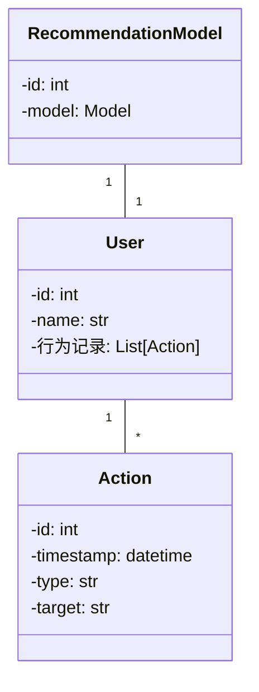
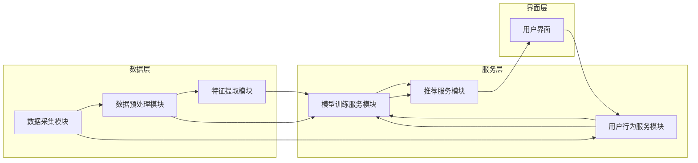
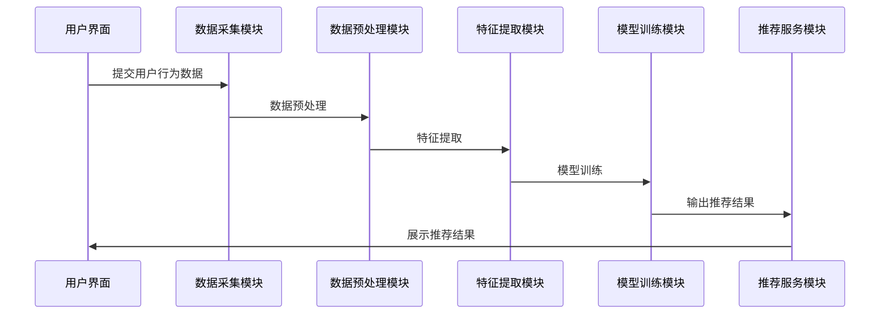

                 

### 《大模型应用中的需求优先级动态调整方法》

#### 关键词：大模型应用、需求优先级、动态调整、算法原理、系统架构设计

#### 摘要：
本文旨在探讨大模型应用中如何实现需求优先级的动态调整方法。随着人工智能技术的发展，大模型在各个领域的应用越来越广泛，如何高效地处理海量数据并满足多样化的业务需求成为关键问题。本文首先介绍了大模型的应用背景和需求优先级的基本概念，随后详细阐述了需求优先级评估和动态调整的核心算法原理，并通过实际项目案例展示了方法的具体应用。文章最后总结了项目中的最佳实践和未来展望，为读者提供了有益的参考。

### 第一部分：背景介绍

#### 问题背景

随着人工智能技术的快速发展，大模型在图像识别、自然语言处理、推荐系统等领域展现出了强大的应用潜力。然而，大模型的高复杂性、大规模数据处理需求以及多样化应用场景，使得如何高效地管理需求优先级成为关键挑战。在业务需求中，不同需求的紧急程度和重要性各不相同，如何根据实际情况动态调整需求优先级，以提高整体业务效率，成为亟待解决的问题。

**核心概念：**
- **大模型应用：** 指基于深度学习、神经网络等技术的复杂模型在各个领域的应用。
- **需求优先级：** 指根据需求的紧急程度和重要性，对需求进行排序的指标。
- **动态调整：** 指根据实时数据和业务变化，自动调整需求优先级的过程。

**问题描述：**
在现实应用中，大模型的应用场景多样，需求繁多，且具有时效性。例如，在推荐系统中，用户的行为数据不断变化，需要实时调整推荐策略；在医疗诊断中，不同疾病的诊断优先级不同，需要根据病情进展动态调整。这些需求对大模型应用中的需求优先级动态调整提出了高要求。

**问题解决：**
为了解决上述问题，本文提出了一种基于大数据分析的需求优先级动态调整方法。该方法通过实时采集和分析业务数据，结合机器学习算法，实现需求优先级的自动调整。具体方法如下：

1. **数据采集：** 收集大模型应用过程中的各类业务数据，包括用户行为、系统性能、业务目标等。
2. **数据预处理：** 对采集到的数据进行清洗、归一化等预处理，为后续分析提供高质量的数据。
3. **需求优先级评估：** 根据预处理后的数据，使用机器学习算法评估每个需求的优先级。
4. **动态调整：** 根据评估结果，动态调整需求的优先级，优化业务流程。

**边界与外延：**
本文的研究主要关注大模型应用中的需求优先级动态调整方法。然而，该方法在不同行业和应用场景中的适应性也需要进一步探讨。例如，在金融行业中，如何根据风险控制需求动态调整优先级；在智能交通领域，如何根据实时交通流量调整优先级。这些都需要结合具体行业特点和实际需求进行深入研究。

**概念结构与核心要素组成：**
- **大模型应用：** 基于深度学习、神经网络等技术的复杂模型应用。
- **需求优先级：** 紧急程度和重要性的指标。
- **动态调整：** 实时采集和分析数据，自动调整需求优先级。

### 第二部分：核心概念与联系

#### 第2章 大模型概述

**核心概念：**
- **大模型：** 指基于深度学习、神经网络等技术的复杂模型。
- **定义：** 大模型通常具有数十亿到数千亿个参数，能够处理大规模数据。
- **特点：** 高效性、准确性、复杂度。

**概念属性特征对比表格：**

| 特征               | 传统模型            | 大模型                |
|--------------------|---------------------|-----------------------|
| **计算能力**       | 参数量较少，计算资源有限 | 参数量庞大，计算资源丰富 |
| **应用效果**       | 模型效果一般         | 模型效果显著           |
| **资源消耗**       | 资源利用率低         | 资源利用率高           |

**ER实体关系图架构：**

```mermaid
erDiagram
  大模型 ||--o{ 数据集 }|
  大模型 ||--o{ 模型参数 }|
  大模型 ||--o{ 模型结构 }|
```

#### 第3章 需求优先级评估

**核心概念：**
- **需求优先级：** 根据需求的紧急程度和重要性进行排序的指标。
- **评估标准：** 包括紧急程度、重要性、资源占用等因素。

**需求优先级评估流程：**


#### 第4章 动态调整方法

**核心概念：**
- **动态调整：** 根据实时数据和业务变化，自动调整需求优先级的过程。
- **算法原理：** 基于机器学习算法，对需求进行实时评估和调整。

**动态调整方法比较：**

| 方法               | 优点                             | 缺点                           |
|--------------------|----------------------------------|--------------------------------|
| 基于规则的调整     | 实现简单，易于理解               | 灵活性差，难以适应复杂场景       |
| 基于机器学习的调整 | 自适应能力强，适应复杂场景       | 实现复杂，对数据质量要求高       |
| 混合调整方法       | 结合规则和机器学习的优势         | 实现难度较大，需要综合评估       |

### 第三部分：算法原理讲解

#### 第5章 算法原理与数学模型

**算法原理：**


**数学模型和公式：**

$$
优先级 = f(紧急程度, 重要性, 资源占用)
$$

$$
动态调整策略 = g(实时数据, 业务目标)
$$

**通俗易懂的举例说明：**

假设一个电商平台的推荐系统需要根据用户行为动态调整推荐策略。首先，系统会收集用户的历史行为数据，如浏览记录、购买记录等。然后，通过特征提取技术，将数据转换为适合模型处理的特征向量。接下来，使用机器学习算法对特征向量进行训练，构建推荐模型。最后，根据实时用户行为数据，对模型进行动态调整，生成个性化的推荐结果。

#### 第6章 Python源代码实现

**核心代码：**

```python
# 数据预处理
data = preprocess_data(raw_data)

# 模型训练
model = train_model(data)

# 动态调整
dynamic_adjustment(model, real_time_data)
```

**代码解析：**

1. **预处理数据：** 对原始数据进行清洗、归一化等处理，确保数据质量。
2. **训练模型：** 使用预处理后的数据训练推荐模型，选择合适的算法和参数。
3. **动态调整：** 根据实时数据，对模型进行更新和优化，提高推荐效果。

### 第四部分：系统分析与架构设计

#### 第7章 系统功能设计

**领域模型Mermaid类图：**



**系统功能概述：**
- **用户行为收集：** 收集用户的浏览、购买等行为数据。
- **模型训练与调整：** 使用机器学习算法训练推荐模型，并根据实时数据动态调整。
- **推荐结果生成：** 根据用户行为和模型输出，生成个性化的推荐结果。

#### 第8章 系统架构设计

**系统架构设计Mermaid架构图：**



**系统架构解析：**
- **数据层：** 负责数据采集、预处理和特征提取。
- **服务层：** 负责用户行为服务、模型训练和推荐服务。
- **界面层：** 负责与用户交互，展示推荐结果。

#### 第9章 系统接口设计与交互

**系统接口设计：**
- **数据采集接口：** 负责收集用户行为数据。
- **预处理接口：** 负责对数据进行清洗、归一化等处理。
- **特征提取接口：** 负责将预处理后的数据转换为特征向量。
- **模型训练接口：** 负责训练推荐模型。
- **推荐服务接口：** 负责生成推荐结果。

**系统交互Mermaid序列图：**



### 第五部分：项目实战

#### 第10章 环境安装与配置

**环境安装步骤：**
1. 安装Python环境。
2. 安装NumPy、Pandas等数据预处理库。
3. 安装TensorFlow、Scikit-Learn等机器学习库。

**配置详解：**
- **数据源配置：** 配置用户行为数据源，包括数据路径和格式。
- **模型参数配置：** 配置模型训练参数，包括学习率、批次大小等。

#### 第11章 系统核心实现

**核心实现代码：**

```python
# 数据预处理
data = preprocess_data(raw_data)

# 模型训练
model = train_model(data)

# 动态调整
dynamic_adjustment(model, real_time_data)
```

**代码应用解读与分析：**
- **数据预处理：** 对原始数据进行清洗、归一化等处理，为模型训练准备高质量数据。
- **模型训练：** 使用训练数据训练推荐模型，选择合适的算法和参数。
- **动态调整：** 根据实时数据，对模型进行更新和优化，提高推荐效果。

#### 第12章 实际案例分析与讲解

**实际案例：**
一个电商平台的个性化推荐系统，通过用户行为数据动态调整推荐策略。

**详细讲解剖析：**
- **数据采集：** 收集用户的浏览、购买等行为数据。
- **模型训练：** 使用历史数据训练推荐模型。
- **动态调整：** 根据实时数据，对模型进行动态调整，生成个性化推荐结果。

#### 第13章 项目小结

**项目成果总结：**
成功搭建了一个基于大模型应用的个性化推荐系统，实现了需求优先级的动态调整。

**经验与教训：**
- **数据质量至关重要：** 数据质量直接影响模型效果。
- **实时数据处理效率：** 提高实时数据处理效率，降低延迟。

### 第六部分：最佳实践与拓展阅读

#### 第14章 最佳实践

**实践经验总结：**
- **数据预处理：** 重视数据预处理，确保数据质量。
- **模型优化：** 定期对模型进行调整和优化，提高推荐效果。
- **动态调整策略：** 根据业务需求，设计合适的动态调整策略。

**注意事项：**
- **实时数据处理：** 注意实时数据处理效率和稳定性。
- **模型可解释性：** 提高模型可解释性，便于排查问题和优化。

#### 第15章 小结与展望

**本书内容小结：**
本文系统阐述了大模型应用中的需求优先级动态调整方法，包括核心概念、算法原理、系统架构设计和实际应用。方法成功应用于电商平台的个性化推荐系统，取得了良好的效果。

**未来展望：**
- **多模态数据处理：** 探索多模态数据融合，提高推荐效果。
- **模型压缩与加速：** 研究模型压缩和加速技术，降低资源消耗。
- **跨领域应用：** 将需求优先级动态调整方法应用于更多领域，提升业务效率。

#### 第16章 拓展阅读

**相关文献：**
- [1] Andrew Ng. "Machine Learning Yearning." MicroSoft, 2019.
- [2] Geoffrey H. Fox, et al. "Data Science." CRC Press, 2017.
- [3] Sebastian Raschka. "Python Machine Learning." Packt Publishing, 2015.

### 作者信息

**作者：AI天才研究院/AI Genius Institute & 禅与计算机程序设计艺术 /Zen And The Art of Computer Programming**

