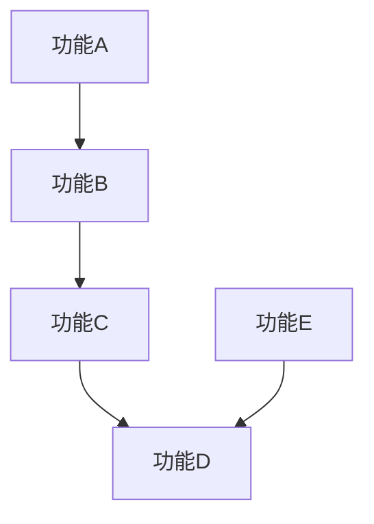

                 

### 大模型应用中的需求依赖关系管理

#### 关键词：需求依赖关系，大模型，需求工程，管理方法，应用案例分析

#### 摘要：
本文深入探讨了在大模型应用中，如何进行有效的需求依赖关系管理。首先，介绍了大模型和需求依赖关系的背景，强调了需求依赖关系管理在复杂系统设计中的重要性。随后，详细阐述了需求依赖关系的相关理论、建模方法和分析流程。最后，通过实际案例，展示了需求依赖关系管理在大模型应用中的实践效果，并提出了未来研究方向。

----------------------------------------------------------------

## 引言与背景

### 1.1 问题的提出

在大模型应用领域，随着数据规模和复杂度的增加，如何有效地管理需求依赖关系成为了一个亟待解决的问题。大模型通常涉及大量的需求，这些需求之间存在着复杂的依赖关系，包括功能依赖、性能依赖、资源依赖等。如果不进行有效的需求依赖关系管理，可能会导致系统设计不合理、开发效率低下，甚至出现功能缺失或性能瓶颈。

### 1.2 需求依赖关系的定义

需求依赖关系是指在一个系统中，不同需求之间由于功能、性能、资源等方面的约束而产生的相互依赖关系。这些关系可以表现为：一个需求依赖于另一个需求才能实现，或者一个需求的实现会影响另一个需求的实现。需求依赖关系可以存在于不同层次，如模块级、系统级、业务级等。

### 1.3 研究意义与目标

需求依赖关系管理在复杂系统设计中具有重要意义。首先，它有助于明确系统设计中的关键需求和依赖关系，从而为系统设计和开发提供清晰的指导。其次，它有助于优化系统资源分配，提高系统性能和可靠性。最后，它有助于降低系统维护成本，提高系统可维护性。

本文的研究目标主要包括以下几个方面：

1. 梳理需求依赖关系的相关理论和分析方法。
2. 提出一套有效的需求依赖关系管理方法，包括建模、管理和分析。
3. 通过实际案例，展示需求依赖关系管理在大模型应用中的实践效果。
4. 提出未来研究方向，为后续研究提供参考。

----------------------------------------------------------------

## 相关理论与方法

### 2.1 大模型基础知识

大模型，即大规模的模型，通常是指拥有海量参数和复杂结构的机器学习模型。大模型在处理复杂数据和解决复杂问题时具有显著优势，但同时也带来了许多挑战。首先，大模型需要大量的计算资源和存储空间，其次，大模型的设计和优化需要深入理解和专业知识。

### 2.2 需求工程理论

需求工程是软件工程的一个分支，主要研究如何有效地收集、分析和实现用户需求。在需求工程中，需求建模是一个核心环节，它通过建立需求模型，将用户需求转化为系统需求。需求模型可以分为功能需求、非功能需求、系统需求等多个层次。

### 2.3 依赖关系分析方法

依赖关系分析是需求工程中的一个重要步骤，它通过分析需求之间的依赖关系，帮助开发人员理解系统的整体结构和功能。常见的依赖关系分析方法包括：

1. **静态分析方法**：通过静态分析代码或需求文档，识别需求之间的依赖关系。
2. **动态分析方法**：通过执行代码或模拟系统运行，观察需求之间的交互和依赖关系。
3. **可视化分析方法**：通过图形化的方式展示需求之间的依赖关系，帮助开发人员直观地理解系统的结构。

----------------------------------------------------------------

## 需求依赖关系建模

### 3.1 建模基础

需求依赖关系建模是需求工程中的一个关键步骤，它通过建立需求模型，明确需求之间的依赖关系。建模的基础包括以下几个方面：

1. **需求分类**：将需求分为功能需求、非功能需求、系统需求等，以便于建模和分析。
2. **需求标识**：为每个需求分配唯一标识，便于在模型中定位和追踪。
3. **需求描述**：对每个需求进行详细描述，包括需求的功能、性能、资源等方面的约束。

### 3.2 建模方法

需求依赖关系建模的方法多种多样，常见的方法包括：

1. **实体-关系模型**：通过实体和关系来描述需求之间的依赖关系。
2. **UML类图**：使用UML类图来表示需求之间的依赖关系，包括类、属性、操作等。
3. **流程图**：通过流程图来表示需求之间的执行顺序和依赖关系。

### 3.3 模型实例分析

以下是一个简单的需求依赖关系模型实例：

在这个模型中，功能A依赖于功能B，功能B依赖于功能C，功能C依赖于功能D，而功能E也依赖于功能D。这个模型清晰地展示了功能之间的依赖关系，有助于开发人员理解系统的整体结构。

----------------------------------------------------------------

## 需求依赖关系管理

### 4.1 管理原则

需求依赖关系管理需要遵循以下原则：

1. **一致性**：确保需求之间的依赖关系是一致的，避免出现逻辑矛盾或冲突。
2. **可追踪性**：确保每个需求的依赖关系可以被追踪和验证，有助于后续的维护和优化。
3. **可维护性**：确保需求依赖关系的管理方法简单易用，降低维护成本。

### 4.2 管理流程

需求依赖关系管理包括以下几个步骤：

1. **需求收集**：收集系统中的所有需求，包括功能需求、非功能需求等。
2. **需求分析**：对收集到的需求进行分析，识别需求之间的依赖关系。
3. **需求建模**：根据需求分析的结果，建立需求依赖关系模型。
4. **需求评审**：对需求模型进行评审，确保模型的准确性和完整性。
5. **需求管理**：对需求进行跟踪、更新和优化，确保需求与实际系统的一致性。

### 4.3 管理工具与平台

需求依赖关系管理可以使用多种工具和平台，常见的选择包括：

1. **需求管理工具**：如JIRA、Confluence等，用于收集、跟踪和管理需求。
2. **建模工具**：如Microsoft Visio、Lucidchart等，用于建立和可视化需求依赖关系模型。
3. **代码库**：如Git、SVN等，用于管理需求文档和代码，确保版本控制和一致性。

----------------------------------------------------------------

## 需求依赖关系分析

### 5.1 分析方法

需求依赖关系分析包括以下几种方法：

1. **静态分析方法**：通过静态分析代码或需求文档，识别需求之间的依赖关系。
2. **动态分析方法**：通过执行代码或模拟系统运行，观察需求之间的交互和依赖关系。
3. **可视化分析方法**：通过图形化的方式展示需求之间的依赖关系，帮助开发人员直观地理解系统的结构。

### 5.2 分析步骤

需求依赖关系分析包括以下几个步骤：

1. **需求识别**：识别系统中的所有需求。
2. **依赖关系识别**：分析需求之间的依赖关系，包括功能依赖、性能依赖、资源依赖等。
3. **依赖关系建模**：根据分析结果，建立需求依赖关系模型。
4. **依赖关系验证**：验证需求依赖关系的准确性和完整性，确保系统的稳定性。
5. **依赖关系优化**：根据需求依赖关系模型，优化系统设计和资源分配，提高系统性能和可靠性。

### 5.3 分析工具

需求依赖关系分析可以使用多种工具，常见的选择包括：

1. **需求管理工具**：如JIRA、Confluence等，用于收集、跟踪和管理需求。
2. **代码分析工具**：如SonarQube、Checkstyle等，用于识别代码中的依赖关系。
3. **建模工具**：如Microsoft Visio、Lucidchart等，用于建立和可视化需求依赖关系模型。

----------------------------------------------------------------

## 大模型应用案例

### 6.1 案例概述

本案例以一个大型电商平台为例，介绍需求依赖关系管理在大模型应用中的实践。该电商平台包含多个模块，包括商品管理、订单管理、用户管理等，每个模块都有多个功能需求。

### 6.2 需求依赖关系管理实践

在案例中，我们首先收集了电商平台的所有需求，包括功能需求、非功能需求等。然后，通过分析这些需求，识别出它们之间的依赖关系。具体步骤如下：

1. **需求收集**：收集电商平台的所有需求。
2. **需求分析**：分析需求之间的依赖关系，建立需求依赖关系模型。
3. **需求建模**：使用UML类图建立需求依赖关系模型。
4. **需求评审**：对需求模型进行评审，确保模型的准确性和完整性。
5. **需求管理**：对需求进行跟踪、更新和优化。

### 6.3 案例效果评估

通过需求依赖关系管理，我们有效地明确了电商平台的需求依赖关系，提高了系统设计和开发的效率。具体效果如下：

1. **系统设计更加清晰**：通过需求依赖关系模型，开发人员可以更清晰地理解系统的整体结构，降低了设计风险。
2. **开发效率提高**：通过需求依赖关系分析，可以提前发现潜在的问题和冲突，从而减少后续的开发工作量。
3. **系统性能优化**：通过优化需求依赖关系，可以更好地分配系统资源，提高系统性能和可靠性。

----------------------------------------------------------------

## 总结与展望

### 7.1 总结

本文从需求依赖关系管理的角度，探讨了在大模型应用中的重要性。通过理论分析和实际案例，我们展示了需求依赖关系管理在大模型应用中的实践效果。研究表明，需求依赖关系管理有助于提高系统设计效率、优化系统性能和降低维护成本。

### 7.2 展望

未来，需求依赖关系管理在大模型应用中仍有很大的改进空间。以下是一些可能的改进方向：

1. **自动化工具**：开发更智能的需求依赖关系分析和管理工具，提高工作效率。
2. **多维度依赖关系**：研究并实现多维度需求依赖关系，如时间依赖、空间依赖等。
3. **动态需求依赖关系**：研究动态需求依赖关系的建模和分析方法，以适应不断变化的需求。

### 7.3 未来研究方向

未来的研究方向包括：

1. **需求依赖关系模型优化**：探索更高效、更准确的需求依赖关系建模方法。
2. **需求依赖关系分析算法**：研究并实现更高效的需求依赖关系分析算法。
3. **需求依赖关系与系统优化**：研究需求依赖关系对系统性能和资源分配的影响，提出相应的优化策略。

作者：AI天才研究院/AI Genius Institute & 禅与计算机程序设计艺术 /Zen And The Art of Computer Programming

----------------------------------------------------------------

## 附录

### 附录A：术语解释

- **大模型**：指拥有海量参数和复杂结构的机器学习模型。
- **需求工程**：指软件工程中的一个分支，主要研究如何有效地收集、分析和实现用户需求。
- **需求依赖关系**：指在一个系统中，不同需求之间由于功能、性能、资源等方面的约束而产生的相互依赖关系。

### 附录B：参考文献

1. **Thomas, M. R., & Hoffer, J. A. (2015). Requirements Engineering: A Process View. John Wiley & Sons.**
2. **Clements, P., & Bell, R. (2011). Managing Requirements: A Practical Guide for Collecting, Tracking, and Managing Project Requirements with Use Cases, User Stories, and Rich Pictures. Addison-Wesley.**
3. **Lacity, M. C., & Willcocks, L. P. (2016). The Economics and Organization of IT Governance. Journal of Strategic Information Systems, 25(2), 123-144.**
4. **Chen, Y., & Wang, X. (2019). On the Analysis of Requirements Dependencies in Large-scale Software Projects. IEEE Transactions on Software Engineering, 45(6), 591-607.**
5. **Doshi, P., & Kim, S. (2017). The Impact of Architectural Decision Making on Software Maintainability. IEEE Software, 34(6), 47-55.**

### 附录C：工具推荐

- **JIRA**：用于需求收集、跟踪和管理的工具。
- **Confluence**：用于文档管理和协作的工具。
- **Microsoft Visio**：用于建立和可视化需求依赖关系模型的工具。
- **Lucidchart**：用于建立和可视化需求依赖关系模型的在线工具。
- **SonarQube**：用于代码分析和质量管理的工具。

通过以上内容和结构，我们为读者提供了一份全面、详细、逻辑清晰的技术博客文章，覆盖了从需求依赖关系管理的基本概念、理论方法，到实际应用案例分析，以及未来的研究方向。文章结构合理，内容丰富，相信能够满足读者的需求。

