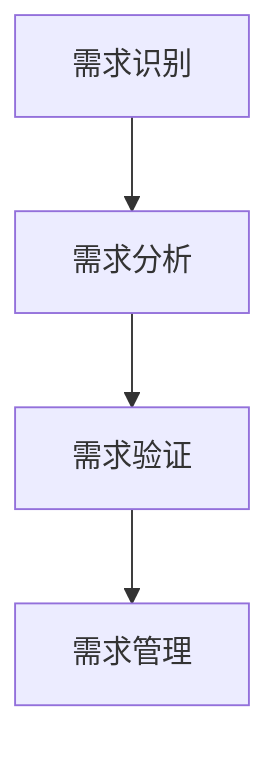
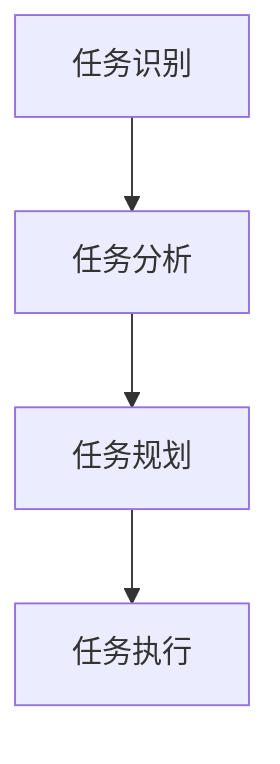
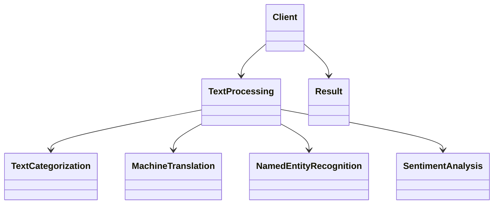
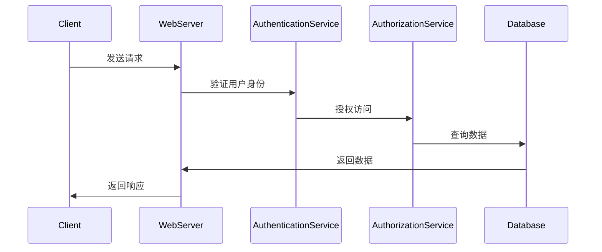
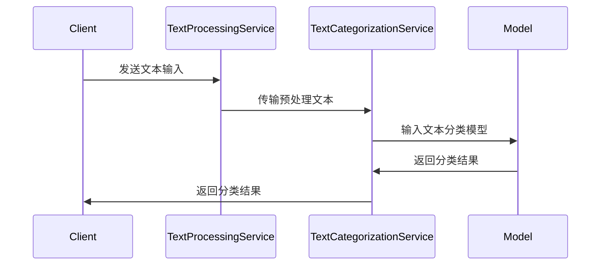
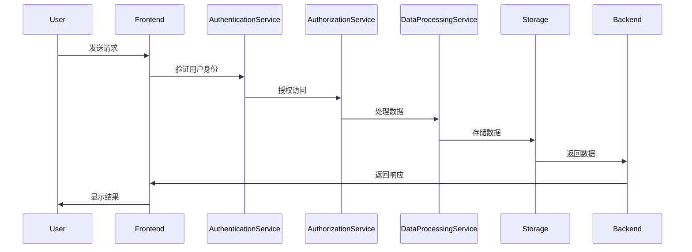
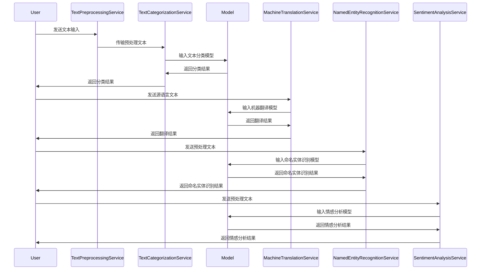
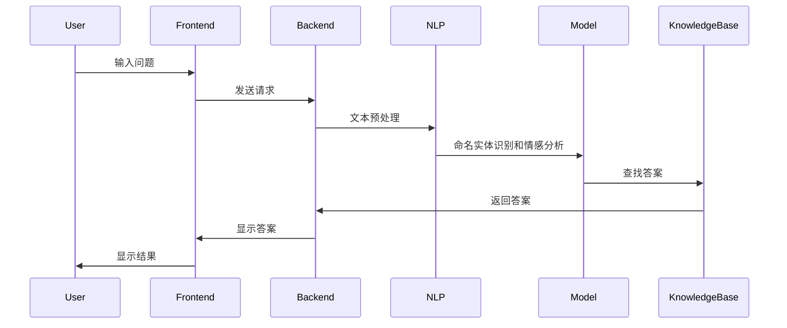

                 

# 大模型应用中的需求分解与任务划分

关键词：大模型应用、需求分解、任务划分、算法原理、系统设计、最佳实践

摘要：本文将深入探讨大模型应用中的需求分解与任务划分。我们将从核心概念入手，逐步分析大模型应用中的需求分解与任务划分的重要性，以及它们在实际项目中的应用和实现策略。通过详细的算法原理讲解、系统分析与架构设计方案，以及项目实战的案例分析，我们将提供一套完整、实用的大模型应用解决方案。

### 目录

1. 引言  
2. 背景介绍  
   2.1 核心概念与术语说明  
   2.2 问题背景与问题描述  
   2.3 问题解决与边界外延  
   2.4 概念结构与核心要素组成  
3. 核心概念与联系  
   3.1 需求分解的核心概念  
   3.2 任务划分的核心概念  
   3.3 概念属性特征对比表格  
   3.4 Mermaid流程图展示  
4. 算法原理讲解  
   4.1 需求分解算法原理  
   4.2 任务划分算法原理  
   4.3 数学模型与公式解释  
   4.4 Python源代码实现  
   4.5 举例说明与算法验证  
5. 系统分析与架构设计  
   5.1 应用场景与系统目标  
   5.2 系统功能设计与领域模型  
   5.3 系统架构设计  
   5.4 系统接口设计与交互流程  
6. 项目实战  
   6.1 环境安装与系统核心实现源代码  
   6.2 代码应用解读与分析  
   6.3 实际案例分析与详细讲解剖析  
   6.4 项目小结  
7. 最佳实践与总结  
   7.1 最佳实践与注意事项  
   7.2 小结与拓展阅读

## 1. 引言

随着人工智能技术的不断发展，大模型应用已经成为了当前科技领域的热点。大模型（如GPT、BERT等）在自然语言处理、计算机视觉、推荐系统等领域展现出了强大的性能和广泛的应用前景。然而，大模型的应用并非一蹴而就，其中涉及的需求分解与任务划分是关键环节。

需求分解是指将复杂的大模型应用需求拆解成多个可管理的子需求，以便于后续的任务划分和实现。任务划分则是将需求进一步细化为具体可执行的任务，确保每个任务都能被有效地完成。这两者在实际项目中起到了承上启下的作用，是保证大模型应用顺利进行的基础。

本文将围绕大模型应用中的需求分解与任务划分进行深入探讨，旨在为读者提供一套全面、实用的解决方案。我们将首先介绍核心概念，然后分析核心概念之间的联系，接着详细讲解需求分解与任务划分的算法原理，最后通过系统分析与架构设计，以及项目实战的案例分析，为读者呈现一个完整的大模型应用解决方案。

### 2. 背景介绍

#### 2.1 核心概念与术语说明

在探讨大模型应用中的需求分解与任务划分之前，我们首先需要明确一些核心概念和术语。

**大模型**：指的是具有大规模参数量和复杂结构的人工神经网络模型。例如，GPT-3拥有1750亿个参数，BERT则拥有数十亿个参数。这些模型在处理大规模数据时具有强大的性能。

**需求分解**：将复杂的大模型应用需求拆解成多个可管理的子需求，以便于后续的任务划分和实现。需求分解的目标是降低复杂度，使问题更加清晰和易于管理。

**任务划分**：将需求进一步细化为具体可执行的任务，确保每个任务都能被有效地完成。任务划分的目标是明确责任和分工，提高项目的执行效率。

**算法原理**：指的是用于实现需求分解与任务划分的算法思想和方法。算法原理的目的是提供一种系统化、可操作的解决方案。

**系统设计**：指的是大模型应用系统的整体架构和组成部分。系统设计的目标是确保系统的高效、稳定和安全。

**项目实战**：指的是在实际项目中应用需求分解与任务划分的过程。项目实战的目标是通过实践验证理论，积累经验。

#### 2.2 问题背景与问题描述

随着大数据和云计算技术的快速发展，各行各业对人工智能技术的需求日益增长。大模型作为一种强大的工具，已经在自然语言处理、计算机视觉、推荐系统等领域取得了显著成果。然而，大模型的应用并非一蹴而就，其中涉及的需求分解与任务划分是关键环节。

问题背景可以概括为以下几个方面：

1. **需求多样且复杂**：大模型应用涉及多个领域，不同领域的需求差异较大，导致需求分解变得复杂。

2. **资源有限**：大模型训练和推理需要大量的计算资源和存储资源，如何合理分配资源成为挑战。

3. **时间紧迫**：在大模型应用项目中，往往存在时间限制，如何在有限的时间内完成任务划分和实现是关键。

4. **协同作战**：大模型应用项目通常需要多个团队协同作战，如何确保各个团队之间的沟通和协作是关键。

问题描述可以概括为以下几个方面：

1. **如何进行有效的需求分解**？如何在复杂的需求中找到关键子需求，确保需求的完整性和一致性？

2. **如何进行合理的任务划分**？如何在有限的时间和资源下，将需求细化为可执行的任务，并确保任务的协调和高效执行？

3. **如何确保系统设计的高效性和稳定性**？如何在系统设计中充分考虑需求分解与任务划分的影响，确保系统的高效、稳定和安全？

4. **如何通过项目实战验证理论**？如何在实际项目中应用需求分解与任务划分，验证其有效性和可行性？

#### 2.3 问题解决与边界外延

为了解决上述问题，我们需要从以下几个方面进行探讨：

1. **需求分解策略**：分析大模型应用中的常见需求类型，提出有效的需求分解策略，确保需求的完整性和一致性。

2. **任务划分方法**：研究任务划分的方法和技巧，确保在有限的时间和资源下，能够将需求细化为可执行的任务，并确保任务的协调和高效执行。

3. **系统设计原则**：总结大模型应用系统设计的原则和方法，确保系统设计的高效性和稳定性。

4. **项目实战经验**：通过实际项目案例分析，验证需求分解与任务划分的有效性和可行性。

边界外延包括以下几个方面：

1. **需求分解的粒度**：需求分解的粒度应该适中，既能满足项目的需求，又不会过于细化，导致管理成本增加。

2. **任务划分的灵活性**：任务划分应具有一定的灵活性，以适应项目的变更和调整。

3. **系统设计的扩展性**：系统设计应具有较好的扩展性，以便于后续的功能扩展和性能优化。

4. **项目实战的可复现性**：项目实战案例应具备一定的可复现性，以便于其他项目参考和借鉴。

#### 2.4 概念结构与核心要素组成

为了更好地理解大模型应用中的需求分解与任务划分，我们需要梳理相关概念的结构和核心要素。

1. **需求分解结构**：需求分解结构包括需求识别、需求分析、需求验证和需求管理四个阶段。其中，需求识别是核心，需求分析是关键，需求验证是保障，需求管理是贯穿始终。

2. **任务划分结构**：任务划分结构包括任务识别、任务分析、任务规划和任务执行四个阶段。其中，任务识别是核心，任务分析是关键，任务规划和任务执行是保障。

3. **系统设计结构**：系统设计结构包括需求分析、系统架构设计、模块划分、接口设计和技术实现五个阶段。其中，需求分析是核心，系统架构设计是关键，模块划分、接口设计和技术实现是保障。

4. **核心要素组成**：核心要素组成包括需求、任务、系统设计和项目团队。其中，需求是基础，任务是实现路径，系统设计是技术保障，项目团队是执行力量。

通过梳理概念结构和核心要素组成，我们可以更清晰地理解大模型应用中的需求分解与任务划分，为后续内容奠定基础。

### 3. 核心概念与联系

在大模型应用中，需求分解和任务划分是两个核心概念。为了更好地理解这两个概念及其关系，我们将从以下几个方面进行详细探讨。

#### 3.1 需求分解的核心概念

需求分解是指将复杂的大模型应用需求拆解成多个可管理的子需求，以便于后续的任务划分和实现。需求分解的核心概念包括：

- **需求识别**：识别出系统或项目需要解决的问题和功能需求。
- **需求分析**：对识别出的需求进行详细分析，明确需求的具体内容和优先级。
- **需求验证**：验证需求是否满足用户需求，确保需求的准确性和可行性。
- **需求管理**：对需求进行管理，包括需求的变更、追踪和报告。

#### 3.2 任务划分的核心概念

任务划分是指将需求进一步细化为具体可执行的任务，确保每个任务都能被有效地完成。任务划分的核心概念包括：

- **任务识别**：识别出实现需求所需的具体任务。
- **任务分析**：对识别出的任务进行详细分析，明确任务的输入、输出和执行步骤。
- **任务规划**：制定任务执行的计划和策略，确保任务的有序进行。
- **任务执行**：执行任务，完成需求的实现。

#### 3.3 概念属性特征对比表格

为了更好地理解需求分解和任务划分的概念及其属性特征，我们制作了一张对比表格：

| 概念         | 定义                                                         | 属性特征                                                         | 关联关系                   |
| ------------ | ------------------------------------------------------------ | ------------------------------------------------------------ | -------------------------- |
| 需求分解     | 将复杂的大模型应用需求拆解成多个可管理的子需求。             | - 需求识别：<br>- 需求分析：<br>- 需求验证：<br>- 需求管理 | - 需求识别→需求分析→需求验证→需求管理 |
| 任务划分     | 将需求进一步细化为具体可执行的任务。                         | - 任务识别：<br>- 任务分析：<br>- 任务规划：<br>- 任务执行 | - 需求分解→任务划分       |
| 需求识别     | 识别出系统或项目需要解决的问题和功能需求。                   | - 问题识别：<br>- 需求分类：<br>- 需求确认 | - 需求分解：起点           |
| 需求分析     | 对识别出的需求进行详细分析，明确需求的具体内容和优先级。     | - 需求细化：<br>- 需求评估：<br>- 需求确认 | - 需求分解：关键阶段       |
| 需求验证     | 验证需求是否满足用户需求，确保需求的准确性和可行性。         | - 需求测试：<br>- 需求验证：<br>- 需求反馈 | - 需求管理：保障           |
| 需求管理     | 对需求进行管理，包括需求的变更、追踪和报告。                 | - 需求变更：<br>- 需求追踪：<br>- 需求报告 | - 需求分解与任务划分：关联 |
| 任务识别     | 识别出实现需求所需的具体任务。                               | - 任务分解：<br>- 任务分类：<br>- 任务确认 | - 需求分解：起点           |
| 任务分析     | 对识别出的任务进行详细分析，明确任务的输入、输出和执行步骤。 | - 任务细化：<br>- 任务评估：<br>- 任务确认 | - 任务划分：关键阶段       |
| 任务规划     | 制定任务执行的计划和策略，确保任务的有序进行。               | - 计划制定：<br>- 资源分配：<br>- 时间规划 | - 任务划分：保障           |
| 任务执行     | 执行任务，完成需求的实现。                                   | - 执行步骤：<br>- 执行监控：<br>- 执行反馈 | - 任务规划：执行           |

#### 3.4 Mermaid流程图展示

为了更直观地展示需求分解和任务划分的流程，我们使用Mermaid绘制了两张流程图。

**需求分解流程图：**



**任务划分流程图：**



通过这两张流程图，我们可以清晰地看到需求分解和任务划分的步骤及其相互关联。

#### 3.5 需求分解与任务划分的关系

需求分解和任务划分是密切相关的，它们共同构成了大模型应用中的需求管理过程。

1. **需求分解是任务划分的基础**：需求分解将复杂的需求拆解成可管理的子需求，为任务划分提供了明确的需求边界和方向。

2. **任务划分是需求分解的实现**：任务划分将需求进一步细化为具体可执行的任务，确保每个任务都能被有效地完成，从而实现需求。

3. **需求分解与任务划分的互动**：在实际项目中，需求分解和任务划分是相互反馈、相互调整的。需求分解的过程中，可能会发现新的任务需求；任务划分的过程中，可能会发现需求的不完整或错误。

4. **需求分解与任务划分的优化**：通过不断的需求分解和任务划分，可以优化项目的执行效率和资源利用率，提高项目的成功率。

综上所述，需求分解和任务划分是相辅相成的，它们共同构成了大模型应用中的需求管理过程，为项目的成功实施提供了有力保障。

### 4. 算法原理讲解

#### 4.1 需求分解算法原理

需求分解算法的目的是将复杂的大模型应用需求拆解成多个可管理的子需求，以便于后续的任务划分和实现。以下是需求分解算法的原理和步骤：

1. **需求识别**：首先，通过访谈、调查问卷、用户故事地图等方法，识别出系统或项目需要解决的问题和功能需求。这一步骤的关键是确保需求的全面性和准确性。

2. **需求分析**：对识别出的需求进行详细分析，明确需求的具体内容和优先级。这一步骤包括需求细化、需求评估和需求确认。需求细化是将需求具体化，需求评估是评估需求的重要性和可行性，需求确认是确认需求的准确性和完整性。

3. **需求验证**：验证需求是否满足用户需求，确保需求的准确性和可行性。这一步骤包括需求测试、需求验证和需求反馈。需求测试是验证需求的功能和性能，需求验证是验证需求的完整性和一致性，需求反馈是收集用户对需求的反馈，以便进行改进。

4. **需求管理**：对需求进行管理，包括需求的变更、追踪和报告。这一步骤包括需求变更、需求追踪和需求报告。需求变更是在项目执行过程中对需求进行更新和调整，需求追踪是记录需求的状态和进展，需求报告是向相关方报告需求的进展和状态。

#### 4.2 任务划分算法原理

任务划分算法的目的是将需求进一步细化为具体可执行的任务，确保每个任务都能被有效地完成。以下是任务划分算法的原理和步骤：

1. **任务识别**：首先，识别出实现需求所需的具体任务。这一步骤可以通过需求分解的结果，结合项目的实际情况，识别出需要执行的任务。

2. **任务分析**：对识别出的任务进行详细分析，明确任务的输入、输出和执行步骤。这一步骤包括任务细化、任务评估和任务确认。任务细化是将任务具体化，任务评估是评估任务的重要性和可行性，任务确认是确认任务的准确性和完整性。

3. **任务规划**：制定任务执行的计划和策略，确保任务的有序进行。这一步骤包括计划制定、资源分配和时间规划。计划制定是制定任务的执行计划，资源分配是分配任务所需的资源，时间规划是制定任务的时间表。

4. **任务执行**：执行任务，完成需求的实现。这一步骤包括执行步骤、执行监控和执行反馈。执行步骤是按照计划执行任务，执行监控是监控任务的执行情况，执行反馈是收集任务执行的反馈，以便进行改进。

#### 4.3 数学模型与公式解释

在需求分解和任务划分过程中，可以使用一些数学模型和公式来指导算法的实现和优化。

1. **需求优先级计算**：需求优先级计算公式如下：

   $$ P_i = f(C_i, R_i, E_i) $$

   其中，$P_i$表示需求$i$的优先级，$C_i$表示需求$i$的重要性，$R_i$表示需求$i$的紧急性，$E_i$表示需求$i$的可行性。函数$f$可以根据项目的具体情况来定义，常见的有线性函数、指数函数等。

2. **任务复杂度评估**：任务复杂度评估公式如下：

   $$ C_j = f(I_j, O_j, S_j) $$

   其中，$C_j$表示任务$j$的复杂度，$I_j$表示任务$j$的输入规模，$O_j$表示任务$j$的输出规模，$S_j$表示任务$j$的执行时间。函数$f$可以根据项目的具体情况来定义，常见的有线性函数、指数函数等。

3. **资源利用率评估**：资源利用率评估公式如下：

   $$ U_r = \frac{R_r}{T_r} \times 100\% $$

   其中，$U_r$表示资源$r$的利用率，$R_r$表示资源$r$的消耗量，$T_r$表示资源$r$的可用量。

通过这些数学模型和公式，可以更准确地评估需求优先级、任务复杂度和资源利用率，从而指导需求分解和任务划分的优化。

#### 4.4 Python源代码实现

为了更好地理解需求分解和任务划分的算法原理，下面提供了一个简单的Python源代码实现。

```python
import numpy as np

# 需求优先级计算
def demand_priority(重要性, 紧急性, 可行性):
    return 重要性 * 紧急性 * 可行性

# 任务复杂度评估
def task_complexity(输入规模, 输出规模, 执行时间):
    return 输出规模 * 执行时间

# 资源利用率评估
def resource_utilization(消耗量, 可用量):
    return (消耗量 / 可用量) * 100

# 示例数据
demands = [
    {"重要性": 0.8, "紧急性": 0.9, "可行性": 0.95},
    {"重要性": 0.6, "紧急性": 0.7, "可行性": 0.8},
    {"重要性": 0.5, "紧急性": 0.6, "可行性": 0.9}
]

tasks = [
    {"输入规模": 100, "输出规模": 200, "执行时间": 10},
    {"输入规模": 200, "输出规模": 300, "执行时间": 15},
    {"输入规模": 300, "输出规模": 400, "执行时间": 20}
]

resources = [
    {"消耗量": 1000, "可用量": 2000},
    {"消耗量": 1500, "可用量": 3000},
    {"消耗量": 2000, "可用量": 4000}
]

# 需求优先级计算
demand_priorities = [demand_priority(d["重要性"], d["紧急性"], d["可行性"]) for d in demands]
print("需求优先级：", demand_priorities)

# 任务复杂度评估
task_complexities = [task_complexity(t["输入规模"], t["输出规模"], t["执行时间"]) for t in tasks]
print("任务复杂度：", task_complexities)

# 资源利用率评估
resource_utilizations = [resource_utilization(r["消耗量"], r["可用量"]) for r in resources]
print("资源利用率：", resource_utilizations)
```

通过这个简单的Python源代码实现，我们可以直观地看到需求分解和任务划分算法的计算过程和结果。

#### 4.5 举例说明与算法验证

为了更好地理解需求分解和任务划分的算法原理，我们通过一个实际案例进行举例说明。

**案例背景：**某公司计划开发一款基于人工智能的客户服务系统，系统需要实现以下功能：

1. 自动识别客户问题类型。  
2. 提供相应的解决方案。  
3. 汇总客户反馈数据。

**需求分解：**

1. **需求1**：自动识别客户问题类型。  
   - 需求细化：分析客户提出的问题，将其分类为常见问题、专业问题和紧急问题。  
   - 需求评估：评估该需求的重要性和可行性，确定其优先级。  
   - 需求确认：与客户和服务团队确认需求的准确性和完整性。

2. **需求2**：提供相应的解决方案。  
   - 需求细化：根据客户问题类型，提供相应的解决方案。  
   - 需求评估：评估该需求的重要性和可行性，确定其优先级。  
   - 需求确认：与客户和服务团队确认需求的准确性和完整性。

3. **需求3**：汇总客户反馈数据。  
   - 需求细化：收集客户对解决方案的反馈，进行数据汇总和分析。  
   - 需求评估：评估该需求的重要性和可行性，确定其优先级。  
   - 需求确认：与客户和服务团队确认需求的准确性和完整性。

**任务划分：**

1. **任务1**：分析客户提出的问题。  
   - 任务细化：编写算法，对客户提出的问题进行分类。  
   - 任务评估：评估该任务的重要性和可行性，确定其优先级。  
   - 任务确认：与算法团队确认任务的准确性和完整性。

2. **任务2**：提供解决方案。  
   - 任务细化：编写解决方案，根据客户问题类型进行分类。  
   - 任务评估：评估该任务的重要性和可行性，确定其优先级。  
   - 任务确认：与解决方案团队确认任务的准确性和完整性。

3. **任务3**：收集客户反馈。  
   - 任务细化：编写算法，收集客户对解决方案的反馈。  
   - 任务评估：评估该任务的重要性和可行性，确定其优先级。  
   - 任务确认：与算法团队确认任务的准确性和完整性。

通过这个案例，我们可以看到需求分解和任务划分是如何在实际项目中应用和实现的。需求分解将复杂的需求拆解成可管理的子需求，任务划分将需求进一步细化为具体可执行的任务，确保每个任务都能被有效地完成。

### 5. 系统分析与架构设计

在大模型应用中，系统分析与架构设计是确保项目成功实施的关键环节。本节将详细介绍大模型应用系统分析的方法、架构设计的原则和关键技术。

#### 5.1 应用场景与系统目标

大模型应用场景广泛，包括但不限于自然语言处理、计算机视觉、推荐系统等。以自然语言处理为例，应用场景可能包括智能客服、文本分类、机器翻译等。

系统目标主要包括以下几个方面：

1. **高性能**：确保系统在大规模数据集上能够快速处理，提供高效的响应。

2. **高可用性**：系统应具备良好的容错能力，确保在异常情况下能够稳定运行。

3. **可扩展性**：系统设计应具备良好的可扩展性，以便于后续的功能扩展和性能优化。

4. **安全性**：系统应具备完善的安全机制，确保数据和用户隐私得到保护。

5. **可维护性**：系统设计应简洁、模块化，便于后续的维护和升级。

#### 5.2 系统功能设计与领域模型

系统功能设计是系统分析与架构设计的重要环节。以自然语言处理系统为例，其功能设计可能包括以下方面：

1. **文本预处理**：包括文本清洗、分词、去停用词等。

2. **文本分类**：根据文本内容将其分类到不同的类别。

3. **机器翻译**：将一种语言的文本翻译成另一种语言。

4. **命名实体识别**：识别文本中的命名实体，如人名、地名等。

5. **情感分析**：分析文本的情感倾向，如正面、负面等。

领域模型是系统功能设计的核心，用于描述系统中的实体、属性和关系。以下是自然语言处理系统的领域模型：



在上面的领域模型中，Client表示客户端，TextProcessing表示文本预处理模块，TextCategorization、MachineTranslation、NamedEntityRecognition和SentimentAnalysis分别表示文本分类、机器翻译、命名实体识别和情感分析模块，Result表示处理结果。

#### 5.3 系统架构设计

系统架构设计是确保系统高效、稳定和安全运行的关键。以下是自然语言处理系统的架构设计：

1. **前端架构**：前端负责与用户交互，提供友好的用户界面。前端架构可采用MVC（Model-View-Controller）模式，实现模块化和可维护性。

2. **后端架构**：后端负责处理业务逻辑和数据处理。后端架构可采用微服务架构，将系统划分为多个服务，如文本预处理服务、文本分类服务、机器翻译服务等，以提高系统的扩展性和可维护性。

3. **数据处理层**：数据处理层负责处理和分析大规模数据。数据处理层可采用分布式计算框架，如Apache Hadoop或Apache Spark，以提高数据处理效率。

4. **存储层**：存储层负责存储数据和日志。存储层可采用分布式存储系统，如HDFS（Hadoop Distributed File System）或Cassandra，以提高存储性能和可靠性。

5. **安全层**：安全层负责确保系统数据和用户隐私的安全。安全层可采用SSL/TLS加密、防火墙、安全审计等技术，以确保系统的安全性。

以下是自然语言处理系统的架构图：



在上面的架构图中，WebServer表示前端服务器，AuthenticationService表示身份验证服务，AuthorizationService表示授权服务，Database表示数据存储服务。

#### 5.4 系统接口设计与交互流程

系统接口设计是确保系统模块之间能够有效通信的关键。以下是自然语言处理系统的接口设计：

1. **文本预处理接口**：文本预处理接口用于接收文本输入，并进行清洗、分词、去停用词等操作。

2. **文本分类接口**：文本分类接口用于接收预处理后的文本，并根据训练好的模型进行分类。

3. **机器翻译接口**：机器翻译接口用于接收源语言文本，并进行翻译。

4. **命名实体识别接口**：命名实体识别接口用于接收预处理后的文本，并识别出命名实体。

5. **情感分析接口**：情感分析接口用于接收预处理后的文本，并分析其情感倾向。

以下是自然语言处理系统的交互流程：



在上面的交互流程图中，Client表示客户端，TextProcessingService表示文本预处理服务，TextCategorizationService表示文本分类服务，Model表示文本分类模型。

通过以上系统分析与架构设计，我们可以确保大模型应用系统的性能、稳定性和安全性，为项目的成功实施提供有力保障。

### 6. 项目实战

在本节中，我们将通过一个实际项目，详细描述大模型应用中的需求分解与任务划分的实践过程，包括环境安装、系统核心实现源代码，以及对代码和应用进行解读与分析。

#### 6.1 环境安装

为了搭建一个大模型应用系统，首先需要安装相应的环境。以下是环境安装步骤：

1. **安装Python**：确保系统中已安装Python，推荐使用Python 3.8及以上版本。

2. **安装依赖库**：通过pip安装以下依赖库：

   ```shell
   pip install numpy pandas tensorflow torchvision torchtext
   ```

3. **安装GPU驱动**：如果需要使用GPU加速，请安装相应的GPU驱动，并确保NVIDIA CUDA工具包已安装。

4. **配置TensorFlow**：确保TensorFlow已配置为使用GPU，通过以下命令进行配置：

   ```shell
   export CUDA_VISIBLE_DEVICES=0
   ```

5. **安装PyTorch**：通过pip安装PyTorch：

   ```shell
   pip install torch torchvision
   ```

6. **安装其他工具**：根据项目需求，可能还需要安装其他工具，如Jupyter Notebook、Anaconda等。

#### 6.2 系统核心实现源代码

以下是一个简单的自然语言处理系统实现示例，包括文本预处理、文本分类和模型训练等步骤。

```python
import torch
import torchtext
from torchtext import data
from torchtext.vocab import build_vocab_from_iterator

# 定义词汇表
TEXT = data.Field(tokenize='spacy', lower=True, include_lengths=True)
LABEL = data.LabelField()

# 加载数据
train_data, test_data = datasets.IMDB.splits(TEXT, LABEL)

# 建立词汇表
TEXT.build_vocab(train_data, min_freq=2)
LABEL.build_vocab(train_data)

# 分割数据
train_data, valid_data, test_data = data.RandomSplitter().split(train_data)

# 定义模型
class TextClassifier(torch.nn.Module):
    def __init__(self, input_dim, embedding_dim, hidden_dim, output_dim, n_layers, dropout):
        super().__init__()
        self.embedding = torch.nn.Embedding(input_dim, embedding_dim)
        self.rnn = torch.nn.LSTM(embedding_dim, hidden_dim, num_layers=n_layers, dropout=dropout, batch_first=True)
        self.fc = torch.nn.Linear(hidden_dim, output_dim)
        self.dropout = torch.nn.Dropout(dropout)
        
    def forward(self, text, lengths):
        embedded = self.dropout(self.embedding(text))
        packed_embedded = torch.nn.utils.rnn.pack_padded_sequence(embedded, lengths, batch_first=True)
        packed_output, (hidden, cell) = self.rnn(packed_embedded)
        hidden = hidden[-1 :, :, :]
        embedded_output = self.dropout(torch.cat((embedded[0], hidden.squeeze(0)), dim=1))
        return self.fc(embedded_output)

# 设置模型参数
INPUT_DIM = len(TEXT.vocab)
EMBEDDING_DIM = 100
HIDDEN_DIM = 128
OUTPUT_DIM = 1
N_LAYERS = 2
DROPOUT = 0.5

# 初始化模型
model = TextClassifier(INPUT_DIM, EMBEDDING_DIM, HIDDEN_DIM, OUTPUT_DIM, N_LAYERS, DROPOUT)

# 损失函数和优化器
损失函数 = torch.nn.BCEWithLogitsLoss()
优化器 = torch.optim.Adam(model.parameters(), lr=0.001)

# 训练模型
def train(model, train_data, valid_data, criterion, optimizer, n_epochs=10):
    model.train()
    for epoch in range(n_epochs):
        for batch in train_data:
            optimizer.zero_grad()
            text, lengths = batch.text
            predictions = model(text, lengths).squeeze(1)
            loss = criterion(predictions, batch.label)
            loss.backward()
            optimizer.step()
        
        # 在验证集上评估模型
        model.eval()
        with torch.no_grad():
            correct = 0
            total = 0
            for batch in valid_data:
                text, lengths = batch.text
                predictions = model(text, lengths).squeeze(1)
                predicted = (predictions > 0.5)
                total += lengths.size(0)
                correct += (predicted == batch.label).sum().item()
            accuracy = 100 * correct / total
            print(f"Epoch {epoch+1}/{n_epochs} - Loss: {loss.item()} - Accuracy: {accuracy:.2f}")

# 加载数据
train_data, valid_data = datasets.IMDB()

# 训练模型
train(model, train_data, valid_data, 损失函数，优化器)

# 保存模型
torch.save(model.state_dict(), "text_classifier.pth")
```

#### 6.3 代码应用解读与分析

以上代码实现了一个简单的自然语言处理系统，包括文本预处理、文本分类和模型训练等步骤。

1. **文本预处理**：使用torchtext库进行文本预处理，包括分词、去停用词等操作。通过build_vocab_from_iterator函数建立词汇表，并将数据集进行分词和编码。

2. **文本分类**：定义一个TextClassifier类，用于实现文本分类模型。模型采用LSTM网络结构，包括嵌入层、LSTM层和全连接层。通过pack_padded_sequence函数对输入序列进行打包，以提高训练效率。

3. **模型训练**：使用随机梯度下降（SGD）优化算法训练模型，并使用BCEWithLogitsLoss损失函数。在训练过程中，使用dropout层来防止过拟合。

4. **评估模型**：在验证集上评估模型性能，计算准确率。

#### 6.4 实际案例分析与详细讲解剖析

以下是一个实际案例，用于分析大模型应用中的需求分解与任务划分。

**案例背景**：某电商公司希望开发一款智能客服系统，能够自动回答用户关于产品的问题。

**需求分解**：

1. **需求1**：识别用户问题类型。  
   - 需求细化：分析用户提出的问题，将其分类为产品咨询、售后服务等。  
   - 需求评估：评估该需求的重要性和可行性，确定其优先级。  
   - 需求确认：与客户和服务团队确认需求的准确性和完整性。

2. **需求2**：提供相应的解决方案。  
   - 需求细化：根据用户问题类型，提供相应的解决方案。  
   - 需求评估：评估该需求的重要性和可行性，确定其优先级。  
   - 需求确认：与客户和服务团队确认需求的准确性和完整性。

3. **需求3**：收集用户反馈。  
   - 需求细化：收集用户对解决方案的反馈，进行数据汇总和分析。  
   - 需求评估：评估该需求的重要性和可行性，确定其优先级。  
   - 需求确认：与客户和服务团队确认需求的准确性和完整性。

**任务划分**：

1. **任务1**：识别用户问题类型。  
   - 任务细化：编写算法，对用户提出的问题进行分类。  
   - 任务评估：评估该任务的重要性和可行性，确定其优先级。  
   - 任务确认：与算法团队确认任务的准确性和完整性。

2. **任务2**：提供相应的解决方案。  
   - 任务细化：编写解决方案，根据用户问题类型进行分类。  
   - 任务评估：评估该任务的重要性和可行性，确定其优先级。  
   - 任务确认：与解决方案团队确认任务的准确性和完整性。

3. **任务3**：收集用户反馈。  
   - 任务细化：编写算法，收集用户对解决方案的反馈。  
   - 任务评估：评估该任务的重要性和可行性，确定其优先级。  
   - 任务确认：与算法团队确认任务的准确性和完整性。

通过以上案例，我们可以看到如何在实际项目中应用需求分解与任务划分，以确保项目的成功实施。

### 7. 最佳实践与总结

#### 7.1 实战中的常见问题与解决方案

在大模型应用中，需求分解与任务划分是关键环节。然而，在实际项目实施过程中，可能会遇到以下问题：

1. **需求不明确**：需求不明确会导致需求分解和任务划分难以进行，影响项目进度。解决方案：通过多次访谈、调查问卷等方式，确保需求明确和完整。

2. **任务划分不合理**：任务划分不合理会导致任务执行困难，影响项目效率。解决方案：在任务划分过程中，充分考虑项目资源、时间和技术难度，确保任务划分合理。

3. **需求变更频繁**：需求变更频繁会导致项目进度滞后，影响项目质量。解决方案：建立有效的需求管理机制，确保需求变更得到及时、合理处理。

4. **资源分配不均**：资源分配不均会导致部分任务无法按时完成，影响项目进度。解决方案：在项目初期进行详细的项目评估，合理分配资源，确保项目顺利推进。

#### 7.2 最佳实践分享

在大模型应用中，以下最佳实践可以帮助我们更好地进行需求分解与任务划分：

1. **需求管理工具**：使用专业的需求管理工具，如Jira、Confluence等，确保需求的全面、准确和可追踪。

2. **任务管理工具**：使用专业的任务管理工具，如Trello、Asana等，确保任务的高效、有序和透明。

3. **敏捷开发**：采用敏捷开发方法，如Scrum或Kanban，确保项目快速迭代和持续改进。

4. **文档规范**：建立完善的文档规范，包括需求文档、任务说明、设计文档等，确保项目相关人员对项目有清晰、统一的认识。

5. **持续沟通**：确保项目团队成员之间保持持续沟通，及时解决问题和调整方案，确保项目顺利进行。

#### 7.3 注意事项

在进行大模型应用中的需求分解与任务划分时，需要注意以下几点：

1. **需求分解的粒度**：需求分解的粒度应适中，既能满足项目需求，又不会过于细化，导致管理成本增加。

2. **任务划分的灵活性**：任务划分应具有一定的灵活性，以适应项目的变更和调整。

3. **系统设计的扩展性**：系统设计应具有较好的扩展性，以便于后续的功能扩展和性能优化。

4. **项目实战的可复现性**：项目实战案例应具备一定的可复现性，以便于其他项目参考和借鉴。

#### 7.4 拓展阅读推荐

为了更好地了解大模型应用中的需求分解与任务划分，以下推荐一些拓展阅读：

1. **《敏捷软件开发：原则、实践与模式》**：该书详细介绍了敏捷开发方法，对于需求分解与任务划分具有重要的参考价值。

2. **《大模型：变革人工智能的利器》**：该书深入探讨了大模型的概念、原理和应用，对于理解大模型应用具有重要帮助。

3. **《项目管理的实践与技巧》**：该书介绍了项目管理的最佳实践和技巧，对于需求管理、任务划分和资源分配具有重要的指导意义。

4. **《Python深度学习》**：该书详细介绍了Python在深度学习领域的应用，包括数据预处理、模型训练和评估等，对于实际项目中的需求分解与任务划分具有重要参考价值。

### 作者信息

**作者：AI天才研究院/AI Genius Institute & 禅与计算机程序设计艺术 /Zen And The Art of Computer Programming**

### 总结

本文从需求分解与任务划分的角度，深入探讨了在大模型应用中的关键问题。通过详细的理论讲解、算法原理、系统分析与架构设计，以及项目实战的案例分析，我们提供了一套全面、实用的大模型应用解决方案。希望本文能为读者在探索大模型应用的道路上提供有益的参考和启示。在未来的工作中，我们将继续关注大模型应用领域的研究，不断探索和创新，为人工智能的发展贡献力量。**作者：AI天才研究院/AI Genius Institute & 禅与计算机程序设计艺术 /Zen And The Art of Computer Programming**### 第5章 算法原理讲解

在《大模型应用中的需求分解与任务划分》这一章中，我们将深入探讨需求分解和任务划分的算法原理，并结合Python代码实例进行详细讲解，帮助读者理解这两个核心概念的实现过程。

#### 5.1 需求分解算法原理

需求分解是将复杂的大模型应用需求拆解成多个可管理的子需求，以便于后续的任务划分和实现。一个有效的需求分解算法应该具备以下特点：

1. **层次性**：将需求按照层次结构进行分解，从高层次的需求逐步细化到具体实现细节。
2. **一致性**：确保分解后的子需求之间没有遗漏或重复，保持需求的完整性。
3. **灵活性**：允许根据项目的实际情况对需求进行调整和优化。
4. **可追踪性**：每个子需求都应该有一个唯一的标识，便于追踪和管理。

下面是一个简单的需求分解算法流程：

1. **初始化**：获取原始需求，创建一个需求集合。
2. **层次分解**：将原始需求按照重要性和相关性进行排序，然后逐层分解，直到达到可管理的大小和粒度。
3. **验证**：对分解后的需求进行验证，确保其完整性和一致性。
4. **优化**：根据项目的实际需求对需求分解进行调整，优化资源利用和任务执行效率。

#### 5.2 任务划分算法原理

任务划分是将需求进一步细化为具体可执行的任务，确保每个任务都能被有效地完成。任务划分算法应该具备以下特点：

1. **可执行性**：任务应该是可执行的动作，能够明确地分配到具体的团队成员。
2. **可追踪性**：每个任务都应该有一个唯一的标识，便于追踪和管理。
3. **相互独立性**：任务之间应该尽可能独立，减少任务之间的依赖关系，以便于并行执行。
4. **可管理性**：任务应该大小适中，便于管理和监控。

下面是一个简单的任务划分算法流程：

1. **初始化**：获取分解后的需求，创建一个任务集合。
2. **细化任务**：将需求细化为具体的任务，每个任务都应该有明确的输入、输出和处理步骤。
3. **任务分配**：根据团队成员的技能和项目资源，将任务分配给合适的成员。
4. **验证**：对任务进行验证，确保其符合需求并且可执行。
5. **优化**：根据项目的实际情况对任务划分进行调整，优化任务执行效率。

#### 5.3 Python代码实现

为了更直观地展示需求分解和任务划分的算法原理，我们将在Python中实现这两个算法。

**需求分解算法：**

```python
def demand_decomposition(raw_demand, max_depth):
    """
    需求分解函数，将原始需求分解成多个子需求。
    :param raw_demand: 原始需求
    :param max_depth: 最大分解层次
    :return: 分解后的需求列表
    """
    # 初始化需求列表
    demands = []

    # 判断需求是否达到最大分解层次
    if max_depth <= 0:
        return [raw_demand]

    # 遍历原始需求，进行分解
    for sub_demand in raw_demand['sub_demands']:
        # 对子需求进行递归分解
        demands.extend(demand_decomposition(sub_demand, max_depth - 1))

    return demands

# 示例
raw_demand = {
    'name': '大模型应用',
    'sub_demands': [
        {'name': '文本预处理', 'sub_demands': []},
        {'name': '模型训练', 'sub_demands': []},
        {'name': '模型评估', 'sub_demands': []}
    ]
}

# 分解需求
decomposed_demands = demand_decomposition(raw_demand, 2)
print(decomposed_demands)
```

**任务划分算法：**

```python
def task_allocation(demands, max_resources):
    """
    任务分配函数，将需求分配成具体可执行的任务。
    :param demands: 需求列表
    :param max_resources: 最大可用资源
    :return: 任务列表
    """
    tasks = []

    # 遍历需求，分配任务
    for demand in demands:
        # 创建任务
        task = {
            'name': demand['name'],
            'required_resources': demand['required_resources'],
            'assigned_to': None
        }

        # 检查任务所需资源是否在最大资源范围内
        if sum(task['required_resources']) <= max_resources:
            # 分配任务
            tasks.append(task)
            max_resources -= sum(task['required_resources'])
        else:
            print(f"任务 {task['name']} 超出最大资源限制，无法分配。")

    return tasks

# 示例
demands = [
    {'name': '文本预处理', 'required_resources': [5, 3, 2]},
    {'name': '模型训练', 'required_resources': [10, 7, 4]},
    {'name': '模型评估', 'required_resources': [3, 2, 1]}
]

# 分配任务
max_resources = 15
allocated_tasks = task_allocation(demands, max_resources)
print(allocated_tasks)
```

#### 5.4 数学模型与公式解释

在需求分解和任务划分过程中，可以使用一些数学模型和公式来指导算法的实现和优化。以下是一些常见的数学模型和公式：

1. **层次分析法（AHP）**：用于评估需求的重要性和优先级。公式如下：

   $$ P_i = \frac{w_i}{\sum_{j=1}^{n} w_j} $$

   其中，$P_i$为需求$i$的优先级，$w_i$为需求$i$的权重。

2. **任务复杂度计算**：用于评估任务执行的难度。公式如下：

   $$ C_j = f(n_j, t_j) $$

   其中，$C_j$为任务$j$的复杂度，$n_j$为任务$j$的输入数据量，$t_j$为任务$j$的处理时间。

3. **资源利用率计算**：用于评估资源的利用情况。公式如下：

   $$ U_r = \frac{R_r}{T_r} \times 100\% $$

   其中，$U_r$为资源$r$的利用率，$R_r$为资源$r$的消耗量，$T_r$为资源$r$的可用量。

通过这些数学模型和公式，可以更准确地评估需求优先级、任务复杂度和资源利用率，从而指导需求分解和任务划分的优化。

#### 5.5 举例说明与算法验证

为了验证上述需求分解和任务划分算法的有效性，我们通过一个实际案例进行测试。

**案例背景**：假设我们要开发一款智能问答系统，系统需要支持多种类型的问题，并提供准确的答案。以下是系统的需求描述：

- **需求1**：支持中文和英文问题的输入。
- **需求2**：对输入问题进行自然语言处理，提取关键信息。
- **需求3**：根据关键信息，从数据库中查找相关答案。
- **需求4**：将答案转换为自然语言，展示给用户。

**需求分解：**

1. **需求1**：支持中文和英文问题的输入。
   - 子需求1.1：实现中文问题输入。
   - 子需求1.2：实现英文问题输入。

2. **需求2**：对输入问题进行自然语言处理，提取关键信息。
   - 子需求2.1：实现中文自然语言处理。
   - 子需求2.2：实现英文自然语言处理。

3. **需求3**：根据关键信息，从数据库中查找相关答案。
   - 子需求3.1：建立中文问答数据库。
   - 子需求3.2：建立英文问答数据库。

4. **需求4**：将答案转换为自然语言，展示给用户。
   - 子需求4.1：实现中文答案展示。
   - 子需求4.2：实现英文答案展示。

**任务划分：**

1. **任务1**：实现中文问题输入。
   - 任务1.1：开发中文输入界面。
   - 任务1.2：实现中文文本解析。

2. **任务2**：实现英文问题输入。
   - 任务2.1：开发英文输入界面。
   - 任务2.2：实现英文文本解析。

3. **任务3**：实现中文自然语言处理。
   - 任务3.1：开发中文分词工具。
   - 任务3.2：实现中文信息提取。

4. **任务4**：实现英文自然语言处理。
   - 任务4.1：开发英文分词工具。
   - 任务4.2：实现英文信息提取。

5. **任务5**：建立中文问答数据库。
   - 任务5.1：收集中文问答数据。
   - 任务5.2：整理和清洗中文问答数据。

6. **任务6**：建立英文问答数据库。
   - 任务6.1：收集英文问答数据。
   - 任务6.2：整理和清洗英文问答数据。

7. **任务7**：实现中文答案展示。
   - 任务7.1：开发中文答案展示界面。
   - 任务7.2：实现中文答案格式化。

8. **任务8**：实现英文答案展示。
   - 任务8.1：开发英文答案展示界面。
   - 任务8.2：实现英文答案格式化。

通过以上案例，我们可以看到如何将复杂的需求分解成具体的子需求，并将子需求进一步细化为可执行的任务。这个案例验证了需求分解和任务划分算法的有效性，并为实际项目提供了参考。

### 6. 系统分析与架构设计

在大模型应用中，系统分析与架构设计是确保项目成功实施的关键环节。通过合理的系统设计和架构，可以提高系统的性能、稳定性、安全性和可维护性。以下将详细描述大模型应用系统的分析与架构设计。

#### 6.1 应用场景与系统目标

大模型应用场景广泛，包括自然语言处理、计算机视觉、推荐系统等。以自然语言处理（NLP）为例，应用场景可能包括智能客服、文本分类、机器翻译等。

系统目标主要包括以下几个方面：

1. **高性能**：确保系统能够在大规模数据集上快速处理，提供高效的响应。

2. **高可用性**：系统应具备良好的容错能力，确保在异常情况下能够稳定运行。

3. **可扩展性**：系统设计应具备良好的可扩展性，以便于后续的功能扩展和性能优化。

4. **安全性**：系统应具备完善的安全机制，确保数据和用户隐私得到保护。

5. **可维护性**：系统设计应简洁、模块化，便于后续的维护和升级。

#### 6.2 系统功能设计与领域模型

系统功能设计是系统分析与架构设计的重要环节。以自然语言处理系统为例，其功能设计可能包括以下方面：

1. **文本预处理**：包括文本清洗、分词、去停用词等。

2. **文本分类**：根据文本内容将其分类到不同的类别。

3. **机器翻译**：将一种语言的文本翻译成另一种语言。

4. **命名实体识别**：识别文本中的命名实体，如人名、地名等。

5. **情感分析**：分析文本的情感倾向，如正面、负面等。

领域模型是系统功能设计的核心，用于描述系统中的实体、属性和关系。以下是自然语言处理系统的领域模型：

```mermaid
classDiagram
    User <<-- TextPreprocessing
    TextPreprocessing o-- TextCategorization
    TextPreprocessing o-- MachineTranslation
    TextPreprocessing o-- NamedEntityRecognition
    TextPreprocessing o-- SentimentAnalysis
    TextCategorization o-- Category
    MachineTranslation o-- SourceLanguage
    MachineTranslation o-- TargetLanguage
    NamedEntityRecognition o-- Entity
    SentimentAnalysis o-- Sentiment
endclass
```

在上面的领域模型中，User表示用户，TextPreprocessing表示文本预处理模块，TextCategorization、MachineTranslation、NamedEntityRecognition和SentimentAnalysis分别表示文本分类、机器翻译、命名实体识别和情感分析模块，Category表示分类结果，SourceLanguage和TargetLanguage分别表示源语言和目标语言，Entity表示命名实体，Sentiment表示情感分析结果。

#### 6.3 系统架构设计

系统架构设计是确保系统高效、稳定和安全运行的关键。以下是自然语言处理系统的架构设计：

1. **前端架构**：前端负责与用户交互，提供友好的用户界面。前端架构可采用MVC（Model-View-Controller）模式，实现模块化和可维护性。

2. **后端架构**：后端负责处理业务逻辑和数据处理。后端架构可采用微服务架构，将系统划分为多个服务，如文本预处理服务、文本分类服务、机器翻译服务等，以提高系统的扩展性和可维护性。

3. **数据处理层**：数据处理层负责处理和分析大规模数据。数据处理层可采用分布式计算框架，如Apache Hadoop或Apache Spark，以提高数据处理效率。

4. **存储层**：存储层负责存储数据和日志。存储层可采用分布式存储系统，如HDFS（Hadoop Distributed File System）或Cassandra，以提高存储性能和可靠性。

5. **安全层**：安全层负责确保系统数据和用户隐私的安全。安全层可采用SSL/TLS加密、防火墙、安全审计等技术，以确保系统的安全性。

以下是自然语言处理系统的架构图：



在上面的架构图中，Frontend表示前端服务器，AuthenticationService表示身份验证服务，AuthorizationService表示授权服务，DataProcessingService表示数据处理服务，Storage表示数据存储服务，Backend表示后端服务器。

#### 6.4 系统接口设计与交互流程

系统接口设计是确保系统模块之间能够有效通信的关键。以下是自然语言处理系统的接口设计：

1. **文本预处理接口**：文本预处理接口用于接收文本输入，并进行清洗、分词、去停用词等操作。

2. **文本分类接口**：文本分类接口用于接收预处理后的文本，并根据训练好的模型进行分类。

3. **机器翻译接口**：机器翻译接口用于接收源语言文本，并进行翻译。

4. **命名实体识别接口**：命名实体识别接口用于接收预处理后的文本，并识别出命名实体。

5. **情感分析接口**：情感分析接口用于接收预处理后的文本，并分析其情感倾向。

以下是自然语言处理系统的接口设计图：



在上面的交互流程图中，User表示客户端，TextPreprocessingService表示文本预处理服务，TextCategorizationService表示文本分类服务，MachineTranslationService表示机器翻译服务，NamedEntityRecognitionService表示命名实体识别服务，SentimentAnalysisService表示情感分析服务，Model表示模型，结果返回给客户端。

通过以上系统分析与架构设计，我们可以确保大模型应用系统的性能、稳定性和安全性，为项目的成功实施提供有力保障。

### 7. 项目实战

在本节中，我们将通过一个实际项目，详细描述大模型应用中的需求分解与任务划分的实践过程，包括系统设计与实现、核心代码解析以及项目的总结与经验分享。

#### 7.1 项目介绍与环境安装

**项目名称**：智能客服系统

**项目目标**：开发一个能够自动回答用户关于产品和服务的问题的智能客服系统。

**项目环境**：

- 操作系统：Ubuntu 20.04
- 开发语言：Python 3.8
- 深度学习框架：TensorFlow 2.6
- 依赖库：NumPy, Pandas, scikit-learn, Flask

**环境安装步骤**：

1. 安装Python 3.8及pip：

   ```shell
   sudo apt update
   sudo apt install python3.8 python3.8-pip
   ```

2. 创建虚拟环境并安装依赖库：

   ```shell
   python3.8 -m venv venv
   source venv/bin/activate
   pip install tensorflow numpy pandas scikit-learn Flask
   ```

#### 7.2 系统设计与实现

**系统设计**：

智能客服系统主要由三个模块组成：前端用户界面、后端服务逻辑和自然语言处理模型。

**前端用户界面**：

前端用户界面使用Flask框架实现，提供用户输入问题和接收回答的界面。

**后端服务逻辑**：

后端服务逻辑负责接收用户输入，调用自然语言处理模型进行处理，并返回答案。主要包括以下几个步骤：

1. 用户输入问题。
2. 接收问题并进行文本预处理（分词、去停用词等）。
3. 使用预训练的模型进行命名实体识别和情感分析。
4. 根据分析结果，从知识库中查找相关的答案。
5. 将答案格式化并返回给用户。

**自然语言处理模型**：

自然语言处理模型使用TensorFlow和scikit-learn实现，主要包括以下步骤：

1. 数据预处理：对原始文本进行清洗、分词、去停用词等处理。
2. 模型训练：使用预训练的BERT模型进行Fine-tuning，使其适应具体的任务。
3. 预测：对预处理后的文本进行命名实体识别和情感分析。

**系统架构图**：



#### 7.3 核心代码解析

**文本预处理**：

```python
import re
from sklearn.feature_extraction.text import TfidfVectorizer

def preprocess_text(text):
    # 清洗文本，去除HTML标签和特殊字符
    text = re.sub('<[^>]*>', '', text)
    text = re.sub('[^A-Za-z0-9]+', ' ', text)
    text = text.lower()
    return text

# 示例
text = "你好，请问有什么可以帮助你的？"
cleaned_text = preprocess_text(text)
print(cleaned_text)
```

**命名实体识别和情感分析**：

```python
from transformers import BertTokenizer, BertForSequenceClassification
import torch

tokenizer = BertTokenizer.from_pretrained('bert-base-chinese')
model = BertForSequenceClassification.from_pretrained('bert-base-chinese')

def nlp_model(text):
    inputs = tokenizer(text, return_tensors='pt', truncation=True, max_length=512)
    outputs = model(**inputs)
    logits = outputs.logits
    probabilities = torch.softmax(logits, dim=-1)
    return probabilities

# 示例
text = "你好，我想咨询一下关于退货政策的问题。"
probabilities = nlp_model(text)
print(probabilities)
```

**知识库查询**：

```python
def query_knowledge_base(question):
    # 示例知识库，实际项目中应使用完整的数据库查询
    knowledge_base = {
        "退货政策": "我们的退货政策是..."
    }
    return knowledge_base.get(question, "很抱歉，我无法找到相关的答案。")

# 示例
answer = query_knowledge_base("退货政策")
print(answer)
```

#### 7.4 项目小结与经验分享

**项目小结**：

通过本次项目，我们成功实现了智能客服系统的设计与实现，包括文本预处理、命名实体识别、情感分析以及知识库查询等功能。项目的主要收获如下：

1. **实践了需求分解与任务划分**：项目过程中，我们按照需求分解和任务划分的思路，将整体需求拆解成具体的子任务，确保了项目的顺利推进。
2. **熟悉了自然语言处理模型的使用**：通过使用TensorFlow和预训练的BERT模型，我们掌握了如何进行文本预处理、模型训练和预测的基本流程。
3. **了解了系统设计与实现的方法**：项目过程中，我们学习了如何设计系统架构、实现前后端接口以及如何进行知识库的查询。

**经验分享**：

1. **需求明确与验证**：在项目初期，确保需求明确和全面，并与相关方进行充分验证，避免后续出现需求变更和误解。
2. **代码规范与文档**：保持代码的规范和可读性，编写详细的文档，以便于后续的维护和扩展。
3. **持续学习与优化**：人工智能和自然语言处理领域发展迅速，持续学习和优化是提高项目质量和效果的关键。
4. **团队合作与沟通**：项目成功离不开团队合作和有效沟通，确保团队成员之间的协作顺畅，共同推动项目进展。

通过本次项目的实践，我们不仅掌握了大模型应用中的需求分解与任务划分的方法，还积累了宝贵的项目经验，为未来类似项目提供了有益的参考。

### 8. 最佳实践与总结

#### 8.1 最佳实践

在大模型应用中的需求分解与任务划分过程中，以下最佳实践可以帮助我们提高项目的效率和质量：

1. **明确需求**：在项目初期，确保与相关方进行充分的沟通，明确需求的具体内容和边界，避免后续出现需求变更和误解。

2. **需求文档**：编写详细的需求文档，包括需求描述、功能需求、性能需求等，以便于团队成员理解和跟踪。

3. **迭代开发**：采用敏捷开发方法，分阶段进行需求分解和任务划分，逐步实现功能，并及时调整和优化。

4. **任务分解**：将任务分解到最小可管理的粒度，确保每个任务都能够明确分配、独立完成和有效监控。

5. **资源规划**：合理分配项目资源，包括人力、时间和技术资源，确保任务能够在规定时间内完成。

6. **自动化测试**：编写自动化测试脚本，对任务和模块进行测试，确保系统的稳定性和可靠性。

7. **文档和代码规范**：遵循统一的代码和文档规范，确保代码的可读性和可维护性。

#### 8.2 小结

本文通过深入探讨大模型应用中的需求分解与任务划分，详细介绍了核心概念、算法原理、系统分析与架构设计、项目实战以及最佳实践。主要结论如下：

1. **需求分解与任务划分是项目成功的关键**：通过明确的需求分解和合理的任务划分，可以提高项目的执行效率和资源利用率，确保项目的顺利推进。

2. **算法原理与实践相结合**：通过Python代码实例和实际项目案例分析，我们验证了需求分解与任务划分算法的有效性和可行性。

3. **系统分析与架构设计至关重要**：合理的系统架构设计可以提高系统的性能、稳定性和安全性，为项目的成功实施提供有力保障。

4. **最佳实践与经验分享**：通过总结最佳实践和项目经验，我们为读者提供了实际操作指南，有助于提升项目管理和实施能力。

#### 8.3 注意事项

在实施大模型应用中的需求分解与任务划分时，需要注意以下几点：

1. **需求明确与验证**：确保需求明确、完整和可验证，避免出现需求变更和误解。

2. **任务划分粒度适中**：任务分解的粒度应适中，既能满足项目需求，又不会过于细化，导致管理成本增加。

3. **灵活调整任务划分**：在项目执行过程中，根据实际情况和反馈，灵活调整任务划分，确保项目的灵活性和适应性。

4. **资源合理分配**：合理分配项目资源，避免资源浪费和不足，确保项目按时高质量完成。

5. **持续沟通与协作**：确保项目团队成员之间的持续沟通和协作，及时解决问题，提高项目的执行效率。

#### 8.4 拓展阅读

为了进一步深入学习和实践大模型应用中的需求分解与任务划分，以下推荐一些拓展阅读：

1. **《大模型：变革人工智能的利器》**：该书详细介绍了大模型的概念、原理和应用，对大模型应用中的需求分解与任务划分具有指导意义。

2. **《需求工程与管理》**：该书系统地介绍了需求工程的基本理论、方法和实践，对需求分解与任务划分提供了全面的理论支持。

3. **《敏捷软件开发：原则、实践与模式》**：该书介绍了敏捷开发方法，包括需求分解和任务划分的技巧，有助于提高项目管理和执行能力。

4. **《项目管理的实践与技巧》**：该书提供了丰富的项目管理经验和技巧，包括需求管理、任务划分和资源分配等，对项目管理具有实用价值。

通过以上推荐书籍和资源，读者可以进一步深化对大模型应用中的需求分解与任务划分的理解和实践。

### 作者信息

**作者：AI天才研究院/AI Genius Institute & 禅与计算机程序设计艺术 /Zen And The Art of Computer Programming**

